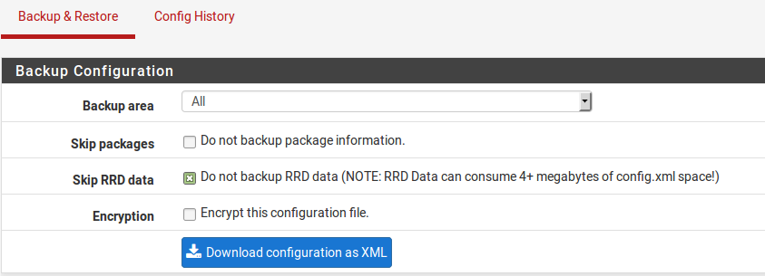
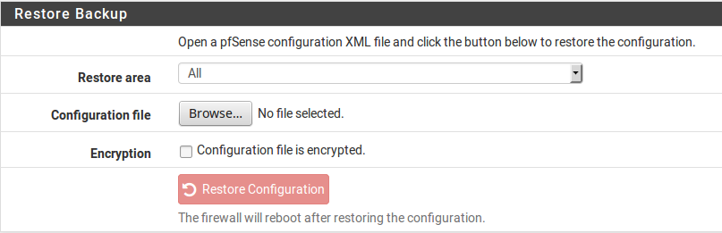
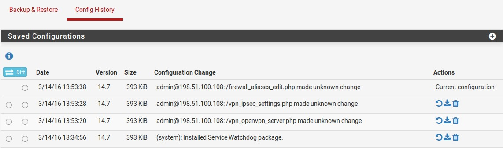

*******************
Backup e ripristino
*******************

Effettuare il backup dalla WebGUI
'''''''''''''''''''''''''''''''''

Fare un backup dalla WebGUI è semplice.

-  Accedere a **Diagnostica>Backup e ripristino**

-  Impostare l’\ **area di backup** su *TUTTI* (la scelta di default)

-  Impostare le opzioni desiderate, come ad esempio **Ignorare RRD** e
   **Crittografia**

-  Fare clic su **Scaricare la configurazione in formato XML** (Figura
   *WebGUI di riserva*).

|image0|

Fig. 1: Backup dalla WebGUI

Il browser web chiederà quindi di salvare il file da qualche parte sul
PC utilizzato per visualizzare la WebGUI. Sarà chiamato
config-hostname>-timestamp>.xml, ma che può essere cambiato prima di
salvare il file.

Usare il pacchetto per il Backup di configurazione automatica (AutoConfigBackup)
''''''''''''''''''''''''''''''''''''''''''''''''''''''''''''''''''''''''''''''''

La informazioni più aggiornate su AutoConfigBackup si possono trovare sulla pagina di documentazione di |firew4ll| sul pacchetto AutoConfigBackup

Funzionalità e vantaggi
=======================

Quando un cambiamento nella configurazione del firewall è fatto, viene crittografato automaticamente con la passphrase immesso nella configurazione del pacchetto e caricato su HTTPS ai server AutoConfigBackup. Solo configurazioni criptate vengono conservate sui server AutoConfigBackup. Questo dà un istantaneo, sicuro backup off-site dei file di configurazione del firewall senza alcun intervento da parte dell'utente una volta che il pacchetto è configurato.

Compatibilità con la versione di|firew4ll|
==========================================

Il pacchetto AutoConfigBackup funziona con tutte le versioni supportate di |firew4ll|

Installazione e configurazione
==============================

Per installare il pacchetto:

-  Passare a **Sistema>Gestione pacchetto**, scheda **Pacchetti
   disponibili**

-  Individuare **AutoConfigBackup** nella lista

-  Fare clic su **Installare** alla fine della voce AutoConfigBackup

-  Cliccare **Confermare** per confermare l'installazione

Il firewall quindi scarica e installa il pacchetto. Una volta installato, il pacchetto può essere trovato nel menu sotto Diagnostica> AutoConfigBackup

Impostare hostname
------------------

Assicurarsi di configurare un nome host unico e un dominio su
**Sistema>Impostazioni generali**. Le voci di configurazione in
AutoConfigBackup sono memorizzate da FQDN (Nome di dominio pienamente 
qualificato + dominio, ad esempio nome host + dominio), quindi ogni
firewall sottoposto a backup deve avere un FQDN unico, altrimenti il
sistema non può distinguere tra più installazioni.

Configurare AutoConfigBackup
----------------------------

Il pacchetto è configurato in **Diagnostica> AutoConfigBackup**. Nella
scheda **Impostazioni**, compilare le impostazioni come segue:

    **Nome utente dell’abbonamento** Il nome utente per l’account
    dell’abbonamento di |firew4ll|

    **Password/Conferma dell’abbonamento** La password per l’account
    dell’abbonamento di |firew4ll|

    **Password/Conferma con crittografia** Una passphrase arbitraria
    usata per crittografare la configurazione prima del caricamento.
    Questa dovrebbe essere una password lunga e complessa per garantire
    la sicurezza della configurazione. I server AutoConfigBackup
    contengono solo copie criptate, che sono inutili senza questa
    p\ **assword di crittografia**

	.. warning::
		E’ importante che la password di crittografia sia ricordata o salvata in modo sicuro al di fuori del firewall. Senza la password di crittografia, il file di configurazione non può essere recuperato e la password di crittografia non viene memorizzata sul server al di fuori del file di configurazione.

Testare le funzionalità di backup
---------------------------------

Effettuare una modifica per forzare un backup di configurazione, come
modificare e salvare un firewall o una regola NAT, quindi fare clic su
**Applicare modifiche**. Visitare **Diagnostica>AutoConfigBackup**,
scheda **Ripristinare**, che elencherà i backup disponibili con la
pagina che ha fatto la modifica (se disponibile)..

Effettuare il backup manuale
----------------------------

I backup manuali dovrebbero essere effettuati prima di un aggiornamento
o di una serie di modifiche significative, in quanto memorizza un backup
specificamente, mostrando il motivo, che rende quindi facile da
ripristinare, se necessario. Dal momento che ogni modifica di
configurazione innesca un nuovo backup, quando una serie di modifiche è
fatto, può essere difficile sapere dove il processo è iniziato.

Per forzare un backup manuale della configurazione:

-  Accedere a **Diagnostica> AutoConfigBackup**

-  Fare clic sulla scheda **Effettuare il backup ora** nella parte
   superiore

-  Inserire un **Motivo del backup**

-  Fare clic su **Backup**

Ripristino di una configurazione
--------------------------------

Per ripristinare una configurazione:

-  Accedere a **Diagnostica> AutoConfigBackup**

-  Fare clic sulla scheda **Ripristinare** in alto

-  Individuare il backup desiderato nella lista

-  Cliccare su |image1| a destra della riga di configurazione

Il firewall scaricherà la configurazione specificata dal server
AutoConfigBackup, la decripterà con la **password di criptazione** e la
ripristinerà.

Per default, il pacchetto **non** avvierà un riavvio. A seconda degli
elementi di configurazione ripristinati, un riavvio potrebbe non essere
necessario. Ad esempio, il firewall e le regole NAT vengono ricaricati
automaticamente dopo il ripristino di una configurazione. Dopo il
ripristino, all'utente viene chiesto se desidera riavviare. Se la
configurazione ripristinata cambia qualcosa delle regole NAT e firewall,
scegliere **Sì** e permettere al firewall di riavviare.

Ripristino Bare Metal
=====================

Se il disco nel firewall fallisce, da subito la seguente procedura è
necessaria per il recupero in una nuova installazione.

-  Sostituire il disco guasto

-  Installare |firew4ll| sul nuovo disco

-  Configurazione della LAN e della WAN, e assegnare il nome host e il
   dominio esattamente come precedentemente configurato

-  Installare il pacchetto **AutoConfigBackup**

-  Configurare il pacchetto AutoConfigBackup come descritto sopra,
   utilizzando lo stesso account del portale e la stessa **password di
   crittografia** precedentemente utilizzata.

-  Visitare la scheda **Ripristino**

-  Scegliere la configurazione da ripristinare

-  Quando viene richiesto di riavviare il sistema dopo il ripristino,
   farlo

Una volta che il firewall è stato riavviato, si sarà in esecuzione con
la configurazione di backup prima del fallimento.

Controllo dello stato di AutoConfigBackup
=========================================

Lo stato di un AutoConfigBackup eseguito può essere controllato
rivedendo l'elenco dei backup mostrati nella scheda **Ripristino**.
Questa lista è estratta dai server AutoConfigBackup. Se il backup è
elencato lì, è stato creato con successo.

Se un backup non riesce, un avviso viene registrato, e sarà visibile
nella WebGUI.

Tecniche alternative di backup remoto
'''''''''''''''''''''''''''''''''''''

Le seguenti tecniche possono anche essere utilizzate per eseguire backup
a distanza, ma ogni metodo ha le sue caratteristiche di sicurezza che
possono escludere il loro uso in molti luoghi. Per cominciare, queste
tecniche non crittografano la configurazione, che può contenere
informazioni sensibili. Ciò può comportare la trasmissione della
configurazione su un collegamento non cifrato e non attendibile. Se si
deve usare una di queste tecniche, è meglio farlo da un collegamento non
WAN (LAN, DMZ, ecc.) o attraverso una VPN. L'accesso al supporto di
memoria che contiene il backup deve essere controllato, se non criptato.
Il pacchetto AutoConfigBackup è un mezzo molto più semplice e sicuro per
automatizzare i backup remoti.

Recupero con wget
=================

La configurazione può essere recuperata da un sistema remoto utilizzando wget , e questo processo può essere script con cron o con altri mezzi. Anche quando si utilizza HTTPS, questo non è un trasporto veramente sicuro in quanto il controllo del certificato è disabilitato per ospitare certificati auto-firmati, consentendo attacchi man-in-the-middle. Quando si eseguono backup con wget   attraverso reti non affidabili, utilizzare HTTPS con un certificato che può essere verificato da wget.

Su |firew4ll| il comando wget deve essere suddiviso in più passaggi per gestire la procedura di login e il download del backup, tenendo conto anche della verifica CSRF. 
   
Per un firewall con HTTPS con certificato auto-firmato, il comando sarebbe il seguente:

-  Inviare il modulo di login insieme al primo CSRF token e Salva il
   secondo CSRF token::

		$ wget -qO- --keep-session-cookies --save-cookies cookies.txt \
		--no-check-certificate https://192.168.1.1/diag_backup.php \
		| grep "name=' csrf_magic'" | sed 's/.*value="\(.*\)".*/\1/' > csrf.txt

-  Inviare il modulo di accesso con il primo token CSRF e salvare il
   secondo token CSRF:
	::
		$ wget -qO- --keep-session-cookies --load-cookies cookies.txt \
		--save-cookies cookies.txt --no-check-certificate \
		--post-data "login=Login&usernamefld=admin&passwordfld=firew4ll& csrf_magic=$(cat csrf.txt)" \
		https://192.168.1.1/diag_backup.php	| grep "name=' csrf_magic'" \
		| sed 's/.*value="\(.*\)".*/\1/' > csrf2.txt

-  Ora lo script è collegato e può agire. Inviare il modulo di download
   insieme al secondo token CSRF per salvare una copia di config.xml::
		
		$ wget --keep-session-cookies --load-cookies cookies.txt --no-check-certificate \
		--post-data "Submit=download&donotbackuprrd=yes& csrf_magic=$(head -n 1 csrf2.txt)" \
		https://192.168.1.1/diag_backup.php -O config-hostname-`date +%Y%m%d%H%M%S`.xml

Sostituire il nome utente e la password con le credenziali per il
firewall, l'indirizzo IP può essere qualsiasi indirizzo IP è
raggiungibile dal sistema di backup, e utilizzare HTTP o HTTPS per
abbinare la GUI del firewall. Per il backup dei file RRD, omettere il
parametro &donotbackuprrd=yes dall'ultimo comando.

Il sistema che esegue il backup avrà anche bisogno di accedere alla
WebGUI, in modo da regolare le regole del firewall di conseguenza. Si
sconsiglia di eseguire questa operazione sulla WAN. Come minimo,
utilizzare HTTPS e limitare l'accesso alla WebGUI a un gruppo di
indirizzi IP pubblici fidati. È preferibile farlo localmente o su una
VPN.

"Spingere" con SCP
==================

Il file di configurazione può anche essere spinto dal firewall |firew4ll|
ad un altro sistema UNIX con scp. Utilizzare scp per spingere un backup
a mano una sola volta può essere utile, ma l'utilizzo in modo
automatizzato comporta alcuni rischi. La riga di comando per scp varierà
a seconda della configurazione del sistema, ma sarà simile alla
seguente::

	# scp /cf/conf/config.xml \
	user@backuphost:backups/config-`hostname`-`date +%Y%m%d%H%M%S`.xml

Per spingere la configurazione in modo automatizzato, generare una
chiave SSH senza una passphrase. A causa della natura insicura di una
chiave senza una passphrase, generare una tale chiave viene lasciato
come esercizio per il lettore. Questo aggiunge il rischio dovuto al
fatto che chiunque abbia accesso a quel file ha accesso al conto
designato, anche se, benché la chiave sia mantenuta sul firewall dove
l'accesso è limitato, non è un rischio considerevole nella maggior parte
degli scenari. Se questo viene fatto, assicurarsi che l'utente remoto
sia isolato e abbia pochi o alcun privilegio sul sistema di
destinazione.

Un ambiente chrooted scp può essere auspicabile in questo caso. La shell
scponly è disponibile per la maggior parte delle piattaforme UNIX che
permettono le copie di file SCP ma negano le funzionalità di login
interattivo. Alcune versioni di OpenSSH hanno il supporto chroot per
sftp (FTP Sicuro). Questi passaggi limitano notevolmente il rischio di
compromissione rispetto al server remoto, ma lasciano comunque i dati di
backup a rischio. Una volta configurato l'accesso, si può aggiungere una
voce cron al sistema |firew4ll| per richiamare scp. Per maggiori dettagli
visitare la pagina Wiki della Documentazione |firew4ll| o cercare sui
forum.

Backup di base SSH
==================

Simile al backup s\ **cp**, c'è un altro metodo che funzionerà da un
sistema UNIX ad un altro. Questo metodo non invoca il livello SCP/SFTP,
che in alcuni casi potrebbe non funzionare correttamente se un sistema è
già in uno stato di fallimento:

	``$ ssh root@192.168.1.1 cat /cf/conf/config.xml > backup.xml``

Una volta eseguito, questo comando produrrà un file chiamato backup.xml
nella directory di lavoro corrente che contiene la configurazione del
firewall remoto di |firew4ll|. È anche possibile automatizzare questo
metodo usando cron, ma questo metodo richiede una chiave SSH senza
passphrase sull'host che esegue il backup. Questa chiave abilita
l'accesso amministrativo al firewall, quindi deve essere strettamente
controllata. (Vedere *Shell sicura (SSH)* per i dettagli).

Ripristino da backup
''''''''''''''''''''

I backup non sono utili senza un mezzo per ripristinarli e, per
estensione, per testarli. |firew4ll| offre diversi mezzi per ripristinare
le configurazioni. Alcuni sono più complessi di altri, ma ognuno avrà lo
stesso risultato finale: un sistema in esecuzione identico a quando il
backup è stato fatto.

Ripristino con la WebGUI
========================

Il modo più semplice per la maggior parte degli utenti per ripristinare
una configurazione è quello di utilizzare la WebGI:

-  Accedere a **Diagnostica>Backup e ripristino**

-  Individuare la sezione di **Ripristinare configurazione** (Figura
   *Ripristino con la WebGUI*).

-  Selezionare la zona da ripristinare (tipicamente *TUTTI*)

-  Fare clic su Sfogliare

-  Individuare il file di backup sul PC locale

-  Fare clic su **Ripristinare configurazione**

La configurazione sarà applicata, e il firewall verrà riavviato con le
impostazioni ottenute dal file di backup.

|image2|

Fig. 2: Ripristino con la WebGUI

Sebbene sia facile da applicare, questo metodo ha bisogno di alcuni
prerequisiti quando si tratta di un ripristino completo di un nuovo
sistema. In primo luogo, dovrebbe essere fatto dopo che il nuovo sistema
di destinazione è completamente installato e in esecuzione. In secondo
luogo, richiede un PC aggiuntivo collegato a una rete di lavoro o un
cavo di crossover dietro il firewall |firew4ll| in fase di ripristino.

Ripristino dalla cronologia di configurazione
=============================================

Per problemi minori, usare uno dei backup interni del firewall |firew4ll| è
il modo più semplice per annullare un cambiamento. Su installazioni
complete, le 30 configurazioni precedenti vengono memorizzate nella
cronologia di configurazione, insieme alla configurazione corrente. Su
NanoBSD sono memorizzate 5 configurazioni. Ogni riga mostra la data di
creazione del file di configurazione, la versione di configurazione,
l'utente e l'indirizzo IP di una persona che ha apportato una modifica
alla GUI, la pagina che ha apportato la modifica e, in alcuni casi, una
breve descrizione della modifica apportata. I pulsanti di azione a
destra di ogni riga mostreranno una descrizione di ciò che fanno quando
il puntatore del mouse è posizionato sopra il pulsante.

Per ripristinare una configurazione dalla cronologia:

-  Accedere a **Diagnostica>Backup e ripristino**

-  Fare clic sulla scheda **Cronologia di configurazione** (Figura
   *Cronologia di configurazione*).

-  Individuare il backup desiderato nella lista

-  Cliccare su |image3| per ripristinare quel file di configurazione

La configurazione verrà ripristinata, ma il riavvio non è automatico
dove richiesto. Modifiche minori non richiedono un riavvio, anche il
ripristino di alcuni grandi cambiamenti lo vorrà.

Se una modifica è stata fatta solo in una sezione specifica, come le
regole del firewall, attivare un aggiornamento in quell'area della GUI
per abilitare le modifiche. Per le regole del firewall, sarebbe
sufficiente ricaricare il filtro. Per OpenVPN, sarebbe sufficiente
modificare e salvare l'istanza VPN. Le azioni necessarie da prendere
dipendono da ciò che è cambiato nella configurazione, ma il modo
migliore per garantire che la configurazione completa si attivi sarebbe
un riavvio. Se necessario, riavviare il firewall con la nuova
configurazione andando a **Diagnostics>Riavviare Sistema** e fare clic
su **Sì**.

Le configurazioni precedentemente salvate possono essere cancellate
facendo clic sull’icona\ |image4|, ma non cancellandole a mano per
risparmiare spazio; i vecchi backup di configurazione vengono eliminati
automaticamente quando ne vengono creati di nuovi. E’ auspicabile
rimuovere un backup da modifiche di configurazione cattive-conosciute
per garantire che non venga ripristinato accidentalmente.

Una copia della configurazione precedente può essere scaricata cliccando
su |image5|.

|image6|

Fig. 3: Cronologia di configurazione

Impostazioni della cronologia di configurazione
-----------------------------------------------

La quantità di backup memorizzati nella cronologia di configurazione può
essere modificata se necessario.

-  Accedere a **Diagnostica>Backup & Ripristino**

-  Fare clic sulla scheda **Cronologia di configurazione**

-  Cliccare su |image7| alla destra della barra delle **Configurazioni
   salvate** per espandere le impostazioni.

-  Inserire il nuovo numero di configurazioni da trattenere

-  Fare clic su **Salvare**

Insieme con la quantità di configurazioni, viene visualizzata anche la
quantità di spazio occupato dai backup correnti.

Differenza della cronologia di configurazione
---------------------------------------------

Le differenze tra due file di configurazione possono essere visualizzate
nella scheda **Cronologia di configurazione**. A sinistra dell'elenco
dei file di configurazione ci sono due colonne di pulsanti radio.
Utilizzare la colonna a sinistra per selezionare il più vecchio dei due
file di configurazione, e quindi utilizzare la colonna a destra per
selezionare il più recente dei due file. Una volta che entrambi i file
sono stati selezionati, fare clic su **Differenza** nella parte
superiore o inferiore della colonna.

Cronologia di configurazione nella console
------------------------------------------

La cronologia di configurazione è disponibile anche dal menu della
console, come opzione di 15, R\ **ipristino della configurazione
recente**. La selezione di menu elencherà i file di configurazione
recenti e consentirà loro di essere ripristinati. Questo è utile se una
recente modifica ha bloccato gli amministratori dalla GUI o preso il
sistema fuori dalla rete.

Ripristino per il montaggio del disco
=====================================

Questo metodo è popolare tra gli utenti incorporati. Quando il CF o il
disco dal firewall |firew4ll| è collegato ad un computer che usa FreeBSD,
l'unità può essere montata e una nuova configurazione può essere copiata
direttamente sul sistema installato, o una configurazione da un sistema
guasto può essere copiata al di fuori.

.. note:: 
	Questo può essere eseguito anche su un firewall |firew4ll| separato al posto di un computer che usa FreeBSD, ma non usare un firewall di produzione attiva per questo scopo. Usate invece un firewall di riserva o di test..

Il file config.xml è conservato in /cf/conf/ sia per NanoBSD che per
installazioni complete, ma la differenza sta nella posizione in cui si
trova questa directory. Per le installazioni di NanoBSD, questo è su una
porzione separata, come ad0s3 se il drive è ad0. Grazie alle etichette
GEOM (struttura modulare di stoccaggio) sulle versioni recenti di
FreeBSD e in uso sui filesystem incorporati basati su NanoBSD, questa
porzione può anche essere accessibile indipendentemente dal nome del
dispositivo usando l'etichetta /dev/ufs/cf. Per installazioni complete,
è parte della porzione di root (in genere ad0s1a). I nomi delle unità
variano a seconda del tipo e della posizione nel sistema.

Esempio di NanoBSD
------------------

In primo luogo, collegare il CF ad un lettore di schede USB su un
sistema FreeBSD o un altro sistema |firew4ll| inattivo (vedere la nota
nella sezione precedente). Per la maggior parte, apparirà come da0.
Verranno stampati anche i messaggi della console che riflettono il nome
del dispositivo e le nuove etichette GEOM disponibili.

``# mount -t ufs /def/ufs/cf /mnt``

Ora montare la partizione di configurazione::

	# cp /usr/backups/firew4ll/config-alix.example.com-20090606185703.xml \
	/mnt/conf/config.xml

Se per qualche motivo le etichette GEOM non sono utilizzabili, usare il
dispositivo direttamente come /dev/da0s3.

Ora, copiare una configurazione sulla scheda:

Quindi essere sicuri di smontare la partizione di configurazione:

Staccare la scheda, reinserirla nel firewall, e riaccendere. Il firewall
sarà ora in esecuzione con la configurazione precedente.

Per copiare la configurazione dalla scheda, il processo è lo stesso ma
gli argomenti al comando cp sono invertiti.

Backup di file e directory con il pacchetto di backup
'''''''''''''''''''''''''''''''''''''''''''''''''''''

Il pacchetto di Backup consente di eseguire il backup e il ripristino di
qualsiasi gruppo di file/cartelle del sistema. Per la maggior parte,
questo non è necessario, ma può essere utile per il backup dei dati RRD
o per i pacchetti che possono avere file personalizzati che non sono
conservati in config.xml.

Per installare il pacchetto:

-  Navigare fino a **Sistema> Pacchetti**

-  Individuare **Backup** nella lista

-  Fare clic su **Installare**, alla fine della sua voce

-  Cliccare su **Confermare** per avviare l'installazione

Una volta installato, il pacchetto è disponibile su **Diagnostica>File
di Backup/Directory**. È abbastanza semplice da usare, come mostrato nel
seguente esempio.

Backup dei dati RRD
===================

Usare questo pacchetto di Backup è abbastanza facile per fare il backup
dei dati di grafico RRD fuori dal metodo config.xml.

Vedere anche:
~~~~~~~~~~~~~

*Monitoraggio Grafici*

-  Accedere a **Diagnostica> File di backup/Directory**

-  Fare clic su **Aggiungere** per aggiungere una nuova posizione per il
   set di backup

-  Inserire file RRD nel campo Nome

-  Inserire /var/db/rrd nel campo **Percorso**

-  Impostare **Abiltato** su *Vero*

-  Inserire file di dati dei grafici RRD nella **Descrizione**

-  Fare clic su **Salvare**

-  Fare clic sul pulsante **Backup** per scaricare l'archivio di backup,
   che contiene i file e le directory configurati per il set di backup.

-  Salvare il file in un luogo sicuro e prendere in considerazione di
   mantenere copie multiple, se i dati sono importanti.

Ripristino dei dati RRD
==================

   -  Accedere a **Diagnostica>File di backup/Directory**

   -  Fare clic su **Sfogliare**

   -  Individuare e selezionare il file di archivio di backup
      precedentemente scaricato

   -  Fare clic su **Caricare** per ripristinare i file

Per questo esempio, poiché i file RRD vengono toccati solo una volta
aggiornati ogni 60 secondi, non è necessario riavviare o riavviare i
servizi una volta che i file vengono ripristinati.

Avvertenze e trucchi
''''''''''''''''''''

Mentre il file XML di configurazione tenuto da |firew4ll| include tutte le
impostazioni, non include le modifiche che possono essere state
apportate manualmente al sistema, come le modifiche manuali del codice
sorgente. Inoltre alcuni pacchetti richiedono metodi di backup
aggiuntivi per i loro dati.

Il file di configurazione può contenere informazioni sensibili come
chiavi o certificati VPN e password (diverse dalla password di
amministrazione) in testo semplice in alcuni casi. Alcune password
devono essere disponibili in testo semplice durante il tempo di
esecuzione, rendendo sicuro l’hashing di quelle password impossibili.
Qualsiasi offuscamento sarebbe banale da invertire per chiunque con
accesso al codice sorgente cioé tutti. In m0n0wall è stata presa una
decisione consapevole di progettazione, che è proseguita in |firew4ll|, di
lasciare le password in modo chiaro per rendere estremamente chiaro che
il file contiene contenuti sensibili e deve essere protetto come tale.
Quindi copie di backup di questi file devono anche essere protette in
qualche modo. Se sono memorizzate su supporti rimovibili, fare
attenzione con la sicurezza fisica di tale supporto e/o crittografare
l'unità.

Se la WebGUI deve essere usata sulla WAN senza una connessione VPN, o
almeno usare HTTPS. In caso contrario, un backup viene trasmesso in
chiaro, comprese le informazioni sensibili all'interno del file di
backup. Si consiglia vivamente di utilizzare una rete di fiducia o una
connessione crittografata.

Grazie al file di configurazione basato su XML utilizzato da |firew4ll|, i
backup sono una passeggiata. Tutte le impostazioni per il sistema sono
contenute in un unico file (vedere *File di configurazione XML di
|firew4ll|*). Nella stragrande maggioranza dei casi, questo file può essere
utilizzato per ripristinare un sistema ad uno stato completamente
funzionante identico a quello che era in esecuzione in precedenza. Non
c'è bisogno di fare un intero backup del sistema, perché i file di
sistema di base non vengono modificati da un normale, in esecuzione,
sistema.

.. note:: 
	In rari casi, i pacchetti possono memorizzare file al di fuori di config.xml, controllare la documentazione del pacchetto per ulteriori informazioni e suggerimenti di backup.

Strategie di backup
'''''''''''''''''''

La migliore pratica è quella di fare un backup dopo ogni piccolo
cambiamento, e sia prima e dopo ogni grande cambiamento o serie di
modifiche. In genere, un backup iniziale viene preso nel caso in cui la
modifica che è stata effettuata abbia effetti indesiderati. Dopo aver
valutato il cambiamento e aver ottenuto il risultato desiderato, si
effettua un backup post-evento. I backup periodici sono anche utili,
indipendentemente dalle modifiche, soprattutto nei casi in cui un backup
manuale può essere mancato per un motivo o l'altro.

|firew4ll| effettua un backup interno ad ogni modifica, e si consiglia di
scaricare anche un backup manuale. I backup automatici effettuati su
ogni modifica sono utili per tornare a configurazioni precedenti dopo
che le modifiche si sono dimostrate dannose, ma non sono buone per il
ripristino d’emergenza perché sono sul sistema stesso e non mantenute
esternamente. Poiché si tratta di un processo abbastanza semplice e
indolore, gli amministratori dovrebbero prendere l'abitudine di
scaricare un backup di tanto in tanto e tenerlo in un luogo sicuro. Se è
disponibile un abbonamento |firew4ll| Gold, i backup possono essere gestiti
facilmente e automaticamente utilizzando il pacchetto
**AutoConfigBackup**.

Se sono state apportate modifiche ai file di sistema, come patch
personalizzate o modifiche del codice, tali modifiche devono essere
sottoposte a backup manuale o con il pacchetto di backup descritto in
*file di backup e directory con il pacchetto di backup*, in quanto non
saranno sottoposti a backup o ripristinati dal sistema di backup
incorporato. Questo include modifiche ai file di sistema menzionati
altrove nel libro, come /boot/device.hints, /boot/loader.conf.local, e
altri.

.. note:: 
	Le patch personalizzate dovrebbero essere gestite utilizzando il pacchetto **Patch di sistema**, che viene eseguito con config.xml,	piuttosto che salvare manualmente i file patchati.

Oltre a fare i backup, i **backup devono essere testati**. Prima di
mettere un sistema in produzione, fare il backup della configurazione,
pulire il disco, e quindi tentare alcune delle diverse tecniche di
restauro in questo capitolo. Si consiglia inoltre di testare
periodicamente i backup su una macchina non di produzione o su una
macchina virtuale. L'unica cosa peggiore di un backup mancante è un
backup inutilizzabile!

I dati del grafico RRD possono essere conservati opzionalmente nel
backup del file di configurazione XML. Questo comportamento è
disabilitato per impostazione predefinita a causa della dimensione
risultante del file di backup. Ci sono anche altri modi per garantire
che questi dati vengano salvati in modo sicuro. Vedere *File di backup e
directory con il pacchetto di backup* più avanti in questo capitolo.

.. |image4| image:: media/image4.png
   :width: 0.26389in
   :height: 0.26389in

.. |image7| image:: media/image7.png
   :width: 0.26389in
   :height: 0.26389in
