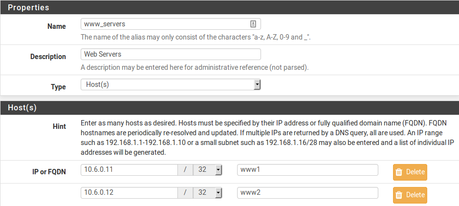

********************************
Bilanciamento del carico di rete
********************************

Configurazione
''''''''''''''

Pool
====

Per configurare i pool:

-  Passare a **Servizi>Bilanciamento del carico**
-  Fare clic sulla scheda **Pool**
-  Fare clic su |image0| **Aggiungere** per aggiungere un nuovo pool
-  Configurare le opzioni del pool come spiegato di seguito:

    **Nome** Un nome per il pool. Il nome è il modo per fare riferimento
    al pool durante la configurazione del virtual server che utilizzerà
    questo pool. Questo nome deve rispettare gli stessi limiti di un
    alias o di un nome di interfaccia. Solo lettere e numeri, l'unico
    separatore consentito è il trattino basso. .. Nota:: questo nome non
    può essere lo stesso di un alias esistente.

    **Modalità** Selezionare *bilanciamento del carico* per bilanciare
    il carico tra tutti i server del pool o *Failover manuale* per
    utilizzare sempre i server nell'elenco abilitato e poterli spostare
    manualmente tra lo stato abilitato e disabilitato.

    **Descrizione** Una descrizione più lunga opzionale per il pool.

    **Porta** Questa è la porta su cui i server sono in ascolto
    internamente. Questa può essere diversa dalla porta esterna, che
    viene definita in seguito nella configurazione del virtual server.
    Un alias può anche essere utilizzato per definire più porte,
    tuttavia, se viene utilizzato un alias, bisogna utilizzare lo stesso
    alias della porta qui e nella configurazione del virtual server.

    **Riprovare** Questo definisce il numero di volte in cui un server
    verrà contattato dal monitor prima di essere dichiarato inattivo.

    **Monitorare** Questo definisce il tipo di monitoraggio da
    utilizzare, che è il modo in cui il bilanciamento del carico
    determina se i server sono attivi e utilizzabili. Selezionando
    *TCP*, il bilanciatore si connette alla porta precedentemente
    definita in **Porta** e, se non è in grado di connettersi a tale
    porta, il server viene considerato inattivo. Scegliendo *ICMP* farà
    in modo che si monitorino i server definiti con l'invio di un ping
    ICMP, e li segnerà down se non rispondono. Ci sono molti altri tipi
    di monitoraggio e possono essere personalizzati. Essi sono trattati
    in modo più dettagliato più avanti nel capitolo.

    **Indirizzo IP del server** E’ dove sono elencati gli indirizzi IP
    interni dei server nel pool. Inseriscili uno alla volta, facendo
    clic su **Aggiungere al pool** in seguito.

    **Membri del pool corrente** Questo campo mostra l'elenco dei server
    in questo pool. Un server può essere rimosso dal pool facendo clic
    sul suo indirizzo IP e quindi facendo clic su **Rimuovere**. Ci sono
    due liste in questa sezione, **Pool disabilitati** e **Abilitato
    (predefinito)**. I server nell'elenco **Abilitato (predefinito)**
    sono attivi e utilizzati, i server nell'elenco dei **Pool
    disabilitati** non vengono mai utilizzati. L'elenco del **Pool
    disabilitati** viene utilizzato principalmente con la modalità di
    *Failover manuale*. I server possono essere spostati tra gli elenchi
    selezionandoli e facendo clic su |image1| o |image2| .

-  Fare click su **Salvare**

Se è necessario un failover automatico, creare un secondo pool da
utilizzare come Pool di fall-back, contenente il set di backup degli
indirizzi IP del server.

Virtual Server
==============

Configurare un virtual server per gestire le connessioni client:

-  Passare a **Servizi>Bilanciamento del carico**

-  Fare clic sulla scheda **Server virtuali**

-  Fare clic su |image3| Aggiungere per aggiungere un nuovo Server
   virtuale

-  Configurare le opzioni del virtual server come spiegato di seguito:

    **Nome** Nome del virtual server. Questo è per riferimento, ma deve
    anche rispettare gli stessi limiti di un alias o nome
    dell'interfaccia. Solo lettere e numeri, l'unico separatore
    consentito è un trattino basso. Non ci sono spazi o barre.

    **Descrizione** Una descrizione più lunga opzionale per il server
    virtuale. Il suo solo a scopo è di essere un riferimento e non ha
    limiti di formattazione.

    **Indirizzo IP** Dove gli indirizzi IP vengono inseriti per
    l'utilizzo da parte del virtual server. È di solito l'indirizzo IP
    della WAN o un indirizzo IP virtuale della WAN. Deve essere un
    indirizzo IP statico. Un VIP del CARP può essere utilizzata anche
    per una configurazione ad elevata disponibilità. Per ulteriori
    informazioni sull’elevata disponibilità e il VIP del CARP, fare
    riferimento a *Elevata disponibilità*. È possibile utilizzare un VIP
    Alias IP o un proxy dell’ARP del VIP (solo modalità TCP). Inoltre,
    un Alias può anche essere utilizzato qui per specificare più
    indirizzi IP su cui questo virtual server può accettare
    connessioni.

	.. note:: 
		in modalità TCP, gli indirizzi IP qui specificati non sono associati a livello del sistema operativo, il che significa che relayd come demone non è associato e in ascolto direttamente su queste porte.

**Porta** Questa è la porta su cui il virtual server accetterà le
connessioni. Può essere diversa dalla porta utilizzata internamente dai
server del pool. Un alias può essere utilizzato per definire più porte,
tuttavia, se lo stesso alias di porta deve essere utilizzato qui e nella
configurazione del Pool.

**Pool del virtual server** Dove viene selezionato il pool configurato
in precedenza. Le connessioni all'indirizzo IP e alla porta definite in
questa schermata verranno indirizzate agli indirizzi IP e alle porte
configurate nel pool.

**Pool di fall-back** Pool alternativo a cui i client sono indirizzati
se tutti i server nel pool primario sono inattivi. Se non esiste un
server alternativo, lasciare questo impostato su *Nessuno*, anche se il
risultato sarà l’inaccessibilità se tutti i server nel pool sono
inattivi. Se non altro, per evitare che il server sia completamente
inattivo, impostare un semplice server web per restituire una pagina di
manutenzione di base per qualsiasi richiesta e utilizzarla come pool di
fall-back.

**Protocollo di relay** Il protocollo di relay può essere *TCP* o *DNS*,
a seconda di cosa farà questo relay.

-  In modalità *TCP*, relayd agisce come una porta forward avanzata,
   dirigendo le connessioni come se stessero colpendo una regola NAT
   tradizionale. I server vedranno l'indirizzo IP di sorgente originale
   del client, non agisce come un proxy.

-  In modalità *DNS*, relayd agisce come un proxy DNS. Bilancerà il
   carico su più server DNS, ma l'indirizzo IP del client originale
   viene perso. I server Pool vedranno il firewall come sorgente della
   richiesta del DNS. Tenetelo a mente quando si impostano viste o
   restrizioni di query basate sulla sorgente dei server DNS coinvolti
   nel bilanciamento del carico.

   -  Fare click su **Presentare**

   -  Fare click su **Applicare le modifiche**

.. warning::
	se tutti i membri del Pool di virtual serveri e i membri del pool di fall-back sono inattivi, relayd agirà come se il bilanciamento del carico non gestisse le connessioni per l'indirizzo IP e la porta del virtual server. Se l'indirizzo IP e la porta utilizzati sono utilizzati anche da un altro servizio o regola NAT, potrebbe essere accidentalmente esposto ai client.      
	
Monitoraggi
===========

Esistono cinque tipi di Monitor predefiniti di base: ICMP, TCP, HTTP,
HTTPS e SMTP. Ulteriori tipi personalizzati possono essere aggiunti per
rilevare meglio specifici tipi di guasti.

Monitoraggi predefiniti
-----------------------

I monitoraggi predefiniti sono inclusi nella configurazione predefinita
e sono:

    **ICMP** Invia una richiesta ICMP echo al server di destinazione e
    si aspetta una risposta ICMP echo.

    **TCP** Tenta di aprire una connessione per la porta TCP
    all'indirizzo IP e per la porta di destinazione. Se la porta può
    essere aperta (un handshake TCP a 3 vie), allora riesce, se la
    connessione viene rifiutata o scade, fallisce.

    **HTTP & HTTPS** Tenta di aprire una connessione al server e di
    richiedere l’URL / utilizzando HTTP o HTTPS, a seconda di quale sia
    selezionato. Se viene restituito un codice di risposta come 200, è
    OK. Altrimenti, si considera un fallimento.

    **SMTP** Apre una connessione alla porta definita e invia la stringa
    EHLO nosuchhost. Se il server risponde con qualsiasi messaggio che
    inizia con 250 -, è considerato OK. Altre risposte sono considerate
    un fallimento.

Creazione di monitoraggi personalizzati
---------------------------------------

I monitoraggi inclusi non sono sufficienti per le esigenze di un sito, o
hanno bisogno di un aggiustamento, quindi i monitoraggi personalizzati
possono essere creati. La maggior parte dei tipi di monitoraggio ha le
proprie impostazioni specifiche che possono essere personalizzate
secondo necessità.

Per creare un nuovo monitoraggio: **•** Passare a
**Servizi>Bilanciamento del carico** **•** Fare clic sulla scheda
**Monitoraggio** **•** Fare clic su |image4| **Aggiungere** per
aggiungere un nuovo Monitoraggio **•** Configurare le opzioni del
Monitoraggio come spiegato di seguito:

    **Nome** Nome del monitoraggio. Serve da riferimento, ma deve anche
    rispettare gli stessi limiti di un alias o nome dell'interfaccia.
    Solo lettere e numeri, l'unico separatore consentito è un trattino
    basso. Non ci sono spazi o barre.

    **Descrizione** Una descrizione più lunga opzionale per il
    monitoraggio. Questo è solo a scopo di riferimento e non ha limiti
    di formattazione.

    Le opzioni rimanenti variano in base al tipo selezionato.

    **ICMP e TCP** Senza opzioni extra. Qualsiasi monitoraggio
    personalizzato che utilizza questi tipi si comporterà in maniera
    identica al monitoraggio predefinito con lo stesso nome.

    **HTTP e HTTPS** Questi si comportano in modo identico l'uno
    all'altro, l'unica differenza è se la crittografia viene utilizzata
    o meno per parlare con il server di destinazione. Ognuno di questi
    ha tre opzioni per controllare il comportamento del monitoraggio:

    **Percorso** Il percorso definisce la sezione del percorso dell'URL
    inviato al server. Se il sito ha contenuti per lo più dinamici, o
    l'URL di base fa un reindirizzamento, è meglio impostare questo su
    un percorso completo con un pezzo statico di contenuto, come
    un'immagine, che è improbabile che si muova o cambi.

    **Host** Se il server esegue più host virtuali, questo campo
    definisce quale nome host viene inviato con la richiesta in modo che
    la risposta prevista possa essere ricevuta.

    **Codice HTTP** Questo definisce la risposta prevista dal server,
    data la richiesta all'Host/Percorso. Più comunemente questo sarebbe
    impostato su *200 OK*, ma se il server utilizza un altro codice di
    ritorno che ci si aspetterebbe come una risposta sana a questa
    richiesta, sceglierlo qui. Se il codice di ritorno è sconosciuto,
    ispezionare i registri del server per trovare quali codici vengono
    restituiti al client per ogni richiesta.

    **Inviare/Aspettare** Questo tipo di monitoraggio apre una
    connessione alla porta definita e invia una stringa e si aspetta la
    risposta specificata. L'esempio più comune è il monitoraggio SMTP
    discusso in precedenza. Le opzioni sono:

**Inviare stringa** La stringa inviata al server dopo aver effettuato
una connessione alla sua porta.

**Aspettare stringa** Se la risposta dal server non inizia con questa
stringa, allora è considerato verso down.

-  Fare click su **Salvare**

Impostazioni
============

Oltre alle opzioni per il pool o per il server, ci sono anche alcune
opzioni globali che controllano il comportamento di relayd. Queste
impostazioni si trovano in **Servizi>Bilanciamento del carico** nella
scheda **Impostazioni**:

    **Tempo di scadenza (Timeout)** Il tempo di scadenza globale in
    millisecondi per i controlli. Lasciare vuoto per utilizzare il
    valore predefinito di 1000 ms (1 secondo). Se un pool di server
    caricato richiede più tempo per rispondere alle richieste, aumentare
    questo timeout.

    **Intervallo** L'intervallo in secondi in cui verrà controllato il
    membro di un pool. Lasciare vuoto per utilizzare l'intervallo
    predefinito di 10 Secondi. Per controllare i server più (o meno)
    frequentemente, regolare i tempi di conseguenza.

    **Prima del bivio (Prefork)** Numero di processi utilizzati da
    relayd per la gestione delle connessioni in ingresso ai relay.
    Questa opzione è attiva solo per i relay che utilizzano la *modalità
    DNS*. Non ha alcun effetto sulla modalità TCP poiché utilizza un
    reindirizzamento, non un relay. Lasciare vuoto per utilizzare il
    valore predefinito di 5 processi. Se il server è occupato, aumentare
    questa quantità per adattarsi al carico.

Regole del Firewall
===================

L'ultimo passo nella configurazione del bilanciamento del carico è
configurare le regole del firewall per consentire il traffico al pool.

Per la modalità *TCP*, le regole del firewall devono consentire il
traffico agli indirizzi IP privati interni dei server, lo stesso delle
regole NAT, così come la porta su cui sono in ascolto internamente.
Creare un alias per i server nel pool per semplificare il processo e
creare una singola regola del firewall sull'interfaccia in cui verrà
avviato il traffico destinato al pool (di solito *WAN*) consentendo
l'origine appropriata (di solito *qualsiasi*) a una destinazione
dell'alias creato per il pool.

Un esempio specifico di questo è fornito in Configurazione delle regole
del firewall. Per ulteriori informazioni sulle regole del firewall, fare
riferimento a *Firewall*.

Per la modalità *DNS*, le regole del firewall devono consentire il
traffico direttamente all'indirizzo IP e alla porta del virtual server,
non ai server del pool.

Connessioni affini Sticky
-------------------------

È disponibile un'opzione di configurazione aggiuntiva per il
bilanciamento del carico del server, in **Sistema>Avanzate**, nella
scheda **Varie**. Sotto **bilanciamento del carico**, chiamata **Usare
connessioni sticky**. Selezionando questa casella si tenterà di inviare
client con una connessione attiva al server pool allo stesso server per
eventuali connessioni successive.

Una volta che il client chiude tutte le connessioni attive e lo stato
chiuso si interrompe, la connessione sticky viene persa. Questo può
essere auspicabile per alcune configurazioni di bilanciamento del carico
web in cui le richieste del client devono andare solo a un singolo
server, per la sessione o per altri motivi. Questa pratica non è
perfetta, perché se il browser web del client chiudesse tutte le
connessioni TCP al server dopo aver caricato una pagina e si trovasse lì
per 10 minuti o più prima di caricare la pagina successiva, la pagina
successiva potrebbe essere servita da un server diverso. Generalmente
questo non è un problema in quanto la maggior parte dei browser web non
chiuderà immediatamente una connessione e lo stato esisterà abbastanza a
lungo da non renderlo un problema, ma se il sito è strettamente
dipendente da un client specifico che non riceve mai un server diverso
nel pool indipendentemente da quanto tempo il browser si trova lì
inattivo, cercherà una soluzione diversa per il bilanciamento del
carico. C'è una casella sotto l'opzione per controllare il **Timeout di
tracciamento della sorgente** che può consentire alla conoscenza della
relazione client/server di persistere più a lungo.

.. warning::
	Sticky è generalmente inaffidabile per questo scopo e può anche avere altri effetti collaterali indesiderati. I pacchetti proxy completi come HAProxy hanno meccanismi e opzioni di gran lunga migliori per mantenere le relazioni client/server.
.. seealso::
	Per ulteriori informazioni, è possibile accedere all'archivio degli Hangouts per visualizzare l’Hangout di gennaio 2015 sul bilanciamento del carico del server e sul Failover, che include informazioni sulla configurazione di HAProxy.

Esistono quattro aree di configurazione per il bilanciamento del carico
del server:

1. **Pool** definisce le raccolte di server da utilizzare, quale porta
       utilizzare e il metodo di monitoraggio.

2. **Server virtuale** definisce l'indirizzo IP e la porta per
       l'accettazione delle connessioni utente e il pool appropriato per
       indirizzare il traffico in entrata destinato a tale indirizzo IP
       e porta.

3. **Monitoraggio** viene utilizzato per creare metodi di monitoraggio
       personalizzati per determinare se i server del pool funzionano e
       sono utilizzabili.

4. La scheda **Impostazioni** contiene opzioni globali che modificano il
       funzionamento del bilanciamento del carico.

In un esempio tipico, esiste un **Server virtuale** per accettare le
connessioni utente e contiene diversi server in un **Pool**. Il **Pool**
utilizza un **Monitoraggio** per ciascun server per determinare se è in
grado di accettare connessioni utente.

Un virtual server può avere un normale pool e un **pool di fall-back**
da utilizzare se tutti i membri del normale **Pool di virtual serveri**
sono inattivi. Questo può essere sfruttato per presentare una pagina di
manutenzione o interruzione, ad esempio.

Esempio di configurazione in bilanciamento di carico del server Web
'''''''''''''''''''''''''''''''''''''''''''''''''''''''''''''''''''

Questa sezione mostra come configurare il bilanciamento del carico
dall'inizio alla fine per un ambiente con bilanciamento del carico con
due server web.

|image5|

Fig. 1: Esempio di bilanciamento del carico del server della rete

Esempio ambiente di rete
========================

La figura *Esempio di bilanciamento del carico del server della rete*
mostra l'esempio di un ambiente configurato in questa sezione. Consiste
in un singolo firewall, che utilizza il suo indirizzo IP della WAN per
il pool, con due server web su un segmento DMZ.

Configurazione pool
===================

   Per configurare il pool:

-  Passare a **Servizi>Bilanciamento del carico**

-  Fare clic sulla scheda **pool**

-  Fare clic su |image6| **Aggiungere** per creare un nuovo pool

-  Configurare il pool come mostrato nella figura *Configurazione del
   pool*, che utilizza le seguenti impostazioni:

   **Nome** WebServers

   **Modalità** *Bilanciamento del carico*

   **Descrizione** Web Server Pool

   **Porta** 80

   **Riprovare** 5

   Membri del Pool Aggiungere entrambi i server web (10.6.0.11 e
   10.6.0.12) utilizzando un **monitoraggio** *HTTP*

-  Fare clic su **Salvare**

|image7|

Fig. 2: Configurazione pool

Configurazione virtual server
=============================

-  Fare clic sulla scheda **Server virtuali**

-  Fare clic su |image8| **Aggiungere** per aggiungere un nuovo server
   virtuale

-  Configurare il virtual server come mostrato nella figura
   *Configurazione del virtual server*, che utilizza le seguenti
   impostazioni:

    Nome WebVirtualServer

    **Descrizione** Web Server

    **Indirizzo IP** L'indirizzo IP della WAN del firewall, 198.51.100.6

    **Porta** 80

    **Pool dei virtual serveri** WebServer

    **Pool dei fall-back** *Nessuno*

-  Fare clic su **Presentare**

-  Fare clic su **Applicare le modifiche**

-  

|image9|

Fig. 3: Configurazione del virtual server

.. warning::
	In questo esempio, se entrambi i server del pool sono inattivi, il server virtuale è inaccessibile. Il firewall agirà come se nessun server virtuale sia configurato. Se qualcosa sul firewall è associato alla porta 80, i client lo raggiungeranno. Ciò include il reindirizzamento della GUI del Web integrato per la porta 80, in modo che debba essere disabilitato in Sistema>Avanzate nella scheda Accesso dell’amministratore.

Configurazione regole del firewall
==================================

Le regole del firewall devono essere configurate per consentire l'accesso ai server nel pool. Le regole devono consentire il traffico verso gli indirizzi IP interni e la porta utilizzata e non sono necessarie regole per l'indirizzo IP esterno e la porta utilizzata nella configurazione del virtual server.

Creare un alias contenente tutti i server nel pool, in modo che l'accesso possa essere consentito con una singola regola del firewall.

-  Passare a **Firewall>Alias**

-  Fare clic su |image10| **Aggiungere** per aggiungere un alias.

-  Utilizzare le seguenti impostazioni:

   **Nome** www\_servers

   **Tipo** *Host*

   **Host** Gli indirizzi IP di entrambi i server web: 10.6.0.11 e
   10.6.0.12

-  Fare clic su **Salvare**

-  Fare clic su **Applicare le modifiche**

   La figura *Alias per i server Web* mostra l'alias utilizzato per
   questa configurazione di esempio, contenente i due server web.
   Quindi, creare una regola firewall utilizzando tale alias: **•**
   Passare a **Firewall>Regole** **•** Passare alla scheda per
   l'interfaccia in cui verranno inserite le connessioni (ad esempio
   **WAN**) **•** Fare clic su |image11| **Aggiungere** per avviare una
   nuova regola nella parte superiore della lista **•** Utilizzare le
   seguenti impostazioni:

   **Interfaccia** *WAN*

   **Protocollo** *TCP*

   **Sorgente** *qualsiasi*

   **Tipo di destinazione** *Singolo Host o Alias*

   **Indirizzo di destinazione** www\_servers

   **Intervallo della porta di destinazione** *http*

   **Descrizione** Consentire al server Web

-  Fare clic su Salvare

-  Fare clic su **Applicare le modifiche**

|image12|\ 

Fig. 4: Alias per i server Web

La figura *Aggiungere regola del firewall per i server Web* mostra un
frammento della regola firewall aggiunta per questa configurazione. Le
opzioni non mostrate vengono lasciate ai loro valori predefiniti.

La figura *Regola del firewall per i server Web* mostra la regola come
appare nella lista.

|image13|

Fig. 5: Aggiungere regola del firewall per i server Web

|image14|

Fig. 6: Regola del firewall per i server Web

Visualizzare lo stato di bilanciamento del carico
=================================================

Ora che il bilanciamento del carico è configurato, per visualizzarne lo
stato, passare a **Stato>Bilanciamento del carico** e fare clic sulla
scheda **Server virtuali**. Questa pagina visualizza lo stato del server
nel suo complesso, in genere elencato come **attivo** o in **down**.

La scheda **Pool** mostra lo stato individuale per ogni membro di un
pool (come mostrato nella figura *Stato del pool*). La riga per un
server è verde se è online e rossa se il server è offline.

|image15|

Fig. 7: Stato pool

Inoltre, ogni server nel pool ha una casella di controllo accanto ad
esso. I server selezionati sono attivi nel pool e i server non
selezioati sono disabilitati nel pool, lo stesso che li sposta tra
l'elenco abilitato e disabilitato nella pagina di modifica del pool. Per
disabilitare un server: deselezionarlo, quindi fare clic su **Salvare**.

Se il servizio server web viene arrestato su uno dei server o se il
server viene rimosso completamente dalla rete se si utilizzano
monitoraggi ICMP, lo stato si aggiorna su Offline e il server viene
rimosso dal pool.

Verifica del bilanciamento del carico
=====================================

Per verificare il bilanciamento del carico, curl è l'opzione migliore
per garantire che la cache del browser web e le connessioni persistenti
non influenzino i risultati dei test. curl è disponibile per ogni
sistema operativo immaginabile e può essere scaricato dal sito web di
curl. Per usarlo, è sufficiente eseguire:

``curl http://mysite``

In tale comando, sostituire 198.51.100.6 con l'indirizzo IP o il nome
host del sito. Questo **deve** essere testato dall'esterno della rete
(ad esempio da una rete remota o un client sulla WAN). Il seguente
esempio illustra un test con curl dal lato WAN::

# curl http://198.51.100.6
This is server www2 - 10.6.0.12
# curl http://198.51.100.6
This is server www1 - 10.6.0.11

Quando si verifica inizialmente il bilanciamento del carico, configurare
ciascun server per restituire una pagina che specifica il nome host,
l'indirizzo IP o entrambi, quindi è reso evidente quale server sta
rispondendo alla richiesta. Se le connessioni sticky non sono abilitate,
un server diverso risponderà a ciascuna richiesta.

Risoluzione dei problemi del bilanciamento del carico del server
''''''''''''''''''''''''''''''''''''''''''''''''''''''''''''''''

Questa sezione descrive come identificare e risolvere i problemi più
comuni riscontrati dagli utenti con il bilanciamento del carico del
server.

Connessioni non vengono bilanciate
==================================

Le connessioni non bilanciate sono sempre dovute a un errore della
metodologia di test utilizzata e di solito sono specifiche per HTTP. I
browser web generalmente mantengono aperte le connessioni a un server
web e, premendo refresh, riutilizzano la connessione esistente. Una
singola connessione non verrà mai modificata in un altro server
bilanciato. Un altro problema comune è la cache del browser web, in cui
il browser non richiede mai più la pagina. È preferibile utilizzare uno
strumento a riga di comando come curl per test di questa natura, perché
assicura che il test non sia influenzato dai problemi inerenti al test
con i browser web. curl non ha cache e apre una nuova connessione al
server ogni volta che viene eseguita. Ulteriori informazioni su curl
possono essere trovate nella *Verifica del bilanciamento del carico*.

Se le connessioni sticky sono abilitate, assicurarsi che il test venga
eseguito da più indirizzi IP di origine. I test da un singolo indirizzo
IP di origine andranno a un singolo server a meno che non trascorra un
lungo periodo di tempo tra i tentativi di connessione.

Il server down non è contrassegnato come offline
================================================

Se un server va down ma non è contrassegnato come offline, è perché il
monitoraggio eseguito dal demone di bilanciamento del carico ritiene che
sia ancora attivo e funzionante. Se si utilizza un monitoraggio TCP, la
porta TCP deve comunque accettare le connessioni. Il servizio su quella
porta potrebbe essere interrotto in numerosi modi e rispondere ancora
alle connessioni TCP. Per i monitoraggi ICMP, questo problema è
esacerbato, poiché i server possono essere appesi o bloccati senza alcun
servizio di ascolto e continuare a rispondere ai ping.

Il server attivo non è contrassegnato come online
=================================================

Se un server è online, ma non contrassegnato come online, è perché non è
online dal punto di vista dei monitoraggio del daemon di bilanciamento
del carico. Il server deve rispondere sulla porta TCP utilizzata o
rispondere ai ping provenienti dall'indirizzo IP dell'interfaccia
firewall più vicina al server.

Ad esempio, se il server si trova sulla LAN, il server deve rispondere
alle richieste avviate dall'indirizzo IP della LAN del firewall. Per
verificarlo con i monitoraggi ICMP, passare a **Diagnostica>Ping** e
effettuare un ping per l'indirizzo IP del server utilizzando
l'interfaccia in cui si trova il server.

Per i monitoraggi TCP, utilizzare **Diagnostica>Porta di prova** e
scegliere l'interfaccia LAN del firewall come sorgente e l'indirizzo IP
e la porta del server web come destinazione.

Un altro modo per testare è con un prompt della shell sul firewall,
utilizzando l'opzione 8 del menu console o SSH e il comando nc::

# nc -vz 10.6.0.12 80
nc: connect to 10.6.0.12 port 80 (tcp) failed: Operation timed out

Ed ecco un esempio di una connessione riuscita::

# nc -vz 10.6.0.12 80
Connection to 10.6.0.12 80 port [tcp/http] succeeded!

Se la connessione non riesce, risolvere ulteriormente il problema sul
server web.

Impossibile raggiungere un virtual server da un client nella stessa sottorete del server pool
==============================================================================================

I sistemi del client nella stessa sottorete dei server del pool non
riescono a connettersi correttamente utilizzando questo metodo di
bilanciamento del carico. relayd inoltra la connessione al server web
con l'indirizzo di sorgente del client intatto. Il server cercherà
quindi di rispondere direttamente al client. Se il server ha un percorso
diretto verso il client, ad esempio tramite una NIC collegata localmente
nella stessa sottorete, non scorrerà correttamente attraverso il
firewall e il client riceverà la risposta dall'indirizzo IP locale del
server e non dall'indirizzo IP in relayd. Quindi, a causa del fatto che
l'indirizzo IP del server non è corretto dal punto di vista del client,
la connessione viene interrotta come non valida.

Un modo per aggirare questo problema è utilizzare il NAT in uscita
manuale e creare una regola del NAT in uscita manuale in modo che il
traffico che lascia l'interfaccia interna (LAN) proveniente dalla
sottorete LAN, andando ai server web, venga tradotto all'indirizzo
dell'interfaccia di LAN. In questo modo il traffico sembra provenire dal
firewall e il server risponderà al firewall, che quindi restituisce il
traffico al client utilizzando gli indirizzi previsti. L'indirizzo IP di
sorgente del client originale viene perso nel processo, ma l'unica altra
soluzione valida è spostare i server in un segmento di rete diverso.

Due tipi di funzionalità di bilanciamento del carico sono disponibili in
pfSense: Gateway e server. Il bilanciamento del carico del gateway
consente la distribuzione del traffico connesso a Internet su più
connessioni WAN. Per ulteriori informazioni su questo tipo di
bilanciamento del carico, vedere *Connessioni WAN multiple*. Il
bilanciamento del carico del server gestisce il traffico in entrata in
modo che utilizzi più server interni per la distribuzione del carico e
la ridondanza, ed è oggetto di questo capitolo.

Il bilanciamento del carico del Server consente di distribuire il
traffico tra più server interni. È più comunemente usato con il server
web e il server SMTP anche se può essere utilizzato per qualsiasi
servizio TCP o per il DNS.

Mentre pfSense ha sostituito i bilanciatori di carico commerciali di
fascia alta, ad alto costo, tra cui BigIP, Cisco LocalDirector e altri
in ambienti di produzione seri, pfSense non è così potente e flessibile
come le soluzioni di bilanciamento del carico commerciali di livello
aziendale. Non è adatto per installazioni che richiedono configurazioni
di monitoraggio e bilanciamento estremamente flessibili. Per le
distribuzioni grandi o complesse, viene solitamente richiesta una
soluzione più potente. Tuttavia, la funzionalità disponibile in pfSense
si adatta a innumerevoli siti molto bene per le esigenze di base.

I pacchetti di bilanciamento del carico completi sono disponibili per
pfSense, come **HAProxy** e **Varnish**, ma il bilanciamento del carico
integrato basato su relayd di OpenBSD fa un ottimo lavoro per molte
distribuzioni. I monitoraggi in relayd possono controllare i codici di
risposta HTTP appropriati, controllare gli URL specifici, eseguire un
controllo della porta ICMP o TCP, persino inviare una stringa specifica
e aspettarsi una risposta specifica.

I servizi TCP nel bilanciamento del carico pfSense vengono gestiti in
modalità *reindirizzamento*, il che significa che funzionano come porte
forward intelligenti e non come un proxy. L'indirizzo di sorgente del
client viene mantenuto quando la connessione viene passata ai server
interni e le regole del firewall devono consentire il traffico
all'indirizzo interno effettivo dei server del pool. Quando relayd è
configurato per gestire il DNS, tuttavia, funziona come un proxy,
accettando connessioni e creando nuove connessioni ai server interni.

I server nei pool di bilanciamento del carico vengono sempre utilizzati
in modo round-robin. Per tecniche di bilanciamento più avanzate come
l'hashing di origine, provare invece un pacchetto proxy inverso come
**HAProxy**.

.. seealso:: 

Per ulteriori informazioni, è possibile accedere all'archivio di
Hangouts per visualizzare l’Hangout di gennaio 2015 sul bilanciamento
del carico del server e sul Failover.

.. |image0| image:: media/image1.png
   :width: 0.26389in
   :height: 0.26389in
.. |image1| image:: media/image1.png
   :width: 0.26389in
   :height: 0.26389in

.. |image3| image:: media/image1.png
   :width: 0.26389in
   :height: 0.26389in
.. |image4| image:: media/image1.png
   :width: 0.26389in
   :height: 0.26389in

.. |image6| image:: media/image1.png
   :width: 0.26389in
   :height: 0.26389in

.. |image8| image:: media/image1.png
   :width: 0.26389in
   :height: 0.26389in

.. |image10| image:: media/image1.png
   :width: 0.26389in
   :height: 0.26389in
.. |image11| image:: media/image6.png
   :width: 0.26389in
   :height: 0.26389in

