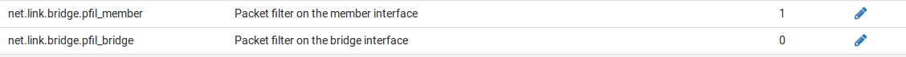

********
Bridging
********

Creare un bridge (bridge)

   In |firew4ll|, i bridge vengono aggiunti e rimossi in
   **Interfacce>(assegna)** nella scheda **bridge**. Utilizzando i bridge,
   un numero illimitato di porte può essere facilmente unito. Ogni bridge
   creato nella GUI creerà anche una nuova interfaccia bridge nel
   sistema operativo, denominata bridgex dove X inizia a 0 e aumenta di
   un0 per ogni nuovo bridge. Queste interfacce possono essere assegnate
   e utilizzate come la maggior parte delle altre interfacce, che
   vengono discusse più avanti in questo capitolo.

   Per creare un bridge:

-  Passare a **Interfacce>(assegnare)** nella scheda **bridge**.

-  Fare clic su **Aggiungere** per creare un nuovo bridge.

-  Seleziona almeno una voce da **Interfacce dei membri**. Selezionare
   quante ne servono usando Ctrl-click.

-  Aggiungere una **descrizione** se desiderato.

-  Fare clic su **Mostrare opzioni avanzate** per rivedere i parametri
   di configurazione rimanenti come necessario. Per la maggior parte dei
   casi non sono necessari.

-  Fare clic su **Salvare** per completare il bridge.

.. note::  
	Un bridge può consistere in un'unica interfaccia membro, che può aiutare a migrare in una configurazione con un bridge assegnato, o per fare una semplice porta span/mirror.

Opzioni avanzate del bridge
'''''''''''''''''''''''''''

Ci sono numerose opzioni avanzate per un bridge e i suoi membri. Alcune
di queste impostazioni sono abbastanza coinvolte, quindi vengono
discusse singolarmente in questa sezione.

Spanning Tree Options (Rapido) 
==============================

L’albero di spanning (spanning tree) è un protocollo che aiuta switch e dispositivi a determinare se c'è un ciclo (loop) e a tagliarlo come necessario per evitare che il ciclo danneggi la rete. Ci sono parecchie opzioni che controllano il comportamento dello spanning tree che permettono di fare certe ipotesi su porte specifiche o di garantire che alcuni bridge abbiano la priorità nel caso di un ciclo o di collegamenti ridondanti. Maggiori informazioni su STP possono essere trovate nella pagina principale di FreeBSD ifconfig(8), e su Wikipedia.

Protocollo
----------

L’impostazione del **protocollo** stabilisce se il bridge utilizzerà il
protocollo dello Spanning Tree (*STP*) dell’ID o il protocollo dello
Spanning Tree rapido (*RSTP*) IEEE 802.1w. RSTP è un protocollo più
recente, e come il nome suggerisce opera molto più veloce di STP, ma è
retrocompatibile. Il nuovo standard IEEE 802.1D-2004 è basato su RSTP e
rende STP obsoleto.

Selezionare STP solo quando è in uso una vecchia versione che non si
comporta bene con RSTP.

Interfacce STP
--------------

L'elenco delle **interfacce STP** riflette i membri del bridge su cui è
abilitato STP. Utilizzare Ctrl-click per selezionare i membri del bridge
da utilizzare con STP.

Tempo di validità
-----------------

Impostare il **tempo di validità** per una configurazione del protocollo
dell’albero di spanning. Il valore predefinito è 20 secondi. Il minimo è
6 secondi e il massimo è 40 secondi.

Tempo di forward
----------------

L'opzione **Tempo di forward** imposta il tempo che deve passare prima
che un'interfaccia inizi a inoltrare i pacchetti quando l'albero di
spanning è abilitato. Il valore predefinito è 15 secondi. Il minimo è 4
secondi e il massimo è 30 secondi.

.. note::  
	Un ritardo più lungo sarà notato dai client direttamente connessi in quanto non saranno in grado di passare il traffico, anche per ottenere un indirizzo IP tramite DHCP, fino a quando la loro interfaccia entra in modalità di inoltro.

Hello Time
----------

L'opzione **Hello Time** imposta il tempo tra la trasmissione dei messaggi di configurazione del protocollo di Spanning Tree. Il **hello time** può essere modificato solo quando si opera in modalità STP. Il valore predefinito è 2 secondi. Il minimo è 1 secondo e il massimo è 2 secondi.

Priorità del bridge
-------------------

La **priorità del bridge** dell’albero di Spanning controlla se questo
bridge sarà selezionato per primo per il blocco in caso di rilevamento di
un ciclo. Il valore predefinito è 32768. Il minimo è 0 e il massimo è
61440. I valori devono essere un multiplo di 4096. Priorità inferiori
hanno la precedenza, e valori inferiori a 32768 indicano l’ammissibilità
per diventare un bridge di root.

Tenere il conto (Hold count)
----------------------------

La trasmissione **Hold Count** per l'albero di spanning è il numero di
pacchetti trasmessi prima di vare un tasso limitato. Il valore
predefinito è 6. Il minimo è 1 e il massimo è 10.

Priorità delle porte
--------------------

I campi **Priorità** definiscono la priorità dell'albero di spanning per
ogni interfaccia membro del bridge. Alle priorità più basse viene data
preferenza quando si decide quali porte bloccare e quali inoltrare. La
priorità predefinita è 128, e deve essere compresa tra 0 e 240.

Path Costs
------------------

I campi **Path Costs** impostano il path costs dell'albero di spanning per ogni membro del bridge. Il valore predefinito è calcolato dalla velocità del collegamento. Per cambiare un path costs precedentemente selezionato indietro all’automatico, impostare il costo a 0. Il minimo è 1 e il massimo è 200000000. I path costs più bassi sono preferiti quando si prende una decisione su quali porte bloccare e quali lasciare come forward.

Impostazioni della cache
========================

    La **dimensione della cache** imposta la dimensione massima della
    cache dell'indirizzo del bridge, simile alla tabella MAC o CAM di
    uno switch. Il valore predefinito è 100 voci. Se ci sarà un gran
    numero di dispositivi che comunicano attraverso il bridge, impostarlo
    come più alto.

    **Tempo di scadenza della voce della cache** controlla il timeout
    delle voci della cache dell'indirizzo in secondi. Se impostata su 0,
    le voci della cache dell'indirizzo non saranno scadute. Il valore
    predefinito è 240 secondi (quattro minuti)

Porta Span
==========

Selezionando un'interfaccia come **porta Span** sul bridge
trasmetteremo una copia di ogni fotogramma ricevuto dal bridge
all'interfaccia selezionata. Questo è molto utile per lo snooping di una
rete bridge passivamente su un altro host collegato alle porte span del
bridge con qualcosa come Snort, tcpdump, ecc. La porta span selezionata
potrebbe non essere una porta membro sul bridge.

Porte di EDGE / Porte automatiche di edge
=========================================

Se un'interfaccia è impostata come una **porta Edge**, si presume sempre
che sia collegata ad un dispositivo di fine, e mai ad uno switch; si
assume che la porta non possa mai creare un loop di livello 2. Impostare
questo solo su una porta quando non sarà mai collegato a un altro
switch. Le porte di default rilevano automaticamente lo stato edge, e
possono essere selezionate sotto le porte di **edge automatico** per
*disabilitare* questo comportamento automatico di rilevamento edge.

Porte PTP / porte automatico PTP
================================

Se un'interfaccia è impostata come **porta PTP**, si presume sempre che
sia collegata ad uno switch, e non ad un dispositivo utente finale; si
presume che la porta possa potenzialmente creare un loop di livello 2.
Dovrebbe essere abilitato solo sulle porte collegate ad altri switch
abilitati RSTP. Le porte di default rilevano automaticamente lo stato
PTP, e possono essere selezionate sotto le **porte PTP** automatiche per
*disabilitare* questo comportamento automatico di rilevamento PTP.

Porte Sticky
============

Un'interfaccia selezionata in **porte Sticky** avrà i suoi indirizzi
dinamicamente imparati memorizzati come se fossero statici una volta che
entrano nella cache. Le voci sticky non vengono mai rimosse dalla cache
degli indirizzi, anche se appaiono su un'interfaccia diversa. Questo
potrebbe essere utilizzato come una misura di sicurezza per garantire
che i dispositivi non possano muoversi tra le porte arbitrariamente.

Porte private
=============

Un'interfaccia contrassegnata come una **porta privata** non comunica
con qualsiasi altra porta contrassegnata come una **porta privata**.
Questo può essere usato per isolare gli utenti finali o sezioni di una
rete tra loro se sono collegati alle porte di bridge separati
contrassegnate in questo modo. Funziona in modo analogo alle “VLAN
private” o all’isolamento dei client su un punto di accesso wireless.

Bridging e interfacce
'''''''''''''''''''''

Un'interfaccia di bridge (ad es. *bridge0*) può essere assegnata come
interfaccia. Questo permette al bridge di agire come un'interfaccia
normale e avere un indirizzo IP posto su di esso piuttosto che
un'interfaccia membro.

La configurazione dell'indirizzo IP sul bridge stesso è la migliore in
quasi tutti i casi. La ragione principale è dovuta al fatto che i bridge
dipendono dallo stato dell'interfaccia su cui è assegnato l'indirizzo
IP. Se l'indirizzo IP del bridge è configurato su un'interfaccia membro e
l'interfaccia è disattivata, l'intero bridge sarà disattivato e non
passerà più il traffico. Il caso più comune per questo è un'interfaccia
wireless collegata a un NIC della LAN Ethernet. Se il NIC LAN è
scollegato, il wireless sarebbe morto a meno che l'indirizzo IP sia
stato configurato sull'interfaccia bridge e non LAN. Un'altra ragione è
che se i limitatori devono essere usati per controllare il traffico,
allora ci deve essere un indirizzo IP sull'interfaccia del bridge per
farli funzionare correttamente. Allo stesso modo, affinché il portale
Captive o un proxy trasparente funzioni su un bridge interno, l'indirizzo
IP deve essere configurato sul bridge assegnato e non su un'interfaccia
membro.

Scambiare le assegnazioni dell’interfaccia
==========================================

Prima di spingersi troppo oltre nel parlare di scambi delle assegnazioni
di interfaccia bridge, si deve notare che queste modifiche dovrebbero
essere fatte da una porta che non è coinvolta nel bridge. Ad esempio, se
si collega WLAN a LAN, effettuare la modifica da WAN o da un'altra porta
OPT. In alternativa, scaricare un backup di config.xml e manualmente
apportare le modifiche. Il tentativo di apportare modifiche ad una porta
durante la gestione del firewall da quella porta molto probabilmente
comporterà la perdita di accesso alla GUI, lasciando il firewall
irraggiungibile.

Metodo semplice: spostare le impostazioni alla nuova interfaccia
----------------------------------------------------------------

Il percorso più semplice, anche se non il più veloce, nella GUI è quello
di rimuovere le impostazioni dall'interfaccia LAN individualmente
(indirizzo IP, DHCP, ecc) e quindi attivarle sull'interfaccia bridge
appena assegnata.

Metodo rapido ma complicato: riassegnare il bridge come LAN
-----------------------------------------------------------

Anche se questo metodo è un po' più complicato che spostare le
impostazioni, può essere molto più veloce soprattutto nei casi in cui ci
iano un sacco di regole firewall su LAN o una complessa configurazione
DHCP. In questo metodo, è richiesto un po' di hoop-jumping, ma alla fine
il bridge finisce come interfaccia LAN, e mantiene l'indirizzo IP della
LAN, tutte le regole del precedente firewall, DHCP, e altre
configurazioni di interfaccia.

-  Assegnare e configurare i membri del bridge che non sono stati ancora
   gestiti. Riesaminare le fasi che seguono per garantire che le
   impostazioni dell'interfaccia siano corrette anche se le interfacce
   sono già state assegnate e configurate.

   -  Passare a **Interfacce>(assegnare)**

   -  Scegliere l'interfaccia dall'elenco delle **porte di rete
      disponibili**

   -  Fare clic su **Aggiungere**

   -  Passare alla nuova pagina di configurazione dell'interfaccia, ad
      es. **Interfacce>OPT2**

   -  Selezionare **Abilitare**

   -  Inserire una **descrizione** come WiredLAN2

   -  Impostare sia il **tipo di configurazione IPv4** sia il **tipo di
      configurazione IPv6** su *Nessuno*

   -  Deselezionare il **Blocco delle reti private** e il **Blocco delle
      reti bogon** se selezionate

   -  Fare clic su **Salvare**

   -  Fare clic su **Applicare modifiche**

   -  Ripetere la procedura per ulteriori futuri membri del bridge non
      assegnati

-  Creare il nuovo bridge

   -  Passare a **Interfacce>(assegnare)** nella scheda **bridge**

   -  Fare clic su **Aggiungere** per creare un nuovo bridge

   -  Inserire una **descrizione**, ad esempio bridge LAN

   -  Selezionare tutti i nuovi membri del bridge
      **ECCETTO**\ l'interfaccia LAN nell'elenco delle **interfacce
      membri**

   -  Fare clic su **Salvare**

-  Modificare il **regolabile di sistema** del filtraggio del bridge per
   disabilitare il filtro dell'interfaccia membro

   -  Passare a **Sistema>Avanzate**, scheda **Regolabili di sistema**

   -  Individuare la voce per **net.link.bridge.pfil\_member** o creare
      una nuova voce se non esiste, utilizzando tale nome per il
      **sintonizzabile**

   -  Fare clic su |image0| per modificare una voce esistente

   -  Digitare 0 nel campo **Valore**

   -  Fare clic su **Salvare**

-  Passare a **Interfacce>(assegnare)**

-  Cambiare l'assegnazione della **LAN** a bridge0

-  Fare clic su **Salvare**

-  Assegnare e configurare la vecchia interfaccia LAN come descritto in
   precedenza, impostando i tipi di configurazione IP su *Nessuno* e
   nominandola WiredLAN

-  Modificare il bridge e selezionare il nuovo WiredLAN assegnato come
   membro del bridge

-  Modificare il **sintonizzabile di sistema** del filtraggio del bridge
   per abilitare il filtraggio dell'interfaccia bridge

   -  Usare la procedura descritta in precedenza, ma impostare
      net.link.bridge.pfil\_bridge su 1

Ora l'interfaccia LAN precedente, insieme con i nuovi membri bridge, sono
tutti su un livello 2 comune con il bridge assegnato come LAN insieme con
l'altra configurazione.

Metodo più veloce ma più difficile: Modifica config.xml manualmente
-------------------------------------------------------------------

La modifica manuale config.xml può essere molto veloce per chi ha
familiarità con il formato di configurazione in XML. Questo metodo è
facile da sbagliare, tuttavia, in modo da essere sicuri bisogna avere un
backup e installare i media nelle vicinanze nel caso in cui sia fatto un
errore.

Quando si modifica a mano config.xml per eseguire questa operazione,
fare come segue:

-  Assegnare i membri aggiuntivi del bridge e impostare i loro tipi di
   configurazione IP su *Nessuno*

-  Creare il bridge, compresi *LAN* e *LAN2* e altri membri del bridge

-  Assegnare il bridge (ad es. come OPT2) e abilitarlo, anche con un
   tipo di configurazione IP come *Nessuno*

-  Scaricare un backup di config.xml da
   **Diagnostica>Backup/Ripristino**

-  Aprire config.xml in un editor di testo che comprende la fine della
   riga di UNIX

-  Cambiare l'assegnazione *LAN* a bridge0

-  Modificare l'assegnazione *LAN* precedente a quello che era il bridge
   (ad es. *OPT2*)

-  Modificare la definizione del bridge per riferirsi all'\ *OPT2* e non
   alla *LAN*

-  Salvare le modifiche

-  Ripristinare config.xml modificato da
   **Diagnostica>Backup/Ripristino**

Il firewall si riavvierà con l'impostazione desiderata. Monitorare la
console per garantire che le impostazioni sono state applicate
correttamente e non si verificano errori durante la sequenza di avvio.

MAC assegnato agli indirizzo dei bridge e Windows
=================================================

L'indirizzo MAC per un bridge è determinato casualmente quando il bridge
viene creato, sia al momento dell'avvio o quando viene creato un nuovo
bridge. Ciò significa che ad ogni riavvio, l'indirizzo MAC può cambiare.
In molti casi questo non importa, ma Windows Vista, 7, 8, e 10
utilizzano l'indirizzo MAC del gateway per determinare se sono su una
rete specifica. Se il MAC cambia, l'identità di rete cambierà e il suo
status come pubblico, privato, ecc. potrebbe dover essere corretto. Per
aggirare questo problema, immettete un indirizzo MAC sull'interfaccia
bridge assegnata per effettuare lo spoof. Quindi i client vedranno
sempre lo stesso MAC per l'indirizzo IP del gateway.

Bridging e firewall
'''''''''''''''''''

Il filtraggio con interfacce bridge funziona in modo simile alle
interfacce instradate, ma ci sono alcune scelte di configurazione per
modificare esattamente il comportamento del filtraggio. Per impostazione
predefinita, le regole del firewall sono applicate su ogni interfaccia
membro del bridge sulla base dell’entrata, come qualsiasi altra
interfaccia instradata.

È possibile decidere se il filtraggio avviene sulle interfacce degli
elementi del bridge o sull'interfaccia del bridge stesso. Questo è
controllato da due valori in **Sistema>Avanzate** nella scheda
**Regolazioni** **di sistema**, come visto della figura
*Filtri bridge regolabili*. Il
net.link.bridge.pfil\_member controlla se le regole saranno rispettate o
meno sulle interfacce dei membri del bridge. Di default, questo è su
attivo come (1). Il sintonizzabile **net.link.bridge.pfil\_bridge**
controlla se le regole saranno rispettate sull'interfaccia del bridge
stesso. Di default, questo è spento come (0). Almeno uno di questi
valori deve essere impostato su 1.

|image1|

Fig. 1: Filtri bridge regolabili

Quando si filtra sull'interfaccia bridge stessa, il traffico colpirà le
regole appena entra in qualsiasi interfaccia membro. Le regole sono
ancora considerate “in entrata” come tutte le altre regole di
interfaccia, ma funzionano più come un gruppo di interfaccia poiché le
stesse regole si applicano ad ogni interfaccia membro.

Macro delle regole del firewall
===============================

Solo un'interfaccia bridge avrà un indirizzo IP impostato, le altre non
ne avranno. Per queste interfacce, le loro macro del firewall come
l'\ *indirizzo OPT1* e la *rete OPT1* sono indefinite perché
l'interfaccia non ha nessun indirizzo e quindi nessuna sottorete.

Se il filtraggio viene eseguito sui membri del bridge, tenere presente
questo fatto durante la creazione di regole ed elencare esplicitamente
la sottorete o utilizzare le macro per l'interfaccia in cui risiede
l'indirizzo IP.

Bridging di due reti interne
''''''''''''''''''''''''''''

Quando si collegano due reti interne come descritto in *bridge interni*
ci sono alcune considerazioni speciali da prendere per alcuni servizi
sul firewall.

.. note::  
	Ci sono ulteriori requisiti e restrizioni quando si collegano le interfacce wireless perché la via 802.11 funzioni. Vedere *Bridging e wireless* per maggiori informazioni.

DHCP e bridge interni
=====================

Quando si collega una rete interna ad un'altra, si devono fare due cose.
In primo luogo, assicurarsi che il DHCP sia in esecuzione solo
sull'interfaccia contenente l'indirizzo IP e non i membri del bridge
senza un indirizzo. In secondo luogo, una regola firewall aggiuntiva può
essere necessaria in cima alle regole sulle interfacce membro per
consentire il traffico DHCP.

.. note::  
	Questo vale solo per il filtraggio effettuato sulle interfacce dei membri, non per il filtraggio eseguito sul bridge.

Quando si crea una regola per consentire il traffico su un'interfaccia,
normalmente la sorgente è specificata in modo simile alla *sottorete
OPT1* in modo che solo il traffico da quella sottorete sia consentito
fuori da quel segmento. Con DHCP, questo non è sufficiente. Poiché un
client non ha ancora un indirizzo IP, una richiesta DHCP viene eseguita
come una trasmissione. Per soddisfare queste richieste, creare una
regola sulle interfacce degli elementi del bridge con le seguenti
impostazioni:

-  Passare a **Firewall>Regole** nella scheda per il membro del bridge

-  Fare clic su |image2| **Aggiungere** per aggiungere una nuova regola
   in cima all'elenco

-  **Protocollo:** *UDP*

-  **Fonte:** 0.0.0.0

-  **Porta sorgente:** 68

-  **Destinazione:** 255.255.255.255

-  **Porta di destinazione:** 67

-  **Descrizione** che indica permettere DHCP

-  Fare clic su **Salvare** e **applicare modifiche**

La regola apparirà come nella figura *Regola del firewall per consentire
DHCP*.

|image3|

Fig. 2: Regola del firewall per consentire DHCP

Dopo aver aggiunto la regola, i client nel segmento del bridge saranno in
grado di effettuare con successo richieste al demone DHCP in ascolto
sull'interfaccia a cui è collegato.

Dhcpv6 è un po' più complicato da permettere poiché comunica da e verso
gli indirizzi Ipv6 locali e multicast. Vedere la figura Regola del
firewall per consentire sia DHCP che Dhcpv6 per l'elenco delle regole
richieste. Questi possono essere semplificati con alias in una o due
regole contenenti la rete di sorgente corretta, la rete di destinazione
e le porte.

|image4|

Fig. 3: Regola del firewall per consentire sia DHCP che Dhcpv6

Interoperabilità della creazione del bridge
'''''''''''''''''''''''''''''''''''''''''''

Le interfacce bridge sono diverse dalle normali interfacce per alcuni
aspetti, quindi ci sono alcune caratteristiche che sono incompatibile
con il bridging, e altre in cui devono essere fatte considerazioni
aggiuntive per accogliere il bridging. Questa sezione copre funzionalità
che funzionano in modo diverso con il bridge rispetto alle interfacce
senza bridge.

Il captive portal
==================

Il captive portal (*Captive Portal*) non è compatibile con il bridging
trasparente perché richiede un IP sull'interfaccia per il bridge,
utilizzato per servire i contenuti del portale, e quell'IP deve essere
il gateway per i client. Ciò significa che non è possibile, ad esempio,
collegare LAN e WAN e sperare di catturare i client con il portale.

Questo può funzionare quando si collegano più interfacce *locali* a
tutti i percorsi attraverso |firew4ll| (ad es. LAN1, LAN2, LAN3, ecc.).
Funzionerà se l'interfaccia bridge è assegnata, l'interfaccia bridge ha
un indirizzo IP e quell'indirizzo IP è usato come gateway dai client sul
bridge. Vedere *Assegnazioni dell’interfaccia da scambiare* per la
procedura per posizionare l'indirizzo IP su un'interfaccia bridge
assegnata.

HA - Elevata disponibilità
==========================

L' HA (*elevata disponibilità*) non è raccomandata con
il bridging in questo momento. Alcuni hanno avuto successo con la
combinazione dei due in passato, ma bisogna fare molta attenzione a
gestire i loop di livello 2, che sono inevitabili in uno scenario
HA+bridge. Quando due segmenti di rete sono collegati con un bridge, sono
in effetti fusi in una rete più grande, come discusso in precedenza in
questo capitolo. Quando HA viene aggiunto nel mix, ciò significa che ci
saranno due percorsi tra gli switch per ogni rispettiva interfaccia,
creando un loop.

Gli switch gestiti possono gestire questo con il protocollo dell’albero
di Spanning (STP), ma gli switch non gestiti non hanno difese contro la
creazione di loop. Lasciato libero, un loop metterà in ginocchio una
rete e renderà impossibile far passare qualsiasi traffico. STP può
essere configurato sui bridge per aiutare, anche se ci possono ancora
essere risultati imprevisti.

Multi-WAN
=========

Il bridging trasparente per sua natura è incompatibile con il multi-WAN
in molti dei suoi usi. Quando si utilizza un bridge tra una WAN e
un'interfaccia LAN/OPT, di solito qualcosa di diverso da |firew4ll| sarà il
gateway predefinito per gli host sull'interfaccia per il bridge, e quel
router è l'unico dispositivo che può dirigere il traffico da quegli
host. Questo non impedisce che il multi-WAN venga utilizzato con altre
interfacce sullo stesso firewall che non sono integrate, ma influisce
solo sugli host sulle interfacce bridge dove usano qualcosa di diverso
da |firew4ll| come gateway predefinito. Se più interfacce interne sono
unite insieme e |firew4ll| è il gateway predefinito per gli host sulle
interfacce del bridge, allora si può usare multi-WAN come con le
interfacce senza bridge.

Limitatori
==========

Affinché i limitatori funzionino con il bridging, il bridge stesso deve
essere assegnato e l'interfaccia bridge deve avere l'indirizzo IP e non
un'interfaccia membro.

NAT nella LAN e Proxy Trasparente
=================================

Per le porte forward sulla LAN, o proxy trasparenti che utilizzano porte
forward sulla LAN per catturare il traffico, per funzionare in uno
scenario bridge, la situazione è la stessa del captive portal:
funzionerà solo per bridge LAN e non bridge WAN/LAN, l'indirizzo IP deve
trovarsi sull'interfaccia bridge assegnata e tale indirizzo IP deve
essere utilizzato come gateway per i client locali.

Ciò significa che un pacchetto come Squid non può funzionare in uno
scenario di firewall trasparente dove la LAN è collegata a una WAN.

Normalmente ogni interfaccia su |firew4ll| rappresenta il proprio dominio
broadcast con una sottorete IP unica. In alcune circostanze è
auspicabile o necessario combinare più interfacce su un singolo dominio
di trasmissione, dove due porte sul firewall agiranno come se fossero
sullo stesso switch, ad eccezione del traffico tra le interfacce che può
essere controllato con le regole del firewall. In genere questo viene
fatto in modo che più interfacce agiscano come se fossero sulla stessa
rete piatta utilizzando la stessa sottorete IP e in modo che tutti i
client condividano il traffico broadcast e multicast.

Alcune applicazioni e dispositivi si basano su trasmissioni per
funzionare, ma questi si trovano più comunemente in ambienti domestici
che ambienti aziendali. Per una discussione pratica, vedere *Bridging e
wireless*.

Per i servizi in esecuzione sul firewall, il bridging può essere
problematico. Caratteristiche come i limitatori, il captive portal e i
proxy trasparenti richiedono una configurazione e una gestione speciali
per lavorare su reti a bridge. In particolare, il bridge stesso deve
essere assegnato e l'unica interfaccia sul bridge con un indirizzo IP
deve essere il bridge assegnato. Inoltre, affinché queste funzioni
funzionino, l'indirizzo IP sul bridge deve essere l'indirizzo utilizzato
dai client come gateway. Questi temi sono discussi in modo più
approfondito nel l'ambito del l'\ *interoperabilità della creazione del
bridge*.

Tipi di bridge
''''''''''''''

Esistono due tipi distinti di bridge: bridge interni e bridge
interni/esterni. I bridge interni collegano due interfacce locali come
due interfacce LAN o un'interfaccia LAN e un'interfaccia wireless. I
bridge interni/esterni collegano una LAN ad una WAN dando luogo a quello
che viene comunemente chiamato un firewall trasparente..

Bridge Interni
==============

Con un bridge di tipo interno, le porte sul firewall sono collegate in
modo tale da comportarsi in modo simile alle porte switch, anche se con
la possibilità di filtrare il traffico sulle porte o sul bridge e con
prestazioni molto più basse di uno switch. Il firewall stesso è ancora
visibile ai client collegati locali e agisce come gateway, e forse DNS e
server DHCP. I client sui segmenti bridge potrebbero anche non sapere
che c'è un firewall tra di loro.

Questo tipo di configurazione è comunemente scelto dagli amministratori
per isolare e controllare una parte della rete, come un segmento
wireless, o per utilizzare porte aggiuntive sul firewall al posto di uno
switch corretto in cui l'installazione di uno switch sarebbe
impraticabile. Anche se non è raccomandato, questo tipo di bridge può
essere utilizzato anche per unire due reti remote su alcuni tipi di
connessioni VPN.

.. seealso:: 

Per ulteriori informazioni, è possibile accedere all'archivio degli
Hangouts per visualizzare l’hangout di Maggio 2015 sui punti di accesso
wireless che comprendeva esempi pratici di bridge di tipo interno.

Bridge Interni/Esterni
======================

Un bridge di tipo Interno/Esterno, noto anche come firewall trasparente
«, viene utilizzato per inserire un firewall tra due segmenti senza
alterare gli altri dispositivi. Più comunemente questo viene usato per
collegare una WAN a una rete interna in modo che la sottorete WAN possa
essere usata "all'interno del firewall o internamente tra segmenti
locali come filtro in linea. Un altro uso comune è per i dispositivi
dietro il firewall per ottenere indirizzi IP tramite DHCP da un server
upstream sulla WAN.

In una configurazione firewall trasparente il firewall non riceve il
traffico direttamente o agisce come un gateway, si limita a ispezionare
il traffico come passa attraverso il firewall.

.. note::  
	I dispositivi sul lato interno di questo bridge devono continuare ad usare il gateway upstream come proprio gateway. Non impostare alcun indirizzo IP sul firewall come gateway per i dispositivi su un bridge trasparente.

Il NAT non è possibile con questo stile di bridge perché il NAT richiede
che il traffico sia indirizzato direttamente all'indirizzo MAC del
firewall per avere effetto. Dal momento che il firewall non è il
gateway, questo non accade. In quanto tali, le regole per catturare il
traffico come quelle utilizzate da un proxy trasparente non funzionano.

Bridging e loop di Livello 2
''''''''''''''''''''''''''''

Quando si effettua il bridging, occorre evitare i loop di livello 2,
oppure deve essere presente una configurazione di switch che gestisca i
loop. Un loop di livello 2 si ha quando, direttamente o indirettamente,
lo switch ha una connessione a se stesso. Se un firewall che esegue
|firew4ll| ha interfacce unite insieme, e due interfacce sono collegate
nello stesso switch sulla stessa VLAN, è stato creato un loop di livello
2. Il collegamento di due cavi di connessione tra due switch fa anche
questo.

Gli switch gestiti utilizzano il protocollo dell’albero di spanning
(STP) per gestire situazioni come questa, perché è spesso desiderabile
avere collegamenti multipli tra gli switch, e la rete non dovrebbe
essere esposta a una fusione completa da parte di qualcuno che collega
una porta di rete a un'altra porta di rete. STP non è abilitato per
default su tutti gli switch gestiti, e non è quasi mai disponibile con
gli switch non gestiti. Senza STP, il risultato di un loop di livello 2
è che i frame sulla rete circoleranno all'infinito e la rete cesserà
completamente di funzionare finché il loop non verrà rimosso.
Controllare la configurazione dello switch per garantire che la funzione
sia abilitata e configurata correttamente.

|firew4ll| abilita STP sulle interfacce bridge per aiutare con i loop, ma
può ancora portare a situazioni impreviste. Ad esempio, una delle porte
bridge si spegne per fermare il loop, ciò potrebbe causare che il
traffico smetta di fluire inaspettatamente o bypassi il firewall del
tutto.

In poche parole, il bridging ha il potenziale per fondere completamente
la rete a meno che chiunque colleghi i dispositivi nello switch non sia
attento.

.. |image0| image:: media/image1.png
   :width: 0.26250in
   :height: 0.26250in

.. |image2| image:: media/image3.png
   :width: 0.26250in
   :height: 0.26250in

