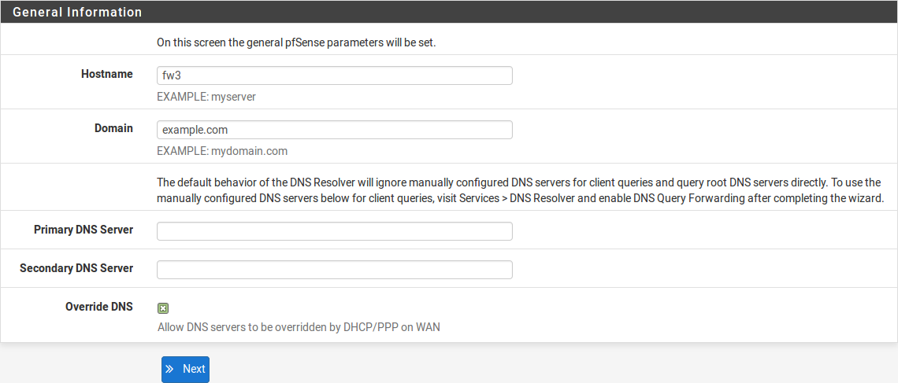

***********************
Configurazione Firew4ll
***********************

Configurazione guidata
''''''''''''''''''''''

La prima volta che un utente a accede ad un |firew4ll|, il firewall
presenta automaticamente la configurazione guidata. La prima pagina
della guida è presentata nella figura *Schermata di avvio della
configurazione guidata.*

Fare clic su |image0| **Avanti** per avviare il processo di
configurazione con la guida

.. tip:: Usare la configurazione guidata è opzionale. Fare clic sul logo di |firew4ll| in alto a sinistra della pagina per uscire dalla guida in ogni momento.

|image1|

Fig. 1: Schermata di avvio della configurazione guidata

Schermata per le Informazioni generali
======================================

La prossima schermata (Figura *Schermata delle informazioni generali*)
configura il nome di questo firewall, il dominio in cui risiede, il
server ei del DNS per il firewall.

    **Nome dell'Host** Il nome dell'host può essere qualcosa di simile,
    ma deve iniziare con una lettera e deve contenere solo lettere,
    numeri, o un trattino.

    **Dominio** Inserire un dominio, per esempio esempio.com. Se questa
    rete non ha un dominio, usare <Qualcosa> .dominiolocale, dove
    <Qualcosa> è un altro identificatore: un nome di azienda, cognome,
    nickname, ecc Per esempio, azienda.dominiolocale Il nome dell'host e
    il nome del dominio sono combinati per formare un nome di dominio
    pienamente qualificato per questo firewall.

    **Server del DNS primario/secondario** L'Indirizzo IP del server DNS
    primario e del server DNS secondario possono essere riempiti, se
    richiesto e se conosciuti

    Questi server DNS possono essere lasciati vuoti se il risolutore del
    DNS rimane attivo usando le impostazioni predefinite. La
    configurazione di |firew4ll| predefinita ha il risolutore del DNS
    attivo nella modalità risolutore (non nella modalità d'inoltro),
    quando si imposta questa modalità, il risolutore del DNS non ha
    bisogno dei server di DNS del d'inoltro perché comunicherà
    direttamente con i server DNS della root e con i server di DNS
    autorizzati. Per forzare il firewall di usare questi server DNS
    configurati, abilitare la modalità d'inoltro nel risolutore DNS o
    usare il forwader del DNS

    Se questo firewall ha un tipo di WAN dinamico come DHCP, PPTP o
    PPPoE, queste potrebbero essere assegnate automaticamente dall'ISP e
    possono essere lasciate vuote.

    **DNS di Override** Quando selezionato, un provider di servizi
    Internet della WAN dinamica può fornire i server di DNS del che
    ereditano quelle impostazioni manualmente. Per forzare l'utilizzo
    dei soli server DNS configurati manualmente, disabilitare questa
    opzione.

.. seealso:: Per maggiori informazioni sulla configurazione del risolutore del DNS, vedere *Risolutore DNS*

Fare clic su |image2| **Avanti** per continuare

|image3|\ Fig. 2: Schermata delle informazioni generali

Configurazione del NTP e della zona oraria
==========================================

La prossima schermata (Figura *Schermata del NTP e della timezone*) contiene impostazioni relative all'ora.

    **Hostname del server dell'ora** Un nome dell’host del server con
    protocollo dell'ora della rete (NTP) o indirizzo IP. Fintanto un
    server con NTP specifico non sia richiesto, come uno sulla LAN, la
    cosa migliore è lasciare l'hostname del server dell’orario
    predefinito 0.|firew4ll|.pool.ntp.org. Questo valore prenderà un server
    qualsiasi da un pool di host noti.

    Questa numerazione è specifica in modo che .pool.ntp.org operi e
    assicuri che ogni indirizzo sia preso da un pool di server con NTP
    unici così che lo stesso server non sia utilizzato due volte

    **Zona oraria** Scegliere una zona nominata geograficamente che
    corrisponda meglio al luogo di questo firewall, o qualsiasi altra
    zona desiderata.

Fare clic su |image4| **Avant**\ i per continuare

|image5|

Fig 3: Schermata del NTP e della zona oraria

Configurazione dell'interfaccia WAN
===================================

La prossima pagina della guida configura l'interfaccia WAN del firewall.
Questa è la rete esterna che affronta l'ISP o il router di upstream,
così che la guida offra scelte di configurazione che supportino diversi
tipi di connessione ISP comuni.

    **Tipologia WAN** La tipologia selezionata (Figura *Configurazione
    della WAN*) deve corrispondere alla tipologia di WAN dall'ISP
    richiesta, o qualsiasi sia il precedente firewall o il router che
    sia stato configurato da utilizzare. Le scelte possibili sono
    *statica*, *DHCP*, *PPPoE*, e *PPTP*. La scelta predefinita è DHCP
    per il fatto che è una delle più comuni, e per la maggioranza dei
    casi queste impostazioni permettono al firewall di “lavorare” senza
    una configurazione aggiuntiva. Se la tipologia di WAN non è nota, o
    le impostazioni specifiche per la Wan non sono conosciute, questa
    informazione deve essere ottenuta dall'ISP. Se la tipologia di WAN
    richiesta non è disponibile nella guida, o per avere maggiori
    informazioni sulle diverse tipologie di WAN, vedere *Configurazione
    e tipologie di interfaccia*

.. note::  Se l'interfaccia WAN è wireless, saranno presentate opzioni aggiuntive dalla guida che non sono illustrate da questa guida della installazione di base. Fare riferimento a *Wireless* , che ha una sezione sulla WAN wireless del maggiori informazioni. Se qualcuna si queste informazioni fosse poco chiara, saltare la configurazione della WAN per ora, e poi eseguire la configurazione del wireless in un secondo momento.

|image6|

Fig. 4: Configurazione dell'interfaccia WAN

    **Indirizzo MAC** Questo campo, mostrato in Figura *Configurazione
    generale della WAN*, cambia l'Indirizzo MAC usato sull'interfaccia
    di rete WAN. E' anche conosciuto come ‘sproofing’ dell'indirizzo
    MAC.

.. note::  I problemi attenuati dallo sproofing dell'indirizzo MAC sono di solito temporanei e facilmente aggirabili. La migliore procedura è mantenere l'indirizzo MAC originale dell'hardware, ricorrendo allo spoofing solo quando assolutamente necessario.

    Cambiare l'indirizzo MAC può risultare utile per rimpiazzare un pezzo esistente delle apparecchiature di rete. Alcuni ISP, in primo luogo quelli forniti di cavi, non funzionano perfettamente se il nuovo indirizzo MAC è rilevato. Alcuni provider internet richiedono un ciclo di potenza del modem, altri richiedono la registrazione del nuovo indirizzo sul telefono. In aggiunta, se questa connessione WAN è su un segmento di rete con altri sistemi che lo posizionano via ARP, cambiare il MAC da  corrispondere e il vecchio pezzo potrebbe anche rendere la transizione più facile, piuttosto che dover pulire le memorie cache ARP o aggiornare le voci dell'ARP statica.

    **Unità di Trasmissione Massima (MTU)** Il campo MTU, mostrato nella
    figura *Configurazione generale della WAN*, può essere lasciato
    vuoto di solito, ma può essere cambiato se necessario. Alcune
    situazioni possono richiedere un MTU più basso per assicurare che i
    pacchetti sia dimensionati in maniera appropriata per la connessione
    internet. Nella maggior parte dei casi, l'impostazione predefinita
    assumer valori per cui la tipologia di connessione WAN possa
    funzionare correttamente.

    **Dimensione del segmento massimo (MSS)** L'MSS, mostrato nella
    figura *Configurazione generale della WAN*, è lasciato vuoto di
    solito, ma può essere cambiato se necessario. Questo campo abilita
    il clamping del MSS, che assicura che la dimensione dei pacchetti
    TCP rimanga adeguatamente piccola per connessioni internet
    particolari.

|image7|

Fig. 5: Configurazione generale della WAN

    **Configurazione dell’IP statico** Se è selezionata la scelta
    "Statica" per il tipo di WAN, l'\ **indirizzo IP**, la **maschera di
    sottorete** e il **gateway upstream** devono essere tutti compilati
    (Figura *Impostazioni degli IP statici*). Queste informazioni devono
    essere ottenute dall'ISP o da chi controlla la rete dal lato WAN di
    questo firewall. L'\ **indirizzo IP** e il **gateway di upstream**
    devono risiedere entrambi nella stessa sottorete.

|image8|

Fig. 6: Impostazioni degli IP statici.

    **Nome dell'host DHCP** Questo campo (Figura *Impostazioni del nome
    dell'host DHCP*) è richiesto solo da pochi ISP. Questo valore è
    inviato insieme alla richiesta da parte del DHCP di ottenere
    l'indirizzo IP della WAN. Se Il valore di questo campo è
    sconosciuto, lasciare vuoto fintanto che non sia indirizzato
    diversamente dall'ISP.

|image9|

Fig. 7: Impostazioni del nome dell'host DHCP

    **Configurazione PPPoE** Quando si usa la tipologia PPPoE
    (Protocollo Point-to-Point per Ethernet) della WAN (Figura
    Configurazione PPPoE), i campi **nome utente** e **password PPPoE**
    Sono richiesti, al minimo. I Valori per questi campi sono
    determinati dall'ISP.

    **Nome utente del PPPoE** Il nome d'accesso per l'autenticazione
    PPPoE. Il formato è controllato dall'ISP, ma di solito usa un
    indirizzo e-mail come mionome@esempio.com.

    **Password PPPoE** La password per accedere all'account di posta
    specificato dal nome utente. La password è mascherata per
    impostazione predefinita. per vedere la password inserita,
    selezionare **Rivelare i caratteri della password**.

    **Nome del servizio PPPoE** Il nome del servizio PPPoE può essere
    richiesto da un ISP, ma di solito è lasciato vuoto. Quando è in
    dubbio, lasciare vuoto o contattare l'ISP e domandare se è
    necessario.

    **Chiamata PPPoE su richiesta** Fa in modo che pSsense lasci la
    connessione down/offline fino a quando i dati richiesti hanno
    bidogno di una connessione internet. Gli accessi PPPoE avvengono
    abbastanza velocemente, quindi nella maggior parte dei casi il
    ritardo, mentre la connessione è impostata, è trascurabile. Se i
    servizi pubblici sono ospitati all'interno di this firewall, non
    selezionare questa opione perché una connessione online deve essere
    mantenuta il più possibile in quel caso. Da notare, inoltre, che
    questa scelta non lascerà cadere una connessione già esistente.

    **Minimo tempo di attesa PPPoE** Specifica quanto tempo |firew4ll|
    concederà alla connessione PPPoE per rimanere up senza trasmettere
    dati prima di disconnetterla. Questo è utile solo quando accoppiato
    alla chiamata su richiesta, e di solito è lasciato vuoto
    (disabilitato)

.. note::  questa opzione richiede anche la disattivazione del monitoraggio del gateway, altrimenti la connessione non sarà mai inattiva.

|image10|

Fig. 8: Configurazione PPPoE

    **Configurazione PPPTP** La tipologia PPTP (Protocollo di tunneling
    point-to-point) della WAN (Figura *Configurazione della WAN PPTP*) è
    per gli ISP che richiedono un accesso PPTP, non per connettersi a
    una VPN PPTP da remoto. Queste impostazioni, molto simili alle
    impostazioni PPPoE, saranno fornite dall'ISP. Sono richieste alcune
    opzioni aggiuntive:

    **Indirizzo IP locale** L'Indirizzo locale (di solito privato) usato
    da questo firewall è stabilito dalla connessione PPTP.

    **Maschera di Sottorete CIDR** La maschera di sottorete per
    l’indirizzo locale.

    **Indirizzo IP da remoto** L'Indirizzo server PPTP, che è di solito
    all’interno della stessa sottorete come **Indirizzo IP locale**

Queste ultime opzioni, viste nella Figura *Opzioni di filtraggio
dell'ingresso integrate*, sono utili per prevenire che il traffico non
valido entri della rete protetta attraverso questo firewall, è anche
conosciuto come “Filtro d'ingresso”.

    **Reti RFC 1918 private ​​bloccate** Blocca le connessioni
    provenienti da reti registrate privato come 192.168.xx e 10.xxx che
    tentano di entrare nell'interfaccia WAN. Una lista completa di
    queste reti si trova nella sezione *Indirizzi IP privati*.

    **Reti bogon bloccate** Quando Attiva, il firewall blocca il
    traffico in entrata se proviene da uno spazio riservato o da uno
    spazio IP non ancora assegnato che non dovrebbe essere utilizzato.
    la lista di reti bogon è aggiornata periodicamente in background, e
    non richiede alcuna manutenzione. Le reti bogon sono spiegate in
    maniera approfondita nella sezione *Reti bogon bloccate*.

Fare clic su |image11| **Avanti** per continuare una volta che le
impostazioni della WAN sono state inserite

|image12|\ Fig. 9: Configurazione della WAN PPTP

|image13|\

Fig. 10: Opzioni di filtraggio dell'ingresso integrate

Configurazione dell' interfaccia LAN
====================================

Questa pagina della guida configura l'\ **indirizzo IP della LAN** e la
**maschera di sottorete** (Figura *Configurazione della LAN*).

Se questo firewall non si connette a nessun'altra rete via VPN, la rete
predefinita 192.168.1.0/24 può essere accettabile. Se questa rete deve
essere connessa a un'altra rete, che includa la via VPN da locazioni a
distanza, scegliere un intervallo di indirizzi IP privati molto più
oscuro dell'impostazione predefinita comune 192.168.1.0/24. Lo spazio IP
all'interno del blocco di indirizzi privati ​​RFC 1918 172.16.0.0/12 è
generalmente il meno frequentemente usato, quindi scegliere qualcuno tra
172.16.xx e 172.31.xx per evitare problemi con la connettività VPN.

Se la LAN è 192.168.1.x e un client da remoto è in un hotspot wireless
che usa 192.168.1.x (molto comune), il client non potrà comunicare
attraverso la VPN. In quel Caso, 192.168.1.x è la rete locale per il
cliente nell'hotspot, non la rete remota sulla VPN.

Se l'\ **indirizzo IP della** LAN deve essere cambiato, inserirlo qui
insieme alla nuova **maschera di sottorete**. Se queste impostazioni
sono cambiate, anche l'indirizzo IP del computer usato per completare la
guida deve essere cambiato, se è connesso attraverso la rete LAN.
Rilasciare/rinnovare la locazione DHCP, o eseguire una “riparazione” o
“diagnosi” sull'interfaccia di rete quando la configurazione guidata è
finita.

|image14|\

Fig. 11: Configurazione della LAN.

Fare clic su |image15| **Avanti** per continuare

Impostare la password amministrativa
====================================

Il prossimo passo è cambiare le password amministrativa per la WebGUI
come mostrato nella Figura *Cambiare la password amministrativa*. La
maniera migliore è usare la password forte e sicura, ma nessuna
restrizione è imposta automaticamente. Inserire la password nella
casella della **password amministrativa** e nella casella della conferma
per essere sicuri che sia stata inserita correttamente.

Fare clic su |image16| **Avanti** per continuare

|image17|

Fig. 12: Cambiare la password Amministrativa.

Completare la configurazione guidata
====================================

Questa procedura completa la configurazione guidata delle impostazioni.
Fare clic su **ricaricare** (Figura *Ricaricare la WebGUI di |firew4ll|*) e
la WebGUI applicherà le impostazioni dalla procedura guidata e
ricaricherà i servizi modificati dalla procedura guidata.

.. tip:: Se l'Indirizzo IP della LAN è stato cambiato dalla guida e la guida è stata iniziata dalla lan, regolare l'indirizzo IP del computer client di conseguenza dopo aver fatto click su ricaricare.

Quando viene richiesto di effettuare nuovamente l'accesso, inserire la password nuova. il nome utente rimane admin.

|image18|

Fig. 13: Ricaricare la WebGUI di |firew4ll|

A questo punto il firewall avrà connettività di base a internet tramite
WAN e client sul lato LAN saranno in grado di raggiungere i siti
internet attraverso questo firewall.

Se in qualsiasi momento questa configurazione iniziale deve essere
ripetuta, rivisitare la procedura guidata **di Sistema> Configurazione
guidata** dall'interno della WebGUI.

Configurazione dell'interfaccia
'''''''''''''''''''''''''''''''

Gli aspetti fondamentali della configurazione dell'interfaccia possono
essere eseguiti alla console e nella procedura guidata di configurazione
per l'avvio, ma le modifiche apportate possono anche essere fatte dopo
la configurazione iniziale visitando le pagine del menu **Interfacce**.
Alcuni elementi di base sono trattati qui, i dettagli possono essere
trovati in *Tipi di interfaccia e configurazione*.

Assegnare le Interfacce
=======================

A ulteriori interfacce aggiunte dopo la configurazione iniziale possono
essere assegnati ruoli visitando **Interfacce> (assegnare)**. Ci sono
numerose schede in quella pagina utilizzate per l'assegnazione e la
creazione di diversi tipi di interfacce. Le due schede più comunemente
utilizzate sono **assegnazioni di interfaccia** e **VLAN**.

.. seealso:: La configurazione VLAN è inclusa nelle *LAN virtuali (VLAN)*.

La scheda delle assegnazioni di interfaccia mostra un elenco di tutte le
interfacce attualmente assegnate: WAN, LAN, e tutte le voci OPTX
configurate sul firewall. Accanto Ad ogni interfaccia c'è un elenco a
discesa di tutte le interfacce/porte di rete presenti nel sistema.
Questo elenco comprende le interfacce hardware, le interfacce vlan e
altri tipi di interfaccia virtuale. L'indirizzo MAC, il tag VLAN o altre
informazioni di identificazione sono stampate lungo il lato del nome
dell'interfaccia per facilitare l'identificazione.

Le altre schede, molto simili alla scheda VLAN, sono lì per creare
interfacce aggiuntive che possono essere assegnate dopo. Tutti questi
tipi di interfaccia sono trattati in *Tipi e configurazioni di
interfaccia*.

Per modificare l'assegnazione di un'interfaccia esistente a un'altra
porta di rete:

-  Andare alla pagina **Interfacce> (assegnare)**

-  Individuare l'interfaccia da modificare nella lista

-  Selezionare una la nuova porta di rete dall'elenco a discesa sulla
   riga per quella interfaccia

-  Cliccare su **Salvare**

Per aggiungere una nuova interfaccia dall'elenco delle porte di rete
inutilizzate:

-  Andare alla pagina alle **Interfacce> (assegnare)**

-  Seleziona una la porta da usare dall'elenco a discesa etichettato
   porte di rete disponibili

-  Fare clic su |image19| **aggiungere**

Questa azione aggiungerà un'altra linea con una nuova interfaccia OPT
numerata superiore a qualsiasi interfaccia OPT esistente, o se questa è
la prima interfaccia aggiuntiva, *OPT1*.

Nozioni di base sulla configurazione dell'interfaccia
=====================================================

Le interfacce sono configurate scegliendo la loro voce dal menu
**interfacce**. Per esempio, per configurare l'interfaccia WAN,
scegliere **Interfacce> WAN**. Quasi tutte le opzioni trovate in
**Interfacce> WAN** sono identiche a quelle menzionate nella parte WAN
della procedura guidata di configurazione.

Ogni interfaccia è configurata nello stesso modo e qualsiasi interfaccia
può essere configurata come qualsiasi tipo di interfaccia (Statica,
DHCP, PPPoE, ecc). Inoltre, il blocco delle reti private e delle reti
bogon può essere eseguito su qualsiasi interfaccia. Ogni interfaccia può
essere rinominata, comprese WAN e LAN, con un nome personalizzato.
Inoltre, ogni interfaccia può essere abilitata e disattivata a
piacimento, a condizione che almeno un'interfaccia rimanga abilitata.

.. seealso:: Per informazioni dettagliate sulla configurazione dell'interfaccia, vedere *Tipi e configurazione di interfaccia.*

La configurazione IPv4 può essere modificata tra *statico, DHCP, PPPoE, PPP, PPTP, L2TP,* o *niente* per       lasciare l'interfaccia senza un indirizzo IPv4. Quando si utilizza *IPv4 statico*, è possibile impostare un indirizzo IPv4, una subnet mask e il gateway IPv4. Se si sceglie una delle altre opzioni, i campi specifici del tipo appaiono per essere configurati.

La configurazione IPv6 può essere impostata su *statico*, *DHCP6, SLAAC, Tunnel 6rd, Tunnel 6to4, Track interface,* o *niente* per lasciare l'interfaccia senza un indirizzo l’IPv6. Quando si seleziona *statico*, è possibile mpostare l’indirizzo IPv6, la lunghezza del prefisso e il gateway IPv6.

Se questa è un'interfaccia wireless, la pagina conterrà molte opzioni aggiuntive per configurare l'interfaccia. Consultare *Wireless* per i dettagli.

.. note::  Selezionando un **Gateway** dall'elenco a discesa, o aggiungendo un nuovo gateway e selezionandolo, |firew4ll| tratterà quella interfaccia come un'interfaccia di tipo WAN per il NAT e le funzioni correlate. Questo non è auspicabile per interfacce interne come LAN o DMZ. I gateway possono ancora essere utilizzati su tali interfacce per percorsi statici e altri scopi *senza* selezionare un gateway qui sulla pagina delle interfacce.

Gestione delle liste nella GUI
''''''''''''''''''''''''''''''

La WebGUI di |firew4ll| ha un gruppo comune di icone che sono usate per la
gestione di liste e collezioni di oggetti del firewall. Non tutte le
icone sono usate in ogni pagina, ma i loro significati sono coerenti al
contesto in cui sono viste. Esempi di tali lista includono regole del
firewall, regole del NAT, IPsec, OpenVPN e certificati.

    |image20| Aggiungere un nuovo elemento ad un elenco

    |image21| Aggiungere elemento all'inizio di una lista

    |image22| Aggiungere un elemento alla fine di un elenco

    |image23| Modificare un elemento esistente

    |image24| Copiare un elemento (Crea un nuovo elemento della base
    all'elemento selezionato)

    |image25| Disabilitare un elemento attivo

    |image26| Abilitare un elemento disabilitato

    |image27| Eliminare un elemento

    |image28|\ Usato per spostare voci dopo aver selezionato uno o più
    elementi. Fare clic per spostare gli elementi selezionati sopra
    questa riga. Fare clic su Shift per spostare gli elementi
    selezionati sotto questa riga.

Le sezioni possono avere le proprie icone specifiche per ogni zona.
Consultare le sezioni appropriate di questo libro per le specifiche
sulle icone trovate in altre parti del firewall. Per esempio, per
trovare il significato delle icone usate solo nella gestione dei
certificati, guardare in *Gestione dei certificati*

.. tip:: Per determinare quale azione un'icona eseguirà, passare il mouse sopra l'icona con il puntatore e un suggerimento mostrerà una breve descrizione dello scopo dell'icona.

Navigare velocemente nella GUI con le scorciatoie
'''''''''''''''''''''''''''''''''''''''''''''''''

Molte aree della GUI hanno icone di scelta rapida presenti nella zona
conosciuta come la "barra di Breadcrumb", come visto in Figura *Esempio
di scorciatoie*. Queste icone di scelta rapida riducono la ricerca
necessaria per individuare le pagine correlate, consentendo ad un
amministratore di firewall di navigare rapidamente tra la pagina di
stato di un servizio, i registri e la configurazione. Le scorciatoie per
un determinato argomento sono presenti in ogni pagina relativa un
argomento racconto.

Per esempio, in Figura *Esempio di scorciatoie*, le scorciatoie hanno i
seguenti effetti:

|image29|

Fig. 14: Esempio di scorciatoie

    |image30| **Avviare il servizio** Se il servizio di posta è
    interrotto, questa icona avvia il servizio.

    |image31| **Riavviare il servizio** Se il servizio di posta è in
    esecuzione, questa icona riavvia il servizio.

    |image32| **Fermare il servizio** Se il servizio di posta è in
    esecuzione, questa icona ferma il servizio.

    |image33| **Impostazioni correlate** Quando questa icona appare, si
    passa alla pagina delle impostazioni di questa sezione.

    |image34| **Collegamento della pagina di stato** Un collegamento
    alla pagina di stato di questa sezione, se esiste.

    |image35| **Collegamento alla pagina di log** Se questa sezione ha
    una pagina di registro correlata, questa icona ne indica il
    collegamento.

    |image36| **Collegamento all'aiuto** Carica un aiuto coerente a
    questa pagina

La pagina *Stato del servizio* (**Stato> Servizi**) ha anche controlli
di scelta rapida per le pagine relative a ciascun servizio, come
mostrato nella figura *Scorciatoie sullo stato del servizio*. Le icone
hanno lo stesso significato della sezione precedente.

|image37|

Fig. 15: Scorciatoie sullo stato del servizio

Opzioni Configurazione Generale
'''''''''''''''''''''''''''''''

**Sistema> Configurazione generale** contiene opzioni che impostano
elementi di configurazione di base per |firew4ll| e la GUI. Alcune di
queste opzioni si trovano anche nella *Procedura guidata di
configurazione*.

    **Nome dell’host** è Il nome abbreviato per questo firewall, come
    firewall1, hq-fw, o sito1. Il nome deve iniziare con una lettera e
    può contenere solo lettere, numeri o un trattino.

    **Dominio** INSERIRE il nome di dominio per questo firewall, ad es.
    esempio.com. Se questa rete non ha un dominio, usare
    <qualcosa>.dominiolocale, dove <qualcosa> è un altro identificatore:
    un nome aziendale, cognome, nickname, ecc. Per esempio,
    azienda.dominiolocale

Il **nome dell'host** e il nome di dominio sono combinati per comporre
il nome di dominio completamente qualificato (FQDN) di questo firewall.
Per esempio, se il **hostname** è fw1 e il dominio è esempio.com,
allora l'FQDN è fw1.esempio.com.

Impostazioni del server DNS
===========================

Le opzioni in questa sezione controllano come il firewall risolva i nomi
host usando il DNS.

    **Indirizzo dei server DNS 1-4** Gli indirizzi IP dei server DNS
    possono essere compilati, se necessario e se sono noti.

    Questi server DNS possono essere lasciati vuoti se il risolutore DNS
    rimarrà attivo utilizzando le impostazioni predefinite. La
    configurazione predefinita di |firew4ll| ha il risolutore DNS attivo in
    modalità risolutore (non in modalità d’inoltro). Quando impostato in
    questo modo il risolutore DNS non ha bisogno di inoltrare i server
    DNS quindi comunicherà direttamente con i server della root del DNS
    e altri server autorevoli DNS. Per forzare il firewall ad usare
    questi server DNS configurati, abilitare la modalità di inoltro nel
    risolutore del DNS o utilizzare l’inoltro del DNS.

.. seealso::

Per ulteriori informazioni sulla configurazione del risolutore del DNS
vedere *Risolutore del DNS*

Se questo firewall ha un tipo di WAN dinamico come DHCP, PPTP o PPPoE
questi possono essere assegnati automaticamente dall'ISP e possono
essere lasciati vuoti.

    **Gateway dei server DNS 1-4** Oltre ai loro indirizzi IP, questa
    pagina fornisce un modo per impostare il Gateway utilizzato per
    raggiungere ogni server DNS. Questo è particolarmente utile in uno
    scenario di Multi-WAN dove, idealmente, il firewall avrà almeno un
    server DNS configurato per WAN. Maggiori informazioni sul DNS per
    Multi-WAN si possono trovare in *Server DNS Server e route
    statiche*.

    **Sostituzione del server DNS** Quando selezionata, un provider di
    servizi internet della WAN dinamica può fornire un server DNS che
    sostituiranno quelli impostati manualmente. Per forzare l'uso dei
    soli server DNS configurati manualmente, deselezionare questa
    opzione.

    **Disabilitare l’inoltro DNS** Per impostazione predefinita, |firew4ll|
    consulta il risolutore del DNS o l’inoltro del DNS in esecuzione sul
    firewall per risolvere i nomi host da solo. Lo fa elencando host
    locali (127.0.0.1) come suoi server DNS primari. L'attivazione di
    questa pzione disabilita questo comportamento, costringendo il
    firewall ad usare i server DNS configurati sopra invece dei suoi.

Localizzazione
==============

Le opzioni in questa sezione controllano la lingua e il visualizzazione
dell'orario del firewall.

    **Zona dell'orario** Scegliere una zona con nome geografico che
    corrisponda meglio alla posizione di questo firewall, o una zona
    comune come UTC. L'orologio del firewall, le voci di log e le altre
    aree del firewall basano il loro orario su questa zona. Cambiare la
    zona può richiedere un riavvio per attivarsi completamente in tutte
    le aree del firewall.

    **Server dell’orario** Nome dell'host o indirizzo IP del server NTP
    (Protocollo dell'orario della rete). A meno che non sia richiesto
    uno specifico server NTP, come uno sulla LAN, la migliore pratica è
    lasciare il valore dei server dell'orario al valore predefinito
    0.|firew4ll|.pool.ntp.org. Questo valore sceglierà un server casuale da
    un pool di host NTP noti e buoni.

    Per utilizzare Più di server di orario, aggiungerli Nella STESSA
    casella, separando OGNI Server da uno spazio. Per esempio, per usare
    tre server NTP dal pool, inserire:

    Questa numerazione è specifica per far in modo che .pool.ntp.org
    operi e assicuri che ogni indirizzo sia estratto da un pool di
    server NTP unici in modo che lo stesso server non venga usato due
    volte.

    **Lingua** La GUI di |firew4ll| è stata tradotta in altre lingue oltre
    all'inglese predefinito. Le lingue alternativa sono il *Portoghese
    (Brasile)* e il *Turco*.

Configuratore web
=================

Le opzioni in questa sezione controllano vari aspetti del comportamento
della GUI.

    **Tema** Cambiare il tema controlla l'aspetto e la percezione della
    GUI. Diversi temi sono inclusi nel sistema di base, e modificano
    solo aspetti estetici e non funzionali della WebGUI

    **Navigazione Superiore** Questa opzione controlla il comportamento
    della barra del menu dei nella parte superiore di ogni pagina. Ci
    sono due scelte possibili:

    **Scorrere la pagina** Il comportamento predefinito. Quando la
    pagina è scorrevole, la navigazione rimane nella parte superiore
    della pagina, così quando si scorre verso il basso non è più
    visibile perché esce fuori dalla visuale della finestra. Questa è
    l'opzione migliore per la maggior parte delle situazioni.

    **Fisso** Quando selezionato, la navigazione rimane fissa nella
    parte superiore della finestra, sempre visibile e disponibile per
    l'uso. Questo comportamento può essere conveniente, ma su schermi
    più piccoli come tablet e dispositivi mobili, menù lunghi possono
    essere tagliati, rendendo irraggiungibili le opzioni in basso.

    **Nome dell’host nel menu** Quando impostato, il **nome dell'host**
    del firewall o il **nome di dominio completamente qualificato**
    saranno inclusi nella barra dei menù per riferimento. Questo può
    aiutare quando si mantengono più firewall, rendendo più facile
    distinguerli senza guardare il titolo del browser o la scheda di
    testo.

    **Colonne della dashboard** La dashboard è limitata a 2 colonne per
    impostazione predefinita. Su schermi più ampi, è possibile
    aggiungere più colonne per utilizzare meglio lo spazio dello schermo
    orizzontale. Il numero massimo di colonne è 4.

    **Mostrare/Nascondere i pannelli associati** Alcuni settori della
    GUI di |firew4ll| contengono pannelli pieghevoli con impostazioni.
    questi pannelli occupano spazio in più sullo schermo, quindi sono
    nascosti per impostazione predefinita. Per gli amministratori del
    firewall che usano frequentemente i pannelli, questo può diventare
    un fattore di lentezza e inefficienza, quindi le opzioni di questo
    gruppo permettono che i pannelli siano mostrati come impostazione
    predefinita invece che nascosti.

    **Widget disponibili** Controlla il pannello dei widget disponibili
    sulla dashboard.

    **Filtro di registro** Controlla il pannello di filtraggio del log
    (|image38|) utilizzato per la ricerca di voci di registro nella
    sezione **Stato> Registro di sistema**.

    **Registro di gestione** Controlla le impostazioni del registro nel
    pannello **Registro di gestione** (|image39| **)** disponibile per
    ogni registro nella sezione **Stato>Registri di sistema**.

    **Controllo delle impostazioni** Controlla il pannello delle opzioni
    utilizzato per modificare i grafici di **Stato> Monitoraggio**.

    **Etichette della colonna cinistra** Quando è selezionata, le
    etichette delle opzioni nella colonna sinistra vengono impostate per
    commutare le opzioni quando si fa clic. Questo può essere
    conveniente se l'amministratore del firewall è abituato a questo
    comportamento, ma può anche essere problematico sul cellulare o in
    casi in cui il comportamento è inaspettato.

    **Periodo di aggiornamento della dashboard** Controlla l'intervallo
    in cui i dati della dashboard vengono aggiornati. Di Molti dei
    widget si aggiornano dinamicamente usando AJAX. Con molti widget
    caricati, un veloce intervallo di aggiornamento può causare un alto
    carico sul firewall, dipende dall'hardware in uso. Consentire più
    tempo tra gli aggiornamenti ridurrebbe il carico complessivo.

Opzioni Configurazione Avanzata
'''''''''''''''''''''''''''''''

**Sistema> Avanzate** contiene numerose opzioni di natura avanzata.
Alcune di queste opzioni richiedono la regolazione per il routing di
base/distribuzioni NAT, queste opzioni possono aiutare a personalizzare
la configurazione del firewall in modi vantaggiosi per ambienti più
complessi.

Alcune di queste opzioni sono trattate più in dettaglio nelle altre
sezioni del libro in cui la loro discussione è più coerente o rilevante,
ma sono tutti menzionati qui con una breve descrizione.

Scheda accesso amministrazione
==============================

Le opzioni presenti nella scheda di **accesso all'amministrazione**
regolano i vari metodi di gestione del firewall, anche tramite
interfaccia web, SSH, console seriale e fisica.

Configuratore web (WebGUI)
-------------------------

Protocollo
~~~~~~~~~~

Il protocollo WebGUI può essere impostato su **HTTP** o **HTTPS**. La
migliore Pratica è Quella di utilizzare HTTPS in modo che il traffico da
e per la WebGUI sia crittografato

Certificato SSL
~~~~~~~~~~~~~~~

Se si sceglie HTTPS, anche un certificato deve essere scelto dall'elenco
a discesa del **certificato SSL**. Il certificato predefinito di posta è
un certificato auto-firmato generatore automaticamente. Questa non è una
situazione ideale, ma e meglio che non avere affatto crittografia.

.. tip:: Per usare un certificato e una chiave SSL firmati esternamente, importarli utilizzando gestione dei certificati, quindi selezionare qui il certificato.

il principale inconveniente nell’utilizzare un certificato
personalizzato auto-generato è la mancanza di garanzia dell'identità
dell'host, dal momento che il certificato non è firmato da un'autorità
di certificazione di fiducia del browser. Inoltre, perché per la maggior
parte degli utenti di internet un certificato non valido dovrebbe essere
considerato un rischio, i browser moderni reprimono la loro gestione.
Firefox, per esempio, da una schermata di avvertimento e costringe
l'utente a importare il certificato e consentire un'eccezione
permanente. Internet Explorer mostrerà una schermata di avvertimento con
un link per continuare, come Chrome. opera mostrerà una finestra di
avviso.

.. tip:: Per generare un nuovo certificato auto-firmato per la GUI, connettersi utilizzando la consola o ssh e da un prompt della shell, eseguire il following comando::
  pfSsh.php playback generateguicert

Porta TCP
~~~~~~~~~

Spostare la WebGUI su una porta alternativa è da preferito da alcuni
amministratori per sicurezza per motivi di oscurità, anche se tali
pratiche non dovrebbero essere considerate non offrendo alcun beneficio
per la sicurezza. Spostare la GUI in un'altra porta libererà le porte
web standard per l'uso con inoltro di porta o altri servizi come un
HAproxy. Per impostazione predefinita la WebGUI utilizza HTTPS sulla
porta 443 con un reindirizzamento dalla porta 80 per la migliore
compatibilità e facilitá di configurazione iniziale. Per modificare la
porta, inserire un nuovo numero di porta nel campo **Porta TCP**.

Numero Massimo di Processi
~~~~~~~~~~~~~~~~~~~~~~~~~~

Se amministratori multipli visualizzano la GUI allo stesso tempo e le
pagine impiegano troppo tempo per caricare, o non riescono a caricare,
aumentare il numero massimo di processi. Per impostazione predefinita,
il valore e impostato su 2, quindi il firewall esegue due processi per
operatore del server web.

Reindirizzamento alla WebGUI
~~~~~~~~~~~~~~~~~~~~~~~~~~~~

Per impostazione predefinita, per facilità di accesso e compatibilità,
il firewall esegue un reindirizzamento sulla porta 80 in modo che se un
browser tentasse di accedere al firewall con HTTP, il firewall
accetterebbe la richiesta e quindi reindirizzerebbe il browser allo
HTTPS sulla porta 443. Questo reindirizzamento può essere disabilitato
selezionando disabilitare la **regola di reindirizzamento del
configuratore web**. Disabilitare il reindirizzamento permette anche ad
un altro daemon di collegarsi alla porta 80.

Completamento automatico dell'accesso alla WebGUI
~~~~~~~~~~~~~~~~~~~~~~~~~~~~~~~~~~~~~~~~~~~~~~~~~

Per comodità, il modulo di accesso consente il completamento automatico
in modo che i browser possano salvare le credenziali di accesso. In
ambienti ad alta sicurezza, come quelli che devono aderire a specifici
requisiti di conformità di sicurezza, this comportamento non è
accettabile. Può essere disabilitato selezionando **disabilitare il
completamento automatico dell'accesso del configuratore web**. Questo
controlla solo il completamento automatico del modulo di accesso.

.. warning:: Pochi browser rispettano questa opzione. Molti di loro offrono comunque la possibilità di salvare le password anche quando il modulo specifica che non dovrebbe essere consentito. Questo comportamento deve essere controllato o modificato utilizzando le opzioni del browser.

Messaggi di accesso alla WebGUI
~~~~~~~~~~~~~~~~~~~~~~~~~~~~~~~

Gli accessi di successo comportano la stampa di un messaggio sulla
console, e su alcuni hardware questi messaggi di consolarlo fanno
sentire un "beep" dal dispositivo. Per fermare questo messaggio di log
(e il segnale acustico risultante), controllare **disabilitare la
registrazione degli accessi del configuratore web**.

Anti-Blocco
~~~~~~~~~~~

L'accesso alla porta WebGUI e alla porta SSH sull'interfaccia LAN è
consentito per impostazione predefinita indipendentemente dalle regole
definite di filtro dall'utente, una causa della regola anti-blocco.
Quando due o più interfacce sono presenti, e la regola anti-blocco è
attiva sull'interfaccia LAN; se è configurata solo un'interfaccia, la
regola anti-blocco sarà attiva su quell'interfaccia.

Selezionare **disabilitare la regola anti-blocco del configuratore web**
rimuove la regola di blocco automatico. Con questa regola disabilitata,
è possibile controllare quali indirizzi IP LAN possono accedere alla
WebGUI utilizzando le regole del firewall.

.. note::  Il ripristino dell'indirizzo IP LAN dalla console di sistema ripristina anche la regola anti-blocco. Se l'accesso amministrativo è bloccato dopo l'abilitazione, scegliere l'opzione del menù della console 2, quindi scegliere di impostare l'indirizzo IP LAN, e inserire nello stesso esatto indirizzo IP e le informazioni di accompagnamento.

Controllo rebind del DNS
------------------------

Il firewall blocca le risposte di un indirizzo IP privato da server DNS
configurati per impostazione predefinita, per evitare attacchi rebinding
al DNS. Marcare questa casella per disabilitare la protezione rebinding
del dns se interferisce con l'accesso al configuratore web o la
risoluzione del nome.

.. seealso::  Maggiori dettagli sugli attacchi di rebinding del DNS possono essere trovati su Wikipedia.

Il caso più comune per disabilitare questo sarebbe quando il firewall di
posta è impostato per utilizzare un server DNS interno che restituirà
risposte private ​​(RFC1918) per il nome dell’host. Quando si accede al
firewall tramite indirizzo IP, questi controlli non vengono eseguiti
perché l'attacco è rilevante solo quando si usa un hostname.

.. tip:: Invece di disabilitare tutte le protezioni del rebinding del DNS, può essere selettivamente disabilitato per il dominio nel risolutore o l’inoltro del DNS. Vedere *Risolutore del DNS e protezione del rebinding del DNS* e *Inoltro del DNS e protezione del rebinding del DNS*.

Applicazione del HTTP_REFERER del browser
~~~~~~~~~~~~~~~~~~~~~~~~~~~~~~~~~~~~~~~~~~

La GUI controlla l'URL di riferimento quando si accede per impedire un
modulo su un altro sito dall’inviare una richiesta al firewall, cambiare
un'opzione quando l'amministratore non intendeva che ciò accadesse.
Anche questo rompe anche alcuni comportamenti convenienti e
desiderabili, come avere una pagina che collega un vari dispositivi
firewall. Per disattivare questo comportamento, selezionare
**disabilitare il controllo dell'applicazione HTTP_REFERER**.

Hostname alternativi
~~~~~~~~~~~~~~~~~~~~

Per mantenere il controllo sul rebind del DNS e attiva l’applicazione
del HTTP_REFERER, ma controllare leggermente il loro comportamento,
compilare nomi host alternativi nella casella. Per impostazione
predefinita il sistema consentirà l'accesso al nome dell'host
configurato sul firewall e a tutti gli indirizzi IP configurati sul
firewall. L'aggiunta di un hostname nel campo permetterà di utilizzare
questi nomi dellìhost per l'accesso alla GUI e per l'URL di riferimento.

Attacco MITM (Man-in-the-Middle)/Attenzione
~~~~~~~~~~~~~~~~~~~~~~~~~~~~~~~~~~~~~~~~~~~

Se un browser tenta di accedere alla GUI utilizzando un indirizzo IP non
configurato sul firewall, come un inoltro della porta da un altro
firewall, verrà stampato un messaggio che indica che l'accesso al
firewall può essere compromesso a causa di un attacco man-in-the-middle
(MITM).

Se un inoltro s Stato deliberatamente configurato sul firewall o su un
firewall prima di questo, il messaggio può essere tranquillamente
ignorato. Se l'accesso al firewall doveva essere diretto, allora fare
molta attenzione prima di effettuare l'accesso per assicurarsi che le
credenziali di accesso non vengano instradate attraverso un sistema non
fidato. L'accesso non è disabilitato in questo caso, c’è solo un
avvertimento, quindi non c'è alcuna opzione per disabilitare questo
comportamento.

Testo nella scheda del browser
~~~~~~~~~~~~~~~~~~~~~~~~~~~~~~

Per impostazione predefinita, la GUI del firewall stampa il nome
dell'host del firewall prima del titolo della pagina/scheda, seguito dal
nome della pagina. Per invertire questo comportamento e mostrare il nome
della pagina prima e il nome dell’host dopo, controllare **Visualizzare
il nome della pagina prima nella scheda del browser.**

Gli amministratori che accedono a molti firewall contemporaneamente in
schede separate tendono a preferire il nome dell’host prima
(impostazione predefinita). Gli amministratori che accedono a un
firewall con molte pagine in schede separare tendono a preferire il nome
della pagina prima.

SSH
---

Il server SSH può essere abilitato per consentire l'accesso da remoto alla console e la gestione dei file. Un utente può connettersi con qualsiasi client standard ssh, come il client ssh della linea di comando OpenSSH, PuTTY, SecureCRT o iTerm. Per accedere all'account admin, si può usare il nome utente amministratore o l'account root, ed entrambi accettano la password di amministratore della WebGUI per il login.

Gli utenti del gestore utente che hanno il privilegio Utente - Sistema – accesso dell’account hanno anche il permesso per accedere su ssh. Questi utenti non hanno privilegi di accesso alla root, e non stampano il menù quando fanno il login perché molte delle opzioni richiedono privilegi di root.

.. tip:: Per concedere agli utenti ulteriori privilegi di shell, usa il pacchetto sudo.

I trasferimenti di file da e verso il firewall |firew4ll| sono possibili
anche utilizzando un client di copia sicura (SCP), come la riga di
comando di OpenSSH scp, FileZilla, WinSCP o Fugu. Per usare SCP,
connettersi come utente della root, non come admin. Se un utente
personalizzato ha il permesso Utente - Sistema - Copia i file o tutti
gli accessi, allora possono anche utilizzare SCP.

.. tip:: I client SSH devono essere aggiornati. Col tempo, gli standard di sicurezza evolvono e le impostazioni del server SSH utilizzate da |firew4ll| cambiano. I client obsoleti potrebbero non essere in grado di connettersi utilizzando le chiavi di sicurezza forti e gli algoritmi richiesti da sshd su |firew4ll|. Se un client non si connette, controllare per un aggiornamento dal fornitore.

Abilitare SSH
~~~~~~~~~~~~~

Per abilitare il servizio SSH, selezionare **Abilitare la shell sicura**.
Dopo aver salvato con questa opzione abilitata, il firewall genererà le chiavi SSH se non sono già presenti e poi avviare il servizio SSH.

Metodo di autenticazione
~~~~~~~~~~~~~~~~~~~~~~~~

SSH può essere configurato per consentire solo accessi basati su chiavi e non sulla password. Gli accessi basati sulle chiavi sono una pratica molto più sicura, anche se ci vuole più preparazione per configurare.

Per forzare l'autenticazione Basata Sulle chiavi, selezionare **Disabilitare l’accesso con password per la shell sicura**.

Le chiavi per l'utente per accesso basato sulle chiavi vengono aggiunte modificando gli utenti in **Gestione Utente** (*Gestione Utente e Autenticazione*). Quando si modifica un utente, incollare le chiavi pubbliche consentite nel campo di testo chiavi autorizzate per il loro account.

Porta SSH
~~~~~~~~~

Spostare il server SSH su una porta alternativa fornisce un miglioramento trascurabile della sicurezza, e libera la porta per altri usi. Per cambiare la porta, digitare la porta nuova nella casella **Porta SSH**.

.. tip:: Gli scanner SSH con brute-force si concentrano sul colpire la porta TCP 22 ma se il daemon è aperto a Internet su un'altra porta, verrà trovato e colpito dagli scanner.

Le migliori pratiche per SSH
~~~~~~~~~~~~~~~~~~~~~~~~~~~~

Se questo firewall è installato in un ambiente che richiede di lasciare l'accesso SSH senza restrizioni da regole firewall, il che è pericoloso, è fortemente raccomandato di spostare il servizio SSH su una porta alternativa casuale e forzare l’autenticazione con la chiave.
Spostandosi su una porta alternativa si eviterà il fastidio di un registro da molti, ma non tutti, tentativi di login SSH con forza bruta e scansioni casuali. Questo può essere ancora trovato con una scansione della porta, quindi il passaggio all'autenticazione basata su chiave deve sempre essere fatto su ogni server SSH accessibile al pubblico per eliminare la possibilità di attacchi di forza bruta.

Più accessi non riusciti dallo stesso indirizzo IP comporteranno il blocco dell'indirizzo IP che cerca di autenticarsi.

Comunicazione seriale
---------------------

Se |firew4ll| è in esecuzione su hardware senza un monitor o se verrà eseguito "headless" (senza tastiera e video collegati), la console seriale può essere abilitata per mantenere il controllo fisico, purché l'hardware abbia una porta seriale (non USB).

Se viene rilevato l'hardware che non ha una porta VGA, la console seriale è forzata e non può essere disabilitata, e le opzioni seriali sono tutte nascoste tranne la velocità.

Terminale seriale
~~~~~~~~~~~~~~~~~

Quando il terminale seriale è impostato, la console è abilitata sulla prima porta seriale. Questa console riceverà i messaggi di avvio del kernel e un menu dopo che il firewall avrà terminato l'avvio. Questo non disabiliterà la tastiera onboard e la console video.

Per connettersi alla console seriale, utilizzare un cavo null modem collegato at a porta seriale o ad un adattatore su un altro PC o dispositivo seriale.

.. seealso:: Per ulteriori informazioni sul collegamento a una console seriale, vedere *Collegamento a una console seriale* e *Avviare un client seriale*. Quando si apportano modifiche alla console seriale, il firewall deve essere riavviato prima che abbia effetto.

Velocità della console seriale
~~~~~~~~~~~~~~~~~~~~~~~~~~~~~~

La velocità della console seriale per impostazione predefinita è di
115200bps e quasi tutto l'hardware funziona bene con quella velocità. In
casi rari, può essere richiesta una velocità più lenta, che può essere
impostata qui selezionando la velocità desiderata dall’elenco a discesa
della **Velocità seriale**.

Durante l'aggiornamento da una versione precedente, questo può rimanere
ad un valore più vecchio come 9600 o 38400 per abbinare il BIOS su un
hardware più vecchio. Aumentare la Velocità di 115200 è quasi sempre
sicuro e più utile rispetto a velocità più lente.

Console primaria
~~~~~~~~~~~~~~~~

Sull'hardware con la console seriale abilitata e una porta VGA
disponibile, il selettore della **console primaria** sceglie quale è la
console preferita, quindi riceverà i messaggi del log di avvio da
|firew4ll|. Altri messaggi del kernel del sistema operativo appariranno su
tutte le connessioni della console, ed entrambe le console avranno un
menù utilizzabile.

Nei casi in cui l'avvio non possa essere completato, la console
preferita deve essere utilizzata per risolvere il problema, come
riassegnare le interfacce.

Menu console
~~~~~~~~~~~~

Normalmente il menù della console è sempre mostrato sulla console di
sistema, e il menù sarà disponibile fino a quando qualcuno ha accesso
fisico alla console. In ambienti ad alta sicurezza questo non è
auspicabile. Questa opzione permette alla console di essere protetta da
password. Lo stesso nome utente e la password possono essere utilizzati
qui per la WebGUI. DOPO Aver impostato questa opzione, il firewall deve
essere riavviato prima che abbia effetto.

.. note::  Mentre questo fermerà l'accidentale pressione di tasti e terrà fuori gli utenti occasionali, questo non è affatto un metodo di sicurezza perfetto. Una persona informata con accesso fisico può ancora ripristinare le password (vedere *Password dimenticata con una console bloccata*). Considerare altri metodi fisici di sicurezza se la sicurezza della console è un requisito.

Scheda Firewall/NAT
=====================

Opzioni avanzate del firewall
-----------------------------

Compatibilità con IP non frammentati
~~~~~~~~~~~~~~~~~~~~~~~~~~~~~~~~~~~~

Questa opzione è una soluzione per i sistemi operativi che generano
pacchetti frammentati con il set di bit da non frammentare (DF). Linux
NFS (Sistema di File della rete) è noto per questo, cosi come alcuni
sistemi VoIP.

Quando questa opzione è abilitata, il firewall non lascerà cadere questi
pacchetti, ma eliminerà il bit da non frammentare. Il firewall
randomizzerà anche il campo di identificazione IP dei pacchetti in
uscita per compensare i sistemi operativi che impostano il bit DF ma
impostano un campo di intestazione di identificazione IP zero.

Generazione ID casuale dell'IP
~~~~~~~~~~~~~~~~~~~~~~~~~~~~~~

Se il **Filtro per inserire un ID più forte nell'intestazione IP dei
pacchetti che passano** è selezionato, il firewall sostituisce il campo
di identificazione IP dei pacchetti con valori casuali per compensare i
sistemi operativi che utilizzano valori prevedibili. Questa opzione si
applica ai soli pacchetti che non sono frammentati dopo il
riassemblaggio opzionale del pacchetto.

Opzioni di ottimizzazione del firewall
~~~~~~~~~~~~~~~~~~~~~~~~~~~~~~~~~~~~~~

La modalità di ottimizzazione controlla come il firewall termini le voci
della tabella di stato:

    **Normale** L'algoritmo di ottimizzazione di serie, che è ottimale
    per la maggior parte degli ambienti

    **Alta latenza** Usato per collegamenti ad alta latenza, come i
    collegamenti satellitari. Termina le connessioni inattive più tardi
    delle opzioni predefinite.

    **Aggressivo** Termina connessioni inattive più velocemente. Si
    ottiene un uso più efficiente della CPU e della memoria, ma può far
    cadere connessioni legittime prima del previsto. Questa opzione può
    anche migliorare le prestazioni in distribuzioni ad alto traffico
    con un sacco di connessioni, come VoIP.

    **Conservativo** Cerca di evitare di interrompere tutte le
    connessioni legittime a scapito di un maggiore utilizzo della
    memoria e della CPU. Può aiutare in ambienti che richiedono una
    lunga vita, ma per lo più è inattivo con connessioni UDP, come VoIP.

Disabilitare il firewall
~~~~~~~~~~~~~~~~~~~~~~~~

Quando il filtro Disabilitare tutti i pacchetti è impostato, il firewall
|firew4ll| viene trasformato in una piattaforma che funziona solo come
routing. Ciò avviene disabilitando completamente pf, e di conseguenza,
NAT è disabilitato in quanto è anche gestito da pf.

.. tip:: Per disabilitare solo il NAT, non utilizzare questa opzione. Consultare *Disabilitare il NAT in uscita* per ulteriori informazioni sul controllo del comportamento NAT in uscita.

Disabilitare la normalizzazione nel firewall
~~~~~~~~~~~~~~~~~~~~~~~~~~~~~~~~~~~~~~~~~~~~

Quando impostata, l'opzione di pulizia in pf è disabilitata. L'azione di
pulizia in pf può interferire con NFS, e in rari casi, anche con il
traffico VoIP. Per impostazione predefinita, |firew4ll| usa l'opzione
riassemblaggio dei frammenti che riassembla i pacchetti frammentati
prima di mandarli a destinazione, quando è possibile. Si possono trovare
maggiori Informazioni sulla funzione di pulizia di pf nella sezione
*Documentazione della pulizia di pf in OpenBSD*.

.. note::  Disabilitare la pulizia disabilita anche altre caratteristiche che si basano sulla pulizia per funzionare, come il clearing dei bit del DF e la randomizzazione ID. Disabilitare la pulizia non disabilita il clamping MSS se è attivo per VPN, o quando un valore MSS è configurato su un'interfaccia.

Timeout adattivo del Firewall
~~~~~~~~~~~~~~~~~~~~~~~~~~~~~

I **timeout adattivi** controllano la gestione dello stato in pf quando
la tabella di stato è quasi completa. Utilizzando questi timeout, un
amministratore del firewall può controllare come gli stati sono scaduti
o eliminati quando c'è poco o nessuno spazio rimanente per l’archivio
dei nuovi stati di connessione.

I **timeout adattivi** sono abilitati per impostazione predefinita e i
valori di impostazione predefinita vengono calcolati automaticamente
sulla base del valore configurato di **Stati massimi del firewall.**

    **Inizio adattivo** La scala adattiva viene avviata una volta che la
    tabella di stato raggiunge questo livello, espresso come un certo
    numero di stati. Il valore predefinito dell'inizio adattivo è pari
    al 60% degli stati massimi del firewall.

    **Fine adattiva** Quando le dimensioni della tabella di stato
    raggiungono questo valore, espresso come un numero di voci della
    tabella di stato, tutti i valori di timeout sono considerati pari a
    zero, il che fa sì che pf elimini immediatamente tutte le voci di
    stato. uesta Questa impostazione definisce il fattore di scala,
    dovrebbe essere maggiore del numero totale di stati consentiti. Il
    valore predefinito della fine adattiva è pari al 120% degli stati
    massimi del firewall.

Quando il numero di stati di connessione supera la soglia impostata
dall'inizio adattivo, i valori di timeout vengono scalati linearmente
con il fattore nella base di al numero di stati utilizzati tra i
conteggi di stato inizio e fine. Il fattore di aggiustamento del timeout
è calcolato come segue: (Numero di stati fino al raggiungimento del
valore finale adattivo)/(Differenza tra i talori di fine adattivo e di
inizio adattivo).

.. note::  Per esempio, si consideri un firewall con **inizio adattivo** impostato su 600000, **fine adattiva** impostata su 1200000 e **stati massimi del firewall** impostati su 1000000. In questa situazione, quando la dimensione della tabella di stato raggiunge 900.000 voci il timeout di stato sarà scalato al 50% del suo valore normale. (1.200.000 - 900.000)/(1.200.000 - 600.000) = 300.000/600.000 = 0.50, 50%. Continuando l'esempio, quando la tabella di stato è piena a 1.000.000 di stati i valori di timeout saranno ridotti a un terzo dei loro valori originali.

Stati massimi del firewall
~~~~~~~~~~~~~~~~~~~~~~~~~~

Questo valore è il numero massimo di connessioni che il firewall può
contenere nella sua tabella di stato. La dimensione predefinita è
calcolata in base al 10% della RAM totale. Questo vuesto vQuestoalore
predefinito è sufficiente per la maggior parte delle installazioni, ma
può essere regolato più o meno a seconda del carico e della memoria
disponibile.

Ogni stato consuma circa 1 KB di RAM, o circa 1 MB di RAM per ogni 1000
stati. Il firewall deve avere RAM libera adeguata per contenere l'intera
tabella di stato prima di aumentare questo valore. Gli stati del
firewall sono discussi ulteriormente nella *Filtrazione stateful*.

.. tip:: Su un firewall con 8GB di RAM la tabella di stato avrebbe una dimensione predefinita di circa 800.000 stati. Un valore personalizzato di stati massimi del firewall di 4.000.000 consumerebbe circa 4 GB di RAM, la metà del totale disponibile di 8GB.

Voci di tabella massime del firewall
~~~~~~~~~~~~~~~~~~~~~~~~~~~~~~~~~~~~

Questo valore definisce il numero massimo di voci che possono esistere
all'interno delle tabelle degli indirizzi utilizzate dal firewall per le
raccolte di indirizzi come alias, ssh/voci del blocco della GUI, gli
host bloccati da avvisi di snort, e così via. Per impostazione
predefinita si tratta di 200.000 voci. Se il firewall ha funzionalità
abilitate che possono caricare grandi blocchi di spazio per gli
indirizzi alias come alias nella tabella URL o il pacchetto pfBlocker,
allora aumentare questo valore per includere comodamente almeno il
doppio della quantita totale di voci contenute in tutti gli alias
combinati.

Entrate Massime di Frammenti del Firewall
~~~~~~~~~~~~~~~~~~~~~~~~~~~~~~~~~~~~~~~~~

Quando la normalizzazione è abilitata il firewall mantiene una tabella di
frammenti di pacchetti in attesa di essere riassemblati. Per
impostazione predefinita questa tabella può contenere 5000 frammenti. In
rari casi una rete può avere un tasso insolitamente alto di pacchetti
frammentati che possono richiedere più spazio in questa tabella.

quando questo limite è raggiunto, il messaggio di log seguente apparirà
nel registro di sistema:
``kernel: [zone: pf frag entries] PF frag entries limit reached``

Filtro rotta statica
~~~~~~~~~~~~~~~~~~~~

L'opzione delle **Regole di bypass del firewall per il traffico sulla
stessa interfaccia** si applica se il firewall ha una o più route
statiche definite. Se questa opzione è abilitata, il traffico che entra
e esce attraverso la stessa interfaccia non sarà controllato dal
firewall. Ciò può essere richiesto in situazioni in cui più sottoreti
sono collegate alla stessa interfaccia, per evitare di bloccare il
traffico che passa attraverso il firewall in una sola direzione solo a
causa di un routing asimmetrico. Vedere *Tutte le regole di esclusione
del firewall per il traffico sulla stessa interfaccia* per una
discussione più approfondita su racconto argomento.

Disabilitare le regole VPN aggiunte automaticamente
~~~~~~~~~~~~~~~~~~~~~~~~~~~~~~~~~~~~~~~~~~~~~~~~~~~

Per impostazione predefinita, quando IPsec è abilitato le regole del
firewall vengono automaticamente aggiunte all'interfaccia appropriata
che permettera di stabilire il tunnel. Quando l'opzione **Disabilitare
le regole VPN aggiunte automaticamente** è selezionata, il firewall non
aggiungerà automaticamente queste regole. Disabilitando queste regole
automatiche, l'amministratore del firewall ha il controllo su quali
indirizzi possono connettersi a una VPN. Ulteriori informazioni su
queste regole possono essere trovate su *Tutte le regole del firewall e
VPN*.

Disabilitare la risposta a (reply-to)
~~~~~~~~~~~~~~~~~~~~~~~~~~~~~~~~~~~~~

In una configurazione Multi-WAN il firewall ha benefici con il
comportamento predefinito che assicura che il traffico lasci la stessa
interfaccia attraverso cui è arrivato. Questo si ottiene utilizzando la
parola chiave pf reply-to che viene aggiunta automaticamente alle regole
del firewall della scheda dell'interfaccia per tipo di interfacce WAN.
Quando una connessione corrisponde a una regola con reply-to, il
firewall ricorda il percorso attraverso cui la connessione è stata
stabilita e instrada il traffico di risposta al gateway per
quell'interfaccia.

.. tip:: Le interfacce di tipo WAN sono interfacce che hanno un gateway impostato sulla configurazione del menu di **interfacce**, o interfacce che hanno un gateway dinamico come DHCP, PPPoE, o con interfacce OpenVPN, GIF o GRE assegnate.

In situazioni come il bridging questo comportamento è indesiderabile se l'indirizzo IP del gateway di WAN è diverso  dall'indirizzo IP del gateway degli host dietro l'interfaccia con il ponte. La disattivazione di reply-to permetterà ai client di comunicare con il gateway corretto.

Un altro caso che ha problemi con reply-to comporta l'instradamento
statico as altri sistemi in una più grande sottorete WAN. Disabiltare
reply-to contribuirebbe a garantire che le risposte ritornino al router
corretto invece di essere reindirizzate al gateway.

Questo comportamento può essere anche disabilitato sulle regole
individuali del firewall piuttosto che globalmente usando questa
opzione.

Intervallo risoluzione alias hostname
~~~~~~~~~~~~~~~~~~~~~~~~~~~~~~~~~~~~~

Questa opzione controlla la frequenza con cui gli alias degli hostname
vengono risolti e aggiornati dal daemon filterdns. Per impostazione
predefinita è 300 secondi (5 minuti). Nelle configurazioni con un
piccolo numero di nomi di host o un server DNS veloce/con basso carico,
diminuire questo valore per accettare le modifiche più velocemente.

Controllare il certificato dell’URL dell’alias
~~~~~~~~~~~~~~~~~~~~~~~~~~~~~~~~~~~~~~~~~~~~~~

Quando l’opzione **Verificare i certificati HTTPS con il download di URL
alias** è impostato, il firewall richiederà un certificato HTTPS valido
per i server web utilizzati in alias della tabella URL. Questo
comportamento è più sicuro, ma se il server Web è privato e utilizza un
certificato auto-firmato, può essere più conveniente ignorare la
validità del certificato e consentire di scaricare i dati.

Reti bogon
~~~~~~~~~~

L’elenco a discesa della **Frequenza di aggiornamento** per le **Reti
Bogon** controlla con quale frequenza vengono aggiornate queste liste.
Ulteriori informazioni sulle reti bogon può essere trovata in *Reti di
bogon bloccate*.

NAT
---

Refection NAT per il Port Forward
~~~~~~~~~~~~~~~~~~~~~~~~~~~~~~~~~~

L’opzione **Modalità di Refection NAT per il Port Forward**
controlla come la reflection del NAT venga gestita dal firewall. Queste
regole di reindirizzamento del NAT consentono ai client di accedere alle
porte d’inoltro utilizzando gli indirizzi IP pubblici sul firewall dalle
reti locali interne.

.. seealso:: Fare riferimento a *Reflection NAT* per una discussione sul merito della reflection NAT rispetto ad altre tecniche come Split DNS.

Ci sono tre possibili modalità per il reflection NAT:

    **Disabilitato** Valore predefinito. Quando è disabilitata, le porte
    d’inoltro sono accessibili dalla WAN e non solo da reti locali
    interne.

    **NAT Puro** Questa modalità utilizza un insieme di regole NAT per
    dirigere i pacchetti alla destinazione della porta d’inoltro. Ha
    migliore scalabilità, ma deve essere possibile determinare con
    precisione l'interfaccia e l'indirizzo IP del gateway utilizzato per
    la comunicazione con l’oggetto al momento in cui le regole vengono
    caricate. Non ci sono limiti inerenti al numero di porte d’inoltro
    diversi dai limiti dei protocolli. Sono supportati tutti i
    protocolli disponibili per le porte d’inoltro.

    Quando questa opzione è abilitata, **NAT automatico in uscita per la
    reflection** deve essere attivata anche se i client e i server sono
    nella stessa rete locale.

    **NAT + Proxy La modalità** *NAT + proxy* utilizza un programma di
    aiuto per inviare i pacchetti alla destinazione della porta
    d’inoltro. La connessione viene ricevuta dal deemon per reflection
    e agisce come un proxy, creando una nuova connessione al server
    locale. Questo comportamento mette un onere più grande sul firewall,
    ma è utile in situazioni in cui l'interfaccia e/o l’indirizzo IP del
    gateway utilizzati per la comunicazione con l'oggetto non possono
    essere determinati con precisione al momento in cui le regole
    vengono caricate. Le regole di reflection *NAT + proxy* non sono
    create per intervalli più grandi di 500 porte e non saranno
    utilizzate per più di 1000 porte in totale tra tutte le porte
    forward. Solo le porte d’inoltro TCP sono supportate.

Singole regole NAT hanno la possibilità di sostituire la configurazione
della reflection NAT globale, quindi possono avere reflection NAT
forzata o disattivata caso per caso.

Reflection Timeout
~~~~~~~~~~~~~~~~~~

L’impostazione del ** reflection timeout** forza un timeout sulle
connessioni fatte durante l'esecuzione della reflection NAT per le
porte d’inoltro in modalità *NAT + proxy*. Se le connessioni sono aperte
e consumano risorse, questa opzione può mitigare tale questione.

Reflection NAT per NAT 1: 1
~~~~~~~~~~~~~~~~~~~~~~~~~~~~

Se selezionata, questa opzione aggiunge regole di reflection aggiuntive
che consentono l'accesso a mappature 1:1 di indirizzi IP esterni da reti
interne. Questo dà la stessa funzionalità che già esiste per la porta
d’inoltro, ma per NAT 1: 1. Ci sono scenari di routing complessi che
possono rendere questa opzione inefficace.

Questa opzione ha effetto solo sul percorso *in entrata* per NAT 1: 1
NAT, non in uscita. Lo stile della regola di base è simile alla modalità
*NAT puro* per le porte d’inoltro. Come con la porta forward, ci sono
opzioni per le voci per ignorare questo comportamento.

Reflection per il NAT automatico in uscita
~~~~~~~~~~~~~~~~~~~~~~~~~~~~~~~~~~~~~~~~~~~

Se selezionata, questa opzione consente di creare automaticamente in
uscita regole di NAT che assistono regole di reflection che dirigono il
traffico verso la stessa sottorete da cui ha avuto origine. Queste
regole aggiuntive permettono al NAT puro e alla reflection del NAT 1:1
di funzionare pienamente quando i client e i server sono nella stessa
sottorete. Nella maggior parte dei casi, questa casella deve essere
selezionata per far operare la reflection del NAT.

.. note::  Questo comportamento è necessario perché quando i client e server si trovano nella stessa sottorete, la fonte di traffico deve essere modificata in modo che la connessione sembri provenire dal firewall. In caso contrario, il traffico di ritorno potrà bypassare il firewall e la connessione non avrà successo.

TFTP Proxy
~~~~~~~~~~

Il proxy incorporato del TFTP sarà un proxy di connessione ai server
TFTP all'esterno del firewall, in modo che le connessioni client possano
essere fatte per i server TFTP da remoto. Premere Ctrl-clic o Shift-clic
per selezionare più voci dalla lista. Se non vengono scelte interfacce,
il servizio proxy del TFTP è disattivato.

Timeout di stato
~~~~~~~~~~~~~~~~

La sezione **Timeout di stato** permette la messa a punto dei timeout di
stato per diversi protocolli. Questi sono in genere gestiti
automaticamente dal firewall e i valori sono dettate dalle *Opzioni di
ottimizzazione del firewall*. In rari casi, questi timeout possono avere
bisogno di essere regolati verso l'alto o verso il basso per tenere
conto di irregolarità nel comportamento del dispositivo o di esigenze
specifiche dei siti.

Tutti i valori sono espressi in *secondi* e controllono per quanto tempo
un collegamento in quello stato verrà trattenuto nella tabella di stato.

.. seealso:: Le descrizioni delle seguenti opzioni si riferiscono a condizioni di stato del firewall come descritto in *Sti di interpretazione*.

**Prima TCP** Il primo pacchetto di una connessione TCP.
**Apertura TCP** Lo stato prima che l'host di destinazione abbia risposto (ad es: SYN_SENT: CHIUSO).
**Stabilita TCP** La connessione TCP stabilita in cui l'handshake a tre vie è stata completata.
**Chiusura TCP** Un lato ha inviato un pacchetto TCP FIN.
**Attesa del FIN TCP** Entrambe le parti si sono scambiate pacchetti FIN e la connessione verrà arrestata. Alcuni server possono continuare a inviare pacchetti durante questo tempo.
**Chiusura TCP** Un lato ha inviato un pacchetto di ripristino della connessione (TCP RST).
**Prima UDP** Il primo pacchetto UDP di una connessione è stato ricevuto.
**UDP singolo** L'host di origine ha inviato un singolo pacchetto ma  la destinazione non ha risposto (es: SINGLE: NO_TRAFFIC).
**UDP multipla** Entrambe le parti hanno inviato pacchetti.
**Prima ICMP** Un pacchetto ICMP è stato ricevuto.
**Errore ICMP** Un errore ICMP è stato ricevuto in risposta a un pacchetto ICMP.
**Prima altro, Singolo altro, Multiplo altro** Come per UDP, ma per altri protocolli.

Scheda per le reti
==================

Opzioni IPv6 Consentire IPv6
----------------------------

Quando l'opzione ``Consentire IPv6`` non è selezionata, tutto il traffico IPv6 sarà bloccato.

Questa opzione è selezionata per impostazione predefinita in nuove
configurazioni in modo che il firewall sia in grado di trasmettere e
ricevere il traffico IPv6 se le regole lo permettono. Questa opzione
controlla un insieme di regole di blocco che impediscono al traffico
IPv6 di essere gestito dal firewall per consentire la compatibilità con
le configurazioni importate da o aggiornate da versioni di |firew4ll|
precedenti alla 2.1.

.. note::  Questa opzione non disabilita le funzioni di IPv6 o evita che venga configurato, controlla solo il flusso del traffico.

Tunneling IPv4 su IPv6
~~~~~~~~~~~~~~~~~~~~~~

L’opzione **Abilitare l’incapsulamento del Nat con IPv4 di pacchetti
IPv6** consente al protocollo IP 41/RFC 2893 di inoltrare a un indirizzo
IPv4 specificato nel campo **indirizzo IP**.

Una volta configurata, questa inoltra tutto il traffico in entrata con
protocollo 41/IPv6 a un host dietro questo firewall, invece di gestirlo
localmente.

.. tip:: L'attivazione di questa opzione non aggiunge regole firewall per consentire il traffico del protocollo 41. Una regola deve esistere sull'interfaccia WAN per consentire al traffico di passare attraverso la ricezione locale di host.

Preferire IPv4 su IPv6
~~~~~~~~~~~~~~~~~~~~~~

Quando è impostata, questa opzione farà sì che il firewall stesso
preferisca l'invio di traffico per host IPv4 invece di host IPv6 quando
una query DNS restituisce i risultati a entrambi.

In rari casi in cui il firewall ha parzialmente configurato, ma non
completamente indirizzato, l’IPv6, questo può consentire al firewall di
continuare a raggiungere gli host di internet su IPv4.

.. note::  Questa opzione controlla il comportamento del firewall stesso, come ad esempio il polling per gli aggiornamenti, le installazioni dei pacchetti, le regole dei download, e il recupero di altri dati. Non può influenzare il comportamento dei clienti dietro il firewall.

Interfacce di rete
------------------

Polling del dispositivo
~~~~~~~~~~~~~~~~~~~~~~~

Il polling dei dispositivi è una tecnica che consente al sistema di
esaminare periodicamente i dispositivi di rete per i nuovi dati invece
di fare affidamento sulle interruzioni. Questo impedisce che il firewall
WebGUI, SSH, ecc. sia inaccessibile a causa di interruzioni quando è
sotto carico estremo, al costo di una maggiore latenza. La necessità di
polling è stata quasi eliminata grazie ai progressi del sistema
operativo e a metodi più efficienti di gestione degli interrupt come
MSI/MSIX.

.. note::  Con il polling abilitato, il sistema sembrerà utilizzare il 100% della CPU. Questo è normale, perchè il thread di polling sta usando CPU per cercare i pacchetti. Il thread di polling viene eseguito con una priorità più bassa in modo che se gli altri programmi hanno bisogno ditempo sulla CPU, sospenderà l’attività per il tempo necessario. Lo svantaggio è che questa opzione rende il grafico della CPU meno utile.

Hardware Checksum Offloading
~~~~~~~~~~~~~~~~~~~~~~~~~~~~

Se selezionata, questa opzione disabilita lo scaricamento del checksum dell’hardware sulle schede di rete. Lo scaricamento del checksum è generalmente vantaggioso in quanto consente al checksum di essere calcolato (in uscita) o verificato (in entrata) nell’hardware ad un tasso molto più veloce di quanto potrebbe essere gestito via software.

.. note::  Quando lo scaricamento del checksum è attivato, la cattura di un pacchetto vedrà vuoti (tutti zero) o checksum di pacchetti segnalati come errati. Questi sono normali quando la manipolazione del checksum avviene nell’hardware.

Lo scaricamento del checksum viene interrotto in alcuni hardware, in particolare le schede Realtek e le schede virtualizzate/emulate come quelle su Xen/KVM. I sintomi tipici di scaricamento del checksum interrotto includono pacchetti corrotti e scarse prestazioni di throughput.

.. tip:: In casi di virtualizzazione come Xen/KVM può essere necessario disattivare lo scaricamento del checksum sull'host, nonché sulla VM. Se le prestazioni sono ancora scarse o si hanno errori su questi tipi di macchine virtuali, cambiare il tipo di scheda di rete, se possibile.

Hardware TCP Segmentation Offloading
~~~~~~~~~~~~~~~~~~~~~~~~~~~~~~~~~~~~~

Selezionando questa opzione verrà disabilitato lo scaricamento della
segmentazione TCP dell’hardware (TSO, TSO4, TSO6). Il TSO fa sì che il
NIC gestisca la suddivisione dei pacchetti in blocchi di dimensioni MTU
piuttosto che gestirli a livello si sistema operativo. Questo può essere
più veloce per i server e gli apparecchi in quanto consente al sistema
operativo di relegare il compito all’hardware dedicato, ma quando agisce
come un firewall o un router questo comportamento è altamente
indesiderabile in quanto in realtà aumenta il carico perché questo
compito è già stato eseguito in altre parti della rete, rompendo così il
principio end-to-end modificando i pacchetti che non sono stati
originati su questa struttura.

.. warning:: Questa opzione non è auspicabile per i router e i firewall, ma può giovare alle postazioni di lavoro e agli elettrodomestici. E' disabilitato per impostazione predefinita, e dovrebbe rimanere disabilitato a meno che il firewall non agisca principalmente o esclusivamente in un ruolo di appliance/endpoint.

Hardware Large Receive Offloading
~~~~~~~~~~~~~~~~~~~~~~~~~~~~~~~~~

Selezionare questa opzione disabiliterà lo scaricamento della grande
ricezione dell’hardware (LRO). LRO è simile a TSO, ma per il percorso è
in entrata anziché in uscita. Esso consente al NIC di ricevere un gran
numero di pacchetti più piccoli prima di passarli al sistema operativo
come un agglomerato più grande. Questo può essere più veloce per i
server e gli apparecchi in quanto alleggerisce quello che normalmente
sarebbe un compito di elaborazione pesante per la scheda di rete. Quando
agisce come un firewall o router questo è altamente indesiderabile in
quanto ritarda la ricezione e la trasmissione di pacchetti che non sono
destinati a questa struttura, e dovranno essere divisi nuovamente sul
percorso in uscita, aumentando il carico di lavoro in modo significativo
e rompere la end-to-end.

Sopprimere i messaggi arp
~~~~~~~~~~~~~~~~~~~~~~~~~

Il firewall crea una voce nel registro di sistema principale quando un
indirizzo IP sembra passare a un indirizzo MAC diverso. Questa voce di
registro rileva che il dispositivo ha spostato gli indirizzi, e registra
l'indirizzo IP e i vecchi e nuovi indirizzi MAC.

Questo evento può essere completamente benigno comportamento (ad es.
teaming del NIC su un server Microsoft, un dispositivo che viene
sostituito) o un legittimo problema client (ad es. conflitto di IP), e
potrebbe apparire costantemente o raramente, se non mai. Tutto dipende
dall'ambiente di rete.

Si consiglia di consentire la stampa di questi messaggi ARP per
effettuare il log poiché c'è la possibilità che riporti un problema
degno dell'attenzione di un amministratore di rete. Tuttavia, se
l'ambiente di rete contiene sistemi che generano questi messaggi mentre
funzionano normalmente, sopprimere gli errori può rendere il registro di
sistema più utile in quanto non sarà ingombrato con messaggi di log non
necessari.

Schede varie
============

Supporto proxy
--------------

Se questo firewall risiede in una rete che richiede un proxy per
l'accesso a Internet in uscita, immettere le opzioni proxy in questa
sezione in modo che le richieste da parte del firewall per elementi
quali pacchetti e aggiornamenti saranno inviati attraverso il proxy.

URL del proxy
~~~~~~~~~~~~~

Questa opzione specifica la posizione del proxy per effettuare i
collegamenti esterni. Deve essere un indirizzo IP o un nome di dominio
completo.

Porta del proxy
~~~~~~~~~~~~~~~

La porta da utilizzare per la connessione al’ URL del proxy. Per
impostazione predefinita, la porta è 8080 per l’URL del proxy HTTP e 443
per gli URL dei proxy SSL. La porta è determinata dal proxy, e può
essere un valore completamente diverso (ad esempio 3128). Verificare con
l'amministratore proxy per trovare il valore della porta corretta.

Nome utente del proxy
~~~~~~~~~~~~~~~~~~~~~

Se necessario, questo è il nome utente che viene inviato per
l'autenticazione proxy.

Password del proxy
~~~~~~~~~~~~~~~~~~

Se necessario, questa è la password associata al nome utente impostato
nell'opzione precedente.

BIlanciamento del carico
------------------------

Sticky connections
~~~~~~~~~~~~~~~~~~

Quando |firew4ll| è diretto ad eseguire il bilanciamento del carico, le
connessioni successive saranno reindirizzate in modo round-robin verso
un server web o gateway, bilanciando il carico su tutti i server o
percorsi disponibili. Quando Sticky Connections è attivo questo
comportamento viene modificato in modo che le connessioni dalla stessa
sorgente vengano inviate allo stesso server web o attraverso lo stesso
gateway, piuttosto che essere inviate in modo puramente round-robin.

**Sticky Connections** influisce sia sul bilanciamento del carico in
uscita (Multi-WAN) che sul carico del server quando è attivato. Questa
associazione "appiccicosa" esisterà finché gli stati saranno nella
tabella per le connessioni da un dato indirizzo di origine. Una volta
che gli stati per quella fonte scadono, così sarà l'associazione
appiccicosa. Ulteriori connessioni da quell'host sorgente saranno
reindirizzate al prossimo server web nel pool o al successivo gateway
disponibile nel gruppo.

Per il traffico in uscita utilizzando un gruppo di gateway di
bilanciamento del carico, l'associazione appiccicosa è tra l'utente e un
gateway. Finché l'indirizzo locale ha degli stati nella tabella dello
stato, tutte le sue connessioni fluiranno da un unico gateway. Questo
può aiutare con protocolli come HTTPS e FTP, dove il server può essere
rigoroso su tutte le connessioni provenienti dalla stessa fonte, o dove
un ulteriore collegamento in entrata deve essere ricevuto dalla stessa
fonte. Lo svantaggio di questo comportamento è che il bilanciamento non
è così efficiente, un utente pesante potrebbe dominare un singolo WAN
piuttosto che avere le loro connessioni sparse.

Per il bilanciamento del carico del server, descritto ulteriormente nel
*Bilanciamento del carico del server*, sono auspicabili connessioni
appiccicose per applicazioni che si basano sugli stessi indirizzi IP del
server che vengono mantenuti per un utente durante una data sessione. Le
applicazioni Web sui server potrebbero non essere abbastanza
intelligenti da consentire una sessione utente di esistere su più server
backend allo stesso tempo, quindi questo permette all'utente di
raggiungere sempre lo stesso server fino a quando sta navigando in un
sito. Questo comportamento potrebbe non essere richiesto a seconda del
contenuto del server.

.. tip:: Per un maggiore controllo su come le connessioni utente sono associate con i server in uno scenario di bilanciamento del carico, prendere in considerazione l'utilizzo del pacchetto HAProxy invece del bilanciatore di carico relayd integrato. HAProxy supporta diversi metodi per garantire che gli utenti siano correttamente indirizzati verso un server di backend.

Il **Timeout di tracciamento della sorgente** per connessioni
appiccicose controlla per quanto tempo l'associazione appiccicosa sarà
mantenuta per un host dopo che tutti gli stati da quell'host scadono. Il
valore è specificato in secondi. Per impostazione predefinita, questo
valore non è impostato, quindi l'associazione viene rimossa non appena
gli stati scadono. Se le connessioni appiccicose sembrano funzionare
inizialmente, ma sembrano interrompere parte attraverso le sessioni,
aumentare questo valore per mantenere un'associazione più a lungo. I
browser Web spesso tenere connessioni aperte per un po' perché gli
utenti sono su un sito, ma se c'è un sacco di tempo di inattività,
connessioni possono essere chiuse e gli stati possono scadere.

Commutazione Gateway predefinita
~~~~~~~~~~~~~~~~~~~~~~~~~~~~~~~~

**Abilitare la commutazione predefinita del gateway** consente
l'acquisizione di altri gateway non predefiniti se il gateway
predefinito non è raggiungibile. Questo comportamento è disabilitato per
impostazione predefinita. Con più WAN, la commutazione automatica del
gateway predefinito garantirà che il firewall abbia sempre un gateway
predefinito per far sì il traffico dal firewall stesso possa arrivare a
Internet per DNS, aggiornamenti, pacchetti e servizi aggiuntivi come
squid.

.. tip:: quando si utilizza il risolutore DNS Resolver in modalità predefinita non d’inoltro, è necessario il passaggio predefinito del gateway per il funzionamento corretto di Multi-WAN. Se non è possibile utilizzare la commutazione predefinita del gateway, considerare di utilizzare invece la modalità di inoltro.

Ci sono casi in cui cambiare il gateway predefinito non è desiderabile,
tuttavia, come quando il firewall ha altri gateway che non sono
collegati a Internet. In futuro questa opzione sarà ampliata in modo da
poter essere controllata sulla base del gateway.

.. seealso:: Attenzione: Questa opzione è nota per non funzionare correttamente con una WAN di tipo PPP (PPPoE, L2TP, ecc.) come impostazione predefinita gateway.

Risparmio energetico
--------------------

Quando è selezionata **Abilitare powerD,** il daemon powerD viene
avviato. Questo daemon controlla il sistema e può abbassare o aumentare
la frequenza della CPU in base all'attività del sistema. Se i processi
hanno bisogno di potenza, la velocità della CPU sarà aumentata se
necessario. Questa opzione ridurrà la quantità di calore generata da una
CPU, e può anche ridurre il consumo di energia..

.. note::  Il comportamento di questa opzione dipende molto dall'hardware in uso. In alcuni casi, la frequenza della CPU può diminuire, ma non ha alcun effetto misurabile sul consumo di energia e/o di calore, dove altri si raffredderanno e useranno meno energia considerevolmente. Si considera sicuro da eseguire, ma è lasciato fuori per impostazione predefinita a meno che l'hardware supportato viene rilevato.

La modalità per il poker può essere selezionato anche per tre stati del
sistema:

    **Alimentazione a corrente alternata** Funzionamento normale
    collegato alla corrente alternata.

    **Alimentazione a batteria** Modalità da utilizzare quando il
    firewall è alimentato dalla batteria. Il supporto per il rilevamento
    della batteria varia a seconda dell'hardware.

    **Alimentazione sconosciuta** Modalità utilizzata quando powerD non
    può determinare la sorgente di alimentazione.

Esistono quattro modalità scelte per ciascuno di questi stati:

    **Massimo** Mantiene le prestazioni al livello più alto possibile in
    ogni momento.

    **Minimo** Mantiene le prestazioni a livelli più bassi, per ridurre
    il consumo di energia.

    **Adattabile** Cerca di bilanciare il risparmio energetico
    diminuendo le prestazioni quando il sistema è inattivo e
    aumentandole quando occupato.

    **Altamente adattabile** Simile all’adattivo ma studiato per
    mantenere elevate le prestazioni a costo di un maggiore consumo di
    potenza. Alza la frequenza della CPU più velocemente e la abbassa
    più lentamente. Questa è la modalità predefinita.

.. note::  Alcuni hardware richiedono l’esecuzione di powerD per funzionare alla sua massima frequenza della CPU raggiungibile. Se il dispositivo firewall non è abilitato, ma funziona sempre a quella che sembra essere una bassa frequenza della CPU, abilitare powerD e impostarlo al massimo per almeno lo stato di **Alimentazione a corrente alternata**.

Cane da guardia (Watchdog)
--------------------------

Alcuni hardware del firewall includono una funzione Watchdog che può
ripristinare l'hardware quando il daemon del watchdog non può più
interfacciarsi con l'hardware dopo un timeout specificato. Questo può
aumentare l'affidabilità resettando un'unità quando si incontra un
blocco rigido che potrebbe altrimenti richiedere un intervento manuale.

Lo svantaggio di qualsiasi hardware watchdog è che qualsiasi sistema
sufficientemente occupato può essere indistinguibile da uno che ha
subito un blocco rigido.

    **Abilitare Watchdog** Se selezionata, viene eseguito il daemon del
    watchddogd che tenta di agganciarsi ad un dispositivo di controllo
    hardware supportato.

    **Timeout del watchdog** Il tempo, in secondi, dopo il quale il
    dispositivo sarà ripristinato se non riesce a rispondere a una
    richiesta del watchdog. Se un firewall ha regolarmente un elevato
    carico e fa scattare il watchdog accidentalmente, aumentare il
    timeout.

Hardware termico e crittografico
--------------------------------

Hardware crittografico
~~~~~~~~~~~~~~~~~~~~~~

Ci sono alcune opzioni disponibili per accelerare le operazioni
crittografiche tramite hardware. Alcune sono incorporate nel kernel,
altre sono moduli caricabili. Un modulo opzionale è selezionabile qui:
*AES-NI* (Advanced Encryption Standard, New Instructions). Se si sceglie
l’\ *Accelerazione basata sulla CPU AES-NI* (aesni), allora il suo
modulo del kernel verrà caricato quando salvato, e all’avvio. Il modulo
*aesni* accelererà le operazioni per AES-GCM, disponibile in IPsec.

Il supporto per AES-NI è integrato in molte CPU Intel recenti e alcune
AMD. Controllare con l'OEM per specifiche CPU o il supporto SoC.

Le velocità con AES-NI variano in base al supporto del software
sottostante. Alcuni software basati su OpenSSL come OpenVPN possono
funzionare in modo diverso con AES-NI scaricati poiché OpenSSL ha il
supporto integrato per AES-NI. Il supporto IPsec sarà notevolmente
aumentato caricando AES-NI a condizione che AES-GCM sia utilizzato e
configurato correttamente.

Questi driver si collegano al framework crypto(9) di FreeBSD, così molti
aspetti del sistema useranno automaticamente l'accelerazione per i
cifrari supportati.

Ci sono altri dispositivi crittografici supportati, come *hifn(4)* e
ubsec(4). Nella maggior parte dei casi, se viene rilevato un chip
acceleratore supportato, verrà visualizzato nel widget **Informazioni di
sistema** sula dashboard.

Sensori termici
~~~~~~~~~~~~~~~

|firew4ll| è in grado di leggere i dati di temperatura da alcune fonti da
visualizzare sulla dashboard. Se il firewall ha una CPU supportata,
selezionare un sensore termico caricherà il driver appropriato per
leggere la sua temperatura.

Sono supportati i seguenti tipi di sensori:

    **Nessuno/ACPI** Il firewall cercherà di leggere la temperatura da
    un sensore della scheda madre compatibile con ACPI, se presente,
    altrimenti non sono disponibili letture del sensore.

    **Processore Intel** Carica il modulo coretemp che supporta la
    lettura di dati termici dalle CPU della serie Intel core e altre
    moderne CPU Intel utilizzando i loro sensori on-die, tra cui i
    processori basato su Atom.

    **AMD K8, K10, e K11** Carica il modulo amdtemp che supporta la
    lettura di dati termici da CPU moderne AMD utilizzando i loro
    sensori on-die.

Se il firewall non ha un chip sensore termico supportato, questa opzione
non avrà alcun effetto. Per scaricare il modulo selezionato, impostare
questa opzione su Nessuno/ACPI e quindi riavviare il sistema.

.. note::  I moduli coretemp e amdtemp riportano dati termici direttamente dal core della CPU. Questo può o non può essere indicativo della temperatura in altre parti del sistema. Le temperature del case possono variare notevolmente dalle temperature sulla matrice CPU.

Pianificazioni
~~~~~~~~~~~~~~

L'opzione **Non terminare le connessioni quando scade la pianificazione* controlla se gli stati sono cancellati o meno quando una regola per le pianificazione passa in uno stato che bloccherebbe il traffico. Se deselezionata, le connessioni vengono interrotte quando il tempo di pianificazione è scaduto. Se selezionata, le connessioni vengono lasciate sole e non verranno automaticamente chiuse dal firewall.

Monitoraggio del gateway
------------------------

Cancellare gli stati quando il gateway è down
~~~~~~~~~~~~~~~~~~~~~~~~~~~~~~~~~~~~~~~~~~~~~

Quando si utilizza la Multi-WAN, per impostazione predefinita il
processo di monitoraggio non azzera gli stati quando un gateway va in
down. Gli stati di flusso per ogni evento del gateway possono essere
distruttivi in situazioni in cui un gateway è instabile.

L’opzione **Cancellare tutti gli stati quando un gateway è down**
sovrascrive il comportamento predefinito, lo stato di compensazione per
**tutte** le connessioni esistenti quando **qualsiasi** gateway non
riesce. La cancellazione degli stati può aiutare a reindirizzare il
traffico per le connessioni di lunga durata come VoIP telefono/tronco di
registrazioni ad un altro WAN, ma può anche interrompere le connessioni
in corso se un gateway meno utilizzato è sbattere che ancora uccidere
tutti gli Stati quando non riesce.

Maggiori informazioni su come questo impatti sulla Multi-WAN può essere
trovato in *Uccisione degli stati/Switch forzato*.

.. note::  Quando questa opzone viene attivata, l'intera tabella di stato viene cancellata. Ciò è necessario perché non è possibile uccidere tutti gli Stati per la WAN non funzionante e per gli stati LAN associati alla WAN non funzionante. Rimuovere di stati sul lato WAN da solo è inefficace, pure gli stati lato LAN devono essere cancellati.

Salta le regole quando il Gateway è giù
~~~~~~~~~~~~~~~~~~~~~~~~~~~~~~~~~~~~~~~

Per impostazione predefinita, quando una regola ha un insieme di gateway
specifici e questo gateway è down, il gateway è omesso dalla regola e il
traffico viene inviato tramite il gateway predefinito.

L’opzione **Non creare regole quando il gateway è down** sovrascrive
quel comportamento e l'intera regola viene omessa dal set di regole
quando il gateway è down. Invece di scorrere attraverso il gateway
predefinito, il traffico corrisponderà invece a una regola diversa.
Questo è utile se il traffico deve sempre e solo utilizzare una
specifica WAN e non scorrere mai su qualsiasi altra rete WAN.

.. tip:: Quando si utilizza questa opzione, creare una regola di rifiuto o di blocco in accordo con la politica della regola di routing con gli stessi criteri di corrispondenza. Questo consentirà di evitare il traffico da altre regole potenzialmente corrispondenti al di sotto di essa nel set di regole e di prendere un percorso non intenzionale.

Impostazioni del disco RAM
--------------------------

Le directory /tmp e /var sono usate per scrivere file e contenere dati
temporanei e/o volatili. Utilizzando un disco RAM si può ridurre la
quantità di scrittura che avviene sui dischi del firewall. SSD moderne
non hanno problemi di scrittura del disco come le vecchie unità, ma può
ancora essere una preoccupazione quando si esegue da memoria flash di
qualità inferiore, come le unità USB.

Questo comportamento ha il vantaggio di mantenere la maggior parte delle
cancellazioni dal disco nel sistema di base, ma i pacchetti possono
ancora scrivere frequentemente sul disco rigido. Richiede inoltre un
trattamento aggiuntivo per garantire che i dati come i grafici RRD e le
locazioni DHCP siano mantenuti in tutti i riavvii. I dati per entrambi
vengono salvati durante un corretto spegnimento o riavvio, e anche
periodicamente se configurato.

    **Utilizzare i dischi RAM** Quando è selezionata, un disco di
    memoria viene creato all'avvio per /tmp e /var e la struttura
    associata viene inizializzata. Quando questa impostazione è
    attivata, si richiede un riavvio e viene forzato il salvataggio.

    **Dimensioni del disco di RAM /tmp** La dimensione del disco RAM
    /tmp, in MiB. Il valore predefinito è 40, ma deve essere impostato
    su un valore più alto se non c’è RAM disponibile.

    **Dimensioni del disco di RAM /var** La dimensione del disco RAM
    /var, in MiB. Il valore di default è 60, ma dovrebbe essere
    impostato con un valore molto più alto, soprattutto se verranno
    utilizzati i pacchetti. 512-1024 è un punto di partenza migliore, a
    seconda della RAM disponibile del firewall.

    **Backup periodico dei RRD** Il tempo, in ore, tra i backup
    periodici dei file RRD. Se il firewall viene riavviato
    inaspettatamente, l'ultimo backup viene ripristinato quando lo
    firewall loavvia. Più basso è il valore, minori sono dati che
    verranno persi in tal caso, ma backup più frequenti scrivere di più
    sul disco.

    **Backup periodico delle locazioni DHCP** Il tempo, in ore, tra i
    backup periodici dei database delle locazioni di DHCP. Se il
    firewall viene riavviato inaspettatamente, l'ultimo backup viene
    ripristinato quando il firewall lo avvia. Più basso è il valore,
    meinri sono i dati che verranno persi in tal caso, ma backup più
    frequenti scrivono di più sul disco.

.. warning::
	Attenzione: A parte i punti di cui sopra, ci sono diversi elementi per cui essere cauti quando si sceglie se utilizzare o meno l'opzione del disco di RAM. Usato impropriamente, questa opzione può portare alla perdita di dati o altri guasti imprevisti.
	I log di sistema sono mantenuti in /var ma non sono sottoposti a backup come i database RRD e DHCP. I log verranno reimpostati nuovamente ad ogni riavvio. Per i log persistenti, utilizzare syslog da remoto per inviare i log a un altro dispositivo in rete.
	I pacchetti potrebbero non tener conto dell'uso dei dischi della RAM e potrebbero non funzionare correttamente al momento dell'avvio o in altri modi. Provare ogni pacchetto, anche se non funziona immediatamente dopo il riavvio.
	Questi sono dischi RAM, quindi la quantità di RAM disponibile per altri programmi sarà ridotta dalla quantità di spazio utilizzato dai dischi RAM. Per esempio se il firewall ha 2GB di RAM, e ha 512MB per /var e 512MB per /tmp, allora solo 1GB di RAM sarà disponibile al sistema operativo per uso generale.
	Particolare attenzione deve essere presa quando si sceglie un formato di disco RAM, ciò è discusso nella sezione seguente.

Dimensioni del disco RAM
------------------------

Impostare una dimensione troppo piccola per /tmp e /var può essere controproduttivo, specialmente quando si tratta di pacchetti. Le dimensioni suggerite sulla pagina sono un minimo assoluto e spesso sono richieste dimensioni molto più grandi. Il guasto più comune si ottiene quando un pacchetto è installato, e parti del pacchetto risiedono in entrambi /tmp e /var e si può infine riempire il disco RAM e causare la perdita di altri dati. Un altro errore comune è impostare /var come un disco RAM e poi dimenticare di spostare una cache squid in una posizione al di fuori di /var - se lasciato deselezionato, riempirà il disco RAM.

Per /tmp è richiesto un minimo di 40 MiB. Per /var è richiesto un minimo di 60 MiB. Per determinare la dimensione corretta, controllare l'uso corrente delle directory /tmp e /var prima di fare uno scambio. Controllare l'uso più volte nel corso di un paio di giorni in modo da non essere catturato in un punto basso. Tenere d’occhio l'uso durante l'installazione di un pacchetto aggiunge un altro utile punto per i dati.

Scheda dei parametri sintonizzabili del sistema
===============================================

La scheda **Sistema dei parametri sintonizzabili** in **Sistema>
Avanzate** fornisce un mezzo per impostare in fase di esecuzione
settaggi di sistema FreeBSD, noto anche come `*sysctl
* <https://www.freebsd.org/cgi/man.cgi?query=sysctl>`__\ OID. In quasi
tutti i casi, si consiglia di lasciare questi parametri sintonizzabili
sui valori predefiniti. Gli amministratori di firewall hanno familiarità
con FreeBSD, o agli utenti che lo fanno sotto la direzione dello
sviluppatore o di un rappresentante del supporto, possono decidere di
modificare o aggiungere i valori in questa pagina in modo che essi siano
impostati all'avvio del sistema.

.. note::  I parametri sintonizzabili in questa pagina sono diversi dai Parametri sintonizzabili del caricatore. I Parametri sintonizzabili del caricatore sono valori di sola lettura dopo l'avvio del sistema, e questi valori devono essere impostati in /boot/loader.conf.local.

Creazione e modifica dei parametri sintonizzabili
-------------------------------------------------

Per modificare un sintonizzabile esistente, fare clic su |image40|.

Per creare un nuovo sintonizzabile, fare clic su |image41| **Nuovo** in
cima alla lista.

Durante la modifica o la creazione di un sintonizzabile, i seguenti
campi sono disponibili:

    **sintonizzabile** L'OID sysctl da impostare

    **Valore** Il valore a cui verrà impostato il sintonizzabile.

.. note::  Alcuni valori hanno requisiti di formattazione. A causa del gran numero di OID sysctl, la GUI non convalida che il dato valore funzionerà per il sintonizzabile prescelto.

    **Descrizione** Una descrizione facoltativa per riferimento.

Fare clic su **Salvare** quando il modulo è completo.

OID accordabili e valori
------------------------

Ci sono molti OID disponibili da sysctl, alcuni di essi possono essere
impostati, alcuni sono uscite di sola lettura, e altri devono essere
impostati prima dell'avvio del sistema come parametri sintonizzabili del
caricatore. L'elenco completo dei OID e i loro possibili valori è al
fuori della portata di questo libro, ma per chi è interessato a scavare
un poco più profondo, la pagina `*sysctl
* <https://www.freebsd.org/cgi/man.cgi?query=sysctl>`__\ del manuale di
FreeBSD contiene istruzioni dettagliate e informazioni.

Notifiche
=========

|firew4ll| notifica all'amministratore eventi ed errori importanti mediante
la visualizzazione di un avviso nella barra dei menu, indicato
dall’icona |image42|. |firew4ll| può anche inviare queste notifiche da
remoto via e-mail utilizzando il protocollo SMTP o tramite Growl.

SMTP e-mail
-----------

Le notifiche e-mail sono fornite da una connessione SMTP diretta ad un
server di posta. Il server deve essere configurato per consentire
l'inoltro dal firewall o accettare connessioni SMTP autenticate.

    **Disabilitare SMTP** Se selezionata, non verranno inviate le
    notifiche SMTP. Questo è utile per mettere a tacere le notifiche,
    mantenendo attive le impostazioni SMTP per altri utilizzi come ad
    esempio i pacchetti che utilizzano e-mail.

    **Server dell’e-mail** L'hostname o l'indirizzo IP del server di
    posta elettronica tramite cui verranno inviate le notifiche.

    **Porta SMTP del server di e-mail** La porta da utilizzare durante
    la comunicazione con il server SMTP. Le porte più comuni sono 25 e
    587. In molti casi, la 25 non funziona a meno che non sia quella di
    un server di posta locale o interna. I fornitori bloccano di
    frequente le connessioni in uscita alla porta 25, in modo da
    utilizzare 587 (la porta di invio) quando possibile.

    **Timeout della connessione al server dell’e-mail** Il periodo di
    tempo, in secondi, che il firewall attende che una una connessione
    SMTP sia completata.

    **Connessione SMTP sicura** Quando impostato, il firewall tenterà
    una connessione SSL/TLS per l'invio di e-mail. Il server deve avere
    un certificato SSL valido e accettare connessioni SSL/TLS.

    **Indirizzo e-mail DA** L'indirizzo di posta elettronica che verrà
    utilizzato nel campo DA: intestazione, che specifica la fonte del
    messaggio. Alcuni server SMTP tentano di convalidare questo
    indirizzo, la pratica migliore è quella di utilizzare un indirizzo
    reale in questo campo. E’ comunemente impostato lo stesso indirizzo
    di quello di notifica e-mail.

    **Indirizzo di notifica e-mail** L'indirizzo di posta elettronica
    per la A: intestazione del messaggio, che è la destinazione in cui
    le e-mail di notifica saranno consegnate dal firewall.

    **Nome utente per l’autenticazione delle E-Mail di notifica**
    Opzionale. Se il server di posta richiede un nome utente e una
    password per l'autenticazione, inserire il nome utente qui.

    **Password per l’autenticazione delle E-Mail di notifica**
    Opzionale. Se il server di posta richiede un nome utente e una
    password per l'autenticazione, inserire la password qui e nel campo
    di conferma.

    **Meccanismo per l’autenticazione delle E-Mail di notifica** Questo
    campo specifica il meccanismo di autenticazione richiesto dal server
    di posta. La maggior parte dei server delle e-mail lavora con
    l'autenticazione PLAIN, altri, come MS Exchange potrebbe richiedere
    l'autenticazione stile LOGIN.

Cliccare su |image43| **Salvare** per memorizzare le impostazioni prima
di procedere.

Cliccare su |image44|\ **Impostazioni SMTP di prova** per generare una
notifica di prova e inviarlo tramite SMTP utilizzando le impostazioni
memorizzate in precedenza. Salvare le impostazioni prima di fare clic su
questo pulsante.

Suono all' avvio/arresto
------------------------

Se l'hardware firewall ha un altoparlante PC |firew4ll| gimmetterà un suono
quando l’avvio finisce e di nuovo quando viene avviato un arresto.

Selezionare **Disattivare il segnale acustico di avvio/arresto** per
evitare che il firewall emetta questi suoni.

Growl
-----

Growl fornisce un metodo discreto di fornire notifiche sul desktop.
Queste notifiche pop-up compaiono sul desktop e poi si nascondono o
svaniscono. Growl è disponibile in App Store per Mac OSX, ed è
accessibile s Windows e anche su FreeBSD/Linux.

    **Disattivare le notigiche Growl** Se selezionata, il firewall non
    invierà notifiche Growl.

    **Nome di registrazione** Il nome del servizio che il firewall
    utilizza per registrare con il server Growl. Per default è
    |firew4ll|-Growl. Consideriamo questo come il *tipo* di notifica vista
    dal server Growl.

    **Nome di notifica** Il nome del sistema che produce le notifiche.
    Il valore predefinito di avviso growl |firew4ll| può essere
    sufficiente, personalizzarlo con l'hostname firewall o qualsiasi
    altro valore per differenziarlo.

    **Indirizzo IP** L'indirizzo IP a cui il firewall invierà notifiche
    Growl.

    **Password** La password richiesta dal server Growl.

Cliccare su |image45| **Salvare** per memorizzare le impostazioni prima
di procedere.

Cliccare su |image46|\ **Impostazioni Growl per la prova** per inviare
una notifica di test tramite Growl utilizzando le impostazioni salvate
in precedenza. Salvare prima di tentare un test.

Nozioni di base del menu della console
''''''''''''''''''''''''''''''''''''''

Le operazioni di configurazione e manutenzione di base possono essere
eseguite dalla console di sistema. La console è disponibile tramite
tastiera e monitor, console seriale o SSH. I metodi di accesso variano a
seconda dell'hardware. Di seguito è riportato un esempio di come
apparirà il menu della console, ma può variare leggermente a seconda
della versione e della piattaforma:

|image49|

Assegnare Interfacce
====================

Questa opzione riavvia il compito di **Assegnazione di interfaccia**,
che è coperto in dettaglio in *Assegnare Interfacce* e *Assegnazione
manualmente le Interfacce*. Questa opzione di menu è possibile creare
interfacce VLAN, riassegnare le interfacce esistenti, o assegnarne di
nuove.

Impostare indirizzo IP dell’interfaccia (delle interfaccee)
===========================================================

Lo script per impostare un indirizzo IP interfaccia può impostare gli
indirizzi IP di interfacce WAN, LAN, o OPT, ma ci sono anche altre utili
funzioni su questo script:

-  I prompt del firewall per abilitare o disabilitare il servizio DHCP
   per un'interfaccia, e per impostare l'intervallo di indirizzi IP DHCP
   se è abilitato.

-  Se la GUI del firewall è configurato per HTTPS, i prompt di menu per
   passare a HTTP. Questo aiuta nei casi in cui la configurazione SSL
   non funziona correttamente.

-  Se la regola anti-blocco sulla LAN è stata disabilitata, lo script
   consente la regola anti-blocco nel caso in cui l'utente è stato
   bloccato fuori dalla GUI.

Reimpostazione della password del configuratore web
---------------------------------------------------

Questa opzione di menu richiama uno script per reimpostare la password e
lo stato di account dell’admin. La password viene reimpostata al valore
predefinito di |firew4ll|.

Lo script prevede anche un paio di altre azioni per contribuire a
recuperare l'ingresso al firewall:

-  Se la fonte di autenticazione GUI è impostato su un server remoto,
   come RADIUS o LDAP, viene richiesto di restituire la fonte di
   autenticazione al database locale.

-  Se l'account amministratore è stato rimosso, lo script ricrea
   l'account.

-  Se l'account dell'amministratore è disattivato, lo script riattiva
   l'account.

Ripristino delle impostazioni di fabbrica
=========================================

Questa opzione del menu ripristina la configurazione del sistema alle
impostazioni di fabbrica. Tenterà inoltre di rimuovere tutti i pacchetti
installati.

.. note::
	Questa azione non apportare altre modifiche al file system. Se i file di sistema sono stati danneggiati o alterati in modo indesiderato, la pratica migliore è quella di fare una copia di backup, e reinstallare dal supporto di installazione.

Questa azione è disponibile anche nella WebGUI in **Diagnostica>Impostazioni di fabbrica**.

Riavvio del sistema
===================

Questa scelta del menu arresterà in modo pulito |firew4ll| e riavvierà il sistema operativo.

Alcune opzioni avanzate possono essere visualizzate anche in questa
pagina, a seconda del supporto hardware:

    **Riavviare normalmente** Esegue un riavvio normale in modo
    tradizionale.

    **Reroot** Questa opzione non esegue un riavvio completo, ma un yb
    riavvio in stile “reroot”. Tutti i processi in esecuzione vengono
    terminati, tutti i file system vengono rimontati, e quindi la
    sequenza di avvio del sistema viene eseguita nuovamente. Questo tipo
    di riavvio è molto più veloce in quanto non ripristina l'hardware,
    ricarica il kernel, o necessita di passare attraverso il processo di
    rilevamento dell'hardware.

    **Riavviare in modalità utente singolo** Questa operazione riavvierà
    il firewall in modalità singolo utente per scopi diagnostici. Il
    firewall non può recuperare automaticamente da questo stato,
    l'accesso alla console è necessario per utilizzare la modalità
    utente singolo e riavviare il firewall.

.. warning::
	Attenzione: In modalità utente singolo, le impostazioni predefinite filesystem di root di sola lettura e altri file system non sono montati. Il firewall inoltre non dispone di una connessione di rete attiva. Questa opzione deve essere utilizzata solo sotto la guida di un rappresentante del supporto o un utente di FreeBSD con conoscenze avanzate.

**Riavviare ed eseguire un controllo del filesystem** Questo riavvia
    il firewall e forze un controllo del filesystem utilizzando fsck, si
    esegue per cinque volte. Questa operazione in genere può correggere
    i problemi con il file system sul firewall.

.. note::
	La modalità utente singolo e le opzioni di controllo del filesystem richiedono una lettera maiuscola da inserire per confermare l'azione. Ciò è necessario per evitare di attivare le opzioni accidentalmente. Le opzioni di riavvio e reroot possono essere inserite in maiuscolo o minuscolo.

Questa azione è disponibile anche nella WebGUI in **Diagnostica>Riavvio**

Arresta il sistema
==================

Questa scelta di menu interrompe in modo pulito il firewall e allo
stesso tempo lo ferma o lo spegne a seconda del supporto hardware.

Questa azione è anche disponibile nella WebGUI in **Diagnostica>Arresta il sistema**

Ping host
=========

Questa opzione del menu esegue uno script che tenta di contattare un host per confermare se è raggiungibile tramite una rete collegata. Lo script richiede all'utente un indirizzo IP, e poi invia all'host di destinazione tre richieste ICMP echo.

Lo script visualizza l'output del test, incluso il numero di pacchetti
ricevuti, i numeri di sequenza, i tempi di risposta e la percentuale di
perdita di pacchetto.

Lo script usa ping quando viene dato un indirizzo IPv4 o un hostname, e
ping6 quando viene dato un indirizzo IPv6.

Shell
=====

Questa scelta del menù avvia una linea di comando nella shell. Una shell
è molto utile e molto potente, ma ha anche il potenziale per essere
molto pericolosa.

.. note::
	La maggior parte degli utenti |firew4ll| non hanno bisogno di usare la shell, o anche di sapere che esiste.

Le attività di configurazione complesse possono richiedere l'impiego
della shell, e alcuni compiti di risoluzione dei problemi sono
facilmente eseguibili dalla shell, ma c'è sempre la possibilità di
causare un danno irreparabile al sistema.

Gli utenti veterani di FreeBSD possono sentirsi un po 'come a casa lì,
ma ci sono molti comandi che non sono presenti in un sistema |firew4ll| in
quanto le parti non necessarie del sistema operativo vengono rimosse per
vincoli di sicurezza e dimensioni.

Una shell avviata in questo modo usa tcsh, e l'unica altra shell
disponibile è sh. Anche se è possibile installare altre shell per la
comodità degli utenti, non è consigliabile o supportato l'utilizzo di
altre shell.

pfTop
=====

Questa opzione del menu richiama pftop che mostra una visione in tempo
reale degli stati del firewall, e la quantità di dati che hanno inviato
e ricevuto. Può aiutare le sessioni di pinpoint che attualmente
utilizzano grandi quantità di larghezza di banda, e può anche aiutare a
diagnosticare altri problemi di connessione di rete.

	.. seealso::
		Vedere *Guardare gli stati con pfTop* per ulteriori informazioni su come utilizzare pfTop.

Filtri Log
==========

L’opzione di menu **Filtri Log** visualizza le voci di registro
del firewall in tempo reale, nella loro forma grezza. I registri grezzi
contengono molte più informazioni per linea della vista del registro
nella WebGUI (**Stato> Registri di sistema, scheda Firewall**), ma non
tutte queste informazioni sono facili da leggere.

	.. tip::
		Per una vista da console semplificata dei registri in tempo reale con dettagli bassi, utilizzare questo comando shell:

Riavviare webConfigurator
=========================

Il riavvio del webConfigurator riavvia il processo di sistema che esegue
la WebGUI (nginx). In casi estremamente rari il processo potrebbe essere
interrotto, e il riavvio ripristinerà l'accesso alla GUI.

Se l'interfaccia grafica non risponde e questa opzione non consente di
ripristinare l'accesso, selezionare l'opzione 16 del menu per
**Riavviare PHP-FPM** dopo l'utilizzo di questa opzione di menu.

PHP Shell + Strumenti |firew4ll|
================================

La shell PHP è una potente utility che esegue il codice PHP nel contesto
del sistema in esecuzione. Come con la shell normale, è anche
potenzialmente pericolosa da usare. Questa è usata principalmente dagli
sviluppatori e utenti esperti che sono intimamente familiari sia con PHP
sia il codice di base di |firew4ll|.

Gli script di ripristino
------------------------

Ci sono diversi script di riproduzione per la shell PHP che
automatizzano compiti semplici o consentono l'accesso alla GUI.

Questi script vengono eseguiti all'interno della shell PHP in questo
modo:

``firew4ll shell: playback scriptname``

Possono essere anche eseguiti da una linea di comando come:

.. code-block:: none
	# pfSsh.php playback scriptname

changepassword
~~~~~~~~~~~~~~
Questo script modifica la password di un utente, e richiede di
ripristinare le proprietà dell'account se è disabilitato o scaduto.

disablecarp/enablecarp
~~~~~~~~~~~~~~~~~~~~~~

Questi script disabilitano e abilitano le funzioni di alta disponibilità
CARP, e disattiverà gli indirizzi virtuali IP di tipo CARP. Questa
azione non persiste dopo il riavvio.

disablecarpmaint/enablecarpmaint
~~~~~~~~~~~~~~~~~~~~~~~~~~~~~~~~~~

Questi script attivano e disattivano la modalità di manutenzione CARP,
che lascia attivo il CARP ma degrada questa unità così l'altro nodo può
assumere il controllo. Questa modalità di manutenzione persisterà dopo
il riavvio.

disabledhcpd
~~~~~~~~~~~~

Questo script rimuove tutte le configurazioni DHCP dal firewall,
disabilitando il servizio DHCP e rimuovendo completamente tutte le
relative impostazioni.

disablereferercheck
~~~~~~~~~~~~~~~~~~~~

Questo script disattiva il controllo di HTTP\_REFERER menzionato in
*Applicazione HTTP\_REFERER del browser*. Questo può aiutare per
ottenere l'accesso alla GUI se una sessione del browser innesca questa
protezione.

enableallowallwan
~~~~~~~~~~~~~~~~~

Questo script aggiunge il consenso a tutte le regole per IPv4 e IPv6 per
l'interfaccia WAN.

.. warning:: Essere estremamente attenti con questa opzione, è destinata ad essere una misura temporanea per ottenere l'accesso ai servizi sull'interfaccia WAN del firewall in situazioni in cui la rete LAN non è utilizzabile. Una volta che le regole di accesso corrette sono messe in atto, rimuovere le regole aggiunte da questo script.

enablesshd
~~~~~~~~~~

Questo script abilita il daemon SSH, come l'opzione di menu della
console o l'opzione GUI.

externalconfiglocator
~~~~~~~~~~~~~~~~~~~~~

Questo script cercherà un file config.xml su un dispositivo esterno,
come ad esempio una chiavetta USB, e lo sposterà in posizione per l'uso
da parte del firewall.

gatewaystatus
~~~~~~~~~~~~~

Questo script stampa lo stato del gateway corrente e le statistiche.
Accetta anche un parametro opzionale breve che stampa solo il nome di
gateway e lo stato, omettendo gli indirizzi e dati statistici.

generateguicert
~~~~~~~~~~~~~~~

Questo script crea un nuovo certificato auto-firmato per il firewall e
lo attiva per l'impiego nella GUI. Questo è utile nei casi in cui il
certificato precedente è valido o altrimenti non utilizzabile. Si
riempie anche nei dettagli del certificato utilizzando l'hostname del
firewall e altre informazioni personalizzate, per meglio identificare
l'host.

gitsync
~~~~~~~

Questo script complesso sincronizza il PHP e altre fonti di script con i
file dal repository github di |firew4ll|. E’ più utile sullo snapshot di
sviluppo per raccogliere le modifiche dall’impegno più recente.

.. warning:: Questo script può essere pericoloso da utilizzare in altre circostanze. utilizzare questo solo sotto la direzione di un rappresentante dello sviluppatore o un supporto tecnico.

Se lo script viene eseguito senza alcun parametro stampa un messaggio di
aiuto che illustra il suo utilizzo. Maggiori informazioni possono essere
trovate sul |firew4ll| Doc Wiki.

installpkg / listpkg / uninstallpkg
~~~~~~~~~~~~~~~~~~~~~~~~~~~~~~~~~~~

Questi script si interfacciano con il sistema dei pacchetti |firew4ll| in
un modo simile alla GUI. Questi sono utilizzati principalmente per il
debug dei problemi del pacchetto, confrontando le informazioni in
config.xml rispetto al database dei pacchetti.

pfanchordrill
~~~~~~~~~~~~~

Questo script ricorsivamente ricerca attraverso gli ancoraggi di pf e
stampa qualsiasi NAT o regole del firewall che trova. Questo può aiutare
a rintracciare un comportamento imprevisto in settori come il
bilanciamento del carico relayd che si basano sulle regole di ancoraggio
che altrimenti non sarebbero visibili nella GUI.

pftabledrill
~~~~~~~~~~~~

Questo script stampa il contenuto di tutte le tabelle pf, che contengono
indirizzi utilizzati nelle alias del firewall così come tabelle di
sistema integrato per funzioni come il blocco della rete bogon, snort, e
blocco GUI/SSH. Questo script è utile per controllare se un indirizzo IP
specifico si trova in qualsiasi tabella, piuttosto che la ricerca
individuale.

removepkgconfig
~~~~~~~~~~~~~~~

Questo script rimuove tutte le tracce di dati di configurazione del
pacchetto dalla esecuzione di config.xml. Questo può essere utile se un
pacchetto ha impostazioni danneggiate o altrimenti ha lasciato i
pacchetti in uno stato incoerente.

removeshaper
~~~~~~~~~~~~

Questo script rimuove le impostazioni shaper del traffico ALTQ, che può
essere utile se la configurazione shaper impedisce regole di carico o è
altrimenti scorretta e previene il corretto funzionamento del firewall.

resetwebgui
~~~~~~~~~~~

Questo script ripristina le impostazioni della GUI per i widget, colonne
cdella dashboard, il tema e altre impostazioni relative alla GUI. Può
restituire la GUI, in particolare la dashboard, ad uno stato stabile se
non funziona correttamente.

restartdhcpd
~~~~~~~~~~~~

Questo script arresta e riavvia il daemon DHCP.

restartipsec
~~~~~~~~~~~~

Questo script riscrive e ricarica la configurazione IPsec per
strongSwan.

svc
~~~

Questo script permette di controllare i servizi in esecuzione sul
firewall, come interagire con i servizi a **Stato> Servizi**.

La forma generale del comando è:

``playback svc <action> <service name> [service-specific options]``

L'azione può essere fermata, iniziata, o riavviata.

Il **nome del servizio** è il nome dei servizi come si trova in **Stato>
Servizi**. Se il nome include uno spazio, racchiudere il nome tra
virgolette.

Le opzioni delle specifiche di servizio variano a seconda del servizio,
sono utilizzate per identificare in modo univoco i servizi con più
istanze, come ad esempio le voci OpenVPN o Captive Portal.

Esempi:

-  Fermare miniupnpd:
	``pfSsh.php playback svc stop miniupnpd``

-  Riavviare il client OpenVPN con ID 2:
	``pfSsh.php playback svc restart openvpn client 2``

-  Avviare il processo del Captive Portal per la zona “MiaZona”:
	``pfSsh.php playback svc start captiveportal MyZone``

Aggiornamento dalla console
===========================

Questa opzione del menu esegue lo script |firew4ll|-aggiornamento per
aggiornare il firewall per l'ultima versione disponibile. Questa è
operativamente identica a eseguire un aggiornamento dalla GUI e richiede
una connessione di rete per raggiungere il server di aggiornamento.

Questo metodo di aggiornamento è coperto con maggiori dettagli in
*Aggiornamento utilizzando la Console*.

Attivare/Disattivare SSHD
=========================

Questa opzione attiva o disattiva lo stato del daemon della Shell,sicura
SSHD. Questa opzione funziona come l'opzione nella WebGUI per abilitare
o disabilitare SSH, ma è accessibile dalla console.

Ripristino della configurazione recente
=======================================

Questa opzione di menu avvia uno script che elenca e ripristina i backup
dalla cronologia della configurazione. Questo è simile a l'accesso alla
cronologia della configurazione dalla GUI in **Diagnostica>
Backup/Ripristino** nella scheda **Cronologia di configurazione**.

Questo script è in grado di visualizzare gli ultimi file di
configurazione, con un timestamp e la descrizione della modifica
apportata nella configurazione, l'utente e l'indirizzo IP che ha
effettuato la modifica, e la revisione di configurazione. Ciò è
particolarmente utile se un errore di configurazione recente
accidentalmente ha rimosso l'accesso alla GUI.

Riavviare PHP-FPM
=================

Questa opzione del menu arresta e riavvia il deaemon che gestisce i
processi di PHP per nginx. Se il processo del server web della GUI è in
esecuzione, ma in grado di eseguire lo script PHP, richiamare questa
opzione. Eseguire questa opzione in combinazione con **Riavviare il
configuratore web** per il miglior risultato.

Sincronizzazione dell’orario
''''''''''''''''''''''''''''

Il tempo e le questioni dell’orologio sono relativamente comuni sull' hardware, ma sui firewall sono critiche, soprattutto se il firewall sta eseguendo attività che coinvolgono i certificati di convalida come parte di un'infrastruttura PKI.

La sincronizzazione dell'orario di sistema è una necessità primaria sui sistemi integrati, alcuni dei quali non hanno una batteria a bordo per preservara la date e l'ora quando la corrente elettrica viene tolta.

Non solo questo aiuterà a mantenere tutto in linea con i compiti critici del sistema, ma assicura anche che i file di log sul firewall siano adeguatamente cronometrati, il che aiuterà la risoluzione dei problemi, la tenuta dei registri e la gestione generale del sistema.

Problemi per mantenere l’orario
===============================

L'hardware può avere problemi significativi nel mantenere l’orario,
anche se tali problemi sono generalmente isolati dall’hardware vecchio e
di bassa qualità. Tutti gli orologi del PC andranno alla deriva in una
certa misura, ma alcuni hardware può andare alla deriva fino a un minuto
ogni paio di minuti che passano e rapidamente sfuggono alla sincronia.
NTP è progettato per aggiornare periodicamente il tempo del sistema per
tenere conto della deriva normale. Non può ragionevolmente correggere
gli orologi che vanno alla deriva in modo significativo. Questo è molto
raro, ma ci sono alcuni metodi che possono potenzialmente aggirare
questi problemi.

Il modo migliore per evitare problemi di tempo è quello di utilizzare un
hardware di qualità che è stato testato e non fa verificare questi
problemi, come l'hardware trovato nel negozio |firew4ll|.

Ci sono quattro elementi per controllare se l'hardware presenta
significativi problemi di mantenimento dell’orario.

NTP (Network Time Protocol)
---------------------------

Per impostazione predefinita, i tentativi |firew4ll| per sincronizzare
l'ora utilizzando il pool di server del protocollo dell’orario di rete
(NTP) ntp.org. Questo assicura una data precisa e l'ora sul firewall, e
ospiterà il normale scostamento d’orario. Se la data e l'ora del
firewall non sono corrette, garantire la sincronizzazione NTP è in
funzione. Il problema più comune che impedisce la sincronizzazione è la
mancanza di un'adeguata configurazione DNS sul firewall. Se il firewall
non può risolvere i nomi degli host, la sincronizzazione NTP fallirà. I
risultati di sincronizzazione vengono visualizzati in fase di avvio nel
registro di sistema, e lo stato della sincronizzazione dell'orologio NTP
può essere visualizzato in **Stato> NTP**. Il widget **stato di NTP**
per la Dashboard offre anche informazioni di base relative al server NTP
selezionato per l'uso da parte del firewall.

Aggiornamenti BIOS
------------------

Abbiamo visto vecchi hardware che funzionavano bene per anni su Windows
incontrare grossi problemi nel mantenere l’orario una volta
ridistribuito su FreeBSD (e di conseguenza, |firew4ll|). I sistemi stavano
eseguendo una versione del BIOS con diverse revisioni obsolete. Una
delle revisioni ha affrontato un problema di mantenimento dell’orario
che apparentemente non ha mai interessato Windows. L'applicazione del
BIOS aggiornamento ha risolto il problema. La prima cosa da controllare
è assicurarsi che l'hardware in questione abbia l'ultimo BIOS
disponibile.

Impostazioni PNP del sistema operativo nel BIOS
-----------------------------------------------

Un altro hardware potrebbe avere difficoltà a mantenere l’orario in
FreeBSD e |firew4ll| a meno che il sistema operativo con PNP nel BIOS non
sia stato impostato su *No*. Se il BIOS non ha un'opzione di
configurazione PNP del sistema operativo, cercare un’impostazione del OS
e impostare su *altri*.

Disabilitare ACPI
-----------------

Alcuni fornitori di BIOS hanno prodotto le implementazioni ACPI
(Advanced Configuration and Power Interface) che sono buggy nella
migliore delle ipotesi e pericolose nella peggiore delle ipotesi. In più
di un'occasione abbiamo incontrato hardware che non si avvierebbero o
funzionerebbero correttamente quando il supporto ACPI è attivo.

Mentre il supporto ACPI può essere disattivato nel BIOS e nel sistema
operativo, si consiglia di non utilizzare hardware che richieda tali
cambiamenti.

Regolare impostazioni Timecounter
---------------------------------

Sui sistemi rari, il valore sysctl del ``kern.timecounter.hardware`` può
avere bisogno di essere cambiato per correggere un’imprecisione
dell’orologio. Questo è noto per essere un problema con le versioni
precedenti di VMware, come ESX 5.0 in combinazione con un'immagine
|firew4ll| o FreeBSD basata su amd64. Questo caso particolare è stato un
bug nel hypervisor che è stato risolto nel ESX 5.1 e nei successivi.

In questi sistemi il contatore del tempo predefinito finirà per fermare
l'orologio dal ticchettio, causando problemi la crittografia, con le VPN
e i servizi in generale. Su altri sistemi, l'orologio potrebbe provocare
distorsioni di grandi quantità con il contatore del tempo sbagliato.

Per cambiare il contatore del tempo, accedere a **Sistema> Avanzate**,
nella scheda **Parametri sintonizzabili del sistema** e aggiungere una
voce da impostare ``kern.timecounter.hardware`` a ``i8254``

Ciò fa in modo che il sistema utilizzi il chip i8254 come contatore del
tempo, che tipicamente mantiene bene ma non può essere veloce come altri
metodi. Le altre scelte di contatore del tempo verranno spiegate più
avanti in questa sezione.

Se il sistema tiene il tempo corretto dopo aver fatto questo
cambiamento, lasciare la voce sintonizzabile in atto per rendere questo
cambiamento permanente. Se la modifica non ha aiutato, rimuovere il
sintonizzabile o provare un altro valore.

A seconda della piattaforma e dell’hardware, ci possono essere anche
altri contatori di tempo da provare. Per una lista di quelli disponibili
su un firewall, eseguire il seguente comando:

``# sysctl kern.timecounter.choice``

Il firewall stamperà un elenco dei contatori di tempo disponibili e la
loro "qualità" come riportato da FreeBSD:

``kern.timecounter.choice: TSC-low(1000) ACPI-safe(850) i8254(0) dummy(-1000000)``

Provare una di questi quattro valori per l'impostazione sysctl di
``kern.timecounter.hardware``. In termini di “qualità” in questo elenco, il
più grande è il numero migliore, ma la fruibilità effettiva varia da
sistema a sistema.

    **TSC** Un contatore della CPU, ma è legato alla frequenza di clock
    e non è leggibile da altre CPU. Può essere utilizzato in sistemi
    bare metal SMP ma richiede che i TSC su tutte le CPU siano
    sincronizzati. Non può essere utilizzato in modo affidabile su
    sistemi con CPU a velocità variabile o sistemi virtualizzati con più
    CPU.

    **i8254** Un chip del clock che si trova nella maggior parte degli
    hardware, che tende ad essere sicuro, ma può avere problemi
    prestazionali.

    **ACPI-sicuro** Se opportunamente supportata dall'hardware, questa è
    una buona scelta perché non soffre delle limitazioni delle
    prestazioni di i8254, ma in pratica la sua precisione e velocità
    variano ampiamente a seconda dell'implementazione.

    **ACPI-veloce** Una più rapida attuazione del contatore ACPI
    disponibile su hardware che non soffre di problemi ACPI noti.

    **HPET** Timer degli eventi ad alta precisione, disponibile in
    alcuni hardware. Se disponibile, è generalmente considerato una
    buona fonte per un conteggio del tempo accurato.

Questo ed altro informazioni sui contatori del tempo di FreeBSD si
possono trovare nel documento Contatori del tempo: efficiente e preciso
mantenimento del tempo nel kernel SMP di Poul-Henning Kamp del progetto
FreeBSD, e nel codice sorgente di FreeBSD.

Regolare la frequenza del timer del Kernel
------------------------------------------

In rari casi, regolando la frequenza del timer del kernel, o il
sintonizzabile del kernel kern.hz, si possono aiutare le prestazioni o
la stabilità. Questo è particolarmente vero in ambienti virtualizzati.
Il valore predefinito è 1000, ma in alcuni casi 100, 50, o 10 sarà un
valore migliore a seconda del sistema. Quando |firew4ll| è installato in
VMware, viene rilevato e impostato automaticamente questo parametro
sintonizzabile a 100, che dovrebbe funzionare bene in quasi tutti i casi
con prodotti VMware.

Per modificare questa impostazione, aggiungere una riga al
/boot/loader.conf.local con il nuovo valore:

Sincronizzazione ora GPS
==============================

Come aiuto nel mantenere un orologio preciso, la sincronizzazione
dell'ora GPS è fornita anche da |firew4ll| su un hardware supportato. Sono
supportati alcuni dispositivi seriali o GPS con USB, e in combinazione
con server per l’orario, che possono aiutare a mantenere l'orologio
preciso. Per ulteriori dettagli, vedere *nTPD*.

Risoluzione dei problemi
''''''''''''''''''''''''

L'\ **installazione guidata** e le attività di configurazione relative
funzionano per la maggior parte delle situazioni, ma ci possono essere
problemi nel far sì che le connessioni fluiscano normalmente nelle
direzioni previste. Alcuni di questi problemi possono essere specifici
di un particolare ambiente o di configurazione, ma possono essere
affrontati con la risoluzione dei problemi di base.

Non riesco ad accedere WebGUI dalla LAN
=======================================

Se la WebGUI non è accessibile dalla LAN, la prima cosa da controllare è
il cablaggio. Se il cavo è un cavo fatto a mano o più breve di 3 piedi
(un metro), provare un cavo diverso. Se il PC client è collegato
direttamente a un'interfaccia di rete sul firewall, può essere
necessario un cavo di crossover per un vecchio hardware che non ha il
supporto Auto-MDIX sulle sue schede di rete. Questo non è un problema di
gigabit o hardware più veloce.

Una volta che c'è una luce di collegamento sia sulla scheda di rete
client e sia sull'interfaccia LAN del firewall, controllare la
configurazione TCP/IP sul PC client. Se il server DHCP è abilitato sul
firewall, come impostazione predefinita, assicurarsi che il client sia
impostato anche per DHCP. Se DHCP è disabilitato sul firewall, il codice
rigido su un indirizzo IP del client che risiede nella stessa sottorete
come indirizzo IP della LAN del firewall, con la stessa maschera di
sottorete, e utilizzare l'indirizzo IP della LAN del firewall come
gateway e server DNS.

Se il cablaggio e le impostazioni di rete sono corrette, il client sarà
in grado di rintracciare l'indirizzo IP della LAN del firewall. Se il PC
client può rintracciare ma non accedere alla WebGUI, ci sono ancora un
paio di cose da provare. In primo luogo, se l'errore sul PC client è un
ripristino della connessione o un guasto, allora o il daemon del server
che esegue la WebGUI non è in esecuzione o il client sta tentando di
utilizzare la porta sbagliata. Se l'errore è invece un timeout di
connessione, ciò punta più verso una regola firewall.

Se il client riceve un timeout di connessione, fare riferimento a *Cosa
fare quando si viene bloccati fuori dalla WebGUI*. Con una connessione
di rete configurata correttamente, questo non dovrebbe accadere, e
quella sezione offre modi per aggirare i problemi con le regole del
firewall.

Controllare due volte che la WAN e la LAN non siano sulla stessa
sottorete. Se la WAN è impostato per il DHCP ed è collegato dietro un
altro router NAT, può anche usare 192.168.1.1. Se la stessa sottorete è
presente sulla WAN e sulla LAN, possono verificarsi risultati
imprevedibili, tra cui l'impossibilità di instradare il traffico o
accedere alla WebGUI. In caso di dubbio, scollegare il cavo WAN,
riavviare il firewall |firew4ll| e riprovare.

Se il client riceve un ripristino della connessione, prima provare a
riavviare il processo server WebGUI dalla console di sistema,
tipicamente l'opzione 11, seguita dall'opzione 16 per riavviare PHP-FPM.
Se questo non aiuta, avviare una shell dalla console (opzione 8) e
digitare:

``# sockstat | grep nginx``

Il firewall restituirà una lista di tutti i processi Nginx in
esecuzione, e la porta su cui sono in ascolto, come questa:

+--------+---------+---------+-----+--------+----------+---------+
| root   | nginx   | 41948   | 5   | tcp4   | \*:443   | \*:\*   |
+--------+---------+---------+-----+--------+----------+---------+
| root   | nginx   | 41948   | 6   | tcp6   | \*:443   | \*:\*   |
+--------+---------+---------+-----+--------+----------+---------+
| root   | nginx   | 41948   | 7   | tcp4   | \*:80    | \*:\*   |
+--------+---------+---------+-----+--------+----------+---------+
| root   | nginx   | 41948   | 8   | tcp6   | \*:80    | \*:\*   |
+--------+---------+---------+-----+--------+----------+---------+

In quell'output, si mostra che il processo è in ascolto sulla porta 443
di ogni interfaccia sia IPv4 sia IPv6, così come la porta 80 per il
reindirizzamento, ma che può variare in base alla configurazione del
firewall.

Provare a connettersi all'indirizzo IP della LAN del firewall usando
direttamente quella porta, sia HTTP sia HTTPS. Per esempio, se
l'indirizzo IP della LAN era 192.168.1.1, e stava ascoltando sulla porta
82, provare http://192.168.1.1:82 e https:///192.168.1.1:82.

Non si naviga in internet dalla LAN
===================================

Se il PC client è in grado di raggiungere la WebGUI ma non Internet, ci
sono diverse cose da considerare. L'interfaccia WAN può non essere
configurata correttamente, la risoluzione DNS potrebbe non funzionare,
ci potrebbe essere un problema con le regole del firewall, con regole
del NAT, o anche qualcosa di semplice come un problema di gateway
locale.

Problemi con l’interfaccia WAN
------------------------------

In primo luogo, controllare l'interfaccia WAN per essere sicuri che sia
operativa. Andare alla sezione **Stato> Interfacce** e guardare lo stato
dell’interfaccia WAN. Se l'interfaccia funziona correttamente lo stato
mostrerà “up”. Se mostra “nessun vettore” o “down”, effettuare un doppio
controllo del cablaggio e delle impostazioni WAN in **Interfacce> WAN**.

Se l'interfaccia utilizza PPPoE o PPTP per il tipo di WAN, v'è una linea
di stato supplementare che indica se la connessione PPP è attiva. Se è
down, provare a premere il pulsante\ |image47|\ **Connettere**. Se
questo non funziona, effettuare un doppio controllo di tutte le
impostazioni di interfaccia su **interfacce> WAN**, controllare o
riavviare il provider CPE (modem via cavo/DSL, ecc), e, forse,
consultare il provider di servizi Internet per un aiuto per quanto
riguarda le impostazioni e lo stato del circuito.

Problemi relativi alla risoluzione DNS
--------------------------------------

All'interno della WebGUI, navigare fino a **Diagnostica > Ping** e
inserire l'indirizzo del gateway ISP. L'indirizzo del gateway è elencato
in **Stato > Interfacce** per l'interfaccia WAN e sotto **Stato>
Gateway**.

Se il gateway è sconosciuto, provare un altro indirizzo valido come
8.8.8.8. Se il firewall è in grado di tracciare l'indirizzo e ricevere
una risposta, ripetere lo stesso ping test dal PC client. Aprire una
riga di comando o una finestra del terminale, e rintracciare lo stesso
indirizzo IP.

Se il client può rintracciare l’indirizzo IP, quindi provare a ritrovare
un sito web per nome come www.google.com. Provare dal firewall GUI e dal
PC client. Se il ping test dell’IP funziona, ma il test del nome non
riesce, allora c'è un problema con la risoluzione DNS. Vedere *Provare
la connettività per gli aggiornamenti bogon*.

Se la risoluzione DNS non funziona sul firewall, controllare prima quale
servizio DNS è abilitato sul firewall e come è configurato. Per
impostazione predefinita, un firewall |firew4ll| è configurato per
utilizzare il risolutore DNS in una modalità che non richiede server DNS
specifici. Interrogare direttamente i server root e altri server
autorevoli. Installazioni precedenti e installazioni aggiornate
predefinite del DNS Forwarder, che richiede ai server DNS Server di
essere inseriti in **Sistema > Impostazioni generali** o da acquisire da
un WAN dinamico come DHCP o PPPoE. Il risolutore DNS può operare anche
in questa modalità se **Abilitare la modalità d’inoltro** è attivata
nelle sue impostazioni.

Se il risolutore del DNS è attivo ma il firewall non è in grado di
risolvere i nomi dell’host, il problema è di solito una mancanza di
connettività della WAN. A parte questo, una possibilità è che la WAN o
la marcia della rete upstream non passa correttamente il traffico DNS in
un modo che è compatibile con DNSSEC. Disabilitare DNSSEC nelle opzioni
del risolutore per vedere se questo permette alla risoluzione di
funzionare. È anche possibile che l'ISP filtri le richieste DNS e
richieda l'uso di server DNS specifici. In tal caso, configurare i
server DNS e quindi attivare la modalità di inoltro o passare al DNS
Forwarder.

Le impostazioni del server DNS del firewall sono sotto
**Sistema>Impostazioni generali**, e sono visibili anche su
**Stato>Interfacce**. Verificare con ping per essere sicuri che questi
server DNS siano raggiungibili. Se il firewall può raggiungere
l'indirizzo del gateway presso l'ISP, ma non i server DNS, contattare
l'ISP e ricontrollare tali valori. Se i server DNS sono ottenuti tramite
DHCP o PPPoE e il firewall non può raggiungerli, contattare l'ISP. Se
tutto il resto non riesce, prendere in considerazione l'utilizzo della i
nome server della pubblica DNS di Google (8.8.8, 8.8.4.4) sul firewall
invece di quelli forniti dall'ISP.

Se DNS funziona dal firewall |firew4ll| ma non da un PC client, potrebbe
essere la configurazione del risolutore DNS o il DNS Forwarder sul
firewall, la configurazione del client, o le regole del firewall. Fuori
dalla casella, il risolutore del DNS gestisce le query DNS per i client
dietro il firewall. Se i PC client sono configurati con DHCP,
riceveranno l'indirizzo IP dell'interfaccia firewall a cui sono
collegati come server DNS, a meno che questo non venga modificato
manualmente. Per esempio, se un PC è sull'interfaccia LAN, e l'indirizzo
IP della LAN del firewall è 192.168.1.1, allora il server DNS del client
dovrebbe essere anche 192.168.1.1. Se il risolutore DNS e il DNS
Forwarder sono disattivati, regolare i server DNS che vengono assegnati
ai client DHCP sotto **Servizi>Server DHCP Server**. quando i risolutori
DNS e i DNS Forwarder sono disabilitati, i server DNS di sistema vengono
assegnati direttamente ai client, ma se questo non è il caso in oggetto
per questa impostazione, definirli nelle impostazioni DHCP. Se il PC
client non è configurato per DHCP, accertati che abbia il server DNS
corretto: o l'indirizzo IP della LAN del firewall |firew4ll| o un gruppo
alternativo di server DNS interni o esterni.

Un'altra possibilità per il DNS di lavorare dal firewall |firew4ll| ma non
da un client locale è una regola firewall troppo rigida sulla LAN.
Controllare **Stato>Registri di sistema**, nella scheda **Firewall**. Se
le connessioni bloccate appaiono nel registro dal client locale che
cerchi di raggiungere un server DNS, allora aggiungere una regola
firewall nella parte superiore delle regole LAN per tale interfaccia che
consentirà le connessioni ai server DNS sulla **porta TCP e UDP 53**.

Problemi con il gateway del client
----------------------------------

Affinché un firewall |firew4ll| instradi correttamente il traffico Internet
per i PC client, esso deve avere il proprio gateway. Se i PC client sono
configurati utilizzando il server DHCP integrato nei firewall |firew4ll|,
questo verrà impostato automaticamente. Tuttavia, se i client ricevono
informazioni DHCP da un server DHCP alternativo, o se i loro indirizzi
IP sono stati inseriti manualmente, controllare due volte che il loro
gateway sia impostato per l'indirizzo IP dell'interfaccia a cui si
collegano sul firewall |firew4ll|. Ad esempio, se i client sono
sull'interfaccia LAN |firew4ll| e l'indirizzo IP per l'interfaccia LAN è
192.168.1.1, l'indirizzo del gateway sui PC client deve essere impostato
su 192.168.1.1.

Problemi Regole Firewall
------------------------

Se la regola di default "LAN verso tutti" è stata modificata o rimossa
dall'interfaccia LAN, il traffico che tenta di raggiungere Internet dai
PC client tramite il firewall |firew4ll| può essere bloccato. Questo è
facilmente confermato raggiungendo **Stato>Registro di sistema** e
guardando la scheda del **Firewall**. Se ci sono voci che mostrano
connessioni bloccate dai PC della LAN che tentano di raggiungere gli
host di Internet, rivisitare il gruppo di regole della LAN in **Firewall
> Regole**, sulla scheda **LAN** per effettuare le modifiche necessarie
per consentire tale traffico. Consultare *Firewall* per informazioni più
dettagliate sulla modifica o la creazione di regole aggiuntive.

Se funziona dal lato LAN ma non da un'interfaccia OPT, assicurati che il
firewall abbia delle regole per permettere al traffico di passare. Le
regole non vengono create come predefinite sulle interfacce OPT.

Problemi Regole NAT
-------------------

Se le norme NAT in uscita sono state modificate rispetto alle loro
impostazioni predefinite, il traffico che tenta di raggiungere Internet
potrebbe non avere un NAT correttamente applicato. Passare alla scheda
**Firewall>NAT, in uscita**. Nella maggior parte dei casi l'impostazione
dovrebbe essere sulla **Generazione automatica delle regole NAT in
uscita**. Se non c’è, cambiare tale impostazione, Fare clic su
**Salvare** e **Applicare modifiche,** e quindi cercare di raggiungere
di nuovo Internet da un PC client. Se questo non ha aiutato ad un uscire
un PC sulla LAN, allora il problema è probabilmente altrove.

Se il NAT in uscita è impostato su **Generazione di una regola NAT in
uscita manuale** e l'accesso a Internet funziona da LAN ma non da
un'interfaccia OPT, aggiungere manualmente le regole che corrispondono
al traffico proveniente dall'interfaccia OPT. Consultare le norme
esistenti per la LAN e adattarle di conseguenza, o fare riferimento al
*NAT in uscita* per ulteriori informazioni sulla creazione di regole NAT
in uscita.

Lo stesso vale per il traffico proveniente da utenti VPN: OpenVPN,
IPsec, ecc. Se questi utenti hanno bisogno di raggiungere Internet
tramite questo firewall |firew4ll|, avranno bisogno di regole NAT in uscita
per le loro sottoreti. Vedere *NAT in uscita* per maggiori informazioni.

File di configurazione XML di |firew4ll|
''''''''''''''''''''''''''''''''''''''''

I firewall di |firew4ll| memorizzano tutte le loro impostazioni in un file
di configurazione in formato XML. Tutte le impostazioni di
configurazione, comprese le impostazioni per i pacchetti, sono contenute
in questo file. Tutti gli altri file di configurazione per i servizi e
il comportamento del sistema vengono generati dinamicamente al momento
dell'esecuzione in base alle impostazioni contenute nel file di
configurazione XML.

Coloro che hanno familiarità con FreeBSD e i sistemi operativi correlati
l'hanno scoperto nel modo più duro, quando le loro modifiche ai file di
configurazione di sistema sono state ripetutamente sovrascritte dal
firewall prima di arrivare a capire che |firew4ll| gestisce tutto
automaticamente.

La maggior parte delle persone non avrà mai bisogno di sapere dove
risiede il file di configurazione, ma per riferimento è in /cf/conf/
config.xml. Tipicamente, /conf/ è un collegamento simbolico a /cf/conf,
quindi può anche essere accessibile direttamente da /conf/ config.xml,
ma questo varia in base al layout della piattaforma e del filesystem.

Modifica manuale della configurazione
=====================================

Alcune opzioni di configurazione sono disponibili solo modificando
manualmente il file di configurazione, anche se questo non è richiesto
nella stragrande maggioranza delle distribuzioni. Alcune di queste
opzioni sono coperte in altre parti di questa guida.

.. warning::
	Attenzione: Anche per gli amministratori esperti è facile modificare erroneamente il file di configurazione. Tenere sempre i backup ed essere consapevoli che la rottura della configurazione si tradurrà in conseguenze indesiderate.

Il metodo più semplice e sicuro per modificare il file di configurazione
è quello di fare un backup da **Diagnostica>Backup/ Ripristino**,
salvare il file su un PC, modificare il file e apportare le modifiche
necessarie, quindi ripristinare il file di configurazione modificato nel
firewall. Utilizzare un editor che comprenda correttamente le
terminazioni di linea UNIX, e preferibilmente un editor che abbia una
gestione speciale per XML come l'evidenziazione della sintassi. Non
usare notepad.exe su Windows.

Per gli amministratori che hanno familiarità con l'editor vi, il comando
viconfig modificherà la configurazione in esecuzione dal vivo, e dopo
aver salvato e lasciato l'editor, il firewall rimuoverà la
configurazione cache da /tmp/config.cache e le modifiche saranno
visibili nella GUI. Le modifiche non saranno attive fino al prossimo
riavvio/ricarica del servizio relativo alla parte modificata della
configurazione.

Cosa fare quando si è bloccati fuori dalla WebGUI
'''''''''''''''''''''''''''''''''''''''''''''''''

In alcune circostanze un amministratore può essere bloccato fuori dalla
WebGUI. Non abbiate paura se questo accade; ci sono un certo numero di
modi per riprendere il controllo. Alcuni metodi sono un po' complicati,
ma è quasi sempre possibile recuperare l'accesso. Gli scenari peggiori
richiedono l'accesso fisico, come chiunque con accesso fisico può
bypassare misure di sicurezza.

.. warning::
	Attenzione: Che le tattiche di questa sezione siano una lezione. La sicurezza fisica di un firewall è fondamentale, soprattutto in ambienti in cui il firewall è fisicamente situato in un'area comune e accessibile a persone diverse dagli amministratori autorizzati.

Prima di intraprendere qualsiasi di questi passaggi, provare le
credenziali predefinite:

    **Nome utente**: admin

    **Parola d'ordine**: firew4ll

Password dimenticata
====================

La password dell'amministratore del firewall può essere facilmente
reimpostata usando la console del firewall se è stata persa. Accedere
alla console fisica (Seriale o Tastiera/Monitor) e utilizzare l'opzione
3 per ripristinare la password WebGUI. Questa opzione può anche
ripristinare l'account admin se è stato disabilitato o scaduto.

Dopo aver reimpostato la password, l'utente amministratore può
effettuare il login con la password predefinita |firew4ll|.

Password dimenticata con console bloccata
=============================================

Se la console è protetta da password, non tutto è perduto. Ci vogliono
due riavvii da realizzare, ma la password può essere resettata con un
accesso fisico alla console:

-  Riavviare il firewall |firew4ll|

-  Scegliere l'opzione di avvio singolo utente (2) dal menu loader
   (quello con il logo ASCII |firew4ll|)

-  Premere Invio quando richiesto per avviare /bin/sh

-  Rimozione di tutte le partizioni come riscrivibili

``# /sbin/mount -a -t ufs``

-  Eseguire il comando integrato di reimpostazione della password:

``# /etc/rc.initial.password``

-  Seguire le istruzioni per reimpostare la password

-  Riavviare

Al riavvio del firewall, l'utente amministratore può effettuare il login
con la password predefinita |firew4ll|.

Confusione HTTP contro HTTPS
============================

Assicurarsi che il client si connette con il protocollo corretto, HTTP o
HTTPS. Se uno non funziona, provare l'altra. Se l'interfaccia grafica
non è stato configurato correttamente, il firewall può essere in
esecuzione l'interfaccia grafica su una combinazione di porta e
protocollo di inaspettato, come ad esempio:

-  http://firew4llhostname:443

-  https://firew4llhostname:80

Per reimpostarlo dalla console, reimpostare l'indirizzo IP
dell'interfaccia LAN, inserire lo stesso indirizzo IP, e lo script
chiederà di ripristinare la WebGUI su HTTP.

Accesso bloccato con regole firewall
====================================

Se un amministratore remoto perde l'accesso alla WebGUI a causa di una
modifica delle regole del firewall, allora l'accesso può ancora essere
ottenuto dal lato LAN. Le regole LAN non possono impedire l'accesso alla
GUI a meno che la regola anti-blocco non sia disabilitata. La regola
anti-blocco assicura che gli host sulla LAN siano in grado di accedere
alla WebGUI in ogni momento, indipendentemente dalle altre regole del
blocco dell'interfaccia LAN.

Dover portare a spasso qualcuno sul posto attraverso la correzione della
regola dalla LAN è meglio che perdere tutto o dover fare un viaggio
nella posizione del firewall!

Aggirare da remoto il blocco Firewall con le regole
===================================================

Ci sono alcuni modi per manipolare il comportamento del firewall nella
shell per riguadagnare l'accesso alla GUI del firewall. Le seguenti
tattiche sono elencate in ordine di facilità e di quanto impatto abbiano
sul sistema in esecuzione.

Aggiungere una regola con EasyRule
----------------------------------

Il modo più semplice, assumendo che l'amministratore conosca l'indirizzo
IP di un PC client remoto che ha bisogno di accesso, è quello di
utilizzare lo script shell easyrule per aggiungere una nuova regola
firewall. Nell'esempio seguente, lo script easyrule permetterà l'accesso
all'interfaccia WAN, da x.x.x.x (l'indirizzo IP del client) a y.y.y.y
(presumibilmente l'indirizzo IP WAN) sulla porta TCP 443:

``# easyrule pass wan tcp x.x.x.x y.y.y.y 443``

Una volta che lo script easyrule aggiunge la regola, il client sarà in
grado di accedere alla GUI dall'indirizzo di origine specificato.

Aggiungere una regola “consentire a tutti” sulla WAN dalla shell
----------------------------------------------------------------

Un'altra tattica consiste nell’attivare temporaneamente una regola
“consentire a tutti” sulla WAN per lasciare dentro un client.

.. warning::
	Attenzione: Un regola tipo “consentire a tutti” è pericolosa da avere su un'interfaccia WAN collegata a Internet. Non dimenticare di rimuovere la regola una volta aggiunta da questo script

Per aggiungere una regola “consentire a tutti” all'interfaccia WAN,
eseguire il seguente comando al prompt della shell:

``# pfSsh.php playback enableallowallwan``

Una volta che l'amministratore riprende l'accesso e risolve il problema
originale impedendo loro di raggiungere la GUI, rimuovere la "regola
consentire tutti" sulla WAN.

Disattivare il firewall
-----------------------

Un amministratore può (solo temporaneamente) disattivare le regole del
firewall disattivare la console fisica o SSH.

.. warning::
		Attenzione: Questo disabilita completamente pf che disabilita le regole del firewall e del NAT. Se la rete gestita da questo firewall si basa sul NAT per funzionare, cosa che la maggior parte fanno, allora l'esecuzione di questo comando interromperà la connettività dalla LAN a Internet.

Per disabilitare il firewall, collegarsi alla console fisica o SSH ed
utilizzare l'opzione 8 per avviare una shell e digitare:

	``# pfctl -d``

Questo comando disabiliterà il firewall, comprese tutte le funzioni NAT.
L'accesso alla WebGUI è ora possibile da qualsiasi luogo, almeno per
pochi minuti o fino a quando un processo sul firewall conceda allo
schema di regole ia ricaricarsi (che è quasi ogni pagina da salvare o
l’azione **Applicare le modifiche**). Una volta che l'amministratore ha
regolato le regole e recuperato l'accesso necessario, riattivare il
firewall digitando:

	``# pfctl -e``

Modifica manuale dello schema delle regole
-------------------------------------------

L'insieme di regole caricato viene mantenuto in /tmp/rules.debug. Se
l'amministratore ha familiarità con la sintassi PF, può modificare il
file per risolvere il problema della connettività e ricaricare le
regole:

	``# Pfctl -f /tmp/rules.debug``

Dopo essere rientrato nella WebGUI con quella correzione temporanea,
l'amministratore deve eseguire qualsiasi lavoro è necessario nella
WebGUI per rendere la correzione permanente. Quando le regole vengono
salvate nella WebGUI, la modifica temporanea in /tmp/ rules.debug verrà
sovrascritta.

Per aggirare da remoto il blocco Firewall con Tunneling SSH
===========================================================

Se l'accesso remoto alla WebGUI è bloccato dal firewall, ma l'accesso
SSH è permesso, allora c'è un modo relativamente facile per entrare: il
Tunneling SSH.

Se la WebGUI è sulla porta 80, impostare il client SSH per inoltrare la
porta locale 443 (o 4443, o un'altra porta) alla porta remota
localhost:443. Se la WebGUI del firewall è su un'altra porta, usare
quella come destinazione. Poi puntare il browser su https://localhost.
Aggiungere la porta alla fine dell'URL se differisce dal predefinito
443, per esempio https://localhost:4443. Se la GUI sta usando HTTP,
cambiare il protocollo sull'URL in http://.

Compilare le opzioni come mostrato in Figura *Impostazione del* *Tunnel
SSH con porta 80 in PuTTY*, quindi fare clic su Aggiungere.

Una volta che il client si connette e si autentica, la WebGUI è
accessibile dalla porta locale reindirizzata.

|image48|

Fig. 16: Impostazione del Tunnel SSH con porta 80 in PuTTY

Bloccato fuori a causa di un errore della configurazione Squid
==============================================================

Se un amministratore del firewall configura accidentalmente lo Squid per
usare la stessa porta della WebGUI, può causare una condizione di gara
per il controllo della porta, a seconda di quale servizio (ri)iniziare
in un momento particolare. Se Squid riesce ad ottenere il controllo
della porta desiderata dalla WebGUI, allora la WebGUI non sarà
accessibile per correggere la configurazione.

La seguente procedura può aiutare a riprenderne il controllo.

-  Connettersi alla console del firewall di |firew4ll| con SSH o accesso
   fisico

-  Avviare una shell, opzione 8 dalla console.

-  Terminae il processo di squid:

	``# /usr/local/etc/rc.d/squid.sh stop``

Se questo non funziona, provare questo comando:

	``# killall -9 squid``

o:

	``# squid -k shutdown``

Una volta che il processo squid è completamente terminato, utilizzare
l'opzione del menu della console 11 per riavviare il processo WebGUI, e
quindi tentare di accedere nuovamente alla WebGUI.

	.. note::
		Lavorare rapidamente o ripetere il comando di spegnimento, perché lo squid può essere riavviato automaticamente dai suoi script di monitoraggio interni a seconda del metodo utilizzato per fermare il processo

La maggior parte della configurazione di |firew4ll| viene eseguita usando
il configuratore GUI basato sul web (configuratore we), o WebGUI in
breve. Ci sono alcuni compiti che possono essere eseguiti anche dalla
console, sia che si tratti di un monitor e una tastiera, una porta
seriale, o tramite SSH.

Collegamento al WebGUI
''''''''''''''''''''''

Per raggiungere la WebGUI, connettersi con un browser web da un computer
collegato alla LAN. Questo computer può essere collegato direttamente
con un cavo di rete o allo stesso interruttore dell'interfaccia LAN del
firewall. Per default, l'indirizzo IP della LAN di un nuovo sistema
|firew4ll| è 192.168.1.1 con una maschera /24 (255.255.255.0), e c'è anche
un server DHCP in esecuzione. Se il computer è impostato per utilizzare
DHCP, dovrebbe ottenere un indirizzo nella sottorete LAN
automaticamente. Quindi aprire un browser e raggiungere https://192.168.1.1

	.. warning::
		Avvertimento: Se la sottorete LAN predefinita entra in conflitto con la sottorete WAN, la sottorete LAN deve essere modificata prima di collegarla al resto della rete.

L'indirizzo IP della LAN può essere cambiato e DHCP può essere
disabilitato utilizzando la console:

-  Aprire la console (VGA, seriale o usando SSH da un'altra interfaccia)

-  Scegliere l'opzione 2 dal menu della console

-  Inserire il nuovo indirizzo indirizzo IP sulla LAN, la maschera di
   sottorete, e specificare se attivare o meno il DHCP.

-  Inserire l'indirizzo iniziale e finale del pool DHCP se DHCP è
   attivato. Questo può essere qualsiasi intervallo all'interno del data
   sottorete.

.. note::
  Quando si assegna un nuovo indirizzo IP per la LAN, non può essere nella stessa sottorete del WAN o qualsiasi altra interfaccia attiva. Se ci sono altri dispositivi già presenti sulla sottorete LAN, può anche non essere impostato per lo stesso indirizzo IP di un host esistente.

Se il server DHCP è disabilitato, i computer client su LAN deve avere un
indirizzo IP nella sottorete |firew4ll| della LAN configurato in modo
statico, come ad esempio 192.168.1.5, con una maschera di sottorete che
corrisponda a quello dato a |firew4ll|, come ad esempio 255.255. 255.0.

Una volta che il computer è connesso alla stessa LAN di |firew4ll|,
individuare l'indirizzo IP della LAN del firewall. La GUI è in ascolto
su HTTPS per impostazione predefinita, ma se il browser tenta di
connettersi tramite HTTP, sarà reindirizzato invece dal firewall alla
porta HTTPS. Per accedere alla GUI direttamente senza il
reindirizzamento, usare: https://192.168.1.1

Quando si carica la WebGUI, i firewall presenta prima una pagina di
login. In questa pagina, inserire le credenziali di default:

    **nome utente**: admin

    **parola d'ordine**: firew4ll

.. |image0| image:: media/image1.png
   :width: 0.26389in
   :height: 0.26389in

.. |image2| image:: media/image1.png
   :width: 0.26389in
   :height: 0.26389in

.. |image4| image:: media/image1.png
   :width: 0.26389in
   :height: 0.26389in

.. |image11| image:: media/image1.png
   :width: 0.26389in
   :height: 0.26389in

.. |image13| image:: media/image11.png
   :width: 6.52778in
   :height: 1.40278in

.. |image15| image:: media/image1.png
   :width: 0.26389in
   :height: 0.26389in
.. |image16| image:: media/image1.png
   :width: 0.26389in
   :height: 0.26389in

.. |image19| image:: media/image15.png
   :width: 0.26389in
   :height: 0.26389in
.. |image20| image:: media/image15.png
   :width: 0.26389in
   :height: 0.26389in
.. |image21| image:: media/image16.png
   :width: 0.26389in
   :height: 0.26389in

.. |image23| image:: media/image18.png
   :width: 0.26389in
   :height: 0.26389in
.. |image24| image:: media/image19.png
   :width: 0.26389in
   :height: 0.26389in

.. |image26| image:: media/image21.png
   :width: 0.26389in
   :height: 0.26389in
.. |image27| image:: media/image22.png
   :width: 0.26389in
   :height: 0.26389in

.. |image30| image:: media/image25.png
   :width: 0.26389in
   :height: 0.26389in

.. |image38| image:: media/image33.png
   :width: 0.26389in
   :height: 0.26389in
.. |image39| image:: media/image34.png
   :width: 0.26389in
   :height: 0.26389in
.. |image40| image:: media/image18.png
   :width: 0.26389in
   :height: 0.26389in
.. |image41| image:: media/image15.png
   :width: 0.26389in
   :height: 0.26389in

.. |image43| image:: media/image36.png
   :width: 0.26389in
   :height: 0.26389in
.. |image44| image:: media/image37.png
   :width: 0.26389in
   :height: 0.26389in
.. |image45| image:: media/image36.png
   :width: 0.26389in
   :height: 0.26389in

.. |image47| image:: media/image39.png
   :width: 0.26389in
   :height: 0.26389in

.. |image49| image:: media/image41.png
   :align: center
