********
Firewall
********

Fondamenti di firewalling
'''''''''''''''''''''''''

Questa sezione tratta principalmente i concetti introduttivi del
firewall e pone le basi per capire come configurare le regole del
firewall usando |firew4ll|.

Terminologia di base
====================

*Regola* e *schema* sono due termini utilizzati in tutto questo
capitolo:

    **Regola** Si riferisce ad una singola voce nella schermata
    **Firewall>Regole**. Una regola dice al firewall come abbinare o
    gestire il traffico di rete.

    **Insieme di regole** Si riferisce ad un gruppo di regole
    collettivamente. O *tutte* le regole del firewall nel loro insieme,
    o un insieme di regole in un contesto specifico come le regole di
    una scheda di interfaccia. L'insieme di regole completo del firewall
    è la somma di tutte le regole configurate e aggiunte automaticamente
    dall'utente, che sono coperte in questo capitolo.

Gli schemi di regole delle schede **Interfaccia** sono valutati per la
prima volta da |firew4ll|. Questo significa che la lettura dell'insieme di
regole per un'interfaccia va dall'alto verso il basso, la prima regola
che corrisponde sarà quella usata dal firewall. La valutazione si ferma
dopo aver raggiunto questa corrispondenza e poi il firewall prende
l'azione specificata da quella regola. Tenere sempre a mente questo
quando si creano nuove regole, soprattutto per la creazione di regole
per limitare il traffico. Le regole più permissive dovrebbero essere
verso la parte inferiore della lista, in modo che le restrizioni o le
eccezioni possano essere fatte sopra di loro.

.. note:: 
	La scheda **Floating** è l'unica eccezione a questa regola logica di elaborazione. È coperta in una sezione successiva questo capitolo.

Filtraggio dinamico
===================

|firew4ll| è uno "stateful" firewall, questo significa che ricorda le
informazioni sulle connessioni che passano attraverso il firewall in
modo che il traffico di risposta possa essere permesso automaticamente.
Questi dati sono conservati nella tabella degli stati. Le informazioni
di connessione nella tabella di stato includono la fonte, la
destinazione, il protocollo, le porte e molto più: abbastanza per
identificare univocamente una connessione specifica.

Utilizzando questo meccanismo, il traffico deve essere consentito solo
sull'interfaccia in cui **entra** nel firewall. Quando una connessione
corrisponde a una regola di passaggio, il firewall crea una voce nella
tabella di stato. Al traffico di risposta alle connessioni è
automaticamente permesso di tornare indietro attraverso il firewall
confrontandolo con la tabella di stato, piuttosto che dover controllare
le regole in entrambe le direzioni. Questo include qualsiasi traffico
correlato che utilizza un protocollo diverso, come i messaggi di
controllo ICMP che possono essere forniti in risposta a un TCP, UDP, o
altro collegamento.

.. seealso:: 
	Vedere *Impostazioni avanzate del firewall* e *Tipo di stato* per ulteriori informazioni sulle opzioni di stato e tipi.

Dimensioni tabella di stato
---------------------------

La tabella di stato del firewall ha una dimensione massima per prevenire l'esaurimento della memoria. Ogni stato richiede circa 1 KB di RAM. La dimensione della tabella di stato predefinita in |firew4ll| viene calcolata prendendo circa il 10% della RAM disponibile nel firewall. Su un firewall con 1GB di RAM, la dimensione della tabella di stato predefinita può contenere circa 100.000 voci.

.. seealso::
	Vedere *Grandi Tabelle stato* per maggiori informazioni sul dimensionamento della tabella di stato e l'utilizzo di RAM.

Ogni connessione utente tipicamente consiste di due stati: uno creato
mentre entra nel firewall, e uno mentre lascia il firewall. Pertanto,
con una tabella di stato di 1.000.000, il firewall può gestire circa
500.000 sessioni per utente che attraversa attivamente il firewall prima
che qualsiasi connessione aggiuntiva venga eliminata. Questo limite può
essere aumentato se necessario, purché non superi la quantità di RAM
disponibile nel firewall.

Per aumentare la dimensione della tabella di stato:

-  Passare al **Sistema>Impostazioni Avanzate** sulla scheda **Firewall
   e NAT**

-  Digitare il numero desiderato per gli **stati massimi del Firewall**
   o lasciare la casella vuota per il valore calcolato di default.
   Vedere Figura *Dimensione della tabella di stato aumentata a
   2.000.000*

-  Fare clic su Salvare

\ |image0|

Fig. 1: Dimensione della tabella di stato aumentata a 2.000.000

L'uso della tabella di stato storico è monitorato dal firewall. Per
visualizzare il grafico:

-  Passare a **stato>Monitoraggio**

-  Cliccare su |image1| per espandere le opzioni del grafico

-  Impostare **Categoria** per l'\ **Asse sinistro** come *Sistema*

-  Impostare il **grafico** per l'\ **Asse Sinistro** come *Stati*

-  Cliccare su |image2| **Aggiornamento dei grafici**

Block vs Deny
==============

Ci sono due modi per impedire il traffico usando le regole del firewall
su |firew4ll|: **Bloccare** e **Respingere**.

Una regola per **bloccare** farà cadere silenziosamente il traffico. Un
client bloccato non riceverà alcuna risposta e quindi attenderà fino a
che il suo tentativo di connessione non scada. Questo è il comportamento
della regola predefinita di negazione in |firew4ll|.

Una regola impostata per **rifiutare** risponderà al client per il
traffico TCP e UDP negato, facendo sapere al mittente che la connessione
è stata rifiutata. Il traffico TCP rifiutato riceve un TCP RST
(reimpostare) in risposta, e il traffico UDP respinto riceve un
messaggio ICMP irraggiungibile in risposta. Anche se lo scarto è una
scelta valida per qualsiasi regola del firewall, i protocolli IP diversi
da TCP e UDP non possono essere rifiutati; queste regole eliminano
silenziosamente altri protocolli IP perché non esiste uno standard per
rifiutare altri protocolli.

Decidere tra il blocco e il rifiuto
-----------------------------------

C'è stato molto dibattito tra i professionisti della sicurezza nel corso
degli anni per quanto riguarda il valore del blocco contro quello del
rifiuto. Alcuni sostengono che l'utilizzo del blocco ha più senso,
sostenendo che "rallenta" aggressori che scansionano Internet. Quando
una regola è impostata per rifiutare, una risposta viene inviata
immediatamente quando la porta è chiusa, mentre il blocco fa
silenziosamente scendere il traffico, in modo che lo scanner della porta
dell'aggressore attende una risposta. Questo argomento non regge perché
ogni buon scanner di porte può scansionare centinaia o migliaia di host
contemporaneamente, e lo scanner non è bloccato in attesa di una
risposta da porte chiuse. C'è una minima differenza nel consumo delle
risorse e nella velocità di scansione, ma così lieve che non dovrebbe
essere presa in considerazione.

Se il firewall blocca tutto il traffico da Internet, c'è una notevole
differenza tra blocco e rifiuto: nessuno sa che il firewall è online. Se
anche una singola porta è aperta, il valore di tale capacità è minimo
perché l'aggressore può facilmente determinare che l'host è online e sa
anche quali porte sono aperte se le connessioni bloccate sono state
rifiutate dal firewall o meno. Anche se non c'è un valore significativo
nel blocco rispetto al rifiuto, si consiglia ancora di utilizzare il
blocco sulle regole WAN. C'è un certo valore nel non consegnare
attivamente informazioni a potenziali aggressori, ed è anche una cattiva
pratica per rispondere automaticamente a una richiesta esterna
inutilmente.

Per le regole sulle interfacce interne si consiglia di utilizzare lo
scarto nella maggior parte delle situazioni. Quando un host tenta di
accedere a una risorsa che non è consentita dalle regole del firewall,
l'applicazione che vi accede può rimanere fino a quando il programma del
client non smette di cercare di accedere al servizio. Con lo scarto la
connessione viene immediatamente rifiutata e il client evita questi
blocchi. Questo di solito non è altro che un fastidio, ma ancora in
genere si consiglia di utilizzare il rifiuto per evitare potenziali
problemi di applicazione indotti dal silenzioso calo del traffico
all'interno di una rete.

Filtraggio in ingresso
''''''''''''''''''''''

Il filtraggio degli ingressi si riferisce al concetto di firewalling del
traffico che entra in rete da una fonte esterna come Internet. Nelle
distribuzioni con multi-WAN, il firewall ha più punti di ingresso. La
politica di default per l'ingresso di |firew4ll| è quella di bloccare tutto
il traffico in quanto non ci sono regole di autorizzazione per WAN nello
schema di regole predefinito. Le risposte al traffico avviate
dall'interno della rete locale sono automaticamente autorizzate a
tornare attraverso il firewall dalla tabella di stato.

Filtraggio in uscita
''''''''''''''''''''

Il filtraggio Egress si riferisce al concetto di firewalling del
traffico avviato all'interno della rete locale, destinato ad una rete
remota come Internet. |firew4ll|, come quasi tutte le soluzioni commerciali
e open source simili, è dotato di una regola LAN che consente tutto
dalla LAN verso Internet. Questo non è tuttavia il modo migliore di
operare. È diventata una impostazione predefinita nella maggior parte
delle soluzioni firewall perché è quello che la maggior parte della
gente si aspetta. La percezione errata comune è "Tutto sulla rete
interna è ‘affidabile', quindi perché preoccuparsi di un filtraggio"?

Perchè impiegare il filtraggio in uscita?
=========================================

Dalla nostra esperienza di lavoro con innumerevoli firewall presso
numerosi rivenditori per diverse organizzazioni, la maggior parte delle
piccole imprese e delle reti domestiche non utilizzano filtri in uscita.
Si può aumentare l'onere amministrativo perché ogni nuova applicazione o
servizio può richiedere apertura porte o protocolli aggiuntivi nel
firewall. In alcuni ambienti è difficile perché gli amministratori non
sanno completamente cosa sta succedendo sulla rete, e sono riluttanti a
rompere le cose. In altri ambienti è impossibile per motivi di politica
sul posto di lavoro. La pratica migliore è per gli amministratori di
configurare il firewall per consentire solo il minimo traffico
necessario per uscire da una rete, se possibile. Uno stretto numero di
filtri egress è importante per diverse ragioni:

Limitare l'impatto di un sistema compromesso
--------------------------------------------

Il filtraggio Egress limita l'impatto di un sistema compromesso. Il
malware comunemente usa porte e protocolli che non sono richiesti sulla
maggior parte delle reti aziendali. Alcuni bot si affidano alle
connessioni IRC per telefonare a casa e ricevere istruzioni. Alcuni
useranno porte più comuni come la porta TCP 80 (normalmente HTTP) per
eludere il filtraggio delle uscite, ma molti non lo fanno. Se l'accesso
alla porta TCP 6667, la solita porta IRC, non è consentito dal firewall,
i bot che fanno affidamento su IRC per funzionare possono essere
paralizzati dal filtraggio.

Un altro esempio è un caso in cui l'interfaccia interna di
un'installazione |firew4ll| abbia visto 50-60 Mbps di traffico mentre la
WAN meno di 1 Mbps di flusso. Senza altre interfacce sul firewall.
Alcune indagini indicano la causa in un sistema compromesso sulla LAN
che esegue un bot dovuto ad un rifiuto distribuito dell’attacco del
servizio (DDoS) contro un sito web cinese di gioco d'azzardo. L'attacco
usa una porta 80 di UDP, e in questa porta 80 dell’UDP di rete non è
consentito dal codice di uscita, perché tutto ciò il DDoS sta compiendo,
sta stressando l'interfaccia interna del firewall con il traffico che
viene abbandonato. In questa situazione, il firewall continua
felicemente a scolarsi senza nessuna degradazione le prestazioni e
l'amministratore della rete non sa che sta accadendo fino a quando non
lo scopre per caso.

L'attacco descritto nel paragrafo precedente probabilmente ha utilizzato
la porta 80 UDP per due motivi principali:

-  UDP permette di inviare pacchetti di grandi dimensioni dal client
   senza completare una stretta di mano con il TCP. Poiché i firewall
   statici sono la norma, i grandi pacchetti TCP non passeranno finché
   la stretta di mano non sarà completata con successo, e questo limita
   l'efficacia del DDoS.

-  Coloro che utilizzano filtri di uscita sono generalmente troppo
   permissivi, consentendo TCP e UDP dove è richiesto solo TCP, come nel
   caso di HTTP.

Questi tipi di attacchi sono comunemente lanciati da server web
compromessi. Con un ampio sistema di regole di uscita aperto, il
traffico andrà fuori da Internet, e ha il potenziale per far traboccare
la tabella di stato sul firewall, ciò costa in termini di larghezza di
banda, e/o degrada le prestazioni per tutto sulla connessione Internet.

L'SMTP in uscita è un altro esempio. Consente solo a SMTP (porta 25 di
TCP) di lasciare qualsiasi rete da un server di posta. Oppure, se un
server di posta è ospitato esternamente, permette solo ai sistemi
interni di parlare con quello specifico sistema esterno sulla porta 25
TCP. Questo impedisce ad ogni altro sistema della rete locale di essere
utilizzato come un bot di spam, dal momento che il loro traffico SMTP
verrà eliminato. Molti fornitori di posta si sono spostati verso
l'utilizzo della sola autenticazione da parte dei client che utilizzano
la porta TCP 587, quindi i client non dovrebbero avere bisogno di
accesso alla porta 25. Questo ha il vantaggio evidente di limitare lo
spam, e impedisce anche che la rete sia aggiunta a numerose liste nere
in tutto il Internet, ciò impedirà che quel sito invii e-mail legittime
a molti server di posta elettronica. Ciò può anche impedire che l'ISP
per quel sito spenga la sua connessione Internet a causa di abusi.

La soluzione ideale è prevenire questo tipo di cose.

Prevenire una compromissione
----------------------------

Il filtraggio Egress può impedire una compromissione in alcune
circostanze. Alcuni exploit e vermi richiedono l'accesso in uscita per
avere successo. Un esempio più vecchio ma buono di questo è il codice
verme rosso del 2001. L'exploit causa l’infezione dei sistemi tirando un
file eseguibile tramite TFTP (Protocollo di trasferimento di un file
banale) per poi eseguirlo. Un server web quasi certamente non ha bisogno
di utilizzare il protocollo TFTP, e bloccando TFTP tramite filtraggio di
uscita previene l'infezione con il Codice Rosso anche su server non
sigillati. Questo è in gran parte utile solo per fermare attacchi
completamente automatizzati e vermi perché un vero aggressore umano
troverà eventuali buchi che esistono nel filtraggio uscita per usarli a
suo vantaggio. Ancora una volta, la soluzione corretta per prevenire
tale compromesso è quello di risolvere le vulnerabilità della rete
utilizzate come vettore di attacco, tuttavia il filtraggio di uscita può
aiutare.

Limitare l’uso di applicazioni non autorizzate
----------------------------------------------

Molte applicazioni come i client VPN, i software peer-to-peer, le
messaggerie istantanee, e molti altri si affidano a porte o protocolli
atipici per funzionare. Mentre un numero crescente di applicazioni
peer-to-peer e instant messenger salteranno fino a trovare una porta da
cui è permesso uscire dalla rete locale, a molti sarà impedito di
funzionare da un codice di uscita restrittivo, e questo è un mezzo
efficace per limitare molti tipi di connettività VPN.

Prevenire lo spoofing dell’IP
-----------------------------

Questa è una ragione comunemente citata per l'utilizzo di filtri di
uscita, ma |firew4ll| blocca automaticamente il traffico di spoof tramite
la funzionalità *antispoof* di f4l, quindi non è applicabile qui.
Impedire lo spoofing dell’IP significa che i client dannosi non possono
inviare traffico con indirizzi di origine ovviamente falsificati.

Impedire le perdite di informazioni
-----------------------------------

Alcuni protocolli non dovrebbero mai lasciare una rete locale. Esempi
specifici di tali protocolli variano da un ambiente all'altro, ma alcuni
esempi comuni sono:

-  Microsoft RPC (Chiamata della procedura remota) sulla porta TCP 135

-  NetBIOS sulle porte TCP e UDP da 137 a 139

-  SMB/CIFS (Blocco dei messaggi del server/Fyle sistem di internet
   cmune) sulla porta TCP e UDP 445.

L'interruzione di questi protocolli può impedire la fuoriuscita di
informazioni della rete interna su Internet, e impedirà ai sistemi
locali di avviare tentativi di autenticazione con host di Internet.
Questi protocolli rientrano anche in *Limitare l'impatto di un sistema
compromesso* come discusso in precedenza, poiché molti worm hanno fatto
affidamento su questi protocolli per funzionare. Altri protocolli che
possono essere rilevanti sono syslog, SNMP e trappole SNMP. La
limitazione di questo traffico impedirà ai dispositivi di rete mal
configurati di inviare dati di accesso e altre informazioni
potenzialmente sensibili su Internet. Piuttosto che preoccuparsi di
quali protocolli possono perdere informazioni da una rete locale e
devono essere bloccati, la migliore pratica è quella di consentire solo
il traffico che è richiesto.

Approcci per l'attuazione di filtri in uscita
=============================================

Su una rete che storicamente non ha impiegato filtri di uscita, può
essere difficile sapere quale traffico è assolutamente necessario.
Questa sezione descrive alcuni approcci per identificare il traffico e
implementare il filtraggio delle uscite.

Consentire ciò che è noto, bloccare il resto, e lavorare attraverso le conseguenze
----------------------------------------------------------------------------------

Un approccio è quello di aggiungere le regole firewall per il traffico
richiesto noto di essere consentito. Iniziare con la compilazione di un
elenco di cose note che deve essere richiesto, come in *Tabella Traffico
egress richiesto*.

Tabella 1: Traffico egress richiesto

+-----------------------------------+----------------+----------------+-------------------------+
| Descrizione                       | fonte          | Destinazione   | Porta di destinazione   |
+-----------------------------------+----------------+----------------+-------------------------+
| HTTP e HTTPS da tutti gli host    | rete LAN       | Qualunque      | TCP 80 e 443            |
+-----------------------------------+----------------+----------------+-------------------------+
| SMTP dal server di posta          | Server email   | Qualunque      | TCP 25                  |
+-----------------------------------+----------------+----------------+-------------------------+
| query DNS da server DNS interni   | Server DNS     | Qualunque      | TCP e UDP 53            |
+-----------------------------------+----------------+----------------+-------------------------+

Dopo aver fatto l'elenco, configurare le regole firewall per passare
solo quel traffico e lasciare che tutto il resto sia colpito dalla
regola di default di negazione.

Registrare il traffico e analizzare i registri
----------------------------------------------

Un'altra alternativa è abilitare la registrazione su tutte le regole di
passaggio e inviare i log a un server syslog. I registri possono essere
analizzati dal server syslog per vedere quale traffico sta lasciando la
rete. |firew4ll| utilizza un formato di log personalizzato, per cui i
registri di solito devono essere analizzati da uno script personalizzato
a meno che il server non abbia qualche conoscenza del formato di log dei
filtri |firew4ll|. L'analisi dei tronchi aiuterà a costruire le regole
richieste con meno ricadute in quanto darà una migliore idea di quale
traffico è necessario sulla rete locale.

Introduzione alla schermata delle regole del firewall
'''''''''''''''''''''''''''''''''''''''''''''''''''''

Questa sezione fornisce un'introduzione e una panoramica della schermata
Regole del Firewall situato in **Firewall>Regole**. Questa pagina elenca
le regole WAN con cui iniziare, che per impostazione predefinita non ha
voci diverse da quelle per **Bloccare le reti private** e **Bloccare le
reti bogon** se tali opzioni sono attive sull'interfaccia WAN, come
mostrato in Figura *Regole WAN predefinite*.

.. tip:: 
	Fare clic sull’icon a\ |image4|\ a destra delle regole **Bloccare le reti private** o **Bloccare le reti bogon** per raggiungere la pagina di configurazione dell'interfaccia WAN dove queste opzioni possono essere abilitate o disattivate. (Vedere *Bloccare reti private* e *Bloccare reti bogon* per maggiori dettagli).

|image3|

Fig. 2: Regole WAN predefinite

Fare clic sulla scheda **LAN** per visualizzare le regole LAN. Per
impostazione predefinita, le uniche voci sono le regole *Permettere per
impostazione predefinita la LAN a tutti* per IPv4 e IPv6 come si vede in
Figura *Regole LAN predefinite*, e la **Regola anti-blocco** se è
attiva. La regola anti-blocco è progettata per impedire agli
amministratori di bloccarsi accidentalmente fuori dalla GUI. Fare clic
su |image5| accanto alla regola anti-blocco per raggiungere la pagina
dove questa regola può essere disabilitata.

.. seealso::
	Per ulteriori informazioni su come funziona la regola anti-blocco e come disabilitare la regola, vedere la *Regola anti-blocco* e *Anti-lockout*.
	
Per visualizzare le regole per altre interfacce, fare clic sulle rispettive schede. Le interfacce OPT appariranno con i loro nomi descrittivi, quindi se l'interfaccia OPT1 è stata rinominata DMZ, allora la scheda per le sue regole dirà anche **DMZ**.

Alla sinistra di ogni regola c'è un'icona che mostra l'azione della
regola: passare ( |image6| ), bloccare (|image7|), o respingere
(|image8|). Se la registrazione è abilitata per la regola, l’icona
|image9| è mostrata nella stessa area. Se la regola ha delle opzioni
avanzate abilitate, viene anche visualizzata l’icona |image10|.
Spostando il cursore del mouse su una qualsiasi di queste icone verrà
visualizzato il testo che spiega il loro significato. Le stesse icone
sono mostrate per le regole disabilitate, tranne che l'icona e la regola
sono una tonalità più chiara del loro colore originale.

|image11|

Fig. 3: Regole LAN predefinite

Aggiungere una regola al firewall
=================================

Per aggiungere una regola in cima alla lista, fare clic su |image12|
**Aggiungere**.

Per aggiungere una regola in fondo alla lista, fare clic su |image13|
**Aggiungere**.

Per creare una nuova regola simile a una regola esistente, fare clic su
|image14| sulla destra della regola esistente. La schermata di modifica
apparirà con le impostazioni della regola esistente pre-riempita, pronta
per essere regolata. Quando si duplica una regola esistente, la nuova
regola verrà aggiunta direttamente al di sotto della regola originale.
Per ulteriori informazioni su come configurare la nuova regola, vedere
*Configurare le regole del firewall*.

Modificare le regole del firewall
=================================

Per modificare una regola del firewall, fare clic su |image15| a destra
della regola o fare doppio clic in qualsiasi punto della riga.

La pagina di modifica per quella regola verrà caricata, e da lì le
regolazioni sono possibili. Vedere *Configurare le regole del firewall*
per maggiori informazioni sulle opzioni disponibili quando si modifica
una regola.

Spostare le regole del firewall
===============================

   Le regole possono essere riordinate in due modi diversi: Trascinare e
   tralasciare (Drag-and-drop), e Selezionare e cliccare
   (select-and-click).

   Per spostare le regole usando il metodo drag-and-drop:

-  Spostare il mouse sulla regola del firewall da spostare, il cursore
   cambierà per indicare che il movimento è possibile.

-  Fare clic e tenere premuto il pulsante del mouse verso il basso

-  Trascinare il mouse nella posizione desiderata per la regola

-  Rilasciare il pulsante del mouse

-  Fare clic su |image16| **Salva** per memorizzare il nuovo ordine
   delle regole

	.. warning::
		Il tentativo di allontanarsi dalla pagina dopo aver spostato una regola, ma prima di salvare la regola, si tradurrà nella presentazione di un errore del browser che conferma se uscire o meno dalla pagina. Se il browser si allontana dalla pagina senza salvare, la regola sarà ancora nella sua posizione originale.

Per spostare le regole dell'elenco in gruppi o selezionandole per prime,
utilizzare il metodo select-and-click:

-  Selezionare la casella accanto alla sinistra delle regole che devono
   essere spostate, o fare un solo un clic sulla regola. Quando la
   regola è selezionata, cambierà colore.

-  Cliccare su |image17| sulla riga sotto dove la regola deve essere
   spostata

.. tip:: 
	Tenere premuto **Maiuscolo** cliccando il mouse su |image18| per spostare la regola sotto la regola selezionata invece che sopra.

Quando si spostano le regole con il metodo select-and-click, il nuovo
ordine viene memorizzato automaticamente.

Eliminazione di regole del firewall
===================================

Per eliminare una singola regola, fare clic su |image19| a destra della
regola. Il firewall presenterà una richiesta di conferma prima di
eliminare la regola.

Per eliminare più regole, selezionare la casella all'inizio delle righe
che devono essere rimosse, quindi fare clic su |image20| **Eliminare**
in fondo alla lista. Le regole possono anche essere selezionate con un
singolo clic in qualsiasi punto della loro linea.

Disattivazione e attivazione delle regole del firewall
=====================================================

Per disabilitare una regola, fare clic su |image21| alla fine della
riga. L'aspetto della regola cambierà in una tonalità più chiara per
indicare che è disabilitata e l'icona |image22| cambia in |image23| .

Per abilitare una regola precedentemente disabilitata, fare clic su
|image24| alla fine della riga. L'aspetto della regola tornerà alla
normalità e l'icona di abilitazione/disabilitazione tornerà
all'originale |image25| .

Una regola può anche essere disabilitata o abilitata modificando la
regola e commutando la casella **Disabilitata**.

Separatori delle regole
=======================

   I separatori delle regole del firewall sono barre colorate nello
   schema che contengono un po' di testo, ma non hanno alcuna azione sul
   traffico. Sono utili per separare visivamente o aggiungere note a
   parti speciali dello schema. La figura *Esempio di separatori delle
   regole del firewall* mostra come possono essere utilizzati per
   raggruppare e documentare lo schema di regole.

   Per creare un nuovo separatore di regole:

-  Aprire la scheda delle regole del firewall dove risiederà il
   separatore di regole

-  Cliccare su |image26| **Separatore**

-  Inserire il testo di descrizione per il separatore di regole

-  Scegliere il colore per il separatore di regole facendo clic
   sull'icona\ |image27| del colore desiderato

-  Fare clic e trascinare il separatore di regole nella sua nuova
   posizione

-  Fare clic su |image28| Salvare all'interno del separatore di regole
   per memorizzarne il contenuto

-  Fare clic su |image29| Salvare in fondo alla lista delle regole

   Per spostare un separatore di regole:

-  Aprire la scheda delle regole del firewall contenente il separatore
   di regole

-  Fare clic e trascinare il separatore di regole nella sua nuova
   posizione

-  Fare clic su |image30| Salvare in fondo alla lista delle regole

   Per eliminare un separatore di regole:

-  Aprire la scheda delle regole del firewall contenente il separatore
   di regole

-  Cliccare su |image31| all'interno del Separatore di regole sul lato
   destro

-  Fare clic su |image32| Salvare in fondo alla lista delle regole

   I separatori di regole non possono essere modificati. Se è richiesto
   un cambiamento di testo o colore, creare un nuovo separatore di
   regole e cancellare la voce esistente

|image33|

Fig. 4: Esempio di separatori delle regole del firewall

Monitoraggio delle modifiche delle regole del firewall
======================================================

Quando una regola viene creata o aggiornata il firewall registra il nome
di accesso dell'utente, l'indirizzo IP e un timestamp sulla regola per
tenere traccia di chi ha aggiunto e/o ha modificato la regola in
questione. Se il firewall ha creato automaticamente la regola, questo è
anche annotato. Questo viene fatto per le regole del firewall così come
per le porte forwards e le regole NAT in uscita. Un esempio di blocco di
tracciamento dell'aggiornamento delle regole è mostrato in *Stampi
dell'ora delle regole del Firewall*, che è visibile quando si modifica
una regola del firewall in fondo alla schermata di modifica delle
regole.

|image34|

Fig. 5: Stampi dell'ora delle regole del Firewall

Alias
'''''

Gli alias definiscono un gruppo di porte, host o reti. Gli alias possono
essere referenziati da regole del firewall, port forward, regole del NAT
in uscita, e altri luoghi nella GUI del firewall. L'uso di alias si
traduce in una serie di regole significativamente più brevi,
auto-documentante e gestibili.

.. note:: 
	Non confondere gli alias in questo contesto con gli alias dell’IP dell'interfaccia, che sono un mezzo per aggiungere ulteriori indirizzi IP ad un'interfaccia di rete.

Fondamenti di alias
===================

Gli alias si trovano in **Firewall>Alias**. La pagina è divisa in schede
separate per ogni tipo di alias: **IP**, **Porte**, **URL**, e la scheda
**Tutti** che mostra ogni alias in una grande lista. Quando si crea un
alias, aggiungerlo a qualsiasi scheda e sarà ordinato nella posizione
corretta in base al tipo scelto.

Possono essere creati i seguenti tipi di alias:

    **Host** Alias contenenti singoli indirizzi IP o nomi host

    **Reti** Alias contenenti elenchi mascherati CIDR di reti, nomi
    host, intervalli di indirizzi IP o singoli indirizzi IP

    **Porta** Questi alias contengono elenchi di numeri di porta o
    intervalli di porte per TCP o UDP.

    **URL** L'alias è costruito dal file all'URL specificato ma viene
    letto solo una volta, e poi diventa un normale alias di tipo di rete
    o porta.

    Tabella URL L'alias è costruito dal file all'URL specificato ma
    viene aggiornato recuperando periodicamente l'elenco dall'URL.

Ogni tipo di alias è descritto in modo più dettagliato in questa
sezione.

Alias nidificati
================

La maggior parte degli alias possono essere annidati all'interno di
altri alias purché siano dello stesso tipo. Ad esempio, un alias può
nidificare un alias contenente server web, un alias contenente server di
posta e un alias server che contiene sia gli alias server web sia mail,
tutti insieme in un alias server più grande. Gli alias della tabella URL
non possono essere nidificati.

Utilizzare hostname in Alias
============================

I nomi host possono essere usati anche in alias. Qualsiasi hostname può
essere inserito in un host o in un alias di rete e sarà periodicamente
risolto e aggiornato dal firewall. Se un nome host restituisce più
indirizzi IP, tutti gli indirizzi IP restituiti vengono aggiunti
all'alias. Questo è utile per il monitoraggio delle voci del DNS
dinamico per consentire agli utenti specifici nei servizi da indirizzi
IP dinamici.

	.. note:: 
		Questa funzione **non** è utile per consentire o rifiutare agli utenti di grandi siti web pubblici. I siti grandi e occupati tendono ad avere costantemente la rotazione o risposte casuali alle interrogazioni DNS in modo che il contenuto dell'alias non corrisponda necessariamente con la risposta che un utente riceverà quando tenta dirisolvere lo stesso nome del sito. Può funzionare per i siti più piccoliche hanno solo pochi server e non includono insiemi incompleti di indirizzi nelle loro risposte DNS.

Mescolare indirizzi IPv4 e IPv6 in Alias
========================================

Gli indirizzi IPv4 e IPv6 possono essere mescolati all'interno di un
alias. Il firewall userà il tipo di indirizzi appropriato quando l'alias
è referenziato in una regola specifica.

Considerazioni sulla calibrazione dell’alias
============================================

La dimensione totale di tutte le tabelle deve corrispondere all'incirca
alla **metà** della quantità di **voci massime della tabella del
firewall**, che di default è di 200.000. Se il numero massimo di voci
della tabella non è sufficiente per contenere tutte le voci, le regole
potrebbero non riuscirsi a caricare. Per informazioni su come modificare
tale valore, vedere *Voci massime della tabella del firewall*. Gli alias
devono essere inseriti due volte nell'area totale a causa del modo in
cui gli alias vengono caricati e ricaricati; la nuova lista viene
caricata accanto alla vecchia lista e quella vecchia viene rimossa.

Questo valore può essere aumentato quanto richiesto, a condizione che il
firewall contenga RAM sufficiente per contenere le voci. L'uso della RAM
è simile, ma inferiore, alla tabella di stato, ma è più sicuro assumere
1K per ogni voce affinché sia conservata.

Configurazione Alias
====================

Per aggiungere un alias:

-  Andare a **Firewall>Alias**

-  Fare clic su |image35| **Aggiungere**

-  **Inserire** un **nome** per l'alias. Il nome può contenere solo
   caratteri a-z, A-Z, 0-9 e \_.

-  Inserire una **descrizione** per l'alias stesso

-  Selezionare il **tipo** di alias. I vari tipi sono discussi in questa
   sezione.

-  Inserire le informazioni specifiche per tipo come è necessario. Ogni
   tipo ha un campo di dati e un campo di descrizione per ogni voce.

Per aggiungere nuovi membri a un alias, fare clic su |image36|
**Aggiungere** in fondo alla lista delle voci.

Per rimuovere i membri da un alias, fare clic su |image37| Eliminare
alla fine della riga per rimuoverli.

Quando l'alias è completo, fare clic su **Salva** per memorizzare il
contenuto dell'alias.

Ogni alias inserito manualmente è limitato a 5.000 membri, ma alcuni
browser hanno difficoltà a visualizzare o utilizzare la pagina con più
di circa 3.000 voci. Per un gran numero di voci, utilizzare un tipo di
tabella URL alias che è in grado di gestire elenchi più grandi.

|image38|

Fig. 6: Esempio alias dell’host

Altri alias tipo dell’host possono essere annidati all'interno di questa
voce. Nomi host possono essere utilizzati anche come voci, come spiegato
in precedenza.

Alias ​​di rete
-------------

Gli alias di tipo di rete contengono gruppi di reti o intervalli di
indirizzi IP. Gli host singoli possono anche essere inclusi negli alias
di rete selezionando una maschera di rete */32* per gli indirizzi IPv4 o
una lunghezza di prefisso */128* per gli indirizzi IPv6. La figura
*Esempio di alia di rete* mostra un esempio di alias di rete che viene
utilizzato più avanti in questo capitolo.

|image39|\ 

Fig. 7: Esempio di alia di rete

Altri alias host o di rete possono essere annidati all'interno di questa
voce. I nomi host possono anche essere usati come voci, come spiegato in
precedenza.

Quando una voce alias contiene un intervallo IPv4 viene automaticamente
tradotta dal firewall in un gruppo equivalente di reti CIDR IPv4 che
conterranno esattamente l'intervallo fornito. Come mostrato in Figura
*Esempio di Intervallo IP, dopo*, l'intervallo viene espanso quando
l'alias viene salvato, e l'elenco risultante delle reti CIDR IPv4
corrisponderà esattamente all'intervallo richiesto, niente di più,
niente di meno.

|image40|

Fig. 8: Esempio di Intervallo IP, prima

|image41|

Fig. 9: Esempio di Intervallo IP, dopo

Port Alias
----------

Gli alias di tipo porta contengono gruppi di porte e gamme di porte. Il
protocollo non è specificato nell'alias; la regola del firewall in cui
viene utilizzato l'alias definirà il protocollo come TCP, UDP, o
entrambi. La figura *Esempio di alias di porte* mostra un esempio di un
alias di tipo porta.

Inserire un altro nome alias di tipo porta nel campo **Porta** per
nidificare altri alias di tipo porta all'interno di questo alias.

|image42|

Fig. 10: Esempio di alias di porte

Alias dell’URL
--------------

Con un alias di tipo URL, viene impostato un URL che punta ad un file di
testo che contiene un elenco di voci. Si possono inserire più URL.
Quando si fa clic su Salvare, fino a 3.000 voci da ogni URL vengono
lette dal file e importate in un alias di tipo di rete.

Se si seleziona URL (*IP*), gli URL devono contenere l'indirizzo IP o
voci di rete mascherate CIDR, e il firewall creerà un alias di tipo rete
dal contenuto.

Se l'URL (*Porte*) è selezionato, allora l'URL deve contenere solo i
numeri o gli intervalli delle porte, e il firewall creerà un alias di
tipo porta dal contenuto.

Alias della tabella di URL
--------------------------

Un alias della tabella URL si comporta in modo significativamente
diverso dall'alias URL. Per cominciare, non importa il contenuto del
file in un alias normale. Questo scarica il contenuto del file in una
posizione speciale sul firewall e usa il contenuto per quella che è
chiamata tabella di persistenza, anche conosciuta come un alias basato
su file. Il contenuto completo dell'alias non è direttamente
modificabile nella GUI, ma può essere visualizzato nel visualizzatore
delle tabelle (vedi *Visualizzare i contenuti delle tabelle*).

Per un alias dell tabella URL, l'elenco a discesa dopo la / controlla
quanti giorni devono passare prima che il contenuto dell'alias venga
recuperato di nuovo dall'URL memorizzato dal firewall. Al momento
opportuno, il contenuto degli alias verrà aggiornato durante la notte da
uno script che recupera nuovamente i dati.

Gli alias della tabella di URL possono essere abbastanza grandi,
contenenti migliaia di voci. Alcuni client li usano per tenere elenchi
di tutti i blocchi IP in un dato paese o regione, i quali possono
facilmente superare le 40.000 voci. Il pacchetto f4lBlocker usa questo
tipo di alias quando si trattano elenchi di paesi e altre azioni simili.

Attualmente, gli alias della tabella di rete non possono essere
nidificati.

Se viene selezionata la *tabella URL* (*IP*), gli URL devono contenere
l'indirizzo IP o voci di rete mascherate CIDR, e il firewall creerà un
alias di tipo rete dal contenuto.

Se viene selezionata la *tabella URL* (*Porte*), l'URL deve contenere
solo i numeri o gli intervalli delle porte, e il firewall creerà un
alias del tipo porta dal contenuto.

Importazione di massa di Alias di rete
======================================

Un altro metodo per importare più voci in un alias è quello di
utilizzare la funzione di importazione di massa. Per utilizzare la
funzione di importazione:

-  Andare in **Firewall>Alias**

-  Fare clic su |image43| **Importare**

-  Inserire il **nome alias** e la **descrizione**

-  Inserire il contenuto nell’area di testo **Alias da importare**, una
   voce per riga.

-  Fare clic su **Salva**

Esempi di utilizzo comuni per questa pagina includono elenchi di
indirizzi IP, reti e liste nere. L'elenco può contenere indirizzi IP,
reti mascherate CIDR, intervalli IP o numeri di porta. Il firewall
tenterà di determinare automaticamente il tipo di alias di destinazione.

Il firewall importa elementi in un alias normale che può essere
modificato successivamente.

Utilizzare gli Alias
====================

Quando una lettera viene digitata in una casella di input che supporta
gli alias, viene visualizzato un elenco di alias corrispondenti.
Selezionare l'alias desiderato dall'elenco, o digitare il suo nome
completamente.

	.. note:: 
		Il completamento automatico dell’Alias non è sensibile al	caso, ma è limitato dal tipo. Ad esempio, un alias di tipo rete o Host sarà elencato in completamento sutomatico per il campo rete, ma un alias di porta non lo sarà; un alias di porta può essere usato in un campo porta, ma un alias di rete non sarà nell'elenco.

La figura il *completamento automatico di alias di host* mostra come
l'alias dei server web, configurato come mostrato in figura *Esempio di
alias host*, può essere utilizzato nel campo **Destinazione** quando si
aggiunge o si modifica una regola firewall.

-  Modificare la regola del firewall

-  Selezionare un *host singolo o alias*

-  Quindi digitare la prima lettera dell'alias desiderato: digitare W e
   l'alias appare come mostrato.

|image44|

Fig. 11: Completamento automatico di alias di host

La figura *completamento automatico di alias di porte* mostra il
completamento automatico delle alias di porte configurato come mostrato
in Figura *Esempio di alias di porte*. Se più alias corrispondono alla
lettera inserita, sono elencati tutti gli alias corrispondenti del tipo
appropriato. Fai clic sull'alias desiderato per selezionarlo.

|image45|

Fig. 12: Completamento automatico di alias di porte

La figura *Esempio di regole che usano alias* mostra la regola creata
utilizzando gli alias serverWeb e porteWeb. Questa regola è sulla WAN, e
permette qualsiasi fonte per gli indirizzi IP definiti nell'alias dei
serverweb quando si usano le porte definite nell'alias porteWeb.

\ |image46|

Fig. 13: Esempio di regole che usano alias

Spostando il cursore del mouse su un alias nella pagina
**Firewall>Regole**, viene visualizzato un suggerimento che mostra il
contenuto dell'alias con le descrizioni incluse nell'alias. La figura
*l’hovering mostra i contenuti dell’host* visualizza questo per l’alias
del serverWeb e la figura *l’hovering mostra i contenuti delle porte*
per le porte alias.

|image47|

Fig. 14: L’hovering mostra i contenuti dell’host

|image48|\ Fig. 15: L’hovering mostra i contenuti delle porte

Buona prassi per le regole del firewall
=======================================

Questa sezione riguarda la buona prassi da seguire in generale per la configurazione delle regole del firewall.

Default Deny
============

Ci sono due filosofie di base nella sicurezza del computer relative al
controllo dell'accesso: accesso predefinito e negazione predefinita. Una
strategia di negazione predefinita per le regole del firewall è la
migliore pratica. Gli amministratori del firewall dovrebbero configurare
le regole per consentire solo il traffico minimo richiesto per le
esigenze di una rete, e lasciare che il traffico rimanente cada con la
regola di default di negazione integrata in |firew4ll|. Seguendo questa
metodologia, il numero di regole di diniego in un insieme di regole sarà
minimo. Esse hanno ancora un posto per alcuni usi, ma saranno
minimizzate nella maggior parte degli ambienti seguendo una strategia di
negazione predefinita.

In una configurazione LAN e WAN a due interfacce di default, |firew4ll|
utilizza la negazione predefinita sulla WAN e l’accesso predefinito
sulla LAN. Tutto ciò che entra da Internet viene negato, e tutto ciò che
esce da Internet dalla LAN è permesso. Tutti i router di livello home
utilizzano questa metodologia, come tutti i progetti open source simili
e la maggior parte delle offerte commerciali simili. E’ quello che la
maggior parte delle persone si aspettano, quindi è la configurazione
predefinita. Detto questo, anche se è un modo conveniente per iniziare,
non è il mezzo raccomandato per un funzionamento a lungo termine.

Gli utenti di |firew4ll| si chiedono spesso "Quali cose negative dovrei
bloccare?" ma questa è la domanda sbagliata in quanto si applica ad una
metodologia di permesso predefinita. Il noto professionista della
sicurezza Marcus Ranum include l’accesso di default nel suo scritto "Sei
idee stupide in sicurezza informatica", di cui si consiglia di lettura
per qualsiasi professionista della sicurezza. Permettere solo ciò che
una rete richiede ed evitare di lasciare per impostazione predefinita
che tutte le regole sulla LAN siano consentite e di aggiungere di regole
di blocco per le "cose cattive" sopra la regola di permesso.

Essere breve
============

Più è corto un gruppo di regole, più facile è da gestire. Gruppo di
regole lunghi sono difficili da usare, aumentano le probabilità di
errori umani, tendono a diventare eccessivamente permissivi e sono molto
più difficili da controllare. Utilizzare gli alias per mantenere lo
schema più breve possibile.

Revisione delle regole del firewall
===================================

Raccomandiamo una revisione manuale delle regole del firewall e della
configurazione NAT su base periodica per garantire che corrispondano
ancora ai requisiti minimi dell'ambiente di rete attuale. La frequenza
raccomandata di tali recensioni varia da un ambiente all'altro. Nelle
reti che non cambiano frequentemente, con un numero ridotto di
amministratori di firewall e buone procedure di controllo dei
cambiamenti, trimestralmente o semestralmente è di solito adeguato. Per
ambienti in rapida evoluzione o con un basso controllo dei cambiamenti e
con diverse persone con accesso firewall, rivedere la configurazione
almeno su base mensile.

Abbastanza spesso quando si rivedono le regole con i clienti, chiediamo
regole specifiche e rispondono con "Abbiamo rimosso quel server sei mesi
fa." Se qualcos'altro avesse assunto lo stesso indirizzo IP interno del
server precedente, allora il traffico sarebbe stato permesso al nuovo
server che potrebbe non esserne stato destinato.

Documentare la configurazione
=============================

In tutte le reti tranne le più piccole, può essere difficile ricordare
ciò che è configurato dove e perché. Si consiglia sempre di utilizzare
il campo **Descrizione** in firewall e regole del NAT per documentare lo
scopo delle regole. Nelle distribuzioni più grandi o complesse, creare e
mantenere un documento di configurazione più dettagliato che descriva
l'intera configurazione di |firew4ll|. Nel rivedere la configurazione del
firewall in futuro, questo aiuterà a determinare quali regole sono
necessarie e perché ci sono. Questo vale anche per qualsiasi altro
settore della configurazione.

È altresì importante mantenere aggiornato questo documento. Quando si
effettuano revisioni periodiche di configurazione, rivedere anche questo
documento per assicurarsi che rimanga aggiornato con la configurazione
attuale. Assicurarsi che questo documento sia aggiornato ogni volta che
vengono apportate modifiche alla configurazione.

Ridurre il disturbo nei log
===========================

Per default, |firew4ll| registrerà i pacchetti bloccati dalla regola di
negazione predefinita. Ciò significa che tutto il disturbo che viene
bloccato da Internet verrà registrato. A volte non ce ne sarà molto nei
registri, ma in molti ambienti ci sarà inevitabilmente qualcosa
incessantemente crea spam nei registri.

Sulle reti che utilizzano grandi domini di trasmissione - una pratica
comunemente impiegata dagli ISP via cavo - è il più delle volte il
NetBIOS che trasmette da individui con mancanza di definizione che
collegano le macchine Windows direttamente alle loro connessioni a banda
larga. Queste macchine pomperanno costantemente le richieste di
trasmissione per la navigazione di rete, tra le altre cose. Anche i
pacchetti del protocollo di instradamento ISP possono essere visibili, o
protocolli di ridondanza del router come VRRP o HSRP. In ambienti di
co-locazione come i centri dati, può essere presente una combinazione di
tutte queste cose.

Poiché non c'è alcun valore nel sapere che il firewall ha bloccato 14
milioni di trasmissioni del NetBIOS nel giorno scorso, e che il disturbo
potrebbe coprire i registri che sono importanti, è una buona idea
aggiungere una regola di blocco sull'interfaccia WAN per il disturbo
ripetuto del traffico. Aggiungendo una regola di blocco senza la
registrazione abilitata sull'interfaccia WAN, questo traffico sarà
comunque bloccato, ma non riempirà più i registri.

La regola mostrata nella figura *Regola del firewall per prevenire la
registrazione di trasmissioni* è configurata su un sistema di test in
cui la "WAN" è su una LAN interna dietro un margine del firewall. Per
sbarazzarsi del disturbo del registro e poter vedere le cose di
interesse, abbiamo aggiunto questa regola per bloccare - ma non
registrare - nulla con la destinazione dell'indirizzo di trasmissione di
quella sottorete.

|image49|

Fig. 16: Regola del firewall per prevenire la registrazione di
trasmissioni

Si consiglia di aggiungere regole simili, che corrispondono alle
specifiche di qualsiasi disturbo di registro osservato in un ambiente.
Controllare i registri del firewall sotto la scheda **stato>Firewall,
registri di sistema** per vedere che tipo di traffico il firewall stia
bloccando, e rivedere quanto spesso appare nel registro. Se un traffico
particolare viene costantemente registrato più di 5 volte al minuto, e
il traffico non è dannoso o degno di nota, aggiungere una regola di
blocco per ridurre il disturbo di registro.

Pratiche di registrazione
=========================

|firew4ll| non registra alcun traffico passato e registra tutto il traffico
caduto. Questo è il tipico comportamento di default di quasi tutti i
firewall open source e commerciali. E 'il più pratico, perché la
registrazione di tutto il traffico passato è raramente auspicabile a
causa dei livelli di carico e i registri generati. Questa metodologia,
tuttavia, è un po' indietro dal punto di vista della sicurezza. Il
traffico bloccato non può danneggiare una rete, quindi il suo valore di
log è limitato, mentre il traffico che viene superato potrebbe avere
informazioni di log molto importanti se un sistema è compromesso. Dopo
aver eliminato qualsiasi disturbo di blocco inutile come descritto nella
sezione precedente, il resto è di un certo valore ai fini dell'analisi
di tendenza. Se si osserva un volume di registro significativamente
maggiore o minore del solito, è probabilmente opportuno esaminare la
natura del traffico registrato. OSSEC, un sistema di rilevamento delle
intrusioni basato su host open source (IDS), è un sistema in grado di
raccogliere i log da |firew4ll| tramite syslog e alert sulla base di
anomalie del volume di log.

Metodologia delle regole
''''''''''''''''''''''''

In |firew4ll|, le regole sulle schede di interfaccia sono applicate per
interfaccia, sempre nella direzione in entrata su tale interfaccia. Ciò
significa che il traffico avviato dalla LAN viene filtrato utilizzando
le regole dell'interfaccia LAN. Il traffico avviato da Internet è
filtrato con le regole dell'interfaccia WAN. Poiché tutte le regole in
|firew4ll| sono stateful per impostazione predefinita, viene creata una
voce della tabella di stato quando il traffico corrisponde a una regola
di accesso. Tutto il traffico di risposta è permesso automaticamente da
questa voce della tabella di stato.

L'eccezione a questo sono le regole di fluttuazione (*Regole di
floating*), che possono agire su qualsiasi interfaccia che si usa in
entrata, in uscita, o in entrambe le direzioni. Le regole in uscita non
sono mai necessarie, perché il filtraggio è applicato sulla direzione in
entrata di ogni interfaccia. In alcune circostanze limitate, come un
firewall con numerose interfacce interne, disponendone si può ridurre
significativamente il numero di regole del firewall richieste. In tal
caso, applicare le regole di uscita per il traffico Internet come regole
in uscita sulla WAN per evitare di doverle duplicare per ogni
interfaccia interna. L'uso di filtri in entrata e in uscita rende una
configurazione più complessa e più soggetta ad errori da parte
dell'utente, ma può essere auspicabile in applicazioni specifiche.

Gruppi di interfaccia
=====================

I gruppi di interfaccia, discussi nei *gruppi di interfaccia*, sono un
metodo per stabilire regole su più interfacce allo stesso tempo. Questo
può semplificare alcune configurazioni di regole se regole simili sono
richieste su molte interfacce nello stesso modo. Le regole del gruppo di
interfacce, come le regole di interfaccia, vengono elaborate solo in
direzione inbound. Le schede VPN per OpenVPN, L2TP, e il server PPPoE
sono tutti gruppi di interfaccia speciali che vengono creati
automaticamente dietro le quinte.

Ad esempio, un gruppo può essere utilizzato per una raccolta di
interfacce, comprese tutte le interfacce di tipo LAN o DMZ, o per un
gruppo di VLAN.

	.. note:: 
		gruppi di interfaccia non sono efficaci con Multi-WAN perché le regole di gruppo non possono gestire correttamente le risposte. A causa di tale carenza, il traffico che corrisponde a una regola di gruppo su una WAN che non ha il gateway predefinito uscirà dalla WAN con il gateway predefinito, e non attraverso l'interfaccia in cui è entrato.

Ordine di elaborazione delle regole
===================================

Finora abbiamo parlato di come le regole vengono elaborate su una scheda
di interfaccia, ma ci sono tre classi principali di regole: Regolari
regole di interfaccia, Regole di fluttuazione, e regole per gruppo di
interfacce (tra cui le regole delle schede VPN). L'ordine di trattamento
di questi tipi è significativo, e funziona così:

1. Regole di fluttuazione

2. Regole del gruppo di interfacce

3. Regole di interfaccia

Le regole sono ordinate in questo modo nel vero e proprio schema di
regole, bisogna tenerlo a mente quando si creano regole. Ad esempio, se
un gruppo di interfacce contiene una regola per bloccare il traffico,
questa regola non può essere sovrascritta una scheda interfaccia, poiché
il traffico è già soggetto alla regola di gruppo, che è stata
identificata per prima nello schema di regole.

Le regole vengono elaborate fino a quando non viene trovata una
corrispondenza, tuttavia, quindi se un pacchetto non è abbinato nelle
regole del gruppo, può ancora essere abbinato da una regola di
interfaccia.

Un altro posto significativo in cui questo fattore entra in gioco è con
le interfacce OpenVPN assegnate. Se c'è una regola "permettere tutto"
nella scheda OpenVPN, questa viene abbinata alle regole del gruppo. Ciò
significa che le regole nella scheda dell'interfaccia non si applicano.
Questo può essere un problema se le regole OpenVPN devono avere risposta
al fine di garantire alcune uscite di traffico attraverso la VPN.

	.. seealso:: 
		Vedere *Ordine dell’elaborazione del NAT e del firewall* per un'analisi più dettagliata dell'elaborazione delle regole e del flusso attraverso il firewall, compreso come le regole NAT entrano in gioco.

Regole del firewall aggiunte automaticamente
============================================

|firew4ll| aggiunge automaticamente le regole interne del firewall per una
serie di motivi. Questa sezione descrive le regole aggiunte
automaticamente e il loro scopo.

Regola Anti-blocco
------------------

Per evitare di bloccare un amministratore dall'interfaccia web, |firew4ll|
abilita una regola anti-blocco per impostazione predefinita. Questa è
configurabile nella pagina **Sistema>Avanzate** sotto **Anti-blocco**.
Questa regola aggiunta automaticamente permette il traffico da qualsiasi
sorgente all'interno della rete contenente la regola, a qualsiasi
protocollo di amministrazione firewall in ascolto sull'indirizzo IP LAN.
Ad esempio, permette l'accesso alla porta TCP 443 per la WebGUI, alla
porta TCP 80 per il reindirizzamento GUI e alla porta TCP 22 se SSH è
abilitato. Se la porta WebGUI è stata modificata, la porta configurata è
quella consentita dalla regola anti-blocco.

Negli ambienti sensibili alla sicurezza, la migliore pratica è
disabilitare questa regola e configurare le regole LAN in modo che solo
alias di host fidati possano accedere alle interfacce amministrative del
firewall. Una migliore pratica è di non consentire l'accesso dalla LAN,
ma solo da una rete di gestione amministrativa isolata.

Limitare l'accesso all'interfaccia amministrativa dalla LAN
-----------------------------------------------------------

In primo luogo, per configurare le regole del firewall come desiderato
per limitare l'accesso all'interfaccia di gestione richiesta
(interfacce). In questo tipico esempio di caso d'uso, sia SSH che HTTPS
sono utilizzati per la gestione, in modo da creare un alias di porte di
gestione che contiene queste porte (Figura *Alias ​​per porte di
gestione*).

\ |image50|

Fig. 17: Alias ​​per porte di gestione

Quindi creare un alias per gli host e/o le reti che avranno accesso alle
interfacce di gestione (Figure *Alias ​​per gli host di gestione).*

|image51|

Fig. 18: Alias ​​per gli host di gestione

Gli alias risultanti sono mostrati nella figura *Elenco degli alias*.
|image52|

Fig. 19: Elenco degli alias

Quindi le regole del firewall LAN devono essere configurate per
consentire l'accesso agli host precedentemente definiti, e negare
l'accesso a tutti gli altri. Ci sono numerosi modi per realizzare
questo, a seconda delle specifiche dell'ambiente e di come il filtraggio
di uscita è gestito. La figura *Esempi di regole ristrette della LAN di
gestione* mostra due esempi. Il primo permette le richieste DNS
all'indirizzo IP LAN, che è necessario se il risolutore del DNS o il
forwader del DNS sono abilitati, e permette che gli host LAN rintraccino
l'indirizzo IP LAN. Poi rifiuta tutto l’altro traffico. Il secondo
esempio permette l'accesso dagli host di gestione alle porte di
gestione, quindi rifiuta tutto il resto del traffico alle porte di
gestione. Scegliere la metodologia che funziona meglio per l'ambiente di
rete in questione. Ricordare che la porta sorgente non è la stessa della
porta di destinazione.

|image53|

Fig. 20: Esempi di regole ristrette della LAN di gestione

|image54|

Fig. 21: Esempio alternativo delle regole lan di gestione ristrette

Una volta configurate le regole del firewall, disabilitare la regola
Webgui anti-blocco sulla Sistema>Avanzate (Figura *Regola anti-blocco disabilitata*). Selezionare la casella e fare clic su **Salva**.

|image55|

Fig. 22: Regola anti-blocco disabilitata

	.. note:: 
		Se l'interfaccia di gestione non è più accessibile dopo aver disabilitato la regola anti-blocco, le regole del firewall non sono state configurate in modo appropriato. Riattivare la regola anti-blocco utilizzando l'opzione **Impostare l’indirizzo IP dell’interfaccia (interfacce)** nel menu della console, quindi scegliere di ripristinare l'indirizzo IP LAN. Impostarlo al suo indirizzo IP attuale, e la regola verrà automaticamente riabilitata.

Regole anti-spoofing
--------------------

|firew4ll| utilizza la funzione antispoof in f4l per bloccare il traffico di
spoof. Questo fornisce la funzionalità di Forwarding del percorso
inverso unicast (Unicast Reverse Path Forwarding, uRPF) come definito in
RFC 3704. Il firewall controlla ogni pacchetto rispetto alla sua tabella
di instradamento, e se un tentativo di connessione viene da un indirizzo
IP di origine su un'interfaccia dove il firewall sa che la rete non
risiede, viene eliminato. Ad esempio, un pacchetto che arriva in WAN con
un indirizzo IP sorgente di una rete interna viene eliminato. Tutto ciò
che viene avviato sulla rete interna con un indirizzo IP sorgente che
non si trova sulla rete interna viene eliminato.

Blocco delle reti private
-------------------------

L'opzione **Bloccare le reti private** sull'interfaccia WAN inserisce
automaticamente una regola di blocco per le sottoreti RFC 1918. A meno
che lo spazio IP privato non sia in uso sulla WAN, abilitare questa
opzione. Questo vale solo per il traffico avviato sul lato WAN. I client
locali possono comunque raggiungere gli host su reti private
dall'interno del firewall. Questa opzione è disponibile per qualsiasi
interfaccia, ma è generalmente utilizzata solo su interfacce tipo WAN.
Una regola simile può essere creata manualmente per bloccare le reti
private sulle interfacce creando un alias contenente le sottoreti RFC
1918 e aggiungendo una regola firewall alla parte superiore delle regole
di interfaccia per bloccare il traffico con una fonte che corrisponde a
tale alias. (Vedere *Indirizzi IP privati* per maggiori informazioni
sugli indirizzi IP privati).

Block delle reti bogon
----------------------

Le reti Bogon sono quelle che non dovrebbero mai essere viste su
Internet, compreso lo spazio riservato e non assegnato di indirizzo IP.
La presenza di traffico da queste reti potrebbe indicare sia il traffico
spoof o una sottorete inutilizzata che è stata dirottata per uso
dannoso. |firew4ll| fornisce due elenchi di bogon che vengono aggiornati
come necessario, uno per le reti di bogon IPv4 e uno per le reti di
bogon IPv6. Se l’opzione **Bloccare le reti bogon** è abilitata, il
firewall recupera un elenco aggiornato di bogon il primo giorno di ogni
mese dal file.|firew4ll|.org. Lo script viene eseguito alle 3:00 a.m. ora
locale, e dorme una quantità casuale di tempo fino a 12 ore prima di
eseguire l'aggiornamento. Questo elenco non cambia molto frequentemente,
e nuove assegnazioni di indirizzi IP vengono rimosse dalla lista bogon
mesi prima che siano effettivamente utilizzate, quindi un aggiornamento
mensile è adeguato. Se l'elenco deve essere aggiornato più
frequentemente, cambiare la frequenza di aggiornamento per i bogon in
**Sistema>Avanzate** nella scheda del **Firewall e NAT**.

	.. note:: 
		L'elenco bogon per IPv6 è abbastanza grande e potrebbe non essere caricato se non c'è abbastanza memoria nel sistema, o se il numero massimo di voci della tabella non è abbastanza grande da contenerlo. Vedere *Entrate massime della tabella del Firewall* per informazioni sulla modifica di tale valore.

Assicurarsi che il firewall possa risolvere i nomi host del DNS,
altrimenti l'aggiornamento fallirà. Per garantire che il firewall
risolva il DNS, navigare fino a **Diagnostica>Cercare DNS**, e provare a
risolvere files.|firew4ll|.org. Se questo funziona, poi andare a
**Diagnostica>Porta di prova** e cercare di connettersi a
file.|firew4ll|.org sulla porta 80, come dimostrato nella figura *Test di
connettività per gli aggiornamenti bogon*.

|image56|

Fig. 23: Test di connettività per gli aggiornamenti bogon

Forzare un aggiornamento bogon
~~~~~~~~~~~~~~~~~~~~~~~~~~~~~~

Con le modifiche relativamente rare all'elenco dei bogon e l'avviso
preventivo di nuove assegnazioni pubbliche di IP, un aggiornamento
mensile dei bogon è adeguato. Tuttavia ci possono essere scenari in cui
un aggiornamento manuale bogon può aiutare, come ad esempio se gli
aggiornamenti bogon sono stati in difetto a causa di una configurazione
DNS errata. Eseguire un aggiornamento tramite l'interfaccia web del
firewall a **Diagnostica>Tabelle**, selezionando bogon o bogonsv6 quindi
fare clic su |image57| **Aggiornamento**.

IPsec
-----

Quando una connessione da sito a sito IPsec è abilitata, vengono
aggiunte automaticamente regole che consentono l'accesso remoto
all'indirizzo IP dell'endpoint tunnel alle porte UDP 500 e 4500, e il
protocollo ESP sull'indirizzo IP della WAN utilizzato per la
connessione. Quando IPsec per i client mobili è abilitato lo stesso
traffico è consentito, ma da una fonte qualsiasi, piuttosto che da un
indirizzo sorgente specifico.

A causa del modo in cui la politica di routing funziona, qualsiasi
traffico che corrisponda a una regola che specifica un gateway sarà
forzato su Internet e bypasserà l'elaborazione IPsec. Le regole vengono
aggiunte automaticamente per negare le politica del routing per il
traffico destinato alle sottoreti VPN remote, ma non sempre hanno
l'effetto desiderato. Per disabilitare le regole di negazione
automatica, vedere *Disabilitare le regole di negazione* e aggiungere
una regola di firewall in cima alle regole dell'interfaccia interna per
far pasaare il traffico sulla VPN *senza un gateway impostato*.

.. seealso:: Le regole IPsec aggiunte automaticamente vengono discusse in modo più approfondito in *IPsec*.

Regola Default Deny
-------------------

Le regole che non corrispondono a nessuna delle regole definite
dall'utente e a nessuna delle altre regole aggiunte automaticamente
vengono silenziosamente bloccate dalla regola di default sulla negazione
(come discusso in *Negazione predefinita*).

Configurazione delle regole del firewall
''''''''''''''''''''''''''''''''''''''''

Quando si configurano le regole del firewall sotto **Firewall>Regole**
molte opzioni sono disponibili per controllare come il traffico è
abbinato e controllato. Ognuna di queste opzioni sono elencate in questa
sezione.

Azione
======

Questa opzione specifica se la regola farà passere, bloccherà o
rifiuterà il traffico.

    **Pass** Un pacchetto corrispondente a questa regola potrà
    passare attraverso il firewall. Se il tracciamento dello stato è
    abilitato per la regola, viene creata una voce della tabella di
    stato che permette al relativo traffico di ritorno di passare.
    Vedere *Filtraggio stateful* per ulteriori informazioni.

    **Blocco** Un pacchetto corrispondente a questa regola verrà
    scartato.

    **Rifiuto** Un pacchetto che corrisponda a questa regola verrà
    scartato e per i protocolli supportati, verrà inviato un messaggio
    verrà all'originatore indicando che la connessione è stata
    rifiutata.

.. seealso:: Vedere *Blocco contro rifiuto* per una descrizione più approfondita delle opzioni e per un aiuto nella decisione tra Blocco e rifiuto.

Disabilitato
============

Per disabilitare una regola senza rimuoverla dall'elenco delle regole,
selezionare questa casella. Si mostrerà ancora nella schermata delle
regole del firewall, ma la regola apparirà in grigio per indicare il suo
stato disabilitato.

Interfaccia
===========

Il menù a discesa dell’\ **interfaccia** specifica che il traffico di
ricezione di interfaccia deve essere controllato da questa regola.
Ricordare che sulle regole della tabella di interfaccia e di gruppo, il
traffico viene filtrato solo sull'interfaccia in cui il traffico *viene
avviato*. Il traffico avviato dalla LAN è destinato a Internet o da
qualsiasi altra interfaccia sul firewall viene filtrato dall'insieme di
regole LAN.

Versione TCP/IP
===============

Ordina la regola di applicare per IPv4, IPv6, o entrambi i traffici
IPv4+IPv6. Le regole corrisponderanno solo ai pacchetti che
corrispondono al protocollo corretto. Possono essere utilizzati alias
che contengono entrambi i tipi di indirizzi IP e la regola corrisponderà
solo agli indirizzi del protocollo corretto.

Protocollo
==========

Il protocollo a cui questa regola corrisponderà. La maggior parte di
queste opzioni sono auto-esplicative. TCP/UDP corrisponderà sia al
traffico TCP che a quello UDP. Specificando l’ICMP verrà mostrata
un'ulteriore casella a discesa per selezionare il tipo di ICMP. Sono
disponibili anche molti altri protocolli comuni.

	.. note:: 
		Questo campo di default è TCP per una nuova regola perché è un'impostazione predefinita comune e mostrerà i campi previsti per quel protocollo. Per far sì che la regola si applichi a qualsiasi protocollo,cambiare questo campo in *qualsiasi*. Uno degli errori più comuni nella creazione di nuove regole è la creazione accidentale di una regola TCP che non faccia passare altro traffico non-TCP come il ping, DNS, ecc.

Tipo ICMP
=========

Quando ICMP è selezionato come protocollo, questo menu a discesa
contiene tutti i possibili tipi di ICMP da abbinare. Quando si passa a
ICMP, la migliore pratica è quella di superare i tipi richiesti solo
quando possibile. Il caso d'uso più comune è quello di far passare solo
un tipo di richiesta Echo che permetterà ad un ping ICMP di passare.

	.. tip:: 
		Storicamente, ICMP ha una cattiva reputazione, ma è generalmente vantaggioso e non merita questa reputazione sulle reti moderne. Consentire un tipo ICMP *qualsiasi* è generalmente accettabile quando si consente ICMP.

Sorgente
========

Questo campo specifica l'indirizzo IP sorgente, la sottorete o l'alias
che corrispondono a questa regola.

Il menu a discesa per la sorgente consente diversi tipi di sorgenti
predefinite:

    **Qualsiasi** Indirizzo che corrisponde.

    **Singolo host o Alias** Corrisponde a un singolo indirizzo IP o
    nome alias. Quando questo è attivo, un nome alias può essere
    digitato nel campo **Indirizzo della sorgente**.

    **Rete** Utilizza sia un indirizzo IP che una maschera di sottorete
    per abbinare una serie di indirizzi.

    **Client PPPoE** Una macro che corrisponderà sl traffico della gamma
    di indirizzi client per il server PPPoE se il server PPPoE è
    abilitato.

    **Client L2TP** Una macro che corrisponde al traffico
    dell'intervallo di indirizzi client per il server L2TP se il server
    L2TP è abilitato.

    **Interfaccia di rete** Una voce in questa lista è presente per ogni
    interfaccia del firewall. Queste macro specificano esattamente la
    sottorete per tale interfaccia, comprese eventuali sottoreti VIP
    alias IP che differiscono dalla sottorete di interfaccia definita.

	**Indirizzo d’interfaccia** Una voce in questa lista è presente per ogni
	interfaccia del firewall. Queste macro specificano l'indirizzo IP
	configurato su tale interfaccia.
	
	.. warning::
		La scelta della rete WAN per origine o destinazione significa solo la sottorete dell'interfaccia WAN. Non significa "Internet" o qualsiasi host remoto.
		
Per le regole corrispondenti a TCP e/o UDP, la porta di origine può
anche essere specificata facendo clic su |image58| **Visualizzare
avanzate**. La porta sorgente è nascosta dietro il pulsante
**Visualizzare Avanzate** perché normalmente la porta sorgente deve
rimanere impostata su *qualsiasi*, perché le connessioni TCP e UDP sono
provenienti da una porta casuale nell'intervallo di porta effimera (tra
1024 e 65535, l'intervallo esatto utilizzato varia a seconda del sistema
operativo e la versione OS che sta avviando la connessione). La porta di
origine non è quasi mai la stessa della porta di destinazione, e non
dovrebbe mai essere configurata come tale a meno che l'applicazione in
uso non sia nota per utilizzare questo comportamento atipico. È anche
sicuro definire una porta sorgente come un intervallo da 1024 a 65535.

Selezionando **Invertire corrisondenza** verrà negata la corrispondenza
in modo che tutto il traffico tranne questo valore sorgente attiverà la
regola.

Destinazione
============

Questo campo specifica l'indirizzo IP di destinazione, la sottorete o
l'alias che corrispondono a questa regola. Vedere la descrizione
dell’opzione **Sorgente** in *Sorgente* per maggiori dettagli.

Per le regole che specificano TCP e/o UDP, la porta di destinazione,
l'intervallo delle porte o l'alias sono specificati anche qui. A
differenza della sorgente, la configurazione di una porta di
destinazione è necessaria in molti casi, in quanto è più sicuro che
utilizzare *qualsiasi* e la porta di destinazione di solito sarà nota in
anticipo sulla base del protocollo. Molti valori delle porte comuni sono
disponibili negli elenchi a discesa, o selezionare (*altro*) per
inserire un valore manualmente o per utilizzare un alias di porta.

	.. tip:: 
		Per specificare una gamma continua di porte, immettere la porta inferiore nella sezione **Da** e il valore della porta superiore nella sezione **A**.

Registro
========

Questa casella determina che, se i pacchetti che corrispondono a questa
regola, saranno registrati nel registro del firewall. La registrazione è
discussa più dettagliatamente nelle *Pratiche di registrazione*.

Descrizione
===========

Inserire una descrizione qui per riferimento. Questa è facoltativa e non
influisce sulla funzionalità della regola. La migliore pratica è quella
di inserire un testo che descriva lo scopo della regola. La lunghezza
massima è di 52 caratteri.

Opzioni avanzate
================

Opzioni, meno probabili siano richieste o che hanno funzionalità che
confondono i nuovi utenti, sono state nascoste in questa sezione della
pagina. Fare clic su |image59| **Visualizzare Avanzate** per
visualizzare tutte le opzioni avanzate. Se è stata impostata un'opzione
in questa sezione della pagina, apparirà quando la regola verrà caricata
in futuro.

OS sorgente
-----------

Una delle caratteristiche più uniche di f4l e quindi |firew4ll| è la
capacità di filtrare in base al sistema operativo che avvia una
connessione. Per le regole TCP, f4l consente il rilevamento delle
impronte digitali del sistema operativo passivo ("p0f") che consente di
allineare le regole in base al sistema operativo che avvia la
connessione TCP. La funzione p0f di f4l determina il sistema operativo in
uso confrontando le caratteristiche del pacchetto TCP SYN che avvia le
connessioni TCP con un file di impronte digitali. Si noti che è
possibile modificare le impronte digitali di un sistema operativo per
assomigliare a un altro sistema operativo, soprattutto con sistemi
operativi open source come BSD e Linux. Questo non è facile, ma se una
rete contiene utenti tecnicamente abili con livello d’accesso
amministratore o root ai sistemi, è possibile.

Diffserv code point
-------------------

Un punto del codice dei servizi differenziati è un modo per le
applicazioni per indicare all'interno dei pacchetti come dovrebbero
preferire i router per trattare il loro traffico perché venga inoltrato
lungo il suo percorso. L'uso più comune di questo è per la qualità del
servizio o per la finalità della configurazione del traffico. Il nome
lungo è spesso abbreviato in *Diffserv Code Point* o abbreviato come
*DSCP* e talvolta indicato come il *campo TOS*.

Il programma o dispositivo che genera i pacchetti, ad esempio Asterisk
tramite i suoi parametri di configurazione tos\_sip e tos\_audio,
imposterà il campo DSCP nei pacchetti e poi dipenderà dal firewall e da
altri router intermedi abbinare e accodare o agire sui pacchetti.

Per far corrispondere questi parametri nel firewall, utilizzare la voce
del menù a discesa **Diffserv Code Point** che corrisponde al valore
impostato dal dispositivo di origine. Ci sono numerose opzioni, ognuna
con un significato speciale specifico per il tipo di traffico.
Consultare la documentazione relativa al dispositivo che ha dato origine
al traffico per maggiori dettagli sui valori da confrontare.

Il rovescio della medaglia del DSCP è che assume il supporto router o
agisce sul campo, e ciò può essere o non essere una cosa da fare. Router
diversi possono trattare lo stesso valore DSCP in modo indesiderato o
non corrispondente. Peggio ancora, alcuni router possono deselezionare
completamente il campo DSCP nei pacchetti man mano che li inoltra.
Inoltre, da momento che f4l corrisponde al traffico, il valore DSCP deve
essere impostato sul primo pacchetto di una connessione che crea uno
stato, poiché ogni pacchetto non viene ispezionato individualmente una
volta creato uno stato..

	.. note:: 
		Questa opzione può solo leggere e corrispondere al valore DSCP. Non imposta un valore nei pacchetti.

Opzioni IP
----------

Selezionando questa casella i pacchetti con opzioni IP definite potranno
passare. Per default, f4l blocca tutti i pacchetti che hanno opzioni IP
impostate per impedire le impronte digitali del sistema operativo, tra
le altre ragioni. Marcare questa casella per far passare IGMP o altro
traffico multicast contenente opzioni IP.

Disabilitare "risposta a" (Reply-To)
----------------------------------

Il firewall aggiunge la parola chiave di reply-to per le regole sulle
interfacce di tipo WAN per impostazione predefinita per garantire che il
traffico che entri in una WAN parta anche attraverso la stessa WAN. In
alcuni casi questo comportamento è indesiderabile, come quando un certo
traffico è instradato tramite un firewall/router separato
sull'interfaccia WAN. In questi casi, selezionare questa opzione per
disabilitare la risposta solo per il traffico che corrisponda a questa
regola, piuttosto che disabilitare reply-to globalmente..

TAG e TAGGED
-----------------

I campi **TAG** e **TAGGED** sono utili in concerto con le regole
variabili, quindi il firewall può contrassegnare un pacchetto con una
stringa specifica quando entra in un'interfaccia, e agire in modo
diverso su un pacchetto abbinato all'uscita con una regola variabile.
Vedere *Marcatura e corrispondenza* per maggiori informazioni su questo
argomento.

Massime voci di stato che questa regola può creare
--------------------------------------------------

Questa opzione limita il numero massimo di connessioni, totali, che può
essere consentito da questa regola. Se più connessioni corrispondono a
questa regola mentre è al suo limite di connessione, questa regola verrà
saltata nella valutazione delle regole. Se una regola successiva
corrisponde, il traffico ha l'azione di quella regola applicata,
altrimenti colpisce la regola di default di negazione. Una volta che il
numero di connessioni consentite da questa regola scende al di sotto di
questo limite di connessione, il traffico può ancora una volta
corrispondere a questa regola.

Numero massimo di host di origine unici
---------------------------------------

Questa opzione specifica quanti indirizzi IP di origine totali possono
connettersi simultaneamente per questa regola. Ogni indirizzo IP di
origine è consentito per un numero illimitato di connessioni, ma il
numero totale di indirizzi IP di origine distinti permesso è limitato a
questo valore.

Numero massimo di connessioni stabilite per host
------------------------------------------------

Per limitare l'accesso in base alle connessioni per host, utilizzare
questa impostazione. Questo valore può limitare una regola ad un numero
specifico di connessioni per host sorgente (ad es. 10), invece di un
totale specifico di connessioni globale. Questa opzione controlla quante
connessioni (handshake complete) completamente stabilite sono permesse
per ogni host che corrisponde alla regola. Questa opzione è disponibile
solo per l'utilizzo con connessioni TCP

Numero massimo di voci di stato per host
----------------------------------------

Questa impostazione funziona in modo simile al conteggio stabilito
descritto sopra, ma controlla solo le voci di stato piuttosto che
monitorare se una connessione è stata effettuata con successo.

Numero massimo di nuove connessioni al secondo
----------------------------------------------

Questo metodo di limitazione della velocità aiuta a garantire che un
alto tasso di connessioni TCP non sovraccarichi un server o la tabella
di stato sul firewall. Ad esempio, i limiti possono essere posti sulle
connessioni in entrata ad un server di posta, riducendo l'onere di
essere sovraccarichi dagli spambot (bot di spam). Può anche essere
utilizzato su regole di traffico in uscita per impostare limiti che
impedirebbero a qualsiasi singola macchina di caricare la tabella di
stato sul firewall o fare troppe connessioni rapide, comportamenti che
sono comuni con i virus. Una quantità di connessioni e un numero di
secondi per il periodo di tempo possono essere configurati per la
regola. Qualsiasi indirizzo IP che superi il numero specificato di
connessioni entro il periodo di tempo specificato sarà bloccato dal
firewall per un'ora. Dietro le quinte, questo è gestito dalla tabella
virusprot, chiamata così per il suo tipico scopo di protezione dai
virus. Questa opzione è disponibile solo per l'utilizzo con connessioni
TCP.

Timeout di stato in secondi
---------------------------

Usando questo campo, può essere definito un timeout di stato per il
traffico che corrisponda a questa regola, sovrascrivendo il timeout di
stato predefinito. Tutte le connessioni inattive saranno chiuse quando
la connessione è stata inattiva per questo periodo di tempo. Il timeout
di stato di default dipende dall'algoritmo di ottimizzazione del
firewall in uso. Le scelte di ottimizzazione sono coperte in *Opzioni di
ottimizzazione del firewall*.

	.. note:: 
		Questa opzione controlla solo il traffico in direzione diarrivo, quindi non è molto utile da solo. Il traffico in uscita per una connessione corrispondente avrà comunque il timeout di stato predefinito. Per utilizzare correttamente questa impostazione, è richiesta anche una regola variabile corrispondente nel percorso in uscita preso dal traffico con una impostazione simile di timeout di stato.

Flag TCP
--------

Per impostazione predefinita, le nuove regole di passaggio per TCP
controllano solo l'impostazione del flag TCP SYN, fuori da un possibile
set di SYN e ACK. Per tenere conto di scenari più complessi, come
l'utilizzo di instradamenti asimmetrici o altre combinazioni non
tradizionali di flusso di traffico, utilizzare questa serie di controlli
per modificare il modo in cui i flag sono abbinati alla regola firewall.

La prima riga controlla quali flag devono essere impostati per
corrispondere alla regola. La seconda riga definisce l'elenco dei flag
che verranno consultati sul pacchetto per cercare una corrispondenza.

I significati dei flag più comunemente utilizzati sono:

    **SYN** Sincronizza i numeri di sequenza. Indica un nuovo tentativo
    di connessione.

    **ACK** Indica il riconoscimento ACK dei dati. Queste sono le
    risposte per far sapere al mittente che i dati sono stati ricevuti
    come OK.

    **FIN** Indica che non ci sono più dati dal mittente, chiudendo una
    connessione.

    **RST** Ripristino della connessione. Questo flag è impostato quando
    si risponde ad una richiesta di apertura di una connessione su una
    porta che non ha un daemon in ascolto. Può anche essere impostato da
    un software di firewall per allontanare connessioni indesiderabili.

    **PSH** Indica che i dati devono essere spinti o lavati, compresi i
    dati in questo pacchetto, passando i dati fino all'applicazione.

    **URG** indica che il campo urgente è significativo, e questo
    pacchetto dovrebbe essere inviato prima dei dati che non sono
    urgenti.

Per consentire il TCP con eventuali flag impostati, selezionare
**Qualsiasi flag**.

Tipo di stato
-------------

Ci sono tre opzioni per il tracciamento dello stato in |firew4ll| che
possono essere specificate in base alla regola:

    **Mantenere** Quando selezionata, il firewall creerà e manterrà una
    voce nella tabella di stato per il traffico consentito. Questa è
    l’impostazine di default, e la scelta migliore nella maggior parte
    delle situazioni.

    **stato Approssimativi (sloppy)** Sloppy è un mezzo meno rigoroso di
    mantenere lo stato che è destinato per gli scenari con instradamento
    asimmetrico. Quando il firewall può vedere solo la metà del traffico
    di una connessione, i controlli di validità dello stato predefinito
    si guasteranno e il traffico sarà bloccato. I meccanismi in f4l che
    impediscono certi tipi di attacchi non si attiveranno durante un
    controllo di stato approssimativo.

    **Synproxy** Questa opzione fa in modo che |firew4ll| gestisca
    connessioni TCP in arrivo per il proxy. Le connessioni TCP iniziano
    con un handshake a tre vie. Il primo pacchetto di una connessione
    TCP è un SYN dalla sorgente, che suscita una risposta SYN ACK dalla
    destinazione, poi un ACK in cambio dalla sorgente per completare la
    stretta di mano. Normalmente l'host dietro il firewall gestirà la
    cosa da solo, ma lo stato synproxy fa in modo che il firewall
    completi questa stretta di mano. Questo aiuta a proteggere da un
    tipo di attacco DoS, le inondazioni di SYN. Questo è tipicamente
    usato solo con le regole sulle interfacce WAN. Questo tipo di
    attacco è oggi meglio gestito a livello del sistema operativo di
    destinazione, perché ogni moderno sistema operativo include le
    capacità di gestirlo da solo. Poiché il firewall non può sapere
    quali estensioni TCP supporta l'host back-end, quando si utilizza lo
    stato di synproxy, si annuncia che non sono supportate estensioni
    TCP. Questo significa che le connessioni create che utilizzano lo
    stato di synproxy non utilizzeranno la scala delle finestre, SACK,
    né timestamp che porterà a prestazioni significativamente ridotte
    nella maggior parte dei casi. Può essere utile quando si aprono
    porte TCP ad host che non gestiscono bene gli abusi di rete, dove le
    prestazioni migliori non sono un problema.

    **Niente** Questa opzione non manterrà lo stato su questa regola.
    Questo è necessario solo in alcuni scenari avanzati altamente
    specializzati, nessuno dei quali è coperto in questo libro perché
    estremamente raro.

	.. note:: 
		L’impostazione **Niente** qui riguarda solo il traffico in direzione di arrivo, quindi non è molto utile di per sé in quanto uno stato sarà ancora creato in direzione di uscita. Deve essere accoppiato con una regola variabile nella direzione di uscita che ha anche la stessa opzione scelta.

Nessuna sincronizzazione XML-RPC
--------------------------------

Selezionando questa casella si impedisce questa regola di
sincronizzazione con altri membri del cluster di elevata disponibilità
tramite XMLRPC. Questo argomento è trattato in *Elevata disponibilità*.
Ciò non impedisce che una regola su un nodo secondario sia sovrascritta
dal primario.

Priorità VLAN (Corrispondenza e impostazione)
---------------------------------------------

802.1p, noto anche come IEEE P802.1p o Punto del codice di priorità
(Priority Code Point), è un modo per abbinare e taggare i pacchetti con
una specifica qualità della priorità di un servizio. A differenza di
DSCP, 802.1p opera al livello 2 con VLAN. Tuttavia, come DSCP, il router
upstream deve anche supportare 802.1p perché sia utile.

Ci sono due opzioni in questa sezione. La prima corrisponderà ad un
campo 802.1p in modo che il firewall possa agire su di esso. Il secondo
inietterà un tag 802.1p in un pacchetto mentre passa attraverso questo
firewall. Alcuni ISP possono richiedere un tag 802.1p da impostare in
alcune aree, come la Francia, al fine di gestire correttamente
voce/video/dati su VLAN segregate alla giusta priorità per garantire la
qualità.

Ci sono otto livelli di priorità per 802.1p, e ciascuno ha un codice di
due lettere nella GUI. Nell'ordine dalla priorità più bassa alla più
alta, sono:

    **BK** Sfondo

    **BE** Massimo sforzo

    **EE** Sforzo eccellente

    **CA** Applicazioni critiche

    **VI** Video

    **VO** Voce

    **IC** Controllo del lavoro interno

    **NC** Controllo della rete

Programma
---------

Questa opzione configura una pianificazione che specifica i giorni e gli
orari di applicazione della regola. Selezionando "ninte" la regola sarà
sempre abilitata. Per ulteriori informazioni, vedere le *regole basate
sul tempo* più avanti in questo capitolo.

Gateway
-------

Questa opzione configura un gateway o un gruppo di gateway da utilizzare
per il traffico che corrisponde a questa regola. Questo è incluso nella
politica di routing.

Pipe di In/Out (limitatori)
---------------------------

Queste selezioni elencano i limitatori definiti per applicare un limite
di larghezza di banda al traffico che entra in questa interfaccia (In) e
che esce da questa interfaccia (Out). Maggiori dettagli sui limitatori
si possono trovare in *limitatori*.

Ackqueue (coda ACK) / queque (coda)
-----------------------------------

Queste opzioni definiscono quali code di traffico ALTQ vengono applicate
al traffico che entra ed esce da questa interfaccia. Per ulteriori
informazioni sulla configurazione del traffico, vedere *Shaper del
traffico*.

Regole variabili (floating)
'''''''''''''''''''''''''''

Le **regole variabili** sono un tipo speciale di regole avanzate che
possono eseguire azioni complicate che non sono possibili con regole su
schede di interfaccia o di gruppo. Le regole variabili possono agire su
più interfacce in arrivo, in uscita, o in entrambe le direzioni. L'uso
di filtri in entrata e in uscita rende la progettazione delle regole più
complesse e soggette ad errori da parte dell'utente, ma possono essere
desiderabili in applicazioni specifiche.

La maggior parte delle configurazioni del firewall non avranno mai
regole variabili, o le hanno solo dal regolatore del traffico.

Precauzioni/Avvertenze
======================

Le regole variabili possono essere molto più potenti di altre regole,
ma anche più confuse, ed è più facile fare un errore che potrebbe avere
conseguenze indesiderate nel passaggio o nel blocco del traffico.

Le regole variabili nella direzione di arrivo, applicate a più WAN, non
riceveranno reply-to aggiunto come accadrebbe con le regole di
interfaccia individuali, quindi lo stesso problema esiste qui come
esisteva con i gruppi di interfaccia: Il traffico uscirà sempre dalla
WAN con il gateway predefinito, e non restituirà correttamente la WAN
che ha inserito.

Data la relativa mancanza di familiarità di molti utenti con le regole
variabili, questi potrebbero non pensare di cercare lì per le regole
quando si compie la manutenzione del firewall. Così, per
l’amministrazione può essere un po' più difficile, in quanto non può
essere un luogo ovvio per cercare regole.

Fare attenzione quando si considerano la fonte e la destinazione dei
pacchetti a seconda della direzione di arrivo e di uscita. Per esempio,
le regole nella direzione di uscita su una WAN avrebbero la sorgente
locale del firewall (dopo il NAT) e la destinazione remota.

Utilizzo potenziale
===================

L'uso più comune di regole variabili è per la modellazione del traffico
ALTQ. Le regole di tabulazione variabili sono l'unico tipo di regole
che possono far corrispondere e mettere in coda il traffico senza farlo
passare esplicitamente.

Un altro modo di usare le regole variabili è controllare il traffico
che parte dal firewall stesso. Le regole floating possono impedire al
firewall di raggiungere specifici indirizzi IP, porte e così via.

Altri usi comuni sono quelli di garantire che nessun traffico possa
uscire da altri percorsi in una rete sicura, a prescindere dalle regole
esistenti su altre interfacce. Bloccando l'uscita verso una rete sicura
da tutte le località tranne quelle approvate, la probabilità di
consentire in seguito il traffico accidentalmente attraverso un altro
percorso indesiderato è ridotta. Allo stesso modo, possono essere
utilizzate per evitare che il traffico destinato alle reti private lasci
un'interfaccia WAN, per evitare perdite di traffico VPN.

Come accennato in precedenza nelle regole di interfaccia, essi possono
anche efficacemente emanare timeout di stato, tag/corrispondenza di
operazioni, regole di “nessuno stato”, e regole di “stato
approssimativo” per l'instradamento asimmetrico.

Ordine di elaborazione
======================

Nella direzione in entrata, le regole variabili funzionano
essenzialmente allo stesso modo delle regole di interfaccia o di gruppo,
salvo che esse sono elaborate per prime. Nella direzione di uscita,
però, le cose diventano un po' più confuse.

Le regole del firewall sono elaborate dopo le regole NAT, quindi le
regole in direzione di uscita su una WAN non possono mai corrispondere a
un indirizzo IP locale/privato se il NAT in uscita è attivo su
quell'interfaccia. Quando si tocca la regola, l'indirizzo sorgente del
pacchetto è ora l'indirizzo IP dell'interfaccia WAN. Nella maggior parte
dei casi questo può essere risolto utilizzando le opzioni di
corrispondenza per contrassegnare un pacchetto sulla LAN durante
l'ingresso e quindi la corrispondenza con quel tag durante l'uscita dal
firewall.

Le regole variabili vengono elaborate prima delle regole del gruppo di
interfaccia e delle regole di interfaccia, in modo che possano essere
prese in considerazione.

Azione di corrispondenza (match)
================================

L'azione di *corrispondenza* è unica per le regole variabili. Una
regola con l'azione *match* non fa passare o blocca un pacchetto, ma lo
abbina solo allo scopo di assegnare traffico a code o limitatori per la
configurazione del traffico. Le regole di corrispondenza non funzionano
con l’opzione *Rapido* abilitata.

Rapido (quick)
==============

**Rapido** controlla se l'elaborazione delle regole si interrompe quando
una regola è abbinata. Il comportamento **rapido** viene aggiunto a
tutte le regole della scheda interfaccia automaticamente, ma sulle
regole variabili è opzionale. Senza l’opzione *rapido* selezionata, la
regola avrà effetto solo se nessun'altra regola corrisponde al traffico.
Questo inverte il comportamento di "la prima corrispondenza vince"
diventando "l’ultima corrispondenza vince".

Utilizzando questo meccanismo, si può creare un'azione di tipo
predefinito che avrà effetto solo quando non corrispondono altre regole,
come le regole predefinite sulle WAN.

Nella maggior parte dei casi, si consiglia di avere **rapido**
selezionata. Ci sono alcuni scenari specifici in cui lasciare **rapido**
deselezionata è necessario, ma sono pochi e lontani tra loro. Per la
maggior parte degli scenari, le uniche regole che dovrebbero essere
senza rapido selezionata sono le regole del moderatore del traffico
delle regole di corispondenza.

Interfaccia
==========-

La selezione dell'\ **interfaccia** per le regole variabili è diversa
da quella per le regole di interfaccia normali: si tratta di una casella
multi-selezione in modo da poter selezionare una, più interfacce o tutte
le interfacce possibili. Fare click+Ctrl sulle interfacce per
selezionarle una per una, o utilizzare altre combinazioni di
click/trascinare o shift-click per selezionare più interfacce.

Direzione
========-

Le regole variabili non si limitano alla direzione in entrata come le
regole di interfaccia. Esse possono anche agire nella direzione di
uscita selezionando qui, o in entrambe le direzioni selezionando
qualsiasi. La direzione *in entrata* è anche disponibile

La direzione *in uscita* è utile per filtrare il traffico dal firewall
stesso, per abbinare altro traffico indesiderato che cerchi di uscire da
un'interfaccia, o per configurare completamente le regole dello "stato
approssimativo", le regle di "nessuno stato" regole, o timeout di stato
alternativo.

Marcatura e corrispondenza
==========================

Utilizzando i campi **Taggare** e **Taggato**, una connessione può
essere contrassegnata da una scheda di interfaccia e poi abbinata in
direzione di uscita su una regola variabile. Questo è un modo utile per
agire sul traffico WAN in uscita da uno specifico host interno che non
potrebbe essere altrimenti abbinato a causa del NAT che mascheri la
fonte. Può anche essere utilizzato in modo simile per l'applicazione
della modellazione in uscita sulla WAN da traffico specificamente
taggato sulla via per il firewall firewall.

Ad esempio, su una regola LAN, utilizzare una stringa corta nel campo
**Taggare** per contrassegnare un pacchetto da una sorgente di
10.3.0.56. Poi su una regola variabile, rapida, in uscita sulla WAN,
usare **Taggato** con la stessa stringa per agire sul traffico
corrispondente alla regola LAN.

I metodi di utilizzo di ulteriori indirizzi IP pubblici
'''''''''''''''''''''''''''''''''''''''''''''''''''''''

I metodi di diffusione di ulteriori indirizzi IP pubblici variano a
seconda del modo in cui gli indirizzi sono delegati, della dimensione
della locazione e degli obiettivi per l'ambiente specifico della rete.
Per utilizzare ulteriori indirizzi IP pubblici con NAT, ad esempio, il
firewall avrà bisogno di indirizzi IP virtuali.

Ci sono due opzioni per assegnare direttamente indirizzi IP pubblici
agli host: sottoreti IP pubbliche instradate e ponte.

Scegliere tra di routing, bridging e NAT
========================================

Ulteriori indirizzi IP pubblici possono essere utilizzati assegnandoli
direttamente sui sistemi che li utilizzeranno o utilizzando il NAT. Le
opzioni disponibili dipendono dalla locazione degli indirizzi da parte
dell'ISP.

Ulteriori indirizzi IP statici
------------------------------

I metodi di utilizzo di indirizzi IP pubblici statici aggiuntivi variano
a seconda del tipo di assegnazione. Ciascuno degli scenari comuni è
descritto qui.

Sottorete dell’IP unica sulla WAN
---------------------------------

Con un'unica sottorete pubblica IP sulla WAN, uno degli indirizzi IP
pubblici sarà sul router upstream, comunemente appartenente all'ISP, e
un altro degli indirizzi IP sarà assegnato come indirizzo IP suula WAN
su |firew4ll|. Gli indirizzi IP rimanenti possono essere utilizzati sia con
NAT, sia tramite bridging o con una combinazione dei due.

Per utilizzare gli indirizzi con NAT, aggiungere Proxy ARP, alias di IP
o indirizzi IP virtuali di tipo CARP.

Per assegnare indirizzi IP pubblici direttamente agli host dietro il
firewall, un'interfaccia dedicata per questi host deve essere collegata
alla WAN. Quando usati con il bridging, gli host con gli indirizzi IP
pubblici direttamente assegnati devono usare lo stesso gateway
predefinito del WAN del firewall: il router ISP di upstream. Questo
creerà difficoltà se gli host con indirizzi IP pubblici hanno bisogno di
avviare le connessioni agli host dietro altre interfacce del firewall,
dal momento che il gateway ISP non instrada il traffico per le sottoreti
interne al firewall.

La figura *Più indirizzi IP pubblici in uso sulla sottorete IP unica*
mostra un esempio di utilizzo di più indirizzi IP pubblici in un unico
blocco con una combinazione di NAT e bridging.

	.. seealso::
		Per informazioni sulla configurazione, NAT viene ulteriormente trattatonella sezione *Traduione dell’indirizzo di rete* e il bridging in *Bridging*.

Piccola sottorete IP della wan con una più grande sottorete dell’IP della LAN
-----------------------------------------------------------------------------

Alcuni ISP locheranno una piccola sottorete IP come assegnazione del
"lato WAN", a volte è chiamata rete di trasporto o di interconnessione,
e instraderanno una più grande sottorete "interna" al firewall.
Comunemente questo è un /30 sul lato WAN e un /29 o più grande per l’uso
interno del firewall. Al router del fornitore di servizi viene assegnato
un estremo del /30, di solito l'indirizzo IP più basso, e al firewall
viene assegnato l'indirizzo IP più alto. Il fornitore poi instrada la
seconda sottorete all'indirizzo IP della WAN del firewall. La sottorete
dell’IP aggiuntivo può essere utilizzata dal firewall su un'interfaccia
LAN o OPT con un'interfaccia pubblica con indirizzi IP assegnati
direttamente agli host, con NAT che utilizzano altri tipi di VIP, o una
combinazione dei due. Poiché gli indirizzi IP sono indirizzati al
firewall, non è necessario ARP quindi le voci VIP non sono necessarie
per l'uso con NAT.

Poiché |firew4ll| è il gateway del segmento locale, l'instradamento dagli
host di sottorete locale pubblica alla LAN è molto più facile che nello
scenario bridge richiesto quando si utilizza una singola sottorete IP
pubblica. La figura *Indirizzi IP pubblici multipli che usano due
sottoreti IP* mostra un esempio che combina una sottorete IP instradata
e il NAT. L'instradamento degli indirizzi IP pubblici è spiegato in
*Instradamento degli indirizzi IP pubblici* e il NAT nella *traduzione
degli indirizzi di rete*.

|image60|

Fig. 24: Più indirizzi IP pubblici in uso sulla sottorete IP unica

Se il firewall fa parte di un cluster ad alta disponibilità che utilizza
CARP, la sottorete di lato WAN dovrà essere un /29 in modo che ogni
firewall abbia il proprio indirizzo IP della WAN più un VIP del CARP in
questo tipo di configurazione. Il fornitore invierà la rete interna più
grande al VIP del CARP della WAN. La sottorete IP interna deve essere
indirizzata ad un indirizzo IP che è sempre disponibile
indipendentemente dal firewall attivo, e la più piccola sottorete
utilizzabile con CARP è una /29. Tale configurazione con CARP è la
stessa illustrata sopra, con il gateway OPT1 è un VIP del CARP, e il
provider di routing a un VIP del CARP piuttosto che l'indirizzo IP della
WAN. CARP è illustrato in *Alta disponibilità*.

Sottoreti IP multiple
---------------------

In altri casi, un sito può ricevere dall'ISP più sottoreti IP. Di solito
quando questo accade, il sito ha iniziato con una delle due disposizioni
precedentemente descritte, e più tardi quando si richiedono ulteriori
indirizzi IP il sito è stato fornito con un ulteriore sottorete IP.
Idealmente, questa sottorete aggiuntiva sarà instradata al firewall
dall'ISP, sia al suo indirizzo Ip di WAN nel caso di un singolo
firewall, o a unVIP del CARP quando si utilizza l’alta disponibilità. Se
il fornitore rifiuta di instradare la sottorete IP al firewall, ma
piuttosto la instrada al proprio router e utilizza uno degli indirizzi
IP della sottorete come indirizzo IP del gateway, il firewall dovrà
usare i VIP del Proxy ARP, il VIP Alias dell’IP, o una combinazione di
IP Alias e VIP del CARP per la sottorete aggiuntiva. Se possibile, il
fornitore dovrebbe instradare la sottorete IP al firewall in quanto
rende più facile lavorare indipendentemente dal firewall utilizzato.
Elimina inoltre la necessità di masterizzare 3 indirizzi IP nella
sottorete aggiuntiva, uno per gli indirizzi di rete e broadcast e uno
per l'indirizzo IP del gateway. Con una sottorete instradata, l'intera
sottorete è utilizzabile in combinazione con il NAT.

Se la sottorete IP è indirizzata al firewall, lo scenario descritto in
*Piccole sottoreti dell’IP della WAN si sottoreti più grandi dell’Ip
della LAN* si applica ad una sottorete interna aggiuntiva. La sottorete
può essere assegnata a una nuova interfaccia OPT, utilizzata con NAT, o
una combinazione dei due.

|image61|

Fig. 25: Indirizzi IP pubblici multipli che usano due sottoreti IP

Ulteriori indirizzi IP tramite DHCP
-----------------------------------

Alcuni ISP richiedono ulteriori indirizzi IP da ottenere tramite DHCP.
Questo non è un buon mezzo per ottenere più indirizzi IP pubblici, e
deve essere evitato in qualsiasi rete seria. Una connessione
business-class non dovrebbe richiedere questo. |firew4ll| è uno dei pochi
firewall che possono essere utilizzati in qualsiasi capacità con
indirizzi IP aggiuntivi da DHCP. Questo offre una flessibilità limitata
in ciò che il firewall può fare con questi indirizzi, lasciando solo due
opzioni possibili.

Bridging
--------

Se gli indirizzi IP aggiuntivi di DHCP devono essere assegnati
direttamente ai sistemi che li utilizzeranno, il collegamento è l'unica
opzione. Utilizzare un'interfaccia OPT collegata con WAN per questi
sistemi, e i sistemi devono essere configurati per ottenere i loro
indirizzi utilizzando DHCP.

Pseudo multi-WAN
----------------

L'unica opzione per fare in modo che il firewall estragga questi
indirizzi DHCP come leasing è una pseudo distribuzione multi-WAN.
Installare un'interfaccia di rete per indirizzo IP pubblico e
configurare ciascuna per DHCP. Collegare tutte le interfacce con uno
switch tra il firewall e il modem o router. Dal momento che il firewall
avrà più interfacce che condividono un singolo dominio di broadcast,
consentire **la soppressione dei messaggi ARP** sulla scheda di
**Networking** in **Sistema>Avanzate**, per eliminare gli avvisi ARP nel
registro di sistema, che sono normali in questo tipo di distribuzione.

L'unico uso di indirizzi IP pubblici assegnati in questo modo è per
l'inoltro delle porte. Le porte d’inoltro possono essere utilizzate su
ogni interfaccia WAN che utilizza un indirizzo IP assegnato a tale
interfaccia dal server DHCP dell’ISP. Il NAT in uscita per le OPT della
WAN non funzionerà a causa della limitazione per cui ogni WAN deve avere
un indirizzo IP gateway unico per dirigere correttamente il traffico
fuori da tale WAN. Questo è discusso ulteriormente in *Connessioni WAN
multiple*.

Indirizzi IP virtuali (VIP)
''''''''''''''''''''''''''

|firew4ll| consente l'uso di più indirizzi IP in combinazione con il NAT o
servizi locali attraverso IP virtuali (VIP).

Ci sono quattro tipi di indirizzi IP virtuali disponibili in |firew4ll|:
*Alias dell’IP*, *CARP*, *Proxy ARP* e *altri*. Ciascuno è utile in
situazioni diverse. Nella maggior parte dei casi, |firew4ll| dovrà
rispondere alla richiesta ARP di un VIP, il che significa che devono
essere utilizzati alias IP, Proxy ARP o CARP. In situazioni in cui non è
richiesto ARP, ad esempio quando ulteriori indirizzi IP pubblici sono
indirizzati da un fornitore di servizi all'indirizzo WAN IP sul
firewall, utilizzare altri tipi di VIP.

|firew4ll| non risponderà ai ping destinati all’ARO del Proxy e a VIP di
altro tipo indipendentemente dalla configurazione delle regole del
firewall. Con l’ARP del Proxy e VIP di altri tipi, il NAT deve essere
presente sul firewall, inoltrando il traffico ad un host interno perché
il ping funzioni. Per ulteriori informazioni, vedere *Traduzione
indirizzi di rete*.

Alias dell’IP
=============

Gli alias IP funzionano come qualsiasi altro indirizzo IP su
un'interfaccia, come l'indirizzo IP dell'interfaccia. Risponderanno al
livello 2 (ARP) e possono essere utilizzati come indirizzi vincolanti
dai servizi sul firewall. Possono anche essere utilizzati per gestire
più sottoreti sulla stessa interfaccia. |firew4ll| risponderà al ping su un
alias IP, e i servizi sul firewall che si collegano a tutte le
interfacce risponderanno anche su VIP dell’alias di IP a meno che il VIP
non sia usato per inoltrare le porte ad un altro dispositivo (ad es. il
NAT 1:1).

I VIP di alias IP possono usare *host locali* come interfaccia per
collegare i servizi che usano indirizzi IP da un blocco di indirizzi
instradati senza assegnare specificamente gli indirizzi IP ad
un'interfaccia. Questo è utile principalmente in HA con scenari CARP in
modo che gli indirizzi IP non debbano essere consumati da una
configurazione CARP (un IP per ciascun nodo, poi il resto come VIP del
CARP) quando la sottorete esiste solo all'interno del firewall (ad es.
NAT o servizi firewall come VPN).

Gli alias IP da soli non si sincronizzano con i peer di sincronizzazione
di configurazione XMLRPC, perché ciò comporterebbe un conflitto di
indirizzi IP. Un'eccezione sono i VIP dell’alias dell’IP che utilizzano
una “interfaccia” con VIP del CARP per la loro interfaccia. Quelli non
si traducono in un conflitto perchè si sincronizzano. Un'altra eccezione
sono i VIP dell’alias dell’IP legati agli host locali come interfaccia.
Poiché questi non sono attivi al di fuori del firewall stesso, non c'è
possibilità di un conflitto nella sincronizzazione.

Proxy ARP
=========

I VIP del Proxy ARP funzionano strettamente al livello 2, fornendo
risposte ARP per l'indirizzo IP specificato o per l’intervallo CIDR di
indirizzi IP. Questo permette a |firew4ll| di accettare traffico mirato a
quegli indirizzi all'interno di una sottorete condivisa. Ad esempio,
|firew4ll| può inoltrare il traffico inviato a un indirizzo aggiuntivo
all'interno della sua sottorete WAN secondo la sua configurazione NAT.
L'indirizzo o l'intervallo di indirizzi non sono assegnati a nessuna
interfaccia su |firew4ll|, perché non è necessario che lo siano. Questo
significa che nessun servizio su |firew4ll| può rispondere su questi
indirizzi IP.

I VIP dell’ARP del proxy non si sincronizzano con i peer della
sincronizzazione della configurazione XML-RPC perché così facendo
causerebbero un conflitto di indirizzo IP.

CARP
====

   I VIP del CARP sono utilizzati principalmente con le distribuzioni
   ridondanti ad elevata disponibilità che utilizzano CARP. I VIP del
   CARP hanno ognuno il proprio indirizzo MAC derivato dal loro VHID,
   che può essere utile anche al di fuori di una distribuzione ad
   elevata disponibilità.

   .. seealso::
		Per informazioni sull'uso di dei VIP del CARP, vedere *elevata disponibilità*.

   I VIP del CARP possono essere usati anche con un solo firewall.
   Questo viene fatto tipicamente nei casi in cui la distribuzione
   |firew4ll| sarà infine convertita in un nodo cluster della HA, o quando
   avere un indirizzo MAC unico è un requisito. In rari casi un
   fornitore richiede che ogni indirizzo IP univoco su un segmento WAN
   abbia un indirizzo MAC distinto, fornito dai VIP del CARP.

   I VIP del CARP e degli Alias dell’IP possono essere combinati in due
   modi:

-  Per ridurre la quantità di heartbeat del CARP impilando VIP
   dell’alias dell’IP su VIP del CARP. Vedere *Uso di alias di IP per
   ridurre il traffico di heartbeat*.

-  Usare i VIP del CARP in sottoreti multiple su una singola
   interfaccia. Vedere *Interfaccia*.

Altro
=====

Altri tipi VIP definiscono indirizzi IP aggiuntivi da utilizzare quando
non sono necessarie risposte ARP per l'indirizzo IP. L'unica funzione
dell'aggiunta di VIP di *altro tipo* è quella di rendere tale indirizzo
disponibile nei selettori a discesa della configurazione del NAT. Questo
è conveniente quando il firewall ha un blocco dell’IP pubblico
instradato al suo indirizzo IP della WAN, alias dell’IP, o un VIP del
CARP.

Regole basate sul tempo
'''''''''''''''''''''''

Le regole basate sul tempo consentono alle regole del firewall di
attivarsi nei giorni e/o intervalli di tempo specificati. Le regole
basate sul tempo funzionano allo stesso modo di qualsiasi altra regola,
tranne che esse non sono effettivamente presenti nello schema al di
fuori degli orari previsti.

Logica delle regole basate sul tempo
====================================

Quando si tratta di regole basate sul tempo, lo schema determina quando
applicare l'azione specificata nella regola firewall. Quando l'ora o la
data corrente non sono coperte dalla pianificazione, il firewall agisce
come se la regola non ci fosse. Per esempio, una regola che passa il
traffico di sabato la bloccherà solo in altri giorni se sotto di essa
esiste una regola a blocchi separata. Le regole vengono elaborate
dall'alto verso il basso, come le altre regole del firewall. Viene usata
la prima corrispondenza, e una volta trovata una corrispondenza, viene
intrapresa un'azione se la regola è in programma, e non vengono valutate
altre regole.

	.. tip:: 
		Bisogna ricordare quando si usano gli orari che la regola non avrà **alcun effetto** al di fuori degli orari programmati. La regola **non** avrà la sua azione invertita perché l'ora attuale non rientra tempo previsto. La mancata considerazione di questo comportamento potrebbe portare a dare ai client l'accesso indesiderato al di fuori delle fasce di tempo definite in un programma.

Configurare gli orari delle regole basate sul tempo
===================================================

Gli orari devono essere definiti prima di poter essere usati sulle
regole del firewall. Gli orari sono definiti sotto **Firewall>Orari**, e
ogni programma può contenere intervalli di tempo multipli. Nel seguente
esempio, una società vuole negare l'accesso a HTTP durante le ore di
lavoro, e consentirlo tutte le altre volte del giorno

 Definire i tempi per una pianificazione
----------------------------------------

Per aggiungere un programma:

-  Passare a **Firewall>Orari**

-  Fare clic su |image62| **Aggiungere** per aprire la schermata di
   modifica della pianificazione, come si vede in figura *Aggiungere un
   intervallo di tempo*.

-  Inserire un **nome per la pianificazione**. Questo è il nome che
   apparirà nell'elenco di selezione per l'uso nelle regole del
   firewall. Proprio come i nomi di alias, questo nome deve contenere
   solo lettere e cifre, senza spazi. Ad esempio: orariodilavoro

-  Inserire una **descrizione** di questo orario, come le ore di lavoro
   normali.

-  Definire uno o più intervalli di tempo:

-  Impostare il **mese** selezionando un mese e dei giorni specifici, o
   facendo clic sul giorno dell'inizio della settimana per gli orari
   settimanali ricorrenti.

-  Scegliere **un'ora di inizio** e un'\ **ora di arresto** che
   controllano quando la regola è attiva nei giorni selezionati. L'ora
   non può attraversare la mezzanotte in qualsiasi giorno. Un giorno
   intero è dalle *0:00* alle *23:59*.

-  Indicare una facoltativa **descrizione dell'intervallo di tempo** per
   questo intervallo specifico, ad es. settimana lavorativa

-  Fare clic su |image63| **Aggiungere tempo** per aggiungere la scelta
   come intervallo

-  Ripetere il **mese**, il **tempo** e |image64| i passi per gli
   intervalli supplementari

-  Fare clic su **Salva**

Una pianificazione può applicarsi a giorni specifici, come il 2
settembre 2016, o a giorni della settimana, come il lunedì-mercoledì.
Per selezionare un giorno qualsiasi entro l'anno successivo, scegliere
il mese dall'elenco a discesa, quindi fare clic sul giorno o giorni
specifici sul calendario. Per selezionare un giorno della settimana,
fare clic sul suo nome nelle intestazioni della colonna.

Per questo esempio, cliccare su **lun**, **mar**, **mer**, **gio**, e
**ven**. Questo renderà il programma attivo per qualsiasi
lunedì-venerdì, indipendentemente dal mese. Ora selezionare l'ora in cui
questo programma sarà attivo, in formato 24 ore. Le ore per questo
esempio sono dalle 9:00 alle 17:00 (5pm). Tutti gli orari sono indicati
nel fuso orario locale.

|image65|

Fig. 26: Aggiungere un intervallo di tempo

Dopo che l'intervallo di tempo è stato definito, apparirà nella lista in
fondo alla schermata di modifica del programma, come in figura
*Intervallo di tempo aggiunto*.

|image66|

Fig. 27: Aggiunto Intervallo di tempo

Per espandere questa impostazione, ci può essere una mezza giornata il
Sabato da definire, o forse il negozio si apre in ritardo il lunedì. In
tal caso, definire un intervallo di tempo per i giorni identici, e poi
un altro intervallo per ciascun giorno con diversi intervalli di tempo.
Questa raccolta di intervalli di tempo sarà il programma completo.

Una volta che la voce di pianificazione è stata salvata, il browser
tornerà all’elenco del programma, come in Figura *Lista degli orari dopo
l’aggiunta*. Questo programma sarà ora disponibile per l'utilizzo nelle
regole del firewall.

|image67|

Fig. 28: Lista degli orari dopo l’aggiunta

Usare la pianificazione in una regola del firewall
--------------------------------------------------

Per creare una regola firewall che utilizzi questa pianificazione,
creare una nuova regola sull'interfaccia desiderata. Vedere *Aggiungere
una regola firewall* e *Configurare le regole firewall* per maggiori
informazioni sull'aggiunta e la modifica delle regole. Per questo
esempio, aggiungere una regola per rifiutare il traffico TCP
sull'interfaccia LAN dalla sottorete LAN a qualsiasi destinazione sulla
porta HTTP. Nelle opzioni avanzate per la regola, individuare
l'impostazione dell’\ **orario** e scegliere il calendario degli *orari
di lavoro*, come nella figura *Scegliere un oratio per una regola di
firewall*.

|image68|

Fig. 29: Scegliere un orario per una regola del firewall

Dopo aver salvato la regola, il programma apparirà nell'elenco delle
regole del firewall insieme ad un'indicazione dello stato attivo della
pianificazione. Come mostrato nella figura *Elenco delle regole del
firewall con orario*, questa è una regola di rifiuto, e la colonna di
pianificazione indica che la regola è attualmente in stato di blocco
attivo perché viene visualizzato in un momento all'interno
dell'intervallo programmato. Se il cursore del mouse passa sopra
l'indicatore di stato della pianificazione, un suggerimento viene
visualizzato dal firewall che mostra come la regola si comporterà
all'ora corrente. Dal momento che viene visualizzato all'interno dei
tempi definiti nel calendario degli orari di lavoro, questo dirà "Il
traffico corrispondente a questa regola è attualmente negato". Se c'è
una regola di passaggio che corrisponderebbe al traffico sulla porta 80
dalla rete LAN dopo questa regola, allora sarebbe consentito al di fuori
delle ore programmate.

|image69|

Fig. 30: Elenco delle regole del firewall con orario

Ora che la regola è definita, testarla sia all'interno che al di fuori
degli orari previsti per garantire che il comportamento desiderato sia
emanato.

	.. tip:: 
		Per impostazione predefinita, gli stati sono cancellati per le connessioni attive consentite da una regola pianificata quando la pianificazione scade. Questo blocca l'accesso per chiunque sia autorizzato dalla regola mentre era attiva. Per consentire a queste connessioni di rimanere aperte, controllare **Non uccidere le connessioni quando la pianificazione** sotto **Sistema>Avanzate** nella scheda **Varie**.

Esaminare il registro del firewall
''''''''''''''''''''''''''''''''''

Il firewall crea le voci di registro per ogni regola configurata nel
registro e per la regola di negazione predefinita. Ci sono diversi modi
per visualizzare queste voci, ognuna con diversi livelli di dettaglio.
Non c'è un metodo "migliore" chiaro in quanto dipende dalle preferenze e
dal livello di abilità degli amministratori del firewall, anche se usare
la GUI è il metodo più semplice

	.. tip:: 
		Il comportamento di registrazione delle regole di negazione predefinite e di altre regole interne può essere controllato utilizzando la scheda **Impostazioni** sotto **stato>Registro di sistema**. Vedere *Modificare le impostazioni dei registri* per i dettagli.

Come altri registri in |firew4ll|, i registri del firewall conservano solo
un certo numero di voci che usano il formato del registro circolare
binario, *clog*. Se le esigenze di un'organizzazione richiedono una
registrazione permanente dei registri del firewall per un periodo di
tempo più lungo, vedere *Registri di sistema* per informazioni sulla
copia di queste voci di registro in un server del syslog quando essi
accadono.

Visualizzazione della WebGUI
============================

I registri del firewall sono visibili nella WebGUI in **stato>Registri
di sistema**, nella scheda **Firewall**. Da lì, i registri possono
essere visti come un registro analizzato, che è più facile da leggere, o
come un registro grezzo, che contiene maggiori dettagli. C'è anche
un'impostazione per mostrare queste voci in ordine crescente o inverso.
Se l'ordine delle voci di registro visualizzate è sconosciuto,
controllare l'orario della prima e dell'ultima riga, o selezionare
*Modificare impostazioni di registro* per informazioni su come
visualizzare e modificare queste impostazioni.

I log della WebGUI analizzati, visti nella figura *Esempio di voci di
registro viste dalla WebGUI*, sono in 6 colonne: **Azione**, **Tempo**,
**Interfaccia**, **Sorgente**, **Destinazione** e **Protocollo**.

    **Azione** Mostra cosa è successo al pacchetto che ha generato la
    voce di registro (ad es. passaggio o blocco)

    **Ora** L'ora in cui il pacchetto è arrivato.

    **Interfaccia** Dove il pacchetto è entrato nel firewall.

    **Fonte** L'indirizzo IP e la porta della sorgente.

    **Destinazione** Indirizzo IP e porta di destinazione.

    **Protocollo** Il protocollo del pacchetto, ad es. ICMP, TCP, UDP,
    ecc.

|image70|

Fig. 31: Esempio di voci di registro viste dalla WebGUI

L'icona **Azione** è un collegamento che esegue la ricerca e visualizza
la regola che ha causato la registrazione. Il più delle volte, questo
dice "Regola di negazione predefinita", ma con i problemi di risoluzione
delle regole può aiutare a restringere i sospetti.

	.. tip:: 
		Nella scheda **Impostazioni** sotto **stato>Registri di sistema**, questa descrizione di regola può essere configurata per essere mostrata direttamente nelle voci di registro. Il firewall può visualizzare la descrizione in una colonna separata o in una riga separata. Vedere *Modificare le impostazioni del registro* per i dettagli.

Accanto agli indirizzi IP di sorgente e di destinazione si trova
|image71| . Quando questa icona viene cliccata il firewall effettuerà
una ricerca DNS sull'indirizzo IP. Se l'indirizzo ha un nome di host
valido verrà visualizzato sotto l'indirizzo IP in tutte le istanze di
quell'indirizzo nella pagina.

Le voci di registro per i pacchetti TCP contengono informazioni
ulteriori aggiunte al campo del protocollo che visualizza i flag TCP
presenti nel pacchetto. Questi flag indicano vari stati di connessione o
attributi dei pacchetti. I flag comuni includono:

    **S - SYN** Sincronizza i numeri di sequenza. Indica un nuovo
    tentativo di connessione quando è impostato solo SYN.

    **A - ACK** Indica il riconoscimento dei dati. Queste sono le
    risposte per far sapere al mittente che i dati sono stati ricevuti
    come OK.

    **F - FIN** Indica che non ci sono più dati dal mittente, chiudendo
    una connessione.

    **R - RST** Ripristino della connessione. Questo flag è impostato
    quando si risponde ad una richiesta di apertura di una connessione
    su una porta che non ha un daemon in ascolto. Può anche essere messo
    dal software di firewall per allontanare connessioni indesiderabili.

	.. seealso:: 
		Ci sono diversi altri flag e i loro significati sono delineati in molti materiali sul protocollo TCP. L'articolo di Wikipedia su TCP contiene maggiori informazioni.

L'output del registro mostrato nella GUI può essere filtrato per trovare
voci specifiche, purché esistano nel log corrente. Fare clic su
|image72| per visualizzare le opzioni di filtraggio. Vedere *Filtrare le
voci di registro* per maggiori informazioni.

L'aggiunta di regole firewall dalla vista del registro (regola semplice, Easy Rule)
-----------------------------------------------------------------------------------

La regola facile rende semplice aggiungere rapidamente le regole del
firewall dalla vista di log del firewall.

L'icona |image73| accanto all'indirizzo IP di sorgente aggiunge una
regola di **blocco** per quell'indirizzo IP sull'interfaccia. Per essere
più precisi, crea o aggiunge un alias contenente indirizzi IP aggiunti
da Easy Rule e li blocca sull'interfaccia selezionata.

L'icona |image74| accanto all'indirizzo IP di destinazione funziona in
modo simile all'azione di blocco, ma aggiunge una regola di
**passaggio** più precisa. Questa regola permette il traffico
sull'interfaccia ma deve corrispondere allo stesso protocollo, indirizzo
IP sorgente, indirizzo IP di destinazione e porta di destinazione.

Utilizzo di Easy rule per aggiungere le regole del firewall dalla shell
-----------------------------------------------------------------------

La versione shell di Easy Rule, easyrule, può essere usata per
aggiungere una regola firewall da un prompt della shell. Quando comando
easyrule viene eseguito senza parametri, un messaggio di utilizzo viene
stampato per spiegare la sua sintassi.

Il modo in cui si aggiunge una regola di blocco che utilizza un alias, o
una regola di passaggio precisa che specifica il protocollo, la sorgente
e la destinazione, funziona in maniera analoga alla versione GUI. Ad
esempio, per aggiungere una regola di blocco, eseguire:

	``# easyrule block wan 1.2.3.4``

Una regola di passaggio deve essere più precisa:
	
	``# easyrule pass wan tcp 1.2.3.4 192.168.0.4 80``

Visualizzazione del menù dalla console
======================================

I registri grezzi possono essere visualizzati e seguiti in tempo reale
dal file filter.log utilizzando l'opzione 10 dal menu della console. Un
esempio semplice è una voce di registro come quella vista sopra nella
figura *Esempio di voci di registro viste dalla WebGUI*::

Aug	3 08:59:02 master filterlog: 5,16777216,,1000000103,igb1,match,block,in,4,0x10,,
128,0,0,none,17,udp,328,198.51.100.1,198.51.100.2,67,68,308

Questo mostra che l'id 1000000103 è stato abbinato, che ha portato ad
un'azione di blocco sull'interfaccia igb1. Gli indirizzi IP di sorgente
e destinazione sono mostrati vicino alla fine della voce del registro,
seguiti dalla porta di origine e destinazione. I pacchetti da altri
protocolli possono mostrare significativamente più dati.

	.. seealso::
		Il formato del file di registro dei filtri è descritto in dettaglionella wiki di documentazione di |firew4ll|..

Visualizzazione dalla Shell
===========================

Quando si utilizza la shell, sia da SSH o dalla console, ci sono
numerose opzioni disponibili per visualizzare i registri dei filtri.

Quando si visualizza direttamente il contenuto del file clog, le voci di
registro possono essere abbastanza complesse e verbose.

Visualizzazione del contenuto attuale del file di registro
----------------------------------------------------------

Il registro dei filtri è contenuto in un registro circolare binario
quindi strumenti tradizionali come cat, grep, e così via non possono
essere utilizzati direttamente sul file. Il registro deve essere riletto
con il programma clog ed allora può essere intubato con un altro
programma.

Per visualizzare l'intero contenuto del file di registro, eseguire il
seguente comando::

# clog /var/log/filter.log

Per limitare l'output del log alle ultime righe, eseguirlo attraverso il
comando tail::

#	clog /var/log/filter.log | tail

Seguire l’output del registro in tempo reale
--------------------------------------------

Per "seguire" l'output del file di log, utilizzare il parametro -f per
il colg. Questo è l'equivalente di tail -f per quelli abituati a
lavorare con i file di log normali su sistemi UNIX::

# clog -f /var/log/filter.log

Questo produrrà l'intero contenuto del file di log, ma non si fermerà
dopo. Attenderà invece più voci e le stamperà così come accadono. Questo
output può essere eseguito anche su altri comandi, se necessario.

Visualizzazione dell’output del registro analizzato nella shell
---------------------------------------------------------------

C'è un registro analizzato semplice scritto in PHP che può essere usato
dalla shell per produrre un output ridotto al posto del registro grezzo
completo. Per visualizzare il contenuto analizzato del log corrente,
eseguire::

# clog /var/log/filter.log | filterparser.php

L'output delle voci di log sono uno per riga, con output semplificato::

Aug	3 08:59:02 block igb1 UDP 198.51.100.1:67 198.51.100.2:68

Trovare la regola che ha causato una voce di registro
-----------------------------------------------------

Quando si visualizza uno dei formati di registro grezzi, viene
visualizzato il numero di identificazione di una voce. Questo numero di
regola può essere usato per trovare la regola che ha causato la
corrispondenza. Nell'esempio seguente, quale regola con id 1000000103::

# pfctl -vvsr | grep 1000000103
@5(1000000103) block drop in log inet all label "Default deny rule IPv4"

Come mostrato nell'output precedente, questa era la regola di default per negare IPv4.

Perché ci sono voci di registro bloccate per connessioni legittime?
===================================================================

A volte sono presenti voci di log che, mentre sono etichettate con la
regola "Negazione predefinita", appaiono come se appartenessero a
connessioni legittime. L'esempio più comune è vedere una connessione
bloccata che coinvolge un server web.

È probabile che ciò accada quando un pacchetto FIN del TCP, che
normalmente chiuderebbe la connessione, arriva dopo che lo stato della
connessione è stato rimosso o quando un ACK viene ricevuto al di fuori
del tempo di finestra accettabile. Questo accade perché a volte un
pacchetto viene perso o ritardato e quelli trasmissi nuovamente vengono
bloccati perché il firewall ha già chiuso la connessione.

Queste registrazioni sono innocue e non indicano una connessione
effettivamente bloccata. Tutti i firewall statici lo fanno, anche se
alcuni non generano messaggi di log per questo traffico bloccato anche
quando tutto il traffico bloccato è registrato.

Questo comportamento sarà presente occasionalmente anche se esiste una
regola per tipo "consentire tutto" su tutte le interfacce del firewall
perché una regola impostata per "consentire tutto" per le connessioni
TCP permette solo ai pacchetti SYN del TCP di creare uno stato. Tutti
gli altri traffici TCP saranno parte di uno stato esistente nella
tabella di stato, o saranno pacchetti con flag TCP falsificati o
altrimenti non validi.

Una speciale variazione di questo comportamento che può indicare
problemi è quando l'instradamento asimmetrico esiste su una rete. In
questi casi saranno presenti voci di log che mostrano i pacchetti TCP:SA
(SYN+ACK) bloccati piuttosto che FIN o RST. Vedere *Regole di bypass del
firewall per il traffico sulla stessa interfaccia* e *Filtraggio della
route statica* per informazioni su come gestire l'instradamento
asimmetrico.

Come bloccare l'accesso a un sito Web?
''''''''''''''''''''''''''''''''''''''

Una domanda che ci viene posta molto spesso è "Come faccio a bloccare
l'accesso a un sito web?" o per essere più precisi: "Come faccio a
bloccare l'accesso a Facebook?" E non è sempre una domanda facile a cui
rispondere. Ci sono diverse tattiche possibili per raggiungere
l'obiettivo, alcuni sono discussi altrove nel libro.

Utilizzare il DNS
=================

Se il Risolutore o il Forwader del DNS sono attivi è possibile inserire
una modifica locale per risolvere il sito indesiderato a un indirizzo IP
non valido come 127.0.0.1.

Utilizzare le regole firewall
=============================

Se un sito web cambia raramente gli indirizzi IP, l'accesso ad esso può
essere bloccato utilizzando un alias contenente i suoi indirizzi IP e
quindi utilizzando questo alias nelle regole del firewall. Questa non è
una soluzione fattibile per i siti che restituiscono TTL bassi e
diffondono il carico su molti server e/o centri dati, come Google e siti
simili molto grandi. La maggior parte dei siti di piccole e medie
dimensioni può essere efficacemente bloccato utilizzando questo metodo
in quanto raramente cambiano gli indirizzi IP.

Un nome host può anche essere all'interno di un alias di rete.
L'hostname verrà risolto periodicamente e aggiornato se necessario.
Questo è più efficace che cercare manualmente gli indirizzi IP, ma sarà
comunque breve se il sito restituisce i record del DNS in un modo che
cambia rapidamente o randomizza i risultati da un pool di server su ogni
query, che è comune per i grandi siti.

Un'altra opzione è trovare tutte le locazioni di sottorete dell’IP di un
sito, creando un alias con queste reti, e bloccando il traffico verso
quelle destinazioni. Questo è particolarmente utile con siti come
Facebook che diffondono grandi quantità di spazio IP, ma sono vincolati
all'interno di pochi blocchi di rete. L'utilizzo di siti di registro
regionali come ARIN può contribuire a rintracciare tali reti. Per
esempio, tutte le reti utilizzate da Facebook nella regione coperta da
ARIN possono essere trovate all'indirizzo
http://whois.arin.net/rest/org/THEFA-3.html sotto "Reti correlate". Le
aziende possono avere altri indirizzi in diverse regioni, quindi bisogna
controllare altri siti regionali, come RIPE, APNIC, ecc.

In alternativa alla ricerca dei blocchi IP manuale, localizzare il
numero sel Sistema Autonomo (AS) BGP dell'azienda di destinazione
facendo una ricerca whois su uno dei loro indirizzi IP, quindi
utilizzarlo per trovare tutte le loro locazioni. Per esempio, il numero
AS di Facebook è AS32934::

# whois -h whois.radb.net -- '-i origin AS32934' | awk '/^route:/ {print $2;}' | sort | uniq

Copiare i risultati di quel comando in un nuovo alias e ciò coprirà
tutte le loro reti attualmente assegnate. Controllare periodicamente i
risultati per gli aggiornamenti.

Il pacchetto f4lBlocker offre meccanismi che possono essere utili in
questo settore, come il DNSBL, il blocco dell'indirizzo IP geografico e
l'automazione del processo di ricerca AS.

Utilizzare un proxy
===================

Se il traffico web passa attraverso un server proxy, tale server proxy
può probabilmente essere utilizzato per impedire l'accesso a questi
siti. Per esempio, Squid ha un add-on chiamato squidguard che permette
di bloccare i siti web da URL o altri criteri simili. C'è una breve
introduzione a Squid e squidguard che si può trovare in *Una breve
introduzione alle proxy del Web e al Reporting: Squid, squidguard e
Lightsquid*.

Prevenire il bypass delle restrizioni
=====================================

Con uno dei metodi di cui sopra, ci sono molti modi per aggirare i
blocchi definiti. Il più semplice e probabilmente più diffuso è
l'utilizzo di qualsiasi numero di siti web proxy. Trovare e bloccare
tutti questi individualmente e mantenere l'elenco aggiornato è
impossibile. Il modo migliore per garantire che questi siti non siano
accessibili è utilizzare un proxy esterno o un filtro dei contenuti in
grado di bloccare per categoria.

Per mantenere ulteriormente il controllo, utilizzare un codice di uscita
restrittivo e consentire solo il traffico verso servizi specifici e/o
host. Ad esempio, consentire solo l'accesso DNS al firewall o ai server
DNS specificamente utilizzati per i client LAN. Inoltre, se un proxy è
in uso sulla rete, assicurarsi di non consentire l'accesso diretto a
HTTP e HTTPS attraverso il firewall e consentire solo il traffico verso
e/o dal server proxy

Risoluzione dei problemi delle regole del firewall
''''''''''''''''''''''''''''''''''''''''''''''''''

Questa sezione fornisce una guida per la risoluzione dei problemi con le
regole del firewall.

Controllare I registri del firewall
===================================

Il primo passo quando la risoluzione dei problemi sospetta il traffico
bloccato è quello di controllare i registri firewall (**stato>Registri
di sistema**, sulla scheda **Firewall**).

Per default |firew4ll| registrerà tutto il traffico caduto e non registrerà
il traffico passato. A meno che non esistano regole di blocco o di
rigetto che non utilizzano la registrazione, tutto il traffico bloccato
sarà registrato. Se non ci sono voci di registro con un’icona rossa
|image75| nei registri del firewall che corrispondono al traffico in
questione, |firew4ll| probabilmente non farà cadere il traffico..

Controllare la tabella di stato
===============================

Tentare una connessione e controllare immediatamente la tabella di stato
in **Diagnostica>Stati** e il filtro sulla sorgente o sulla destinazione
per vedere se uno stato esiste. Se è presente una voce della tabella di
stato, il firewall ha superato il traffico.

Se la regola in questione è una regola di passaggio, l'entrata della
tabella di stato significa che il firewall ha fatto passare il traffico
e il problema può essere altrove e non sul firewall.

Se la regola è una regola di blocco e c'è una voce della tabella di
stato, la connessione aperta non verrà interrotta. Per vedere un effetto
immediato di una nuova regola di blocco, gli stati devono essere
reimpostati. Vedere *Stati del firewall* per maggiori informazioni.

Revisione dei parametri della regola
====================================

Modificare la regola in questione e rivedere i parametri per ogni campo.
Per il traffico TCP e UDP, ricordate che la porta sorgente non è quasi
mai la stessa della porta di destinazione, e di solito dovrebbe essere
impostata su *qualsiasi*.

Se la regola di default di negazione è da clpevolizzare, creare una
nuova regola di passaggio che corrisponderà al traffico da consentire.
Se il traffico è ancora bloccato, ci può essere qualche altro aspetto
speciale dei pacchetti che richiedono una gestione aggiuntiva nella
configurazione delle regole. Per esempio, può essere necessario
**abilitare opzioni IP** per il traffico multicast, oppure le voci di
log possono essere dovute ad un instradamento asimmetrico, oppure i
pacchetti possono avere una combinazione non valida di parametri come un
pacchetto frammentato con "Non frammentare" impostato all'interno.

	.. seealso:: 
		Per informazioni su come gestire l'instradamento asimmetrico, vedere *Regole di bypass del firewall per il traffico sulla stessa interfaccia* e *Filtraggio della route statica*.

In tali casi avanzati, l'esecuzione di un pacchetto di cattura per il
traffico in questione può aiutare a diagnosticare il problema. Fare
riferimento a *Cattura dei pacchetti* per maggiori informazioni su come
catturare e analizzare i pacchetti.

Revisione dell’ordine delle regole
==================================

Ricordate che per le regole della scheda di interfaccia, la prima regola
corrispondente vince - ulteriori regole vengono valutate.

Regole e interfacce
===================

Assicurarsi che le regole sono sulla corretta interfaccia per funzionare
come previsto. Il traffico è filtrato solo dalle regole configurate
sull'interfaccia in cui viene avviato il traffico. Il traffico
proveniente da un sistema sulla LAN destinato ad un sistema su qualsiasi
altra interfaccia è filtrato solo dalle regole LAN. Lo stesso vale per
tutte le altre interfacce.

Abilitare la registrazione della regola
=======================================

Determinare quale regola corrisponde al traffico in questione. I
contatori di hit nell'elenco delle regole possono aiutare in qualche
modo. Abilitando le regole di accesso, i registri del firewall
mostreranno una singola voce specifica per determinare quale regola ha
superato la connessione.

Risoluzione dei problemi con la cattura dei pacchetti
=====================================================

Le acquisizioni di pacchetti possono essere preziose per la ricerca di
guasti e il debug di problemi di traffico. Con la cattura di un
pacchetto, è facile dire se il traffico sta raggiungendo l'interfaccia
esterna o lasciando un'interfaccia interna, tra i molti altri usi.
Vedere *Cattura dei pacchetti* per maggiori dettagli sulla risoluzione
dei problemi con le acquisizioni dei pacchetti.

Le nuove regole non vengono applicate
=====================================

Se una nuova regola non sembra applicarsi, ci sono un paio di
spiegazioni possibili.

In primo luogo, se la regola è una regola di blocco e c'è una voce della
tabella di stato, la connessione aperta non verrà tagliata. Vedere
*Controllare la tabella di stato*.

In secondo luogo, lo schema di regole potrebbe non ricaricarsi
correttamente. Controllare **stato>Ricarica del filtro** per vedere se
viene visualizzato un errore. Fare clic sul pulsante |image76|
**Ricarica del filtro** in quella pagina per forzare una nuova ricarica
del filtro. Se viene visualizzato un errore, risolvere il problema come
necessario. Se la causa non è ovvia, consultare il supporto per
l'assistenza.

Se nessuna delle cause di cui sopra sono da colpevolizzare, è possibile
che la regola non abbia corrispondenza con tutti, quindi bisogna
revisionare il traffico e la regola di nuovo.

Altre cause
===========

Ci sono altre insidie nelle regole del firewall, NAT, routing e
progettazione della rete che possono interferire con la connettività.
Vedere l'articolo della wiki doc sulla *risoluzione dei problemi di
connettività* per ulteriori suggerimenti.

	.. seealso::
		Per ulteriori informazioni, è possibile accedere all’archivio Hangouts per visualizzare l’hangout di giugno 2016 sulla risoluzione dei problemi della connettività che contiene procedure di risoluzione dei problemi molto più dettagliate.

Una delle funzioni principali svolte da |firew4ll| è quella di filtrare il traffico. Questo capitolo tratta i fondamenti del firewall, le migliori
pratiche e le informazioni necessarie per configurare le regole del firewall.

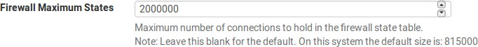
.. |image1| image:: media/image2.png
   :width: 0.25347in
   :height: 0.25347in

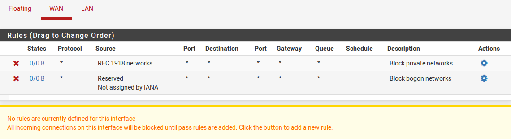
.. |image4| image:: media/image5.png
   :width: 0.25347in
   :height: 0.25347in
.. |image5| image:: media/image5.png
   :width: 0.25347in
   :height: 0.25347in

.. |image7| image:: media/image7.png
   :width: 0.25347in
   :height: 0.25347in

.. |image10| image:: media/image5.png
   :width: 0.25347in
   :height: 0.25347in
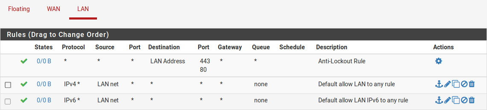
.. |image12| image:: media/image11.png
   :width: 0.25347in
   :height: 0.25347in

.. |image15| image:: media/image14.png
   :width: 0.25347in
   :height: 0.25347in

.. |image19| image:: media/image17.png
   :width: 0.25347in
   :height: 0.25347in
.. |image20| image:: media/image17.png
   :width: 0.25347in
   :height: 0.25347in
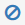

.. |image31| image:: media/image17.png
   :width: 0.25347in
   :height: 0.25347in

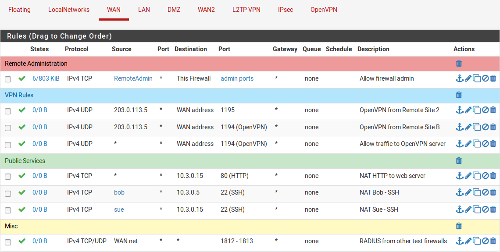
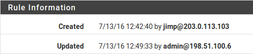

.. |image37| image:: media/image17.png
   :width: 0.25347in
   :height: 0.25347in
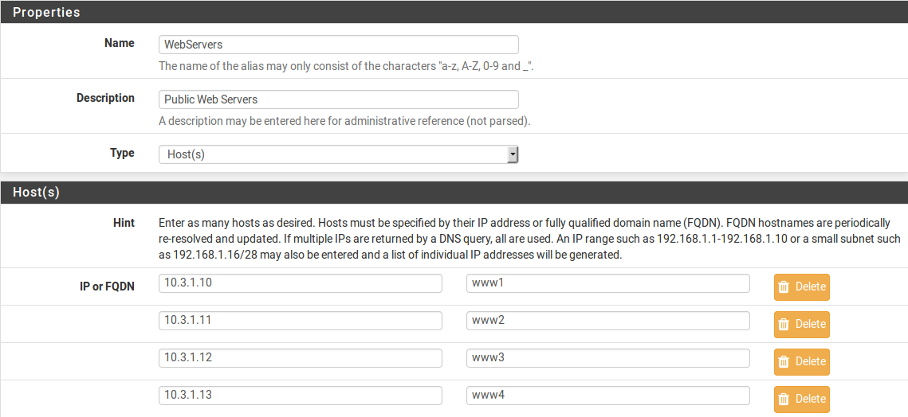
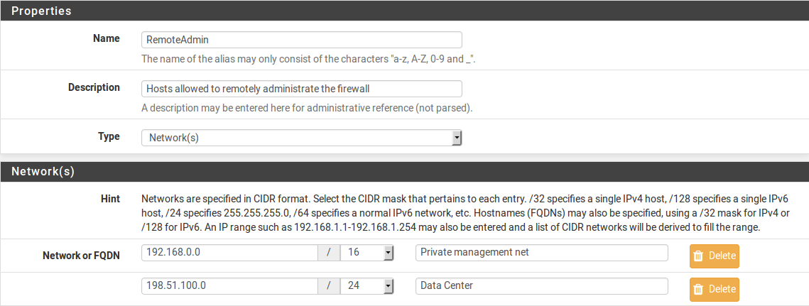
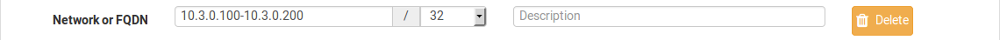
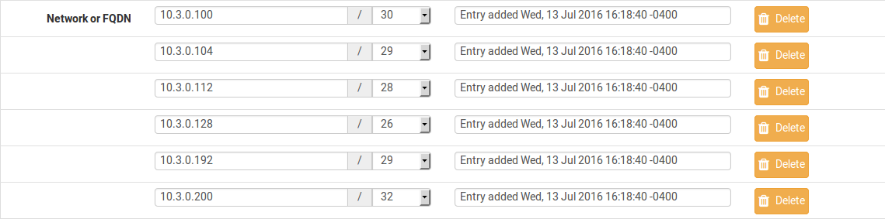
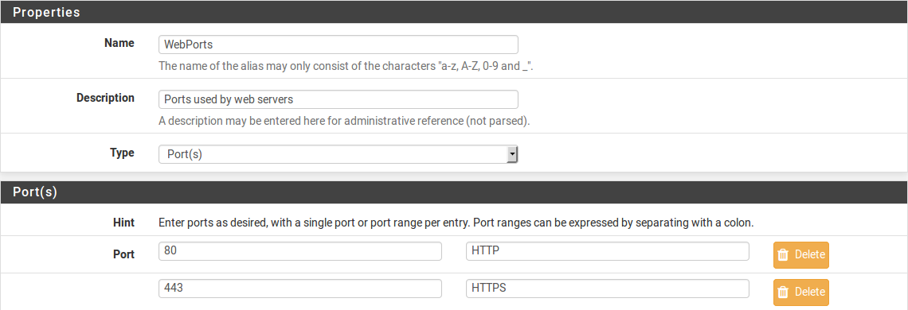

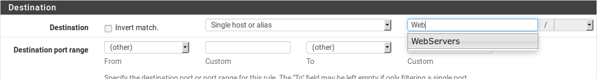

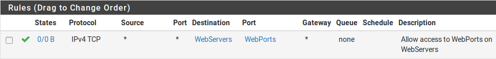
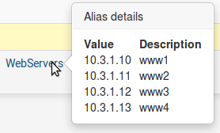
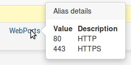
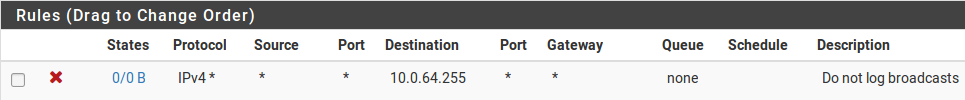
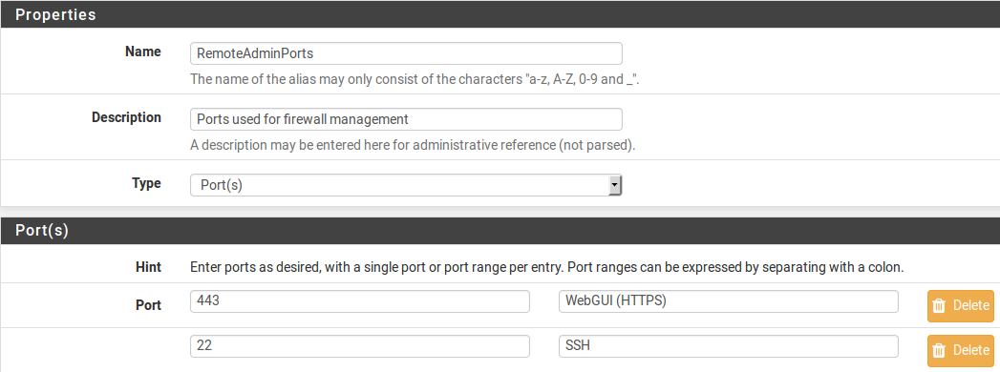

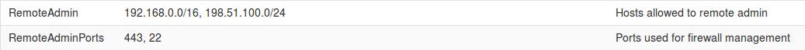
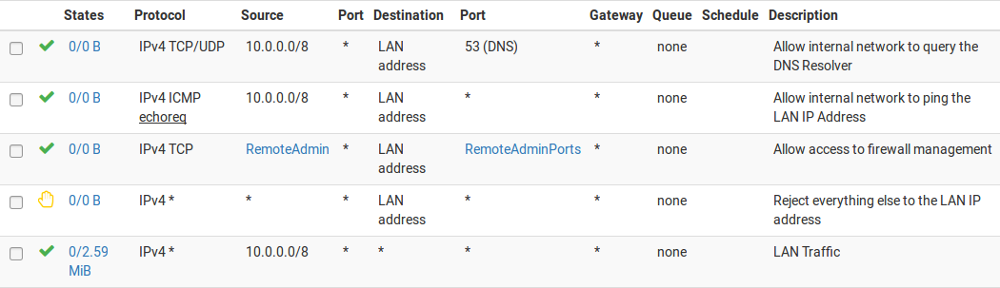
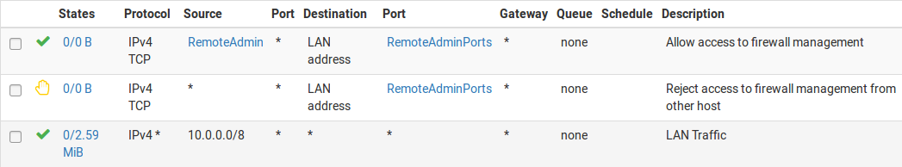
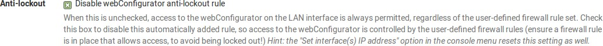
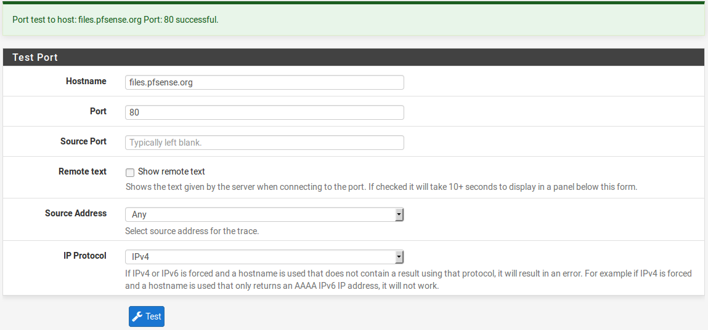

.. |image58| image:: media/image5.png
   :width: 0.25347in
   :height: 0.25347in
.. |image59| image:: media/image5.png
   :width: 0.25347in
   :height: 0.25347in
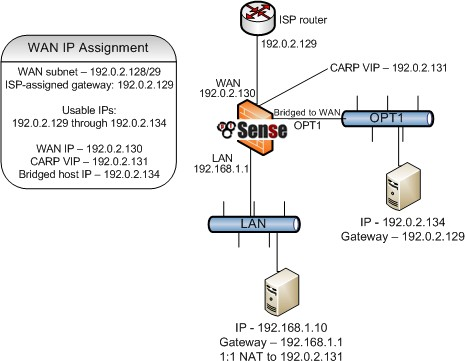
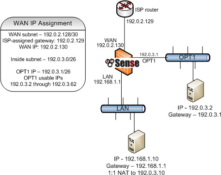

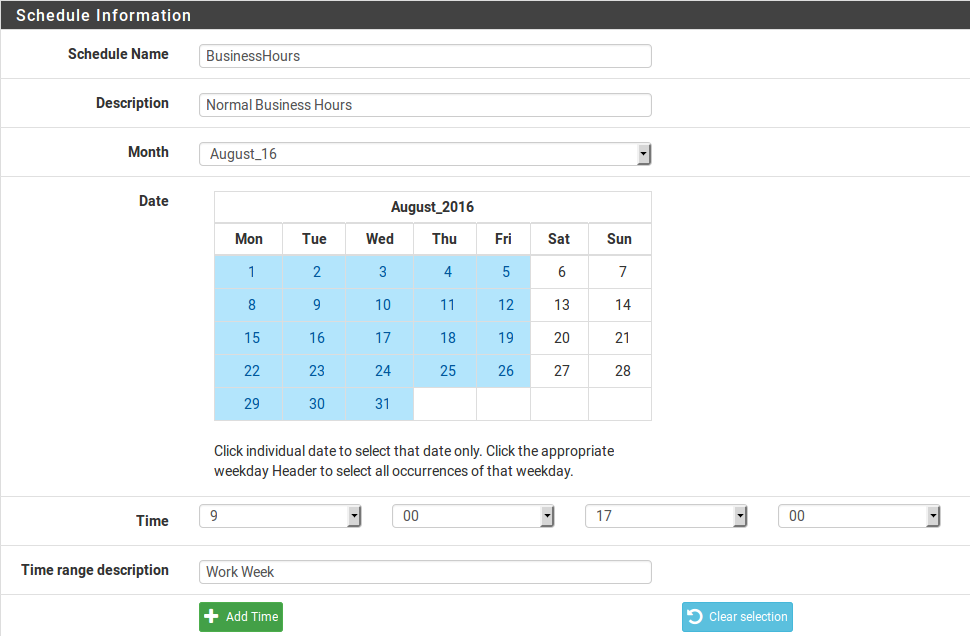
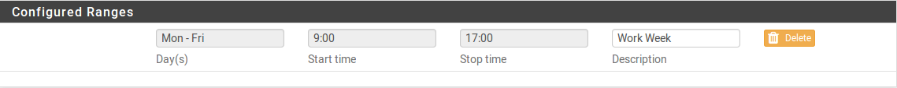
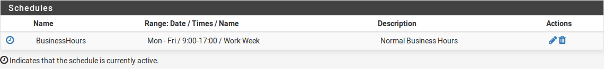
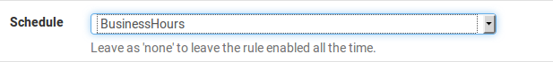
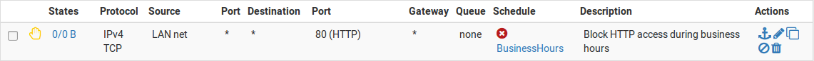
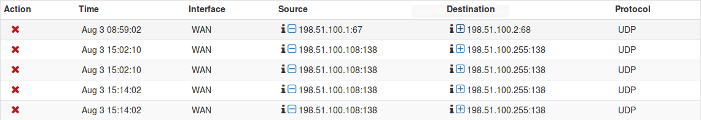

.. |image72| image:: media/image51.png
   :width: 0.25347in
   :height: 0.25347in

.. |image75| image:: media/image7.png
   :width: 0.25347in
   :height: 0.25347in

