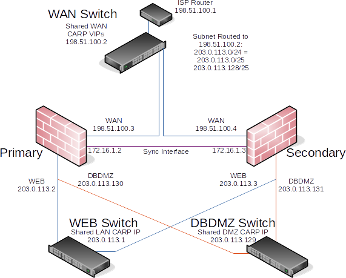

**********************
HA - Alta affidabilità
**********************

Panoramica DI pfsync
''''''''''''''''''''

pfsync consente la sincronizzazione della tabella dello stato del
firewall tra i nodi del cluster. Le modifiche alla tabella disStato sul
primario vengono inviate ai firewall secondari tramite l'interfaccia di
sincronizzazione e viceversa. Quando pfsync è attivo e configurato
correttamente, tutti i nodi avranno conoscenza di ogni connessione che
scorre attraverso il cluster. Se il nodo master fallisce, il nodo di
backup subentrerà e i client non noteranno la transizione poiché
entrambi i nodi conoscevano la connessione in anticipo.

pfsync utilizza multicast per impostazione predefinita, sebbene sia
possibile definire un indirizzo IP per forzare gli aggiornamenti unicast
per gli ambienti con solo due firewall in cui il traffico multicast non
funzionerà correttamente. Qualsiasi interfaccia attiva può essere
utilizzata per l'invio di aggiornamenti di pfsync, tuttavia utilizzare
un'interfaccia dedicata è meglio per la sicurezza e le prestazioni.
pfsync non supporta alcun metodo di autenticazione, quindi se viene
utilizzato qualcosa di diverso da un'interfaccia dedicata, è possibile
per qualsiasi utente con accesso alla rete locale inserire stati nella
tabella di stato. In ambienti a basso throughput che non sono paranoici
per la sicurezza, l'uso dell'interfaccia LAN per questo scopo è
accettabile. La larghezza di banda richiesta per questa sincronizzazione
dello stato varierà in modo significativo da un ambiente all'altro, ma
potrebbe raggiungere il 10% del throughput che attraversa il firewall in
base al tasso di inserimenti e cancellazioni di stato in una rete.

Il failover può ancora funzionare senza pfsync, ma non sarà senza
soluzione di continuità. Senza pfsync se un nodo fallisce e un altro
subentra, le connessioni utente verranno eliminate. Gli utenti possono
riconnettersi immediatamente attraverso l'altro nodo, ma sarebbero
interrotti durante la transizione. A seconda dell'utilizzo in un
particolare ambiente, questo può passare inosservato o potrebbe essere
un'interruzione significativa, ma breve.

Quando pfsync è in uso, le impostazioni pfsync devono essere abilitate
su tutti i nodi partecipanti alla sincronizzazione dello stato, inclusi
i nodi secondari, oppure non funzioneranno correttamente.

Regole di pfsync e firewall
===========================

Il traffico per pfsync deve essere passato esplicitamente
sull'interfaccia di sincronizzazione. La regola deve passare il
protocollo pfsync da una fonte della rete di sincronizzazione a
qualsiasi destinazione. Una regola che passa tutto il traffico di
qualsiasi protocollo consentirebbe anche il traffico richiesto, ma una
regola più specifica è più sicura.

pfsync e le interfacce fisiche
==============================

Gli stati in |firew4ll| sono associati a specifiche interfacce del sistema
operativo. Ad esempio, se la WAN è *em0*, allora uno stato sulla WAN
sarebbe legato a *em0*. Se i nodi cluster hanno assegnazioni hardware e
interfaccia identiche, questo funziona come previsto. Nei casi in cui
viene utilizzato un hardware diverso, questo può essere un problema. Se
la WAN su un nodo è *em0* ma su un altro nodo è *igb0*, gli stati non
corrisponderanno e non saranno trattati allo stesso modo.

È sempre preferibile avere un hardware identico, ma nei casi in cui ciò
non sia pratico, esiste una soluzione alternativa: l'aggiunta di
interfacce a un LAGG astrae l'interfaccia fisica sottostante effettiva,
quindi nell'esempio precedente, la WAN sarebbe *lagg0* su entrambi e gli
stati sarebbero associati a *lagg0*, anche se *lagg0* su un nodo
contiene *em0* e contiene *igb0* sull'altro nodo.

pfsync e aggiornamenti
======================

Normalmente |firew4ll| consentirebbe aggiornamenti del firewall senza
alcuna interruzione di rete. Sfortunatamente, questo non è sempre il
caso degli aggiornamenti in quanto il protocollo pfsync può cambiare per
adattarsi a funzionalità aggiuntive. Controllare sempre la guida
all'aggiornamento collegata in tutti gli annunci di rilascio prima di
eseguire l'aggiornamento per vedere se ci sono considerazioni speciali
per gli utenti CARP.

Panoramica della sincronizzazione della configurazione con XML-RPC su |firew4ll|
''''''''''''''''''''''''''''''''''''''''''''''''''''''''''''''''''''''''''''''''

Per semplificare il lavoro di mantenimento di nodi firewall praticamente
identici, la sincronizzazione della configurazione è possibile
utilizzando XML-RPC. Quando la sincronizzazione XML-RPC è abilitata, le
impostazioni delle aree supportate vengono copiate nel secondario e
attivate dopo ogni modifica di configurazione. La sincronizzazione
XMLRPC è facoltativa, ma mantenere un cluster costa molto più lavoro
senza di esso.

Alcune aree non possono essere sincronizzate, come la configurazione
dell'interfaccia, ma molte altre aree possono: regole del firewall,
alias, utenti, certificati, VPN, DHCP, percorsi, gateway e altro ancora.
Come regola generale, gli elementi specifici per l'hardware o di una
particolare installazione, come interfacce o valori in
**Sistema>Generale** o **Sistema>Avanzate** non si sincronizzano.
L'elenco delle aree supportate può variare a seconda della versione di
|firew4ll| in uso. Per un elenco di aree che verranno sincronizzate, vedere
gli elementi della casella di selezione su **Sistema>Sincronizzazione di
HA** nella sezione XMLRPC. La maggior parte dei
pacchetti non si sincronizzerà, ma alcuni contengono le proprie
impostazioni di sincronizzazione. Consultare la documentazione del
pacchetto per maggiori dettagli.

La sincronizzazione della configurazione dovrebbe utilizzare
l'interfaccia di sincronizzazione, o se non esiste un'interfaccia di
sincronizzazione dedicata, utilizzare la stessa interfaccia configurata
per pfsync.

In un cluster a due nodi le impostazioni XML-RPC devono essere abilitate
*solo* sul nodo primario, il nodo secondario deve *disabilitare* queste
impostazioni.

Affinché XML-RPC funzioni, entrambi i nodi devono avere la GUI in
esecuzione sulla stessa porta e protocollo, ad esempio: HTTPS sulla
porta 443, che è l'impostazione predefinita. L'account amministratore
non può essere disabilitato ed entrambi i nodi devono avere la stessa
password dell'account amministratore.

Esempio di configurazione ridondante
''''''''''''''''''''''''''''''''''''

Questa sezione descrive una semplice configurazione di tre interfacce
HA. Le tre interfacce sono LAN, WAN e Sync. Questo è funzionalmente
equivalente a una distribuzione LAN e WAN a due interfacce, con
l'interfaccia pfsync utilizzata esclusivamente per sincronizzare gli
stati di configurazione e firewall tra i firewall primari e secondari.

.. note::  
	Questo esempio copre solo una configurazione IPv4. L'HA è compatibile con IPv6, ma richiede l'indirizzamento statico sulle interfacce del firewall. Quando si prepara a configurare HA, se le assegnazioni IPv6 statiche non sono disponibili, impostare IPv6 su *Nessuno* su tutte le interfacce.

Determinare le assegnazioni degli indirizzi IP
==============================================

Il primo compito è pianificare le assegnazioni degli indirizzi IP. Una
buona strategia è quella di usare l'indirizzo IP utilizzabile più basso
nella sottorete come VIP del CARP, il successivo indirizzo IP come
indirizzo IP dell'interfaccia firewall principale e l'indirizzo IP
susseguente come indirizzo IP dell'interfaccia del firewall secondario.
Questo disegno è facoltativo, qualsiasi schema può essere utilizzato, ma
consigliamo vivamente uno schema coerente e logico per semplificare la
progettazione e l'amministrazione.

Indirizzamento WAN
------------------

Gli indirizzi WAN saranno selezionati tra quelli assegnati dall'ISP. Ad
esempio, nelle assegnazioni degli indirizzi IP della WAN della tabella,
la WAN della coppia HA è 198.51.100.0/24 e gli indirizzi 198.51.100.200
tramite 198.51.100.202 verranno utilizzati come indirizzi IP WAN.

Tabella 1: assegnazioni degli indirizzi IP della WAN

+=====================+=================================+
| IP Address          | Usage                           |
+'''''''''''''''''''''+'''''''''''''''''''''''''''''''''+
| 198.51.100.200/24   | CARP shared IP address          |
+=====================+=================================+
| 198.51.100.201/24   | Primary node WAN IP address     |
+=====================+=================================+
| 198.51.100.202/24   | Secondary node WAN IP address   |
+=====================+=================================+

Indirizzamento LAN
------------------

La sottorete LAN è 192.168.1.0/24. Per questo esempio, gli indirizzi IP
della LAN verranno assegnati come mostrato nella tabella assegnazioni
degli indirizzi IP della LAN.

Tabella 2: assegnazioni degli indirizzi IP della LAN

+==================+=================================+
| IP Address       | Usage                           |
+''''''''''''''''''+'''''''''''''''''''''''''''''''''+
| 192.168.1.1/24   | CARP shared IP address          |
+==================+=================================+
| 192.168.1.2/24   | Primary node LAN IP address     |
+==================+=================================+
| 192.168.1.3/24   | Secondary node LAN IP address   |
+==================+=================================+

Indirizzamento dell'interfaccia di sincronizzazione
---------------------------------------------------

Non c'è un VIP del CARP condiviso su questa interfaccia perché non ce
n’è bisogno. Questi indirizzi IP vengono utilizzati solo per la
comunicazione tra i firewall. Per questo esempio, 172.16.1.0/24 viene
utilizzato come sottorete di Sync. Verranno utilizzati solo due
indirizzi IP, ma a /24 viene utilizzato per essere coerente con l'altra
interfaccia interna (LAN). Per l'ultimo ottetto degli indirizzi IP,
utilizzare lo stesso ultimo ottetto dell'indirizzo IP della LAN di quel
firewall per la coerenza.

Tabella 3: sincronizzazione delle assegnazioni degli indirizzi IP

+=================+==================================+
| IP Address      | Usage                            |
+'''''''''''''''''+''''''''''''''''''''''''''''''''''+
| 172.16.1.2/24   | Primary node Sync IP address     |
+=================+==================================+
| 172.16.1.3/24   | Secondary node Sync IP address   |
+=================+==================================+

La figura *Esempio del diagramma di rete HA* mostra il layout di esempio
della coppia HA. Il primario e secondario hanno ciascuno connessioni
identiche alla WAN e alla LAN, e un cavo di crossover tra di loro per
collegare le interfacce di sincronizzazione. In questo esempio di base,
lo switch della WAN e lo switch della LAN sono ancora potenziali singoli
punti di errore. La ridondanza di commutazione è trattata più avanti in
questo capitolo nella *Ridondanza del livello 2*.

Nozioni di base sulla configurazione del cluster
================================================

Ogni nodo richiede una configurazione di base al di fuori della
configurazione HA effettiva. Non collegare entrambi i nodi nella stessa
LAN prima che entrambi i nodi abbiano una configurazione LAN non in
conflitto.

Installazione, assegnazione dell'interfaccia e configurazione di base
---------------------------------------------------------------------

Installare il sistema operativo sui firewall come al solito e assegnare
le interfacce in modo identico su entrambi i nodi. Le interfacce devono
essere assegnate nello stesso ordine su tutti i nodi esattamente. Se le
interfacce non sono allineate, la sincronizzazione della configurazione
e altre attività non si comportano correttamente. Se sono state
apportate modifiche alle assegnazioni dell'interfaccia, devono essere
replicate in modo identico su entrambi i nodi.

Quindi, connettersi alla GUI e utilizzare la procedura guidata di
configurazione per configurare ciascun firewall con un nome host univoco
e indirizzi IP statici non conflittuali. Se necessario, fare riferimento
alla *procedura guidata di configurazione*.

Ad esempio, un nodo potrebbe essere “firewall-a.example.com "e l'altro
"firewall-b.example.com", o una coppia di nomi più personalizzata.

.. note::  Evitare di nominare i nodi "master" o "backup" poiché si tratta di Stati e non di ruoli, invece potrebbero essere denominati "primario" e " secondario”.

L'indirizzo IP della LAN predefinito è 192.168.1.1. Ogni nodo deve
essere spostato al proprio indirizzo, ad esempio 192.168.1.2 per il
primario e 192.168.1.3 per il secondario. Questo layout è mostrato nelle
assegnazioni degli indirizzi IP della LAN. Una volta che ogni nodo ha un
indirizzo IP della LAN univoco, entrambi i nodi possono essere collegati
allo stesso switch LAN.

|image0|

Fig. 1: Esempio del diagramma di rete HA

Configurazione interfaccia di sincronizzazione
==============================================

Prima di procedere, è necessario configurare le interfacce di
sincronizzazione sui nodi del cluster. *Sincronizzare assegnazioni di
indirizzi IP* elenca gli indirizzi da utilizzare per le interfacce di
sincronizzazione su ciascun nodo. Una volta completato il nodo primario,
eseguirlo nuovamente sul nodo secondario con il valore di **indirizzo
IPv4** appropriato.

Per completare la configurazione dell'interfaccia di sincronizzazione,
le regole del firewall devono essere aggiunte a entrambi i nodi per
consentire la sincronizzazione.

Come minimo, le regole del firewall devono passare il traffico di
sincronizzazione della configurazione (per impostazione predefinita,
HTTPS sulla porta 443) e il traffico pfsync. Nella maggior parte dei
casi, viene utilizzata una semplice regola di stile “Permettere tutto”.

Al termine, le regole appariranno come in figura *Esempio di
sincronizzazione delle regole del firewall dell’interfaccia*, che
include anche una regola per consentire echo di ICMP (ping) per scopi
diagnostici.

|image1|

Fig. 2: Esempio di sincronizzazione delle regole del firewall
dell’interfaccia

Il secondario non ha bisogno di tali regole inizialmente, solo una
regola per consentire il traffico alla GUI per il funzionamento di
XML-RPC. Il set completo di regole si sincronizzerà una volta che
XML-RPC è stato configurato.

Configurare pfsync
==================

   La sincronizzazione dello stato tramite pfsync deve essere
   configurata su entrambi i nodi primari e secondari per funzionare.
   Prima sul nodo primario e poi sul secondario, eseguire quanto segue:

-  Passare al **Sistema>Sincronizzazione con HA**

-  Selezionare **Sincronizzare gli stati**

-  Impostare Sincronizzare l’interfaccia su *SYNC*

-  Impostare **IP del peer per la sincronizzazione con pfsync** per
   l'altro nodo. Impostarlo su 172.16.1.3 quando si configura il nodo
   primario o 172.16.1.2 quando si configura il nodo secondario

-  Fare clic su **Salvare**

Configurare la sincronizzazione della configurazione (XML-RPC)
==============================================================

.. warning:: 
	La sincronizzazione della configurazione deve essere configurata solo sul nodo primario. Non attivare mai le opzioni in questa sezione sul nodo secondario di un cluster a due membri.

Solo sul nodo primario, eseguire quanto segue:

-  Passare al **Sistema>Sincronizzazione con HA**

-  Impostare **Sincronizzare la configurazione per l’IP** su
   Sincronizzare l’indirizzo IP sul nodo secondario, 172.16.1.3

-  Impostare il **Nome utente del sistema remoto** su admin.

		.. note::  
			questo deve essere sempre admin, nessun altro utente funzionerà!

-  Impostare **Password del sistema remoto** su password dell'account
   utente dell’admin e ripetere il valore nella casella di conferma.

-  Selezionare le caselle per ogni area da sincronizzare con il nodo
   secondario. Per questa guida, come per la maggior parte delle
   configurazioni, tutte le caselle sono selezionate. Il pulsante
   **Commutare tutto** può essere utilizzato per selezionare tutte le
   opzioni contemporaneamente, piuttosto che selezionarle singolarmente.

-  Fare clic su **Salvare**

Per una rapida conferma che la sincronizzazione ha funzionato, sul nodo
secondario passare a **Firewall>Regole** sulla

scheda di **sincronizzazione**. Le regole inserite sul primario sono ora
lì e la regola temporanea è sparita.

I due nodi sono ora collegati per la sincronizzazione della
configurazione! Le modifiche apportate al nodo primario nelle aree
supportate verranno sincronizzate con il secondario ogni volta che viene
apportata una modifica.

.. warning:: 
	Non apportare modifiche al secondario nelle aree impostate per essere sincronizzate! Queste modifiche verranno sovrascritte la prossima volta che il nodo primario esegue una sincronizzazione.

Configurazione degli IP virtuali del CARP
-----------------------------------------

Con la sincronizzazione della configurazione in atto, gli indirizzi IP
virtuali CARP devono essere aggiunti solo al nodo primario e saranno
copiati automaticamente al secondario.

-  Passare a **Firewall>IP virtuali** sul nodo primario per gestire i
   VIP del CARP

-  Fare clic su |image2| **Aggiungere** nella parte superiore della
   lista per creare un nuovo VIP.

	.. note::  Un VIP deve essere aggiunto per ogni interfaccia che gestisce il traffico utente, in questo caso WAN e LAN.

    **Tipo** Definisce il tipo di VIP, in questo caso *CARP*

    **Interfaccia** Definisce l'interfaccia su cui risiederà il VIP, ad
    esempio WAN

    **Indirizzo(i)** La casella **Indirizzo** dove vengono inseriti i
    valori Ddell'indirizzo IP per il VIP. È inoltre necessario
    selezionare una maschera di sottorete e deve corrispondere alla
    maschera di sottorete sull'indirizzo IP dell'interfaccia. Per questo
    esempio, immettere 198.51.100.200 e 24 (vedere *Assegnazioni degli
    indirizzi IP della WAN*).

    **Password dell’IP virtuale** Imposta la password per il VIP del
    CARP. Questo deve corrispondere solo tra i due nodi, che saranno
    gestiti dalla sincronizzazione. La casella password e conferma della
    password deve essere compilata e deve corrispondere.

    **Gruppo Vhid** Definisce l'ID per il VIP del CARP. Una tattica
    comune è quella di far corrispondere il vhid all'ultimo ottetto
    dell'indirizzo IP, quindi in questo caso scegliere 200

    **Frequenza degli annunci** Determina la frequenza con cui vengono
    inviati i segnali vitali del CARP.

    **Base** Controlla quanti secondi interi passano tra i segnali
    vitali, in genere *1*. Questo dovrebbe corrispondere tra i nodi del
    cluster.

    **Distorto** Controlla frazioni di secondo (incrementi 1/256esimo).
    Un nodo primario è in genere impostato su 0 o 1, i nodi secondari
    saranno 100 o superiore. Questa regolazione viene gestita
    automaticamente dalla sincronizzazione XML-RPC.

    **Descrizione** Breve testo per identificare il VIP, come WAN CARP
    VIP.

.. note::  se il CARP sembra essere troppo sensibile alla latenza su una determinata rete, si consiglia di regolare l’opzione **Base** aggiungendo un secondo alla volta fino a raggiungere la stabilità.

La descrizione di sopra ha usato il VIP della WAN come esempio. Il VIP
della LAN sarebbe configurato in modo simile, tranne che sarà
sull'interfaccia LAN e l'indirizzo sarà 192.168.1.1 (vedere
*Assegnazioni degli indirizzi IP della LAN*).

Se ci sono ulteriori indirizzi IP nella sottorete WAN che verranno
utilizzati per scopi come NAT 1:1, Porta forward, VPN, ecc., possono
essere aggiunti anche ora.

Fare clic su **Applicare le modifiche** dopo aver apportato modifiche ai
VIP.

Dopo aver aggiunto VIP, controllare **Firewall>IP virtuali** sul nodo
secondario per garantire che i VIP siano sincronizzati come previsto.

Gli indirizzi IP virtuali su entrambi i nodi sembreranno un elenco di
indirizzi IP virtuali del CARP se il processo ha avuto successo.

|image3|

Fig. 3: Elenco di indirizzi IP virtuali del CARP

Configurare il NAT in uscita per il CARP
----------------------------------------

Il prossimo passo sarà configurare il NAT in modo che i client sulla LAN
utilizzino l'IP della WAN condiviso come indirizzo.

-  Passare a **Firewall>NAT**, scheda **In uscita**

-  Fare clic per selezionare *Generazione manuale delle regole NAT in
   uscita*

-  Fare clic su **Salvare**

   Apparirà un insieme di regole che sono le regole equivalenti a quelle
   in vigore per il NAT automatico in uscita. Regolare invece le regole
   per le sorgenti della sottorete interne per lavorare con l'indirizzo
   IP del CARP.

-  Fare clic su |image4| a destra della regola per modificare

-  Individuare la sezione **traduzione** della pagina

-  Selezionare l'indirizzo VIP della WAN del CARP dal menu a discesa di
   **indirizzo**

-  Modificare la descrizione per ricordare che questa regola sarà NAT
   LAN per l’indirizzo VIP della WAN del CARP

.. warning::
	Se in seguito vengono aggiunte altre interfacce locali, ad esempio una seconda LAN, DMZ, ecc., e tale interfaccia utilizza indirizzi IP privati, è necessario aggiungere ulteriori regole del NAT in uscita manuale in quel momento.

Al termine, le modifiche alle regole appariranno come quelle trovate in
*Regole del NAT in uscita per la LAN con il VIP del CARP*

|image5|

Fig. 4: Regole del NAT in uscita per la LAN con il VIP del CARP

Modifica del server DHCP
------------------------

I demoni del server DHCP sui nodi del cluster necessitano di regolazioni
in modo che possano lavorare insieme. Le modifiche si sincronizzeranno
dal primario al secondario, così come con i VIP e il NAT in uscita,
queste modifiche devono essere apportate solo sul nodo primario.

-  Passare a **Servizi>Server DHCP**, scheda **LAN \*.**

-  Impostare il **Server DNS** su VIP del CARP della LAN, qui
   192.168.1.1

-  Impostare il **Gateway** su VIP del CARP della LAN, qui 192.168.1.1

-  Impostare **IP del peer di failover** su indirizzo IP della LAN
   effettivo del nodo secondario, qui 192.168.1.3

-  Fare clic su **Salvare**

L'impostazione del **Server DNS** e del **Gateway** per un VIP del CARP
assicura che i client locali stiano parlando con l'indirizzo di failover
e non direttamente su entrambi i nodi. In questo modo se il primario
fallisce, i client locali continueranno a parlare con il nodo
secondario.

L'\ **IP del peer di failover** consente al demone di comunicare con il
peer direttamente in questa sottorete per scambiare dati come le
informazioni di locazione. Quando le impostazioni si sincronizzano con
il secondario, questo valore viene regolato automaticamente in modo che
i punti secondari ritornino al primario.

Multi-WAN con HA
''''''''''''''''

HA può anche essere distribuito per la ridondanza del firewall in una
configurazione Multi-WAN. Questa sezione descrive in dettaglio la
configurazione VIP e NAT necessaria per una doppia distribuzione HA
della WAN. Questa sezione copre solo argomenti specifici per HA e
multi-WAN.

Determinare le assegnazioni degli indirizzi IP
==============================================

Per questo esempio, quattro indirizzi IP verranno utilizzati su ogni
WAN. Ogni firewall ha bisogno di un indirizzo IP, più un VIP del CARP
per il NAT in uscita, più un VIP del CARP aggiuntivo per una voce NAT
1:1 che verrà utilizzata per un server di posta interno nel segmento
DMZ.

Indirizzo IP di WAN e WAN2
-----------------------------

La tabella *Indirizzamento dell’IP della WAN* mostra l'indirizzamento IP
per entrambe le WAN. Nella maggior parte degli ambienti questi saranno
indirizzi IP pubblici.

Tabella 4: Indirizzamento dell’IP della WAN

+==================+====================================+
| IP Address       | Usage                              |
+''''''''''''''''''+''''''''''''''''''''''''''''''''''''+
| 198.51.100.200   | Shared CARP VIP for Outbound NAT   |
+==================+====================================+
| 198.51.100.201   | Primary firewall WAN               |
+==================+====================================+
| 198.51.100.202   | Secondary firewall WAN             |
+==================+====================================+
| 198.51.100.203   | Shared CARP VIP for 1:1 NAT        |
+==================+====================================+

Tabella 5: Indirizzamento dell’IP della WAN2

+================+====================================+
| IP Address     | Usage                              |
+''''''''''''''''+''''''''''''''''''''''''''''''''''''+
| 203.0.113.10   | Shared CARP VIP for Outbound NAT   |
+================+====================================+
| 203.0.113.11   | Primary firewall WAN2              |
+================+====================================+
| 203.0.113.12   | Secondary firewall WAN2            |
+================+====================================+
| 203.0.113.13   | Shared CARP VIP for 1:1 NAT        |
+================+====================================+

Indirizzamento della LAN
------------------------

La sottorete LAN è 192.168.1.0/24. Per questo esempio, gli indirizzi IP
della LAN verranno assegnati come segue.

Tabella 6: assegnazioni degli indirizzi IP della LAN

+===============+==========================+
| IP Address    | Usage                    |
+'''''''''''''''+''''''''''''''''''''''''''+
| 192.168.1.1   | CARP shared LAN VIP      |
+===============+==========================+
| 192.168.1.2   | Primary firewall LAN     |
+===============+==========================+
| 192.168.1.3   | Secondary firewall LAN   |
+===============+==========================+

Indirizzamento di DMZ
---------------------

La sottorete DMZ è 192.168.2.0/24. Per questo esempio, gli indirizzi IP
di DMZ verranno assegnati come segue nella tabella *assegnazioni degli
indirizzi IP di DMZ*.

Tabella 7: assegnazioni degli indirizzi IP di DMZ

+===============+==========================+
| IP Address    | Usage                    |
+'''''''''''''''+''''''''''''''''''''''''''+
| 192.168.2.1   | CARP shared DMZ VIP      |
+===============+==========================+
| 192.168.2.2   | Primary firewall DMZ     |
+===============+==========================+
| 192.168.2.3   | Secondary firewall DMZ   |
+===============+==========================+

Indirizzamento di pfsync
------------------------

Non ci sarà alcun VIP del CARP condiviso su questa interfaccia perché
non ce n’è bisogno. Questi indirizzi IP vengono utilizzati solo per la
comunicazione tra i firewall. Per questo esempio, 172.16.1.0/24 verrà
utilizzato come sottorete di Sync. Verranno utilizzati solo due
indirizzi IP, ma a /24 viene utilizzato per essere coerente con le altre
interfacce interne. Per l'ultimo ottetto degli indirizzi IP, viene
scelto lo stesso ultimo ottetto dell'IP della LAN di quel firewall per
coerenza.

Tabella 8: Sincronizzazione delle assegnazioni degli indirizzi IP

+==============+===========================+
| IP Address   | Usage                     |
+''''''''''''''+'''''''''''''''''''''''''''+
| 172.16.1.2   | Primary firewall Sync     |
+==============+===========================+
| 172.16.1.3   | Secondary firewall Sync   |
+==============+===========================+

Configurazione del NAT
======================

La configurazione del NAT quando si utilizza HA con Multi-WAN è la
stessa di HA con una singola WAN. Assicurarsi che vengano utilizzati
solo i VIP del CARP per il traffico in entrata o il routing. Per
ulteriori informazioni sulla configurazione NAT, vedere *Traduzione
degli indirizzi di rete*.

Configurazione Del Firewall
===========================

Con Multi-WAN una regola firewall deve essere in atto per passare il
traffico alle reti locali utilizzando il gateway predefinito. In caso
contrario, quando il traffico tenta di raggiungere l'indirizzo del CARP
o dalla LAN a DMZ, uscirà invece da una connessione WAN.

Una regola deve essere aggiunta nella parte superiore delle regole del
firewall per tutte le interfacce interne che indirizzeranno il traffico
per tutte le reti locali al gateway predefinito. La parte importante è
che il gateway deve essere predefinito per questa regola e non uno dei
gruppi di gateway di failover o di bilanciamento del carico. La
destinazione di questa regola sarebbe la rete LAN locale o un alias
contenente reti raggiungibili localmente.

Diagramma di HA delle Multi-WAN con DMZ
=======================================

A causa degli elementi della WAN e di DMZ aggiuntivi, un diagramma di
questo layout è molto più complesso come si può vedere nella figura
*Diagramma di HA delle Multi-WAN con DMZ*.

Verifica della funzionalità di failover
'''''''''''''''''''''''''''''''''''''''

Poiché l'utilizzo di HA riguarda l'HA, un test
approfondito prima di mettere un cluster in produzione è un must. La
parte più importante di quel test è assicurarsi che i peer HA falliscano
con grazia durante le interruzioni del sistema.

Se le azioni in questa sezione non funzionano come previsto, vedere
*Risoluzione dei problemi della HA*.

Controllare lo stato del CARP
=============================

Su entrambi i sistemi, passare a **Stato>CARP (failover)**. Se tutto
funziona correttamente, il primario mostrerà |image6| MASTER per lo
stato di tutti i VIP del CARP e il secondario mostrerà |image7| il
**BACKUP**.

Se uno mostra invece **DISABILITATO**, fare clic sul pulsante
**Abilitare CARP** e quindi aggiornare la pagina.

Se un'interfaccia mostra |image8| **INIZIALIZZAZIONE**, significa che
l'interfaccia contenente il VIP del CARP non ha un collegamento.
Collegare l'interfaccia a uno switch o almeno all'altro nodo. Se
l'interfaccia non verrà utilizzata per qualche tempo, rimuovere il VIP
del CARP dall'interfaccia in quanto ciò interferirà con il normale
funzionamento del CARP.

|image9|

Fig. 5: Diagramma di HA delle Multi-WAN con DMZ

Verifica la replica della configurazione
========================================

Passare a posizioni chiave sul nodo secondario, come **Firewall>Regole**
e **Firewall>NAT** e assicurarsi che le regole create solo sul nodo
primario vengano replicate al nodo secondario.

Se l'esempio precedente in questo capitolo è stato seguito, la regola
del firewall "temp" sull'interfaccia pfsync verrà sostituita dalla
regola del primario.

Controllare lo stato del failover DHCP
======================================

Se il failover DHCP è stato configurato, il suo stato può essere
controllato in **Stato>Locazioni di DHCP**. Una nuova sezione apparirà
nella parte superiore della pagina contenente lo stato del pool di
failover di DHCP, come nella figura *Stato del pool di failover di
DHCP*.

|image10|

Fig. 6: Stato del pool di failover di DHCP

Testare il failover del CARP
============================

Ora per il vero test di failover. Prima di iniziare, assicurarsi che un client locale dietro la coppia del CARP sulla LAN possa connettersi a Internet sia con entrambi i firewall di |firew4ll| online che in esecuzione. Una volta che è confermato per funzionare, è un ottimo momento per fare un backup.

Per il test effettivo, scollegare il nodo primario dalla rete o spegnerlo temporaneamente. Il client sarà in grado di mantenere il caricamento del contenuto da Internet attraverso il nodo secondario. Selezionare di nuovo **Stato>CARP (failover)** sul backup e ora segnalerà che è **MASTER** per i VIP della LAN e della WAN del CARP.
Ora riportare il nodo primario online e riprenderà il suo ruolo di **MASTER**, e il sistema di backup si sposterà nuovamente su **BACKUP**. In qualsiasi momento durante questo processo, la connettività Internet continuerà a funzionare correttamente.

Testare la coppia HA nel maggior numero possibile di scenari di errore. Ulteriori test includono:

-  Scollegare il cavo WAN o LAN
-  Tirare la spina di alimentazione del primario
-  Disabilitare il CARP sul primario utilizzando sia la funzione di disattivazione temporanea sia la modalità di manutenzione
-  Testare con ogni sistema singolarmente (spegnere il secondario, quindi riaccendere e spegnere il primario)
-  Scaricare un file o provare lo streaming audio/video durante il failover
-  Eseguire una richiesta continua di echo di ICMP (ping) su un host Internet durante il failover

Fornire ridondanza senza il NAT
'''''''''''''''''''''''''''''''

Come accennato in precedenza, solo i VIP del CARP forniscono ridondanza
per gli indirizzi gestiti direttamente dal firewall e possono essere
utilizzati solo in combinazione con NAT o servizi sul firewall stesso.
La ridondanza può anche essere fornita per sottoreti IP pubbliche
instradate con HA. Questa sezione descrive questo tipo di
configurazione, che è comune nelle reti di grandi dimensioni, ISP e reti
ISP wireless, e ambienti di data center.

Assegnazioni IP pubblici
=========================

È necessario almeno un blocco IP pubblico a /29 per il lato WAN di
|firew4ll|, che fornisce sei indirizzi IP utilizzabili. Solo tre sono
necessari per una distribuzione di due firewall, ma questa è la
sottorete IP più piccola che ospiterà tre indirizzi IP. Ogni firewall
richiede un IP e sul lato WAN è necessario almeno un VIP del CARP.

La seconda sottorete IP pubblica verrà instradata a uno dei VIP del CARP
dall'ISP, dal data center o dal router upstream. Poiché questa sottorete
viene instradata a un VIP del CARP, il routing non dipenderà da un
singolo firewall. Per la configurazione di esempio descritta in questo
capitolo, verrà utilizzata una sottorete IP pubblica /24 e verrà
suddivisa in due sottoreti /25.

Panoramica della rete
=====================

La rete di esempio qui raffigurata è un ambiente di data center composto
da due firewall |firew4ll| con quattro interfaccie ciascuno: WAN, LAN,
DBDMZ e pfsync. Questa rete contiene un certo numero di server web e
database. Non è basato su alcuna rete reale, ma ci sono innumerevoli
distribuzioni di produzione simili a questa.

Rete WAN
--------

Il lato WAN si connette alla rete upstream, all'ISP, al data center o al
router upstream.

Rete WEB
--------

Il segmento WEB in questa rete utilizza l'interfaccia "LAN" ma
rinominata. Contiene server web, quindi è stato chiamato WEB ma potrebbe
essere chiamato DMZ, SERVER o qualsiasi cosa desiderata.

Rete DBDMZ
----------

Questo segmento è un'interfaccia OPT e contiene i server di database. È
comune separare i server web e database in due reti in ambienti con
host. I server di database in genere non richiedono l'accesso diretto da
Internet, e quindi sono meno soggetti a compromessi rispetto ai server
web.

Sincronizzare la rete
---------------------

La rete di sincronizzazione in questo diagramma viene utilizzata per
replicare le modifiche di configurazione di |firew4ll| tramite XML-RPC e
per pfsync per replicare le modifiche della tabella di stato tra i due
firewall. Come descritto in precedenza in questo capitolo, si consiglia
un'interfaccia dedicata a questo scopo.

|image11|

Fig. 7: Diagramma di HA con IP instradati

Layout di rete
--------------

La figura *Diagramma di HA con IP instradati* illustra questo layout di
rete, compresi tutti gli indirizzi IP instradabili, la rete WEB, e il
database DMZ.

.. note::  
	i segmenti contenenti server di database in genere non devono essere accessibili pubblicamente e quindi utilizzerebbero più comunemente sottoreti IP private, ma l'esempio illustrato qui può essere utilizzato indipendentemente dalla funzione delle due sottoreti interne. 

Ridondanza di livello 2
'''''''''''''''''''''''

I diagrammi precedenti in questo capitolo non descrivevano la ridondanza
del livello 2 (switch), per evitare di lanciare troppi concetti ai
lettori contemporaneamente. Questa sezione copre gli elementi di
progettazione di livello 2 da considerare quando si pianifica una rete
ridondante. Questo capitolo presuppone una distribuzione di due sistemi,
anche se questo si adatta a tutte le installazioni necessarie.

Se entrambi i firewall |firew4ll| ridondanti sono collegati allo stesso
switch su qualsiasi interfaccia, tale switch diventa un singolo punto di
errore. Per evitare questo singolo punto di errore, la scelta migliore è
quella di distribuire due switch per ogni interfaccia (diverso
dall'interfaccia pfsync dedicata).

L’\ *Esempio del diagramma di rete HA* è centrato sulla rete, non mostra
l'infrastruttura switch. La figura *Diagramma di HA con switch
ridondanti* illustra come appare quell'ambiente con un'infrastruttura di
switch ridondante.

|image12|

Fig. 8: Diagramma di HA con switch ridondanti

Configurazione dello switch
===========================

Quando si utilizzano più switch, gli switch devono essere interconnessi.
Finché c'è una singola connessione tra i due switch e nessun ponte su
uno dei firewall, questo è sicuro con qualsiasi tipo di switch. Dove si
utilizza il bridging o dove esistono più interconnessioni tra gli
switch, è necessario prestare attenzione per evitare loop di livello 2.
Sarebbe necessario uno switch gestito che sia in grado di utilizzare il
protocollo dell’albero di spanning (Spanning Tree Protocol, STP) per
rilevare e bloccare le porte che altrimenti creerebbero loop di switch.
Quando si utilizza STP, se un collegamento attivo muore, ad esempio un
errore di commutazione, allora un collegamento di backup può essere
automaticamente portato al suo posto.

|firew4ll| ha anche il supporto per l’aggregazione del link di *lagg (4)* e
interfacce di failover del link che permette più interfacce di rete per
essere collegato a uno o più switch per una maggiore tolleranza ai
guasti. Vedere *LAGG (Aggregazione di link)* per ulteriori informazioni
sulla configurazione dell'aggregazione dei link.

Ridondanza dell'host
====================

È più difficile ottenere la ridondanza dell'host per i sistemi critici
all'interno del firewall. Ogni sistema potrebbe avere due schede di rete
e una connessione a ciascun gruppo di switch utilizzando il protocollo
del controllo di aggregazione del link (Link Aggregation Control
Protocol, LACP) o funzionalità specifiche del fornitore simili. I server
potrebbero anche avere più connessioni di rete e, a seconda del sistema
operativo, potrebbe essere possibile eseguire il CARP o un protocollo
simile su un set di server in modo che siano anche ridondanti. Fornire
la ridondanza dell'host è più specifico per le funzionalità degli switch
e dei sistemi operativi del server, che è al di fuori dell'ambito di
questo libro.

Altri singoli punti di guasto
=============================

Quando si tenta di progettare una rete completamente ridondante, ci sono
molti singoli punti di errore che a volte vengono persi. A seconda del
livello di uptime da raggiungere, ci sono sempre più cose da considerare
rispetto a un semplice errore di switch. Ecco alcuni altri esempi di
ridondanza su scala più ampia:

-  Alimentazione isolata per ogni segmento ridondante.

   -  Utilizzare switch separati per sistemi ridondanti.
   -  Utilizzare più banche/generatori UPS.
   -  Utilizzare più fornitori di energia, inserendo lati opposti dell'edificio, ove possibile.

-  Anche una configurazione Multi-WAN non è garanzia di uptime di
   Internet.

   -  Utilizzare più tecnologie di connessione a Internet (DSL, cavo, fibra, Wireless).
   -  Se due vettori utilizzano lo stesso polo/tunnel/percorso, entrambi potrebbero essere eliminati allo stesso tempo.

-  Avere raffreddamento di backup, refrigeratori ridondanti o un condizionatore d'aria portatile/di emergenza.
-  Considerare di posizionare il secondo set di apparecchiature ridondanti in un'altra stanza, in un altro piano o in un altro edificio.
-  Avere una configurazione duplicata in un'altra parte della città o in un'altra città.
-  Ho sentito che l'hosting è economico su Marte, ma la latenza è assassina.

HA con bridging
'''''''''''''''''''''''''''''''

L'HA non è attualmente compatibile con il bridging in
una capacità nativa che è considerata affidabile o degna di uso in
produzione. Richiede un significativo intervento manuale. I dettagli del
processo possono essere trovati in HA.

Utilizzare gli Alias di IP per ridurre il traffico di heartbeat
'''''''''''''''''''''''''''''''''''''''''''''''''''''''''''''''

Se ci sono un gran numero di VIP del CARP su un segmento, questo può
portare a un sacco di traffico multicast. Un heartbeat al secondo viene
inviato per il VIP del CARP. Per ridurre questo traffico, i VIP
aggiuntivi possono essere "impilati" in cima a un VIP del CARP su
un'interfaccia. In primo luogo, scegliere un VIP del CARP per essere il
VIP “principale” per l'interfaccia. Quindi, cambiare gli altri VIP CARP
in quella stessa sottorete per essere un IP dell’Alias di tipo VIP, con
l'interfaccia "principale" del VIP del CARP selezionata per essere la
loro **interfaccia** sulla configurazione VIP.

Ciò non solo riduce i segnali vitali che verranno visualizzati su un
determinato segmento, ma fa sì che tutti i VIP dell’alias IP cambino
stato insieme al VIP del CARP “principale”, riducendo la probabilità che
un problema di livello 2 causi il mancato superamento dei singoli VIP
del CARP come previsto.

I VIP dell’Alias IP normalmente non si sincronizzano tramite
sincronizzazione di configurazione XML-RPC, tuttavia, i VIP dell’alias
IP impostati per utilizzare le interfacce CARP in questo modo si
sincronizzano.

Interfaccia
'''''''''''

Se sono richieste più sottoreti su una singola interfaccia con HA, ciò
può essere ottenuto utilizzando Alias dell’IP. Come per gli indirizzi IP
dell'interfaccia principale, si consiglia a ciascun firewall di avere un
indirizzo IP all'interno della sottorete aggiuntiva, per un totale di
almeno tre IP per sottorete. Le voci dell’alias IP separate devono
essere aggiunte a ciascun nodo all'interno della nuova sottorete,
assicurandosi che le relative maschere di sottorete corrispondano alla
maschera di sottorete effettiva per la nuova sottorete. I VIP dell’alias
dell’IP che sono direttamente su un'interfaccia non si sincronizzano,
quindi questo è sicuro.

Una volta che il VIP dell’alias dell’IP è stato aggiunto a entrambi i
nodi per ottenere un punto d'appoggio nella nuova sottorete, il VIP del
CARP può essere aggiunto utilizzando gli indirizzi IP dalla nuova
sottorete.

È possibile omettere gli alias IP e utilizzare un VIP CARP direttamente
nell'altra sottorete purché non sia richiesta la comunicazione tra la
sottorete aggiuntiva ed entrambi i singoli nodi HA.

Risoluzione dei problemi di alta affidabilità
''''''''''''''''''''''''''''''''''''''''''''''

Le configurazioni ad HA possono essere complesse e
con tanti modi diversi per configurare un cluster di failover, quindi
può essere difficile far funzionare correttamente le cose. In questa
sezione, alcuni problemi comuni (e non così comuni) saranno discussi e,
si spera, risolti per la maggior parte dei casi. Se i problemi sono
ancora presenti dopo aver consultato questa sezione, c'è una scheda
CARP/VIP dedicata sul forum |firew4ll|.

Prima di procedere, prendersi il tempo necessario per controllare tutti
i membri del cluster HA per assicurarsi che abbiano configurazioni
coerenti. Spesso, è d’aiuto fare riferimento alla configurazione di
esempio, effettuare un doppio controllo su tutte le impostazioni
corrette. Ripetere il processo sul nodo secondario e osservare i luoghi
in cui la configurazione deve essere diversa sul secondario. Assicurarsi
di controllare lo stato del CARP (*controllare lo stato del CARP*) e
assicurarsi che il CARP sia abilitato su tutti i membri del cluster.

Gli errori relativi a HA verranno registrati in **Stato>Registro di
sistema**, nella scheda **Sistema**. Controllare i registri di ciascun
sistema coinvolto per vedere se ci sono messaggi relativi a XMLRPC Sync,
transizioni degli stati del CARP o altri errori correlati.

Errori di configurazione comuni
===============================

Ci sono tre errori di configurazione comuni che possono accadere che
impediscono a HA di funzionare correttamente.

Utilizzare un VHID diverso su ogni VIP del CARP
-----------------------------------------------

Un VHID diverso deve essere utilizzato su ogni VIP del CARP creato su
una determinata interfaccia o dominio di trasmissione. Con una singola
coppia HA, la convalida dell'input impedirà i VHID duplicati. Purtroppo
non è sempre così semplice. CARP è una tecnologia multicast, e come tale
qualsiasi cosa utilizzi il CARP sullo stesso segmento di rete deve
utilizzare un VHID unico. VRRP utilizza anche un protocollo simile a
CARP, quindi assicurarsi che non ci siano conflitti con i VHID di VRRP,
come ad esempio se l'ISP o un altro router sulla rete locale utilizzi
VRRP.

Il modo migliore per aggirare questo problema è usare un set unico di
VHID. Se è in uso una rete privata sicura, iniziare a numerare da 1. Su
una rete in cui VRRP o CARP sono in conflitto, consultare
l'amministratore di tale rete per trovare un blocco gratuito di VHID

Tempi errati
------------

Verificare che tutti i sistemi coinvolti sincronizzino correttamente i
loro orologi e abbiano fusi orari validi, specialmente se in esecuzione
in una macchina virtuale. Se gli orologi sono troppo distanti, alcune
attività di sincronizzazione come il failover DHCP non funzioneranno
correttamente.

Maschera di sottorete non corretta
----------------------------------

La vera maschera di sottorete deve essere utilizzata per un VIP del
CARP, non /32. Questo deve corrispondere alla maschera di sottorete per
l'indirizzo IP sull'interfaccia a cui è assegnato l'IP CARP.

Indirizzo IP per l’interfaccia del CARP
---------------------------------------

L'interfaccia su cui risiede il VIP del CARP deve già avere un altro IP
definito direttamente sull'interfaccia (VLAN, LAN, WAN, OPT) prima che
possa essere utilizzato.

Errore di hash non corretto
===========================

Ci sono alcuni motivi per cui questo errore si presenta nei registri di
sistema, alcuni più preoccupanti di altri.

Se il CARP non funziona correttamente quando questo errore è presente,
potrebbe essere dovuto a una mancata corrispondenza nella
configurazione. Assicurarsi che per un determinato VIP, il VHID, la
password e l'indirizzo IP/maschera di sottorete corrispondano tutti.

Se le impostazioni sembrano essere corrette e il CARP ancora non
funziona durante la generazione di questo messaggio di errore, allora ci
possono essere più istanze CARP sullo stesso dominio broadcast.
Disabilitare il CARP e monitorare la rete con tcpdump (*Cattura dei
pacchetti*) per verificare la presenza di altri CARP o traffico simile
al CARP e regolare i VHID in modo appropriato.

Se la CARP funziona correttamente e questo messaggio si trova nei
registri quando il sistema si avvia, potrebbe essere ignorato. È normale
che questo messaggio venga visualizzato durante l'avvio, purché il CARP
continui a funzionare correttamente (il principale mostra **MASTER**, il
secondario mostra **BACKUP** sullo stato).

Entrambi i sistemi appaiono come MASTER
=======================================

Ciò accadrà se il secondario non può vedere gli annunci CARP del rimario
primario. Verificare la presenza di regole del firewall, problemi di
connettività, configurazioni di switch. Controllare anche i registri di
sistema per eventuali errori rilevanti che possono portare a una
soluzione. Se ciò si verifica in un prodotto VM (Virtual Machine) come
ESX, vedere *Problemi all’interno delle macchine virtuali (ESX).*

Il sistema primario è bloccato in BACKUP
========================================

In alcuni casi, questo può accadere normalmente per un breve periodo
dopo che un sistema torna online. Tuttavia, alcuni guasti hardware o
altre condizioni di errore possono causare a un server di assumere
silenziosamente un alto advskew di 240 per segnalare che ha ancora un
problema e non dovrebbe diventare master. Questo può essere selezionato
dalla GUI, o tramite la shell o **Diagnostica>Comando**.

Nella GUI, questa condizione viene stampata in un messaggio di errore su
**Stato>CARP**.

|image13|

Fig. 9: Stato del CARP quando il primario è retrocesso

Dalla shell o da **Diagnostica>Comando**, eseguire il seguente comando
per verificare la presenza di una retrocessione::

# sysctl net.inet.carp.demotion
net.inet.carp.demotion: 240

Se il valore è maggiore di 0, il nodo è retrocesso.

In tal caso, isolare il firewall, controllare le connessioni di rete ed
eseguire ulteriori test hardware.

Se il valore di retrocessione è 0 e il nodo primario sembra ancora
essere retrocesso a BACKUP o sta salternandosi, controllare la rete per
assicurarsi che non ci siano loop di livello 2. Se il firewall riceve
indietro i propri heartbeat dallo switch, può anche attivare una
modifica allo stato di BACKUP.

Problemi all'interno delle macchine virtuali (ESX)
==================================================

   Quando si utilizza HA all'interno di una macchina virtuale, in
   particolare VMware ESX, sono necessarie alcune configurazioni
   speciali:

1. Attivare la modalità promiscua sul vSwitch.

2. Abilitare "modificare l’'indirizzo MAC".

3. Abilitare " Trasmissioni forgiate”.

Espediente della modalità promiscua VDS di ESX
----------------------------------------------

Se è in uso uno switch distribuito virtuale (Virtual Distributed
Switch), è possibile creare un gruppo di porte per le interfacce
firewall con modalità promiscua abilitata e un gruppo di porte non
promiscue separato per altri host. Questo è stato segnalato come un modo
funzionante dagli utenti sul forum per trovare un equilibrio tra i
requisiti per lasciare la funzione CARP e per proteggere le porte dei
client.

Problema con l’aggiornamento VDS di ESX
---------------------------------------

Se un VDS (switch distribuiti virtuali, Virtual Distributed Switch) è
stato utilizzato in 4.0 o 4.1 e l'aggiornamento da 4.1 o 5.0, il VDS non
passerà correttamente il traffico CARP. Se è stato creato un nuovo VDS
su 4.1 o 5.0, funzionerà, ma il VDS aggiornato non lo farà.

È stato riferito che disabilitare la modalità promiscua sul VDS e quindi
riattivarlo risolverà il problema.

Problema di mirroring della porta VDS di ESX
--------------------------------------------

Se il mirroring della porta è abilitato su un VDS, si interromperà la
modalità promiscua. Per risolvere il problema, disabilitare e quindi
riattivare la modalità promiscua.

Problemi con la porta client di ESX
-----------------------------------

Se un cluster HA fisico è collegato a uno switch con un host ESX
utilizzando più porte sull'host ESX (gruppo lagg o simili) e solo
determinati dispositivi/IP sono raggiungibili dalla VM di destinazione,
le impostazioni del gruppo di porte potrebbero dover essere regolate in
ESX per impostare il bilanciamento del carico per il gruppo su hash
basato sull’IP, non sull'interfaccia di origine.

Gli effetti collaterali di avere quell'impostazione in modo errato
includono:

-  Il traffico raggiunge solo la VM di destinazione in modalità
   promiscua sul suo NIC.

-  Incapacità di raggiungere il VIP del CARP dalla VM di destinazione
   quando è possibile raggiungere l'indirizzo IP “reale” del firewall
   primario.

-  Le porte forward o altre connessioni in ingresso alla VM di
   destinazione funzionano da alcuni indirizzi IP e non da altri.

L'errore NIC fisico di ESX non riesce a attivare il Failover
------------------------------------------------------------

L’auto-retrocessione nel CARP si basa sulla perdita di collegamento su
una porta switch. In quanto tale, se un'istanza firewall primaria e
secondaria si trova su unità ESX separate e l'unità primaria perde un
collegamento con la porta switch e non lo espone alla VM, CARP rimarrà
MASTER su tutti i suoi VIP lì e il secondario crederà anche che dovrebbe
essere MASTER. Un modo per aggirare questo problema è quello di usare
uno script di un evento in ESX che manderà down la porta switch sulla VM
se la porta fisica perde il collegamento. Ci possono essere altri modi
per aggirare questo problema in ESX puro.

Problemi KVM+Qemu
-----------------

Utilizzare *(em (4))* di NIC e1000, non *ed(4)* di NIC o i VIP del CARP
non lasceranno mai lo stato dell’inizializzazione.

Problemi con VirtualBox
-----------------------

Impostare la "Modalità promiscua: Permettere tutto" sulle interfacce
pertinenti della VM consente al CARP di funzionare su qualsiasi tipo di
interfaccia (ponte, solo Host, interno)

Altri problemi di switch e livello 2
====================================

-  Se le unità sono collegate a switch separati, assicurarsi che gli
   switch stiano effettuando correttamente il trunking e passando il
   traffico broadcast/multicast.
-  Alcuni switch hanno funzioni di filtraggio broadcast/multicast,
   limitanti o con il “controllo tempesta” (“storm control” ) che
   possono rompere il CARP.
-  Alcuni iswitch hanno rotto il firmware che può causare
   caratteristiche come lo snooping di IGMP che interferisce con il
   CARP.
-  Se si utilizza uno switch sul retro di un modem/CPE, provare invece
   uno switch reale. Questi switch integrati spesso non gestiscono
   correttamente il traffico del CARP. Spesso collegare i firewall in un
   switch corretto e quindi collegarsi al CPE eliminerà i problemi.

Problemi di sincronizzazione della configurazione
=================================================
      
Controllare due volte i seguenti elementi quando si riscontrano problemi con la sincronizzazione della configurazione:

-  Il nome utente deve essere **admin** su tutti i nodi.
-  La password nelle impostazioni di sincronizzazione della configurazione sul primario deve corrispondere alla password del backup.
-  La WebGUI deve essere sulla stessa porta su tutti i nodi.
-  La WebGUI deve utilizzare lo stesso protocollo (HTTP o HTTPS) su tutti i nodi.
-  Il traffico deve essere consentito alla porta WebGUI sull'interfaccia che gestisce il traffico di sincronizzazione.
-  L'interfaccia pfsync deve essere abilitata e configurata su tutti i nodi.
-  Verificare che solo il nodo di sincronizzazione del primario abbia abilitato le opzioni di sincronizzazione della configurazione.
-  Assicurarsi che non venga specificato alcun indirizzo IP nella configurazione di sincronizzazione sull’IP del nodo secondario.
-  Assicurarsi che gli orologi su entrambi i nodi siano correnti e siano ragionevolmente accurati.

Risoluzione dei problemi HA e Multi-WAN
=======================================

Se si riscontrano problemi nel raggiungere i VIP del CARP da quando si
ha a che fare con Multi-WAN, controllare due volte che una regola sia
presente come quella menzionata nella configurazione del firewall

|firew4ll| è una delle pochissime soluzioni open source che offre
funzionalità di HA di classe aziendale con failover
stateful, consentendo l'eliminazione del firewall come un singolo punto
di errore. L'HA si ottiene attraverso una
combinazione di funzionalità:

-  CARP per la ridondanza degli indirizzi IP
-  Xmlrpc per la sincronizzazione della configurazione
-  pfsync per la sincronizzazione della tabella di stato

Con questa configurazione, le unità fungono da cluster "attivo/passivo"
con il nodo primario che funziona come unità master e il nodo secondario
nel ruolo di backup, subentrando se necessario se il nodo primario
fallisce.

Sebbene spesso erroneamente chiamato "Cluster CARP", due o più firewall
|firew4ll| ridondanti sono più giustamente chiamati "Cluster ad elevata
disponibilità" o "cluster HA", poiché il CARP è solo una delle diverse
tecnologie utilizzate per ottenere un'HA con |firew4ll|
e in futuro il CARP potrebbe essere scambiato per un diverso protocollo
di ridondanza.

Un'interfaccia su ciascun nodo cluster sarà dedicata per le attività di
sincronizzazione. Questa è in genere indicata come l'interfaccia "Sync",
ed è utilizzata per la sincronizzazione della configurazione e la
sincronizzazione dello stato di pfsync. Qualsiasi interfaccia
disponibile può essere utilizzata.

.. note::  
	alcuni la chiamano l'interfaccia "CARP" ma questo nome è errato e molto fuorviante. Gli heartbeat del CARP si vengono inviati su ogni interfaccia con un VIP del CARP; il traffico del CARP e failover non utilizzano l'interfaccia di sincronizzazione.

La configurazione del cluster ad HA più comune
include solo due nodi. È possibile avere più nodi in un cluster, ma non
forniscono un vantaggio significativo.

È importante distinguere tra tre funzioni (ridondanza dell'indirizzo IP,
sincronizzazione della configurazione e sincronizzazione della tabella
di stato), poiché si verificano in luoghi diversi. La sincronizzazione
della configurazione e la sincronizzazione dello stato avvengono
sull'interfaccia di sincronizzazione, comunicando direttamente tra le
unità firewall. Gli heartbeat del CARP vengono inviati su ogni
interfaccia con un VIP del CARP. La segnalazione di failover non vengono
inviate sull'interfaccia di sincronizzazione, ma piuttosto su ogni
interfaccia abilitata al CARP.

.. seealso:: Per ulteriori informazioni, è possibile accedere all'archivio degli Hangouts che contiene l’Hangout di giugno 2015 che copre anche l’elevata disponibilità.

Panoramica CARP
'''''''''''''''

Protocollo di ridondanza dell’indirizzo comune (Common Address
Redundancy Protocol, CARP) è stato creato dagli sviluppatori OpenBSD
come soluzione di ridondanza libera e aperta per la condivisione di
indirizzi IP tra un gruppo di dispositivi di rete. Soluzioni simili
esistevano già, principalmente lo standard IETF per il protocollo di
ridondanza dei router virtuali (Virtual Router Redundancy Protocol,
VRRP). Tuttavia Cisco sostiene VRRP che è coperto dal brevetto sul loro
protocollo del router in hot standby (Hot Standby Router Protocol,
HSRP), e ha detto agli sviluppatori OpenBSD che dovrebbero rispettare il
brevetto. Quindi, gli sviluppatori OpenBSD hanno creato un nuovo
protocollo libero e aperto per ottenere essenzialmente lo stesso
risultato senza violare il brevetto di Cisco. CARP è diventato
disponibile nell'ottobre OpenBSD e successivamente è stato aggiunto
anche a FreeBSD.

Un indirizzo IP virtuale di tipo CARP (VIP) viene condiviso tra i nodi
di un cluster. Un nodo è master e riceve traffico per l'indirizzo IP e
gli altri nodi mantengono lo stato di backup e monitorano i suoi segnali
vitali per vedere se devono assumere il ruolo master se il master
precedente fallisce. Poiché solo un membro del cluster alla volta
utilizza l'indirizzo IP, non vi è alcun conflitto di indirizzi IP per i
VIP CARP.

Affinché il failover funzioni correttamente è importante che il traffico
in entrata che arriva al cluster, come traffico upstream instradato,
VPN, NAT, gateway del client locale, richieste DNS, ecc., sia inviato a
un VIP CARP e il traffico in uscita come NAT in uscita sia inviato da un
VIP CARP. Se il traffico viene indirizzato direttamente a un nodo e non
a un VIP CARP, il traffico non verrà prelevato da altri nodi.

Il CARP funziona in modo simile a VRRP e HSRP, e può anche essere in
conflitto in alcuni casi. I segnali vitali vengono inviati su ogni
interfaccia contenente un VIP del CARP, un heartbeat per VIP per
interfaccia. Ai valori predefiniti per distorto e base, un VIP invia
heartbeat circa una volta al secondo. L'inclinazione determina quale
nodo è il master in un dato punto nel tempo. Qualunque nodo trasmetta i
bgli heartbeat, il più veloce assume il ruolo principale. Un valore di
inclinazione più alto fa sì che i segnali vitali vengano trasmessi con
più ritardo, quindi un nodo con un inclinazione inferiore sarà il master
a meno che una rete o un altro problema non causi il ritardo o la
perdita dei segnali vitali.

.. note::  non accedere mai alla GUI, SSH o ad altri meccanismi di gestione del firewall utilizzando un VIP del CARP. Per scopi di gestione, utilizzare solo l'indirizzo IP effettivo sull'interfaccia di ciascun nodo separato e non il VIP. Altrimenti non può essere determinato in anticipo quale unità è accessibile.

Requisiti indirizzamento IP per il CARP
========================================

Un cluster ad HA che utilizza il CARP ha bisogno di
tre indirizzi IP in ogni sottorete insieme a una sottorete separata
inutilizzata per l'interfaccia di sincronizzazione. Per le WAN, ciò
significa che è necessaria una sottorete a /29 o più grande per una
configurazione ottimale. Un indirizzo IP viene utilizzato da ciascun
nodo, più un indirizzo VIP CARP condiviso per il failover. L'interfaccia
di sincronizzazione richiede solo un indirizzo IP per nodo.

È tecnicamente possibile configurare un'interfaccia con un VIP CARP come
unico indirizzo IP in una determinata sottorete, ma non è generalmente
raccomandato. Quando viene utilizzato su una WAN, questo tipo di
configurazione consentirà solo la comunicazione dal nodo primario alla
WAN, il che complica notevolmente l’attività come aggiornamenti,
installazioni di pacchetti, monitoraggio gateway o qualsiasi cosa che
richieda connettività esterna dal nodo secondario. Può essere più adatto
per un'interfaccia interna, tuttavia le interfacce interne in genere non
soffrono delle stesse limitazioni dell'indirizzo IP di una WAN, quindi è
comunque preferibile configurare gli indirizzi IP su tutti i nodi.

Preoccupazioni riguardo switch/livello 2
========================================

I segnali vitali del CARP utilizzano multicast e possono richiedere una
gestione speciale sugli switch coinvolti nel cluster. Alcuni iswitch
filtrano, limitano la velocità o altrimenti interferiscono con il
multicast in modi che possono causare il fallimento del CARP. Inoltre,
alcuni switch utilizzano metodi di sicurezza delle porte che potrebbero
non funzionare correttamente con il CARP.

Come minimo, lo switch deve:

-  Consentire il traffico multicast di essere inviato e ricevuto senza interferenze sulle porte utilizzando un VIP del CARP.
-  Consentire al traffico di essere inviato e ricevuto utilizzando più indirizzi MAC.
-  Consentire all'indirizzo MAC del VIP del CARP di spostarsi tra le porte.

Quasi tutti i problemi con il CARP che non riescono a riflettere
correttamente lo stato previsto presentano guasti dello switch o altri
problemi di livello 2, quindi assicurati che gli switch siano
configurati correttamente prima di continuare.

.. |image2| image:: media/image3.png
   :width: 0.25625in
   :height: 0.25625in
.. |image3| image:: media/image4.png
   :width: 5.85347in
   :height: 0.85347in
.. |image4| image:: media/image5.png
   :width: 0.25625in
   :height: 0.25625in

