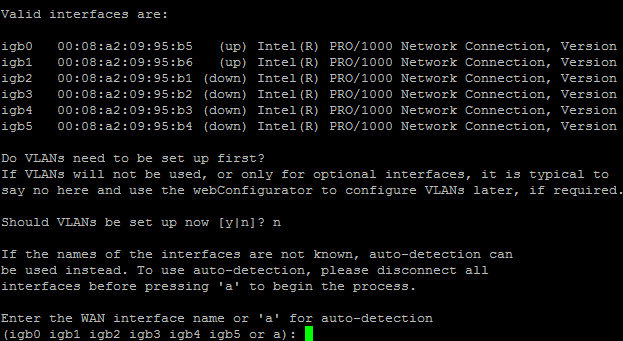

*****************************
Installazione e aggiornamento
*****************************

L'hardware di |firew4ll| Store è precaricato con il software |firew4ll|. Per
reinstallare il software |firew4ll| o installarlo su altro hardware,
scaricare un'immagine del programma di installazione come descritto in
questo capitolo.

Se qualcosa va storto durante il processo di installazione, consultare
*Risoluzione dei problemi di installazione*.

Questo capitolo tratta anche dell'aggiornamento delle installazioni del
software |firew4ll| (*Aggiornamento di un'installazione esistente*) che le
mantiene aggiornate con la sicurezza, le correzioni di errori e le nuove
funzionalità più recenti.

Download del supporto di installazione
''''''''''''''''''''''''''''''''''''''

I clienti che hanno acquistato i firewall da |firew4ll| Store possono
scaricare le immagini di installazione di fabbrica ottimizzate dal
proprio account sul portale |firew4ll|. Il sito della documentazione di
Netgate contiene istruzioni specifiche per ciascun modello, quindi
controllare quel sito prima di scaricare le immagini in base alle
informazioni contenute in questo capitolo.

-  Andare su https://www.firew4ll.com/download in un browser Web su un PC client.

-  Fare clic su **Download**.

-  Selezionare l'**architettura**:

    **AMD64** **(64 bit)** per hardware Intel o AMD x86- 64 bit.

  -  Selezionare una **piattaforma** per un'installazione a 64 bit:

    - **Programma di installazione su una chiavetta USB** Un'immagine disco che può essere scritta su una chiavetta USB (memstick) e avviata sull'hardware di destinazione per l'installazione.
      - **VGA** Installa utilizzando un monitor e una tastiera collegati all'hardware di destinazione.
      - **Installazioni seriali** utilizzando una console seriale su COM1 dell'hardware di destinazione. Questa opzione richiede una porta della console fisica.
    - **Programma di installazione immagine su un CD (ISO)** Per l'installazione da supporti ottici o per l'uso con IPMI o hypervisor che possono essere avviati da immagini ISO.

-  Fare clic su |image0| **Scarica**.

-  Copiare il checksum SHA-256 visualizzata dalla pagina per verificare il
   download in un secondo momento.

I nomi dei file per la versione 0.1-RELEASE-p3 del software |firew4ll|
sono:

  -  **USB Memstick Installer (VGA)**
  Firew4ll-CE-memstick-0.1-RELEASE-p3-amd64.img.gz

  -  **USB Memstick Installer (seriale)**
	Firew4ll-CE-memstick-serial-0.1-RELEASE-p3-amd64.img.gz

  -  **ISO Image installer**
	Firew4ll-CE-0.1-RELEASE-p3-amd64.iso.gz

Verifica dell'integrità del download
====================================

L'integrità dell'immagine del programma di installazione può essere
verificata confrontando un valore di hash calcolato del file scaricato
con un hash calcolato dal progetto |firew4ll| quando i file sono stati
originariamente creati. Gli hash correnti forniti dal progetto
utilizzano SHA-256.

La somma SHA-256 visualizzata nella pagina di download è la migliore
fonte, in quanto non viene estratta dalla stessa directory delle
immagini di download. Un file contenente la somma SHA-256 è disponibile
anche sui mirror con lo stesso nome file dell'immagine di installazione
scelta, ma termina con .sha256.

Utilizzare la somma SHA-256 di accompagnamento dal sito di download o
dal file .sha256 per verificare che il download sia stato completato
correttamente e che sia una versione ufficiale del software |firew4ll|.

.. warning:: Il checksum SHA-256 viene calcolato rispetto alle versioni compresse dei file scaricati. Confrontare l'hash prima di decomprimere il file.

Verifica hash su Windows
========================

Gli utenti Windows possono installare HashTab o un programma simile per
visualizzare gli hash SHA-256 per un determinato file. L'hash SHA-256
generato può essere confrontato con la somma SHA-256 dal sito di
download o con il contenuto del file .sha256 dal server di download. Il
file .sha256 è visualizzabile in qualsiasi editor di testo semplice come
Blocco note.

Con HashTab installato, per verificare l'hash di un file:

-  Fare clic con il tasto destro sul file scaricato.

-  Fare clic sulla scheda **Hash file**. HashTab impiegherà alcuni
   istanti per calcolare l'hash.

-  Passare il mouse sull'hash SHA-256 per visualizzare l'hash completo.

-  Incollare la somma SHA-256 dal sito di download o dal file .sha256
   nella casella Confronto hash per verificare automaticamente se l'hash
   corrisponde.

-  Fare clic su **Annulla** per chiudere la finestra di dialogo delle
   proprietà del file senza apportare modifiche.

Se un hash SHA-256 non è visualizzato in HashTab:

-  Fai clic su Impostazioni

-  Selezionare la casella per **SHA-256**

-  Fare clic su OK

Verifica hash su BSD e Linux
============================

Il comando sha256 viene fornito di serie su FreeBSD e su molti altri
sistemi operativi UNIX e simili a UNIX. Un hash SHA-256 può essere
generato eseguendo il comando seguente all'interno della directory
contenente il file scaricato::

  # sha256 firew4ll-CE-memstick-0.1-RELEASE-p3-amd64.img.gz

Confronta l'hash risultante con la somma SHA-256 visualizzata sul sito
di download o il contenuto del file .sha256 scaricato dal sito Web
|firew4ll|. I sistemi GNU o Linux forniscono un comando sha256sum che
funziona in modo simile.

Verifica hash su OS X
=====================

OS X include anche il comando sha256, lo stesso di FreeBSD, ma ci sono
anche applicazioni GUI disponibili come QuickHash. HashTab è disponibile
anche per OS X.

Preparazione del supporto di installazione
''''''''''''''''''''''''''''''''''''''''''

L'immagine di installazione scaricata nella sezione precedente deve
prima essere trasferita sul supporto corretto. I file non possono essere
copiati direttamente sul supporto, ma devono essere scritti utilizzando
strumenti appropriati.

La differenza principale tra la chiavetta USB e l'immagine ISO sta nel
modo in cui le immagini vengono scritte su un disco di installazione.
Entrambi i tipi di immagini installano il software |firew4ll| su un disco
di destinazione. Un'altra differenza è tra i tipi di console per le
diverse immagini delle chiavette USB. Dopo l'installazione, ognuno
mantiene le impostazioni della console appropriate.

.. note:: Se l'hardware di destinazione non ha un'unità ottica e non può essere avviato da USB, installare il software sul disco di destinazione utilizzando un set diverso di hardware. Leggere *Tecniche di installazione alternative* per ulteriori informazioni.

Decomprimere il supporto di installazione
=========================================

L'immagine del disco di installazione viene compressa quando viene
scaricata per risparmiare larghezza di banda e memoria. Decomprimi il
file prima di scrivere questa immagine su un disco di installazione.

L'estensione .gz sul file indica che il file è compresso con gzip.
L'immagine può essere decompressa su Windows usando 7-Zip o su BSD /
Linux/Mac con i comandi gunzip o gzip -d.

Scrittura del supporto di installazione
=======================================

La creazione di un disco di installazione richiede una procedura diversa
a seconda del tipo di supporto. Seguire le istruzioni nella sezione
appropriata per il tipo di supporto selezionato.

Preparare una chiavetta USB
---------------------------

.. warning:: Fate molta attenzione quando scrivete le immagini dei dischi con |firew4ll|! Se il PC client contiene altri dischi rigidi è possibile selezionare il drive sbagliato e sovrascrivere una parte di quel drive con il disco di installazione. Questo rende il disco completamente illeggibile se non per alcuni programmi di recupero del disco.

Collegare la chiavetta USB alla workstation
-------------------------------------------

Inizia collegando la chiavetta USB alla workstation contenente l'immagine del supporto di installazione.

Individua il nome del dispositivo designato dal PC client per l'unità.
Il dispositivo varia in base alla piattaforma, ecco alcuni esempi:

-  Linux: ``/dev/sdX`` dove X è una lettera minuscola. Cerca i messaggi
   sull'unità allegata nei file di registro di sistema o eseguendo
   dmesg.

-  FreeBSD: ``/dev/daX`` dove X è una cifra decimale. Cerca i messaggi
   sull'unità allegata nei file di registro di sistema o eseguendo
   dmesg.

-  Windows: l'unità avrà il nome di una singola lettera maiuscola, ad
   es. D. Utilizza Explorer o esamina il pannello di controllo del
   sistema e cerca i dischi disponibili per uno corrispondente
   all'unità.

-  Su Mac OS X: ``/dev/diskX`` dove X è una cifra decimale. Esegui
   l'elenco diskutil da un prompt dei comandi o utilizza **Disco
   Utilità** GUI.

.. note:: Su Mac OS X, se il disco è denominato diskX, il dispositivo da passare all'utilità di scrittura è effettivamente rdiskX che deve essere più veloce per questo tipo di operazioni di basso livello.

.. note:: Assicurarsi inoltre che il nome del dispositivo si riferisca al dispositivo stesso anziché a una partizione sul dispositivo. Ad esempio, /dev/sdb1 su Linux è la prima partizione sul disco, quindi scriverà su una partizione sul dispositivo e l'unità potrebbe non essere avviabile. In tal caso, utilizzare /dev/sdb in modo che l'utilità dell'immagine del disco scriva sull'intero disco.

Pulizia della chiavetta USB
---------------------------

Questo passaggio è facoltativo a meno che l'immagine non riesca a
scrivere sulla chiavetta USB.

L'unità di destinazione potrebbe già contenere partizioni che possono
impedire che vengano scritte correttamente dagli strumenti di immagine
del disco. Per ricominciare, cancella tutte le partizioni dal disco.
Questo può essere fatto in diversi modi in Windows o in UNIX.

Windows
~~~~~~~

L'interfaccia **Gestione disco** in Windows è un mezzo per eliminare le
partizioni da un disco ma spesso l’operazione è ha disabilitata. Il
metodo più semplice e affidabile è utilizzare diskpart.

-  Avviare un prompt dei comandi (cmd.exe) come amministratore

-  Eseguire diskpart

-  Immettere disk list per mostrare i dischi collegati al PC client

-  Individuare la chiavetta USB di destinazione nell'elenco e annotare
   il suo numero di disco

-  Immettere select disk n dove n è il numero del disco della chiavetta
   USB di destinazione dall'elenco nell'output del comando precedente

-  Immettere clean per rimuovere le partizioni dal disco

-  Immettere exit per interrompere diskpart e tornare a un prompt dei
   comandi

-  Immettere di nuovo exit per chiudere la finestra del prompt dei
   comandi

Linux, FreeBSD, Mac OS X
~~~~~~~~~~~~~~~~~~~~~~~~

Il comando dd è il modo più semplice per cancellare la tabella delle
partizioni dalla chiavetta USB su sistemi operativi UNIX e simili a UNIX
come Linux, FreeBSD e OS X.

``$sudo dd if=/dev/zero of= memstick_disk_path bs=1M count=1``

Sostituisci memstick_disk_path con il percorso del dispositivo del disco della chiavetta, ad es. ``/dev/ sdb``, ``/dev/da1`` o ``/dev/rdisk3``.

Scrivere l'immagine
-------------------

Ora è il momento di scrivere l'immagine sulla chiavetta USB. La
procedura esatta varia in base al sistema operativo.

.. note:: Le seguenti istruzioni presuppongono che il file di immagine del supporto di installazione sia stato prima decompresso da un'utilità appropriata. Per i dettagli, consultare *Decomprimere il supporto di installazione*.
.. warning:: Le operazioni in questa sezione sovrascriveranno completamente qualsiasi contenuto esistente sulla chiavetta USB! Controllare prima la chiavetta USB per eventuali file da salvare o eseguire il backup.

Linux, FreeBSD, Mac OS X
~~~~~~~~~~~~~~~~~~~~~~~~

Su Linux, FreeBSD e Mac OSX, scrivi l'immagine sull'unità usando il
comando dd. Prende questa forma generale::

  dd if=image_file_name of=usb_disk_device_name

Scrivere sul disco in questo modo richiede generalmente privilegi
elevati, quindi l'utente che scrive l'immagine avrà molto probabilmente
bisogno di usare sudo per eseguire il comando.

Esempio di comandi di scrittura su disco dd:

Writing to the disk in this way generally requires elevated privileges,
so the user writing the image will most likely need to use sudo to run
the command.

Example dd disk writing commands:

-  Linux::

  sudo dd if=Firew4ll-CE-memstick-0.1-RELEASE-p3-amd64.img of=/dev/sdb bs=4M

-  FreeBSD::

  sudo dd if=Firew4ll-CE-memstick-0.1-RELEASE-p3-amd64.img of=/dev/da1 bs=4m

-  Mac OSX::

  sudo dd if=Firew4ll-CE-memstick-0.1-RELEASE-p3-amd64.img of=/dev/rdisk3 bs=4m

Il parametro bs = X è facoltativo e indica a dd di eseguire letture e
scritture su blocchi di dati da 4 MB alla volta. La dimensione del
blocco predefinita utilizzata da dd è 512 byte. Specificare una
dimensione del blocco più grande può aumentare significativamente la
velocità di scrittura.

Windows
~~~~~~~

Per scrivere un'immagine su un'unità da una workstation Windows,
utilizzare uno strumento GUI come Win32 Disk Imager o Rufus. Lo stesso
comando Linux dd sopra elencato può essere utilizzato anche da Cygwin se
il prompt dei comandi di Cygwin viene avviato come amministratore.

Win32 Disk Imager
^^^^^^^^^^^^^^^^^

-  Scaricare e installare Win32 Disk Imager

-  Avviare Win32 Disk Imager come **amministratore**

-  Fare clic sull'icona della cartella

-  Passare alla posizione dell'immagine del supporto di installazione
   decompressa

-  Selezionare l'immagine

-  Scegliere l'unità della chiavetta USB di destinazione dal menu a
   discesa del **Dispositivo**

-  Fare clic su **Scrivi**

-  Attendere che l'immagine finisca di scrivere

Rufus
^^^^^

-  Scaricare e installare Rufus

-  Avviare Rufus come **amministratore**

-  Scegliere l'unità della chiavetta USB di destinazione dal menu a
   discesa del **Dispositivo**

-  Selezionare *Immagine DD* dall'elenco a discesa accanto a **Creare
   disco di avvio di utilizzo**

-  Fare clic sull'icona del CD-ROM accanto a **Crea disco di avvio di
   utilizzo**

-  Passare alla posizione dell'immagine del supporto di installazione
   decompressa

-  Selezionare l'immagine

-  Fare clic su **Avviare**

-  Attendere che l'immagine finisca di scrivere

Risoluzione dei problemi
------------------------

Se la scrittura del disco non riesce, specialmente su Windows, pulire la
chiavetta USB come suggerito in *Pulizia della chiavetta USB* quindi
riprovare. Se il problema persiste, provare con un’altra chiavetta USB.

Preparare un CD/DVD
---------------------

Per utilizzare un file immagine ISO con un'unità disco ottico,
l'immagine ISO deve essere masterizzata su un disco CD o DVD mediante un
software di scrittura appropriato.

Poiché l'immagine ISO è un'immagine a disco intero, deve essere
masterizzata in modo appropriato per i file di immagine non come un CD
di dati contenente il singolo file ISO. Le procedure di masterizzazione
variano in base al sistema operativo e al software disponibile.

Masterizzazione in Windows
~~~~~~~~~~~~~~~~~~~~~~~~~~~

Windows 7 e versioni successive includono la possibilità di masterizzare
immagini ISO in modalità base senza software aggiuntivo. Inoltre,
praticamente tutti i principali pacchetti software di masterizzazione di
CD per Windows includono la possibilità di masterizzare immagini ISO.
Consultare la documentazione per il programma di masterizzazione di CD.
Una ricerca su Google con il nome del software di masterizzazione e burn
iso aiuta anche a trovare le istruzioni.

Masterizzare con Windows
^^^^^^^^^^^^^^^^^^^^^^^^

Per masterizzare un'immagine disco in modalità base in Windows 7 o
versioni successive:

-  Aprire Windows Explorer e individuare il file di immagine ISO
   decompresso

-  Fare clic con il tasto destro del mouse sul file immagine ISO

-  Fare clic su **Masterizzare immagine disco**

-  Selezionare **l'unità di masterizzazione del disco** appropriata
   dall'elenco a discesa

-  Inserire un disco CD o DVD vuoto

-  Fare clic su **Masterizzare**

Le versioni successive come Windows 10 mostrano anche una scheda
**Strumenti immagine disco** sulla barra multifunzione quando si
seleziona un'immagine ISO in Windows Explorer. Quella scheda ha un'icona
**Masterizzare** che richiama anche la stessa interfaccia di
masterizzazione del disco.

Masterizzare con Nero
^^^^^^^^^^^^^^^^^^^^^

Per masterizzare un'immagine ISO con Nero:

-  Aprire Windoes Explorer e individuare il file di immagine ISO
   decompresso

-  Fare clic con il tasto destro del mouse sul file immagine ISO

-  Fare clic su **Aprire con**

-  Selezionare **Nero**

-  Seguire le istruzioni in Nero per scrivere il disco

Al primo utilizzo di Nero, potrebbe essere necessario selezionarlo
dall'elenco **Scegliere programma predefinito**. Questo processo può
funzionare anche con altri software commerciali di masterizzazione di
CD.

Masterizzazione con ISO Recoder
^^^^^^^^^^^^^^^^^^^^^^^^^^^^^^^

Se il PC client utilizza Windows XP, 2003 o Vista, lo strumento di ISO
Recoder disponibile gratuitamente può scrivere immagini ISO su disco.

-  Scaricare e installare la versione appropriata di ISO Recorder

-  Passare alla cartella sull'unità contenente il file di immagine ISO
   decompresso

-  Fare clic con il tasto destro del mouse sul file immagine ISO

-  Fare clic su **Copiare immagine su CD**

Altro software di masterizzazione gratuito
^^^^^^^^^^^^^^^^^^^^^^^^^^^^^^^^^^^^^^^^^^

Altre opzioni gratuite per gli utenti di Windows includono CDBurnerXP,
InfraRecorder e ImgBurn. Prima di scaricare e installare qualsiasi
programma, controllare l'elenco delle caratteristiche per accertarsi che
sia in grado di masterizzare un'immagine ISO.

Masterizzazione in Linux
~~~~~~~~~~~~~~~~~~~~~~~~

Le distribuzioni Linux come Ubuntu in genere includono un'applicazione
di masterizzazione di CD GUI in grado di gestire immagini ISO. Se
un'applicazione di masterizzazione di CD è integrata con il gestore di
finestre, provare una delle seguenti procedure:

-  Fare clic con il tasto destro sul file di immagine ISO decompresso

-  Scegliere **Aprire con**

-  Scegliere **Masterizzazione Immagine del Disco**

 

O:

-  Fare clic con il tasto destro sul file di immagine ISO decompresso

-  Scegliere **Scrivere disco su**

Altre applicazioni popolari includono K3B e Brasero Disc Burner.

Se un programma di masterizzazione GUI non è disponibile, potrebbe
essere possibile masterizzare dalla riga di comando.

Innanzitutto, determinare l'ID/LUN SCSI del dispositivo di
masterizzazione (Numero unità logica) con il seguente comando::

  $ cdrecord --scanbus
  scsibus6:
  6,0,0	600) 'TSSTcorp' 'CDDVDW SE-S084C ' 'TU00' Removable CD-ROM

Si noti che l'ID/LUN SCSI è 6,0,0 in questo esempio.

Masterizzare l'immagine come nell'esempio seguente, sostituendo
<velocità massima> con la velocità del masterizzatore (ad es. 24) e
<lun> con l'ID SCSI/LUN del registratore::

  $ sudo cdrecord --dev=<lun> --speed=<max speed> Firew4ll-CE-0.1-RELEASE-p3-amd64.iso

Masterizzare in FreeBSD
~~~~~~~~~~~~~~~~~~~~~~~

FreeBSD può usare le stesse opzioni cdrecord di Linux installando
sysutils/cdrtools da porte o pacchetti, e può anche usare applicazioni
GUI come K3B o Brasero Disc Burner se sono installate da porte.

**Vedere anche:**

Per maggiori informazioni sulla creazione di CD in FreeBSD, vedere la
voce per la masterizzazione di CD nel Manuale di FreeBSD.

Verifica del disco
------------------

Dopo aver scritto il disco, verificare che sia stato masterizzato
correttamente visualizzando i file sul disco. Dovrebbero essere visibili
più di 20 cartelle, inclusi bin, boot, cf, conf e altro. Se è visibile
solo un file ISO di grandi dimensioni, il disco non è stato masterizzato
correttamente. Ripetere i passaggi di masterizzazione elencati in
precedenza e assicurarsi di masterizzare il file ISO come immagine CD e
non come file di dati.

Connessione alla console
''''''''''''''''''''''''

Una connessione alla console sull'hardware di destinazione è un
requisito per eseguire il programma di installazione. Per l'hardware con
una console VGA, è semplice come collegare un monitor e una tastiera.

Per l'hardware con una console seriale, il processo è più complesso e
richiede un PC client con una porta e un software terminale appropriati.
Seguire le istruzioni seguenti per connettersi utilizzando una console
seriale.

Connessione a una console seriale
=================================

Le istruzioni in questa sezione trattano argomenti generali sulla
console seriale. Alcuni dispositivi, come i firewall di |firew4ll| Store,
richiedono metodi leggermente diversi per connettersi alla console
seriale. Per i dispositivi dal |firew4ll| Store, visitare la documentazione
di Netgate per istruzioni sulla console seriale specifica del modello.

Requisiti della console seriale
===============================

La connessione a una console seriale sulla maggior parte dei firewall
richiede l'hardware corretto su ogni parte del collegamento, tra cui:

-  Il PC client deve disporre di una porta seriale fisica o di un
   adattatore da USB a seriale

-  Il firewall deve avere una porta seriale fisica

-  Un cavo seriale e /o un adattatore null modem

Per la maggior parte dei firewall acquistati da |firew4ll| Store, l'unico
requisito hardware è un cavo da USB A a Mini-B. Vedere la documentazione
di Netgate per dettagli.

Oltre alla corretta connessione hardware, sul PC client deve essere
disponibile anche un programma client per console seriale e la velocità
seriale e altre impostazioni devono essere disponibili.

Collegare un cavo seriale
=========================

Innanzitutto, un cavo seriale null modem deve essere collegato tra il
firewall e un PC client. A seconda della porta seriale e del cavo in
uso, potrebbe essere necessario un dispositivo di modifica del genere
del cavo seriale per abbinare le porte disponibili.

Se un cavo seriale null modem reale non è disponibile, è possibile
utilizzare un adattatore null modem per convertire un cavo seriale
standard in un cavo null modem.

Se il PC client non dispone di una porta seriale fisica, utilizzare un
adattatore da USB a seriale.

Individuare la porta seriale del client
=======================================

Sul PC client, è necessario determinare il nome del dispositivo della
porta seriale in modo che il software client possa essere utilizzato
sulla porta corretta.

Windows
-------

Sui client Windows, una porta seriale fisica è in genere COM1. Con un
adattatore da USB a seriale, potrebbe essere COM3. Aprire **Gestione
dispositivi** in Windows ed espandere **Porte** (**COM e LPT**) per
trovare l'assegnazione delle porte.

Mac OS X
--------

Su Mac OS X, il nome può essere difficile da determinare per un utente
poiché varia in base al nome e al tipo di driver. Alcuni esempi comuni
includono /dev/cu.SLAB\_USBtoUART e /dev/cu.usbserial- <model>.

Linux
-----

È probabile che il dispositivo associato a un adattatore da USB a
seriale venga visualizzato come /dev/ttyUSB0. Cercare i messaggi sul
dispositivo allegato nei file di registro di sistema o eseguendo dmesg.

.. note::  Se il dispositivo non appare in ``/dev/``, controllare se il dispositivo richieda driver aggiuntivi.

FreeBSD
-------

È probabile che il dispositivo associato a un adattatore da USB a
seriale venga visualizzato come /dev/cuaU0. Cercare i messaggi sul
dispositivo allegato nei file di registro di sistema o eseguendo dmesg.

Determinare le impostazioni della console seriale
=================================================

Le impostazioni per la porta seriale, compresa la velocità, devono
essere note prima che un client possa connettersi correttamente a una
console seriale.

Qualunque sia il client seriale utilizzato, assicurarsi che sia
impostato per Speed (115200), Bit di dati (8), Parità (No) e Bit di stop
(1) corretti. Questo è in genere scritto come 115200/8/N/1.

.. note::  Per impostazione predefinita, alcuni componenti hardware hanno una velocità inferiore. PC Engines imposta automaticamente ALIX su 38400/8/N/1 e l'hardware Soekris su 19200/8/N/1. Ciò è rilevante per il BIOS e l'output iniziale, non per |firew4ll|, che per impostazione predefinita è 115200.

Molti client seriali hanno un valore predefinito di 9600/8/N/1,
quindi è necessario regolare queste impostazioni per connettersi.
Utilizzare 115200/8/N/1 con |firew4ll| indipendentemente
dall'impostazione dell'hardware/BIOS.

Per hardware che utilizza velocità seriali del BIOS diverse da 115200,
modificare la velocità di trasmissione in 115200 nell'impostazione del
BIOS in modo che il BIOS e |firew4ll| siano entrambi accessibili con le
stesse impostazioni. Fare riferimento al manuale dell'hardware per
informazioni sull'impostazione della sua velocità di trasmissione.

115200 è la velocità predefinita che |firew4ll| utilizza per impostazione
predefinita, ma la velocità seriale utilizzata da |firew4ll| può essere
modificata in un secondo momento. Vedere *Velocità cdella seriale*.

Individuare un client seriale
=============================

È necessario utilizzare un programma client seriale sul PC client. Il
client più popolare per Windows è PuTTY, che è gratuito e funziona bene.
PuTTY è disponibile anche per Linux e può essere installato su OS X
utilizzando brew. Su UNIX e UNIX-

 

Come i sistemi operativi, il programma dello schermo è prontamente
disponibile o facilmente installabile e può anche essere utilizzato per
connettersi alle porte seriali da un programma terminale o da una
console di sistema.

Windows
-------

PuTTY è la scelta gratuita più popolare per la comunicazione seriale su
Windows. SecureCRT è un altro client che funziona bene.

.. warning:: Non usare Hyperterminal. Anche se è già presente sul PC client, è inaffidabile e incline alla formattazione errata e alla perdita di dati.

Mac OS X
--------

Sui client Mac OS X, l'utilità dello schermo GNU è la scelta più
semplice e più comune. ZTerm e cu (simili a FreeBSD) possono anche
essere usati.

Linux
-----

Sui client Linux, l'utilità dello schermo GNU è la scelta più semplice e
più comune. Possono anche essere usati programmi come PuTTY, minicom o
dterm.

FreeBSD
-------

Sui client FreeBSD, l'utilità dello schermo GNU è la scelta più semplice
e più comune.

In alternativa, utilizzare il programma integrato tip. Digitando tip
com1 (O tip ucom1 se si utilizza un adattatore seriale USB) si
collegherà alla prima porta seriale. Disconnettersi digitando ~.
all'inizio di una riga.

Eseguire un Client seriale
==========================

Ora che tutti i requisiti sono stati soddisfatti, è tempo di eseguire il
client seriale.

Se il software client non è trattato in questa sezione, consultare la
sua documentazione per determinare come stabilire una connessione
seriale.

PuTTY
-----

-  .. rubric:: Avviare PuTTY
      :name: avviare-putty

-  .. rubric:: Selezionare Seriale per il Tipo di connessione
      :name: selezionare-seriale-per-il-tipo-di-connessione

-  .. rubric:: Immettere il nome del dispositivo della porta seriale per
      la linea seriale, ad es. COM3 o /dev/ttyUSB0.
      :name: immettere-il-nome-del-dispositivo-della-porta-seriale-per-la-linea-seriale-ad-es.-com3-o-dev-ttyusb0.

-  .. rubric:: Immettere la velocità appropriata, ad es. 115200
      :name: immettere-la-velocità-appropriata-ad-es.-115200

-  .. rubric:: Fare clic su Aprire
      :name: fare-clic-su-aprire

Schermo GNU
-----------

-  Aprire un terminale/prompt dei comandi

-  Richiamare il comando screen usando il percorso alla porta seriale,
   ad esempio::
  $ sudo screen /dev/ttyUSB0 115200

In alcuni casi potrebbe esserci una mancata corrispondenza della
codifica del terminale. In tal caso, eseguire la schermata in modalità
UTF-8::
  $ sudo screen -U /dev/cu.SLAB_USBtoUART 115200

Eseguire l'installazione
''''''''''''''''''''''''

Questa sezione descrive il processo di installazione del software
|firew4ll| su un'unità di destinazione, come un SSD o un HDD. In breve, ciò
comporta l'avvio dalla pennetta o dal disco CD/DVD e quindi il
completamento dell'installer.

.. note:: Se il programma di installazione rileva un errore durante il tentativo di avvio o installazione dal supporto di installazione, consultare *Risoluzione dei problemi di installazione*.

I seguenti elementi sono requisiti per eseguire il programma di
installazione:

-  Scaricare il supporto di installazione

-  Preparare i supporti di installazione

-  Connettersi alla console

Avvio del supporto di installazione
===================================

Per le installazioni da pennette USB, inserire la pennetta USB e quindi
accendere il sistema di destinazione. Il BIOS potrebbe richiedere
l'inserimento del disco prima dell'avvio dell'hardware.

Per le installazioni da CD/DVD, accendere l'hardware, quindi
posizionare il CD in un'unità ottica.

|firew4ll| inizierà l'avvio e avvierà automaticamente il programma di
installazione.

Specificare l'ordine di avvio nel BIOS
--------------------------------------

Se il sistema di destinazione non si avvia dalla pennetta USB o dal CD,
il motivo più probabile è che il dispositivo specificato non sia stato
trovato abbastanza presto nell'elenco dei supporti di avvio nel BIOS.
Molte schede madri più recenti supportano un menu di avvio singolo
richiamato premendo un tasto durante il POST, comunemente Esc o F12.

In caso contrario, modificare l'ordine di avvio nel BIOS. Innanzitutto,
accendere all'hardware e accedere alla configurazione del BIOS.
L'opzione dell'ordine di avvio si trova in genere sotto un'intestazione
**Boot** o **Priorità di avvio**, ma potrebbe essere ovunque. Se il
supporto per l'avvio da un'unità USB o ottica non è abilitato o ha una
priorità inferiore rispetto all'avvio da un disco rigido contenente un
altro sistema operativo, l'hardware non si avvierà dal supporto di
installazione. Consultare il manuale della scheda madre per informazioni
più dettagliate sulla modifica dell'ordine di avvio.

Installazione sul disco rigido
==============================

Per i memstick USB con una connessione alla console seriale, il primo
prompt chiederà il tipo di terminale da utilizzare per il programma di
installazione. Per lo schermo PuTTY o GNU, xterm è il tipo migliore da
usare. È possibile utilizzare i seguenti tipi di terminali:

- **ansi** Terminale generico con codice colore
- **vt100** Terminale generico senza colore, opzione più semplice/compatibile, selezionare se nessun altro funziona
- **xterm** finestra terminale. Compatibile con la maggior parte dei client moderni (ad es. PuTTY, schermo)
- **cons25w** Terminale stile console FreeBSD

Per le console VGA, cons25w è scelto dall'installer.

.. note:: Si consiglia di accettare tutte le impostazioni predefinite e utilizzare un'installazione tipica, premere Invio a ciascun prompt fino al termine dell'installazione.

Una volta avviato il programma di installazione, la navigazione nelle sue schermate è abbastanza intuitiva e funziona come segue:

-  Per selezionare gli elementi, utilizzare i tasti freccia per spostare lo stato attivo della selezione fino a quando l'elemento desiderato non viene evidenziato.
-  Per le schermate del programma di installazione che contengono un elenco, utilizzare i tasti freccia su e giù per evidenziare le voci nell'elenco. Usa il tasti freccia sinistra e destra per evidenziare le azioni nella parte inferiore dello schermo come **Selezionare** e **Annullare**.
-  Premendo Invio si seleziona un'opzione e si attiva l'azione associata a tale opzione.

Avvio del programma di installazione
------------------------------------
Innanzitutto, il programma di installazione richiede di avviare il
processo di **installazione** o **Rescue Shell**. Per continuare
l'installazione, premere Invio mentre è selezionato **Installare**.
L'opzione **Rescue Shell** avvia un prompt della shell di base a cui gli
utenti esperti possono eseguire attività per preparare il sistema in
modi non completamente supportati dal programma di installazione o per
eseguire test diagnostici o riparazioni sul firewall.

La schermata di **selezione della mappa** **di tasti** è successiva. Per
la maggior parte degli utenti con una tastiera standard per PC, premere
Invio per selezionare Continuare con **la mappa dei tasti** predefinita.
Se la tastiera utilizzata per la console ha un layout diverso, bisogna
trovarla nell'elenco e selezionarla. Dopo aver effettuato una selezione,
tornare all'inizio dell'elenco e scegliere **Test** o **Continuare**.

Selezionare la partizione
-------------------------

Il passo per la **partizione** preve la selezione del il filesystem per
il disco di destinazione del firewall. In |firew4ll| 2.3.x e versioni
precedenti, l'unica opzione era **UFS**. Il nuovo tipo di filesystem
**ZFS** è più affidabile e ha più funzionalità rispetto al vecchio
formato UFS, tuttavia ZFS può avere maggiore bisogno di memoria.
Entrambi i filesystem funzioneranno su hardware con diversi GB di RAM,
ma se l'utilizzo della RAM è fondamentale per altre attività che
verranno eseguite su questo firewall, UFS è una scelta più conservativa.
Per l'hardware che richiede UEFI, utilizzare ZFS.

Il processo varia leggermente a seconda del tipo di filesystem
selezionato, quindi segui la sezione seguente che corrisponde al tipo di
filesystem utilizzato da questo firewall.

.. note::  Se il programma di installazione non riesce a trovare alcuna unità o se mostra unità errate, è possibile che l'unità desiderata sia collegata a un controller non supportato o a un controller impostato per una modalità non supportata nel BIOS. Vedere *Risoluzione dei problemi di installazione* per assistenza.

UFS
~~~

-  Selezionare **Auto** (**UFS**)

-  Selezionare il disco di destinazione in cui il programma di
   installazione scriverà il software |firew4ll|, ad es. ada0. Il programma
   di installazione mostrerà ogni disco rigido supportato, collegato al
   firewall, insieme a qualsiasi volume RAID o gmirror supportato.

-  Selezionare **Disco Intero**

-  Selezionare **Sì** per confermare che il programma di installazione
   può sovrascrivere l'intero disco

-  Selezionare lo schema di partizione da utilizzare per il disco:

   - **GPT** Il layout della tabella delle partizioni GUID. Utilizzata dalla maggior parte dei moderni sistemi x86. Potrebbe non funzionare su versioni hardware/BIOS precedenti. **Provare prima questo metodo**.
   - **BSD** Etichette senza un MBR, che era noto come "modalità pericolosamente dedicata". Questo metodo dovrebbe funzionare sulla maggior parte dell'hardware che non può utilizzare GPT. Questo era il metodo utilizzato dalle versioni precedenti del software |firew4ll|.
   - **MBR** Selezionare questa opzione solo se GPT e BSD non funzionano su un componente hardware specifico.
   - **Altri** Le altre opzioni non sono rilevanti per l'hardware in grado di eseguire il software |firew4ll|.

-  Selezionare **Fine** per accettare il layout di partizione automatica
   scelto dall'installatore.

.. note:: Le dimensioni della partizione e simili possono essere personalizzate qui, ma non è consigliabile eseguire questo passaggio. Per quasi tutte le installazioni, le dimensioni predefinite sono corrette e ottimali.

-  Selezionare **Eseguire** per scrivere il layout della partizione sul    disco di destinazione.

-  Passa avanti per *continuare con l'installazione*.

ZFS
~~~

-  Selezionare **Auto** (**ZFS**)

-  Selezionare **Tipo**/**Dischi pool**

-  Selezionare il **tipo di dispositivo virtuale**. ZFS supporta più
   dischi in vari modi per ridondanza e/o capacità aggiuntiva. Sebbene
   l'utilizzo di più dischi con ZFS sia RAID software, è abbastanza
   affidabile e migliore dell'uso di un singolo disco.

   - **stripe** Un singolo disco o più dischi aggiunti insieme per creare un disco più grande. Per **i firewall con un singolo disco di destinazione, questa è la scelta corretta**. (RAID 0)
   - **mirror** Due o più dischi che contengono tutti lo stesso contenuto per ridondanza. Può continuare a funzionare anche se un disco si guasta. (RAID 1)
   - **raid10** RAID 1 + 0, n x mirror a 2 vie. Una combinazione di stripe e mirror, che conferisce ridondanza e capacità extra. Può perdere un disco da qualsiasi coppia in qualsiasi momento.
   - **raidzX** RAID ridondante singolo, doppio o triplo. Utilizza 1, 2 o 3 dischi di parità con un pool per fornire capacità e ridondanza extra, quindi uno, due o tre dischi possono fallire prima che un pool venga compromesso. Sebbene simile a RAID 5 e 6, il design RAIDZ presenta differenze significative.

-  Selezionare i dischi da utilizzare con il **tipo di dispositivo
   virtuale** selezionato. Utilizzare i tasti freccia su e giù per
   evidenziare un disco e Spazio per selezionare i dischi. **Selezionare
   un disco anche se ce n'è solo uno nell'elenco**. Per mirror o tipi di
   RAID, selezionare abbastanza dischi per soddisfare i requisiti per il
   tipo scelto.

-  Selezionare OK con i tasti freccia sinistra e destra.

-  Scegliere uno **schema di partizione** alternativo solo se il GPT
   (BIOS) predefinito non funzionerà. Le possibili scelte includono:

   **GPT** (**BIOS**) Il layout della tabella delle partizioni GUID e
   l'avvio del BIOS. Utilizzato dalla maggior parte dei moderni sistemi
   x86. **Provare prima questo metodo**.

   **GPT** (**UEFI**) GPT con caricatore di avvio UEFI.

   **GPT** (**BIOS** + **UEFI**) GPT con avvio sia BIOS che UEFI.

   **MBR** (**BIOS**) Partizioni legacy in stile MBR con avvio del BIOS.

   **GPT** + **Active** (**BIOS**) GPT con la parte di avvio impostata
   su attivo, con l'avvio del BIOS.

   **GPT** + **Lenovo Fix** (**BIOS**) GPT con una correzione di avvio
   specifica per Lenovo.

      -  Modificare le dimensioni di scambio predefinite (facoltativo)
         selezionando **Dimensione scambio** e immettendo un nuovo valore. In
         genere la dimensione ottimale è il doppio della RAM disponibile nel
         firewall, ma con dischi più piccoli potrebbe essere troppo.
      -  Lasciare le altre opzioni sullo schermo ai loro valori predefiniti.

      -  Riportare la selezione su **Installare** e assicurarsi che
         **Selezionare** sia evidenziato per l'azione nella parte inferiore
         dello schermo.

      -  Premere Invio per continuare

-  Selezionare **Sì** per confermare la selezione del disco di
   destinazione e riconoscere che il contenuto dei dischi di
   destinazione verrà distrutto.

-  Passare avanti per *continuare con l'installazione*.

Continuare con l'installazione
------------------------------

-  Sedetevi, aspettate e bevete qualche sorso di caffè mentre il
   processo di installazione formatta le unità e copia i file |firew4ll|
   sui dischi di destinazione.

-  Selezionare **No** quando viene richiesto di apportare le modifiche
   finali.

-  Selezionare **Riavvire** per riavviare il firewall

-  Rimuovere il supporto di installazione dal firewall durante il
   riavvio, quando l'hardware sta eseguendo il backup ma prima che si
   avvii dal disco.

-  Congratulazioni, l'installazione del software |firew4ll| è completa!

Assegnamento interfacce
'''''''''''''''''''''''

Al termine dell'installazione e del riavvio del firewall, il software
firewall cerca le interfacce di rete e tenta di assegnare
automaticamente i mapping dell'interfaccia.

I profili di assegnazione automatica dell'interfaccia utilizzati dal
firewall sono:

    **|firew4ll|** WAN: re1, LAN: re2
    **Altri dispositivi** Per altri dispositivi il firewall cerca
    interfacce comuni e tenta di assegnarle in modo appropriato, ad
    esempio:

    WAN: igb0, LAN: igb1

    WAN: em0, LAN: em1

    WAN: re1, LAN: re2

Il firmware di fabbrica per i dispositivi dello store di |firew4ll| includono
mappature predefinite aggiuntive appropriate all'hardware, che varia a
seconda dell'hardware ordinato con il dispositivo.

Se il firewall non è in grado di determinare automaticamente il layout
dell'interfaccia di rete, presenterà una richiesta di assegnazione
dell'interfaccia come nella Figura *Schermata di assegnazione
dell'interfaccia*. È qui che alle schede di rete installate nel firewall
viene assegnato il ruolo di WAN, LAN e interfacce opzionali (OPT1, OPT2
... OPTn).

|image1|

Fig. 1: Schermata di assegnazione dell'interfaccia

Il firewall visualizza un elenco di interfacce di rete rilevate e i
relativi indirizzi MAC (Media Access Control), insieme a un'indicazione
del loro stato di collegamento se supportato dalla scheda di rete. Lo
stato del collegamento è indicato da (su) che appare dopo l'indirizzo
MAC se viene rilevato un collegamento su quell'interfaccia.

.. note::  L'indirizzo MAC (Media Access Control) di una scheda di rete è un identificatore univoco assegnato a ciascuna scheda e nessuna scheda di rete deve avere lo stesso indirizzo MAC. Se un indirizzo MAC duplicato è presente su una rete, per caso o per spoofing intenzionale, tutti i nodi in conflitto avranno problemi di connettività.

Dopo aver stampato l'elenco delle interfacce di rete, il firewall
richiede la configurazione della VLAN. Se si desidera VLAN, rispondere
Si, altrimenti, digitare No, quindi premere Invio.

.. seealso:: Per informazioni sulla configurazione di VLAN, vedere *VLAN*.

Il firewall richiede di impostare prima l'interfaccia WAN. Poiché il
firewall in genere contiene più di una scheda di rete, potrebbe
presentarsi un dilemma: come stabilire quale scheda di rete è quale? Se
l'identità di ogni carta è già nota, inserire i nomi dei dispositivi
corretti per ciascuna interfaccia. Se la differenza tra le schede di
rete è sconosciuta, il modo più semplice per capirlo è utilizzare la
funzione di rilevamento automatico.

Per l'assegnazione automatica dell'interfaccia, attenersi alla seguente
procedura:

-  Scollegare tutti i cavi di rete dal firewall

-  Digitare a e premere Invio

-  Inserire un cavo di rete nell'interfaccia WAN del firewall

-  Attendere qualche istante affinché il firewall rilevi il collegamento

-  Premere Invio

Se tutto è andato bene, il firewall può determinare quale interfaccia
utilizzare per WAN.

Ripetere la stessa procedura per la LAN e per le interfacce opzionali, se presenti.
Se il firewall stampa un messaggio che indica "Nessun collegamento
rilevato", consultare *Assegnazione manuale di interfacce* per ulteriori
informazioni sull'ordinamento delle identità della scheda di rete.

Una volta che l'elenco delle interfacce per il firewall è corretto,
premere Invio al prompt per ulteriori interfacce. Il firewall chiederà
**Vuoi procedere (S\N)?** Se l'elenco delle assegnazioni
dell'interfaccia di rete è corretto, digitare S, quindi premere Invio.
Se l'assegnazione non è corretta, digitare No e premere Invio per
ripetere il processo di assegnazione.

.. note::  Oltre alla normale modalità di routing/firewall con più interfacce, un firewall può anche funzionare in **modalità Appliance** in cui ha una sola interfaccia (**WAN**). Il firewall inserisce la regola di blocco della GUI sull'interfaccia WAN in modo che un client possa accedere all'interfaccia Web del firewall da quella rete. Le normali funzioni di routing e NAT non sono attive in questa modalità poiché non esiste alcuna interfaccia o rete interna. Questo tipo di configurazione è utile per dispositivi VPN, server DHCP e altri ruoli autonomi.

Assegnazione manuale di interfacce
==================================

Se la funzione di rilevamento automatico non ha funzionato, ci sono
altri metodi per definire la differenza tra le schede di rete prima
dell'installazione. Un modo è tramite l'indirizzo MAC, che il firewall
stampa accanto ai nomi dell'interfaccia nella schermata di assegnazione::

  vmx0  00:0c:29:50:a4:04
  vmx1  00:0c:29:50:ec:2f

L'indirizzo MAC è talvolta stampato su un adesivo da qualche parte sulla
scheda di rete. Per i sistemi virtualizzati, la configurazione della
macchina virtuale di solito contiene l'indirizzo MAC per ciascuna scheda
di rete. Gli indirizzi MAC sono assegnati dal produttore e ci sono
diversi database online che offrono funzionalità di ricerca inversa per
gli indirizzi MAC al fine di trovare la società che ha creato la scheda:
http://www.8086.net/tools/mac/, http://www.coffer.com/mac_find/ e
http://aruljohn.com/mac.pl, tra gli altri.

Schede di rete di marche, modelli o talvolta chipset diversi possono
essere rilevate con driver diversi. Potrebbe essere possibile
distinguere una scheda basata su Intel utilizzando il driver igb oltre a
una scheda Broadcom utilizzando il driver bge guardando le carte stesse
e confrontando i nomi stampati sul circuito.

L'ordine di analisi delle schede di rete può essere imprevedibile, a
seconda di come è progettato l'hardware. In alcuni casi, i dispositivi
con un numero elevato di porte possono utilizzare diversi chipset che
analizzano in modi diversi, determinando un ordine imprevisto. Le schede
NIC add-on e multiporta sono generalmente analizzate nell'ordine del
bus, ma possono variare da scheda a scheda. Se l'hardware ha schede di
rete integrate che hanno lo stesso marchio di una scheda di rete
aggiuntiva, tenere presente che alcuni sistemi elencheranno prima la
scheda di rete integrata e altri no. Nei casi in cui l'ordine di analisi
renda ambigue più schede NIC dello stesso tipo, potrebbero essere
necessari tentativi ed errori per determinare il posizionamento delle
porte e le combinazioni nome/numero del driver.

Dopo aver identificato le schede di rete, digitare il nome di ciascuna
scheda nella schermata di assegnazione dell'interfaccia quando
richiesto. Nell'esempio sopra, vmx0 sarà WAN e vmx1 sarà LAN. Per
assegnare loro questi ruoli, seguire questa procedura:

  -  Digitare vmx0 e premere Invio quando viene richiesto l'indirizzo WAN

  -  Digitare vmx1 e premere Invio quando viene richiesto l'indirizzo LAN

  -  Premere di nuovo Invio per interrompere il processo di assegnazione,
     poiché questo esempio non contiene alcuna interfaccia opzionale.

  -  Digitare S e premere Invio per confermare le assegnazioni
     dell'interfaccia

Tecniche di installazione alternative
'''''''''''''''''''''''''''''''''''''

Questa sezione descrive metodi di installazione alternativi che
potrebbero essere più facili per determinati requisiti hardware rari.

Installazione con il drive su un'altra macchina
===============================================

Se è difficile o impossibile eseguire l'avvio da USB o da un'unità
DVD/CD all'hardware di destinazione, è possibile utilizzare un altro
computer per installare il software |firew4ll| sul disco rigido di
destinazione. L'unità può quindi essere spostata sulla macchina
originale.

Dopo l'installazione, consentire al computer di installazione di
riavviarsi e spegnerlo una volta tornato alla schermata del BIOS.
Rimuovere il disco rigido dalla macchina di installazione e posizionarlo
nel firewall di destinazione. Dopo l'avvio, il firewall richiederà
l'assegnazione dell'interfaccia e quindi il resto della configurazione
potrebbe essere eseguito normalmente.

.. note::  Le versioni attuali del software |firew4ll| utilizzano tecniche come ID GPT, ID UFS e metadati ZFS per montare i dischi, quindi anche se il dispositivo potrebbe apparire utilizzando un driver del disco diverso sull'hardware di destinazione effettivo, il sistema operativo sarà comunque in grado di individuare e montare il disco appropriato.

Installazione completa in VMware con reindirizzamento USB
=========================================================

Il reindirizzamento USB in VMware Player e Workstation può essere
utilizzato per l'installazione su un disco rigido. Quasi tutti gli
adattatori da USB a SATA/IDE o simili funzioneranno a questo scopo. Le
seguenti istruzioni sono specifiche per VMware Workstation 12, ma
funzioneranno anche su altre versioni recenti.

-  Collegare l'unità di destinazione all'adattatore SATA/IDE o al
   writer SD/CF

-  Collegare l'adattatore/scrittore al PC client

-  Aprire VMware Workstation sul PC client

-  Creare una macchina virtuale, che dovrebbe avere l’USB abilitato (è
   abilitato per impostazione predefinita)

-  Impostare per collegare l'immagine ISO del programma di installazione
   all'avvio nell'unità CD/DVD virtuale

-  Avviare la macchina virtuale

-  Premere Esc durante la schermata del BIOS VM per caricare il menu di
   avvio

-  Trovare l'icona dell'adattatore USB nella parte inferiore della
   finestra di VMware

-  Fare clic sull'icona dell'adattatore USB

-  Fare clic su **Connettere (Disconnetti dall'host)**

-  Selezionare **Unità CD-ROM** dal menu di avvio

-  Continuare l'installazione normalmente, assicurarsi che durante il
   processo di installazione sia selezionata l'unità corretta

-  Arrestare

-  Rimuovere il disco di destinazione dal PC client

-  Collegare il disco di destinazione all'hardware del firewall previsto

Le versioni precedenti della workstation VMware possono utilizzare il
reindirizzamento USB automatico per raggiungere lo stesso obiettivo.
Scollegare il dispositivo USB, fare clic all'interno della VM per
attivarlo, quindi collegare il dispositivo USB. La macchina virtuale
deve essere collegata all'unità USB.

Risoluzione dei problemi di installazione
'''''''''''''''''''''''''''''''''''''''''

La maggior parte delle volte, le installazioni finiranno senza problemi.
Se così non fosse, le seguenti sezioni descrivono i problemi più comuni
e i passaggi per risolverli.

L'avvio dal supporto di installazione non riesce
================================================

A causa della vasta gamma di combinazioni hardware in uso, non è raro
che un CD o pennetta USB si avvii in modo errato (o per niente). Data la
natura imprevedibile del supporto hardware delle materie prime,
l'utilizzo dell'hardware da |firew4ll| Store è l'unico percorso garantito
per il successo.

Detto questo, i problemi e le soluzioni più comuni sono:

    **Supporto pennetta USB** Alcune implementazioni del BIOS possono
    essere pignoli sul supporto della pennatta USB. Se l'avvio da una
    levetta non riesce, provane una diversa.

    **Porte USB 3** Alcune combinazioni di porte e stick USB, in
    particolare le porte USB 3.0, potrebbero non funzionare
    correttamente. Prova una pennetta USB una porta USB 2.0.

    **Problemi del BIOS** Aggiornare al BIOS più recente e disabilitare
    tutte le periferiche non necessarie come Firewire, Floppy Drives e
    Audio.

    **Unità ottica sporca** Pulire l'unità con un disco di pulizia o una
    bomboletta di aria compressa o provare un'altra unità.

    **Supporti ottici difettosi** Masterizzare un altro disco e/o
    masterizzare il disco a una velocità inferiore. Forse provare
    un'altra marca.

    **Problemi relativi al cavo SATA/IDE** Provare un cavo SATA/IDE
    diverso tra l'unità CD-ROM e il controller o la scheda madre

    **Problemi con il caricatore di avvio** Ci sono stati casi in cui
    versioni specifiche del caricatore di avvio da CD di FreeBSD non
    funzionavano su determinati hardware. In questi casi, consultare
    *Tecniche di installazione alternative* per eseguire l'installazione
    dell'unità di destinazione su un PC separato e quindi spostarlo
    sull'hardware di destinazione.

Esistono altre tecniche di risoluzione dei problemi elencate nella Wiki
della documentazione di |firew4ll| in *Risoluzione dei problemi di avvio*.

Avvio da disco rigido dopo l'installazione non riuscita
=======================================================

Al termine dell'installazione e del riavvio del firewall, esistono
condizioni che potrebbero impedire l'avvio completo del sistema
operativo. I motivi più comuni sono in genere correlati al BIOS. Ad
esempio, un'implementazione del BIOS potrebbe non avviarsi da un disco
utilizzando GPT o ZFS o potrebbe richiedere UEFI.

Alcuni di questi possono essere aggirati scegliendo diverse opzioni per
il layout della partizione durante il processo di installazione. Anche
l'aggiornamento del BIOS all'ultima versione disponibile può essere
d'aiuto.

La modifica delle opzioni SATA nel BIOS ha migliorato l'avvio anche in
alcune situazioni. Se si utilizza un disco rigido SATA, provare a
modificare le opzioni SATA nel BIOS per impostazioni come AHCI, Legacy o
IDE. AHCI è la modalità migliore da utilizzare con le versioni attuali
del software |firew4ll|.

Come nella sezione precedente, ci sono altre tecniche di risoluzione dei
problemi elencate nella documentazione online in *Risoluzione dei
problemi di avvio*.

Collegamento dell'interfaccia non rilevato
==========================================

Se il firewall lamenta di non aver rilevato il collegamento
dell'interfaccia durante l'assegnazione automatica, assicurarsi
innanzitutto che il cavo sia scollegato e che l'interfaccia non abbia
una spia di collegamento prima di scegliere l'opzione di rilevamento del
collegamento. Dopo aver selezionato l'opzione, ricollegare il cavo
all'interfaccia e assicurarsi che abbia una luce di collegamento prima
di premere Invio. Provare o sostituire il cavo in questione se non
mostra una luce di collegamento sullo switch e/o sulla porta NIC una
volta collegato.

Se un cavo di rete è collegato direttamente tra due computer e non a uno
switch e uno di quei componenti hardware è più vecchio (ad esempio NIC
10/100), assicurarsi che venga utilizzato un cavo crossover. Tutti gli
adattatori Gigabit supportano Auto-MDIX e lo gestiranno internamente, ma
molti adattatori 10/100 precedenti non lo fanno. Allo stesso modo, se si
collega un firewall che esegue il software |firew4ll| a uno switch che non
supporta Auto-MDIX, utilizzare un cavo patch diretto.

Se l'interfaccia è correttamente connessa ma il firewall continua a non
rilevare il collegamento, l'interfaccia di rete potrebbe non rilevare
correttamente o segnalare lo stato del collegamento al sistema operativo
o al driver. In questo caso, è necessario assegnare manualmente le
interfacce.

Risoluzione dei problemi hardware
=================================

I seguenti suggerimenti ti aiuteranno a risolvere problemi hardware
generali.

Avvio da USB
------------

Se l'avvio si interrompe con al prompt ``mountroot>`` durante l'avvio dal CD
live, in genere con unità CD/DVD USB, passare al prompt dell'installazione
dal menu di avvio ed eseguire quanto segue::
	set kern.cam.boot_delay=10000
	boot

A quel punto l'avvio continuerà normalmente.

Se il firewall è in esecuzione in modo permanente da un supporto che richiede questo ritardo, modificare ``/boot/loader.conf.local`` e inserire la seguente riga:

``kern.cam.boot_delay=10000``

Rimuovere l'hardware non necessario
-----------------------------------

Se il firewall contiene hardware che non verrà utilizzato, rimuoverlo o
disabilitarlo. Questo di solito non è un problema, ma può causare
problemi e ha il potenziale per ridurre le prestazioni. Se un componente
hardware non utilizzato è rimovibile, estrarlo dal firewall o
disabilitarlo nel BIOS.

Disabilitare il sistema operativo PNP nel BIOS
----------------------------------------------

Questa è una correzione comune per l'hardware precedente. Le schermate
di configurazione del BIOS possono contenere un'impostazione per il
**sistema operativo PNP** o il **sistema operativo Plug and Play**, che
deve essere impostato su disabilitato o no. Alcuni hanno un'impostazione
per il sistema operativo, che di solito dovrebbe essere impostata su
altri.

Aggiornare il BIOS
------------------

La seconda soluzione più comune per i problemi hardware è
l'aggiornamento del BIOS all'ultima revisione. Le persone sembrano avere
difficoltà a crederci, ma fidati di noi, fallo. Gli aggiornamenti del
BIOS risolvono comunemente i bug nell'hardware. Non è raro incontrare
problemi indotti da bug hardware su sistemi che sono stati stabili con
Windows in esecuzione per lunghi periodi di tempo. Windows non attiva il
bug o ha una soluzione, come abbiamo riscontrato in più occasioni. Le
cose che gli aggiornamenti del BIOS possono risolvere includono: mancato
avvio, problemi di mantenimento del tempo, instabilità generale e altri
problemi come la compatibilità hardware.

Ripristinare le impostazioni del BIOS ai valori predefiniti di fabbrica
~~~~~~~~~~~~~~~~~~~~~~~~~~~~~~~~~~~~~~~~~~~~~~~~~~~~~~~~~~~~~~~~~~~~~~~~

I sistemi riciclati possono avere una configurazione BIOS atipica. La
maggior parte contiene un'opzione che consente di caricare le opzioni
predefinite di fabbrica. Utilizzare questa opzione per resettare le
impostazioni del BIOS.

Altre impostazioni del BIOS
---------------------------

Se il BIOS consente la configurazione della gestione dell'alimentazione,
provare ad attivare questa opzione. Cercare qualsiasi altra cosa non
funzioni, ma che sembri rilevante per l'installazione. Se si è arrivati
questo punto, l'hardware di destinazione è probabilmente una causa persa
e potrebbe essere necessario un hardware alternativo. Controllare anche
se il BIOS ha un registro eventi che potrebbe elencare errori hardware
come errori del test di memoria.

Se l'hardware utilizza un chipset nuovo o recente, potrebbe funzionare
una versione di sviluppo del software |firew4ll|. Controllare la pagina
Snapshots per vedere se c'è uno sviluppo (ad esempio Beta o release
candidate) da provare

Altri problemi hardware
-----------------------

L'hardware di destinazione potrebbe essere difettoso, il che potrebbe
rivelare un test con software diagnostico. Testare il disco rigido con
software diagnostico dell'OEM e testare la memoria con un programma come
memtest86+. Questi e altri strumenti sono disponibili sul "Ultimate Boot
CD", che è precaricato con molti strumenti diagnostici hardware
gratuiti.

Assicurati anche che tutte le ventole girino a velocità elevata e che
nessun componente si surriscaldi. Se si tratta di unhardware
riutilizzato più vecchio, la pulizia dell'aria compressa/in scatola
delle ventole e dei dissipatori di calore può fare miracoli.

Aggiornamento di un'installazione esistente
'''''''''''''''''''''''''''''''''''''''''''

Il software |firew4ll| può essere aggiornato in modo affidabile da una
versione precedente a una versione corrente.

Mantenendo un firewall che esegue il software |firew4ll| aggiornato con una
versione supportata corrente, il firewall non sarà mai obsoleto.
Rilasciamo periodicamente nuove versioni che contengono nuove
funzionalità, aggiornamenti, correzioni di errori e varie altre
modifiche. Nella maggior parte dei casi, aggiornare un'installazione di
|firew4ll| è semplice.

Il problema più comune riscontrato durante gli aggiornamenti sono le
regressioni specifiche dell'hardware da una versione di FreeBSD a
un'altra, sebbene siano rare. Le versioni aggiornate riparano più
hardware di quanto non si rompano, ma le regressioni sono sempre
possibili.

Pubblichiamo note di aggiornamento insieme a rilasci per aiutare a
guidare eventuali potenziali insidie ​​di aggiornamento. Queste note
variano da versione a versione, la versione più recente è disponibile
nella Guida all'aggiornamento.

Effettuare un backup... e un piano di backup
==============================================

Prima di apportare modifiche a un firewall, è consigliabile eseguire un
backup utilizzando WebGUI:

-  Passare a **Diagnostica**> **Backup/Ripristino**

-  Impostare l'**area di backup** su *TUTTI* nella sezione
   **Configurazione backup** della pagina

-  Fare clic |image2| su **Scaricare**

-  Salvare questo file in un luogo sicuro

Conservare più copie del file di backup in diverse posizioni sicure. I clienti che utilizzano il pacchetto Backup configurazione automatica possono effettuare un backup manuale con una nota che identifica la modifica, che è crittografata e memorizzata sui nostri server.

Aggiornamento
=============

Esistono diversi metodi disponibili per l'aggiornamento di una normale
installazione del software |firew4ll|. È possibile utilizzare WebGUI o la
console.

Aggiornamento tramite WebGUI
----------------------------

La funzione di **aggiornamento automatico** contatta un server
|firew4ll| e determina se esiste una versione di rilascio più recente
della versione sul firewall. Questo controllo viene eseguito quando un
amministratore visita la dashboard o **Sistema> Aggiornamento**.

Fare clic su |image3| **Confermare** su **Sistema> Aggiornamento** per
avviare l'aggiornamento, se disponibile.

L'aggiornamento richiede alcuni minuti per il download e l'applicazione,
a seconda della velocità della connessione Internet utilizzata e della
velocità dell'hardware del firewall. Il firewall si riavvierà
automaticamente al termine.

Aggiornamento tramite la console
--------------------------------

Un aggiornamento può anche essere eseguito dalla console. L'opzione
console è disponibile da qualsiasi mezzo disponibile per l'accesso alla
console: video/tastiera, console seriale o SSH. Una volta connesso
alla console del firewall, avviare il processo di aggiornamento
selezionando l'opzione di menu 13.

In alternativa, da un prompt della shell in esecuzione come root,
eseguire manualmente il seguente comando::

  # pfSense-upgrade

Reinstallazione/Aggiornamento della configurazione
----------------------------------------------------

Se un aggiornamento non funzionerà correttamente su un'installazione
esistente, il file di configurazione può essere ripristinato su una
copia appena installata del software |firew4ll|. Una configurazione
precedente può sempre essere importata in una nuova versione. Il codice
di aggiornamento apporterà le modifiche necessarie alla configurazione
in modo che funzioni con la versione corrente del software.

Impostazioni di aggiornamento
=============================

Branch/Tracking Snapshots
-------------------------

Per impostazione predefinita, il controllo degli aggiornamenti cerca
solo le versioni rilasciate ufficialmente del software |firew4ll|, ma
questo metodo può essere utilizzato anche per tenere traccia degli
snapshot di sviluppo. La posizione di aggiornamento può essere
modificata visitando **Sistema> Aggiornamento**, scheda **Impostazioni
aggiornamento** e selezionando un altro **Branch** nella sezione
**Branch del firmware**.

Le versioni stabili sono l'opzione migliore, in quanto vedono il maggior
numero di test e sono ragionevolmente sicure e senza problemi. Tuttavia,
come con qualsiasi aggiornamento, visitare il sito Web |firew4ll| e leggere
le note di aggiornamento per quella versione e consultare la Guida
all'aggiornamento.

Scegliere *Snapshot di sviluppo* per passare da un firewall al
monitoraggio delle build di snapshot di sviluppo. In genere si tratta di
Snapshot per la prossima versione secondaria del branch di manutenzione.

In alcuni casi, l'opzione *Versione più recente* sarà nell'elenco.
Questa opzione consente al firewall di tenere traccia delle snapshot per
la prossima versione di aggiornamento principale. Questo è più
rischioso, ma in alcuni casi potrebbe essere necessario per un hardware
più recente o nuove funzionalità non ancora rilasciate. Consultare il
forum e testare in un laboratorio per vedere se queste snapshot sono
stabili in un ambiente particolare. Non consigliamo generalmente di
eseguirli in produzione.

Controllo dalla Dashboard
-------------------------

La casella di **controllo della dashboard** su **Sistema>
Aggiornamento**, nella scheda delle **Impostazioni dei aggiornamento**
controlla se un aggiornamento è o meno adatto al widget delle
i\ **nformazioni di sistema** sulla dashboard. Sui firewall con risorse
ridotte o dischi lenti, la disabilitazione di questo controllo ridurrà
il carico causato dall'esecuzione del controllo ogni volta che un
amministratore visualizza la dashboard.

GitSync
-------

Questa sezione è destinata agli sviluppatori e non deve essere
utilizzata dagli utenti finali. Lasciare le impostazioni in quest'area
vuote o disabilitate.

Ottimizzazione filesystem
'''''''''''''''''''''''''

Le impostazioni predefinite per il filesystem sono le migliori per la
maggior parte degli ambienti, tuttavia ci sono occasioni che richiedono
lievi modifiche per migliorare la stabilità, le prestazioni o la
longevità del filesystem.

Abilitazione del supporto TRIM
==============================

Il programma di installazione per la versione di fabbrica di |firew4ll|
imposta automaticamente TRIM. Sia la versione di fabbrica che la
versione CE di |firew4ll| 2.4 supporta TRIM in modo originale quando si
utilizza ZFS.

Sebbene sia possibile abilitare manualmente TRIM, il supporto è
imprevedibile nell'hardware, quindi non forniamo istruzioni su come
abilitare la funzione.

Attivazione di un controllo del filesystem
-------------------------------------------

|firew4ll| eseguirà un controllo del filesystem (fsck) all'avvio quando
rileva un filesystem impuro, in genere dopo un'interruzione di corrente
o altri improvvisi riavvii o arresti impuri. In rari casi, non è sempre
sufficiente, poiché un filesystem può essere danneggiato in altri modi
che potrebbero non lasciare sempre l'unità contrassegnata come sporca.

In questi casi:

-  Connettersi alla console

-  Scegliere l'opzione di menu per riavviare dal menu della console (5)

-  Immettere F ("f" maiuscola) per forzare un controllo del filesystem
   durante la sequenza di avvio anche se l'unità è considerata pulita

Tale opzione non è presente su tutti i firewall in quanto non è
compatibile con alcune implementazioni del BIOS. Se tale opzione non è
presente:

-  Riavviare il firewall in modalità utente singolo selezionando
   l'opzione 2 dal menu di avvio

-  Premere Invio quando richiesto per una shell

-  Inserire ``fsck -y /``

-  Ripetere il comando almeno 3 volte o fino a quando non vengono
   rilevati errori, anche se il filesystem viene rilevato come pulito

.. |image0| image:: media/image1.png
   :width: 0.26458in
   :height: 0.26458in

.. |image2| image:: media/image1.png
   :width: 0.26458in
   :height: 0.26458in
.. |image3| image:: media/image3.png
   :width: 0.26458in
   :height: 0.26458in
