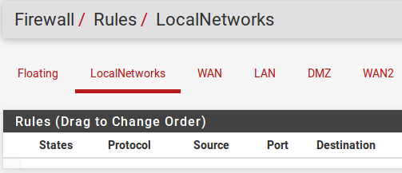

**TIPI DI INTERFACCIA E CONFIGURAZIONE**

Gruppi di interfaccia
=====================

A differenza delle altre interfacce di questo capitolo, un gruppo di
interfaccia non è un tipo di interfaccia che può essere assegnato. I
gruppi di interfaccia sono utilizzati per applicare regole di firewall o
NAT per un insieme di interfacce su una scheda comune. Se questo
concetto è poco familiare, considerare come le regole del firewall per
OpenVPN, il server PPPoE, o L2TP lavorano sul server. Ci sono più
interfacce del sistema operativo sottostante, ma le regole per tutte
loro sono gestite su una singola scheda per ogni tipo. Se molte
interfacce di una funzione analoga sono presenti sul firewall e
necessitano di regole praticamente identiche, un gruppo interfaccia può
essere creato per aggiungere regole per tutte le interfacce allo stesso
tempo. Le interfacce possono ancora avere le proprie regole individuali,
che vengono elaborate dopo le regole del gruppo.

Per creare un gruppo di interfaccia:

-  raggiungere a **Interfacce>(Assegnare)**, scheda **Gruppi di
   interfaccia**

-  Fare clic su |image0| **Aggiungere** per creare un nuovo gruppo

-  Inserire un **Nome del gruppo**. Questo nome può contenere solo
   lettere maiuscole e minuscole, numeri, spazi o caratteri speciali

-  Inserire una **Descrizione del gruppo** (opzionale)

-  Aggiungere interfacce come **Membri del gruppo** con Ctrl-clic per
   selezionare le voci dalla lista di interfacce

-  Fare clic su **Salvare**

I gruppi di interfacce hanno ciascuno una singola scheda sotto
**Firewall>Regole** per gestire le loro regole. La figura *Scheda di
tutte le regole del firewall per il gruppo di interfacce* mostra la
scheda delle regole del firewall per il gruppo definito nella figura
*Aggiungere un gruppo di interfacce*

	.. seealso::
		Configurazione delle regole del firewall* , per informazioni sulla gestione delle regole del firewall.

Ordine di elaborazione del gruppo di regole
===========================================

L'ordine di elaborazione delle regole per un utente è:

-  regole galleggianti

-  regole del gruppo di interfaccia

-  regole riferite alla singola interfaccia

Ad esempio, se una regola nella scheda gruppo corrisponde a un
collegamento, non verranno consultate le regole della scheda di
interfaccia. Allo stesso modo, se una regola galleggiante con Quick Set
è abbinata una connessione, non verranno consultate le regole del gruppo
di interfaccia.

|image1|

Fig. 1: Aggiungere un gruppo di interfacce

|image2|

Fig. 2: Scheda di tutte le regole del firewall per il gruppo di
interfacce

L'ordine di elaborazione impedisce una combinazione di regole che
altrimenti potrebbe essere una buona misura. Ad esempio, se una regola
generale di blocco è presente sul gruppo, può non essere sovrascritta da
una regola su un'interfaccia specifica. Stessa cosa con una regola di
passaggio, una norma specifica per l’interfaccia non può bloccare il
traffico trasmesso da una regola della scheda di gruppo.

Uso con interfacce WAN
======================

È sconsigliato l'utilizzo di gruppi di interfaccia con più reti WAN. Ciò
potrebbe sembrare conveniente, ma le regole del gruppo non ricevono lo
stesso trattamento delle regole della scheda WAN. Ad esempio, le regole
su una scheda per l'interfaccia di tipo WAN (Gateway selezionato sulla
configurazione dell'interfaccia) riceveranno un reply-to che permette a
pf rimandare il traffico di ritorno attraverso l'interfaccia da cui è
entrato. Le regole della scheda di gruppo non ricevono una reply-to che
di fatto significa che le regole del gruppo solo funzionano come
previsto sulla WAN con il gateway predefinito.

Wireless
''''''''

La scheda Wireless sotto **Interfacce>(assegnare)** è per la creazione e
la gestione di interfacce aggiuntive virtuali del punto di accesso
virtuale (VAP). Utilizzando VAP si consente a più reti con wireless SSID
unici di essere eseguite fuori una singola scheda, se questa funzione è
supportata dal driver e l'hardware in uso. Un VAP viene creato sulla
scheda Wireless, quindi assegnato sulla scheda delle interfacce.
Informazioni approfondite su questa funzione possono essere trovate in
*wireless*.

VLAN
''''

Le interfacce contrassegnate con VLAN, o 802.1Q, si trovano nella scheda
**VLAN** sotto **Interfacce>(assignare).** Le istanze VLAN permettono al
sistema di gestire il traffico contrassegnato da un interruttore 802.1Q
compatibile separatamente come se ogni tag fosse una interfaccia
distinta. Su questa scheda viene creata una VLAN, poi assegnata nella
scheda **Assegnazioni interfaccia**. Informazioni approfondite su questa
funzionalità si possono trovare nelle *LAN virtuali (VLANs).*

QinQ
''''

La scheda QinQ sotto **Interfacce>(assignare)** permette di creare
un'interfaccia compatibile 802.1ad, nota anche come *VLAN fornite*.
Questa funzione consente di contenere più tag VLAN in un unico
pacchetto. Questo può aiutare a trasportare il traffico contrassegnato
con VLAN per altre reti attraverso una rete intermedia utilizzando un
tag diverso o sovrapponendolo. Informazioni approfondite su questa
funzionalità possono essere trovate in *Configurazione di QinQ di
|firew4ll|*.

Bridge
''''''

Bridge di interfaccia, o più interfacce legate insieme in un dominio di
broadcast con livello condiviso 2, vengono creati e gestiti sulla scheda
**Bridge** in **Interfacce>(assegnare).** Maggiori informazioni sui
bridge, compreso come crearli e gestirli, è in *Bridging*.

OpenVPN
'''''''

Dopo la creazione di un'istanza OpenVPN, può essere assegnata in Interfacce>(assegnare). Assegnare un'interfaccia OpenVPN abilita le regole specifiche dell'interfaccia e consente di utilizzare l'interfaccia altrove nella GUI si richieda un'interfaccia assegnata. Questo attiva anche la creazione di un gateway dinamico. Questo gateway può essere usato per la politica di routing, o in un gruppo gateway per Multi-WAN. 
	.. seealso::
		*Assegnazione delle interfacce* OpenVPN per maggiori informazioni. 
PPP
'''

Ci sono quattro tipi di interfacce PPP:

-  **PPP** semplice per 3G / 4G e dispositivi modem

-  **PPPoE** per le connessioni DSL o simili

-  **PPTP** e **L2TP** per gli ISP che li richiedono per
   l'autenticazione.

Nella maggior parte di questi casi sono gestiti direttamente dalle
impostazioni di interfaccia, ma possono anche essere modificati sotto
**Interfacce>(assegnare)** nella scheda **PPP**.

PPP con Multi-Link (MLPPP)
==========================

La modifica di un'istanza PPP consente che PPP con Multi-Link (MLPPP)
siano configurati per i fornitori supportati. MLPPP uniscono
collegamenti PPP multipli in un singolo canale aggregato più grande. A
differenza di altre tecniche di multi-WAN, con MLPPP è possibile
utilizzare l'intera banda di tutti i collegamenti per una singola
connessione, e non si causano le solite preoccupazioni sul bilanciamento
del carico e sul failover. Il collegamento MLPPP è presentato come
un'interfaccia con un indirizzo IP, e se un collegamento non riesce, la
connessione funziona lo stesso ma con capacità ridotta.

	.. tip:: Per maggiori informazioni su MLPPP, vedere *Collegamenti di multiple WAN*.

Tipi di interfaccia PPP (Protocollo Point-to-Point)
===================================================

Aggiungere o modificare una voce PPP come segue:

-  Individuare **Interfacce>(assegnare)** nella scheda **PPP**

-  Fare clic su |image3| per modificare una voce esistente o su |image4|
   per aggiungere una nuova voce

-  Impostare il tipo di collegamento, che cambia le opzioni rimanenti
   sulla pagina. I tipi di collegamento sono spiegati in tutto il resto
   di questa sezione.

PPP (3G / 4G, Modem)
--------------------

Il tipo di collegamento **PPP** viene utilizzato per parlare con un
modem su un dispositivo seriale. Questo può essere qualsiasi cosa da un
dongle USB 3G/4G per accedere a una rete cellulare a un vecchio modem
hardware per l'accesso dial-up. Selezionando il tipo di collegamento
PPP, l'elenco delle **Interfacce del Link** viene compilato con
dispositivi seriali che possono essere utilizzati per comunicare con un
modem. Fare clic su una voce specifica per selezionarla per l'uso. Dopo
aver selezionato l'interfaccia, facoltativamente, immettere una
**Descrizione** per la voce PPP.

.. note:: Il dispositivo seriale per un modem non viene rilevato
automaticamente. Alcuni modem si presentano come diversi dispositivi, e
il dispositivo dipendente per la linea PPP può essere una delle scelte
disponibili, ma iniziare con l'ultimo dispositivo, quindi provare il
primo, e poi altri in mezzo se nessuno funziona.

Quando si configura una rete 3G / 4G, le opzioni per il **Provider del
servizio** di riempire prima altri campi pertinenti sulla pagina.

-  Scegliere un **Paese**, come ad esempio Stati Uniti, per attivare
   l’elenco a discesa dei **Provider** con i fornitori di cellulari noti
   in quel paese

-  Selezionare un **provider** dalla lista, come ad esempio *T-Mobile*,
   per attivare l’elenco a discesa del **Piano**.

-  Selezionare un **Piano** e i campi rimanenti saranno riempiti con i
   valori noti per il **Provider** e il **Piano**

   Le opzioni del **Provider del servizio** possono essere configurate
   manualmente se sono necessari altri valori, o quando si utilizza un
   provider che non è elencato:

    **Nome utente e password** Le credenziali utilizzate per l'accesso
    PPP.

    **Numero di telefono** Il numero da comporre sul provider di servizi
    Internet per guadagnare l'accesso. Per 3G/4G questo tende ad essere
    un numero, ad esempio 99# o # 777, e per la connessione dial-up
    questo è di solito un numero di telefono tradizionale.

    **Nome per il punto d’accesso (APN)** Questo campo è richiesto da
    alcuni ISP per identificare il servizio a cui si connette il client.
    Alcuni provider usano questo per distinguere tra piani consumer e
    business, o reti legacy.

    **Numero APN** Impostazione opzionale. Il valore predefinito è 1 se
    l'APN è impostato, é ignorato quando APN è disinserito.

    **PIN della SIM** Codice di sicurezza sulla SIM per impedire l'uso
    non autorizzato della carta. Non inserire nulla qui se la SIM non
    dispone di un codice PIN.

    **Attesa del PIN della SIM** Numero di secondi di attesa per la SIM
    alla scoperta della rete dopo che il PIN viene inviato nella SIM. Se
    il ritardo non è abbastanza lungo, la SIM non può avere il tempo di
    inizializzare correttamente dopo lo sblocco.

    **Stringa di inizializzazione** La stringa di inizializzazione del
    modem, se necessaria. Non includere AT all'inizio del comando. La
    maggior parte dei modem moderni non richiedono una stringa di
    inizializzazione personalizzata.

    **Connessione finita** Il tempo di attesa di un tentativo di
    connessione per avere successo, di pochi secondi. Il valore
    predefinito è 45 secondi.

    **Registrazione in tempo** Se selezionata, il tempo di disponibilità
    della connessione viene monitorato e visualizzato sullo **Stato>
    Interfacce**.

PPPoE (Protocollo Point-to-Point Protocol su Ethernet)
------------------------------------------------------

PPPoE è un metodo popolare di autenticazione e accesso ad una rete ISP,
più comunemente riscontrato sulle reti DSL.

Per configurare un collegamento PPPoE, iniziare impostando il **Tipo di
collegamento** a PPPoE e completare il resto delle impostazioni come
segue:

    **Interfaccia (interfacce) del Link** Una lista di interfacce di
    rete che possono essere utilizzate per PPPoE. Queste sono di solito
    interfacce fisiche ma può anche funzionare su alcuni altri tipi di
    interfaccia come le VLAN. Selezionarne una per il normale PPPoE, o
    multipla per MLPPP.

    **Descrizione** Una descrizione facoltativa della voce PPP

    **Nome utente e password** Le credenziali per questo circuito PPPoE.
    Questi saranno forniti dall'ISP, e il nome utente è in genere sotto
    forma di un indirizzo di posta elettronica, come ad esempio
    miaazienda@ispesempio.com.

    **Nome di servizio** lasciato vuoto per la maggior parte dei
    fornitori di servizi Internet, alcuni lo richiedono impostato su un
    valore specifico. Contattare l'ISP per confermare il valore se la
    connessione non funziona quando è lasciato vuoto.

    **Configurare il nome di servizio NULL** Alcuni ISP richiedono che
    NULL essere inviato al posto di un nome di servizio vuoto.
    Selezionare questa opzione quando l'ISP considera questo
    comportamento necessario.

    **Ripristino periodico** Configura un tempo prestabilito, quando la
    connessione verrà interrotta e riavviata. Questo è raramente
    necessario, ma in certi casi può meglio gestire riconnessioni quando
    un ISP è costretto a riconnettersi quotidianamente o a comportamenti
    inusuali simili.

PPTP (Protocollo di tunneling con Point-to-Point)
-------------------------------------------------

Da non confondere con una VPN PPTP, questo tipo di interfaccia PPTP è
destinato a connettersi a un ISP e autenticarsi, più o meno lo stesso
come funziona PPPoE. Le opzioni per una WAN PPTP sono identiche alle
opzioni PPPoE dello stesso nome. Fare riferimento alla sezione
precedente per informazioni sulla configurazione.

**L2TP (Protocollo di tunneling di livello 2)**

L2TP, come è configurato qui, è usato per connettersi ad un ISP che lo
richiede per l'autenticazione come tipo di WAN. L2TP funziona in modo
identico a PPTP. Fare riferimento alle sezioni precedenti per
informazioni sulla configurazione.

Opzioni avanzate PPP
====================

Tutti i tipi di PPP hanno diverse opzioni avanzate in comune che possono
essere modificate nelle loro voci qui. Nella maggior parte dei casi
queste impostazioni non devono essere modificate. Per visualizzare
queste opzioni, fare clic su\ |image5| **Visualizzare avanzate**.

    **Chiamata su richiesta** Il comportamento predefinito per un
    collegamento PPP è quello di connettersi immediatamente e si
    cercherà immediatamente di riconnettersi quando un collegamento
    viene perso. Questo comportamento è descritto come **Sempre On**. La
    **Chiamata su richiesta** ritarderà questo tentativo di connessione.
    Quando è impostato, il firewall aspetterà che un pacchetto tenti di
    uscire da questa interfaccia, e poi si connetterà. Una volta
    collegato, non si disconnetterà automaticamente.

    **Timeout di inattività** Una connessione PPP sarà mantenuta aperta
    indefinitamente per impostazione predefinita. Un valore in **Timeout
    di inattività**, specificato in secondi, farà sì che il firewall
    controlli la linea per l'attività. Se non c'è traffico sul
    collegamento per il tempo dato, il collegamento sarà scollegato. Se
    è stata impostata anche la **Chiamata su richiesta**, il firewall
    tornerà alla modalità chiamata su richiesta.

	.. note:: 
		|firew4ll| eseguirà per default il monitoraggio del gateway, chegenereràgenererà due ping ICMP al secondo sull'interfaccia. Il Timeout inattivo non funzionerà in questo caso. Questo può essere risolto modificando il gateway per questo link PPP, e selezionando **Disabilitare il monitoraggio del gateway**.

    **Compressione (vjcomp)** Questa opzione controlla se verrà
    utilizzata o meno la compressione dell'intestazione TCP di Van
    Jacobson. Per impostazione predefinita sarà negoziato con il peer
    durante l’accesso, quindi se entrambi i lati supportano la
    funzionalità, verrà utilizzato. La spunta **Disabilitare vjcomp**
    farà sì che la funzionalità sia sempre disabilitata. Di solito
    questa caratteristica è vantaggiosa perché salva diversi byte per
    ogni pacchetto di dati TCP. L'opzione dovrebbe quasi sempre rimanere
    abilitata. Questa compressione è inefficace per le connessioni TCP
    con le estensioni moderne abilitate come con la stampa dell’orario o
    SACK, che modificano le opzioni TCP tra pacchetti sequenziali.

    **Fissaggio MSS dei TCP** L'opzione tcpmssfix fa sì che il daemon
    PPP regoli i segmenti TCP SYN in entrata e in uscita in modo che la
    dimensione massima del segmento richiesta (MSS) non sia superiore
    alla quantità consentita dall'interfaccia MTU. Questo è necessario
    nella maggior parte dei casi per evitare problemi causati da router
    che rilasciano messaggi ICMP come "Dati troppo grandi". Senza questi
    messaggi, la macchina di origine invia dati, supera il router rouge
    poi colpisce una macchina che ha un MTU che non è abbastanza grande
    per i dati. Poiché l'opzione IP "Non frammentare" è impostata,
    questa macchina invia un messaggio ICMP "Dati troppo grandi"
    all'origine e fa cadere il pacchetto. Il router rouge rilascia il
    messaggio ICMP e l'origine non riesce mai a scoprire che deve
    ridurre la dimensione del frammento o eliminare l'opzione IP “Non
    frammentare” dai suoi dati in uscita. Se questo comportamento non è
    desiderabile, controllare **Disabilita tcpmssfix**.

	.. note:: 
		I valori MTU e MSS per l'interfaccia possono essere regolati anche nella pagina di configurazione dell'interfaccia sotto il menu **Interfacce**, come le **interfacce> WAN.**

    **Sequenza breve (ShortSeq)** Questa opzione è significativa solo se
    MLPPP è negoziata. Proibisce intestazioni di frammento multi-link
    più corte, salvando due byte su ogni fotogramma. Non è necessario
    disabilitarla per connessioni che non sono multi-link. Se MLPPP è
    attivo e questa funzionalità deve essere disabilitata, controllare
    **Disabilitare sequenze brevi**.

    **Compressione del campo di controllo dell’indirizzo (AFCComp)**
    Questa opzione si applica solo ai tipi di link asincroni. Salva due
    byte per fotogramma. Per disabilitarlo, controllare **Disabilitare
    la compressione ACF**.

    **Compressione dei campi del protocollo (ProtoComp)** Questa opzione
    salva un byte per fotogramma per la maggior parte dei fotogrammi.
    Per disabilitarla, controllare Disabilitare **la compressione del
    protocollo.**

GRE (Incapsulamento del routing generico)
'''''''''''''''''''''''''''''''''''''''''

L'incapsulamento del routing generico (GRE) è un metodo di tunneling del
traffico tra due endpoint senza crittografia. Può essere utilizzato per
instradare pacchetti tra due posizioni che non sono direttamente
collegati, che non richiedono crittografia. Può anche essere combinato
con un metodo di crittografia che non esegue il proprio tunneling.
L’IPsec in modalità di trasporto può utilizzare GRE per il tunneling del
traffico criptato in modo che consenta il routing tradizionale o l'uso
di protocolli di routing. Il protocollo GRE è stato originariamente
progettato da Cisco, ed è la modalità di tunneling predefinita su molti
dei loro dispositivi.

Come creare o gestire un'interfaccia GRE:

-  Individuare **Interfacce>(assegnare),** scheda GRE

-  Fare clic su |image6| **Aggiungere** per creare una nuova istanza
   GRE, oppure fare clic su |image7| per modificare un'interfaccia
   esistente.

-  Completare le impostazioni come segue:

    **Interfaccia primaria** L'interfaccia su cui il tunnel GRE
    terminerà. Spesso questa sarà uns WAN o una connessione di tipo WAN.

    **Indirizzo remoto GRE** L'indirizzo del peer remoto. Questo è
    l'indirizzo a cui i pacchetti GRE saranno trasmessi da questo
    firewall; l'indirizzo esterno instradabile all'altra estremità del
    tunnel.

    **indirizzo locale del tunnel GRE** L'indirizzo interno per la fine
    del tunnel su questo firewall. Il firewall utilizzerà questo
    indirizzo per il proprio traffico nel tunnel, e traffico remoto del
    tunnel verrebbe inviato a questo indirizzo dal peer remoto.

    **indirizzo remoto del tunnel GRE** L'indirizzo utilizzato dal
    firewall all'interno del tunnel per raggiungere l'altra estremità.
    Il traffico destinato per l'altra estremità del tunnel deve
    utilizzare questo indirizzo come gateway per il routing.

    **Tunnel di sottorete GRE** La maschera di sottorete per l'indirizzo
    di interfaccia GRE.

    **Descrizione** Una breve descrizione di questo tunnel GRE a scopo
    di documentazione.

-  Fare clic su **Salvare**

GIF (Interfaccia di tunnel generica)
''''''''''''''''''''''''''''''''''''

Un'interfaccia di tunnel generica (GIF) è simile al GRE; entrambi i
protocolli sono un mezzo per tunnel del traffico tra due host senza
crittografia. In aggiunta al tunnel IPv4 o IPv6, il GIF può essere
utilizzato per il tunnel IPv6 su reti IPv4 e viceversa. I tunnel GIF
sono comunemente utilizzati per ottenere la connettività IPv6 ad un
broker di tunnel come Hurricane Electric in luoghi in cui la
connettività IPv6 non è disponibile.

	.. seealso::
		Vedere *Collegamento con un servizio di Tunnel Broker* per informazioni sulla connessione a un servizio tunnelbroker.

Le interfacce GIF trasportano più informazioni attraverso il tunnel di
quelle che possono fare con GRE, ma il GIF non è così ampiamente
supportato. Ad esempio, un tunnel GIF è in grado di collegare il livello
2 tra due posizioni, mentre GRE non può.

Come creare o gestire un'interfaccia GIF:

-  Arrivare a Interfacce>(Assegnare), scheda GIF

-  |image8|\ |image9|\ Fare clic su Aggiungere per creare una nuova
   istanza GIF o fare clic su per modificare un'interfaccia esistente

-  Completare le impostazioni come segue:

    **Interfaccia primaria** L'interfaccia su cui il tunnel GIF
    terminerà. Spesso questa sarà una WAN o una connessione di tipo WAN.

    **Indirizzo remoto GIF** L'indirizzo del peer remoto. Questo è
    l'indirizzo in cui i pacchetti GIF saranno inviati da questo
    firewall; L'indirizzo esterno instradabile all'altra estremità del
    tunnel. Ad esempio, in un tunnel IPv6-in-IPv4 a Hurricane Electric,
    questo sarebbe l'indirizzo IPv4 del server di tunnel, come ad
    esempio 209.51.181.2.

    **Indirizzo locale tunnel GIF** L'indirizzo interno per la fine del
    tunnel su questo firewall. Il firewall utilizzare questo indirizzo
    per il proprio traffico nel tunnel, e il traffico remoto del tunnel
    verrebbe inviato a questo indirizzo dal peer remoto. Ad esempio, per
    il tunneling IPv6-in-IPv4 tramite Hurricane Electric, ci si
    riferisce a questo come l'\ **indirizzo del client IPv6.**

    **Indirizzo remoto del tunnel GIF** L'indirizzo utilizzato dal
    firewall all'interno del tunnel per raggiungere l'altra estremità.
    Il traffico destinato per l'altra estremità del tunnel deve
    utilizzare questo indirizzo come gateway per il routing. Ad esempio,
    per il tunneling IPv6-in-IPv4 tramite Hurricane Electric, ci si
    riferisce a questo come **indirizzo del server IPv6**.

    **Sottorete del tunnel GIF** La maschera di sottorete o lunghezza
    del prefisso per l'indirizzo di interfaccia. In questo esempio è 64.

    **Caching della route** Le opzione di caching della route
    controllano se è è memorizzato il percorso al punto di fine remoto o
    meno. Se il percorso del peer remoto è statico, impostando questa
    opzione, si può evitare un percorso di ricerca per pacchetto.
    Tuttavia, se il percorso verso il lato opposto dovesse cambiare,
    questa opzione potrebbe comportare che il traffico GIF non riusca a
    fluire quando la route cambia.

    **Comportamento amichevole dell’ECN** L'opzione di comportamento
    amichevole ECN controlla se la pratica della notifica esplicita
    della congestione (ECN) di copiare il bit TOS in entrata/in uscita
    dal traffico del tunnel è eseguita o meno dal firewall. Per default
    il firewall cancella il bit TOS sui pacchetti o lo imposta a 0, a
    seconda della direzione del traffico. Con questa opzione impostata,
    il bit viene copiato come necessario tra i pacchetti interni ed
    esterni per essere più disponibile per i router intermedi che
    possono eseguire la configurazione del traffico. Questo
    comportamento rompe il RFC 2893 quindi deve essere utilizzato solo
    quando entrambi i peers accettano di abilitare l'opzione.

    **Descrizione** Una breve descrizione di questo tunnel GIF a scopo
    di documentazione.

-  Fare clic su **Salva**

	.. note:: 
		Se l'interfaccia GIF è assegnata in **Interfacce>(assegnare),** impostare il **tipo di configurazione IPv4** e il **tipo di configurazione IPv6** su *Nessuno*. Il firewall creerà automaticamente un gateway dinamico in questa situazione.

LAGG (Aggregazione di Link)
'''''''''''''''''''''''''''

L'aggregazione dei link è gestita da interfacce di tipo lagg(4) (LAGG)
su |firew4ll|. LAGG combina più interfacce fisiche come un'unica
interfaccia logica. Ci sono diversi modi in cui questo può funzionare,
sia per guadagnare sulla larghezza di banda supplementare, sulla
ridondanza, o su qualche combinazione delle due.

Come creare o gestire interfacce LAGG:

-  Individuare **Interfacce>(assegnare),** scheda LAGG

-  Fare clic su |image10| **Aggiungere** per creare un nuovo LAGG,
   oppure fare clic su |image11| per modificare un'istanza esistente.

-  Completare le impostazioni come segue:

    **Interfacce primarie** Questo elenco contiene tutte le interfacce
    attualmente non assegnate e i membri dell'interfaccia LAGG corrente
    quando si modifica un'istanza esistente. Per aggiungere interfacce a
    questo LAGG, selezionare una o più interfacce in questo elenco.

	.. note:: 
		Un'interfaccia può essere aggiunta ad un gruppo LAGG solo se non è assegnata. Se un'interfaccia non è presente nell'elenco, è probabile che sia già stata assegnata come interfaccia.

    **Protocollo LAGG** Attualmente esistono sei diverse modalità
    operative per le interfacce LAGG: LACP, Failover, Bilanciamento di
    carico, Round Robin e Nessuno.

    **LACP** Il protocollo LAGG più comunemente utilizzato. Questa
    modalità supporta il protocollo di controllo dell'aggregazione link
    IEEE 802.3ad (LACP) e il protocollo Marker. In modalità LACP, la
    negoziazione avviene con lo switch – che deve anche supportare LACP
    – per formare un gruppo di porte che sono tutte attive allo stesso
    tempo. Si tratta di un gruppo di aggregazione di collegamenti o di
    un GAL. La velocità e la MTU di ogni porta di un GAL devono essere
    identiche e le porte devono anche funzionare a full- duplex. Se si
    perde il collegamento con una porta del GAL, il GAL continua a
    funzionare ma a capacità ridotta. In questo modo, un pacchetto LACP
    LAGG può ottenere sia ridondanza che una maggiore larghezza di
    banda.

    Il traffico è bilanciato tra tutte le porte del GAL, tuttavia, per
    la comunicazione tra due singoli host utilizzerà una sola porta alla
    volta perché il client parlerà con un solo indirizzo MAC alla volta.
    Per connessioni multiple attraverso dispositivi multipli, questa
    limitazione diventa effettivamente irrilevante. La limitazione non è
    rilevante anche per il failover.

    Oltre a configurare questa opzione su |firew4ll|, lo switch deve
    abilitare LACP su queste porte o avere le porte raggruppate in un
    gruppo LAG. Entrambe le parti devono concordare la configurazione in
    modo che possa funzionare correttamente

    **failover** Quando si utilizza il protocollo Failover il traffico
    LAGG verrà inviato solo sull'interfaccia primaria del gruppo. Se
    l'interfaccia primaria non fallisce, allora il traffico utilizzerà
    la prossima interfaccia disponibile. L'interfaccia primaria è la
    prima interfaccia selezionata nell'elenco, e continuerà in ordine
    fino a raggiungere la fine delle interfacce selezionate.

.. note:: 
	Per impostazione predefinita, il traffico può essere ricevuto solo sull'interfaccia attiva. Creare un sistema adattabile per ``net.link.lagg.failover_rx_all`` con il valore di 1 per consentire al traffico di essere ricevuto su ogni interfaccia del gruppo.

    **Bilanciamento del carico** La modalità di bilanciamento del carico
    accetta il traffico in entrata su qualsiasi porta del gruppo LAGG e
    bilancia il traffico in uscita su qualsiasi porta attiva del gruppo
    LAGG. Si tratta di un'impostazione statica che non controlla lo
    stato di collegamento né negozia con lo switch. Il traffico in
    uscita è bilanciato dal carico in base a tutte le porte attive del
    LAGG utilizzando un hash calcolato utilizzando diversi fattori, come
    l'indirizzo IP di origine e di destinazione, l'indirizzo MAC e il
    tag VLAN.

    **Round Robin** Questa modalità accetta il traffico in entrata su
    qualsiasi porta del gruppo LAGG e invia il traffico in uscita
    utilizzando un algoritmo di pianificazione round robin. questo
    significa che il traffico sarà inviato in sequenza, utilizzando ogni
    interfaccia del gruppo a turno.

    **Nessuna** Questa modalità disabilita il traffico sull'interfaccia
    LAGG senza disabilitare l'interfaccia stessa. Il sistema operativo
    farà ancora credere che l'interfaccia sia attiva e utilizzabile, ma
    nessun traffico verrà inviato o ricevuto sul gruppo

    **Descrizione** Una breve nota sullo scopo di questa istanza LAGG.

-  Fare clic su **Salvare**

   Dopo aver creato un'interfaccia LAGG, questa funziona come qualsiasi
   altra interfaccia fisica. Assegnare l'interfaccia lagg in
   **Interfacce>(assegnare)** e dargli un indirizzo IP, o costruire
   altre cose su di esso come una VLAN.

LAGG e regolazione del traffico
===============================

A causa di limitazioni in FreeBSD, lagg(4) non supporta altq(4), quindi
non è possibile usare direttamente il regolatore del traffico sulle
interfacce LAGG. Le interfacce vlan(4) supportano altq(4) e le VLAN
possono essere usate in aggiunta alle interfacce LAGG, quindi usando le
VLAN si può risolvere il problema. Come soluzione alternativa, i
limitatori possono controllare l'utilizzo della larghezza di banda sulle
interfacce LAGG.

Portata della LAGG
==================

L'utilizzo di un LAGG non garantisce necessariamente un flusso completo
pari alla somma di tutte le interfacce. In particolare, un singolo
flusso non supererà la portata di un'interfaccia membro della LAGG. Il
traffico su un LAGG viene gestito in modo tale che i flussi tra due
host, come |firew4ll| e un gateway upstream, utilizzino solo un singolo
link poiché il flusso avviene tra un singolo indirizzo MAC su ciascun
lato.

Nelle reti dove ci sono molti host che comunicano con diversi indirizzi
MAC, l'uso può avvicinarsi alla somma di tutte le interfacce nel LAGG.

Configurazione dell'interfaccia
'''''''''''''''''''''''''''''''

Per assegnare una nuova interfaccia:

-  Individuare **Interfacce>(assegnare)**

-  Scegliere la nuova interfaccia dalla lista delle **porte disponibile
   di rete**

-  Cliccare su |image12| **Inserire**

La nuova interfaccia assegnata verrà visualizzata nell'elenco. La nuova
interfaccia avrà un nome predefinito assegnato dal firewall come OPT1 o
OPT2, con il numero crescente in base al suo ordine di assegnazione. Le
prime due interfacce predefinite per i nomi WAN e LAN, ma possono essere
rinominati. Questi nomi OPTx appaiono nel menu delle **interfacce**,
come **Interfacce>OPT1**. Selezionando l'opzione del menu per
l'interfaccia si aprirà la pagina di configurazione per l'interfaccia.

Sono disponibili le seguenti opzioni per tutti i tipi di interfaccia.

Descrizione
===========

Il nome della interfaccia. Questo cambierà il nome dell'interfaccia nel
menu **Interfacce**, nelle schede sotto **Firewall>Regole**, in
**Servizi>DHCP**, e altrove in tutta la GUI. I nomi delle interfacce
possono contenere solo lettere, numeri e lìunico carattere speciale che
è permesso è un underscore ("\_"). L'uso di un nome personalizzato rende
più facile ricordare lo scopo di un'interfaccia e identificare
un'interfaccia per l'aggiunta di regole del firewall o la scelta di
altre funzionalità per interfaccia.

Tipo di configurazione IPv4
===========================

Consente di configurare le impostazioni IPv4 per l'interfaccia. Dettagli
per questa opzione sono nella sezione successiva,\ *Tipi di WAN con
Ipv4*.

IPv6 Tipo di configurazione
===========================

Consente di configurare le impostazioni IPv6 per l'interfaccia. Dettagli
per questa opzione sono in\ *Tipi di WAN con IPv6*.

Indirizzo MAC
=============

L'indirizzo MAC di un'interfaccia può essere modificato ( “mascherato”)
per simulare un pezzo di apparecchiatura precedente.

	.. warning::
		Avvertimento: Si consiglia di evitare questa pratica. Il vecchio MAC sarebbe generalmente eliminato resettando l'apparecchiatura a cui questo firewall si connette, o cancellando la tabella ARP, o in attesa che le vecchie voci ARP scadano. È una soluzione a lungo termine a un problema temporaneo.

Lo spoofing dell'indirizzo MAC del firewall precedente può consentire
una transizione agevole da un vecchio router a un nuovo router, in modo
che le cache ARP sui dispositivi e sui router upstream non siano un
problema. Può anche essere usato per ingannare un pezzo di
apparecchiatura facendogli credere che stia parlando con lo stesso
dispositivo con cui stava parlando prima, come nei casi in cui un certo
router di rete utilizza un ARP statico o altrimenti filtri basati
sull’indirizzo MAC. Questo è comune sui modem via cavo, dove possono
richiedere l'indirizzo MAC per essere registrati se questo cambia.

Un aspetto negativo dello spoofing dell'indirizzo MAC è che a meno che
il vecchio pezzo di apparecchiatura sia andato permanentemente in
pensione, vi è il rischio di avere in seguito un conflitto xon
l’indirizzo MAC sulla rete, che può portare a problemi di connettività.
I problemi della cache ARP tendono ad essere molto temporanei,
risolvendosi automaticamente in pochi minuti o con il ciclo di
alimentazione di altre apparecchiature.

Se il vecchio indirizzo MAC deve essere ripristinato, questa opzione
deve essere svuotata e quindi il firewall deve essere riavviato. In
alternativa, inserire l'indirizzo MAC originale della scheda di rete e
salvare/applicare, quindi svuotare nuovamente il valore.

MTU (Unità di trasmissione massima)
===================================

Il campo dimensione di **massima unità di trasmissione (MTU)** può
essere lasciato vuoto, ma può essere modificato quando richiesto. Alcune
situazioni possono richiedere un MTU inferiore per garantire che i
pacchetti siano dimensionati in modo appropriato per una connessione
Internet. Nella maggior parte dei casi, i valori predefiniti assunti per
il tipo di connessione WAN funzioneranno correttamente. Può essere
aumentato per coloro che utilizzano cornici jumbo sulla loro rete.

In una tipica rete in stile Ethernet, il valore predefinito è 1500, ma
il valore effettivo può variare a seconda della configurazione
dell'interfaccia.

MSS (Dimensione massima del segmento)
=====================================

Simile al campo MTU, il campo MSS adegua la dimensione massima del
segmento (MSS) di connessioni TCP alla dimensione specificata, al fine
di lavorare intorno ai problemi con il percorso MTU Discovery

Velocità e duplex
=================

Il valore predefinito per la velocità di collegamento e duplex è quello
di lasciare che il firewall decida cosa è meglio. L’ opzione predefinita
tipica è *Autoselect*, che negozia le migliori impostazioni di velocità
e duplex con il peer, di solito uno switch.

Le impostazioni di velocità e duplex su un'interfaccia devono
corrispondere al dispositivo a cui è collegata. Ad esempio, quando il
firewall è impostato su *Autoselect*, lo switch deve essere configurato
anche per *Autoselect*. Se l'interruttore o un altro dispositivo ha una
velocità specifica e duplex forzato, deve essere corrisposto dal
firewall.

Blocco delle reti private 
=========================

Quando il **blocco delle reti private** è attivo |firew4ll| inserisce
automaticamente una regola che impedisce a qualsiasi rete RFC 1918
(10.0.0.0/8, 172.16.0.0/12, 192.168.0.0/16) e loopback (127.0.0.0/8) di
comunicare su tale interfaccia. Questa opzione è di solito desiderabile
solo su interfacce di tipo WAN per impedire la possibilità di traffico
privato numerato in arrivo su un'interfaccia pubblica.

Blocco delle reti bogon
=======================

Quando il **blocco delle reti bogon** è attivo, |firew4ll| bloccherà il
traffico da un elenco di reti riservate e non assegnate. Questo elenco
viene aggiornato periodicamente dal firewall, automaticamente.

Ora che lo spazio IPv4 è stato assegnato, questa lista è abbastanza
piccola, contenente per lo più reti che sono state riservate in qualche
modo da IANA. Queste sottoreti non dovrebbero mai essere in uso attivo
su una rete, specialmente una rivolta a Internet, quindi è una buona
prassi abilitare questa opzione sulle interfacce tipo WAN. Per IPv6,
l'elenco è abbastanza grande, contenente parti considerevoli del
possibile spazio IPv6 che deve ancora essere allocato. Sui sistemi con
basse quantità di RAM, questa lista potrebbe essere troppo grande, o il
valore predefinito di **Voci massime della tabella del firewall**
potrebbe essere troppo piccolo. Tale valore può essere regolato in
**Sistema>Avanzate** nella scheda **Firewall & NAT**.

Tipi di WAN con IPv4
''''''''''''''''''''

Una volta che un'interfaccia è stata assegnata, nella maggior parte dei
casi richiederà un indirizzo IP. Per le connessioni IPv4 sono
disponibili le seguenti opzioni: IPv4 statico, DHCP, PPP, PPPoE, PPTP e
L2TP. Queste opzioni sono selezionate utilizzando il selettore del tipo
di **configurazione IPv4** su una pagina di interfaccia (ad es.
**Interfacce>WAN**).

Nessuno
=======

Quando il **tipo di configurazione IPv4** è impostato su *Nessuno*, IPv4
è disabilitato sull'interfaccia. Questo è utile se l'interfaccia non ha
connettività IPv4 o se l'indirizzo IP dell'interfaccia è gestito in
altro modo, come per un'interfaccia OpenVPN o GIF.

IPv4 statico
============

Con IPv4 statico, l'interfaccia contiene un indirizzo IP configurato
manualmente. Una volta scelto, sono disponibili tre campi aggiuntivi
nella schermata di configurazione dell'interfaccia: indirizzo IPv4, un
selettore di sottorete CIDR e il campo del **gateway di upstrem IPv4**.

Configurare l'interfaccia per l'IPv4 statico su un'interfaccia interna
(ad es. LAN, DMZ):

-  Selezionare *IPv4 statico* sotto **Tipo di configurazione IPv4**

-  Inserire l'indirizzo IPv4 per l'interfaccia nella casella di
   **indirizzo IPv4**

-  Scegliere la maschera di sottorete appropriata dal menù a discesa
   CIDR dopo la casella dell’indirizzo

-  Non selezionare un **gateway di upstream IPv4**

Per configurare l'interfaccia per IPv4 statico su un tipo di interfaccia
WAN:

-  Selezionare *IPv4 statico* sotto **Tipo di configurazione IPv4**

-  Inserire l'indirizzo IPv4 per l'interfaccia nella casella di
   **indirizzo IPv4**

-  Scegliere la maschera di sottorete appropriata dal menù a discesa
   CIDR dopo la casella dell’indirizzo

-  Eseguire una delle seguenti azioni per usare un gateway
   sull'interfaccia:

   -  Selezionare un **gateway di upstream IPv4** dall'elenco, o

   -  Cliccare su |image13|\ **Aggiungere** **un nuovo gateway** per
      creare un nuovo gateway se non esiste già. Cliccando sul link,
      viene visualizzato un form modale per aggiungere la porta
      d'ingresso senza lasciare la pagina. Compilare i dati richiesti
      sul nuovo modulo:

    **Gateway predefinito** Se questa è l'unica WAN o sarà una nuova WAN
    predefinita, selezionare questa casella. I gateway IPv4 e IPv6
    predefiniti funzionano indipendentemente l'uno dall'altro. I due non
    devono necessariamente essere sullo stesso circuito. Cambiare il
    gateway IPv4 predefinito non ha alcun effetto sul gateway IPv6, e
    viceversa.

    **Nome del gateway** Il nome utilizzato per riferirsi al gateway
    all’interno, così come in luoghi come i gruppi gateway, i grafici di
    qualità, e altrove.

    **IPv4 del gateway** L'indirizzo IP del gateway. Questo indirizzo
    deve essere all'interno della stessa sottorete dell'indirizzo IPv4
    statico quando si usa questo modulo.

    **Descrizione** Breve testo che indica lo scopo del gateway.

|image14|

-  Cliccare su **Inserire**

	.. note:: 
		Selezionando un gateway IPv4 dall'elenco a discesa o aggiungendo e selezionando un nuovo gateway, |firew4ll| tratterà questa interfaccia come un'interfaccia di tipo WAN per il NAT e le funzioni correlate. Questo non è auspicabile per interfacce interne come LAN o DMZ. I gateway possono ancora essere utilizzati su interfacce interne per percorsi statici senza selezionare un gateway IPv4 upstream qui sullo schermo delle interfacce.

DHCP
====

Quando un'interfaccia è impostata su DHCP, |firew4ll| tenterà la
configurazione IPv4 automatica di questa interfaccia tramite DHCP.
Questa opzione attiva anche diversi campi aggiuntivi nella pagina. Nella
maggior parte dei casi questi campi aggiuntivi possono essere lasciati
in bianco.

    **Nome host** Alcuni ISP richiedono il nome host per
    l'identificazione del client. Il valore nel campo **Nome dell’host**
    viene inviato come identificativo del client DHCP e nome host quando
    si richiede un contratto di locazione DHCP.

    **​​Indirizzo IPv4 dell’Alias** Questo valore è usato come indirizzo
    di alias IPv4 fisso dal client DHCP poiché un tipico VIP dell’IP
    Alias non può essere usato con DHCP. Questo può essere utile per
    accedere a un pezzo di ingranaggio su una rete separata, numerata
    staticamente al di fuori dello scopo DHCP. Un esempio potrebbe
    essere quello di raggiungere un indirizzo IP di gestione del modem
    via cavo.

    **Rifiutare le locazioni da** Un indirizzo IPv4 per un server DHCP
    che dovrebbe essere ignorato. Ad esempio, un modem via cavo che
    distribuisce indirizzi IP privati quando la sincronizzazione via
    cavo è stata persa. Inserisre qui l'indirizzo IP privato del modem,
    ad es. 192.168.100.1 e il firewall non rileverà né tenterà di usare
    un indirizzo IP fornito dal server specificato.

    **Configurazione avanzata** Abilita le opzioni per controllare i
    tempi del protocollo. Nella stragrande maggioranza dei casi questo
    deve essere lasciato deselezionato e le opzioni all'interno
    invariate.

    **Tempistiche del protocollo** I campi di questa area forniscono un
    controllo a grana fine sui tempi utilizzati da dhclient quando si
    gestisce un indirizzo su questa interfaccia. Queste opzioni sono
    quasi sempre lasciate ai loro valori predefiniti. Per maggiori
    dettagli su cosa controlla ogni campo, vedere la pagina principale
    di dhclient

    **Predefiniti** Ha diverse opzioni per i valori di tempo del
    protocollo preimpostati. Questi sono utili come punto di partenza
    per le regolazioni personalizzate o per l'uso quando i valori devono
    essere reimpostati ai valori predefiniti

    **Override di configurazione** Abilita un campo per usare un file di
    configurazione dhclient personalizzato. Il percorso completo deve
    essere dato. L'utilizzo di un file personalizzato è raramente
    necessario, ma alcuni ISP richiedono campi DHCP o opzioni che non
    sono supportate nella GUI |firew4ll|.

Tipi di PPP
===========

I vari tipi di connessione basati su PPP, come PPP, PPPoE, PPTP e L2TP,
sono tutti trattati in dettaglio in precedenza in questo capitolo (PPP).
Quando uno di questi tipi è selezionato qui sullo schermo delle
interfacce, le loro opzioni di base possono essere cambiate come
descritto. Per accedere alle opzioni avanzate, seguire il link di questa
pagina o passare a **Interfacce>(assegnare)** sulla schede **PPP**,
trovare la voce, e modificarla.

Tipi di WAN con IPv6
''''''''''''''''''''

Analogamente a IPv4, il **tipo di configurazione IPv6** controlla se e
come un indirizzo IPv6 è assegnato ad un'interfaccia. Ci sono diversi
modi per configurare IPv6 e il metodo esatto dipende dalla rete a cui
questo firewall è collegato e come l'ISP ha distribuito IPv6.

**Vedere anche:**

Per ulteriori informazioni sull'IPv6, inclusa un'introduzione di base,
vedere *IPv6*.

Nessuno
=======

Quando il **tipo di configurazione IPv6** è impostato su *Nessuno*, IPv6
è disabilitato sull'interfaccia. Questo è utile se l'interfaccia non ha
connettività IPv6 o se l'indirizzo IP dell'interfaccia è gestito in
altro modo, come per un'interfaccia OpenVPN o GIF.

IPv6 statico
============

I controlli degli IPv6 statici funzionano in modo identico alle
impostazioni degli IPv4 statici. Vedere *IPv4 statico* per i dettagli.

Con **IPv6 statico**, l'interfaccia contiene un indirizzo IPv6
configurato manualmente. Una volta scelto, sono disponibili tre campi
aggiuntivi nella schermata di configurazione dell'interfaccia:
**Indirzzo IPv6**, un selettore della lunghezza del prefisso e il campo
**gateway Upstream IPv6**.

I gateway IPv4 e IPv6 di default funzionano indipendentemente l'uno
dall'altro. I due non devono necessariamente essere sullo stesso
circuito. Cambiare il gateway IPv4 predefinito non ha effetto sul
gateway IPv6 e viceversa.

DHCP6
=====

DHCP6 configura |firew4ll| per tentare la configurazione IPv6 automatica di
questa interfaccia tramite DHCPv6. DHCPv6 configura l'interfaccia con un
indirizzo IP, lunghezza del preisso, server DNS, ecc. ma non un gateway.
Il gateway è ottenuto tramite annunci del router, quindi questa
interfaccia sarà impostata per accettare annunci del router. Si tratta
di una scelta progettuale nell'ambito della specifica IPv6, non di una
limitazione di |firew4ll|. Per maggiori informazioni sulla pubblicità del
router, vedere *Annunci del Router*.

Sono disponibili diversi campi aggiuntivi per DHCP con IPv4 che non
esistono per DHCP con IPv4:

    **Utilizzare la connettività IPv4 come interfaccia primaria** Quando
    è impostata, la richiesta DHCP con IPv6 viene inviata utilizzando
    IPv4 su questa interfaccia, piuttosto che utilizzando l’IPv6
    originario. Questo è richiesto solo in casi speciali quando l'ISP
    richiede questo tipo di configurazione.

    **Richiedere solo un prefisso IPv6** Quando è impostato, il client
    DHCPv6 non richiede un indirizzo per l'interfaccia stessa, richiede
    solo un prefisso delegato.

    **Dimensione della delega del prefisso DHCPv6** Se l'ISP fornisce
    una rete IPv6 instradata tramite la delega del prefisso,
    pubblicheranno la dimensione della delega, che può essere
    selezionata qui. È un valore tra 48 e 64. Per maggiori informazioni
    su come funziona la delega del prefisso DHCPv6, vedere *Delega del
    Prefisso DHCP6*. Per utilizzare questa delega, un'altra interfaccia
    interna deve essere impostata su **tipo di configurazione IPv6**
    della *traccia di interfaccia* (*Tracciare interfaccia*) in modo che
    possa utilizzare gli indirizzi delegati dal server DHCPv6 upstream.

    **Inviare suggerimento per il prefisso IPv6** Quando impostata, la
    dimensione della delega del prefisso DHCPv6 viene inviata con la
    richiesta di informare il server upstream riguardo la grandezza
    desiderata per una delega da questo firewall. Se un ISP permette la
    scelta, e la dimensione scelta è all'interno della gamma consentita,
    la dimensione richiesta sarà data al posto della dimensione
    predefinita.

    **Debug** Quando è impostato, il client DHCPv6 viene avviato in
    modalità debug.

    **Configurazioni avanzate** Consente una vasta gamma di parametri di
    regolazione avanzati per il client DHCPv6. Queste opzioni sono usate
    raramente, e quando sono richieste, i valori sono dettati dall'ISP o
    dall'amministratore di rete. Vedere la pagina principale di
    dhcp6c.conf per i dettagli.

    **Override di configurazione** Abilita un campo per usare un file di
    configurazione personalizzato. Il percorso completo deve essere
    dato. L'utilizzo di un file personalizzato è raramente necessario,
    ma alcuni ISP richiedono campi DHCP o opzioni che non sono
    supportati nella GUI |firew4ll|.

SLAAC
=====

L'autoconfigurazione senza indirizzo (SLAAC) come il tipo IPv6 fa in
modo che |firew4ll| configuri l'indirizzo IPv6 per l'interfaccia degli
annunci router (RA) che pubblicizzano il prefisso e le relative
informazioni. Si noti che il DNS non è tipicamente fornito tramite RA,
quindi |firew4ll| tenterà comunque di ottenere i server DNS tramite DHCPv6
quando si utilizza SLAAC. In futuro, le estensioni RDNSS per il processo
RA possono consentire che i DNS server siano ottenuti da RA. Per
maggiori informazioni sugli annunci del router, vedere *Annunci del
Router*.

Tunnel di 6RD
=============

6RD è una tecnologia di tunneling IPv6 impiegata da alcuni ISP per
attivare rapidamente il supporto IPv6 per le loro reti, passando il
traffico IPv6 all'interno di pacchetti IPv4 appositamente predisposti
tra e router utente finale e il relay ISP. Si riferisce a 6to4 ma è
destinato ad essere utilizzato all'interno della rete ISP, utilizzando
gli indirizzi IPv6 dall'ISP per il traffico client. Per utilizzare 6RD,
l'ISP deve fornire tre informazioni: il prefisso 6RD, il relay di
confine 6RD e la lunghezza del prefisso IPv4 di 6RD.

    **Prefisso 6RD** Il prefisso IPv6 6RD assegnato dall'ISP, come
    2001:db8::/32.

    **Relay di confine 6RD** L'indirizzo IPv4 del relay 6RD dell’ISP.

    **Lunghezza del prefisso IPv4 6RD** Controlla quanto dell'indirizzo
    IPv4 dell’utente finale utente è codificato all'interno del prefisso
    6RD. Questo è normalmente fornito dal ISP. Un valore pari a 0
    significa che l'intero indirizzo IPv4 sarà incorporato all'interno
    del prefisso 6RD. Questo valore consente agli ISP di indirizzare
    efficacemente più indirizzi IPv6 ai client rimuovendo le
    informazioni ridondanti IPv4 se una assegnazione ISP è interamente
    all'interno della stessa sottorete più grande.

Tunnel 6to4
===========

Simile a 6RD, *6to4* è un altro metodo di tunneling del traffico IPv6
all'interno IPv4. A differenza di 6RD, tuttavia, 6to4 utilizza prefissi
e relay costanti. Come tale non ci sono impostazioni regolabili
dall'utente per utilizzare l'opzione *6to4*. Il prefisso 6to4 è sempre
2002::/16. Qualsiasi indirizzo all'interno del prefisso 2002::/16 è
considerato un indirizzo 6to4 piuttosto che un indirizzo IPv6
originario. Anche a differenza di 6RD, un tunnel 6to4 può essere
terminato ovunque su Internet, non solo presso l'utente finale ISP,
quindi la qualità della connessione tra l'utente e il relay 6to4 può
variare notevolmente.

I tunnel 6to4 sono sempre terminati all'indirizzo IPv4 di 192.88.99.1.
Questo indirizzo IPv4 è anycasted, il che significa che anche se
l'indirizzo IPv4 è lo stesso ovunque, può essere indirizzato
regionalmente verso un nodo vicino all'utente.

Un'altra carenza di 6to4 è che si basa su altri router per trasmettere
il traffico tra la rete 6to4 e il resto della rete IPv6. C'è la
possibilità che alcuni peer IPv6 non abbiano la connettività alla rete
6to4, e quindi questi sarebbero irraggiungibili per i client che si
connettono ai relay 6to4, e questo potrebbe anche variare a seconda del
nodo 6to4 a cui l'utente è effettivamente collegato.

Track Interface
===============

La scelta di *Track Interface* funziona in concerto con un'altra
interfaccia IPv6 utilizzando la delega del prefisso DHCPv6. Quando una
delega è ricevuta dall'ISP, questa opzione indica quale interfaccia
verrà assegnata agli indirizzi IPv6 delegati dall'ISP e nei casi in cui
si ottiene una delega più ampia, quale prefisso all'interno della delega
viene utilizzato.

    **Interfaccia IPv6** Un elenco di tutte le interfacce del sistema
    attualmente impostate per i tipi dinamici di WAN IPv6 che offrono la
    delega di prefissi (DHCPv6, PPPoE, 6rd, ecc.). Selezionare
    l'interfaccia dall'elenco che riceverà le informazioni sulla
    sottorete delegata dall'ISP.

    **ID del prefisso IPv6** Se l'ISP ha delegato più di un prefisso
    tramite DHCPv6, lId del prefisso 'IPv6 controlla quale delle
    sottoreti delegate /64 sarà utilizzata su questa interfaccia. Questo
    valore è specificato in esadecimale.

Ad esempio, Se una delega è fornita dall'ISP significa che le reti 16
/64 sono disponibili, così i prefissi ID da 0 a f può essere utilizzato.

Per maggiori informazioni su come funziona il prefisso di delega, vedere
*Delega del prefisso DHCP6 prefisso*.

|firew4ll| supporta numerosi tipi di interfacce di rete, sia da utilizzare
direttamente interfacce fisiche oppure impiegando altri protocolli come
PPP o VLAN.

Le assegnazioni di interfaccia e la creazione di nuove interfacce
virtuali sono tutte gestite in **Interfacce>(assegnare).**

Interfacce fisiche e virtuali
'''''''''''''''''''''''''''''

La maggior parte delle interfacce discusse in questo capitolo possono
essere assegnate come WAN, LAN o come interfaccia OPT sotto
**Interfacce>(assegnare).** Tutte le interfacce attualmente definite e
rilevate sono elencate direttamente su **Interfacce>(assegnare)** o
nell'elenco delle interfacce disponibili per l'assegnazione. Per
impostazione predefinita, questo elenco include solo le interfacce
fisiche, ma le altre schede in **Interfacce>(assegnare)** possono creare
interfacce virtuali che possono poi essere assegnate.

Le interfacce su |firew4ll| supportano varie combinazioni di opzioni sulle
interfacce stesse. Possono anche supportare più reti e protocolli su una
singola interfaccia, o più interfacce possono essere unite in una
maggiore capacità o interfaccia virtuale ridondante.

Tutte le interfacce sono trattate allo stesso modo; ogni interfaccia può
essere configurata per qualsiasi tipo di connettività o ruolo. Le
interfacce WAN e LAN di default possono essere rinominate e utilizzate
in altri modi.

Le interfacce fisiche e virtuali vengono trattate una volta assegnate, e
hanno le stesse capacità. Ad esempio, un'interfaccia VLAN può avere lo
stesso tipo di configurazione che può avere un'interfaccia fisica.
Alcuni tipi di interfaccia ricevono un trattamento speciale una volta
assegnate, che sono coperti nelle rispettive sezioni di questo capitolo.

Questa sezione illustra i vari tipi di interfacce che possono essere
creati, non assegnati, e gestiti.

.. |image0| image:: media/image1.png
   :width: 0.26389in
   :height: 0.26389in

.. |image3| image:: media/image4.png
   :width: 0.26389in
   :height: 0.26389in
.. |image4| image:: media/image1.png
   :width: 0.26389in
   :height: 0.26389in
.. |image5| image:: media/image5.png
   :width: 0.26389in
   :height: 0.26389in
.. |image6| image:: media/image1.png
   :width: 0.26389in
   :height: 0.26389in
.. |image7| image:: media/image4.png
   :width: 0.26389in
   :height: 0.26389in

.. |image10| image:: media/image1.png
   :width: 0.26389in
   :height: 0.26389in
.. |image11| image:: media/image4.png
   :width: 0.26389in
   :height: 0.26389in
.. |image12| image:: media/image1.png
   :width: 0.26389in
   :height: 0.26389in
.. |image13| image:: media/image1.png
   :width: 0.26389in
   :height: 0.26389in
.. |image14| image:: media/image1.png
   :width: 0.25972in
   :height: 0.25972in
