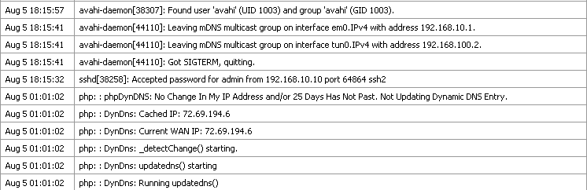
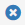
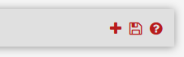
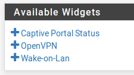
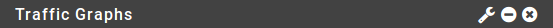
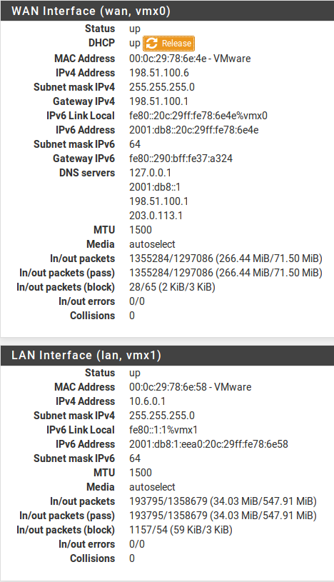
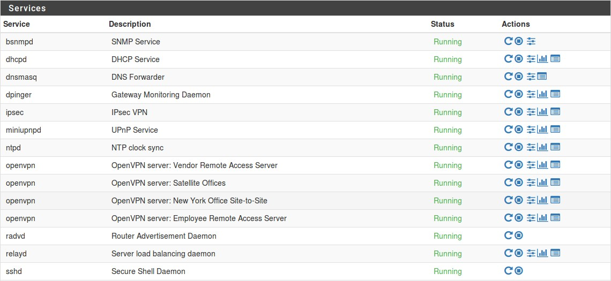
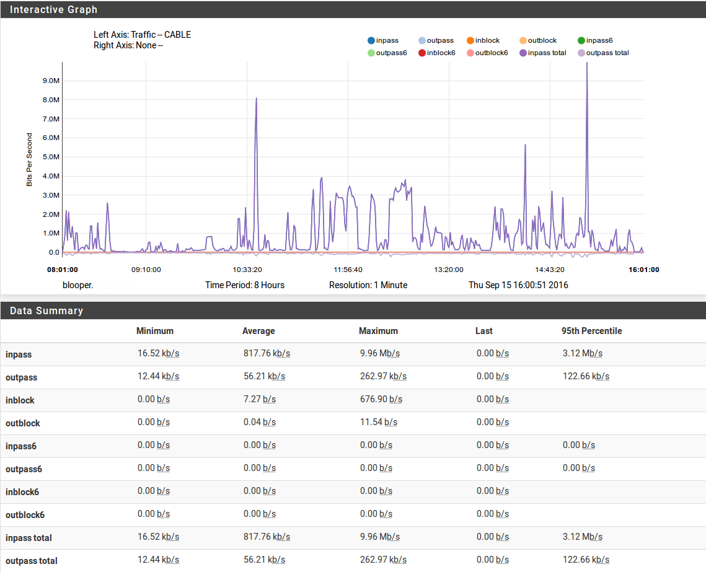
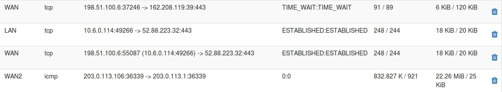
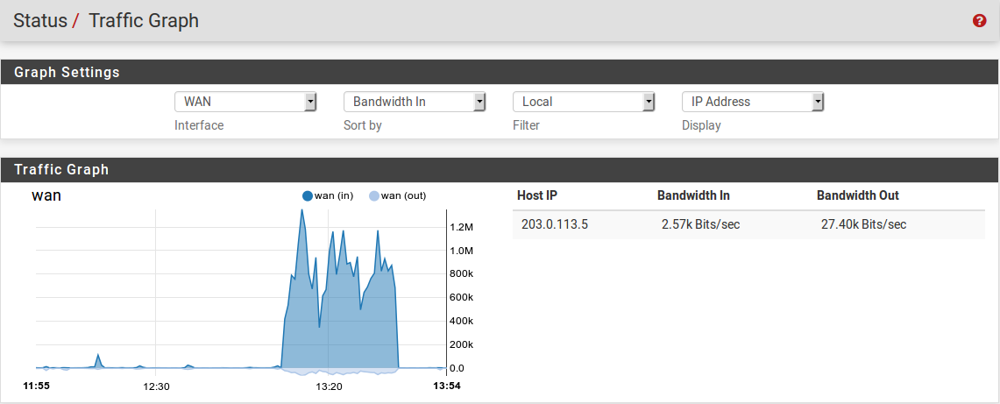

******************************
Log - Monitoraggio del sistema
******************************

Registri di sistema
'''''''''''''''''''

|firew4ll| registra molti dati per impostazione predefinita, ma lo fa in un
modo che non traboccherà l'archiviazione sul firewall. I log possono
essere visualizzati nella GUI in **Stato>Registri di sistema** e in
/var/log/ sul file system.

Alcuni componenti come DHCP e IPsec generano abbastanza registri che
hanno le proprie schede di registrazione per ridurre l'ingombro nel
registro di sistema principale e per facilitare la risoluzione dei
problemi per questi singoli servizi. Per visualizzare altri registri,
fare clic sulla scheda per il sottosistema da visualizzare. Alcune aree,
come il **Sistema** e la **VPN**, hanno sotto-schede con ulteriori
opzioni correlate.

I registri |firew4ll| sono contenuti in un formato di registro circolare
binario chiamato **clog**. Questi file sono di dimensioni fisse e non
crescono mai. Di conseguenza, il registro contiene solo una certa
quantità di voci e le vecchie voci vengono continuamente espulse dal
registro man mano che vengono aggiunte nuove voci. Se la conservazione
dei log è un problema per un'organizzazione, i log possono essere
copiati su un altro server con syslog dove possono essere mantenuti in
modo permanente o ruotati con meno frequenza. Vedere Registrazione
remota con Syslog più avanti in questo capitolo per informazioni su
syslog.

Nelle normali installazioni complete in cui i registri sono tenuti su
disco, vengono mantenuti attraverso i riavvii. Per le installazioni
NanoBSD o quando /var si trova in un disco RAM, i registri vengono
ripristinati al momento dell'avvio.

Visualizzare I registri di sistema
==================================

I registri di sistema possono essere trovati in **Stato>Registri di
sistema**, nella scheda **Sistema**. Ciò includerà le voci di registro
generate dall'host stesso oltre a quelle create da servizi e pacchetti
che non hanno i loro registri reindirizzati ad altre schede/file di
registro.

Come mostrato dalle voci di esempio nella figura *Esempio delle voci di
registro di sistema*, ci sono voci di registro da diverse aree nel
registro di sistema principale. Molti altri sottosistemi registreranno
qui, ma la maggior parte non sovraccaricherà i registri in una sola
volta. In genere, se un servizio ha molte voci di registro, verrà
spostato nella propria scheda e nel file di registro.

|image0|

Fig. 1: Esempio delle voci di registro di sistema

Filtraggio delle voci di registro
---------------------------------

Ogni registro può essere cercato e filtrato per trovare le voci
corrispondenti a un modello specificato. Questo è molto utile per
rintracciare i messaggi di registro da un servizio specifico o voci di
registro contenenti un nome utente specifico, indirizzo IP e così via.

Per cercare le voci di registro:

-  Passare a **Stato>Registri di sistema** e quindi alla scheda per il
   registro da cercare

-  Fare clic su |image1| nella barra delle scorciatoie per aprire il
   pannello **Filtro di registro avanzato**

-  Immettere i criteri di ricerca, ad esempio, inserire del testo o
   un'espressione regolare nel campo **Messaggio**

-  Fare clic su |image2| **Applicare filtro**

I campi di filtraggio variano a seconda della scheda di registro, ma possono includere:

I campi di filtraggio variano a seconda della scheda di registro, ma possono includere:

	**Messaggio** Il corpo del messaggio di registro stesso. Una parola o una frase possono essere inseriti per abbinare esattamente, o utilizzare espressioni regolari per abbinare modelli complessi.
	**Orario** Il timestamp del messaggio di registro. Utilizza nomi del mese abbreviati in tre lettere.
	**Processo** Il nome del processo o del demone che genera i messaggi di registro, ad esempio sshd o check_reload_status.
	**PID** Il numero ID del processo di un comando o daemon in esecuzione. Nei casi in cui sono presenti più copie di un demone in esecuzione, ad esempio openvpn, utilizzare questo campo per isolare i messaggi da una singola istanza.
	**Quantità** Il numero di corrispondenze da restituire nei risultati del filtro. L'impostazione di questo valore superiore al numero di voci di registro nel file di registro non avrà alcun effetto, ma l'impostazione superiore al valore di visualizzazione corrente mostrerà temporaneamente più messaggi di registro.

La scheda del registro di Firewall ha un diverso set di campi di filtraggio:

	**Indirizzo IP di sorgente** L'indirizzo IP di sorgente elencato nella voce di registro. 
	**Indirizzo IP di destinazione** L’indirizzo IP di destinazione elencato nella voce di registro. 
	**Pass** Seleziona questa opzione per abbinare solo le voci di registro che hanno superato il traffico.
	**Block** Selezionare questa opzione per abbinare solo le voci di registro che hanno bloccato il traffico.
	**Interfaccia** Il nome descrittivo facile da utilizzare dell'interfaccia per la corrispondenza (ad esempio WAN, LAN, OPT2, DMZ)
	**Porta sorgente** La porta sorgente della voce di registro da abbinare, se il protocollo utilizza le porte. 
	**Porta di destinazione** La porta di destinazione della voce di registro da corrispondere, se il protocollo utilizza le porte
	**Protocollo** Il protocollo da abbinare, come TCP, UDP o ICMP.
	**Flag di protocollo** Per TCP, questo campo corrisponde ai flag TCP nella voce di registro, ad esempio SA (SYN+ACK) o FA (FIN + ACK)

Il riquadro del filtro è nascosto per impostazione predefinita, ma può essere incluso nella pagina in ogni momento controllando il filtro di registro in Sistema>Configurazione generale.

Cambiare le impostazione di registro
====================================

Le impostazioni del registro possono essere regolate in due modi
diversi. Innanzitutto, le opzioni possono essere impostate globalmente
in **Stato>Registro di sistema** nella scheda **Impostazioni**. In
secondo luogo, ogni scheda di registro può avere le proprie impostazioni
univoche che sovrascrivono i valori predefiniti globali. Per modificare
queste impostazioni, fare clic su |image3| nella barra delle scorciatoie
durante la visualizzazione di un registro. Ciascuno di questi metodi
sarà spiegato in dettaglio in questa sezione.

L'area delle opzioni globali contiene più opzioni rispetto alle
impostazioni per registro. Solo le differenze saranno trattate in
dettaglio per le impostazioni per registro.

Impostazioni globali del registro
---------------------------------

Le opzioni di registro globali in **Stato>Registro di sistema** nella
scheda **Impostazioni** includono:

    **Visualizzazione avanti/indietro** per impostazione predefinita i
    registri vengono visualizzati nel loro ordine naturale con le voci
    più vecchie in alto e le voci più recenti in basso. Alcuni
    amministratori preferiscono vedere le voci più recenti in alto,
    l’ordine può essere invertito selezionando questa casella.

    **Voci di registro della GUI** Il numero di voci di registro da
    visualizzare nelle schede di registro della GUI per impostazione
    predefinita. Questo non limita il numero di voci nel file, solo ciò
    che viene mostrato sulla pagina al momento. Il valore predefinito è
    50. I file di registro effettivi possono contenere molto più del
    numero di righe da visualizzare, a seconda delle dimensioni del file
    di registro.

    **Dimensione del file di registro (byte)** La dimensione del file
    clog. La dimensione del file controlla direttamente quante voci può
    contenere. La dimensione predefinita del registro è di circa 500.000
    byte (500KB). Ci sono circa 20 file di log, quindi qualsiasi aumento
    delle dimensioni del file si tradurrà in un utilizzo totale del
    disco dai registri 20 volte maggiore. La dimensione totale del
    registro corrente e lo spazio su disco rimanente vengono
    visualizzati per riferimento. Alla dimensione predefinita, i
    registri conterranno in media circa 2500 voci, ma potrebbero essere
    significativamente più o meno a seconda delle dimensioni delle
    singole voci di registro.
	
	.. warning::
		la nuova dimensione del registro non avrà effetto fino a quando un registro non viene eliminato o reinizializzato. Questo può essere fatto individualmente da ogni scheda di registro o può essere fatto per tutti i registri utilizzando il |image20| Reset

    **Registrare i pacchetti dalle regole di blocco predefinite**
    Selezionata per impostazione predefinita. Quando abilitata, la
    regola di negazione predefinita, che blocca il traffico non
    corrispondente ad altre regole, registrerà le voci nel registro del
    firewall. In genere queste voci di registro sono utili, ma in alcuni
    casi d'uso rari possono produrre voci di registro indesiderate rese
    ridondanti da regole di blocco personalizzate con registrazione
    abilitata.

    **Registrare i pacchetti dalle regole di passaggio predefinite**
    Deselezionata per impostazione predefinita. Quando impostata, la
    registrazione si verificherà per i pacchetti che corrispondono alle
    regole di svalutazione predefinite sulle interfacce in |firew4ll|.
    L'impostazione di questa opzione genererà una grande quantità di
    dati di registro per le connessioni in uscita dal firewall. Si
    consiglia di abilitarla solo per brevi periodi di tempo durante
    l'esecuzione della risoluzione dei problemi o della diagnostica.

    **Registrare i pacchetti dalle regole delle reti bogon bloccate**
    Selezionata per impostazione predefinita. Una volta selezionata, se
    un'interfaccia è attiva nelle **reti bogon bloccate**, verranno
    registrati i pacchetti corrispondenti a tale regola. Deselezionare
    per disabilitare la registrazione.

    **Registrare i pacchetti dalle regole delle reti private bloccate**
    Selezionata per impostazione predefinita. Una volta selezionata, se
    un'interfaccia è attiva per le **reti private bloccate**, verranno
    registrati i pacchetti corrispondenti a tale regola. Deselezionare
    per disabilitare la registrazione.

    **Registro del server Web** Una volta selezionato, i messaggi di log
    dal processo della Gui del Web, nginx, verranno inseriti nel
    registro di sistema principale. A volte, specialmente con il portale
    captive attivo, questi messaggi possono essere frequenti ma
    irrilevanti e ingombrare il contenuto del registro.

    Registri grezzi Quando selezionata, questa impostazione disabilita
    l'analisi dei log, visualizzando il contenuto grezzo dei log. I
    registri grezzi contengono più dettagli, ma sono molto più difficili
    da leggere. Per molti registri, impedisce anche alla GUI di mostrare
    colonne separate per il processo e il PID, lasciando tutte quelle
    informazioni contenute nella colonna del **messaggio**.

    **Proxy IGMP** Alterna la verbosità dei log del proxy IGMP. Per
    impostazione predefinita, i registri non contengono molte
    informazioni. L'attivazione di questa opzione fa sì che il proxy
    IGMP registri più dettagli.

    **Mostrare le descrizioni delle regole** Controlla se e dove la
    visualizzazione del registro firewall mostrerà le descrizioni delle
    regole che hanno attivato le voci. La visualizzazione delle
    descrizioni delle regole causa un sovraccarico di elaborazione
    aggiuntivo che può rallentare la visualizzazione del registro,
    specialmente nei casi in cui la vista è impostata per mostrare un
    numero elevato di voci.

    **Non caricare le descrizioni** Di default corrente. Quando
    selezionata questa scelta non visualizzerà alcuna descrizione delle
    regole. La descrizione può ancora essere visualizzata facendo clic
    sull'icona della colonna delle azioni nella vista del registro
    firewall.

    **Mostrare come colonna** Aggiunge la descrizione della regola in
    una colonna separata. Questo funziona meglio se le descrizioni sono
    brevi o il display è ampio.

    **Mostrare come seconda riga** Aggiunge una seconda riga a ciascuna
    voce del registro firewall contenente la descrizione della regola.
    Questa scelta è migliore per le descrizioni delle regole lunghe o
    per i display stretti.

.. tip:: Se i registri del firewall vengono visualizzati lentamente con le descrizioni delle regole abilitate, selezionare *Non caricare le descrizioni* per prestazioni più rapide.

    **Registrazione locale** Quando selezionata, i registri locali non
    vengono mantenuti. Non sono scritti su disco né sono conservati in
    memoria. Mentre questo sia salva sia scrive su disco e richiede
    l'uso della registrazione remota in modo che le informazioni non
    vengano perse. Non è consigliabile utilizzare questa opzione poiché
    avere registri locali è vitale per la stragrande maggioranza dei
    casi d'uso.

    **Resettare i file di registro** Questo pulsante cancellerà i dati
    da tutti i file di log e li reinizializzerà come nuovi, svuotando i
    registri. Questo deve essere fatto dopo aver modificato le
    dimensioni del file di registro e può anche essere utilizzato per
    cancellare informazioni irrilevanti/vecchie dai registri, se
    necessario.
	
	.. warning::
		Reimpostare i file di registro non salverà le altre opzioni sulla pagina. Se le opzioni di questa pagina sono state modificate, fare clic su Salvare prima di tentare di reimpostare i file di registro.

Fare clic su **Salvare** per memorizzare le nuove impostazioni. Le
restanti opzioni in questa schermata sono discusse nella *Registrazione
remota con Syslog*.

Impostazioni per registro
-------------------------

Per modificare le impostazioni per registro, visitare la scheda log per
modificare e quindi fare clic su |image4| nella barra delle scorciatoie
per espandere il pannello Impostazioni.

Su questo pannello vengono visualizzate diverse opzioni. La maggior
parte delle opzioni mostrerà il valore predefinito globale o avrà una
scelta di **impostazioni generali delle opzioni di registrazione** che
utilizzerà il valore globale e non il valore per registro.

Il pannello Impostazioni per registro per ogni scheda Visualizza solo le
opzioni relative a tale registro. Ad esempio, le opzioni per registrare
le regole di blocco o passaggio predefinite vengono visualizzate solo
quando si visualizza la scheda Registro Firewall.

Ogni pannello Impostazioni per registro ha almeno le seguenti opzioni:
**Visualizzazione avanti/indietro**, **Voci di log GUI**, **Dimensione
file di log (byte)** e **visualizzazione formattata/grezza**. Per ognuno
di questi, può essere impostato un valore che si applicherà solo a
questo registro. Per ulteriori informazioni su come funzionano queste
opzioni, vedere *Impostazioni globali del registro* sopra.

Fare clic su Salva per memorizzare le nuove impostazioni di registro.

.. note::  Se la dimensione del file di registro è stata modificata, dopo il salvataggio, aprire nuovamente il pannello Impostazioni e fare clic sul pulsante |image5| **Cancellare il registro** per ripristinare il registro utilizzando la nuova dimensione.

Registrazione remota con Syslog
'''''''''''''''''''''''''''''''

Le opzioni di **registrazione remota** in **Stato>Registri di sistema**
nella scheda **Impostazioni** consentono a syslog di copiare le voci di
registro su un server remoto.

I registri tenuti da |firew4ll| sul firewall stesso sono di dimensioni
finite e vengono cancellati al riavvio su NanoBSD. La copia di queste
voci su un server syslog può aiutare la risoluzione dei problemi e
abilitare il monitoraggio a lungo termine. Avere una copia remota può
anche aiutare a diagnosticare gli eventi che si verificano prima che un
firewall si riavvii o dopo che sarebbero stati altrimenti persi a causa
della cancellazione dei registri o quando le voci più vecchie vengono
ripetute fuori dal registro e nei casi in cui la memoria locale è
fallita ma la rete rimane attiva.

.. warning::
	Le politiche legislative aziendali o locali possono dettare la lunghezza dei registri di tempo perché devono essere conservati da firewall e dispositivi simili. Se un'organizzazione richiede una conservazione del registro a lungo termine per scopi propri o governativi, è necessario un server syslog remoto per ricevere e conservare questi registri

Per avviare la registrazione in remoto:

-  Passare a **Stato>Registri di sistema** nella scheda **Impostazioni**

-  Selezionare **Inviare messaggi di log al server syslog remoto**

-  Selezionare le opzioni come segue:

    **Indirizzo sorgente** Controlla dove il demone syslog si lega per
    l'invio di messaggi. Nella maggior parte dei casi, l'opzione
    predefinita (*qualsiasi*) è l'opzione migliore, quindi il firewall
    utilizzerà l'indirizzo più vicino alla destinazione. Se il server di
    destinazione si trova in una VPN di IPsec, tuttavia, la scelta di
    un'interfaccia o di un indirizzo IP virtuale all'interno della rete
    locale di Fase 2 consentirà ai messaggi di log di fluire
    correttamente su un tunnel.

    **Protocollo IP** Quando si sceglie un'interfaccia per
    l'\ **indirizzo di sorgente**, questa opzione dà al demone syslog
    una preferenza per l'utilizzo di IPv4 o IPv6, a seconda di quale sia
    disponibile. Se non esiste un indirizzo corrispondente per il tipo
    selezionato, viene utilizzato invece l'altro tipo.

    **Server di log remoti** Inserire fino a tre server remoti
    utilizzando le caselle contenute in questa sezione. Ogni server
    remoto può utilizzare un indirizzo IP o un nome host e un numero di
    porta opzionale. Se la porta non è specificata, si assume la porta
    di syslogd predefinita, 514.

    Un server syslog è in genere un server direttamente raggiungibile
    dal firewall |firew4ll| su un'interfaccia locale. La registrazione può
    anche essere inviata a un server attraverso una VPN.
	
	.. warning::
		Non inviare i dati di registro direttamente attraverso qualsiasi connessione WAN o link sito-a-sito non crittografato, in quanto è testo semplice e potrebbe contenere informazioni sensibili.
	
    **Contenuti di syslog da remoto** Le opzioni in questa sezione
    controllano quali messaggi di log verranno inviati al server di log
    remoto.

    **Tutto** Quando impostato, tutti i messaggi di registro di tutte le
    aree vengono inviati al server.

    **Eventi di sistema** I principali messaggi di registro di sistema
    che non rientrano in altre categorie.

    **Eventi del DNS** Messaggi del registro del firewall in formato
    raw. Il formato del registro raw è riportato nell'articolo wiki
    della documentazione sul formato del log del filtro

    **Eventi DNS** Messaggi dal risolutore del DNS (unbound), dal
    forwarder del DNS (dnsmasq), e dal demone filterdns che risolve
    periodicamente i nomi host in alias.

    **Eventi DHCP** Messaggi dai demoni DHCP con IPv4 e IPv6, agenti del
    relay e client.

    **Eventi PPP** Messaggi dal client della WAN di PPP (PPPoE, L2TP,
    PPTP)

    **Eventi del captive portal** Messaggi dal sistema del portale
    captive, in genere messaggi di autenticazione ed errori.

    **Eventi VPN** Messaggi da demoni VPN come IPsec e OpenVPN, così
    come il server L2TP e server PPPoE.

    **Eventi dei gateway da monitor**\ are Messaggi dal daemon, dpinger,
    del gateway da monitorare

    **Eventi del demone del routing** Messaggi relativi al routing come
    annunci del routing IPv6, UPnP/NAT-PMP, da pacchetti come OSPF, BGP
    e RIP.

    **Eventi del bilanciamento del carico del server** Messaggi da
    relayd che gestisce il bilanciamento del carico del server.

    **Eventi del protocollo dell’orario di rete** Messaggi dal demone
    NTP e client.

    **Eventi wireless** Messaggi dal demone AP del Wireless, hostapd.

-  Fare clic su Salvare per memorizzare le modifiche.

Se un server syslog non è già disponibile, è abbastanza facile
configurarne uno. Vedere *Server di syslog su Windows con Kiwi Syslog*
per informazioni sulla configurazione di Kiwi Syslog su Windows. Quasi
tutti i sistemi Unix o simili a UNIX possono essere utilizzati come
server syslog. FreeBSD è descritto nella seguente sezione, ma altri
potrebbero essere simili.

Configurazione di un server Syslog su FreeBSD
=============================================

L'impostazione di un server syslog su un server FreeBSD richiede solo un
paio di passaggi. In questo esempio, sostituire 192.168.1.1 con
l'indirizzo IP del firewall, sostituire exco-rtr con il nome host del
firewall e sostituire exco-rtr.example.com con il nome host completo e
il dominio del firewall. Questo esempio utilizza 192.168.1.1 perché la
migliore pratica è quella di inviare messaggi syslog utilizzando
l'indirizzo interno di un firewall, non un'interfaccia WAN.

.. note::  Queste modifiche devono essere apportate sul server di syslog, non sul firewall.

Innanzitutto, il firewall avrà probabilmente bisogno di una voce
/etc/hosts contenente l'indirizzo e il nome del firewall::

192.168.1.1 exco-rtr exco-rtr.example.com

Quindi regolare i flag di avvio per syslogd per accettare i messaggi di
syslog dal firewall. Modificare /etc/rc.conf e aggiungere questa riga se
non esiste, o aggiungere questa opzione alla riga esistente per
l'impostazione::

syslogd_flags=" -a 192.168.1.1"

Infine, aggiungere le linee a /etc/syslog.conf per catturare le voci di
registro da questo host. Sotto qualsiasi altra voce esistente,
aggiungere le seguenti righe::

!*
+*
+exco-rtr
*.* /var/log/exco-rtr.log

Queste righe ripristineranno i filtri del programma e dell'host, quindi
imposteranno un filtro host per questo firewall utilizzando il nome
breve inserito in /etc/hosts.

.. tip:: Guardare /etc/syslog.conf f sul firewall |firew4ll| per idee sul filtraggio dei log per vari servizi in file di log separati sul server syslog.

Dopo queste modifiche, syslogd deve essere riavviato. Su FreeBSD questo
è un semplice comando::

# service syslogd restart

Ora guardare il file di registro sul server syslog e se la
configurazione è corretta, popolerà i registri con voci sull’attività
sul firewall.

Dashboard
'''''''''

La pagina principale del firewall è la **dashboard**. La pagina
dashboard fornisce una vasta gamma di informazioni che possono essere
viste a colpo d'occhio, contenute nei widget configurabili. Questi
widget possono essere aggiunti o rimossi e trascinati in posizioni
diverse.

Gestione dei widget
===================

Ogni widget segue alcune convenzioni di base per il controllo della sua
posizione, dimensione, impostazioni e così via, i cui meccanismi sono
coperti qui in questa sezione.

Aggiunta e rimozione di widget
------------------------------

Per iniziare ad aggiungere widget, fare clic sul pulsante
|image6|\ nell'area controlli della dashboard della barra delle
scorciatoie per visualizzare l'elenco dei widget disponibili. Vedere
*Controlli della dashboard nella barra delle scorciatoie*.

All'interno del pannello **Widget disponibili**, Fare clic sul nome di
un widget per aggiungerlo alla Dashboard (vedere *Elenco dei widget
disponibili*). La dashboard ricaricherà con il nuovo widget visualizzato
in una delle sue colonne.

Per chiudere e rimuovere un widget dalla dashboard, fare clic sul
pulsante |image7| nella sua barra del titolo, come si vede nella figura
Barra del titolo del widget, quindi fare clic su |image8| nei controlli
dashboard.

|image9|

Fig. 2: Controlli della dashboard nella barra delle scorciatoie

|image10|

Fig. 3: Elenco dei widget disponibili

Riorganizzare i widget
----------------------

I widget possono essere riorganizzati e spostati tra le colonne. Per
spostare un widget, fare clic e trascinare la barra del titolo (figura
*Barra del titolo dei widget*), Spostare il mouse nella posizione
desiderata, e quindi rilasciare. Quando il widget viene spostato
"scatterà" nella sua nuova posizione, in modo che la nuova posizione
possa essere visualizzata in anteprima prima di rilasciare il pulsante
del mouse. Dopo aver posizionato un widget, fare clic su |image11| nei
controlli della dashboard (*Controlli del dashboard nella barra delle
scorciatoie*).

|image12|

Fig. 4: Barra del titolo dei widget

Ridurre al minimo i widget
--------------------------

Per ridurre al minimo un widget in modo che nasconde il suo contenuto e
si presenta solo come la sua barra del titolo, fare clic sul pulsante
|image13| nella sua barra del titolo, come si vede nella figura *Barra
del titolo dei widget*. Per ripristinare il widget al suo normale
display, fare clic sul pulsante |image14|. Dopo aver modificato lo stato
del widget, fare clic su |image15| nei controlli della dashboard
(*Controlli della dashboard nella barra delle scorciatoie*).

Modifica delle impostazioni del widget
--------------------------------------

Alcuni widget hanno impostazioni personalizzabili che controllano come
il loro contenuto viene visualizzato o aggiornato. Se un widget ha
impostazioni, il pulsante |image16| apparirà nella sua barra del titolo
come si vede nella figura *Barra del titolo dei widget*. Fare clic su
quel pulsante e appariranno le impostazioni per il widget. Una volta che
le impostazioni sono state regolate, fare clic sul pulsante **Salvare**
all'interno del pannello delle impostazioni widget.

Widget disponibili
==================

Ogni widget contiene un insieme specifico di dati, tipo di informazioni,
grafico, ecc. Ciascuno dei widget attualmente disponibili sarà coperto
in questa sezione, insieme con le loro impostazioni (se presenti).
Questi sono elencati in ordine alfabetico.

Stato del captive portal
-------------------------

Questo widget mostra l'elenco corrente degli utenti del captive portal
online, inclusi il loro indirizzo IP, indirizzo MAC e nome utente.

Stato del CARP
--------------

Il widget dello stato del CARP visualizza un elenco di tutti gli
indirizzi IP virtuali di tipo CARP, insieme al loro stato come MASTER o
BACKUP.

DNS dinamico
------------

Il widget del DNS dinamico visualizza un elenco di tutti i nomi host del
DNS dinamico configurati, il loro indirizzo corrente e lo stato.

Gateway
-------

Il widget del gateway elenca tutti i gateway di sistema insieme al loro
stato attuale. Le informazioni di stato sono costituite dall'indirizzo
IP del gateway, dal tempo di andata e ritorno (Round Trip Time, RTT)
noto anche come ritardo o latenza, dalla quantità di perdita di
pacchetti e dallo stato (online, avviso, down o raccolta di dati). I
widget vengono aggiornati ogni pochi secondi tramite AJAX.

Stato di Gmirror 
-----------------

Questo widget mostrerà lo stato di un array del RAID del gmirror sul
sistema, se uno è configurato. Il widget mostrerà se l'array è online/OK
(completo), in ricostruzione o degradato.

Pacchetti installati
--------------------

Il widget dei pacchetti installati elenca tutti i pacchetti installati
sul sistema, insieme ad alcune informazioni di base su di essi, come la
versione installata e se è disponibile o meno un aggiornamento.

Quando un pacchetto ha un aggiornamento disponibile, |image17| viene
visualizzato accanto al numero di versione. I pacchetti possono essere
aggiornati da questo widget facendo clic sul pulsante |image18| alla
fine della riga di un pacchetto.

I pacchetti possono anche essere reinstallati facendo clic su |image19|
o rimossi facendo clic su |image20|.

Statistiche dell'interfaccia
----------------------------

Questo widget mostra una griglia, con ogni interfaccia sul sistema
mostrato nella propria colonna. Varie statistiche di interfaccia sono
mostrati in ogni riga, tra cui pacchettio, byte, e conteggi di errore.

Interfacce
----------

Il widget **interfacce** differisce dal widget delle **statistiche di
interfaccia** in quanto visualizza informazioni generali
sull'interfaccia piuttosto che contatori. Il widget delle **interfacce**
mostra il tipo e il nome di ciascuna interfaccia, l'indirizzo IPv4,
l'indirizzo IPv6, lo stato del collegamento dell'interfaccia (up o
down), nonché la velocità del collegamento quando disponibile.

IPsec
-----

Il widget IPsec ha tre schede: la prima scheda, **Panoramica**, è un
conteggio di tunnel attivi e inattivi. la seconda scheda, **Stato del
tunnel**, elenca ogni tunnel IPsec configurato e se quel tunnel è up o
down. L'ultima scheda, **Mobile**, mostra gli utenti della VPN IPsec di
accesso remoto online, come quelli che utilizzano IKEv2 o Xauth.

Stato del bilanciamento del carico
----------------------------------

Questo widget visualizza una vista compatta della configurazione di
bilanciamento del carico del server. Ogni riga mostra lo stato di un
server virtuale. La colonna **Server** mostra il nome del server
virtuale, lo stato e l'indirizzo IP con la porta in cui il server
virtuale accetta le connessioni. La colonna **Pool** mostra i singoli
server pool e il loro stato, con una percentuale di uptime. La colonna
**Descrizione** mostra la descrizione del testo dal server virtuale.

Log del firewall
----------------

Il widget dei **registri del firewall** fornisce una vista
dell’aggiornamento di AJAX del registro firewall. Il numero di righe
mostrate dal widget è configurabile. Come per la normale vista del
registro firewall, facendo clic sull'icona azione accanto alla voce di
registro verrà visualizzata una finestra che mostra quale regola ha
causato la voce di registro. Facendo clic sull'indirizzo IP di sorgente
o di destinazione, tale valore verrà copiato in **Diagnostica>DNS** in
cui è possibile risolvere l'indirizzo.

Stato NTP
---------

Il widget dello **stato di NTP** mostra la sorgente di sincronizzazione
NTP corrente e l'ora del server da tale fonte.

OpenVPN
-------

Il widget di **OpenVPN** visualizza lo stato di ogni istanza OpenVPN
configurata, sia per i server che per i client. Viene mostrato lo stato
di ogni istanza, ma lo stile e il tipo di informazioni mostrate variano
a seconda del tipo di connessione OpenVPN. Ad esempio, i server basati
su SSL/TLS mostrano un elenco di tutti i client connessi. Per i client e
i server delle chiavi statiche, viene visualizzato uno stato up/down. In
ogni caso viene visualizzato l'indirizzo IP del client di connessione
con il nome e l'ora della connessione.

Immagine
--------

Il widget immagine, come suggerisce il nome, visualizza un'immagine
scelta dall'utente. Questo può essere utilizzato funzionalmente, per un
diagramma di rete o simile, oppure può essere per lo stile, la
visualizzazione di un logo aziendale o altra immagine.

Per aggiungere un'immagine:

-  Fare clic su |image21| sulla barra del titolo del widget immagine

-  Fare clic su **Sfogliare** per individuare l'immagine da caricare

-  Fare clic su **Caricare** per caricare l'immagine

La dimensione dell'immagine si adatterà all'area del widget, che può
variare a seconda delle dimensioni del browser e della piattaforma.

RSS
---

Il widget RSS (Rdfsite Summary, o come viene spesso chiamato,
sindacazione davvero semplice) visualizzerà un feed RSS arbitrario. Per
impostazione predefinita, mostra il feed RSS del blog |firew4ll|. Alcune
persone scelgono di mostrare i feed RSS aziendali interni o i feed RSS
del sito di sicurezza, ma possono caricare qualsiasi feed RSS.

Oltre a definire i feed RSS da visualizzare, il numero di storie e le
dimensioni del contenuto visualizzato sono anche configurabili.

Stato dei servizi
-----------------

Questo widget fornisce la stessa vista e il controllo dei servizi che
appare in **Stato>Servizi**. Ogni servizio è elencato insieme alla sua
descrizione, stato (esecuzione, arresto) e controlli
avvio/riavvio/arresto.

Stato intelligente
------------------

Se S.M.A.R.T. è abilitato su un'unità nel firewall, questo widget
mostrerà un breve stato dell'integrità dell'unità come riportato da
S.M.A.R.T.

Informazioni di sistema
-----------------------

Questo widget è il widget principale, la visualizzazione di una vasta
gamma di informazioni sul sistema in esecuzione. Le informazioni
visualizzate includono:

-  **Nome** Il nome host completamente qualificato configurato del
   firewall.

-  **Versione** La versione corrente in esecuzione di |firew4ll| sul
   firewall. La versione, l'architettura e il tempo di compilazione
   vengono visualizzati in alto. Sotto il tempo di compilazione, viene
   mostrata la versione sottostante di FreeBSD.

    Sotto questi elementi è il risultato di un controllo di
    aggiornamento automatico per una versione più recente di |firew4ll|
    (solo installazioni complete). Questo controllo di aggiornamento
    automatico può essere disabilitato nelle impostazioni di
    aggiornamento.

-  **Piattaforma** La piattaforma indica quale variazione di |firew4ll| è
   in esecuzione. Un'installazione completa mostrerà |firew4ll|,
   un'installazione incorporata mostra NanoBSD.

-  **Porzione di avvio di NanoBSD** Se si tratta di un'installazione
   incorporata, viene visualizzata anche la porzione in esecuzione
   (*|firew4ll|0* o *|firew4ll|1*), insieme alla porzione che verrà utilizzata
   per il prossimo avvio.

-  **Tipo di CPU** Il tipo di CPU visualizzato è la stringa di versione
   per il processore, ad esempio “Intel(R) Atom(TM) CPU C2758 @ 2.40
   GHz”. Viene visualizzato anche il conteggio della CPU e il layout
   pacchetto/core.

    Se **powerd** è attivo e la frequenza della CPU è stata abbassata,
    la frequenza corrente viene mostrata lungo la dimensione della
    frequenza massima.

-  **Crittografia dell’hardware** Se è stato rilevato un acceleratore
   crittografico hardware noto, verrà visualizzato qui.

-  **Uptime** Questo è il momento in cui il firewall è stato riavviato
   l'ultima volta.

-  **Data/ora corrente** La data e l'ora correnti del firewall, compreso
   il fuso orario. Questo è utile per confrontare le voci di registro,
   specialmente quando il fuso orario sul firewall è diverso da dove
   risiede l'utente.

-  **Server DNS** Elenca tutti i server DNS configurati sul firewall.

-  **Ultima modifica di configurazione** La data dell'ultima modifica di
   configurazione sul firewall.

-  **Dimensione della tabella di stato** Mostra una rappresentazione
   grafica e numerica degli stati attivi e degli Stati possibili massimi
   configurati sul firewall. Sotto i conteggi di stato c'è un
   collegamento per visualizzare il contenuto della tabella di stato.

-  **Utilizzo di MBUF** Mostra il numero di cluster del buffer di
   memoria di rete in uso e il massimo che il sistema ha a disposizione.
   Questi buffer di memoria di rete vengono utilizzati per le operazioni
   di rete, tra le altre attività. Se il numero è vicino al massimo o al
   massimo, aumentare il numero di Mbuf disponibili come descritto nella
   *sintonizzazione Hardware e risoluzione dei problemi*.

-  **Carico medio** Un conteggio di quanti processi attivi sono in
   esecuzione sul firewall durante gli ultimi 5, 10 e 15 minuti. Questo
   è in genere 0,00 su un sistema inattivo o leggermente caricato.

-  **Utilizzo della CPU** Un grafico a barre e la percentuale di tempo
   della CPU in uso dal firewall. Si noti che la visualizzazione della
   dashboard aumenterà un po' l'utilizzo della CPU, a seconda della
   piattaforma. Su piattaforme più lente come ALIX è probabile che
   questo sia significativamente più alto di quanto sarebbe altrimenti.

-  **Utilizzo della memoria** La quantità corrente di RAM in uso dal
   sistema. Si noti che la RAM inutilizzata viene spesso allocata per la
   cache e altre attività, quindi non viene sprecata o è inattiva,
   quindi questo numero potrebbe essere più alto del previsto anche se
   funziona normalmente.

-  **Utilizzo di swap** La quantità di spazio di swap in uso da parte
   del sistema. Se il sistema esaurisce la RAM fisica e c'è spazio di
   swap disponibile, le pagine di memoria meno utilizzate verranno
   salvate nel file di swap sul disco rigido. Questo indicatore mostra
   solo quando il sistema ha configurato lo spazio di swap, che sarà
   solo su installazioni complete.

-  **Utilizzo del disco** La quantità di spazio utilizzato sul disco di
   avvio o sul supporto di archiviazione. Vengono visualizzati il tipo e
   la posizione dei filesystem montati, inclusi i dischi di memoria
   quando presenti.

Sensori termici
---------------

Il widget dei sensori termici visualizza la temperatura dai sensori
supportati quando presente. Per molti popolari chip basati su Intel e
AMD, I sensori possono essere attivati scegliendo il tipo di sensore
appropriato in **Sistema>Avanzate** nella scheda **Varie** sotto
**sensori termici**

Viene visualizzata una barra per ciascun sensore, che in genere
corrisponde a ciascun core della CPU. Le soglie di avviso e critiche
possono essere configurate nelle impostazioni del widget.

Grafici del traffico
--------------------

Il widget dei grafici del traffico contiene un grafico SVG dal vivo per
il traffico su ogni interfaccia. Le interfacce visualizzate sono
configurabili nelle impostazioni del widget. La frequenza di
aggiornamento predefinita dei grafici è una volta ogni 10 secondi, ma
può anche essere regolata nelle impostazioni per questo widget. I
grafici sono disegnati allo stesso modo di quelli trovati nel grafico
del traffico di stato.

Attivare la LAN
---------------

Il widget dell’attivazione della LAN mostra tutte le voci WOL
configurate in servizi Attivare la LAN e offre un mezzo rapido per
inviare il pacchetto magico a ciascun sistema per riattivarlo. Viene
anche mostrato lo stato corrente di un sistema. Per riattivare un
sistema, fare clic su |image22| accanto alla sua voce.

Stato dell’interfaccia
''''''''''''''''''''''

Lo stato delle interfacce di rete può essere visualizzato in
**Stato>Interfacce**. Nella prima parte della figura *Stato
dell'interfaccia*, è stata effettuata una connessione WAN di DHCP e
l'indirizzo IPv4 e IPv6, DNS, ecc. L'indirizzo MAC, il tipo di supporto,
i pacchetti in/out, gli errori e le collisioni per l'interfaccia di rete
sono tutti visibili. I tipi di connessione dinamica come PPPoE e PPTP
hanno un pulsante **Disconnettere** quando è collegato e un pulsante
**Connettere** quando è offline. Le interfacce che ottengono un
indirizzo IP da DHCP hanno un pulsante **Rilasciare** quando c'è un
lease attivo e un pulsante **Rinnovare** quando non c'è.

Nella parte inferiore dell'immagine, la connessione LAN è visibile.
Poiché si tratta di un'interfaccia normale con un indirizzo IP statico,
viene mostrato solo il solito set di elementi.

Se uno stato dell'interfaccia indica "nessun vettore", significa in
genere che il cavo non è collegato o che il dispositivo sull'altra
estremità non funziona correttamente in qualche modo. Se vengono
visualizzati errori, in genere sono di natura fisica: errori di
cablaggio o di porta. Il sospetto più comune sono i cavi che sono facili
ed economici da sostituire. In alcune circostanze possono comparire
errori e collisioni a causa di una velocità di collegamento o di una
mancata corrispondenza duplex. Vedere *Velocità e duplex* per ulteriori
informazioni su come impostare la velocità e il duplex di
un'interfaccia.

Stato servizio
''''''''''''''

Molti servizi di sistema e pacchetti mostrano lo stato dei loro demoni
in **Stato>Servizi**.

Ogni servizio viene visualizzato con un nome, una descrizione e lo
stato, come si vede nella figura Stato dei servizi. Lo stato è elencato
come **in esecuzione** o **arrestato**.

Normalmente, non è necessario controllare i servizi in questo modo, ma
occasionalmente ci sono motivi di manutenzione o risoluzione dei
problemi per farlo.

Da questo punto di vista, i servizi possono essere controllati in vari
modi:

-  Fare clic su |image23| per riavviare un servizio in esecuzione

-  Fare clic su |image24| per interrompere un servizio in esecuzione

-  Fare clic su\ |image25| per avviare un servizio interrotto

Se disponibile, vengono visualizzate altre scorciatoie che passano a una
configurazione del servizio (|image26| ), a una pagina di stato
dettagliata ( |image27| ) o ai registri (|image28| ). Vedere *Navigare
rapidamente nella GUI con le scorciatoie* per saperne di più sulle icone
di scelta rapida.

Grafici di monitoraggio
'''''''''''''''''''''''

Il firewall raccoglie e mantiene i dati su come il sistema funziona, e
quindi memorizza questi dati nei file di database Round-Robin (Rrd)
file. I grafici creati da questi dati sono disponibili in
**Stato>Monitoraggio**.

Il grafico in quella pagina può essere configurato per mostrare elementi
di diverse categorie e una categoria e un grafico possono essere scelti
sia per l'asse sinistro che per l'asse destro per un facile confronto.

\ |image29|

Fig. 5: Stato dell’interfaccia

|image30|

Fig. 6: Stato dei servizi

Lavorare con i grafici
======================

Il firewall visualizza un grafico che mostra il suo utilizzo della CPU
per impostazione predefinita. Per visualizzare altri grafici o
aggiungere una seconda categoria su un altro asse, le impostazioni del
grafico devono essere modificate come descritto nella sezione
successiva, *Impostazioni del grafico*.

All'interno del grafico, le etichette nell'angolo in alto a sinistra
annotano le fonti per i dati nell'asse sinistro e nell'asse destro.

Il grafico contiene una legenda in alto a destra con ciascuna delle
fonti di dati tracciate sul grafico. Fare clic su una fonte dei dati
nella legenda la nasconderà dalla vista.

.. tip:: Se una fonte dei dati ha un picco grande, fare clic  sul suo nome nella legenda per rimuoverlo dal grafico. Con l'origine dei dati più grande rimossa, saranno visibili maggiori dettagli dalle altre fonti rimanenti.

Il nome host del firewall, il periodo di tempo del grafico e la
risoluzione del grafico vengono stampati lungo la parte inferiore del
grafico, insieme al tempo in cui è stato generato il grafico.

Il firewall stampa una tabella sotto il grafico stesso con un riepilogo
dei dati. Questa tabella contiene minimi, medie, massimi, valori
correnti, in alcuni casi il 95° percentile. Nei casi in cui vengono
fornite unità, il puntatore del mouse sopra l'unità visualizzerà una
descrizione più dettagliata dell'unità.

.. note::  I totali non vengono visualizzati perché per il modo in cui i dati vengono memorizzati nei file RRD, i totali accurati non sono possibili. Per visualizzare l'utilizzo totale del traffico sulle interfacce di rete, installare il pacchetto dei **totali del traffico dello stato**.

La figura *Grafico del traffico della WAN* mostra un esempio di un
grafico di traffico di 8 ore su un'interfaccia firewall denominata
*CABLE* con inverso abilitato. L'interfaccia ha un utilizzo massimo di
9,96 Mbit/s durante un periodo di 1 minuto.

Impostazioni dei grafici
========================

Per modificare il grafico, fare clic su |image31| sulla barra delle
scorciatoie per visualizzare il pannello delle impostazioni del grafico.

.. tip:: Il pannello delle impostazioni del grafico è nascosto per impostazione predefinita, ma questo comportamento può essere modificato. Passare a **Sistema>Configurazione generale** e controllare le impostazioni di monitoraggio per visualizzare sempre il pannello delle impostazioni di default.

Le opzioni del pannello impostazioni sono:

    **Asse sinistro/asse destro** Le opzioni qui controllano i dati
    disponibili su ciascun asse. Per impostazione predefinita, solo
    **l'asse sinistro** viene popolato con un valore, ma entrambi
    possono essere utilizzati per confrontare le aree. Prima scegliere
    una **categoria** (o *nessuna*), quindi scegliere un **grafico**
    all'interno di quella categoria. L'elenco delle categorie e dei
    grafici disponibili varia a seconda della configurazione del
    firewall.

    **Categoria** L'area generale del grafico desiderato: sistema,
    traffico, pacchetti, qualità, portale captice, NTP, Code,
    QueueDrops, DHCP, cellulare, wireless e utenti VPN. Questi sono
    trattati in modo più dettagliato più avanti in questa sezione.

    **Grafico** Il grafico specifico da visualizzare dalla categoria
    scelta.

|image32|

    Fig. 7: Grafico del traffico della WAN

    **Opzioni** Questa sezione del pannello delle impostazioni controlla
    l'aspetto del grafico stesso, inclusi l'intervallo di tempo e lo
    stile.

    **Periodo di tempo** Il periodo di tempo da mostrare sul grafico.
    Gli intervalli predefiniti coprono da 1 ora fino a 4 anni o può
    essere scelto un periodo *personalizzato*. Selezionando
    *personalizzato* vengono visualizzati i controlli del **periodo
    personalizzato**. Tutti i periodi vengono visualizzati anche se non
    ci sono dati in un database grafico che risale a quel punto. Il
    grafico sarà vuoto per le volte in cui il grafico non era attivo.

    **Risoluzione** La più piccola porzione di tempo per la quale i dati
    sono disponibili su questo grafico. Nel corso del tempo, i dati sono
    consolodati su periodi più lunghi in modo che la risoluzione venga
    persa. Ad esempio, su un grafico di 1 ora è possibile vedere i dati
    da intervalli di un minuto, ma su un grafico di un’ora che include
    dati più vecchi, non è possibile mostrare i dati con precisione
    poiché è stata calcolata la media. A seconda del periodo di tempo
    del grafico può contenere *1 minuto*, *5 minuti*, *1 ora* o *1
    giorno* medi per i dati. Le risoluzioni che non sono possibili per
    un determinato periodo di tempo non possono essere selezionate.

    **Inverso** Utilizzato su grafici come il grafico del traffico, per
    separare i dati in entrata e in uscita. Ad esempio, con **inverso**
    impostato su *On*, I dati in uscita sono rappresentati come un
    valore negativo per differenziarlo più facilmente dai dati in
    entrata.

    **Periodo personalizzato** Quando il **periodo di tempo** è
    impostato su *personalizzato*, la GUI visualizza questa sezione per
    configurare il periodo di tempo personalizzato per il grafico.

    **Data di inizio** La data di inizio del grafico. Facendo clic nel
    campo verrà visualizzato un controllo di raccolta della data del
    calendario. Solo oggi, o i giorni in passato, possono essere
    selezionati.

    **Ora d’inizia** L'ora del giorno per iniziare il grafico usando lo
    stile di 24 ore (0-23)

    **Data di fine** La data di fine per il grafico.

    **Ora di fine** L'ora di fine per il grafico, esclusivo. L'ora
    scelta non è inclusa nel grafico. Ad esempio, su un grafico a
    partire dalle ore 10 alle ore 12, il grafico copre dalle 10:00 am
    alle 12:00 pm.

    **Impostazioni** Fare clic su |image33| **Mostrare avanzate** per
    visualizzare ulteriori controlli avanzati non in genere necessari
    per l'uso medio.

    **Esporta come CSV** Fare clic su questo pulsante per scaricare i
    dati dal grafico come un file di foglio di calcolo .csv (Valori
    separati da virgole, Comma Separated Values), che può quindi essere
    importato in un altro programma per l'analisi.

    **Salvare come predefinito** Fare clic su questo pulsante per
    memorizzare le impostazioni del grafico corrente come configurazione
    predefinita, in modo che questo grafico specifico venga visualizzato
    di default nelle visite future a questa pagina.

    **Disabilitare/Abilitare la rappresentazione grafica** Questo
    interruttore disabiliterà o abiliterà la raccolta dei dati del
    grafico. La grafica è abilitata per impostazione predefinita.
    Normalmente questo sarebbe disabilitato solo per scopi diagnostici o
    se tutta la grafica richiesta viene gestita esternamente.

    **Resettare i dati della rappresentazione grafica** Fare clic su
    questo pulsante cancellerà tutti i file di database del grafico e
    creerà nuovi file vuoti.

Fare clic su |image34| **Aggiornare grafici** per modificare il grafico
nella vista selezionata.

Elenco delle categorie dei grafici
==================================

Esistono diverse categorie di dati del grafico che il firewall può
tracciare. Ogni categoria è coperta qui, ma non tutte le categorie
saranno visibili su ogni firewall. Alcuni grafici devono essere
abilitati separatamente o saranno presenti solo se è abilitata una
caratteristica specifica o un pezzo di hardware.

Grafici di sistema
------------------

I grafici della categoria *Sistema* mostrano una panoramica generale
dell'utilizzo del sistema, incluso l'utilizzo della CPU, l'utilizzo
della memoria e gli stati del firewall.

Cluster di Mbuf
---------------

Il grafico dei **cluster di Mbuf** traccia l'utilizzo del cluster del
buffer di memoria di rete del firewall. I firewall con molte interfacce,
o molti core e NIC della CPU che utilizzano una coda di interfaccia per
core, possono consumare un gran numero di buffer di memoria di rete.
Nella maggior parte dei casi, questo utilizzo sarà abbastanza piatto, ma
a seconda delle varie circostanze, come un carico elevato inutilizzato,
i valori potrebbero aumentare. Se l'utilizzo si avvicina al massimo
configurato, aumentare il numero di buffer.

.. seealso::  Fare riferimento a *Sintonizzazione dell’hardware e risoluzione dei problemi* per informazioni su come aumentare la quantità di mbuf disponibili per il sistema operativo.

Il grafico del **cluster Mbuf** contiene le seguenti fonti di dati:

    **Corrente** Il numero corrente di cluster Mbuf consumati

    **Cache** Il numero di cluster Mbuf memorizzati nella cache

    **Totale** Il totale di Corrente e Cache

    **Massimo** Il numero massimo consentito di cluster mbuf

Grafico Della Memoria
---------------------

Il grafico della **memoria** mostra l'utilizzo della RAM di sistema
suddiviso utilizzando le seguenti fonti di dati:

    **Attiva** La quantità di memoria attiva (in uso)

    **Inattiva** La quantità di memoria inattiva, che era in uso, ma
    potrebbe essere riassegnata.

    **Libera** La quantità di memoria libera, che non viene utilizzata
    affatto.

    **Cache** La quantità di memoria utilizzata per la memorizzazione
    nella cache dal sistema operativo.

    **Cablata** La quantità di memoria cablata, in genere la memoria del
    kernel

.. note::  Il sistema operativo tenterà di utilizzare la RAM quanto possibile per la cache piuttosto che permettergli di rimanere inattivo, quindi la quantità di RAM libera apparirà spesso inferiore al previsto. Se la domanda di memoria aumenta, la memoria memorizzata nella cache sarà resa disponibile per l'uso.

Grafico del processore
----------------------

Il grafico del processore mostra l'utilizzo della CPU per il firewall
utilizzando le seguenti fonti di dati:

    **Utilizzo dell'utente** La quantità di tempo del processore
    consumata dai processi utente.

    **Utilizzo buono** La quantità di tempo del processore consumato dai
    processi con un'alta priorità.

    **Utilizzo del sistema** La quantità di tempo del processore
    consumata dal sistema operativo e dal kernel.

    **Interruzioni** La quantità di tempo del processore consumata dalla
    gestione degli interrupt, che sta elaborando input e output
    dell’hardware, comprese le interfacce di rete.

    **Processi** Il numero di processi in esecuzione.

Grafico degli stati
-------------------

Il grafico degli stati mostra il numero di stati di sistema, ma
suddivide anche il valore in diversi modi.

    **Cambiamenti di stato** Il numero di cambiamenti di stato al
    secondo, o "churn". Un valore elevato da questa fonte indicherebbe
    un rapido numero di connessioni nuove o in scadenza.

    **Stati del filtro** Il numero totale di voci di stato nella tabella
    stati.

    **Indirizzi di sorgente** Il numero di indirizzi IP sorgente univoci
    attivi.

    **Indirizzi di destinazione** Il numero di indirizzi IP di
    destinazione univoci attivi.

Grafici del traffico
--------------------

I grafici del traffico mostrano la quantità di larghezza di banda
utilizzata su ogni interfaccia disponibile in bit al secondo. L'elenco
dei grafici contiene le voci per ogni interfaccia assegnata, così come
IPsec e singoli client e server OpenVPN.

Il grafico del traffico è suddiviso in diverse fonti di dati. A parte il
totale, ognuno ha un equivalente IPv4 e IPv6. Le origini dati IPv6 hanno
6 aggiunto al nome.

    **inpass** Il tasso di traffico che entra in questa interfaccia che
    è *passato* nel firewall.

    **outpass** Il tasso di traffico in partenza da questa interfaccia
    che è *passato* fuori dal firewall.

    **inblock** Il tasso di traffico che tenta di raggiungere questa
    interfaccia che è stato *bloccato* dall'accesso al firewall.

    **outblock** Il tasso di traffico che tenta di lasciare questa
    interfaccia che è stato *bloccato* dal lasciare il fiewall.

    **inpass totale** Il tasso totale di traffico (IPv4 e IPv6) passato
    in entrata.

    **outpass totale** Il tasso totale di traffico (IPv4 e IPv6) passato
    in uscita.

.. note::  I termini "inbound" e” outbound " su questi grafici sono dal punto di vista del firewall stesso. Su un'interfaccia esterna come una WAN, il traffico “in entrata” è il traffico che arriva al firewall da Internet e il traffico “in uscita” è il traffico che lascia il firewall verso una destinazione su Internet. Per un'interfaccia interna, come LAN, il traffico”in entrata” è il traffico che arriva al firewall da un host sulla LAN, probabilmente destinato a una posizione su Internet e il traffico “in uscita” è il traffico che lascia il firewall andando a un host sulla LAN.

Grafici dei pacchetti
---------------------

I grafici del pacchetto funzionano molto come i grafici del traffico e
hanno gli stessi nomi per le fonti dei dati, tranne che invece di
segnalare in base alla larghezza di banda utilizzata, riporta il numero
di *pacchetti al secondo* (pps) passati. L'elenco dei **grafici**
contiene le voci per ogni interfaccia assegnata, così come IPsec e i
singoli client e server OpenVPN.

Pacchetti al secondo (pps) è una metrica migliore per giudicare le
prestazioni hardware rispetto al throguhput del traffico in quanto
riflette più accuratamente quanto bene l'hardware gestisce i pacchetti
di qualsiasi dimensione. Un circuito può essere venduto su un certo
livello di larghezza di banda, ma è più probabile che l'hardware sia
strozzato dall'incapacità di gestire un grande volume di piccoli
pacchetti. In situazioni in cui l'hardware è il fattore limitante, il
grafico dei **pacchetti** può mostrare un altopiano alto o picchi mentre
il grafico del traffico mostra l'utilizzo sotto la velocità nominale
della linea.

Grafici della qualità
---------------------

La categoria **Qualità** contiene le voci del **grafico** che tracciano
la qualità delle interfacce WAN o simile alle WAN, come le interfacce
con un gateway specificato o quelle che utilizzano DHCP o PPPoE. Il
firewall contiene una voce di **grafico** per gateway, compresi i
gateway configurati in precedenza, ma non esistono più. I file di dati
del grafico per i vecchi gateway non vengono rimossi automaticamente in
modo che i dati storici siano disponibili per riferimento futuro.

Le seguenti orfonti di dati vengono utilizzate per monitorare
l'affidabilità del gateway:

    **Perdita di pacchetti** La percentuale di tentati ping
    all'indirizzo IP da monitorare che sono stati persi. La perdita sul
    grafico indica problemi di connettività o tempi di utilizzo
    eccessivo della larghezza di banda in cui i ping sono stati
    eliminati.

    **Ritardo medio** Il ritardo medio (Tempo di andata e ritorno, RTT)
    sui ping inviati all'indirizzo IP da monitorare. Un alto RTT
    significa che il traffico sta prendendo molto tempo per fare il
    viaggio di andata e ritorno dal firewall per l'indirizzo IP da
    monitorare e ritorno. Un RTT alto potrebbe provenire da un problema
    sul circuito o da un elevato utilizzo.

    **Ritardo di deviazione standard** La deviazione standard sui valori
    RTT. La deviazione standard dà un'impressione della variabilità
    della RTT durante un determinato periodo di calcolo. Una bassa
    deviazione standard indica che la connessione è relativamente
    stabile. Una deviazione standard elevata significa che il RTT sta
    fluttuando su e giù su una vasta gamma di valori, il che potrebbe
    significare che la connessione è instabile o molto occupata.

Captive Portal
---------------

La categoria **captive portal** contiene le voci del **grafico** per
ogni zona del captive portal, passato e presente. I file di dati del
grafico per le vecchie zone non vengono rimossi automaticamente.

    **Simultanea** La scelta del grafico *simultaneo* mostra quanti
    utenti sono registrati in un determinato punto nel tempo. Quando gli
    utenti si disconnettono o le loro sessioni scadono, questo conteggio
    andrà giù. Un gran numero di utenti simultanei non causerà
    necessariamente uno sforzo sul portale, ma può essere utile per
    giudicare le esigenze generali di capacità e la larghezza di banda.

    Accesso Il grafico degli *accessi* mostra il numero di eventi di
    accesso che si verificano durante ogni intervallo di polling. Questo
    è utile per giudicare quanto sia occupato il demone del captive
    portal in un dato momento. Un gran numero di utenti che accedono
    allo stesso tempo metterà più stress sul demone del portale rispetto
    agli accessi che sono sparsi nel corso di una giornata.

NTP
---

Il grafico **NTP** visualizza le statistiche relative al servizio NTP e
alla qualità dell'orologio. Questo grafico è disabilitato per
impostazione predefinita perché non è rilevante per la maggior parte dei
casi d'uso. Il grafico può essere abilitato in **Servizi>NTP**. In
quella pagina, controllare **Abilitare grafici RRD di statistiche NTP**.

.. seealso::  Per ulteriori informazioni su questi valori, consultare il manuale di configurazione di NTP, il manuale delle query di NTP e le specifiche di NTPv4.

    **Offset** Differenza di clock combinata tra dal server rispetto a
    questo host.

    **Jitter di sistema (sjit)** Jitter di sistema combinato, che è una
    stima dell'errore nel determinare l'offset.

    **Jitter del clock (cjit)** Jitter calcolato dal modulo di
    disciplina dell’orologio.

    **Giro del clock (wander)** Stabilità della frequenza di clock
    espressa in parti per milione (PPM)

    **Offset di frequenza (freq)** Offset relativo all'orologio
    dell’hardware (in PPM)

    **Dispersione della root (disp)** differenza totale tra l'orologio
    locale e l'orologio di riferimento primario in tutta la rete.

Grafici di coda/Codadue della coda (Queuedrops)
-----------------------------------------------

I grafici della coda sono un composito di ogni coda di shaper del
traffico. Viene mostrata ogni singola coda, rappresentata da un colore
unico.

La categoria **Code** mostra l'utilizzo individuale della coda in byte.

La categoria **QueueDrops** mostra un conteggio di cadute di pacchetti
da ogni coda.

DHCP
----

La categoria **DHCP** contiene un grafico per ogni interfaccia con un
server DHCP abilitato. Le fonti dei dati mostrate per DHCP sono:

    **Locazioni** Il numero di leasing in uso fuori dall'intervallo DHCP
    configurato per l'interfaccia.

    **Locazioni statiche** Il numero di lease di mappatura statica
    configurati per l'interfaccia.

    **Intervallo DHCP** La dimensione totale del pool DHCP disponibile
    per l'uso sull'interfaccia.

Se il conteggio delle **locazioni** si avvicina al valore
dell'\ **intervallo**, potrebbe essere necessario un pool più grande per
l'interfaccia. Le mappature statiche esistono al di fuori
dell'intervallo, quindi non tengono conto della quantità di locazioni
consumate nel pool.

Cellulare
---------

Su alcuni dispositivi 3G/4G, il firewall è in grado di raccogliere dati
di potenza del segnale per il grafico cellulare. La potenza del segnale
è l'unico valore tracciato sul grafico.

Wireless
--------

La categoria **Wireless** è presente su sistemi contenenti un
dispositivo di rete wireless 802.11 abilitato e in uso come client
(infrastruttura, modalità BSS). Le seguenti fonti di dati vengono
raccolte e visualizzate quando si agisce come client wireless:

    **SNR** Il rapporto segnale-rumore per l'AP a cui è collegato il
    client.

    **Canale** Il numero di canale wireless utilizzato per raggiungere
    l'AP.

    **Tasso** La velocità dei dati wireless per l'AP.

Utenti di VPN
-------------

La categoria degli **utenti VPN** mostra il numero di utenti OpenVPN
registrati contemporaneamente per ogni singolo server OpenVPN.

Stati firewall
''''''''''''''

|firew4ll| è un *firewall stateful* e utilizza uno stato per monitorare
ogni connessione da e verso il firewall. Questi stati possono essere
visualizzati in diversi modi nella WebGUI e dalla console.

Visualizzazione nella WebGUI
============================

Un elenco dei contenuti della tabella dello stato del firewall è
disponibile nella WebGUI navigando in **Diagnostica>Stati**. La figura
*Esempio di stati* mostra un esempio dell'output visualizzato dalla GUI.

|image35|

Fig. 8: Esempio di stati

Il firewall visualizza diverse colonne in questa pagina, ognuna con
informazioni importanti:

    **Interfaccia** L'interfaccia a cui è associato lo stato. Questa è
    l'interfaccia attraverso la quale il pacchetto inizialmente è
    entrato o è uscito dal firewall.

    **Protocollo** Il protocollo del traffico che ha creato lo stato,
    come TCP, UDP, ICMP o ESP.

    **Sorgente e destinazione** Questa colonna è in due parti, prima la
    sorgente, poi una freccia che indica la direzione, e quindi la
    destinazione. La sorgente e la destinazione possono anche avere un
    numero di porta elencato se il protocollo in questione utilizza le
    porte. Nei casi in cui viene applicato il NAT (NAT in uscita, porta
    forward o NAT 1: 1), l'indirizzo viene mostrato sia prima che dopo
    l'applicazione di NAT.

    Per il NAT, come il NAT in uscita, che traduce la sorgente, la
    sezione sorgente visualizza la sorgente modificata e la sorgente
    originale tra parentesi. Per i tipi NAT che traducono la
    destinazione, come la porta forward, la sezione destinazione mostra
    la destinazione tradotta e la destinazione originale tra parentesi.

    **Stato** Lo stato corrente della connessione monitorata da questa
    voce di stato. I valori specifici variano a seconda del protocollo.
    Ad esempio, TCP ha molti più tipi di stato rispetto a UDP o altri
    protocolli senza connessione. La voce in questa colonna contiene due
    parti separate da due punti. La prima parte è lo stato per il lato
    sorgente e la seconda parte è lo stato per il lato di destinazione.
    Vedere *interpretazione degli stati* per maggiori dettagli.

    **Pacchetti** Il numero di pacchetti osservati corrispondenti allo
    stato dai lati di sorgente e destinazione.

    **Byte** La dimensione totale dei pacchetti osservati corrispondenti
    allo stato dai lati di sorgente e destinazione.

I singoli stati possono essere rimossi facendo clic su |image36| alla
fine della loro riga.

Stati di filtraggio
-------------------

Il pannello **filtro di stato** consente una rapida ricerca del
contenuto della tabella di stato per trovare elementi di interesse. Per
cercare uno stato:

-  Selezionare un'\ **interfaccia** specifica nel pannello **filtro di
   stato** o lasciarla su *tutto* per abbinare tutte le interfacce.

-  Immettere un'\ **espressione di filtro** che è una semplice stringa
   di testo da abbinare esattamente nella voce. Le espressioni regolari
   non sono supportate in questo campo.

-  Fare clic su |image37| **Filtro** per individuare i risultati.

Tutte le colonne vengono ricercate per il testo corrispondente e vengono
visualizzate solo le voci corrispondenti al testo.

.. tip:: La ricerca di un indirizzo IP o di una sottorete presenterà anche un pulsante |image38| **Eliminare gli stati** che, una volta cliccato, rimuoverà tutti gli stati originati o che andranno all'indirizzo IP o alla sottorete inseriti.

Interpretazione degli stati
---------------------------

La colonna di **Stato** per ogni voce Della tabella di stato fornisce le
informazioni necessarie per determinare esattamente ciò che sta
accadendo con la connessione. Ogni voce di stato contiene due valori con
due punti tra di loro, che segnano quale valore rappresenta lo stato
della sorgente (a sinistra) e la destinazione (a destra).

Alcuni dei tipi di stato più comuni sono:

    **SYN\_INVIATO** Per le connessioni TCP, questo indica che il lato
    che mostra questo stato ha inviato un pacchetto SYN di TCP tentando
    di avviare un handshake di connessione.

    **CHIUSO** Per le connessioni TCP, il lato con questo stato
    considera la connessione chiusa o non è stato ricevuto alcun
    traffico.

    **STABILITO** Una connessione TCP è considerata pienamente stabilita
    da questo lato.

    **TEMPO DI ATTESA/ATTESA DI FINE** Una connessione TCP è in fase di
    chiusura e finitura.

    **NESSUN TRAFFICO** Non sono stati ricevuti pacchetti che
    corrispondono allo stato da questo lato.

    **SINGOLO** Un singolo pacchetto è stato osservato su questo stato
    da questo lato.

    **MULTIPLI** Più pacchetti sono stati osservati su questo stato da
    questo lato.

Abbinamenti comuni trovati spesso nella tabella di stato includono:

    **STABILITO:STABILITO** Una connessione TCP bidirezionale
    completamente stabilita.

    **SYN\_INVIATO:CHIUSO** Il lato che mostra *SYN\_INVIATO* ha inviato
    un pacchetto SYN di TCP ma nessuna risposta è stata ricevuta dal
    lato lontano. Spesso ciò è dovuto al fatto che il pacchetto non
    raggiunge la sua destinazione o viene bloccato lungo la strada.

    **SINGOLO:NESSUN TRAFFICO** Simile a quanto sopra, ma per UDP e
    altri protocolli senza connessione. Nessuna risposta è stata
    ricevuta dal lato di destinazione.

    **SINGOLO:MULTIPLO** Per UDP e altri protocolli senza connessione,
    comunemente osservati con DNS in cui il client invia un pacchetto ma
    riceve una grande risposta in più pacchetti.

    **MULTIPLO:MULTIPLO** Per UDP e altri protocolli senza connessione,
    ci sono più pacchetti in entrambe le direzioni, il che è normale per
    una connessione UDP completamente operativa.

    **0:0** Indica che non ci sono dati a livello di stato. In genere si
    trova solo negli stati ICMP, poiché ICMP non ha livelli di stato
    come altri protocolli.

Riepilogo degli stati
=====================

Il **riepilogo della tabella di stato**, accessibile da
**Diagnostica>Riepilogo degli stati**, fornisce statistiche generate da
un'analisi approfondita della tabella di stato e delle connessioni in
essa contenute.

Il report include l'indirizzo IP, un conteggio totale dello stato e
guasti per protocollo e porte di sorgente/destinazione. Il passaggio del
mouse sopra le porte mostra una visualizzazione tooltip dell'elenco
completo delle porte anziché il numero totale di porte. A seconda
dell'ambiente firewall, i valori elevati di qualsiasi metrica possono
essere normali.

Il rapporto comprende le seguenti categorie:

    **Per indirizzo IP di sorgente** Stati riassunti dall'indirizzo IP
    di sorgente. Questo è utile per trovare una potenziale fonte di
    attacco, o una scansione porta o tipo simile a sonda/attacco.

    **Per indirizzo IP di destinazione** Stati riassunti dall'indirizzo
    IP di destinazione della connessione. Utile per trovare l'obiettivo
    di un attacco o identificare i server.

    **Totale per indirizzo IP** Stati riassunti da tutte le connessioni
    da o verso un indirizzo IP. Utile per trovare host attivi
    utilizzando molte porte, come i client BitTorrent.

    **Per coppia di indirizzi IP** Riassume gli stati tra due indirizzi
    IP coinvolti nelle connessioni attive. Utile per trovare coppie
    client/server specifiche che hanno un numero insolitamente elevato
    di connessioni.

	.. warning::
		Il riepilogo degli stati può richiedere molto tempo per elaborare e visualizzare, specialmente se il firewall ha una tabella di stato eccezionalmente grande o un processore lento. Nei casi in cui la tabella di stato è estremamente grande, la pagina potrebbe non essere visualizzata correttamente o la pagina potrebbe non riuscire con un errore di memoria. In questi casi, la pagina di riepilogo non può essere utilizzata.

Visualizzazione degli stati con pfTop
=====================================

pfTop è disponibile dal menu GUI e console di sistema e offre viste live
del set di regole del firewall, informazioni sulla tabella di stato e
statistiche correlate.

pfTop nella GUI
---------------

Nella GUI, pfTop può essere trovato in **Diagnostica>pfTop**. La GUI
offre diverse opzioni per controllare l'output:

    **Vista** Controlla il tipo di output visualizzato da pfTop. Non
    tutte le viste conterranno informazioni significative per ogni
    configurazione del firewall.

    **Default** Mostra una quantità equilibrata di informazioni, in base
    alla sorgente e alla destinazione del traffico.

    **Etichetta** Incentrata sulle descrizioni delle regole del
    firewall.

    **Lungo** Simile alla vista predefinita, ma su misura per i display
    più ampi con righe più lunghe per più colonne di informazioni.
    Mostra il gateway dopo la destinazione.

    **Coda** Mostra le code di shapinga del traffico ALTQ e il loro
    utilizzo.

    **R**\ egole Mostra le regole del firewall e il loro utilizzo.

    **Dimensione** Mostra gli stati che hanno superato il maggior numero
    di dati.

    **Velocità** Mostra gli stati che hanno traffico ad alto tasso.

    **Stato** Mostra lo stato degli stati.

    **Tempo** Mostra stati di lunga durata.

    **Ordina per** Alcune viste possono essere ordinate. Quando
    l'ordinamento è possibile, sono disponibili i seguenti metodi di
    ordinamento. Quando è selezionata, la vista viene ordinata per la
    colonna scelta in ordine decrescente:

    **Nessuno** Nessun ordinamento, l'ordine naturale mostrato dalla
    vista scelta.

    **Età** L'età degli Stati.

    **Byte** La quantità di stati corrispondenti ai dati inviati.

    **Indirizzo di destinazione** L'indirizzo IP di destinazione dello
    stato.

    **Porta di destinazione** Il numero di porta di destinazione dello
    stato.

    **Scadenza** Il tempo di scadenza dello stato. Questo è il conto
    alla rovescia fino a quando lo stato verrà rimosso se non ci sono
    più dati corrispondenti allo stato.

    **Picco** Il picco di traffico corrispondente a uno stato in
    pacchetti al secondo.

    **Pacchetto** Il numero di pacchetti trasferiti corrispondenti a uno
    stato.

    **Tasso** La velocità corrente di traffico corrispondente a uno
    stato in pacchetti al secondo.

    **Dimensione** La quantità totale di traffico che ha trovato
    corrispondenza con uno stato.

    **Porta di sorgente** Il numero di porta di sorgente dello stato.

    **Indirizzo di sorgente** L'indirizzo IP di sorgente dello stato.

    **Numero massimo di stati** Nelle viste che supportano
    l'ordinamento, questa opzione limita il numero di voci di stato
    mostrate nella pagina.

pfTop sulla console
-------------------

Per accedere a pfTop dalla console o tramite ssh, utilizzare l'opzione 9
dal menu o eseguire pftop da un prompt della shell.

Durante la visualizzazione di pfTop in questo modo, ci sono diversi
metodi per modificare la vista mentre si guarda il suo output. Premere h
per visualizzare una schermata di aiuto che spiega le scelte
disponibili. Gli usi più comuni sono l'utilizzo da 8 per selezionare
viste diverse, lo spazio per un aggiornamento immediato e q per uscire.
Vedere la sezione precedente per i dettagli sul significato delle viste
disponibili e gli ordinamenti.

L'uscita è dimensionata dinamicamente alla larghezza del terminale, con
terminali più larghi che mostrano molte più informazioni in colonne
aggiuntive.

Stati di tracciamento della sorgente
====================================

Quando si utilizzano **connessioni sticky**, il firewall mantiene una
tabella di tracciamento dei sorgenti che registra le mappature degli
indirizzi IP interni a gateway esterni specifici per le connessioni
passate da una regola che utilizza un gruppo di gateway di bilanciamento
del carico (Gateway multipli sullo stesso livello). Per impostazione
predefinita, queste associazioni esistono solo finché ci sono stati
attivi dall'indirizzo IP interno. C'è un timeout configurabile per
queste voci di tracciamento di sorgente per consentire loro di esistere
più a lungo, se necessario.

.. seealso:: Per ulteriori informazioni sulle connessioni sticky e sulle relative opzioni, vedere *Connessioni sticky*.

Le associazioni di tracciamento delle sorgenti sono visualizzate su
**Diagnostica>Stati** nella scheda **Tracciamento delle sorgenti**, che
è visibile solo se le connessioni sticky sono abilitate.

La pagina di tracciamento di origine elenca le seguenti informazioni:

    **Sorgente-a-detistinazione** La mappatura di un indirizzo IP locale
    a un gateway con carico bilanciato specifico.

    **Numero di stati** Indica il numero di stati che corrispondono a
    questo indirizzo IP di sorgente a qualsiasi destinazione, incluso il
    traffico che non è bilanciato dal carico.

    **Numero di connessioni** Il numero di stati corrispondenti a questo
    indirizzo IP di sorgente che utilizzano il gateway. Ad esempio, le
    connessioni che partono da questa fonte a un host Internet.

    **Tassi** Il tasso di pacchetti corrispondenti a questa voce di
    tracciamento sorgente.

Queste associazioni possono essere rimosse singolarmente facendo clic
sul pulsante Rimuovere alla fine di ogni riga.

Reimpostare tabella di stato/tabella di tracciamento sorgente
=============================================================

Alcune situazioni richiedono il ripristino della tabella di stato per
forzare la chiusura e il ripristino di tutte le connessioni esistenti.
Gli esempi più importanti stanno apportando modifiche alle regole NAT,
alle regole del blocco firewall o allo shaping del traffico. Quando
vengono effettuati questi tipi di modifiche, il ripristino della tabella
di stato è l'unico modo per assicurarsi che tutte le connessioni
rispettino il nuovo set di regole o le code dello shaping del traffico.

.. warning::La reimpostazione della tabella di stato è dirompente, ma i client possono riconnettersi immediatamente a condizione che siano ancora passati dalle regole del firewall correnti.

Sia la tabella di stato che la tabella di tracciamento sorgente possono
essere reimpostate da **Diagnostica>Stati** nella scheda **Ripristinare
gli stati**. Per reimpostare le tabelle, selezionare **tabella di
stato**, **tracciamento sorgente** o entrambi, quindi fare clic su
|image39| **Ripristinare**.

.. warning:: Il browser sembra perdere la connessione con il firewall quando si ripristina la tabella di stato. Una volta che il browser si rende conto che la vecchia connessione non è valida, si riconnetterà. Chiudere e riaprire il browser per riconnettersi più velocemente.

Grafici del traffico
''''''''''''''''''''

Sono disponibili grafici del traffico in tempo reale disegnati con
JavaScript utilizzando NVD3 che si aggiornano continuamente. Questi
grafici possono essere visualizzati in **Stato>Grafico del traffico**, e
un esempio del grafico può essere trovato in figura *Esempio del grafico
della LAN*.

Questi grafici di traffico mostrano il traffico dell'interfaccia in
tempo reale e danno una visione chiara di ciò che sta accadendo "ora"
piuttosto che basarsi su dati medi dei grafici RRD che sono migliori per
le viste a lungo termine.

|image40|

Fig. 9: Esempio del grafico della LAN

Solo un'interfaccia alla volta è visibile e questa interfaccia può
essere modificata utilizzando l'elenco a discesa dell’\ **Interfaccia**.
Una volta scelta un'interfaccia, la pagina si aggiorna automaticamente e
inizia a visualizzare il nuovo grafico.

Grafici di traffico di stile simile possono anche essere visualizzati
sulla dashboard aggiungendo il widget dei **grafici di traffico**.
Utilizzando il widget, più grafici di traffico possono essere
visualizzati contemporaneamente.

.. seealso:: Per ulteriori informazioni sulla dashboard, vedere *Dashboard*.

Accanto al grafico del traffico viene visualizzata anche una tabella
contenente scorci momentanei di dati che vengono trasferiti da indirizzi
IP specifici. Questi sono limitati a essere visualizzati solo
brevemente, quindi i trasferimenti in corso hanno maggiori probabilità
di apparire rispetto alle connessioni rapide. Inoltre, verrà mostrata
solo la connessione dalla sottorete primaria di quell'interfaccia.

La visualizzazione del grafico e della tabella può essere controllata
utilizzando le seguenti opzioni:

    **Interfaccia** L'interfaccia firewall da utilizzare come fonte di
    traffico per il grafico e la tabella.

    **Ordinamento** Seleziona l'ordinamento del grafico, sia *Larghezza
    di banda In* o *Larghezza di banda Out*.

    **Filtro** Seleziona il tipo di host da visualizzare nella tabella

    **Locale** Mostra solo gli indirizzi IP all'interno della rete di
    interfaccia

    **Remoto** Mostra solo gli indirizzi IP che non sono all'interno
    della rete di interfaccia

    **Tutti** Mostra tutti gli indirizzi IP, all'interno e all'esterno
    della rete di interfaccia

    **Visualizzare** Controlla la visualizzazione della colonna IP
    dell’host utilizzando una delle seguenti opzioni:

    **Indirizzo IP** L’indirizzo IP dell'host.

    **Nome host** Il nome host breve che corrisponde all'indirizzo IP,
    come elencato nelle mappature statiche DHCP, nelle sostituzioni host
    del risolutore del DNS o nelle sostituzioni host del forwarder del
    DNS.

    **Descrizione** La descrizione che corrisponde all'indirizzo IP,
    come elencato nelle mappature statiche DHCP, nelle sostituzioni host
    del risolutore del DNS o nelle sostituzioni host del forwarder del
    DNS.

    **FQDN** Il nome di dominio completo che corrisponde all'indirizzo
    IP, come elencato nelle mappature statiche DHCP, nelle sostituzioni
    host del risolutore del DNS o nelle sostituzioni host del forwarder
    del DNS.

Attività sistema (Top)
''''''''''''''''''''''

La pagina **Diagnostica>Attività di sistema** visualizza l'elenco dei
principali processi attivi in esecuzione sul firewall. Questo equivale a
eseguire il comando Top-aSH in un prompt della shell, tranne che la
versione GUI non ha il riepilogo dell'utilizzo della CPU.

Utilizzando questa vista, è facile vedere i processi che consumano la
maggior parte della potenza della CPU durante un periodo di carico
elevato. Ad esempio, se la voce più alta è una coda di elaborazione di
interrupt per una delle schede di rete e il sistema non sta spingendo
abbastanza traffico, potrebbe essere un segno che il firewall sta
cercando di spingere più di quanto l'hardware possa gestire nella
configurazione corrente. Se il processo superiore è un processo PHP,
potrebbe essere che un browser abbia richiesto una pagina GUI che sta
elaborando una grande quantità di dati

pfInfo
''''''

La pagina **Diagnostica>pfInfo** visualizza statistiche e contatori per
il filtro dei pacchetti firewall che servono come metriche per giudicare
come si comporta e elabora i dati. Le informazioni mostrate nella pagina
contengono elementi quali:

    **Byte in/out** Byte trasferiti dentro e fuori dal firewall.

    **Pacchetti in/out** Pacchetti trasferiti in o out e contatori
    passati o bloccati per ogni direzione.

    **Tabella stati/Tabella di tracciamento della sorgente** Statistiche
    sulla tabella di stato e tabella di tracciamento di stato (*Stati
    del firewall*).

    **Voci correnti** Il numero di voci nella tabella

    **Ricerche** Quante volte la tabella è stata cercata e il tasso
    corrente di ricerche, che corrisponde approssimativamente al numero
    di pacchetti passati dal firewall sulle connessioni aperte correnti.

    **Inserti** Il numero di nuovi stati aggiunti alla tabella e la
    velocità con cui vengono aggiunti gli Stati. Un alto tasso indica
    che ci sono un sacco di nuove connessioni da effettuare verso o
    attraverso il firewall.

    **Rimossi** Il numero di vecchi stati rimossi dal firewall.

    **Contatori** Statistiche sui conteggi per vari tipi di pacchetti
    speciali, insoliti o mal formattati.

    **Contatori** di limiti Contatori relativi a pacchetti che hanno
    raggiunto o superato i limiti configurati sulle regole del firewall,
    ad esempio stati massimi per indirizzo IP.

    **Limiti di dimensione della tabella** Dimensione massima della
    tabella di stato, dimensione della tabella del nodo di origine,
    dimensione della tabella frag, numero di tabelle consentite e numero
    massimo di voci della tabella.

    **Timer di stato** I valori di timeout configurati correnti per vari
    stati di connessione per TCP, UDP e altri protocolli.

    **Statistiche di interfaccia** Contatori di pacchetti per
    interfaccia.

Stato del disco rigido S. M. A. R. T.
'''''''''''''''''''''''''''''''''''''

Il firewall può monitorare lo stato dei dischi rigidi che supportano
l'autocontrollo, l'analisi e la tecnologia di resoconto (S.M.A.R.T.).
Questo meccanismo ha lo scopo di consentire alle unità di testare e
monitorare le proprie prestazioni e affidabilità, con l'obiettivo finale
di identificare un'unità in errore prima che subisca la perdita di dati
o causi un'interruzione.

Il supporto per S.M.A.R.T. varia in base all'unità e al BIOS, ma è
abbastanza ben supportato nei moderni dischi rigidi ATA e SSD.Potrebbe
essere necessario abilitare S. M. A. R. T. nel BIOS e sull'unità.

.. note::  S.M.A.R.T. non è una metrica perfetta per localizzare un'unità fallita; molte unità che hanno fallito passano ancora un test S.M.A.R.T., ma in generale Se S.M.A.R.T. individua un problema, uno esiste, quindi è utile identificare i guasti del disco.

La pagina **Diagnostica>Stato SMART** ottiene e visualizza informazioni
da unità, esegue o interrompe i test di unità e visualizza i registri
delle unità.

In ogni sezione della pagina, è necessario selezionare un
**dispositivo** prima di scegliere un'opzione. Questo **dispositivo** è
il disco da testare da S.M.A.R.T..

.. warning:: Se un'unità non è elencata tra i dispositivi, non supporta S.M.A.R.T. o è collegata a un controller che non è supportato per questo scopo. Nel caso dei controller RAID, il controller stesso può offrire funzionalità o report simili tramite utilità specifiche del controller nella shell.

Visualizzazione delle informazioni sull'unità
=============================================

Per visualizzare le informazioni su un'unità:

-  Passare a **Diagnostica>Stato SMART**

-  Individuare il pannello **Informazioni** sulla pagina

-  Selezionare il **dispositivo** da visualizzare

-  Selezionare il **tipo di informazioni**

-  Fare clic su |image41| **Visualizzare**

Dopo aver esaminato l'output, fare clic su |image42| **Indietro** per
tornare all'elenco delle opzioni.

I tipi di informazioni sono spiegati nelle prossime sottosezioni.

Informazione
------------

L'opzione **Informazioni** mostra informazioni sull'unità stessa, tra
cui marca, modello, numero di serie e altre informazioni tecniche sulle
funzionalità, la connessione e il funzionamento dell'unità::

Model Family: Hitachi Travelstar 5K500.B
Device Model: Hitachi HTS545050B9A300
Serial Number: 090630PB4400XXXXXXXX
LU WWN Device Id: 5 000cca 597XXXXXX
Firmware Version: PB4OC64G
User Capacity: 500,107,862,016 bytes [500 GB]
Sector Size: 512 bytes logical/physical
Rotation Rate: 5400 rpm
Form Factor: 2.5 inches
Device is: In smartctl database [for details use: -P show]
ATA Version is: ATA8-ACS T13/1699-D revision 6
SATA Version is: SATA 2.6, 3.0 Gb/s
Local Time is: Fri Oct 7 16:31:20 2016 EDT
SMART support is: Available - device has SMART capability.
SMART support is: Enabled

Salute
------

L'opzione Salute fornisce un breve stato di passato/fallito dell'unità::

SMART overall-health self-assessment test result: PASSED

**Funzionalità SMART**

La scelta delle **funzionalità SMART** fornisce un report sulle
funzionalità e verifica i supporti dell'unità, come in questo output::

General SMART Values:
Offline data collection status: (0x00) 	Offline data collection activity
										was never started.
										Auto Offline Data Collection: Disabled.
Self-test execution status: 	(	0)	The previous self-test routine completed
										without error or no self-test has ever
										been run.
Total time to complete Offline
data collection: 				( 645) 	seconds.
Offline data collection
capabilities: 					(0x5b) 	SMART execute Offline immediate.
										Auto Offline data collection on/off support.
										Suspend Offline collection upon new
										command.
										Offline surface scan supported.
										Self-test supported.
										No Conveyance Self-test supported.
										Selective Self-test supported.
SMART capabilities: 			(0x0003)Saves SMART data before entering
										power-saving mode.
										Supports SMART auto save timer.
Error logging capability: 		(0x01) 	Error logging supported.
										General Purpose Logging supported.
Short self-test routine
recommended polling time: 		(	 2)	minutes.
Extended self-test routine
recommended polling time: 		( 158) 	minutes.
SCT capabilities: 				(0x003d)SCT Status supported.
										SCT Error Recovery Control supported.
										SCT Feature Control supported.
										SCT Data Table supported.

Attributi
---------

La vista **attributi** è la schermata più utile nella maggior parte dei
casi, ma può anche essere una delle più difficili da interpretare. Ci
sono diversi valori visualizzati, ma il numero e i valori variano
ampiamente per marca e modello.

C'è un articolo completo su Wikipedia per S.M.A.R.T. che include una
guida per interpretare i valori. Alcuni valori sono più evidenti di
altri, ad esempio i conteggi per i settori riallocati dovrebbero essere
pari a zero o vicini a zero. Altri possono essere più difficili come il
tasso di errore di lettura grezzo, che sulla maggior parte delle unità
dovrebbe essere basso, ma ci sono unità Seagate e simili che emettono
senza senso o un numero elevato casuale in quel campo che lo rende
inutile su quei dischi.

Alcuni dei valori sono informativi, come il conteggio Avvio/Arresto, il
conteggio del ciclo di potenza e le ore di accensione che danno un senso
dell'età complessiva e dell'utilizzo per l'unità. Un valore elevato non
è necessariamente un male per quelli, ma se l'unità è straordinariamente
vecchia, o c’è stato un gran numero di cicli di potenza, quindi avere un
piano pronto per sostituire il disco in un prossimo futuro. La
temperatura dell'unità può dare un'indicazione del suo ambiente e, se la
temperatura è troppo alta, può portare a problemi di stabilità.

Il conteggio del ciclo di carico è un valore speciale per i dischi
rotanti, poiché indica il numero di volte in cui le teste sono state
parcheggiate. Alcune unità portatili parcheggeranno automaticamente le
teste dopo un breve periodo di tempo, ma un sistema operativo come
|firew4ll| vorrà scrivere periodicamente, ciò porta le teste di nuovo
fuori. Il parcheggio della testa ha senso solo in un dispositivo mobile
che si muove molto in modo che le teste abbiano meno possibilità di
influire sul piatto; in una situazione Server/firewall, è completamente
inutile. Le unità sono in grado solo di supportare 100.000-300.000 cicli
di carico nella loro vita, il che significa che il conteggio viene
eseguito rapidamente se le teste sono continuamente parcheggiate e no.
|firew4ll| tenta di disabilitare le funzionalità di gestione
dell'alimentazione dei dischi rigidi al momento dell'avvio perché
altrimenti l'unità potrebbe fallire prematuramente dopo aver eseguito
questo conteggio in alto. Questo movimento ciclico in atto è in genere
udibile su unità come un rumore di clic morbido.

Le metriche mostrate per un SSD possono essere significativamente
diverse, come visto sopra. In particolare, gli SSD possono fornire una
stima della loro vita residua, scrivere di varie dimensioni, tassi di
errore, errori di scrittura e altri valori specifici SSD al posto degli
altri valori che non si applicano a un SSD.

Tutto
-----

La selezione di **tutti**, come suggerisce il nome, mostrerà tutte le
informazioni di cui sopra e include anche i registri delle unità e i
risultati dell'autotest.

Auto-test
=========

Per eseguire un test su un'unità:

-  Passare a **Diagnostica>Stato SMART**

-  Individuare il pannello **Eseguire autotest** sulla pagina

-  Selezionare il **dispositivo** da testare

-  Selezionare il **tipo di prova**

-  Fare clic su |image43| Testare

I tipi di test sono descritti nelle seguenti sottosezioni.

Offline
-------

Un test **Offline** è chiamato così perché è fatto mentre il disco è
inattivo. Questo test può rendere l'accesso all'unità lento mentre sta
accadendo, ma se c'è molta attività del disco, l'unità potrebbe
ritardare il test fino a quando il disco diventa inattivo di nuovo. A
causa di questa variabilità, l'ora esatta del test è difficile da
prevedere. Una stima del tempo per completare un test offline per un
determinato disco è mostrata nelle **Capacità S.M.A.R.T**. Un test
offline farà sì che l'unità aggiorni molti degli attributi S.M.A.R.T.
per indicare i risultati. Dopo aver eseguito un test e controllato i
risultati, rivedere gli **attributi S.M.A.R.T**. di nuovo così come il
registro degli **errori**.

Breve
-----

Il **breve** test dura circa dieci minuti e controlla la meccanica del
disco e le prestazioni di lettura. Una stima più accurata della
lunghezza che il test assumerà su un disco può essere visto nelle
**capacità S.M.A.R.T**.. Per vedere i risultati di questo test,
visualizzare i registri di **auto-test**. Può essere eseguito in
qualsiasi momento e in genere non influisce sulle prestazioni.

Lungo
-----

Il test **lungo** è simile al test breve ma è più approfondito. Il tempo
impiegato dal test dipende dalla dimensione del disco, ma è molto più
lungo del test breve da solo. Una stima più accurata della lunghezza che
il test assumerà su un disco può essere visto nelle **capacità
S.M.A.R.T**.. Come con il test breve, i risultati finiscono nei registri
di **auto-test**.

Trasporto
---------

Questo test non è supportato da tutte le unità. Il suo scopo primario è
quello di testare l'unità dopo che è stato fisicamente trasferito per
determinare se eventuali componenti sono stati danneggiati dal
movimento. Nella maggior parte dei casi ci vogliono solo pochi minuti
per completare. Per determinare se un'unità supporta un test di
trasporto, fare riferimento all'output delle **capacità S.M.A.R.T**.

Annullamento dei test attivi
----------------------------

Per annullare un test attivo su un'unità:

-  Passare a **Diagnostica>Stato SMART**

-  Individuare il pannello **Interrompere** nella pagina

-  Selezionare il **dispositivo** su cui è attualmente in esecuzione un
   test che deve essere annullato

-  Fare clic su |image44| Interrompere

Eventuali test attivi sull'unità verranno interrotti.

1. .. rubric:: Registri delle unità
      :name: registri-delle-unità

   I registri delle unità contengono informazioni ed errori, solitamente
   correlati agli autotest e potenzialmente ad altri errori riscontrati.
   Per visualizzare i registri delle unità:

-  Passare a **Diagnostica>Stato SMART**

-  Individuare il pannello **Visualizzare registri** sulla pagina

-  Selezionare il **dispositivo** da visualizzare

-  Selezionare il **tipo di registro**

-  Fare clic su |image45| Visualizzare

Registro errori Unità
---------------------

Il registro degli **errori** di un'unità contiene una registrazione
degli errori riscontrati durante il funzionamento dell'unità, ad esempio
errori di lettura, errori non correggibili, errori CRC e così via.
L'esecuzione di un test offline farà anche stampare più errori qui se
vengono trovati durante il test.

Registri di autotest
--------------------

I registri di **autotest** contengono un record di diversi recenti
autotest eseguiti sull'unità. Mostra il tipo di test, i risultati del
test e, nel caso di test che sono stati fermati prematuramente, mostra
la percentuale del test rimanente.

Se si verifica un errore durante un test, viene stampato il primo
indirizzo di blocco logico (LBA) per determinare dove si trova il
problema nel disco.

Notifiche SMTP e Growl
''''''''''''''''''''''

Lo stato del sistema può essere segnalato passivamente utilizzando le
notifiche SMTP o Growl. Queste notifiche consentono ai client di
ricevere avvisi sugli eventi di sistema senza essere connessi al
firewall. La configurazione e l'uso di questi meccanismi sono coperti in
*notifiche*.

Visualizzazione del contenuto delle tabelle
'''''''''''''''''''''''''''''''''''''''''''

Gli alias e altri elenchi simili di indirizzi sono memorizzati in una
struttura PF chiamata **Tabella**. Queste tabelle possono essere
relativamente statiche, come con l'elenco o gli alias di bogon, o
dinamiche per cose come snort o indirizzi IP che superano i limiti di
connessione. Un alias diventa una "tabella" una volta caricato nel set
di regole del firewall. Le tabelle possono contenere sia indirizzi IPv4
che IPv6 e gli indirizzi appropriati vengono utilizzati in base alle
regole in cui si fa riferimento alle tabelle.

Il contenuto di queste tabelle può essere visualizzato in
**Diagnostica>Tabelle**, che visualizza le tabelle di sistema e definite
dall'utente. In quella pagina, selezionare la **tabella** desiderata dal
menu a discesa di tabella e il firewall visualizzerà il suo contenuto.
Se un alias contiene un nome host, il contenuto dell'alias viene
popolato da DNS. La visualizzazione della tabella risultante qui
conferma quali indirizzi IP sono nella tabella in quel momento.

Le singole voci possono essere rimosse facendo clic su |image46| alla
fine della riga. Le tabelle definite manualmente o da un file verranno
aggiornate quando il sistema esegue una ricarica del filtro, quindi è
meglio modificare un alias e rimuovere una voce piuttosto che rimuoverla
da questa pagina. La rimozione delle voci è meglio utilizzata per le
tabelle dinamiche per rimuovere una voce prima che scada
automaticamente.

Tabelle predefinite
===================

Il firewall include diverse tabelle per impostazione predefinita, a
seconda delle funzionalità abilitate:

-  **bogon/bogonv6** Se un'interfaccia è configurata con *Reti bogon
   bloccate* attivo, queste tabelle saranno presenti sul firewall. Viene
   anche presentato un pulsante di aggiornamento |image47| per le
   tabelle bogon che recupereranno immediatamente i dati bogon anziché
   attendere il solito aggiornamento mensile.

-  **Sottoreti al NAT (tonatsubnets)** Quando si utilizza il NAT
   automatico in uscita, questa tabella mostra l'elenco delle reti per
   le quali viene eseguito il NAT automatico in uscita. Ispezionare la
   tabella può aiutare a diagnosticare problemi NAT difficili per
   confermare se una sottorete avrà NAT automatico in uscita applicato
   al suo traffico.

-  **snort2c** Una tabella dinamica contenente i trasgressori bloccati
   da pacchetti IDS / IPS, Snort e Suricata.

-  **virusprot** Una tabella dinamica contenente indirizzi che hanno
   superato i limiti definiti sulle regole del firewall.

-  **Blocco del configuratore Web (webConfiguratorlockout)** Una tabella
   dinamica contenente client per cui hanno ripetutamente fallito i
   tentativi di accesso alla GUI.

-  **Blocco di DDH (Sshlockout)** Simile a webConfiguratorlockout ma
   utilizzato per il monitoraggio di client a cui non riescono ripetuti
   tentativi di accesso SSH.

Testare il DNS
''''''''''''''

**Diagnostica>Ricerca DNS** esegue semplici query al DNS forward e
inverso per ottenere informazioni su un indirizzo IP o un nome host e
anche per testare i server DNS utilizzati dal firewall.

Per eseguire una ricerca DNS:

-  Passare a **Diagnostica>Ricerca DNS**

-  Immettere un **nome host** o un indirizzo IP da interrogare

-  Fare clic su **Ricerca**

I risultati della query DNS vengono visualizzati sulla pagina, insieme a
informazioni e opzioni di supporto. Gli indirizzi restituiti dalla query
DNS vengono stampati nel pannello **Risultati**, insieme al tipo di
record.

Accanto al pulsante |image48| **Ricerca** c'è un nuovo pulsante con
l'etichetta |image49| **Aggiungere alias**, che fa esattamente questo:
crea un alias sotto **Firewall>Alias** contenente i risultati della
query come voci nell'alias.

Sotto i risultati c'è una tabella che mostra i tempi di risoluzione per
server. Ciò mostra quanto velocemente ciascuno dei server DNS
configurati ha risposto alla query specificata o se non ha mai risposto.

Il pannello **ulteriori informazioni** contiene collegamenti alle
funzioni ping e traceroute sul firewall per questo host e collegamenti a
strumenti esterni per cercare informazioni su chi possiede l'host o
l'indirizzo IP.

Testare una porta TCP
'''''''''''''''''''''

La pagina **Diagnostica>Porta di prova** esegue un semplice test di
connessione alla porta TCP per verificare se il firewall è in grado di
comunicare con un altro host. Questo verifica se un host è attivo e
accetta connessioni su una determinata porta, almeno dal punto di vista
del firewall. Nessun dato viene trasmesso all'host remoto durante questo
test, tenterà solo di aprire una connessione e, facoltativamente, di
visualizzare i dati inviati dal server.

.. note::  Questo test non funziona per UDP poiché non è possibile determinare in modo affidabile se una porta UDP accetta le connessioni in questo modo.

Per eseguire un test:

-  Passare a **Diagnostica>Porta di prova**

-  Compilare i campi della pagina. I campi **Nome host** **e Porta**
   sono obbligatori, il resto è facoltativo.

-  Fare clic su |image50| **Testare**.

In questa pagina sono disponibili le seguenti opzioni:

    **Nome host** Questo è l'indirizzo IP o il nome host del sistema di
    destinazione. Questo è un campo richiesto.

    **Porta** Questa è la porta TCP sull'host di destinazione da
    testare. Questo è un campo obbligatorio e deve essere un numero di
    porta valido, ovvero un numero intero compreso tra 1 e 65.535.

    **Porta sorgente** Se necessario, una porta sorgente specificata
    manualmente per la query. Questo non è richiesto nella maggior parte
    dei casi.

    **Testo remoto** Se selezionata, questa opzione mostra il testo dato
    dal server durante la connessione alla porta. Il server dispone di
    10 secondi per rispondere, e questa pagina visualizzerà tutto il
    testo inviato dal server in quei 10 secondi. Come tale, il test
    verrà eseguito per un minimo di 10 secondi durante l'esecuzione di
    questo controllo.

    **Indirizzo sorgente** Un indirizzo IP di sorgente specifico o IP
    Alias/IP virtuale CARP da cui verrà inviata la query. Il servizio in
    fase di test può richiedere un indirizzo IP di sorgente specifico,
    rete, ecc, al fine di effettuare una connessione.

    **Protocollo IP** Questa opzione seleziona *IPv4* o *IPv6* per
    controllare quale tipo di indirizzo IP viene utilizzato quando viene
    assegnato un nome host. Se la connessione è forzata a IPv4 o IPv6 e
    il nome host non contiene un risultato utilizzando tale protocollo,
    si verificherà un errore. Ad esempio, se costretto a IPv4 e dato un
    nome host che restituisce solo un indirizzo IPv6 (AAAA record), non
    funzionerà.

I dati e le informazioni che |firew4ll| raccoglie e visualizza è ogni bit
importante quanto i servizi che fornisce. A volte sembra che i router
commerciali vadano fuori del loro motodo di nascondere quante più
informazioni possibili dagli utenti, ma |firew4ll| può fornire quasi tutte
le informazioni che chiunque possa mai desiderare (e poi alcune).

Questo capitolo contiene una varietà di metodi per trovare informazioni
sullo stato del firewall, log, traffico, hardware e così via.

.. |image6| image:: media/image5.png
   :width: 0.26042in
   :height: 0.26042in

.. |image8| image:: media/image7.png
   :width: 0.26042in
   :height: 0.26042in

.. |image11| image:: media/image7.png
   :width: 0.26042in
   :height: 0.26042in

.. |image15| image:: media/image7.png
   :width: 0.26042in
   :height: 0.26042in

.. |image33| image:: media/image25.png
   :width: 0.26042in
   :height: 0.26042in

