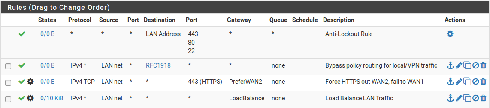
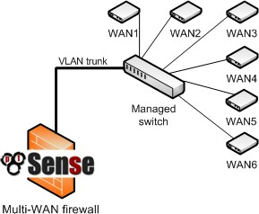

********
MultiWAN
********

Terminologia e concetti delle WAN multiple
''''''''''''''''''''''''''''''''''''''''''

Questa sezione tratta la terminologia e i concetti necessari per capire come configurare più reti WAN con |firew4ll|.

Interfaccia di tipo WAN
=======================
Un'interfaccia di tipo WAN è un'interfaccia attraverso la quale Internet
può essere raggiunto, direttamente o indirettamente. Il firewall tratta
qualsiasi interfaccia con un gateway selezionato nella pagina del menu
**Interfacce** come una WAN. Ad esempio, con una WAN con indirizzo IP
statico, **Interfacce>WAN** ha un gateway selezionato, come **WAN\_GW**.
Se questa selezione del gateway non è presente, allora l'interfaccia
verrà trattata come un'interfaccia locale. Non selezionare un gateway
nella voce del menu **Interfacce** per le interfacce locali. Le
interfacce IP dinamiche come DHCP e PPPoE ricevono automaticamente un
gateway dinamico e sono sempre trattate come WAN.

La presenza di un gateway nella configurazione dell'interfaccia cambia
il comportamento del firewall su tali interfacce in diversi modi. Ad
esempio, le interfacce con un insieme di gateway hanno l’opzione
reply-to sulle loro regole del firewall, sono utilizzate come interfacce
di uscita per NAT in uscita automatico e ibrido, e sono trattate come
WAN dalla procedura guidata di gestione del traffico.

.. note::  
	Le interfacce locali e di altro tipo possono avere un gateway definito in **Sistema>Routing**, a condizione che tale gateway non sia scelto nell'ambito della configurazione dell'interfaccia, ad esempio in **Interfacce>LAN**.

Politica di routing
===================

La politica del routing si riferisce ai mezzi di instradamento del
traffico da più di un indirizzo IP di destinazione del traffico, come
viene fatto con la tabella di routing nella maggior parte dei sistemi
operativi e router. Questo si ottiene con l'uso di una politica di
qualche tipo, di solito le regole di firewall o una lista di controllo
degli accessi. In |firew4ll|, il campo **Gateway** disponibile quando si
modificano o si aggiungono le regole del firewall consente l'uso della
politica di routing. Il campo Gateway contiene tutti i gateway definiti
sul firewall sotto **Sistema>Routing**, più qualsiasi gruppo di gateway.

La politica di routing fornisce un potente mezzo per indirizzare il
traffico verso l'interfaccia WAN appropriata o un altro gateway, dal
momento che permette di abbinare qualsiasi regola del firewall. Host
specifici, sottoreti, protocolli e altro ancora possono essere
utilizzati per indirizzare il traffico.

.. note::  
	Ricordare che tutte le regole del firewall, comprese le regole di politica del routing, sono elaborate in ordine dall'alto, e la prima che corrisponde vince.

Gruppi di gateway
=================

I gruppi gateway definiscono come un set scelto di gateway fornisca
funzionalità di failover e/o bilanciamento del carico. Sono configurati
in **Sistema>Routing**, nella scheda **Gruppi di gateway**.

Failover
========

**Failover** si riferisce alla possibilità di utilizzare una sola
connessione WAN, ma passare a un'altra WAN se la connessione preferita
non riesce. Questo è utile per le situazioni in cui un certo traffico,
tutto il traffico, dovrebbe utilizzare una connessione WAN specifica a
meno che non sia indisponibile.

.. seealso:: 
	Per fallire da un *firewall* all'altro, piuttosto che da una WAN all'altra, vedere *Elevata disponibilità*.

Bilanciamento del carico
========================

La funzionalità di **bilanciamento del carico** in |firew4ll| consente di
distribuire il traffico su più connessioni WAN in modo round-robin.
Questo viene fatto su base **per-connessione**. Se un gateway che fa
parte di un gruppo di bilanciamento del carico fallisce, l'interfaccia
viene contrassegnata come down e rimossa da tutti i gruppi fino a quando
non recupera.

Monitoraggio Indirizzi IP
=========================

Quando si configura il failover o il bilanciamento del carico, ogni
gateway è associato a un indirizzo IP da monitorare (*IP da
monitorare*). In una configurazione tipica, |firew4ll| farà un ping su
questo indirizzo IP e se smette di rispondere, l'interfaccia sarà
contrassegnata come down. Le opzioni sul gruppo gateway possono
selezionare diversi trigger di guasto oltre alla perdita di pacchetto.
Gli altri trigger possono causare alta latenza, o una combinazione di
perdita di pacchetti e alta latenza, o il circuito spento.

Che cosa costituisce il fallimento?
-------------------------------

L'argomento è un po' più complesso di « se i ping all’IP da monitorare
falliscono, l'interfaccia è contrassegnata come down¹. I criteri
effettivi per un guasto dipendono dalle opzioni scelte durante la
creazione del gruppo gateway e delle singole impostazioni su un gateway.

Le impostazioni per ogni gateway che controllano quando è considerato up
e down sono tutti discussi in *Avanzate*. Le soglie per la perdita dei
pacchetti, la latenza, il tempo di inattività e persino l'intervallo di
verifica del gateway sono tutte configurabili individualmente.

Switch Interrompere/Forzare lo stato
====================================

Quando un gateway è danneggiato, |firew4ll| può facoltativamente far andare
giù tutti gli stati per forzare i client a riconnettersi, e così facendo
useranno un gateway che è in linea, invece di un gateway che è down.
Questo attualmente funziona solo a senso unico, nel senso che può
spostare le connessioni fuori di un gateway danneggiato, ma non li può
costringere di nuovo se il gateway originale ritorna in linea.

Questo è un comportamento facoltativo, abilitato per impostazione
predefinita. Per informazioni sulla modifica di questa impostazione,
vedere *Monitoraggio del Gateway*.

Commutazione del gateway predefinito
====================================

Il traffico in uscita dal firewall userà il gateway predefinito a meno
che un percorso statico non invii il pacchetto lungo un percorso
diverso. Se il gateway predefinito è su una WAN che è inattiva, i demoni
sul firewall non saranno in grado di effettuare connessioni in uscita, a
seconda delle funzionalità del demone e della sua configurazione. Quando
**la commutazione del gateway predefinito** (*Commutazione del gateway
predefinito*) è abilitato, il gateway predefinito per il firewall sarà
passato al gateway disponibile successivo se il gateway predefinito
normale non riesce, e quindi è commutato quando la WAN recupera.

Strategie di politica di routing, bilanciamento del carico e failover
'''''''''''''''''''''''''''''''''''''''''''''''''''''''''''''''''''''

Questa sezione fornisce indicazioni sugli obiettivi comuni delle
Multi-wan e su come vengono raggiunti con |firew4ll|.

Aggregazione della larghezza di banda
=====================================

Uno dei desideri primari con le multiWAN è l'aggregazione della
larghezza di banda. Con il bilanciamento del carico, |firew4ll| può aiutare
a raggiungere questo obiettivo. C'è, tuttavia, un avvertimento: se il
firewall ha due circuiti WAN da 5 Mbps, non può ottenere 10 Mbps di
capacità di trasmissione con una *singola* connessione del client. Ogni
singola connessione deve essere legata a una sola WAN specifica. Questo
vale per qualsiasi soluzione multiWAN diversa da MLPPP. La larghezza di
banda di due diverse connessioni Internet non può essere aggregata in un
unico grande “tubo” senza il coinvolgimento dell'ISP. Con il
bilanciamento del carico, dal momento che le singole connessioni sono
bilanciate in modo roubd-robin, 10 Mbps di throughput possono essere
raggiunti solo utilizzando due circuiti da 5 Mbps quando sono coinvolte
connessioni multiple. Le applicazioni che utilizzano connessioni
multiple, come molti acceleratori di download, saranno in grado di
raggiungere la capacità di trasmissione combinata di due o più
connessioni.

.. note::  
	Il Multi-link PPPoE (MLPPP) è l'unico tipo di WAN che può raggiungere la piena larghezza di banda aggregata di tutti i circuiti in un gruppo, ma richiede un supporto speciale da parte dell'ISP. Per ulteriori informazioni su MLPPP, vedere *Multi-link Pppoe (MLPPP)*

Nelle reti con numerose macchine interne che accedono a Internet, il
bilanciamento del carico raggiungerà velocità vicine alla capacità di
trasmissione combinata bilanciando le numerose connessioni interne fuori
da tutte le interfacce WAN.

Segregazione dei servizi prioritari
===================================

In alcune situazioni, un sito può avere una connessione Internet
affidabile e di alta qualità che offre una bassa larghezza di banda, o
costi elevati per trasferimenti eccessivi, e un'altra connessione che è
veloce ma di minore qualità (maggiore latenza, più jitter, o meno
affidabile). In queste situazioni, i servizi possono essere separati tra
le due connessioni Internet per la loro priorità. I servizi ad alta
priorità possono includere VoIP, traffico destinato a una rete specifica
come un fornitore di applicazioni si sergente esterna, o protocolli
specifici utilizzati da applicazioni critiche, tra le altre opzioni. Il
traffico a bassa priorità include comunemente qualsiasi traffico
consentito che non corrisponda all’elenco del traffico ad alta priorità.
Le regole di politica di routing possono essere impostate per
indirizzare il traffico ad alta priorità fuori dalla connessione
Internet di alta qualità, e il traffico a bassa priorità fuori dalla
connessione di minore qualità.

Un altro esempio di uno scenario simile è ottenere una connessione
dedicata di Internet per i servizi critici di qualità quale VoIP e che
usano soltanto quella connessione per quei servizi.

Solo failover
=============

Ci sono scenari in cui solo l'utilizzo di failover è la migliore
pratica. Alcuni utenti |firew4ll| hanno una connessione Internet di backup
secondaria con un limite di larghezza di banda bassa, come un modem 3G,
e vogliono utilizzare tale connessione solo se la loro connessione
primaria fallisce, i gruppi Gateway configurati per failover possono
raggiungere questo obiettivo.

Un altro utilizzo per il failover è quello di garantire che un certo
protocollo o destinazione usi sempre solo una WAN a meno che non vada
down.

Bilanciamento del carico dal costo impari
=========================================

|firew4ll| può ottenere un bilanciamento del carico dal costo impari
impostando pesi appropriati sui gateway come discusso in *Peso*.
Impostando un peso su un gateway, sarà utilizzato più spesso in un
gruppo di gateway. I pesi possono essere impostati da *1* a *30*.

Tabella 1: Bilanciamento del carico dal costo impari

+================+================-+==============+==============-+
| peso WAN\_GW   | peso WAN2\_GW   | carico WAN   | carico wan2   |
+================+================-+==============+==============-+
| 3              | 2               | 60%          | 40%           |
+================+================-+==============+==============-+
| 2              | 1               | 67%          | 33%           |
+================+================-+==============+==============-+
| 3              | 1               | 75%          | 25%           |
+================+================-+==============+==============-+
| 4              | 1               | 80%          | 20%           |
+================+================-+==============+==============-+
| 5              | 1               | 83%          | 17%           |
+================+================-+==============+==============-+
| 5              | 1               | 83%          | 17%           |
+================+================-+==============+==============-+
| 30             | 1               | 97%          | 3%            |
+================+================-+==============+==============-+

Si noti che questa distribuzione bilancia strettamente il numero di
*connessioni*, non prende in considerazione il throughput
dell'interfaccia. Questo significa che l'utilizzo della larghezza di
banda non sarà necessariamente distribuito allo stesso modo, anche se
nella maggior parte degli ambienti funziona per essere
approssimativamente distribuito come configurato nel tempo. Ciò
significa anche che se un'interfaccia è caricata alla sua capacità con
una singola connessione ad alta velocità, le connessioni aggiuntive
saranno ancora dirette a quell'interfaccia.

Avvertenze e considerazioni sulle WAN multiple
''''''''''''''''''''''''''''''''''''''''''''''

Questa sezione contiene gli avvertimenti e le considerazioni specifiche
per multiWAN in |firew4ll|.

WAN multiple che condividono un singolo IP del gateway 
=======================================================

A causa del modo in cui pf gestisce le connessioni multiWAN, il
traffico può essere diretto solo utilizzando l'indirizzo IP del gateway
di un circuito, che va bene per la maggior parte degli scenari. Se il
firewall ha più connessioni sullo stesso ISP utilizzando lo stesso
indirizzo IP della sottorete e del gateway, come è comune quando si
utilizzano più modem via cavo, un dispositivo NAT intermedio deve essere
utilizzato su tutti tranne uno di essi in modo che |firew4ll| veda ogni
gateway WAN come un indirizzo IP unico.

Quando si utilizza il dispositivo NAT, può essere configurato per
inoltrare tutto il traffico indietro a |firew4ll| che può aiutare con
l'utilizzo di tale WAN per altri servizi. Tuttavia, alcuni protocolli,
come VoIP, avranno problemi se usano una WAN con NAT in tale
configurazione.

Se possibile, contattare l'ISP e far configurare i circuiti WAN in modo
che siano in sottoreti diverse con gateway diversi.

Un'eccezione a questo è una WAN di tipo PPP come PPPoE. Le WAN di tipo
PPP sono in grado di avere lo stesso gateway su più interfacce, ma ogni
voce del gateway deve essere configurata per utilizzare un indirizzo IP
da monitorare diverso (vedere *IP da monitorare*).

Molteplici WAN PPPoE
====================

Quando sono presenti più linee PPPoE dello stesso ISP e l'ISP supporta
Multi-link PPPoE (MLPPP), può essere possibile legare le linee in un
unico collegamento aggregato. Questo collegamento incollato ha una
larghezza di banda totale pari a tutte le linee insieme come fossero una
singola WAN vista da |firew4ll|. La configurazione di MLPPP è coperta in
*Multi-link Pppoe (MLPPP)*.

Servizi locali e MultiWAN
==========================

Ci sono alcune considerazioni sui servizi locali e le multiWAN, dal
momento che qualsiasi traffico avviato dal firewall stesso non sarà
influenzato dalla politica di routing configurata sulle regole di
interfaccia interna. Il traffico proveniente dal firewall stesso segue
sempre la tabella di routing del sistema. Quindi, in alcune circostanze,
sono necessari percorsi statici quando si utilizzano interfacce WAN
aggiuntive, altrimenti si userebbe solo l'interfaccia WAN con il gateway
predefinito.

Nel caso di traffico avviato su Internet destinato per una qualsiasi
interfaccia WAN, |firew4ll| utilizza automaticamente l’opzione *reply-to*
di pf direttiva in tutte le regole di interfaccia di tipo WAN, che
assicura che il traffico di risposta sia indirizzato indietro fuori la
corretta interfaccia WAN.

Risolutore DNS
--------------

Le impostazioni predefinite per il risolutore del DNS richiedono la
**commutazione del gateway predefinito** per funzionare correttamente
con Multi-wan. Vedere *Commutazione del gateway predefinito* per i
dettagli. In alternativa all'utilizzo del gateway di default, è
possibile apportare alcune modifiche per rendere il risolutore del DNS
più adatto alle Multi-wan, compresa l'abilitazione della modalità di
inoltro. I dettagli sono descritti più avanti in questo capitolo.

DNS Forwarder
-------------

I server DNS utilizzati dallo forwarder del DNS devono avere gateway
definiti se utilizzano un'interfaccia WAN OPT, come descritto più avanti
in questo capitolo. Non ci sono altri avvertimenti per il forwarder del
DNS in ambienti con WAN multiple.

DNS dinamico (DynDNS)
---------------------

Le voci Dyndns possono essere impostate usando un gruppo di gateway per
la loro interfaccia. Questo sposterà una voce Dyndns tra le WAN in
modalità failover, consentendo a un host pubblico di passare da una WAN
all'altra in caso di guasto.

IPsec
-----

Ipsec è completamente compatibile con le multiWAN. Viene aggiunto
automaticamente un percorso statico per l'indirizzo peer del tunnel
remoto che punta al gateway della WAN specificato per garantire che il
firewall invii il traffico fuori dal percorso corretto quando si avvia
una connessione. Per le connessioni mobili, il client avvia sempre la
connessione e il traffico di risposta è correttamente instradato dalla
tabella di stato.

Un tunnel Ipsec può anche essere impostato utilizzando un gruppo di
gateway come interfaccia per failover. Questo è discusso ulteriormente
in *Ambienti con WAN multiple*.

OpenVPN
-------

Le funzionalità multiWAN di OpenVPN sono descritte in *OpenVPN e
MultiWAN*. Come Ipsec, si può utilizzare qualsiasi WAN o gruppo di
gateway.

CARP e multiWAN
----------------

CARP è una multiWAN, purché tutte le interfacce WAN utilizzino
indirizzi IP statici e ci siano almeno tre indirizzi IP pubblici
disponibili per WAN. Questo è coperto in *Multi-wan con HA*.

IPv6 e multiWAN
================

Ipv6 è anche in grado di funzionare con capacità multiWAN, ma di solito
richiede la traduzione dei prefissi di rete (NPt) su una o più WAN.
Questo è trattato più in dettaglio in *Multi-wan per Ipv6*.

Riepilogo dei requisiti delle MultiWAN
'''''''''''''''''''''''''''''''''''''''

Prima di coprire la maggior parte delle specifiche multiWAN, ecco un
breve riepilogo dei requisiti per realizzare una configurazione
multiWAN completamente implementata:

-  Creare un gruppo di gateway in **Sistema>Routing** nella scheda
   **Gruppi**

-  Configurare il risolutore o il forwarder del DNS per Multi-wan,
   iniziando ad impostare almeno un server del DNS unico per ogni
   gateway della WAN in **Sistema>Configurazione generale**

-  Usare il gruppo di gateway sulle regole del firewall della LAN

Bilanciamento del carico e failover con I gruppi di gateway
'''''''''''''''''''''''''''''''''''''''''''''''''''''''''''

      Un gruppo di gateway è necessario per impostare una configurazione
      di bilanciamento del carico o failover. Il gruppo stesso non fa
      intraprendere alcuna azione, ma quando il gruppo viene utilizzato
      in seguito, come nelle regole del firewall della politica di
      routing, definisce come gli elementi che utilizzino il gruppo si
      comporteranno.

      Lo stesso gateway può essere incluso in più gruppi in modo che
      diversi scenari possano essere configurati allo stesso tempo. Per
      esempio, un po' di traffico può essere bilanciato dal carico, e
      altro traffico può utilizzare il failover, e la stessa WAN può
      essere utilizzata in entrambe le capacità utilizzando diversi
      gruppi di gateway.

      Un esempio molto comune di configurazione per due firewall WAN
      contiene tre gruppi:

-  Bilanciamento del carico - Gateway per WAN1 e WAN2 entrambe sul livello 1

-  Wan preferita 1 - Gateway per WAN1 sul livello 1 e WAN2 sul livello 2

-  Wan preferita 2 - Gateway per WAN1 sul livello 2 e WAN2 sul livello 1

Configurazione di un gruppo di gateway per il bilanciamento del carico o il failover
====================================================================================

Per creare un gruppo di gateway per il bilanciamento del carico o il
failover:

-  Andare a **sistema>Routing**, scheda **Gruppi**

-  Fare clic su |image0| **Aggiungere** per creare un nuovo gruppo di
   gateway

-  Inserire le opzioni nella pagina come necessario:

   **Nome del gruppo** Un nome per il gruppo gateway. Il nome deve avere
   una lunghezza inferiore a 32 caratteri e può contenere solo lettere
   a-z, cifre da 0 a 9 e un trattino basso. Questo sarà il nome usato
   per riferirsi a questo gruppo di gateway nel campo **Gateway** nelle
   regole del firewall. Questo campo è obbligatorio.

   **Livello (Tier)** Scegliere la priorità per i gateway all'interno
   del gruppo. All'interno dei gruppi di gateway, i gateway sono
   organizzati in Livelli. I livelli sono numerati da *1* a *5*, e
   vengono usati **prima** i numeri **più bassi.** Ad esempio, i gateway
   del *Tier 1* vengono utilizzati prima dei gateway del *Tier 2*, e
   così via. Vedere le sezioni seguenti per maggiori dettagli su come
   utilizzare i Livelli.

   **IP virtuale** Opzionalmente specifica un indirizzo IP virtuale da
   utilizzare per un'interfaccia, se presente. Questa opzione viene
   utilizzata per funzioni come OpenVPN, consentendo di scegliere un
   indirizzo virtuale specifico, piuttosto che utilizzare solo
   l'indirizzo dell'interfaccia direttamente quando un gateway specifico
   è attivo nel gruppo. Nella maggior parte dei casi, questo viene
   lasciato al valore predefinito dell’Indirizzo di interfaccia.

   **Livello di attivazione (Trigger)** Decide quando contrassegnare un
   gateway come inferiore.

   **Membro down** Segna il gateway come down solo quando è
   completamente inattivo, dopo una o entrambe le soglie superiori
   configurate per il gateway. Questo causa il peggior tipo di guasti,
   quando il gateway è completamente insensibile, ma può perdere i
   problemi minori con un circuito che può renderlo inutilizzabile molto
   prima che il gateway raggiunga quel livello.

   **Perdita di pacchetti** Segna il gateway come down quando la perdita
   di pacchetti supera la soglia di allarme inferiore (vedere *Soglie
   della perdita di pacchetti*).

   **Alta latenza** Segna il gateway come down quando la latenza supera
   la soglia di allarme inferiore (vedere *Soglie di latenza*).

   **Perdita o latenza elevata dei pacchetti** Segna il gateway come
   down per entrambi i tipi di allerta.

   **Descrizione** Testo che descrive lo scopo di questo gruppo di
   gateway.

Bilanciamento del carico
------------------------

Due gateway sullo stesso livello sono bilanciate. Ad esempio, *se
Gateway A*, *Gateway B* e *Gateway C* sono tutti del Tier 1, le
connessioni sarebbero bilanciate tra di loro. I gateway che sono
bilanciati dal carico falliscono automaticamente tra di loro. Quando un
gateway fallisce viene rimosso dal gruppo, quindi in questo caso se uno
qualsiasi dei gateway A, B, o C è andato down, il firewall bilancerebbe
il carico tra i restanti gateway online.

Bilanciamento ponderato
-----------------------

Se due WAN devono essere bilanciate in modo ponderato a causa di
differenti quantità di larghezza di banda tra di loro, possono essere
sistemati regolando il parametro **Peso** sul gateway come descritto in
*Bilanciamento del carico cn costi impari* e *Peso*.

Failover
--------

I gateway su un livello di numero **inferiore** sono preferiti, e se
sono down allora vengono utilizzati gateway di un livello di numero
superiore. Per esempio, se il *Gateway A* è sul livello 1, il *Gateway
B* è sul livello 2 e il *Gateway C* è sul livello 3, allora il *Gateway
A* dovrebbe essere utilizzato per primo. Se il *Gateway A* va down,
allora il *Gateway B* verebbe usato. Se sia il *Gateway A* che il
*Gateway B* sono down, allora il *Gateway C* verrebbe usato.

Scenari complessi/combinati
---------------------------

Estendendo i concetti di cui sopra per il bilanciamento del carico e il
failover, molti scenari complicati sono possibili combinando sia il
bilanciamento del carico sia il failover. Per esempio, se il *Gateway A*
è al Tier 1, e il *Gateway B* e il *Gateway C* sono al Tier 2, poi il
*Gateway D* al Tier 3, si verifica il seguente comportamento: il
*Gateway A* è preferito da solo. Se il *Gateway A* è inattivo, allora il
traffico sarebbe bilanciato tra il *Gateway B* e il *Gateway C*. Se il
*Gateway B* o il *Gateway C* dovessero andare down, il gateway online
rimanente in quel livello verrebbe ancora utilizzato. Se il *Gateway A*,
il *Gateway B* e il *Gateway C* sono fuori uso, il traffico passerà al
*Gateway D*.

Qualsiasi altra combinazione di quanto sopra può essere utilizzata,
purché possa essere disposta entro il limite di **5** livelli.

Problemi con il bilanciamento del carico
========================================

Alcuni siti web memorizzano le informazioni sulla sessione, compreso
l'indirizzo IP del client, e se una successiva connessione a quel sito
viene deviata da un'interfaccia WAN diversa utilizzando un diverso
indirizzo IP pubblico, il sito web non funzionerà correttamente. Questo
sta diventando sempre più comune con le banche e altri siti di
sicurezza. Il mezzo suggerito per aggirarlo è quello di creare un gruppo
di failover e traffico diretto destinato a questi siti al gruppo di
failover piuttosto che un gruppo di bilanciamento del carico. In
alternativa, eseguire il failover per tutto il traffico HTTPS.

La connessione sticky di pf è ideata per risolvere questo problema, ma è
stata storicamente problematica. E 'sicura da usare, e dovrebbe
alleviarlo, ma c'è anche un lato negativo nell’utilizzare l'opzione
sticky. Quando si utilizzano connessioni sticky, un'associazione è
tenuta tra l'\ *indirizzo IP del client* e un dato *gateway*, essa non
si trova fuori dalla destinazione. Quando l'opzione delle connessioni
sticky è abilitata, un dato client non caricherebbe il bilanciamento
delle sue connessioni tra più WAN, ma sarebbe associato a qualsiasi
gateway utilizzato per la sua prima connessione. Una volta che tutti gli
stati client sono scaduti, il client può uscire da una WAN diversa per
la sua connessione successiva, con conseguente nuova accoppiamento
gateway.

Interfaccia e configurazione del DNS
''''''''''''''''''''''''''''''''''''

I primi due elementi da configurare per le Multi-wan sono le Interfacce
e il DNS.

Configurazione dell'interfaccia
===============================

   Configurare la WAN primaria come descritto in precedenza nella
   procedura guidata di configurazione. Quindi, per le interfacce WAN
   aggiuntive, eseguire le seguenti operazioni:

-  Assegnare le interfacce se non esistono ancora

-  Visitare la voce del menu Interfacce per ogni WAN aggiuntiva (ad es.
   Interfacce>OPT1)

-  Abilitare l'interfaccia

-  Inserire un nome adatto, come WAN2

-  Selezionare il tipo di configurazione dell'indirizzo IP desiderato a
   seconda del tipo di connessione Internet.

-  Inserire i dettagli rimanenti per il tipo di WAN. Ad esempio, sulle
   connessioni IP statiche, inserire l'indirizzo IP, la maschera di
   sottorete e aggiungere o selezionare un gateway.

Configurazione del server DNS
=============================

Se il forwarder del DNS è in uso, o se il resolver DNS verrà utilizzato
in modalità di inoltro, |firew4ll| deve essere configurato con i server DNS
da ogni connessione WAN per garantire che sia sempre in grado di
risolvere il DNS. Questo è particolarmente importante se la rete interna
utilizza il firewall per la risoluzione del DNS.

Se i server DNS vengono utilizzati solo da una singola WAN,
un'interruzione della connessione WAN comporterà un'interruzione
completa di Internet indipendentemente dalla configurazione della
politica di routing poiché il DNS non funzionerà più.

1. .. rubric:: Configurazione del risolutore del DNS
      :name: configurazione-del-risolutore-del-dns

   Il risolutore del DNS può funzionare con le WAN multiple ma la
   configurazione esatta dipende dal comportamento desiderato e dalle
   impostazioni correnti.

   Se DNSSEC deve essere utilizzato e i server DNS configurati non
   supportano DNSSEC, allora la modalità di inoltro non può essere
   abilitata. Può ancora funzionare con MultiWAN ma richiede la
   **commutazione del gateway predefinito**. Vedere *Commutazione del
   gateway predefinito*.

   Se il DNSSEC non è un requisito per questo firewall, o i server DNS
   configurati supportano DNSSEC, allora si può eseguire la seguente
   procedura:

-  Impostare almeno un server DNS per WAN in **Sistema>Configurazione
   generale**, come descritto nella sezione successiva.

-  Controllare **Abilitare la modalità di inoltro** in
   **Servizi>Risolutore DNS**

-  Deselezionare **Abilitare il supporto DNSSEC** se i server DNS
   configurati upstream non supportano DNSSEC

Server DNS e route statiche
===========================

      Quando si utilizza il forwarder DNS o il risolutore DNS in
      modalità di inoltro, |firew4ll| utilizza la sua tabella di routing
      per raggiungere i server DNS configurati. Ciò significa che senza
      alcun percorso statico configurato, utilizzerà solo la connessione
      WAN primaria per raggiungere i server DNS. I gateway devono essere
      selezionati per ogni server DNS definito sul firewall in modo che
      |firew4ll| utilizzi la corretta interfaccia WAN per raggiungere il
      server DNS. I server DNS che provengono da gateway dinamici
      vengono automaticamente reindirizzati al percorso corretto. Se
      possibile, dovrebbe essere selezionato almeno un gateway da
      ciascuna WAN.

      Per configurare i gateway del server DNS:

-  Andare a **Sistema>Configurazione generale**

-  Definire almeno un server DNS *unico* per ogni WAN (fino a quattro).

-  Per ogni server DNS, selezionare un gateway appropriato in modo da
   utilizzare una specifica interfaccia WAN

.. note::  
	Lo stesso server DNS non può essere inserito più di una volta. Ogni voce deve essere unica.

La selezione dei gateway per i server DNS è necessaria per diversi
motivi. Uno, la maggior parte degli ISP vieta le query ricorsive da
parte di host esterni alla propria rete, quindi il firewall deve
utilizzare la corretta interfaccia WAN quando accede ai server DNS per
uno specifico ISP. In secondo luogo, se la WAN primaria fallisce e il
firewall non ha un gateway scelto per uno degli altri server DNS, il
firewall perderà tutte le capacità di risoluzione del DNS dal firewall
stesso. L'accesso al DNS viene perso in quella situazione perché tutti i
server DNS saranno irraggiungibili quando il gateway predefinito è
irraggiungibile. Se |firew4ll| viene utilizzato come server DNS per la rete
locale, ciò si tradurrà in un errore completo del DNS.

Quando si utilizza il Risolutore del DNS con la modalità di inoltro
disabilitata, il demone unbound parla direttamente ai server DNS di root
e ad altri server DNS autorevoli, il che rende impossibile l'utilizzo di
tali rotte statiche e di assegnazioni di gateway. In tal caso, è
necessaria la **commutazione del gateway predefinito** in modo che il
demone unbound possa mantenere la connettività in uscita.

Scalabilità a un gran numero di interfacce WAN
==============================================

Ci sono numerosi utenti |firew4ll| che distribuiscono 6-12 connessioni
Internet su un'unica installazione. Un utente |firew4ll| ha 10 linee DSL
perché nel suo paese è significativamente più conveniente ottenere dieci
connessioni da 256 Kb che una connessione da 2.5 Mb. Questo cliente
utilizza |firew4ll| per caricare un gran numero di macchine interne su 10
diverse connessioni. Per ulteriori informazioni su questa scala di
distribuzione, vedere *MultiWAN su una Stick* più avanti in questo
capitolo.

MultiWAN e NAT
''''''''''''''

Le regole NAT predefinite generate da |firew4ll| tradurranno qualsiasi
traffico che lascia un'interfaccia di tipo WAN a quell'indirizzo IP
dell'interfaccia. In una configurazione predefinita di due interfacce
LAN e WAN, |firew4ll| utilizzerà il NAT su tutto il traffico che dalla
sottorete LAN lascia l'interfaccia WAN all'indirizzo IP della WAN.
L'aggiunta di più interfacce di tipo WAN estende questo comportamento
del NAT a qualsiasi traffico che lascia un'interfaccia di tipo WAN a
quell'indirizzo IP dell'interfaccia. Tutto questo viene gestito
automaticamente a meno che il NAT in uscita manuale non sia abilitato.

Le regole di politica del routing del firewall indirizzano il traffico
verso l'interfaccia WAN utilizzata, e le regole in uscita e il NAT 1:1
specificano come il traffico verrà tradotto man mano che lascia quella
WAN.

MultiWAN e NAT in uscita manuale
=================================

Se il **NAT in uscita manuale** deve essere utilizzato con multiWAN,
assicurarsi che le regole NAT siano configurate per tutte le interfacce
di tipo WAN.

MultiWAN e Port forward
=======================

Ogni port forward si applica ad una singola interfaccia WAN. Una
determinata porta può essere aperta su più interfacce WAN utilizzando
più voci di inoltro della porta, una per interfaccia WAN. Il modo più
semplice per farlo è:

-  Aggiungere una port forward sulla prima connessione WAN come di
   consueto

-  Fare clic su |image1| a destra di quella voce per aggiungere un'altra
   port forward in base a quella selezionata

-  Modificare l'\ **interfaccia** sulla WAN desiderata

-  Fare clic su **Salvare**

La parola chiave della reply-to in pf, utilizzata sulle regole di
interfaccia di tipo WAN, assicura che quando il traffico arriva su una
specifica interfaccia WAN, il traffico di ritorno tornerà indietro nel
modo in cui è entrato nel firewall. Quindi gli inoltri di porta possono
essere utilizzati attivamente su tutte le interfacce WAN in qualsiasi
momento, indipendentemente da qualsiasi configurazione di failover
presente. Questo è particolarmente utile per i server di posta, in
quanto un indirizzo su una WAN secondaria può essere utilizzato come MX
di backup, consentendo al sito di ricevere posta anche quando la linea
principale è inattiva. Questo comportamento è configurabile, per
informazioni su questa impostazione, vedere *Disabilitare reply-to*.

MultiWAN e NAT 1:1
===================

Le voci del NAT 1:1 sono specifiche per una singola interfaccia WAN e,
come il NAT in uscita, controllano solo ciò che accade al traffico
quando esce da un'interfaccia. I sistemi interni possono essere
configurati con una voce del NAT 1:1 su ogni interfaccia WAN, o una voce
1:1 su una o più interfacce WAN e utilizzare il NAT di default in uscita
su altre. Dove le voci 1:1 sono configurate, sovrascrivono sempre
qualsiasi altra configurazione del NAT in uscita per quella specifica
interfaccia.

Se un dispositivo locale deve sempre utilizzare una voce del NAT 1:1 su
una specifica WAN, allora il traffico da quel dispositivo deve essere
costretto a utilizzare quel gateway WAN specifico.

Configurazione della politica di routing
''''''''''''''''''''''''''''''''''''''''

A questo punto, il firewall è pronto per WAN multiple, ma non sarà
ancora utilizzato. Il traffico non fallirà o non sarà caricato in modo
bilanciato senza regole di politica di routing del firewall.

.. note::  Una possibile eccezione è se la **commutazione del gateway
predefinito** è abilitato (*Commutazione del gateway predefinito*), nel
qual caso il failover potrebbe ancora funzionare senza politica di
routing.

Configurare regole del firewall per la politica di routing
==========================================================

L'impostazione di un **gateway** su una regola del firewall farà sì che
il traffico corrispondente alla regola utilizzi il gateway o il gruppo
scelto, seguendo il comportamento configurato del gruppo.

Il modo più semplice per configurare un firewall per la politica di
routing è quello di modificare la regola di passaggio predefinita per la
LAN e selezionare il gruppo di gateway. Con quell'impostazione, tutto il
traffico che corrisponde alla regola di passaggio predefinita sul LAN
userà il gateway o il gruppo scelto.

Per fare quella modifica:

-  Passare a **Firewall>Regole**, scheda **LAN**

-  Fare clic su |image2| sulla riga con la regola di passaggio
   predefinita

-  Fare clic su |image3| **Visualizzare avanzate** sotto **opzioni
   extra**

-  Selezionare il gruppo di gateway desiderato dall'elenco a discesa del
   **Gateway**

-  Fare clic su **Salvare**

-  Fare clic su **Applicare modifiche**

Solo le distribuzioni più basilari saranno soddisfatte con questa
configurazione, la maggior parte delle configurazioni sono più
complesse. Continuare a leggere per ulteriori fattori che possono
richiedere una configurazione aggiuntiva.

Escludere la politica di routing
================================

Se ci sono altre interfacce locali, VPN, interfacce MPLS o traffico che
devono seguire diversamente la tabella di routing del sistema, quindi
quel traffico deve essere configurato per bypassare la politica di
routing. Questo è semplice da fare creando una regola che corrisponda al
traffico in questione e poi mettendo quella regola sopra tutte le regole
che hanno un gateway configurato, perché la prima regola da corrisponde
è quella che viene utilizzata.

Ciò può essere generalizzato realizzando un alias per tutto il traffico
*RFC1918* che coprirebbe tutte le reti riservate ed poi usandolo in una
regola. L'alias contiene 192.168.0.0/16, 172.16.0.0/12 e 10.0.0.0/8.

Nella figura *Esempio di aggiramento della politica di routing*, il
traffico locale e la VPN bypassano la politica di routing, ol traffico
HTTPS preferisce WAN2, e tutto il traffico effettua bilanciamento del
carico:

|image4|

Fig. 1: Esempio di aggiramento della politica di routing

Unire failover e bilanciamento del carico
=============================================

Come mostrato nella figura *Esempio di aggiramento della politica di
routing*, il failover e il bilanciamento del carico possono essere
utilizzati allo stesso tempo ordinando attentamente le regole su
un'interfaccia. Le regole vengono elaborate dall'alto verso il basso e
la prima corrispondente vince. Piazzando regole più specifiche in cima
alla lista, e le regole generali del tipo “corrispondenza a tutto” in
basso, qualsiasi numero di combinazioni diverse è possibile con regole
che utilizzano diversi gateway o gruppi.

Forzare l’uso del gateway
=========================

Ci sono situazioni in cui il traffico dovrebbe usare solo un gateway e
mai il bilanciamento del carico o il failover. In questo esempio, un
dispositivo deve uscire solo tramite una specifica WAN e perdere tutta
la connettività quando la WAN non riesce.

In primo luogo, impostare il **gateway** su una regola firewall
corrispondente al traffico da questo dispositivo a uno specifico gateway
WAN. Se quel gateway è inattivo, la regola agirà come se il gateway non
fosse stato impostato affatto, quindi devono essere fatti un paio di
passi avanti.

Aggiungere una regola immediatamente sotto la regola corrispondente al
traffico, e impostare il rifiuto o il blocco. Questa regola non deve
avere un gateway impostato.

Successivamente, configurare il firewall per omettere le regole per i
gateway che sono inattivi (*Monitoraggio dei gateway*):

-  Passare a **Sistema>Avanzate** nella scheda **Varie**

-  Selezionare **Non creare regole quando il gateway è inattivo**

-  Fare clic su **Salvare**

Con questa opzione abilitata, la prima regola verrà omessa
completamente, passando alla regola successiva. In questo modo, quando
la prima regola viene omessa automaticamente, il traffico sarà fermato
dalla regola di blocco.

Verificare le funzionalità
''''''''''''''''''''''''''

Una volta che la multiWAN è stata configurata, la migliore procedura è
quindi quella di testare la sua funzionalità per verificare le funzioni
come previsto. Le seguenti sezioni descrivono come testare ogni porzione
della configurazione della multiWAN.

Testare il failover
===================

Testare la Multi-wan in modo controllato immediatamente dopo la
configurazione è un passo chiave nel processo. Non commettere l'errore
di aspettare che una connessione a Internet fallisca naturalmente per la
prima prova, solo per scoprire i problemi quando sono molto più
difficili e stressanti da risolvere.

Innanzitutto, passare a **Stato>Gateway** e assicurarsi che tutti i
gateway della WAN siano visualizzati come **Online** sotto **Stato**,
nonché nella scheda **Gruppi di gateway**. In caso contrario, verificare
che sia utilizzato un indirizzo IP da monitorare corretto come discusso
in *IP da monitorare*.

Creare un guasto alla WAN
-------------------------

Esistono diversi modi per simulare un guasto WAN a seconda del tipo di
connessione Internet utilizzata. Per qualsiasi tipo, provare prima a
scollegare il cavo Ethernet dell'interfaccia WAN di destinazione dal
firewall.

Per le connessioni via cavo e DSL, provare a spegnere il modem/CPE, e in
un test separato, scollegare la linea coassiale o telefonica dal modem.
Per fibre, wireless e altri tipi di connessioni con un router esterno a
|firew4ll|, provare a scollegare la connessione Internet dal router e anche
a spegnere il router stesso.

Tutti gli scenari di prova descritti finiranno probabilmente con lo
stesso risultato. Tuttavia, ci sono alcune circostanze in cui provare
tutte queste cose individualmente troverà un difetto che altrimenti non
sarebbe stato notato fino ad un guasto reale. Uno dei più comuni è usare
inconsapevolmente un indirizzo IP da monitorare assegnato al modem DSL o
via cavo. Quindi quando la linea coassiale o telefonica è scollegata,
simulando un guasto del provider piuttosto che un guasto Ethernet o
modem, il ping per il monitoraggio riesce ancora dal momento che è il
ping del modem. Da quando a |firew4ll| è stato detto di monitorare, la
connessione è ancora attiva, quindi non fallirà anche se la connessione
upstream è effettivamente inattiva. Ci sono altri tipi di guasto che
allo stesso modo possono essere rilevati solo testando tutte le singole
possibilità di guasto. L'indirizzo IP da monitorare può essere
modificato sulla voce del gateway come indicato nell’\ *IP da
monitorare*.

Verificare lo stato dell’interfaccia
------------------------------------

Dopo aver creato un errore nella WAN, aggiornare **Stato>Gateway** per
controllare lo stato corrente. Mentre il demone di monitoraggio del
gateway nota la perdita, la perdita alla fine passerà oltre le soglie di
allarme configurate e sarà contrassegnata come down.

Verificare la funzionalità del bilanciamento del carico
=======================================================

Questa sezione descrive come verificare le funzionalità di una
configurazione di bilanciamento del carico.

Verificare il bilanciamento del carico con HTTP
-----------------------------------------------

Il modo più semplice per verificare il bilanciamento del carico con HTTP
è visitare un sito web che visualizza l'indirizzo IP pubblico utilizzato
dal client per accedere al sito. Una pagina sul sito |firew4ll| è
disponibile per questo scopo, e innumerevoli altri siti offrono la
stessa funzionalità. Cercare “qual è il mio indirizzo IP” e verranno
restituiti numerosi siti web che mostreranno l'indirizzo IP pubblico
facendo la richiesta a HTTP. Molti di questi siti tendono ad essere
pieni di annunci spammy, in modo da fornire un paio di siti che
semplicemente segnalano l'indirizzo IP del cliente:

-  `*https://www.netgate.com/ip* <https://www.netgate.com/ip>`__

-  `*https://www.pfsense.org/ip* <https://www.pfsense.org/ip>`__

-  `*https://files00.netgate.com/ip* <https://files00.netgate.com/ip>`__

-  `*https://files01.netgate.com/ip* <https://files01.netgate.com/ip>`__

I browser hanno l'abitudine di mantenere aperte le connessioni al server
e i risultati sulla cache, quindi il miglior test basato sul browser è
quello di caricare più siti, o di chiudere la finestra del browser tra i
tentativi di caricare un sito. Durante ogni tentativo di connessione,
dovrebbe essere mostrato un indirizzo IP diverso se il bilanciamento del
carico funziona correttamente. Se nella rete è presente altro traffico,
l'indirizzo IP potrebbe non essere modificato ad ogni caricamento di
pagina. Ripetere il test più volte e l'indirizzo IP dovrebbe cambiare
almeno un paio di volte.

Se l'indirizzo IP non cambia mai, provare diversi siti, e assicurarsi
che il browser stia davvero richiedendo la pagina di nuovo, e non
restituisca qualcosa dalla sua cache o utilizzando una connessione
persistente al server. Cancellare manualmente la cache, chiudere e
riaprire il browser, e provare più browser web sono buone cose da
provare prima di risolvere ulteriormente i problemi della configurazione
del bilanciamento del carico.

Usare curl come descritto in *Verificare il bilanciamento del carico* è
un test migliore in quanto garantisce che la cache e le connessioni
persistenti non avranno alcun impatto sui risultati.

Testare il bilanciamento del carico con traceroute
--------------------------------------------------

L'utilità ``traceroute`` (o ``tracert`` in Windows) mostra il percorso di rete
preso per una data destinazione. Vedere *Utilizzo di traceroute* per i
dettagli sull'utilizzo di traceroute. Con il bilanciamento del carico,
l'esecuzione di un traceroute da un sistema client dietro il firewall
dovrebbe mostrare un percorso preso diverso per ogni tentativo. A causa
delle funzioni di traceroute, attendere almeno un minuto dopo aver
fermato un traceroute prima di iniziare un altro test in modo che gli
stati scadano, o provare diverse destinazioni ad ogni tentativo.

Utilizzare i grafici del traffico
---------------------------------

I grafici del traffico in tempo reale sotto **Stato>Grafico del
traffico** e sul widget della dashboard dei grafici del traffico sono
utili per mostrare il flusso in tempo reale sulle interfacce WAN. Solo
un grafico alla volta può essere visualizzato per finestra del browser
quando si utilizza **Stato>Grafico del traffico**, ma ulteriori finestre
o schede possono essere aperte nel browser per vedere tutte le
interfacce WAN contemporaneamente. Il widget del grafico del traffico
per la dashboard consente la visualizzazione simultanea di grafici di
traffico multipli su una singola pagina per semplificare questo
processo. Se il bilanciamento del carico funziona correttamente,
l'attività sarà osservata su tutte le interfacce WAN.

I grafici del traffico RRD in **Stato>Monitoraggio** sono utili per la
valutazione storica e a lungo termine dell'utilizzo della WAN.

.. note::  
	L'utilizzo della larghezza di banda può non essere esattamente distribuito in modo uguale, poiché le connessioni sono semplicemente dirette su una base round robin senza tenere conto dell'utilizzo della larghezza di banda.

Risoluzione dei problemi
''''''''''''''''''''''''

Questa sezione descrive alcuni dei problemi più comuni con multiWAN e
come risolverli.

Verificare la configurazione della regola del firewall
======================================================

L'errore più comune durante la configurazione multiWAN sono le regole
del firewall improprie. Ricordare, la prima regola corrispondente vince
e qualsiasi altra regola viene ignorata. Se una regola di politica del
routing è al di sotto della regola LAN predefinita nell'elenco, nessun
traffico corrisponderà mai a quella regola perché prima corrisponderà
alla regola LAN predefinita. Rivedere *Configurazione della politica di
routing* e verificare che le regole siano corrette.

Se l'ordinamento e la configurazione delle regole appaiono corretti, può
aiutare abilitare l'accesso alle regole. Vedere *Risoluzione dei
problemi con le regole del firewall* per la per maggiori informazioni.
Assicurarsi che la regola di politica del routing sia quella di far
passare il traffico.

La politica di routing non funziona per il traffico web o tutto il traffico
===========================================================================

Quando un pacchetto proxy che può catturare in modo trasparente il
traffico HTTP viene utilizzato, come squid, sovrascrive qualsiasi
politica di routing definita per il traffico client su quella porta.
Quindi non importa quale gateway è impostato nelle regole del firewall,
il traffico per HTTP (porta TCP 80) continuerà a passare attraverso
squid e seguire il percorso predefinito del firewall.

Il failover non funziona
========================

Se si verificano problemi quando una connessione Internet non riesce, in
genere è perché l'indirizzo IP da monitorare sta ancora rispondendo,
quindi il firewall pensa che la connessione sia ancora disponibile.
Controllare **Stato>Gateway** per verificare. Un indirizzo IP sul modem
può essere utilizzato come indirizzo IP da monitorare, che sarà comunque
accessibile anche se la connessione Internet è disattivata.

Il bilanciamento del carico non funziona
========================================

-  Controllare che il Gruppo di Gateway sia configurato correttamente
   per il bilanciamento del carico, con almeno due gateway sullo stesso
   livello.

-  Controllare che le regole del firewall siano corrispondenti al
   traffico diretto al gruppo di gateway per il bilanciamento del
   carico.

-  Controllare che tutti i gateway del gruppo siano visualizzati come
   Online in **Stato>Gateway**. Le connessioni contrassegnate come
   Offline non saranno utilizzate.

-  Controllare la metodologia di test. Piuttosto che il test con un
   browser web, provare con curl come descritto in *Verificare il
   bilanciamento del carico*.

-  Controlla che il traffico non stia usando un proxy o sia altrimenti
   avviato da un demone sul firewall stesso.

Il gateway viene segnalato erroneamente offline
===============================================

Se un gateway è elencato come offline, ma la WAN è in realtà attiva,
diverse cose potrebbero essere in errore:

-  In primo luogo, verificare se l'indirizzo IP da monitorare risponde a
   un ping da un dispositivo client sulla LAN, e di nuovo da
   **Diagnostica>Ping**.

-  Se il dispositivo con l'indirizzo IP da monitorare o un altro hop
   intermedio rilascia i pacchetti di richiesta di eco ICMP senza un
   payload, i ping manuali funzionerebbero ma il monitoraggio del
   gateway fallirebbe. Vedere *Payload dei dati* e impostare il carico
   utile a un valore pari o superiore a 1.

-  Se il gateway o l'indirizzo IP da monitorare non risponde alle
   richieste di eco ICMP, inserire un indirizzo IP da monitorare diverso
   da usare.

-  Se l'indirizzo IP da monitorare è configurato come server DNS per una
   WAN diversa, i percorsi statici potrebbero causare un conflitto e le
   richieste di eco al gateway potrebbero non seguire il percorso
   previsto. Impostare un indirizzo IP da monitorare non in conflitto
   sul gateway.

-  Se c'è una regola NAT in uscita sulla WAN con una fonte come
   *qualsiasi*, si possono causare problemi con il traffico sul
   firewall, compreso il monitoraggio del traffico, perché anche quello
   userà il traffico NAT dal firewall stesso. Questo può essere
   particolarmente problematico se l'indirizzo sorgente viene cambiato
   in un VIP CARP. Fissare il NAT in uscita.

Se tutto il resto fallisce, è possibile che il circuito sia davvero
down, ma la metodologia di test sembra dimostrarlo. Verificare le
impostazioni dell'interfaccia e del gateway ed eseguire nuovamente il
test, e provare traceroute per assicurarsi che il traffico in uscita
stia utilizzando il percorso previsto.

Il ping funziona dall'indirizzo IP, ma la navigazione web non riesce
====================================================================

In questo caso, la causa più probabile è il DNS. Se le impostazioni DNS
del firewall non corrispondono a quelle di *Interfaccia e configurazione
DNS*, i client potrebbero non essere in grado di risolvere il DNS quando
una WAN è inattiva. Rivedere le impostazioni e risolvere gli eventuali
problemi che si trovano.

MultiWAN su uno stick
''''''''''''''''''''''

Nel mondo dei router, Cisco e altri si riferiscono a un router VLAN come
a “un router su uno stick”, in quanto può essere un router funzionante
con una sola connessione di rete fisica. Anche |firew4ll| può essere
configurato in questo modo, utilizzando le VLAN e uno switch gestito in
grado di eseguire trunking 802.1q. La maggior parte delle distribuzioni
con più di 5 WAN utilizza questa metodologia per limitare il numero di
interfacce fisiche richieste sul firewall. In una tale distribuzione, le
interfacce WAN risiedono tutte su un'interfaccia fisica sul firewall,
con la rete(i) interna(e) su interfacce fisiche aggiuntive. La figura
*Multi-wan su uno stick* illustra questo tipo di distribuzione.

|image5|

Fig. 2: MultiWAN su uno stick

MultiWAN per IPv6
''''''''''''''''''

Le WAN multiple possono essere utilizzate con Ipv6 a condizione che il
firewall sia collegato a più ISP o ai tunnel con indirizzi statici.

.. seealso::
	Vedere *Collegamento con un servizio di intermediazione del tunnel* per assistenza nella creazione di un tunnel.

I gruppi gateway funzionano allo stesso modo per Ipv6 e per Ipv4, ma le
famiglie di indirizzi non possono essere mescolate all'interno di un
gruppo. Un gruppo deve contenere *solo* gateway Ipv4 o *solo* gateway
Ipv6.

In tutta questa sezione “Seconda WAN” si riferisce alla seconda
interfaccia o interfaccia aggiuntiva con la connettività Ipv6. Può
essere un'interfaccia reale che ha connettività nativa, o un'interfaccia
tunnel quando si utilizza un intermediario del tunnel.

Avvertenze
==========
Nella maggior parte dei casi, il NAT non viene utilizzato con l'Ipv6 in
quanto tutto viene instradato. Questo è ottimo per la connettività e per
le imprese o luoghi che possono permettersi un spazio di indirizzo
indipendente del fornitore (Provider Indipendent, PI) e un peering BGP,
ma non funziona in pratica per le piccole imprese e gli utenti
domestici.

La traduzione dei prefissi di rete (NPt) consente di utilizzare una
sottorete per la LAN che ha piena connettività tramite la sua WAN
nativa, ma ha anche tradotto la connettività sulle WAN aggiuntive in
modo che sembrasse provenire da lì. Sebbene non ci sia vera connettività
per la sottorete LAN tramite i percorsi alternativi, è meglio che non vi
sia alcuna connettività se la WAN primaria è inattiva.

.. warning::
	Questo non funziona per tipi di IPv6 dinamici dove la sottorete non è statica, come DHCP6-PD

Requisiti
=========

   Per configurare Multi-wan per Ipv6 il firewall deve avere:

-  Connettività Ipv6 con indirizzi statici su due o più WAN

-  Gateway aggiunti a **System>Routing** per entrambe le WAN Ipv6, e
   connettività confermata su entrambe.

-  Un /64 instradato da ogni provider/percorso

-  LAN che utilizzi un /64 statico instradato o simile

Setup
=====

La configurazione per MultiWAN Ipv6 è molto vicina alla configurazione
per Ipv4. La differenza principale è che usa NPt invece di NAT.

Per prima cosa, in **Sistema>Routing** nella scheda **Gruppi di
gateway**, aggiungere Gruppi di gateway per i gateway Ipv6, con i
livelli impostati come desiderato. Questo funziona in modo identico per
Ipv4.

Successivamente, passare a **Sistema>Generale** e impostare un server
DNS Ipv6 impostato per ogni WAN Ipv6, in maniera identica anche per
Ipv4.

Ora aggiungere una voce NPt in **Firewall>NAT** nella scheda **NPt**,
usando le seguenti impostazioni:

    **Interfaccia** WAN secondaria (o tunnel se si utilizza un
    intermediario)

    **Prefisso Ipv6 interno** La sottorete *LAN* Ipv6

    **Prefisso Ipv6 di destinazione** La seconda sottorete IPv6
    instradata su WAN

.. note::  Questo non è il /64 dell'interfaccia WAN stessa - è il /64
instradato al firewall su quella WAN attraverso l’upstream.

Ciò che fa è simile al NAT 1:1 per l'Ipv4, ma per l'intera sottorete.
Quando il traffico lascia la seconda WAN, se proviene dalla sottorete
LAN, sarà tradotto nell'indirizzo IP equivalente nell'altra sottorete.

Per esempio se il firewall ha 2001:xxx:yyy::/64 su LAN, e
2001:aaa:bbb::/64 sulla seconda WAN, allora 2001:xxx:yyy::5 apparirebbe
come 2001:aaa:bbb::5 se il traffico esce dalla seconda WAN. Per
ulteriori informazioni su NPt, vedere *Traduzione dei prefissi di rete
Ipv6 (NPt)*.

Come per Ipv4, i Gruppi di Gateway devono essere utilizzati sulle regole
del firewall LAN. Modificare le regole LAN per il traffico Ipv6 e
impostarle usando il gruppo di gateway, assicurandoti di avere regole
per le sottoreti/VPN direttamente connesse senza un set di gateway in
modo che non siano indirizzate alla politica di routing.

Tattiche alternative
====================

Alcuni utenti preferiscono configurare la LAN con una sottorete Ipv6
privata dallo spazio fc00:/7 e configurare NPt per entrambe le WAN.

Multi-Link PPPoE (MLPPP)
''''''''''''''''''''''''

Multi-link PPPoE (MLPPP) è un'opzione WAN unica in grado di collegare
più linee PPPoE dallo stesso ISP per formare un circuito virtuale più
grande. Ciò significa che un firewall può ottenere la vera larghezza di
banda aggregata di tutti i circuiti del pacchetto. Ad esempio, se un
firewall ha tre linee DSL da 5 Mbit/s in un bundle, potrebbe
potenzialmente ottenere 15Mbit/s da una singola connessione.

Requisiti
=========

Il più grande ostacolo per MLPPP è che l'ISP deve supportarlo sui
circuiti collegati al firewall. Pochi ISP sono disposti a sostenere
MLPPP, quindi se un ISP è disponibile a farlo, varrebbe la pena
approfittarne. Inoltre, ogni linea deve trovarsi su un'interfaccia
separata collegata a |firew4ll|.

Setup
=====
La configurazione per MLPPP è molto semplice:

-  Configurare una WAN per una singola linea con le credenziali corrette

-  Passare a **Interfacce>Assegnare**, scheda **PPPs**

-  Fare clic su |image6| per modificare la voce per WAN PPPoE

-  Usare Ctrl-click per selezionare le altre interfacce fisiche che
   appartengono allo stesso pacchetto MLPPP

-  Fare clic su **Salvare**

|firew4ll| tenterà di legare le linee usando MLPPP.

Avvertenze
==========

Un lato negativo dell'utilizzo di MLPPP è che la risoluzione dei
problemi è molto più difficile. Le statistiche e lo stato non sono
disponibili per le singole linee. Per determinare lo stato, leggere il
registro PPP, in quanto non c'è ancora un modo per interrogare le linee
separatamente. In alcuni casi è ovvio che se una linea è down, ci può
essere un problema notevole al modem (fuori sincrono) o la larghezza di
banda massima raggiungibile è ridotta.

Le molteplici funzionalità WAN (multiWAN) di |firew4ll| consentono a un
firewall di utilizzare più connessioni Internet per ottenere una
connettività più affidabile e una maggiore capacità di throughput. Prima
di procedere con una configurazione multiWAN, il firewall deve avere
una configurazione funzionale a due interfacce (LAN e WAN). |firew4ll| è in
grado di gestire molte interfacce WAN, con implementazioni multiple che
utilizzano 10-12 WAN in produzione. Aumenterà ancora di più, anche se
non siamo a conoscenza di installazioni che utilizzano più di 12 WAN.

Tutte le interfacce di tipo WAN sono trattate in modo identico nella
GUI. Tutto ciò che può essere fatto con la WAN primaria può essere fatto
anche con un'interfaccia WAN OPT aggiuntiva. Non vi sono differenze
significative tra la WAN primaria e le WAN aggiuntive.

Questo capitolo inizia coprendo gli elementi da considerare quando si
implementa una *qualsiasi* soluzione multiWAN, quindi copre la
configurazione multiWAN con |firew4ll|..

Scegliere la connettività Internet
''''''''''''''''''''''''''''''''''

La scelta ideale della connettività Internet dipenderà in gran parte
dalle opzioni disponibili in una data località, ma ci sono alcuni
fattori aggiuntivi da prendere in considerazione.

Percorsi dei cavi
=================

Parlando dall'esperienza di coloro che hanno visto in prima persona gli
effetti di molteplici terne in ricerca di cavi, così come i nefasti
ladri di rame, è molto importante assicurarsi che le scelte di
connettività per una distribuzione multiWAN utilizzino percorsi di
cablaggio disparati. In molte località, le connessioni DSL così come
tutte le altre che utilizzano coppie di rame sono trasportate su un
singolo cavo soggetto allo stesso taglio del cavo, e altre dallo stesso
telco come i circuiti in fibra che possono funzionare lungo gli stessi
poli o condotti.

Se una connessione entra in una coppia di rame (DSL), scegliere una
connessione secondaria che utilizzi un diverso tipo e percorso di
cablaggio. Le connessioni via cavo sono in genere l'opzione più
ampiamente disponibile non soggetta alla stessa interruzione dei servizi
in rame. Altre opzioni includono il servizio in fibra o wireless fisso
in arrivo su un percorso diverso dai servizi in rame.

Due connessioni dello stesso tipo non possono essere invocate per
fornire ridondanza nella maggior parte dei casi. Un guasto ISP o un
taglio del cavo comunemente abbatte tutte le connessioni dello stesso
tipo. Alcuni utenti |firew4ll| utilizzano più linee DSL o modem via cavo
multipli, anche se l'unica ridondanza che tipicamente offre è isolare un
sito dal modem o altri guasti CPE (Attrezzatura iniziale del cliente,
Customer Premise Equipment). Considerare connessioni multiple dello
stesso provider come una soluzione solo per una larghezza di banda
aggiuntiva, in quanto la ridondanza offerta da una distribuzione è
minima.

Percorsi per Internet
=====================

Un'altra considerazione quando si seleziona la connettività Internet per
un sito è il percorso dalla connessione stessa a Internet. Per motivi di
ridondanza, non si dovrebbe fare affidamento su connessioni Internet
multiple dello stesso provider, soprattutto dello stesso tipo, in quanto
potrebbero fallire tutte contemporaneamente.

Con i fornitori più grandi, due diversi tipi di connessioni come una
linea fibra e DSL di solito attraversano reti completamente diverse fino
a raggiungere parti centrali della rete. Questi componenti della rete
centrale sono generalmente progettati con elevata ridondanza e tutti i
problemi sono affrontati rapidamente poiché hanno effetti diffusi.
Quindi tale connettività è isolata dalla maggior parte dei problemi ISP,
ma dal momento che comunemente utilizzano lo stesso percorso del cavo,
lascia ancora un sito vulnerabile a interruzioni prolungate dei cavi.

Migliore ridondanza, maggiore larghezza di banda, meno soldi
============================================================

In passato, i servizi telco di alta qualità come i circuiti DS1 o DS3
erano la scelta per ambienti con requisiti di disponibilità elevati.
Generalmente gli accordi sul livello dei servizi (Service Level
Agreements, SLA) offerti sulle connessioni DS1 e DS3 erano migliori di
altri tipi di connettività, e questi circuiti erano generalmente
considerati più affidabili. Tuttavia, gli utenti finali hanno in gran
parte lasciato indietro tali circuiti, perché sono troppo lenti o troppo
costosi secondo gli standard attuali. Con le funzionalità multiWAN su
|firew4ll|, un sito può avere più larghezza di banda e una migliore
ridondanza per meno soldi in molti casi. I servizi in fibra stanno
rapidamente diventando più diffusi, scuotendo questo concetto fornendo
quantità estremamente grandi di larghezza di banda per costi
relativamente bassi, anche se tali servizi possono ancora avere un SLA
meno desiderabile per la risposta di interruzione.

La maggior parte delle organizzazioni che richiedono connessioni
Internet ad alta disponibilità non vogliono fare affidamento su
connessioni Internet DSL, via cavo o altre connessioni Internet a banda
larga di classe inferiore. Mentre di solito sono significativamente più
veloci e più economici, il minore SLA è sufficiente per fare in modo che
molte aziende si attengano alla connettività DS1 o DS3. Nelle aree in
cui sono disponibili più opzioni a banda larga a basso costo, come DSL e
cavo, la combinazione di |firew4ll| e due connessioni Internet a basso
costo fornisce maggiore larghezza di banda e una migliore ridondanza a
un costo inferiore. La possibilità che due diverse connessioni a banda
larga vadano down simultaneamente è significativamente inferiore alla
possibilità di qualsiasi interruzione del servizio. L'aggiunta di un
cavo di backup o di una linea DSL per integrare una linea di fibra molto
più veloce assicura che la connettività continuerà quando
un'interruzione si verifica sulla linea di fibra, anche se è un evento
raro.

.. |image0| image:: media/image1.png
   :width: 0.25556in
   :height: 0.25556in

.. |image2| image:: media/image3.png
   :width: 0.25556in
   :height: 0.25556in

.. |image6| image:: media/image3.png
   :width: 0.25556in
   :height: 0.25556in
