*********************************
NAT (Network Address Translation)
*********************************

Porte d’inoltro (Port Forward)
''''''''''''''''''''''''''''''

Il port forward consente l'accesso dall'esterno a una porta specifica, a un intervallo di porte o a un protocollo su un dispositivo di rete interno. Il nome "port forward" è stato scelto perché è quello che la maggior parte delle persone capisce in questo contesto, ed è stato preferito rispetto a quello più tecnicamente appropriato di "NAT d’entrata" dopo innumerevoli reclami da utenti confusi. Una funzionalità simile è chiamata "NAT di destinazione" in altri prodotti. Tuttavia, "Port Forward" è un nome improprio, perché le regole delle port forward possono reindirizzare i protocolli GRE e ESP in aggiunta alle porte TCP e UDP, e possono essere utilizzate per vari tipi di reindirizzamento del traffico così come le port forward tradizionali.
Questo è usato più comunemente quando si ospitano server, o utilizzano applicazioni che richiedono connessioni in entrata da Internet.

Rischi del port forward
=======================

In una configurazione predefinita, |firew4ll| non lascia entrare alcun
traffico avviato da host su Internet. Questo fornisce protezione da
chiunque scansioni Internet alla ricerca di sistemi da attaccare. Quando
esiste una regola di port forward, |firew4ll| consente il traffico
conforme alla regola di firewall corrispondente. Non conosce la
differenza tra un pacchetto con un carico dannoso e uno che è benigno.
Se la connessione corrisponde alla regola del firewall, è permessa. I
controlli basati su host devono essere utilizzati dal sistema di
destinazione per proteggere i servizi consentiti attraverso il firewall.

Port forward e servizi locali
==============================

Le port forward hanno la precedenza su tutti i servizi in esecuzione
localmente sul firewall, come l'interfaccia web, SSH, e così via. Per
esempio questo significa che se l'accesso all'interfaccia web remota è
permesso dalla WAN utilizzando HTTPS sulla porta TCP 443, una porta
forward su WAN per TCP 443 avrà la precedenza e l'interfaccia web non
sarà più accessibile da WAN. Questo non influisce sull'accesso su altre
interfacce, ma solo sull'interfaccia che contiene la Port Forward.

Port forward e NAT 1:1
=======================

Anche le port forward hanno la precedenza sul NAT 1:1. Se una porta
forward è definita su un indirizzo IP esterno che inoltra una porta ad
un host, e una voce NAT 1:1 è definita anche sullo stesso indirizzo IP
esterno che inoltra tutto in un host diverso, allora la Port Forward
rimane attiva e continua ad inoltrare all'host originale.

Aggiungere port forward
========================

Il port forward è gestitp da **Firewall>NAT**, nella scheda **Port
Forward**. Le regole di questa schermata sono gestite nello stesso modo
delle regole del firewall (vedere *Introduzione alla schermata delle
regole del firewall*).

Per iniziare ad aggiungere una Port Forward, fare clic sul pulsante
|image0| **Aggiungere** per raggiungere la schermata di modifica **Port
Forward**. Sono disponibili le seguenti opzioni:

    **Disabilitare** una casella di controllo per disabilitare
    opzionalmente questa Port Forward del NAT. Per disattivare la
    regola, selezionare questa casella.

    **Nessun RDR (NO)** nega il significato di questa Port Forward,
    indicando che non si dovrebbe effettuare alcun reindirizzamento se
    questa regola è allineata. La maggior parte delle configurazioni non
    utilizzerà questo campo. Questo sarebbe usato per sovrascrivere
    un'azione di inoltro, che può essere necessario in alcuni casi per
    consentire l'accesso a un servizio sul firewall su un IP utilizzato
    per NAT 1:1, o un altro scenario avanzato simile.

    **Interfaccia** L'interfaccia dove la Port Forward sarà attiva.
    Nella maggior parte dei casi questa sarà una WAN. Per ulteriori
    collegamenti WAN o reindirizzamenti locali questa può essere una
    interfaccia diversa. L'interfaccia è la posizione sul firewall in
    cui entra il traffico per questa Port Forward.

    **Protocollo** Il protocollo del traffico in arrivo da
    corrispondere. Questo deve essere impostato in modo da corrispondere
    al tipo di servizio inoltrato, sia che si tratti di TCP, UDP, o di
    un'altra scelta disponibile. La maggior parte dei servizi comuni che
    vengono inoltrati sarà TCP o UDP, ma consultare la documentazione
    per il servizio o anche una rapida ricerca web per confermare la
    risposta. L'opzione TCP/UDP inoltra insieme TCP e UDP in un'unica
    regola.

    **Sorgente** Queste opzioni sono nascoste dietro un pulsante delle
    **Avanzate** per impostazione predefinita, e impostate su
    *qualsiasi* sorgente. Le opzioni **Sorgente** limitano gli indirizzi
    IP di sorgente e le porte che possono accedere a questa porta.
    Queste non sono tipicamente necessarie. Se la Port Forward deve
    essere raggiungibile da qualsiasi posizione su Internet, la sorgente
    deve essere *qualsiasi*. Per i servizi ad accesso ristretto,
    utilizzare un alias qui in modo che solo una serie limitata di
    indirizzi IP possano accedere alla porta foerward. A meno che il
    servizio non richieda assolutamente una porta sorgente specifica,
    l'intervallo delle porte sorgente deve essere lasciato come
    *qualsiasi* dal momento che quasi tutti i client useranno porte
    sorgente randomizzate.

    **Destinazione** L'indirizzo IP dove il traffico da inoltrare è
    inizialmente destinato. Per le port forward su WAN, nella maggior
    parte dei casi questo è l'indirizzo WAN. Se sono disponibili più
    indirizzi IP pubblici, può trattarsi di un IP virtuale (vedere
    *Indirizzi IP virtuali*) su WAN.

    **Intervallo delle porte di destinazione** La porta di destinazione
    originale del traffico, quando sta arrivando da Internet, prima di
    essere reindirizzato all'host di destinazione specificato. Se si
    inoltra una singola porta, digitarla nella casella **Da porta** e
    lasciare la casella **A porta** vuota. Un elenco dei servizi comuni
    è disponibile nelle caselle a discesa di questo gruppo. Gli alias di
    porta possono essere usati anche qui per inoltrare una serie di
    servizi. Se qui viene usato un alias, lo stesso alias deve essere
    usato come **Porta di destinazione a cui reindirizzare**

    **IP meta del reindirizzamento** L'indirizzo IP in cui il traffico
    verrà inoltrato, o tecnicamente reindirizzato. Viene inserito un
    alias qui, ma l'alias deve contenere **solo un indirizzo**. Se
    l'alias contiene più indirizzi, la porta sarà inoltrata
    alternativamente a ciascun host, che non è quello che la maggior
    parte delle persone vogliono. Per impostare il bilanciamento del
    carico di una porta su più server interni, vedere *Bilanciamento del
    carico del server*.

    **Porta meta del reindirizzamento** Dove inizierà l'intervallo della
    Port Forward. Se viene inoltrata una serie di porte, ad es.
    19000-19100, viene specificato solo il punto di partenza locale in
    quanto il numero di porte deve corrispondere a uno a uno.

    Questo campo permette di aprire una porta diversa esterna rispetto
    all'host interno in ascolto. Ad esempio la porta esterna 8888 può
    inoltrare alla porta locale 80 per HTTP su un server interno. Un
    elenco di servizi comuni è disponibile per scegliere nel menu a
    discesa.

    Gli alias della porta possono essere usati anche qui per inoltrare
    una serie di servizi. Se qui viene usato un alias, lo stesso alias
    deve essere usato come **Intervallo della porta di destinazione**.

    **Descrizione** Come in altre parti di |firew4ll|, questo campo è
    disponibile per una breve frase su cosa fa la Port Forward o perché
    esiste.

    **Nessuna sincronizzazione XML-RPC** Questa opzione è rilevante solo
    se è in uso una configurazione di cluster HA, altrimenti dovrebbe
    essere saltata. Quando si utilizza un cluster HA con
    sincronizzazione della configurazione, selezionare questa casella
    impedirà che la regola sia sincronizzata con gli altri membri di un
    cluster (vedere *Elevata disponibilità*). In genere tutte le regole
    dovrebbero sincronizzarsi, comunque. Questa opzione è efficace solo
    sui nodi master, non impedisce che una regola venga sovrascritta sui
    nodi slave.

    **Nat Reflection** Questo argomento è trattato più dettagliatamente
    più avanti in questo capitolo (*Nat Reflection*). Questa opzione
    permette di abilitare o disabilitare in base ad una regola per
    sovrascrivere le impostazioni predefinite totali. Le opzioni in
    questo campo sono spiegate più dettagliatamente nella *Riflessione
    NAT*.

    **Associazione di regole di fitro** Questa ultima opzione è molto
    importante. Una porta di ingresso definisce solo quale traffico
    verrà reindirizzato, una regola firewall è necessario per passare
    qualsiasi traffico attraverso tale reindirizzamento. Per
    impostazione predefinita, viene selezionata la regola di filtro
    associata. Le scelte disponibili sono:

    **Nessuno** Se questo viene scelto, non verrà creata nessuna regola
    del firewall.

    **Aggiungere una regole di filtro associata** Questa opzione crea
    una regola del firewall che è collegata a questa regola di
    avanzamento della porta NAT. Le modifiche apportate alla regola NAT
    vengono aggiornate automaticamente nella regola firewall. Questa è
    la scelta migliore per la maggior parte dei casi d'uso. Se si
    sceglie questa opzione, dopo che la regola è stata salvata viene
    posizionato un collegamento che porta alla regola firewall
    associata.

    **Aggiungere una regola di filtro non associata** Questa opzione
    crea una regola del firewall che separa questa Port Forward del
    NAT. Le modifiche apportate alla regola NAT devono essere modificate
    manualmente nella regola firewall. Questo può essere utile se devono
    essere impostate altre opzioni o restrizioni sulla regola firewall
    piuttosto che sulla regola NAT.

    **Passare** Questa scelta utilizza una speciale parola chiave pf
    sulla regola della Port Forward del NAT che fa passare il traffico
    senza bisogno di una regola firewall. Poiché non esiste una regola
    separata sul firewall, qualsiasi traffico corrispondente a questa
    regola viene inoltrato al sistema di destinazione.

.. note::
	Le regole che utilizzano *Passare* funzionano solo sull'interfaccia che contiene il gateway predefinito per il firewall, quindi non funzionano efficacemente con Multi-WAN.

-  Fare clic su **Salvare**

-  Fare clic su **Applicare modifiche**

La figura *Esempio di Port Forward* contiene un esempio della schermata
di modifica della Port Forward con le impostazioni corrette per
inoltrare HTTP in ingresso sulla WAN destinato all'indirizzo IP della
WAN al sistema interno al 10.3.0.15.

Dopo aver fatto clic su **Salvare**, l'elenco delle port forward viene
visualizzato di nuovo, e la voce appena creata sarà presente
nell'elenco, come in Figura *Elenco di port forward*.

Ricontrollare la regola del firewall, come visto sotto
**Firewall>Regole** sulla scheda per l'interfaccia su cui è stata creata
la Port Forward. La regola mostrerà che il traffico è permesso
nell'indirizzo IP interno sulla porta corretta, come mostrato in Figura
*Regola del firewall per la Port Forward*.

La sorgente della regola generata automaticamente dovrebbe essere
limitata ove possibile. Per cose come la posta e i server web che
tipicamente devono essere ampiamente accessibili, questo non è pratico,
ma per i servizi di gestione remota come SSH, RDP e altri, ci sono
probabilmente solo un piccolo numero di host che dovrebbero essere in
grado di connettersi utilizzando tali protocolli in un server da tutto
Internet. Una pratica molto più sicura è quella di creare un alias di
host autorizzati, e poi cambiare la sorgente da *qualsiasi* per gli
alias. In caso contrario, il server è ampiamente aperto a tutto
Internet. Provare la Port Forward prima con la sorgente senza
restrizioni, e dopo che la verifica funziona, limitare la sorgente come
desiderato.

Se tutto sembra a posto, la Port Forward funzionerà se provata
dall'esterno della rete. Se qualcosa è andato storto, vedere
*Risoluzione dei problemi per la Port Forward* più avanti in questo
capitolo.

|image1|

Fig. 1: Esempio di Port Forward

|image2|

Fig. 2: Elenco di port forward

|image3|

Fig. 3: Regola del firewall per la Port Forward

Tracciare le modifiche ai port forward
======================================

Come indicato in Figura *Timbro orario delle regole del firewall* per le
regole del firewall, un timestamp viene aggiunto ad una voce della porta
forward quando viene creata o modificata, per mostrare quale utente ha
creato la regola, e l'ultima persona a modificare la regola. Le regole
del firewall create automaticamente dalle regole NAT associate sono
marcate come tali anche sul timestamp di creazione.

Limitazioni del Port Forward
============================

Una singola porta può essere inoltrata solo a un host interno per ogni
indirizzo IP pubblico disponibile. Ad esempio, se è disponibile un solo
indirizzo IP pubblico, può essere configurato un server web interno che
utilizza la porta TCP 80 per servire il traffico web. Qualsiasi server
aggiuntivo deve usare porte alternative come 8080. Se cinque indirizzi
IP pubblici disponibili sono configurati come indirizzi IP virtuali,
allora cinque server web interni che utilizzano la porta 80 possono
essere configurati. Vedere *Indirizzi IP virtuali* per maggiori
informazioni sugli indirizzi IP virtuali.

C'è una eccezione insolita ma a volte applicabile a questa regola. Se
una particolare porta deve essere inoltrata a un host interno specifico
solo per determinati indirizzi IP di origine, e la stessa porta può
essere inoltrata a un host diverso per altri indirizzi IP di origine,
ciò è possibile specificando l'indirizzo di origine nella porta di
ingresso, come in figura Port Forward Esempio con diverse fonti.

|image4|

Fig. 4: Esempio di Port Forward con diverse fonti

Affinché le porte inoltrate sugli indirizzi WAN siano accessibili
utilizzando i rispettivi indirizzi IP della WAN da interfacce interne,
la Nat Reflection deve essere attivata, come descritto nella
*Nat Reflection*. **Verificare sempre la porta faorward da un sistema
su una connessione Internet diversa**, e non dall'interno della rete.
Testare da un dispositivo mobile su 3G/ 4G è un modo semplice e veloce
per confermare la connettività esterna.

Auto-configurazione del servizio con UPnP o NAT-PMP
===================================================

Alcuni programmi supportano il Plug-and-Play universale (UPnP) o il
protocollo di mappatura delle porte NAT (NAT-PMP) per configurare
automaticamente le port forward del NAT e le regole del firewall.
Ancora più preoccupazioni di sicurezza si applicano lì, ma nell'uso
domestico i benefici spesso superano eventuali preoccupazioni
potenziali. Vedere *UPnP & NAT-PMP* per maggiori informazioni sulla
configurazione e l'utilizzo di UPnP e NAT-PMP.

Reindirizzamento del traffico con la Port Forward
==================================================

Un altro uso di port forward è per reindirizzare in modo trasparente il
traffico da una rete interna. Le port forward che specificano
l'interfaccia LAN o un'altra interfaccia interna reindirizzeranno il
traffico corrispondente alla destinazione specificata. Questo è più
comunemente usato per instradare in modo trasparente il traffico HTTP su
un server proxy, o reindirizzare tutti i DNS in uscita su un server.

Le voci NAT mostrate in Figura *Esempio di reindirizzamento con porte
forward* sono un esempio di una configurazione che reindirizzerà tutto
il traffico HTTP proveniente dall'interfaccia LAN a Squid (porta 3128)
sull'host 10.3.0.10, ma non reindirizzerà il traffico proveniente dal
proxy squid stesso. Le regole devono essere nell'ordine corretto
nell'elenco delle port forward: la regola di negazione prima, poi il
reindirizzamento.

|image5|

Fig. 5: Esempio di reindirizzamento con port forward (Negazione)

|image6|

Fig. 6: Esempio di reindirizzamento con port forward

NAT 1-1
'''''''

Il NAT (pronunciato "NAT uno a uno") mappa un indirizzo IPv4 esterno (di
solito pubblico) a un indirizzo IPv4 interno (di solito privato). Tutto
il traffico proveniente da tale indirizzo IPv4 privato che va a Internet
sarà mappato dal NAT 1:1 all'indirizzo IPv4 pubblico definito nella
voce, sovrascrivendo la configurazione NAT in uscita. Tutto il traffico
avviato su Internet destinato all'indirizzo IPv4 pubblico specificato
sulla mappatura sarà tradotto all'indirizzo IPv4 privato, quindi
valutato in base alle regole del firewall della WAN. Se il traffico
corrispondente è consentito dalle regole del firewall ad un target
dell'indirizzo IPv4 privato, sarà passato all'host interno.

Il NAT 1:1 può anche tradurre intere sottoreti e singoli indirizzi, a
condizione che siano della stessa dimensione e si allineino su adeguati
confini della sottorete.

Le porte di una connessione rimangono costanti con il NAT 1:1; per le
connessioni in uscita, le porte sorgente utilizzate dal sistema locale
vengono mantenute, analogamente all'uso di **Porta Statica** sulle
regole NAT in uscita.

Rischi del NAT 1:1
==================

I rischi di NAT 1:1 sono in gran parte gli stessi delle port forward,
se le regole WAN firewall consentono il traffico. Le norme temporali
consentono il traffico e il traffico potenzialmente dannoso può essere
ammesso nella rete locale. L'utilizzo del NAT 1:1 comporta un leggero
rischio in quanto gli errori nelle regole del firewall possono avere
conseguenze più disastrose. Con le entrate in avanti della porta, il
traffico è limitato dai vincoli all'interno della regola NAT e della
regola firewall. Se la porta TCP 80 è aperta da una regola port forward,
allora una regola allow all on WAN autorizzerebbe comunque solo TCP 80
su quell'host interno. Se sono in vigore regole NAT 1:1 e esiste una
regola allow all su WAN, tutto su quell'host interno sarà accessibile da
Internet. Le misconfigurazioni sono sempre un rischio potenziale, e
questo di solito non dovrebbe essere considerato un motivo per evitare
1:1 NAT. Tieni a mente questo fatto quando configuri le regole del
firewall, e come sempre, evita di permettere qualsiasi cosa che non sia
necessaria.

Configurazione del NAT 1:1
==========================

Per configurare il NAT 1:1:

-  Aggiungere un IP virtuale per l'indirizzo IP pubblico da utilizzare
   per la voce NAT 1:1 come descritto negli indirizzi IP virtuali

-  Passare a **Firewall>NAT**, scheda **1:1**

-  Fare clic su |image7| **Aggiungere** per creare una nuova voce 1:1 in
   cima alla lista

-  Configurare la voce NAT 1:1 come segue:

    **Disabilitato** Controlla se questa voce NAT 1:1 è attiva.

    **Interfaccia** L'interfaccia in cui avrà luogo la traduzione NAT
    1:1, tipicamente un'interfaccia di tipo WAN.

    **IP della sottorete esterna** L'indirizzo IPv4 a cui l'indirizzo
    **IP interno** sarà tradotto mentre entra o esce
    dall'\ **interfaccia**. Questo è tipicamente un indirizzo IP
    virtuale IPv4 sull'\ **interfaccia**, o un indirizzo IP instradato
    al firewall tramite **interfaccia**.

    **IP interno** L'indirizzo IPv4 dietro il firewall che sarà tradotto
    all'indirizzo IP della sottorete esterna. Questo è tipicamente un
    indirizzo IPv4 dietro questo firewall. Il dispositivo con questo
    indirizzo deve usare questo firewall come gateway direttamente
    (collegato) o indirettamente (tramite un percorso statico).
    Specificando qui una maschera di sottorete, l'intera rete che
    corrisponde alla maschera di sottorete verrà tradotta. Per esempio
    usando x.x.x.0/24 tradurrete qualsiasi cosa in quella sottorete al
    suo equivalente nella sottorete esterna.

    **Destinazione** Facoltativo, una restrizione della rete che limita
    la voce NAT 1:1. Quando un valore è presente, il NAT 1:1 avrà
    effetto solo quando il traffico passa dall'indirizzo **IP interno**
    all'indirizzo di **destinazione** sull'uscita, o dall'indirizzo di
    **destinazione** all'indirizzo **IP della sottorete esterna**
    indirizzo sulla strada verso il firewall. Il campo Destinazione
    supporta l'uso di alias.

    **Descrizione** Testo di descrizione facoltativo che illustra lo
    scopo di questa voce.

    **Nat Reflection** Un override per le opzioni di Nat Reflection
    globale. *Usare il sistema predefinito* rispetterà le impostazioni
    di Nat Reflection globale, *abilitare* eseguirà sempre la
    Nat Reflection per questa voce, e *disabilitare* non farà mai
    eseguire la Nat Reflection per questa voce. Per maggiori
    informazioni sulla Nat Reflection, vedere *Nat Reflection*.

-  Fare clic su **Salvare**

-  Fare clic su **Applicare modifiche**

Esempio di configurazione 1:1 dell’indirizzo IP
-----------------------------------------------

Questa sezione mostra come configurare una voce NAT 1:1 con un unico
indirizzo IP interno ed esterno. In questo esempio, 198.51.100.210 è un
indirizzo IP virtuale sull'interfaccia WAN. Nella maggior parte delle
distribuzioni, questo sistema sarà supportato da un indirizzo IP
pubblico funzionante. Il server di posta in questa mappatura si trova su
un segmento DMZ utilizzando l'indirizzo IP interno 10.3.1.15. La voce
NAT 1:1 nella mappa 198.51.100.210-10.3.1.15 è riportata nella figura
*Voce del NAT 1:1*.

|image8|

Fig. 7: Voce del NAT 1:1

Esempio di configurazione 1:1 nell’intervallo di indirizzo IP
-------------------------------------------------------------

Il NAT 1:1 può essere configurato per più indirizzi IP pubblici
utilizzando intervalli CIDR. In questo esempio, il NAT 1:1 è configurato
per un intervallo CIDR /30 di indirizzi IP.

.. seealso::
	Vedere *Sintesi del CIDR* per più informazioni sul riepilogo di reti o gruppi di indirizzi IP all'interno di una sottorete più grande utilizzando la notazione CIDR.

Tabella 1: Ottetto finale che corrisponde alla mappatura CIDR /30

+==================--+===============-+
| IP esterno         | IP interno     |
+==================--+===============-+
| 198.51.100.64/30   | 10.3.1.64/30   |
+==================--+===============-+
| 198.51.100.64      | 10.3.1.64      |
+==================--+===============-+
| 198.51.100.65      | 10.3.1.65      |
+==================--+===============-+
| 198.51.100.66      | 10.3.1.66      |
+==================--+===============-+
| 198.51.100.67      | 10.3.1.67      |
+==================--+===============-+

L'ultimo ottetto degli indirizzi IP non deve necessariamente essere lo
stesso sia all'interno che all'esterno, ma in questo modo diventa
logicamente più semplice da seguire. Ad esempio, la tabella *Ottetto
finale che non corrisponde alla mappatura CIDR* /30 è anche valida.

Tabella 2: Ottetto finale che non corrisponde alla mappatura CIDR /30

+==================--+===============--+
| IP esterno         | IP interno      |
+==================--+===============--+
| 198.51.100.64/30   | 10.3.1.200/30   |
+==================--+===============--+
| 198.51.100.64      | 10.3.1.200      |
+==================--+===============--+
| 198.51.100.65      | 10.3.1.201      |
+==================--+===============--+
| 198.51.100.66      | 10.3.1.202      |
+==================--+===============--+
| 198.51.100.67      | 10.3.1.203      |
+==================--+===============--+

Scegliere uno schema di indirizzamento in cui l'ultimo ottetto che
corrisponde rende il layout più facile da capire e quindi da mantenere.
La figura *Voce del NAT 1:1 per l'intervallo CIDR /30* mostra come
configurare il NAT 1:1 per ottenere la mappatura indicata nella tabella
\ *Ottetto finale che corrisponde alla mappatura CIDR /30*.

|image9|\

Fig. 8: Voce del NAT 1:1 per l'intervallo CIDR /30.

NAT 1:1 sull’IP della WAN IP, anche conosciuto come "DMZ" su Linksys
====================================================================

Alcuni router per consumatori come quelli di Cisco/Linksys hanno quella
che chiamano una funzionalità "DMZ" che inoltrerà tutte le porte e i
protocolli destinati all'indirizzo IP della WAN ad un sistema sulla LAN.
In effetti, questo è il NAT 1:1 tra l'indirizzo IP della WAN e
l'indirizzo IP del sistema interno. "DMZ" in tale contesto, tuttavia,
non ha nulla a che fare con ciò che una rete DMZ reale è nella
terminologia del networking vero e proprio. Anzi, è quasi il contrario.
Un host in una vera DMZ si trova in una rete isolata, lontano dagli
altri host LAN, al sicuro dagli host Internet e LAN. Al contrario, un
host "DMZ" nel significato Linksys non è solo sulla stessa rete degli
host LAN, ma è completamente esposto al traffico in entrata senza
protezione.

In |firew4ll|, il NAT 1:1 può essere attivo sull'indirizzo IP WAN, con
l'avvertenza che lascerà tutti i servizi in esecuzione sul firewall
stesso inaccessibili esternamente. Quindi il NAT 1:1 non può essere
usato sull'indirizzo IP WAN nei casi in cui VPN di qualsiasi tipo sono
abilitate, o altri servizi locali sul firewall devono essere accessibili
esternamente. In alcuni casi, questa limitazione può essere attenuata da
una Port Forward per i servizi ospitati localmente.

Ordine nei processi del NAT e del firewall
''''''''''''''''''''''''''''''''''''''''''

La comprensione dell'ordine in cui si verificano il firewalling e il NAT
è importante quando si configurano le regole NAT e firewall. L'ordine
logico di base è illustrato dalla figura *Ordine dei processi di NAT e
Firewall*. La figura mostra anche dove tcpdump si lega, poiché il suo
uso come strumento di risoluzione dei problemi è descritto più avanti in
questo libro in *Cattura dei pacchetti*.

Ogni livello non è sempre colpito in configurazioni tipiche, ma l'uso di
regole dinamiche o del NAT in uscita manuale o altre configurazioni più
complicate possono colpire ogni livello in entrambe le direzioni. Il
diagramma copre solo gli scenari di base per il traffico in entrata e in
uscita.

Il traffico dalla LAN alla WAN è trattato come descritto nel seguente
elenco più dettagliato. Se un tipo di regole non esiste o non
corrisponde, queste vengono saltate.

-  port forward o NAT 1:1 sull'interfaccia LAN (ad es. proxy o
   reindirizzamenti DNS)

-  Regole del firewall per l'interfaccia LAN: Regole dinamiche **in
   ingresso** sulla LAN, poi regole per i gruppi di interfaccia,
   compresa l'interfaccia LAN, quindi regole sulla scheda LAN.

-  NAT 1:1 o regole NAT in uscita su WAN

-  Regole dinamiche che corrispondono a quelle **in uscita** su WAN

In questo caso, le regole del firewall della scheda WAN e le porte
forward non si applicano.

Per il traffico iniziato sulla WAN, l'ordine è lo stesso ma la direzione
è invertita:

-  port forward o NAT 1:1 sull'interfaccia WAN (ad es. servizi
   pubblici)

-  Regole del firewall per l'interfaccia WAN: Regole dinamiche **in
   ingresso** su WAN, poi regole per i gruppi di interfaccia tra cui
   l'interfaccia WAN, poi le regole della scheda WAN.

-  NAT 1:1 o regole NAT in uscita sulla LAN

-  Regole dinamiche che corrispondono a quelle **in uscita** sulla LAN

tcpdump è sempre la prima e l'ultima cosa a vedere il traffico, a
seconda della direzione. In primo luogo, sull'interfaccia in entrata
prima di qualsiasi elaborazione NAT e firewall, e per ultimo
sull'interfaccia in uscita. Mostra cosa c'è nel cavo. (Vedere *Cattura
dei pacchetti*)

.. seealso::
	Vedere *Ordine di elaborazione della regola* per maggiori informazioni sull'ordine di elaborazione della regola del firewall.

|image10|

Fig. 9: Ordine dei processi di NAT e Firewall

Estrapolare le interfacce aggiuntive
====================================

Il diagramma e le liste precedenti illustrano solo una rete LAN a due
interfacce di base e una distribuzione WAN. Quando si lavora con
interfacce aggiuntive, si applicano le stesse regole. Il traffico tra
due interfacce interne si comporta allo stesso modo del traffico
LAN-WAN, anche se le regole NAT predefinite non traducono il traffico
tra le interfacce interne in modo che il livello NAT non faccia nulla in
questi casi. Se esistono regole NAT in uscita che corrispondono al
traffico tra interfacce interne, si applicherà come indicato.

Regole per il NAT
=================

Quando si entra in un'interfaccia, il NAT si applica prima delle regole
del firewall, quindi se la destinazione viene tradotta lungo il percorso
(ad es. port forward o NAT 1:1 su WAN), le regole del firewall devono
corrispondere alla destinazione tradotta. Nel caso tipico di una porta
forward sulla WAN, ciò significa che la regola deve corrispondere alla
destinazione dell'indirizzo IP privato di destinazione sulla LAN.

Ad esempio, con una porta in avanti per la porta 80 TCP su WAN con una
regola firewall aggiunta automaticamente, la figura *Regola firewall per
la Port Forward sull’host LAN* mostra la regola risultante del firewall
su WAN. L'indirizzo IP interno della Port Forward è 10.3.0.15. Sia che
si utilizzino port forward o NAT 1:1 o meno, le regole del firewall su
tutte le interfacce WAN devono utilizzare l'indirizzo IP interno come
destinazione. All'uscita da un'interfaccia, il NAT in uscita si applica
prima delle regole del firewall, quindi ogni regola dinamica che
corrisponde a un'interfaccia in uscita deve corrispondere alla sorgente
dopo che è stata tradotta dal NAT in uscita o dal NAT 1:1

|image11|

Fig. 10: Regola firewall per la Port Forward sull’host LAN

NAT Reflection
''''''''''''''

Il NAT Reflection si riferisce alla capacità di accedere a servizi
esterni dalla rete interna utilizzando l'indirizzo esterno (di solito
pubblico) IP, lo stesso come se il client fosse su Internet. Molti
firewall commerciali e open source non supportano affatto questa
funzionalità. Quando possibile, il DNS diviso (split) è il mezzo
preferito per accedere alle risorse in modo che il firewall non sia
coinvolto nell'accesso ai servizi interni dall’interno. |firew4ll| ha un
buon supporto per la Nat Reflection, anche se alcuni ambienti
richiederanno un'infrastruttura DNS split per adattarsi a questa
funzionalità. Il DNS diviso è coperto alla fine di questa sezione in
*DNS diviso (split).*

Configurare NAT Reflection
==========================

Per abilitare la Nat Reflection a livello globale:

-  Passare al **Sistema>Avanzate** su **Firewall e NAT**

-  Individuare la sezione **Traduzione degli indirizzi di rete** della
   pagina

-  Configurare le opzioni di Nat Reflection come segue:

   **Modalità di Nat Reflection per le port forward** Ci sono tre
   opzioni disponibili per la modalità di Nat Reflection per porte
   forward, sono:

   **Disabilitare** La Nat Reflection non sarà eseguita, ma può essere
   abilitata sulla base di una regola.

   **NAT + Proxy** Abilita la Nat Reflection usando un programma di
   aiuto per inviare i pacchetti alla destinazione della Port Forward.
   Ciò è utile nelle configurazioni in cui l'indirizzo IP
   dell'interfaccia e/o del gateway utilizzato per la comunicazione con
   l’obiettivo non possa essere determinato con precisione al momento
   del caricamento delle regole. Le regole di riflessione per l'uso con
   il proxy non sono create per intervalli che vanno oltre 500 porte e
   non sarà utilizzato per più di 1000 porte totali tra tutte le porte
   forward. Questa modalità non funziona con UDP, solo con TCP. Poiché
   questo è un proxy, l'indirizzo sorgente del traffico, visto dal
   server, è l'indirizzo IP del firewall più vicino al server.

   **Puro NAT** Abilita la Nat Reflection che usa solo le regole NAT in
   pf per indirizzare i pacchetti verso l'obiettivo della Port Forward.
   Ha una migliore scalabilità, ma deve essere possibile determinare con
   precisione l'interfaccia e l'indirizzo IP del gateway utilizzati per
   la comunicazione con il target al momento del caricamento delle
   regole. Non ci sono limiti inerenti al numero di porte oltre ai
   limiti dei protocolli. Tutti i protocolli disponibili per le porte
   forward sono supportati. Se i server sono nella stessa sottorete dei
   client, l'opzione **Abilitare NAT di uscita automatico per la
   riflessione** maschererà la fonte del traffico in modo che ritorni
   correttamente attraverso il firewall.

   **Timeout di riflessione** Questa opzione è rilevante solo per la
   modalità *NAT + Proxy*, e controlla per quanto tempo il demone proxy
   del NAT aspetterà prima di chiudere una connessione. Specificare il
   valore in secondi.

   **Abilitare la Nat Reflection per NAT 1:1** Questa opzione
   permette ai client sulle reti interne di raggiungere i servizi
   ospitati localmente collegandosi all'indirizzo IP esterno di una voce
   NAT 1:1. Per attivare completamente la funzione, controllare sia
   Abilitare la Nat Reflection per NAT 1:1 e Abilitare il NAT
   automatico in uscita per la riflessione. Quest'ultima opzione è
   necessaria solo se client e server sono nella stessa sottorete.

   **Abilitare NAT automatico in uscita per la riflessione** Quando
   abilitata, questa opzione attiva ulteriori regole NAT per la
   Nat Reflection 1:1 e la modalità NAT puro per la riflessione per le
   port forward. Queste regole aggiuntive mascherano l'indirizzo
   sorgente del client per assicurare che il traffico di risposta
   ritorni attraverso il firewall. Senza questo, le connessioni tra il
   client e il server fallirà quando il server risponderà direttamente
   al client utilizzando il suo indirizzo IP interno. Il client
   eliminerà la connessione poiché si aspetta una risposta
   dall'indirizzo IP pubblico.

-  Fare clic su **Salvare** per attivare le nuove opzioni di riflessione
   NAT

 Avvertenze sulla Nat Reflection
--------------------------------

La Nat Reflection è un hack quando fa passare il traffico
attraverso il firewall quando non è necessario. A causa delle opzioni
limitate pf permette di ospitare questi scenari, ci sono alcune
limitazioni nell'implementazione della Nat Reflection+Proxy di |firew4ll|.
Gli intervalli di porte più grandi di 500 porte non hanno NAT riflesso
abilitato in modalità NAT+Proxy, e quella modalità è anche
effettivamente limitata a lavorare solo con TCP. Le altre modalità
richiedono ulteriori NAT se i client e i server sono collegati alla
stessa interfaccia del firewall. Questo NAT aggiuntivo nasconde
l'indirizzo sorgente del client, facendo sembrare che il traffico
provenga dal firewall, in modo che la connessione possa essere stabilita
correttamente.

Il DNS split è il mezzo migliore per ospitare grandi intervalli di porte
e NAT 1:1. Mantenere un'infrastruttura DNS divisa è richiesto anche da
molti firewall commerciali, e in genere non è un problema.

DNS suddiviso (Split)
=====================

Un'alternativa preferibile alla Nat Reflection è la distribuzione di
un'infrastruttura DNS suddivisa. DNS split si riferisce ad una
configurazione DNS in cui, per un dato hostname, il DNS pubblico di
Internet si risolve all'indirizzo IP pubblico e il DNS della rete
interna si risolve all'indirizzo IP interno privato. I mezzi per
accogliere questo variano a seconda delle specifiche dell'infrastruttura
DNS di un'organizzazione, ma il risultato finale è lo stesso. La
Nat Reflection non è necessaria perché i nomi host risolvono gli
indirizzi IP privati all'interno della rete e i client possono
raggiungere i server direttamente.

Il DNS split permette ai server di vedere il vero indirizzo IP del
client, e le connessioni tra server e client nella stessa sottorete si
stabiliranno direttamente, piuttosto che coinvolgendo inutilmente il
firewall.

L'unico caso che non funziona correttamente con il DNS diviso è quando i
numeri di porta esterni e interni sono diversi. Con DNS diviso, il
numero di porta deve essere lo stesso in entrambi i posti.

DNS Resolver/Forwarder Overrides
--------------------------------

Se |firew4ll| agisce come server DNS per host interni, allora la sovrascrittura degli host nel risolutore DNS o nel DNS forwarder possono fornire funzionalità di DNS split.

Per aggiungere un override al risolutore del DNS:

-  Andare a **Servizi>Risolutore del DNS**

-  Fare clic su |image12| sotto **Override dell’host** per raggiungere
   la pagina delle opzioni dell’override dell’host

-  Configurare l'override dell'host come necessario, usando l'indirizzo
   IP interno del server. Vedere *Override dell'host*. La figura
   *Aggiungere l’override del risolutore del DNS per esempio.com* mostra
   un esempio di un override del DNS per esempio.com e www.example.com.

-  Fare clic su **Salvare**

-  Fare clic su **Applicare modifiche**

Il DNS Forwarder funziona in modo identico a questo proposito. Se il
Forwarder DNS è abilitato al posto del risolutore del DNS, aggiungere
gli override lì.

È richiesto un override per ogni hostname in uso dietro il firewall.

|image13|

Fig. 11: Aggiungere l’override del risolutore del DNS per esempio.com

Server DNS interni
------------------

Quando si utilizza un server DNS seplit su una rete interna, come la
directory attiva di Microsoft, le zone devono essere create
dall'amministratore del server DNS per tutti i domini ospitati
all'interno della rete, insieme a tutti gli altri record per quei domini
(A, CNAME, MX, ecc).

In ambienti che eseguono il server DNS BIND dove il DNS pubblico è
ospitato sullo stesso server come il DNS privato, la caratteristica
vista di BIND viene utilizzata per risolvere il DNS in modo diverso per
gli host interni da quelli esterni. Altri server DNS possono supportare
funzionalità simili. Controllare la loro documentazione per
informazioni.

NAT in uscita
'''''''''''''

Il NAT in uscita, noto anche come NAT di sorgente, controlla come
|firew4ll| tradurrà l'indirizzo sorgente e le porte del traffico che
lasciano un'interfaccia. Per configurare il NAT in uscita, passare a
**Firewall>NAT**, nella scheda **in uscita**.

Ci sono quattro possibili modalità per il NAT in uscita:

    **NAT automatico in uscita** L'opzione predefinita, che esegue
    automaticamente il NAT dalle interfacce interne, come LAN, alle
    interfacce esterne, come WAN.

    **NAT ibrido in uscita** Utilizza le regole manuali, ma anche le
    regole automatiche per il traffico che non corrisponde a regole
    inserite manualmente. Questa modalità è la più flessibile e facile
    da usare per gli amministratori che hanno bisogno di un piccolo
    controllo extra ma non vogliono gestire l'intero elenco manualmente.

    **NAT manuale in uscita** onora solo le regole inserite manualmente,
    e nient'altro. Offre il maggior controllo, ma può essere difficile
    da gestire e le modifiche apportate alle interfacce interne o WAN
    devono essere contabilizzate nelle regole a mano. Se l'elenco è
    vuoto quando si passa da automatico a manuale, l'elenco viene
    compilato con regole equivalenti al gruppo generato automaticamente.

    **Disabilitare il NAT in uscita** Disabilita tutti i NAT in uscita.
    Utile se il firewall contiene solo annunci della route (ad es.
    indirizzi IP pubblici) su tutte le LAN e WAN.

Quando si modifica il valore della **modalità**, fare clic sul pulsante
**Salvare** per memorizzare il nuovo valore.

Nelle reti con un unico indirizzo IP pubblico per WAN, di solito non c'è
motivo di abilitare il NAT manuale in uscita. Se è necessario un
controllo manuale, la modalità ibrida è la scelta migliore. In ambienti
con molteplici indirizzi IP pubblici e requisiti NAT complessi, il NAT
in uscita manuale offre un controllo più accurato su tutti gli aspetti
della traduzione.

Per gli ambienti che utilizzano elevata disponibilità con il CARP, è
importante per il traffico in uscita del NAT verso un indirizzo VIP del
CARP, come discusso in *elevata disponibilità*. Questo può essere
realizzato in modalità ibrida o manuale.

Come per le altre regole in |firew4ll|, le regole del NAT in uscita sono
considerate dall'alto della lista verso il basso, e viene usata la prima
corrispondenza. Anche se le regole sono presenti nella schermata NAT in
uscita, non saranno rispettate a meno che la **modalità** non sia
impostata su **NAT ibrido in uscita** o **NAT manuale in uscita**.

.. note::
	Il NAT in uscita controlla solo ciò che accade al traffico *quando esce da un'interfaccia*. *Non* controlla l'interfaccia se il traffico esce dal firewall. Questo è gestito dalla tabella di routing (*Route statiche*) o dalla politica di routing (*Politica di routing*).

Regole NAT in uscita di default
===============================

Quando si imposta la modalità del **NAT automatico in uscita** di
default, |firew4ll| mantiene una serie di regole NAT per tradurre il
traffico che lascia qualsiasi rete interna all'indirizzo IP
dell'interfaccia WAN che il traffico lascia. Le reti con route statiche
e le reti VPN di accesso remoto sono incluse anche nelle regole del NAT
automatiche.

Quando il NAT in uscita è configurato per le modalità **Automatica** o
**Ibrida**, le regole automatiche sono presentate nella sezione
inferiore dello schermo etichettato come **regole automatiche**.

Se l'elenco delle regole del NAT in uscita è vuoto, il passaggio al
**NAT manuale in uscita** e il salvataggio genereranno un insieme
completo di regole equivalenti alle regole automatiche.

Porta statica
=============

Per default, |firew4ll| riscrive la porta sorgente su tutte le connessioni
in uscita ad eccezione della porta UDP 500 (IKE per il traffico VPN).
Alcuni sistemi operativi fanno un lavoro povero per la randomizzazione
della porta di sorgente, se lo fanno a tutti. Questo rende lo spoofing
degli indirizzi IP più facile e permette di rilevare le impronte
digitali degli host dietro il firewall dal loro traffico in uscita.
Riscrivere la porta sorgente elimina queste potenziali (ma improbabili)
vulnerabilità di sicurezza. Le regole NAT in uscita, che comprendono le
regole automatiche, appariranno |image14| nella colonna della **porta
statica** sulle regole impostate per randomizzare la porta sorgente.

La randomizzazione della porta sorgente rompe alcune applicazioni rare.
Il NAT automatico predefinitoin uscita disabilita la randomizzazione
della porta sorgente per UDP 500 perché sarà quasi sempre interrotta
riscrivendo la porta sorgente. Le regole del NAT in uscita che
conservano la porta sorgente originale sono chiamate regole della
**porta statica** e hanno |image15| sulla regola nella colonna della
**porta statica**. Tutti gli altri traffici hanno la porta sorgente
riscritta di default.

Altri protocolli, come quelli usati dalle console di gioco, potrebbero
non funzionare correttamente quando la porta sorgente viene riscritta.
Per disabilitare questa funzionalità, utilizzare l'opzione **porta
statica**.

Per aggiungere una regola per un dispositivo che richiede porte di
origine statica:

-  Passare a **Firewall>NAT**, scheda **in uscita**

-  Selezionare la generazione di regole del **NAT ibrido in uscita**

-  Fare clic su **Salvare**

-  Fare clic su |image16| per aggiungere una nuova regola NAT in cima
       alla lista

-  Configurare la regola in modo che corrisponda al traffico che
       richiede una porta statica, come un indirizzo sorgente di un PBX
       o di una console di gioco (vedere *Lavorare con le regole del NAT
       manuale in uscita* sotto)

-  Selezionare **Porta Statica** nella sezione **Traduzione** della
       pagina

-  Fare clic su **Salvare**

-  Fare clic su **Applicare modifiche**

Dopo aver apportato tale modifica, la porta sorgente sul traffico in
uscita corrispondente alla regola sarà mantenuta. La migliore pratica è
quella di usare regole severe quando si utilizza la porta statica per
evitare conflitti potenziali se due host locali usano la stessa porta
sorgente per parlare con lo stesso server remoto e la stessa porta che
usano lo stesso indirizzo IP esterno.

Disattivare il NAT in uscita
============================

Se vengono utilizzati indirizzi IP pubblici su interfacce locali, e
quindi non è necessario il NAT per far passare il traffico attraverso il
firewall, disabilitare il NAT per la sottorete della route. Ciò può
essere realizzato in diversi modi:

-  Se il NAT non è necessario per qualsiasi interfaccia, impostare la
   modalità NAT in uscita su **disattivare**

-  Utilizzare il NAT ibrido in uscita, un insieme di regole con **Senza
   NAT** può disabilitare il NAT per il traffico corrispondente

-  Utilizzare il NAT manuale in uscita, eliminare (o non creare) le
   regole NAT corrispondenti alle sottoreti della route

In uno dei casi di cui sopra, il NAT in uscita non sarà più attivo per
gli indirizzi IP di sorgente e |firew4ll| indirizzerà gli indirizzi IP
pubblici senza traduzione.

Lavorare con le regole del NAT manuale in uscita
================================================

Le norme NAT in uscita sono molto flessibili e sono in grado di tradurre
il traffico in molti modi.

Le regole NAT sono riportate in un'unica pagina e la colonna
**Interfaccia** è fonte di confusione per alcuni; poiché il traffico
lascia un'interfaccia, vengono consultate solo le regole NAT in uscita
impostate per quella specifica **interfaccia**.

Fare clic su |image17| dalla pagina del NAT in uscita per aggiungere una
regola in **alto** alla lista. Fare clic su |image18| per aggiungere una
regola in basso. Posizionare le regole specifiche in alto, e le regole
più generali in basso. Le regole vengono elaborate dal firewall che
inizia in cima alla lista e lavora verso il basso, e viene usata la
prima regola che corrisponde. Le regole possono essere riordinate nel
modo desiderato.

Le opzioni per ciascuna regola NAT in uscita sono:

    **Disabilito** commuta se questa regola è attiva o meno

    **Senza NAT** Questa opzione fa sì che i pacchetti che corrispondono
    alla regola non abbiano NAT applicato quando escono. Ciò è
    necessario se il traffico è conforme ad una regola NAT, ma non deve
    essere applicato al NAT. Un uso comune per questo è quello di
    aggiungere un'eccezione alla regola in modo che gli indirizzi IP del
    firewall non abbiano il NAT applicato, soprattutto nel caso del
    CARP, dove tale NAT romperebbe la comunicazione Internet da un nodo
    secondario mentre è in modalità di backup.

    **Interfaccia** L'interfaccia in cui si applicherà la regola NAT
    quando il traffico parte da questa interfaccia. In genere questa è
    WAN o una WAN OPT, ma in alcuni casi speciali potrebbe essere LAN o
    un'altra interfaccia interna.

    **Protocollo** Nella maggior parte dei casi, il NAT in uscita si
    applicherà a qualsiasi protocollo, ma occasionalmente è necessario
    limitare il protocollo su cui il NAT agirà. Ad esempio, per eseguire
    solo il NAT sulla porta statica per il traffico UDP da una PBX.

    **Sorgente** La sorgente è la rete locale che avrà il suo indirizzo
    tradotto mentre lascia l'\ **Interfaccia** selezionata. Questa è
    tipicamente una sottorete LAN, DMZ o VPN. La porta sorgente è quasi
    sempre lasciata vuoto per corrispondere a tutte le porte. Questo
    campo supporta l'uso di alias se il **Tipo** è impostato su *Rete*.

.. note::
	Evitare di utilizzare un indirizzo sorgente come **qualsiasi** perché corrisponderà anche il traffico dal firewall stesso. Questo causerà problemi con il monitoraggio del gateway e altro traffico iniziato dal firewall.

    **Destinazione** Nella maggior parte dei casi, la **destinazione**
    rimane impostata su *qualsiasi* in modo che il traffico in uscita da
    questa **interfaccia** sarà tradotto, ma la destinazione può essere
    limitata in base alle esigenze. Per esempio, per tradurre su una
    certa strada quando si va a una destinazione specifica, come ad
    esempio usare solo il NAT sulla porta statica versi indirizzi
    tronchi SIP. Questo campo supporta l'uso di alias se il **Tipo** è
    impostato su *Rete*.

    **Traduzione** Il campo **Indirizzo** all'interno della sezione
    **Traduzione** controlla cosa succede all'indirizzo sorgente del
    traffico che corrisponde a questa regola. Più comunemente, questo è
    impostato su *indirizzo d’interfaccia* in modo che il traffico sia
    tradotto all'indirizzo IP di **Interfaccia**, ad es. l'indirizzo IP
    della WAN. Il menu a discesa degli **Indirizzi** contiene anche
    tutti gli indirizzi IP virtuali definiti, gli alias dell’host e
    *altre sottoreti* per inserire manualmente una sottorete per la
    traduzione.

.. note::
	Un alias contenente sottoreti non può essere utilizzato per la traduzione. Possono essere utilizzati solo alias host o una singola sottorete inserita manualmente.

    Utilizzando un alias host o una sottorete inserita manualmente, una
    regola NAT in uscita può essere tradotta per un pool di indirizzi.
    Questo può aiutare in grandi distribuzioni NAT o in aree in cui è
    richiesta una porta statica per diversi client. Quando si traduce in
    un alias host o in una sottorete, un menù a discesa delle **opzioni
    del pool** è disponibile con diverse opzioni. Solo i tipi *Round
    Robin* lavorano con gli alias dell’host. Qualsiasi tipo può essere
    utilizzato con una sottorete.

    **Default** Non definisce alcun algoritmo specifico per selezionare
    un indirizzo di traduzione dal pool.

    **Round Robin** Passa in rassegna ogni potenziale indirizzo di
    traduzione nell'alias o sottorete a turno.

    **Round Robin con indirizzi appiccicosi (sticky)** Funziona come un
    *Round Robin*, ma mantiene lo stesso indirizzo di traduzione per un
    determinato indirizzo di sorgente, a condizione che esistano stati
    dall'host di sorgente.

    **Random** Seleziona un indirizzo di traduzione da usare da una
    sottorete a caso.

    **Random con indirizzo** Seleziona un indirizzo a caso, ma mantiene
    lo stesso indirizzo di traduzione per un dato indirizzo di sorgente,
    purché esistano stati dall'host di sorgente.

    **Hash di sorgente** Utilizza un hash dell'indirizzo di sorgente per
    determinare l'indirizzo di traduzione, assicurando che l'indirizzo
    tradotto sia sempre lo stesso per un dato indirizzo IP di sorgente.

    **Maschera di bit** Applica la maschera di sottorete e mantiene
    l'ultima porzione identica. Per esempio se l'indirizzo sorgente è
    10.10.10.50 e la sottorete di traduzione è 192.2.0.0/24, la regola
    cambierà l'indirizzo in 192.2.0.50. Funziona in modo simile al NAT
    1:1, ma solo nella direzione di uscita.

    **Porta** Specifica una porta *sorgente* in particolare per la
    traduzione. Questo è quasi sempre lasciato vuoto, ma potrebbe essere
    richiesto se il client seleziona una porta sorgente casuale, ma il
    server richiede una porta sorgente specifica.

    **Porta statica** Fa sì che la porta sorgente originale del traffico
    client sia mantenuta dopo che l'indirizzo IP sorgente è stato
    tradotto. Alcuni protocolli richiedono questo, come IPsec senza
    NAT-T, e alcuni protocolli si comportano meglio con questo, come SIP
    e RTP. La spunta di questa opzione disabilita la casella di voce
    **Porta**.

    **Nessuna sincronizzazione XML-RPC** Questa opzione è rilevante solo
    se è in uso una configurazione di cluster HA, e dovrebbe essere
    saltata altrimenti. Quando si utilizza un cluster HA con
    sincronizzazione della configurazione, selezionare questa casella
    impedirà che la regola sia sincronizzata con gli altri membri di un
    cluster (vedere *Elevata disponibilità*). In genere tutte le regole
    dovrebbero sincronizzarsi, comunque. Questa opzione è efficace solo
    sui nodi master, non impedisce che una regola venga sovrascritta sui
    nodi slave.

    .. note:: Un riferimento di testo facoltativo per spiegare lo scopo della regola.

Queste regole possono ospitare la maggior parte di scenari NAT, grandi o piccoli.

Tracciare le regole del NAT in uscita
=====================================

Come indicato nella figura *Timestamp delle regole del firewall*, un
timestamp viene aggiunto ad una voce del NAT in uscita che indica quando
è stato creato o modificato l'ultima volta. Questo timestamp mostra
quale utente ha creato la regola, e l'ultima persona a modificare la
regola. Quando si passa dalla modalità NAT automatico in uscita alla
modalità NAT manuale in uscita, le regole create vengono contrassegnate
come create da tale processo.

Scegliere la configurazione del NAT
'''''''''''''''''''''''''''''''''''

La migliore configurazione NAT per una data distribuzione dipende
principalmente dal numero di indirizzi IP pubblici disponibili e dal
numero di servizi locali che richiedono l'accesso in entrata da
Internet.

Indirizzo IP pubblico singolo per WAN
=====================================

Quando è disponibile solo un singolo IP pubblico per WAN, le opzioni NAT
sono limitate. Le regole del NAT 1:1 possono essere usate con gli
indirizzi IP della WAN, ma ciò può avere degli svantaggi. In questo
caso, si consiglia di usare solo le port forward.

Indirizzi IP pubblici multipli per WAN
======================================

Quando sono disponibili più indirizzi IP pubblici per WAN, sono
disponibili numerose opzioni per la configurazione NAT in entrata e in
uscita. Le port forward, il NAT 1:1, e il NAT ibrido o manuale in
uscita possono essere tutti auspicabili, a seconda delle esigenze del
sito.

NAT e protocolli compatibili
''''''''''''''''''''''''''''

Alcuni protocolli non funzionano bene con il NAT e altri non
funzioneranno affatto. I protocolli problematici incorporano indirizzi
IP e/o numeri di porta all'interno dei pacchetti (ad es. SIP e FTP),
alcuni non funzionano correttamente se la porta sorgente viene riscritta
(SIP da PBX, IPsec), e alcuni sono difficili a causa delle limitazioni
di pf (PPTP). Questa sezione riguarda un campionamento di protocolli che
hanno difficoltà con il NAT in |firew4ll|, e come lavorare su questi temi,
ove possibile.

FTP
===

FTP pone problemi sia con il NAT e sia con il firewall a causa della
progettazione del protocollo. La FTP è stata concepita inizialmente
negli anni '70 e l'attuale norma che definisce le specifiche del
protocollo è stata scritta nel 1985. Dal momento che FTP è stato creato
più di un decennio prima del NAT, e molto prima che i firewall fossero
comuni, agisce in modi che sono molto ostili verso NAT e firewall.

|firew4ll| non include un proxy FTP di default, ma c'è un proxy del client
disponibile come pacchetto aggiuntivo.

Limitazioni FTP
---------------

Poiché pf non ha la capacità di gestire correttamente il traffico FTP
senza un proxy, e l'implementazione del pacchetto proxy FTP è un po'
carente, ci sono alcune restrizioni sull'uso di FTP.

I server FTP dietro il NAT
--------------------------

Per i server FTP dietro il NAT, tutte le porte pertinenti devono essere
inoltrate manualmente al server e consentite nelle regole del firewall.
O nel caso di NAT 1:1, sono necessarie solo le regole del firewall. A
seconda della modalità FTP, del software del server e del software del
client, può essere necessaria anche una configurazione del server.

Modalità FTP
------------

FTP può agire in diverse modalità che cambiano il comportamento del
client e del server, e quale lato ascolta per le connessioni in arrivo.
Le complicazioni delle regole NAT e firewall dipendono da queste
modalità e se un client da remoto sta tentando di raggiungere un server
dietro |firew4ll|, o se un client dietro |firew4ll| sta tentando di
raggiungere un server remoto.

Modalità attiva
---------------

Con l’FTP in modalità attiva, quando viene richiesto un trasferimento di
file, il client ascolta una porta locale e poi comunica al server
l'indirizzo IP del client e la porta. Il server si ricollegherà a
quell'indirizzo IP e alla porta per trasferire i dati. Questo è un
problema per i firewall perché la porta è tipicamente casuale, anche se
i moderni client consentono di limitare l'intervallo che viene
utilizzato. Nel caso di un client dietro il NAT, l'indirizzo IP dato
sarebbe un indirizzo locale, irraggiungibile dal server. Non solo
questo, ma una regola firewall dovrebbe essere aggiunta insieme con una
Port Forward che consente il traffico in questa porta.

Quando il pacchetto del proxy FTP è in uso e un client è dietro a
|firew4ll| che si connette ad un server remoto, il proxy tenta di fare tre
cose principali: in primo luogo, riscriverà il comando di PORTA FTP in
modo che l'indirizzo IP sia l'indirizzo IP della WAN del firewall, e una
porta scelta a caso su quell'indirizzo IP. Successivamente, si aggiunge
una Port Forward che collega l'indirizzo IP tradotto e la porta
all'indirizzo IP originale e la porta specificata dal client FTP.
Infine, permette al traffico del server FTP di connettersi a quella
porta "pubblica". Con Multi-WAN, il proxy funzionerà solo sulla WAN
contenente il gateway predefinito.

Quando tutto funziona correttamente, tutto questo avviene in modo
trasparente. Il server non sa mai che sta parlando con un client dietro
NAT, e il client non sa mai che il server non si connette direttamente.

Nel caso di un server dietro NAT, la modalità attiva di solito non è un
problema in quanto il server sarà solo in ascolto per le connessioni
sulle porte FTP standard e poi farà connessioni in uscita indietro ai
client. Le regole del firewall in uscita devono permettere al server di
effettuare connessioni in uscita arbitrarie, e le regole non devono
instradare quelle connessioni con una WAN diversa da quella che ha
accettato la connessione FTP in entrata.

Modalità passiva
----------------

La modalità passiva (PASV) agisce un po' al contrario. Per i client, è
più amichevole al NAT e al firewall perché il server ascolta una porta
quando viene richiesto un trasferimento di file, non il client. In
genere, la modalità PASV funziona per i client FTP dietro NAT senza
riservare alcun proxy o trattamento speciale a nessuno.

Analogamente alla situazione nella sezione precedente, quando un client
richiede la modalità PASV il server fornirà al client il suo indirizzo
IP e una porta casuale a cui il client può tentare di connettersi.
Poiché il server è su una rete privata, l'indirizzo IP e la porta
dovranno essere tradotti e permessi attraverso il firewall. Vedere sotto
*Server FTP e port forward* per i requisiti delle regole. Il server FTP
deve fornire l'indirizzo IP pubblico a cui i client si connettono, ma
alcuni client come Filezilla sono abbastanza intelligenti da ignorare un
dato indirizzo IP se è privato, e si connetterà all'indirizzo IP del
server originale.

Modalità passiva estesa
-----------------------

La Modalità passiva estesa (EPSV) funziona in modo simile alla Modalità
PASV, ma rende possibile l'utilizzo su IPv6. Quando un client richiede
un trasferimento, il server risponderà con la porta a cui il client
dovrebbe connettersi. Le stesse avvertenze per i server in modalità PASV
si applicano qui.

I server FTP e il port forward
-------------------------------

Per i server FTP che forniscono modalità passiva ai client, la
configurazione del server FTP deve definire un intervallo di porte
passive e deve anche impostare l'indirizzo NAT esterno, solitamente
l'indirizzo IP della WAN del firewall. I mezzi per impostare questi
valori variano a seconda dell'implementazione del software del server
FTP. Consultare la documentazione del server FTP per ulteriori
informazioni. Sul firewall, l'intervallo delle porte passive deve essere
inoltrato insieme alla porta 21 del TCP.

Per i server FTP che forniscono la modalità attiva ai client, una porta
forward è necessaria solo per la porta 21 del TCP.

I server FTP e NAT 1-1
----------------------

Con il NAT 1:1, le regole del firewall devono consentire la porta 21 e
l'intervallo di porte passive.

TFTP
====

Il traffico standard TCP e UDP avvia le connessioni a host remoti
utilizzando una porta sorgente casuale nell'intervallo delle porte
effimere, che varia a seconda del sistema operativo ma rientra entro
1024-65535, e la porta di destinazione del protocollo in uso.

Le risposte dal server al client invertono ciò: La porta di sorgente è
la porta di destinazione client, e la porta di destinazione è la porta
di sorgente del client. Questo è il modo in cui pf associa il traffico
di risposta con connessioni avviate dall'interno di una rete.

Il TFTP (Protocollo di trasferimento dei file banali, Trivial File
Transfer Protocol) non segue tuttavia questa convenzione. La definizione
standard TFTP, RFC 1350, specifica che la risposta dal server TFTP al
client verrà fornita da un numero di porta pseudo-casuale. Il client
TFTP può scegliere una porta sorgente di 10325 (come esempio) e
utilizzare la porta di destinazione per TFTP, porta 69. Il server per
altri protocolli dovrebbe poi inviare la risposta utilizzando la porta
sorgente 69 e la porta di destinazione 10325. Poiché TFTP utilizza
invece una porta sorgente pseudo-casuale, il traffico di risposta non
corrisponderà allo stato che pf ha creato per questo traffico. Pertanto
le risposte saranno bloccate perché sembrano essere traffico non
richiesto da Internet.

Il TFTP non è un protocollo comunemente utilizzato su Internet. L'unica
situazione che occasionalmente si presenta in cui questo è un problema è
con alcuni telefoni IP che si connettono a fornitori VoIP esterni su
Internet utilizzando TFTP per estrarre la configurazione e altre
informazioni. La maggior parte dei fornitori VoIP non richiedono questo.

Se il traffico TFTP deve passare attraverso il firewall, è disponibile
un proxy TFTP configurato in **Sistema>Aanzate** nella scheda **Firewall
e NAT**. Vedere *Proxy TFTP* per maggiori informazioni.

PPTP/GRE
==========

Le limitazioni con PPTP in |firew4ll| sono causate da limitazioni nella
capacità di pf legate al protocollo GRE del NAT. In quanto tali, le
limitazioni si applicano a qualsiasi uso del protocollo GRE, tuttavia
PPTP è stato l'uso più comune di GRE in natura.

Il codice di tracciamento di stato in pf per il protocollo GRE può
tracciare solo una singola sessione per indirizzo IP pubblico per server
esterno. Questo significa che se esiste una connessione VPN PPTP, solo
una macchina interna può connettersi contemporaneamente allo stesso
server PPTP su Internet. Un migliaio di macchine possono connettersi
simultaneamente ad un migliaio di server PPTP diversi, ma solo uno
simultaneamente ad un singolo server. Un singolo client può anche
connettersi a un numero illimitato di server PPTP esterni.

L'unico metodo possibile è quello di utilizzare più indirizzi IP
pubblici sul firewall, uno per client tramite Outbound o NAT 1:1, o di
utilizzare più indirizzi IP pubblici sul server PPTP esterno. Questo non
è un problema con altri tipi di connessioni VPN.

A causa della sicurezza estremamente difettosa in PPTP (Vedere
*Avvertenze su PPTP*), compreso un compromesso completo dell'intero
protocollo, il suo utilizzo dovrebbe essere interrotto il più presto
possibile, quindi questo problema non è rilevante dati gli attuali
standard di sicurezza.

Giochi online
=============

I giochi sono tipicamente NAT amichevole a parte un paio di
avvertimenti. Questa sezione si riferisce sia ai giochi per PC e sistemi
di gioco per console con funzionalità online. Questa sezione fornisce
una panoramica delle esperienze di numerosi utenti |firew4ll|. Visitate il
campo da gioco sul forum |firew4ll| per maggiori informazioni.

Porta statica
-------------

Alcuni giochi non funzionano correttamente a meno che la porta statica
sia abilitata sulle regole NAT in uscita. Se un gioco ha problemi a
stabilire una connessione, la cosa migliore da provare per prima è
abilitare la porta statica per il traffico proveniente dalla console.
Vedere *Porta Statica* per maggiori informazioni.

Più giocatori o dispositivi dietro un dispositivo NAT
-----------------------------------------------------

Alcuni giochi hanno temi in cui più giocatori o dispositivi sono dietro
un singolo dispositivo NAT. Questi temi sembrano essere specifici per il
NAT, non per il |firew4ll|, ma anche gli utenti che hanno provato altri
firewall sperimentano gli stessi problemi con loro.

Cercare la scheda di gioco sul forum |firew4ll| del gioco o il sistema per
trovare informazioni da altri con esperienze simili.

Superare i problemi NAT con UPnP
--------------------------------

Molti moderni sistemi di gioco supportano l'UPnP (Universal
Plug-and-Play) per configurare automaticamente qualsiasi Port Forward
NAT richiesta e le regole del firewall. Abilitare UPnP su |firew4ll|
permetterà ai giochi di funzionare con un intervento minimo o nullo.
Vedere *UPnP & NAT-PMP* per maggiori informazioni sulla configurazione e
sull'utilizzo di UPnP e per informazioni su potenziali problemi di
sicurezza.

Traduzione dei prefissi di rete IPv6 (NPt)
''''''''''''''''''''''''''''''''''''''''''

La traduzione di prefisso di rete, o NPt in breve, funziona in modo
simile a NAT 1:1, ma opera su indirizzi IPv6. NPt può essere trovato
sotto **Firewall>NAT** nella scheda **NPt**.

Npt prende un prefisso e lo traduce in un altro. Così
2001:db8:1111:2222:::/64 diventa 2001:db8:3333:4444::/64 e se il
prefisso cambia, il resto dell'indirizzo sarà identico per un dato host
su quella sottorete.

Ci sono alcuni scopi per NPt, ma molti mettono in dubbio la sua
effettiva utilità. Con NPt, lo spazio "privato" IPv6 (fc00::/7) può
essere utilizzato su una LAN e può essere tradotto da NPt in un prefisso
pubblico, instradato, IPv6 perché arriva e passa attraverso una WAN.
L'utilità di tutto ciò è discutibile. Un uso è quello di evitare di
rinumerare la LAN in caso di cambiamento dei fornitori esterni, tuttavia
dal momento che tutto ciò che è esterno e ha cercato il vecchio prefisso
deve anche essere regolato, l'utilità di ciò che può andare in entrambi
i modi, soprattutto quando la configurazione deve tenerne conto per
evitare collisioni nello spazio fc00::/7 per i tunnel VPN.

NPt ha perfettamente senso per le distribuzioni Multi-WAN con IPv6 SOHO.
La probabilità che un utente finale di una casa o di una piccola impresa
abbia un proprio spazio IPv6 indipendente dal fornitore e un feed BGP è
molto ridotta. In questi casi, il firewall può utilizzare un prefisso
instradato da WAN multiple per funzionare in modo simile a Multi-WAN su
IPv4. Poiché il traffico lascia la seconda WAN proveniente dalla
sottorete LAN, NPt la tradurrà nell'indirizzo IP equivalente nella
sottorete instradata per quella WAN. La LAN può usare uno dei prefissi
instradati ed eseguire l’Npt sugli altri WAN, oppure usare gli indirizzi
in fc00::/7 ed esegure l’NPt su tutte le WAN. Si consiglia di evitare
l'uso dello spazio fc00::/7 per questo compito. Per maggiori
informazioni sulle Multi-WAN con IPv6, vedere *Multi-WAN per IPv6*.

Quando si aggiunge una voce NPt, ci sono poche opzioni da considerare in
quanto NPt è abbastanza semplice:

    **Disabilitato** Commuta se questa regola è usata attivamente.

    **Interfaccia** Seleziona l'interfaccia in cui questa regola NPt ha
    effetto all'uscita del traffico.

    **Prefisso interno IPv6** La sottorete IPv6 locale (ad es. LAN) e la
    lunghezza del prefisso, tipicamente il /64 sulla LAN o altra rete
    interna.

    **Prefisso di destinazione IPv6** La sottorete esterna di IPv6 e la
    lunghezza del prefisso a cui sarà tradotto il prefisso interno IPv6.
    Questo **NON** è il prefisso della WAN stessa. Deve essere una rete
    indirizzata a questo firewall tramite **Interfaccia**

    **Descrizione** Breve descrizione dello scopo di questa voce.

La figura *Esempio di NPt* mostra una regola NPt in cui la sottorete LAN
con IPv6 2001:db8:1111:2222:::/64 sarà tradotta come
2001:db8:3333:4444::/64 mentre lascia l'interfaccia HENETV6DSL.

|image19|

    Fig. 12: Esempio di NPT

Risoluzione dei problemi
''''''''''''''''''''''''

Il NAT può essere un animale complesso e in tutti gli ambienti, tranne i
più basilari sono destinati a presentare problemi per ottenere una buona
configurazione di lavoro. Questa sezione tratterà alcuni problemi comuni
e suggerimenti su come essi possono essere potenzialmente risolti.

Risoluzione dei problemi con le port forward
============================================

Le port forward in particolare possono essere difficili, dal momento
che ci sono molte cose che possono andare storto, molte delle quali
potrebbero essere la configurazione del client e non di |firew4ll|. La
maggior parte dei problemi incontrati dagli utenti sono stati risolti da
uno o più dei seguenti suggerimenti.

Voce del Port Forward scorretta
----------------------------------

Prima di qualsiasi altra attività di risoluzione dei problemi,
verificare le impostazioni per la Port Forward. Ricontrollare il
processo in *Aggiungere le port forward*, e verificare due volte che i
valori siano corretti. Ricordare, se l'indirizzo IP del NAT o le porte
sono cambiate, la regola del firewall potrebbe anche aver bisogno di
essere regolata se non è stata scelta una regola del firewall collegato.

Cose comuni da controllare per:

-  Interfaccia corretta: Di solito WAN, o da dove il traffico entrerà
   nel firewall.

-  Corretto IP del NAT: L'indirizzo IP deve essere raggiungibile da
   un'interfaccia sul firewall.

-  Intervallo di porte corrette: Deve corrispondere al servizio
   inoltrato.

-  Porta sorgente e sorgente dovrebbero quasi sempre essere impostate su
   *qualsiasi*.

Regola firewall mancante o non corretta
---------------------------------------

Dopo aver controllato le impostazioni della Port Forward, controllare
due volte che la regola del firewall abbia le impostazioni corrette. Una
regola errata del firewall sarebbe evidente anche visualizzando i
registri del firewall (*Visualizzazione dei registri del firewall*).
Bisogna ricordare che la destinazione per la regola del firewall è
l'indirizzo IP interno del sistema di destinazione e non l'indirizzo
dell'interfaccia che contiene la Port Forward. Vedere *Regole per il
NAT* per maggiori dettagli.

Un firewall è attivato sul computer di destinazione
------------------------------------------------

Un'altra cosa da considerare è che |firew4ll| potrebbe inoltrare
correttamente la porta, ma un firewall sulla macchina di destinazione
potrebbe bloccare il traffico. Se c'è un firewall sul sistema di
destinazione, controllare i registri e le impostazioni per confermare se
il traffico è bloccato in quel punto.

|firew4ll| non è il gateway del sistema di destinazione
-------------------------------------------------------

Affinché |firew4ll| possa inoltrare correttamente una porta per un sistema
locale, |firew4ll| deve essere il gateway predefinito per il sistema di
destinazione. Se |firew4ll| non è il gateway, il sistema di destinazione
tenterà di inviare risposte al traffico della Port Forward qualunque
sia il sistema di gateway, e allora accadrà una di queste due cose: a
quel punto verrà eliminato poiché non ci sarebbe alcuno stato
corrispondente di connessione su quel router o gli verrebbe applicato il
NAT da quel router per poi essere abbandonato dal sistema che ha
originato la domanda, poiché la risposta proviene da un indirizzo IP
diverso da quello al quale la domanda è stata inizialmente inviata.

Sistema di destinazione non ha gateway o non può utilizzare |firew4ll| come gateway
-----------------------------------------------------------------------------------

Un sottoinsieme del problema più grande del gateway della macchina di
destinazione si ha quando il dispositivo non ha gateway, o è incapace di
avere un gateway. In questi casi, si può aggirare il problema passando
al NAT in uscita ibrido o manuale e la creazione di una regola sulla LAN
o altra interfaccia interna di fronte al dispositivo locale. Questa
regola tradurrebbe il traffico da qualsiasi fonte che va al sistema di
destinazione sulla porta di destinazione.

Ad esempio, se c'è un file server che non supporta un gateway situato a
10.3.0.6, passare al NAT ibrido in uscita e creare una regola come nella
figura *Regola del NAT in uscita manuale per il dispositivo LAN con
gateway mancante* per raggiungerlo dall'esterno della rete. Il file
server vedrà l'indirizzo IP della LAN del firewall come la fonte del
traffico, e dal momento che è "locale" al server, risponderà
correttamente.

|image20|

Fig. 13: Regola del NAT in uscita manuale per il dispositivo LAN con
gateway mancante

La macchina di destinazione non è in ascolto sulla porta inoltrata
------------------------------------------------------------------

Se la richiesta viene respinta invece di essere programmata quando la
connessione viene testata, con ogni probabilità |firew4ll| sta inoltrando
la connessione correttamente e la connessione viene respinta dal sistema
di destinazione. Questo può accadere quando il sistema di destinazione
non ha un servizio di ascolto sulla porta in questione, o se la porta in
fase di inoltro non corrisponde alla porta su cui il sistema di
destinazione è in ascolto.

Per esempio, se il sistema di destinazione è supposto in ascolto delle
connessioni SSH, ma la Port Forward è stata inserita per la porta 23
invece di 22, la richiesta molto probabilmente sarebbe respinta dal
server. La differenza può essere rilevata tipicamente cercando di
connettersi alla porta in questione utilizzando netcat o telnet. Un
messaggio come "Connessione rifiutata" indica qualcosa, spesso l'host
interno, sta attivamente rifiutando la connessione. Utilizzare
**Diagnostica>Porta di prova** può anche aiutare, vedere *Provare una
porta TCP*.

ISP blocca la porta
-------------------

Alcuni ISP filtrano il traffico in entrata verso porte ben note.
Controllare i Termini di servizio (ToS) dall'ISP per vedere se c'è una
clausola sul funzionamento dei server. Tali restrizioni sono più comuni
sulle connessioni residenziali rispetto alle connessioni commerciali. In
caso di dubbio, una chiamata all'ISP può chiarire la questione.

Se le porte vengono filtrate dall'ISP, spostare i servizi in una porta
diversa può funzionare per aggirare la restrizione. Per esempio, se
l'ISP non consente un server sulla porta 80, provare 8080 o 18080.

Prima di tentare di aggirare un filtro, consultare il ToS dell’ISP per
garantire che l'esecuzione di un server non sia una violazione delle
loro regole.

Testare dall'interno la rete invece che al di fuori
---------------------------------------------------

Per impostazione predefinita, le port forward funzioneranno solo quando
le connessioni vengono effettuate dall'esterno della rete locale. Questo
è un errore molto comune quando si provano port forward.

Se le poret forward non sono necessarie per funzionare internamente,
vedere *Nat Reflection*. Tuttavia, il DNS split (*Split DNS*) è una
soluzione più corretta ed elegante a questo problema senza bisogno di
fare affidamento sulla Nat Reflection o sulla Port Forward, e
sarebbe valsa la pena invece di implementarlo.

Anche con la Nat Reflection, testare dall'interno della rete non è
necessariamente indicativo del buon funzionamento da Internet. Le
restrizioni ISP, restrizioni sui dispositivi di upstream dal firewall,
tra le altre possibilità si può non vedere quando si esegue il test
dall'interno della rete.

Indirizzo IP virtuale errato o mancante
---------------------------------------

Quando si utilizzano indirizzi IP che non sono gli indirizzi IP
effettivi assegnati ad un'interfaccia, è necessario utilizzare un
indirizzo IP virtuale (VIPs, vedere *Indirizzi IP virtuali*). Se una
Port Forward su un indirizzo IP alternativo non funziona, può essere
richiesto un tipo diverso di VIP. Per esempio, un tipo di Proxy ARP può
essere necessario invece di un VIP di "Altro" tipo.

Durante il test, anche assicurarsi che il client si connette al VIP
corretto.

|firew4ll| non è il router perimetrale
--------------------------------------

In alcuni scenari |firew4ll| è un router interno e ci sono altri router in
mezzo e Internet sta anche eseguendo il NAT. In tal caso, una porta
forward deve essere inserita sul router di bordo inoltrando la porta a
|firew4ll|, che utilizzerà un'altra Port Forward per portarla al sistema
locale.

Inoltro porte ad un sistema dietro il captive portale
-----------------------------------------------------

L'inoltro di porte ad un host dietro un captive portal richiede una
particolare attenzione. Consultare *port forward per gli host dietro il
portale solo quando il sistema di destinazione è collegato* per i
dettagli.

Necessità di ulteriori prove
----------------------------

Se nessuna di queste soluzioni funziona, consultare *Stati del firewall*
per cercare gli stati NAT che indicano che la connessione ha
attraversato il firewall, o *Catturare il pacchetto* per informazioni
sull'utilizzo di pacchetti per diagnosticare problemi di inoltro delle
porte.

Risoluzione dei problemi del Nat Reflection
===========================================

La Nat Reflection (*Nat Reflection*) è complessa, e come tale
potrebbe non funzionare in alcuni scenari avanzati. Si consiglia di
utilizzare il DNS split (vedere *DNS split*) nella maggior parte dei
casi. Tuttavia, la Nat Reflection sula versione attuale di |firew4ll|
funziona ragionevolmente bene per quasi tutti gli scenari, e tutti i
problemi sono legati ad un errore di configurazione. Assicurarsi che sia
stata intrapresa la strada giusta, e assicurarsi che una vasta gamma di
porte non venga inoltrata inutilmente.

Le regole di Nat Reflection sono duplicate anche per ogni
interfaccia presente nel sistema, quindi se molte port forward e
interfacce sono in uso, il numero di riflettori può facilmente superare
i limiti del sistema. Se questo accade, una voce viene stampata nei
registri di sistema. Controllare i registri di sistema per eventuali
errori o informazioni.

Accesso Web non funzionante con il Nat Reflection abilitato
-----------------------------------------------------------

Se una Port Forward del NAT specificata in modo improprio è presente
sul firewall, può causare problemi quando la Nat Reflection è
abilitata. Il modo più comune in cui questo problema si presenta è con
un server web locale, e la porta 80 inoltrata lì con un **indirizzo
esterno** specificato impropriamente.

Se la Nat Reflection è abilitata e l'\ **indirizzo esterno** è
impostato su *qualsiasi*, qualsiasi connessione effettuata sul firewall
viene fuori come il server web locale. Per risolvere questo problema,
modificare la Port Forward per la porta che offende, e modificare
invece l’\ **indirizzo esterno** nell’\ *indirizzo dell’interfacc*.

Se è richiesto un indirizzo esterno su *qualsiasi*, allora la
Nat Reflection non funzionerà, e il DNS split deve invece essere
utilizzato.

Risoluzione dei problemi del NAT in uscita
==========================================

Quando il NAT in uscita manuale è abilitato e vi sono più sottoreti
locali, per ciascuna di esse è richiesta una voce del NAT in uscita.
Questo vale soprattutto se il traffico deve uscire con il NAT dopo
essere entrato nel router |firew4ll| tramite una connessione VPN come
OpenVPN.

Una indicazione di una regola NAT in uscita mancante sarebbe vedere i
pacchetti lasciare l'interfaccia WAN con un indirizzo sorgente di una
rete privata. Per ulteriori dettagli sull'ottenimento e
l'interpretazione delle catture dei pacchetti, vedere *Cattura dei
pacchetti*.

Nel suo uso più comune, la traduzione degli indirizzi di rete (NAT)
permette a più computer che utilizzano IPv4 di essere collegati a
Internet utilizzando un unico indirizzo IPv4 pubblico. |firew4ll| consente
queste semplici implementazioni, ma anche configurazioni NAT molto più
avanzate e complesse richieste in reti con più indirizzi IP pubblici.

Il NAT è configurato in due direzioni: in entrata e in uscita. Il NAT in
uscita definisce come viene tradotto il traffico che lascia una rete
locale destinata a una rete remota, come Internet. Il NAT in entrata si
riferisce al traffico che entra in una rete da una rete remota. Il tipo
più comune di NAT in entrata è la Port Forward, che è anche il tipo con
cui molti amministratori hanno più familiarità.

.. note::
	In generale, ad eccezione della Traduzione del prefisso di rete (NPt), il NAT su IPv6 non è supportato in |firew4ll|. Vi è una ulteriore discussione sull'argomento in *IPv6 e NAT*. Se non diversamente indicato, questo capitolo sta discutendo di NAT con IPv4

.. seealso::
	Per ulteriori informazioni, è possibile accedere all’archivio di Hangout per visualizzare l’Hangout di maggio 2016 sul NAT con |firew4ll| 2.3 e il precedente Hangout di agosto 2014 sulla Traduzione degli indirizzi di rete.

Configurazione predefinita del NAT
''''''''''''''''''''''''''''''''''

Questa sezione descrive la configurazione NAT di default presente su
|firew4ll|. La configurazione NAT più appropriata che può essere
determinata viene generata automaticamente. In alcuni ambienti, questa
configurazione potrebbe non essere adatta, e |firew4ll| permette di
cambiarla completamente dall'interfaccia web. Questo è un contrasto che
si crea in molte altre distribuzioni di firewall open source, che non
consentono le capacità comunemente richieste in tutte le reti ma piccole
e semplici.

Configurazione predefinita del NAT in ucita
===========================================

In una tipica configurazione |firew4ll| a due interfacce con LAN e WAN, la
configurazione NAT di default traduce automaticamente il traffico
connesso a Internet all'indirizzo IP della WAN. Quando si configurano
più interfacce WAN, il traffico che lascia qualsiasi interfaccia WAN
viene automaticamente tradotto all'indirizzo dell'interfaccia WAN
utilizzata.

La porta statica è configurata automaticamente per IKE (parte di IPsec).
La porta statica è trattata più dettagliatamente in *NAT in uscita* sul
NAT in uscita.

Per rilevare interfacce di tipo WAN da utilizzare con NAT, |firew4ll|
ricerca la presenza di un gateway selezionato nella configurazione
dell'interfaccia se ha un indirizzo IP statico, o |firew4ll| assume che
l'interfaccia sia WAN se si tratta di un tipo dinamico come PPPoE o
DHCP.

Configurazione predefinita del NAT in entrata
=============================================

Per impostazione predefinita, non è permesso far entrare nulla da
Internet sull'interfaccia WAN. Se il traffico avviato su Internet deve
poter raggiungere un host sulla rete interna, è necessaria la porta
forward o il NAT 1:1. Questo aspetto è trattato nelle prossime sezioni.

.. |image0| image:: media/image1.png
   :width: 0.26389in
   :height: 0.26389in
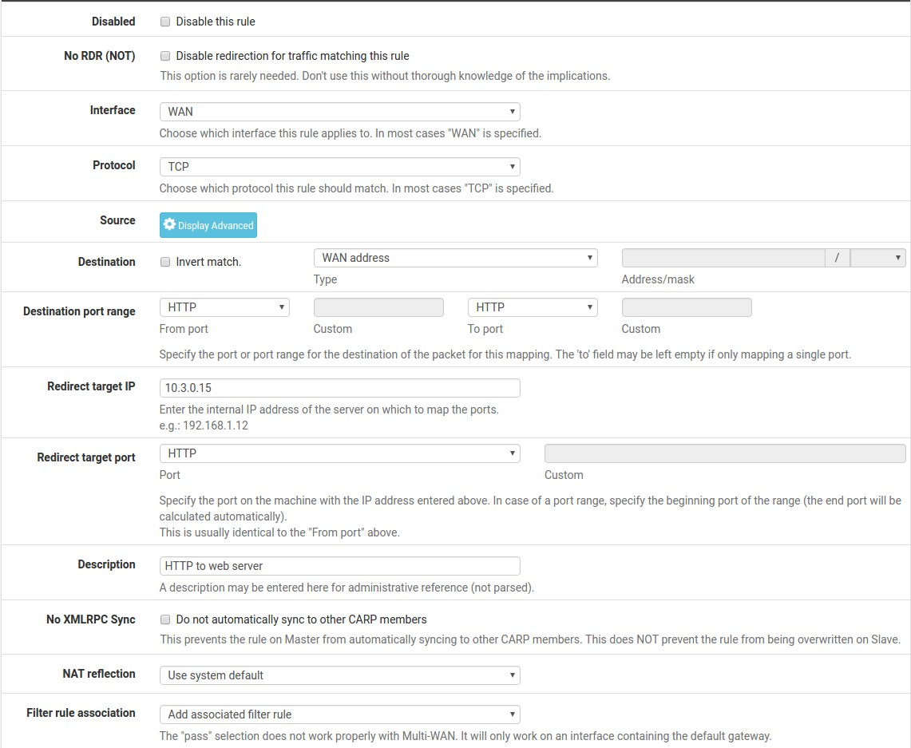
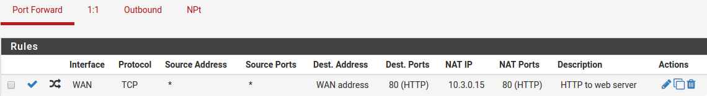

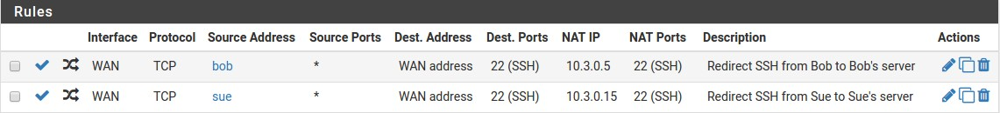
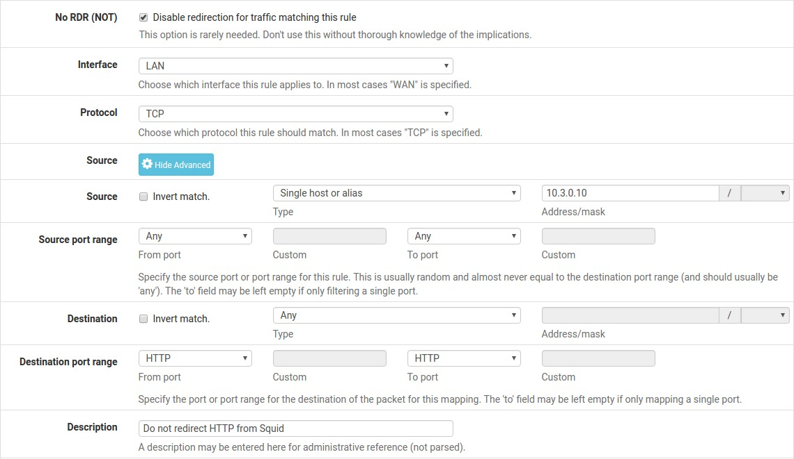
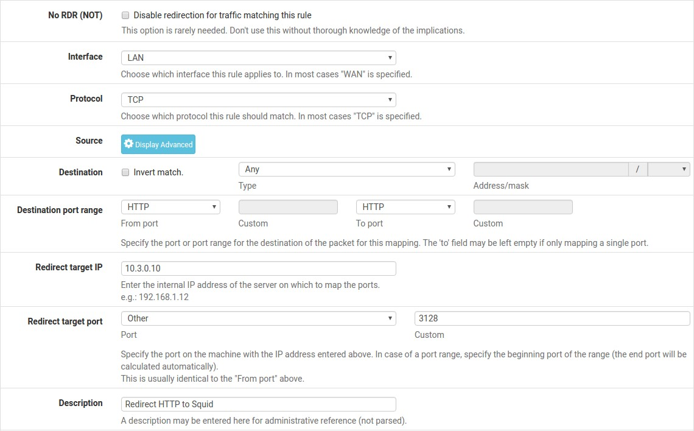
.. |image7| image:: media/image1.png
   :width: 0.26389in
   :height: 0.26389in
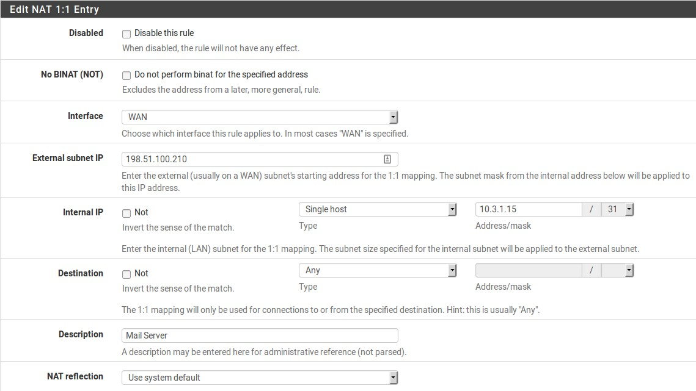
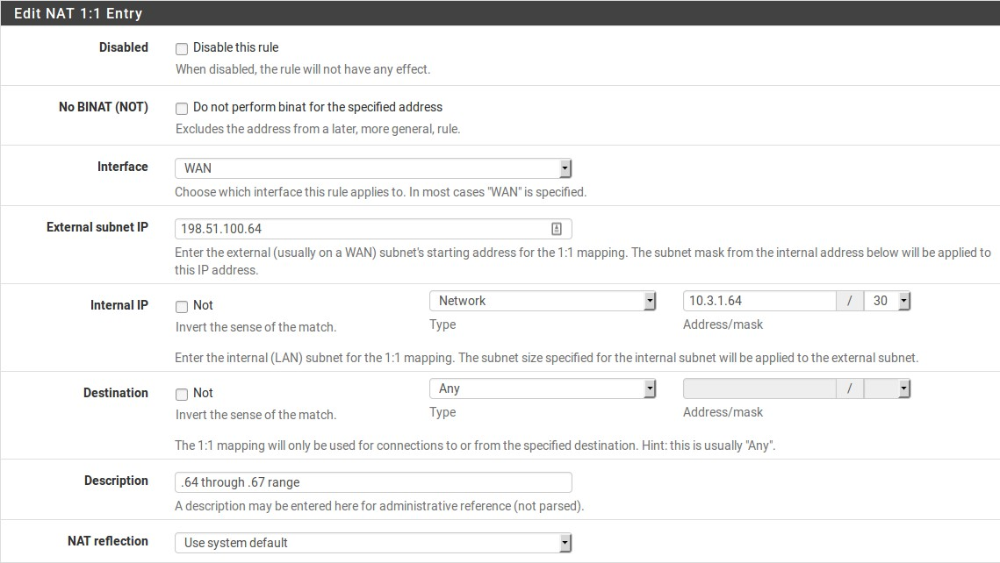
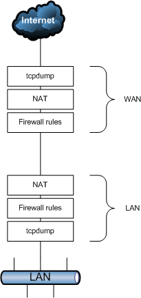

.. |image12| image:: media/image11.png
   :width: 0.26389in
   :height: 0.26389in
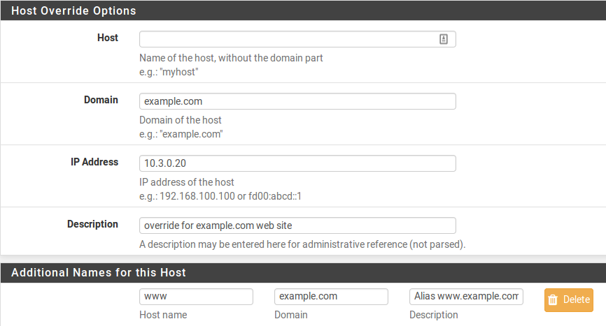

.. |image15| image:: media/image14.png
   :width: 0.26389in
   :height: 0.26389in
.. |image16| image:: media/image1.png
   :width: 0.26389in
   :height: 0.26389in
.. |image17| image:: media/image1.png
   :width: 0.26389in
   :height: 0.26389in
.. |image18| image:: media/image15.png
   :width: 0.26389in
   :height: 0.26389in
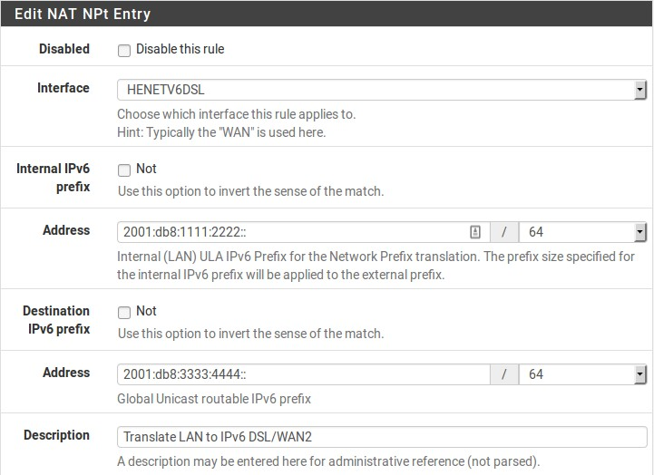
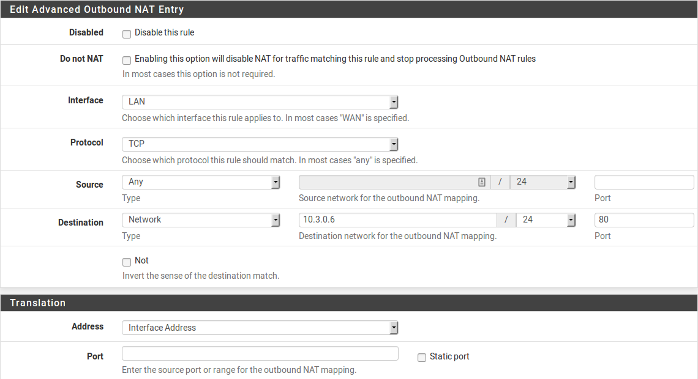
