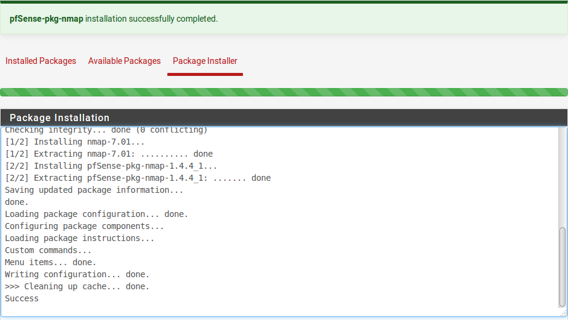

******************
Gestione pacchetti
******************

Installazione dei pacchetti
'''''''''''''''''''''''''''

I pacchetti sono gestiti in **Sistema>Pacchetti**. Gli elenchi lì,
esemplificati dalla figura *Elenco dei pacchetti*, mostra tutte le
informazioni su un pacchetto: nome, categoria, versione e stato, un
collegamento di informazioni sul pacchetto e una breve descrizione.
Mantenere i pacchetti installati al minimo indispensabile per una
distribuzione con una maggiore sicurezza. L'elenco dei pacchetti è
presentato in ordine alfabetico.

| |image0|
| Fig. 1: Elenco dei pacchetti

I pacchetti sono installati come segue:

-  Passare a **Sistema>Pacchetti**
-  Fareclic sulla scheda **Pacchetti disponibili**
-  Individuare il pacchetto da installare nell'elenco

   -  Facoltativamente, cercare un pacchetto immettendo un valore nella casella **Termine di ricerca** e fare clic su |image1| **Ricerca**

-  Cliccare sul pulsante |image2| **Installare** a destra della voce del pacchetto.
-  Clicare su |image3| **Confermare** per procedere con l'installazione del pacchetto

Una volta confermata l'installazione, viene visualizzata la schermata di
installazione del pacchetto in cui viene visualizzato l'avanzamento
dell'installazione (Figura *Schermata pacchetto post-installazione*).

Reinstallazione e aggiornamento dei pacchetti
'''''''''''''''''''''''''''''''''''''''''''''

I pacchetti vengono reinstallati e aggiornati nello stesso modo in cui
sono installati:

-  Passare a **Sistema>Pacchetti**

-  Fare clic sulla scheda **Pacchetti installati**, l'elenco apparirà
   come nella figura *Elenco dei pacchetti installati*

-  Individuare il pacchetto da reinstallare o aggiornare nell'elenco. Se
   è disponibile una versione più recente di quella installata, la
   clonna **Versione del pacchetto** verrà evidenziata indicando la
   vecchia e la nuova versione.

-  Cliccare su |image4| A\ **ggiornare** o |image5| R\ **einstallare**
   il pacchetto.

-  Cliccare su |image6| **Confermare** per procedere con la
   reinstallazione del pacchetto

|image7|

Fig. 2: Schermata pacchetto post-installazione

|image8|\

Fig. 3: Elenco dei pacchetti installati

Disinstallazione dei pacchetti
''''''''''''''''''''''''''''''

Per disinstallare un pacchetto:

-  Passare a **Sistema>Pacchetti**

-  Fare clic sulla scheda **Pacchetti installati**

-  Individua il pacchetto da disinstallare nell'elenco

-  Cliccare su |image9| per rimuovere il pacchetto

-  Cliccare su |image10| **Confermare** per procedere con la rimozione
   del pacchetto

Sviluppo dei pacchetti
''''''''''''''''''''''

Per gli sviluppatori che hanno familiarità con FreeBSD, pkgng e PHP, i pacchetti non sono difficili da creare. Gli utenti finali e le organizzazioni possono trarre vantaggio dallo sviluppo di un pacchetto che non esiste. Per coloro che sono interessati alla creazione di pacchetti, le risorse sono disponibili nel Wiki della documentazione di |firew4ll|, a partire dall’ articolo sullo sviluppo di pacchetti.

Per inviare un nuovo pacchetto, creare una richiesta pull su Github per il repository di |firew4ll| con porte freebsd in modo che il lavoro possa essere valutato per l'inclusione nel sistema dei pacchetti affinché tutti possano vederlo.

Una breve introduzione ai proxy Web e al resoconto: Squid, SquidGuard e Lightsquid
''''''''''''''''''''''''''''''''''''''''''''''''''''''''''''''''''''''''''''''''''

Questa sezione non intende essere una procedura formale, dettagliata e completa per l'utilizzo di Squid e altri software proxy Web correlati, ma una guida rapida per metterli in funzione e coprire le domande più frequenti sulle loro capacità . Questa sezione tratta Squid per la memorizzazione nella cache di pagine Web e attività correlate, SquidGuard per il filtro e il controllo dell'accesso al contenuto Web e Lightsquid per la segnalazione delle attività degli utenti in base ai
registri di accesso a Squid.

Questa discussione presuppone che il firewall abbia una semplice LAN singola e una singola configurazione WAN. Se si verificano problemi durante questa configurazione, visitare la Wiki della documentazione di |firew4ll| e il Forum di |firew4ll| per ulteriore guida e assistenza.

.. seealso:: Per ulteriori informazioni, è possibile accedere all’archivio di Hangout per visualizzare l'hangout di marzo 2014 su Squid, Squid-Guard e Lightsquid.
.. warning:: Il traffico HTTPS non può essere intercettato in modo trasparente in quasi tutti i casi, questa sezione copre solo l'acquisizione trasparente del traffico HTTP. Vedere Proxy trasparenti e HTTP/HTTPS per dettagli.

Cache Proxy Web Squid
=====================

Squid è il fondamento di molte altre attività che iniziano con un proxy:
può fungere da cache per migliorare le prestazioni Web, può agganciarsi
a SquidGuard per il filtraggio dei contenuti e i suoi registri
forniscono la base per i rapporti su dove stanno andando gli utenti
nella rete.

Prima di ogni altra cosa, è necessario installare il pacchetto Squid.
Una volta installato, il pacchetto deve essere configurato. La
configurazione di Squid è suddivisa in diverse schede. Prima di lasciare
una scheda, fai clic su **Salvare**.

Per avviare la configurazione, accedere a **Servizi>Server proxy di
Squid**.

Configurare le impostazioni di Squid come segue, a partire dalla scheda
Generale:

    **Abilitare il proxy Squid** *Selezionato*
    **Mantenere le impostazioni** *Selezionato*
    **Interfacce proxy** *LAN*, *loopback*
    **Consentire gli utenti sull’interfaccia** Selezionato, in modo che gli utenti LAN possano utilizzare il proxy.
    **Proxy HTTP trasparente** Selezionato, quindi il traffico HTTP client verrà intercettato.
    **Ignorare il proxy per la destinazione dell’indirizzo privato** Selezionato, in modo che il traffico locale e la VPN ignorino il proxy.
    **Bypassare il proxy per questi IP di sorgente** Se alcuni indirizzi IP dei client locali devono bypassare il proxy, inserirli in questa casella. Più indirizzi, reti o nomi di alias possono essere inseriti separati da un punto e virgola.
    **Bypass il proxy per questi IP di destinazione** Se alcuni server remoti devono bypassare il proxy, inserirli in questa casella. Più indirizzi, reti o nomi di alias possono essere inseriti separati da un punto e virgola.
    **Abilitare la registrazione degli accessi** Se |firew4ll| è in esecuzione su un'installazione completa (NON incorporata/NanoBSD) e si desidera creare report di accesso Web, selezionare questa     casella.
    **Hostname visibile** Immettere l'hostname del firewall come presentato ai client nei messaggi di errore del proxy.
    **E-mail dell'amministratore** Inserire un indirizzo di contatto utilizzabile. Se un utente rileva un errore proxy, questo verrà mostrato all'utente in modo che possano contattare l'indirizzo per il supporto.

Salvare le impostazioni, quindi passare alla scheda **Cache locale** e configurarla come segue:

    **Dimensione della cache del disco rigido** Impostare questo su un
    valore ragionevole per lo spazio disponibile sull'unità e la RAM. Se
    si esegue NanoBSD, immettere 0 qui.

    **Sistema di cache del disco rigido** Se si esegue NanoBSD,
    impostarlo su null

Altri parametri in questa scheda possono essere modificati in base alle
esigenze per controllare la dimensione degli oggetti da memorizzare
nella cache, la quantità di memoria utilizzabile per la memorizzazione
nella cache e altre impostazioni correlate. Salvare le impostazioni
prima di uscire dalla pagina.

Se ci sono più sottoreti locali dietro un percorso statico sulla LAN,
visitare la scheda **Controllo accessi** e aggiungerle all’elenco
**Sottoreti consentite**.

Dopo aver completato questi passaggi di configurazione, il proxy sarà
attivo e funzionante. Se è in uso la modalità trasparente, caricare un
sito di prova proxy come http://www.lagado.com/proxy-test ora rivelerà
che la richiesta è stata instradata attraverso un proxy.

SquidGuard Controllo e filtro dell'accesso Web
==============================================

Il pacchetto SquidGuard consente filtri URL molto potenti e controllo
degli accessi. Può utilizzare liste nere o elenchi personalizzati di
siti Web e può consentire o negare selettivamente l'accesso a tali siti.
SquidGuard può funzionare su installazioni complete e NanoBSD, ma le
liste nere possono essere utilizzate solo su installazioni complete.
SquidGuard è in grado di fare molto di più di quanto sarà trattato in
questa sezione. Visitare la Wiki della documentazione di |firew4ll| e il
Forum di |firew4ll| per ulteriori informazioni e tutorial correlati.

Per usare SquidGuard:

-  Installare e configurare Squid come descritto nella sezione
   precedente

-  Installare il pacchetto SquidGuard

-  Passare a **Servizi>Filtro proxy** per configurare SquidGuard

Impostazioni generali
---------------------

-  Passare a **Servizi>Filtro proxy di SquidGuard**, scheda
   **Impostazioni generali**

-  Selezionare **Abilitare** per abilitare SquidGuard

-  Fare clic su **Salvare**

-  Selezionare le caselle per abilitare facoltativamente altre
   funzionalità desiderate, come la registrazione degli eventi di
   blocchi e la registrazione degli eventi della GUI

.. note::  Dopo aver salvato le impostazioni su qualsiasi scheda di SquidGuard, tornare sempre alla scheda **Impostazioni generali** e fare clic sul pulsante |image11| **Applicare**. Fino a quando non sarà stata intrapresa tale azione, le nuove impostazioni di SquidGuard non verranno utilizzate.

Blacklist
---------

Le blacklist o liste nere sono elenchi predefiniti di siti in categorie
specifiche, come **siti social**, **siti per adulti**, **siti di
musica** e **siti sportivi**. Per utilizzare le blacklist, selezionare
**Blacklist** e compilare un **URL di blacklist**. Le due liste più
comuni sono elenco MESD e elenco di Shalla.

.. warning:: Le blacklist non funzionano correttamente su NanoBSD. Non tentare di usarli su quella piattaforma.

Prima che la lista nera possa essere utilizzata, deve essere scaricata e
decompressa. Per fare ciò, dopo aver salvato le impostazioni in questa
scheda, visitare la scheda **Blacklist** e fare clic su |image12|
**Scaricare**.

.. warning:: Se vengono utilizzate solo liste nere, SquidGuard potrebbe non funzionare. Definire almeno una categoria target come indicato in Categorie target.

Categorie target
----------------

Le **categorie target** sono elenchi personalizzati di siti o altre
espressioni che definiscono un gruppo di elementi che possono essere
utilizzati per consentire o negare l'accesso. Sono mantenuti nella
scheda **Categorie target**.

Quando si aggiunge una nuova categoria target, sono necessarie alcune
opzioni:

    **Nome** Il nome per la categoria, come apparirà per la selezione su
    ACL. Il nome deve contenere da 2 a 15 caratteri alfanumerici e il
    primo carattere deve essere una lettera.

    **Elenco dei domini** Questo è l'elenco dei nomi di dominio da
    bloccare, come ad esempio www.facebook.com, google.com,
    microsoft.com, ecc. È possibile inserire più domini, separati da uno
    spazio.

    **Modalità di reindirizzamento** Questa opzione controlla cosa
    succede quando un utente viene bloccato da un sito in questo elenco.
    Il valore predefinito *nessuno* non reindirizzerà l'utente.
    L'impostazione più comune è la *pagina di errore interna*.

    **Reindirizzare** Se l'utente viene reindirizzato utilizzando la
    *pagina di errore interna*, immettere qui il messaggio di errore che
    verrà presentato all'utente. Se viene utilizzato un tipo di
    reindirizzamento esterno, immettere l'URL completo per il sito di
    destinazione desiderato, incluso il protocollo appropriato come
    http:// o https://.

Elenchi di accesso (ACL)
------------------------

Esistono due tipi di voci ACL in SquidGuard:

1. ACL comune, che è l'ACL predefinito applicato a tutti gli utenti

2. ACL di gruppo, voci che vengono applicate a specifici indirizzi IP,
   gruppi di indirizzi IP o reti.

Innanzitutto, visitare la scheda **ACL comune**. Scegliere le azioni
predefinite per tutte le categorie disponibili dalle liste nere o quelle
definite localmente. Per fare ciò, fare clic su **Elenco regole di
destinazione** |image13|\ e selezionare le azioni desiderate dall'elenco
a discesa alla fine della riga per ciascuna categoria. La scelta
**Accesso predefinito [tutto]** controlla cosa succede quando non è
stata trovata alcuna corrispondenza in nessuna delle categorie
disponibili.

Dopo aver salvato le impostazioni, passare alla scheda **ACL** **di
gruppo** per creare una voce per un utente o un gruppo di utenti
specifici. Utilizzando un ACL di gruppo, è possibile creare un'eccezione
alle regole ACL comuni, sia per bloccare l'accesso a un sito che altri
possono raggiungere, sia per consentire l'accesso a un sito che altri
non possono visualizzare.

Per creare un **ACL di gruppo**:

-  Passare alla scheda ACL di gruppo

-  Cliccare su |image14| **Aggiungere** per iniziare una nuova voce e
   configurarla come segue:

    **Nome** Il nome dell'ACL

    **Cliente (sorgente)** Immettere l'indirizzo IP dell'utente, la
    sottorete, ecc. È possibile inserire più valori, separati da spazi.

    **Elenco delle regole target** Definisce l'elenco delle azioni per
    questo specifico set di utenti

-  Fare clic su **Salvare**

-  Tornare alla scheda **Impostazioni generali**

-  Fare clic su **Applicare**

Report degli accesso Web con Lightsquid
=======================================

Lightsquid viene utilizzato per creare report che descrivono in
dettaglio la cronologia Web dei computer che hanno avuto accesso ai siti
tramite il proxy. Dopo aver installato il pacchetto Lightsquid, le
impostazioni del rapporto sono disponibili in **Stato>Rapporti del proxy
squid**.

.. warning:: Questa funzione non è compatibile con le installazioni incorporate/NanoBSD senza modifiche manuali che vanno oltre ciò che la maggior parte degli utenti è in grado di eseguire.

L'aspetto dei report può essere personalizzato scegliendo la lingua, il
colore della barra e lo schema dei report. L'opzione **Aggiornare il
pianificatore** controlla la frequenza con cui il report verrà
aggiornato automaticamente, ad esempio ogni 30 minuti.

Fare clic su **Salvare** per memorizzare le impostazioni, quindi fare
clic su |image15|\ **Aggiornare completamente** per compilare il
rapporto iniziale. Attendere qualche minuto, quindi fare clic
su\ |image16| **Aprire Lightsquid** per visualizzare il rapporto.

Se nel report non sono presenti dati, verificare che **Abilitare la
registrazione** sia impostato su Squid e che il traffico degli utenti
stia attraversando il proxy come previsto.

Proxy trasparenti e HTTP/HTTPS
================================

Quando si utilizza un proxy, è possibile intercettare il traffico
**HTTP** in modo trasparente. Cioè, solo il traffico HTTP può essere
acquisito automaticamente e forzato attraverso un proxy senza
l'intervento dell'utente o delle sue conoscenze. Questo è conveniente,
poiché non richiede la configurazione di alcuna impostazione sul PC
dell'utente. Il rovescio della medaglia è che **solo questo traffico
HTTP** può essere catturato usando questo metodo; non è possibile
intercettare HTTPS allo stesso modo.

Il tentativo di intercettare in modo trasparente HTTPS interromperebbe
la catena di fiducia creata da SSL, facendo sì che l'utente venisse
accolto con un avviso di certificato spaventoso quando tentava di
accedere a un sito sicuro. Questo avviso sarebbe valido in quel caso,
poiché il proxy sta essenzialmente eseguendo un attacco
man-in-the-middle al fine di ispezionare il traffico dell'utente.

Il pacchetto proxy Squid è in grado di intercettare HTTPS, ma non può
essere fatto completamente senza la conoscenza dell'utente o alterazioni
del proprio computer. Come minimo, l'intercettazione di HTTPS richiede
l'installazione di una CA di root attendibile creata a tale scopo, in
modo che possa sembrare che il proxy utilizzi certificati validi.

Il metodo migliore consiste nel posizionare le impostazioni proxy nel
computer dell'utente e/o nel software del browser. Questa attività può
essere eseguita manualmente, tramite GPO su un dominio Windows, tramite
DHCP o automaticamente tramite WPAD. I dettagli di questi vanno oltre lo
scopo di questo libro, ma ci sono informazioni su molte di quelle
tattiche sulla Wiki della documentazione di |firew4ll| e sul Forum di
|firew4ll|.

Il sistema di pacchetti |firew4ll| offre la possibilità di estendere
|firew4ll| senza aggiungere rigonfiamento e potenziali vulnerabilità della
sicurezza alla distribuzione di base. I pacchetti sono supportati su
installazioni complete e un set ridotto di pacchetti è disponibile su
installazioni integrate basate su NanoBSD.

.. note::  le installazioni di NanoBSD hanno la capacità di eseguire
alcuni pacchetti, ma a causa della natura della piattaforma e delle sue
restrizioni di scrittura su disco, alcuni pacchetti non funzioneranno e
quindi non sono disponibili per l'installazione su quella piattaforma.

Per vedere i pacchetti disponibili per l'attuale piattaforma firewall
utilizzata, selezionare **Sistema>Pacchetti**, sulla scheda **Pacchetti
disponibili**.

Introduzione ai pacchetti
'''''''''''''''''''''''''

Molti dei pacchetti sono stati scritti dalla comunità |firew4ll| e non dal
team di sviluppo |firew4ll|. I pacchetti disponibili variano abbastanza
ampiamente e alcuni sono più maturi e ben mantenuti di altri. Esistono
pacchetti che installano e forniscono un'interfaccia GUI per software di
terze parti, come Squid, e altri che estendono le funzionalità di
|firew4ll| stesso, come il pacchetto Utilità di esportazione del client di
OpenVPN (OpenVPN Client Export Utility) che crea automaticamente file di
configurazione VPN.

Di gran lunga il pacchetto più popolare disponibile per |firew4ll| è il
server proxy di Squid (Squid Proxy Server). Viene installato più del
doppio delle volte rispetto al prossimo pacchetto più popolare:
Squidguard, che è un filtro per i contenuti che funziona con Squid per
controllare l'accesso alle risorse Web da parte degli utenti. Non
sorprende che il terzo pacchetto più popolare sia Lightsquid, che è un
pacchetto di analisi del registro di Squid che riporta i siti Web
visitati dagli utenti dietro il proxy.

Alcuni altri esempi di pacchetti disponibili (che non sono correlati a
Squid) sono:

-  Monitoraggi della larghezza di banda che mostra il traffico per
   indirizzo IP come ntopng e Darkstat.

-  Servizi extra come FreeRADIUS.

-  Proxy per altri servizi come SIP e FTP e proxy inversi per HTTP o
   HTTPS come HAProxy.

-  Utilità di sistema come NUT per il monitoraggio di un UPS.

-  Utilità di terze parti popolari come nmap, iperf e arping.

-  BGP Routing, routing OSPF, cron editing, agente Zabbix e molti, molti
   altri.

-  Alcuni elementi che in precedenza erano nel sistema di base ma
   venivano spostati in pacchetti, come RIP (instradato)

Al momento della stesura di questo articolo ci sono più di 40 diversi
pacchetti disponibili; troppi per coprirli tutti in questo libro!
L'elenco completo dei pacchetti che possono essere installati su un
determinato sistema è disponibile all'interno di qualsiasi sistema
|firew4ll| passando a **Sistema>Pacchetti**.

Il caricamento della schermata dei pacchetti potrebbe richiedere un po’
più di tempo rispetto ad altre pagine nell'interfaccia web. Questo
perché il firewall recupera le informazioni sul pacchetto dai server dei
pacchetti |firew4ll| prima che la pagina venga visualizzata per fornire le
informazioni sul pacchetto più aggiornate. Se il firewall non dispone di
una connessione Internet funzionale inclusa la risoluzione DNS, il
processo non riuscirà e attiverà una notifica. Se le informazioni sul
pacchetto sono state recuperate in precedenza, verranno visualizzate
dalla cache, ma le informazioni saranno obsolete. Questo di solito è
causato da una configurazione del server DNS mancante o errata. Per le
connessioni IP statiche, verificare che i server DNS funzionanti siano
immessi nella pagina **Sistema>Impostazione generale**. Per quelli con
connessioni assegnate dinamicamente, assicurarsi che i server DNS
assegnati dall'ISP funzionino.

.. |image2| image:: media/image3.png
   :width: 0.25625in
   :height: 0.25625in
.. |image3| image:: media/image4.png
   :width: 0.25625in
   :height: 0.25625in
.. |image4| image:: media/image5.png
   :width: 0.25625in
   :height: 0.25625in
.. |image5| image:: media/image6.png
   :width: 0.25625in
   :height: 0.25625in
.. |image6| image:: media/image4.png
   :width: 0.25625in
   :height: 0.25625in

.. |image9| image:: media/image9.png
   :width: 0.25625in
   :height: 0.25625in
.. |image10| image:: media/image4.png
   :width: 0.25625in
   :height: 0.25625in
.. |image11| image:: media/image4.png
   :width: 0.25625in
   :height: 0.25625in
.. |image12| image:: media/image10.png
   :width: 0.25625in
   :height: 0.25625in
.. |image13| image:: media/image11.png
   :width: 0.25625in
   :height: 0.25625in
.. |image14| image:: media/image3.png
   :width: 0.25625in
   :height: 0.25625in
.. |image15| image:: media/image6.png
   :width: 0.25625in
   :height: 0.25625in
.. |image16| image:: media/image12.png
   :width: 0.25625in
   :height: 0.25625in
