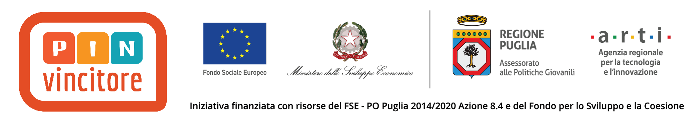

**********
Prefazione
**********

**Firew4LL-OS** è un sistema operativo basato su **FreeBSD** e derivante
dal fork di *pfSense*, completamente tradotto in italiano, tranne
che nei termini prettamente tecnici, corredato da documentazione
anch'essa in italiano.

Con Firew4ll-OS si può implementare un firewall in poche ore.

     **– Francesco Pellegrino (InSecureNet SRL) -**

.. tip:: Grazie al lavoro di |insecurenet| è disponibile all'indirizzo: https://www.insecurelab.it/hackzionario un progetto per la semplificazione dei termini informatici.

.. toctree::
   :maxdepth: 1

   copyright
   commenti

   :maxdepth: 3

|image1|

Nato grazie anche al supporto del |pin| (Pugliesi INnovativi) della |regionepuglia|.

|image2|

.. |image2| image:: img/pin2.png
      :align: center
