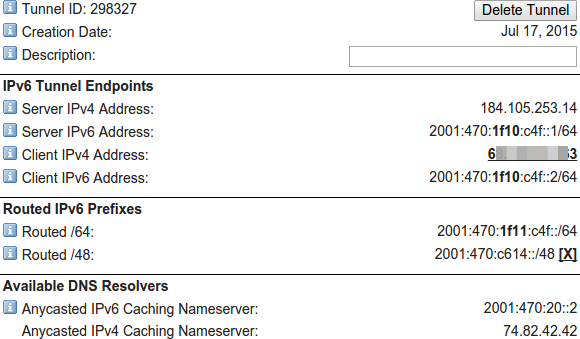
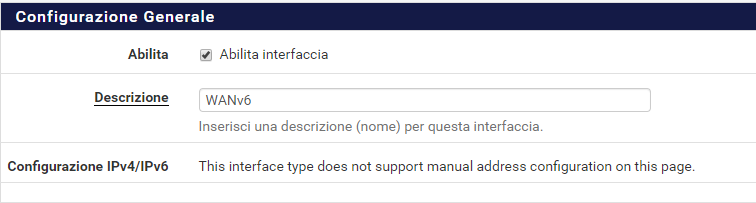

****
Rete
****

Conoscere gli indirizzi IP pubblici e privati
'''''''''''''''''''''''''''''''''''''''''''''

Indirizzi IP privati
====================

Lo standard di rete RFC 1918 definisce le sottoreti IPv4 riservate per il solo uso nelle reti private (Tabella *RFC 1918 Spazio indirizzi IP privati*). RFC 4193 definisce gli indirizzi locali univoci (ULA) per IPv6 (Tabella *RFC 4193 Spazio degli indirizzi locali univoci*). Nella maggior parte degli ambienti, viene scelta e utilizzata una sottorete IP privata di RFC 1918 su tutti i dispositivi di rete interni. I dispositivi vengono quindi collegati a Internet tramite un firewall o un router che implementa il software Network Address Translation (NAT), come |firew4ll|. IPv6 viene completamente instradato dalla rete interna senza NAT dal Global Unicast Addresses (GUA). NAT sarà spiegato ulteriormente nella *traduzione degli indirizzi di rete*.

Tabella 1: Spazio degli indirizzi IP privati RFC 1918

+-------------------+---------------------------------+
| Intervallo CIDR   | Intervallo indirizzi IP         |
+===================+=================================+
| 10.0.0.0/8        | 10.0.0.0 - 10.255.255.255       |
+-------------------+---------------------------------+
| 172.16.0.0/12     | 172.16.0.0 - 172.31.255.255     |
+-------------------+---------------------------------+
| 192.168.0.0/16    | 192.168.0.0 - 192.168.255.255   |
+-------------------+---------------------------------+

Tabella 2: Spazio indirizzi locali univoci RFC 4193

+------------+----------------------------------------------------+
| Prefisso   | Intervallo indirizzi IP                            |
+============+====================================================+
| fc00::/7   | fc00:: - fdff:ffff:ffff:ffff:ffff:ffff:ffff:ffff   |
+------------+----------------------------------------------------+

Un elenco completo di reti IPv4 per uso speciale è disponibile in *RFC 3330*. Esistono indirizzi IPv4 privati, come 1.0.0.0/8 e 2.0.0.0/8, che da allora sono stati allocati nel pool IPv4 in diminuzione. L'uso di questi indirizzi è problematico e sconsigliato. Inoltre, evitare di utilizzare 169.254.0.0/16, che secondo RFC 3927 è riservato per la configurazione automatica "Link-Locale". Non deve essere assegnato da DHCP o impostato manualmente e i router non consentiranno ai pacchetti di quella sottorete di attraversare un dominio di trasmissione specifico. Lo spazio di indirizzi riservato da *RFC 1918* è sufficiente, quindi non è necessario deviare dall'elenco mostrato nella tabella *Spazio degli indirizzi IP privati RFC*. L'indirizzamento errato comporterà un errore di rete e dovrebbe essere corretto.

Indirizzi IP pubblici
=====================

Ad eccezione delle reti più grandi, gli indirizzi IP pubblici sono assegnati dai provider di servizi Internet. Le reti che richiedono centinaia o migliaia di indirizzi IP pubblici hanno comunemente uno spazio di indirizzi assegnato direttamente dal loro registro Internet regionale (RIR). Un RIR è un'organizzazione che supervisiona l'allocazione e la registrazione di indirizzi IP pubblici in determinate regioni del mondo.

Alla maggior parte delle connessioni Internet residenziali viene assegnato un unico indirizzo IPv4 pubblico. Alla maggior parte delle connessioni di classe business sono assegnati più indirizzi IP pubblici. Un singolo indirizzo IP pubblico è adeguato in molte circostanze e può essere utilizzato in collaborazione con NAT per connettere a Internet centinaia di sistemi indirizzati privatamente. Questa guida aiuterà a determinare il numero di indirizzi IP pubblici richiesti.

La maggior parte delle distribuzioni IPv6 fornirà all'utente finale almeno una rete con prefisso /64 da utilizzare come rete interna instradata. Per ogni sito, si tratta di circa 2\ :sup:`64` indirizzi IPv6 o 18 *quintilioni* di indirizzi, completamente instradati in Internet senza necessità di NAT

Indirizzi riservati e documentazione
====================================

Oltre ai blocchi definiti in *RFC 1918*, *RFC 5735* descrive blocchi riservati per altri scopi speciali come documentazione, test e benchmarking. *RFC 6598* aggiorna *RFC 5735* e definisce lo spazio degli indirizzi anche per NAT di livello Carrier.
Queste reti speciali includono:

Tabella 3: Spazio per gli indirizzi riservati RFC 5735

+-------------------+-----------------------------------------------+
| Intervallo CIDR   | Scopo                                         |
+===================+===============================================+
| 192.0.2.0/24      | Documentazione e codice di esempio            |
+-------------------+-----------------------------------------------+
| 198.51.100.0/24   | Documentazione e codice di esempio            |
+-------------------+-----------------------------------------------+
| 203.0.113.0/24    | Documentazione e codice di esempio            |
+-------------------+-----------------------------------------------+
| 198.18.0.0/25     | Analisi comparativa degli indirizzi di rete   |
+-------------------+-----------------------------------------------+
| 100.64.0.0/10     | Spazio per il Nat livello Carrier             |
+-------------------+-----------------------------------------------+

Nella guida, useremo esempi con indirizzi degli intervalli di documentazione (v. sopra) e reti *RFC 1918* poiché sono più familiari agli utenti.

Alcuni trovano questi indirizzi allettanti da utilizzare per VPN o anche reti locali. Non possiamo raccomandare di usarli per scopi diversi da quelli previsti, ma è molto meno probabile che vengano visti "allo stato brado" rispetto alle reti *RFC 1918*.

Concetti delle sottoreti (subnet) IP
''''''''''''''''''''''''''''''''''''

Quando si configurano le impostazioni TCP/IP su un dispositivo, è necessario specificare una subnet mask (o la lunghezza del prefisso per IPv6). Questa maschera consente al dispositivo di determinare quali indirizzi IP si trovano sulla rete locale e quali devono essere raggiunti da un gateway nella tabella di routing del dispositivo. L'indirizzo IP LAN predefinito 192.168.1.1 con una maschera (subnet mask) di 255.255.255.0 o /24 nella notazione CIDR ha un indirizzo network di 192.168.1.0/24. Il CIDR viene discusso in *Informazioni sulla notazione della subnet mask CIDR*.

Configurazione dell'indirizzo IP, della sottorete e del gateway
'''''''''''''''''''''''''''''''''''''''''''''''''''''''''''''''

La configurazione TCP / IP di un host è composta da indirizzo, subnet mask (o lunghezza prefisso per IPv6) e gateway.  L'indirizzo IP combinato con la subnet mask è il **modo** in cui l'host identifica quali indirizzi IP si trovano sulla sua rete locale. Gli indirizzi esterni alla rete locale vengono inviati al gateway predefinito configurato dell'host, che si presume trasferirà il traffico alla destinazione desiderata. Un'eccezione a questa regola è una route statica che indica a un dispositivo di contattare specifiche sottoreti non locali raggiungibili tramite router connessi localmente. Questo elenco di gateway e route statiche viene conservato nella tabella di routing di ciascun host. Per visualizzare la tabella di routing utilizzata da |firew4ll|, vedere *Visualizzare Route*. Ulteriori informazioni sul routing sono disponibili in *Routing*.

In una tipica distribuzione |firew4ll|, agli host vengono assegnati un indirizzo IP, una subnet mask e un gateway all'interno dell'intervallo LAN del dispositivo. L'indirizzo IP LAN su |firew4ll| diventa il gateway predefinito. Per gli host che si connettono tramite un'interfaccia diversa dalla LAN, utilizzare la configurazione appropriata per l'interfaccia a cui è collegato il dispositivo.

Gli host all'interno di una singola rete comunicano direttamente tra loro senza il coinvolgimento del gateway predefinito. Ciò significa che nessun firewall, incluso |firew4ll|, può controllare le comunicazioni da host a host all'interno di un segmento di rete.

Se è richiesta questa funzionalità, gli host devono essere segmentati tramite l'uso di più switch, VLAN o utilizzare funzionalità di switch equivalenti come PVLAN. Le VLAN sono coperte dalla LAN Virtuale (VLAN).

Conoscere e capire la notazione della subnet mask CIDR
''''''''''''''''''''''''''''''''''''''''''''''''''''''

|firew4ll| utilizza la notazione CIDR (Routing dell’intra-dominio senza classe, Classless Inter-Domain Routing) anziché la subnet mask comune 255.x.x.x durante la configurazione di indirizzi e reti. Fare riferimento alla seguente tabella della sottorete CIDR per trovare l'equivalente CIDR di una subnet mask decimale.

Table 4: Tabella delle sottoreti CIDR

+----------------------+-----------------+-----------------------+----------------------+----------------------+
| Maschera sottorete   | Prefisso CIDR   | Indirizzi IP totali   | Indirizzi IP utili   | Numero di reti /24   |
+======================+=================+=======================+======================+======================+
| 255.255.255.255      | /32             | 1                     | 1                    | 1/256                |
+----------------------+-----------------+-----------------------+----------------------+----------------------+
| 255.255.255.254      | /31             | 2                     | 2\*                  | 1/128                |
+----------------------+-----------------+-----------------------+----------------------+----------------------+
| 255.255.255.252      | /30             | 4                     | 2                    | 1/64                 |
+----------------------+-----------------+-----------------------+----------------------+----------------------+
| 255.255.255.248      | /29             | 8                     | 6                    | 1/32                 |
+----------------------+-----------------+-----------------------+----------------------+----------------------+
| 255.255.255.240      | /28             | 16                    | 14                   | 1/16                 |
+----------------------+-----------------+-----------------------+----------------------+----------------------+
| 255.255.255.224      | /27             | 32                    | 30                   | 1/8                  |
+----------------------+-----------------+-----------------------+----------------------+----------------------+
| 255.255.255.192      | /26             | 64                    | 62                   | 1/4                  |
+----------------------+-----------------+-----------------------+----------------------+----------------------+
| 255.255.255.128      | /25             | 128                   | 126                  | 1/2                  |
+----------------------+-----------------+-----------------------+----------------------+----------------------+
| 255.255.255.0        | /24             | 256                   | 254                  | 1                    |
+----------------------+-----------------+-----------------------+----------------------+----------------------+
| 255.255.254.0        | /23             | 512                   | 510                  | 2                    |
+----------------------+-----------------+-----------------------+----------------------+----------------------+
| 255.255.252.0        | /22             | 1024                  | 1022                 | 4                    |
+----------------------+-----------------+-----------------------+----------------------+----------------------+
| 255.255.248.0        | /21             | 2048                  | 2046                 | 8                    |
+----------------------+-----------------+-----------------------+----------------------+----------------------+
| 255.255.240.0        | /20             | 4096                  | 4094                 | 16                   |
+----------------------+-----------------+-----------------------+----------------------+----------------------+
| 255.255.224.0        | /19             | 8192                  | 8190                 | 32                   |
+----------------------+-----------------+-----------------------+----------------------+----------------------+
| 255.255.192.0        | /18             | 16,384                | 16,382               | 64                   |
+----------------------+-----------------+-----------------------+----------------------+----------------------+
| 255.255.128.0        | /17             | 32,768                | 32,766               | 128                  |
+----------------------+-----------------+-----------------------+----------------------+----------------------+
| 255.255.0.0          | /16             | 65,536                | 65,534               | 256                  |
+----------------------+-----------------+-----------------------+----------------------+----------------------+
| 255.254.0.0          | /15             | 131,072               | 131,070              | 512                  |
+----------------------+-----------------+-----------------------+----------------------+----------------------+
| 255.252.0.0          | /14             | 262,144               | 262,142              | 1024                 |
+----------------------+-----------------+-----------------------+----------------------+----------------------+
| 255.248.0.0          | /13             | 524,288               | 524,286              | 2048                 |
+----------------------+-----------------+-----------------------+----------------------+----------------------+
| 255.240.0.0          | /12             | 1,048,576             | 1,048,574            | 4096                 |
+----------------------+-----------------+-----------------------+----------------------+----------------------+
| 255.224.0 0          | /11             | 2,097,152             | 2,097,150            | 8192                 |
+----------------------+-----------------+-----------------------+----------------------+----------------------+
| 255.192.0.0          | /10             | 4,194,304             | 4,194,302            | 16,384               |
+----------------------+-----------------+-----------------------+----------------------+----------------------+
| 255.128.0.0          | /9              | 8,388,608             | 8,388,606            | 32,768               |
+----------------------+-----------------+-----------------------+----------------------+----------------------+
| 255.0.0.0            | /8              | 16,777,216            | 16,777,214           | 65,536               |
+----------------------+-----------------+-----------------------+----------------------+----------------------+
| 254.0.0.0            | /7              | 33,554,432            | 33,554,430           | 131,072              |
+----------------------+-----------------+-----------------------+----------------------+----------------------+
| 252.0.0.0            | /6              | 67,108,864            | 67,108,862           | 262,144              |
+----------------------+-----------------+-----------------------+----------------------+----------------------+
| 248.0.0.0            | /5              | 134,217,728           | 134,217,726          | 1,048,576            |
+----------------------+-----------------+-----------------------+----------------------+----------------------+
| 240.0.0.0            | /4              | 268,435,456           | 268,435,454          | 2,097,152            |
+----------------------+-----------------+-----------------------+----------------------+----------------------+
| 224.0.0.0            | /3              | 536,870,912           | 536,870,910          | 4,194,304            |
+----------------------+-----------------+-----------------------+----------------------+----------------------+
| 192.0.0.0            | /2              | 1,073,741,824         | 1,073,741,822        | 8,388,608            |
+----------------------+-----------------+-----------------------+----------------------+----------------------+
| 128.0.0.0            | /1              | 2,147,483,648         | 2,147,483,646        | 16,777,216           |
+----------------------+-----------------+-----------------------+----------------------+----------------------+
| 0.0.0.0              | /0              | 4,294,967,296         | 4,294,967,294        | 33,554,432           |
+----------------------+-----------------+-----------------------+----------------------+----------------------+

.. note:: L'uso di reti /31 è un caso speciale definito da RFC in cui i due indirizzi IP nella sottorete sono utilizzabili per collegamenti punto-punto per conservare lo spazio degli indirizzi IPv4. Non tutti i sistemi operativi supportano RFC 3021, quindi va usato con cautela. Sui sistemi che non supportano RFC 3021, la sottorete è inutilizzabile perché gli unici due indirizzi definiti dalla subnet mask sono la route e la trasmissione nulla e nessun indirizzo host utilizzabile.

|firew4ll| 0.1-RELEASE-p3 supporta l'uso di reti /31 per interfacce e indirizzi IP virtuali

Quindi da dove provengono i numeri CIDR?
========================================

Il numero CIDR è ottenuto da quelli della subnet mask convertiti in binario.

La subnet mask comune 255.255.255.0 è 11111111.11111111.11111111.00000000 in binario. Questo aggiunge fino a
24, o /24 (pronunciato "barra ventiquattro").

Una subnet mask di 255.255.255.192 è 11111111.11111111.11111111.11000000 in binario o 26 unità, quindi /26.

Riepilogo CIDR
''''''''''''''

Oltre a specificare le maschere di sottorete, il CIDR può essere utilizzato anche per scopi di riepilogo IP o di rete. La colonna "Indirizzi IP totali" nella *tabella delle sottoreti CIDR* indica quanti indirizzi sono riepilogati da una determinata maschera CIDR. Ai fini del riepilogo delle reti, è utile la colonna "Numero di reti /24". Il CIDR verrà utilizzato in diverse parti dell'interfaccia Web di |firew4ll|, tra cui regole firewall, NAT, IP virtuali, IPsec e route statiche.

Gli indirizzi IP o le reti, che possono essere contenuti all'interno di una singola maschera CIDR, sono noti come "riepilogo CIDR".

Quando si progetta una rete, assicurarsi che tutte le sottoreti IP private in uso in una determinata posizione siano riassumibili in CIDR.
Ad esempio, se sono richieste tre sottoreti /24 in una posizione, è necessario utilizzare una rete /22 come sottorete in quattro reti /24.
La tabella seguente mostra le quattro sottoreti /24 utilizzate con la sottorete 10.70.64.0/22.

Tabella 5: Riepilolo delle route CIDR

+------------------------------------+
| 10.70.64.0/22 divisi in reti /24   |
+====================================+
| 10.70.64.0/24                      |
+------------------------------------+
| 10.70.65.0/24                      |
+------------------------------------+
| 10.70.66.0/24                      |
+------------------------------------+
| 10.70.67.0/24                      |
+------------------------------------+

Ciò mantiene il routing più gestibile per le reti multi-sito connesse a un'altra posizione fisica tramite l'uso di un circuito WAN privato o VPN. Con le sottoreti riepilogabili CIDR, una destinazione del percorso copre tutte le reti in ciascuna posizione. Senza di essa, ci sono diverse reti di destinazione diverse per posizione.

La tabella precedente è stata sviluppata utilizzando un calcolatore di rete disponibile sul sito Web https://www.subnetmask.info.

La calcolatrice converte da decimale puntato a maschera CIDR e viceversa, come mostrato nella figura *Convertitore subnet mask*. Se la *tabella delle sottoreti CIDR* fornita in questo capitolo non è disponibile, questo strumento può essere utilizzato per
convertire un prefisso CIDR in notazione decimale puntata.
Immettere un prefisso CIDR o una maschera decimale punteggiata e fare clic sul pulsante Calcola per trovare la conversione.

|image0|

Fig. 1: Convertitore subnet mask

Immettere la maschera decimale con i punti nella sezione Calcolatore di  rete/ nodo insieme a una delle reti /24. Cliccare su **Calcolare** per  riempire le caselle inferiori con l'intervallo coperto da quel particolare /24, come mostrato in Figura *Calcolatore di rete/ nodo*. In  questo esempio, l'indirizzo di rete è 10.70.64.0/22 e le reti  utilizzabili /24 sono da 67. Il termine "Indirizzo di trasmissione" in  questa tabella indica l'indirizzo più alto.

|image1|

Fig. 2: Calcolatore di rete/nodo

Trovare una rete CIDR corrispondente
====================================

Gli intervalli IPv4 nel formato x.x.x.x-y.y.y.y sono supportati negli   alias. Per gli alias di tipo rete, un intervallo IPv4 viene  automaticamente convertito nel set equivalente di blocchi CIDR. Per gli  alias di tipo Host, un intervallo viene convertito in un elenco di
indirizzi IPv4. Vedere *Alias* per maggiori informazioni.

Se non è necessaria una corrispondenza esatta, è possibile inserire
numeri nel calcolatore di rete/nodo per approssimare il riepilogo
desiderato.

Domini broadcast
''''''''''''''''

Un dominio broadcast è la parte di una rete che condivide lo stesso segmento di livello una rete con un singolo switch senza VLAN, il dominio di trasmissione è l'intero switch. In una rete con più switch interconnessi senza l'uso di VLAN, il dominio di trasmissione include tutti questi switch.

Un singolo dominio di trasmissione *può* contenere più di una sottorete IPv4 o IPv6, che generalmente non è considerata un buon progetto di rete. Le sottoreti IP devono essere separate in domini di trasmissione separati tramite switch o VLAN separati. L'eccezione è l'esecuzione di reti IPv4 e IPv6 all'interno di un singolo dominio di trasmissione.
Questo processo si chiama dual stack ed è una tecnica comune e utile che utilizza la connettività IPv4 e IPv6 per gli host.

I domini di trasmissione possono essere combinati collegando insieme due interfacce di rete, ma è necessario prestare attenzione per evitare loop di commutazione. Esistono anche alcuni proxy per determinati protocolli che non combinano domini di trasmissione ma producono lo stesso effetto di rete, come un relè DHCP che inoltra le richieste DHCP in un dominio di trasmissione su un'altra interfaccia. Ulteriori informazioni sui domini di trasmissione e su come combinarli sono disponibili in *Bridging*.

IPv6
''''

Basi
====

IPv6 consente uno spazio di indirizzi IP esponenzialmente maggiore rispetto a IPv4. IPv4 utilizza un indirizzo a 32 bit, che consente 2\ :sup:`32` o oltre 4 miliardi di indirizzi, meno se vengono rimossi i blocchi riservati considerevoli e gli IP masterizzati dalla sottorete.
IPv6 utilizza un indirizzo a 128 bit, ovvero 2\ :sup:`128` o 3.403 x 10\ :sup:`38` indirizzi IP. La sottorete IPv6 di dimensioni standard definita da IETF è a /64, che contiene 2\ :sup:`64` IP o 18,4 *quintilioni* di indirizzi. L'intero spazio IPv4 può adattarsi più volte all'interno di una tipica sottorete IPv6 con spazio libero.

Uno dei miglioramenti più sottili con IPv6 è che nessun indirizzo IP viene perso nella sottorete. Con IPv4, vengono persi due indirizzi IP per sottorete per tenere conto di una route nulla e per trasmettere l'indirizzo IP. In IPv6, la trasmissione viene gestita tramite gli stessi meccanismi utilizzati per il multicast che coinvolge indirizzi speciali inviati all'intero segmento di rete. Ulteriori miglioramenti includono la crittografia integrata dei pacchetti, dimensioni di pacchetti potenziali maggiori e altri elementi di progettazione che semplificano la gestione di IPv6 da parte dei router a livello di pacchetto.

A differenza di IPv4, tutti i pacchetti vengono instradati in IPv6 senza NAT. Ogni indirizzo IP è direttamente accessibile da un altro a meno che non sia bloccato da un firewall. Questo può essere un concetto molto difficile da comprendere per le persone che sono abituate a far esistere la propria LAN con una specifica sottorete privata e quindi eseguire NAT a qualunque indirizzo esterno.

Esistono differenze fondamentali nel funzionamento di IPv6 rispetto a IPv4, ma principalmente sono solo queste. Alcune cose sono più semplici di IPv4, altre sono leggermente più complicate, ma per la maggior parte sono semplicemente diverse. Le principali differenze si verificano al livello 2 (ARP contro NDP ad esempio) e al livello 3 (indirizzamento
IPv4 vs. IPv6). I protocolli utilizzati ai livelli superiori sono identici; è cambiato solo il meccanismo di trasporto per tali
protocolli. HTTP è ancora HTTP, SMTP è ancora SMTP, ecc.

Considerazioni per Firewall e VPN
=================================

IPv6 ripristina la vera connettività peer-to-peer originariamente in
atto con IPv4, rendendo ancora più importanti i controlli appropriati
del firewall. In IPv4, il NAT è stato utilizzato in modo improprio come
controllo firewall aggiuntivo. In IPv6, il NAT viene rimosso. Le porte
forward non sono più richieste in IPv6, pertanto l'accesso remoto verrà
gestito dalle regole del firewall. È necessario assicurarsi che il
traffico VPN da LAN a LAN crittografato non venga instradato
direttamente al sito remoto. Consulta le *Regole firewall e VPN con
IPv6* per una discussione più approfondita sulle preoccupazioni relative
al firewall IPv6 per quanto riguarda il traffico VPN.

Requisiti
=========

IPv6 richiede una rete abilitata per IPv6. La connettività IPv6 fornita
direttamente da un ISP è l'ideale. Alcuni ISP implementano una
configurazione dual stack in cui IPv4 e IPv6 vengono consegnati
contemporaneamente sullo stesso trasporto. Altri ISP utilizzano tipi di
tunneling o distribuzione per fornire indirettamente IPv6. È anche
possibile utilizzare un fornitore di terze parti come il servizio di
tunnelbroker di Hurricane Electric.

Oltre al servizio, il software deve supportare anche IPv6. |firew4ll|
supporta IPv6 dalla versione 2.1. Anche i sistemi operativi e le
applicazioni client devono supportare IPv6. Molti sistemi operativi e
applicazioni comuni lo supportano senza problemi. Microsoft Windows
supporta IPv6 in stato pronto per la produzione dal 2002 sebbene le
versioni più recenti lo gestiscano molto meglio. OS X supporta IPv6 dal
2001 con la versione 10.1 "PUMA". Sia FreeBSD che Linux lo supportano
nel sistema operativo. La maggior parte dei browser Web e dei client di
posta elettronica supporta IPv6, così come le versioni recenti di altre
applicazioni comuni. Per garantire l'affidabilità, è sempre utile
utilizzare gli ultimi aggiornamenti.

Alcuni sistemi operativi mobili hanno diversi livelli di supporto per
IPv6. Android e iOS supportano entrambi IPv6, ma Android supporta solo
la configurazione automatica senza stato per ottenere un indirizzo IP e
non DHCPv6. IPv6 fa parte delle specifiche LTE, quindi qualsiasi
dispositivo mobile che supporta reti LTE supporta anche IPv6.

Tipi di WAN IPv6
================

I dettagli sono disponibili nei *tipi di WAN IPv6*, ma alcuni dei modi
più comuni per distribuire IPv6 sono:

- **Indirizzamento statico** Nativo e utilizzo di IPv6 da solo o in una configurazione a doppio stack insieme a IPv4.
- **DHCPv6** Indirizzo ottenuto automaticamente da DHCPv6 a un server upstream. La delega del prefisso può anche essere utilizzata con DHCPv6 per recapitare una sottorete indirizzata a un client DHCPv6.
- **(SLAC)Configurazione automatica dell'indirizzo senza stato** Determina automaticamente l'indirizzo IPv6 consultando i messaggi d’annuncio del router e generando un indirizzo IP all'interno di un prefisso. Questo non è molto utile per un router, in quanto non è possibile instradare una rete per "l'interno" del firewall. Può essere utile per le modalità dell'appliance.
- **Tunnel 6RD** Metodo di tunneling del traffico IPv6 all'interno di    IPv4. Viene utilizzato dagli ISP per una rapida implementazione di IPv6.
- **Tunnel 6to4** Simile al 6RD ma con diversi meccanismi e limitazioni.
- **Tunnel GIF** Tecnicamente non è un tipo di WAN diretto, ma è comunemente usato. Il cliente costruisce un tunnel GIF IPv4 a un
provider per il tunneling del traffico IPv6.

Sebbene non sia tecnicamente un tipo di WAN, la connettività IPv6 può anche essere organizzata su OpenVPN o IPsec con IKEv2. OpenVPN e IPsec in modalità IKEv2 possono trasportare contemporaneamente il traffico IPv4 e IPv6, quindi possono fornire IPv6 su IPv4, anche se con un overhead maggiore rispetto a un tipico broker tunnel che utilizza GIF.
Queste sono buone opzioni per un'azienda che ha IPv6 in un datacenter o in un ufficio principale ma non in una posizione remota.

Formato degli indirizzi
=======================

Un indirizzo IPv6 è composto da 32 cifre esadecimali, in 8 sezioni di 4 cifre ciascuna, separate da due punti. Sembra qualcosa del genere: *1234:5678:90ab:cdef:1234:5678:90ab:cdef*

Gli indirizzi IPv6 hanno diverse scorciatoie che consentono loro di essere compressi in stringhe più piccole seguendo determinate regole.
Se in una sezione sono presenti zero iniziali, è possibile che vengano tralasciati. *0001:0001:0001:0001:0001:0001:0001:0001* potrebbe essere scritto come *1:1:1:1:1:1:1:1*.

È possibile comprimere un numero qualsiasi di parti di indirizzo costituite solo da zero utilizzando *::* ma ciò può essere eseguito una sola volta in un indirizzo IPv6 per evitare ambiguità. Un buon esempio di ciò è l'host locale, comprimendo
*0000:0000:0000:0000:0000:0000:0000:0001* a *::1*. Ogni volta *::* che appare in un indirizzo IPv6, i valori tra tutti sono zero. Un indirizzo IP come *fe80:1111:2222:0000:0000:0000:7777:8888*, può essere rappresentato come *fe80:1111:2222::7777:8888*. Tuttavia,
*fe80:1111:0000:0000:4444:0000:0000:8888* non può essere abbreviato utilizzando *::* più di una volta. Sarebbe o *fe80:1111::4444:0:0:8888* o *fe80:1111:0:0:4444::8888* ma *non può* essere *fe80:1111::4444::8888* perché non c'è modo di dire quanti zero sono stati sostituiti da uno dei due operatori *::* .

Determinazione di uno schema di indirizzamento IPv6
---------------------------------------------------

A causa della maggiore lunghezza degli indirizzi, dell'ampio spazio disponibile anche in una sottorete di base /64 e della possibilità di utilizzare cifre esadecimali, c'è più libertà nel progettare gli indirizzi di rete dei dispositivi.

Sui server che utilizzano più alias di indirizzi IP per host virtuali, jail, ecc., Uno schema di indirizzamento utile consiste nell'utilizzare la settima sezione dell'indirizzo IPv6 per indicare il server. Quindi utilizzare l'ottava sezione per i singoli alias IPv6. Questo raggruppa tutti gli IP in un singolo host riconoscibile. Ad esempio, il server stesso sarebbe *2001:db8:1:1::a:1* e quindi il primo alias IP sarebbe *2001:db8:1:1::a:2*, quindi \* *2001:db8:1:1::a:3*, ecc. Il prossimo
server sarebbe *2001:db8:1:1::b:1* e ripete lo stesso schema.
Ad alcuni amministratori piace divertirsi con i loro indirizzi IPv6 usando lettere esadecimali e numeri/lettere equivalenti per ricavare parole dai loro indirizzi IP. Gli *elenchi di parole esadecimali sul Web* possono essere utilizzati per creare indirizzi IP più memorabili come *2001:db8:1:1::dead:beef*.

Confusione decimale vs esadecimale
----------------------------------

La creazione di indirizzi IPv6 consecutivi con una base esadecimale può causare confusione. I valori esadecimali sono a base differenza dei valori decimali che sono a base 10. Ad esempio, l'indirizzo IPv6 *2001:db8:1:1::9* è seguito da *2001:db8:1:1::a*, *non* *2001:db8:1:1::10*. Andando a destra fino al *2001:db8:1:1::10*, i valori a-f sono stati saltati, lasciando un vuoto. Non sono richiesti schemi di numerazione consecutivi e il loro utilizzo è a discrezione del progettista della rete. Per alcuni è psicologicamente più semplice evitare di usare le cifre esadecimali.

Dato che tutti gli indirizzi IPv4 possono essere espressi in formato IPv6, questo problema si presenta quando si progetta una rete dual stack che mantiene una sezione dell'indirizzo IPv6 uguale alla sua controparte IPv4.

Sottorete IPv6
==============

La sottorete IPv6 è più semplice della IPv4. Ma è anche diversa. Vuoi dividere o combinare una sottorete? Tutto ciò che serve è aggiungere o tagliare le cifre e regolare la lunghezza del prefisso di un multiplo di quattro. Non è più necessario calcolare gli indirizzi di inizio/fine della sottorete, gli indirizzi utilizzabili, il percorso nullo o l'indirizzo di trasmissione.

IPv4 aveva una subnet mask (notazione quadrata tratteggiata) che è stata successivamente sostituita dal mascheramento CIDR. IPv6 non ha una subnet mask ma la chiama lunghezza del prefisso, spesso abbreviata in "Prefisso". La lunghezza del prefisso e il mascheramento CIDR funzionano in modo simile; La lunghezza del prefisso indica quanti bit dell'indirizzo definiscono la rete in cui esiste. Più comunemente, i prefissi utilizzati con IPv6 sono multipli di quattro, come si vede nella tabella *Tabella delle sottoreti IPv6*, ma possono essere qualsiasi numero compreso tra 0 e 128.

L'uso di lunghezze di prefisso in multipli di quattro consente a di distinguere più facilmente le sottoreti IPv6. Tutto ciò che serve per progettare una sottorete più grande o più piccola è regolare il prefisso di multipli di quattro. Per riferimento, vedere la tabella *Tabella delle sottoreti IPv6* che elenca i possibili indirizzi IPv6, nonché il numero di indirizzi IP contenuti all'interno di ciascuna sottorete.

Tabella 6: Tabella delle sottoreti IPv6

+------------+--------------------------------------------+-------------------------------------+-----------------+
| Prefisso   | Esempio della sottorete                    | Indirrizzi IP totali                | # di reti /64   |
+============+============================================+=====================================+=================+
| 4          | x::                                        | 2 124                               | 2 60            |
+------------+--------------------------------------------+-------------------------------------+-----------------+
| 8          | xx::                                       | 2 120                               | 2 56            |
+------------+--------------------------------------------+-------------------------------------+-----------------+
| 12         | xxx::                                      | 2 116                               | 2 52            |
+------------+--------------------------------------------+-------------------------------------+-----------------+
| 16         | xxxx::                                     | 2 112                               | 2 48            |
+------------+--------------------------------------------+-------------------------------------+-----------------+
| 20         | xxxx:x::                                   | 2 108                               | 2 44            |
+------------+--------------------------------------------+-------------------------------------+-----------------+
| 24         | xxxx:xx::                                  | 2 104                               | 2 40            |
+------------+--------------------------------------------+-------------------------------------+-----------------+
| 28         | xxxx:xxx::                                 | 2 100                               | 2 36            |
+------------+--------------------------------------------+-------------------------------------+-----------------+
| 32         | xxxx:xxxx::                                | 2 96                                | 4,294,967,296   |
+------------+--------------------------------------------+-------------------------------------+-----------------+
| 36         | xxxx:xxxx:x::                              | 2 92                                | 268,435,456     |
+------------+--------------------------------------------+-------------------------------------+-----------------+
| 40         | xxxx:xxxx:xx::                             | 2 88                                | 16,777,216      |
+------------+--------------------------------------------+-------------------------------------+-----------------+
| 44         | xxxx:xxxx:xxx::                            | 2 84                                | 1,048,576       |
+------------+--------------------------------------------+-------------------------------------+-----------------+
| 48         | xxxx:xxxx:xxxx::                           | 2 80                                | 65,536          |
+------------+--------------------------------------------+-------------------------------------+-----------------+
| 52         | xxxx:xxxx:xxxx:x::                         | 2 76                                | 4,096           |
+------------+--------------------------------------------+-------------------------------------+-----------------+
| 56         | xxxx:xxxx:xxxx:xx::                        | 2 72                                | 256             |
+------------+--------------------------------------------+-------------------------------------+-----------------+
| 60         | xxxx:xxxx:xxxx:xxx::                       | 2 68                                | 16              |
+------------+--------------------------------------------+-------------------------------------+-----------------+
| 64         | xxxx:xxxx:xxxx:xxxx::                      | 2 64 (18,446,744,073,709,551,616)   | 1               |
+------------+--------------------------------------------+-------------------------------------+-----------------+
| 68         | xxxx:xxxx:xxxx:xxxx:x::                    | 2 60 (1,152,921,504,606,846,976)    | 0               |
+------------+--------------------------------------------+-------------------------------------+-----------------+
| 72         | xxxx:xxxx:xxxx:xxxx:xx::                   | 2 56 (72,057,594,037,927,936)       | 0               |
+------------+--------------------------------------------+-------------------------------------+-----------------+
| 76         | xxxx:xxxx:xxxx:xxxx:xxx::                  | 2 52 (4,503,599,627,370,496)        | 0               |
+------------+--------------------------------------------+-------------------------------------+-----------------+
| 80         | xxxx:xxxx:xxxx:xxxx:xxxx::                 | 2 48 (281,474,976,710,656)          | 0               |
+------------+--------------------------------------------+-------------------------------------+-----------------+
| 84         | xxxx:xxxx:xxxx:xxxx:xxxx:x::               | 2 44 (17,592,186,044,416)           | 0               |
+------------+--------------------------------------------+-------------------------------------+-----------------+
| 88         | xxxx:xxxx:xxxx:xxxx:xxxx:xx::              | 2 40 (1,099,511,627,776)            | 0               |
+------------+--------------------------------------------+-------------------------------------+-----------------+
| 92         | xxxx:xxxx:xxxx:xxxx:xxxx:xxx::             | 2 36 (68,719,476,736)               | 0               |
+------------+--------------------------------------------+-------------------------------------+-----------------+
| 96         | xxxx:xxxx:xxxx:xxxx:xxxx:xxxx::            | 2 32 (4,294,967,296)                | 0               |
+------------+--------------------------------------------+-------------------------------------+-----------------+
| 100        | xxxx:xxxx:xxxx:xxxx:xxxx:xxxx:x::          | 2 28 (268,435,456)                  | 0               |
+------------+--------------------------------------------+-------------------------------------+-----------------+
| 104        | xxxx:xxxx:xxxx:xxxx:xxxx:xxxx:xx::         | 2 24 (16,777,216)                   | 0               |
+------------+--------------------------------------------+-------------------------------------+-----------------+
| 108        | xxxx:xxxx:xxxx:xxxx:xxxx:xxxx:xxx::        | 2 20 (1,048,576)                    | 0               |
+------------+--------------------------------------------+-------------------------------------+-----------------+
| 112        | xxxx:xxxx:xxxx:xxxx:xxxx:xxxx:xxxx::       | 2 16 (65,536)                       | 0               |
+------------+--------------------------------------------+-------------------------------------+-----------------+
| 116        | xxxx:xxxx:xxxx:xxxx:xxxx:xxxx:xxxx:x::     | 2 12 (4,096)                        | 0               |
+------------+--------------------------------------------+-------------------------------------+-----------------+
| 120        | xxxx:xxxx:xxxx:xxxx:xxxx:xxxx:xxxx:xx::    | 2 8 (256)                           | 0               |
+------------+--------------------------------------------+-------------------------------------+-----------------+
| 124        | xxxx:xxxx:xxxx:xxxx:xxxx:xxxx:xxxx:xxx::   | 2 4 (16)                            | 0               |
+------------+--------------------------------------------+-------------------------------------+-----------------+
| 128        | xxxx:xxxx:xxxx:xxxx:xxxx:xxxx:xxxx:xxxx    | 2 0 (1)                             | 0               |
+------------+--------------------------------------------+-------------------------------------+-----------------+

Una /64 è una sottorete IPv6 di dimensioni standard definita dall'IETF. È la sottorete più piccola che può essere utilizzata localmente se si desidera la configurazione automatica.

In genere, un ISP assegna una sottorete /64 o inferiore per stabilire il servizio sulla WAN. Una rete aggiuntiva viene instradata per l'uso della LAN. La dimensione dell'allocazione dipende dall'ISP, ma non è raro vedere gli utenti finali ricevere almeno un /64 e persino fino a /48.

Un fornitore di servizi di tunnel come tunnelbroker.net gestito da Hurricane Electric assegnerà un /48 oltre a un percorso di sottorete /64 e interconnessione a /64.

Le assegnazioni superiori a /64 di solito adottano il primo /64 per LAN e suddividono il resto per requisiti come tunnel VPN, DMZ o una rete ospite.

Sottoreti IPv6 speciali
=======================

Le reti per uso speciale sono riservate a IPv6. Un elenco completo di questi può essere trovato nell'articolo Wikipedia IPv6. Sei esempi di reti speciali IPv6 e i loro indirizzi sono mostrati di seguito in *Reti e indirizzi speciali con IPv6*.

Tabella 7: Reti e indirizzi speciali con IPv6

+-----------------+---------------------------------------------------------------------------------------------+
| Rete            | Scopo                                                                                       |
+=================+=============================================================================================+
| 2001:db8::/32   | Prefisso di documentazione, usato per esempi, come quelli che si trovano in questo libro.   |
+-----------------+---------------------------------------------------------------------------------------------+
| ::1             | Host locale                                                                                 |
+-----------------+---------------------------------------------------------------------------------------------+
| fc00::/7        | Indirizzi locali univoci (ULA), noti anche come indirizzi IPv6 "privati".                   |
+-----------------+---------------------------------------------------------------------------------------------+
| fe80::/10       | Link Indirizzi locali, validi solo all'interno di un singolo dominio di trasmissione.       |
+-----------------+---------------------------------------------------------------------------------------------+
| 2001::/16       | Indirizzi unici globali (Global Unique Addresses, GUA): indirizzi IPv6 instradabili.        |
+-----------------+---------------------------------------------------------------------------------------------+
| ff00::0/8       | Indirizzi multicast                                                                         |
+-----------------+---------------------------------------------------------------------------------------------+

NDP (Neighbor Discovery Protocol)
=================================

Gli host IPv4 si trovano su un segmento locale che usa i messaggi di trasmissione ARP, ma gli host IPv6 si trovano inviando messaggi NDP (Neighbor Discovery Protocol). Come ARP, NDP funziona all'interno di un determinato dominio di trasmissione per trovare altri host all'interno di una sottorete specifica.

Inviando pacchetti ICMPv6 speciali a indirizzi multicast riservati, NDP gestisce le attività di rilevamento dei vicini, sollecitazioni del router e reindirizzamenti del percorso simili ai reindirizzamenti ICMP di IPv4.

|firew4ll| aggiunge automaticamente le regole del firewall su interfacce abilitate per IPv6 che consentono a NDP di funzionare. Tutti gli attuali vicini noti su IPv6 possono essere visualizzati nella GUI del firewall in **Diagnostica>Tabella NDP**.

(RA)Router Advertisements
=========================

I router IPv6 si trovano tramite i messaggi d’annuncio del router (Router Advertisement, RA) anziché tramite il DHCP. I router abilitati per IPv6 che supportano l'assegnazione di indirizzi dinamici dovrebbero annunciarsi sulla rete a tutti i client e rispondere alle richieste del router. Quando agisce come client (interfacce WAN), |firew4ll| accetta i messaggi RA dai router upstream. Quando funge da router, |firew4ll| fornisce messaggi RA ai client sulle sue reti interne. Vedere *Annunci router (oppure: "Dov'è l'opzione gateway DHCPv6")* per maggiori dettagli.

Allocazione dell’indirizzo
==========================

Gli indirizzi client possono essere allocati con indirizzamento statico tramite SLAAC (*Annunci router (oppure: "Dov'è l'opzione gateway DHCPv6")*), DHCP6 (*Server DHCP IPv6 e annunci router*) o altri metodi di tunneling come OpenVPN.

Delega del prefisso DHCP6
-------------------------

La delegazione del prefisso DHCP6 consegna una sottorete IPv6 a un client DHCP6. Un'interfaccia di tipo WAN può essere impostata per ricevere un prefisso su DHCP6 (*DHCP6, interfaccia di traccia*). Un router funzionante ai margini di una rete di grandi dimensioni può fornire la delegazione dei prefissi ad altri router all'interno della rete (*Delegazione dei prefissi DHCPv6*).

IPv6 e NAT
==========

Sebbene IPv6 elimini la maggior parte delle esigenze del NAT, esistono rare situazioni che richiedono l'uso di NAT con IPv6 come Multi-WAN per IPv6 su reti residenziali o di piccole imprese.

Gone è il tipo tradizionale di NAT (PAT) tradotto con brutte porte in cui gli indirizzi interni vengono tradotti usando le porte su un singolo indirizzo IP esterno. È sostituito da una traduzione diretta dell'indirizzo di rete chiamata Traduzione dei prefissi di rete (Network Prefix Translation, NPT). Questo è disponibile in |firew4ll| in **Firewall>NAT** nella scheda NPt. NPt traduce un prefisso in un altro. Quindi *2001:db8:1111:2222::/64* si traduce in \* *2001:db8:3333:4444::/64*. Sebbene il prefisso cambi, il resto dell'indirizzo sarà identico per un determinato host su quella sottorete. Per ulteriori informazioni su NPt, vedere *Traduzione dei prefissi di rete IPv6, (NPt)*.

Esiste un meccanismo integrato in IPv6 per accedere agli host IPv4 utilizzando una notazione di indirizzo speciale, come *::ffff:192.168.1.1*. Il comportamento di questi indirizzi può variare tra sistema operativo e applicazione ed è inaffidabile.

IPv6 e |firew4ll|
=================

Salvo diversamente specificato, si può presumere che IPv6 sia supportato da |firew4ll| in una determinata area o funzionalità.

Alcune aree degne di nota di |firew4ll| che non supportano IPv6 sono: Captive Portal e la maggior parte dei provider DynDNS.

Per consentire IPv6:

-  Passare a ``Sistema>Avanzate`` nella scheda ``Rete``
-  Selezionare ``Consentire IPv6``
-  Fare clic su ``Salvare``

Pacchetti di |firew4ll|
-----------------------

Alcuni pacchetti sono gestiti dalla community, quindi il supporto IPv6 varia. Nella maggior parte dei casi, il supporto IPv6 dipende dalle capacità del software sottostante. È sicuro supporre che un pacchetto non supporti IPv6 se non diversamente specificato. I pacchetti vengono aggiornati periodicamente, pertanto è consigliabile testare un pacchetto per determinare se supporta IPv6.

Connessione con un servizio Tunnel Broker
=========================================

Una posizione che non ha accesso alla connettività IPv6 nativa può ottenerla utilizzando un servizio di broker di tunnel come Hurricane Electric. Un sito principale con IPv6 può fornire la connettività IPv6 a un sito remoto utilizzando un tunnel VPN o GIF.

Questa sezione fornisce la procedura per il collegamento di |firew4ll| con Hurricane Electric (spesso abbreviato in HE.net o HE) per il transito IPv6. L'uso di HE.net è semplice e facile. Consente l'impostazione multi-tunnel, ciascuno con un trasporto /64 e un percorso /64. Inoltre è incluso un instradato /48 da utilizzare con uno dei tunnel. È un ottimo modo per ottenere molto spazio IPv6 indirizzato per sperimentare e imparare, il tutto gratuitamente.

Iscriviti al servizio
---------------------

Prima di poter creare un tunnel, le richieste di eco ICMP devono essere concesse alla WAN. Una regola per passare richieste di eco ICMP da una fonte qualsiasi è una buona misura temporanea. Una volta scelto il punto finale del tunnel per HE.net, la regola può essere resa più specifica.

Per iniziare su HE.net, registrati su www.tunnelbroker.net. Le reti /64 vengono allocate dopo la registrazione e la selezione di un server tunnel IPv6 regionale. Un riepilogo della configurazione del tunnel può essere visualizzato sul sito Web di HE.net come mostrato nella figura *Riepilogo di configurazione del tunnel HE.net*. Contiene informazioni importanti come l'\ **ID tunnel** dell'utente, l'\ **indirizzo IPv4 del server** (indirizzo IP del server tunnel), l'\ **indirizzo IPv4 del client** (l'indirizzo IP esterno del firewall), il **server** e gli **indirizzi IPv6 del client** (che rappresentano gli indirizzi IPv6 all'interno del tunnel), e i **prefissi IPv6 instradati**.

|image2|

Fig. 3: Riepilogo di configurazione del tunnel HE.net

La scheda **Avanzate** sul sito del broker del tunnel ha due ulteriori opzioni degne di nota: un cursore MTU e una chiave di aggiornamento per l'aggiornamento dell'indirizzo del tunnel. Se utilizzata per terminare il tunnel GIF è PPPoE o un altro tipo di WAN con un MTU basso, spostare il cursore verso il basso in base alle esigenze. Ad esempio, un MTU comune per le linee PPPoE con un broker tunnel sarebbe 1452. Se la WAN ha un indirizzo IP dinamico, prendere nota della **chiave di aggiornamento** per un uso successivo in questa sezione.

Una volta completata la configurazione iniziale per il servizio tunnel, configurare |firew4ll| per utilizzare il tunnel.

Permettere il traffico IPv6
---------------------------

Per abilitare il traffico IPv6, procedere come segue:

-  Passare a **Sistema**>\ **Avanzate** nella scheda **Rete**
-  Selezionare **Consentire IPv6** se non è già selezionato
-  Fare clic su **Salvare**

Permettere ICMP
---------------

Le richieste di echo ICMP devono essere consentite sull'indirizzo WAN che sta terminando il tunnel per assicurarsi che sia online e raggiungibile. Se l'ICMP è bloccato, il broker del tunnel potrebbe rifiutare di impostare il tunnel sull'indirizzo IPv4. Modificare la regola ICMP creata in precedenza in questa sezione o creare una nuova regola per consentire le richieste di eco ICMP. Impostare l'indirizzo IP di origine **dell'indirizzo IPv4 del server** nella configurazione del tunnel, come mostrato nella figura *Esempio di regola ICMP* per garantire la connettività.

|image3|

Fig. 4: Esempio di regola ICMP

Creare e assegnare l'interfaccia GIF
------------------------------------

Prossimo passaggio, creare l'interfaccia per il tunnel GIF in |firew4ll|.
Completare i campi con le informazioni corrispondenti dal riepilogo
della configurazione del broker tunnel.

-  Passa a **Interfacce**> (assegnare) nella scheda **GIF**.
-  Fare clic su |image4| **Aggiungi** per aggiungere una nuova voce.
-  Impostare **l'interfaccia primaria** sulla WAN in cui termina il tunnel. Questa sarebbe la WAN che ha l'**indirizzo IPv4 del client** sul broker del tunnel.
-  Impostare **l'indirizzo remoto GIF** in |firew4ll| sull'**indirizzo IPv4 del server** nel riepilogo.
-  Impostare **l'indirizzo locale del tunnel** GIF in |firew4ll| sull'**indirizzo IPv6 del client** nel riepilogo.
-  Impostare **l'indirizzo remoto del tunnel GIF** in |firew4ll| sull'**indirizzo IPv6 del server** nel riepilogo, insieme alla lunghezza del prefisso (in genere /64).
-  Lasciare le opzioni rimanenti vuote o deselezionate.
-  Immettere una **descrizione**.
-  Fare clic su **Salvare**.

Vedere la figura *Esempio di tunnel GIF*.

Se questo tunnel viene configurato su una WAN con un IP dinamico, consultare *Aggiornamento del punto finale del tunnel* per informazioni su come mantenere aggiornato l'IP del punto finale del tunnel con HE.net.

Una volta creato, il tunnel GIF deve essere assegnato:

-  Passare a **Interfacce**> (**assegnare**), scheda **Assegnazioni interfaccia**.
-  Selezionare la GIF appena creata in **Porte di rete disponibili**.
-  Fare clic su |image5|\ **Aggiungere** per aggiungerlo come nuova interfaccia.

|image6|

Fig. 5: Esempio di tunnel GIF

Configurare la nuova interfaccia OPT
------------------------------------

La nuova interfaccia è ora accessibile in **Interfacce**>**OPTx**, dove x dipende dal numero assegnato all'interfaccia.

-  Passare alla pagina di configurazione della nuova interfaccia. (**Interfacce**> **OPTx**)
-  Selezionare **Abilitare interfaccia**.
-  Immettere un nome per l'interfaccia nel campo **Descrizione**, ad esempio *WANv6*.
-  Lasciare il **tipo di configurazione IPv6** come Nessuno.
-  Fare clic su **Salvare**
-  Fare clic su **Applicare modifiche**.

Configurare il gateway IPv6
---------------------------

Quando l'interfaccia è configurata come detto sopra, un gateway IPv6 dinamico viene aggiunto automaticamente, ma non è ancora contrassegnato come predefinito.

-  Passare a **Sistema**> **Routing**
-  Modificare il gateway IPv6 dinamico con lo stesso nome della WAN IPv6 creata sopra.
-  Controllare il **gateway predefinito**.
-  Fare clic su **Salvare**
-  Fare clic su **Applicare modifiche**.

|image7|

Fig. 6: Esempio dell’interfaccia del tunnel

|image8|

Fig. 7: Esempio del gateway del tunnel

Passare a **Stato**> **Gateway** per visualizzare lo stato del gateway. Il gateway verrà visualizzato come "Online" se la configurazione ha esito positivo, come mostrato nella figura *Esempio di stato del tunnel del gateway*.

|image9|

Fig. 8: Esempio di stato del tunnel del gateway

Impostare DNS con IPv6
----------------------

È probabile che i server DNS rispondano alle query DNS con risultati AAAA. Si consiglia di immettere i server DNS forniti dal servizio broker tunnel in **Sistema**>\ **Impostazione generale**. Inserisci almeno un server DNS con IPv6 o utilizza i server DNS con IPv6 pubblici di Google al 2001:4860:4860::8888 e 2001:4860:4860::8844. Se il Resolutore del DNS viene utilizzato in modalità senza inoltro, parlerà automaticamente con i server root IPv6 quando la connettività IPv6 sarà funzionale.

Impostare LAN con IPv6
----------------------

Una volta configurato e online il tunnel, il firewall stesso ha la connettività IPv6. Per garantire che i client possano accedere a Internet su IPV6, è necessario configurare anche

Un metodo consiste nell'impostare come dual stack IPv4 e IPv6.

-  Passare a **Interfacce**>\ **LAN**
-  Selezionare **Tipo di configurazione IPv6** come **IPv6 statico**
-  Immettere un indirizzo IPv6 da **Routed /64** nella configurazione del broker tunnel con una lunghezza prefisso di 64. Ad esempio, *2001:db8:1111:2222::1* per l'indirizzo IPv6 LAN se **Routed /64** è *2001:db8:1111:2222::/64*.
-  Fare clic su **Salvare**
-  Fare clic su **Applicare modifiche**

A /64 dall'interno del Routed /48 è un'altra opzione disponibile.

Impostare annunci del DHCPv6 e/o del router
-------------------------------------------

Per assegnare automaticamente gli indirizzi IPv6 ai client, impostare Annunci router e/o DHCPv6. Questo argomento è trattato in dettaglio in *Annunci server e router DHCP IPv6*.

Una breve panoramica è la seguente:

-  Passare a **Servizi>DHCPv6 Server/RA**
-  Selezionare **Abilitare**
-  Inserire un intervallo di indirizzi IP IPv6 all'interno della nuova sottorete IPv6 LAN
-  Selezionare **Salvare**.
-  Passare alla scheda **Annunci router**
-  Impostare la **modalità** su *Gestito* (solo DHCPv6) o *Assistito* (DHCPv6 + SLAAC)
-  Selezionare **Salvare**.

Le modalità sono descritte più dettagliatamente in *Annunci del router
(oppure: "Dov'è l'opzione gateway DHCPv6*").

Per assegnare manualmente gli indirizzi IPv6 ai sistemi LAN, utilizzare
l'indirizzo IPv6 LAN del firewall come gateway con una lunghezza del
prefisso corrispondente adeguata e selezionare gli indirizzi all'interno
della sottorete LAN

Aggiungere regole firewall
--------------------------

Dopo aver assegnato gli indirizzi LAN, aggiungere le regole del firewall
per consentire il flusso del traffico IPv6.

-  Passare a **Firewall>Regole**, scheda **LAN**.
-  Controllare l'elenco per una regola IPv6 esistente. Se esiste già una regola per il passaggio del traffico IPv6, non è necessaria alcuna azione aggiuntiva.
-  Fare click su |image10| **Aggiungere** per aggiungere una nuova regola in fondo all'elenco
-  Impostare la versione **TCP / IP** su *IPv6*
-  Immettere la sottorete LAN IPv6 come **Origine**
-  Scegli una **destinazione** per *qualsiasi*.
-  Fai clic su **Salvare**
-  Fai clic su **Applicare modifiche**

Per i server abilitati per IPv6 sulla LAN con servizi pubblici, aggiungere le regole del firewall nella scheda per 6 (l'interfaccia GIF assegnata) per consentire al traffico IPv6 di raggiungere i server sulle porte richieste.

Provalo!
--------

Una volta stabilite le regole del firewall, verificare la connettività IPv6. Un buon sito con cui fare una prova è test-ipv6.com. Un esempio dei risultati di output di una corretta configurazione da un client su LAN è mostrato nella figura *Risultati del test IPv6*.

|image11|

Fig. 9: Risultati test IPv6

Aggiornamento dell'endpoint del tunnel
--------------------------------------

Per una WAN dinamica, come DHCP o PPPoE, HE.net può ancora essere utilizzato come broker tunnel. |firew4ll| include un tipo DynDNS che aggiornerà l'indirizzo IP dell'endpoint del tunnel ogni volta che cambia l'IP dell'interfaccia WAN.

Se si desidera DynDNS, può essere configurato come segue:

-  Passare a **Servizi>DynDNS**
-  Fare click su |image12| **Aggiungere** per aggiungere una nuova voce.
-  Impostare il tipo di servizio su HE.net Tunnelbroker.
-  Selezionare WAN come **interfaccia da monitorare**.
-  Immettere l'\ **ID tunnel** dalla configurazione del broker tunnel nel campo **Hostname**.
-  Immettere il **nome utente** per il sito del broker di tunnel.
-  Immettere la **password** o la **chiave di aggiornamento** per il sito del broker di tunnel nel campo **Password**.
-  Immettere una **descrizione**.
-  Fare clic su **Salvare e forzare aggiornamento**.

Se e quando l'indirizzo IP WAN cambia, |firew4ll| si aggiorna
automaticamente il broker del tunnel.

Controllo della preferenza IPv6 per il traffico dal firewall
============================================================

Per impostazione predefinita, |firew4ll| preferirà IPv6 quando configurato. Se il routing IPv6 non funziona ma il sistema lo ritiene, |firew4ll| potrebbe non controllare gli aggiornamenti o scaricare i pacchetti correttamente.

Per modificare questo comportamento, |firew4ll| fornisce un metodo nella GUI per controllare se i servizi sul firewall preferiscono IPv4 su IPv6:

-  Passare a **Sistema**>\ **Avanzate** nella **scheda di Rete**
-  Selezionare **Preferisci utilizzare IPv4 anche se IPv6 è  disponibile**
-  Fai clic su **Salvare**

Una volta salvate le impostazioni, il firewall stesso preferirà IPv4 per la comunicazione in uscita.

In tutto il mondo, la disponibilità di nuovi indirizzi IPv4 è in calo.  La quantità di spazio libero varia a seconda della regione, ma alcuni  hanno già esaurito le allocazioni e altri si stanno rapidamente avvicinando ai loro limiti. Al 31 gennaio 2011, IANA ha assegnato tutto il suo spazio ai registri Internet regionali (RIR). A loro volta, queste allocazioni RIR si sono esaurite in alcune località come APNIC (Asia / Pacifico), RIPE (Europa) e LACNIC (America Latina e Caraibi) per / 8 reti. Sebbene siano ancora disponibili alcune allocazioni più piccole, è sempre più difficile ottenere un nuovo spazio di indirizzi IPv4 in queste aree. ARIN (Nord America) si è esaurito il 24 settembre 2015.  Per tenere conto di ciò, IPv6 è stato creato in sostituzione di IPv4. Disponibile in alcune forme dagli anni '90, fattori come l'inerzia, la complessità e i costi di sviluppo o acquisto di router e software compatibili hanno rallentato la sua diffusione fino agli ultimi anni. Anche allora, è stato piuttosto lento con solo l'8% degli utenti di Google con connettività IPv6 entro luglio 2015.

Nel corso degli anni, il supporto per IPv6 in software, sistemi  operativi e router è migliorato, quindi la situazione è pronta per  migliorare. Tuttavia spetta agli ISP iniziare a fornire agli utenti la  connettività IPv6. È una situazione da 22: i fornitori di contenuti sono  lenti a fornire IPv6 perché pochi utenti ce l'hanno. Nel frattempo, gli  utenti non ce l'hanno perché non c'è molto contenuto IPv6 e ancora meno  contenuto disponibile solo su IPv6. Gli utenti non sanno di averne  bisogno, quindi non richiedono il servizio dai loro ISP.

Alcuni provider stanno sperimentando *Carrier Grade NAT* (CGN) per  estendere ulteriormente le loro reti IPv4. CGN colloca i propri clienti  residenziali IPv4 dietro un altro livello di NAT, rompendo ulteriormente  i protocolli che già non gestiscono uno strato di NAT. I fornitori di  dati mobili lo fanno da tempo, ma le applicazioni che si trovano in  genere sui dispositivi mobili non sono interessate dal momento che  funzionano come se fossero dietro un tipico NAT in stile router SOHO.  Mentre risolve un problema, ne crea altri come osservato quando CGN  viene utilizzato come WAN di un firewall, durante il tethering su un PC  o in alcuni casi tentando di utilizzare una VPN IPsec tradizionale senza  NAT-T o PPTP. Gli ISP che impiegano CGN dovrebbero essere usati solo se  non c'è altra scelta.

Ci sono molti libri e siti Web disponibili con volumi di informazioni  approfondite su IPv6. L'articolo di Wikipedia su IPv6, http://en.wikipedia.org/wiki/IPv6, è un'ottima risorsa per ulteriori informazioni e collegamenti ad altre fonti. Vale la pena utilizzarlo come punto di partenza per ulteriori informazioni su IPv6. Ci sono anche molti buoni libri su IPv6 disponibili, ma fai attenzione ad acquistare libri con recenti revisioni. Nel corso degli anni sono state apportate modifiche alle specifiche IPv6 ed è possibile che il materiale possa essere cambiato dalla stampa del libro.

.. seealso:: Per ulteriori informazioni, puoi accedere all'archivio Hangouts per visualizzare l'Hangout di luglio 2015 su Nozioni di base su IPv6

Questa documentazione non è un'introduzione alle reti ma ci sono alcuni concetti che devono essere affrontati. Per i lettori che non hanno una conoscenza di base del networking, suggeriamo di individuare materiale introduttivo aggiuntivo poiché questo capitolo non fornirà adeguatamente tutte le informazioni necessarie.

I concetti di IPv6 sono introdotti più avanti in *IPv6*. Per chiarezza, gli indirizzi IP tradizionali vengono definiti indirizzi IPv4. Salvo dove diversamente indicato, la maggior parte delle funzioni funzionerà con indirizzi IPv4 o IPv6. Il termine generale indirizzo IP si riferisce a IPv4 o IPv6.

Breve introduzione ai livelli del modello OSI
'''''''''''''''''''''''''''''''''''''''''''''

Il modello OSI ha un framework di rete composto da sette livelli. Questi livelli sono elencati nella gerarchia dal più basso al più alto. Una breve panoramica di ogni livello è descritta di seguito. Ulteriori informazioni sono disponibili in molti testi di rete e su Wikipedia (http://en.wikipedia.org/wiki/OSI_model).

- **Livello 1 - Fisico** Si riferisce al cablaggio elettrico o ottico che trasporta i dati grezzi a tutti i livelli superiori.
- **Livello 2 - Collegamento dati** Il livello di collegamento dati si preoccupa di gestire il collegamento da un pc all'altro appartenenti alla stessa LAN, mediante il *Livello 1*. Questa guida fa spesso riferimento al livello 2 come significato degli switch Ethernet o di altri argomenti correlati come gli indirizzi ARP e MAC.
- **Livello 3 - Livello di rete** I protocolli utilizzati per spostare i dati lungo un percorso da un host all'altro, come IPv4, IPv6, routing, sottoreti ecc.
- **Livello 4 – Livello di Trasporto** Trasferimento dati tra utenti, in genere si riferisce a TCP o UDP o altri protocolli simili.
- **Livello 5 - Livello sessione** Gestisce le connessioni e le sessioni (in genere denominate "finestre di dialogo") tra gli utenti e il modo in cui si collegano e si disconnettono con grazia.
- **Livello 6 - Livello di presentazione** Gestisce qualsiasi conversione tra i formati di dati richiesti dagli utenti come set di caratteri diversi, codifiche, compressione, crittografia, ecc.
- **Livello 7 - Livello applicazione** Interagisce con l'utente o l'applicazione software, include protocolli familiari come HTTP, SMTP, SIP, ecc.

.. |image4| image:: media/image5.png
   :width: 0.27778in
   :height: 0.27778in

.. |image5| image:: media/image5.png
   :width: 0.26389in
   :height: 0.26389in

.. |image10| image:: media/image10.png
   :width: 0.26389in
   :height: 0.26389in

.. |image12| image:: media/image5.png
   :width: 0.26389in
   :height: 0.26389in
   
