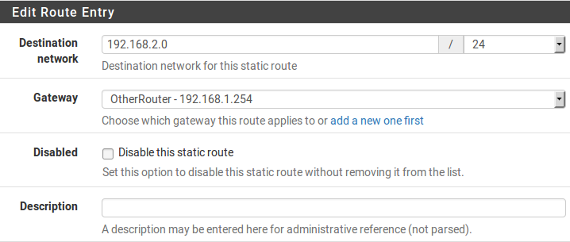
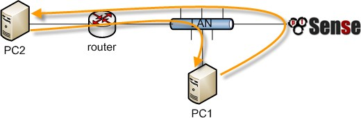
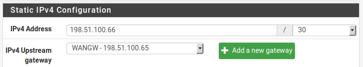
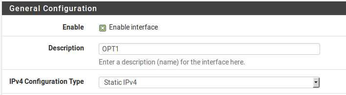
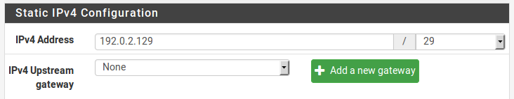
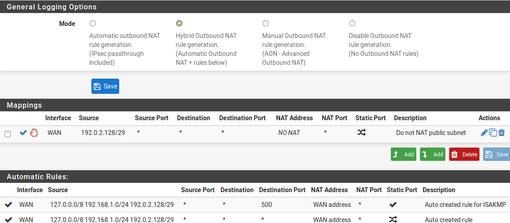
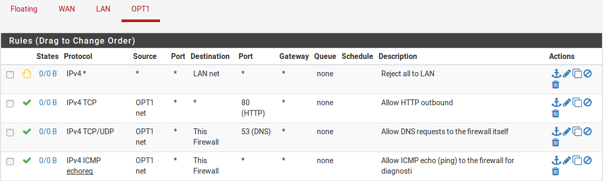
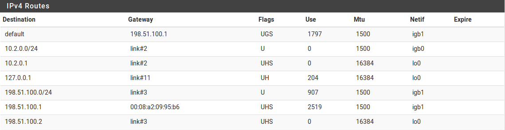

*******
Routing
*******

Gateway
'''''''

I gateway sono la chiave dell'instradamento; sono sistemi attraverso i
quali altre reti possono essere raggiunte. Il tipo di gateway con cui la
maggior parte delle persone ha familiarità è un gateway predefinito,
ovvero il router attraverso il quale un sistema si connetterà a Internet
o ad altre reti che non ha un percorso più specifico da raggiungere. I
gateway sono utilizzati anche per il routing statico, dove altre reti
devono essere raggiunte attraverso specifici router locali. Nella
maggior parte delle reti normali, i gateway si trovano sempre nella
stessa sottorete di una delle interfacce di un sistema. Per esempio, se
un firewall ha un indirizzo IP come 192.168. 22.5/24, allora un gateway
ad un'altra rete dovrebbe essere da qualche parte all'interno di
192.168.22.x se l'altra rete è raggiungibile attraverso
quell'interfaccia. Una notevole eccezione a questo sono le interfacce
point-to-point come quelle utilizzate nei protocolli basati su PPP, che
spesso hanno indirizzi IP di gateway in un'altra sottorete perché non
sono utilizzati nello stesso modo.

Famiglie degli indirizzi gateway (IPv4 e IPv6)
==============================================

Quando si lavora con l'instradamento e i gateway, la funzionalità e le
procedure sono le stesse sia per gli indirizzi IPv4 e IPv6, tuttavia
tutti gli indirizzi per una data rotta devono coinvolgere gli indirizzi
della stessa famiglia. Ad esempio, una rete IPv6 deve essere instradata
utilizzando un gateway/router IPv6. Non è possibile creare un percorso
per una rete IPv6 utilizzando un indirizzo di gateway IPv4. Quando si
lavora con gruppi di gateway, si applica la stessa restrizione; tutti i
gateway di un gruppo gateway devono essere della stessa famiglia di
indirizzi.

Gestione del gateway
====================

Prima che un gateway possa essere utilizzato per qualsiasi scopo, deve
essere aggiunto alla configurazione del firewall.

Se viene utilizzato un gateway per un'interfaccia di tipo WAN, può
essere aggiunto nella pagina di configurazione di tale interfaccia
(vedere *Basi di configurazione dell'interfaccia*), oppure può essere
aggiunto manualmente e quindi selezionato dall'elenco a discesa sulla
configurazione dell'interfaccia.

I tipi di interfaccia dinamica come DHCP e PPPoE ricevono un gateway
automatico noto come **Dinamico (Dynamic)** nell'elenco dei gateway. I
parametri per questi gateway possono essere regolati allo stesso modo
dei parametri per un gateway statico, ma un gateway dinamico non può
essere eliminato.

Per aggiungere o gestire i gateway:

-  Passare a **Sistema>Routing**

-  Fare clic sulla scheda di **Gateway**

-  Fare clic su |image0| **Aggiungere** in cima o in fondo alla lista
   per creare un nuovo gateway

-  Fare clic su |image1| accanto ad una voce per modificare un gateway
   esistente

-  Fare clic su |image2| accanto ad una voce per eliminare un gateway

-  Fare clic su |image3| per disattivare un gateway attivo

-  Fare clic su |image4| per attivare un gateway disabilitato

Le singole opzioni per i gateway sono discusse in dettaglio nella
prossima sezione.

Impostazioni del gateway
''''''''''''''''''''''''

Quando si aggiunge o si modifica un gateway, viene presentata una
schermata che elenca tutte le opzioni per controllare il comportamento
del gateway. Le uniche impostazioni richieste sono l'\ **interfaccia**,
il **nome** e il **gateway** (indirizzo IP).

Interfaccia
===========

L'interfaccia attraverso la quale viene raggiunto il gateway. Ad
esempio, se si tratta di un gateway locale sulla sottorete LAN,
scegliere qui l'interfaccia *LAN*.

Famiglia dell’indirizzo
=======================

*IPv4* o *IPv6*, a seconda del tipo di indirizzo per questo gateway.

Nome
====

Il **nome** per il gateway, come riportato nell’elenco del gateway, e
vari menu a discesa e altri selettori per i gateway. Può contenere solo
caratteri alfanumerici, o un underscore, ma non spazi. Per esempio:
WANGW, GW\_WAN e WANGATE sono validi ma WAN GW non è permesso.

Gateway
=======
L'indirizzo IP del gateway. Come detto in precedenza, questo deve risiedere in una sottorete direttamente configurato sull’Interfaccia selezionata.

Gateway predefinito
===================

Se selezionato, questo gateway è trattato come gateway predefinito per
il sistema. Il gateway predefinito è il gateway dell'ultima risorsa.
Viene usato quando non ci sono altre rotte specifiche. Il firewall può
avere un gateway predefinito IPv4 e un gateway predefinito IPv6.

Disabilitare il monitoraggio del gateway
========================================

Per default, il sistema esegue un ping ad ogni gateway una volta al
secondo per monitorare la latenza e la perdita di pacchetti per il
traffico all'indirizzo IP monitorato. Questi dati vengono utilizzati per
le informazioni sullo stato del gateway e anche per disegnare il grafico
della qualità RRD. Se questo monitoraggio è indesiderabile per qualsiasi
motivo, può essere disabilitato selezionando **Disabilitare il
monitoraggio del gateway**. Notare che se lo stato del gateway non è
monitorato, allora le Multi-WAN non funzioneranno correttamente in
quanto non sono in grado di rilevare guasti.

IP da monitorare
================

L'opzione indirizzo **IP da monitorare** configura l'indirizzo IP
utilizzato per determinare lo stato del gateway. Per impostazione
predefinita il sistema eseguirà un ping sull'indirizzo IP del gateway.
Questo non è sempre auspicabile, specialmente nel caso in cui
l'indirizzo IP del gateway sia locale, come su un modem via cavo o su
CPE DSL. In casi come questo ha più senso per effettuare un ping su
qualcosa di più upstream, come un server DNS ISP o un server su
Internet. Un altro caso è quando un ISP è incline a guasti upstream,
quindi effettuare un ping su un host di Internet è un test più accurato
per determinare se una WAN è utilizzabile piuttosto che testare il
collegamento stesso. Alcune scelte popolari includono i server DNS
pubblici di Google, o siti web popolari come Google o Yahoo. Se
l'indirizzo IP specificato in questa casella non è direttamente
connesso, viene aggiunto un percorso statico per assicurare che il
traffico verso l'indirizzo IP da monitorare parta attraverso il gateway
previsto. Ogni gateway deve avere un unico indirizzo IP da monitorare.

Lo stato di un gateway percepito dal firewall può essere controllato
visitando **Stato>Gateway** o utilizzando il widget del **gateway**
sulla dashboard. Se il gateway mostra **Online**, l'indirizzo IP da
monitorare restituisce correttamente i ping.

Stato da forzare
================

Quando **Gateway down** è selezionato, il gateway sarà
sempre considerato down, anche quando i ping vengono restituiti
dall'indirizzo IP da monitorare. Ciò è utile nei casi in cui una WAN si
stia comportando in modo incoerente e le transizioni del gateway stiano
causando problemi. Il gateway può essere forzato in stato *down* in modo
che altri gateway possano essere preferiti fino a quando si stabilizza.

Descrizione
===========

Una **descrizione** facoltativa della voce gateway per riferimento. Una
breve nota sul perché il gateway o l'interfaccia è usato può essere
utile, o può essere lasciata in bianco.

Avanzate
========

Diversi parametri possono essere modificati per controllare come un
gateway viene monitorato o trattato in uno scenario Multi-WAN. La
maggior parte degli utenti non avrà bisogno di modificare questi valori.
Per accedere alle opzioni avanzate, fare clic sul pulsante |image5|
**Visualizzare avanzate**. Se una delle opzioni avanzate è impostata,
questa sezione viene espansa automaticamente. Per maggiori informazioni
sull'utilizzo di connessioni WAN multiple, vedere *Connessioni WAN
multiple*.

Peso
----

Quando si utilizza le Multi-WAN, se due WAN hanno quantità di banda diverse, il parametro Peso regola la razione alla quale vengono utilizzate le WAN. Per esempio, se WAN1 ha 5Mbit/s e WAN2 ha 10Mbit/s, il peso della WAN1 sarà *1* e della WAN2 *2*. Poi per ogni tre connessioni che escono, una userà WAN1 e due useranno WAN2. Utilizzando questo metodo, le connessioni sono distribuite nel modo più probabile per utilizzare meglio la larghezza di banda disponibile. Si può scegliere un peso da *1* a *30*.

Carico dei dati
---------------

Per conservare la larghezza di banda, il demone dpinger invia un ping
con una dimensione del carico utile di 0 per default in modo che nessun
dato sia contenuto nella richiesta di eco ICMP. Tuttavia, in rare
circostanze un CPE, un router ISP o un luppolo intermedio possono
rilasciare o rifiutare pacchetti ICMP senza un carico utile. In questi
casi, impostare la dimensione del carico utile sopra 0. Di solito una
dimensione di 1 è sufficiente per soddisfare apparecchiature colpite.

Soglie di latenza
-----------------

I campi delle **Soglie di Latenza** controllano la quantità di latenza
considerata normale per questo gateway. Questo valore è espresso in
millisecondi (ms). Il valore nel campo **Da** è il limite inferiore
sotto il quale il gateway sarebbe considerato in uno stato di
avvertimento, ma non down. Se la latenza supera il valore nel campo
**A**, è considerata verso down e rimossa dal servizio. I valori
corretti in questi campi possono variare a seconda del tipo di
connessione in uso, e quali ISP o apparecchiature sono tra il firewall e
l'indirizzo IP da monitorare. I valori predefiniti sono **Da** 300 e
**A** 500.

Alcune altre situazioni comuni possono richiedere la regolazione di
questi valori. Per esempio, alcune linee DSL funzionano bene anche con
una latenza più alta, quindi aumentare il parametro **A** a 700 o più
ridurrebbe il numero di volte in cui il gateway sarebbe considerato down
quando, in effetti, stava funzionando in modo accettabile. Un altro
esempio è un tunnel GIF per un provider come he.net per IPv6. A causa
della natura dei tunnel GIF e del carico sui server dei tunnel, il
tunnel potrebbe funzionare in modo accettabile anche con latenza fino a
900 ms come riportato dalle risposte del ping di ICMP.

Soglie della perdita di pacchetti
---------------------------------

Analogamente alle **soglie di latenza**, le **soglie di perdita dei
pacchetti** controllano la quantità di perdite di pacchetti in un
indirizzo IP da monitorare prima che sia considerato inutilizzabile.
Questo valore è espresso in percentuale, 0 in perdita e 100 in perdita
totale. Il valore nel campo **Da** è il limite inferiore sotto il quale
il gateway sarebbe considerato in uno stato di avvertimento, ma non
down. Se la quantità di perdita dei pacchetto supera il valore nel campo
**A**, è considerato down e rimosso dal servizio. I valori corretti in
questi campi possono variare a seconda del tipo di connessione in uso, e
quali ISP o apparecchiature sono tra il firewall e l'indirizzo IP da
monitorare. I valori predefiniti sono **Da** 10 e **A** 20.

Poiché con latenza, le connessioni possono essere inclini a diverse
quantità di perdita di pacchetti e ancora funzionare in modo
utilizzabile, soprattutto se il percorso di un indirizzo IP da
monitorare cali o ritardi ICMP a favore di altro traffico. Abbiamo
osservato connessioni inutilizzabili con piccole quantità di perdita, e
alcuni che sono utilizzabili anche quando si mostra il 45% di perdita.
Se si verificano allarmi di perdita su un gateway WAN normalmente
funzionante, immettere valori più alti nei campi **Da** e **A** fino a
quando un buon equilibrio per il circuito è raggiunto.

Intervallo da sondare
---------------------

Il valore nel campo **Intervallo da sondare** controlla la frequenza di
invio di un ping all'indirizzo IP da monitorare, in *millisecondi*. Il
valore predefinito è effettuare un ping due volte al secondo (500 ms).
In alcune situazioni, come i collegamenti che hanno bisogno di essere
monitorati, ma hanno elevati oneri di dati, anche un piccolo ping ogni
secondo può creare problemi. Questo valore può essere aumentato in modo
sicuro a condizione che sia inferiore o uguale all'\ **intervallo di
allerta** e non violi il vincolo sul **periodo di tempo** indicato
sotto. Valori più bassi effettueranno un oing più spesso e saranno più
precisi, ma consumeranno più risorse. Valori più alti saranno meno
sensibili al comportamento erratico e consumano meno risorse, al costo
della precisione.

.. note::
	Il grafico di qualità è mediato su secondi, non intervalli, così come l'\ **intervallo di prova** aumenta la precisione del grafico di qualità diminuisce.

Intervallo di perdita
---------------------

Tempo in millisecondi prima che i pacchetti siano trattati come persi.
Il valore predefinito è 2000 ms (2 secondi). Deve essere superiore o
uguale alla **soglia di latenza elevata**.

Se un circuito è noto per avere alta latenza durante il funzionamento
normale, questo può essere aumentato per compensare.

Periodo di tempo
----------------

La quantità di tempo, in millisecondi, su cui i risultati del ping sono
mediati. Il valore predefinito è 60000 (60 secondi, un minuto). Un
**periodo di tempo** più lungo richiederà più tempo per la latenza o la
perdita per attivare un allarme, ma è meno incline ad essere influenzato
dal comportamento erratico nei risultati di ping.

Il **periodo di tempo** deve essere superiore al **doppio** della somma
dell'\ **intervallo da sondare** e dell'\ **intervallo da sondare**,
altrimenti non ci può essere almeno un sondaggio completato.

Intervallo di allerta
---------------------

L'intervallo di tempo, in millisecondi, nel quale il demone controlla la
presenza di una condizione di avviso. Il valore predefinito è 1000 (1
secondo). Questo valore deve essere maggiore o uguale all'\ **Intervallo
da sondare**, perché un allarme non può verificarsi tra i sondaggi.

Usare i gateway non locali
--------------------------

L'opzione **Usare i gateway non locali tramite una rotta specifica
dell'interfaccia** consente una configurazione non standard in cui
esiste un indirizzo IP del gateway al di fuori di una sottorete
dell'interfaccia. Alcuni fornitori che cercano di raschiare il fondo del
barile dell’IPv4 hanno fatto ricorso a ciò al fine di non mettere un
gateway in ogni sottorete del cliente. Non attivare questa opzione se
non richiesto dal fornitore upstream.

Gruppi di gateway
'''''''''''''''''

I gruppi di gateway definiscono insiemi di gateway da utilizzare per il
failover o il bilanciamento del carico. I gruppi di gateway possono
anche essere usati come valori di **interfaccia** in alcune aree della
GUI per il failover del servizio, come OpenVPN, IPsec, e DNS dinamico.

Per informazioni sull'impostazione di tali funzioni, vedere *Connessioni
delle WAN multiple*.

Rotte statiche
''''''''''''''

Si utilizzano percorsi statici quando gli host o le reti sono
raggiungibili attraverso un router diverso dal gateway predefinito.
|firew4ll| è a conoscenza delle reti ad esso direttamente collegate e
raggiunge tutte le altre reti come indicato dalla sua tabella di
routing. Nelle reti in cui un router interno collega sottoreti interne
supplementari, deve essere definito un percorso statico affinché tale
rete sia raggiungibile. I router attraverso i quali queste altre reti
sono raggiunte devono prima essere aggiunti come il gateway. Vedere
*Gateway* per informazioni sull'aggiunta di gateway.

Rotte statiche si trovano nella sezione **Sistema>Routing** nella scheda
**Rotte**.

Gestione rotte statiche
=======================

   Per aggiungere una rotta:

-  Passare a **Sistema>Routing** nella scheda **Rotte**

-  Fare clic su |image6| **Aggiungere** per creare un nuovo percorso
   statico

-  Compilare la configurazione come segue:

   **Rete di destinazione** Specifica la maschera di rete e di sottorete
   raggiungibile utilizzando questo percorso.

   **Gateway** Definisce il router attraverso il quale si raggiunge
   questa rete.

   **Disabilitato** Verifica se il percorso statico non deve essere
   utilizzato, solo definito.

   **Descrizione** Testo per descrivere la rotte, il suo scopo,
   ecc.

-  Fare clic su **Salvare**

-  Fare clic su **Applicare modifiche**

   Per gestire le rotte esistenti:

-  Passare a **Sistema>Routing** nella scheda rotte

-  Fare clic su |image7| accanto a una voce per modificare un percorso
   esistente

-  Fare clic su |image8| accanto a una voce per eliminare un percorso

-  Fare clic su |image9| per disattivare un percorso attivo

-  Fare clic su |image10| per attivare un percorso disabilitato

-  Fare clic su **Applicare modifiche**

Esempio di rotta statica
------------------------

La figura *Rotte statiche* illustra uno scenario in cui è richiesto un
percorso statico.

|image11|

Fig. 1: Rotte statiche

Poiché la rete 192.168.2.0/24 nella figura *Rotte statiche* non si trova
su un'interfaccia direttamente collegata a |firew4ll|, è necessario un
percorso statico in modo che il firewall sappia come raggiungere quella
rete. La figura *Configurazione della rotta statica* mostra il percorso
statico appropriato per il diagramma di cui sopra. Come accennato in
precedenza, prima che un percorso statico possa essere aggiunto a un
gateway deve prima essere definito.

Possono essere necessari anche aggiustamenti delle regole del firewall.
Se si utilizzano regole LAN personalizzate, esse devono consentire il
passaggio del traffico da una fonte delle reti raggiungibili tramite
percorsi statici su LAN.

|image12|

Fig. 2: Configurazione della rotta statica

Bypassare le regole del firewall per il traffico sulla stessa interfaccia
=========================================================================

In molte situazioni, quando si utilizzano rotte statiche, il traffico
finisce per essere instradato in modo asimmetrico. Ciò significa che il
traffico seguirà un percorso diverso in una direzione rispetto al
traffico che scorre nella direzione opposta. Prendere la figura *Routing
asimmetrico* come esempio.

Il traffico da PC1 a PC2 passerà attraverso |firew4ll| poiché è il gateway
predefinito per PC1, ma il traffico nella direzione opposta andrà
direttamente dal router al PC1. Dal momento che |firew4ll| è un firewall
stateful, deve vedere il traffico affinché l'intera connessione sia in
grado di filtrare il traffico correttamente. Con un routing asimmetrico
come questo esempio, qualsiasi firewall stateful farà cadere il traffico
legittimo perché non può mantenere correttamente lo stato senza vedere
il traffico in entrambe le direzioni. Questo generalmente riguarda solo
il TCP, poiché altri protocolli non hanno un handshake della connessione
formale che il firewall può riconoscere per l'uso nel routing di stato.

Negli scenari di routing asimmetrico, vi è un'opzione che può essere
utilizzato per impedire al traffico legittimo di cadere. L'opzione
aggiunge regole del firewall che permettono tutto il traffico tra le
reti definite nelle rotte statiche che usano un insieme più permissivo
di regole e gestione dello stato. Per attivare questa opzione:

-  Cliccare su **Sistema>Avanzate**

-  Fare clic sulla scheda **Firewall/NAT**

-  Selezionare **Bypassare le regole del firewall per il traffico sulla
   stessa interfaccia**

-  Fare clic su **Salvare**

In alternativa, le regole del firewall possono essere aggiunte
manualmente per consentire un traffico simile. Sono necessarie due
regole, una nella scheda dell’interfaccia in cui il traffico entra (ad
es. LAN) e un'altra nella scheda di **Floating**:

-  Passare a **Firewall>Regole**

-  Fare clic sulla scheda per l'interfaccia in cui il traffico entrerà
   (ad es. **LAN**)

-  Fare clic su |image13| **Aggiungere** per aggiungere una nuova regola
   in cima alla lista

-  Usare le seguenti impostazioni:

    **Protocollo** *TCP*

    **Sorgente** I sistemi locali che utilizzano la rotta statica (ad
    es. *rete LAN*)

    **Destinazione** La rete all'altra estremità del percorso

    **Flag TCP** Selezionare **Qualsiasi Flag** (in **Funzionalità
    avanzate**)

    **Tipo di stato** *Stato Sloppy* (in **Caratteristiche avanzate**)

-  Fare clic su **Salvare**

-  Fare clic sulla scheda **Floating**

-  Fare clic su |image14| **Aggiungere** per aggiungere una nuova regola
   in cima alla lista

-  Usare le seguenti impostazioni:

    **Interfaccia** L'interfaccia dove il traffico ha avuto origine (ad
    es. **LAN**)

    **Direzione** *Out*

    **Protocollo** *TCP*

    **Sorgente** I sistemi locali che utilizzano la rotta statica (ad
    es. *rete LAN*)

    **Destinazione** La rete all'altra estremità del percorso

    **Flag TCP** selezionare **Qualsiasi flag** (in **Funzionalità
    avanzate**)

    **Tipo di stato** Stato Sloppy (in **Caratteristiche avanzate**)

-  Fare clic su **Salvare**

Se il traffico aggiuntivo proveniente da altre fonti o destinazioni è
indicato come bloccato nei registri del firewall con flag TCP come
"TCP:SA" o "TCP:PA", le regole possono essere modificate o copiate per
corrispondere a tale traffico.

.. note::
	Se è richiesto il filtraggio del traffico tra sottoreti indirizzate in modo statico, deve essere fatto sul router e non il firewall in quanto il firewall non è in una posizione sulla rete in cui può controllare efficacemente il traffico.

|image15|

Fig. 3: Routing asimmetrico

Reindirizzamenti ICMP
=====================

Quando un dispositivo invia un pacchetto al suo gateway predefinito, e
il gateway sa che il mittente può raggiungere la rete di destinazione
tramite un percorso più diretto, invierà un messaggio di
reindirizzamento ICMP in risposta e inoltrerà il pacchetto come
configurato. Il reindirizzamento ICMP fa sì che un percorso per tale
destinazione venga temporaneamente aggiunto alla tabella di routing del
dispositivo d’invio, e il dispositivo utilizzerà successivamente quel
percorso più diretto per raggiungere quella destinazione.

Questo funzionerà solo se il sistema operativo del client è configurato
per consentire i reindirizzamenti ICMP, che è di solito il caso
dell’impostazione predefinita.

I reindirizzamenti ICMP sono comuni quando sono presenti percorsi
statici che puntano a un router sulla stessa interfaccia dei PC client e
di altri dispositivi di rete. Il diagramma del routing asimmetrico della
sezione precedente ne è un esempio.

I reindirizzamenti ICMP hanno una cattiva reputazione per lo più
immeritata da parte di alcuni nella comunità di sicurezza perché
consentono la modifica di una tabella di routing del client. Tuttavia
non rappresentano il rischio che alcuni implicano, perché per essere
accettati, il messaggio di reindirizzamento ICMP debba includere i primi
8 byte di dati dal datagramma originale. Un host in grado di vedere che
i dati e quindi in grado di forgiare con successo illeciti
reindirizzamenti ICPM è in grado di realizzare lo stesso risultato
finale in molti altri modi.

Instradamento degli indirizzi IP pubblici
'''''''''''''''''''''''''''''''''''''''''

Questa sezione riguarda l'instradamento di indirizzi IP pubblici in cui
una sottorete IP pubblica è assegnata a un'interfaccia interna su
un'unica distribuzione di firewall.

.. seealso::

Se un cluster ad elevata disponibilità è in uso, vedere *Fornire
ridondanza senza NAT*.

Assegnazioni degli IP
=====================

L'ISP deve assegnare almeno due sottoreti IP pubbliche. Una è per la WAN
del firewall e una per l'interfaccia interna. Questa è comunemente una
sottorete /30 per la WAN, con una seconda sottorete assegnata per
l'interfaccia interna. Questo esempio userà un /30 sulla WAN come
mostrato nella tabella *Blocco degli IP della WAN* e una sottorete
pubblica /29 su un'interfaccia interna OPT come mostrato nella tabella
*Blocco degli IP interni*.

Tabella 1: Blocco degli IP della WAN

+====================+==========================================-+
| 198.51.100.64/30   |
+====================+==========================================-+
| Indirizzo IP       | Assegnato a                               |
+====================+==========================================-+
| 198.51.100.65      | router ISP (|firew4ll| di default gateway)|
+====================+==========================================-+
| 198.51.100.66      | indirizzo di interfaccia |firew4ll| IP WAN|
+====================+==========================================-+

Tabella 2: Blocco degli IP interni

+==================+==========================-+
| 192.0.2.128/29   |
+==================+==========================-+
| Indirizzo IP     | Assegnato a               |
+==================+==========================-+
| 192.0.2.129      | Interfaccia |firew4ll| OPT|
+==================+==========================-+
| 192.0.2.130      | host interni              |
+==================+==========================-+
| 192.0.2.131      |                           |
+==================+==========================-+
| 192.0.2.132      |                           |
+==================+==========================-+
| 192.0.2.133      |                           |
+==================+==========================-+
| 192.0.2.134      |                           |
+==================+==========================-+

Configurazione dell'interfaccia
===============================

In primo luogo configurare le interfacce WAN e OPT. L'interfaccia LAN
può essere utilizzata anche per gli indirizzi IP pubblici, se
desiderato. In questo esempio, la LAN è una sottorete con IP privato e
OPT1 è la sottorete con IP pubblico.

Configurazione della WAN
------------------------

Aggiungere l'indirizzo IP e il gateway di conseguenza. La figura
*Configurazione del gateway e dell’IP della WAN* mostrano la WAN
configurata come mostrato nella tabella *blocco di IP della WAN*.

|image16|

Fig. 4: Configurazione del gateway e dell’IP della WAN

|image17|

Fig. 5: Configurazione dell'interfaccia OPT1 per il routing

Configurare OPT1
----------------

Ora abilitare l’OPT1, eventualmente cambiare il suo nome, e configurare
l'indirizzo IP e la maschera di sottorete. La figura *Configurazione
dell'interfaccia OPT1 per il routing* mostra l’OPT1 configurata come
mostrato nella tabella *blocco degli IP interni*.

\ |image18|

Fig. 6: Configurazione dell'indirizzo IP della OPT1 per il routing

Configurazione del NAT
======================

L'impostazione predefinita per tradurre il traffico interno all'IP della
WAN deve essere ignorata quando si utilizzano indirizzi IP pubblici su
un'interfaccia interna.

-  Arrivare su **Firewall>NAT**

-  Fare clic sulla scheda **In uscita**

-  Selezionare la generazione di regole del NAT ibrido in uscita

-  Fare clic su Salvare

-  Fare clic su |image19| per aggiungere una nuova regola in cima alla
   lista con le seguenti impostazioni:

    **Nessun NAT** Selezionare, in modo che NAT verrà disabilitato

    **Interfaccia** *WAN*

    **Protocollo** *Qualsiasi*

    **Sorgete** Rete, inserire la sottorete pubblica dell’IP,
    192.0.2.128/29

    **Destinazione** *Qualsiasi*

-  Fare clic su **Salvare**

Questo sovrascriverà le regole automatiche di default che traducono
tutto il traffico dalle interfacce locali lasciando l'interfaccia WAN
sull'indirizzo IP della WAN. Il traffico proveniente dalla rete OPT1
192.0.2.128/29 non viene tradotto a causa della regola aggiunta
manualmente che lo esclude dal NAT. Questa configurazione mantiene il
comportamento automatico per altre interfacce interne, in modo da non
perdere i vantaggi delle regole automatiche del NAT in uscita. Questa
configurazione è mostrata in figura *Configurazione del NAT in uscita*.

Se vengono utilizzati indirizzi IP pubblici su **tutte** le interfacce
locali, impostare **Disabilitare il NAT in uscita** invece di usare la
modalità ibrida.

|image20|

Fig. 7: Configurazione del NAT in uscita

Configurazione della regola del firewall
========================================

La configurazione degli indirizzi NAT e IP è ora completa. Le regole del
firewall dovranno essere aggiunte per consentire il traffico in uscita e
in arrivo. La figura *Regole del firewall per la OPT1* mostra una
configurazione simile a DMZ, dove tutto il traffico destinato alla
sottorete LAN viene respinto, il DNS e i ping all'indirizzo IP
dell'interfaccia OPT1 sono permessi, e HTTP è permesso in uscita.

|image21|

Fig. 8: Regole del firewall per la OPT1

Per consentire il traffico da Internet agli indirizzi IP pubblici su
un'interfaccia interna, aggiungere regole sulla WAN utilizzando gli
indirizzi IP pubblici come destinazione. La figura *Regole del firewall
per la WAN* mostra una regola che consente l’HTTP su 192.0.2.130, uno
degli indirizzi IP pubblici sull'interfaccia interna, come mostrato
nella tabella *Blocco degli IP interni*.

|image22|

Fig. 9: Regole del firewall per la WAN
Dopo aver configurato le regole del firewall come desiderato,
l'impostazione è completa.

.. note::
	Il traffico scorrerà dalla LAN a questa sottorete pubblica di default senza NAT. Se questo comportamento non è desiderato, regolare il firewall della LAN e le regole NAT di conseguenza. Inoltre, potrebbe essere necessario bypassare la politica di routing per consentire il passaggio dalla LAN a questa interfaccia.

Protocolli di routing
'''''''''''''''''''''

Al momento, tre protocolli di routing sono supportati da |firew4ll|:

-  PIR (Protocollo sulle informazioni del routing)

-  BGP (Protocollo sulle porte di gateway)

-  OSf4l (Prima percorso aperto più breve).

Questa sezione fa luce sui dettagli, e presume la comprensione dei
protocolli di routing come prerequisito. Una discussione approfondita
sui protocolli di routing non rientra nell'ambito di questo libro.

RIP
===

RIP fa parte del pacchetto instradato. Per installarlo:

-  Passare a **Sistema>Gestione dei pacchetti**

-  Fare clic su **Pacchetti disponibili**

-  Individuare l'\ **instradamento** nell'elenco o ricercarlo

-  Fare clic su |image23| Installare a destra della voce del pacchetto
   **instradato**.

-  Fare clic su |image24| **Confermare**

-  Attendere il completamento dell'installazione

-  Navigare verso **Servizi>RIP**

Per configurare il RIP:

-  Selezionare la casella **Abilitare RIP**

-  Scegliere le **interfacce** RIP su cui si ascolteranno e invieranno
   gli aggiornamenti di routing

-  Selezionare la **versione RIP**

-  Inserire una **password per RIPv2** se RIPv2 è in uso e richiede una
   password sulla rete.

-  Fare clic su **Salvare**

RIP avvierà immediatamente e inizierà ad inviare e ricevere
aggiornamenti di routing sulle interfacce specificate.

BGP
===

   È disponibile un pacchetto BGP che utilizza OpenBGPD da OpenBSD. Per
   installarlo:

-  Passare a **Sistema>Gestione di pacchetti**

-  Fare clic su **Pacchetti disponibili**

-  Individuare **OpenBGPD** nella lista, o cercarlo

-  Fare clic su |image25| **Installare** a destra della voce del
   pacchetto **OpenBGPD**.

-  Fare clic su |image26| Confermare

-  Attendere il completamento dell'installazione

-  Andare a **Servizi>OpenBGPD**

   BGP è una bestia complessa, e descriverla in dettaglio è al di fuori
   dell'ambito di questo libro. La configurazione di OpenBGPD su |firew4ll|
   è immediata per chi conosce BGP. Durante lo sviluppo di questo
   pacchetto, abbiamo fatto affidamento sul libro su BGP di O'Reilly e
   lo consigliamo a chiunque cerchi di implementare BGP.

   La forma generale della configurazione per il pacchetto OpenBGPD è:

-  Configurare un gruppo nella scheda **Gruppo** con l'AS remoto

-  Configura uno o più vicini nella scheda **Vicini** come membri del
   **gruppo** definito

-  Configurare la scheda **Impostazioni** come desiderato per l'AS
   locale e le reti da annunciare.

OSf4l
====

È disponibile anche un pacchetto OSf4l che utilizza il demone per il
routing di Quagga. Come per BGP, per installarlo:

-  Passare a **Sistema>Gestione dei pacchetti**

-  Fare clic su **pacchetti disponibili**

-  Individuare **Quagga\_OSf4l** nell'elenco o cercarlo

-  Fare clic su |image27| Installare a destra della voce del pacchetto
   **Quagga\_OSf4l**.

-  Fare clic su |image28| **Confermare**

-  Attendere il completamento dell'installazione

-  Andare a **Servizi>Quagga OSf4l**

L'OSf4l è anche un protocollo di instradamento piuttosto complesso, anche
se non così complesso da configurare come BGP. I dettagli della
configurazione di OSf4lD sono anche al di fuori dello scopo di questo
libro, anche se per qualcuno abituato a OSf4l le opzioni di
configurazione presenti nella GUI saranno familiari.

La forma generale di configurazione per il pacchetto Quagga OSf4l è:

-  Aggiungere le interfacce necessarie, con le sottoreti di interfaccia
       locale contrassegnate come passive, e quelle rivolte verso altri
       router OSf4l come attive.

-  Configurare le impostazioni generali come necessario con il router
       dell’ID, ID dell’area, e così via.

.. seealso::

*Site-to-Site dell’OpenVPN con Multi-WAN e OSf4l* contiene un esempio di
configurazione di OSf4l.

Risoluzione dei problemi con le rotte
'''''''''''''''''''''''''''''''''''''

Quando si diagnosticano problemi di flusso di traffico, una delle prime
cose da verificare sono i percorsi noti per |firew4ll|.

Visualizzazione delle rotte
===========================

Ci sono due modi per visualizzare i percorsi: tramite la WebGUI, e
tramite la riga di comando.

Per visualizzare i percorsi nella WebGUI, navigare fino a
**Diagnostica>Rotte** e l'output è mostrato in maniera simile a lla
figura *Visualizzazione della rotte*.

|image29|

Fig. 10: Visualizzazione della rotte

L'uscita dalla linea di comando è simile a quello visto nella WebGUI::

# netstat -rWn
Routing tables
Internet:
Destination Gateway Flags Use Mtu Netif Expire
default 198.51.100.1 UGS 1822 1500 igb1
10.2.0.0/24 link#2 U 0 1500 igb0
10.2.0.1 link#2 UHS 0 16384 lo0
127.0.0.1 link#11 UH 204 16384 lo0
198.51.100.0/24 link#3 U 1181 1500 igb1
198.51.100.1 00:08:a2:09:95:b6 UHS 2789 1500 igb1
198.51.100.2 link#3 UHS 0 16384 lo0

Le colonne visualizzate su questi schermi indicano varie proprietà dei
percorsi, e sono spiegati in seguito in questa sezione.

Destinazione
------------

Questa colonna contiene l'host o la rete di destinazione. Il percorso
predefinito per il sistema è semplicemente elencato come predefinito. In
caso contrario, gli host sono elencati come per indirizzo IP, e le reti
sono elencati con un indirizzo IP e una maschera di sottorete CIDR.

Gateway
-------

UUn gateway è il router attraverso il quale i pacchetti che vanno verso
una destinazione specifica vengono inviati. Se questa colonna mostra un
collegamento, come link#1, allora quella rete è direttamente
raggiungibile da quell'interfaccia e non è necessario un instradamento
speciale. Se un host è visibile con un indirizzo MAC, allora è un host
raggiungibile localmente con una voce nella tabella ARP, e i pacchetti
vengono inviati direttamente.

Flag
----

Ci sono un bel paio di flag, che sono tutte coperte nella pagina
principale di FreeBSD per *netstat(1)*, riprodotti nella tabella

*Tabella delle flag e dei significati delle rotte* con alcune modifiche.

Tabella 3: Tabella delle flag e dei significati delle rotte

+==========-+==================+======================================================================-+
| Lettera   | Flag             | Significato                                                           |
+==========-+==================+======================================================================-+
| 1         | RTF\_PROTO1      | Specifico protocollo di routing flag#1                                |
+==========-+==================+======================================================================-+
| 2         | RTF\_PROTO2      | Specifico protocollo di routing flag#2                                |
+==========-+==================+======================================================================-+
| 3         | RTF\_PROTO3      | Specifico protocollo di routing flag#3                                |
+==========-+==================+======================================================================-+
| B         | RTF\_BLACKHOLE   | Pacchetti da eliminare durante gli aggiornamenti                      |
+==========-+==================+======================================================================-+
| B         | RTF\_BROADCAST   | Rappresenta un indirizzo di broadcast                                 |
+==========-+==================+======================================================================-+
| D         | RTF\_DYNAMIC     | Creato dinamicamente dal reindirizzamento                             |
+==========-+==================+======================================================================-+
| sol       | RTF\_GATEWAY     | Destinazione richiede l'inoltro dall’intermediario                    |
+==========-+==================+======================================================================-+
| H         | RTF\_HOST        | Voce dell’host (altrimenti rete)                                      |
+==========-+==================+======================================================================-+
| L         | RTF\_LLINFO      | Protocollo valido per la traduzione degli indirizzi di collegamento   |
+==========-+==================+======================================================================-+
| M         | RTF\_MODIFIED    | Modificato in modo dinamico (dal reindirizzamento)                    |
+==========-+==================+======================================================================-+
| R         | RTF\_REJECT      | Host o rete non raggiungibile                                         |
+==========-+==================+======================================================================-+
| S         | RTF\_STATIC      | Aggiunto manualmente                                                  |
+==========-+==================+======================================================================-+
| U         | RTF\_UP          | rotte utilizzabile                                                    |
+==========-+==================+======================================================================-+
| X         | RTF\_XRESOLVE    | daemon esterno traduce il proto per l’indirizzo del link              |
+==========-+==================+======================================================================-+

Ad esempio, un percorso contrassegnato come UGS è un percorso
utilizzabile, i pacchetti vengono inviati tramite il gateway elencati,
ed è un itinerario statico.

Ref
---

In questa colonna conta il numero corrente di utilizzi attivi di un
determinato percorso.

Uso
---

Questo contatore è il numero totale di pacchetti inviati tramite questo
percorso. Questo è utile per determinare se un percorso è effettivamente
utilizzato, in quanto aumenterà continuamente perché i pacchetti
utilizzano il percorso.

Netif
-----

L'interfaccia di rete utilizzata per questa rotta.

Scadenza
--------

Per le voci dinamiche, questo campo mostra quanto tempo ci vuole prima
che questa rotta scada se non viene usata di nuovo.

Utilizzare traceroute
=====================

Traceroute è uno strumento utile per testare e verificare percorsi e
funzionalità multi-WAN, tra gli altri usi. Mostra ogni "salto" lungo il
percorso di un pacchetto che viaggia da un capo all'altro, insieme alla
latenza incontrata nel raggiungere quel punto intermedio. Su |firew4ll|, un
traceroute può essere eseguito navigando fino a
**Diagnostica>Traceroute**, o utilizzando traceroute alla riga di
comando. Per i client che eseguono Windows, il programma è disponibile
con il nome Tracert.

Ogni pacchetto IP contiene un valore di tempo di vita (time-to-live
**TTL**). Quando un router passa un pacchetto, decrementa il TTL di uno.
Quando un router riceve un pacchetto con un TTL di 1 e la destinazione
non è una rete collegata localmente, il router restituisce un messaggio
di errore ICMP "Tempo di vita superato" e lascia cadere il pacchetto.
Questo serve a limitare l'impatto dei cicli di instradamento, che
altrimenti causerebbero un ciclo indefinito per ciascun pacchetto.

Traceroute utilizza questo TTL a proprio vantaggio per mappare il
percorso verso una destinazione di rete specifica. Inizia inviando il
primo pacchetto con un TTL di 1. Il primo router (di solito il gateway
predefinito) restituirà un errore di tempo di vita superato di ICMP. Il
tempo tra l'invio del pacchetto e la ricezione dell'errore ICMP è
l'orario visualizzato, elencato insieme all'indirizzo IP che ha inviato
l'errore e il suo DNS inverso, se qualsiasi. Dopo aver inviato tre
pacchetti con un TTL di 1 e aver visualizzato i loro tempi di risposta,
incrementerà il TTL a 2 e invierà altri tre pacchetti, notando le stesse
informazioni per il secondo salto. Traceroute incrementa il TTL e ripete
il processo fino a raggiungere la destinazione specificata o supera il
numero massimo di salti.

Traceroute funziona in modo leggermente diverso sui sistemi operativi
Windows e Unix-like (BSD, Linux, Mac OS X, Unix, ecc.). Windows usa i
pacchetti di richiesta dell’echo di ICMP (ping) mentre i sistemi come
Unix usano i pacchetti UDP per impostazione predefinita. ICMP e UDP sono
protocolli di livello 4, e traceroute è fatto a livello 3, quindi il
protocollo utilizzato è in gran parte irrilevante, tranne quando si
considera una politica di configurazione di routing. Traceroute da
client Windows sarà sulla politica della rotta basata su quale regola
permette le richieste echo di ICMP, mentre i client come Unix saranno
instradati dalla regola corrispondente alle porte UDP in uso.

In questo esempio, traceroute viene utilizzato per visualizzare il
percorso a www.google.com::

# traceroute www.google.com
traceroute: Warning: www.google.com has multiple addresses; using 74.125.95.99
traceroute to www.l.google.com (74.125.95.99), 64 hops max, 40 byte packets
1 core (172.17.23.1) 1.450 ms 1.901 ms 2.213 ms
2 172.17.25.21 (172.17.25.21) 4.852 ms 3.698 ms 3.120 ms
3 bb1-g4-0-2.ipltin.ameritech.net (151.164.42.156) 3.275 ms 3.210 ms 3.215 ms
4 151.164.93.49 (151.164.93.49) 8.791 ms 8.593 ms 8.891 ms
5 74.125.48.117 (74.125.48.117) 8.460 ms 39.941 ms 8.551 ms
6 209.85.254.120 (209.85.254.120) 10.376 ms 8.904 ms 8.765 ms
7 209.85.241.22 (209.85.241.22) 19.479 ms 20.058 ms 19.550 ms
8 209.85.241.29 (209.85.241.29) 20.547 ms 19.761 ms
209.85.241.27 (209.85.241.27) 20.131 ms
9 209.85.240.49 (209.85.240.49) 30.184 ms
72.14.239.189 (72.14.239.189) 21.337 ms 21.756 ms
10 iw-in-f99.google.com (74.125.95.99) 19.793 ms 19.665 ms 20.603 ms

L'uscita mostra che ci sono voluti 10 salti per arrivare lì, e la
latenza generalmente aumentat con ogni luppolo, che si prevede.

.. note::
	Quando si utilizza la politica del routing, come con Multi-WAN, il firewall stesso potrebbe non apparire come un salto nel traceroute. Quando viene utilizzata la politia di routing, f4l non decrementa il TTL durante l'inoltro dei pacchetti, quindi traceroute non può rilevarlo come router intermedio.

Rotte e VPN
===========

A seconda della VPN utilizzata, una rotta potrebbe non essere
visualizzata nella tabella per il lato lontano. IPsec non usa la tabella
di routing, è invece gestito internamente nel kernel usando le voci del
database della politica della sicurezza di IPsec (SPD). Le rotte
statiche non faranno mai in modo che il traffico sia diretto attraverso
una connessione IPsec. OpenVPN utilizza la tabella di routing di sistema
e come tali voci sono presenti per le reti raggiungibili tramite un
tunnel OpenVPN, come nel seguente esempio::

#netstat -rWn
Routing tables
Internet:
Destination Gateway Flags Use Mtu Netif Expire
default 198.51.100.1 UGS 92421 1500 em0
10.6.0.0/16 10.6.203.1 UGS 0 1500 ovpnc2
10.6.203.0/24 10.6.203.2 UGS 0 1500 ovpnc2
10.6.203.1 link#9 UH 0 1500 ovpnc2
10.6.203.2 link#9 UHS 0 16384 lo0
10.7.0.0/24 link#2 U 1260771 1500 em1
10.7.0.1 link#2 UHS 0 16384 lo0
127.0.0.1 link#7 UH 866 16384 lo0
198.51.100.0/24 link#1 U 1251477 1500 em0
198.51.100.7 link#1 UHS 0 16384 lo0

L'interfaccia OpenVPN è 10.6.203.2, con un gateway di 10.6.203.1 e
l'interfaccia è ovpnc2. La rete raggiungibile che utilizza OpenVPN in
questo esempio è 10.6.0.0/16.

Con IPsec, traceroute non è così utile come con configurazioni routing
come OpenVPN, perché il tunnel IPsec per sé non ha gli indirizzi IP.
Durante l'esecuzione di traceroute verso una destinazione attraverso
IPsec, una scadenza verrà mostrata per il salto che è il tunnel IPsec.

Una delle funzioni principali di un firewall è l'instradamento del
traffico. Questo capitolo tratta diversi argomenti relativi
all'instradamento, inclusi gateway, percorsi statici, protocolli di
instradamento, instradamento di indirizzi IP pubblici e visualizzazione
di informazioni sul routing.

.. |image0| image:: media/image1.png
   :width: 0.25347in
   :height: 0.25347in
.. |image1| image:: media/image2.png
   :width: 0.25347in
   :height: 0.25347in

.. |image6| image:: media/image1.png
   :width: 0.25347in
   :height: 0.25347in
.. |image7| image:: media/image2.png
   :width: 0.25347in
   :height: 0.25347in

.. |image13| image:: media/image9.png
   :width: 0.25347in
   :height: 0.25347in
.. |image14| image:: media/image9.png
   :width: 0.25347in
   :height: 0.25347in

.. |image19| image:: media/image9.png
   :width: 0.25347in
   :height: 0.25347in

.. |image23| image:: media/image1.png
   :width: 0.25347in
   :height: 0.25347in
.. |image24| image:: media/image17.png
   :width: 0.25347in
   :height: 0.25347in
.. |image25| image:: media/image1.png
   :width: 0.25347in
   :height: 0.25347in
.. |image26| image:: media/image17.png
   :width: 0.25347in
   :height: 0.25347in
.. |image27| image:: media/image1.png
   :width: 0.25347in
   :height: 0.25347in
.. |image28| image:: media/image17.png
   :width: 0.25347in
   :height: 0.25347in

