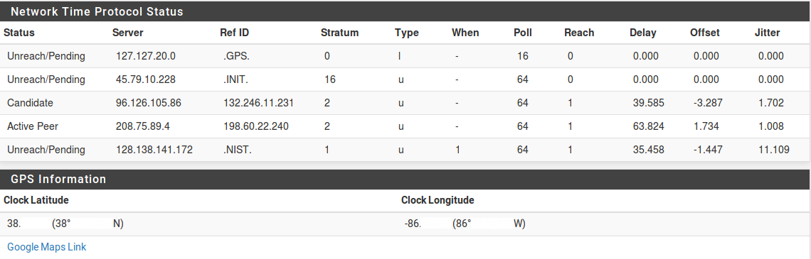

*******
Servizi
*******

Server DHCP IPv4
''''''''''''''''

Il **server DHCP** IPv4 assegna indirizzi IPv4 e relative opzioni di
configurazione ai PC client su una rete. È abilitato per impostazione
predefinita sull'interfaccia LAN con un intervallo predefinito da of
192.168.1.100 a 192.168.1.199. In questa configurazione predefinita, il
firewall assegna il suo indirizzo IP della LAN (192.168.1.1) come
gateway e server DNS se il risolutore del DNS o il forwarder del DNS è
abilitato. Ci sono numerose opzioni disponibili nell'interfaccia web,
che sono coperte nella sezione successiva.

Configurazione
==============

Per modificare il comportamento del server DHCP IPv4, passare a
**Servizi> Server DHCP** nell'interfaccia web. Il comportamento del
server DHCP IPv4 è controllato lì, insieme alle mappature degli
indirizzi IP statici e alle opzioni correlate come l'ARP statico.

Scegliere un’interfaccia
------------------------

La pagina di configurazione DHCP contiene una scheda per ogni
interfaccia con un indirizzo IP statico. Ogni interfaccia ha una propria
configurazione server DHCP separata e può essere abilitata o
disabilitata indipendentemente l'una dall'altra. Prima di apportare
modifiche, visitare la scheda per l'interfaccia corretta.

Opzioni generali
----------------

    **Abilitare** La prima impostazione della scheda abilita o
    disabilita il servizio DHCP per l'interfaccia. Per attivare DHCP per
    l'Interfaccia, selezionare Ab\ **ilitare server DHCP
    sull'interfaccia [nome].** Per disabilitare il servizio,
    deselezionare invece la casella.

    **Negare client sconosciuti** In circostanze normali, il server DHCP
    risponderà alle richieste di qualsiasi client che richiede una
    lease. Nella maggior parte degli ambienti questo è un
    comportamento normale e accettabile, ma in ambienti ristretti o
    sicuri questo comportamento è indesiderabile. Con questo set di
    opzioni, solo i client con mappature statiche definite riceveranno
    le lease. Questa è una pratica più sicura, ma è molto meno
    comoda. Questa opzione è per il pool, il che significa che se i
    client sconosciuti vengono negati nell'intervallo predefinito,
    potrebbe essere definito un altro pool di indirizzi IP che non ha
    l'impostazione selezionata. Il server DHCP assegnerà invece gli
    indirizzi IP dei client da quel pool alternativo.

	.. note::  
		ciò proteggerà dagli utenti a bassa conoscenza e dalle persone che inseriscono casualmente i dispositivi. Essere consapevoli, tuttavia, che un utente con conoscenza della rete potrebbe codificare un indirizzo IP, una maschera di rete, un gateway, e un DNS che darà ancora loro accesso. Potrebbero anche alterare/falsificare il loro indirizzo MAC per abbinare un client valido e ottenere ancora una lease. Se possibile, accoppiare questa impostazione con voci ARP statiche, con il controllo di accesso in uno switch che limiterà gli indirizzi MAC a determinate porte switch per una maggiore sicurezza e disattivare o disabilitare le porte switch inutilizzate.

    **Subnet** L'indirizzo di rete della Subnet dell'interfaccia.

    **Subnet Maskt** La Subnet Mask per la Subnet dell'interfaccia.

    **Range disponibile** L'intervallo di indirizzi disponibili
    all'interno della Subnet dell'interfaccia, per riferimento e per
    determinare l'intervallo desiderato per i client DHCP. L'indirizzo
    di rete e l'indirizzo di trasmissione sono esclusi, ma gli indirizzi
    di interfaccia e gli indirizzi IP virtuali non sono esclusi.

    **Range** Definisce l'intervallo di indirizzi DHCP, indicato
    anche come ambito o pool. Le due caselle per l'intervallo indicano
    al firewall il primo e l'ultimo indirizzo da utilizzare come pool
    DHCP. Gli indirizzi tra i valori inseriti, inclusi, verranno
    utilizzati per i client che richiedono indirizzi tramite DHCP.
    L'intervallo deve essere inserito prima con il numero inferiore,
    seguito dal numero più alto. Ad esempio, l'intervallo DHCP della LAN
    predefinito è basato sulla Subnet per l'indirizzo IP della LAN
    predefinito. È da 192.168.1.100 a 192.168.1.199. Questo intervallo
    può essere grande o piccolo quanto il bisogno della rete, ma deve
    essere interamente contenuto all'interno della Subnet per
    l'interfaccia configurata.

Pool aggiuntivi
---------------

La sezione dei pool aggiuntivi definisce pool extra di indirizzi
all'interno della stessa Subnet. Questi pool possono essere
utilizzati per creare set di indirizzi IP specifici per determinati
client, o per un eccesso da un pool originale più piccolo, o per
dividere il pool principale in blocchi più piccoli con uno spazio di
indirizzi IP non DHCP nella metà di quello che era il pool. Una
combinazione delle opzioni di controllo degli indirizzi MAC può essere
utilizzata per guidare i client dello stesso produttore in un pool
specifico, come i telefoni VoIP.

Per aggiungere un nuovo pool, fare clic su |image0| **Aggiungere un
pool** e lo schermo passerà alla vista della modifica del pool, che è
quasi la stessa delle normali opzioni DHCP, ad eccezione di alcune
opzioni che non sono attualmente possibili nei pool. Le opzioni si
comportano come le altre discusse in questa sezione. Gli elementi
lasciati vuoti, per impostazione predefinita, cadranno e utilizzeranno
le opzioni dall'intervallo DHCP principale.

.. note::  Vedere la sezione di controllo degli indirizzi MAC qui sotto per le specifiche su come indirizzare i client verso o lontano dai pool.

Server
------

    **Server WINS** Possono essere definiti due server WINS (Servizio
    dei nomi di internet di Windows, Windows Internet Name Service) che
    verranno trasmessi ai client. Se è necessario uno o più server WINS,
    inserire qui i loro indirizzi IP. I server effettivi non devono
    essere su questa Subnet, ma assicurarsi che le regole di routing
    e firewall corrette siano in atto per consentire loro di essere
    raggiunti dai PC client. Se questo viene lasciato vuoto, nessun
    server WINS verrà inviato al client.

    **Server DNS** I server DNS devono o non devono essere compilati, a
    seconda della configurazione del firewall. Se il risolutore del DNS
    integrato o il forwarder del DNS viene utilizzato per gestire il
    DNS, lasciare questi campi vuoti e |firew4ll| si assegnerà
    automaticamente come server DNS per i PC client. Se il forwarder del
    DNS è disabilitato e questi campi sono lasciati vuoti, |firew4ll|
    passerà su qualsiasi server DNS sia definito in
    **Sistema>Configurazione generale**. Per utilizzare i server DNS
    personalizzati al posto delle scelte automatiche, compilare gli
    indirizzi IP per un massimo di quattro server DNS qui. Nelle reti
    con server Windows, in particolare quelli che impiegano la directory
    attiva, si consiglia di utilizzare tali server per i DNS del client.
    Quando si utilizza il risolutore DNS o il forwarder DNS in
    combinazione con il CARP, specificare l'indirizzo IP virtuale del
    CARP su questa interfaccia qui.

Altre opzioni
-------------

    **Gateway** Questo può anche essere lasciato vuoto se questo
    firewall agisce come gateway per la rete su questa interfaccia. Se
    questo non è il caso, compilare l'indirizzo IP per il gateway
    utilizzato dai client su questa interfaccia. Quando si utilizza il
    CARP, compilare l'indirizzo IP virtuale nel CARP su questa
    interfaccia qui.

    **Nome di dominio** Specifica il nome di dominio passato al client
    per formarne l'hostname completo. Se il **nome di dominio** viene
    lasciato vuoto, il nome di dominio del firewall inviato al client.
    In caso contrario, al client viene inviato questo valore.

    **Elenco di domini di ricerca** Controlla i domini di ricerca DNS
    forniti al client tramite DHCP. Se sono presenti domini multipli e
    sono desiderati nomi host brevi, fornire un elenco di nomi di
    dominio qui, separati da un punto e virgola. I client tenteranno di
    risolvere i nomi host aggiungendo i domini, a loro volta, da questo
    elenco prima di cercare di trovarli esternamente. Se lasciato vuoto,
    viene utilizzata l'opzione di dominio.

	.. note::  
		L'elenco di **domini di ricerca** viene fornito tramite l'opzione 119 di DHCP. A partire da questa scrittura, nessun client DHCP di Windows di qualsiasi versione supporta l'opzione 119 DHCP. Altri sistemi operativi come BSD, Linux e OS X supportano l'ottenimento dell'elenco dei domini di ricerca tramite l'opzione 119 di DHCP.

    **Tempo di lease predefinito** Controlla per quanto tempo una
    lease durerà quando un client non richiede una specifica
    lunghezza di lease. Specificato in secondi, il valore
    predefinito è 7200 secondi (2 ore)

    **Tempo massimo di lease** Limita la durata della lease
    richiesta a un tempo massimo dichiarato. Specificato in secondi, il
    valore predefinito è 86400 secondi (1 giorno).

    **IP del peer di failover** Se questo sistema fa parte di un cluster
    di failover a elevata disponibilità, immettere qui l'indirizzo IP
    reale dell'altro sistema in questa Subnet. Non inserire un
    indirizzo IP virtuale CARP.

    **ARP statica** Questa casella di selezione funziona in modo simile
    a negare gli indirizzi MAC sconosciuti dall'ottenimento della
    lease, ma fa un ulteriore passo avanti in quanto limita anche
    qualsiasi indirizzo MAC sconosciuto dalla comunicazione con questo
    firewall. Questo arresta gli aspiranti abusatori dalla codificazione
    di un indirizzo non utilizzato su questa Subnet, eludendo le
    restrizioni DHCP.

	.. note::  
		Quando si utilizza l’ARP statica, tutti i sistemi che devono comunicare con il firewall devono essere elencati in mappature statiche prima di attivare questa opzione, in particolare il sistema utilizzato per connettersi alla GUI di |firew4ll|. Bisogna essere consapevoli del fatto che questa opzione può impedire alle persone di codificare un indirizzo IP e parlare con il firewall, ma non impedisce loro di raggiungere l'altro sul segmento di rete locale.

    **Modificare il formato dell’ora** Per impostazione predefinita, il
    demone DHCP di ISC mantiene i tempi di lease in UTC. Quando
    questa opzione è selezionata, i tempi nella pagina di stato delle
    lease DHCP vengono convertiti nel fuso orario locale definito
    sul firewall.

    **Grafici delle statistiche** Questa opzione, disabilitata per
    impostazione predefinita, attiva il grafico RRD per il monitoraggio
    dell'utilizzo del pool DHCP.

DNS dinamico
------------

Per le impostazioni del DNS dinamico, fare clic su **Visualizzare
avanzate** a destra di quel campo, che visualizza le seguenti opzioni:

    **Abilitare** Selezionare la casella per abilitare la registrazione
    dei nomi client DHCP in DNS utilizzando un server DNS esterno (non
    |firew4ll|).

    **Dominio DDNS** Il nome di dominio utilizzato per la registrazione
    dei client in DNS

    **Indirizzo del DDNS primario** Il server DNS utilizzato per la
    registrazione dei client in DNS

    **Chiave del dominio DNS** La chiave di crittografia utilizzata per
    la registrazione DNS

    **Segreto della chiave del dominio DNS** Il segreto per la chiave
    utilizzata per la registrazione DNS

Controllo dell’indirizzo MAC
----------------------------

Per il controllo degli indirizzi MAC, fare clic su **Visualizzare
avanzate** per visualizzare gli elenchi degli indirizzi MAC dei client
consentiti e negati. Ogni elenco è separato da virgole e contiene
porzioni di indirizzi MAC. Ad esempio, un gruppo di telefoni VoIP dello
stesso produttore può iniziare con l'indirizzo MAC aa:bb:cc. Questo può
essere sfruttato per dare opzioni separate agli utenti DHCP o ai gruppi
di dispositivi.

    **Consentire** Un elenco di indirizzi MAC da consentire in questo
    pool. Se un indirizzo MAC si trova nella casella consentire, tutti
    gli altri verranno negati tranne l'indirizzo MAC specificato nella
    casella consentire.

    **Negare** Un elenco di indirizzi MAC da negare da questo pool. Se
    un indirizzo MAC è nell'elenco negare, sono consentiti tutti gli
    altri.

È meglio usare una combinazione di permessi e negazione per ottenere il
risultato desiderato,come ad esempio: nel pool principale, lasciare
Consentire vuoto e Negare con aa:bb:cc. Quindi nel pool dei VoIP,
consentire aa:bb:cc. Se tale passaggio aggiuntivo non viene eseguito per
consentire il prefisso MAC nel pool aggiuntivo, altri client di
telefonia non VoIP potrebbero ricevere indirizzi IP da tale pool, il che
potrebbe portare a comportamenti indesiderati.

Questo comportamento può essere assunto anche per alcuni dispositivi
delle lista nera per la ricezione di una risposta DHCP. Ad esempio, per
evitare che le stampanti di marca ricevano un indirizzo DHCP, se gli
indirizzi MAC iniziano tutti con ee:ee:ee, posizionarlo nell'elenco
negare di ciascun pool.

Server NTP
----------

Per specificare i server NTP (Server del protocollo dell’orario di rete,
Network Time Protocol Server), fare clic sul pulsante **Visualizzare
avanzate** a destra di quel campo e immettere gli indirizzi IP per un
massimo di due server NTP.

Server TFTP
-----------

Fare clic sul pulsante **Visualizzare avanzate** accanto a **TFTP** per
visualizzare l'opzione server TFTP. Il valore nella casella server TFTP,
se lo si desidera, deve essere un indirizzo IP o un hostname di un
server TFTP. Questo è più spesso utilizzato per i telefoni VoIP, e può
anche essere indicato come "opzione 66" in altra documentazione per VoIP
e DHCP.

URI di LDAP
-----------

Fare clic sul pulsante **Visualizzare avanzate** accanto a **LDAP** per
visualizzare l'opzione **URI server LDAP**. **L'URI del server LDAP**
invierà un URI del server LDAP al client se richiesto. Questo può anche
essere indicato come opzione 95 di DHCP. Prende la forma di un URI di
LDAP completo, come ldap://ldap.example.com/dc=example,dc=com. Questa
opzione può aiutare i client che utilizzano determinati tipi di sistemi,
come OpenDirectory, a trovare il loro server.

Opzioni aggiuntive BOOTP/DHCP
-----------------------------

Altre opzioni DHCP numeriche possono essere inviate ai client
utilizzando i controlli delle **opzioni aggiuntive di BOOTP/DHCP.** Per
visualizzare queste opzioni, fare clic su **Visualizzare avanzate** in
questa sezione. Per aggiungere una nuova opzione, fare clic su |image1|
**Aggiungere**.

    **Numero** Il numero di codice dell'opzione DHCP. IANA mantiene un
    elenco di tutte le opzioni DHCP valide.

    **Tipo** Le scelte e i formati per ogni tipo possono essere un po’
    contro-intuitivi, ma le etichette vengono utilizzate direttamente
    dal demone DHCP. Gli usi e i formati appropriati sono:

    **Testo** Testo in forma libera da inviare in risposta, come ad
    esempio http://www.example.com/wpad/wpad.dat o società di esempio.

    **Stringa** Una stringa di cifre esadecimali separate da due punti,
    come c0:a8:05:0c.

    **Booleana** Vero o falso.

    **Numero intero a 8, 16 o 32 bit non firmato** Un numero intero
    positivo che si adatta all'interno della data dimensione dei dati,
    come 86400.

    **Numero intero a 8, 16 o 32 bit firmato** Un numero intero positivo
    o negativo che si adatta all'interno della data dimensione dei dati,
    come -512.

    **Indirizzo IP o host** Un indirizzo IP come 192.168.1.1 o un nome
    host come www.example.com.

    **Valore** Il valore associato a questa opzione numerica e tipo.

Per ulteriori informazioni su quali opzioni assumono un tipo o un
formato specifico, vedere l'elenco collegato sopra la IANA.

Avvio della rete
----------------
Per visualizzare le impostazioni di avvio della rete, fare clic su
|image2| sulla barra dell'intestazione della sezione di **avvio della
rete**.

    **Abilitare** Controllare per abilitare le opzioni di avvio di rete
    in DHCP

    **Server Successivo** L'indirizzo IP da cui sono disponibili le
    immagini di avvio

    **Nome file del BIOS predefinito** Nome file per l'immagine di avvio
    (non UEFI)

    **Nome file UEFI a 32 bit** File per l'avvio UEFI a 32 bit

    **Nome file UEFI a 64 bit** File per l'avvio UEFI a 64 bit

    **Percorso root** Stringa per indirizzare un dispositivo specifico
    come dispositivo del filesystem della root del client, ad esempio
    iscsi:(servername):(protocol):(port):(LUN):targetname.

Salvare le impostazioni
-----------------------

Dopo aver apportato le modifiche, fare clic su **Salvare** prima di
tentare di creare mappature statiche. Le modifiche alle impostazioni
andranno perse se il browser lascia questa pagina senza salvare.

Mappa statica
-------------

Le mappature DHCP statiche esprimono una preferenza per cui l'indirizzo
IP verrà assegnato a un determinato client in base al suo indirizzo MAC.
In una rete in cui vengono negati client sconosciuti, questo serve anche
come un elenco di client “noti” che possono ricevere lease o avere
voci ARP statiche. Le mappature statiche possono essere aggiunte in uno
dei due modi:

-  Da questa schermata, fare clic su |image3| Aggiungere.

-  Aggiungerli dalla vista delle lease DHCP, di cui si discute più
   avanti in questo capitolo.

   In questa schermata, è necessario solo l'indirizzo MAC.

    **Indirizzo MAC** L'indirizzo MAC del client che identifica l'host
    per distribuire le opzioni in questa pagina o inserendo solo
    l'indirizzo MAC, verrà aggiunto all'elenco dei client noti da
    utilizzare quando è impostata l'opzione **Negare i client
    sconosciuti**.

	.. note::  
		L'indirizzo MAC del client può essere ottenuto da un prompt dei comandi sulla maggior parte delle piattaforme. Su sistemi operativi basati su UNIX o che lavorano come Unix tra cui Mac OS X, digitando ifconfig-a verrà mostrato l'indirizzo MAC per ogni interfaccia. Su piattaforme basate su Windows, ``ipconfig /all`` mostrerà l'indirizzo MAC. L'indirizzo MAC può anche a volte essere trovato su un adesivo sulla scheda di rete, o vicino al jack di rete per adattatori integrati. Per gli host sulla stessa Subnet, il MAC può essere determinato eseguendo il ping dell'indirizzo IP dell'host e quindi eseguendo arp - a.

    **Identificativo del client** Un ID inviato dal cliente per
    identificarsi.

    **Indirizzo IP** Il campo dell’indirizzo IP è necessario se si
    tratta di una mappatura degli indirizzi IP statici invece di
    informare solo il server DHCP che il client è valido. Questo
    indirizzo IP è una preferenza, non una prenotazione. L'assegnazione
    di un indirizzo IP qui non impedirà a qualcun altro di utilizzare lo
    stesso indirizzo IP. Se questo indirizzo IP è in uso quando questo
    client richiede un lease, riceverà invece un indirizzo dal pool
    generale. Per questo motivo, la WebGUI di |firew4ll| non consente di
    assegnare mappature IP statiche all'interno del pool DHCP.

    **Hostname** L'hostname del client. Questo non deve corrispondere
    al hostname effettivo impostato sul client. L'hostname impostato
    qui verrà utilizzato quando si registrano gli indirizzi DHCP nel
    forwarder del DNS.

    **Descrizione** Solo estetica, e disponibile per aiutare a tenere
    traccia di eventuali ulteriori informazioni su questa voce. Potrebbe
    essere il nome della persona che utilizza il PC, la sua funzione, il
    motivo per cui aveva bisogno di un indirizzo statico o
    l'amministratore che ha aggiunto la voce. Può anche essere lasciato
    vuoto.

    **Voce statica della tabella ARP** Se selezionata, questa voce
    riceverà una voce ARP statica nel sistema operativo che lega questo
    indirizzo IP a questo indirizzo MAC.

	.. note::  
		Se questa opzione viene utilizzata piuttosto che utilizzare l'opzione ARP statica globale, non impedisce che l'indirizzo MAC utilizzi altri indirizzi IP, impedisce solo ad altri indirizzi MAC di utilizzare questo indirizzo IP. In altre parole, impedisce a un'altra macchina di utilizzare quell'IP per raggiungere il firewall, ma non impedisce all'utente di cambiare il proprio indirizzo IP in qualcosa di diverso.

Le restanti opzioni disponibili per impostare questo client sono le
stesse nel comportamento di quelle che si trovano in precedenza in
questa sezione per le impostazioni DHCP principali.

Fare clic su **Salvare** per terminare la modifica della mappatura
statica e tornare alla pagina di configurazione del server DHCP.

Stato
=====

Lo stato del servizio del server DHCP stesso è in **Stato>Servizi**. Se
il server DHCP è abilitato, il suo stato verrà visualizzato come in
esecuzione, come nella figura *Stato del servizio del demone di DHCP*. I
pulsanti sul lato destro consentono di riavviare o arrestare il demone
del server DHCP. Il riavvio non è normalmente necessario in quanto
|firew4ll| riavvierà automaticamente il servizio quando vengono apportate
modifiche alla configurazione che richiedono un riavvio. È probabile che
anche l'arresto del servizio non sia necessario, poiché il servizio si
arresta quando tutte le istanze del server DHCP sono disabilitate.

|image4|

Fig. 1: Stato del servizio del demone di DHCP

Lease
======

   Le lease DHCP attualmente assegnate sono visualizzabili in
   **Stato>lease DHCP**. Questa pagina mostra vari aspetti dei
   contratti di lease del cliente. Questi includono:

-  Indirizzo IP assegnato
-  Indirizzo MAC del client
-  L'hostname (se presente) che il client ha inviato come parte della richiesta DHCP
-  La descrizione di un host con una mappatura statica DHCP
-  Gli orari di inizio e fine della lease
-  Se la macchina è attualmente online o meno (nella tabella ARP del firewall)
-  Se la lease è attiva, scaduta o una registrazione statica

Visualizzazione delle lease inattive
-------------------------------------

Per impostazione predefinita, vengono visualizzati solo le lease
attive e statiche, ma tutto, incluse le lease scade, può essere
visualizzato facendo clic su **Mostrare tutte le lease
configurate**. Per ridurre la visualizzazione alla normalità, fare clic
solo su Mostrare solo lease attive e statiche.

Risvegliare l’integrazione della LAN
------------------------------------

Facendo clic su |image5| l'icona a destra del lease si invia un
pacchetto Svegliare la LAN (WOL) su quell'host. Fare clic su |image6|
per creare una voce WOL per l'indirizzo MAC. Per maggiori dettagli sul
risveglio della LAN, vedere *Svegliare la LAN*.

Aggiungere alla mappa statica
-----------------------------

Per creare una mappatura statica da un lease dinamico, fare clic su
|image7| a destra del lease. Questo pre-riempirà l'indirizzo MAC di
quell'host nella schermata **Modificare la mappatura statica**.
Aggiungere l'indirizzo IP, l'hostname e la descrizione desiderati e
fare clic su **Salvare**.

Eliminare la lease
------------------

Durante la visualizzazione delle lease, lease inattive o scadute
possono essere eliminate manualmente facendo clic su |image8| alla fine
della sua riga. Questa opzione non è disponibile per i leasing attivi o
statici, solo per i leasing offline o scaduti.

Registri del servizio DHCP
==========================

Il demone DHCP registrerà la sua attività in **Stato>Registro di
sistema**, nella scheda DHCP. Verrà visualizzata ogni richiesta e
risposta DHCP, insieme ad altri messaggi di stato e di errore.

Annunci del router e server DHCP con IPv6
'''''''''''''''''''''''''''''''''''''''''

L'assegnazione automatica degli indirizzi per IPv6 funziona in modo
leggermente diverso rispetto a IPv4. Anche così, la maggior parte delle
opzioni DHCP sono simili, ma ci sono notevoli differenze del
comportamento nel modo in cui le cose vengono assegnate e anche come gli
elementi come il gateway vengono consegnati ai client. Se non
diversamente specificato, le opzioni con lo stesso nome funzionano allo
stesso modo per DHCP e DHCPv6. DHCPv6 e gli annunci del router (Router
Advertisements, RA) sono configurati in **Servizi>Server/RA DHCPv6**.
Sotto quella pagina ci sono due schede: una per il **server DHCPv6** e
una per gli **annunci del router**.

DHCPv6 vs autoconfigurazione dell’indirizzo senza stato
=======================================================

Ci sono alcuni client che non hanno il supporto per DHCPv6. Alcuni
client supportano solo l’autoconfigurazione degli indirizzi senza stato
(stateless Address Autoconfiguration), o SLAAC in breve. Non c'è modo
per il firewall di avere conoscenza diretta di un elenco di host sul
segmento utilizzando indirizzi SLAAC, quindi per alcuni ambienti è molto
meno desiderabile a causa della mancanza di controllo e segnalazione di
indirizzi. Considerare il monitoraggio degli indirizzi e i requisiti di
supporto del sistema operativo al momento di decidere come allocare gli
indirizzi IPv6 ai client sulla rete.

Molti sistemi operativi come Windows, OS X, FreeBSD, Linux e i loro
cugini contengono client DHCPv6 che sono in grado di ottenere indirizzi
come previsto tramite DHCPv6. Alcuni sistemi operativi leggeri o mobili
come Android non contengono un client DHCPv6 e funzioneranno solo su un
segmento locale con IPv6 utilizzando SLAAC.

Annunci del router (o “dov’è l'opzione del gateway DHCPv6”)
===========================================================

In IPv6, un router si trova attraverso i messaggi degli annunci del
router (RA) inviati da router invece che da DHCP; router abilitati IPv6
che supportano l'assegnazione dell’indirizzo dinamico sono tenuti ad
annunciare se stessi sulla rete a tutti i client. Come tale, DHCPv6 non
include alcuna informazione gateway. Quindi i client possono ottenere i
loro indirizzi da DHCPv6 o SLAAC, ma a meno che non siano configurati
staticamente, individuano sempre il loro prossimo hop utilizzando i
pacchetti RA inviati dai gateway disponibili.

Per abilitare il servizio RA:

-  Passare a Servizi>Server/RA DHCPv6
-  Fare clic sulla scheda Interfaccia per l'interfaccia configurata
-  Fare clic sulla scheda **Annunci del router**
-  Selezionare una modalità diversa da *disabilitata* dall'elenco a discesa della **Modalità del router**
-  Fare clic su **Salvare**

Le altre opzioni per controllare il comportamento del RA possono essere
impostate secondo necessità per la rete:

    **Modalità di annunci del router** Le modalità per il demone RA
    controllano i servizi offerti da |firew4ll|, annunciano il firewall
    come router IPv6 sulla rete e indirizzano i client su come ottenere
    gli indirizzi.

    **Disabilitato** Il demone RA è disabilitato e non verrà eseguito. I
    gateway IPv6 devono essere inseriti manualmente su qualsiasi host
    client.

    **Solo router** Questo firewall invierà pacchetti RA che si
    annunciano come un router IPv6. DHCPv6 è disabilitato in questa
    modalità.

    **Non gestito** Il firewall invierà pacchetti RA e i client sono
    diretti ad assegnare loro stessi indirizzi IP all'interno della
    Subnet dell'interfaccia utilizzando SLAAC. DHCPv6 è disabilitato
    in questa modalità.

    **Gestito** Il firewall invierà pacchetti RA e gli indirizzi saranno
    assegnati solo ai client che utilizzano DHCPv6.

    **Assistito** Il firewall invierà pacchetti RA e gli indirizzi
    possono essere assegnati ai client da DHCPv6 o SLAAC.

    **DHCP senza stato** Il firewall invierà pacchetti RA e gli
    indirizzi possono essere assegnati ai client da SLAAC fornendo
    informazioni aggiuntive come DNS e NTP da DHCPv6.

    **Priorità del router** Se esistono più router IPv6 sullo stesso
    segmento di rete, possono indicare ai client in quale ordine devono
    essere utilizzati. Se un router ad elevata priorità non è
    disponibile, i client proveranno un router a priorità normale e,
    infine, un router a bassa priorità. Selezionare *Basso*, *Normale* o
    *Alto* dall'elenco. Se c'è solo un router sulla rete, utilizzare
    *Normale*.

    **Durata valida predefinita** Periodo di tempo, specificato in
    secondi, in cui il prefisso annunciato sarà valido. Il valore
    predefinito è 86400 secondi (un giorno)

    **Durata preferita predefinita** Periodo di tempo, specificato in
    secondi, in cui gli indirizzi client generati in questo prefisso
    utilizzando SLAAC sono validi. Il valore predefinito è 86400 secondi
    (un giorno)

    **Sottoreti RA** Questa sezione consente di definire un elenco di
    sottoreti per i quali questo firewall invierà pacchetti RA.
    Immettere tutte le sottoreti necessarie, ognuna con un prefisso
    appropriato (in genere 64.). Per creare una riga aggiuntiva per
    un'altra Subnet, fare clic su |image9| Aggiungere.

    **Impostazioni DNS** Ottenere informazioni DNS dai messaggi RA non è
    universalmente supportato, ma per i client che lo supportano,
    utilizzare SLAAC per fornire un indirizzo IP e DNS da RA può
    eliminare completamente la necessità di utilizzare DHCPv6.

    **Server DNS** Immettere fino a tre indirizzi IP per i server DNS o
    lasciare vuoti i campi per utilizzare i server DNS predefiniti di
    sistema o il forwarder del DNS/Risolutore del DNS se abilitato.

    **Elenco dei domini di ricerca** Funziona in modo identico
    all'opzione DHCP con lo stesso nome.

    **Utilizzare le stesse impostazioni del server DHCPv6** Quando
    selezionato, questi valori verranno estratti automaticamente dalle
    opzioni DHCPv6.

Range DHCPv6
============

Il parametro **Intervallo** funziona in modo simile alla stessa
impostazione su IPv4, ma vale la pena menzionarlo di nuovo qui a causa
delle differenze nell'indirizzamento IPv6.

Data la grande quantità di spazio disponibile all'interno di un /64, un
buon trucco è creare un intervallo che limiti gli host a utilizzare un
intervallo facile da ricordare o riconoscere. Ad esempio, all'interno di
un /64 come 2001:db8:1:1::, impostare l'intervallo DHCPv6 in modo che
sia: da 2001:db8:1:1::d:0000 a 2001:db8:1:1::d:FFFF, usando la D nel
secondo all'ultima sezione dell'indirizzo come una sorta di stenografia
per “DHCP”. Tale intervallo di esempio contiene 2^16 (65,536) IP, che è
estremamente grande per gli standard IPv4 di oggi, ma solo una piccola
parte dell'intero /64.

Delega del prefisso DHCPv6
==========================

La delega del prefisso, coperto in precedenza in *Delega del prefisso
DHCPv6* e *Tracciare l’interfaccia*, consente di dividere e allocare
automaticamente un blocco di indirizzi IPv6 alle reti che vivranno
dietro altri router e firewall che risiedono downstream di |firew4ll| (ad
esempio nella LAN, DMZ, ecc). La maggior parte degli utenti che agiscono
in una capacità del client non ne avrà bisogno e probabilmente lo
lascerà vuoto.

La delega del prefisso può essere utilizzata per distribuire
automaticamente /64 blocchi di a /48 per i router o qualsiasi altra
combinazione, purché l'intervallo sia impostato sui limiti della
dimensione della delega desiderata. Il router downstream ottiene un
indirizzo IPv6 e richiede una delega, e il server ne alloca uno e
aggiunge dinamicamente un percorso in modo che sia raggiungibile tramite
l'indirizzo DHCPv6 assegnato al client.

L\ **'intervallo di delega del prefisso** imposta l'inizio e la fine del
pool di delega. L'intervallo di indirizzi IPv6 specificato qui deve
essere indirizzato a questo firewall dal router upstream. Ad esempio,
per allocare /60 reti al firewall downstream fuori da un determinato
intervallo, è possibile specificare da 2001:db8:1111:F000:: a
2001:db8:1111:FF00:: con una dimensione di delega del prefisso di 60.
Questo assegna un /60 (16 sottoreti di dimensione /64) a ciascun
firewall downstream che richiede una delega in modo che possano a loro
volta utilizzare quelli per LAN, VPN, DMZ, ecc. I firewall downstream
possono anche delegare ulteriormente la propria allease ai router
dietro di loro. Si noti che in questo esempio, 16 delegazioni sarebbero
possibili. Regolare l’intervallo e le dimensioni, se necessario.

Quando si creano i valori per l'intervallo e la dimensione della delega,
tenere presente che l'intervallo deve iniziare e terminare sui confini
che si allineano con la dimensione del prefisso desiderata. In questo
esempio /60, l'intervallo non può iniziare o terminare su qualsiasi cosa
che abbia un valore nei punti a destra del secondo valore nella quarta
sezione dell'indirizzo, quindi può iniziare su 2001:db8:1111:F500:: ma
**non** 2001:db8:1111:F550::.

Mappature statiche DHCPv6
=========================

Le mappature statiche su DHCPv6 funzionano in modo diverso rispetto a
IPv4. Su IPv4, le mappature sono state eseguite utilizzando l'indirizzo
MAC del PC. Per IPv6, i progettisti hanno deciso che non era abbastanza
buono, dal momento che l'indirizzo MAC di un PC potrebbe cambiare, ma
comunque essere lo stesso PC.

Immettere, l'\ **identificatore univoco DHCP** o **DUID**. Il DUID
dell'host viene generato dal sistema operativo del client e, in teoria,
rimarrà unico per quell'host specifico fino a quando l'utente non
costringe un nuovo DUID o il sistema operativo viene reinstallato. Il
DUID può variare da 20 byte e varia a seconda del tipo.

Il campo **DUID** nella pagina di mappatura statica prevede un DUID per
un PC client in un formato speciale, rappresentato da coppie di cifre
esadecimali, separate da due punti, come
00:01:00:01:1b:a6:e7:ab:00:26:18:1a:86:21.

Come ottenere questo DUID dipende dal sistema operativo. Il modo più
semplice è consentire al PC di ottenere un lease tramite DHCPv6, quindi
aggiungere una voce dalla Vista delle lease DHCPv6 (lease DHCPv6
di stato). In Windows, può essere trovato come DUID del client di DHCPv6
nell'output di ipconfig /all..

.. note::  su Windows, il DUID viene generato al momento dell'installazione, quindi se viene utilizzata un'immagine di base e le workstation vengono clonate da lì, possono finire con lo stesso DUID, e quindi tutti finiscono per tirare lo stesso indirizzo IPv6 su DHCPv6. 

Deselezionare il DUID dal registro di sistema prima di creare
un'immagine da clonare, emettendo il seguente comando::

reg delete HKLM\SYSTEM\CurrentControlSet\Services\Tcpip6\Parameters /f /v Dhcpv6DUID

Tale comando può anche essere eseguito su un sistema di lavoro per
reimpostare il suo DUID, se necessario.

Relay di DHCP e DHCPv6
''''''''''''''''''''''

Le richieste DHCP sono traffico broadcast. Il traffico broadcast è
limitato al dominio broadcast in cui viene avviato. Per fornire il
servizio DHCP su un segmento di rete senza un server DHCP, utilizzare il
relay DHCP per inoltrare tali richieste a un server definito su un altro
segmento.

Per configurare il relay DHCP:
-  Disabilitare il server DHCP su ogni interfaccia
-  Passare a **Servizi>Relay DHCP**
-  Fare clic sulla scheda per l'interfaccia da utilizzare con relay DHCP
-  Configurare le opzioni come segue:

    **Abilitare il relay DHCP** Selezionato

    **Aggiungere un ID del circuito e un ID agente alle richieste**
    Selezionare questo per aggiungere un ID del circuito (numero
    dell’interfaccia |firew4ll|) e l'ID agente alla richiesta DHCP. Questo
    può essere richiesto dal server DHCP sull'altra parte e può aiutare
    a distinguere dove sono originate le richieste.

    **Server di destinazione** Una casella di immissione manuale per
    impostare il server DHCP di destinazione

-  Fare clic su **Salvare**

La funzione relay di DHCPv6 funziona in modo identico alla funzione
relay di DHCP per IPv4.

Risolutore DNS
''''''''''''''

Il risolutore del DNS in |firew4ll| utilizza unbound, che è un risolutore
DNS di convalida, ricorsivo e che utilizza la cache che supporta DNSSEC
e un'ampia varietà di opzioni. Il Resolver DNS è abilitato di default
nelle versioni correnti di |firew4ll|.

Per impostazione predefinita, il risolutore del DNS interroga
direttamente i server DNS della root e non utilizza server DNS
configurati in **Sistema>Configurazione generale** o quelli ottenuti
automaticamente da una WAN dinamica. Questo comportamento può essere
modificato, comunque, utilizzando l'opzione di inoltro delle Query del
DNS. Contattando la root direttamente per impostazione predefinita,
elimina molti problemi tipicamente riscontrati dagli utenti con
configurazioni DNS locali errate e i risultati DNS sono più affidabili e
verificabili con le estensioni di sicurezza del sistema dei nomi di
dominio (Domain Name System Security Extensions, DNSSEC).

Opzioni avanzate del risolutore DNS
===================================

|firew4ll| fornisce una GUI per configurare alcune delle opzioni avanzate
più comuni disponibili in unbound. Le opzioni di seguito sono
documentate come trovate nella pagina principale di unbound.conf.

    **Nascondere identità** Quando impostato, i tentativi di interrogare
    l'identità del server (id.server e nomehost.bind) sono rifiutati.

    **Nascondere versione** Quando impostato, i tentativi di interrogare
    la versione del server (version.server e version.bind) sono
    rifiutati.

    **Prefetch del supporto** Quando abilitato, gli elementi della cache
    dei messaggi vengono prefetchati prima della scadenza per mantenere
    aggiornata la cache. Questa opzione può causare un aumento di circa
    il 10% in più di traffico DNS e del carico sul server, ma gli
    elementi richiesti di frequente non scadono dalla cache.

    **Prefetch del supporto della chiave DNS** Quando abilitato, le
    chiavi DNS vengono recuperate in precedenza nel processo di
    convalida quando viene rilevato un record del firmatario della
    delega. Questo aiuta a ridurre la latenza delle richieste ma
    utilizza un po’ più di CPU e richiede che la cache sia impostata
    sopra lo zero.

    **Indurire i dati DNSSEC** Se questa opzione è disabilitata e non
    vengono ricevuti dati DNSSEC, la zona viene resa insicura. I dati
    DNSSEC sono necessari per le zone ancorate alla fiducia. Se tali
    dati sono assenti, la zona diventa falsa.

    **Dimensione della cache per i messaggi** La cache dei messaggi
    memorizza i codici di risposta DNS e gli stati di convalida. La
    cache RRset (Set di record di risorse, resources record set) verrà
    automaticamente impostata su due volte tale importo. La cache RRset
    contiene i dati effettivi del record di risorse. Il valore
    predefinito è *4 MB*.

    **Buffer del TCP in uscita** Il numero di buffer del TCP in uscita
    da allocare per filo. Il valore predefinito è *10*. Se impostato su
    *0*, le query TCP non verranno inviate a server autorevoli.

    **Buffer TCP in entrata** Il numero di buffer del TCP in entrata da
    allocare per filo. Il valore predefinito è *10*. Se impostato su
    *0*, le query TCP non verranno accettate da server autorevoli.

    **Dimensione del buffer EDNS** Numero di byte da annunciare come
    dimensione del buffer di riassemblaggio EDNS. Questo valore viene
    inserito nei datagrammi UDP inviati ai peer. La raccomandazione per
    RFC è *4096* (il valore predefinito). Se si verificano problemi di
    riassemblaggio della frammentazione, di solito osservati come
    timeout, può essere d'aiuto un valore di *1480*. Il valore *512*
    ignora la maggior parte dei problemi di percorso MTU, ma è eccessivo
    e può generare una quantità eccessiva di fallback del TCP.

    **Numero di query per filo** Il numero di query che ogni filo
    servirà contemporaneamente. Se arrivano ulteriori query che devono
    essere servite e nessuna query può essere spintonata, le nuove query
    vengono eliminate

    **Spingere il timeout** Timeout utilizzato quando il server è molto
    occupato. Questo protegge dalla negazione del servizio attraverso
    query lente o alti tassi di query. Il valore predefinito è *200*
    millisecondi. Impostare un valore che approssima il tempo di andata
    e ritorno ai server dell'autorità. Quando arrivano nuove query, il
    50% può essere eseguito e il 50% viene sostituito da nuove query se
    sono più vecchie del timeout dichiarato.

    **TTL massimo per RRset e messaggi** Il tempo massimo di vita (TTL)
    per RRset e messaggi nella cache, specificato in secondi. Il valore
    predefinito è 86400 secondi (1 giorno). Quando il TTL interno scade
    l'elemento cache è scaduto. Questo può essere configurato per
    forzare il risolutore a interrogare i dati più spesso e non fidarsi
    dei valori TTL (molto grandi)

    **TTL minimo per RRset e messaggi** Il tempo minimo di vita per
    RRset e messaggi nella cache, specificato in secondi. Il valore
    predefinito è 0 secondi. Se un record ha un TTL inferiore al valore
    minimo configurato, i dati possono essere memorizzati nella cache
    più a lungo del proprietario del dominio previsto e quindi vengono
    effettuate meno query per cercare i dati. Il valore 0 garantisce che
    i dati nella cache non vengano mantenuti più a lungo del
    proprietario del dominio previsto. Valori elevati possono causare
    problemi in quanto i dati nella cache potrebbero non corrispondere
    ai dati effettivi se cambiano.

    **TTL per le voci della cache dell’host** Tempo di vita, in secondi,
    per le voci nella cache dell'host dell'infrastruttura. La cache
    dell'host dell'infrastruttura contiene i tempi di andata e ritorno,
    le inadeguatezze e le informazioni di supporto EDNS per i server
    DNS. Il valore predefinito è *15 minuti*.

    **Numero di host da memorizzare nella cache** Numero di host
    dell'infrastruttura per i quali le informazioni sono memorizzate
    nella cache. Il valore predefinito è *10,000*.

    **Soglia di risposta indesiderata** Se abilitato, un numero totale
    di risposte indesiderate viene tracciato in ogni filo. Quando viene
    raggiunta la soglia, viene eseguita un'azione difensiva e viene
    stampato un avviso sul file di registro. L'azione difensiva è quella
    di cancellare le cache RRset e dei messagi, sperando di eliminare
    qualsiasi veleno. Il valore predefinito è disabilitato, ma se
    abilitato viene suggerito un valore di 10 milioni.

    **Livello Di Registro** Selezionare la verbosità del registro. Il
    valore predefinito è il *livello 1*.

		**Livello 0** Nessuna verbosità, solo errori.
		**Livello 1** Informazioni operative.
		**Livello 2** Informazioni operative dettagliate.
		**Livello 3** Informazioni sul livello di query, output per query.
		**Livello 4** Informazioni a livello dell'algoritmo.
		**Livello 5** Registra l'identificazione del client per errori di cache.

    **Disabilitare il controllo di accesso aggiunto automaticamente**
    Disabilita le voci di controllo degli accessi aggiunte
    automaticamente. Per default, sono consentite reti IPv4 e IPv6 che
    risiedono su interfacce interne di questo firewall. Le reti
    consentite devono essere configurate manualmente nella scheda
    **Elenchi di accesso** se selezionata.

    **Supporto a 0x20 bit sperimentale** Utilizzare bit casuali
    codificati 0x20 nella query DNS per sventare i tentativi di
    spoofing. Vedere le implementazione progetto dns-0x20 per ulteriori
    informazioni.

DNS Resolver liste di accesso
=============================

Unbound richiede elenchi di accesso (ACL) per controllare quali client
sono autorizzati a inviare query. Per impostazione predefinita, le reti
IPv4 e IPv6 che risiedono su interfacce interne di questo firewall sono
consentite. Le reti aggiuntive devono essere consentite manualmente.

.. note::  Gli ACL automatici possono essere disabilitati utilizzando l'opzione **Disattivare il controllo dell’accesso automaticamente aggiunto** nella scheda **Impostazioni avanzate**.

Per gestire gli elenchi di accesso per il risolutore del DNS, passare a
**Servizi>Risolutore del DNS**, scheda **Elenchi di accesso**. Da questo
elenco possono essere aggiunte nuove voci e le voci esistenti possono
essere modificate o cancellate.

Quando si aggiunge o si modifica una voce, sono disponibili le seguenti
opzioni:

    **Nome della lista di accesso** Il nome dell'elenco di accesso, che
    viene visualizzato come commento nel file di configurazione
    dell'elenco di accesso.

    **Azione** Metodo di gestione delle reti contenute in questo elenco
    di accesso

    **Negare** Arresta le query dai client nelle reti configurate

    **Rifiutare** Arresta le query dai client nelle reti configurate e
    invia un codice di risposta come RIFIUTATO

    **Consentire** Consente le query dai client nelle reti configurate

    **Consentire lo snoop** Consente query ricorsive e non ricorsive dai
    client nelle reti configurate, utilizzate per lo snooping della
    cache e in genere configurate solo su host amministrativi.

    **Descrizione** Un campo di testo più lungo per le note di
    riferimento su questa voce.

    **Reti** Un elenco di reti da governare con questa voce di elenco di
    accesso.

DNS Resolver e IPv6
===================

Il risolutore del DNS è pienamente compatibile con IPv6. Accetta e fa
query su IPv6, supporta i record AAAA e non ha problemi noti con alcun
aspetto di IPv6 e gestione DNS.

Configurazione del risolutore del DNS
=====================================

Per configurare il risolutore del DNS, passare a **Servizi>Risolutore
del DNS**

    **Abilitare** Selezionare questa casella per attivare il risolutore
    del DNS o deselezionare per disabilitare questa funzionalità. Il
    forwarder del DNS e il risolutore del DNS non possono essere
    entrambi attivi contemporaneamente sulla stessa porta, quindi
    disabilitare il forwarder del DNS o spostare un servizio o l'altro
    su una porta diversa prima di tentare di abilitare il risolutore del
    DNS.

    **Porta in ascolto** Per impostazione predefinita, il risolutore del
    DNS ascolta sulla porta TCP e UDP 53. Questo è normale per qualsiasi
    server DNS, in quanto è la porta che il client cercherà di
    utilizzare. Ci sono alcuni casi in cui è desiderabile spostare il
    risolutore del DNS su un'altra porta di ascolto, come 5353 o 54,
    quindi è possibile inoltrare fonti specifiche tramite la porta
    forward.

    **Interfacce** Per impostazione predefinita, il risolutore del DNS
    ascolta su ogni interfaccia disponibile e indirizzo IPv4 e IPv6. Il
    controllo dell'interfaccia limita le interfacce in cui il forwarder
    del DNS accetterà e risponderà alle query. Questo può essere
    utilizzato per aumentare la sicurezza oltre alle regole del
    firewall. Se è selezionata un'interfaccia specifica, gli indirizzi
    IPv4 e IPv6 su tale interfaccia verranno utilizzati per rispondere
    alle query. Il demone unbound si legherà solo all'interfaccia
    selezionata. Le query inviate ad altri indirizzi IP sul firewall
    verranno scartate silenziosamente.

    **Interfacce di rete in uscita** Per impostazione predefinita, il
    risolutore del DNS utilizza tutte le interfacce per le query in
    uscita, quindi genererà la query da qualsiasi interfaccia e
    indirizzo IP sia più vicino al server di destinazione da una
    prospettiva di routing. La selezione di interfacce specifiche
    limiterà le scelte solo a interfacce specifiche che possono essere
    utilizzate come fonte di query.

    **Tipo di zona locale del dominio di sistema** Questa opzione
    determina il tipo di zona locale configurata in unbound per il
    dominio di sistema. Il tipo di zona regola il tipo di risposta da
    dare ai client quando non c'è corrispondenza nei dati locali come le
    sovrascritture degli host, gli host DHCP, ecc. In ogni caso, se c'è
    una corrispondenza locale, la query viene risolta normalmente. I
    tipi disponibili per governare le risposte non corrispondenti sono:

    **Negare** Elimina la query e non risponde al client.

    **Rifiutare** Notifica al client che la query è stata rifiutata
    (utilizzando rcode RIFIUTATO).

    **Statico** Restituisce una risposta NESSUNDATO o NXDOMAIN al
    client.

    **Trasparente** Questo è il comportamento predefinito. Se la query è
    per un nome che non esiste localmente, viene risolta come al solito.
    Se il nome ha una corrispondenza locale ma il tipo è diverso, una
    risposta NESSUNERRORE, NESSUNDATO viene inviata al client

    **Tipo Trasparente** Analogo a trasparente, passa anche le query in
    cui il nome corrisponde ma il tipo no. Ad esempio, se un client
    esegue una query per un record AAAA ma esiste solo un record A, la
    query AAAA viene trasmessa anziché ricevere una risposta negativa.

    **Reindirizzare** Gestisce le query dai dati locali e reindirizza le
    query per le zone sotto la zona locale (ad esempio sottodomini).
    Questo può essere utilizzato per controllare le query per tutti i
    sottodomini sotto il dominio specificato.

    **Informare** Risponde normalmente, ma registra la query del client.

    **Negare e informare** Nega e registra la query.

    **Nessun valore predefinito** Disabilita qualsiasi contenuto
    predefinito per la zona senza influire sul comportamento delle
    query.

    **DNSSEC** Abilita le estensioni della sicurezza di sistema per il
    nome del dominio (Domain Name System Security Extensions, DNSSEC),
    che consente ai client di fidarsi della sorgente e del contenuto
    delle risposte DNS. Questo è abilitato per impostazione predefinita.
    DNSSEC protegge dalla manipolazione delle risposte DNS, come
    l'avvelenamento della cache DNS o altre intercettazioni di query, ma
    non rende segreto il contenuto delle risposte. DNSSEC funziona
    meglio quando si utilizzano direttamente i server root, a meno che i
    server di inoltro supportino DNSSEC. Se i server DNS upstream non
    supportano DNSSEC in modalità di inoltro o con sovrascritture di
    dominio, se è noto che le query DNS vengono intercettate upstream o
    che i client presentano problemi con risposte DNS di dimensioni
    eccessive, potrebbe essere necessario disabilitare DNSSEC.

    **Inoltro di query del DNS** Disabilitato per impostazione
    predefinita. Se abilitato, unbound utilizzerà i server DNS di
    sistema da **Sistema>Configurazione generale** o quelli ricevuti da
    una WAN dinamica, piuttosto che usare direttamente i server root.
    Questo è meglio per uno scenario Multi-WAN in cui è desiderato un
    controllo accurato del routing delle query DNS, ma in genere
    richiede anche la disabilitazione di DNSSEC a causa della mancanza
    di supporto da parte dei server DNS upstream o di altri problemi che
    inoltrano le query.

    **Registrazione DHCP** Quando è attivo, i nomi delle macchine
    interne per i client DHCP possono essere risolti utilizzando il DNS.
    Funziona solo per i client che specificano un hostname nelle loro
    richieste DHCP. Il nome di dominio da **Sistema>Configurazione
    generale** viene utilizzato come nome di dominio sugli host.

    **DHCP statico** Funziona come **Registrare le lease DHCP nel
    forwarder del DNS**, tranne che registra invece gli indirizzi di
    mappatura statica DHCP.

    **Opzioni personalizzate** Un'area di testo per l'immissione di
    direttive avanzate per unbound che non sono supportate direttamente
    dalla GUI. Se unbound non si avvia correttamente dopo aver inserito
    le opzioni personalizzate, Aggiungere server: su una riga prima
    delle opzioni personalizzate.

\ **Sovrascritture Host**

Le voci DNS personalizzate possono essere create nella sezione
**sovrascritture host** della pagina. Le sovrascritture host possono
definire nuovi record o sovrascrivere i record esistenti in modo che i
client locali ricevano le risposte configurate anziché le risposte dai
server DNS upstream. Questo è utile anche per le configurazioni del DNS
diviso (vedi *DNS diviso*) e come mezzo semi-efficace per bloccare
l'accesso a determinati siti web specifici.

È possibile definire più record per lo stesso hostname e tutti gli
indirizzi IP verranno restituiti nel risultato. Questo può essere
utilizzato per fornire sia un risultato IPv4 (A) che IPv6 (AAAA) per un
singolo hostname.

.. note::  Non è consigliabile utilizzare solo la funzionalità di override del DNS come mezzo per bloccare l'accesso a determinati siti. Ci sono innumerevoli modi per aggirare questo. Fermerà gli utenti non tecnici, ma è facile da aggirare per quelli con più attitudine tecnica.

    **Host** Questo campo definisce solo la parte del hostname del
    record DNS (senza il dominio), ad esempio `www. <http://www/>`__.
    Può essere lasciato vuoto per creare un record di override per il
    dominio stesso (simile a un record “@” in un legame.)

    **Dominio** Questo campo è obbligatorio e definisce il nome di
    dominio per la voce override, ad es. esempio.com.

    **Indirizzo IP** L'indirizzo IP (IPv4 o IPv6) da restituire come
    risultato per una ricerca DNS di questa voce.

    **Descrizione** Una descrizione di testo utilizzata per identificare
    o fornire ulteriori informazioni su questa voce.

    **Nome aggiuntivo per questo host** Definisce i nomi host aggiuntivi
    per lo stesso indirizzo IP (proprio come i record CNAME) per
    mantenerli in una singola voce di override.

Sovrascritture di dominio
-------------------------

Le sovrascritture di dominio si trovano nella parte inferiore della pagina
del risolutore del DNS. Queste voci specificano un server DNS
alternativo da utilizzare per risolvere un dominio specifico.

Un esempio di dove questo è comunemente distribuito è nelle reti di
piccole imprese con un singolo server interno con Active Directory, di
solito il Server per piccoli business di Microsoft (Microsoft Small
Business Server). Le richieste DNS per il nome di dominio di Active
Directory devono essere risolte dal server Windows interno affinché
Active Directory funzioni correttamente. L'aggiunta di un override per
il dominio di Active Directory che punta all'indirizzo IP interno di
Windows server assicura che questi record siano risolti correttamente se
i client utilizzano questo firewall come server DNS o il server Windows
direttamente.

In un ambiente Active Directory, la migliore pratica è quella di far sì
che i client utilizzino sempre il server DNS di Windows come server DNS
primario, in modo che la registrazione dinamica dei nomi e altre
attività DNS correlate al dominio funzionino correttamente. In ambienti
con un solo server DNS di Windows, abilitare il risolutore del DNS con
un override per il dominio Active Directory e utilizzare questo firewall
come server DNS secondario per le macchine interne. Ciò garantisce che
la risoluzione DNS (ad eccezione di Active Directory) non abbia un
singolo punto di errore e che la perdita del singolo server non
significhi un'interruzione completa di Internet. La perdita di un
singolo server in un tale ambiente di solito avrà conseguenze
significative, ma gli utenti saranno più inclini a lasciare
l'amministratore da solo per risolvere il problema se possono ancora
controllare i loro Facebook, Twitter, e tutti gli altri nel frattempo.

Un altro uso comune delle sovrascritture DNS è quello di risolvere i
domini DNS interni in siti remoti utilizzando un server DNS nel sito
principale accessibile tramite VPN. In tali ambienti tutte le query DNS
vengono in genere risolte nel sito centrale per il controllo
centralizzato sul DNS, tuttavia alcune organizzazioni preferiscono
consentire la risoluzione DNS di Internet con |firew4ll| in ciascun sito e
inoltrare solo le query per i domini interni al server DNS centrale.

.. note::  per funzionare su IPsec è necessario un percorso statico. Per
ulteriori informazioni, vedere *Traffico avviato da |firew4ll| e IPsec*.

    **Dominio** Il campo del dominio imposta il nome di dominio che
    verrà risolto utilizzando questa voce. Questo non deve essere un TLD
    valido, può essere qualsiasi cosa (ad esempio locale, test, lab), o
    può essere un vero nome di dominio ( esempio.com).

    **Indirizzo IP** Specifica l'indirizzo IP del server DNS a cui
    vengono inviate le query per i nomi host nel dominio. Se il server
    DNS di destinazione è in esecuzione su una porta diversa da 53,
    aggiungere il numero di porta dopo l'indirizzo IP con un @ che
    separa i valori, ad esempio::

	192.0.2.3@5353

    **Descrizione** Una descrizione di testo utilizzata per identificare
    o fornire ulteriori informazioni su questa voce.

Il risolutore del DNS e Multi-WAN
=================================

Con le impostazioni predefinite, il risolutore DNS avrà problemi in un
ambiente Multi-WAN. Il problema principale è che il risolutore DNS vuole
interrogare direttamente i server DNS della root. Queste query verranno
inviate solo utilizzando il gateway predefinito. Se la WAN contenente il
gateway predefinito fallisce, è probabile che anche le query DNS
falliscano. Tuttavia, ci sono modi per aggirare questa limitazione:

Modalità di inoltro

Abilitare l'inoltro delle query DNS e configurare almeno un server DNS
per gateway della WAN in **Sistema>Configurazione generale**. Potrebbe
anche essere necessario disabilitare DNSSEC, a seconda del supporto del
server DNS upstream.

Commutazione predefinita del gateway
------------------------------------

Abilitare la **Commutazione predefinita del gateway** sotto
**Sistema>Avanzate**, nella scheda **Varie**. Questo sposterà il gateway
predefinito al prossimo gateway disponibile se il default preferito
fallisce. Tuttavia, questa opzione è ancora considerata sperimentale e
può avere problemi in alcuni casi.

Il risolutore del DNS Resolver e la protezione del rebinding del DNS
====================================================================

Per impostazione predefinita, la protezione del rebinding del DNS è
abilitata e le risposte agli indirizzi IP privati vengono rifiutate. Per
consentire le risposte degli indirizzi IP privati da un dominio noto,
utilizzare la casella delle **Opzioni personalizzate** nelle
impostazioni del risolutore DNS per configurare i domini consentiti come
segue::

server:
private-domain: "example.com"

Il DNS Forward
''''''''''''''

Il forwarder DNS in |firew4ll| è un risolutore DNS che memorizza nella
cache che utilizza il demone dnsmasq. È disabilitato per impostazione
predefinita nelle versioni correnti, con il *Risolutore del DNS*
(unbound) attivo per impostazione predefinita. Il forwarder DNS rimarrà
abilitato su sistemi più vecchi o sistemi aggiornati in cui era attivo
in precedenza.

Il forwarder DNS utilizza server DNS configurati in
**Sistema>Configurazione generale** o quelli ottenuti automaticamente da
un ISP per interfacce WAN configurate dinamicamente (DHCP, PPPoE, PPTP).
Per le connessioni WAN degli indirizzi IP statici, i server DNS devono
essere inseriti in **Sistema>Configurazione generale** o durante la
procedura guidata di configurazione per il funzionamento del forwarder
DNS. I server DNS configurati staticamente possono essere utilizzati
anche con interfacce WAN configurate dinamicamente **Consentire che
l'elenco dei server DNS sia sovrascritto da DHCP/PPP** nella casella WAN
nella pagina **Sistema>Configurazione generale**.

Per impostazione predefinita, lo forwarder DNS interroga tutti i server
DNS contemporaneamente e viene utilizzata e memorizzata nella cache
l'unica risposta ricevuta. Ciò si traduce in un servizio DNS molto più
veloce dal punto di vista del client e può aiutare a risolvere i
problemi derivanti da server DNS che sono intermittenti lenti o hanno
un'elevata latenza, specialmente in ambienti Multi-WAN. Questo
comportamento può essere disabilitato attivando l'opzione **Interrogare
i server DNS in sequenza**.

Il forwarder DNS e IPv6
=======================

Il forwarder DNS è pienamente compatibile con IPv6. Accetta e fa
interrogazioni su IPv6, supporta i record AAAA e non ha problemi noti
con alcun aspetto di IPv6 e gestione DNS.

Configurazione del forwarder del DNS
====================================

Per configurare il forwarder DNS, passare a **Servizi> Forwarder DNS**

Le opzioni disponibili per il forwarder DNS sono:

    **Abilitare** Selezionare questa casella si attiva il forwarder DNS
    o deselezionarla per disabilitare questa funzionalità. Il forwarder
    DNS e il risolutore DNS non possono essere entrambi attivi
    contemporaneamente sulla stessa porta, quindi disabilitare il
    risolutore DNS o spostare un servizio o l'altro su una porta diversa
    prima di tentare di abilitare il forwarder DNS.

    **Registrazione di DHCP** Quando è attivo, i nomi delle macchine
    interne per i client DHCP possono essere risolti utilizzando DNS.
    Funziona solo per i client che specificano un hostname nelle loro
    richieste DHCP. Il nome di dominio da **Sistema>Configurazione
    generale** viene utilizzato come nome di dominio sugli host.

    **DHCP statico** Funziona come **Registrare lease DHCP nel
    forwarder DNS**, tranne che registra invece gli indirizzi di
    mappatura statica DHCP.

    **Prefererire DHCP** Quando un indirizzo IP ha più nomi host, fare
    una ricerca inversa può dare un risultato non protetto se uno dei
    nomi host è tra le sovrascritture di host e il sistema utilizza un
    altro hostname su DHCP. Selezionando questa opzione verranno
    posizionati i nomi host ottenuti da DHCP sopra le mappature statiche
    nel file degli host sul firewall, facendoli prima consultare. Ciò
    influisce solo sulle ricerche inverse (PTR), poiché restituiscono
    solo il primo risultato e non di più. Ad esempio, ciò produrrebbe un
    risultato come labserver01.example.com, il DHCP di un server di
    prova ha ottenuto l'indirizzo IP, piuttosto che un nome di override
    host come testwww.example.com che sarebbe stato restituito
    altrimenti.

    **Interrogare i server DNS in sequenza** Per impostazione
    predefinita, il firewall interroga tutti i server DNS
    contemporaneamente e utilizza il risultato più veloce. Questo non è
    sempre desiderabile, specialmente se esiste un server DNS locale con
    nomi host personalizzati che potrebbero essere aggirati utilizzando
    un server DNS più veloce ma pubblico. Selezionando questa opzione,
    le query vengono eseguite su ciascun server DNS in sequenza
    dall'alto verso il basso e il firewall attende un timeout prima di
    passare al server DNS successivo nell'elenco.

    **Richiedere il dominio** Richiede che un nome di dominio sui nomi
    host venga inoltrato ai server DNS di upstream. Gli host senza nome
    verranno comunque controllati rispetto alle sovrascritture host e ai
    risultati DHCP, ma non verranno interrogati sui nomi del server
    configurati sul firewall. Invece, se un hostname breve non esiste
    localmente, un risultato NXDOMAIN (“non trovato”) viene restituito
    al client.

    **Non inoltrare ricerche inverse private** Se selezionata, questa
    opzione impedisce a dnsmasq di effettuare ricerche DNS inverse
    (Record PTR) per gli indirizzi IP privati RFC1918 sui nomi del
    server upstream. Restituirà comunque i risultati dalle voci locali.
    È possibile utilizzare una voce di override del dominio per la zona
    di ricerca inversa, ad esempio 1.168.192 .in-addr.arpa, in modo che
    le query per una Subnet specifica saranno ancora inviate a un
    server DNS specifico.

    **Porta in ascolto** Per impostazione predefinita, il forwarder DNS
    ascolta sulla porta TCP e UDP 53. Questo è normale per qualsiasi
    server DNS, in quanto è la porta che il client cercherà di
    utilizzare. Ci sono alcuni casi in cui è desiderabile spostare il
    forwarder del DNS su un'altra porta di ascolto, come 5353 o 54,
    quindi è possibile inoltrare query specifiche tramite la porta
    forward.

    **Interfacce** Per impostazione predefinita, il forwarder del DNS
    ascolta su ogni interfaccia disponibile e tutti gli indirizzi IPv4 e
    IPv6 disponibili. Il controllo dell'interfaccia limita le interfacce
    in cui il forwarder DNS accetterà e risponderà alle query. Questo
    può essere utilizzato per aumentare la sicurezza oltre alle regole
    del firewall. Se è selezionata un'interfaccia specifica, gli
    indirizzi IPv4 e IPv6 su tale interfaccia verranno utilizzati per
    rispondere alle query. Le query inviate ad altri indirizzi IP sul
    firewall verranno scartate silenziosamente.

    **Binding rigoroso dell'interfaccia** Quando è impostato, il
    forwarder DNS si legherà solo alle interfacce contenenti gli
    indirizzi IP selezionati nel controllo dell'interfaccia, piuttosto
    che collegarsi a tutte le interfacce e scartare le query ad altri
    indirizzi. Questo può essere utilizzato in modo simile alla porta di
    ascolto per controllare il modo in cui il servizio si lega in modo
    che possa coesistere con altri servizi DNS con opzioni simili.

	.. note::  
		Questa opzione non è compatibile con IPv6 nella versione corrente del demone del forwarderDNS Forwarder, dnsmasq. Se questa opzione è selezionata, il processo dnsmasq non verrà associato a nessun indirizzo IPv6.

Opzioni avanzate
----------------

I parametri di configurazione dnsmasq personalizzati che non sono
configurabili nella GUI possono essere inseriti in **Opzioni avanzate**.
Ad esempio, per impostare un TTL inferiore per i record DNS, immettere
max-ttl=30. Oppure crea un record DNS wild card da risolvere
.lab.example.com to 192.2.5.6 specificando
address=/lab.example.com/192.2.5.6.

I comandi devono essere separati da uno spazio o da una nuova riga. Per
ulteriori informazioni sui possibili parametri che possono essere
utilizzati, consultare la documentazione dnsmasq.

Sovrascrittura degli host
--------------------------

Le voci di override dell'host forniscono un mezzo per configurare le
voci DNS personalizzate. La configurazione è identica alle *Sovrascritture
dell’host* nel risolutore DNS, usarlo come riferimento per i dettagli.

Sovrascrittura dei domini
-----------------------

Le sovrascritture di dominio configurano un server DNS alternativo da
utilizzare per risolvere un dominio specifico. La configurazione è
identica alle sovrascritture di dominio nel risolutore DNS, con alcune
leggere differenze:

    **Dominio** Il campo del dominio imposta il nome di dominio che
    verrà risolto utilizzando questa voce. Questo non deve essere un TLD
    valido, può essere qualsiasi cosa (ad esempio locale, test, lab), o
    può essere un vero nome di dominio ( esempio.com).

    **Indirizzo IP** Questo campo può essere utilizzato in uno di questi
    tre modi. Innanzitutto, può essere utilizzato per specificare
    l'indirizzo IP del server DNS a cui vengono inviate le query per i
    nomi host nel dominio. In secondo luogo, può essere utilizzato per
    sovrascrivere un'altra voce inserendo #. Ad esempio, per inoltrare
    example.com a 192.2.66.2, ma avere lab.example.com inoltrato ai nomi
    del server standard, inserire un # in questo campo. In terzo luogo,
    può essere utilizzato per evitare ricerche non locali inserendo un
    !. Se esistono voci di override host per www.example.org e
    mail.example.org, ma altre ricerche per gli host sotto *example.org*
    non devono essere inoltrate ai server DNS remoti, immettere un ! in
    questo campo.

    **IP di sorgente** Questo campo è facoltativo e viene utilizzato
    principalmente per contattare un server DNS attraverso una VPN. In
    genere solo specifici indirizzi IP locali sono in grado di
    attraversare una VPN, questo campo specifica quale indirizzo IP sul
    firewall viene utilizzato per l'a sorgente del DNS in modo che le
    query passino correttamente.

    **Descrizione** Una descrizione di testo utilizzata per identificare
    o fornire ulteriori informazioni su questa voce.

Forwarder DNS e Multi-WAN
=========================

Il forwarder DNS è pienamente compatibile con Multi-WAN. Configurare almeno un server DNS per il gateway WAN in Sistema>Configurazione generale.

Forwarder DNS e protezione con il rebinding del DNS
===================================================

Per impostazione predefinita, la protezione con il rebinding del DNS è
abilitata e le risposte agli indirizzi IP privati vengono rifiutate. Per
consentire le risposte degli indirizzi IP privati da un dominio noto,
utilizzare la casella **Opzioni avanzate** nelle impostazioni del
forwarder DNS per configurare i domini consentiti come segue::

rebind-domain-ok=/example.com/

DNS dinamico
''''''''''''

Il client del DNS dinamico integrato in |firew4ll| registra l'indirizzo IP
di un'interfaccia WAN con una varietà di fornitori di servizi DNS
dinamici. Questo viene utilizzato per accedere in remoto ai servizi su
host che dispongono di WAN con indirizzi IP dinamici, più comunemente
VPN, server web e così via.

Qualsiasi numero di client DNS dinamici può essere configurato
utilizzando uno qualsiasi degli oltre 20 diversi fornitori di DNS
dinamici o anche fornitori di DNS dinamici personalizzati. I client dei
DNS dinamici possono utilizzare qualsiasi WAN e possono persino
registrare l'indirizzo IP pubblico reale in ambienti in cui il firewall
riceve un indirizzo IP privato per la sua WAN ed è upstream.

Oltre ai tipici provider di DNS dinamici basati su HTTP/HTTPS, |firew4ll|
supporta anche gli aggiornamenti di DNS dinamici in stile RFC 2136
direttamente sui server DNS.

DNS dinamico e IPv6
===================

Al momento della stesura di questo documento, ci sono pochissimi
provider di DNS dinamici che offrono supporto IPv6. Le scelte
disponibili sono limitate a HE.net quando ospitano DNS per un dominio,
tipi personalizzati e server RFC 2136.

Configurazione di un client del DNS dinamico
--------------------------------------------

|firew4ll| consente la registrazione con molti diversi provider di DNS
dinamici. I provider disponibili possono essere visualizzati facendo
clic sul selettore del **Tipo di servizio**. Ulteriori informazioni sui
fornitori possono essere trovate cercando il loro nome per trovare il
loro sito web. Diversi offrono un servizio di livello base senza alcun
costo, e alcuni offrono servizi premium aggiuntivi ad un costo. C'è
anche un'opzione personalizzata che consente a un URL *personalizzato*
di ospitare un provider non supportato.

Selezionare un provider, visitare il loro sito web, registrarsi per un
account e impostare un hostname. Le procedure variano con ogni
fornitore, ma tutti hanno istruzioni sui loro siti web. Dopo aver
configurato un hostname con un provider, configurare |firew4ll| con le
impostazioni corrispondenti.

La maggior parte dei fornitori hanno le stesse opzioni o simili. Ci sono
alcuni tipi con opzioni personalizzate che saranno coperti più avanti in
questa sezione.

Per configurare un client DNS dinamico:

-  Passare a **Servizi>DNS dinamico**

-  Fare clic su |image10| **Aggiungere** per aggiungere una nuova voce

-  Configurare le opzioni come segue:

    **Disabilitare** Selezionare per disabilitare la voce, o lasciare
    deselezionato in modo che sia attivo.

    **Tipo di servizio** Selezionare il provider DNS dinamico qui.

    **Interfaccia da monitorare** Selezionare l'interfaccia che dispone
    dell'indirizzo IP da tenere aggiornato, ad esempio WAN o
    un'interfaccia OPTx. La selezione di un gruppo di gateway per
    l'interfaccia consente alla voce DNS dinamica di passare la WAN in
    modo che possa consentire il failover Multi-WAN in entrata dei
    servizi su questo hostname.

    **Hostname** Immettere l'hostname creato presso il provider DNS
    dinamico. Questo è in genere il nome di dominio completo
    qualificato, come ad esempio myhost.example.com, eccetto per
    Namecheap dove questa è solo la parte host dell'indirizzo.

    **Nome di dominio** Per gli host di Namecheap, questa casella deve
    essere impostata sulla parte di dominio del hostname completo.

    **MX** Un record MX (scambiatore di posta, mail Exchanger) è il modo
    in cui i server di posta Internet sanno dove consegnare la posta per
    un dominio. Alcuni provider DNS dinamici consentono di configurare i
    record MX tramite il client del DNS dinamico. Se il provider scelto
    lo consente, immettere l'hostname del server di posta che riceverà
    posta Internet per il dominio DNS dinamico.

    **Wildcard** Quando il DNS wildcard è abilitato su un nome DNS
    dinamico, tutte le query dei nomi host sotto il dominio specificato
    si risolveranno all'indirizzo IP del hostname del DNS dinamico. Ad
    esempio, se l'hostname è example.dyndns.org, abilitare il wildcard
    farà in modo che \*.example.dyndns. org (a.example.dyndns.org,
    b.example.dyndns.org, etc.) risolva lo stesso come
    example.dyndns.org.

    **Registrazione dettagliata** Selezionare questa opzione per
    aumentare la registrazione per il processo di aggiornamento del DNS
    dinamico, utile per la risoluzione dei problemi di aggiornamento.

    **Verificare il peer SSL** Una volta selezionato, il certificato SSL
    del server del provider DynDNS sarà validizzato. Alcuni server con
    certificati autofirmati, o quelli che utilizzano una CA meno comune,
    possono richiedere che questo sia impostato.

    **Nome utente** Immettere il nome utente per il provider del DNS
    dinamico. I requisiti specifici del fornitore sono:

    **Nome a buon mercato (Namecheap), FreeDNS** Lasciare vuoto

    **Route 53** Immettere l’\ **ID della chiave di accesso**

    **GleSYS** Immettere l'\ **utente** **API**

    **Personalizzato** Il nome utente viene utilizzato con
    l'autenticazione HTTP di base e può essere lasciato vuoto.

    **Password** Immettere la password per il provider del DNS dinamico.
    Requisiti specifici del fornitore sono:

    **Nome a buon mercato (Namecheap), FreeDNS** questo è il **Token di
    autenticazione **

    **Route 53** Inserire la **chiave di accesso segreto**

    **GleSYS** Immettere la **chiave API**

    **DNS semplice (DNSimple)** Immettere il **Token API**

    **Descrizione** Un campo di testo per riferimento.

-  Fare click su **Salvare**

Provider con impostazioni extra o diverse
-----------------------------------------

Alcuni provider hanno impostazioni speciali o determinati campi che
devono essere impostati in un modo specifico che potrebbe non essere
ovvio. Le differenze sono delineate in questa sezione.

Namecheap
---------

Come accennato in precedenza nelle impostazioni di cui sopra, Namecheap
richiede che il nome di dominio completo sia suddiviso nella parte del
hostname e nella parte del nome di dominio in campi separati.

Quando si imposta il DNS dinamico per un dominio *Namecheap*, un token
di autenticazione viene fornito da Namecheap. Questo va nel campo
**Password** e il campo **Username** viene lasciato vuoto.

Tunnelbroker di HE.net
----------------------

La scelta dell’\ *intermediario del tunnel (tunnel broker) di HE.net*
aggiorna un indirizzo IP dell'endpoint del tunnel IPv6 quando l'IP della
WAN cambia. Il **hostname** in questo caso è l'\ **ID del tunnel** da
HE.net.

Route 53
--------

Quando si utilizza un tipo di *Route 53* di Amazon, Il nome utente è
l\ **'ID della chiave di accesso** fornito da Amazon.

Le seguenti opzioni aggiuntive sono disponibili quando si utilizza
*Route 53*:

    **Verificare** **il peer SSL** Abilitare per verificare il
    certificato del server quando si utilizza HTTPS

    **L'ID di zona** Ricevuto durante la creazione del dominio nella
    Route 53. Deve essere compilato.

    **TTL** Tempo di vita per il record DNS.

Personalizzato
--------------

Il tipo DNS dinamico *personalizzato* configura le opzioni che
consentono l'aggiornamento di servizi altrimenti non supportati. Quando
si utilizza il tipo di DNS dinamico personalizzato, i campi **Nome
utente** e **Password** vengono inviati utilizzando l'autenticazione
HTTP di base.

Le seguenti opzioni aggiuntive sono disponibili quando si utilizza
*Personalizzato*:

    **Interfaccia per inviare l'aggiornamento da** Quasi sempre uguale
    all'interfaccia, ma può essere modificata secondo necessità.

    **Forzare la risoluzione IPv4** Quando selezionata, l'host di
    aggiornamento verrà risolto solo utilizzando IPv4

    **Verificare il peer SSL** Abilitare per verificare il certificato
    del server quando si utilizza HTTPS

    **Aggiornare l’URL** L'URL fornito dal provider del DNS dinamico per
    gli aggiornamenti. Se l'indirizzo IP deve apparire nell'URL,
    inserirlo come %IP% e il valore reale verrà sostituito se
    necessario.

    **Corrispondenza dei risultati** Definisce l'output previsto dalla
    query della DNS dinamica. Se riesce e corrisponde all'output dato,
    |firew4ll| saprà che l'aggiornamento ha avuto successo. Se non
    corrisponde esattamente, si presume che l'aggiornamento non sia
    riuscito. Lasciare vuoto per disabilitare il controllo dei
    risultati.

DNSSimple
---------

    **Verificare il peer SSL** Abilitare per verificare il certificato
    del server quando si utilizza HTTPS

    **ID di zona** Ricevuto durante la creazione del dominio.

    **TTL** Tempo di vita per il record DNS.

Configurazione degli aggiornamenti DNS dinamici RFC 2136
--------------------------------------------------------

**DNS dinamico RFC 2136** registra un hostname su qualsiasi server DNS
che supporta gli aggiornamenti di stile RFC 2136. Questo può essere
utilizzato per aggiornare i record DNS sui server DNS BIND e Windows,
tra gli altri.

Le voci DNS dinamiche RFC 2136 possono essere utilizzate
contemporaneamente ai fornitori di servizi DNS dinamici in stile
regolare e, come tali, è possibile creare un numero qualsiasi di voci.
RFC 2136 aggiornerà il record A e il record AAAA se IPv6 è configurato
sull'interfaccia monitorata.

La configurazione dell'infrastruttura del server per l’hosting del DNS
dinamico RFC 2136 va oltre lo scopo di questo libro, ma esiste un how-to
di base sulla documentazione wiki di |firew4ll| che copre l'impostazione di
BIND per gestire gli aggiornamenti RFC 2136.

Per configurare un client DNS dinamico RFC 2136:

-  Passare a **Servizi>DNS dinamico**

-  Fare clic sulla scheda **RFC 2136**

-  Fare clic su |image11| **Aggiungere** per aggiungere una nuova voce

-  Configurare le opzioni come segue:

    **Abilitare** Controlla se la voce è attiva o meno. Se non è
    selezionata, gli aggiornamenti non verranno eseguiti per questa
    voce.

    **Interfaccia** L'indirizzo IP sull'interfaccia scelta verrà inviato
    durante l'esecuzione dell'aggiornamento DNS.

    **Hostname** Il nome di dominio completo (FQDN) della voce del DNS
    dinamico da aggiornare. Ad esempio, myhost.example.com.

    **TTL** Il tempo di vita per la voce DNS, di pochi secondi. Valori
    più alti saranno memorizzati nella cache più a lungo da altri server
    del nome, quindi i valori più bassi sono meglio per essere sicuri
    che gli aggiornamenti DNS vengano rilevati in modo tempestivo da
    altri server. Di solito un valore compreso tra 30 e 180 secondi è
    ragionevole, a seconda della frequenza con cui l'indirizzo IP
    cambia.

    **Nome chiave** Il nome della chiave come specificato nella
    configurazione del server DNS. Per le chiavi host, questo è in
    genere il FQDN, quindi sarebbe identico al valore nel campo nome
    dell’host. Per le chiavi di zona questo sarebbe il nome della zona
    DNS.

    **Tipo di chiave** Può essere uno di *zona*, un *host* o un
    *utente*. Il tipo di chiave è determinato dal server, quindi
    consultare la configurazione del server o l'amministratore del
    server DNS per determinare il **tipo di chiave**. In genere questo è
    impostato su *Host*.

    **Chiave** Contiene il testo effettivo della chiave, ad esempio
    /0/4bxF9A08n/zke/vANyQ''. Questo valore viene generato dal server
    DNS o dall'amministratore.

    **Server** L'indirizzo IP o l'hostname del server DNS a cui
    vengono inviati gli aggiornamenti.

    **Protocollo** Quando deselezionato, l'aggiornamento DNS viene
    inviato su UDP, quando selezionato utilizza invece TCP.

    **Utilizzare l’IP pubblico** Per impostazione predefinita,
    l'indirizzo IP dell'interfaccia viene sempre inviato al server del
    nome per l'aggiornamento DNS. Se questa casella è selezionata,
    quando viene rilevato un indirizzo IP privato nell'\ **interfaccia**
    selezionata, viene eseguito un controllo per determinare l'indirizzo
    IP pubblico effettivo e quindi l'indirizzo IP viene utilizzato per
    l'aggiornamento DNS.

    **Tipo di record** Determina quali record verranno aggiornati per
    questa voce. Per l'indirizzo IPv4, utilizzare *A*, per IPv6,
    utilizzare *AAAA*, o scegliere *entrambi*.

    **Descrizione** Una descrizione a testo libero come riferimento.

Come per gli altri tipi di DNS dinamici, gli aggiornamenti RFC 2136
vengono eseguiti solo quando viene rilevata una modifica dell'indirizzo
IP o una volta ogni 25 giorni.

SNMP
''''

Il demone del protocollo di gestione della rete semplice (Simple Network
Management Protocol, SNMP) consente il monitoraggio remoto di alcuni
parametri di sistema |firew4ll|. A seconda delle opzioni scelte, il
monitoraggio può essere eseguito per il traffico di rete, i flussi di
rete, le code pf e le informazioni generali di sistema come CPU, memoria
e utilizzo del disco. L'implementazione SNMP utilizzata da |firew4ll| è
bsnmpd, che per impostazione predefinita ha solo le informazioni base di
gestione (MIB) disponibili ed è estesa da moduli caricabili. Oltre a
fungere da demone SNMP, può anche inviare trappole a un server SNMP per
determinati eventi. Variano in base ai moduli caricati. Ad esempio, le
modifiche allo stato del collegamento di rete genereranno un trap se
viene caricato il modulo MIB II.

Il servizio SNMP può essere configurato navigando in **Servizi>SNMP**.

Il modo più semplice per vedere i dati disponibili è eseguire snmpwalk
contro il firewall da un altro host con net-snmp o un pacchetto
equivalente installato. I contenuti completi dei MIB disponibili sono al
di là della portata di questo libro, ma ci sono un sacco di stampe e
risorse online per SNMP, e alcuni degli alberi MIB sono coperti in RFC.
Ad esempio, le risorse Host MIB sono definite da RFC 2790.

SNMP e IPv6
===========

Il demone bsnmpd attualmente non supporta IPv6.

Demone di SNMP
==============

Queste opzioni dettano se e come verrà eseguito il demone SNMP. Per
attivare il demone SNMP, selezionare **Abilitare**. Una volta
selezionata **Abilitare**, le altre opzioni possono essere modificate.

    **Porta del polling** Le connessioni SNMP vengono effettuate
    utilizzando solo i client UDP e SNMP predefiniti per l'utilizzo
    della porta UDP 161. Questa impostazione controlla quale porta viene
    utilizzata per il demone SNMP e il client SNMP o l'agente di polling
    deve essere modificato in modo che corrispondano.

    **Posizione di sistema** Questo campo di testo specifica una stringa
    da restituire quando la posizione del sistema viene interrogata
    tramite SNMP. Qualsiasi testo può essere utilizzato qui. Per alcuni
    dispositivi una città o uno Stato potrebbe essere abbastanza adatto,
    mentre altri potrebbero aver bisogno di dettagli più specifici come
    il rack e la posizione in cui risiede il sistema.

    **Contatto di sistema** Una stringa che definisce le informazioni di
    contatto per il sistema. Può essere un nome, un indirizzo e-mail, un
    numero di telefono o qualsiasi altra cosa sia necessaria.

    **Leggere la stringa di comunità** Con SNMP, la stringa comunità
    agisce come una sorta di nome utente e password in uno. I client
    SNMP dovranno utilizzare questa stringa di comunità durante il
    polling. Il valore predefinito di public è comune, quindi
    consigliamo vivamente di utilizzare un valore diverso oltre a
    limitare l'accesso al servizio SNMP con le regole del firewall.

Trappola di SNMP
================

Per indicare al demone SNMP di inviare trap SNMP, selezionare
**Abilitare**. Una volta che abilitare è stata selezionata, le altre
opzioni possono essere modificate.

    **Server del trap** Il server trap è l'hostname o l'indirizzo IP a
    cui vengono inoltrati i trap SNMP.

    **Porta server del trap** Per impostazione predefinita, i trap SNMP
    sono impostati sulla porta UDP 162. Se il ricevitore dei trap SNMP è
    impostato per una porta diversa, regolare questa impostazione in
    modo che corrisponda.

    **Stringa di trap SNMP** Questa stringa verrà inviata insieme a
    qualsiasi trap SNMP generato.

Moduli
======

I moduli caricabili consentono al demone SNMP di comprendere e
rispondere alle query per ulteriori informazioni sul sistema. Ogni
modulo caricato consumerà risorse aggiuntive. In quanto tale,
assicurarsi che vengano caricati solo i moduli richiesti.

    **MibII** Questo modulo fornisce informazioni specificate
    nell'albero MIB II standard, che copre le informazioni e le
    interfacce di rete. Avere questo modulo caricato, tra le altre cose,
    fornisce informazioni sull'interfaccia di rete tra cui lo stato,
    l'hardware e gli indirizzi IP, la quantità di dati trasmessi e
    ricevuti e molto altro.

    **Grafico di rete (Netgraph)** Il modulo netgraph fornisce alcune
    informazioni relative a netgraph come i nomi e gli Stati dei nodi
    netgraph, i peer hook e gli errori.

    **PF** Il modulo PF fornisce una vasta gamma di informazioni su pf.
    L'albero MIB copre aspetti del set di regole, Stati, interfacce,
    tabelle e code ALTQ.

    **Risorse host** Questo modulo fornisce informazioni sull'host
    stesso, inclusi uptime, media di carico e processi, tipi di
    archiviazione e utilizzo, dispositivi di sistema collegati e persino
    software installato. Questo modulo richiede MIBII, quindi se MIBII è
    deselezionato quando questa opzione è selezionata, MIBII verrà
    selezionato automaticamente.

    **UCD** Questo modulo fornisce varie informazioni sui sistemi
    conosciuti come ucdavis MIB, o UCD-SNMP-MIB. Fornisce informazioni
    sull'utilizzo della memoria, sull'utilizzo del disco, sui programmi
    in esecuzione e altro ancora.

    **Regex** Il modulo Regex è riservato per un uso o un utilizzo
    futuro da parte degli utenti che personalizzano il codice in base
    alle loro esigenze. Consente di creare contatori SNMP da file di
    registro o altri file di testo.

Binding interfaccia
===================

Questa opzione configura il demone SNMP per ascoltare solo l'interfaccia
scelta o l'indirizzo IP virtuale. Tutte le interfacce con indirizzi IP,
VIP del CARP e VIP Alias di IP vengono visualizzate nell'elenco a
discesa.

L'associazione a un'interfaccia locale specifica può facilitare la
comunicazione su tunnel VPN, in quanto elimina la necessità del percorso
statico precedentemente menzionato e fornisce anche una maggiore
sicurezza non esponendo il servizio ad altre interfacce. Può anche
migliorare la comunicazione su più interfacce locali, poiché il demone
SNMP risponderà dall'indirizzo “più vicino” a un indirizzo IP di
sorgente e non all'indirizzo IP a cui è stata inviata la query.

UPnP e NAT-PMP
''''''''''''''

Universal Plug and Play (UPnP) e Protocollo di mappatura delle porte NAT
(NAT Port Mapping Protocol, NAT-PMP) sono servizi di rete che consentono
al software e ai dispositivi di configurarsi a vicenda quando si
collegano a una rete. Ciò include la creazione automatica della propria
porta forward del NAT dinamico e delle regole del firewall associate.

Il servizio UPNP e NAT-PMP su |firew4ll|, trovato su **Servizi>UPnP e
NAT-PMP**, consente ai PC client e ad altri dispositivi come console di
gioco di consentire automaticamente il traffico in entrata richiesto. Ci
sono molti programmi e sistemi popolari che supportano UPnP, come Skype,
uTorrent, mIRC, client IM, Wii U, PlayStation 4 e Xbox One. NAT-PMP è
supportato sui prodotti Apple.

UPnP utilizza il Protocollo di individuazione del servizio semplice
(Simple Service Discovery Protocol, SSDP) per il rilevamento della rete,
che utilizza la porta UDP 1900. Il demone UPnP utilizzato da |firew4ll|,
miniupnpd, utilizza anche la porta TCP 2189. Quando si utilizza un set
di regole LAN rigoroso, aggiungere manualmente le regole del firewall
per consentire l'accesso a questi servizi, specialmente se la regola
predefinita LAN per chiunque (LAN-to-any) è stata rimossa o in
configurazioni a ponte. NAT-PMP è gestito anche da miniupnpd e utilizza
la porta UDP 5351.

UPnP & NAT-PMP e IPv6
=====================

Al momento della stesura di questo articolo, il servizio UPNP e NAT-PMP
sulle versioni correnti di |firew4ll| supporta IPv6, ma il supporto client
è ancora spotty.

Problemi di sicurezza
=====================

UPnP e NAT-PMP sono un classico esempio del compromesso "sicurezza
contro convenienza". Per loro stessa natura, questi servizi sono
insicuri. Qualsiasi programma sulla rete può consentire l’ingresso e
l’inoltro di qualsiasi traffico - un potenziale incubo di sicurezza.
D'altra parte, inserire e mantenere le porte forward del NAT e le loro
regole associate possono essere un’incombenza, soprattutto quando si
tratta di console di gioco. Ci sono un sacco di congetture e di ricerca
coinvolti per trovare le porte e le impostazioni corrette, ma UPnP
*funziona* e richiede poco sforzo amministrativo. Le porte forward
manuali per adattarsi a questi scenari tendono ad essere eccessivamente
permissive, esponendo potenzialmente servizi che non dovrebbero essere
aperti da Internet. Le porte forward sono sempre attive, dove UPnP può
essere temporaneo.

I controlli di accesso esistono nella configurazione del servizio UPnP,
che aiuta a bloccare quali dispositivi sono autorizzati ad apportare
modifiche. Oltre ai controlli di accesso integrati, è possibile
esercitare un ulteriore controllo con le regole del firewall. Se
correttamente controllato, UPnP può anche essere un po’ più sicuro
consentendo ai programmi di raccogliere e ascoltare su porte casuali,
invece di avere sempre la stessa porta aperta e inoltrata.

Configurazione
==============

   Per configurare UPnP e NAT-PMP:

	-  Passare a **Servizi>UPnP e NAT-PMP**
	-  Configurare le opzioni come segue:

    **Abilita UPnP e NAT-PMP** Controllo principale per l'intero
    servizio. Se deselezionato, tutti i servizi di questa pagina sono
    disabilitati.

    **Consentire la mappatura delle porte UPnP** quando selezionata,
    UPnP è consentito.

    **Consentire la mappatura delle porte NAT-PMP** Quando è
    selezionata, NAT-PMP è consentito.

    **Interfaccia esterna** L’interfaccia WAN per il traffico in uscita.
    Questo deve essere impostato sulla WAN contenente il gateway
    predefinito. È possibile selezionare una sola **interfaccia
    esterna**.

    **Interfacce** Le interfacce locali in cui i client che hanno il
    permesso di utilizzare UPnP/NAT-PMP risiedono. Quando un bridge è in
    uso, selezionare solo l'interfaccia bridge con un indirizzo IP. È
    possibile selezionare più interfacce.

    **Velocità di download** Velocità massima di download riferita ai
    client, in kilobit al secondo.

    **Velocità di upload** Velocità massima di upload riferita ai
    client, in kilobit al secondo.

    **Indirizzo delle WAN di override** Seleziona un indirizzo IP di
    interfaccia alternativo da utilizzare, ad esempio un indirizzo IP
    virtuale CARP o Alias dell’IP.

    **Coda dello shaping di traffico** Il nome di una coda di shaping
    del traffico ALTQ (non limitatore) in cui verrà inserito il traffico
    consentito tramite l'utilizzo di UPnP.

	.. note::  prestare attenzione quando si seleziona questa coda. UPnP è utilizzato da traffico come console di gioco, che hanno bisogno di alta priorità, e anche da client di trasferimento di file che possono avere bisogno di bassa priorità.

    **Pacchetti di registro** Una volta selezionata, le porte forward
    generate da UPnP/NAT-PMP saranno impostate sul registro, in modo che
    ogni connessione effettuata avrà una voce nei registri del firewall,
    che si trova in **Stato>Registri di sistema**, nella scheda
    **Firewall**.

    **Utilizzare l’uptime di sistema** Per impostazione predefinita, il
    demone UPnP segnala l’uptime del servizio quando interrogato
    piuttosto che l’uptime di sistema. La selezione di questa opzione
    causerà invece la segnalazione del tempo di attività effettivo del
    sistema.

    **Negare l'accesso per impostazione predefinita** Quando
    selezionata, UPnP consentirà solo l'accesso ai client corrispondenti
    alle regole di accesso. Questo è un metodo più sicuro per
    controllare il servizio, ma come discusso sopra, è anche meno
    conveniente.

    **Autorizzazioni specificate dall'utente** Questi campi specificano
    regole di accesso definite dall'utente. Se viene scelta l'opzione di
    negazione predefinita, è necessario impostare regole per consentire
    l'accesso. Regole aggiuntive possono essere aggiunte facendo clic su
    |image12| **Aggiungere** regole sono formulate utilizzando il
    seguente formato::
	
	<[allow|deny]> <[external port|port range]> <[internal IP|IP/CIDR]> <[internal port|port range]>

-  Fare clic su **Salvare**

Il servizio UPNP e/o NAT-PMP verrà avviato automaticamente.

Esempi di autorizzazione utente UPnP
------------------------------------

Negare l'accesso alla porta esterna 80 che inoltra ciò che arriva da
ogni cosa sulla LAN, 192.168.1.1, con una Subnet /24, alla porta
locale 80:

``deny 80 192.168.1.1/24 80``

Consentire a 192.168.1.10 di inoltrare qualsiasi porta non privilegiata:

``allow 1024-65535 192.168.1.10 1024-65535``

Stato
=====

Lo stato del processo del daemon UPnP può essere visualizzato in
**Stato>Servizi**. La pagina dello stato del servizio mostra se il
demone è in esecuzione o arrestato e consente di arrestare, avviare o
riavviare il servizio. In circostanze normali, la gestione manuale del
demone non è necessaria.

Un elenco di porte e client attualmente inoltrati, simile alla figura
*Schermata dello stato di UPnP & NAT-PMP che mostra PC Client con porte
forward*, può essere visualizzato in **Stato>UPnP e NAT-PMP**.

|image13|\ 

Fig. 2: Schermata dello stato di UPnP & NAT-PMP che mostra PC Client con
porte forward

Risoluzione dei problemi
========================

La maggior parte dei problemi con UPnP tendono a coinvolgere il
bridging. In questo caso è importante avere regole del firewall che
consentano UPnP sulla porta UDP 1900. Poiché si tratta di traffico
multicast, la destinazione sarà l'indirizzo di trasmissione per la
Subnet, o in alcuni casi renderlo *qualsiasi* è necessario.
Consultare i registri del firewall in **Stato>Registri di sistema**,
nella scheda **Firewall** per vedere se il traffico viene bloccato.
Prestare particolare attenzione all'indirizzo di destinazione, in quanto
potrebbe essere diverso dal previsto.

Ulteriori problemi con le console di gioco possono anche essere
alleviati passando al NAT in uscita manuale e abilitando la porta
statica. Vedi *Porta statica* per maggiori dettagli

NTPD
''''

Il servizio NTP è un demone del Protocollo dell’ora di rete (Network
Time Protocol, NTP) che ascolterà le richieste dei client e permetterà
loro di sincronizzare il loro orologio con quello del firewall di
|firew4ll|. Eseguire un server NTP locale e utilizzarlo per i client
locali, riduce il carico sui server di livello inferiore e può garantire
che i sistemi locali possano sempre raggiungere un server dell’orario.
Prima di delegare questa attività a un firewall che esegue |firew4ll|, la
migliore pratica è garantire che il firewall abbia un orologio accurato
e mantenga l’orario ragionevolmente.

NTP e IPv6
==========

Il demone del progetto NTP supporta pienamente IPv6 come client e
server.

Configurazione del server NTP
-----------------------------

Per configurare il server NTP:

-  Passare a **Servizi>NTP**

-  Configurare le impostazioni come segue:

    **Interfaccia** Selezionare le interfacce da utilizzare per NTP. Il
    demone NTP si lega a tutte le interfacce per impostazione
    predefinita per ricevere risposte correttamente. Questo può essere
    ridotto al minimo selezionando almeno un'interfaccia da associare,
    ma tale interfaccia verrà utilizzata anche per generare le query NTP
    inviate ai server remoti, non solo per servire i client.
    Deselezionare tutte le interfacce è l'equivalente di selezionare
    tutte le interfacce.

    **Server dell’orario** Un elenco di server da interrogare per
    mantenere sincronizzato l'orologio di questo firewall. Questo elenco
    viene inizialmente estratto dalle voci in **Sistema>Configurazione
    generale**. Per ottenere i migliori risultati, si consiglia di
    utilizzare almeno tre server, ma non più di cinque. Fare clic su
    |image14| Aggiungere a server di tempo aggiuntivi configurati.

    **Preferenza** Quando è selezionata, questa voce del server NTP è
    favorita dal demone NTP rispetto ad altri.

    **Nessuna selezione** Se selezionato, questo server NTP non viene
    utilizzato per la sincronizzazione dell'ora, ma solo per
    visualizzare le statistiche.

    **Modalità orfana** La modalità orfana utilizza l'orologio di
    sistema quando non sono disponibili altri orologi, altrimenti i
    client non riceveranno una risposta quando altri server non sono
    raggiungibili. Il valore immesso qui è lo strato utilizzato per la
    **modalità orfana** e in genere è impostato abbastanza in alto da
    preferire i server live. Il valore predefinito è 12.

    **Grafici NTP** Selezionare per abilitare i grafici RRD per le
    statistiche del server NTP.

    **Registrazione** Quando le opzioni di registrazione sono attive, i
    registri NTP vengono scritti utilizzando syslog e possono essere
    trovati in **Stato>Registri di sistema**, nella scheda **NTP**.

    **Registrare i messaggi del peer** Una volta selezionato, NTP
    registrerà i messaggi relativi agli eventi peer, alle informazioni e
    allo stato.

    **Registrare i messaggi di sistema** Una volta selezionato, NTP
    registrerà i messaggi sugli eventi, le informazioni e lo stato del
    sistema.

    **Registrazione delle statistiche** Fare clic su |image15|
    **Mostrare avanzate** per visualizzare queste opzioni. Quando
    abilitato, NTP creerà file di log giornalieri persistenti in
    /var/log/ntp per mantenere i dati delle statistiche. Il formato dei
    record delle statistiche nei file di registro può essere trovato in
    ntp.pagina man conf

    **Registrare le statistiche dell'orologio di riferimento** Una volta
    selezionato, NTP registra le statistiche dei driver dell'orologio su
    ogni aggiornamento.

    **Registrare le statistiche dell’esercizio dell’orologio** Una volta
    selezionato, NTP registra le statistiche del filtro loop su ogni
    aggiornamento dell'orologio locale.

    **Registrare le statistiche del peer di NTP** Quando selezionato,
    NTP registra le statistiche per tutti i peer del demone NTP, insieme
    a segnali speciali.

    **Secondi da saltare (Leap seconds)** Fare clic su |image16|
    **Mostrare avanzate** per visualizzare queste opzioni. Definisce il
    contenuto del file Leap Second, utilizzato da NTP per annunciare i
    prossimi secondi da saltare ai client. Questo viene in genere
    utilizzato solo dai server dello strato 1. Il formato esatto del
    file può essere trovato nell'elenco dei secondi da saltare di IETF

-  Fare clic su **Salvare**

Restrizioni di accesso
----------------------

Le restrizioni di accesso (ACL) sono configurate nella scheda **ACL** in
**Servizi>NTP**. Questi ACL controllano come NTP interagisce con i
client.

    **Restrizioni di accesso predefinite** Controllano il comportamento
    per tutti i client per impostazione predefinita.

    **Kiss-o’-Death** Quando impostato, NTP invierà un pacchetto KoD
    quando si verifica una violazione di accesso. Tali pacchetti sono a
    tasso limitato e non più di uno al secondo sarà inviato.

    **Modifiche** Quando impostato, le query ntpq e ntpdc che tentano di
    modificare la configurazione del server vengono negate, ma vengono
    restituite query informative.

    **Query** Quando impostato, tutte le query da ntpq e ntpdc vengono
    negate.

	.. warning:: L'impostazione di questo disabiliterà efficacemente la pagina di stato NTP, che si basa su ntpq.

    **Servizio** Quando impostato, NTP negherà tutti i pacchetti tranne
    le query da ntpq e ntpdc.

    **Associazione di peer** Quando impostato, NTP nega i pacchetti che
    si tradurrebbero in una nuova associazione peer, inclusi i pacchetti
    attivi broadcast e simmetrici per i peer senza un'associazione
    esistente.

    **Servizio trap** Quando è impostato, NTP non fornirà un messaggio
    di controllo del servizio trap in modalità 6, utilizzato per la
    registrazione degli eventi da remoto.

    **Restrizioni di accesso personalizzate** Definisce il comportamento
    per specifici indirizzi client o sottoreti. Fare clic su |image17|
    **Aggiungere** per aggiungere una nuova definizione di rete.

    **Rete/maschera** La Subnet e la maschera per definire il client
    controllato dalle restrizioni in questa voce.

    **Restrizioni** I nomi delle opzioni sono versioni abbreviate di
    quelle nell'elenco predefinito, nello stesso ordine.

Fare clic su **Salvare** per memorizzare gli ACL.

GPS seriale
-----------

Se questo firewall dispone di una porta seriale disponibile, è possibile
utilizzare un GPS seriale per fornire un orologio di riferimento per il
firewall. Se il GPS supporta anche un segnale di impulso al secondo
(Pulse Per Second, PPS), che può essere utilizzato anche come un PPS
dell’orologio di riferimento.

.. warning:: Le unità GPS USB possono unzionare, ma noi non consigliamo il loro uso a causa di problemi di temporizzazione. Il sovraccarico di USB le rende inaffidabile come orologio o fonte di temporizzazione.

Per ottenere i migliori risultati, si consiglia di configurare almeno
due server NTP in **Sistema>Configurazione generale** o **Servizi>NTP**
per evitare la perdita di sincronizzazione se i dati GPS non sono validi
nel tempo. In caso contrario, il demone NTP può utilizzare solo i valori
dell'orologio locale non sincronizzato quando fornisce il tempo ai
client.

Per configurare un GPS per l'uso da parte di NTP:

-  Passare a **Servizi>NTP**

-  Fare clic sulla scheda **GPS seriale**

-  Configurare le impostazioni come segue:

    **Tipo di GPS** Selezionare la marca e il modello dell'unità GPS. Se
    il modello è sconosciuto, utilizzare la scelta *Predefinito*. Se il
    modello è noto ma non elencato, utilizzare *Personalizzato*.

    **Porta seriale** Sono elencate tutte le porte seriali rilevate sul
    firewall. Selezionare la porta con il GPS collegato. Le porte
    seriali dell’hardware di bordo iniziano con cuau, le porte seriali
    USB sono precedute da cuaU.

    **Tasso di baud** Immettere la velocità seriale per il GPS, in
    genere un valore basso come 4800

    **Frasi NMEA** Per impostazione predefinita, NTP ascolterà tutte le
    frasi NMEA supportate. Per limitare questo a tipi specifici,
    selezionarli dall'elenco.

    **Falsificare il tempo 1** Specifica una costante da aggiungere al
    segnale PPS di GPS come offset.

    **Falsificare il tempo 2** Specifica una costante da aggiungere al
    tempo GPS come offset.

    **Strato** Utilizzato per configurare lo strato dell'orologio GPS.
    Il valore predefinito è 0, quindi il GPS è preferito a tutti gli
    altri. Se invece è necessario preferire un altro orologio, impostare
    il valore dello strato superiore allo strato dell'orologio
    preferito.

    **Flag** Queste opzioni forniscono ulteriori modifiche per
    ottimizzare il comportamento GPS:

    **Preferire questo orologio** Segna l'orologio di riferimento come
    preferito da NTP.

    **Non utilizzare questo orologio** Impedisce che l'orologio venga
    utilizzato da NTP per la sincronizzazione del tempo, viene
    visualizzato solo per riferimento.

    **Elaborazione del segnale PPS** Consente l'elaborazione del segnale
    di impulso al secondo (PPS) nel driver GPS. Abilitare questa opzione
    solo se il GPS è noto per emettere un segnale PPS utilizzabile.

    **Elaborazione del segnale PPS del bordo di caduta** Quando è
    impostato, il bordo di caduta del segnale PPS viene utilizzato per
    la temporizzazione, piuttosto che il bordo di salita.

    **Disciplina dell'orologio PPS del Kernel** Quando è impostato, il
    Kernel del sistema operativo utilizzerà PPS direttamente per i
    tempi.

    **Posizione oscura nel timestamp** Oscura i dati GPS in modo che la
    posizione dell'orologio non possa essere determinata.

    **Registrare la frazione di secondi del timestamp ricevuto** Una
    volta selezionato, questo può riempire rapidamente il registro, ma
    può essere utile per la messa a punto dell’opzione **Falsificare il
    tempo 2**.

    **ID orologio** Un identificatore di 1-4 caratteri utilizzato per
    modificare l'ID dell'orologio GPS. Il valore predefinito è GPS.

    **Inizializzazione GPS** Contiene la stringa di inizializzazione
    inviata al GPS all'avvio per configurare il comportamento. Quando si
    utilizza il tipo GPS personalizzato, è necessario immettere
    manualmente una stringa di inizializzazione corretta per il GPS.

    **Calcolatore della somma di controllo di NMEA** Calcola un checksum
    da utilizzare quando si creano nuovi valori di inizializzazione GPS
    o si regolano i valori esistenti.

-  Fare click su **Salvare**

Sorgente PPS (non GPS)
----------------------

Una sorgente PPS non GPS, come una radio, può essere utilizzata anche
per i tempi di clock. Non può essere utilizzato per la sincronizzazione
poiché non ci sono dati temporali, ma può essere utilizzato per
garantire un ticchettio accurato dell’orologio.

Per configurare una sorgente PPS non GPS:

-  Passare a **Servizi>NTP**

-  Fare clic sulla scheda **PPS**

-  Configurare le impostazioni come segue:

    **Porta seriale** Sono elencate tutte le porte seriali rilevate sul
    firewall. Selezionare la porta con il GPS collegato. Le porte
    seriali dell’hardware di bordo iniziano con cuau, le porte seriali
    USB sono precedute da cuaU.

    **Falsificare il tempo 1** Specifica una costante da aggiungere al
    segnale PPS come offset, per tenere conto del ritardo tra il
    trasmettitore e il ricevitore.

    **Strato** Utilizzato per configurare lo strato della sorgente PPS.
    Il valore predefinito è 0, quindi la sorgente del PPS è preferita su
    tutti gli altri. Se invece è necessario preferire un altro orologio,
    impostare il valore dello strato superiore allo strato dell'orologio
    preferito.

Flag
----

    **Elaborazione del segnale PPS del bordo di caduta** Quando è
    impostata, il bordo di caduta del segnale PPS viene utilizzato per
    la temporizzazione, piuttosto che il bordo di salita.

    **Disciplina dell'orologio PPS del Kernel** Quando è impostato, il
    Kernel del sistema operativo utilizzerà PPS direttamente per i
    tempi.

    **Registrare un timestamp** Registra un timestamp una volta per ogni
    secondo, che è utile per costruire trame di deviazione Allan.

    **ID dell’orologio** Un identificatore di carattere 1-4 utilizzato
    per modificare l'ID dell’orologio PPS. Il valore predefinito è PPS.

-  Fare click su **Salvare**

Stato
-----

La pagina di stato NTP mostra lo stato di ciascun server peer NTP.
Questa pagina di stato può essere trovata in **Stato>NTP**. Un esempio
dello stato è mostrato nella figura *Stato del demone NTP con l’uscita
GPS*.

La schermata di stato contiene una riga per ogni peer ed elenca
l'indirizzo IP del peer o l'ID server, l'ID del clock di riferimento per
il peer e vari altri valori che indicano la qualità generale del server
NTP dal punto di vista di questo firewall. La prima colonna è la più
utile, in quanto indica quale peer è attualmente il peer attivo per la
sincronizzazione dell’orario, quali server sono potenziali candidati per
essere peer e quali server sono stati rifiutati e perché.

Se un GPS seriale è collegato e configurato, vengono elencate anche le
coordinate riportate dal dispositivo GPS, insieme a un link alle
coordinate su Google Maps.

.. note::  La qualità dei dati GPS può variare ampiamente a seconda del
livello del segnale, del dispositivo GPS e del modo in cui viene
collegato. Le porte seriali tradizionali sono di qualità superiore e più
adatte all'utilizzo dell'orologio GPS. Le unità GPS seriale dell’USB può
essere accettabile, ma a causa di come funzioni l’USB, il tempismo dei
segnali non può essere garantito nel modo in cui può esserlo con una
tradizionale porta seriale programmata.

|image18|

Fig. 3: Stato del demone NTP con l’uscita GPS

WOL (Wake on LAN)
'''''''''''''''''

La pagina WOL (Wake on LAN) su **Servizi>WOL** può riattivare i computer da uno stato spento inviando speciali “pacchetti magici”.

La scheda di interfaccia di rete nel computer del client che deve essere
attivato deve supportare WOL e deve essere configurata correttamente. In
genere esiste un'impostazione del BIOS per abilitare WOL e gli
adattatori non integrati richiedono spesso un cavo WOL collegato tra NIC
e un'intestazione WOL sulla scheda madre.

WOL ha molti usi potenziali. In genere, le workstation e i server
vengono mantenuti in esecuzione a causa dei servizi forniti, dei file o
delle stampanti che condividono o per comodità. L'uso di WOL
consentirebbe a questi di rimanere in uno stato di sonno per risparmiare
energia. Quando è richiesto un servizio, il sistema può essere attivato
quando necessario. Un altro esempio potrebbe essere se qualcuno ha
bisogno di accesso remoto a un sistema, ma l'utente lo spegne prima di
lasciare l'ufficio. Utilizzando WOL il sistema di destinazione può
essere attivato, e può quindi essere accessibile una volta avviato.

.. warning:: WOL non offre alcuna sicurezza intrinseca. Qualsiasi sistema sulla stessa rete di livello 2 può trasmettere un pacchetto WOL e il pacchetto sarà accettato e obbedito. È meglio configurare WOL solo nel BIOS per le macchine che ne hanno bisogno e disabilitarlo in tutti gli altri. Ci sono alcune estensioni WOL specifiche del fornitore che forniscono una maggiore sicurezza, ma nulla è supportato universalmente.

Attivare una singola macchina
=============================

   Per attivare una singola macchina:

-  Passare a **Servizi>Attivare la LAN**

-  Selezionare l'\ **interfaccia** attraverso la quale è possibile
   raggiungere il sistema di destinazione

-  Inserire l'\ **indirizzo MAC** del sistema di destinazione nel
   formato di xx:xx:xx:xx:xx:xx

-  Fare clic su **Inviare**

   |firew4ll| trasmetterà un pacchetto magico WOL fuori l'interfaccia
   scelta, e se tutto è andato come previsto, il sistema si accende e
   inizia ad avviarsi. Tenete a mente che i sistemi impiegheranno del
   tempo per l'avvio. Potrebbero essere diversi minuti prima che il
   sistema di destinazione sia disponibile.

Memorizzazione degli indirizzi MAC
==================================

Per memorizzare un indirizzo MAC per comodità:

-  Passare a **Servizi>Attivare la LAN**

-  Fare clic su |image19| **Aggiungere** nell'elenco degli indirizzi MAC
   memorizzati per aggiungere una nuova voce

-  Selezionare l'\ **interfaccia** attraverso la quale è possibile
   raggiungere il sistema di destinazione

-  Inserire l'\ **indirizzo MAC** del sistema di destinazione nel
   formato di xx:xx:xx:xx:xx:xx

-  Immettere una **descrizione** per la voce, ad esempio il nome, il
   proprietario o la posizione del sistema di destinazione. Ad esempio:
   "PC di Pat" o " Server di Sue”

-  Fare clic su **Salvare**

Una volta salvato, la voce sarà disponibile nell'elenco
**Servizi>Attivare la LAN**.

Mantenere le voci è simile ad altre attività in |firew4ll|: Fare clic su
|image20| per modificare una voce esistente e fare clic su |image21| per
rimuovere una voce.

Riattivare una singola macchina memorizzata
===========================================

Per inviare un pacchetto magico WOL a un sistema precedentemente
memorizzato:

-  Passare a **Servizi>Attivare la LAN**

-  Individuare la voce desiderata nell'elenco

-  Fare clic sul suo **indirizzo MAC** o fare clic su |image22| l'icona
   nella colonna **Azioni**

La pagina WOL verrà ricaricata e verrà inviato il pacchetto magico.
Verrà visualizzato anche lo stato tentativo WOL.

Accendere tutte le macchine memorizzate
=======================================

   Per inviare un pacchetto magico WOL a tutti i sistemi memorizzati
   contemporaneamente:

-  Passare a **Servizi>Attivare la LAN**

-  Fare clic su |image23| **Attivare tutti i dispositivi** sotto
   l'elenco degli indirizzi memorizzati.

Attivazione dai lease del DHCP
==============================

      Per inviare un pacchetto magico WOL dalla vista delle lease di
      DHCP:

-  Passare a **Stato>lease di DHCP**

-  Individuare il sistema desiderato nell'elenco

-  Fare clic su |image24| alla fine della riga di lease per inviare
   un pacchetto magico WOL

.. note::  la funzione WOL è disponibile solo per i sistemi contrassegnati offline, il che significa che non sono nella tabella ARP sul firewall. Se un sistema è stato spento di recente, possono essere necessari alcuni minuti per la scadenza della voce ARP prima che venga contrassegnata offline.

Se un sistema è stato spento per un bel po ' di tempo, fare clic su
|image25| **Mostrare tutte le lease configurate** potrebbe essere
necessario per visualizzare la lease precedente.

Quando si fa clic sul link, il browser tornerà alla pagina WOL e verrà
inviato il pacchetto magico.

Salvare dalla lista dei lease del DHCP
======================================

   Un indirizzo MAC e un hostname possono essere copiati in una nuova
   voce della mappatura WOL durante la visualizzazione delle lease
   di DHCP.

-  Passare a **Stato>lease di DHCP**

-  Individuare il sistema desiderato nell'elenco

-  Fare clic su |image26| alla fine della voce di lease

-  Confermare i valori nella pagina e inserire tutte le informazioni
   mancanti.

-  Fare clic su **Salvare**

Server PPPoE
''''''''''''

      |firew4ll| può fungere da server PPPoE, accettando e autenticando le
      connessioni dai client PPPoE su un'interfaccia locale, nel ruolo
      di un concentratore di accesso (LAC). Questa funzione può essere
      utilizzata per forzare gli utenti ad autenticarsi prima di
      accedere alla rete o controllare in altro modo il loro
      comportamento di accesso.

      Il server PPPoE si trova in **Servizi>Server PPPoE**. La
      configurazione è molto simile al server VPN di L2TP (*VPN di
      L2TP*).

      Più server PPPoE possono essere configurati su interfacce
      separate. Per iniziare a configurare un server PPPoE:

-  Passare a **Servizi>Server PPPoE**

-  Fare clic su |image27| **Aggiungere** per aggiungere una nuova voce
   server

-  Configurare il server PPPoE come segue:

    **Abilitare** Se selezionata, questa istanza del server PPPoE sarà
    attiva.

    **Interfaccia** La singola interfaccia su cui sarà disponibile il
    servizio PPPoE.

    **Conteggio degli utenti totali** Determina quanti client in totale
    sono autorizzati a connettersi a questa istanza.

    **Accessi massimi dell’utente** Determina quante volte un singolo
    client può accedere contemporaneamente.

    **Indirizzo del server** L'indirizzo IP che il sistema |firew4ll|
    invierà ai client PPPoE da utilizzare come gateway.

	.. warning:: 
		Questo indirizzo IP non deve essere un indirizzo IP attualmente in uso sul firewall.

    **Intervallo di indirizzi remoti** L'indirizzo IP per l'inizio della
    Subnet client PPPoE. Insieme alla Subnet Maskt definisce
    la rete utilizzata dai client PPPoE.

    **Subnet Maskt** Definisce la maschera CIDR assegnata ai
    client PPPoE.

    **Descrizione** Testo esplicativo opzionale per questa istanza del
    server.

    **Server del DNS** Campi opzionali utilizzati per inviare i server
    DNS specifici ai client PPPoE, altrimenti l'indirizzo IP del
    firewall verrà inviato al client attraverso il DNS se il forwarder
    del DNS o il risolutore del DNS sono abilitati. Se il forwarder del
    DNS e il risolutore del DNS sono entrambi disabilitati, verranno
    inviati invece i server DNS configurati sul firewall.

-  Configurare RADIUS se questo verrà utilizzato per l'autenticazione
   dell'utente. È possibile utilizzare qualsiasi server RADIUS.

.. seealso:: Vedere *autenticazione RADIUS con il server Windows* per informazioni sulla configurazione di RADIUS su un server Windows.

    **Usare l’autenticazione RADIUS** Selezionare per configurare il
    server PPPoE per utilizzare almeno un server RADIUS per
    l'autenticazione anziché gli utenti locali.

    **Usare l’accounting del RADIUS** Opzionale, invia i dati di
    accounting del RADIUS al server RADIUS per annotare elementi come i
    tempi di accesso e di logout e la larghezza di banda utilizzata.

    **Usare un server di autenticazione del RADIS di backup** Un secondo
    server RADIUS da utilizzare se il server RADIUS primario non riesce.

    **Indirizzo IP del NAS** Facoltativo, invia un indirizzo IP
    specifico al server RADIUS per l'attributo dell’indirizzo IP del
    NAS.

    **Aggiornamento dell’accounting del RADIUS** L'intervallo in cui i
    dati di accounting vengono inviati al server RADIUS, in secondi.

    **Indirizzi IP emessi dal RADIUS** Una volta selezionato, gli
    indirizzi IP possono essere assegnati agli utenti tramite gli
    attributi di risposta del RADIUS.

    **Server RADIUS primario** Il server RADIUS preferito da utilizzare
    per l'autenticazione.

    **Indirizzo IP** L'indirizzo IP del server RADIUS

    **Porta di autenticaazione** La porta utilizzata per
    l'autenticazione (in genere 1812)

    **Porta per l’accounting** La porta utilizzata per i dati di
    accounting (in genere 1813)

    **Segreto condiviso del server RADIUS primario** Il segreto
    condiviso configurato per questo firewall sul server RADIUS. Lo
    stesso valore deve essere inserito nella casella di conferma.

    **Server RADIUS secondario** Stesso tipo di impostazioni del
    primario, ma definisce il server RADIUS secondario.

-  Aggiungere utenti al server per utilizzare l'autenticazione locale:

   -  Fare clic su |image28| Aggiungere utente

    **Nome utente** Il nome utente per l'account utente

    **Password** La password per l'account utente

    **Indirizzo IP** Un indirizzo IP statico opzionale per assegnare
    l'utente al login

-  Ripetere se necessario

-  Fare clic su **Salvare**

Proxy IGMP
''''''''''

      Il proxy IGMP (Protocollo della gestione del gruppo di internet,
      Internet Group Management Protocol) fornisce un mezzo per il proxy
      del traffico multicast tra i segmenti di rete.

      Il servizio proxy IGMP può essere trovato in **Servizi>Proxy
      IGMP**.

      Per una configurazione del proxy IGMP funzionante, è necessario
      definire un'interfaccia upstream e almeno un'interfaccia
      downstream. Per configurare il proxy IGMP:

-  Passare a **Servizi>Proxy IGMP**

-  Fare clic su |image29| **Aggiungere** per creare una nuova istanza di
   interfaccia

-  Configurare l'istanza come segue:

    **Interfaccia** L'interfaccia da utilizzare per questa istanza

    **Descrizione** Testo facoltativo per descrivere questa istanza

    **Tipo** Il tipo di interfaccia di rete definita da questa istanza

    **Interfaccia di upstream** L'interfaccia in uscita che è
    responsabile della comunicazione alle fonti di dati multicast
    disponibili. Ci può essere solo **un**'interfaccia upstream.

    **Interfaccia di downstream** Le interfacce di distribuzione alle
    reti di **destinazione**, in cui i **client** multicast possono
    unirsi a gruppi e ricevere dati multicast. È necessario configurare
    una o più interfacce downstream.

    **Soglia** La soglia TTL per i dati inoltrati su un'interfaccia, per
    evitare che il loop si verifichi. I pacchetti con un TTL inferiore
    al valore in questo campo verranno ignorati. Il TTL predefinito è 1
    se il campo è lasciato vuoto.

    **Reti** Un elenco di voci di rete mascherate da CIDR per
    controllare quali sottoreti possono avere i loro dati multicast
    proxy. Fare clic su |image30| **Aggiungere rete** per accedere a
    reti aggiuntive.

-  Fare click su **Salvare**

Una regola del firewall è richiesta anche sul lato **Downstream** (ad
esempio *LAN*) per abbinare e superare il traffico multicast. Nelle
*Opzioni avanzate* della regola firewall, **Consentire pacchetti con
opzioni IP** deve essere abilitata. L'installazione di base del software
|firew4ll| include servizi che aggiungono funzionalità e flessibilità
fondamentali al firewall. Gli argomenti di questo capitolo discutono i
servizi nell'installazione di base che il firewall fornisce per altri
host sulla rete. Questi servizi includono l'allease di indirizzi
IPv4 e IPv6 tramite DHCP, la risoluzione DNS e il DNS dinamico, SNMP,
UPnP e altro ancora. I servizi aggiuntivi possono anche essere aggiunti
con pacchetti, che saranno coperti più avanti nel libro.

.. |image0| image:: media/image1.png
   :width: 0.25625in
   :height: 0.25625in
.. |image1| image:: media/image1.png
   :width: 0.25625in
   :height: 0.25625in
.. |image2| image:: media/image2.png
   :width: 0.25625in
   :height: 0.25625in
.. |image3| image:: media/image1.png
   :width: 0.25625in
   :height: 0.25625in
.. |image4| image:: media/image3.png
   :width: 6.46319in
   :height: 1.20764in

.. |image8| image:: media/image7.png
   :width: 0.25625in
   :height: 0.25625in
.. |image9| image:: media/image1.png
   :width: 0.25625in
   :height: 0.25625in
.. |image10| image:: media/image1.png
   :width: 0.25625in
   :height: 0.25625in
.. |image11| image:: media/image1.png
   :width: 0.25625in
   :height: 0.25625in
.. |image12| image:: media/image1.png
   :width: 0.25625in
   :height: 0.25625in

.. |image14| image:: media/image1.png
   :width: 0.25625in
   :height: 0.25625in
.. |image15| image:: media/image9.png
   :width: 0.25625in
   :height: 0.25625in
.. |image16| image:: media/image9.png
   :width: 0.25625in
   :height: 0.25625in
.. |image17| image:: media/image1.png
   :width: 0.25625in
   :height: 0.25625in

.. |image19| image:: media/image1.png
   :width: 0.25625in
   :height: 0.25625in

.. |image21| image:: media/image7.png
   :width: 0.25625in
   :height: 0.25625in

.. |image25| image:: media/image2.png
   :width: 0.25625in
   :height: 0.25625in

.. |image27| image:: media/image1.png
   :width: 0.25625in
   :height: 0.25625in
.. |image28| image:: media/image1.png
   :width: 0.25625in
   :height: 0.25625in
.. |image29| image:: media/image1.png
   :width: 0.25625in
   :height: 0.25625in
.. |image30| image:: media/image1.png
   :width: 0.25625in
   :height: 0.25625in
