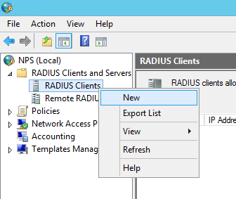
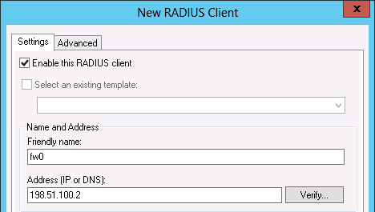
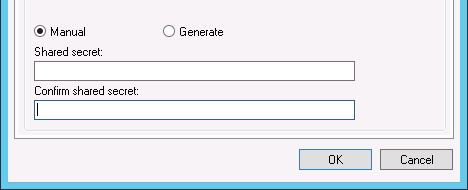
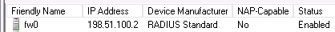
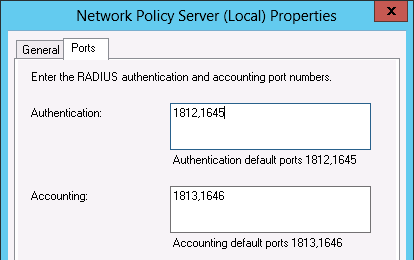

*************************************
Firew4ll e il software di terze parti
*************************************

Autenticazione RADIUS con Windows Server
''''''''''''''''''''''''''''''''''''''''

Windows 2008 e versioni successive possono essere configurati come
server RADIUS utilizzando il server della politica di rete (Network
Policy Server, NPS) di Microsoft. Ciò consente l'autenticazione per
OpenVPN, il captive portal, il server PPPoE o persino la stessa GUI di
|firew4ll| utilizzando gli account dell’utente locali del server o la
directory attiva di Windows.

Scelta di un server per NPS
===========================

NPS richiede una quantità minima di risorse ed è adatto per l'aggiunta a
un server Windows esistente nella maggior parte degli ambienti.
Microsoft consiglia di installarlo su un controller di dominio di Active
Directory per migliorare le prestazioni in ambienti in cui NPS esegue
l'autenticazione con Active Directory. Può anche essere installato su un
server membro, il che può essere desiderabile in alcuni ambienti per
ridurre l'impronta di attacco dei controller di dominio. Ogni servizio
accessibile in rete offre un'altra potenziale strada per compromettere
un server. NPS ha un solido record di sicurezza, soprattutto rispetto ad
altri servizi che devono essere in esecuzione su controller di dominio
affinché Active Directory funzioni, quindi questo non è un grosso
problema nella maggior parte degli ambienti di rete. La maggior parte
degli ambienti installa NPS su uno dei controller di dominio.

Installazione di NPS
====================

Su Windows Server 2008:

-  Passare a **Gestione dei server**

-  Fare clic su **Ruoli** a sinistra ed espanderlo

-  Fare clic su **Aggiungere ruoli** a destra

-  Fare clic su **Avanti** per saltare la schermata di introduzione

Su Server 2012:

-  Aprire **Gestione dei server della dashboard**

-  Fare clic su **Aggiungere ruoli e funzionalità**

-  Fare clic su Installazione basata su ruoli o basata su funzioni

-  Fare clic su **Avant**\ i ancora una volta

-  Selezionare il server dall'elenco

-  Fare di nuovo clic su **Avanti**

Su entrambe le versioni del server, i passaggi rimanenti sono simili:

-  Controllare **Politica di rete** e i **servizi di accesso**
   nell'elenco dei ruoli

-  Fare clic su **Aggiungere funzionalità** se appare

-  Fare clic su **Avanti** su ciascuna schermata fino alla fine della
   procedura guidata

-  Fare clic su **Finire** o **Installare**, a seconda della versione
   del server di Windows

   1. .. rubric:: Configurazione di NPS
         :name: configurazione-di-nps

Per configurare NPS, visualizzare Gestione del server e dovrebbero
essere presenti o Politica di rete e Servizi di accesso (2008) o NAP
(2012).

Per prima cosa verrà aggiunto un client RADIUS per |firew4ll|, quindi
verranno configurati i criteri di accesso remoto.

Aggiunta di un client RADIUS
----------------------------

Aprire la configurazione NPS:

Sul server 2008:

-  Aprire l'albero della **Gestione del server**

-  Espandere la vista sotto di essa fino a quando **client e server**
   **RADIUS** sono visibili

-  Fare clic su **Client RADIUS**

Sul server 2012:

-  Apri la dashboard di **gestione del server**

-  Fare clic su **NAP**

-  Fare clic con il tasto destro sul server nell'elenco dei server

-  Fare clic su **Politica del server di rete**

-  Espandere **Client e server RADIUS**

-  Fare clic su **client RADIUS**

Aggiungere il nuovo client RADIUS:

-  Fare clic con il tasto destro su **client RADIUS**

Fare clic su **Nuovo**, come mostrato in figura *Aggiungere un nuovo
client RADIUS*

|image0|

Fig. 1: Aggiungere un nuovo client RADIUS

-  Immettere un nome descrittivo per il firewall, come mostrato nella
   figura *Aggiungere nuovo indirizzo client RADIUS*. Questo può essere
   l'hostname o FQDN.

-  Immettere l'indirizzo (IP o DNS) per il firewall, che deve essere
   l'indirizzo IP da cui |firew4ll| avvierà le richieste RADIUS o un nome
   di dominio completo che si risolverà in quell'indirizzo IP.

.. note::  Questo è l'indirizzo IP dell'interfaccia del firewall più vicino al server RADIUS. Se il server RADIUS è raggiungibile tramite l'interfaccia LAN del firewall, questo sarà l'indirizzo IP della LAN. Nelle distribuzioni in cui |firew4ll| non è il firewall perimetrale e l'interfaccia WAN risiede sulla rete interna in cui risiede il server RADIUS, l'indirizzo IP della WAN è ciò che deve essere inserito.

|image1|

Fig. 2: Aggiungere nuovo indirizzo client RADIUS

-  Immettere un **segreto condiviso**, come mostrato nella figura
   *Aggiungere un nuovo segreto condiviso del client RADIUS*. Questo
   segreto condiviso viene utilizzato da |firew4ll| per autenticarsi quando
   si effettuano richieste di accesso RADIUS. Windows può crearne uno
   automaticamente facendo clic su **Generare**.

-  Cliccare OK.

|image2|

Fig. 3: un nuovo segreto condiviso del client RADIUS

La configurazione di NPS è ora completa. Il client RADIUS è visibile
come nella figura *Elenco del client RADIUS*.

|image3|

Fig. 4: Elenco del client RADIUS

Fare riferimento alle sezioni precedenti di questa guida che descrivono
il servizio da utilizzare con RADIUS per ulteriori indicazioni su come
utilizzare il servizio. RADIUS può essere utilizzato in Gestione utenti
(*Gestione e autenticazione dell'utente*) che abilita anche RADIUS per
IPsec e OpenVPN, per il captive portal (*Configurazione del portale
mediante l'autenticazione RADIUS*) e il server PPPoE (*Server PPPoE*),
tra l'altro.

Configurazione di utenti e politica di rete
-------------------------------------------

Se un utente può eseguire l'autenticazione tramite RADIUS è controllato
tramite la **politica di rete**. Utilizzando la politica di rete, un
amministratore può collocare un utente in uno specifico gruppo di Active
Directory per consentire l'accesso VPN e offrire anche funzionalità più
avanzate come le restrizioni dell'ora del giorno.

Ulteriori informazioni sui criteri di accesso remoto sono disponibili
nella documentazione di Microsoft all'indirizzo
http://technet.microsoft.com / it-it/library/cc785236% 28WS.10% 29.aspx.

Aggiunta di una politica di rete
--------------------------------

-  Aprire la finestra di configurazione di NPS

-  Espandere **NPS (locale)**, **Politica**, quindi **Politica di rete**

-  Fare clic con il tasto destro su **Politica di rete**

-  Fare clic su **Nuovo**

-  Immettere Consentire da |firew4ll| nel **nome della politica**

-  Lasciare il **Tipo di server di accesso alla rete** impostato su *Non
   specificato*

-  Fare clic su **Avanti**

-  Fare clic su **Aggiungere** nella finestra Specificare condizioni

-  Selezionare **gruppi di Windows**

-  Cliccare **Aggiungere**

-  Immettere o selezionare il nome del gruppo utenti che contiene utenti
   VPN, ad esempio UtenteVPN

-  Cliccare

-  Fare clic su **Avanti**

-  Scegliere **Accesso concesso**

-  Fare clic su **Avanti**

-  Selezionare **metodi di autenticazione** aggiuntivi in ​​base alle
   necessità per le funzionalità su |firew4ll|:

   -  Lasciare selezionati i metodi di autenticazione esistenti

      -  Selezionare **Microsoft: Password protetta (EAP-MSCHAP v2)** se
         questo criterio verrà utilizzato per l'autenticazione IPsec
         IKEv2 EAP-RADIUS

      -  Selezionare **Autenticazione crittografata (CHAP)**

      -  Selezionare **Autenticazione non crittografata (PAP, SPAP)**

    lasciando tutti gli altri metodi selezionati che erano già
    abilitati.

-  Fare clic su **Avanti**

-  Fare clic su Rifiutare se la procedura guidata presenta un prompt per
   visualizzare un argomento della guida

-  Configurare eventuali restrizioni di accesso aggiuntive, se
   necessario

-  Fare clic su **Avanti** sulle schermate rimanenti fino a raggiungere
   la schermata finale

-  Fare clic su **Finire**

Modifica di una politica di rete esistente
------------------------------------------

Le politiche esistenti possono essere modificate per modificarne i
vincoli o altre proprietà. Ad esempio, per modificare una politica
precedente per abilitarla per l'uso da IPsec per IKEv2 EAP-RADIUS:

-  Aprire la finestra di configurazione di NPS

-  Espandere **NPS (locale)**, **Politica**, quindi **Politica di rete**

-  Modificare la politica attualmente in uso

-  Fare clic sulla scheda **Vincoli**

-  Fare clic su **Metodi di autenticazione**

-  Cliccare **Aggiungere**

-  Selezionare **Microsoft: password protetta (EAP-MSCHAP v2)**

-  Cliccare **OK**

-  Fare clic su **Applicare** per riavviare NPS

-  Cliccare **OK**

Risoluzione dei problemi di NPS
-------------------------------

Se l'autenticazione fallisce, questa sezione descrive i problemi più comuni che gli utenti incontrano con NPS.

Verificare la porta
-------------------

Innanzitutto assicurarsi che la porta predefinita **1812** sia
utilizzata da NPS. Se il server NPS era stato precedentemente
installato, potrebbe essere stato configurato con porte non standard.

-  Aprire la finestra di configurazione di NPS

-  Fare clic con il tasto destro su **NPS (Locale)** nella parte
   superiore sinistra della console

-  Fare clic su **Proprietà**

-  Fare clic sulla scheda **Porte**

-  Verificare la configurazione della porta di **autenticazione**.
   Specificare più porte separandole con una virgola. (come mostrato in
   figura *Porte NPS*). La porta 1812 **deve** essere una delle porte
   configurate per l'autenticazione.

-  Verificare le porte di **Accounting**, se necessario. Se è richiesta
   l’accounting RADIUS, la porta 1813 deve essere una delle porte
   specificate in questa casella.

Controllare il visualizzatore degli eventi
------------------------------------------

Quando il server risponde a un tentativo di autenticazione RADIUS, NPS
accede al registro di sistema nel visualizzatore degli eventi con il
risultato della richiesta di autenticazione. Se l'accesso viene negato,
viene registrato il motivo per cui è stato negato.

Nel campo Descrizione delle proprietà dell'evento, la riga Motivo indica
perché l'autenticazione non è riuscita. I due errori comuni sono: nome
utente e password errati, quando un utente immette credenziali errate; e
"l'autorizzazione di accesso remoto per l'account utente è stata negata"
quando l'account utente è impostato su Negare accesso o la politica di
rete configurata in NPS non consente l'accesso per quell'utente. Se NPS
registra che l'autenticazione ha avuto esito positivo, ma il client
riceve un nome utente o password errato, il segreto RADIUS configurato
in NPS e |firew4ll| non corrisponde.

I registri NPS nel Visualizzatore eventi possono essere facilmente
trovati in Viste personalizzate, quindi Ruoli server e infine Criteri di
rete e Servizi di accesso.

|image4|

Fig.5: Porte NPS

Server di Syslog su Windows con Kiwi Syslog
'''''''''''''''''''''''''''''''''''''''''''

|firew4ll| può inviare registri a un server esterno tramite il protocollo
syslog (*Registrazione remota con Syslog*). Per gli utenti di Windows,Il
server di Syslog di Kiwi (Kiwi Syslog Server) è una bella opzione
gratuita per la raccolta di registri dai firewall |firew4ll|. Può essere
installato come servizio per la raccolta dei registri a lungo termine o
come applicazione per esigenze a breve termine. È compatibile con
entrambe le versioni server e desktop di Windows 2000 e successive.
L'installazione è semplice e non richiede molta configurazione. La guida
è disponibile nella sua documentazione dopo l'installazione.

Usare il software dal sistema di porte di FreeBSD (pacchetti)
'''''''''''''''''''''''''''''''''''''''''''''''''''''''''''''

Poiché |firew4ll| è basato su FreeBSD, molti pacchetti familiari di FreeBSD
sono disponibili per l'uso da parte degli amministratori di sistema di
FreeBSD.

.. warning:: L'installazione del software in questo modo non è per inesperti, in quanto potrebbe avere effetti indesiderati e non è consigliata né supportata

Molte parti di FreeBSD non sono incluse, quindi possono verificarsi
problemi con la libreria e altri problemi quando si tenta di usare il
software installato in questo modo. |firew4ll| non include un compilatore
nel sistema di base per molte ragioni e poiché tale software non può
essere creato localmente. Tuttavia, i pacchetti possono essere
installati dal repository di pacchetti predefinito di FreeBSD.

Preoccupazioni/avvertenze
=========================

Diversi problemi importanti devono essere considerati da qualsiasi
amministratore prima di decidere di installare un software aggiuntivo a
un firewall |firew4ll|, in particolare il software che non è un pacchetto
sanzionato.

Problemi di sicurezza
---------------------

Qualsiasi software aggiuntivo aggiunto a un firewall è un problema di
sicurezza e deve essere valutato completamente prima dell'installazione.
Se la necessità supera il rischio, può valere la pena assumerla. I
pacchetti ufficiali di |firew4ll| non sono immuni da questo problema.
Qualsiasi servizio aggiuntivo è un altro potenziale vettore di attacco.

Preoccupazioni per le prestazioni
---------------------------------

La maggior parte dell'hardware che esegue |firew4ll| è in grado di gestire
il carico di traffico con cui è assegnato. Se l'hardware del firewall ha
una potenza di riserva, potrebbe non danneggiare il sistema per
aggiungere un software aggiuntivo. Detto questo, bisogna essere
consapevoli delle risorse consumate dal software aggiunto.

Software in conflitto
---------------------

Se un pacchetto installato duplica la funzionalità rilevata nel sistema
di base o sostituisce un pacchetto di sistema di base con una versione
più recente, potrebbe causare un’instabilità del sistema imprevedibile.
Assicurarsi che il software non esista già in |firew4ll| prima di provare a
installare qualcosa.

Mancanza di integrazione
------------------------

Qualsiasi software aggiuntivo installato non avrà l'integrazione della
GUI. Per alcuni, questo non è un problema, ma ci sono state persone che
si aspettavano di installare un pacchetto e di far apparire magicamente
una GUI per la sua configurazione. Questi pacchetti dovranno essere
configurati manualmente. Se si tratta di un servizio, significa anche
assicurarsi che tutti gli script di avvio soddisfino i metodi utilizzati
da |firew4ll|.

Il software può anche installare pagine Web aggiuntive che non sono
protette dal processo di autenticazione su |firew4ll|. Testare qualsiasi
software installato per assicurarsi che l'accesso sia protetto o
filtrato in qualche modo.

Mancanza di backup
------------------

I pacchetti installati in questo modo devono essere sottoposti a backup
manuale di qualsiasi configurazione o altro file necessario.

**Non verrà eseguito il backup di questi file** durante un normale
backup di |firew4ll| e il backup potrebbe andare perso o modificato durante
un aggiornamento del firmware. Il pacchetto aggiuntivo descritto in
*File e directory di backup con il pacchetto di backup* è in grado di
eseguire il backup di file come questi.

Installazione dei pacchetti
===========================

Per installare un pacchetto, è necessario utilizzare il sito del
pacchetto corretto. |firew4ll| è compilato su uno specifico ramo di RELEASE
di FreeBSD e ha solo un set specifico di pacchetti ospitati sui server
di progetto.

I pacchetti situati nel repository dei pacchetti |firew4ll|, inclusi alcuni
pacchetti software FreeBSD che non fanno parte di |firew4ll|, possono
essere installati direttamente usando Pkg install ::

# pkg install iftop

Oppure usare un URL completo per aggiungere un pacchetto per aggiungerlo
dai server dei pacchetti di FreeBSD::

# pkg add http://pkg.freebsd.org/freebsd:11:x86:64/quarterly/All/iftop-1.0.p4.txz

Il pacchetto verrà scaricato e installato, insieme a tutte le dipendenze
necessarie.

Inoltre, il set completo di pacchetti FreeBSD può essere reso
disponibile modificando /usr/local/etc/pkg/repos/ |firew4ll|.conf e
cambiando la prima riga in::

FreeBSD: { enabled: yes }

.. warning:: L'aggiunta di software dai repository di pacchetti di FreeBSD può introdurre problemi con le dipendenze dei pacchetti, specialmente se un pacchetto dipende da un altro software già esistente su pfSense che potrebbe essere stato creato con opzioni in conflitto. Prestare estrema attenzione quando si aggiungono pacchetti in questo modo.

I pacchetti personalizzati possono anche essere creati su un altro
computer che esegue FreeBSD e quindi il file del pacchetto può essere
copiato e installato su un firewall |firew4ll|. A causa della complessità
di questo argomento, non verrà trattato qui.

Mantenimento dei pacchetti
==========================

Il seguente comando stampa un elenco di tutti i pacchetti attualmente
installati, inclusi i pacchetti |firew4ll| e parti del sistema di base di
|firew4ll|::

# pkg info

Per eliminare un pacchetto installato, passare il nome completo o
utilizzare un carattere wildcard::

# pkg_delete iftop-1.0.p4
# pkg_delete pstree-\*

Configurare BIND come un server DNS dinamico RFC 2136
'''''''''''''''''''''''''''''''''''''''''''''''''''''

Se il DNS per un dominio è controllato direttamente su un server BIND,
il supporto DNS dinamico RFC 2136 può essere impostato per essere
utilizzato da |firew4ll|. Questa sezione mostra come configurare BIND per
supportare questa funzione.

La posizione esatta della directory di configurazione per BIND varierà
in base al sistema operativo. Potrebbe essere in /usr/
local/etc/namedb/, /etc/namedb/ o altrove.

.. seealso::  Vedere *Configurazione degli aggiornamenti DNS dinamici RFC 2136* per ulteriori informazioni sul DNS dinamico RFC 2136.

Configurare il server BIND
==========================

Sul server in named.conf, aggiungere il seguente blocco::

include "/etc/namedb/dns.keys.conf";
zone "dyn.example.com" {
	type master;
	file "dynamic/dyn.example.com";
	update-policy { grant *.dyn.example.com. self dyn.example.com. A AAAA; };
};

Quindi creare il file di zona iniziale. BIND richiede l'accesso con
lettura/scrittura a questo file e alla directory in cui risiede in modo
che la zona e il suo diario possano essere aggiornati.

.. warning:: BIND riscriverà questo file di zona, motivo per cui un sottodominio viene utilizzato nell'esempio.

Da lì, creare il file di zona per la nuova zona dinamica,
dynamic/dyn.example.com::

$ORIGIN .
$TTL 30 ; 30 seconds
dyn.example.com IN SOA ns.example.com. hostmaster.example.com. (
					2016062801 ; serial
					3600 ; refresh (1 hour)
					600 ; retry (10 minutes)
					2600 ; expire (43 minutes 20 seconds)
					30 ; minimum (30 seconds)
					)
				NS ns.example.com.
				NS ns2.example.com.

Ricaricare il servizio denominato utilizzando rndc reload o un comando
simile, quindi se sono presenti server di nomi slave, aggiungere anche
una zona a tali server::

zone "dyn.example.com" {
	type slave;
	file "dynamic/dyn.example.com";
	masters{ 192.0.2.5; };
};

Sul server dei nomi master, creare la directory delle chiavi::

# mkdir -p /etc/namedb/keys

E ora generare una chiave host. La seconda riga è l'output del comando,
non parte del comando stesso.::

# /usr/sbin/dnssec-keygen -K /etc/namedb/keys -a HMAC-MD5 -b 128 -n HOST myhost.dyn.example.com.
Kmyhost.dyn.example.com.+157+32768

L'uscita Kmyhost.dyn.example.com.+157+32768 è la prima parte del nome
del file per la chiave, si aggiungerà .private a un file e .key per un
altro. Entrambi contengono gli stessi dati in diversi formati.

Ora leggere la chiave dal nuovo file chiave::

# /usr/bin/grep ^Key: /etc/namedb/keys/Kmyhost.dyn.example.com.+157+32768.private | /usr/bin/awk '{ print $2; }'
/0/4bxF9A08n/zke/vANyQ==

E poi aggiungere quella chiave al dns.keys.conf::

key myhost.dyn.example.com. {
	algorithm hmac-md5;
	secret "/0/4bxF9A08n/zke/vANyQ==";
};

Questo può essere automatizzato con un semplice script,
make-ddns-host.sh:

.. code-block:: bash

	#!/bin/sh
	KEY_NAME=${1}
	KEY_DIR=/etc/namedb/keys
	KEYS_CONFIG=/etc/namedb/dns.keys.conf
	/bin/mkdir -p ${KEY_DIR}
	cd ${KEY_DIR}
	KEY_FILE_NAME=`/usr/sbin/dnssec-keygen -K ${KEY_DIR} -a HMAC-MD5 -b 128 -n HOST ${KEY_NAME}.
	KEY_TEXT=`/usr/bin/grep "^Key:" ${KEY_DIR}/${KEY_FILE_NAME}.private | /usr/bin/awk '{print $2; }'`
	echo "key ${KEY_NAME}. {" >> ${KEYS_CONFIG}
	echo " algorithm hmac-md5;" >> ${KEYS_CONFIG}
	echo " secret \"${KEY_TEXT}\";" >> ${KEYS_CONFIG}
	echo "};" >> ${KEYS_CONFIG}
	echo "Key for ${KEY_NAME} is: ${KEY_TEXT}"

Dopo aver creato il file, renderlo eseguibile::

# chmod u+x make-ddns-host.sh

Usare lo script::

# ./make-ddns-host.sh mynewhost.dyn.example.com
# rndc reload

Configurare un client in |firew4ll|
================================

Per aggiungere una voce DynDNS nella GUI di |firew4ll|:

-  Passare a **Servizi>DNS dinamico**, scheda **RFC 2136**

-  Cliccare |image5| **Aggiungere** per creare una nuova voce con le
   seguenti impostazioni:

    **Abilitare** Selezionato

    **Interfaccia** *WAN*

    **Hostname** L'hostname completo, ad esempio
    xxxxx.dyn.example.com

    **TTL** 30

    **Nome chiave** Di nuovo l'hostname completo, esattamente:
    xxxxx.dyn.example.com

    **Host del tipo di chiave**

    **Chiave** Chiave segreta per questo hostname

    **Server** L'indirizzo IP o l'hostname del server BIND

    **Protocollo** Non selezionato

    **Descrizione** Mia voce DynDNS

-  Fare clic su **Salvare**

Supponendo che il firewall abbia connettività al server dei nomi e che
non vi siano altre politiche di accesso che impediscano l'aggiornamento,
il servizio RFDN 2136 DynDNS ora funziona. Se l'aggiornamento non
funziona, controllare il registro BIND e il registro di sistema su
|firew4ll|.

Mentre questo libro è incentrato su |firew4ll|, esistono numerosi pacchetti
software di terze parti che possono essere configurati per interagire
con |firew4ll| o aumentarne la funzionalità. In questo contesto, il
software di terze parti si riferisce al software disponibile da altri
fornitori o fonti che può essere utilizzato insieme a |firew4ll|, ma non è
considerato parte del "sistema |firew4ll|". Questi sono diversi dai
pacchetti |firew4ll|, che sono software extra che girano sul sistema
|firew4ll| e si integrano nella GUI del sistema.

.. |image5| image:: media/image6.png
   :width: 0.26389in
   :height: 0.26389in
