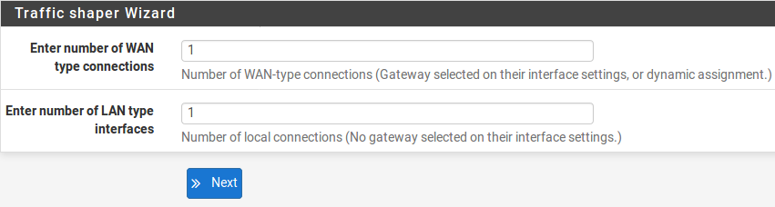
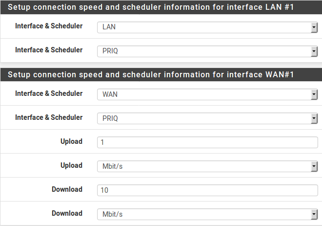
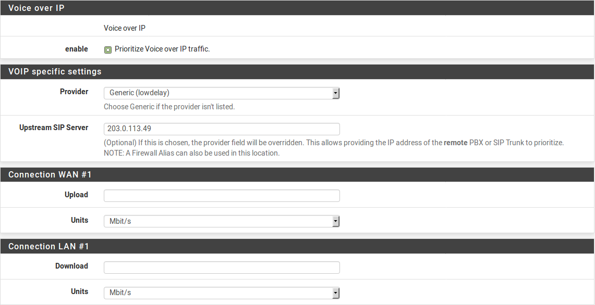
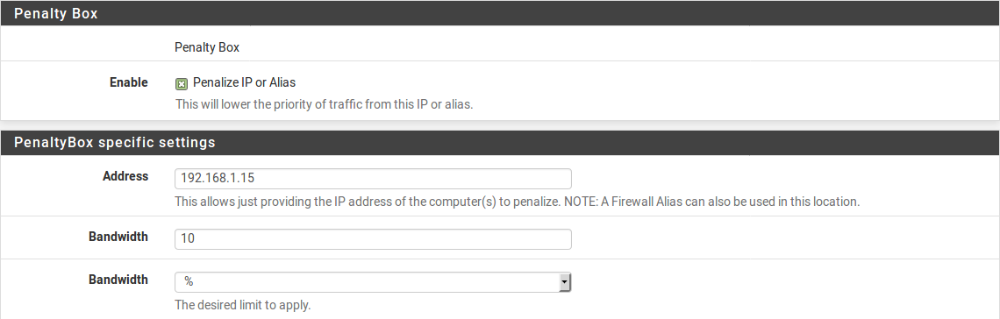
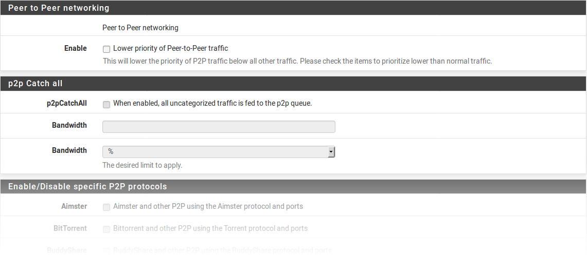
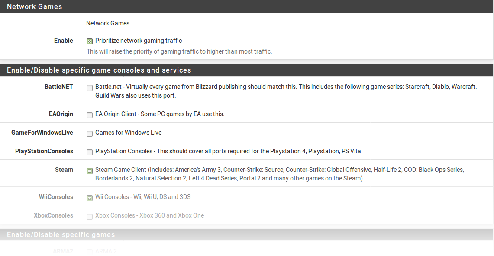
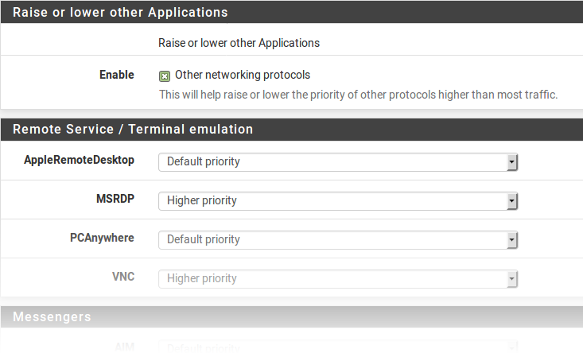
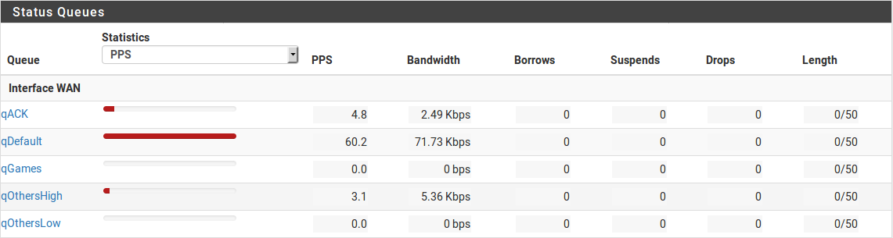
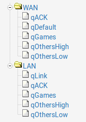
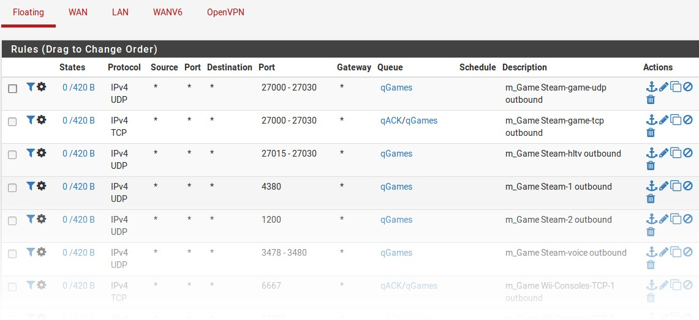

**************
Traffic Shaper
**************

Cosa puo' fare lo stabilizzatore (shaper) del traffico per una rete
''''''''''''''''''''''''''''''''''''''''''''''''''''''''''''''''''

L'idea di base dello stabilizzatore (shaping) il traffico è alzare e
abbassare le priorità dei pacchetti o tenerli sotto una certa velocità.
Questo concetto sembra semplice, tuttavia, il numero di modi in cui
questo concetto può essere applicato è vasto. Questi sono solo alcuni
esempi comuni che si sono dimostrati popolari con gli utenti del
software |firew4ll|.

Mantenere la navigazione stabile
================================

I collegamenti asimmetrici, in cui la velocità di download differisce
dalla velocità di upload, sono comuni, specialmente con DSL. Alcuni
collegamenti sono così squilibrati che la velocità massima di download è
quasi irraggiungibile perché è difficile per un firewall inviare
abbastanza pacchetti ACK (riconoscimento) da mantenere lo scorrimento
del traffico. I pacchetti ACK vengono trasmessi al mittente dall'host
ricevente per indicare che i dati sono stati ricevuti correttamente e
per segnalare che è OK inviarne di più. Se il mittente non riceve gli
ACK in modo tempestivo, i meccanismi di controllo della congestione in
TCP entreranno in funzione e rallenteranno la connessione.

Questo tipo di situazione è comune: quando si carica un file su un
collegamento con capacità di throughput asimmetrico, la navigazione e il
download rallentano la scansione o le bancarelle. Ciò accade perché la
parte di caricamento del circuito è piena per il caricamento del file e
c'è poco spazio per inviare pacchetti ACK che consentono ai download di
continuare a scorrere. Utilizzando lo shaper per dare la priorità ai
pacchetti ACK, il firewall può abilitare velocità di download più veloci
e stabili sui collegamenti asimmetrici.

Questo non è così importante sui link simmetrici in cui la velocità di
upload e download sono le stesse, ma può ancora essere auspicabile se la
larghezza di banda in uscita disponibile è fortemente utilizzata.

Mantenere le chiamate VoIP chiare
=================================

Se le chiamate Voice sull’IP utilizzano lo stesso circuito dei dati, i
caricamenti e i download potrebbero degradare la qualità delle chiamate.
Il software |firew4ll| può dare la priorità al traffico delle chiamate
sopra altri protocolli, e garantire che le chiamate passino attraverso
chiaramente senza interruzioni, anche durante lo streaming dei video ad
alta definizione di Netflix. Invece di interrompere la chiamata, lo
shaper riduce la velocità degli altri trasferimenti per lasciare spazio
alle chiamate.

Ridurre il Lag (ritard) nei giochi
==================================

Lo shaper ha anche opzioni per dare la priorità al traffico associato ai
giochi in rete. Anlogamente alla priorità delle chiamate VoIP, l'effetto
è che, anche se gli utenti della rete stanno scaricando durante il
gioco, il tempo di risposta del gioco dovrebbe essere ancora veloce come
se il resto della connessione fosse inattivo.

Tenere sotto controllo le applicazioni P2P
==========================================

Abbassando la priorità del traffico associato a porte Peer-to-Peer note,
gli amministratori possono essere più tranquilli sapendo che anche se
questi programmi sono in uso, non ostacoleranno altro traffico sulla
rete. A causa della sua priorità più bassa, altri protocolli saranno
favoriti sul traffico P2P, che sarà limitato quando altri servizi hanno
bisogno della larghezza di banda.

Applicare i limiti di larghezza di banda
========================================

I limitatori possono applicare un limite di larghezza di banda a un
gruppo di dispositivi, come a tutto il traffico su un'interfaccia, o il
mascheramento sui limitatori può applicarli per un indirizzo IP o per
una rete. In questo modo il firewall può garantire che nessuna persona
possa consumare tutta la larghezza di banda disponibile.

Limitazioni hardware
''''''''''''''''''''

L' ottimizzazione del traffico viene eseguito con l'aiuto di **ALTQ**.
Sfortunatamente, solo un sottoinsieme di tutte le schede di rete supportate è in grado di utilizzare queste funzionalità perché i driver devono essere modificati per supportare lo shaping con ALTQ. Le seguenti schede di rete sono in grado di utilizzare lo ottimizzazione del traffico::

ae(4), age(4), alc(4), ale(4), an(4), aue(4), axe(4), bce(4), bfe(4), bge(4), bridge(4), cas(4), cpsw(4), cxl(4), dc(4), de(4), ed(4), em(4), ep(4), epair(4), et(4), fxp(4), gem(4), hme(4), hn(4), igb(4), ix(4), jme(4), l2tp(4), le(4), lem(4), msk(4), mxge(4), my(4), ndis(4), nfe(4), ng(4), nge(4), npe(4), nve(4), ovpnc(4), ovpns(4), ppp(4), pppoe(4), pptp(4), re(4), rl(4), sf(4), sge(4), sis(4), sk(4), ste(4), stge(4), ti(4), tun(4), txp(4), udav(4), ural(4), vge(4), vlan(4), vmx(4), vr(4), vte(4), vtnet(4), xl(4)

I limitatori utilizzano un sistema di back-end diverso, che opera
attraverso le ``dummynet`` pipe in ``ipfw`` e non attraverso **ALTQ**. In quanto
tali, tutte le schede di rete possono essere utilizzate con i
limitatori, senza restrizioni. Se un firewall contiene una scheda che
non supporta ALTQ, può utilizzare invece i limitatori.

Tipi di pianificatore ALTQ
''''''''''''''''''''''''''

Il software |firew4ll| contiene diversi tipi di pianificatori ALTQ per
coprire una vasta gamma di scenari di shaping. Le opzioni per ALTQ sono:

    **Accodamento prioritario** **(PRIQ)** Gestisce la priorità delle
    connessioni

    **Accodamento basato su classi** **(CBQ)** Supporta la condivisione
    della larghezza di banda tra code e limiti di larghezza di banda

    **Curva gerarchica del servizio equo (HFSC)** Supporta le garanzie
    di larghezza di banda in tempo reale insieme a un albero gerarchico
    di code nidificate.

    **Ritardo controllato (CoDel)** Tentativi di combattere l’aumento
    del buffer (bufferbloat).

    **Accodamento equo (FAIRQ)** Tenta di distribuire abbastanza
    larghezza di banda tra tutte le connessioni.

PRIQ, CBQ e HFSC sono selezionabili nelle procedure guidate dello shaper
e le procedure guidate mostreranno le opzioni appropriate e creeranno le
code in base alla disciplina ALTQ scelta.

Avvertimenti sulle prestazioni
==============================

L'attivazione di dello ottimizzazione del traffico con ALTQ pone un onere
aggiuntivo sull'hardware e ci sarà una potenziale perdita complessiva
delle prestazioni della rete. Sui sistemi che hanno potenza da
risparmiare, questo potrebbe non essere evidente. Su sistemi che operano
vicino alle loro specifiche limita che il firewall possa vedere un
degrado delle prestazioni. Considerare la perdita peggiore rispetto al
lavoro senza lo shaper dipende dal carico di lavoro individuale.

Accodamento prioritario (PRIQ)
==============================

PRIQ è una delle discipline più semplici da configurare e comprendere.
Le code sono tutte direttamente sotto la coda di root, non esiste una
struttura per avere code sotto altre code con PRIQ in quanto esiste con
HFSC e CBQ. Non importa la larghezza di banda sulle interfacce, solo la
priorità delle code. I valori per la priorità vanno da 15, e maggiore è
il numero di priorità, più è probabile che la coda ottenga
l’elaborazione dei suoi pacchetti.

PRIQ può essere d’ostacolo per le code minori, diminuendo le loro
risorse quando le code di priorità più alte richiedono larghezza di
banda. In casi estremi, è possibile che una coda di priorità inferiore
abbia pochi o nessun pacchetto gestito se le code di priorità più
elevate consumano tutte le risorse disponibili.

Curva gerarchica del servizio equo (HFSC)
=========================================

La disciplina HFSC dello ottimizzazione del traffico è molto potente. È utile
per servizi come VoIP e per i video per fornire una quantità minima
garantita di larghezza di banda.

Le code in HFSC sono disposte in una gerarchia o in un albero, con code
di root per ogni interfaccia, code primarie sottostanti e code
secondarie nidificate sotto le code primarie (ecc.). Ogni coda può avere
una larghezza di banda impostata e le relative opzioni.

Opzioni di coda specifiche per HFSC
-----------------------------------

HFSC supporta alcune opzioni di coda che non sono supportate da altre
discipline. È attraverso queste opzioni che raggiunge l'elaborazione in
tempo reale garantita e la condivisione dei collegamenti.

La curva di servizio (sc) si trova dove i requisiti di larghezza di
banda per questa coda sono sintonizzati.

    **m1** Limite della larghezza di banda in grado di scoppiare

    **d** Tempo per scoppiare il limite della larghezza di banda,
    specificato in millisecondi. (ad esempio 1000 = 1 secondo)

    **m2** Limite della larghezza di banda normale

Ad esempio, una connessione richiede larghezza di banda **m1** entro il
tempo **d**, ma un massimo normale di **m2**. Entro il tempo iniziale
impostato da **d**, **m2** non è selezionato, solo **m1**. Dopo che
**d** è scaduto, se il traffico è ancora sopra **m2**, sarà
stabilizzato. Più comunemente, **m1** e **d** sono lasciati vuoti, in
modo che solo **m2** sia selezionato.

Ciascuno di questi valori può essere impostato per i seguenti usi:

    **Limite superiore** Massima larghezza di banda consentita per la
    coda. Farà una limitazione della larghezza di banda dura. Il
    parametro **m1** qui può anche essere utilizzato per limitare lo
    scoppio. Nel lasso di tempo **d** una connessione non otterrà più di
    larghezza di banda **m1**.

    **Tempo reale** Garanzia di larghezza di banda minima per la coda.
    Questo è valido solo per le code secondarie. Il parametro **m1**
    sarà sempre soddisfatto nel lasso di tempo **d** e **m2** è il
    massimo che questa disciplina consentirà di utilizzare. Nota: il
    valore per **m2** non può superare il 30% della larghezza di banda
    disponibile per la coda primaria.

    **Condivisione del link** La quota di larghezza di banda di una coda
    registrata prima. Condividerà la larghezza di banda tra le classi se
    le garanzie in **tempo reale** sono state soddisfatte. Il valore
    **m2** per la **condivisione del link** sovrascriverà l'impostazione
    della **larghezza di banda** per la coda. Queste due impostazioni
    sono le stesse, ma se entrambe sono impostate, viene utilizzata
    **m2** dalla **condivisione del link**.

Combinando questi fattori, una coda otterrà la larghezza di banda
specificata dai fattori in **tempo reale**, più quelli dalla
**condivisione del link**, fino al massimo del **limite superiore**. Si
può avere un sacco di tentativi ed errori, e forse utilizzare un sacco
di aritmetica, ma potrebbe valerne la pena per garantire che il traffico
di rete sia regolato correttamente. Per ulteriori informazioni sui
valori **m1**, **d** e **m2** per diversi scenari, visitare il forum
sullo ottimizzazione del traffico di |firew4ll|.

Accodamento basato su classi (CBQ)
==================================

L'accodamento basato su classi, o CBQ, è simile a HFSC in quanto può
avere un albero di code nidificate sotto altre code. Supporta i limiti
della larghezza di banda (non garantisce come HFSC), le priorità per le
code e ha la capacità di consentire alle code di prendere in prestito la
larghezza di banda dalla primaria. A causa della configurazione della
coda più semplice, può essere una buona alternativa a HFSC soprattutto
se il firewall non ha bisogno di garantire larghezze di banda minime.

Con CBQ, le priorità della coda vanno da 7 con numeri più alti che
indicano priorità più alta. Le code di uguale priorità vengono elaborate
in modo round-robin.

.. note::  sebbene le code secondarie possano prendere in prestito dalla
coda primaria, la somma della larghezza di banda delle code secondarie
non può superare la larghezza di banda della primaria. Pertanto, CBQ non
è un'alternativa ai limitatori per i limiti di larghezza di banda
individuali (ad esempio per indirizzo IP).

Opzioni di coda specifiche per CBQ
----------------------------------

La disciplina CBQ supporta il concetto di *prestito*, il che significa
che se la casella di selezione **Prendere in prestito da altre code
quando disponibile** sulla coda è abilitata, la coda sarà in grado di
prendere in prestito altra larghezza di banda disponibile dalla coda
primarie. Ciò consentirà solo a una coda secondaria di ottenere fino
alla larghezza di banda dellla coda primaria immediata, se disponibile,
non da altre code primarie.

Gestione attiva delle code con CoDel
====================================

   La disciplina della gestione attiva delle code con CoDel (AQM) è
   l'abbreviazione per il ritardo controllato ed è pronunciata “coddle”.
   È stata progettata per combattere i problemi associati all’aumento
   del buffer nell'infrastruttura di rete. Il bufferbloat è descritto in
   dettaglio su
   http://www.bufferbloat.net/projects/bloat/wiki/Introduction. In
   parole povere, il traffico può accumularsi e andare in pezzi
   piuttosto che avere un flusso regolare a causa delle dimensioni dei
   buffer nelle apparecchiature di rete. Controllando il ritardo del
   traffico questo effetto può essere diminuito.

   CoDel non ha selezioni o opzioni di configurazione specifiche. Quando
   viene attivato per una coda, tenterà automaticamente di gestire il
   traffico come descritto nella Wiki di CoDel su
   http://www.bufferbloat.net/projects/codel/wiki. Tenta di mantenere
   bassi i ritardi del traffico ma consente lo scoppio, controlla i
   ritardi ma non presta attenzione al ritardo di andata e ritorno, al
   carico o alla velocità del collegamento e può regolarsi
   automaticamente se la velocità del collegamento cambia.

   L'obiettivo per CoDel è la rete di fascia media. Non funziona bene
   sulla larghezza di banda molto bassa (1Mbit/s o meno) e non gestisce
   con bene un gran numero di flussi simultanei o carichi di traffico
   del grado dei datacenter.

   CoDel non è configurabile utilizzando la procedura guidata, ma non
   richiede una configurazione complessa:

-  Passare a **Firewall>Traffic Shaper**, per scheda
   **Interfaccia**

-  Selezionare un'interfaccia (ad es. **WAN**)

-  Impostare il **tipo di pianificatore** su *CODEL*

-  Impostare un valore appropriato per la **larghezza di banda**

-  Fare clic su **Salvare**

-  Ripetere se necessario per tutte le altre interfacce di tipo WAN
   attive

Accodamento equo (FAIRQ)
========================

In FAIRQ, le code vengono monitorate dalla priorità più alta a quella
più bassa, ma il pianificatore tenta di distribuire in modo equo la
larghezza di banda tra tutte le connessioni.

Quando non c'è contesa per la larghezza di banda, FAIRQ invierà tutti i
pacchetti in attesa. Quando c'è contesa per la larghezza di banda FAIRQ
inizierà a cercare code che non superino i loro limiti, iniziando prima
con code ad alta priorità e lavorando poi con le code più basse. Un
pacchetto in una coda con completa priorità alta viene elaborato dopo un
pacchetto da una coda di priorità inferiore che non è completa. Se tutte
le code sono complete, FAIRQ invierà un pacchetto dalla coda di priorità
più alta.

FAIRQ consente alle connessioni di superare la larghezza di banda della
coda, ma manterrà un consumo medio pari alla larghezza di banda della
coda definita.

FAIRQ non è attualmente supportato nella procedura guidata dello shaper
del traffico e richiede una configurazione manuale.

Configurazione dello Traffic Shaper ALTQ con la procedura guidata
'''''''''''''''''''''''''''''''''''''''''''''''''''''''''''''''''

La prima volta si consiglia di configurare lo Traffic Shaper
utilizzando la procedura guidata, che guida gli amministratori
attraverso il processo di configurazione dello shaper.

.. tip:: a causa della complessità delle code e delle regole dello shaper, iniziare da zero è piuttosto complicato. Se un firewall ha bisogno di regole personalizzate, passare attraverso la procedura guidata e approssimare i requisiti, quindi fare regole personalizzate in seguito.

Ogni fase della procedura guidata imposta code e regole univoche che
controllano il traffico assegnato in tali code. Per configurare tutto
manualmente, specificare la velocità WAN nella prima schermata, quindi
fare clic su **Avanti** per tutti i passaggi rimanenti. La procedura
guidata richiede che le opzioni siano abilitate su almeno un passaggio,
ma non importa quale passaggio.

.. note::  
	completare la procedura guidata e fare clic su **Finire** alla fine sostituirà **tutte** le code dello shaper esistenti e le regole dinamiche create dalla procedura guidata, incluse quelle clonate dalle regole della procedura guidata, con le code e le regole della nuova configurazione della procedura guidata.

Scelta della procedura guidata
==============================

Per iniziare con la procedura guidata dello ottimizzazione del traffico,
passare a **Firewall>ottimizzazione del traffico** e fare clic sulla scheda
**Procedura guidata**. In questa pagina viene visualizzato un elenco di
procedure guidate di Traffic Shaper disponibili, tra cui:

    **LAN/WAN multiple** Utilizzata quando il firewall ha una o più WAN
    e una o più LAN. Questa è la procedura guidata più comune e copre la
    maggior parte degli scenari.

    **Collegamenti dedicati** Utilizzatta quando specifici accoppiamenti
    LAN+WAN devono essere contabilizzati nella configurazione dello
    shaper.

Avvio della procedura guidata
=============================

Ogni nome della procedura guidata è seguito dal nome del file della
procedura guidata, che è un collegamento. Fare clic sul collegamento per
avviare la procedura guidata. Questo esempio utilizza la procedura
guidata per LAN/WAN multiple, quindi fare clic su
traffic\_shaper\_wizard\_multi\_all.XML.

Successivamente, la procedura guidata si avvia e il primo passo richiede
il numero di connessioni di tipo WAN e LAN sul firewall, come nella
figura *Inserire il conteggio dell'interfaccia*.

-  Immettere il numero di connessioni di tipo WAN sul firewall. Si
       tratta di connessioni con un gateway configurato sull'interfaccia
       o interfacce di tipo WAN dinamica come DHCP o PPPOE

-  Immettere il numero di connessioni di tipo LAN. Si tratta di
       interfacce di rete locali senza un gateway sull'interfaccia

-  Fare clic su **Avanti** per procedere con il passo successivo

In questo esempio il firewall ha solo un'interfaccia WAN e una LAN.

|image0|

Fig. 1: Inserire il conteggio dell'interfaccia

Reti e velocità
===============

   Questo passaggio, mostrato nella figura *Configurazione dello
   shaper*, definisce le interfacce di rete che saranno all'interno e
   all'esterno dal punto di vista dello shaper, insieme alle velocità di
   **Download** e **Upload** per una determinata WAN. Quando il firewall
   ha più di un'interfaccia di un determinato tipo, la procedura guidata
   visualizza più sezioni della pagina per gestirle singolarmente.

   Oltre alle interfacce e alle loro velocità, selezionare un
   **pianificatore** di ALTQ (*Tipi di pianificatore di ALTQ*) per le
   WAN e le LAN. Utilizzare lo stesso pianificatore su ogni interfaccia.

   A seconda del tipo di connessione, la vera velocità di collegamento
   potrebbe non essere la velocità effettiva utilizzabile. Nel caso di
   PPPoE, il circuito non ha solo un overhead di PPPoE, ma anche un
   overhead dal collegamento di rete ATM sottostante utilizzato nella
   maggior parte delle distribuzioni PPPoE. Con alcuni calcoli, tra
   l’overhead di ATM, PPPoE, IP e TCP, il circuito potrebbe perdere fino
   al 13% della velocità di collegamento pubblicizzata. In caso di
   dubbio su cosa impostare la velocità, si consiglia di essere
   conservatori. Ridurre del 10-13% e lavorare di nuovo fino a valori
   più grandi. Se il firewall ha una linea di 3Mbit/s, impostarlo per
   circa 2,7 Mbit/s e quindi testare. La velocità sulla coda primaria
   risultante può essere modificata in seguito per regolare la larghezza
   di banda. Se ha un valore basso, la connessione verrà massimizzata
   esattamente alla velocità definita. Spingerlo più in alto fino a
   quando il firewall non vede più alcun guadagno nelle prestazioni.

   La velocità di interfaccia può essere specificata in Kbit/s, Mbit/s,
   o Gbit/s, ma utilizzare le stesse unità in ogni pagina.

-  Scegliere un'\ **interfaccia** e un **pianificatore** per ogni
   interfaccia di tipo LAN (ad esempio *LAN, PRIQ*)

-  S cegliere un'\ **interfaccia** e un **pianificatore** per ogni
   interfaccia di tipo WAN (ad esempio *WAN, PRIQ*)

-  Definire la velocità di **Upload** e le unità per ogni interfaccia di
   tipo WAN (ad esempio 1, *Mbit/s*)

-  Definire la velocità di **Download** e le unità per ogni interfaccia
   di tipo WAN (ad esempio 10, Mbit/s)

-  Fare clic su **Avanti** per procedere con il passo successivo

VOIP
====

La procedura guidata contiene diverse opzioni per la gestione del
traffico delle chiamate VoIP, mostrato in figura *Voce su IP*. La
priorità del traffico voce su IP imposta code e regole per dare priorità
alle chiamate VoIP e al traffico correlato. Questo comportamento può
essere messo a punto dalle altre impostazioni di questo passaggio della
procedura guidata.

    **Attivare** Una casella di selezione per abilitare le impostazioni
    VoIP in questo passaggio. Quando deselezionata, le opzioni sono
    disabilitate e queste code e regole non verranno aggiunte dalla
    procedura guidata.

    **Provider** Ci sono alcuni fornitori ben noti tra cui server
    *Vonage*, *Voicepulse*, *PanasonicTDA*, e *Asterisk*. Se il provider
    VoIP per questo sito non è nell'elenco, scegliere *generico*. Questa
    scelta imposta regole in base alle porte e ai protocolli noti per
    essere utilizzati da questi provider, piuttosto che corrispondere
    per indirizzo.

	.. note::  
		questa scelta corrisponde in base alle porte SIP e RTP, tra gli altri, quindi può corrispondere al traffico da altre fonti, anche se utilizzano le stesse porte del servizio selezionato.

**Server SIP Upstream** L'IP del PBX o del trunk di SIP upstream o un
alias contenente gli indirizzi IP o le reti per i trunk SIP. Quando
impostato, questo sovrascrive il campo **Provider** e corrisponderà
invece al traffico in base a questi indirizzi.

	.. note::  
		questa scelta corrisponde a tutto il traffico UDP da e verso gli indirizzi specificati. Nella maggior parte dei casi questo è OK, ma se ci sono altri servizi basati su UDP non VoIP sullo stesso indirizzo remoto, potrebbe corrispondere anche a quel traffico. Tali casi sono rari, tuttavia, quindi questa opzione tende ad essere più affidabile rispetto alla corrispondenza per porta.

|image1|

Fig. 2: Configurazione dello shaper

    **Upload per la connessione WAN** La quantità di larghezza di banda
    di upload da garantire per i dispositivi VoIP. Ciò varierà in base
    al numero di dispositivi VoIP presenti sulla rete e alla larghezza
    di banda richiesta da ciascuna sessione. Questa impostazione viene
    utilizzata da HFSC e CBQ e deve essere lasciata vuota per PRIQ.

	.. note::  
		la prenotazione della larghezza di banda per un servizio come VoIP non può superare il 30% della larghezza di banda disponibile sul link. Ad esempio, su un collegamento di 10Mbit/s, lo shaper non può riservare più di 3Mbit/s. 

    **Download per connessione LAN** La quantità di larghezza di banda
    di download da garantire per i dispositivi VoIP. Questa impostazione
    viene utilizzata da HFSC e CBQ e deve essere lasciata vuota per
    PRIQ.

.. note::  
	la migliore pratica è quella di utilizzare il trunk SIP **remoto** o l'indirizzo PBX perché altrimenti lo shaper potrebbe non essere in grado di abbinare correttamente il traffico. Ad esempio, utilizzando gli indirizzi IP dei telefoni, lo shaper può corrispondere solo al traffico in una direzione o per niente. Ciò è dovuto al modo in cui lo shaper corrisponde al traffico con le regole dinamiche in una direzione in uscita. NAT si applica prima che il traffico venga abbinato quando si esce da una WAN, quindi le regole dello shaper non possono corrispondere alle connessioni in uscita in base agli indirizzi IP privati locali.

Per utilizzare queste opzioni:

-  Controllare **Priorità del traffico voce su IP**

-  Scegliere **uno** dei seguenti:

   -  Scegliere un **Provider** dalla lista **o**

   -  Immettere un **indirizzo del server SIP di upstream** o alias
      contenente un trunk SIP **remoto** o PBX

-  Lasciare vuoto **Upload** e **Download** se si utilizza PRIQ,
   altrimenti immettere un valore di **Upload** o **Download**
   appropriato per ogni connessione

-  Fare clic su **Avanti** per procedere con il passo successivo

|image2|\ 

Fig. 3: Voce su IP

Casella di penalità
===================

   La casella di penalità, raffigurata nella figura *Casella di
   penalità*, è un luogo per relegare gli utenti dal comportamento
   anomalo o dispositivi che altrimenti consumano quantità indesiderate
   di larghezza di banda. A questi dispositivi viene assegnato un limite
   di larghezza di banda rigido che non può superare.

   **Abilitare** Una casella di selezione per abilitare le impostazioni
   della casella di penalità in questo passaggio. Quando deselezionate,
   le opzioni sono disabilitate e queste code e regole non verranno
   aggiunte dalla procedura guidata.

   **Indirizzo** L'indirizzo IP per penalizzare, o un alias contenente
   più indirizzi da penalizzare.

   **Larghezza di banda** La quantità di larghezza di banda che
   l'\ **indirizzo** può consumare, al massimo.

   Per utilizzare queste opzioni:

-  Selezionare **IP o Alias da penalizzare**

-  Immettere un indirizzo IP o un Alias nella casella **Indirizzo**

-  Inserire il limite di **larghezza di banda**

-  Scegliere le unità corrette per il limite di **larghezza di banda**

-  Fare clic su **Avanti** per procedere con il passo successivo

   |image3|

Fig. 4: Casella di penalità

Reti peer-to-peer (P2P)
======================

Il passo successivo, mostrato in figura *Reti Peer-to-Peer*, imposta i
controlli per molti protocolli di rete Peer-to-Peer (P2P). In base alla
progettazione, i protocolli P2P utilizzeranno tutta la larghezza di
banda disponibile a meno che non vengano messi in atto limiti. Se il
traffico P2P sarà presente su una rete, la migliore pratica è garantire
che non degraderà altro traffico.

.. note::  
	I protocolli P2P tentano deliberatamente di evitare il rilevamento. Bittorrent è particolarmente colpevole di questo comportamento. Spesso utilizza porte non standard o casuali o porte associate ad altri protocolli. Identificare tutto il traffico P2P può essere difficile o impossibile.

    **Abilitare** Una casella di selezione per abilitare le impostazioni
    del traffico P2P in questo passaggio. Quando deselezionata, le
    opzioni sono disabilitate e queste code e regole non verranno
    aggiunte dalla procedura guidata.

    **Peer-to-Peer cattura tutto** Fa sì che qualsiasi traffico non
    riconosciuto venga assunto come traffico P2P e tale traffico avrà la
    sua priorità abbassata di conseguenza.

		**Larghezza di banda** La quantità di larghezza di banda che il traffico non classificato può consumare, al massimo, quando P2P cattura tutto è attivo.
	
	.. warning:: 
		questa opzione acquisisce effettivamente la coda dello shaping del traffico predefinita e ne riduce la priorità. Quando questa opzione è attiva, è fondamentale che tutto il traffico legittimo sia abbinato a regole che impostano una priorità superiore alla priorità della coda P2P cattura tutto.
		
		Il passaggio Alzare/Abbassare le altre applicazioni della procedura guidata può essere d'aiuto qui, ma alla fine l'implementazione di questa attività richiede spesso regole manuali aggiuntive.

**Abilitare/Disabilitare protocolli P2P specifici** Queste opzioni
identificano vari protocolli P2P noti. Il firewall assegnerà porte e
protocolli associati a ciascuna opzione abilitata come traffico P2P.

Per utilizzare le opzioni in questo passaggio:

-  Selezionare la **priorità più bassa del traffico Peer-to-Peer**

-  Opzionalmente abilitare le funzionalità di **P2P cattura tutto**

   -  Inserire il limite di **larghezza di banda** per **P2P Cattura
      tutto**, se abilitato

   -  Scegliere le unità corrette per il limite di **larghezza di
      banda**

-  Selezionare i protocolli per il firewall da classificare come
   traffico P2P

-  Fare clic su Avanti per procedere con il passo successivo

-  

|image4|

Fig. 5: Reti Peer-to-Peer

Giochi in Rete
==============

I giochi Online in genere si basano sulla bassa latenza per esperienze
di giocatori accettabili. Se un utente della rete tenta di scaricare
file di grandi dimensioni o patch di gioco durante il gioco, il traffico
può facilmente soffocare i pacchetti associati al gioco stesso e causare
ritardo o disconnessioni. Se il firewall dà priorità al traffico di
gioco, si può garantire che il traffico sarà consegnato prima e più
velocemente.

    **Abilitare** Una casella di selezione per abilitare le impostazioni
    del traffico di gioco in questo passaggio. Quando deselezionata, le
    opzioni sono disabilitate e queste code e regole non verranno
    aggiunte dalla procedura guidata.

    **Abilitare/disabilitare console e servizi di gioco specifici**
    Queste opzioni corrispondono al traffico per intere console di gioco
    o servizi online che utilizzano porte e protocolli comuni a tutti, o
    almeno alla maggioranza, dei loro giochi.

    **Abilitare/disabilitare giochi specifici** Queste opzioni
    corrispondono al traffico per giochi specifici che si discostano
    dalle categorie generali nella sezione precedente.

.. tip:: per dare la priorità a un gioco che non è elencato, selezionare qualsiasi altro gioco dall'elenco in modo che la procedura guidata crei le code e le regole da utilizzare come base di riferimento. Dopo aver completato la procedura guidata, modificare le regole risultanti per abbinare il gioco non elencato.

Per utilizzare le opzioni in questo passaggio:

-  Controllare **Dare priorità al traffico di gioco di rete**

-  Selezionare qualsiasi console di gioco sulla rete dall'elenco in
   **Abilitare/disabilitare console e servizi di gioco specifici**

-  Selezionare tutti i giochi sulla rete dalla lista in
   **Abilitare/disabilitare giochi specifici**

-  Fare clic su **Avanti** per procedere con il passo successivo

   |image5|

Fig. 6: Giochi Di Rete

Priorità o secondarietà di altre applicazioni
=================================================

L'ultima schermata di configurazione della procedura guidata dello
shaper, vista in figura *Alzare o abbassare le altre applicazioni,*
elenca una serie di altre applicazioni e protocolli comunemente
disponibili.

Le esigenze di una particolare rete dettano come il firewall dovrebbe
gestire ogni protocollo. Ad esempio, in una gestione dell'ambiente
aziendale potrebbe voler ridurre la priorità del traffico non
interattivo come l'e-mail in cui una riduzione della velocità non viene
solitamente notata dagli utenti e potrebbe anche voler aumentare la
priorità dei servizi interattivi come RDP in cui le scarse prestazioni
sono un impedimento per i dipendenti. In una casa, lo streaming
multimediale può essere più importante e altri servizi possono avere la
loro priorità abbassata dallo shaper.

.. tip:: Come per altri passaggi di questa procedura guidata dello shaper, se un protocollo non è elencato, selezionare un protocollo simile e quindi regolare le regole dopo aver completato la procedura guidata.

    **Attivare** Una casella di selezione per abilitare le impostazioni
    di questo passaggio. Quando deselezionata, le opzioni sono
    disabilitate e queste code e regole non verranno aggiunte dalla
    procedura guidata.

    **Categorie di protocollo** Ogni sezione contiene protocolli ben
    noti, raggruppati per la loro funzione generale.

    Ci sono più di 40 protocolli tra cui scegliere, e a ciascuno può
    essere data una *priorità più alta*, *priorità più bassa*, o
    lasciato alla *priorità predefinita*.

		.. tip:: Se l'opzione **P2P cattura tutto** è attivo, si consiglia vivamente di utilizzare questo passaggio per garantire che questi altri protocolli  siano riconosciuti e trattati normalmente, piuttosto che penalizzati dalla regola P2P cattura tutto predefinita.

Per utilizzare le opzioni in questo passaggio:

-  Selezionare **altri protocolli di rete**

-  Individuare protocolli specifici nell'elenco per modificare la
   priorità.

-  Per ogni protocollo, scegliere una tra *priorità più alta*, *priorità
   più bassa*, o lasciare *priorità predefinita*.

-  Fare clic su **Avanti** per procedere con il passo successivo

|image6|

Fig. 7: Alzare o abbassare le altre applicazioni

Completamento della procedura guidata
=====================================

   Fare clic su **Finire** per completare la procedura guidata. Il
   firewall creerà quindi tutte le regole e le code per le opzioni
   abilitate, quindi ricaricherà il set di regole per attivare le nuove
   impostazioni dello Traffic Shaper.

   A causa del firewall che funziona in modo stateful, il firewall può
   applicare solo le modifiche nello ottimizzazione del traffico alle nuove
   connessioni. Affinché le nuove impostazioni dello shaping del
   traffico siano completamente attive su tutte le connessioni,
   cancellare gli stati.

   Per reimpostare il contenuto della tabella di stato:

-  Passare a **Diagnostica>Stati**

-  Fare clic sulla scheda **Ripristinare gli stati**

-  Controllare **Reimpostare la tabella dello stato del firewall**

-  Fare clic su **Ripristinare**

Procedura guidata dello shaper e IPv6
=====================================  

La procedura guidata dello shaper crea regole solo per il traffico IPv4.
Le regole possono essere regolate manualmente o clonate e impostate per
IPv6.

Monitoraggio delle code
'''''''''''''''''''''''

Monitorare lo shaper utilizzando **Stato>Code** per garantire che lo
ottimizzazione del traffico funzioni come previsto. Come si può vedere in
figura *Code WAN di base*, questa schermata mostra ogni coda elencata
per nome, il suo utilizzo corrente e altre statistiche correlate.

|image7|

Fig. 8: Code WAN di base

    **Coda** Il nome della coda dello Traffic Shaper.

    **Statistiche** Una barra grafica che mostra come "completa" è
    questa coda.

    **PPS** La velocità dei dati in coda in pacchetti al secondo (PPS)

    **Larghezza di banda** La velocità dei dati in coda in bit al
    secondo (ad esempio Mbps, Kbps, bps).

    **Prestiti** Prendere in prestito accade quando una coda vicina non
    è completa e la capacità è presa in prestito da lì. Il contatore si
    sospensione indica quando si verifica un'azione di ritardo. Il
    contatore di sospensione viene utilizzato solo con il pianificatore
    CBQ e dovrebbe essere zero quando sono in uso altri pianificatori.

    **Cali** I cali si verificano quando il traffico in una coda viene
    eliminato a favore del traffico con priorità più elevata. I cali
    sono normali e questo non significa che una connessione completa
    venga interrotta, solo un pacchetto. Di solito, un lato della
    connessione vedrà che un pacchetto è stato perso e quindi bisogna
    inviarlo nuovamente, spesso rallentando il processo per evitare
    cadute future.

    **Lunghezza** Il numero di pacchetti nella coda in attesa di essere
    trasmessi, oltre la dimensione totale della coda.

Personalizzazione avanzata
''''''''''''''''''''''''''

Le regole e le code generate dalla procedura guidata dello shaper
potrebbero non essere adatte per una rete. I dispositivi di rete possono
utilizzare servizi che devono essere stabilizzati che non sono elencati
nella procedura guidata, giochi che utilizzano porte diverse o altri
protocolli che devono essere limitati.

Dopo che le regole di base sono state create dalla procedura guidata, è
relativamente facile modificare o copiare tali regole per apportare
modifiche ad altri protocolli.

Modificare le code dello shaper
===============================

Le code sono dove la larghezza di banda e le priorità sono allocate
dallo shaper. Ogni coda ha impostazioni specifiche per il pianificatore
che è stato scelto nella procedura guidata (*tipi di pianificatore
ALTQ*). Le code possono anche essere assegnate ad altri attributi che
controllano il loro comportamento. Le code possono essere gestite in
**Firewall>Traffic Shaper**. Fare clic su un nome di coda
nell'elenco o nell'albero mostrato nelle schede **Tramite interfaccia**
o **Tramite coda**, come mostrato nella figura *Elenco delle code dello
Traffic Shaper*

.. warning::
	La creazione o la modifica di code è solo per utenti avanzati. È un compito complesso con risultati potenti, ma senza una conoscenza approfondita delle impostazioni coinvolte la migliore pratica è quella di attenersi alle code generate dalla procedura guidata piuttosto che cercare di creare nuove code.

Per modificare una coda, fare clic sul suo nome nell'elenco/albero.

Per eliminare una coda, fare clic una volta per modificare la coda, quindi fare clic su |image8| Eliminare questa coda. Non eliminare una coda se è ancora riferimento per una regola firewall.

Per aggiungere una nuova coda, fare clic sull'interfaccia o sulla coda primaria in cui verrà posizionata la nuova coda, quindi fare clic su |image9| Aggiungere una nuova coda.

|image10|

Fig. 9: Elenco delle code dello Traffic Shaper

Quando si modifica una coda, ciascuna delle opzioni deve essere
attentamente considerata. Per ulteriori informazioni su queste
impostazioni rispetto a quanto indicato qui, visitare la pagina delle
FAQ di PF riguardo le Code e la priorità dei pacchetti o leggere il
libro *Filtro dei pacchetti di PF con OpenBSD* .

    **Nome** Il nome della coda deve essere compreso tra 1-15 caratteri
    e non può contenere spazi. La convenzione più comune è quella di
    iniziare il nome di una coda con la lettera “q” in modo che possa
    essere più facilmente identificata nel set di regole.

    **Priorità** La priorità della coda. Può essere qualsiasi numero da
    0-7 per CBQ e 0-15 per PRIQ. Sebbene HFSC possa supportare le
    priorità, il codice corrente non li onora durante l'esecuzione dello
    shaping. Le code con numeri più alti sono preferite dallo shaper
    quando c'è un sovraccarico, quindi posizionare le code di
    conseguenza. Ad esempio, il traffico VoIP ha la priorità più alta,
    quindi sarebbe impostato su un 7 su CBQ o 15 su PRIQ. Il traffico di
    rete Peer-to-Peer, che può essere ritardato a favore di altri
    protocolli, sarebbe impostato su 1.

    **Larghezza di banda (code di root)** La quantità di larghezza di
    banda disponibile su questa interfaccia nella direzione in uscita.
    Ad esempio, le code di root dell'interfaccia di tipo WAN elencano la
    velocità di caricamento. Le interfacce di tipo LAN elencano la somma
    totale di tutta la larghezza di banda di download dell'interfaccia
    WAN.

    **Limite della coda** Il numero di pacchetti che possono essere
    tenuti in una coda in attesa di essere trasmessi dallo shaper. La
    dimensione predefinita è **50**.

    **Opzioni del pianificatore** Ci sono cinque diverse opzioni di
    pianificazione che possono essere impostate per una determinata
    coda:

    **Coda predefinita** Seleziona questa coda come predefinita, quella
    che gestirà tutti i pacchetti non corrispondenti su un'interfaccia.
    Ogni interfaccia deve avere una sola coda predefinita.

    **Rilevamento precoce casuale (ROSSO)** Un metodo per evitare la
    congestione su un link. Quando impostato, lo shaper tenterà
    attivamente di assicurarsi che la coda non si riempia. Se la
    larghezza di banda è superiore al massimo indicato per la coda, si
    verificheranno delle cadute. Inoltre, possono verificarsi cadute se
    la dimensione media della coda si avvicina al massimo. I pacchetti
    eliminati vengono scelti a caso, quindi è più probabile che le
    connessioni che utilizzano più larghezza di banda vedano le cadute.
    L'effetto è che la larghezza di banda è limitata in modo equo,
    incoraggiando l’equilibrio. RED dovrebbe essere utilizzato solo con
    le connessioni TCP poiché TCP è in grado di gestire i pacchetti
    persi e gli host possono inviare nuovamente i pacchetti TCP quando
    necessario.

    **Rilevamento precoce casuale in uscita e in entrata** **(RIO)**
    Abilita il rosso con in/out, il che si traduce in una media delle
    code mantenuta e controllata rispetto ai pacchetti in entrata e in
    uscita.

    **Notifica esplicita della dongestione (ECN)** Insieme al ROSSO,
    consente l'invio di messaggi di controllo che accelerano le
    connessioni se entrambe le estremità supportano ECN. Invece di far
    cadere i pacchetti come farà normalmente il rosso, imposterà un flag
    nel pacchetto che indica la congestione della rete. Se l'altro lato
    vede e rispetta il contrassegno, la velocità del trasferimento in
    corso sarà ridotta.

    **Coda attiva su Codel** Un flag per contrassegnare questa coda come
    coda attiva per la disciplina dello shaper del Codel.

    **Descrizione** Testo opzionale che descrive lo scopo della coda.

    **Larghezza di banda (Curva di servizio /Pianificatore)**
    L'impostazione della larghezza di banda dovrebbe essere una frazione
    della larghezza di banda disponibile nella coda primaria, ma deve
    anche essere impostata con una consapevolezza delle altre code
    vicine. Quando si utilizzano le percentuali, il totale di tutte le
    code sotto una determinata primaria non può superare il 100%. Quando
    si utilizzano i limiti assoluti, i totali non possono superare la
    larghezza di banda disponibile nella coda primaria.

    **Opzioni specifiche del pianificatore** Il prossimo passo sono le
    opzioni specifiche del pianificatore. Cambiano a seconda che una
    coda utilizzi HFSC, CBQ o PRIQ. Sono tutti descritti nei *tipi di
    pianificatore ALTQ*.

Fare clic su **Salvare** per salvare le impostazioni della coda e
tornare all'elenco delle code, quindi fare clic su **Applicare le
modifiche** per ricaricare le code e attivare le modifiche.

Modificare le regole dello shaper
=================================

Le regole dello ottimizzazione del traffico controllano il modo in cui il
traffico viene assegnato in code. Se una nuova connessione corrisponde a
una regola dello Traffic Shaper, il firewall assegnerà i pacchetti
per tale connessione nella coda specificata da tale regola.

La corrispondenza dei pacchetti viene gestita dalle regole del firewall,
in particolare nella scheda **Dinamiche**. Per modificare le regole
dello shaper:

-  Passare a **Firewall>Regole**

-  Fare clic sulla scheda **Dinamiche**

-  Trovare la regola da modificare nell'elenco, come mostrato nella
       figura *Elenco delle regole dello Traffic Shaper*

-  Fare clic su |image11| per modificare una regola esistente o su
       |image12| per creare una copia di una regola

-  Effettuare le regolazioni necessarie per abbinare diverse connessioni

-  Salvare e Applicare le modifiche come al solito durante si modificano
       le regole del firewall

Le code possono essere applicate utilizzando le regole di *passaggio*
sulle schede dell'interfaccia, ma la procedura guidata crea solo regole
sulla scheda **Dinamiche** utilizzando l'azione *corrispondenza* che
non influisce sul fatto che una connessione sia passata o bloccata; fa
solo code al traffico. Poiché queste regole funzionano allo stesso modo
di qualsiasi altra regola, qualsiasi criterio utilizzato per abbinare le
connessioni può essere utilizzato per fare la coda.

.. seealso:: Per ulteriori informazioni sulle regole dinamiche, vedere *Regole dinamiche* e *Configurazione delle regole del firewall* per informazioni sulle regole del firewall in generale.

|image13|\ 

Fig. 10: Elenco delle regole dello Traffic Shaper

Suggerimenti per la corrispondenza delle regole dello shaper
------------------------------------------------------------

Le connessioni possono essere difficili da abbinare correttamente a
causa di diversi fattori, tra cui:

-  Il NAT si applica prima che le regole del firewall in uscita possano
       corrispondere alle connessioni, quindi per le connessioni che
       hanno il NAT in uscita si applica quando lasciano un'interfaccia
       di tipo WAN, la sorgente dell'indirizzo IP privato è nascosta dal
       NAT e non può essere abbinata a una regola.

-  Alcuni protocolli come Bittorrent utilizzeranno porte casuali o le
       stesse porte di altri servizi.

-  I protocolli multipli che utilizzano la stessa porta non possono
       essere distinti dal firewall.

-  Un protocollo può utilizzare una gamma di porte così ampia che non
       può essere distinto da altro traffico.

Mentre molti di questi elementi non possono essere risolti direttamente
dal firewall, ci sono modi per aggirare queste limitazioni in alcuni
casi.

Per abbinare da una sorgente di indirizzo privato in uscita nelle regole
dinamiche della WAN, prima contrassegnare il traffico mentre passa su
un'interfaccia locale. Ad esempio, abbinare in entrata sulla LAN e usare
il campo **Tag** avanzato per impostare un valore, quindi usare il campo
**Taggato** sulla regola fluttuante del lato WAN per abbinare la stessa
connessione che esce dal firewall. In alternativa, accodare il traffico
mentre entra nella LAN con una regola di passaggio anziché quando esce
da una WAN.

Abbinare per indirizzo invece che porta/protocollo dove possibile per
risolvere protocolli ambigui. In questi casi, la sorgente locale o la
destinazione remota possono essere un singolo indirizzo o un piccolo
insieme di indirizzi. Ad esempio, la corrispondenza del traffico VoIP è
molto più semplice se il firewall può corrispondere al trunk SIP remoto
o al PBX piuttosto che tentare di abbinare una vasta gamma di porte per
RTP (ad esempio 10000 - 20000).

Se BitTorrent è consentito su una rete ma deve essere modellato,
dedicare un dispositivo locale specifico a cui è consentito utilizzare
bittorrent e quindi stabilizzare tutte le connessioni da/per quel
dispositivo come il traffico Peer-to-Peer.

Rimozione delle impostazioni dello Traffic Shaper
=================================================

   Per rimuovere tutte le code e le regole dello Traffic Shaper
   create dalla procedura guidata:

-  Passare a **Firewall>Traffic Shaper**

-  Fare clic sulla scheda **Per interfaccia**

-  Fare clic su |image14| **Rimuovere lo shaper**

-  Fare clic su **OK** sul prompt di conferma

Limitatori
''''''''''

I limitatori sono un metodo alternativo di ottimizzazione del traffico. I
limitatori utilizzano dummynet(4) per stabilire i limiti di larghezza di
banda ed eseguire altre attività di assegnazione delle priorità e non si
basano su ALTQ. I limitatori sono attualmente l'unico modo per ottenere
l'indirizzo per IP o la limitazione della velocità di banda per rete
utilizzando il software di |firew4ll|. I limitatori sono utilizzati anche
internamente dal captive portal per i limiti di larghezza di banda per
utente.

I limitatori sono gestiti in **Firewall>Traffic Shaper** nella
scheda **Limitatori**.

Come HFSC e CBQ, i limitatori possono essere annidati con code
all'interno di altre code. O limitatori a livello di root (chiamati
anche pipe), possono avere limiti di larghezza di banda e ritardi,
mentre limitatori secondari (chiamati anche code), possono avere
priorità (chiamate anche pesi). I limiti di larghezza di banda possono
essere opzionalmente mascherati dall'indirizzo IP di sorgente o di
destinazione, in modo che i limiti possano essere applicati per
indirizzo IP o rete anziché come gruppo generale.

I limitatori sono quasi sempre utilizzati in coppia: uno per il traffico
in entrata e uno per il traffico in uscita.

Secondo la sua pagina principale, il sistema dummynet(4) è stato
originariamente progettato come mezzo per testare il controllo della
congestione TCP ed è cresciuto da lì. A causa di questo scopo, una
caratteristica unica dei limitatori è che possono essere utilizzati per
indurre la perdita di pacchetti artificiali e ritardo nel traffico di
rete. questo viene utilizzato principalmente nella risoluzione dei
problemi e test (o per essere dannoso e giocare uno scherzo a qualcuno),
e non si trovano spesso in produzione.

Usi per limitatori
==================

L'uso principale per i limitatori è quello di applicare limiti di
larghezza di banda per gli utenti o protocolli specifici, ad esempio
“Massimo di 1Mbit/s per SMTP”, o “Solo il PC di Joe può utilizzare
5Mbit/s”. I limitatori possono applicare un indirizzo per IP o un limite
per rete, ad esempio "Tutti gli utenti in 192.168.50.0/24 possono
utilizzare un massimo di 3Mbit/s ciascuno" o”La rete ospite e la rete
pubblica possono utilizzare 1Mbit/s per ogni segmento".

I limitatori sono l'unico tipo di pianificatori disponibile nel software
|firew4ll| che è in grado di superare la sottoscrizione (oversubscription)
in questo modo. Lo shaper ALTQ richiede che tutte le code secondarie
riassumano fino a non più della velocità della coda primaria, ma i
limitatori mascherati consentono un limite impostato a tutti gli
indirizzi IP che possono essere incanalati attraverso il limitatore
dalle regole del firewall.

Concettualmente, considerare un limitatore come un secchio di larghezza
di banda. Tutto il traffico che scorre attraverso un limitatore
smascherato trae larghezza di banda dallo stesso secchio. Mascherare un
limitatore imposta efficacemente più secchi della stessa dimensione, uno
per gruppo mascherato. Se si tratta di un singolo host o di un'intera
rete dipende dal valore della maschera.

I limitatori possono anche consentire la larghezza di banda riservata
limitando tutto tranne un protocollo specifico che può quindi consumare
tutta la larghezza di banda rimanente. In questo tipo di configurazione
su un collegamento 10Mbit/s il firewall passerebbe il traffico da, ad
esempio, un server SIP senza limitatore. Quindi il firewall userebbe una
regola di passaggio per tutto l'altro traffico con un limite di 8Mbit/s.
ciò consentirebbe al server SIP di utilizzare tutta la larghezza di
banda desiderata, ma avrebbe sempre un minimo di 2Mbit/s per se stesso.

Come funzionano i limitatori
============================

I limitatori, come ALTQ, mantengono il traffico a un certo punto facendo
cadere o ritardando i pacchetti per ottenere una velocità di linea
specifica. Di solito approfittando di meccanismi integrati da protocolli
che rilevano la perdita e si allontanano a una velocità sostenibile.

Nelle situazioni in cui i pacchetti sono accodati sotto la stessa pipa
principale, il firewall considera i loro pesi quando ordina i pacchetti
prima che li invii. A differenza delle priorità in CBQ e PRIQ, il peso
di una coda in un limitatore non lo affamerà mai per la larghezza di
banda.

Limitatori e IPv6
=================

I limitatori funzionano con IPv6, anche se richiede regole IPv4 e IPv6
separate da applicare correttamente i limitatori.

Limitazioni
===========

Le pipe dei limitatori non hanno l’idea di prendere in prestito
larghezza di banda da altri tubi. Un limite è sempre un limite superiore
duro.

I limitatori usano IPFW, quindi ci sarà un sovraccarico aggiuntivo
(anche se piccolo) dal modulo del kernel IPFW e dall'elaborazione dei
pacchetti extra coinvolti.

I limitatori non possono garantire in modo efficace un importo minimo di
larghezza di banda per una pipa o una coda, solo un massimo.

Le code secondarie non possono avere valori di larghezza di banda,
quindi una pipa non può essere suddivisa in pipe più piccole per le
code. Le code secondarie possono utilizzare solo i pesi per dare la
priorità ai pacchetti all'interno di una pipa.

Il sovraccarico del ritardi e dell’accodamento dei pacchetti può causare
un aumento dell'utilizzo di mbuf. Per ulteriori informazioni
sull'aumento della quantità di mbuf disponibili, vedere *Ottimizzazione
dell’hardware e risoluzione dei problemi*.

Limitatori e Multi-WAN
----------------------

Quando si utilizzano limitatori con Multi-WAN, i limiti per i gateway
non predefiniti devono essere applicati utilizzando le regole *in
uscita* e configurato con il gateway appropriato.

Creazione di limitatori
=======================

I limitatori sono gestiti in Firewall>Traffic Shaper nella scheda Limitatori. 
Per creare un nuovo limitatore di livello root (pipa), fare clic su |image15| Nuovo limitatore.
Per creare un limitatore secondario (coda), fare clic su un limitatore esistente in base al quale può essere creato e fare clic su |image16| Aggiungere una nuova coda.

.. tip:: In quasi tutti i casi, i limitatori esistono in coppie dello stesso livello (ad esempio due pipe o due code): uno per il traffico in entrata e uno per il traffico in uscita. Quando si creano nuovi limitatori o code, crearne uno per ogni direzione.

    **Abilitare** Selezionare la casella per abilitare questo
    limitatore. Se il limitatore è disabilitato, non sarà disponibile
    per l'uso dalle regole del firewall.

    **Nome** Questo definisce il nome del limitatore, come apparirà per
    la selezione sulle regole del firewall. Il nome deve essere
    alfanumerico e può anche includere - e \_.

.. tip:: Quando si sceglie un nome, evitare di utilizzare In e Out poiché lo stesso limitatore, se utilizzato su WAN e LAN, sarebbe utilizzato nella direzione *In* su un'interfaccia e in direzione *Out* su un altro. La migliore pratica è quella di utilizzare verso Down o Download e Up o Upload.

    **Larghezza di banda (Pipe)** Questa sezione definisce un valore di
    larghezza di banda per il pipe, o più larghezze di banda se le
    pianificazioni sono coinvolte. Questa opzione non viene visualizzata
    quando si modifica un limitatore fsecondario (coda).

		**Larghezza di banda** La parte numerica della larghezza di banda per il pipe, ad esempio 3 o 500.

		**Tipo di BW** L’unità per il campo della **larghezza di banda**, come *Mbit/s*, *Kbit/s* o *Bit/s*.

    **Pianificazione** Se il firewall ha definito delle pianificazioni
    (*regole basate sul tempo*), il firewall le offre in questo elenco.
    Quando le pianificazioni sono in uso sul firewall, il limitatore può
    avere un valore di larghezza di banda per ogni potenziale
    pianificazione. Definirle facendo clic su |image17| **Aggiungere
    pianificazione** per aggiungere un'altra definizione di larghezza di
    banda.

    Se un limitatore contiene più specifiche di larghezza di banda,
    devono utilizzare ciascuna una pianificazione diversa. Ad esempio,
    se il firewall ha una pianificazione “Giornata di lavoro”, deve
    anche avere una pianificazione “Ore non lavorative” che contiene
    tutto il tempo non incluso in “Giornata di lavoro” per la seconda
    specifica della larghezza di banda.

    **Maschera** Questo elenco a discesa controlla come il limitatore
    maschererà gli indirizzi nelil pipe o nella coda.

    **Nessuno** Se impostato su *nessuno*, il limitatore non esegue
    alcun mascheramento. La larghezza di banda delil pipe verrà
    applicata a tutto il traffico nel suo complesso.

    **Indirizzo di sorgente/destinazione** Quando un limitatore è
    impostato per *indirizzo di sorgente* o *indirizzo di destinazione*,
    il limite di larghezza di banda delil pipe verrà applicato su base
    all’indirizzo IP o su base sottorete, a seconda dei bit di
    mascheramento, utilizzando la direzione scelta nel mascheramento.

    In generale, un limitatore dovrebbe mascherare l'\ **indirizzo di
    sorgente** sui limitatori di **Upload** (In) per le interfacce di
    tipo LAN e l'\ **indirizzo di destinazione** sui limitatori di
    **Download** (Out) sulle interfacce di tipo LAN. Analogo allo
    scambio della direzionalità dei limitatori quando si applica a LAN e
    WAN, anche il mascheramento viene scambiato, quindi lo stesso
    limitatore mascherato impostato per **In** sulla LAN dovrebbe essere
    usato per **Out** sulla WAN.

    **Maschera di bit** Ci sono caselle separate per controllare il
    mascheramento degli indirizzi per IPv4 e IPv6. Per IPv4 un valore di
    *32* per i bit della maschera IPv4 imposta un limite di indirizzo
    per IPv4, che è l'uso più comune. Per un limite per l’indirizzo
    IPv6, utilizzare *128* come valore di bit della maschera IPv6.

    Per creare maschere per sottorete o simili, immettere i bit della
    sottorete nel campo appropriato per i bit della maschera IPv4 o
    IPv6, ad esempio *24* per limitare IPv4 in gruppi di sottoreti /24.

    **Descrizione** Un breve testo opzionale per spiegare lo scopo di
    questo limitatore.

    **Opzioni avanzate** Opzioni aggiuntive che variano quando si
    modifica una pipa o una coda.

    **Ritardo (pipe)** L'opzione di **ritardo** si trova solo suli pipe
    dei limitatori. Introduce un ritardo artificiale (latenza),
    specificato in millisecondi, nella trasmissione di qualsiasi
    pacchetto nelil pipe del limitatore. Questo viene in genere lasciato
    vuoto in modo che i pacchetti vengano trasmessi il più velocemente
    possibile dal firewall. Questo può essere utilizzato per simulare
    connessioni ad alta latenza come uplink satellitari per test di
    laboratorio.

    **Peso (Code)** L'opzione **peso** si trova solo sui limitatori
    secondari (code). Questo valore può variare da 100. Valori più alti
    danno maggiore precedenza ai pacchetti in una determinata coda. A
    differenza delle priorità PRIQ e CBQ, una coda scarsamente ponderata
    non rischia di essere affamata di larghezza di banda dal firewall.

    **Tasso di perdita di pacchetti** Un altro metodo per degradare
    artificialmente il traffico. Il **tasso di perdita di pacchetti**
    può essere configurato per eliminare una certa frazione di pacchetti
    che entrano nel limitatore. Il valore è espresso come
    rappresentazione decimale di una percentuale, quindi 0,01 è 1% o un
    pacchetto su cento è caduto. Questo campo viene in genere lasciato
    vuoto in modo che ogni pacchetto venga consegnato dal firewall.

    **Dimensione della coda** Imposta la dimensione della coda,
    specificata negli slot della coda, utilizzato per gestire il ritardo
    di accodamento. Lasciato vuoto, il valore predefinito è 50 slot, che
    è il valore consigliato. I collegamenti a bassa velocità potrebbero
    aver bisogno di una dimensione della coda inferiore per funzionare
    in modo efficiente. Collegamenti ad alta velocità possono avere
    bisogno di più slot.

	.. tip:: 
		nei casi in cui ci sono diversi limitatori o limitatori con valori di grandi **dimensioni della coda**, potrebbe essere necessario impostare un **sistema sintonizzabile** per aumentare il valore della rete.inet.ip.dummynet.pipe\_slot\_limit sopra il numero totale di lotti di coda configurati tra tutte i pipe e le code.

    **Dimensione del  (bucket)** La dimensione del secchio,
    specificata anche negli slot, imposta la dimensione della tabella
    hash utilizzata per l'archiviazione delle code. Il valore
    predefinito è 64. Deve essere un valore numerico compreso tra 16 e
    65536, incluso. Questo valore viene in genere lasciato vuoto.

.. seealso:: 

Per ulteriori informazioni su questi valori, consultare la pagina
principale di ipfw(8), nella sezione intitolata "Configurazione dello
Traffic Shaper(Dum-mynet)”.

Assegnazione e utilizzo di limitatori
=====================================

I limitatori vengono assegnati utilizzando le regole del firewall
tramite i selettori di **pipe In/Out** in **Opzioni avanzate**.
Qualsiasi potenziale criterio di corrispondenza supportato da una regola
del firewall può assegnare il traffico a un limitatore.

La cosa più importante da ricordare quando si assegna un limitatore a
una regola è che i campi **In** e **Out** sono designati

**dal punto di vista del firewall stesso**.

Ad esempio, in una configurazione firewall con una singola LAN e una
singola WAN, il traffico in entrata su un'interfaccia LAN sta andando
verso Internet, cioè i dati *sono caricati*. Il traffico in uscita
sull'interfaccia LAN sta andando verso il PC client, cioè dati *sono
scaricati*. Sull'interfaccia WAN la direzionalità è invertita; il
traffico in entrata proviene da Internet al client (download) e il
traffico in uscita va dal client a Internet (upload).

Nella maggior parte dei casi, una regola del firewall avrà sia un
limitatore **In** che un limitatore **Out**, ma solo il limitatore
**In** è richiesto dal firewall per limitare il traffico in un'unica
direzione.

I limitatori possono essere applicati alle normali regole di interfaccia
o alle regole dinamiche. Durante il floating nella direzione *out*, le
selezioni In/Out vengono capovolte concettualmente.

Controllo dell'utilizzo limitatore
==================================

Informazioni sui limitatori attivi possono essere trovate in
**Diagnostica>Informazioni sul limitatore**. Qui, ogni limitatore e coda
secondaria è mostrata in formato testo.

La larghezza di banda e i parametri impostati per ciascun limitatore
vengono visualizzati dalla pagina, insieme al livello di traffico
corrente che si sposta all'interno del limitatore. Nel caso di
limitatori mascherati, il firewall visualizza la larghezza di banda di
ciascun indirizzo IP o gruppo mascherato.

Ottimizzazione del traffico e VPN
'''''''''''''''''''''''''''''''''

Le seguenti discussioni riguardano principalmente lo shaping ALTQ. I
limitatori funzioneranno bene con le VPN come farebbero con qualsiasi
altra interfaccia e regole. Solo lo shaper ALTQ richiede una
considerazione speciale.

Lo ottimizzazione del traffico con VPN è un argomento difficile perché il
traffico VPN è considerato separato dal, ma anche una parte del,
traffico WAN attraverso il quale scorre. Se la WAN è 10 Mbit/s, allora
la VPN può anche utilizzare 10Mbit/s, ma non ci sono in realtà 20Mbit/s
di larghezza di banda da considerare, solo 10Mbit/s. Così, i metodi di
stabilizzazione che si concentrano più sulla priorità rispetto alla
larghezza di banda sono più affidabili, come PRIQ o in alcuni casi, CBQ.

Se tutto il traffico all'interno della VPN deve essere prioritario per
il firewall, è sufficiente considerare solo il traffico VPN stesso
direttamente sulla WAN, piuttosto che tentare di mettere in coda il
traffico sulla VPN separatamente. In questi casi, utilizzare una regola
mobile sulla WAN per abbinare il traffico VPN stesso. Il tipo esatto di
traffico varia a seconda del tipo di VPN. Il traffico IPsec e PPTP sulla
WAN possono essere entrambi prioritari dalla procedura guidata dello
shaper e queste regole possono essere utilizzate come esempio per
abbinare altri protocolli.

OpenVPN
=======

Con OpenVPN, sul sistema operativo esistono più interfacce, una per VPN.
Questo può rendere la stabilizzazione più facile in alcuni casi. Le
caratteristiche di OpenVPN possono anche rendere più facile modellare il
traffico su WAN e ignorare il tunnel stesso.

Stabilizzazione interna al tunnel
---------------------------------

Se sul tunnel vengono trasportate più classi di traffico, è necessario
effettuare la prioritizzazione del traffico all'interno del tunnel.
Affinché la procedura guidata consideri il traffico in questo modo, la
VPN deve essere assegnata come propria interfaccia nella GUI. Per fare
ciò, assegnarlo come descritto nell'\ *Assegnazione e nella
configurazione dell'interfaccia*, quindi utilizzare la procedura guidata
dello shaper come se si trattasse di un'interfaccia WAN separata e
classificare il traffico come al solito.

Stabilizzazione esterna al tunnel (superarare TOS, passtos)
-----------------------------------------------------------

Se la preoccupazione principale è stabilizzare il traffico VoIP su una
VPN, un'altra scelta da considerare è l'opzione passtos in OpenVPN,
chiamata **Tipo di servizio** nelle opzioni client o server OpenVPN.
Questa opzione copia il bit TOS dal pacchetto interno al pacchetto
esterno della VPN. Pertanto, se il traffico VoIP ha la parte TOS (DSCP)
del set di intestazione del pacchetto, anche i pacchetti OpenVPN avranno
lo stesso valore.

Questa opzione è più utile per segnalare i router intermedi sulle
esigenze QoS, tuttavia. Sebbene l'opzione DSCP sulle regole del firewall
possa corrispondere in base ai bit TOS, come descritto nel *Punto di
codice di Diffserv*, tale corrispondenza dovrebbe verificarsi nel
pacchetto che crea uno stato del firewall e non sui pacchetti specifici
che attraversano tale stato.

.. note::  Poiché questa opzione indica ad OpenVPN di copiare i dati dal pacchetto interno al pacchetto esterno, espone alcune informazioni sul tipo di traffico che attraversa la VPN. Indipendentemente dal fatto che la divulgazione delle informazioni, anche se minore, vale il rischio per i guadagni offerti dalla corretta priorità dei pacchetti dipende dalle esigenze dell'ambiente di rete.

IPsec
=====

IPsec è presentato al sistema operativo su una singola interfaccia, non
importa quanti tunnel sono configurati e non importa quali WAN sono
utilizzate dai tunnel. Ciò rende difficile stabilizzare il traffico
IPsec, specialmente quando si cerca di modellare il traffico all'interno
di un particolare tunnel IPsec.

Anche l'interfaccia IPsec non si può utilizzare da sola come interfaccia
con la procedura guidata. Le regole dinamiche possono corrispondere al
traffico della coda sull'interfaccia IPsec, ma nella maggior parte dei
casi solo il traffico in entrata verrà accodato come previsto. I
risultati effettivi possono variare.

Risoluzione dei problemi di shaper
''''''''''''''''''''''''''''''''''

ottimizzazione del traffico/QoS è un argomento difficile e può rivelarsi
complesso da ottenere la prima volta. Questa sezione copre diverse
insidie comuni.

Traffico Bittorrent non utilizza la coda P2P
============================================

Bittorrent è noto per non utilizzare porte standard. I client possono
dichiarare quale porta altri client utilizzano per raggiungerli, il che
significa il caos per gli amministratori di rete che cercano di
tracciare il traffico in base alla sola porta. I client possono anche
scegliere di crittografare il loro traffico. Le regole regolari dello
shaper non hanno alcun modo per esaminare i pacchetti per dire di quale
programma sembra essere il traffico, quindi è costretto a fare
affidamento sulle porte. Questo è il motivo per cui potrebbe essere una
buona idea utilizzare la regola P2P cattura tutto e/o creare regole per
ogni tipo di traffico desiderabile e trattare la coda predefinita con
priorità bassa.

Stabilizzazione del traffico UPnP
=================================

Fuori dalla scatola, il traffico consentito dal demone UPnP finirà nella
coda predefinita. Ciò accade perché le regole generate dinamicamente dal
demone UPnP non hanno alcuna conoscenza delle code a meno che UPnP non
sia configurato per inviare il traffico in una coda specifica.

A seconda di ciò che i dispositivi client che utilizzano UPnP su una
rete, questo può essere traffico a bassa priorità come Bittorrent, o
traffico ad alta priorità come console di gioco o programmi di chat
vocale come Skype.

Per configurare UPnP per utilizzare una coda ALTQ specifica:

-  Impostare lo shaping ALTQ e decidere quale coda utilizzare per UPnP e
   NAT-PMP

-  Passare a **Servizi>UPnP e NAT-PMP**

-  Immettere il nome della coda ALTQ scelto nel campo **shaping del
   traffico**

-  Fare click su **Salvare**

Questo trucco funziona solo con lo shaper ALTQ. In questo momento, il
firewall non è in grado di assegnare il traffico UPnP a un limitatore.

Calcoli della larghezza di banda della coda ACK
===============================================

Questo è un argomento complesso e la maggior parte degli utenti lo
sorvola e indovina un valore sufficientemente alto. Per spiegazioni più
dettagliate con formule matematiche, controllare la sezione shaping del
traffico dei forum |firew4ll|. C'è un post sticky in quella scheda che
descrive il processo in grande dettaglio, e c'è anche un foglio di
calcolo scaricabile che può essere utilizzato per facilitare il
processo.

Perché <x> non è correttamente stabilizzato?
============================================

La ragione è quasi sempre una di queste scelte:

-  Il traffico corrispondeva a una regola diversa da quella prevista

-  Il traffico non corrisponde a nessuna regola

Come per altre domande in questa sezione, questo tende ad accadere a
causa delle regole inserite internamente o da altri pacchetti che non
hanno conoscenza delle code. Poiché nessuna coda è specificata per una
regola, finisce nella coda predefinita o della root e non viene
stabilizzata.

Lavorare sulla limitazione potrebbe richiedere di modificare le regole
per abbinare meglio il traffico o disabilitare le regole interne che
corrispondono al traffico in modi inaspettati. Un'altra tattica è
identificare tutto il traffico e quindi utilizzare diverse opzioni di
stabilizzazione sulla coda predefinita.

In rari casi, come bittorrent, potrebbe essere impossibile identificare
con precisione tutto il traffico di un determinato tipo. Una soluzione
alternativa è isolare il traffico su un dispositivo specifico sulla rete
e quindi corrispondere in base all'indirizzo del dispositivo client.

La velocità di connessione della WAN cambia
===========================================

Per aggiornare la velocità di una WAN in caso di modifica, cambiare le
code appropriate in **Firewall>Traffic Shaper** per riflettere la
nuova velocità.

Le code che devono essere aggiornate sono:

-  La coda di root per ogni interfaccia WAN per la velocità di upload

-  La coda di root per ogni interfaccia LAN per la velocità di download

-  La coda qInternet per ogni interfaccia LAN per la velocità di
   download

Se questo firewall ha più Wan, la coda della root della LAN e la coda di
qInternet deve utilizzare la velocità di download totale di tutte le
WAN.

In alternativa, se la procedura guidata ha creato tutte le code e le
regole e queste non sono state modificate, completare nuovamente la
procedura guidata e aggiornare la velocità utilizzando la procedura
guidata.

Lo shaping, del traffico o il servizio di qualità (Quality of Service,
QoS) della rete, è un mezzo per dare priorità al traffico di rete. Senza
lo ottimizzazione del traffico, i pacchetti vengono elaborati su una base first
in/first out (primo ad entrare/primo ad uscire) dal firewall. QoS offre
un mezzo per dare priorità a diversi tipi di traffico, assicurando che i
servizi ad alta priorità ricevano la larghezza di banda di cui hanno
bisogno prima di servizi con priorità minore.

Per semplicità, il sistema di ottimizzazione del traffico nel software di
|firew4ll| può anche essere indicato come lo “shaper” , e l'atto di shaping
del traffico può essere chiamato “shaping”.

Tipi di ottimizzazione del traffico
'''''''''''''''''''''''''''''''''''

Ci sono due tipi di QoS disponibili nel software |firew4ll|: ALTQ e
limitatori.

Il framework di ALTQ viene gestito tramite pf ed è strettamente legato
ai driver della scheda di rete. ALTQ può gestire diversi tipi di
pianificatore e layout di coda. La procedura guidata dello shaper del
traffico configura ALTQ e offre agli amministratori del firewall la
possibilità di configurare rapidamente QoS per scenari comuni e consente
regole personalizzate per attività più complesse. Tuttavia ALTQ è
inefficiente, quindi il throughput massimo potenziale di un firewall
viene abbassato in modo significativo quando è attivo.

Il software |firew4ll| supporta anche un concetto di shaper separato
chiamato Limitatori. I limitatori applicano limiti di larghezza di banda
rigidi per un gruppo o per indirizzo IP o rete. All'interno di questi
limiti di larghezza di banda, i limitatori possono anche gestire le
priorità del traffico.

Nozioni di base sulla stabilizzazione del traffico
''''''''''''''''''''''''''''''''''''''''''''''''''

Per gli amministratori che non hanno familiarità con lo shaping del
traffico, è come un buttafuori in un club esclusivo. I VIP (pacchetti
molto importanti) entrano sempre prima e senza aspettare. I pacchetti
regolari devono aspettare il loro turno in linea, e i pacchetti
“indesiderabili” possono essere tenuti fuori fino a dopo che la vera
festa sia finita. Per tutto il tempo, il club è tenuto a capacità e mai
sovraccaricato. Se più Vip arrivano più tardi, potrebbero essere
necessari pacchetti regolari per evitare che il posto diventi troppo
affollato. I concetti di shaping ALTQ possono essere contro-intuitivi in
un primo momento perché il traffico deve essere in coda in un luogo dove
il sistema operativo può controllare il flusso di pacchetti. Il traffico
in entrata da Internet che va a un host sulla LAN (download) è
stabilizzato lasciando l'interfaccia LAN dal firewall. Allo stesso modo,
il traffico che va dalla LAN a Internet (caricamento) viene stabilizzato
quando si lascia la WAN.

Per ALTQ, ci sono code di ottimizzazione del traffico e regole di shaping del
traffico. Le code allocano larghezza di banda e priorità. Le regole di
ottimizzazione del traffico controllano il modo in cui il traffico viene
assegnato in quelle code. Le regole per lo shaper funzionano come le
regole del firewall e consentono le stesse caratteristiche di
corrispondenza. Se un pacchetto corrisponde a una regola di shaper,
verrà assegnato nelle code specificate da tale regola. Nel software
|firew4ll|, le regole shaper vengono gestite principalmente nella scheda
**Floating** utilizzando l'azione *Corrispondenza* che assegna il
traffico in code, ma le regole su qualsiasi interfaccia possono
assegnare il traffico in code utilizzando l'azione *Passare*.

Le regole del limitatore sono gestite in modo diverso. I limitatori si
applicano alle regole di passaggio regolari e applicano i loro limiti al
traffico mentre entra e lascia un'interfaccia. I limitatori esistono
quasi sempre in coppia: uno per il traffico di direzione "download" e
uno per il traffico di direzione " upload.

.. |image8| image:: media/image9.png
   :width: 0.26389in
   :height: 0.26389in
.. |image9| image:: media/image10.png
   :width: 0.26389in
   :height: 0.26389in

.. |image12| image:: media/image13.png
   :width: 0.26389in
   :height: 0.26389in

.. |image14| image:: media/image9.png
   :width: 0.26389in
   :height: 0.26389in
.. |image15| image:: media/image10.png
   :width: 0.26389in
   :height: 0.26389in
.. |image16| image:: media/image10.png
   :width: 0.26389in
   :height: 0.26389in
.. |image17| image:: media/image10.png
   :width: 0.26389in
   :height: 0.26389in
