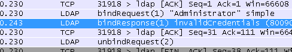

********************************
Gestione Utenti e Autenticazione
********************************

Gestione utenti
'''''''''''''''

La **gestione utenti** si trova su **Sistema>Gestione utenti**. Da lì
utenti, gruppi, server possono essere gestiti, e le impostazioni che
regolano il comportamento della gestione dell'utente possono essere
modificate.

Privilegi
=========

Gestire i privilegi per gli utenti e i gruppi è simile, quindi entrambi
saranno coperti qui piuttosto che duplicare lo sforzo. Se un utente o un
gruppo è gestito, la voce deve essere creata e salvata prima che i
privilegi possano essere aggiunti all'account o al gruppo. Per
aggiungere privilegi, quando si modifica l'utente o il gruppo esistente,
fare clic su |image0| **Aggiungere** nella sezione **Privilegi
assegnati** o **Privilegi effettivi**.

Viene presentato un elenco di tutti i privilegi disponibili. I privilegi
possono essere aggiunti uno alla volta selezionando una singola voce, o
selezionando più voci usando ctrl-click. Se altri privilegi sono già
presenti sull'utente o sul gruppo, essi sono nascosti da questa lista
quindi non possono essere aggiunti due volte. Per cercare uno specifico
privilegio per nome, inserire il termine di ricerca nella casella
**Filtro** e fare clic su |image1| **Filtro**.

La selezione di un privilegio mostrerà una breve descrizione del suo
scopo nell'area del blocco informazioni sotto i pulsanti di
autorizzazione e di azione. La maggior parte dei privilegi sono
auto-esplicativi sulla base dei loro nomi, ma alcuni permessi notevoli
sono:

    **WebCFG - Tutte le pagine** Consente l'accesso degli utenti a
    qualsiasi pagina nella GUI

    **WebCfg - Dashboard (tutti)** Consente all'utente di accedere alla
    pagina della dashboard e a tutte le sue funzioni associate (widget,
    grafici, etc.)

    **WebCfg - Sistema** Pagina di gestione della password utente: Se
    l'utente ha accesso solo a questa pagina, può accedere alla GUI per
    impostare la propria password, ma non per fare altro.

    **Utente - VPN - IPsec xauth Dialin** Consente all'utente di
    collegarsi e autenticarsi per IPsec xauth

    **Utente - Config – Diniego della scrittura della configurazione**
    Non consente all'utente di effettuare modifiche alla configurazione
    del firewall (*con- fig.xml*). Notare che questo non impedisce
    all'utente di compiere altre azioni che non comportano l’atto di
    scrivere per la configurazione.

    **Utente - Sistema - accesso all'account Shell** Dà all'utente la
    possibilità di effettuare il login su ssh, anche se l'utente non
    avrà accesso a livello root quindi la funzionalità è limitata. Un
    pacchetto per *sudo* è disponibile per migliorare questa
    funzionalità.

Dopo il login, il firewall tenterà di visualizzare la dashboard. Se
l'utente non vi ha accesso, essi saranno inoltrati alla prima pagina
nella loro lista di privilegi a cui hanno il permesso di accedere.

I menu sul firewall contengono solo voci per le quali esistono privilegi
su un account utente. Ad esempio, se l'unica pagina di diagnostica a cui
un utente ha accesso è **Diagnostica>Ping**, allora nessun altro
elemento verrà visualizzato nel menu **Diagnostica**.

Aggiunta/Modifica degli utenti
==============================

La scheda **Utenti** in **Sistema>Gestione utenti** è dove i singoli
utenti sono gestiti. Per aggiungere un nuovo utente, fare clic su
|image2| **Aggiungere**, per modificare un utente esistente, fare clic
su |image3|.

Prima che i permessi possano essere aggiunti ad un utente, deve prima
essere creato, quindi il primo passo è sempre quello di aggiungere
l'utente e salvare. Se più utenti hanno bisogno delle stesse
autorizzazioni, è più facile aggiungere un gruppo e quindi aggiungere
utenti al gruppo.

Per aggiungere un utente, fare clic su |image4| **Aggiungere** e
apparirà la nuova schermata utente.

    **Disabilitato** Questa casella controlla se questo utente sarà
    attivo. Se questo account deve essere disattivato, spunta questa
    casella.

    **Nome utente** Imposta il nome di login per l'utente. Questo campo
    è richiesto, deve essere inferiore a 16 caratteri e può contenere
    solo lettere, numeri, e un periodo, trattino, o sottolineatura.

    **Password e conferma so**\ no necessarie. Le password sono
    memorizzate nella configurazione |firew4ll| come hash. Assicurarsi che
    i due campi corrispondano per confermare la password.

    **Nome completo** Campo opzionale che può essere utilizzato per
    inserire un nome più lungo o una descrizione per un account utente.

    **Data di scadenza** Può anche essere definito se si desidera
    disattivare automaticamente l'utente quando tale data è stata
    raggiunta. La data deve essere indicata nel formato MM/GG/AAAA.

    **Gruppi** Se i gruppi sono già stati definiti, questo controllo può
    essere utilizzato per aggiungere l'utente come membro. Per
    aggiungere un gruppo per questo utente, trovarlo nella colonna **Non
    membro di**, selezionarlo, e fare clic su |image5| per spostarlo
    nella colonna **Membro di**. Per rimuovere un utente dal gruppo,
    selezionarlo dalla colonna **Membro di** e fare clic su |image6| per
    spostarlo nella colonna **Non membro di**.

    **Privilegi effettivi** appaiono quando si modifica un utente
    esistente, non quando si aggiunge un utente. Vedere **Privilegi**
    per informazioni sulla gestione dei privilegi. Se l'utente fa parte
    di un gruppo, i permessi del gruppo sono mostrati in questa lista,
    ma tali permessi non possono essere modificati, tuttavia possono
    essere aggiunti permessi ulteriori.

    **Certificato** il comportamento di questa sezione cambia a seconda
    che un utente venga aggiunto o modificato. Quando si aggiunge un
    utente, per creare un certificato fare clic su **Cliccare per creare
    un certificato utente** per vedere il modulo per creare un
    certificato. Inserire il **nome descrittivo**, scegliere
    **un'autorità di certificazione**, selezionare una **lunghezza di
    chiave** e inserire una **durata di vita**. Per ulteriori
    informazioni su questi parametri, vedere Creare un certificato
    interno. Se si modifica un utente, questa sezione della pagina
    diventa invece un elenco di certificati utente. Da qui, fare clic su
    |image7| **Aggiungere** per aggiungere un certificato all'utente. Le
    impostazioni di quella pagina sono identiche a *Creare un
    certificato interno* tranne che un numero ancora maggiore di dati è
    pre-riempito con il nome utente. Se il certificato esiste già,
    selezionare *Scegliere un certificato esistente* e quindi scegliere
    un **certificato esistente** dall'elenco.

    **Chiavi autorizzate** le chiavi pubbliche SSH possono essere
    inserite per l'accesso alla shell o ad altri SSH. Per aggiungere una
    chiave, incollare o inserire i dati chiave.

    **Chiave pre-condivisa IPsec** Usata per una configurazione IPsec
    mobile con chiave pre-condivisa senza autenticazione. Se una
    **Chiave pre-condivisa per IPsec** viene inserita qui, il nome
    utente viene utilizzato come identificatore. La PSK viene
    visualizzata anche sotto **VPN>IPsec** nella scheda **Chiavi
    pre-condivisa**. Se IPsec mobile viene utilizzato solo con
    autenticazione, questo campo può essere lasciato vuoto.

Dopo aver salvato l'utente, fare clic sulla riga dell'utente per
modificare la voce, se necessario.

Aggiunta/Modifica dei gruppi
============================

I gruppi sono un ottimo modo per gestire le serie di autorizzazioni da
dare agli utenti in modo che non abbiano bisogno di essere mantenuti
individualmente su ogni account utente. Ad esempio, un gruppo potrebbe
essere usato per gli utenti di IPsec xauth, o per un gruppo che può
accedere alla dashboard del firewall, a un gruppo di amministratori del
firewall, o a molti altri possibili scenari utilizzando qualsiasi
combinazione di privilegi.

Come per gli utenti, un gruppo deve prima essere creato prima di
aggiungere i privilegi. Dopo aver salvato il gruppo, modificare il
gruppo per aggiungere i privilegi.

I gruppi sono gestiti in **Sistema>Gestione utente** nella scheda
**Gruppi**. Per aggiungere un nuovo gruppo da questa schermata, fare
clic su |image8| **Aggiungere**. Per modificare un gruppo esistente,
fare clic su |image9| **Avanti** sulla sua voce nell'elenco.

	.. note:: 
		Quando si lavora con LDAP e RADIUS, i gruppi locali devono esistere per corrispondere ai** gruppi di cui gli utenti sono membri sul server. Ad esempio, se esiste un gruppo LDAP chiamato "firewall\_admins", |firew4ll| deve anche contenere un gruppo chiamato identicamente, "firewall\_admins", con i privilegi desiderati. I gruppi remoti con nomi lunghi o nomi contenenti spazi o altri caratteri speciali devono essere configurati per un campo di **applicazione** *remoto*.

Avviare il processo di aggiunta di un gruppo facendo clic su |image10|
**Aggiungere** e la schermata per aggiungere un nuovo gruppo apparirà.

    **Nome del gruppo** Questa impostazione ha le stesse restrizioni di
    un nome utente: deve essere di 16 caratteri o meno e può contenere
    solo lettere, numeri, e un periodo, trattino, o sottolineatura.
    Questo può sembrare un po' limitato quando si lavora con gruppi di
    LDAP, per esempio, ma di solito è più facile creare o rinominare un
    gruppo con nome appropriato sul server di autenticazione invece di
    tentare di rendere il gruppo firewall compatibile.

    **Scopo** Può essere impostato *Locale* per i gruppi sul firewall
    stesso (come quelli per l'uso nella shell), o *Remoto* per allentare
    le restrizioni del nome del gruppo e per evitare che il nome del
    gruppo sia esposto al sistema operativo di base. Ad esempio, i nomi
    dei gruppi di scopi remoti possono essere più lunghi e contenere
    spazi.

    **Descrizione** Testo facoltativo in forma libera per riferimento e
    per meglio identificare lo scopo del gruppo nel caso in cui il nome
    del gruppo non sia sufficiente.

    **Gruppi** Questa serie di controlli definisce quali utenti
    esistenti saranno membri del nuovo gruppo. Gli utenti Firewall sono
    elencati nella colonna **Non Membri** per impostazione predefinita.
    Per aggiungere un utente a questo gruppo, trovarlo nella colonna
    **Non Membri**, selezionarlo, e fare clic su |image11| per spostarlo
    nella colonna **Membri**. Per rimuovere un utente dal gruppo,
    selezionarlo dalla colonna **Membri** e fare clic su |image12|\ per
    spostarlo nella colonna **Non Membri**.

    **Privilegi assegnati** appare solo quando si modifica un gruppo
    esistente. Questa sezione permette di aggiungere privilegi al
    gruppo. Vedere *Privilegi* in precedenza in questa guida per
    informazioni sulla gestione dei privilegi.

Impostazioni
------------

La scheda **Impostazioni** in Gestione Utenti controlla due cose: quanto
è valida una sessione di login e dove l'accesso alla GUI preferirà
essere autenticato.

    **Tempo di sessione** Questo campo specifica quanto durerà una
    sessione di login alla GUI quando inattiva. Questo valore è
    specificato in **minuti**, e il valore predefinito è di quattro ore
    (240 minuti). Un valore di 0 può essere inserito per disabilitare la
    scadenza della sessione, rendendo le sessioni di login valide per
    sempre. Un timeout più breve è meglio, anche se rendono sufficiente
    che un amministratore attivo non sarebbe disconnesso
    involontariamente durante l'esecuzione di modifiche.
.. warning::
	Attenzione: Permettere a una sessione di rimanere valida quando inattiva per lunghi periodi di tempo non è sicuro. Se un amministratore lascia un terminale incustodito con una finestra del browser aperta e collegata, qualcuno o qualcos'altro potrebbe approfittare della sessione aperta.
	
    **Server di autenticazione** Questo selettore sceglie la fonte di
    autenticazione primaria per gli utenti che accedono alla GUI. Questo
    può essere un server RADIUS o LDAP, o il database locale
    predefinito. Se il server RADIUS o LDAP è irraggiungibile per
    qualche motivo, l'autenticazione tornerà alla banca dati locale
    anche se viene scelto un altro metodo.

Quando si utilizza un server RADIUS o LDAP, gli utenti e/o appartenenti
ai gruppi devono ancora essere definiti nel firewall al fine di allocare
correttamente le autorizzazioni, in quanto non v'è ancora un metodo per
ottenere i permessi dinamicamente da un server di autenticazione.

Affinché l'appartenenza al gruppo funzioni correttamente, |firew4ll| deve
essere in grado di riconoscere i gruppi presentati dal server di
autenticazione. Ciò richiede due cose:

1. I gruppi locali devono esistere con nomi identici.

2. |firew4ll| deve essere in grado di individuare o ricevere un elenco di
   gruppi dal server di autenticazione.

   Vedere i *server di autenticazione* per dettagli specifici per ogni
   tipo di server di autenticazione.

Server di autenticazione
''''''''''''''''''''''''

Utilizzare la scheda **Server di autenticazione** in **Sistema>Gestione
utenti**, i server RADIUS e LDAP può essere definita come fonti di
autenticazione. Vedere *Supporto per tutta |firew4ll|* per informazioni su
dove possono essere utilizzati questi server in |firew4ll| attualmente. Per
aggiungere un nuovo server da questa schermata, fare clic
su\ |image13|\ **Inserire**. Per modificare un server esistente, fare
clic su\ |image14| **Aventi** al suo ingresso.

	.. seealso::
		Per ulteriori informazioni, è possibile accedere al *Archivio di Hangout* per visualizzare l'Hangout di agosto 2015 su RADIUS e LDAP.

RADIUS
======

   Per aggiungere un nuovo server RADIUS:

-  Assicurarsi che il server RADIUS abbia il firewall definito come
   client prima di procedere.

-  Passare a **Sistema>Gestione utente**, scheda **Server di
   autenticazione**.

-  Fare clic su |image15| Aggiungere.

-  Impostare il selettore del **tipo** su *RADIUS*. Verranno
   visualizzate le impostazioni del server RADIUS.

-  Compilare i campi come descritto di seguito:

    **Nome descrittivo** Il nome di questo server RADIUS. Questo nome
    sarà usato per identificare il server in tutta la GUI |firew4ll|.

    **Hostname o indirizzo IP** L'indirizzo del server RADIUS. Questo
    può essere un nome di dominio completamente qualificato, o un
    indirizzo IP IPv4.

    **Segreto condiviso** La password stabilita per questo firewall sul
    software del server RADIUS.

    **Servizi offerti** Questo selettore imposta quali servizi sono
    offerti da questo server RADIUS. *Autenticazione e
    Contabilizzazione* , *Solo autenticazione* o *Solo
    contabilizzazione*. L'\ *autenticazione* utilizzerà questo server
    RADIUS per autenticare gli utenti. La *contabilizzazione* invia i
    dati di avvio/arresto dei pacchetti contabili RADIUS per le sessioni
    di login se supportato nell'area in cui viene utilizzato.

    **Porta di autenticazione** appare solo se è stata scelta una
    modalità di autenticazione. Impostare la porta UDP dove avverrà
    l'autenticazione RADIUS. La porta di default per l'autenticazione
    RADIUS è *1812*.

    **Porta di contabilizzazione** appare solo se viene scelta una
    modalità di ccontabilizzazione. Impostare la porta UDP dove avverrà
    la contabilizzazione RADIUS. La porta di contabilizzazione RADIUS di
    default è *1813*.

    **Timeout di autenticazione** Controlla quanto tempo, in secondi, il
    server RADIUS può impiegare per rispondere a una richiesta di
    autenticazione. Se lasciato vuoto, il valore predefinito è 5
    secondi. Se un sistema interattivo di autenticazione a due fattori è
    in uso, aumentare questo tempo per tenere conto di quanto tempo
    impiegherà l'utente per ricevere e inserire un token, che può essere
    60-120 secondi o più se deve attendere un'azione esterna come una
    telefonata, SMS, ecc.

-  Fare clic su **Salvare** per creare il server.

-  Visitare **Diagnostica>Autenticazione** per testare il server RADIUS
   utilizzando un account valido.

Per i gruppi RADIUS, il server RADIUS deve restituire una lista di
gruppi nell'attributo di risposta del RADIUS Class come stringa. I
gruppi multipli devono essere separati da un punto e virgola.

Ad esempio, in FreeRADIUS, per restituire i gruppi "admin" e "Utente
VPN", si utilizzerebbe il seguente Attributo di risposta RADIUS:
	``Class := "admins;VPNUsers"``
Se il server RADIUS restituisce correttamente l'elenco di gruppo per un
utente e i gruppi esistono localmente, i gruppi saranno elencati sui
risultati quando si utilizza la pagina **Diagnostica>Autenticazione**
per testare un account. Se i gruppi non si presentano, assicurati che
esistano su |firew4ll| con nomi corrispondenti e che il server stia
restituendo l'attributo Class come stringa, non come binario.

LDAP
====

Per aggiungere un nuovo server LDAP:

-  Assicurarsi che il server LDAP possa essere raggiunto dal firewall.

-  Se viene utilizzato SSL, prima di procedere importare l'autorità di
   certificazione utilizzata dal server LDAP in |firew4ll|. Vedere
   *Gestione dell'autorità di certificazione* per maggiori informazioni
   sulla creazione o l'importazione di CA.

-  Passare a **Sistema>Gestione utenti**, scheda **Server**.

-  Fare clic su |image16| **Aggiungere**.

-  Impostare il selettore del **tipo** a *LDAP*. Verranno visualizzate
   le impostazioni del server LDAP.

-  Compilare i campi come descritto di seguito:

    **Hostname** o **indirizzo IP** L'indirizzo del server LDAP. Può
    essere un nome di dominio completamente qualificato, un indirizzo IP
    IPv4 o un indirizzo IP IPv6.

.. note:: Se viene utilizzato SSL, qui deve essere specificato un hostname e deve corrispondere al **nome comune** del certificato del server presentato dal server LDAP e tale hostname deve essere risolto nell'indirizzo IP del server LDAP, ad es. *CN=ldap.esempio.com*, e *ldap.esempio.com è 192.168.1.5*. L'unica eccezione è che l'indirizzo IP del server è anche la CN del certificato server stesso. Questo può essere aggirato in alcuni casi, creando un override dell’host del Forwader DNS per fare in modo che il certificato del server CN risolva l'indirizzo IP corretto se non corrispondono in questa infrastruttura di
rete e non possono essere facilmente corretti.

    **Valore della porta** Questa impostazione specifica la porta su cui
    il server LDAP sta ascoltando le query LDAP. La porta TCP di default
    è *389* e *636* per SSL. Questo campo viene aggiornato
    automaticamente con il valore predefinito basato sul **Trasporto**
    selezionato.

.. note:: Quando si utilizza la porta *636* per SSL, |firew4ll| utilizza un *ldaps://* URL, non supporta STARTTLS. Assicurarsi che il server LDAP sia in ascolto sulla porta corretta con la modalità corretta

    **Trasporto** Questa impostazione controlla quale metodo di
    trasporto verrà utilizzato per comunicare con il server LDAP. La
    prima, e di default, selezione è *TCP - Standard* che utilizza
    connessioni TCP semplice sulla porta 389. Una scelta più sicura, se
    il server LDAP la supporta, è *SSL - Criptato* sulla porta 636. La
    scelta SSL crittograferà le query LDAP fatte al server, questo è
    particolarmente importante se il server LDAP non è su un segmento di
    rete locale.

.. note:: Si raccomanda sempre di usare sempre SSL dove possibile, anche se il TCP semplice è più facile da configurare e diagnosticare dal momento che la cattura di un pacchetto mostrerebbe il contenuto delle query e le risposte.

    **Autorità di certificazione peer** Se *SSL - Criptato* è stato
    scelto per il **Trasporto**, allora il valore di questo selettore
    viene utilizzato per convalidare il certificato del server LDAP. La
    CA selezionata deve corrispondere alla CA configurata sul server
    LDAP, altrimenti sorgeranno problemi. Per ulteriori informazioni
    sulla creazione o sul l'importazione di CA, consultare la *gestione
    dell'autorità di certificazione*.

    **Versione del protocollo** Sceglie quale versione del protocollo
    LDAP è utilizzata dal server LDAP, sia *2* o *3*, di solito *3*.

    **Scopo della ricerca** Determina dove, e quanto in profondità, una
    ricerca opererà per trovare una corrispondenza.

    **Livello** Scegli tra il *livello 1* o *intero inferiore a tre* per
    controllare quanto in profondità andrà la ricerca. L’\ *intero
    inferiore a tre* è la scelta migliore quando la decisione non è
    certa ed è quasi sempre necessaria per le configurazioni di
    Active Directory.

    **DN di base** Controlla dove la ricerca inizierà. Tipicamente
    impostato su "Root" della struttura LDAP, ad esempio
    DC=esempio,DC=com.

    **Contenitori di autenticazione** Un elenco separato da un punto e
    virgola di potenziali conti o contenitori. Questi contenitori
    saranno preimpostati alla ricerca DN di base di sopra o specificare
    un percorso contenitore completo qui e lasciare la DN di base in
    bianco. Se il server LDAP lo supporta, e le impostazioni di bind
    sono corrette, fare clic sul pulsante **Selezionare** per sfogliare
    i contenitori del server LDAP e selezionarli lì. Alcuni esempi di
    questi contenitori sono:

-  • ``CN=Utenti;DC=esempio;DC=com`` Questo cercherebbe gli utenti
   all'interno del dominio il componente *esempio.com*, una sintassi
   comune da vedere per la Active Directory

-  • ``CN=Utenti,DC=esempio,DC=com;OU=AltriUtenti,DC=esempio,DC=com`` 
   Questo cercherebbe in due luoghi diversi, il secondo dei quali è
   limitato all'unità organizzativa di altri utenti

    **Query estesa** Specifica una restrizione aggiuntiva alla ricerca
    del nome utente, che permette di usare il membro del gruppo come
    filtro. Per impostare una query estesa, selezionare la casella e
    riempire il valore con un filtro come:
	``memberOf=CN=VPNUsers,CN=Users,DC=example,DC=com``
    **Credenziali Bind** Controlla come questo client LDAP tenterà di
    collegarsi al server. Per impostazione predefinita la casella
    **Usare vincoli anonimi per risolvere nomi distinti** è selezionata
    per eseguire un bind anonimo. Se il server richiede l'autenticazione
    per effettuare una query, deselezionare quella casella e quindi
    specificare una **DN utente** e una **password** da usare per la
    bind.

.. note::
	La Active Directory richiede tipicamente l'uso di credenziali di bind e può essere necessario un account di servizio o un amministratore equivalente a seconda della configurazione del server. Consultare la documentazione di Windows per determinare ciò è necessario in un ambiente specifico.

    **Modello iniziale** pre-riempie le opzioni rimanenti nella pagina
    con i valori predefiniti comuni per un dato tipo di server LDAP. Le
    scelte includono *OpenLDAP* , *Microsoft AD* , e *Novell
    eDirectory*.

    **Attributo di denominazione utente** L'attributo utilizzato per
    identificare il nome di un utente, più comunemente *cn* o
    *samAccount- Nome*.

    **Attributo di denominazione di gruppo** L'attributo utilizzato per
    identificare un gruppo, come *cn*.

    **Attributo di un membro del gruppo** L'attributo di un utente che
    significa che è il membro di un gruppo, come *membro*, *membroUid*,
    *membroDi* o *membroUnico*.

    **Gruppi RFC2307** Specifica come l'appartenenza al gruppo è
    organizzata sul server LDAP. Quando non è selezionata,
    l'appartenenza al gruppo in stile Active Directory viene usata
    quando i gruppi sono elencati come attributo dell'oggetto utente. Se
    selezionata, l'appartenenza al gruppo in stile RFC 2307 viene usata
    dove gli utenti sono elencati come membri dell'oggetto gruppo.

.. note::
	Quando questo viene utilizzato, l'attributo membro del gruppo può anche bisogno cambiato, tipicamente sarebbe impostato su ``memberUid`` in questo caso, ma può variare per schema LDAP 
	
    **Classe dell’oggetto del gruppo** Usato con i gruppi di stile RFC
    2307, specifica la classe di oggetti del gruppo, tipicamente
    posixGruppo ma può variare in base allo schema LDAP. Non è
    necessario per gruppi di stile Active Directory.

    **Codifica UTF8** Se selezionata, le query al server LDAP saranno
    codificate UTF8 e le risposte saranno decodificate UTF8. Il supporto
    varia a seconda del server LDAP. Generalmente necessario solo se
    nomi utente, gruppi, password e altri attributi contengono caratteri
    non tradizionali.

    **Alterazioni del nome utente** Quando non è selezionata, un nome
    utente dato come utente@nomehost rimuoverà la porzione @nomehost in
    modo che solo il nome utente venga inviato nella richiesta di bind
    LDAP. Se selezionata, il nome utente viene inviato per intero.

-  Fare clic su **Salvare** per creare il server.

-  Visitare **Diagnostica>Autenticazione** per testare il server LDAP
   utilizzando un account valido.

Se la query LDAP restituisce correttamente l'elenco di gruppo per un
utente, e i gruppi esistono localmente, i gruppi saranno elencati sui
risultati quando si utilizza la pagina **Diagnostica>Autenticazione**
per testare un account. Se i gruppi non si presentano, assicurarsi che
esistano su |firew4ll| con i nomi corrispondenti e che sia selezionata la
struttura del gruppo (ad es. i gruppi RFC 2703 devono essere
selezionati)

Esempi di autenticazione esterna
''''''''''''''''''''''''''''''''

Ci sono innumerevoli modi per configurare il gestore utente per
connettersi a un server esterno RADIUS o LDAP, ma ci sono alcuni metodi
comuni che possono essere utili da usare come guida. Di seguito sono
riportati tutti gli esempi testati/funzionanti, ma la configurazione del
server probabilmente varia dall'esempio

Esempio di server RADIUS
========================

Questo esempio è stato fatto contro FreeRADIUS, ma fare lo stesso per
Windows Server sarebbe identico. Vedere *Autenticazione RADIUS con
Windows Server* per informazioni sulla configurazione di un server
Windows per RADIUS.

Questo presuppone che il server RADIUS sia già stato configurato per
accettare query da questo firewall come client con un segreto condiviso.

    **Nome descrittivo** ExCoRADIUS

    **Genere** *Raggio*

    **Hostname o indirizzo IP** 192.2.0.5

    **Segreto condiviso** segretosegreto

    **Servizi offerti** *Autenticazione e contabilitazione*

	**Porta di autenticazione** 1812

    **Porta di contabilitazione** 1813

    **Timeout di autenticazione** 10

Esempio OpenLDAP
================

In questo esempio, |firew4ll| è impostato per connettersi a un server OpenLDAP aziendale.

    **Nome descrittivo** ExCoLDAP

    **Genere** *LDAP*

    **Hostname o indirizzo IP** ldap.esempio.com

    **Porta** 636

    **Trasporto** *SSL - Encrypted*

    **Autorità del certificate peer** *ExCo CA*

	**Versione protocollo** *3*

    **Ambito della ricerca** ``*Intero subtree*, dc=firew4ll, dc=org``

    **Contenitori dell’autenticazione** ``CN=pfsgruppo; ou=people, dc=firew4ll, dc=org``

    **Credenziali bind** Bind anonimo *Selezionato*

    **Modello iniziale** *OpenLDAP*

    **Attributo di denominazione utente** cn

    **Attributo di denominazione di gruppo** cn

    **Attributo del membro del gruppo** memberUid

    **Gruppi RFC2307** Selezionato

    **Classe dell’oggetto del gruppo** posixGroup

    **Codifica UTF8** *Selezionato*

    **Alterazioni del nome utente** *Non selezionato*

Esempio della LDAO della Active Directory
=========================================

In questo esempio, |firew4ll| è impostato per connettersi ad una struttura
di Active Directory al fine di autenticare gli utenti per una VPN. I
risultati sono limitati al gruppo **Utenti VPN**. Omettere la query
estesa per accettare qualsiasi utente.

    **Nome descrittivo** ExCoADVPN

    **genere** *LDAP*

    **Hostname o indirizzo IP** 192.0.2.230

    **Porta** 389

    **Trasporto** *TCP - standard*

	**Protocol Version** *3*

    **Ambito di ricerca** *Intero subtree*, DC=dominio, DC=locale

    **Contenitori di autenticazione** ``CN=Utenti, DC=dominio, DC=locale``

    **Query estese** ``memberof=CN=UtentiVPN,CN=UtentiDC=esempio,DC=com``

    **Credenziali bind** bind anonimp *Selezionata*

    **Utente DN** CN=binduser,CN=Users,DC=domain,DC=local

    **Password** segretosegreto

    **Modello iniziale** *Microsoft AD*

    **Attributo della denominazione utente** samAccountNome

	**Attributo della denominazione del gruppo** *cn*

    **Attributo del membro del gruppo** *memberOf*

Questo esempio utilizza TCP semplice, ma se l'autorità di certificazione
per la struttura AD viene importato sotto il gestore del certificato in
|firew4ll|, SSL può essere utilizzato anche selezionando tale opzione e
scegliendo il CA appropriato dall’elenco a discesa delle autorità di
certificazione peer, e impostare l'hostname al nome comune del
certificato server.

Risoluzione dei problemi
''''''''''''''''''''''''

È possibile testare i server di autenticazione utilizzando lo strumento
di **Diagnostica>Autenticazione**. Da quella pagina, testare un utente è
semplice:

-  Passare alla **Diagnostica>Autenticazione**

-  Selezionare un **Server di autenticazione**

-  Inserire un **nome utente**

-  Inserire una **password**

-  Fare clic sul pulsante **Provare**.

Il firewall tenterà di autenticare l'utente dato rispetto al server
specificato e restituirà il risultato. Di solito è meglio provare questo
almeno una volta prima di tentare di utilizzare il server.

Se il server restituisce un set di gruppi per l'utente, e i gruppi
esistono localmente coActive Directoryn lo stesso nome, i gruppi vengono stampati nei
risultati del test.

Se si riceve un errore durante il test di autenticazione, controllare le
credenziali e le impostazioni del server, quindi effettuare le modifiche
necessarie e riprovare.

Errori di LDAP in Active Directory
==================================

L'errore più comune con l'accesso LDAP all'Active Directory è non
specificare un utente bind corretto nel formato corretto. Se il solo
nome utente non funziona, digitare il Nome distinti completo (DN) per
l'utente bind, come CN=utentebind,CN=Utenti,DC=dominio,DC=locale.

Se il DN completo dell'utente è sconosciuto, può essere trovato
navigando fino all'utente in **Modificare ADSI** trovato sotto
**Strumenti amministrativi** sul server Windows.

Un altro errore comune con l'appartenenza al gruppo è non specificare
l’\ *intero inferiore-3* per il livello di ricerca.

Appartenenza a un Gruppo in Active Directory
============================================

A seconda di come sono stati creati i gruppi in Active Directory, il
modo in cui sono specificati può essere diverso per cose come i
Contenitori di autenticazione e/o le Query estese. Ad esempio, un gruppo
di utenti tradizionale in AD è esposto in modo diverso alla LDAP
rispetto a un'unità organizzativa separata. Modificare ADSI trovato
sotto Strumenti amministrativi sul server Windows può essere utilizzato
per determinare ciò che serà il DN per un dato gruppo.

Query estesa
============

L'errore più comune di una Query estesa è che la direttiva in questione
non include né l'oggetto della ricerca né il modo in cui ricercare,
come:
``memberOf=CN=VPNUsers,CN=Users,DC=example,DC=com``

Si noti che nell'esempio sopra il DN del gruppo è dato insieme con la
restrizione (memberOf=)

Risoluzione dei problemi tramite i registri log
===============================================

I guasti di autenticazione sono tipicamente registrati dal server di
destinazione (freeRADIUS, Windows Event Viewer, ecc.), assumendo che la
richiesta stia facendo tutta la strada per l'host di autenticazione.
Controllare i registri del server per una spiegazione dettagliata perché
una richiesta non è riuscita. Il registro di sistema su |firew4ll|
(**Stato>Registri di sistema**) può anche contenere alcuni dettagli che
accennano ad una risoluzione.

Risoluzione dei problemi tramite la cattura dei pacchetti
=========================================================

La cattura dei pacchetti può essere inestimabile per diagnosticare pure
gli errori. Se un metodo non crittografato (RADIUS, LDAP senza SSL) è in
uso, la password effettiva in uso potrebbe non essere visibile, ma
abbastanza del protocollo di scambio può essere visto per determinare
perché una richiesta non si riesce a completare.

Questo è particolarmente vero quando una cattura viene caricata in
wireshark, che si possono interpretare le risposte, come si vede in
Figura *Esempio della cattura fallita LDAP* Per ulteriori informazioni
sulle catture di pacchetti, vedere Cattura di pacchetti.

|image17|

Fig. 1: Esempio della cattura fallita LDAP

Il gestore utente in |firew4ll| fornisce la possibilità di creare e gestire
più account utente. Questi account possono essere utilizzati per
accedere alla GUI, utilizzare i servizi VPN come OpenVPN e IPsec, e
utilizzare il Captive Portal.

Il Gestore Utente può essere utilizzato anche per definire fonti di
autenticazione esterne come RADIUS e LDAP.

.. seealso:: 
	Per ulteriori informazioni, è possibile accedere all’archivio Hangouts per visualizzare l’Hangout di febbraio 2015 sulla gestione utenti e Privilegi, e l’Hangout di agosto 2015 su RADIUS e LDAP.

Supporto per tutto |firew4ll|
=============================

A partire da questa documentazione, non tutte le aree di |firew4ll| si collegano
nuovamente alla Gestione utenti.

    **GUI di |firew4ll|** Sostiene gli utenti nela Gestione utenti, e via
    RADIUS o LDAP. I gruppi o gli utenti di RADIUS o LDAP richiedono
    definizioni nel gestore utente locale per gestire i loro permessi di
    accesso.

    **OpenVPN** Supporta gli utenti della Gestione utenti, RADIUS o LDAP
    tramite la gestione utenti.

    **IPsec** Supporta gli utenti nella Gestione utenti, RADIUS o LDAP
    tramite la gestione utenti per xauth, e RADIUS per IKEv2 con
    EAP-RADIUS.

    **Captive portal** Supporta gli utenti locali in Gestione utenti, e
    gli utenti RADIUS tramite le impostazioni nella pagina Portale
    captive.

    **L2TP** Supporta gli utenti nelle impostazioni L2TP, e via RADIUS
    nelle impostazioni L2TP.

    **Server PPPoE** Supporta gli utenti nelle impostazioni PPPoE.

.. |image0| image:: media/image1.png
   :width: 0.26389in
   :height: 0.26389in
.. |image1| image:: media/image2.png
   :width: 0.26389in
   :height: 0.26389in
.. |image2| image:: media/image1.png
   :width: 0.26389in
   :height: 0.26389in

.. |image4| image:: media/image1.png
   :width: 0.26389in
   :height: 0.26389in
.. |image5| image:: media/image4.png
   :width: 0.26389in
   :height: 0.26389in

.. |image7| image:: media/image1.png
   :width: 0.26389in
   :height: 0.26389in
.. |image8| image:: media/image1.png
   :width: 0.26389in
   :height: 0.26389in

.. |image10| image:: media/image1.png
   :width: 0.26389in
   :height: 0.26389in
.. |image11| image:: media/image4.png
   :width: 0.26389in
   :height: 0.26389in

.. |image13| image:: media/image1.png
   :width: 0.26389in
   :height: 0.26389in

.. |image15| image:: media/image1.png
   :width: 0.26389in
   :height: 0.26389in
.. |image16| image:: media/image1.png
   :width: 0.26389in
   :height: 0.26389in

