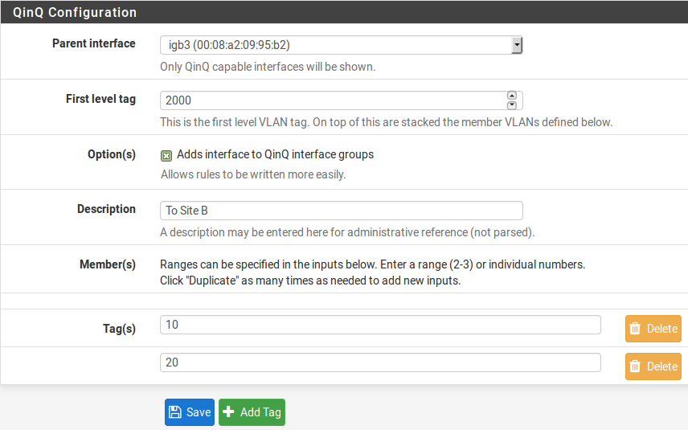

*******************
VLAN (LAN Virtuale)
*******************

Terminologia
''''''''''''

Questa sezione definisce la terminologia necessaria per implementare
correttamente le VLAN.

    **Tronco (Trunking** ) Trunking si riferisce a un mezzo di trasporto
    di più VLAN sulla stessa porta switch fisica. I frame che escono da
    una porta trunk sono contrassegnati con un contrassegno (tag) 802.1Q
    nell'intestazione, consentendo al dispositivo collegato di
    distinguere tra più VLAN. Le porte trunk sono utilizzate per
    collegare più switch e per collegare qualsiasi dispositivo in grado
    di contrassegnare come 802.1Q e richiedono l'accesso a più VLAN.
    Questo è comunemente limitato al firewall o al router che forniscono
    connettività tra le VLAN, in questo caso, |firew4ll|, così come a
    qualsiasi connessione ad altri switch contenenti più VLAN.

    **ID delle VLAN** Ogni VLAN ha un numero identificativo (ID) per
    distinguere il traffico contrassegnato. Questo è un numero tra *1* e
    *4094*. La VLAN predefinita sugli switch è la VLAN *1*, e questa
    VLAN non deve essere utilizzata quando si distribuisce il trunking
    delle VLAN. Questo è discusso ulteriormente in *Vlan e sicurezza*. A
    parte evitare l'uso di VLAN 1, i numeri delle VLAN possono essere
    scelti a piacimento. Alcuni progetti iniziano con VLAN 2 e si
    incrementano di uno fino a raggiungere il numero richiesto di VLAN.
    Un altro disegno comune è quello di utilizzare il terzo ottetto
    nella sottorete della VLAN come ID della VLAN. Ad esempio, se si
    usano 10.0.10.0/24, 10.0.20.0/24 e 10.0.30.0/24, è logico usare le
    VLAN 10, 20 e 30 rispettivamente. Scegliere uno schema di
    assegnazione ID della VLAN che abbia senso per un determinato
    progetto di rete.

    **Interfaccia principale** L'interfaccia fisica in cui risiede una
    VLAN è nota come interfaccia principale. Ad esempio, *igb0* o *em0*.
    Quando le VLAN sono configurate su |firew4ll|, ad ognuna viene
    assegnata un'interfaccia virtuale. Il nome dell'interfaccia virtuale
    è creato combinando il nome dell'interfaccia principale più l'ID
    della VLAN. Ad esempio, per VLAN 20 su *igb0*, il nome
    dell'interfaccia è igb0\_vlan20.

.. note::  
	L'unica funzione dell'interfaccia principale è, idealmente, quella di essere il genitore per le VLAN definite e non essere utilizzata direttamente. In alcune situazioni questo funzionerà, ma può causare difficoltà con la configurazione dello switch, e richiede l'uso della VLAN predefinita sulla porta del trunk, che è meglio evitare come discusso ulteriormente in *Vlan e Sicurezza*.

    **Porta di accesso** Una porta di accesso si riferisce a una porta
    switch che fornisce l'accesso a una singola VLAN, dove i frame non
    sono contrassegnati con un'intestazione 802.1Q. I normali
    dispositivi di tipo client sono collegati alle porte di accesso, I
    quali comprenderanno la maggior parte delle porte switch. I
    dispositivi sulle porte di accesso non hanno bisogno di conoscere le
    VLAN o I contrassegni. Vedono la rete sulla loro porta come farebbe
    uno switch senza VLAN.

    **Doppi contrassegni (Qinq)** *Qinq* si riferisce ai doppi tag del
    traffico, utilizzando sia un tag 802.1Q esterno sia interno. Questo
    può essere utile in ambienti ISP di grandi dimensioni, con altre
    reti molto grandi, o reti che devono trasportare più VLAN attraverso
    un link che supporta solo un singolo tag della VLAN. È possibile
    anche il triplo contrassegno. |firew4ll| supporta Qinq, anche se non è
    una caratteristica molto comune. Questi tipi di ambienti hanno
    generalmente bisogno del tipo di alimentazione del routing che solo
    un router ASIC di fascia alta può supportare, e Qinq aggiunge un
    livello di complessità che non è necessario nella maggior parte
    degli ambienti. Per ulteriori informazioni sulla configurazione di
    Qinq su |firew4ll|, vedere *Configurazione di Qinq su |firew4ll|.*

    **VLAN privata (PVLAN)** PVLAN, talvolta chiamato **Isolamento della
    porta**, si riferisce alle funzionalità di alcuni switch per
    segmentare gli host all'interno di una singola VLAN. Normalmente gli
    host all'interno di una singola funzione VLAN sono gli stessi degli
    host su un singolo switch senza VLAN configurato. PVLAN fornisce un
    mezzo per impedire agli host di una VLAN di comunicare con qualsiasi
    altro host su tale VLAN, consentendo solo la comunicazione tra tale
    host e il suo gateway predefinito. Questo non è direttamente
    rilevante per |firew4ll|, ma è una domanda comune. Cambiare
    funzionalità come questa è l'unico modo per impedire la
    comunicazione tra host nella stessa sottorete. Senza una funzione
    come PVLAN, nessun firewall di rete può controllare il traffico
    all'interno di una sottorete perché non tocca mai il gateway
    predefinito.

VLAN e Sicurezza
''''''''''''''''

Le VLAN sono un ottimo modo per segmentare una rete e isolare le
sottoreti, ma ci sono problemi di sicurezza che devono essere presi in
considerazione quando si progetta e si implementa una soluzione che
coinvolge le VLAN. Le Vlan non sono intrinsecamente insicure, ma
un'errata configurazione può rendere vulnerabile una rete. Ci sono stati
anche problemi di sicurezza in passato con le implementazione dei
venditori dello switch delle VLAN.

Segregare le zone di fiducia (Trust)
====================================

A causa della possibilità di errori di configurazione, le reti di
livelli di fiducia notevolmente diversi dovrebbero essere su switch
fisici separati. Ad esempio, mentre lo stesso switch potrebbe essere
tecnicamente utilizzato con le VLAN per tutte le reti interne e la rete
al di fuori dei firewall, ciò dovrebbe essere evitato perché un semplice
errore di configurazione dello switch potrebbe portare a traffico
Internet non filtrato che entra nella rete interna. Almeno usare due
switch in questi scenari: uno per l'esterno del firewall e uno per
l'interno del firewall. In molti ambienti, i segmenti DMZ vengono
trattati separatamente, su un terzo switch oltre agli switch WAN e LAN.
In altri, il lato WAN è sul proprio switch, mentre tutte le reti dietro
il firewall sono sullo stesso switch che utilizza VLAN. Lo scenario più
appropriato per una determinata rete dipende dalle circostanze
specifiche, dal livello di rischio e dai problemi di sicurezza.

Utilizzare la VLAN1 predefinita
===============================

Poiché la VLAN 1 è la VLAN predefinita (“nativa”), può essere usata in
modo inaspettato dallo switch. È simile all'uso di una politica di
permesso predefinito sulle regole del firewall invece di negazione di
default e selezionare ciò che è necessario. L'utilizzo di una VLAN
diversa è sempre meglio, e garantisce che solo le porte selezionate
devono essere su tale VLAN, per limitare l'accesso. Gli switch
invieranno protocolli interni come STP (Prtocollo dell’albero di
spanning), VTP (Protocollo del trunking delle VLAN, VLAN Trunking
Protocol), e CDP (Protocollo di ricerca Cisco, Cisco Discover Protocol)
non contrassegnato sulla VLAN nativa, dove gli switch utilizzano questi
protocolli. È generalmente meglio mantenere il traffico interno isolato
dal traffico di dati.

Se la VLAN 1 deve essere utilizzata, fare molta attenzione ad assegnare
ogni singola porta su ogni switch a una VLAN diversa tranne quelli che
devono essere in VLAN 1, e non creare un'interfaccia di gestione per lo
switch sulla VLAN 1. La VLAN nativa del gruppo switch dovrebbe anche
essere cambiata in un altra, inutilizzata, VLAN. Alcuni switch
potrebbero non supportare nessuna di queste soluzioni, e quindi è in
genere più facile spostare i dati su una VLAN diversa invece di
preoccuparsi di rendere disponibile la VLAN 1. Con l’ID della VLAN 2
attraverso 4094 tra cui scegliere, è senza dubbio meglio ignorare la
VLAN 1 quando si progetta un nuovo schema della VLAN.

Utilizzare la VLAN predefinita di una porta trunk
=================================================

Quando il traffico contrassegnato VLAN viene inviato su un tronco sulla
VLAN nativa, i tag nei pacchetti che corrispondono alla VLAN nativa
possono essere rimossi dallo switch per preservare la compatibilità con
le reti più vecchie. Peggio ancora, i pacchetti con doppio tag con la
VLAN nativa e una VLAN diversa avranno solo il tag della VLAN nativa
rimosso quando si effettua il trunking per questa via e quando verranno
elaborati in seguito, quel traffico può finire su una VLAN diversa.
Questa è anche chiamato “VLAN saltellante (hopping)”.

Come indicato nella sezione precedente, qualsiasi traffico non bloccato
su una porta trunk sarà assunto come la VLAN nativa, che potrebbe anche
sovrapporsi con un'interfaccia VLAN assegnata. A seconda di come lo
switch gestisce tale traffico e come è visto da |firew4ll|, utilizzare
l'interfaccia direttamente potrebbe portare a due interfacce che sono
sulla stessa VLAN.

Limitare l'accesso alle porte trunk
===================================

Poiché una porta trunk può comunicare con qualsiasi VLAN in un gruppo di
switch del tronco, forse anche quelle non presenti sullo switch corrente
possono a seconda delle configurazioni dello switch, quindi è importante
proteggere fisicamente le porte del trunk. Assicurarsi anche che non ci
siano porte configurate per il trunking che siano scollegate e abilitate
dove qualcuno potrebbe collegarsi ad una, accidentalmente o in altro
modo. A seconda dello switch, si può supportare la negoziazione dinamica
del trunking. Assicurarsi che questa funzionalità sia disabilitata o
correttamente limitata.

Altri problemi con gli switch
=============================

Nel corso degli anni ci sono state segnalazioni di rari casi in cui gli
switch basati sulle VLAN hanno fatto trapelare traffico attraverso le
VLAN, mentre in presenza di carichi pesanti, o se un indirizzo MAC di un
PC su una VLAN è visto su un’altra VLAN. Questi problemi tendono a
trovarsi in switch anziani con firmware non aggiornato, o switch gestiti
con una estremamente bassa qualità. Questi tipi di problemi sono stati
in gran parte risolti molti anni fa, quando tali problemi di sicurezza
erano comuni. Non importa quale switch, di quale marca, è utilizzato per
una rete, bisogna cercare di vedere se ha subito un alcun tipo di test
di sicurezza, e garantire che il firmware più recente sia caricato sullo
switch. Anche se questi problemi riguardano l'interruttore, e non
|firew4ll|, fanno parte della sicurezza complessiva di una rete.

Molti articoli qui sono specifici per particolari marche e modelli di
switch. Le considerazioni sulla sicurezza variano in base allo switch
utilizzato su una rete. Consultare la relativa documentazione per le
raccomandazioni in materia di sicurezza della VLAN.

Configurazione della VLAN di |firew4ll|
'''''''''''''''''''''''''''''''''''''''

Questa sezione illustra come configurare le VLAN di |firew4ll|.

Configurazione della VLAN dalla console
=======================================

Le VLAN possono essere configurate sulla console utilizzando la funzione
*Assegnare le interfacce*. L'esempio seguente mostra come configurare
due VLAN, ID 10 e 20, con *igb0* come interfaccia principale. Le
interfacce VLAN sono assegnate come OPT1 e OPT2:

|image24|

::

Valid interfaces are:

igb0 00:08:a2:09:95:b5 (up) Intel(R) PRO/1000 Network Connection, Version -
igb1 00:08:a2:09:95:b6 (up) Intel(R) PRO/1000 Network Connection, Version -
igb2 00:08:a2:09:95:b1 (down) Intel(R) PRO/1000 Network Connection, Version -
igb3 00:08:a2:09:95:b2 (down) Intel(R) PRO/1000 Network Connection, Version -
igb4 00:08:a2:09:95:b3 (down) Intel(R) PRO/1000 Network Connection, Version -
igb5 00:08:a2:09:95:b3 (down) Intel(R) PRO/1000 Network Connection, Version -

Do VLANs need to be set up first?
If VLANs will not be used, or only for optional interfaces, it is typical to
say no here and use the webConfigurator to configure VLANs later, if required.

Should VLANs be set up now [y|n]? y

WARNING: all existing VLANs will be cleared if you proceed!

Do you want to proceed [y|n]? y

VLAN Capable interfaces:

igb0 00:08:a2:09:95:b5 (up)
igb1 00:08:a2:09:95:b6 (up)
igb2 00:08:a2:09:95:b1
igb3 00:08:a2:09:95:b2
igb4 00:08:a2:09:95:b3 (up)
igb5 00:08:a2:09:95:b3 (up)

Enter the parent interface name for the new VLAN (or nothing if finished): igb2
Enter the VLAN tag (1-4094): 10

VLAN Capable interfaces:

igb0 00:08:a2:09:95:b5 (up)
igb1 00:08:a2:09:95:b6 (up)
igb2 00:08:a2:09:95:b1
igb3 00:08:a2:09:95:b2
igb4 00:08:a2:09:95:b3 (up)
igb5 00:08:a2:09:95:b3 (up)

Enter the parent interface name for the new VLAN (or nothing if finished): igb2
Enter the VLAN tag (1-4094): 20

VLAN Capable interfaces:

igb0 00:08:a2:09:95:b5 (up)
igb1 00:08:a2:09:95:b6 (up)
igb2 00:08:a2:09:95:b1
igb3 00:08:a2:09:95:b2
igb4 00:08:a2:09:95:b3 (up)
igb5 00:08:a2:09:95:b3 (up)

Enter the parent interface name for the new VLAN (or nothing if finished): <enter>

VLAN interfaces:

igb2_vlan10 VLAN tag 10, parent interface igb2
igb2_vlan20 VLAN tag 20, parent interface igb2

If the names of the interfaces are not known, auto-detection can
be used instead. To use auto-detection, please disconnect all
interfaces before pressing 'a' to begin the process.

Enter the WAN interface name or 'a' for auto-detection
(igb0 igb1 igb2 igb3 igb4 igb5 igb2_vlan10 igb2_vlan20 or a): igb1

Enter the LAN interface name or 'a' for auto-detection
NOTE: this enables full Firewalling/NAT mode.
(igb0 igb2 igb3 igb4 igb5 igb2_vlan10 igb2_vlan20 a or nothing if finished): igb0

Enter the Optional 1 interface name or 'a' for auto-detection
(igb2 igb3 igb4 igb5 igb2_vlan10 igb2_vlan20 a or nothing if finished): igb2_vlan10

Enter the Optional 2 interface name or 'a' for auto-detection
(igb2 igb3 igb4 igb5 igb2_vlan20 a or nothing if finished): igb2_vlan20

Enter the Optional 3 interface name or 'a' for auto-detection
(igb2 igb3 igb4 igb5 a or nothing if finished):<enter>

The interfaces will be assigned as follows:

WAN -> igb1
LAN -> igb0
OPT1 -> igb2_vlan10
OPT2 -> igb2_vlan20

Do you want to proceed [y|n]? y

Writing configuration...done.
One moment while the settings are reloading... done!

Dopo pochi secondi, le impostazioni del firewall verranno ricaricate e il menu della console verrà ricaricato.

Configurazione della VLAN dell’interfaccia Web
==============================================

Nel sistema usato per questo esempio, WAN e LAN sono assegnate
rispettivamente come *igb1* e *igb0*. C'è anche un’interfaccia *igb2*
che verrà utilizzata come interfaccia principale della VLAN.

Per configurare le VLAN nell'interfaccia web di |firew4ll|:

-  Passare a **Interfacce>(assegnare)** per visualizzare l'elenco delle
       interfacce.

-  Fare clic sulla scheda **Vlan**.

-  Fare clic su |image0| **Aggiungere** per aggiungere una nuova VLAN

-  Configurare la VLAN come mostrato nella figura *Modificare la VLAN*.

    **Interfaccia principale** L'interfaccia fisica su cui verrà
    utilizzato questo tag della VLAN. In questo caso, *igb2*

    **Tag della VLAN** Il numero ID della VLAN, in questo caso, 10

    **Priorità della VLAN** Lasciare al valore predefinito, vuoto

    **Descrizione** Testo per identificare lo scopo della VLAN, come DMZ

|image1|

Fig. 1: Modificare la VLAN

-  Fare clic su **Salvare** per tornare all’elenco della VLAN, che ora
   include la VLAN 10 appena aggiunta.

-  Ripetere il processo per aggiungere ulteriori VLAN, come VLAN 20.
   Questi possono essere visti nella figura *Elenco di VLAN*

|image2|

Fig. 2: Elenco di VLAN

Per assegnare le VLAN alle interfacce:

-  Passare a **interfacce>(assegnare)**

-  Fare clic su scheda **Assegnazioni interfaccia**

-  Selezionare la VLAN da aggiungere dall'elenco **Porte di rete
   disponibili**, come *VLAN 10 su igb2* *(DMZ)*

-  Fare clic su |image3| **Aggiungere** per assegnare la porta di rete

-  Ripetere gli ultimi due passaggi per assegnare la *VLAN 20 su igb2
   (Telefoni)*

Quando finito, le interfacce appariranno come nella figura *Elenco di
interfacce con VLAN*

Le interfacce OPT basate su VLAN si comportano come qualsiasi altra
interfaccia OPT, il che significa che devono essere abilitate,
configurate, avere regole di firewall aggiunte, e servizi come il server
DHCP che dovranno essere configurati se necessario. Per ulteriori
informazioni sulla configurazione delle interfacce opzionali, vedere
*Nozioni di base sulla configurazione dell'interfaccia*.

|image4|

Fig. 3: Elenco di interfacce con VLAN

Configurazione VLAN sugli switch
'''''''''''''''''''''''''''''''

Questa sezione fornisce una guida su come configurare alcune varietà di
switch per l'uso con le VLAN. Questa offre una guida generica che si
potrà applicare alla maggior parte se non tutti gli switch con capacità
802.1Q, passerà poi a coprire la configurazione specifica di Cisco, HP,
Netgear, e Dell. 

.. note:: 
	Da notare che questa è la configurazione minima necessaria per le VLAN in funzione, e non mostra necessariamente la configurazione degli switch ideali per qualsiasi ambiente specifico. Una discussione approfondita della sicurezza tramite switch è al di fuori della portata di questo libro.

Panoramica della configurazione degli switch
============================================

Generalmente tre o quattro cose devono essere configurate sugli switch
con capacità di VLAN:

1. **Aggiungere/definire le VLAN**

    La maggior parte degli switch hanno mezzi per definire un elenco di
    VLAN configurate, e devono essere aggiunte prima di poter essere
    configurate su qualsiasi porta.

1. **Configurare la porta trunk**

    La porta a cui |firew4ll| sarà collegato deve essere configurata come
    una porta trunk, contrassegnando tutte le VLAN possibili
    sull'interfaccia.

1. **Configurare le porte di accesso**

    Configurare le porte per gli host interni come porte di accesso
    sulle VLAN desiderate, con VLAN non regolate.

1. **Configura l'ID della VLAN della porta (PVID)**

    Alcuni switch richiedono la configurazione del PVID per le porte di
    accesso. Questo specifica quale VLAN usare per il traffico che entra
    in quella porta dello switch. Per alcuni switch questo è un processo
    a passi, configurando la porta come una porta di accesso su una
    particolare VLAN, esso contrassegna automaticamente il traffico in
    arrivo su quella porta. Altri switch richiedono che questo sia
    configurato in uno o due punti. Controllare la documentazione dello
    switch per i dettagli se non è uno descritto in questo capitolo.

Switch Cisco IOS
================

La configurazione e l'utilizzo di VLAN su switch Cisco con IOS è un
processo abbastanza semplice, che richiede solo pochi comandi per creare
e utilizzare VLAN, porte trunk e l'assegnazione di porte alle VLAN.
Molti switch di altri fornitori si comportano in modo simile a IOS, e
useranno quasi la stessa sintassi se non identica per la configurazione.

Creare VLAN
-----------

Le VLAN possono essere create in modo autonomo o utilizzando il
protocollo trunk per le VLAN (VTP). L'uso del VTP può essere più
conveniente, in quanto propaga automaticamente la configurazione VLAN a
tutti gli switch su un dominio VTP, anche se può anche creare problemi
di sicurezza e aprire la possibilità di cancellare inavvertitamente la
configurazione VLAN. Con VTP, per aggiungere un'altra VLAN deve essere
configurato solo su un singolo switch, e poi tutti gli altri switch del
tronco del gruppo possono assegnare le porte a tale VLAN. Se le VLAN
sono configurate in modo indipendente, devono essere aggiunte a mano ad
ogni switch. Fare riferimento alla documentazione Cisco su VTP per
garantire un uso sicuro della configurazione utilizzata, e che non sia
soggetto a una distruzione accidentale. In una rete con solo pochi
switch in cui le VLAN non cambiano frequentemente, il VTP può essere
eccessivo ed evitarlo eviterà anche i suoi potenziali crolli.

VLAN indipendente
-----------------

Per creare VLAN indipendenti::

sw# vlan database
sw(vlan)# vlan 10 name "DMZ Servers"
sw(vlan)# vlan 20 name "Phones"
sw(vlan)# exit

VLAN di VTP
-----------

Per configurare uno switch per VTP e VLAN, creare un database VTP sullo
switch primario e quindi creare due VLAN::

sw# vlan database
sw(vlan)# vtp server
sw(vlan)# vtp domain example.com
sw(vlan)# vtp password SuperSecret
sw(vlan)# vlan 10 name "DMZ Servers"
sw(vlan)# vlan 20 name "Phones"
sw(vlan)# exit

Configurare una porta trunk
---------------------------

Per |firew4ll|, una porta dello switch non solo deve essere in modalità trunk, ma deve anche usare il tag 802.1q. Questo può essere fatto in questo modo::

sw# configure terminal
sw(config)# interface FastEthernet 0/24
sw(config-if)# switchport mode trunk
sw(config-if)# switchport trunk encapsulation dot1q

.. note::  
	Su alcuni switch Cisco IOS più recenti, il metodo di incapsulamento della VLAN ISL del proprietario di Cisco è deprecato e non più supportato. Se uno switch non consente l’opzione di configurazione incapsulamento dot1q, supporta solo 802.1Q e l'incapsulamento non deve essere specificato.

Aggiungere porte alla VLAN
--------------------------

Per aggiungere porte a queste VLAN, assegnarle come segue::

sw# configure terminal
sw(config)# interface FastEthernet 0/12
sw(config-if)# switchport mode access
sw(config-if)# switchport access vlan 10

Switch basati sul CatOS di Cisco
================================

La creazione di VLAN su Catos è un po' diversa, anche se la terminologia
è la stessa dell’utilizzo di VLAN sotto IOS. Le VLAN indipendenti e il
VTP sono entrambi possibili per mantenere il database VLAN::

# set vtp domain example mode server
# set vtp passwd SuperSecret
# set vlan 10 name dmz
# set vlan 20 name phones

Quindi configurare una porta tronco per gestire automaticamente ogni
VLAN::

# set trunk 5/24 on dot1q 1-4094

Poi aggiungere porte alla VLAN::

# set vlan 10 5/1-8
# set vlan 20 5/9-15

Switch ProCurve di HP
=====================

Gli switch con Procurve di HP supportano solo il trunking 802.1q, quindi
non è necessaria alcuna configurazione per l'incapsulamento. In primo
luogo, usare ssh o telnet nello switch e aprire il menu di gestione.

Abilitare il supporto delle VLAN
--------------------------------

   In primo luogo, il supporto VLAN deve essere abilitato sullo switch
   se non è già:

-  Scegliere la **configurazione dello switch**

-  Scegliere le **funzionalità avanzate**

-  Scegliere il **menu della VLAN**. . .

-  Scegliere il **supporto della VLAN**

-  Impostare **Abilitare le VLAN** su *Sì* se non è già impostato, e
   scegliere un certo numero di VLAN. Ogni volta che questo valore viene
   modificato lo switch deve essere riavviato, in modo da assicurarsi
   che sia abbastanza grande da supportare il numero di VLAN necessario.

-  Riavviare lo switch per applicare le modifiche.

Creare le VLAN
--------------

Prima che le VLAN possano essere assegnate alle porte, devono essere create le VLAN. Nel menu di configurazione dello switch:

-  Scegliere la **configurazione dello switch**

-  Scegliere le **funzionalità avanzate**

-  Scegliere il **menu della VLAN**. . .

-  Scegliere i **nomi delle VLAN**

-  Scegliere **Aggiungere**

-  Inserire l'\ **ID della VLAN**, 10

-  Inserire il **nome**, DMZ

-  Scegliere **Salvare**

-  Ripetere i passaggi da **Aggiungere** a **Salvare** per qualsiasi
   VLAN rimanente

Assegnazione porta Trunk alla VLAN
----------------------------------

Successivamente, configurare la porta trunk per il firewall nonché
eventuali porte trunk su altri switch contenenti più VLAN.

-  Scegliere la **configurazione dello switch**

-  Scegliere il **menu della VLAN**. . .

-  Scegliere l’\ **assegnazione della porta manuale**

-  Scegliere **Modificare**

-  Trovare la porta da assegnare

-  Premere **spazio** sulla VLAN di default fino a quando non compare
   **No**

-  Spostare sulla colonna per ciascuna delle VLAN su questa porta trunk,
   e Premere **spazio** finché non compare **Taggata**. Ogni VLAN in uso
   deve essere contrassegnata sulla porta tronco.

Assegnazione delle porte di accesso alle VLAN
---------------------------------------------

-  Scegliere la **configurazione switch**

-  Scegliere il **menu della VLAN**. . .

-  Scegliere l’\ **assegnazione della porta della VLAN**

-  Scegliere **Modificare**

-  Trova la porta da assegnare

-  Premere **spazio** sulla **VLAN di default** fino a quando non
   compare **No**

-  Spostare verso la colonna per la VLAN a cui verrà assegnata questa
   porta

-  Premere **spazio** fino a quando non compare **Senza tag**.

Switch gestiti Netgear
======================

Questo esempio riguarda un ``Gs108tv1``, ma altri modelli di Netgear sono
tutti molto simili se non identici. Ci sono anche diversi altri
fornitori tra cui Zyxel che vendono switch realizzati dallo stesso
produttore, utilizzando la stessa interfaccia web con un logo diverso.
Accedere all'interfaccia web dello switch per avviare.

Pianificazione della configurazione della VLAN
----------------------------------------------

Prima di configurare lo switch, sono necessari diversi elementi:

1. Il numero di VLAN da configurare

2. Gli ID da usare per le VLAN

3. Come ogni porta di commutazione deve essere configurata

Per questo esempio, viene utilizzata una porta 8 Gs108tv1, e verrà
configurata come mostrato nella tabella *Configurazione della VLAN di
Netgear GS108T*.

Tabella 1: Configurazione della VLAN di Netgear GS108T

+================+================-+======================+
| porta switch   | modalità VLAN   | VLAN assegnato       |
+================+================-+======================+
| 1              | tronco          | *10* e 20, taggato   |
+================+================-+======================+
| 2              | accesso         | *10* senza tag       |
+================+================-+======================+
| 3              | accesso         | *10* senza tag       |
+================+================-+======================+
| 4              | accesso         | *10* senza tag       |
+================+================-+======================+
| 5              | accesso         | *20* senza tag       |
+================+================-+======================+
| 6              | accesso         | *20* senza tag       |
+================+================-+======================+
| 7              | accesso         | *20* senza tag       |
+================+================-+======================+
| 8              | accesso         | *20* senza tag       |
+================+================-+======================+

Abilitare VLAN 802.1Q
---------------------

   Per configurare lo switch da utilizzare per il trunking delle VLAN
   802.1Q:

-  Andare al menu del **Sistema** sul lato sinistro della pagina

-  Fare clic sulle **impostazioni del gruppo di VLAN**, come indicato
   nella figura *impostazioni del gruppo di VLAN*.

|image5|

Fig. 4: Impostazioni del gruppo della VLAN

-  Selezionare IEEE 802.1Q VLAN (Figura *Abilitare le VLAN 802.1Q*).

|image6|

Fig. 5: Abilitare le VLAN 802.1Q

-  Fare clic su OK per confermare il passaggio al trunking 802.1Q, come  mostrato nella figura *Confermare la modifica a 802.1Q VLAN.*

|image7|

Fig. 6: Confermare la modifica a 802.1Q VLAN.

Dopo aver fatto clic su OK, la pagina si aggiornerà con la configurazione VLAN 802.1Q come mostrato in figura *Configurazione di default con 802.1Q*.

|image8|

Fig. 7: Configurazione di default con 802.1Q

Aggiungere le VLAN
------------------

Per questo esempio, due VLAN verranno aggiunte con gli ID 10 e 20. Per
aggiungere una VLAN:

-  Fare clic sul menu a discesa della **Gestione delle VLAN**

-  Fare clic su **Aggiungere una nuova VLAN**, come mostrato nella
   figura *Aggiungere una nuova VLAN*.

|image9|

Fig. 8: Aggiungere una nuova VLAN

-  Inserire l'ID della VLAN per questa nuova VLAN, come 10

-  Fare clic su **Applicare**. La schermata VLAN è ora pronta per
   configurare la VLAN *10* (Figura *Aggiungere la VLAN 10*).

-  Fare clic su **Aggiungere una nuova VLAN** di nuovo come mostrato
   nella figura *Aggiungere una nuova VLAN* per aggiungere VLAN *20*
   (Figura *Aggiungere VLAN 20*).

|image10|

Fig. 9: Aggiungere la VLAN 10

|image11|

Fig. 10: Aggiungere la VLAN 20

Aggiungere il numero di VLAN in base alle esigenze, quindi passare alla
sezione successiva.

Configurare il tag della VLAN
-----------------------------

   Quando una VLAN viene selezionata dal menu a discesa della **gestione
   delle VLAN**, mostra come la VLAN è configurata su ogni porta:

-  Una casella **vuota** indica che la porta non è membro della VLAN
   selezionata.

-  Una casella contenente **T** indica che la VLAN viene inviata su
   quella porta con il tag 802.1Q.

-  **U** indica che la porta è un membro di tale VLAN e lascia la porta
   non protetta.

   La porta trunk deve avere entrambe le VLAN aggiunte e taggate
   
.. warning:: 
	Non modificare la configurazione della porta utilizzata per accedere all'interfaccia web dello switch! Questo bloccherà l'amministratore fuori dallo switch. L'unico mezzo di recupero sul Gs108tv2 è l'utilizzo del pulsante di reset alle impostazioni di fabbrica in quanto non dispone di una console seriale. Per gli switch dotati di console seriali, tenere a portata di mano un cavo modem null nel caso in cui la connettività di rete con lo switch venga persa. La configurazione della gestione VLAN è trattata più avanti in questa sezione.

   Fare clic nelle caselle sotto il numero di porta, come mostrato nella
   figura *Alternanza dei membri di VLAN* per passare tra le tre opzioni
   di VLAN.

|image12|

Fig. 11: Alternanza dei membri di VLAN

Configurare la VLAN 10 come membro
----------------------------------

La figura *Configurare la VLAN 10 come membro* mostra la VLAN 10
configurata come descritto nella tabella *Configurazione della VLAN per
il netgear gs10St*. Le porte di accesso su questa VLAN sono impostate
come **senza tag** mentre la porta del tronco è impostata su taggata.

|image13|

Fig. 12: Configurare la VLAN 10 come membro

Configurare la VLAN 20 come membro
----------------------------------

Selezionare **20** dal menu a discesa della Gestione delle VLAN per
configurare la porta membro per la VLAN **20**.

\ |image14|

Fig. 13: Configurare la VLAN 20 come membro

Cambiare PVID
-------------

   Sugli switch Netgear, oltre alle impostazioni di tag precedentemente
   configurate, il PVID deve essere configurato anche per specificare la
   VLAN utilizzata per i frame che entrano in una porta:

-  Selezionare **PVID** dal menu a discesa della Gestione delle VLAN,
   come mostrato nella figura *Impostazioni di PVID*.

|image15|

Fig. 14: Impostazioni di PVID

    L'impostazione PVID predefinita è VLAN 1 per tutte le porte, come
    mostrato nella figura *Configurazione di PVID predefinita*.

-  Cambiare il PVID per ogni porta di accesso, ma lasciare la porta
   tronco e la porta utilizzata per accedere all'interfaccia di gestione
   degli switch impostata a 1 .

    La figura *Configurazione PVID per le VLAN 10 e 20* mostra la
    configurazione PVID corrispondente alle assegnazioni di porta
    mostrate nella tabella *Configurazione della VLAN con Netgear
    GS108T*, con la porta 8 utilizzata per accedere all'interfaccia di
    gestione degli switch.

|image16|

Fig. 15: Configurazione di PVID predefinita

|image17|

Fig. 16: Configurazione PVID per le VLAN 10 e 20

-  Applicare le modifiche una volta terminato

Rimuovere la configurazione di VLAN 1
-------------------------------------

Per impostazione predefinita, tutte le porte sono membri della VLAN 1
con frame di uscita non taggati. Per rimuovere la VLAN 1 dalle altre
porte:

-  Seleziona *1* *(predefinito)* dall'elenco a discesa della **gestione
   delle VLAN**

-  Rimuovere la VLAN 1 da tutte le porte, tranne quella utilizzata per
   gestire lo switch e la porta tronco, per evitare di essere
   scollegato.

    In questo esempio, la porta 8 viene utilizzata per gestire lo
    switch. Al termine, la schermata apparirà come nella figura
    *Rimuovere la VLAN 1 come membro*.

|image18|

Fig. 17: Rimuovere la VLAN 1 come membro

-  Applicare le modifiche una volta terminato

Verificare la funzionalità della VLAN
-------------------------------------

Configurare le VLAN su |firew4ll|, incluso il server DHCP sulle interfacce
VLAN, se necessario. Collegare i sistemi alle porte di accesso
configurate e testare la connettività. Se tutto funziona come
desiderato, continuare con la fase successiva. Se le cose non funzionano
come previsto, rivedere la creazione del tag e la configurazione PVID
sullo switch, e la configurazione VLAN e le assegnazioni di interfaccia
su |firew4ll|.

Switch Powerconnect di Dell
===========================

L'interfaccia di gestione degli switch Dell varia leggermente tra i
modelli, ma la seguente procedura si accommoda alla maggior parte dei
modelli. La configurazione è abbastanza simile allo stile di Cisco IOS.

Primo, creare le VLAN::

console# config
console(config)# vlan database
console(config-vlan)# vlan 10 name dmz media ethernet
console(config-vlan)# vlan 20 name phones media ethernet
console(config-vlan)# exit

Successivamente, configurare una porta trunk::

console(config)# interface ethernet 1/1
console(config-if)# switchport mode trunk
console(config-if)# switchport allowed vlan add 1-4094 tagged
console(config-if)# exit

Infine, aggiungere le porte alle VLAN::

console(config)# interface ethernet 1/15
console(config-if)# switchport allowed vlan add 10 untagged
console(config-if)# exit

Configurazione QinQ in |firew4ll|
'''''''''''''''''''''''''''''''''

Qinq, noto anche come IEEE 802.1ad o Vlan impilate, è un mezzo di
annidamento di VLAN per il traffico contrassegnato all'interno di
pacchetti che sono già taggati dalla VLAN, o presentano già il doppio
tag della VLAN, o il traffico “che effettua un doppio tag”.

Qinq è utilizzato per spostare i gruppi di VLAN su un singolo link
contenente un tag esterno, come si può trovare su alcuni collegamenti
ISP, Metro Ethernet, o datacenter tra le posizioni. Può essere un modo
semplice/veloce di trunking della VLAN attraverso le posizioni senza
avere una connessione con capacità di trunking tra i siti, a condizione
che l'infrastruttura tra le posizioni non elimini i tag dai pacchetti.

Configurare le interfacce Qinq su |firew4ll| è abbastanza semplice:

-  Passare a **interfacce>(assegnare)**

-  Fare clic sulla scheda **Qinq**

-  Fare clic su |image19| **Aggiungere** per aggiungere una nuova voce
   Qinq

-  Configurare la voce Qinq come segue:

    **Interfaccia principale** L'interfaccia che trasporterà il traffico
    Qinq.

    **Tag di primo livello** L'ID della VLAN esterna sull'interfaccia
    Qinq o l'ID VLAN fornito dal fornitore per il link sito-to-sito.

    **Aggiungere l'interfaccia ai gruppi di interfaccia Qinq** Se
    selezionata, verrà creato un nuovo gruppo di interfacce chiamato
    Qinq che può essere utilizzato per filtrare tutte le sottointerface
    Qinq contemporaneamente.

    Quando centinaia o potenzialmente migliaia di tag Qinq sono
    presenti, questo riduce notevolmente la quantità di lavoro
    necessario per utilizzare le interfacce Qinq

    **Descrizione** Testo facoltativo di riferimento, utilizzato per
    identificare la voce

    **Membro(i)** ID delle VLAN membro per il tag Qinq. Questi possono
    essere inseriti uno per riga cliccando su |image20| **Aggiungere
    tag**, o in intervalli come 100-150

-  Fare clic su **Salvare** per completare l'interfaccia

Nel seguente esempio (Figura *Esempio di base di Qinq*), un'interfaccia
Qinq è configurata per trasportare il traffico taggato per le Vlan *10*
e *20* attraverso il link su *igb3* con un tag di primo livello di
*2000*.

|image21|

Fig. 18: Esempio di base di Qinq

Nella figura *Elenco Qinq*, questa voce viene visualizzata nella scheda
dell’elenco Qinq riassuntivo.

|image22|

Fig. 19: Elenco Qinq

Il gruppo di interfaccia automatico, mostrato nella figura *Gruppo di
interfacce Qinq*, non deve essere modificato manualmente. Poiché queste
interfacce non sono assegnate, non è possibile apportare modifiche al
gruppo senza romperlo. Per ricreare il gruppo, eliminarlo da questa
lista e quindi modificare e salvare nuovamente l'istanza Qinq per
aggiungerlo di nuovo.

Le regole possono essere aggiunte alla scheda **Qinq** in
**Firewall>Regole** per far passare il traffico in entrambe le direzioni
attraverso i link Qinq.

Da qui, il modo in cui vengono utilizzate le interfacce Qinq dipende
principalmente dalle esigenze della rete. Molto probabilmente, le
interfacce risultanti possono essere assegnate e poi configurate in
qualche modo, o collegate alle loro VLAN equivalenti locali (ad es.
creare un ponte tra igb2\_vlan10 assegnata e igb3\_2000\_10 e così via).

La configurazione di QinQ sarà approssimativamente la stessa su entrambe
le estremità del setup. Per esempio, se entrambe le parti utilizzano
configurazioni di interfaccia identiche, quindi il traffico che lascia
il sito A fuori su igb3\_2000\_10 passerà attraverso VLAN 2000 su igb3,
uscirà dall'altro lato su VLAN 2000 su igb3 al sito B, e poi in
igb3\_2000\_10 al sito B.

Le VLAN consentono a uno switch di trasportare più domini di
trasmissione discreti, consentendo a un singolo switch di funzionare
come se si trattasse di più switch. Le VLAN sono comunemente utilizzate
per la segmentazione della rete nello stesso modo in cui possono essere
utilizzati più switch: per posizionare gli host su un segmento
specifico, isolato da altri segmenti. Quando il trunking è impiegato tra
switch, i dispositivi sullo stesso segmento non devono necessariamente
risiedere sullo stesso interruttore. I dispositivi che supportano il
trunking possono anche comunicare su più VLAN attraverso una singola
porta fisica.

Questo capitolo riguarda i concetti, la terminologia e la configurazione
della VLAN

|image23|

Fig. 20: Gruppo di interfacce QinQ

Requisiti
'''''''''

Vi sono due requisiti che devono essere soddisfatti per l'impiego delle
VLAN.

1. **Switch con capacità di VLAN 802.1Q**

    Ogni switch gestito decente prodotto negli ultimi 15 anni supporta il trunking delle VLAN 802.1Q.
	
.. warning::
	La VLAN non può essere utilizzata con uno switch non gestito.

2. **Scheda di rete in grado di effetuare il tag delle VLAN**

    È necessario un NIC che supporti il tag della VLAN per l’hardware o
    che abbia un supporto di frame lungo. Ogni frame della VLAN ha un
    tag 802.1Q di 4 byte aggiunto nell'intestazione, quindi la
    dimensione del frame può arrvare fino a 1522 byte. È necessaria un
    tag della VLAN per hardware o frame lunghi perché altri adattatori
    non funzioneranno con frame più grandi del normale massimo di 1518
    byte con l’Ethernet di 1500 MTU. Questo causerà grandi frame da
    eliminare, ciò causa problemi di prestazioni e di stallo di
    connessione.

.. note::  
	Anche se un adattatore è elencato come in grado di supportare un frame lungo, ciò non garantisce l'implementazione specifica di quel chipset NIC che supporta correttamente i frame lunghi. I NIC di Realtek rl(4) sono i maggiori trasgressori. Molti funzioneranno bene, ma alcuni non supportano correttamente i frame lunghi, e altri non accetteranno i frame etichettati 802.1Q. Se si riscontrano problemi utilizzando una delle NIC elencate sotto il supporto frame lungo, si consiglia di provare un'interfaccia con il supporto di tag della VLAN per hardware. Non siamo a conoscenza di problemi simili con NIC elencati sotto il supporto della VLAN per hardware.

    Interfacce Ethernet con supporto hardware VLAN:

    ``*ae(4), age(4), alc(4), ale(4), bce(4), bge(4), bxe(4), cxgb(4), cxgbe(4), em(4), igb(4), ixgb(4), ixgbe(4), jme(4), msk(4), mxge(4), nxge(4), nge(4), re(4), sge(4), stge(4), ti(4), txp(4), vge(4).*``

    Interfacce Ethernet con supporto long frame:

    ``*axe(4)*, *bfe(4)*, *cas(4)*, *dc(4)*, *et(4)*, *fwe(4)*, *fxp(4)*, *gem(4)*, *hme(4)*, *le(4)*, *nfe(4)*, *nve(4)*, *rl(4)*, *sf(4)*, *sis(4)*, *sk(4)*, *ste(4)*, *tl(4)*, *tx(4)*, *vr(4)*, *vte(4)*, *xl(4)*``

.. |image0| image:: media/image1.png
   :width: 0.25625in
   :height: 0.25625in

.. |image3| image:: media/image1.png
   :width: 0.26806in
   :height: 0.26806in

.. |image6| image:: media/image6.png
   :width: 6.34167in
   :height: 0.65833in

.. |image19| image:: media/image1.png
   :width: 0.25625in
   :height: 0.25625in
.. |image20| image:: media/image1.png
   :width: 0.25625in
   :height: 0.25625in

