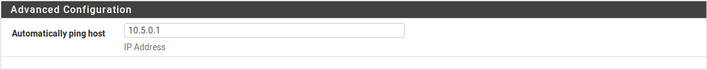
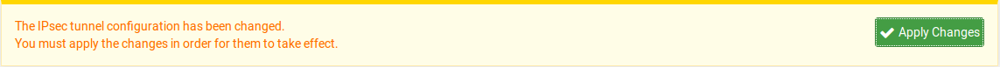
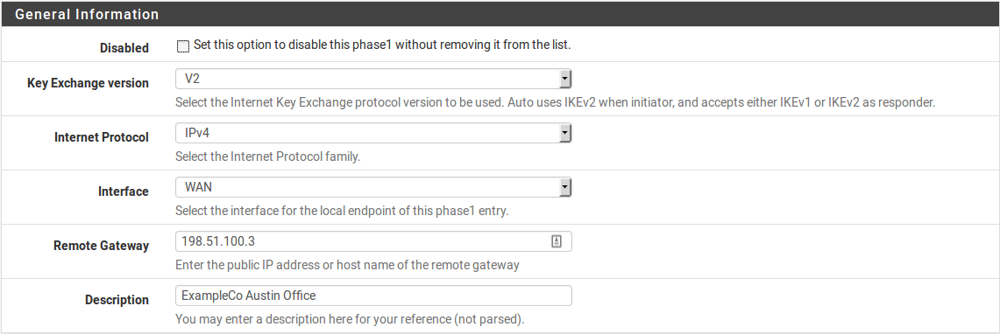
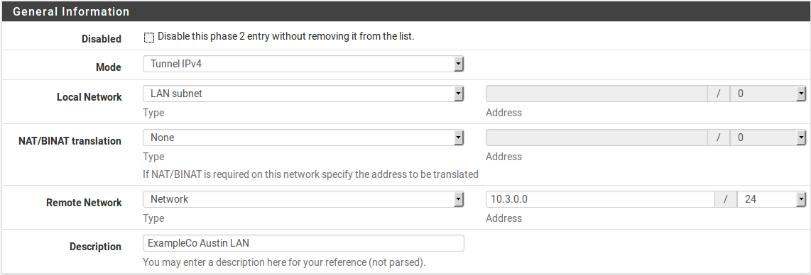
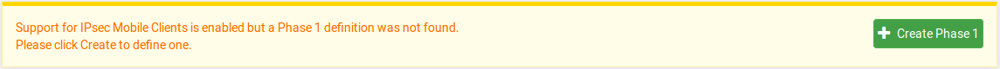
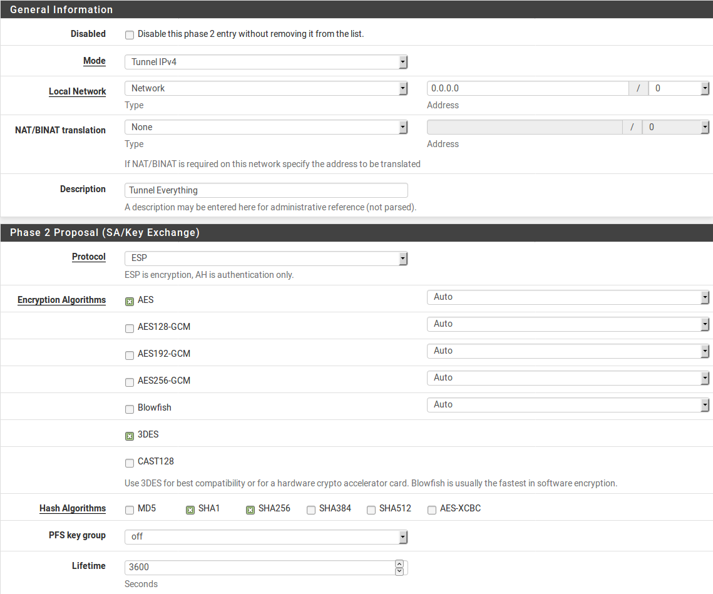

*****
IPSec
*****

IPsec e IPv6
''''''''''''

IPsec è in grado di connettersi a un tunnel su indirizzi peer con IPv4 o
IPv6 di fase 1, ma con IKEv1 il tunnel può contenere solo lo stesso tipo
di traffico all'interno della definizione della fase 2 del tunnel che
viene utilizzato per superare il traffico all'esterno del tunnel. Ciò
significa che, anche se IPv4 o IPv6 possono essere trasportati
all'interno del tunnel, per utilizzare il traffico IPv6 all'interno del
tunnel deve essere collegato tra indirizzi IP peer con IPv6, non IPv4.
In altre parole, la famiglia dell'indirizzo interno ed esterno deve
corrispondere, non possono essere mescolati.

Come per la maggior parte delle altre carenze di IKEv1, questo problema
è stato affrontato in IKEv2. I tunnel che utilizzano IKEv2 possono
trasportare entrambi i tipi di traffico, indipendentemente dal
protocollo utilizzato per creare il tunnel esterno. Con IKEv2, i client
di dispositivi mobili possono anche utilizzare sia IPv4 che IPv6, a
condizione che il client lo supporti.

Scegliere le opzioni di configurazione
''''''''''''''''''''''''''''''''''''''

IPsec offre numerose opzioni di configurazione, che influenzano le
prestazioni e la sicurezza delle connessioni IPsec. Realisticamente, per
un uso di banda da bassa a moderata, importa poco quali opzioni sono
scelte qui finché non viene utilizzato il DES e viene definita una forte
chiave pre-condivisa, A meno che il traffico protetto non sia così
prezioso che un avversario non sia disposto a investire molti milioni di
dollari di potenza di elaborazione per rompere la crittografia IPsec.
Anche in questo caso, c'è probabilmente un modo più facile e molto più
economico per entrare nella rete e ottenere lo stesso risultato finale
(ingegneria sociale, per esempio). Le prestazioni sono il fattore più
importante per molti, e nei casi in cui questa è una preoccupazione, è
necessaria più cura quando si crea una configurazione.

Impostazioni della fase 1 (Phase1)
==================================

Le impostazioni qui controllano la fporzione di negoziazione della fase
1 del tunnel, come descritto in precedenza.

Abilitare/disabilitare il tunnel
--------------------------------

La casella di controllo **Disattivato** controlla se questo tunnel (e le
relative voci di fase 2 associate) sono attivi e utilizzati.

Versione Key Exchange
---------------------

Il selettore **Versione Key Exchange** controlla se il tunnel
userà la versione 1 (V1) o la versione 2 (V2) di IKE. IKEv2 è una
versione più recente di IKE che è auspicabile per molti motivi. Le
differenze sono discusse in *IKE*. Nella maggior parte dei casi, IKEv1
verrà utilizzato a meno che entrambe le parti non supportino
correttamente IKEv2.

Protocollo Internet
-------------------

Il selettore **protocollo di Internet** imposta il protocollo per
l'\ *esterno* del tunnel. Cioè, il protocollo che verrà utilizzato tra
gli indirizzi peer esterni. Per la maggior parte, questo sarà *IPv4*, ma
se entrambe le estremità sono in grado di supportare Ipv6, che può
essere utilizzato altrimenti. Il protocollo scelto sarà utilizzato per
convalidare il gateway remoto e gli identificatori associati.

.. note::  
	Un tunnel che utilizza IKEv1 può portare solo lo stesso traffico di protocollo nella fase 2 come è stato usato per la fase 1. Ad esempio, gli indirizzi peer IPv4 limitano la fase 2 solo alle reti IPv4. Un tunnel che utilizza IKEv2 può trasportare sia il traffico IPv4 che quello IPv6 contemporaneamente nella fase 2, indipendentemente dal protocollo utilizzato per la fase 1.

Selezione dell’interfaccia
--------------------------

In molti casi, l'opzione **Interfaccia** per un tunnel IPsec sarà WAN,
poiché i tunnel sono collegati a siti remoti. Tuttavia, ci sono un sacco
di eccezioni, le più comuni delle quali sono delineate nel resto di
questa sezione.

Ambienti CARP
-------------

Gli indirizzi IP virtuali di tipo CARP sono disponibili anche nel menu a
discesa di **Interfaccia** per l'utilizzo in ambienti ad elevata
disponibilità (*Elevata disponibilità*). In questi ambienti, un
indirizzo CARP appropriato deve essere scelto per la WAN dove terminerà
il tunnel IPsec. Con l’uso dell'indirizzo IP del CARP, si garantisce che
il tunnel IPsec sarà gestito dal membro del cluster ad elevata
disponibilità attualmente in stato MASTER, quindi anche se il firewall
primario è disattivato, il tunnel si collegherà a qualsiasi membro del
cluster abbia assunto il ruolo di MASTER.

VIP dell’alias dell’IP
----------------------

Se sono disponibili più indirizzi IP su un'interfaccia che utilizza i
VIP di tipo alias dell’IP, saranno disponibili anche in questo elenco.
Per utilizzare uno di questi indirizzi IP per la VPN, invece,
selezionarlo qui.

Ambienti con MultiWAN
---------------------

Quando si utilizza MultiWan (*Connessioni WAN multiple*), scegliere
l'interfaccia appropriata per l'interfaccia di tipo WAN a cui il tunnel
si connetterà. Se la connessione entra via WAN, scegliere WAN. Se il
tunnel utilizza una WAN diversa, scegliere l'interfaccia WAN OPT
necessaria. Verrà aggiunto automaticamente un percorso statico per
garantire che il traffico verso i percorsi del **gateway remoto**
attraverso la WAN appropriata.

Un gruppo gateway può anche essere scelto da questa lista. Un gruppo
gateway da usare con IPsec deve avere un solo gateway per livello.
Quando si utilizza un gruppo di gateway, se il primo gateway si spegne,
il tunnel passa alla prossima WAN disponibile nel gruppo. Quando la
prima WAN torna su, il tunnel sarà ricostruito di nuovo lì. Se
l'endpoint sul lato opposto è uno che non supporta più indirizzi peer,
come un altro firewall di |firew4ll|, questo deve essere combinato con un
set di host del DynDNS che utilizza lo stesso gruppo di gateway per
failover. L'host del DynDNS aggiornerà l'indirizzo IP come visto dal
lato opposto, in modo che l'endpoint remoto sappia di accettare il
traffico dalla WAN appena attivata.

Protezione interna wireless 
----------------------------

Quando si configura IPsec per aggiungere LA crittografia a una rete
wireless, come descritto in *Protezione aggiuntiva per una rete
wireless*, scegliere l'interfaccia OPT che corrisponde alla scheda
wireless. Quando si utilizza un punto di accesso wireless esterno,
selezionare l'interfaccia collegata al punto di accesso wireless.

Gateway remoto
--------------

Il **gateway remoto** è il peer di IPsec per questa fase 1. Questo è
l'endpoint dall'altro lato del tunnel verso il quale IPsec negozierà
questa fase 1. Questo può essere impostato su un indirizzo IP o un nome
di dominio completamente qualificato. Quando impostata per usare un
nome, la voce viene periodicamente risolta dal DNS e aggiornata quando
viene rilevata una modifica.

Descrizione
-----------

La **Descrizione** per la fase 1 è un testo da usare per identificare
questa fase 1. Non è utilizzata nelle impostazioni Ipsec, è solo per
riferimento.

Metodo per l’autenticazione
---------------------------

Una fase 1 di IPsec può essere autenticata usando una chiave
pre-condivisa (PSK) o certificati RSA, il selettore **del metodo di
autenticazione** sceglie quale di questi metodi verrà utilizzato per
autenticare il peer remoto. I campi appropriati al metodo scelto saranno
visualizzati nella schermata di configurazione della fase 1.

PSK reciproco
-------------

Quando si usa il PSK reciproco, il peer viene validato usando una
stringa definita. Più lunga è, migliore risulta, ma dal momento che è
una semplice stringa, c'è una possibilità che si possa indovinare. Per
questo motivo una chiave lunga/complessa è più sicura quando si utilizza
la modalità PSK.

RSA reciproco
-------------

In modalità *RSA reciproca*, selezionare una CA e un certificato
utilizzati per verificare il peer. Durante lo scambio di fase 1, ogni
peer invia il proprio certificato all'altro peer e poi lo convalida
contro la propria CA condivisa. La CA e il certificato devono essere
creati per il tunnel prima di tentare di impostare la fase 1.

Modalità PSK+Xauth reciproca
----------------------------

Utilizzata con IPsec e IKEv1 mobili, questa selezione consente la
verifica del nome utente e della password xauth insieme a una chiave
pre-condivisa (o gruppo).

Modalità RSA+Xauth reciproca
----------------------------

Utilizzata con IPsec e IKEv1 per dispositivi mobili, questa selezione
consente la verifica del nome utente e della password xauth insieme
all'autenticazione dei certificati RSA utilizzando certificati sia sul
client che sul server.

Modalità RSA+Xauth
------------------

Utilizzata con dispositivi mobili con IPsec e IKEv1, questa selezione la
verifica del nome utente e della password xauth insieme a un certificato
solo sul lato server. Non è abbastanza sicuro come la *modalità
RSA+Xauth reciproca,* ma è più facile per i client.

EAP-TLS
-------

Utilizzato con dispositivi mobili con IPsec e IKEv2, EAP-TLS dell’RSA
verifica che i certificati sul client e sul server provengano dalla
stessa CA condivisa, simile all’RSA reciproco. I certificati client e
server richiedono un trattamento speciale:

-  Il certificato del server deve avere il nome del firewall come esiste
       nel DNS elencato nel suo Nome Comune, e di nuovo come Nome del
       Soggetto Alternativo (SAN). L'indirizzo IP del firewall deve
       anche essere elencato in un SAN.

-  L'identificatore nella fase 1 deve anche essere impostato per
       corrispondere al nome dell’host del firewall come elencato nel
       nome comune del certificato.

-  Il certificato client deve avere il nome dell'utente elencato come
       nome comune e poi di nuovo come SAN.

I certificati CA e server devono essere generati prima di tentare di
configurare EAP-TLS. Il CA e oò certificato dell’utente devono essere
importati nel client.

EAP-RADIUS
----------

Utilizzato con IPsec e IKEv2 per dispositivi mobili, questa selezione
esegue la verifica di CA insieme all’autenticazione del nome utente e
della password via RADIUS. Un server RADIUS deve essere selezionato
nella scheda **client per dispositivi mobili.** Anche se i certificati
utente non sono necessari, EAP-RADIUS richiede ancora che un CA e un
certificato del server siano presenti utilizzando gli stessi attributi
menzionati in EAP-TLS. La CA deve essere importata al client, ma nessun
certificato utente.

EAP-MSCHAPv2
------------

Utilizzato con IPsec e IKEv2 su dispositivi mobili, EAP-Mschapv2
funziona in modo identico a EAP-RADIUS ad eccezione dei nomi utente e
password che sono definiti nella scheda **Chiave pre-condivisa** in
**VPN>IPsec** con il **tipo segreto** impostato su EAP. Si richiede
anche un CA e un certificato del server con gli stessi requisiti
elencati in precedenza. La CA deve essere importata al client, ma nessun
certificato utente.

Modalità di negoziazione
------------------------

Per IKEv1, sono supportate due **modalità di negoziazione**: principale
, aggressiva. Questa selezione non è presente quando si utilizza Ikev2.

Modalità principale
~~~~~~~~~~~~~~~~~~~

*Principale* è la modalità più sicura, sebbene richieda anche più
pacchetti tra i peer per realizzare una negoziazione di successo. E
'anche molto più rigorosa nella sua convalida.

Modalità aggressiva
~~~~~~~~~~~~~~~~~~~

*Aggressiva* è generalmente il più compatibile ed è la modalità più
veloce. È un po' più indulgente con i tipi di identificatore, e tende ad
avere più successo quando si negozia con dispositivi di terze parti in
alcuni casi. È più veloce perché invia tutte le informazioni
identificative in un singolo pacchetto, il che lo rende anche meno
sicuro perché la verifica di tali dati non è così rigorosa come quella
che si trova nella modalità principale.

Mio identificatore/Identificatore peer
--------------------------------------

Qui, scegliere l'identificatore utilizzato per inviare al peer remoto, e
anche per verificare l'identità del peer remoto. I seguenti tipi di
identificatore possono essere scelti per i selettori **Mio
identificatore** e **Identificatore peer**. Se necessario, una casella
di testo apparirà per inserire un valore da utilizzare per
l'identificatore.

Mio indirizzo IP/Indirizzo IP peer
----------------------------------

Questa scelta è una macro che utilizzerà automaticamente l'indirizzo IP
sull'interfaccia, o il VIP selezionato, come identificatore. Per i peer,
questo è l'indirizzo IP da cui sono stati ricevuti i pacchetti, che
dovrebbe essere il **gateway remoto.**

Indirizzo IP
------------

L'opzione *Indirizzo IP* consente di utilizzare un indirizzo IP diverso
come identificatore. Un uso potenziale per questo sarebbe se il firewall
è dietro un router che esegue il NAT. Il vero indirizzo IP esterno
potrebbe essere utilizzato in questo campo.

Distinguished Name
------------------

Un *Distinguished Name* è un altro termine per un nome di dominio
completamente qualificato, come *host.esempio.com*. Inserire un valore
in quel formato nella casella.

Nome utente distinto
--------------------

Un *nome utente distinto* è un indirizzo e-mail, come vpn@esempio.com,
piuttosto che un FQDN.

Distinguished Name dell’ ASN.1
------------------------------

Se si utilizza l'autenticazione in modalità *RSA reciproca*, questo può
essere il soggetto del certificato utilizzato, o una stringa simile.

Tag dell’ID della chiave (KeyID)
--------------------------------

Una stringa arbitraria da usare come identificatore.

DNS Dinamico
------------

Un nome host da risolvere e utilizzare come identificatore. Questo è
utile soprattutto se il firewall è dietro il NAT e non ha alcuna
conoscenza diretta del suo indirizzo IP esterno a parte un hostname del
DNS dinamico. Questo non è rilevante o disponibile per un
**identificatore peer** in quanto il nome host può essere utilizzato
direttamente nel campo **gateway remoto** e utilizzare l'\ *indirizzo IP
del peer* per l'identificatore.

Any
---------

Nei casi in cui l'identificatore remoto non è noto o non può essere
abbinato, l'\ **identificatore peer** può essere impostato su
**Any**. Questo è più comune su alcuni tipi di configurazioni
mobili, ma è una scelta molto meno sicura che abbinare correttamente
l'identificatore.

Pre-Shared Key (se si utilizza il PSK reciproco)
------------------------------------------------

Questo campo è usato per entrare nel PSK per l'autenticazione di fase 1.
Come accennato in precedenza, farei di questa una chiave
lunga/complessa. Se questo PSK è stato fornito dal peer, inserirlo qui.
Se un nuovo PSK deve essere generato, si consiglia di utilizzare uno
strumento di generazione di password impostato ad una lunghezza di
almeno 15, ma può essere molto più lungo.

Phase 1 - Algoritmi di crittografia
-----------------------------------

Ci sono molte opzioni per gli algoritmi di crittografia sia di fase 1
sia di fase 2.

Le opzioni attuali sono tutte considerate crittograficamente sicure. La
scelta dipende dal dispositivo a cui il tunnel si connetterà e
dall'hardware disponibile in questo firewall. In generale, AES è il
cifrario più desiderabile e la lunghezza della chiave più lunga (256
bit) è la migliore. Quando ci si connette a dispositivi di terze parti,
3DES (chiamato anche “Triplo DES”) è una scelta comune in quanto
potrebbe essere l'unica opzione supportata dall'altro terminale.

Ulteriori informazioni sui cifrari e sull'accelerazione sono disponibili
negli *algoritmi di crittografia fase 2*.

Phase 2 - Algoritmi di hash
---------------------------

Gli algoritmi di hash vengono utilizzati con IPsec per verificare
l'autenticità dei dati dei pacchetti. MD5, SHA1, SHA256, SHA384, SHA512,
e AES-XCBC sono gli algoritmi di hash disponibili per la fase 1 e la
fase 2. Tutti sono considerati crittograficamente sicuri, anche se SHA1
(Algoritmo di hash sicuro, Revisione 1) e le sue varianti sono
considerati i più forti rispetto MD5. SHA1 richiede più cicli di CPU di
MD5, e i valori più grandi di SHA a loro volta richiedono una potenza
della CPU ancora maggiore. Questi algoritmi di hash possono anche essere
riferiti a HMAC (Codice di autenticazione del messaggio di hash) nel
nome in alcuni contesti, ma tale utilizzo varia a seconda dell'hardware
o del software in uso.

.. note::  
	L'implementazione di SHA256-512 è conforme a RFC 4868 sulla versione di FreeBSD usata da |firew4ll|. La conformità con RFC 4868 rompela compatibilità con gli stack che sono implementato con draft-ietf-ipsec-ciph-sha-256-00, inclusi FreeBSD 8.1 e precedenti. Prima di utilizzare SHA256, 384 o 512, verificare con l'altro lato per assicurarsi che ci siano anche implementazioni conformi a RFC 4868 o non funzioneranno. Il messaggio di impegno di FreeBSD pertinente quando compare spiega in modo più dettagliato.

Gruppo di chiavi DH
-------------------

Tutte le opzioni del gruppo di chiavi DH (Diffie-Hellman, dal nome dei suoi autori) sono considerate crittograficamente sicure, anche se i numeri più alti sono leggermente più sicuri a costo di un maggiore utilizzo della CPU.

Durate di vita
--------------

La durata specifica la frequenza con cui la connessione deve essere impostata, specificata in secondi. 28800 secondi sulla fase 1 è una configurazione comune ed è appropriata per la maggior parte degli scenari.

Certificato Autonono (se si utilizza l’RSA reciproco)
-----------------------------------------------------

Questa opzione appare solo se si utilizza una **modalità di
autenticazione** basata su RSA. L'elenco è compilato utilizzando i
certificati presenti nella configurazione del firewall. I certificati
possono essere importati e gestiti in **Sistema>Gestione dei
certificati** nella scheda **Certificati**. Sceglere il certificato da
usare per questa fase 1 di IPsec dall'elenco. La CA per questo
certificato deve corrispondere a quella scelta nel selettore **Autorità
del mio certificato**.

L’autorità di certificazione autonoma (se si utilizza l’RSA reciproco)
----------------------------------------------------------------------

Questa opzione appare solo se si usa una **modalità di autenticazione**
basata su RSA. L'elenco è riempito usando le CA presenti nella
configurazione del firewall. Una CA può essere importata e gestita in
**Sistema>Gestione dei certificati**. Scegliere la CA da usare per
questa fase 1 di IPsec dall'elenco.

Disabilitare Rekey
------------------

Selezionando questa opzione si ordina a |firew4ll| di non avviare un rekey
sul tunnel. Alcuni client (specialmente i client Windows dietro NAT) si
comportano male quando ricevono una richiesta rekey, quindi è più sicuro
in questi casi permettere al client di avviare rekey disabilitando
l'opzione sul server. Normalmente entrambe le parti dovrebbero
effettuare un rekey se necessario, ma se il tunnel fallisce quando si
verifica un evento rekey, provare a selezionare questa opzione su un
solo lato.

Disabilitare la ri-autentificazione
-----------------------------------

Questa opzione viene visualizzata solo per i tunnel IKEv2, IKEv1 sarà
sempre ri-autenticato. Se questa opzione è selezionata, quando un tunnel
effettua un rekey non ri-autentica il peer. Quando non è controllato, la
SA viene rimossa e negoziata per intero, piuttosto che effettuare solo
il rekey.

Solo per i risponditori
-----------------------

Se è selezionato **Solo rispondente**, |firew4ll| non tenterà di avviare il
tunnel quando il traffico tenta di attraversare. Il tunnel verrà
stabilito solo quando il lato opposto avvia la connessione. Inoltre, se
DPD rileva che il tunnel è fallito, il tunnel sarà lasciato down
piuttosto che essere riavviato, lasciandolo up sul lato opposto per
ricollegare.

NAT Traversal
-----------------------

L'opzione di NAT Traversal, nota anche come NAT-T, è
disponibile solo per IKEv1. IKEv2 ha il NAT Traversal integrato
in modo che l'opzione sia inutile. L’NAT Traversal può
incapsulare il traffico ESP per IPsec all'interno dei pacchetti UDP, per
funzionare più facilmente in presenza del NAT. Se questo firewall o il
firewall dall'altra parte del tunnel saranno dietro un dispositivo NAT,
allora l’NAT Traversal sarà probabilmente necessario.
L'impostazione predefinita *Automatico* utilizzerà l’attraversamento del
NAT nei casi in cui ne viene rilevata la necessità. L'opzione può anche
essere impostata su *Forzare* per garantire che il’attraversamento del
NAT sia sempre utilizzato per il tunnel. Questo può aiutare se c'è un
problema noto che trasporta traffico ESP tra i due endpoint.

MOBIKE
------

MOBIKE è un'estensione di IKEv2 che gestisce client con diverse case e
client che vagano tra diversi indirizzi IP. Questo viene utilizzato
principalmente con i client con dispositivi mobili per consentire loro
di cambiare gli indirizzi remoti mantenendo attiva la connessione.

Connessioni divise 
-------------------

Questa opzione è specifica per IKEv2 e configura le voci della fase modo
da utilizzare voci di connessione separate, piuttosto che un unico
selettore del traffico per ogni associazione di sicurezza secondaria. In
particolare, questo è noto per essere un problema con i prodotti Cisco
come ASA.

Se un tunnel IKEv2 è in uso con più voci della Fase 2, e solo una coppia
di reti Fase 2 stabilisce una connessione, attivare questa opzione.

Rilevamento dei peer morti (Dead Peer Detection, DPD)
-----------------------------------------------------

Il rilevamento dei peer morti (DPD) è un controllo periodico che
controlla che l'host dall'altra parte del tunnel IPsec sia ancora vivo.
Se un controllo DPD fallisce, il tunnel viene abbattuto rimuovendo le
voci SAD associate e si tenta di rinegoziare.

Il campo **Ritardo** controlla quante volte viene tentato un controllo
DPD, e il campo **Fallimenti massimi** controlla quanti di questi
controlli devono fallire prima che un tunnel sia considerato in stato di
down. I valori di default di 10 secondi e 5 fallimenti risulteranno nel
tunnel che sarà considerato down dopo circa un minuto. Questi valori
possono essere aumentati per i collegamenti di cattiva qualità per
evitare di abbattere un tunnel utilizzabile, ma con perdite.

Phase 2 - Impostazioni
======================

Le impostazioni della fase 2 per un tunnel IPsec regolano il traffico
che entra nel tunnel e come viene cifrato. Per i tunnel normali, questo
controlla le sottoreti che entreranno nel firewall. Per i client con
dispositivi mobili controlla principalmente la crittografia per la fase
2, ma può anche fornire opzionalmente un elenco di reti ai clienti per
l'uso del tunnel diviso. Per ogni fase 1 possono essere aggiunte
definizioni multiple della fase 2 per consentire l'utilizzo di più
sottoreti all'interno di un singolo tunnel.

Abilitare/Disabilitare
----------------------

Questa impostazione controlla se questa voce della fase 2 è attiva o
meno.

Modalità
--------

Questa opzione consente la modalità tradizionale di tunnel di Ipsec o la
modalità di trasporto. La modalità di tunnel può anche specificare IPv4
o IPv6.

Modalità tunnel IPv4/IPv6
-------------------------

Quando si utilizza il *tunnel IPv4* o il *tunnel IPv6* per questa voce
di fase 2, il firewall userà il tunnel IPv4 o IPv6 per il traffico
corrispondente alla **rete locale** e alla **rete remota** specificata.
Una fase 2 ci può essere per IPv4 o IPv6, e i valori di rete sono
convalidati in base a tale scelta. Il traffico corrispondente sia alla
rete locale che alla rete remota entrerà nel tunnel e verrà consegnato
all'altro lato.

.. note::  Con IKEv1, può essere utilizzato solo uno tra IPv4 o IPv6, e
deve corrispondere alla stessa famiglia di indirizzi utilizzata per
stabilire la fase 1 del tunnel. Con IKEv2, entrambi i tipi possono
essere utilizzati nello stesso tunnel.

Modalità di trasporto
---------------------

La modalità di *trasporto* cifrerà il traffico tra gli indirizzi IP
utilizzati come endpoint di fase 1. Questa modalità consente di
crittografare il traffico dall'indirizzo IP esterno del firewall
all'indirizzo IP esterno sul lato opposto. Qualsiasi traffico inviato
tra i due nodi sarà crittografato, in modo da utilizzare altri metodi di
effettuare il tunnel che non utilizzano la crittografia, come un tunnel
GIF o GRE, in modo sicuro. La **rete locale** e la **rete remota** non
sono impostate per la modalità di trasporto, essa assume gli indirizzi
in base alle impostazioni della fase 1.

Rete locale (se si utilizza una modalità tunnel)
------------------------------------------------

Come suggerisce il nome, questa opzione imposta la **Rete Locale** che
sarà associata a questa fase 2. Questa è tipicamente la LAN o altra
sottorete interna per la VPN, ma può anche essere un singolo indirizzo
IP se solo un client ha bisogno di usare il tunnel. Il selettore Tipo è
pre-caricato con scelte di sottorete per ogni interfaccia (es.
*sottorete LAN* ), così come le scelte di *Indirizzo* e *Rete* che
permettono di inserire un indirizzo IP o sottorete manualmente.

Traduzione NAT/BINAT
--------------------

Per eseguire il NAT su indirizzi di rete locali per farli apparire come
sottorete diversa o come indirizzo IP pubblico, utilizzare i campi di
**traduzione NAT/BINAT**. Se un singolo indirizzo IP è specificato in
**Rete Locale** e un singolo indirizzo IP nel campo del **tipo di
traduzione NAT/BINAT**, allora verrà impostata una traduzione NAT 1:1
tra i due. Il NAT 1:1 è anche configurato se una sottorete della stessa
dimensione è usata in entrambi i campi. Se la rete locale è una
sottorete, ma la **traduzione NAT/BINAT** è impostata su un singolo
indirizzo IP, allora viene impostata una traduzione 1:molti NAT (PAT)
che funziona come una regola del NAT in uscita sulla WAN, tutto il
traffico in uscita sarà tradotto dalla rete locale al singolo IP nel
campo NAT. Se il NAT non è necessario sul traffico IPsec, lasciarlo
impostato su *Nessuno*.

Rete remota (se si utilizza una modalità tunnel)Remote Network
--------------------------------------------------------------

Questa opzione (presente solo per tunnel su dispositivi non mobili)
specifica l'\ *indirizzo* IP o la *rete* che esiste sull'altro lato
(remoto) della VPN. Funziona in modo simile all'opzione **Rete Locale**
menzionata in precedenza.

Protocollo
----------

IPsec ha la possibilità di scegliere AH (Intestazione autenticata) o ESP
(Incapsulamento del carico utile di sicurezza). In quasi tutte le
circostanze, ESP è utilizzato in quanto è l'unica opzione che
crittografa il traffico. AH fornisce solo la garanzia che il traffico
proviene dalla fonte attendibile ed è raramente utilizzato.

Phase 2 - Algoritmi di crittografia
-----------------------------------

Nei sistemi con AES-NI, la scelta più rapida e sicura è AES-GCM, a
condizione che il dispositivo remoto lo supporti. Quando si utilizza
AES-GCM nella fase 2, utilizzare AES nella fase 1 con una lunghezza di
chiave equivalente. Anche se AES-CGM è utilizzato, non selezionare
alcuna opzione per gli **algoritmi di hash** nella fase 2.

Quando si utilizzano sistemi con acceleratori *glxsb*, come ALIX,
scegliere AES 128 per le migliori prestazioni. Per i sistemi con
acceleratori *hifn*, scegliere 3DES o AES per le migliori prestazioni.
Sia AES che Blowfish permettono di selezionare la lunghezza della chiave
del cifrario in passi variabili tra 128-bit e 256-bit. Valori più bassi
saranno più veloci, valori più grandi sono più crittograficamente
sicuri. Per i sistemi senza un acceleratore di crittografia hardware,
Blowfish e CAST sono le opzioni più veloci.

Le scelte di crittografia di fase 2 consentono selezioni multiple in
modo che siano accettate scelte multiple quando si agisce come
rispondente, o si tenteranno combinazioni multiple quando si lavora come
iniziatore. È meglio selezionare solo il cifrario desiderato, ma in
alcuni casi selezionarne di più permetterà ad un tunnel di lavorare
meglio sia come rispondente sia come iniziatore.

Phase 2 - Algoritmi di hash
---------------------------

Come con gli algoritmi di crittografia, possono essere selezionati più
hash. È comunque meglio selezionare solo la scelta desiderata, se
possibile. Per ulteriori discussioni sulla qualità dei vari tipi di
hash, vedere *Algoritmi di hash di fase 1*.

.. note::  Quando si utilizza AES-GCM per l'algoritmo di crittografia di
faase 2, non selezionare alcuna opzione per l'algoritmo di hash!

Gruppo di chiavi PFS
--------------------

La perfetta segretezza forward (Perfect Forward Secrecy, PFS) fornisce
materiale per creare chiavi con maggiore entropia, migliorando così la
sicurezza crittografica della connessione, al costo di un maggiore
utilizzo della CPU quando si verifica il rekey. Le opzioni hanno le
stesse proprietà dell'opzione del gruppo di chiavi DH nella fase 1
(Vedere *gruppo di chiavi DH*), e alcuni prodotti si riferiscono a loro
anche come valori di “DH” anche nella fase 2.

Durata di vita
--------------

L'opzione **durata di vita** specifica la frequenza con cui la
connessione deve essere impostata, in secondi. 3600 secondi sulla fase 2
è una configurazione comune ed è appropriata per la maggior parte degli
scenari.

Host per il ping automatico (Mantenere in vita)
-----------------------------------------------

Per l'uso su tunnel con dispositivi non mobili, questa opzione dice al
firewall di avviare un ping periodicamente all'indirizzo IP specificato.
Questa opzione funziona solo se il firewall ha un indirizzo IP
all'interno della **rete locale** per questa voce di fase 2 e il valore
dell'host del ping qui deve essere all'interno della **rete remota**.

Regole di firewall e IPsec
''''''''''''''''''''''''''

Quando un tunnel Ipsec è configurato |firew4ll| aggiunge automaticamente le
regole del firewall nascoste per consentire le porte UDP 500 e 4500, e
il protocollo ESP dall'indirizzo IP del **gateway remoto** destinato
all'indirizzo IP dell'interfaccia specificato nella configurazione del
tunnel. Quando il supporto del client da dispositivo mobile è abilitato,
le stesse regole del firewall vengono aggiunte, tranne quelle con il
codice sorgente impostato su *qualsiasi*. Per annullare l'aggiunta
automatica di queste regole, selezionare **Disabilitare tutte le regole
VPN aggiunte automaticamente** in **Sistema>Avanzate** nella scheda
**Firewall/NAT**. Quando questa casella è selezionata, le regole del
firewall devono essere aggiunte manualmente per UDP 500, UDP 4500 ed ESP
all'interfaccia WAN appropriata.

Il traffico iniziato dall'estremità remota di una connessione IPsec è
filtrato con le regole configurate in **Firewall>Regole** nella scheda
**IPsec**. Qui le restrizioni possono essere poste sulle risorse rese
accessibili agli utenti IPsec remoti. Per controllare quale traffico può
essere passato dalle reti locali ai dispositivi o alle reti collegate
con IPsec della VPN da remoto, le regole sono sull'interfaccia locale in
cui risiede l'host controllano il traffico (ad es. la connettività dagli
host sulla LAN sono controllate con le regole LAN).

Sito-a-sito 
''''''''''''

Un tunnel IPsec con opzione sito-a-sito collega due reti come se fossero
collegate direttamente da un router. I sistemi del Sito A possono
raggiungere server o altri sistemi del Sito B e viceversa. Questo
traffico può anche essere regolato tramite regole firewall, come con
qualsiasi altra interfaccia di rete. Se più di un client si connette ad
un altro sito dalla stessa posizione controllata, un tunnel sito-a-sito
sarà probabilmente più efficiente, per non parlare dell’essere più
comodo e più facile da supportare.

Con un tunnel sito-a-sito, i sistemi su entrambe le reti non devono
avere alcuna conoscenza dell'esistenza di una VPN. Non è necessario
alcun software del client, e tutto il lavoro del tunnel è gestito dagli
endpoint del tunnel. Questa è una buona soluzione anche per i
dispositivi che hanno il supporto di rete ma non gestiscono le
connessioni VPN come stampanti, telecamere, sistemi HVAC e altri
hardware incorporati.

Esempio di configurazione sito-a-sito
====================================-

La chiave per creare un tunnel IPsec funzionante è garantire che
entrambe le parti abbiano impostazioni corrispondenti per
l'autenticazione, la crittografia e così via. Prima di iniziare,
annotare gli indirizzi IP delle WAN locali e remote, nonché le sottoreti
interne locali e remote che saranno trasportate attraverso il tunnel. Un
indirizzo IP dalla sottorete remota per effettuare un ping è opzionale,
ma è consigliato per mantenere vivo il tunnel. Il firewall non controlla
le risposte, in quanto qualsiasi traffico avviato a un indirizzo IP
sulla rete remota attiverà la negoziazione IPsec, quindi non importa se
l'host effettivamente risponde o meno finché c’è un indirizzo IP
dall'altro lato della connessione. Oltre alla **descrizione** estetica
del tunnel e queste informazioni, le altre impostazioni di connessione
saranno identiche.

In questo esempio e alcuni degli esempi successivi in questo capitolo,
le seguenti impostazioni saranno assunte:

Tabella 1: Impostazioni degli endpoint Ipsec

+======================-+====================-+======================-+====================-+
| Sito A                | Sito B              |                       |                     |
+''''''''''''''''''''''=+''''''''''''''''''''=+''''''''''''''''''''''=+''''''''''''''''''''=+
|                       | Ufficio di Austin   |                       | Ufficio di Londra   |
+======================-+====================-+======================-+====================-+
| IP della WAN          | 198.51.100.3        | IP della WAN          | 203.0.113.5         |
+======================-+====================-+======================-+====================-+
| Sottorete della LAN   | 10.3.0.0/24         | Sottorete della LAN   | 10.5.0.0/24         |
+======================-+====================-+======================-+====================-+
| IP della LAN          | 10.3.0.1            | IP della LAN          | 10.5.0.1            |
+======================-+====================-+======================-+====================-+

Iniziare con Sito A. Creare il tunnel facendo clic su |image0|
**Aggiungere P1**. Viene mostrata la pagina di configurazione della fase
1 per il tunnel. Molte di queste impostazioni possono essere lasciate ai
loro valori predefiniti.

In primo luogo, compilare la sezione superiore che contiene le
informazioni generali di fase 1, come mostrato nella figura
*Impostazioni del tunnel della VPN*. Gli elementi in grassetto sono
necessari. Inserire le impostazioni come descritto:

    **Deselezionato** Deselezionare questa casella in modo che il tunnel
    sia operativo.

    **Versione con scambio di chiave** Specifica se utilizzare IKEv1 o
    IKEv2. Per questo esempio, IKEv2 è utilizzato, ma se un lato non
    supporta IKEv2, utilizzare nvece IKEv1.

    **Protocollo Internet** Sarà *IPv4* nella maggior parte dei casi, a
    meno che entrambe le WAN abbiano l'IPv6, nel qual caso è possibile
    utilizzare entrambi i tipi.

    **Interfaccia** Molto probabilmente impostata su *WAN*, ma vedere la
    nota in *Selezione dell’interfaccia* sulla selezione
    dell'interfaccia corretta quando non si è sicuri.

    **Gateway remoto** L'indirizzo WAN del sito B, 203.0.113.5 in questo
    esempio.

    **Descrizione** Testo per indicare lo scopo o l'identità del tunnel.
    È una buona idea mettere il nome del sito B in questa casella, e
    qualche dettaglio sullo scopo del tunnel per aiutare la futura
    amministrazione. Per questo esempio Ufficio di Londra dell’EsempioCo
    viene utilizzato nella descrizione per identificare dove termina il
    tunnel.

La sezione successiva controlla la fase 1 di IPsec, o l’autenticazione.
È mostrata in figura *Impostazioni della fase del sito A*. I valori
predefiniti sono desiderabili per la maggior parte di queste
impostazioni e semplificano il processo.

    **Metodo di autenticazione** L’impostazione predefinita, *PSK
    reciproco*, è usata per questo esempio.

    **Mio identificatore** Il valore predefinito, *mio indirizzo IP*,
    viene mantenuto.

    **Identificatore del peer** Il valore predefinito, *Indirizzo IP del
    Peer IP*, viene mantenuto.

    **Chiave pre-condivisa** Questa è l'impostazione più importante per
    funzionare. Come indicato nella panoramica VPN, IPsec che utilizza
    chiavi pre-condivise può essere rotto se viene utilizzata una chiave
    debole. Utilizzare una chiave forte, di almeno 10 caratteri di
    lunghezza contenente un mix di lettere, numeri e simboli maiuscoli e
    minuscoli. La stessa chiave esatta dovrà essere inserita nella
    configurazione del tunnel per il Sito B in seguito, quindi annotarla
    o copiarla e incollarla altrove. Copiare e incollare può essere
    utile, specialmente con una chiave complessa come
    abc123%Xyz9$7qwErty99.

|image1|

Fig. 1: Impostazioni del tunnel della VPN del sito A

    **Algoritmo di crittografia** Usa *AES* con una lunghezza della
    chiave di 256 bit.

    **Algoritmo hash** Usa *SHA256* se entrambi i lati lo supportano,
    altrimenti usa *SHA1* predefinito.

    **Gruppo DH** Il valore predefinito di *2* *(1024 bit)* è OK, valori
    più alti sono più sicuri ma usano più CPU.

    **Durata di vita** Può anche essere specificata, altrimenti verrà
    utilizzato il valore predefinito di *28800*.

    **Disabilitare rekey** Lasciare deselezionato

    **Solo rispondente** Lasciare deselezionato

    **NAT Traversal** Lasciare su *Automatico*, poiché in
    questo esempio nessuno dei due firewall è dietro NAT.

    **Rilevamento dei peer morti** Lasciare selezionato, il **ritardo**
    predefinito di 10 secondi e Max Failure di 5 è ade-quate. A seconda
    delle esigenze in un sito un valore più elevato può essere migliore,
    come 30 secondi e 6 tentativi, ma una connessione WAN problematica
    su entrambi i lati può renderlo troppo basso.

Fare clic su **Salvare** per completare la fase 1 di installazione.

Dopo l'aggiunta della fase 1, aggiungere una nuova definizione di fase 2
alla VPN:

-  Fare clic su |image2| **Mostrare voci di fase 2** come visto nella
       figura *elenco della fase 2 del sito A (vuoto)* per espandere
       l'elenco di fase 2 per questa VPN.

-  Fare clic su |image3| **Aggiungere P2** per aggiungere una nuova voce
       di fase 2, come si vede nella figura *Aggiunta di una voce di
       fase 2 al sito A*.

Ora aggiungere le impostazioni per la fase 2 su questa VPN. Le
impostazioni per la fase 2 (Figura *Impostazioni generali della fase 2
del sito A*) possono variare più della fase 1.

    **Modalità** Poiché il traffico di tunnel è desiderato, selezionare
    Tunnel IPv4

    **Sottorete locale** Meglio lasciare questo come *sottorete LAN*, ma
    potrebbe anche essere cambiato in *rete* con il valore di sottorete
    corretto compilato, in questo caso *10.3.0.0/24*. Lasciarlo come
    *sottorete LAN* assicura che se la rete viene rinumerata, questa
    estremità del tunnel seguirà. Se ciò accade, l'altra estremità deve
    essere cambiata manualmente.

    **NAT/BINAT** Impostare su *nessuno*.

    **Sottorete remota** Impostare la rete del sito B, in questo caso
    *10.5.0.0/24*.

|image4|

Fig. 2: Impostazione della fase 1 del sito A

|image5|

Fig. 3: Elenco della fase 2 del sito A (Vuoto)

|image6|

Fig. 4: Aggiunta di una voce di fase 2 al sito A

|image7|

Fig. 5: Impostazioni generali della fase 2 del sito A

Il resto delle impostazioni della fase 2, visto in figura *Impostazioni
della fase 2 per il sito A*, coprono la crittografia del traffico. Gli
algoritmi di crittografia e gli algoritmi di hash possono essere
impostati per consentire opzioni multiple nella fase 2, ed entrambe le
parti negoziano e concordano sulle impostazioni finché ciascuna parte ha
almeno una di esse in comune. In alcuni casi può essere una buona cosa,
ma di solito è meglio limitare questo alle singole opzioni specifiche
desiderate da entrambe le parti.

    **Protocollo** Impostare su *ESP* per la crittografia.

    **Algoritmo di crittografia** Idealmente, se entrambe le parti lo
    supportano, selezionare *AES256-GCM* con una lunghezza della chiave
    di *128 bit*. In caso contrario, utilizzare *AES 256*, o qualsiasi
    cifrario entrambe le estremità supportino.

    **Algoritmo hash** Con AES-GCM in uso, non è richiesto alcun hash.
    In caso contrario, utilizzare *SHA 256* o *SHA 1*. Evitare *MD5*
    quando possibile.

    **PFS** Perfetta segretezza forward può aiutare a proteggere da
    alcuni attacchi chiave, ma è opzionale. In questo esempio, è
    disattivato.

    **Durata di vita** Usare 3600 per questo esempio.

|image8|

Fig. 6: Impostazioni della fase 2 per il sito A

Infine, un indirizzo IP può essere inserito per un sistema sulla LAN
remota a cui verrà inviato periodicamente un ping ICMP, come nella
figura *Mantenere in vita il sito A*. Il valore di ritorno del ping non
è controllato, questo invierà solo il traffico del tunnel in modo che
rimanga stabilito. In questa configurazione viene utilizzato l'indirizzo
IP della LAN del firewall di |firew4ll| per il Sito B, *10.5.0.1*.

|image9|

Fig. 7: Mantenere in vita il sito A

Per finalizzare le impostazioni e metterle in azione: \* Fare clic su
*Salvare* \* Fare clic su *Applicare le modifiche* nella schermata del
tunnel di IPsec, come visto nella figura *Applicare le impostazioni
IPsec*.

|image10|

Fig. 8: Applicare le impostazioni IPsec

Il tunnel per il Sito A è terminato, ma ora sono necessarie le regole di
firewall per consentire il traffico dalla rete del Sito B di entrare
attraverso il tunnel IPsec. Queste regole devono essere aggiunte alla
scheda **IPsec** in **Regole firewall**. Vedere *Firewall* per le
specifiche sull'aggiunta di regole. Le regole possono essere permissive
come desiderato, (permettono qualsiasi protocollo da qualsiasi luogo a
dovunque), o restrittive (permettono il TCP da un certo host sul Sito B
a un certo host sul Sito A su una certa porta). In ogni caso,
assicurarsi che gli indirizzi sorgente siano indirizzi del sito B, come
10.5.0.0/24. Gli indirizzi di destinazione saranno la rete del Sito A,
10.3.0.0/24.

Ora che il sito A è configurato, è il momento di affrontare il sito B.
Ripetere il processo sull’endpoint del sito B per aggiungere un tunnel.

Solo alcune parti di questa configurazione differiscono dal Sito A come
mostrato nella figura *Impostazioni della fase 1 per il sito B* e nella
figura *Impostazioni della fase 2 per il sito B*:

-  Le impostazioni di fase 1 per l'indirizzo WAN e la descrizione

-  Le reti del tunnel della fase 2

-  Impostazione per mantenere in vita

Aggiungere una fase 1 al firewall del Sito B utilizzando impostazioni
identiche a quelle utilizzate nel Sito A ma con le seguenti differenze:

    **Gateway remoto** L'indirizzo WAN del sito A, 198.51.100.3.

    **Descrizione** Ufficio di Austin della EsempioCo.

-  Fare clic su Salvare

Aggiungere una voce di fase 2 al firewall del sito B utilizzando le
stesse impostazioni utilizzate sul sito A, ma con le seguenti
differenze.

    **Sottorete remota** La rete del sito A, in questo caso 10.3.0.0/24.

    **Host per il ping automatico** (Figura *Mantenere in vita il sito
    B*). L'indirizzo IP della LAN del firewall di |firew4ll| sul Sito A,
    10.3.0.1.

-  Fare clic su **Salvare**

-  Fare clic su **Applicare modifiche** nella schermata Tunnel IPsec.

Come per il Sito A, anche le regole del firewall devono essere aggiunte
per permettere al traffico sul tunnel di attraversare dal Sito A al Sito
B. Aggiungere queste regole alla scheda IPsec sotto la scheda Regole del
Firewall. Per maggiori dettagli, consulta le *regole IPsec e firewall*.
Questa volta, la sorgente del traffico sarebbe il Sito A, la
destinazione del Sito B.

Entrambi i tunnel sono ora configurati e sono ora attivi. Controllare lo
stato di IPsec visitando **Stato>IPsec**. Una descrizione del tunnel è
mostrata con il suo stato.

|image11|

Fig. 9: Impostazioni della fase 1 per il sito B

|image12|

Fig. 10: Impostazioni della fase 2 per il sito B

|image13|

Fig. 11: Mantenere in vita il sito B

Se il tunnel non è elencato come **stabilito**, ci può essere un
problema per stabilire il tunnel. La ragione più probabile è che nessun
traffico ha tentato di attraversare il tunnel. Dal momento che la rete
locale include un indirizzo che il firewall ha, un pulsante di
connessione è offerto su questa schermata che avvierà un ping per la
fase remota 2. Fare clic sul pulsante |image14| **Connettere la VPN**
per tentare di far apparire il tunnel, come visto nella figura *Stato
dell’IPsec per il Sito A*. Se il pulsante di connessione non compare,
provare a fare un ping su un sistema nella sottorete remota al Sito B da
un dispositivo all'interno della rete locale di fase 2 al Sito A (o
viceversa) e vedere se il tunnel si stabilisce. Provare la connettività
IPsec con gli altri metodi di test di un tunnel.

|image15|

Fig. 12: Stato dell’IPsec per il sito A

In caso contrario, i registri di IPsec offriranno una spiegazione. Si
trovano in **Stato>registro di sistema** nella scheda **IPsec**.
Assicurarsi di controllare lo stato e i registri in entrambi i siti. Per
ulteriori informazioni sulla risoluzione dei problemi, consultare la
sezione *Risoluzione dei problemi con IPsec* più avanti in questo
capitolo.

Considerazioni sul gateway e il routing
=======================================

   Quando l'endpoint della VPN, in questo caso un firewall |firew4ll|, è il
   gateway predefinito per una rete, normalmente non ci sono problemi di
   routing. Quando un PC client invia traffico, andrà al firewall di
   |firew4ll|, oltre il tunnel, e fuori l'altra estremità. Tuttavia, se il
   firewall di |firew4ll| non è il gateway predefinito per una data rete,
   allora sarà necessario adottare altre misure di routing.

   Ad esempio, immaginate che il firewall di |firew4ll| sia il gateway del
   Sito B, ma non del sito A, come illustrato nella figura *IPsec con
   Sito-a-Sita dove |firew4ll| non è il gateway*. Un client, PC1 per il
   Sito B, invia un ping al PC2 per il Sito A. Il pacchetto lascia PC1,
   poi attraverso il firewall |firew4ll| va al Sito B, attraverso il
   tunnel, fuori dal firewall |firew4ll| del Sito A, e poi sul PC2. Ma cosa
   succede al ritorno? Il gateway su PC2 è completamente un altro
   router. La risposta al ping sarà inviata al router del gateway e
   molto probabilmente sarà buttata fuori, o peggio ancora, può essere
   inviata al collegamento a Internet e essere persa in quel modo.

   Ci sono parecchi modo per risolvere questo problema e ognuno può
   essere migliore in base alle circostanze di un dato caso.

-  Un percorso statico potrebbe essere inserito nel router del gateway
   che reindirizzerà il traffico destinato al lato lontano del tunnel al
   firewall |firew4ll|. Anche con questo percorso, ulteriori complessità
   sono introdotte perché questo scenario si traduce in un routing
   asimmetrico come coperto in *Aggirare le regole del firewall per il
   traffico sulla stessa interfaccia*.

-  Un percorso statico potrebbe essere aggiunto ai sistemi del client
   singolarmente in modo che sappiano di inviare il traffico
   direttamente al firewall di |firew4ll| e non tramite il gateway
   predefinito. A meno che non ci sia solo un numero molto piccolo di
   host che hanno bisogno di accedere alla VPN, questo è un mal di testa
   per la gestione e dovrebbe essere evitato.

-  In alcune situazioni può essere più facile rendere il firewall di
   |firew4ll| il gateway e lasciarlo gestire la connessione Internet al
   posto del gateway esistente.

Traffico iniziato da |firew4ll| e IPsec
=======================================

Per accedere all'estremità remota delle connessioni IPsec dal firewall
di |firew4ll| stesso, "fingere" il sistema fuori aggiungendo un percorso
statico che punta la rete remota all'indirizzo IP della LAN del firewall
di |firew4ll|. Si noti che questo esempio presume che la VPN stia
collegando l'interfaccia LAN su entrambi i lati. Se la connessione IPsec
è collegata a un'interfaccia OPT, sostituire l'interfaccia e l'indirizzo
IP dell'interfaccia di conseguenza. A causa del modo in cui IPsec è
collegato al kernel di FreeBSD, senza il percorso statico il traffico
seguirà la tabella di routing del sistema, che probabilmente invierà
questo traffico fuori dall'interfaccia WAN piuttosto che attraverso il
tunnel IPsec. Prendere la figura *IPsec con sito-a-sito*, come esempio.

|image16|

Fig. 13: IPsec con Sito-a-Sita dove |firew4ll| non è il gateway

|image17|

Fig. 14: IPsec con sito-a-sito

Un percorso statico è richiesto su ogni firewall, che viene fatto
aggiungendo prima un gateway che punta all'indirizzo IP della LAN del
firewall (vedere *Gateway*), e poi aggiungendo un percorso statico
utilizzando questo gateway (vedere *Route statiche*). La figura *Route
statica per il Sito A alla sottorete remota* mostra il percorso da
aggiungere su ogni lato.

|image18|

Fig. 15: Route statica per il Sito A alla sottorete remota

|image19|

Fig. 16: Route statica per il Sito A alla sottorete remota

IPSec per I dispositivi mobili (Mobile IPsec)
'''''''''''''''''''''''''''''''''''''''''''''

Scegliere uno stile di IPsec per i dispositivi mobili
=====================================================

Attualmente solo un tipo di IPsec per dispositivi mobili può essere
configurato alla volta, anche se ci sono diversi stili tra cui
scegliere.

-  IKEv2 con EAP-TLS per l’autenticazione del certificato per utente

-  IKEv2 con EAP-Mschapv2 per l'autenticazione locale di nome utente e
       password

-  IKEv2 con EAP-RADIUS per l'autenticazione remota di nome utente e
       password

-  Xauth+PSK per l'autenticazione locale o remota di username e password

-  Xauth+RSA per i certificati e l'autenticazione locale o remota di
       nome utente e password

-  Chiave pre-condivisa per la connettività IPsec dai client più anziani

-  L2TP/IPsec per l'autenticazione locale o remota di nome utente e
       password con i client che non supportano uno dei metodi di sopra.

A partire da questa scrittura, la maggior parte dei sistemi operativi
**attuali** supporta nativamente IKEv2 o può utilizzare
un'app/componente aggiuntivo. Attualmente è la scelta migliore, e sarà
quella dimostrata più avanti in questo capitolo. Windows 7 e le versioni
successive, MAC OS X 10.11 (El Capitan) e le versioni successive, iOS 9
e le versioni successive, e la maggior parte delle distribuzioni Linux
hanno il supporto integrato per IKEv2. C'è una app con IKEv2 per
strongSwan facile-da-usare per Android 4.x e seguenti versioni.

.. note::  
	Tutti i tipi di IKEv2 richiedono una struttura di certificato comprendente almeno un'autorità di certificazione e un certificato server, e in alcuni casi certificati utente. Per ulteriori informazioni sui certificati, vedere *Gestione dei certificati*. I client possono essere molto esigenti sugli attributi dei certificati, quindi prestare molta attenzione a questo capitolo quando si crea la struttura dei certificati.

.. warning::
	Quando si genera un certificato server da utilizzare con IKEv2, il nome comune del certificato deve essere il nome del firewall così come esiste nel DNS. Il nome deve essere ripetuto di nuovo come denominazione alternativa del soggetto (Subject Alternative Name, SAN) di tipo FQDN. L'indirizzo IP del firewall deve essere presente anche come SAN di tipo indirizzo IP. Questa informazione sarà ripetuta più avanti nel capitolo, ma richiede ulteriore enfasi a causa della sua importanza. Vedere Creare un certificato server

IKEv2 con EAP-MSCHAPv2
----------------------

Con il supporto per IKEv2 ormai diffuso, è una scelta ideale per i
sistemi operativi attuali. Anche se ci sono diverse varianti,
EAP-Mschapv2 è il più semplice da configurare in quanto non richiede la
generazione o l'installazione di certificati per utente e non richiede
un server RADIUS funzionante. Il certificato CA deve ancora essere
installato sul client come certificato root attendibile.

EAP-Mschapv2 consente l'autenticazione di nome utente e password
utilizzando le password memorizzate nella scheda **Chiavi
pre-condivise** in **VPN>IPsec**. Queste password sono memorizzate in
testo normale, quindi non è sicuro come utilizzare un server RADIUS,
anche se è più conveniente.

IKEv2 con EAP-RADIUS
--------------------

EAP-RADIUS funziona in modo identico a EAP-Mschapv2, tranne che
l'autenticazione utente avviene tramite RADIUS. Quando si sceglie
EAP-RADIUS, un server RADIUS deve trovarsi nella scheda **Client son
dispositivi mobili**. Il server RADIUS deve accettare e comprendere le
richieste EAP e deve anche consentire Mschapv2. La sicurezza della
password è lasciata al server RADIUS.

EAP-RADIUS è in genere la scelta migliore quando è disponibile un server
RADIUS.

IKEv2 con EAP-TLS
-----------------

EAP-TLS utilizza l'autenticazione dei certificati per utente invece
dell'autenticazione di nome utente e password. Come tale, EAP-TLS
richiede la generazione di certificati per ogni utente, il che lo rende
un po' più ingombrante dal punto di vista dell'amministrazione. I
certificati sono convalidati con la CA in modo simile a OpenVPN. Il
certificato CA, il certificato utente e la chiave associata devono
essere tutti importati correttamente al client.

.. warning::
	Quando si creano i certificati utente, il nome utente deve essere usato come nome comune del certificato e di nuovo come denominazione alternativa del soggetto di tipo DNS/FQD. Se lo stesso nome non è presente in entrambi i luoghi, i client non possono essere validati correttamente.

IKEv1 con Xauth e chiavi pre-condivise
--------------------------------------

Xauth + PSK funziona sulla maggioranza di piattaforme, l'eccezione
notevole sono le versioni attuali di Android. Windows XP attraverso
Windows 8 può utilizzare il client di Shrew Soft, ma Windows 10 non
funziona con qualsiasi client. OS X e iOS possono utilizzare il loro
client integrato per connettersi.

.. note::
	Quando si utilizza Xauth, gli utenti locali devono esistere nella **gestione utenti** e tali utenti devono avere il privilegio di *dial-in di Xauth di IPsec della VPN per l’utente*.

IKEv1 con Xauth e certificati RSA
---------------------------------

Xauth+RSA funziona nella maggior parte delle stesse condizioni di
Xauth+PSK, anche se in realtà funziona su dispositivi Android correnti.
I certificati devono essere redatti per ciascun utilizzatore e i
certificati devono essere importati nei client.

IKEv1 con solo chiavi pre-condivise
-----------------------------------

Le VPN di IPsec con solo chiavi pre-condivise per Ipsec mobile sono
diventate rare in tempi moderni. Il supporto non era molto comune,
trovato solo nel client di Shrew Soft, alcune versioni molto specifiche
di Android (come quelle di Motorola), e in altri client di terze parti.
Non sono molto sicure e non sono più raccomandate per l'uso generale.
L'unico momento in cui possono essere necessarie è nei casi in cui la
parte lontana non può sostenere qualsiasi altro metodo.

L2TP/IPsec (IKEv1)
------------------

L2TP/IPsec è una combinazione unica che, purtroppo, non funziona molto
bene nella maggior parte dei casi. In questo stile di configurazione,
Mobile IPsec è configurato per accettare connessioni in modalità di
trasporto che protegga

no tutto il traffico tra gli endpoint degli indirizzi IP pubblici.
Attraverso questo canale di trasporto, viene effettuata una connessione
L2TP al traffico degli utenti del tunnel in modo più flessibile. Anche
se il supporto per questo modello si trova nella maggior parte delle
versioni di Windows, MAC, Android e altri sistemi operativi, sono tutti
pignoli in modi diversi incompatibili riguardo quello che funzionerà.

Ad esempio, il client Windows non funziona correttamente quando il
sistema client è dietro il NAT, che è il luogo più comune in cui un
client VPN si troverebbe. Il problema è nell'interazione tra il client e
il demone IPsec usato su |firew4ll|, strongSwan. Il progetto strongSwan
afferma che si tratta di un bug nel client di Windows, ma è improbabile
che sia risolto dal momento che invece sia strongSwan sia Windows hanno
focalizzato i loro sforzi riguardo i client con dispositivi mobili su
implementazioni più moderne e sicure come IKEv2.

.. warning::
	La combinazione L2TP/IPsec dovrebbe essere evitata quando possibile.

Esempio di configurazione del server IKEv2
==========================================

   Ci sono diversi componenti per la configurazione del server per i
   client mobili:

-  Creare una struttura di certificati per la VPN

-  Configurare le impostazioni di IPsec per i **client mobili**

-  Creare la fase 1 e la fase 2 per la connessione del client

-  Aggiungere le regole del firewall IPsec.

-  Creare le credenziali dell’utente per la VPN

Struttura del certificato IKEv2
-------------------------------

Creare un’autorità di certificazione
------------------------------------

.. warning::
	Attenzione: Seguire queste indicazioni esattamente, prestando particolare attenzione a come il certificato del server viene creato ad ogni passo. Se una parte non è corretta, alcuni o tutti i client potrebbero non riuscire a connettersi.

Se un’autorità di certificazione (CA) idonea non è presente nella
gestione dei certificati, crearne una è il primo compito:

-  Passare a **Sistema>Gestione certificati** sul firewall |firew4ll|

-  Fare clic su |image20| **Aggiungere** per creare una nuova autorità
   di certificazione

-  Selezionare *Creare un'autorità di certificazione interna* per il
   **metodo**

-  Compilare il resto dei campi a piacere con informazioni specifiche
   dell'azienda o del sito

-  Fare clic su **Salvare**

Creare un certificato del server
--------------------------------

.. warning::
	Seguire queste indicazioni esattamente, prestando particolare attenzione a come il certificato del server viene creato ad ogni passo. Se una parte non è corretta, alcuni o tutti i client potrebbero non riuscire a connettersi.

-  Passare a **Sistema>Gestione dei certificati**, scheda
   **Certificati** sul firewall |firew4ll|

-  Fare clic su |image21| **Aggiungere** per creare un nuovo certificato

-  Selezionare *Creare un certificato interno* per il **metodo**

-  Inserire un **nome descrittivo** come Server IKEv2

-  Selezionare l'\ **autorità di certificazione** appropriata creata
   nella fase precedente

-  Scegliere la **lunghezza della chiave** desiderata, l'\ **algoritmo
   Digest** e la **durata di vita**

-  Impostare il **tipo di certificato** sul *certificato del server*

-  Inserire i valori regionali e aziendali nei campi **Distinguished Name**
   come desiderato, vengono copiati dalla CA e possono essere lasciati
   così come sono

-  Immettere il **nome comune** come nome host del firewall esistente
   nel DNS. Se i client si connettono tramite l’indirizzo IP,
   posizionare l'indirizzo IP qui

-  Fare clic su |image22| **Aggiungere** per aggiungere un nuovo **nome
   alternativo**

-  Inserire DNS nel campo **Tipo**

-  Immettere nuovamente il nome host del firewall *come esiste nel DNS*
   **di nuovo** nel campo **Valore**

-  Fare clic su |image23| **Aggiungere** per aggiungere un altro nuovo
   **nome alternativo**

-  Inserire IP nel campo **Tipo**

-  Immettere l'indirizzo IP della WAN del firewall nel campo **Valore**

-  Aggiungere altri **nomi alternativi** necessari per nomi host o
   indirizzi IP aggiuntivi sul firewall che i client possono utilizzare
   per connettersi

-  Fare clic su **Salvare**

Impostazioni del client sui dispositivi mobili
----------------------------------------------

Prima di configurare un'istanza per IPsec mobile, scegliere prima un intervallo di indirizzi IP da utilizzare per i client mobili. Assicurarsi che gli indirizzi IP non si sovrappongano a qualsiasi rete esistente; gli indirizzi IP devono differire da quelli in uso presso il sito che ospita il tunnel mobile e la LAN da cui il client si connetterà. In questo esempio, verrà utilizzato *10.3.200.0/24*, ma può essere qualsiasi sottorete non utilizzata.

In primo luogo, abilitare IPsec sul firewall se non è già stato abilitato:

-  Passare a VPN>IPsec
-  Selezionare Abilitare IPsec
-  Fare clic su Salvare

Anche il supporto per i client dei dispositivi mobili deve essere abilitato:

- Passare a VPN>Ipsec
- Fare clic sulla scheda client mobili (figura *Abilitare i client di Ipsec sui dispositivi mobili*).
- Selezionare Abilitare il supporto per IPsec dei client mobili

|image24|

Fig. 17: Abilitare i client di Ipsec sui dispositivi mobili

-  Lasciare le fonti di autenticazione impostate sul *Database locale*,
   come visto nella figura *Autenticazione dei client sui dispositivi
   mobili.* Questa impostazione non è necessaria per EAP-MSCHAPv2, ma
   deve avere selezionato qualcosa. I server RADIUS definiti nella
   gestione utente (*Autenticazione e gestione dell’utente*) possono
   essere selezionati qui per l'autenticazione degli utenti quando si
   utilizza EAP-RADIUS.

|image25|

Fig. 18: Autenticazione dei client sui dispositive mobili

Alcune impostazioni possono essere inviate al client, come l'indirizzo
IP del client e i server DNS. Queste opzioni sono mostrate nella figura
*Impostazioni dei push dei client sui dispositivi mobili*. Il supporto
per queste opzioni varia tra i client, ma è comune e ben supportato
nella maggior parte dei sistemi operativi attuali.

    **Pool degli indirizzi virtuali** Definisce il pool di indirizzi IP
    che saranno distribuiti ai clienti. Usare 10.3.200.0/24 in questo
    esempio.

    **Pool degli indirizzi virtuali IPv6** Come sopra, ma per gli
    indirizzi Ipv6.

    **Elenco di reti** Controlla se il client tenterà di inviare tutto
    il suo traffico attraverso il tunnel, o solo il traffico per reti
    specifiche. Se questa opzione è selezionata, le reti definite nelle
    opzioni **Rete Locale** per le definizioni della fase 2 per i
    dispositivi mobili saranno inviate al client. Se questa opzione è
    deselezionata, i client tenteranno di inviare tutto il loro
    traffico, compreso il traffico Internet, attraverso il tunnel. Non
    tutti i client rispettano questa opzione. Per questo esempio, il
    client può raggiungere la rete solo nella fase 2, quindi selezionare
    questa opzione.

    **Salvare la password di Xauth** Quando selezionato, i client che
    supportano questo controllo permetterà all'utente di salvare le
    proprie credenziali quando utilizza Xauth. Questo è rispettato
    principalmente dai client basati su Cisco come quello che si trovano
    su iOS e Mac OS X. Dal momento che IKEv2 viene utilizzato in questo
    esempio, non è importante.

    **Dominio predefinito DNS** Quando selezionato, il valore inserito
    nella casella verrà inviato ai client come suffisso di dominio
    predefinito per le richieste DNS. Per esempio se questo è impostato
    su esempio.com e un client richiede l’host, allora la richiesta DNS
    sarà tentata per host.esempio.com.

    **DNS diviso** Controlla come il client invierà le richieste DNS al
    server DNS fornito (se presente). Se questa opzione non è
    selezionata, il client invierà tutte le sue richieste DNS a un
    server DNS fornito. Se l'opzione è selezionata, ma lasciata vuota, e
    un **dominio predefinito DNS** è impostato, allora solo le richieste
    per quel nome di dominio andranno al server DNS fornito. Se è
    selezionato e viene inserito un valore, allora solo le richieste per
    il dominio inserito (domini inseriti) nella casella saranno
    inoltrate al server DNS fornito. In questo esempio, vengono
    utilizzati sia esempio.com che esempio.org e le richieste DNS per
    questi due domini andranno ai server VPN, quindi inserire questi
    valori separati da uno spazio.

    **Server DNS** Quando viene selezionato **Fornire un elenco di
    server DNS ai client**, e vengono inseriti indirizzi IP per i server
    DNS locali, come 10.3.0.1, questi valori vengono inviati ai client
    per l'uso mentre la VPN è connessa.

.. note::  
	Se i client mobili si collegano a Internet tramite la VPN, assicurarsi che i client ottengano un server DNS dal firewall utilizzando questa opzione, e che non abbiano il **DNS diviso** abilitato. Se questo non viene fatto, il client tenterà di ottenere il DNS da qualsiasi server sia stato assegnato dal loro ISP, piuttosto che instradare la richiesta attraverso il tunnel e molto probabilmente fallirà.

    **Server WINS** Funziona in modo simile ai server DNS, ma per le
    WINS. Raramente usato al giorno d'oggi, meglio lasciarlo
    disattivato.

    **Gruppo PFS di fase 2** Sovrascrive l'impostazione PFS per tutte le
    voci della fase 2 per mobili. Generalmente è meglio impostare questo
    valore sulle voci di P2 singolarmente, quindi lasciarlo
    deselezionato.

    **Banner del login** Opzionale e funziona solo sui client Xauth.
    Lasciarlo deselezionato e vuoto.

-  Fare clic su **Salvare** e |firew4ll| visualizzerà un avviso che non è
   una definizione di fase 1 per i client mobili

-  Fare clic su **Creare la fase 1** per realizzare una nuova voce di
   fase 1 per i client mobili (Figura *Prompt per la creazione della
   fase 1 dei client sui dispositivi mobili*)

-  Fare clic sulla scheda **Tunnel**

La configurazione della fase 1 per i client mobili è presente e deve
essere configurata come segue:

    **Versione di scambio della chiave** Impostare su *V2*

    **Protocollo Internet** Impostare su *IPv4* per questo esempio

    **Interfaccia** Impostare su *WAN*

    **Descrizione** Impostare di IPsec Mobile

    **Metodo di autenticazione** Impostare su *EAP-MSCHAPv2*

    **Mio identificatore** Scegliere il *Distinguished Name* dall'elenco a
    discesa e quindi inserire il nome host del firewall, come è stato
    inserito nel certificato del server, vpn.esempio.com

    **Identificatore di peer Impostare** su *qualsiasi*

    **Mio certificato** Scegliere il certificato del server IPsec creato
    in precedenza

    **Mia autorità di certificazione** Scegliere l'autorità di
    certificazione creata in precedenza

    **Algoritmo di crittografia** Impostare su *3DES* (o *AES 256* se
    non ci sono dispositivi iOS/OS X)

    **Algoritmo di hash** deve essere impostato su *SHA1* (o *SHA256* se
    non ci sono dispositivi iOS/OS X)

    **Gruppo di chiavi DH** Deve essere impostato a *2 (1024 bit)*

    **Durata di vita** Deve essere impostata su 28800

    **Disabilitare Rekey** Lasciare non selezionato

    **Disabilitare Reauth** Lasciare non selezionato

    **Solo risponditore** Lasciare non selezionato

    **MOBIKE** Impostare su *Abilitare* per consentire ai client di
    spostarsi tra indirizzi IP, altrimenti impostarlo su *Disabilitare*.

-  Fare clic su **Salvare**

-  Fare clic su |image26| **Mostrare voci di fase 2** per espandere
   l'elenco delle voci di fase 2 per i dispositivi mobili

-  Fare clic su |image27| **Aggiungere P2** per aggiungere una nuova
   fase 3 per i dispositivi mobili.

   La figura *Fase 2 dei client sui dispositivi mobili* mostra le
   opzioni della fase 2 per questo tunnel mobile.

   **Modalità** Impostare su *tunnel IPv4*

   **Rete locale** Impostare su *sottorete LAN* o un'altra rete locale.
   Per effettuare il tunnel su tutto il traffico attraverso la VPN,
   utilizzare *Rete* e inserire 0.0.0.0 con una maschera di *0*

   *NAT/BINAT* Impostare su *nessuno*

   **Protocollo** impostare su *ESP*, che cripterà il traffico del
   tunnel

   **Algoritmi di crittografia** Deve essere impostato su *AES* con
   *Automatico* selezionato per la lunghezza della chiave. Selezionare
   anche *3DES* se un client su iOS o OS X si connetterà.

   **Algoritmi di hash** Selezionare *SHA1* e *SHA256*

   **PFS** Deve essere impostato su *off*

   **Durata di vita** Impostare su 3600

-  Fare clic su **Salvare**

-  

|image28|

Fig. 19: Impostazioni dei push dei client sui dispositivi mobili

|image29|

Fig. 20: Prompt per la creazione della fase 1 dei client sui dispositivi
mobili

|image30|

Fig. 21: Fase 1 dei client sui dispositivi mobili

|image31|

Fig. 22: Fase 2 dei client sui dispositivi mobili

-  Fare clic su **Applicare modifiche** (Figura *Applicare le
   impostazioni del tunnel per i dispositivi mobili*) e quindi la
   configurazione tunnel per i client mobili è completa.

|image32|

Fig. 23: Applicare le impostazioni del tunnel per i dispositivi mobili

Creazione dell’utente su Ipsec per i dispositivi mobili
-------------------------------------------------------

Il prossimo passo è quello di aggiungere utenti per l'uso da parte di
EAP-MSCHAPv2.

-  Passare a **VPN>IPsec**, scheda **Chiavi pre-condivise**

-  Fare clic su |image33| **Aggiungere** per aggiungere una nuova chiave

-  Configurare le opzioni come segue:

   **Identificatore** Il nome utente per il client, può essere espresso
   in più modi, come ad esempio un indirizzo e-mail come
   `*jimp@esempio.com* <mailto:jimp@esempio.com>`__

   **Tipo segreto** Impostare su *EAP* per gli utenti EAP-MSCHAPv2

   **Chiave pre-condivisa** La password per il client, ad esempio abc123

-  Fare clic su **Salvare**

-  Ripetere tutte le volte necessarie per gli utenti VPN aggiuntivi.

   Un utente completo è mostrato nella figura *Utente IPsec per
   dispositivi mobili*.

   |image34|

Fig. 24: Utente IPsec per dispositivi mobili

Regole del firewall
-------------------

Come per i tunnel statici con l’opzione sito-a-sito, anche i tunnel
mobili avranno bisogno di regole di firewall aggiunte alla scheda
**IPsec** in **Firewall>Regole**. In questo caso la sorgente del
traffico sarebbe la sottorete scelta per i client mobili e la
destinazione sarà la rete LAN, o *qualsiasi* se tutto il traffico
effettua il tunnel. Per maggiori dettagli, *regole di firewall e IPsec*.

Configurazione client
=====================

Ogni client mobile dovrà avere un'istanza VPN aggiunta. In alcuni casi
può essere richiesto un client Ipsec di terze parti. Ci sono molti
client di IPsec diversi disponibili per l'uso, alcuni gratuiti e alcune
applicazioni commerciali. Con IKEv2, come usato in questo esempio, molti
sistemi operativi hanno client VPN nativi e non hanno bisogno di
software extra.

Configurazione del client IKEv2 per windows
==========================================-

Windows 8 e versioni successive supportano facilmente le VPN di IKEv2 e
Windows 7 anche se i processi sono leggermente diversi. La procedura in
questa sezione è stata eseguita su Windows 10, ma per Windows 8 è quasi
identica. La procedura per importare i certificati in Windows 7 può
essere trovata sulla Wiki di strongSwan

Importare la CA sul PC del client
---------------------------------

-  Esportare il certificato CA da |firew4ll| e scaricarlo o copiarlo sul PC
   del client:

   -  Passare a **Sistema>Gestione dei certificati**, scheda **Autorità
      di certificazione** su |firew4ll|

   -  Cliccare su |image35| dalla CA per scaricare solo il certificato

-  Individuare il file scaricato sul PC del client (ad es. VPNCA.crt)
   come visualizzato dalla figura *Certificato CA scaricato*

|image36|

Fig. 25: Certificato CA scaricato

-  Fare doppio clic sul file CA

-  Fare clic su **Installare certificato**. . . come mostrato in
   *proprietà del certificato*

-  Selezionare la **macchina locale** come mostrato in *procedura
   guidata di importazione dei certificati - Posizione negozio*

-  Fare clic su **Avanti**

-  Fare clic su **Sì** al prompt UAC se appare

-  Selezionare **Posizionare tutti i certificati nel seguente negozio**,
   come mostrato in *procedura guidata di importazione dei certificati –
   Sfogliare nel negozio*

-  Cliccare *Sfogliare*

-  Fare clic su **Autorità di certificazione della root fidata** come
   mostrato in figura *Selezionare il negozio del certificato*

-  Fare clic su **Avanti**

-  Rivedere i dettagli, dovrebbero corrispondere a quelli in figura
   *Completare la procedura guidata per l’importazione del certificato *

-  Fare clic su **Fine**

-  Fare clic su **OK**

|image37|

Fig. 26: Proprietà certificato

|image38|

Fig. 27: Procedura guidata di importazione dei certificati - Posizione
negoz

|image39|

Fig. 28: Procedura guidata di importazione dei certificati – Navigare
nel negozio

|image40|

Fig. 29: Selezionare il negozio del certificato

-  Fare click su **OK**

Impostare la connessione VPN
----------------------------

Una volta che il certificato è stato correttamente importato è il
momento di creare la connessione VPN dei client. I passaggi esatti
variano a seconda della versione di Windows utilizzata dal client, ma
saranno simili alla seguente procedura.

-  Aprire **rete e centro di condivisione** sul PC client

-  Fare clic su **Impostare una nuova connessione o rete**

-  Seleziona **Connettersi a un posto di lavoro**

-  Fare clic su **Avanti**

-  Selezionare **No, creare una nuova connessione**

-  Fare clic su **Avanti**

-  Fare clic su **Usare la mia connessione Internet (VPN)**

-  Inserire l'indirizzo IP o il nome host del server nel campo
   **Indirizzo Internet**, come mostrato nella figura *Schermata di
   configurazione della connessione VPN di IKEv2 per Windows*

.. note::  
	Questo deve corrispondere a ciò che è il nome comune nel certificato del server o la denominazione alternativa del soggetto!

-  Immettere un **nome di destinazione** per identificare la connessione

-  Fare clic su **Creare**

La connessione è stata aggiunta ma con diverse impostazioni predefinite
non desiderabili. Ad esempio il tipo predefinito è *automatico*. Alcune
impostazioni devono essere impostate a mano prima per garantire che una
connessione corretta sia realizzata. Fare riferimento alla figura
*Proprietà di connessione VPN di IKEv2 per Windows*

-  In **Connessioni di rete/Impostazioni dell’adattatore in Windows**,
   trovare la connessione creata sopra

-  Fare clic con il tasto destro del mouse sulla connessione

-  Cliccare su **proprietà**

-  Fare clic sulla scheda **Sicurezza**

-  Impostare il **tipo di VPN** su *IKEv2*

-  Impostare **crittografia dei dati** su *richiedere la crittografia*
   *(disconnettere se il server declina)*

-  Impostare **Autenticazione/Usare il protocollo di autenticazione
   estensibile** per *Microsoft: Password sicura (EAP-MSCHAP v2)
   (crittografia abilitata)*

-  Confrontare i valori sullo schermo a quelli nella figura *Proprietà
   di connessione VPN con IKEv2 per Windows*

-  Fare clic su **OK**

La connessione è ora pronta per l'uso.

|image41|

Fig. 30: Completare la procedura guidata per l’importazione del
certificato

|image42|

Fig. 31: Schermata di configurazione della connessione VPN di IKEv2 per
Windows

Disabilitare il controllo EKU
-----------------------------

Quando i certificati CA e del server sono realizzati correttamente su |firew4ll|, questo non è necessario. Se un certificato di server generato impropriamente deve essere utilizzato per qualche motivo, allora il controllo di utilizzo della chiave estesa potrebbe essere disabilitato su Windows. Disabilitando questo controllo si disabilita anche la convalida del nome comune del certificato e dei campi SAN, quindi è potenzialmente pericoloso. Qualsiasi certificato della stessa CA potrebbe essere utilizzato per il server quando questo è disabilitato, quindi procedere con cautela. Per disabilitare i controlli di utilizzo della chiave estesa, aprire l'\ **editor del registro** di sistema sul client Windows e passare alla posizione seguente nel registro client:

``HKEY_LOCAL_MACHINE\SYSTEM\CurrentControlSet\services\RasMan\Parameters\``

Lì dentro, aggiungi una nuova voce **DWORD** chiamata **DisabilitareControlloEkuDelNomeIKE** e impostarla a 1.

Potrebbe essere necessario un riavvio per attivare l'impostazione.

Configurazione del client di IKEv2 basata su Ubuntu
===================================================

Prima di iniziare, installare **strongswan-gestione-rete** e
**strongswan-plugin-eap-mschapv2** usando apt-get o un meccanismo
simile.

Impostare la connessione VPN
----------------------------

-  Copiare il certificato CA per la VPN dal firewall alla workstation

-  Fare clic sull'icona **Gestione di rete** nella barra delle notifiche
   dell'orologio (l’icona varia a seconda del tipo di rete in uso)

-  Fare clic su **connessioni di rete**

-  Fare clic su **Aggiungere**

-  Selezionare *IPsec/IKEv2 (strongswan)* sotto **VPN** come mostrato in
   *Aggiungere una VPN con IKEv2 su Ubuntu*

.. note:: Se l'opzione non è presente, controllare due volte che sia installato **strongswan-gestione-rete**.

-  Fare clic su **Creare**

-  Inserire una **descrizione** (ad es. VPN mobile EsempioCo)

-  Selezionare la scheda **VPN**

-  Inserire l'\ **indirizzo** del firewall (ad es. vpn.esempio.com)

-  Selezionare il controllo accanto a **Certificato** e sfogliare per
   trovare il certificato CA scaricato

-  Selezionare *EAP* per l'\ **autenticazione**

-  Inserire il **nome utente** da usare per questa connessione (ad es.
   alice)

-  Fare click su **Richiedere un indirizzo IP interno**

-  Confrontare le impostazioni con quelle mostrate nella figura
   *Impostazioni del cliente della VPN su Ubuntu*

-  Fare clic su **Salvare**

-  Fare clic su **Chiudere**

   |image43|

Fig. 32: Proprietà di connessione VPN con IKEv2 per Windows

|image44|

Fig. 33: Aggiungere una VPN con IKEv2 su Ubuntu

Connettersi e disconnettersi
----------------------------

Per connettersi:

-  Fare clic sull'icona della **gestione di rete**

-  Fare clic sul nome della VPN o su **Connessioni VPN** per spostare il
   cursore nella posizione *On (1)*

.. note::  
	Se non viene visualizzata una richiesta di password, potrebbe essere necessario riavviare il servizio di gestione di rete o riavviare la stazione di lavoro.

Per disconnettersi:

-  Fare clic sull'icona della **gestione di rete**

-  Fare clic su **Connessioni VPN** per spostare il cursore nella
   posizione *Off (0)*

   -  |image45|

      Fig. 34: Impostazioni del cliente della VPN su Ubuntu

   1. .. rubric:: Configurazione del client per IKEv2 per strongSwan di
         Android
         :name: configurazione-del-client-per-ikev2-per-strongswan-di-android

.. note::  
	Android considera l'utilizzo di una VPN un'azione che deve essere sicura. Quando si attiva qualsiasi opzione VPN il sistema operativo costringerà l'utente ad aggiungere una qualche forma di blocco al dispositivo se non è già presente. Non importa quale tipo di blocco è scelto (PIN di blocco, modello di blocco,Password, ecc) purché non si permetta di configurare una VPN fino a quando non è stato aggiunto un blocco sicuro. Su dispositivi Android con il blocco con il viso, non è disponibile come tipo di blocco sicuro.

Prima di iniziare, installare l'app strongSwan dal Play Store:

Impostare la connessione VPN
----------------------------

-  Copiare il certificato CA sul dispositivo

-  Aprire l'app strongSwan

-  Importare la CA:

   -  Toccare l'icona delle impostazioni (i tre punti verticali in alto
      a destra)

   -  Toccare i **certificati CA**

   -  Toccare l'icona delle impostazioni (i tre punti verticali in alto
      a destra)

   -  Toccare **Importare certificazione**

   -  Individuare il certificato CA copiato in precedenza e sfiorarlo.

-  Toccare **Aggiungere profilo VPN**

-  Immettere un **nome del profilo** (opzionale, se lasciato vuoto,
   verrà utilizzato l'indirizzo del gateway)

-  Immettere l'indirizzo del firewall come **Gateway** (ad es.
   vpn.esempio.com)

-  Selezionare *IKEv2 EAP* *(nome utente/password)* per il **tipo**

-  Inserire il **nome utente**

-  Inserire la **password** per ricordarla o lasciarla vuota per
   chiedere la password su ogni connessione.

-  Controllare Selezionare automaticamente sotto Certificato CA

-  Confrontare le impostazioni della figura *Impostazioni del client di
   strongSwan su Android*

Connettersi e disconnettersi
----------------------------

Per connettersi:

-  Aprire l'app strongSwan

-  Toccare la VPN desiderata

-  Selezionare **Mi fido di questa applicazione** sul prompt della
   sicurezza, come mostrato nella figura *Impostazioni del client di
   strongSwan su Android*

-  Toccare **OK**

   Per disconnettersi:

-  Scorrere verso il basso dalla barra di notifica superiore

-  Toccare la voce strongSwan nell'elenco delle notifiche

-  Toccare Scollegare

   In alternativa:

-  Aprire l'app strongSwan

-  Toccare **Disconnettere** sulla VPN desiderata

\ |image46|

Fig. 35: Impostazioni del client di strongSwan su Android

|image47|

Fig. 36: Impostazioni del client di strongSwan per Android

Configurazione del client con IKEv2 per OS X
============================================

A partire da OS X 10.11 (El Capitan) è possibile configurare manualmente
una VPN di tipo IKEv2 nella GUI senza bisogno di un file di
configurazione del profilo VPN. La configurazione per IKEv2 è integrata
nelle impostazioni di gestione della rete come le altre connessioni.
Prima che un client possa connettersi, tuttavia, il certificato CA del
server VPN deve essere importato.

Importare il certificato CA in OS X
-----------------------------------

-  Copiare il certificato CA sul sistema OS X

-  Fare doppio clic sul file del certificato CA in Finder (figura *File
   del certificato per OS X in Finder*), che apre l’accesso con la
   chiave

-  Individuare il certificato importato sotto **Login**, **Certificati**
   come mostrato nella figura *Elenco del certificato per l’accesso con
   la chiave per OS X*

-  Trascinare il certificato su **sistema**

-  Inserire le credenziali di accesso e fare clic su **Modificare
   chiavi**

-  Individuare il certificato importato in **Sistema**, **Certificati**
   come mostrato nella figura *Elenco del certificato di sistema per l’
   accesso con la chiave per OS X*

-  Fare clic sul certificato

-  Fare clic su **File>Ottienere informazioni**

-  Espandere **fiducia**

-  Impostare **Quando utilizzare questo certificato** su *Sempre
   fidato*, come mostrato in figura *Impostazioni della fiducia del
   certificato su OS X*

-  Fare clic sul pulsante rosso di chiusura per chiudere la finestra di
   informazioni sul certificato, ciò causerà un prompt di autenticazione
   per consentire la modifica.

-  Inserire le credenziali di accesso e fare clic su **Impostazioni di
   aggiornamento**

-  Uscire dall'accesso con le chiavi

Il certificato si trova ora nei certificati di sistema ed è stato
contrassegnato come attendibile in modo che possa essere utilizzato per
la VPN.

|image48|

Fig. 37: File del certificato per OS X in Finder

|image49|
---------

Fig. 38: Elenco del certificato per l’accesso con la chiave per OS X

Impostare la connessione VPN
----------------------------

-  Aprire Preferenze di sistema

-  Fare clic su **rete**

-  Fare clic sull'icona del lucchetto e immettere le credenziali per
   apportare le modifiche se le impostazioni non sono già state
   sbloccate

-  Fare clic su + per aggiungere una nuova voce VPN, come mostrato nella
   figura *Pulsante per aggiungere una rete su OS X*

-  Selezionare *VPN* per l'interfaccia

-  Seleziona IKEv2 per il **tipo di VPN** (predefinito)

-  Impostare il **nome del servizio** in una descrizione per la VPN (ad
   es. VPN Esempi0Co) per completare il modulo, che sarà simile alla
   figura *Prompt per creare VPN in OS X*

-  

|image50|

Fig. 39: Elenco del certificato di sistema per l’ accesso con la chiave
per OS X

|image51|

Fig. 40: Impostazioni della fiducia del certificato su OS X

|image52|

Fig. 41: Pulsante per aggiungere una rete su OS X

|image53|

Fig. 42: Prompt per creare VPN in OS X

-  Fare clic su **Creare**

-  Immettere il nome host del firewall nel DNS come **indirizzo del
   server**

-  Immettere nuovamente il nome host del firewall in **ID remoto**

.. note::  Questo deve corrispondere al nome comune del certificato del server e alla voce SAN.

-  Lasciare **ID locale** vuoto, le impostazioni appariranno come nella
   figura *Impostazioni della VPN con IKEv2 per OS X*

-  Fare clic su **impostazioni dell’autenticazione**

-  Selezionare il **nome utente**

Inserire il **nome utente** e la **password**, come mostrato nella
figura *Impostazioni di autenticazione della VPN per IKEv2 su OS X*

.. note::  
	Con EAP-MSCHAPv2 il **nome utente** è l'\ **Identificatore** configurato per la voce dell'utente nella scheda **Chiavi pre-condivise** in **VPN>IPsec**. Con EAP-RADIUS questo sarebbe il nome utente impostato sul server RADIUS.

-  Selezionare **Mostrare lo stato della VPN nella barra del menu** (se
   desiderato)

-  Cliccare su **Applicare**

   -  

|image54|

Fig. 43: Impostazioni della VPN con IKEv2 per OS X

|image55|

Fig. 44: Impostazioni di autenticazione della VPN per IKEv2 su OS X

Connettersi e disconnettersi
----------------------------

La gestione della connessione può essere effettuata in più modi. Il
primo metodo è quello di fare clic su **Connettere** o **Disconnettere**
sulla voce VPN nelle impostazioni di rete. Il secondo metodo, più
facile, è quello di controllare **Mostrare lo stato della VPN nella
barra del menu** nelle impostazioni della VPN e quindi gestire la
connessione da tale icona, come mostrato nella figura *Menu dello stato
della VPN su OS X.*.

|image56|

Fig. 45: Menu dello stato della VPN su OS X

Configurazione del client con IKEv2 su iOS
==========================================

A partire dalla versione 9, iOS ha il supporto integrato per IKEv2 che
può essere configurato dalla GUI senza richiedere un profilo VPN. Come
per altri client, il certificato CA deve essere installato.

Importare la CA sul dispositivo iOS
-----------------------------------

L'importazione del certificato CA sul dispositivo del client è un
processo relativamente facile. Il primo passo è quello di ottenere il
certificato CA sul dispositivo del client. Il modo più semplice per
realizzarlo è via e-mail, come mostrato nella figura *Client di posta
elettronica per iOS che riceve il certificato CA*

Per installare il certificato da e-mail:

-  Inviare solo il certificato CA (non la chiave) a un indirizzo e-mail
   raggiungibile dal dispositivo client

-  Aprire l'app Mail sul dispositivo del client

-  Aprire il messaggio contenente il certificato CA

-  Toccare l'allegato per installare il certificato CA e il prompt di
   **Installare il profilo** verrà visualizzato come visto in *Prompt
   del profilo d’installazione del certificato di CA per iOS*

-  Toccare **Installare** in alto a destra e verrà visualizzata una
   schermata di avviso come mostrato in Avviso di installazione del
   certificato CA per iOS

-  Toccare **Installare** in alto a destra ancora una volta per
   confermare e poi un prompt finale verrà presentato come visto in
   *Prompt di conferma del certificato per iOS*

-  Toccare **Installare** sul prompt di conferma e il certificato CA è
   ora memorizzato come una voce attendibile.

|image57|

Fig. 46: Client di posta elettronica per iOS che riceve il certificato
CA

|image58|

Fig. 47: Prompt del profilo d’installazione del certificato di CA per
iOS

|image59|

Fig. 48: Avviso di installazione del certificato CA per iOS

|image60|

Fig. 49: Prompt di conferma del certificato per iOS

Impostare la connessione VPN
----------------------------

Una volta installato il certificato CA, deve essere configurata una voce
VPN:

-  Aprire **Impostazioni**

-  Toccare **Generale**

-  Toccare **VPN**

-  Toccare **Aggiungere configurazione VPN**

-  Impostare il **tipo** su *IKEv2* (default)

-  Inserire un testo per la **descrizione** (ad es. **VPN EsempioCo**)

-  Immettere il nome host del firewall nel DNS come server

-  Immettere nuovamente il nome host del firewall in **ID Remoto**

.. note::  Questo deve corrispondere al nome comune e alla voce SAN del certificato del server..

-  Lasciare in bianco l'\ **ID locale**

-  Impostare l'\ **autenticazione utente** su *nome utente*

-  Inserire il **nome utente** e la **password**

.. note::  
	Con EAP-MSCHAPv2 il **Nome utente** è l'\ **Identificatore** configurato per la voce dell'utente nella scheda **Chiavi pre-condivise** in **VPN>IPsec**. Con EAP-RADIUS questo sarebbe il nome utente impostato sul server RADIUS.

-  Toccare **Fatto** per completare la voce VPN. Una volta completato,
   appare simile alla figura *Impostazioni del client per IKEv2 su iOS*

|image61|

Fig. 50: Impostazioni del client per Ikev2 per iOS

Connettersi e disconnettersi
----------------------------

La VPN può essere collegata o disconnessa visitando le voci VPN in
**Impostazioni**. Questo varia un po', ma in genere mostra in almeno due
punti:

1. Impostazioni>VPN

2. Impostazioni>Generale>VPN

La voce direttamente sotto **Impostazioni** appare in cima all'elenco
con le altre voci di rete (Modalità aereo, Wi-Fi e Bluetooth) una volta
che è presente almeno una connessione VPN.

Una volta nell'elenco VPN, la voce VPN deve essere selezionata (mostra
un segno di spunta accanto alla sua voce) e quindi il cursore può essere
spostato nella posizione “On” per connettersi.

|image62|

Fig. 51: Elenco delle VPN per iOS

L’IPpsec per dispositivi mobili permette la creazione di una cosiddetta
VPN in stile “Road Warrior”, che prende il nome dalla natura variabile
di chiunque non si trovi nell'ufficio che deve connettersi alla rete
principale. Può essere una persona addetta alle vendite che utilizza il
Wi-Fi in un viaggio di lavoro, il capo dalla sua limousine tramite modem
3G, o un programmatore che lavora dalla loro linea a banda larga a casa.
La maggior parte di questi saranno costretti a trattare con indirizzi IP
dinamici, e spesso non conoscono nemmeno l'indirizzo IP che hanno. Senza
un router o un firewall che supporta IPsec, un tunnel IPsec tradizionale
non funzionerà. Negli scenari di telecomunicazione, di solito è
indesiderabile e non necessario collegare l'intera rete domestica
dell'utente alla rete dell'ufficio, e così facendo si possono introdurre
complicazioni di routing. Questo è dove i client di IPsec per
dispositivi mobili sono più utili.

C'è solo una definizione per Ipsec Mobile su |firew4ll|, così invece di
fare affidamento su un indirizzo fisso per l'estremità remota del
tunnel, IPsec Mobile utilizza una qualche forma di autenticazione per
consentire un nome utente che deve essere distinto. Questo potrebbe
essere un nome utente e password con IKEv2 e EAP o xauth, o un
identificatore per utente e una coppia di chiavi pre-condivise, o un
certificato.

Testare la connettività di IPsec
''''''''''''''''''''''''''''''''

Il test più semplice per un tunnel Ipsec è un ping da una stazione
client dietro il firewall ad un'altra sul lato opposto. Se funziona, il
tunnel funziona correttamente.

Come accennato in *Traffico iniziato da |firew4ll| e IPsec*, il traffico
iniziato dal firewall |firew4ll| non attraversa normalmente il tunnel senza
un routing extra, ma c'è un modo rapido per testare la connessione dal
firewall stesso specificando una sorgente quando si emette un ping.

Ci sono due metodi per eseguire questo test: la GUI e la shell.

Specificare una sorgente del ping nella GUI
==========================================-

Nella GUI, un ping può essere inviato con una sorgente specifica come
segue:

-  Passare a **diagnostica>Ping**

-  Inserire un indirizzo IP sul router remoto all'interno della
   sottorete remota elencata per il tunnel nel campo **Host** (es.
   10.5.0.1)

-  Selezionare il **protocollo IP** appropriato, probabilmente *IPv4*

-  Selezionare un **indirizzo sorgente** che è un'interfaccia o un
   indirizzo IP sul firewall locale che si trova all'interno della rete
   locale della fase 2 (ad es. Selezionare *LAN* per l'indirizzo IP
   della LAN)

-  Impostare un **conteggio** appropriato, come il valore predefinito
   *3*

-  Fare clic su **Ping**

Se il tunnel funziona correttamente, le risposte di ping saranno
ricevute dal firewall dall'indirizzo LAN del sito B. Se le risposte non
vengono ricevute, passare alla sezione *Risoluzione problemi di IPsec*.

Se il tunnel non è stato creato inizialmente, è comune che alcuni ping
vengano persi durante la negoziazione del tunnel, quindi scegliere un
conteggio più alto o ripetere il test è una buona pratica se il primo
tentativo fallisce.

Specificare una sorgente del ping nella Shell
=============================================

Usando la shell sulla console o via ssh, il comando ping può essere
eseguito manualmente e un indirizzo sorgente può essere specificato con
il parametro *-S*. Senza usare - *S* o una route statica, i pacchetti
generati da ping non tenteranno di attraversare il tunnel. Questa è la
sintassi per un test corretto::

#	ping -S <Local LAN IP> <Remote LAN IP>

Dove l'\ *IP della LAN locale* è un indirizzo IP su un'interfaccia
interna all'interno della definizione della sottorete locale per il
tunnel, e l'\ *IP della LAN remoto* è un indirizzo IP sul router remoto
all'interno della sottorete remota elencata per il tunnel. Nella maggior
parte dei casi questo è semplicemente l'indirizzo IP della LAN dei
rispettivi firewall di |firew4ll|. Dato l'esempio sita-a-sito di sopra,
questo è ciò che verrebbe digitato per testare dalla console del
firewall del Sita A::

#	ping -S 10.3.0.1 10.5.0.1

Se il tunnel funziona correttamente, le risposte di ping saranno
ricevute dal firewall dall'indirizzo LAN del sito B. Se le risposte non
vengono ricevute, passare alla sezione Risoluzione problemi di IPsec.

Risoluzione dei problemi di IPsec
'''''''''''''''''''''''''''''''''

A causa della natura spignola dell'IPsec, non è insolito che sorgano
problemi. Per fortuna ci sono alcuni fondamentali (e alcuni non così di
base) passaggi di risoluzione dei problemi che possono essere utilizzati
per rintracciare potenziali intoppi.

Registrazione di IPsec
======================

   Gli esempi presentati in questo capitolo hanno registri modificati
   per brevità, ma rimangono messaggi significativi.

   La registrazione per IPsec può essere configurata per fornire
   informazioni più utili. Per configurare la registrazione di IPsec per
   la diagnosi dei problemi del tunnel di |firew4ll|, la seguente procedura
   fornisce il miglior equilibrio di informazioni:

-  Passare a **VPN>IPsec** nella scheda **Impostazioni avanzate**

-  Impostare **IKE SA**, **IKE Child SA** e la **backend di
   configurazione** su *Diag*

-  Impostare tutte le altre impostazioni di registro su *controllo*

-  Fare clic su Salvare

.. note::  
	La modifica delle opzioni di registrazione non compromette l'attività di IPsec e non c'è bisogno di inserire una specifica “modalità di debug” per IPsec sulle versioni correnti di |firew4ll|. 

Il tunnel non si stabilisce
===========================

Per prima cosa controllare lo stato del servizio in **Stato>Servizi**.
Se il servizio di IPsec viene interrotto, ricontrollare che sia
abilitato in **VPN>IPsec**. Inoltre, se si utilizzano client mobili,
assicurarsi che nella scheda **Client mobili**, la casella di
abilitazione è selezionata.

Se il servizio è in esecuzione, controllare i registri del firewall
(**Stato>Registro di sistema**, scheda **Firewall**) per vedere se la
connessione è bloccata, e se sì, aggiungere una regola per consentire il
traffico bloccato. Le regole sono normalmente aggiunte automaticamente
per IPsec, ma questa funzione può essere disabilitata.

La causa più comune delle connessioni non riuscite del tunnel IPsec è un
disallineamento della configurazione. Spesso si tratta di qualcosa di
piccolo, come un gruppo DH impostato a 1 sul lato A e 2 sul lato B, o
forse una maschera di rete di /24 da un lato e /32 dall'altro. Ad alcuni
router (Linksys, per esempio) piace anche nascondere alcune opzioni
dietro i pulsanti “Avanzate” o fare supposizioni. Un sacco di tentativi
ed errori possono essere coinvolti, e un sacco di lettura di registro,
ma garantire che entrambi i lati corrispondano esattamente aiuterà nella
maggior parte dei problemi.

A seconda delle connessioni Internet alle due estremità del tunnel, è
anche possibile che un router coinvolto da un lato o dall'altro non
gestisca correttamente il traffico IPsec. Questa è una delle
preoccupazioni più grandi con i client mobili, e le reti in cui NAT è
coinvolto al di fuori degli endpoint di IPsec reali. I problemi si hanno
generalmente con il protocollo ESP e che può risultare bloccato o mal
gestito lungo la strada. L’NAT Traversal (NAT- T) incapsula
l’ESP nel traffico della porta UDP 4500 per risolvere questi problemi.

Il tunnel si stabilisce ma il traffico non passa 
================================================-

Il sospetto principale se un tunnel si stabilisce ma non passa il
traffico sono le regole del firewall con IPsec. Se il sito A non può
raggiungere il sito B, controllare il registro del firewall del sito B e
le regole. Al contrario, se il sito B non può contattare il sito A,
controllare il registro del firewall e le regole del sito A. Prima di
guardare le regole, ispezionare i registri del firewall in
**Stato>Registri di sistema**, nella scheda **Firewall**. Se sono
presenti ingressi bloccati che coinvolgono le sottoreti utilizzate nel
tunnel IPsec, allora passare al controllo delle regole. Se non ci sono
voci di registro che indicano pacchetti bloccati, rivedere la sezione
sulle considerazioni del routing IPsec in *Considerazioni su routing e
gateway*.

I pacchetti bloccati sull'interfaccia IPsec o *enc0* indicano che il
tunnel stesso si è stabilito, ma il traffico è bloccato dalle regole del
firewall. I pacchetti bloccati sulla LAN o su un'altra interfaccia
interna possono indicare che può essere necessaria un'ulteriore regola
in quel gruppo di regole di interfaccia per consentire il traffico dalla
sottorete interna all'estremità remota del tunnel IPsec. I pacchetti
bloccati sulle interfacce WAN o OPT impedirebbero la creazione di un
tunnel. In genere questo accade solo quando le regole VPN automatiche
sono disabilitate. L'aggiunta di una regola per consentire il protocollo
ESP e la porta UDP 500 da quell'indirizzo IP remoto permetterà al tunnel
di stabilirsi. Nel caso di tunnel per dispositivi mobili, consentire al
traffico da qualsiasi fonte di connettersi a tali porte.

Le regole per l'interfaccia IPsec possono essere trovate in
**Firewall>Regole**, nella scheda **IPsec**. Errori comuni includono
l'impostazione di una regola per consentire solo il traffico TCP, il che
significa che cose come ping ICMP e DNS non funzionerebbero attraverso
il tunnel. Vedere *Firewall* per maggiori informazioni su come creare e
risolvere correttamente le regole del firewall.

In alcuni casi è possibile che un disallineamento dell'impostazione
possa anche causare il blocco del traffico al passaggio del tunnel. Si
consideri il caso in cui una sottorete definita su un firewall
non-|firew4ll| fosse 192.0.2.1/24, e sul firewall |firew4ll| fosse
192.0.2.0/24. Il tunnel si stabilirebbe, ma il traffico non sarebbe
passato fino a quando non fosse corretta la sottorete.

I problemi di routing sono un'altra possibilità. Eseguire un traceroute
(Tracert su Windows) su un indirizzo IP sul lato opposto del tunnel può
aiutare a rintracciare questi tipi di problemi. Ripetere la prova da
entrambi i lati del tunnel. Controllare la sezione *Considerazioni su
routing e gateway* in questo capitolo per maggiori informazioni. Quando
si utilizza traceroute , il traffico che entra e lascia il tunnel IPsec
sembrerà mancare alcuni hop provvisori. Questo è normale, e parte di
come funziona IPsec. Il traffico che non entra correttamente in un
tunnel IPsec sembra lasciare l'interfaccia WAN e la route verso
l'esterno attraverso Internet, che indicherebbe ci sia un problema di
routing perché |firew4ll| non è il gateway (come in *Considerazioni su
routing e gateway*), una sottorete remota non correttamente specificata
nella definizione del tunnel o al tunnel che è stato disattivato.

Alcuni host funzionano, ma non tutti
====================================

Se il traffico tra alcuni host attraverso le VPN funziona correttamente,
ma per alcuni host non accade, allora potrebbe essere dovuto a una di
queste quattro cose:

    **Gateway predefinito mancante, errato o ignorato** Se il
    dispositivo non ha un gateway predefinito, o ne ha uno che punta a
    qualcosa di diverso dal firewall di |firew4ll|, non sa come tornare
    correttamente alla rete remota sulla VPN (vedere *Considerazioni su
    routing e gateway*). Alcuni dispositivi, anche con un gateway
    predefinito specificato, non utilizzano quel gateway. Questo è stato
    visto su vari dispositivi incorporati, tra cui telecamere IP e
    alcune stampanti. Non c'è nulla che può essere fatto al riguardo, a
    parte ottenere il software sul dispositivo fisso. Questo può essere
    verificato eseguendo una cattura di pacchetti sull'interfaccia
    interna del firewall collegato alla rete che contiene il
    dispositivo. La risoluzione dei problemi con tcpdump è trattata in
    *Usare tcpdump dalla riga di comando*, e un esempio specifico di
    IPsec può essere trovato in *Il tunnel IPsec non si connette*. Se il
    traffico viene osservato lasciando l'interfaccia interna del
    firewall, ma nessuna risposta di ritorno, il dispositivo non
    instrada correttamente il suo traffico di risposta o potrebbe
    potenzialmente bloccarlo tramite un firewall del client locale.

    **Maschera di sottorete errata** Se la sottorete in uso su
    un'estremità è 10.0.0.0/24 e l'altra è 10.254. 0.0/24, e un host ha
    una maschera di sottorete errata di **255.0.0.0 o /8**, non sarà mai
    in grado di comunicare attraverso la VPN perché pensa che la
    sottorete VPN remota faccia parte della rete locale e quindi il
    routing non funzionerà correttamente. Il sistema con la
    configurazione rotta cercherà di contattare il sistema remoto
    tramite ARP invece di utilizzare il gateway.

    **Host del firewall** Se c'è un firewall sull'host di destinazione,
    potrebbe non consentire le connessioni. Controllare cose come il
    firewall di Windows, le tabelle IP, o utilità simili che potrebbero
    impedire al traffico di essere elaborato dall'host.

    **Regole del firewall su |firew4ll|** Assicurarsi che le regole su
    entrambe le estremità consentano il traffico di rete desiderato.

La connessione si blocca
========================

IPsec non gestisce con grazia i pacchetti frammentati. Molti di questi
problemi sono stati risolti nel corso degli anni, ma ci possono essere
alcuni problemi persistenti. Se si bloccano o si perdono pacchetti solo
quando si utilizzano protocolli specifici (SMB, RDP, ecc.), può essere
necessario il blocco di MSS per la VPN. Il blocco di MSS può essere
attivato in **VPN>IPsec** nella scheda **Impostazioni avanzate**. Su
quella schermata, selezionare **Abilitare il blocco di MSS sul traffico
VPN** e quindi inserire un valore. Un buon punto di partenza sarebbe
1400, e se funziona lentamente aumentare il valore MSS fino a quando il
punto di rottura è colpito, quindi indietreggiare un po' da lì.

Disconnessione “casuale” del tunnel/Guasti DPD sul router incorporato
====================================================================-

Se i tunnel Ipsec vengono fatto cadere su un ALIX o altro hardware
incorporato che sta spingendo i limiti della sua CPU, DPD sul tunnel
potrebbe aver bisogno di essere disabilitato. Tali guasti tendono a
correlarsi con i tempi di utilizzo della larghezza di banda elevata. Ciò
accade quando la CPU su un sistema a bassa potenza è legata all'invio di
traffico IPsec o è altrimenti occupata. A causa del sovraccarico della
CPU, potrebbe non richiedere tempo per rispondere alle richieste DPD o
visualizzare una risposta a una richiesta propria. Di conseguenza, il
tunnel fallirà un controllo DPD e verrà disconnesso. Questo è un chiaro
segno che l'hardware venga guidato oltre la sua capacità. Se ciò accade,
considerare di sostituire il firewall con un modello più potente.

I tunnel si creano e funzionano ma non riescono a rinegoziare
============================================================-

In alcuni casi un tunnel funzionerà correttamente, ma una volta che la
durata della fase 1 o della fase 2 scade il tunnel non riuscirà a
rinegoziare correttamente. Questo può manifestarsi in diversi modi,
ognuno con una risoluzione diversa.

**DPD non supportato, un lato cade ma l'altro rimane**

Si consideri questo scenario, che DPD è progettato per prevenire, ma può
accadere in luoghi in cui DPD non è supportato:

-  Un tunnel è stabilito dal sito A al sito B, dal traffico avviato al
   sito A.

-  Per il sito B scade la fase 1 o la fase 2 prima del sito A

-  Il sito A crederà che il tunnel sia attivo e continuerà a inviare
   traffico come se il tunnel stesse funzionando correttamente.

-  Solo quando scade la fase 1 o la fase 2 del sito A, verrà rinegoziato
   come previsto.

In questo scenario, le due probabili risoluzioni sono: abilitare DPD, o
il sito B deve inviare traffico al sito A che farà sì che l'intero
tunnel rinegozi. Il modo più semplice per farlo accadere è quello di
consentire un meccanismo di mantenere vivo su entrambi i lati del tunnel

Il tunnel si stabilisce all’inizio, ma non alla risposta
========================================================

Se un tunnel si stabilirà a volte, ma non sempre, generalmente c'è una
mancata corrispondenza da un lato. Il tunnel può ancora stabilirsi
perché se le impostazioni presentate da un lato sono più sicure, l'altro
può accettarle, ma non viceversa. Ad esempio, se c'è una mancata
corrispondenza della modalità aggressiva/principale su un tunnel IKEv1 e
il lato imposta la modalità *Principale* per avviare, il tunnel
continuerà a stabilirsi. Tuttavia, se il lato impostato su *aggressivo*
tenterà di avviare il tunnel fallirà.

I disallineamenti della durata di vita non causano un guasto nella fase
1 o nella fase 2.

Per rintracciare questi errori, configurare i registri come mostrato
nella *registrazione di IPsec* e tentare di avviare il tunnel da ciascun
lato, quindi controllare i registri.

Interpretazione del registro di IPsec
=====================================

I registri IPsec disponibili in **Stato>Registri di sistema**, nella
scheda **IPsec** contengono un record del processo di connessione del
tunnel e alcuni messaggi provenienti dall'attività di manutenzione del
tunnel in corso. Alcune voci di registro tipiche sono elencate in questa
sezione, sia buone che cattive. Le cose principali da cercare sono le
frasi chiave che indicano quale parte di una connessione ha funzionato.
Se " IKE\_SA. . . è stabilito " è presente nel registro, ciò significa
che la fase 1 è stata completata con successo e un'associazione di
sicurezza è stata negoziata. Se " CHILD\_SA . . . è stabilito " è
presente, allora la fase 2 è stata completata e il tunnel è scaduto.

Nei seguenti esempi, i log sono stati configurati come in ascolto in
*Registrazione di IPsec* e messaggi irrilevanti possono essere omessi.
Tenere presente che questi sono esempi e i numeri ID specifici, gli
indirizzi IP e così via varieranno..

Connessioni riuscite
--------------------

Quando un tunnel è stato stabilito con successo entrambe le parti
indicheranno che un IKE SA e un SA secondario sono stati stabiliti.
Quando con IKEv1 sono presenti più definizioni di fase 2, viene
negoziata un SA secondario per ogni voce di fase 2.

L’output di registro dall'iniziatore::

charon: 09[IKE] IKE_SA con2000[11] established between 192.0.2.90[192.0.2.90]...192.0.2.74[192.0.2.74]
charon: 09[IKE] CHILD_SA con2000{2} established with SPIs cf4973bf_i c1cbfdf2_o and TS 192.168.48.0/24|/0 === 10.42.42.0/24|/0

Output del registro dal rispondente::

charon: 03[IKE] IKE_SA con1000[19] established between 192.0.2.74[192.0.2.74]...192.0.2.90[192.0.2.90]
charon: 16[IKE] CHILD_SA con1000{1} established with SPIs c1cbfdf2_i cf4973bf_o and TS 10.42.42.0/24|/0 === 192.168.48.0/24|/0

Esempi di connessione non riuscita
----------------------------------

Questi esempi mostrano connessioni non riuscite per vari motivi. Nella
maggior parte dei casi è chiaro dagli esempi che l'iniziatore non riceve
messaggi su elementi specifici che non corrispondono, quindi i registri
del rispondente sono molto più informativi. Questo viene fatto per
proteggere la sicurezza del tunnel, sarebbe insicuro fornire messaggi a
un potenziale attaccante che darebbe loro informazioni su come il tunnel
è configurato.

Principale della fase 1/Disadattamento aggressivo
-------------------------------------------------

In questo esempio, l'iniziatore è impostato per la modalità aggressiva
mentre il rispondente è impostato per la modalità principale. L’output
di registro dall'iniziatore::

charon: 15[IKE] initiating Aggressive Mode IKE_SA con2000[1] to 203.0.113.5 
charon: 15[IKE] received AUTHENTICATION_FAILED error notify
charon: 13[ENC] parsed INFORMATIONAL_V1 request 1215317906 [ N(AUTH_FAILED) ] 
charon: 13[IKE] received AUTHENTICATION_FAILED error notify

Output del registro dal rispondente::

charon: 13[IKE] Aggressive Mode PSK disabled for security reasons
charon: 13[ENC] generating INFORMATIONAL_V1 request 2940146627 [ N(AUTH_FAILED) ]

Da notare che i registri del rispondente dichiarano chiaramente che la
modalità Aggressiva è disabilitata, il che è un buon indizio che la
modalità non sia corretta.

Nel caso inverso, se il lato impostato per la modalità principale
inizia, il tunnel verso un firewall di |firew4ll| si stabilirà poiché la
modalità principale è più sicura.

Disallineamento dell'identificatore di fase 1
---------------------------------------------

Quando l'identificatore non corrisponde, l'iniziatore mostra solo che
l'autenticazione non è riuscita, ma non fornisce un motivo. Il
rispondente afferma di non essere in grado di individuare un peer, il
che indica che non è stato in grado di trovare una fase 1
corrispondente, il che implica che non potrebbe essere individuato alcun
identificatore corrispondente.

Output log dall'iniziatore::

charon: 10[ENC] parsed INFORMATIONAL_V1 request 4216246776 [ HASH N(AUTH_FAILED) ]
charon: 10[IKE] received AUTHENTICATION_FAILED error notify

Output del registro dal rispondente::

charon: 12[CFG] looking for pre-shared key peer configs matching 203.0.113.5...198.51.100.3[someid]
charon: 12[IKE] no peer config found
charon: 12[ENC] generating INFORMATIONAL_V1 request 4216246776 [ HASH N(AUTH_FAILED) ]

Mancata corrispondenza della chiave pre-condivisa di fase 1
-----------------------------------------------------------

Una chiave pre-condivisa non corrispondente può essere un duro problema
da diagnosticare. Un errore che indica il fatto che questo valore non è
corretto non è stampato nel registro, invece viene mostrato questo
messaggio:

Output del registro dall'iniziatore::

charon: 09[ENC] invalid HASH_V1 payload length, decryption failed? 
charon: 09[ENC] could not decrypt payloads
charon: 09[IKE] message parsing failed

Output del registro dal rispondente::

charon: 09[ENC] invalid ID_V1 payload length, decryption failed? 
charon: 09[ENC] could not decrypt payloads
charon: 09[IKE] message parsing failed

Quando i messaggi di registro di cui sopra sono presenti, controllare il
valore della chiave pre-condivisa su entrambi i lati per assicurarsi che
corrispondano.

Errore nell'algoritmo di crittografia di fase 1
-----------------------------------------------

Output del registro dall'iniziatore::

charon: 14[ENC] parsed INFORMATIONAL_V1 request 3851683074 [ N(NO_PROP) ] 
charon: 14[IKE] received NO_PROPOSAL_CHOSEN error notify

Output del registro dal rispondente::

charon: 14[CFG] received proposals: IKE:AES_CBC_128/HMAC_SHA1_96/PRF_HMAC_SHA1/MODP_1024
charon: 14[CFG] configured proposals: IKE:AES_CBC_256/HMAC_SHA1_96/PRF_HMAC_SHA1/MODP_1024
charon: 14[IKE] no proposal found
charon: 14[ENC] generating INFORMATIONAL_V1 request 3851683074 [ N(NO_PROP) ]

In questo caso, la voce di registro mostra esattamente il problema:
l'iniziatore è stato impostato per la crittografia AES 128, e il
rispondente è impostato per AES 256. Impostare entrambi su valori
corrispondenti e poi riprovare.

Errore nell'algoritmo di hash di fase 1 
----------------------------------------

Output del registro dall'iniziatore::

charon: 10[ENC] parsed INFORMATIONAL_V1 request 2774552374 [ N(NO_PROP) ] 
charon: 10[IKE] received NO_PROPOSAL_CHOSEN error notify

Output del registro dal rispondente::

charon: 14[CFG] received proposals: IKE:AES_CBC_256/MODP_1024
charon: 14[CFG] configured proposals: IKE:AES_CBC_256/HMAC_SHA1_96/PRF_HMAC_SHA1/MODP_1024
charon: 14[IKE] no proposal found
charon: 14[ENC] generating INFORMATIONAL_V1 request 2774552374 [ N(NO_PROP) ]

L'algoritmo Hash è indicato dalla parte HMAC delle proposte registrate.
Come si può vedere sopra, le proposte ricevute e configurate non hanno
voci HMAC corrispondenti.

Disallineamento del gruppo DH di fase 1
---------------------------------------

Output del registro dall'iniziatore::

charon: 11[ENC] parsed INFORMATIONAL_V1 request 316473468 [ N(NO_PROP) ] 
charon: 11[IKE] received NO_PROPOSAL_CHOSEN error notify

Output del registro dal rispondente::

charon: 14[CFG] received proposals: IKE:AES_CBC_256/HMAC_SHA1_96/PRF_HMAC_SHA1/MODP_8192
charon: 14[CFG] configured proposals: IKE:AES_CBC_256/HMAC_SHA1_96/PRF_HMAC_SHA1/MODP_1024
charon: 14[IKE] no proposal found
charon: 14[ENC] generating INFORMATIONAL_V1 request 316473468 [ N(NO_PROP) ]

Il gruppo DH è indicato dalla parte "MODP" della proposta elencata. Come
indicato dai messaggi di registro, l'iniziatore è stato impostato per
8192 (Gruppo 18) e il rispondente è stato impostato per 1024 (Gruppo 2).
Questo errore può essere corretto settando l'impostazione del gruppo DH
di entrambe le estremità del tunnel su un valore corrispondente.

Disallineamento della rete nella fase 2
---------------------------------------

Nell'esempio seguente, la voce di fase 2 sul lato iniziatore è impostata
per 10.3.0.0/24 fino a 10.5.0.0/24. Il rispondente non è impostato per
corrispondere in quanto elenca invece 10.5.1.0/24.

Output del registro dall'iniziatore::

charon: 08[CFG] proposing traffic selectors for us:
charon: 08[CFG] 10.3.0.0/24|/0
charon: 08[CFG] proposing traffic selectors for other:
charon: 08[CFG] 10.5.0.0/24|/0
charon: 08[ENC] generating QUICK_MODE request 316948142 [ HASH SA No ID ID ]
charon: 08[NET] sending packet: from 198.51.100.3[500] to 203.0.113.5[500] (236 bytes) charon: 08[NET] received packet: from 203.0.113.5[500] to 198.51.100.3[500] (76 bytes) charon: 08[ENC] parsed INFORMATIONAL_V1 request 460353720 [ HASH N(INVAL_ID) ] charon: 08[IKE] received INVALID_ID_INFORMATION error notify

Output del registro dal rispondente::

charon: 08[ENC] parsed QUICK_MODE request 2732380262 [ HASH SA No ID ID ] charon: 08[CFG] looking for a child config for 10.5.0.0/24|/0 === 10.3.0.0/24|/0 charon: 08[CFG] proposing traffic selectors for us:
charon: 08[CFG] 10.5.1.0/24|/0
charon: 08[CFG] proposing traffic selectors for other:
charon: 08[CFG] 10.3.0.0/24|/0
charon: 08[IKE] no matching CHILD_SA config found charon: 08[IKE] queueing INFORMATIONAL task charon: 08[IKE] activating new tasks
charon: 08[IKE] activating INFORMATIONAL task
charon: 08[ENC] generating INFORMATIONAL_V1 request 1136605099 [ HASH N(INVAL_ID) ]

Nei registri del rispondente si elencano sia le reti ricevute (la riga "
configurazione secondaria“ nel registro) e ciò che è stato configurato
localmente (la riga "proporre Selettori di traffico per…" nel registro).
Confrontando i due, una mancata corrispondenza può essere individuata.
La riga ”nessuna corrispondenza con la configurazione CHILD\_SA trovata"
nel registro sarà sempre presente quando si verifica questa mancata
corrispondenza e ciò indica espressamente che non è stato possibile
trovare una definizione di fase 2 che corrisponda a ciò che è stato
ricevuto dall'iniziatore.

Disallineamento dell’algoritmo di crittografia di fase 2
--------------------------------------------------------

Output del registro dall'iniziatore::

charon: 14[CFG] configured proposals: ESP:AES_CBC_128/HMAC_SHA1_96/NO_EXT_SEQ 
charon: 14[ENC] generating QUICK_MODE request 759760112 [ HASH SA No ID ID ]
charon: 14[NET] sending packet: from 198.51.100.3[500] to 203.0.113.5[500] (188 bytes) 
charon: 14[NET] received packet: from 203.0.113.5[500] to 198.51.100.3[500] (76 bytes) 
charon: 14[ENC] parsed INFORMATIONAL_V1 request 1275272345 [ HASH N(NO_PROP) ] 
charon: 14[IKE] received NO_PROPOSAL_CHOSEN error notify

Output del registro dal rispondente::

charon: 13[CFG] selecting proposal:
charon: 13[CFG] no acceptable ENCRYPTION_ALGORITHM found
charon: 13[CFG] received proposals: ESP:AES_CBC_128/HMAC_SHA1_96/NO_EXT_SEQ 
charon: 13[CFG] configured proposals: ESP:AES_CBC_256/HMAC_SHA1_96/NO_EXT_SEQ 
charon: 13[IKE] no matching proposal found, sending NO_PROPOSAL_CHOSEN 
charon: 13[IKE] queueing INFORMATIONAL task
charon: 13[IKE] activating new tasks
charon: 13[IKE] activating INFORMATIONAL task
charon: 13[ENC] generating INFORMATIONAL_V1 request 1275272345 [ HASH N(NO_PROP) ]

In questo caso, l'iniziatore riceve un messaggio che indica che il
rispondente non è riuscito a trovare una proposta adeguata ("ricevuto
NESSUNA\_PROPOSTA\_SCELTA\_), e dai registri del rispondente è ovvio che
ciò è dovuto ai siti impostati per diversi tipi di crittografia, AES 128
da un lato e AES 256 dall'altro.

Errore nell'algoritmo di hash di fase 2
---------------------------------------

Output del registro dall'iniziatore::

charon: 10[CFG] configured proposals: ESP:AES_CBC_256/HMAC_SHA2_512_256/NO_EXT_SEQ 
charon: 10[ENC] generating QUICK_MODE request 2648029707 [ HASH SA No ID ID ]
charon: 10[NET] sending packet: from 198.51.100.3[500] to 203.0.113.5[500] (188 bytes) 
charon: 10[NET] received packet: from 203.0.113.5[500] to 198.51.100.3[500] (76 bytes) 
charon: 10[ENC] parsed INFORMATIONAL_V1 request 757918402 [ HASH N(NO_PROP) ]
charon: 10[IKE] received NO_PROPOSAL_CHOSEN error notify

Output del registro dal rispondente::

charon: 11[CFG] selecting proposal:
charon: 11[CFG] no acceptable INTEGRITY_ALGORITHM found
charon: 11[CFG] received proposals: ESP:AES_CBC_256/HMAC_SHA2_512_256/NO_EXT_SEQ 
charon: 11[CFG] configured proposals: ESP:AES_CBC_256/HMAC_SHA1_96/NO_EXT_SEQ 
charon: 11[IKE] no matching proposal found, sending NO_PROPOSAL_CHOSEN
charon: 11[IKE] queueing INFORMATIONAL task charon: 11[IKE] activating new tasks
charon: 11[IKE] activating INFORMATIONAL task
charon: 11[ENC] generating INFORMATIONAL_V1 request 757918402 [ HASH N(NO_PROP) ]

Analogamente a un disallineamento dell'algoritmo di hash di fase 1, i
valori HMAC nelle voci di registro non si allineano. Tuttavia il
rispondente registra anche un messaggio più chiaro “Nessun accettabile
ALGORITMO\_INTEGRITA trovato” quando questo accade nella fase 2.

Disallineamento di PFS di fase 2 PFS
------------------------------------

Output del registro dall'iniziatore::

charon: 06[ENC] generating QUICK_MODE request 909980434 [ HASH SA No KE ID ID ] 
charon: 06[NET] sending packet: from 198.51.100.3[500] to 203.0.113.5[500] (444 bytes) 
charon: 06[NET] received packet: from 203.0.113.5[500] to 198.51.100.3[500] (76 bytes) 
charon: 06[ENC] parsed INFORMATIONAL_V1 request 3861985833 [ HASH N(NO_PROP) ] 
charon: 06[IKE] received NO_PROPOSAL_CHOSEN error notify

Output del registro dal rispondente::

charon: 08[CFG] selecting proposal:
charon: 08[CFG] no acceptable DIFFIE_HELLMAN_GROUP found
charon: 08[CFG] received proposals: ESP:AES_CBC_256/HMAC_SHA1_96/MODP_2048/NO_EXT_SEQ 
charon: 08[CFG] configured proposals: ESP:AES_CBC_256/HMAC_SHA1_96/NO_EXT_SEQ
charon: 08[IKE] no matching proposal found, sending NO_PROPOSAL_CHOSEN
charon: 08[ENC] generating INFORMATIONAL_V1 request 3861985833 [ HASH N(NO_PROP) ]

La perfetta segretezza di forward (PFS) funziona come i gruppi DH nella
fase 1, ma è opzionale. Quando le opzioni PFS scelte non corrispondono,
viene registrato un messaggio chiaro che indica questo fatto: "nessun
accettabile DIFFIE\_HELLMAN\_GROUP trovato”.

.. note::  In In alcuni casi, se un lato ha PFS impostato su off , e
l'altro lato ha un valore impostato, il tunnel può ancora stabilirsi e
lavorare. La mancata corrispondenza mostrata sopra può essere vista solo
se i valori non corrispondono, per esempio *1* e *5*.

Identificatore non corretto con NAT
-----------------------------------

In questo caso, |firew4ll| è configurato per un **identificatore Peer** di
*indirizzo IP del Peer*, ma il dispositivo remoto è in realtà dietro il
NAT. In questo caso strongSwan si aspetta che l'indirizzo IP prima del
NAT privato effettivo sia l'identificatore. Il demone racoon utilizzato
nelle versioni precedenti era molto più rilassato e corrispondeva a
entrambi gli indirizzi, ma strongSwan è più formale e richiede una
corrispondenza corretta.

Output del registro dal rispondente::

charon: 10[IKE] remote host is behind NAT
charon: 10[IKE] IDir '192.0.2.10' does not match to '203.0.113.245' [...]
charon: 10[CFG] looking for pre-shared key peer configs matching 198.51.100.50...203.0.113.245[192.0.2.10]

Per correggere questa condizione, modificare l'impostazione
dell’\ **identificatore Peer** all'\ *indirizzo IP* e quindi inserire
l'indirizzo IP prima del NAT, che in questo esempio è 192.0.2.10.

Traffico che scompare
---------------------

Se il traffico IPsec arriva ma non viene mai visualizzato
sull'interfaccia IPsec (*enc0*), verificare la presenza di
percorsi/indirizzi IP d’interfaccia in conflitto. Ad esempio, se un
tunnel IPsec è configurato con una rete remota di 192.0.2.0/24 e c'è un
server OpenVPN locale con una rete tunnel di 192.0.2.0/24, allora il
traffico ESP potrebbe arrivare, strongSwan può elaborare i pacchetti, ma
non vengono mai visualizzati su *enc0* perché stanno arrivando al
sistema operativo per la consegna.

Risolvere l'interfaccia/percorso duplicato e il traffico inizierà a
fluire.

Problemi della pagina sullo stato di IPsec
------------------------------------------

Se la pagina di stato di IPsec stampa errori come:

``Warning: Illegal string offset 'type' in /etc/inc/xmlreader.inc on line 116``

Questo è un segno che il decodificatore di XML XmlReader incompleto è
attivo, il quale viene attivato dalla presenza del file
*/cf/conf/use\_xmlreader*. Questo decodificatore alternativo può essere
più veloce nel leggere file *config.xml* di grandi dimensioni, ma manca
di alcune caratteristiche necessarie in altre aree per funzionare bene.
Rimuovere */cf/conf/use\_xmlreader* restituirà immediatamente il sistema
al decodificatore predefinito, che correggerà la visualizzazione della
pagina di stato di IPsec.

Configurare I dispositive Ipsec di terze parti
''''''''''''''''''''''''''''''''''''''''''''''

Qualsiasi dispositivo VPN che supporti IPSec standard può essere
collegato a un dispositivo che esegue |firew4ll|. |firew4ll| viene utilizzato
in produzione in combinazione con attrezzature di numerosi fornitori, e
molto probabilmente funziona bene con tutti i dispositivi capaci di
supportare IPsec incontrati in altre reti. Il collegamento di
dispositivi di due diversi fornitori può essere problematico
indipendentemente dai fornitori coinvolti a causa delle differenze di
configurazione tra i fornitori, in alcuni casi per i bug nelle
implementazioni e per il fatto che alcuni di essi utilizzano estensioni
proprietarie. Alcuni esempi sono forniti alla fine di questo capitolo
per diversi dispositivi Cisco comuni.

Per configurare un tunnel IPsec tra |firew4ll| e un dispositivo di un altro
fornitore, la preoccupazione principale è garantire che i parametri di
fase 1 e 2 corrispondano su entrambi i lati. Per le opzioni di
configurazione su |firew4ll|, dove si consente di selezionare più opzioni,
selezionare solo una di queste opzioni e assicurarsi che l'altro lato
sia impostato allo stesso modo. Gli endpoint tenteranno di negoziare
un'opzione compatibile quando vengono selezionate più opzioni, tuttavia
ciò è spesso fonte di problemi durante la connessione a dispositivi di
terze parti. Configurare entrambe le estremità a quelle che si ritiene
siano le impostazioni corrispondenti, quindi salvare e applicare le
modifiche su entrambi i lati.

Una volta che le impostazioni corrispondono su entrambe le estremità del
tunnel, tentare di far passare il traffico sopra la VPN per attivare la
sua iniziazione, quindi controllare i registri IPsec su entrambe le
estremità per rivedere la negoziazione. A seconda della situazione, i
registri di un'estremità possono essere più utili di quelli
dell'estremità opposta, quindi è bene controllare entrambi e
confrontare. Il lato |firew4ll| in genere fornisce informazioni migliori in
alcuni scenari, mentre in altre occasioni l'altro dispositivo fornisce
un registro più utile. Se la negoziazione fallisce, determinare se è
stata la fase 1 o 2 che ha fallito e rivedere accuratamente le
impostazioni di conseguenza, come descritto nella *risoluzione dei
problemi di IPsec*. Il lato che inizia spesso non riesce a capire
perché, quindi controllare prima i registri sul lato che risponde.

Differenze terminologiche
========================-

Un'altra fonte frequente di guasti sono le differenze nella terminologia
tra i fornitori. Qui ci sono alcune cose comuni da tenere presente:

    **VPN/IPsec basato sulla politica** Il tipo di IPsec utilizzato da
    |firew4ll|. I criteri sono definiti, ad esempio le voci di fase 2, che
    controllano il traffico che entra nel tunnel.

    **VPN/IPsec basato sulla route** Questo stile di IPsec non è
    supportato da |firew4ll|, ma alcuni fornitori o apparecchiature possono
    richiederlo. Esiste un'interfaccia IPsec che instrada in modo simile
    ad altre interfacce e obbedisce alla tabella di routing, piuttosto
    che basarsi sulla politica.

    **S2S o L2L** Abbreviazione di Sita-a-Sito o LAN-a-LAN, distinto da
    una VPN in stile client mobile.

    **Segretezza privata forward (PFS)** Alcuni fornitori hanno diversi
    controlli per PFS. Può essere solo un interruttore che utilizza lo
    stesso valore del **gruppo DH** di fase 1, altri lo etichettano con
    il testo completo o l'acronimo, altri lo etichettano **gruppo DH**.

    **Trasformare il set** Sui dispositivi Cisco, un insieme di
    parametri che definiscono la gestione di fase 2, come la
    crittografia e gli algoritmi di hash.

    **Politica ISAKMP** Sui dispositivi Cisco, un insieme di parametri
    che definiscono la gestione della fase 1 come autenticazione,
    crittografia e algoritmi hash e altri.

    **Proposte** Su Juniper e Fortigate, set di opzioni che definiscono
    i parametri per la gestione della fase 1 (IKE) o della Fase 2
    (IPsec).

    **Esenzione NAT o nessun nat** Su Juniper e Cisco, eccezioni al NAT
    che devono essere fatte per garantire che il traffico che attraversa
    una VPN non abbia il NAT applicato.

    **Byte di vita o durata di vita del traffico** Limiti sulla quantità
    di traffico inviato su una VPN prima che sia rinegoziato.
    Attualmente non supportato nella GUI di |firew4ll|, se presente su un
    dispositivo remoto potrebbe essere necessario disabilitarlo.

    **Dominio o politica di crittografia** Una definizione di rete
    utilizzata nella fase 2 per controllare quale traffico verrà gestito
    da IPsec.

Esempi di firewall di terze parti
=================================

I seguenti esempi sono per i dispositivi Cisco di terze parti che eseguono un tunnel ipotetico per un esempio leggermente diverso da quello in questo capitolo. I dettagli dell'indirizzo sono gli stessi di *Sito-a-Sito*, ma ci sono alcune differenze in questi esempi:

	Crittografia di fase 1 e fase 2 3DES 
	Hash di fase 1 e fase 2 SHA1 
	Durata della fase 1 86400

Cisco PIX OS 6.x
----------------

La seguente configurazione è per un Cisco PIX in esecuzione su 6.x come
sito B dall'esempio di configurazione sito-a-sito precedente nel
capitolo.

::

sysopt connection permit-ipsec isakmp enable outside

!--- Phase 1
isakmp identity address
isakmp policy 1 encryption 3des isakmp policy 1 hash sha
isakmp policy 1 group 2
isakmp policy 1 lifetime 86400
isakmp policy 1 authentication pre-share
isakmp key aBc123%XyZ9$7qwErty99 address 198.51.100.3 netmask 255.255.255.255 no-
˓→xauth no-config-mode

!--- Phase 2
crypto ipsec transform-set 3dessha1 esp-3des esp-sha-hmac
access-list PFSVPN permit ip 10.5.0.0 255.255.255.0 10.3.0.0 255.255.255.0
crypto map dyn-map 10 ipsec-isakmp
crypto map dyn-map 10 match address PFSVPN crypto map dyn-map 10 set peer 198.51.100.3 crypto map dyn-map 10 set transform-set 3dessha1
crypto map dyn-map 10 set security-association lifetime seconds 3600 crypto map dyn-map interface outside

!--- no-nat to ensure it routes via the tunnel
access-list nonat permit ip 10.5.0.0 255.255.255.0 10.3.0.0 255.255.255.0 nat (inside) 0 access-list nonat

Cisco PIX OS 7.x, 8.x, eASA
---------------------------

La configurazione sulle revisioni più recenti del sistema operativo PIX
e per i dispositivi ASA è simile a quella dei più vecchi, ma presenta
alcune differenze significative. L'esempio seguente sarebbe per
l'utilizzo di un PIX con OS versione 7.x o 8.X, o un dispositivo ASA,
come sito B nell'esempio da sito-a-sito precedente in questo capitolo.

::

crypto isakmp enable outside

!--- Phase 1
crypto isakmp policy 10 authentication pre-share encryption 3des
hash sha group 2
lifetime 86400

tunnel-group 198.51.100.3 type ipsec-l2l
tunnel-group 198.51.100.3 ipsec-attributes pre-shared-key aBc123%XyZ9$7qwErty99

!--- Phase 2
crypto ipsec transform-set 3dessha1 esp-3des esp-sha-hmac
access-list PFSVPN extended permit ip 10.5.0.0 255.255.255.0 10.3.0.0 255.255.255.0 crypto map outside_map 20 match address PFSVPN
crypto map outside_map 20 set peer 198.51.100.3

::

crypto map outside_map 20 set transform-set 3dessha1 crypto map outside_map interface outside

!--- no-nat to ensure it routes via the tunnel
access-list nonat extended permit ip 10.5.0.0 255.255.255.0 10.3.0.0 255.255.255.0 nat (inside) 0 access-list nonat

Router per iOS di Cisco
-----------------------

Questo mostra un router basato su Cisco per IOS come sito B dall'esempio
di configurazione sito-sito precedente nel capitolo.
::

!--- Phase 1
crypto isakmp policy 10 encr 3des
authentication pre-share group 2
crypto isakmp key aBc123%XyZ9$7qwErty99 address 198.51.100.3 no-xauth

!--- Phase 2
access-list 100 permit ip 10.3.0.0 0.0.0.255 10.5.0.0 0.0.0.255
access-list 100 permit ip 10.5.0.0 0.0.0.255 10.3.0.0 0.0.0.255 crypto ipsec transform-set 3DES-SHA esp-3des esp-sha-hmac crypto map PFSVPN 15 ipsec-isakmp
set peer 198.51.100.3
set transform-set 3DES-SHA match address 100

!--- Assign the crypto map to the WAN interface interface FastEthernet0/0
crypto map PFSVPN

!--- No-Nat so this traffic goes via the tunnel, not the WAN
ip nat inside source route-map NONAT interface FastEthernet0/0 overload access-list 110 deny	ip 10.5.0.0 0.0.0.255 10.3.0.0 0.0.0.255
access-list 110 permit ip 10.5.0.0 0.0.0.255 any route-map NONAT permit 10
match ip address 110

IPsec fornisce un'implementazione standard basata sulla VPN compatibile
con una vasta gamma di client per la connettività mobile e altri
firewall e router per la connettività sito-a-sito. Supporta numerosi
dispositivi di terze parti e viene utilizzato in produzione con
dispositivi che vanno dai router Linksys di tipo consumatore fino ai
computer centrali IBM z/OS e tutto ciò che si possa immaginare in mezzo.
Questo capitolo descrive le opzioni di configurazione disponibili e come
configurare vari scenari comuni.

.. seealso:: Per la discussione generale dei vari tipi di VPN disponibili nel software |firew4ll| e dei loro pro e contro, vedere *reti private virtuali*.

Il software |firew4ll| supporta IPsec con IKEv1 e IKEv2, più definizioni di
fase 2 per ogni tunnel, così come l’NAT Traversal, NAT sulle
definizioni di fase 2, un gran numero di opzioni di crittografia e hash,
e molte altre opzioni per i client mobili, tra cui xauth e EAP.

Terminologia di IPsec
'''''''''''''''''''''

Prima di approfondire troppo la configurazione, ci sono alcuni termini
che vengono utilizzati in tutto il capitolo che richiedono spiegazioni.
Altri termini sono spiegati in modo più dettagliato sul loro utilizzo
nelle opzioni di configurazione.

IKE
===

IKE sta per *Scambio di chiavi per interne (Internet Key Exchange)*, ed
è disponibile in due diverse varietà: IKEv1 e IKEv2. Quasi tutti i
dispositivi che supportano IPsec utilizzano IKEv1. Un numero crescente
di dispositivi supporta anche il nuovo protocollo IKEv2 che è una
versione aggiornata di IKE che risolve alcune delle difficoltà presenti
nella versione precedente. Ad esempio, IKEv2 ha MOBIKE, che è uno
standard per i client mobili che consente loro di cambiare gli indirizzi
in modo dinamico. Ha anche l’NAT Traversal incorporato, e
meccanismi standard per l'affidabilità simile a DPD. In generale IKEv2
fornisce un'esperienza più stabile e affidabile, a condizione che
entrambe le estremità lo supportino sufficientemente.

Associazione per la sicurezza dell’ISAKMP
=========================================

ISAKMP sta per *Associazione per la sicurezza di internet e protocollo
di gestione delle chiavi* *(Internet Security Association and Key
Management Protocol).* Fornisce a entrambe le parti un meccanismo
attraverso il quale possono impostare un canale di comunicazione sicuro,
incluso lo scambio di chiavi e la fornitura di autenticazione.

Un'associazione di sicurezza ISAKMP (ISAKMP SA) è una politica a senso
unico che definisce come il traffico verrà crittografato e gestito. Ogni
tunnel IPsec attivo avrà due associazioni di sicurezza, una per ogni
direzione. Le associazioni di sicurezza ISAKMP vengono impostate tra gli
indirizzi IP pubblici per ciascun endpoint. La conoscenza di queste
associazioni di sicurezza attive è conservata nel database
dell'associazione di sicurezza (Security Association Database , SAD).

Politica di sicurezza
====================-

Una politica di sicurezza gestisce le specifiche complete del tunnel
IPsec. Come per le associazioni di sicurezza, queste sono a senso unico,
quindi per ogni tunnel ce ne sarà una in ogni direzione. Queste voci
sono conservate nel database delle politiche di sicurezza (Security
Policy Database, SPD). L'SPD è popolato da due voci per ogni connessione
tunnel non appena viene aggiunto un tunnel. Al contrario, le voci SAD
esistono solo al successo della negoziazione della connessione.

Nel software di |firew4ll|, le politiche di sicurezza controllano quale
traffico verrà intercettato dal kernel per la consegna tramite IPsec.

Fase 1
======

Ci sono due fasi di negoziazione per un tunnel IPsec. Durante la fase 1,
i due endpoint di un tunnel impostano un canale sicuro tra t'utilizzo di
ISAKMP per negoziare le voci SA e le chiavi di scambio. Ciò include
anche l'autenticazione, il controllo degli identificatori e il controllo
delle chiavi pre-condivise (PSK) o dei certificati. Quando la fase 1 è
completa, le due estremità possono scambiare informazioni in modo
sicuro, ma non hanno ancora deciso quale traffico attraverserà il tunnel
o la sua crittografia.

Fase 2
======

Nella fase 2, i due endpoint negoziano su come crittografare e inviare i
dati per gli host privati in base alle politiche di sicurezza. Questa
parte crea il tunnel utilizzato per il trasferimento dei dati tra gli
endpoint e i client il cui traffico è gestito da tali endpoint. Se le
politiche da entrambe le parti sono d'accordo e la fase 2 è stata
stabilita con successo, il tunnel sarà pronto per l'uso per il traffico
che corrisponde alle definizioni di fase 2.

.. |image0| image:: media/image1.png
   :width: 0.26042in
   :height: 0.26042in

.. |image2| image:: media/image3.png
   :width: 0.26042in
   :height: 0.26042in
.. |image3| image:: media/image1.png
   :width: 0.26042in
   :height: 0.26042in

.. |image20| image:: media/image1.png
   :width: 0.26042in
   :height: 0.26042in
.. |image21| image:: media/image1.png
   :width: 0.26042in
   :height: 0.26042in
.. |image22| image:: media/image1.png
   :width: 0.26042in
   :height: 0.26042in
.. |image23| image:: media/image1.png
   :width: 0.26042in
   :height: 0.26042in
.. |image24| image:: media/image20.png
   :width: 6.45833in
   :height: 0.80208in

.. |image33| image:: media/image1.png
   :width: 0.26042in
   :height: 0.26042in

.. |image35| image:: media/image30.png
   :width: 0.26042in
   :height: 0.26042in

.. |image37| image:: media/image32.png
   :width: 6.26042in
   :height: 8.01042in

.. |image55| image:: media/image50.png
   :width: 6.55208in
   :height: 3.42708in

.. |image61| image:: media/image56.png
   :width: 2.45833in
   :height: 4.42708in

