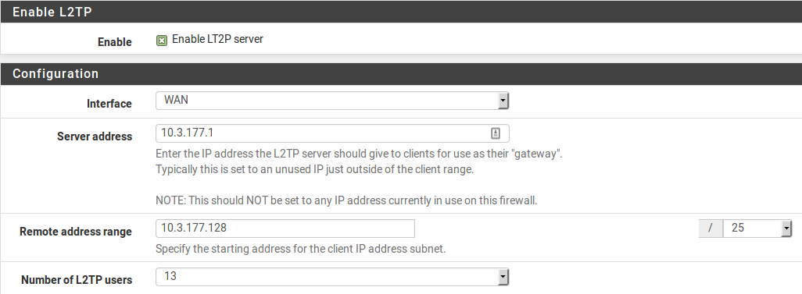
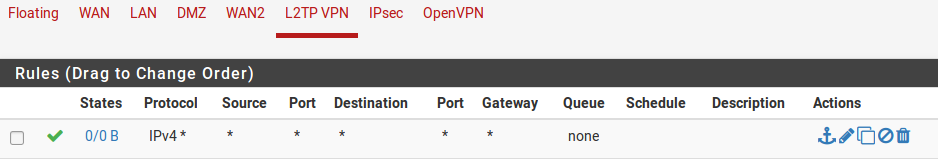
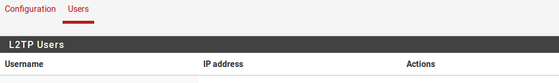
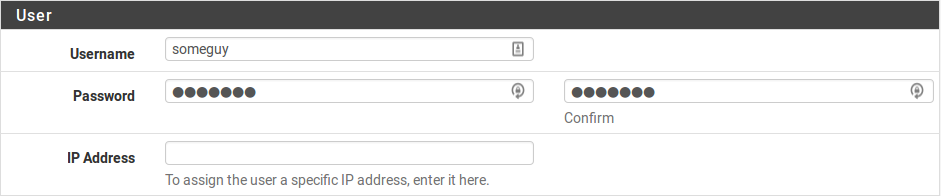

**VPN su L2TP**

Regole del firewall e L2TP
==========================

Per impostazione predefinita, quando il server L2TP è abilitato, le
regole del firewall non verranno aggiunte automaticamente
all'interfaccia scelta per consentire la porta UDP *1701*. Una regola
del firewall deve essere aggiunta a qualsiasi interfaccia che il
traffico L2TP inserirà, in genere WAN, WAN contenente il gateway
predefinito, o IPsec.

L2TP e Multi-WAN
================

L2TP utilizza la porta UDP 1701. Poiché L2TP si basa su UDP, il server
potrebbe avere problemi con qualsiasi WAN che non sia il gateway
predefinito. Il demone risponderà dal firewall utilizzando l'indirizzo
più vicino al client, seguendo la tabella di routing, che è la WAN con
il gateway predefinito per i client remoti.

Configurazione del server con L2TP
==================================

Per utilizzare L2TP, prima passare a **VPN>L2TP**. Selezionare
**Abilitare il server L2TP**.

Interfaccia
-----------

L'impostazione dell'\ **interfaccia** controlla dove il demone L2TP
legherà e ascolterà le connessioni. Questa è in genere l’interfaccia
*WAN* che accetta le connessioni in entrata.

Indirizzamento dell’IP
----------------------

Prima di iniziare, determinare quali indirizzi IP utilizzare per il
server L2TP e i client e quanti client simultanei supportare.

    **Indirizzo del server** Un indirizzo IP *non utilizzato* al di
    fuori dell'\ **intervallo di indirizzi remoti**, ad esempio
    10.3.177.1 come mostrato nella figura *Indirizzamento dell’IP di
    L2TP*.

|image0|

Fig. 1: Indirizzamento dell’IP di L2TP

    **Intervallo di indirizzi remoti** Di solito una sottorete nuova e
    inutilizzata, come 10.3.177.128 / 25 (.128 fino a .255). Questi sono
    gli indirizzi da assegnare ai client quando si connettono.

    **Numero di utenti L2TP** Controllare quanti utenti L2TP potranno
    connettersi contemporaneamente, in questo esempio *16* è stato
    selezionato.

I server DNS possono anche essere definiti per gli utenti finali quando
necessario. Compilare i campi del server\*\* DNS su L2TP **primario** e
\*\* secondario con gli indirizzi IP del server DNS per la connessione
dei client.

Autenticazione
--------------

    **Segreto** Richiesto da alcune implementazioni L2TP, simile a una
    password di gruppo o chiave pre-condivisa. Il supporto per questo
    varia da client a client. Lasciare il campo vuoto a meno che non sia
    noto per essere richiesto. Se necessario, inserire e confermare il
    segreto.

    **Tipo di autenticazione** Decide tra L'autenticazione *PAP*, *CHAP*
    o *MS-CHAPv2* per gli utenti. Il supporto per questo può variare da
    client a client e può anche dipendere dal server RADIUS. I tipi
    basati su *CHAP* sono più sicuri, ma *PAP* è più ampiamente
    compatibile.

Gli utenti possono essere autenticati dal database dell’utente locale o
tramite un server RADIUS esterno. Questo può essere usato per
autenticare gli utenti L2TP dalla Directory attiva di Microsoft (vedere
*Autenticazione RADIUS con il server di Windows*) così come numerosi
altri server in grado RADIUS.

Se si utilizza RADIUS, selezionare la casella **Usare un server RADIUS
per l'autenticazione** e compilare il server RADIUS e il segreto
condiviso. Un secondo server RADIUS può anche essere aggiunto nel caso
in cui il primo fallisca. Per l'autenticazione che utilizza il database
dell’utente locale, lasciare la casella deselezionata. Gli utenti devono
essere aggiunti manualmente nella scheda **utenti** della schermata
**VPN>L2TP** a meno che non si utilizzi RADIUS. Vedere *Aggiungere
utenti* qui sotto per maggiori dettagli sul sistema di autenticazione
integrato.

Salvare le modifiche per avviare il server L2TP
-----------------------------------------------

Dopo aver compilato gli elementi di cui sopra, fare clic su **Salvare**.
Ciò salverà la configurazione e avvierà il server L2TP.

Configurare le regole del firewall per i client L2TP
----------------------------------------------------

Passare a **Firewall>Regole** e fare clic sulla scheda **VPN su L2TP**.
Queste regole controllano il traffico dai client L2TP. Fino a quando non
è stata aggiunta una regola firewall per consentire il traffico, tutto
il traffico avviato dai client L2TP connessi verrà bloccato. Il traffico
avviato dai client LAN a L2TP viene controllato utilizzando le regole
del firewall della LAN. Inizialmente una regola permettere tutto può
essere desiderata qui per scopi di test come mostrato nella figura
*Regola del firewall della VPN su L2TP* e, una volta verificata la
funzionalità, limitare il set di regole come desiderato.

**Nota:** ricordare che una regola deve essere aggiunta all'interfaccia
che riceve il traffico L2TP, in genere WAN o IPsec, per passare UDP al
firewall con una porta di destinazione di 1701.

|image1|

Fig. 2: Regola del firewall della VPN su L2TP

1. .. rubric:: Aggiungere utenti
      :name: aggiungere-utenti

   L'aggiunta di utenti al sistema per gli utenti di L2TP integrato è
   semplice. Per aggiungere utenti locali:

-  Passare a **VPN>L2TP**, scheda **Utenti**. Verrà presentata la
   schermata utenti come mostrato nella figura *Scheda degli utenti di
   L2TP*.

-  Fare clic su |image2| Aggiungere per mostrare il modulo utilizzato
   per aggiungere utenti.

|image3|

Fig. 3: Scheda degli utenti di L2TP

-  Immettere il nome utente, la password e confermare la password per un
   utente, come in figura *Aggiungere un utente di L2TP*.

-  Immettere un'\ **assegnazione IP** statici se lo si desidera.

|image4|

Fig. 4: Aggiungere un utente di L2TP

-  Fare clic su **Salvare**, quindi verrà restituito l'elenco degli
       utenti.

-  Ripetere il processo per ogni utente da aggiungere.

Per modificare un utente esistente, fare clic su |image5| . Gli utenti
possono essere eliminati cliccando su |image6|.

L2TP con IPsec
==============

Nelle versioni attuali di pfSense, L2TP / IPsec può essere configurato
per i client mobili, anche se non è una configurazione che consigliamo.

Come avvertito all'inizio del capitolo, il client Windows, tra gli
altri, e il demone IPSec di strongSwan non sono sempre compatibili,
portando in molti casi al fallimento. Si consiglia vivamente di
utilizzare un'altra soluzione come IKEv2 invece di L2TP/IPsec.

**Vedere anche:**

*Esempio di configurazione del server IKEv2* contiene una procedura
dettagliata per la configurazione di IKEv2.

Prima di configurare la porzione IPsec, impostare il server L2TP come
descritto nella *Configurazione del server L2TP* e aggiungere utenti,
regole del firewall, ecc..

1. **Configurazione di IPsec**

Queste impostazioni sono state testate e trovate adatte per funzionare
con alcuni client, ma altre impostazioni simili potrebbero anche
funzionare. Sentirsi liberi di provare altri algoritmi di crittografia,
hash, ecc.

Scheda dei client mobili
~~~~~~~~~~~~~~~~~~~~~~~~

-  Passare alla scheda **VPN>IPsec**, nella scheda **Client mobili** su
   pfSense

-  Controllare **Abilitare il supporto dei client mobili di IPsec**

-  Impostare **Autenticazione utente** sul *Database locale* (non
   utilizzato, ma l'opzione deve avere qualcosa selezionato)

-  Deselezionare **Fornire un indirizzo IP virtuale ai client**

-  Deselezionare **Fornire un elenco di reti accessibili ai client**

-  Fare click su **Salvare**

Fase 1
~~~~~~

-  Fare click sul pulsante **Creare la fase1** in alto se appare o
   modificare la fase 1 di IPsec per dispositivi mobileiesistente

   -  Se non c'è nessuna fase 1 e il pulsante **Creare la fase1** non
      viene visualizzato, tornare alla scheda **Client mobili** e fare
      click lì.

-  Impostare **Versione di scambio di chiavi** su *v1*

-  Inserire una **Descrizione** appropriate

-  Impostare **Metodo di autenticazione** su *PSK reciproco*

-  Impostare **Modalità di negoziazione** per *Principale*

-  Impostare **Mio identificatore** su *Mio indirizzo IP*

-  Impostare **Algoritmo di crittografia** su *AES 256*

-  Impostare **Algoritmo hash** su *SHA1*

-  Impostare **Gruppo di chiavi DH** su *14 (2048 bit) *

**Nota:** iOS e altre piattaforme potrebbero invece funzionare con un
**gruppo di chiavi DH** di *2*.

-  Impostare **Durata di vita** su 28800

-  Deselezionare Disabilitare Rekey

-  Impostare **Attraversamento** **del NAT** su *Automatico*

-  Controllare **Abilitare DPD**, impostare per *10* secondi e *5*
   tentativi

-  Fare click su **Salvare**

Fase 2
~~~~~~

-  Fare clic su **Mostrare voci di fase 2** per visualizzare l’elenco
   della fase 2 di IPsec per i dispositivi mobili

-  Fare clic su |image7| **Aggiungere P2** per aggiungere una nuova voce
   di fase 2 se non esiste o fare click su |image8| per modificare una
   voce esistente

-  Impostare **Modalità** su **Trasporto**

-  Inserire una **Descrizione** appropriata

-  Impostare **Protocollo** su *ESP*

-  Impostare **Algoritmi di crittografia** su *AES 128*

-  Impostare **Algoritmi hash** su *SOLO SHA1*

-  Impostare **Gruppo di chiavi PFS** su *off*

-  Impostare **Durata di vita** su 3600

-  Fare click su **Salvare**

Chiave pre-condivisa
~~~~~~~~~~~~~~~~~~~~

La chiave pre-condivisa per la connessione, comune a tutti i client,
deve essere configurata in modo speciale.

-  Passare a **VPN>IPsec**, scheda **Chiavi pre-condivise** su pfSense

-  Fare clic su |image9| **Aggiungere** per aggiungere un nuovo PSK

-  Impostare **Identificatore** su tutti gli utenti

**Nota:** il nome tutti gli utenti è una parola chiave speciale
utilizzata da pfSense per configurare un PSK wildcard, che è necessario
a L2TP/IPsec per funzionare. Non utilizzare altri **Identificatori** per
questo PSK!

-  Impostare **Tipo di segreto** su *PSK*

-  Inserire una **Chiave pre-condivisa**, come aaabbbbccc – idealmente
   una molto più lunga, più casuale, e sicura!

-  Fare click su **Salvare**

-  Fare click su **Applicare le modifiche**

   1. .. rubric:: Regole del firewall di IPsec
         :name: regole-del-firewall-di-ipsec

      Le regole del firewall sono necessarie per passare il traffico
      dall'host del client su IPsec per stabilire il tunnel L2TP e
      all'interno di L2TP per passare il traffico VPN con il tunnel
      effettivo ai sistemi attraverso la VPN. L'aggiunta delle regole
      L2TP è stata coperta nella sezione precedente. Per aggiungere
      regole IPsec:

-  Passare a **Firewall>Regole**, scheda **IPsec**

-  Rivedere le regole attuali. Se esiste una regola di stile "Consentire
   tutto", non è necessario aggiungerne un'altra. Continuare con
   l’attività successiva.

-  Fare clic su |image10| **Aggiungere** per aggiungere una nuova regola
   alla parte superiore dell'elenco

-  Impostare **Protocollo** su *Qualsiasi*

-  Impostare la **Sorgente** e la **Destinazione** su *Qualsiasi*

**Nota:** questo non deve far passare tutto il traffico, ma deve almeno
far passare L2TP (porta UDP 1701) all'indirizzo IP della WAN del
firewall

-  Fare clic su **Salvare**

-  Fare click su **Applicare le modifiche**

   1. .. rubric:: Configurazione DNS
         :name: configurazione-dns

      Se i server DNS vengono forniti ai client e viene utilizzato il
      **risolutore del DNS** non associato, la sottorete scelta per i
      client di L2TP deve essere aggiunta all'elenco di accesso.

-  Passare a **Servizi>Risolutore del DNS**, scheda **Elenchi di
   accesso**

-  Fare clic su |image11| **Aggiungere** per aggiungere un nuovo elenco
   di accesso

-  Immettere un **Nome dell’elenco di accesso**, ad esempio come *Utenti
   VPN*

-  Impostare **Azione** su *Consentire*

-  Fare clic su |image12| **Aggiungere rete** in **Reti** per aggiungere
   una nuova rete

-  Immettere la sottorete del client di VPN nella casella della
   **Rete**, ad esempio 10.3.177.128

-  Scegliere il **CIDR** corretto, ad esempio 25

-  Fare click su **Salvare**

-  Fare click su **Applicare le modifiche**

   1. .. rubric:: Configurazione client
         :name: configurazione-client

      Quando si configurano i client, ci sono alcuni punti da cercare:

-  Assicurarsi che la configurazione del sistema operativo del client
   sia impostata per connettersi all'indirizzo esterno corretto per la
   VPN.

-  Potrebbe essere necessario forzare il tipo di VPN a **L2TP/IPsec**
   sul client se ha una modalità automatica.

-  Il tipo di autenticazione del client deve corrispondere a quello
   configurato sul server L2TP (ad es. *CHAP*)

   1. .. rubric:: Risoluzione dei problemi con L2TP
         :name: risoluzione-dei-problemi-con-l2tp

Questa sezione copre i passaggi di risoluzione dei problemi più comuni
che gli utenti incontrano con L2TP.

Impossibile connettersi
-----------------------

Verificare che le regole del firewall siano state aggiunte
all'interfaccia esterna in cui il traffico L2TP entra nel firewall.
Assicurarsi inoltre che il client si connetta all'indirizzo IP
dell'interfaccia scelto nelle impostazioni L2TP.

Connesso a L2TP ma non può passare il traffico
----------------------------------------------

Assicurarsi che le regole del firewall siano state aggiunte
all'interfaccia **VPN su L2TP** come descritto in *Configurare le regole
del firewall per i client L2TP*.

Assicurarsi inoltre che la sottorete remota attraverso la VPN sia
diversa dalla sottorete locale. Non è possibile raggiungere una rete
192.168.1.0/24 attraverso la VPN quando la sottorete locale in cui
risiede il client è anche 192.168.1.0/24, il traffico destinato a quella
sottorete non attraverserà mai la VPN perché è sulla rete locale. Questo
è il motivo per cui è importante scegliere una sottorete LAN
relativamente oscura quando si utilizza una VPN.

La connessione non riesce con un client di Windows
--------------------------------------------------

Se il livello IPsec sembra essere completato, ma nessun traffico L2TP
passa, è probabile che sia nota un'incompatibilità tra Windows e il
demone di strongSwan utilizzato su pfSense. Al momento non esiste una
soluzione nota se non spostare il sistema Windows da dietro il NAT o
utilizzare una VPN di stile diverso come IKEv2.

1. .. rubric:: Traffico L2TP bloccato in uscita
      :name: traffico-l2tp-bloccato-in-uscita

   In alcuni casi, ad esempio quando combinato con IPsec, il traffico
   L2TP può anche richiedere una gestione speciale tramite regole
   fluttuanti. Viene visualizzato come traffico bloccato nella direzione
   *in uscita* nei log del firewall, che mostra un'interfaccia server di
   L2TP.

   Se ciò accade, aggiungere una regola fluttuante come segue:

-  Passare a **Firewall>Regole**, scheda **Fluttuanti**

-  Fare clic su |image13| **Aggiungere** per aggiungere una nuova regola
   alla parte superiore dell'elenco

-  Impostare **Azione** su *Passare*

-  Selezionare **Rapido**

-  Selezionare *VPN su L2TP* per l'\ **interfaccia**

-  Impostare **Direzione** su *In uscita*

-  Impostare **Protocollo** su *TCP*

-  Impostare **Sorgente/Destinazione** in base alle esigenze o impostare
   su *Qualsiasi*

-  Funzioni avanzate:

   -  Impostare le **Flag di TCP** a *Qualsiasi flag*

   -  Imposta il **Tipo di stato** in *Stato sloppy*

   1. .. rubric:: Registri L2TP
         :name: registri-l2tp

Una registrazione per gli eventi di login e logout viene mantenuto su
**Stato>Registri di sistema**, nella scheda **VPN**, sotto gli **Accessi
a L2TP**.

Ogni login e logout viene registrato con un timestamp e un nome utente,
e ogni login mostrerà anche l'indirizzo IP assegnato al client L2TP. Il
registro completo può essere trovato nella scheda **L2TP grezzo**.

pfSense può fungere da server VPN su L2TP. L2TP è puramente un
protocollo del tunnel che non offre alcuna crittografia propria, quindi
è tipicamente combinato con qualche altra tecnica di crittografia, come
Ipsec.

**Vedere anche:**

Per la discussione generale dei vari tipi di implementazioni VPN
disponibili in pfSense e dei loro pro e contro, vedere

*Reti private virtuali*.

Avviso di sicurezza L2TP
========================

L2TP da solo non è crittografato, quindi non è destinato al traffico
privato. Alcuni dispositivi, come Android, offrono un client solo su
L2TP che è in grado di connettersi a pfSense, ma dovrebbe essere
utilizzato solo per il traffico che è già crittografato, o se il
traffico non è considerato privato. Ad esempio, effettuare il tunnel del
traffico Internet in modo che sembra provenire da un'altra posizione.

.. |image2| image:: media/image3.png
   :width: 0.26389in
   :height: 0.26389in

.. |image5| image:: media/image6.png
   :width: 0.26389in
   :height: 0.26389in
.. |image6| image:: media/image7.png
   :width: 0.26389in
   :height: 0.26389in
.. |image7| image:: media/image8.png
   :width: 0.26389in
   :height: 0.26389in
.. |image8| image:: media/image6.png
   :width: 0.26389in
   :height: 0.26389in
.. |image9| image:: media/image3.png
   :width: 0.26389in
   :height: 0.26389in

.. |image11| image:: media/image3.png
   :width: 0.26389in
   :height: 0.26389in
.. |image12| image:: media/image3.png
   :width: 0.26389in
   :height: 0.26389in

