*******
OpenVPN
*******

OpenVPN e IPv6
''''''''''''''

OpenVPN può collegare un tunnel sito-a-sito a un indirizzo IPv4 o a un
indirizzo IPv6 e il traffico IPv4 e IPv6 può essere passato
contemporaneamente all'interno di un tunnel OpenVPN. IPv6 è supportato
sia in client sito-a-sito e mobile, e può essere utilizzato per fornire
IPv6 a un sito che ha solo connettività IPv4. Al fine di garantire il
supporto al client mobile per IPv6, ottenere il software del client dal
pacchetto di esportazione del client OpenVPN o scaricare un client
basato su OpenVPN 2.3 o più recente.

Opzioni di configurazione di OpenVPN
''''''''''''''''''''''''''''''''''''

Questa sezione descrive tutte le opzioni disponibili con OpenVPN e
quando vengono utilizzate in genere. Le sezioni successive coprono
esempi di configurazione di VPN con sito-a-sito e accesso remoto con
OpenVPN, utilizzando le opzioni più comuni e una configurazione minima.

Opzioni di configurazione del server
====================================

Queste opzioni sono disponibili in una o più modalità per le istanze del
server OpenVPN, gestite in **VPN>OpenVPN**, nella scheda **Server**.

Disabilitare questo server
--------------------------

Selezionare questa casella e fare clic su Salvare per mantenere la
configurazione, ma non abilitare il server. Il processo per questa
istanza verrà interrotto e tutti i peer/client verranno disconnessi da
questo server. Tutti gli altri server attivi non sono interessati.

Modalità del server
-------------------

Questo è il ruolo per il server, che specifica come i router o gli
utenti si connetteranno a questa istanza del server. La modifica di
questo influenzerà anche quali opzioni appariranno sul resto della
pagina, quindi vengono visualizzate solo le scelte rilevanti.

    **Peer a Peer (SSL/TLS)** Una connessione tra reti locali e remote
    che è protetta da SSL/TLS. Questa scelta offre una maggiore
    sicurezza e la possibilità per il server di spingere i comandi di
    configurazione al router del peer remoto quando si utilizza una
    configurazione 1:molti stili. I router del peer remoti possono anche
    avere certificati revocati per rimuovere l'accesso se vengono
    compromessi.

    **Peer a Peer (chiave condivisa)** Una connessione tra reti locali e
    remote che è protetta da una singola chiave condivisa configurata su
    entrambi i nodi. Questa scelta è più facile da configurare, ma è
    meno sicura. Se una chiave condivisa è compromessa, una nuova chiave
    deve essere generata e quindi copiata su qualsiasi router o client
    utilizzando la vecchia chiave condivisa. In questa modalità, è
    necessaria un'istanza server separata per ciascun client.

    **Accesso remoto (SSL/TLS)** Questa scelta è una configurazione
    client mobile con certificati X.509 per utente. Come per il tipo di
    connessione peer-a-peer con SSL/TLS, l'utilizzo di questo metodo
    offre una maggiore sicurezza e la possibilità per il server di
    spingere i comandi di configurazione ai client. I client mobili
    possono anche avere chiavi revocate per rimuovere l'accesso se una
    chiave è compromessa, ad esempio un laptop rubato o smarrito.

    **Accesso remoto (autenticazione utente)** Un server di accesso
    client che non utilizza i certificati, ma richiede all'utente finale
    di fornire un nome utente e una password quando si effettua una
    connessione. Questo non è raccomandato a meno che l'autenticazione
    non sia gestita esternamente da LDAP o RADIUS.

    **Accesso remoto (SSL/TLS + Autenticazione utente)** La scelta più
    sicura offerta. Non solo ottiene i vantaggi di altre scelte SSL/TLS,
    ma richiede anche un nome utente e una password dal client quando si
    connette. L'accesso al client può essere rimosso non solo revocando
    il certificato, ma anche modificando la password. Inoltre, se una
    chiave compromessa non viene immediatamente scoperta, il pericolo
    viene diminuito perché è improbabile che l'attaccante abbia le
    chiavi e la password. Quando si utilizza la procedura guidata
    OpenVPN, questa è la modalità configurata durante tale processo.

Protocollo
----------

TCP o UDP possono essere selezionati, o le loro controparti con IPv6
abilitato, TCP6 o UDP6. Un'istanza del server OpenVPN può attualmente
associare solo a IPv4 o IPv6, ma non entrambi allo stesso tempo. UDP è
la scelta più affidabile e veloce per l'esecuzione di OpenVPN e dovrebbe
essere sempre utilizzata quando possibile. In alcuni rari casi TCP può
essere utilizzato per aggirare le limitazioni, ad esempio bypassando
alcuni firewall eseguendo un server OpenVPN sulla porta TCP 443.

I protocolli senza connessione come UDP sono sempre preferibili quando
si esegue il tunnel del traffico. TCP è orientato alla connessione con
la consegna garantita, quindi tutti i pacchetti persi vengono
ritrasmessi. Questo suona come una buona idea in superficie, ma le
ritrasmissioni TCP causeranno una significativa degradazione delle
prestazioni su connessioni Internet pesantemente caricate o su quelle
con una perdita di pacchetti coerente.

Il traffico TCP esiste spesso all'interno dei tunnel ed è indesiderabile
ritrasmettere i pacchetti persi dal traffico VPN incapsulato. Nei casi
in cui TCP è avvolto attorno a TCP, ad esempio un tunnel VPN che
utilizza TCP come protocollo di trasporto, quando un pacchetto viene
perso, i pacchetti TCP persi esterni e interni verranno ritrasmessi. Le
occorrenze rare di questo saranno impercettibili ma la perdita
ricorrente causerà prestazioni significativamente inferiori rispetto a
UDP. Se il traffico all'interno del tunnel richiede una consegna
affidabile, utilizzerà un protocollo come TCP che lo assicura e gestirà
le proprie ritrasmissioni.

Modalità dispositivo
--------------------

OpenVPN può essere eseguito in una delle due modalità del dispositivo:
*tun* o *tap*:

    **tun** Funziona su OSI di livello 3 ed esegue il routing su
    interfacce punto-a-punto.

    **tap** Può funzionare su OSI di livello 2 e può eseguire sia il
    routing che il bridging se necessario.

.. note::  
	Non tutti i client supportano la modalità tap, l'utilizzo di tun è più stabile e più ampiamente supportato. In particolare, i client come quelli trovati su Android e iOS supportano solo la modalità tun nelle app che la maggior parte delle persone può utilizzare. Alcune app OpenVPN Android e iOS che richiedono il rooting o il jailbreaking di undispositivo supportano tap, ma le conseguenze del suo utilizzo possono essere un po' troppo pesanti per la maggior parte degli utenti.

Interfaccia
-----------

Selezionare il gruppo di interfaccia, VIP o failover che l'istanza del
server OpenVPN ascolterà per le connessioni in entrata. Questo controlla
anche da quale interfaccia uscirà il traffico dal server.

Diversi tipi di opzioni sono elencati nel menu a discesa di
**Interfaccia**, e alcuni hanno un comportamento speciale o casi d'uso:

    **Interfacce** OpenVPN si legherà all'indirizzo dell'interfaccia. Se
    l'interfaccia è dinamica, come DHCP, OpenVPN si legherà
    automaticamente al nuovo indirizzo se cambia.

    **VIP** OpenVPN si legherà solo al VIP specificato (Alias di IP o
    tipo CARP)

    **Gruppi di gateway** Da utilizzare con i gruppi di failover,
    OpenVPN si legherà all'indirizzo dell'interfaccia attualmente attiva
    nel gruppo. Se quel gateway di interfaccia diventa irraggiungibile,
    verrà utilizzato il successivo e così via.

    **Host locale** Utile per le distribuzioni Multi-WAN, l'associazione
    a host locali e l'utilizzo di porte forward per accettare
    connessioni da diverse interfacce e/o porte è un modo versatile per
    fornire connettività OpenVPN ridondante per la connessione dei
    client.

    **Qualsiasi** Si lega a ogni indirizzo su ogni interfaccia. Anche se
    allettante, questa opzione non è raccomandata. Quando viene
    utilizzato con UDP, le risposte ai client Internet usciranno sempre
    di nuovo dalla WAN del gateway predefinito, il che potrebbe essere
    indesiderabile.

Porta locale
------------

La porta locale è il numero di porta che OpenVPN utilizzerà per
ascoltare. Le regole del firewall devono consentire il traffico verso
questa porta e devono essere specificate nella configurazione del
client. La porta per ogni server deve essere univoca per ogni
interfaccia.

Descrizione
-----------

Immettere una descrizione per questa configurazione del server, per
riferimento.

Impostazioni crittografiche
---------------------------

Questa sezione controlla come il traffico da e verso i client viene
crittografato e convalidato.

Chiave condivisa
----------------

Quando si utilizza un'istanza di chiave condivisa, selezionare la
casella **Generare automaticamente una chiave condivisa** per creare una
nuova chiave o deselezionare la casella per incollare una chiave
condivisa da un tunnel OpenVPN esistente. Quando si genera
automaticamente la chiave, tornare alla schermata di modifica per questo
tunnel in seguito per ottenere la chiave che può essere copiata sul
router remoto.

Autenticazione TLS
------------------

TLS, o Sicurezza del livello di trasporto (Transport Layer Security),
fornisce l'autenticazione della sessione per garantire la validità sia
del client che del server. Selezionare la casella **Abilitare
l'autenticazione dei pacchetti TLS** se lo si desidera. Se non esiste
una chiave TLS esistente, lasciare **Generare automaticamente una chiave
di autenticazione TLS condivisa** selezionata. Se la chiave esiste già,
deselezionare l'opzione e quindi incollarla nella casella di immissione
fornita. Quando si genera automaticamente la chiave, tornare alla
schermata di modifica per questo tunnel in seguito per ottenere la
chiave che può essere copiata sul router o sul client remoto.

.. warning:: 
	 Quando si utilizza una modalità SSL/TLS, si consiglia vivamente di utilizzare pure l'autenticazione TLS. Oltre al vantaggio di sicurezza aggiunto dal requisito chiave, una chiave TLS aiuta anche a proteggere da alcuni attacchi basati su SSL come Heartbleed.

Autorità del certificazione del Peer
------------------------------------

Selezionare l'autorità di certificazione utilizzata per firmare il
certificato server per questa istanza del server OpenVPN qui. Se nulla
appare in questo elenco, prima importare o generare un'autorità di
certificazione in **Sistema>Gestione dei certificati**, nella scheda
**CA**.

Elenco di revoca dei certificati dei peer
-----------------------------------------

Questo campo ipzionale indica l'elenco di revoca dei certificati
(Certificate Revocation List, CRL) che deve essere utilizzato da questo
tunnel. Un CRL è un elenco di certificati ottenuti da una determinata CA
che non sono più considerati validi. Ciò potrebbe essere dovuto a un
certificato compromesso o perso, ad esempio da un laptop rubato,
infezione da spyware, ecc. Un CRL può essere creato o gestito da
**Sistema>Gestione dei certificati**, nella scheda **Revoca dei
certificati**.

Certificato del server
----------------------

Un certificato del server deve essere scelto per ogni istanza del server
OpenVPN. Se nulla appare in questo elenco, prima importare o generare
un'autorità di certificazione in **Sistema>Gestione dei certificati**,
nella scheda **Certificati**.

Lunghezza dei parametri DH
--------------------------

I parametri dello scambio di chiave Diffie-Hellman (DH) vengono
utilizzati per stabilire un canale di comunicazione sicuro. Possono
essere rigenerati in qualsiasi momento e non sono specifici per
un'istanza OpenVPN. Cioè, quando si importa una configurazione OpenVPN
esistente, questi parametri non devono essere copiati dal server
precedente. La lunghezza dei parametri DH desiderati può essere scelta
dalla casella del menu a discesa, 1024, 2048 o 4096.

.. note::  
	a causa del calcolo pesante coinvolto nella generazione di chiavi DH, viene utilizzato un set pre-generato per ogni tipo di chiave. I nuovi parametri DH possono essere generati manualmente utilizzando i seguenti comandi della shell::
	# /usr/bin/openssl dhparam 1024 > /etc/dh-parameters.1024
	# /usr/bin/openssl dhparam 2048 > /etc/dh-parameters.2048
	# /usr/bin/openssl dhparam 4096 > /etc/dh-parameters.4096

Algoritmo di crittografia
-------------------------

Il cifrario crittografico da utilizzare per questa connessione. Il
valore predefinito è *AES-128-CBC*, che è il concatenamento del blocco
del cifrario (Cipher Block Chaining) di AES 128 Bit. Questa è una buona
scelta per la maggior parte degli scenari.

.. seealso:: 
	*Crittografia dell’hardware* per ulteriori informazioni sull'utilizzo di acceleratori crittografici e sulla scelta di un algoritmo di crittografia.

Algoritmo Digest Auth
---------------------

Selezionare l'algoritmo digest del messaggio da utilizzare per
l'autenticazione HMAC dei pacchetti in arrivo.

.. note::  
	OpenVPN è impostasto in maniera predefinita su SHA1 quando questa opzione non è specificata altrimenti, quindi a meno che entrambi i lati non siano impostati su un valore noto, utilizzare qui SHA1.

Crittografia Hardware
--------------------------

Se disponibile, questa opzione controlla quale acceleratore
crittografico dell’hardware verrà utilizzato da OpenVPN. Quando è
lasciato non specificato, OpenVPN sceglierà automaticamente in base a
ciò che è disponibile nel sistema operativo.

Se questo dispositivo firewall dispone di un acceleratore crittografico
hardware, scegliere la **macchina per la** **crittografia di BSD (BSD
Cryptodev Engine)** o selezionare il dispositivo specifico se appare
nell'elenco. La maggior parte delle schede dell'acceleratore utilizza la
macchina per la crittografia di BSD, quindi in caso di dubbio,
selezionarla. Questa impostazione consentirà a OpenVPN di sfruttare
l'accelerazione hardware. È inoltre necessario selezionare un algoritmo
di crittografia supportato dall'acceleratore. Fare riferimento alla
documentazione dell’hardware per informazioni sui cifrari supportati
dall'acceleratore.

Profondità del certificato
--------------------------

Questa opzione limita la lunghezza di una catena di certificati prima
che fallisca la convalida. Questo valore predefinito è *Uno* *(Client +
Server)* in modo che se in qualche modo viene generata una CA intermedia
non autorizzata, i certificati firmati da un intermediario rude
falliranno la convalida. Nei casi in cui è richiesto il concatenamento
con gli intermediari, questo limite può essere aumentato.

Corrispondenza con un utente-CN rigorosa
----------------------------------------

Per un server con SSL/TLS+Autenticazione dell’utente, se abilitata,
questa opzione impone una corrispondenza tra il nome utente fornito
dall'utente e il nome comune del certificato utente. Se i due non
corrispondono, la connessione viene rifiutata. Ciò impedisce agli utenti
di utilizzare le proprie credenziali con il certificato di un'altra
persona e viceversa.

Impostazioni del tunnel
-----------------------

La sezione delle impostazioni del tunnel regola il modo in cui il
traffico scorre tra il server e i client, tra cui il routing e la
compressione.

La rete del tunnel IPv4/IPv6
----------------------------

Questi sono i pool di indirizzi da assegnare ai client al momento della
connessione. La fine del server della configurazione OpenVPN utilizzerà
il primo indirizzo in questo pool per la fine della connessione e
assegnerà indirizzi aggiuntivi ai client connessi in base alle esigenze.
Questi indirizzi sono utilizzati per la comunicazione diretta tra gli
endpoint del tunnel, anche quando si collegano due reti remote
esistenti. Qualsiasi sottorete può essere scelta a condizione che non
sia in uso localmente o in qualsiasi sito remoto. Uno o entrambe la
**rete del tunnel IPv4** e la **rete del tunnel IPv6** possono essere
inserite, o nel caso di un ponte con il tap, nessuna delle due.

.. warning::
	attualmente, le limitazioni in OpenVPN impediscono l'esecuzione solo con una configurazione per la rete del tunnel IPv6. Quando viene definita una rete del tunnel IPv6, è necessario specificare anche una rete del tunnel IPv4, anche se non viene utilizzata.

Per un server SSL/TLS con sito-a-sito che utilizza IPv4, la dimensione
della **rete del tunnel IPv4** può modificare il comportamento del
server. Se x.x.x. x/30 viene inserito per la **rete del tunnel IPv4**,
il server utilizzerà una modalità peer-a-peer in modo molto simile a
come funziona la chiave condivisa: può avere solo un client, non
richiede sostituzioni specifiche del client o *iroute*, ma non può anche
spingere percorsi o impostazioni ai client. Se viene utilizzata una
**rete del tunnel IPv4** più grande di quella utilizzata, ad esempio
x.x.x.x/24, il server accetterà più client e potrà spingere le
impostazioni, ma richiede *iroute*.

.. seealso:: 
	Vedere *Configurazione di esempio con sito-a-sito (SSL/TLS)* per ulteriori informazioni su un esempio da sito-a-multi-sito utilizzando una grande rete di tunnel e *iroute*.

Opzioni di bridging
-------------------

Quando si utilizza la modalità tap, vengono mostrate opzioni aggiuntive
che controllano il comportamento di bridging in OpenVPN e l'assegnazione
degli indirizzi del client. Questi sono coperti in *Connessioni OpenVPN
con il ponte*

Gateway per il reindirizzamento
-------------------------------

Quando viene selezionata l'opzione **Gateway per il reindirizzamento**,
il server invierà un messaggio ai client che li istruiranno per
inoltrare tutto il traffico, incluso il traffico Internet, attraverso il
tunnel VPN. Funziona solo in modalità SSL/TLS con una rete del tunnel
più grande di una sottorete a / 30.

Rete locale IPv4/IPv6
---------------------

Questi campi specificano quali reti locali sono raggiungibili dai client
VPN, se presenti. Un percorso per queste reti viene spinto ai client che
si connettono a questo server. Se sono necessari più percorsi per le
sottoreti di una particolare famiglia, immettere le sottoreti separate
da una virgola, ad esempio 192.168.2.0/24, 192.168.56.0/24.

Questa funzione si basa sulla capacità di spingere i percorsi al client,
quindi per IPv4 è valida solo in un contesto SSL/TLS quando è in uso una
rete tunnel più grande di a /30. Funzionerà sempre per IPv6 a condizione
che una maschera troppo piccola simile non sia impostata.

Rete remota IPv4/IPv6
---------------------

Questa opzione viene visualizzata solo quando viene utilizzata una
connessione di tipo Peer-a-Peer e non è disponibile per i client mobili.
Le voci della tabella delle route vengono aggiunte al firewall per le
sottoreti specificate, che consegnano il traffico a questa istanza
OpenVPN per l'elaborazione. Se è necessaria più di una sottorete di rete
remota, immettere le sottoreti separate da una virgola, ad esempio
192.168.2.0/24, 192.168.56.0/24..

Connessioni simultanee
----------------------

Specifica il numero di client che possono essere collegati
simultaneamente a questa istanza del server OpenVPN in un dato momento.
Questo è un limite collettivo per tutti i client connessi, non
un'impostazione per utente.

Compressione
------------

Quando la compressione è abilitata, il traffico che attraversa la
connessione OpenVPN verrà compresso prima di essere crittografato. Ciò
consente di risparmiare sull'utilizzo della larghezza di banda per molti
tipi di traffico a scapito di un maggiore utilizzo della CPU sia sul
server che sul client. Generalmente questo impatto è minimo e
l'abilitazione della compressione è utile per quasi tutti gli usi di
OpenVPN su Internet.

Per le connessioni ad alta velocità, come ad esempio l'utilizzo di
OpenVPN attraverso una LAN, WAN ad alta velocità e bassa latenza WAN, o
rete wireless locale, questo può essere indesiderabile, come il ritardo
aggiunto dalla compressione può essere più che il ritardo salvato nella
trasmissione del traffico. Se quasi tutto il traffico che attraversa la
connessione OpenVPN è già crittografato (come SSH, SCP, HTTPS, tra molti
altri protocolli), non abilitare la compressione LZO perché i dati
crittografati non sono comprimibili e la compressione LZO causerà un po'
più di dati da trasferire di quanto sarebbero senza compressione. Lo
stesso vale se il traffico VPN presenta quasi interamente dati già
compressi.

Questo selettore controlla la gestione della compressione LZO per questa
istanza OpenVPN. Ci sono quattro possibili impostazioni ciascuna con un
comportamento leggermente diverso.

    **Nessuna preferenza** Omette completamente le direttive di
    compressione dalla configurazione OpenVPN. Non verrà eseguita alcuna
    compressione, ma questa opzione potrebbe essere sovrascritta da
    altri metodi come le sostituzioni specifiche del client o le opzioni
    avanzate.

    **Disabilitata - nessuna compressione** Disabilita esplicitamente la
    compressione nella configurazione

    **Abilitata con compressione adattiva** Consente la compressione con
    un test periodico per garantire che il traffico sia in grado di
    essere compresso. Se la compressione non è ottimale, verrà
    disabilitata fino a quando non verrà nuovamente testata. Questa
    opzione ottine il miglior equilibrio dal momento che comprimerà i
    dati quando è utile, ma non comprime i dati quando ne ostacola le
    prestazioni.

    **Abilitato senza compressione adattiva** Consente esplicitamente la
    compressione in ogni momento ma senza testare il traffico.

Tipo di servizio
----------------

Quando questa opzione è abilitata, OpenVPN imposterà il valore di
intestazione IP per il tipo di servizio (Type-of-Service, TOS) dei
pacchetti del tunnel in modo che corrisponda al valore del pacchetto
incapsulato. Ciò può causare un traffico importante da gestire più
velocemente attraverso il tunnel dall’hot intermediario, al costo di
alcune informazioni di divulgazione di meno.

L'esempio più comune è il traffico VoIP o video. Se il bit TOS è
impostato per riflettere la priorità del traffico, può aiutare QoS lungo
il percorso, ma qualcuno che intercetta il traffico potrebbe vedere il
bit TOS e acquisire alcune conoscenze sul contenuto del traffico
all'interno del tunnel. Per coloro che si affidano a bit TOS per QoS, il
vantaggio potrebbe superare la perdita di informazioni.

Comunicazione tra client
------------------------

Questa opzione controlla se i client connessi sono in grado di
comunicare tra loro o meno. Per consentire questo comportamento,
selezionare l'opzione. Se deselezionata, i client possono inviare solo
traffico al server o destinazioni oltre il server, ad esempio le reti
instradate o Internet.

In genere nelle distribuzioni con stile di accesso remoto non è
necessario che i client si raggiungano a vicenda, ma ci sono alcuni casi
limite in cui può essere utile. Un esempio è che gli sviluppatori Web
remoti lavorino insieme e eseguano server di test sui loro sistemi
locali. Con questa opzione attivata, possono raggiungere l'altro server
del test per lo sviluppo collaborativo.

Duplicare le connessioni
------------------------

Per impostazione predefinita, OpenVPN assocerà un indirizzo IP dalla sua
rete tunnel con un certificato o un nome utente specifico per una
determinata sessione. Se lo stesso certificato si connette di nuovo,
verrà assegnato lo stesso indirizzo IP e disconnetterà il primo client o
causarà un conflitto IP in cui nessuno dei due client riceverà dati
corretti. Questo è principalmente per motivi di sicurezza, quindi lo
stesso certificato non può essere utilizzato da più persone
contemporaneamente. Si consiglia di utilizzare un certificato univoco
per ogni utente che si connette. Altrimenti, se un client è compromesso,
non è possibile revocare solo un client, i certificati dovrebbero essere
ristampati a tutti i client che condividono lo stesso certificato.

Se una configurazione che utilizza lo stesso certificato in più
posizioni è un requisito assoluto e non può essere evitata, controllare
**Duplicare le connessioni** per consentire il comportamento non
standard di più client che utilizzano lo stesso certificato o nome
utente.

Disabilitare IPv6
-----------------

Quando selezionato, l'inoltro del traffico IPv6 è disabilitato per
questa istanza OpenVPN.

Impostazioni del client
-----------------------

Queste impostazioni riguardano il comportamento dei client che si
connettono a questa istanza del server.

IP dinamico
-----------

Selezionando questa casella si aggiunge l'opzione di configurazione
*fluttuante (float)* alla configurazione OpenVPN. Ciò consente ai client
di mantenere la loro connessione se il loro indirizzo IP cambia. simile
a MOBIKE per IKEv2 in IPsec. Per i client su connessioni Internet in cui
l'IP cambia frequentemente o gli utenti mobili che si spostano
comunemente tra diverse connessioni Internet, selezionare questa opzione
per consentire una connettività stabile. Quando l'IP client è statico o
raramente cambia, non utilizzare questa opzione offre un piccolo
miglioramento della sicurezza.

Pool degli indirizzi
--------------------

Quando questa opzione è abilitata, il server assegnerà gli indirizzi IP
dell'adattatore virtuale ai client dalla sottorete specificata
dall'opzione **Rete del tunnel**. Quando è deselezionata gli indirizzi
IP non verranno assegnati automaticamente e i client dovranno impostare
manualmente i propri indirizzi IP statici nei file di configurazione del
client. Tranne in rari casi, questa opzione è quasi sempre abilitata.

Topologia
---------

Per impostazione predefinita OpenVPN su |firew4ll| 2.3 e successivi
preferisce uno stile di topologia di *sottorete* quando si utilizza una
**Modalità dispositivo** *tun*. Questo stile alloca solo un indirizzo IP
per client piuttosto che una sottorete isolata per client. Questo è
l'unico stile disponibile quando si utilizza la **modalità dispositivo**
*tap*.

Quando viene scelta la topologia *net30* più vecchia per *tun*, OpenVPN
assegna una rete CIDR /30 (quattro indirizzi IP, due utilizzabili) a
ciascun client di connessione. Questo stile ha una storia più lunga, ma
può essere fonte di confusione per gli amministratori e gli utenti.

L'opzione **topologia** è rilevante solo quando si fornisce un indirizzo
IP dell'adattatore virtuale ai client che utilizzano la modalità *tun*
su IPv4. Alcuni client potrebbero richiederlo anche per IPv6, come
OpenVPN Connect, anche se in realtà IPv6 viene sempre eseguito con una
topologia di *sottorete* anche quando IPv4 utilizza *net30*. OpenVPN
versione 2.1.3 o successive è necessario per utilizzare una topologia di
*sottorete*, e ci sono pure state correzioni significative ad essa in
OpenVPN 2.3, allo stesso modo è importante utilizzare una versione
corrente del client di OpenVPN.

.. warning::
	il valore predefinito in pfSense è stato modificato in sottorete perché il progetto OpenVPN ha dichiarato lo stile net30 come deprecato, indicando che verrà rimosso nelle versioni future.
	Tenere presente, tuttavia, che alcuni client molto vecchi potrebbero rompersi se questa opzione viene utilizzata, come le versioni precedenti di OpenVPN (prima di 2.0.9, rilasciate quasi 10 anni fa), le versioni di Windows con driver tun/tap precedenti o client come i telefoni Yealink. Assicurarsi sempre che il client e i driver associati siano completamente aggiornati quando si utilizza una topologia di sottorete.

Dominio predefinito del DNS
---------------------------

Una volta selezionato, apparirà un campo per specificare il nome di
dominio del DNS da assegnare ai client. Per garantire che la risoluzione
dei nomi funzioni correttamente per gli host della rete locale in cui
viene utilizzata la risoluzione dei nomi DNS, specificare qui il nome di
dominio del DNS interno. Per gli ambienti con Directory attiva di
Microsoft, questo di solito sarebbe il nome di dominio della directory
attiva.

Server del DNS
--------------

Una volta selezionato, è possibile immettere fino a quattro server DNS
per l'utilizzo da parte del client mentre è connesso alla VPN. Per gli
ambienti con Directory attiva di Microsoft, in genere si tratta dei
controllori del dominio della directory attiva o dei server DNS per la
risoluzione e l'autenticazione dei nomi corretti quando si è connessi
tramite OpenVPN.

Forzare l'aggiornamento della cache del DNS
-------------------------------------------

Una volta selezionata, questa opzione spingerà una serie di comandi ai
client di Windows che scaricheranno il loro DNS e riavvieranno la cache
per migliorare la gestione dei client dei server DNS aggiornati dalla
VPN.

Server NTP
----------

Una volta selezionato, è possibile impostare uno o due server NTP per la
sincronizzazione degli orologi sui client. Può essere un indirizzo IP o
FQDN.

Opzioni del NetBIOS
-------------------

Quando si attiva NetBIOS su TCP/IP, verranno visualizzate diverse altre
opzioni relative a NetBIOS e WINS. Se la casella è deselezionata, queste
impostazioni saranno disabilitate.

Tipo di nodo
------------

Il tipo di nodo del NetBIOS controlla il funzionamento dei sistemi
Windows durante la risoluzione dei nomi del NetBIOS. Di solito va bene
lasciare questo a *nessuno* per accettare l'impostazione predefinita di
Windows.

Le opzioni disponibili includono:

    **Nodo-B** Utilizza le trasmissioni per la risoluzione dei nomi del
    NetBIOS. Questa non va usata se non nel caso di un ponte tap.

    **Nodo**-P Il nome con punto-a-punto richiede un server WINS. WINS è
    stato per lo più deprecato, quindi questa opzione non è utile nelle
    moderne reti Windows.

    **Nodo-M** La trasmissione interroga il server dei nomi. Simile a
    nodo-B ma ricadrà sul DNS.

    **Nodo-H** Richiede prima il nome del server, poi utilizza la
    trasmissione. Questa opzione è quella con maggiore probabilità di
    successo in una rete corrente con DNS corretto, funzionale.

ID dell’ambito
--------------

Un ID dell’ambito di NetBIOS fornisce un servizio di denominazione
esteso per NetBIOS su TCP/IP. L'ID dell’ambito di NetBIOS isola il
traffico NetBIOS su una singola rete solo a quei nodi con lo stesso ID
dell’ambito di NetBIOS.

Server WINS
-----------

Selezionando questa casella è possibile definire due server WINS che
forniscono la risoluzione dei nomi per i client che accedono e navigano
nelle risorse del NetBIOS attraverso la VPN. WINS è stato ampiamente
deprecato e rimosso dall'uso, quindi è improbabile che ciò sia
necessario nella maggior parte degli ambienti moderni.

Abilitare una porta personalizzata
----------------------------------

Una volta selezionata, è possibile specificare una **porta di gestione**
non predefinita da utilizzare con la funzione Gestione della OpenVPN del
pacchetto di esportazione dei client della OpenVPN. Se vengono
utilizzati più profili di connessioni su un singolo client che utilizza
tale interfaccia, ciascuno deve utilizzare una porta di gestione
univoca.

Opzioni personalizzate
----------------------

Mentre l'interfaccia web di |firew4ll| supporta le opzioni più comunemente
utilizzate, OpenVPN è molto potente e flessibile e, occasionalmente, le
opzioni che non sono disponibili nell'interfaccia web potrebbero essere
necessarie. Tali opzioni personalizzate possono essere aggiunte
utilizzando questa casella di immissione. Queste opzioni sono descritte
ulteriormente nelle opzioni di configurazione personalizzate.

Livello di dettaglio (verbosità)
--------------------------------

Configura la quantità di dettagli mostrata nei registri OpenVPN per
questa istanza, utile per la risoluzione dei problemi. Numeri più alti
si tradurranno in maggiori quantità di dettagli nel registro. Durante il
normale funzionamento la selezione *predefinita* è la migliore.

.. note::  
	Se impostato su livelli più alti, la pagina di stato di OpenVPN e il widget della dashboard causeranno una registrazione aggiuntiva mentre interagiscono con il processo di gestione per sondare le informazioni dai demoni di OpenVPN.

Opzioni di configurazione del client
====================================

Queste opzioni sono disponibili in una o più modalità per le istanze dei
client di OpenVPN, gestite da **VPN>OpenVPN**, nella scheda **Client**.

Molte di queste opzioni sono identiche alle opzioni del server sopra
menzionate, quindi verranno notate solo le differenze.

Modalità del server
-------------------

Per le istanze del client, le scelte della modalità del server sono
limitate a *Peer a Peer (SSL/TLS)* e *Peer a Peer (chiave condivisa)*,
che si accoppiano con le opzioni del server con lo stesso nome e tipo.

Interfaccia
-----------

Questa opzione seleziona l’interfaccia, VIP o il gruppo di failover che
l'istanza client OpenVPN utilizzerà per le connessioni in uscita.

Quando viene selezionato un VIP di tipo CAP per l'Interfaccia nelle
istanze client di OpenVPN, l'istanza OpenVPN verrà interrotta quando il
VIP CARP si trova in uno stato di backup. Ciò viene fatto per impedire
al nodo HA secondario di mantenere percorsi non validi o tentare di
effettuare connessioni in uscita che possono interferire con la
connessione attiva sul nodo HA primario.

Porta locale
------------

Per i client, la porta locale viene lasciata vuota in quasi tutti i casi
in modo da utilizzare una porta locale randomizzata. Questo è più
sicuro, ma alcune implementazioni potrebbero richiedere una porta
sorgente specifica. Se è richiesta una porta sorgente specifica,
riempire secondo necessità.

Indirizzo o host del server
---------------------------

L'indirizzo IP o il nome di dominio completo per il server.

Porta del server
----------------

La porta su cui il server è in ascolto, in genere 1194

Impostazioni del proxy
----------------------

    **Host o indirizzo del proxy** L'indirizzo IP o il nome di dominio
    completo per un server proxy attraverso il quale questo client deve
    connettersi.

    **Opzioni extra per l’autenticazione de proxy** Opzioni
    dell’autenticazione extra. Se impostato su *base* o *ntlm*, i campi
    **Nome Utente** e **Password** vengono presentati in modo che
    l'autenticazione proxy possa essere configurata.

Risoluzione del nome host del server
------------------------------------

Quando viene selezionato **Server per risolvere infinitamente**, il nome
host del server verrà risolto ad ogni tentativo di connessione. Quando
deselezionato, OpenVPN tenterà solo di risolverlo una volta. Quando si
utilizza un nome host per l'indirizzo del server remoto, questa opzione
deve essere selezionata.

Impostazioni di autenticazione utente
-------------------------------------

Quando si utilizza la modalità *Peer a Peer SSL/TLS*, è possibile
specificare un **Nome utente** e una **Password** in aggiunta o al posto
di un certificato utente, a seconda dei requisiti configurati sul
server.

Impostazioni crittografiche
---------------------------

Le impostazioni di questa sezione sono identiche a quelle delle opzioni
corrispondenti sul lato server, ad eccezione dell'opzione nuovo
**Certificato del client**, in cui il certificato è selezionato per
l'uso da parte di questo client. Questo certificato (e la chiave
associata e il certificato CA) devono essere importati in questo
firewall prima di poter essere scelti.

Chiave condivisa/autenticazione TLS
-----------------------------------

Queste opzioni funzionano in modo simile alle controparti del lato
server, ma tieni presente che la chiave dal server deve essere copiata
qui, piuttosto che generare una nuova chiave sul client.

Limitare la larghezza di banda in uscita
----------------------------------------

Il valore in questa casella, specificato in **byte al secondo**, viene
utilizzato per limitare la velocità del traffico VPN in uscita. Quando
lasciato vuoto, non c'è limite. Il valore deve essere compreso tra *100*
e *100000000*.

Non estrarre le route
---------------------

Una volta selezionato, il client ignorerà i percorsi spinti dal server.
Questo è utile nei casi in cui il server spinge un reindirizzamento del
gateway predefinito quando questo client non ne ha bisogno.

**Non aggiungere/rimuovere le route**

Una volta selezionato, OpenVPN non gestirà le voci della tabella di
route per questa VPN. In questo caso, devono essere gestite manualmente.
I percorsi che normalmente verranno aggiunti vengono invece passati a
``--route-upscript`` utilizzando variabili ambientali.

Procedura guidata server OpenVPN per accesso remoto
'''''''''''''''''''''''''''''''''''''''''''''''''''

La procedura guidata di OpenVPN è un modo conveniente per impostare una
VPN di accesso remoto per i client mobili. Configurare tutti i
prerequisiti necessari per un server di accesso remoto OpenVPN:

-  Una sorgente di autenticazione (server locale, RADIUS o server LDAP)

-  Un'autorità di certificazione

-  Un certificato server

-  Un'istanza server OpenVPN.

Entro la fine della procedura guidata un server completamente
funzionante sarà configurato e pronto per gli utenti. Una configurazione
di esempio verrà utilizzata per aiutare a spiegare le opzioni
disponibili nella procedura guidata.

Prima di iniziare la procedura guidata 
=======================================

Prima di avviare la procedura guidata per configurare il server di
accesso remoto, ci sono alcuni dettagli che devono essere pianificati.

Determinare uno schema di indirizzamento IP
-------------------------------------------

Una sottorete IP deve essere scelta per l'uso dai client OpenVPN stessi.
Questa è la sottorete compilata nella **Rete del tunnel** nella
configurazione del server. I client connessi riceveranno un indirizzo IP
all'interno di questa sottorete e l'estremità del server della
connessione riceve anche un indirizzo IP utilizzato dal client come
gateway per le reti sul lato server.

Come sempre quando si scelgono le sottoreti interne per una singola
posizione, idealmente la sottorete scelta verrà progettata in modo che
possa essere riassunta con CIDR con altre sottoreti interne. La rete di
esempio qui descritta utilizza 10.3.0.0 / 24 per la LAN e 10.3.201.0 /
24 per OpenVPN. Queste due reti possono essere riassunte con
10.3.0.0/16, rendendo il routing più facile da gestire. La sintesi di
CIDR è discussa ulteriormente nella Sintesi di CIDR.

Esempio di rete
---------------

La figura *Rete di accesso remoto dell’esempio OpenVPN* mostra la rete
configurata in questo esempio.

Scegliere il tipo di autenticazione 
====================================

Nella prima schermata della procedura guidata del server di accesso
remoto OpenVPN, scegliere un metodo per l'autenticazione dell'utente. Le
scelte disponibili per il **Tipo di backend di autenticazione** sono
*Accesso dell’utente locale*, *LDAP* e *RADIUS*.

Se è già in atto un sistema di autenticazione esistente, ad esempio
Directory attiva, scegliere *LDAP* o *RADIUS* in base alla
configurazione del sistema. È possibile selezionare l'\ *accesso
dell’utente locale* per gestire gli utenti, le password e i certificati
sul firewall |firew4ll|. Quando si utilizza l'\ *accesso dell’utente
locale*, i certificati per utente possono essere utilizzati facilmente,
gestiti completamente nella GUI di |firew4ll|. Questo è molto più sicuro,
ma a seconda del numero di utenti che accederanno al servizio, potrebbe
essere meno conveniente rispetto all'utilizzo di un sistema di
autenticazione centrale.

|image0|

Fig. 1: Rete di accesso remoto dell’esempio OpenVPN

.. note::  per LDAP o RADIUS, i certificati per utente non possono essere utilizzati senza generarli manualmente

La scelta di *Accesso dell’utente locale* è l'equivalente della scelta
di *Accesso remoto (SSL/TLS + Autenticazione utente)* menzionata in
precedenza in questo capitolo. *LDAP* e *RADIUS* sono equivalenti ad
*Accesso remoto (autenticazione utente)*.

Dopo aver selezionato il tipo di server di autenticazione, fare clic su
*Avanti*. Se *LDAP* o *RADIUS* sono stati scelti la configurazione del
server per tali scelte sarà il passo successivo. Se è stato scelto
*Accesso dell’utente locale*, i passaggi della procedura guidata per
LDAP e RADIUS vengono saltati. Per questo esempio, verrà scelto *Accesso
dell’utente locale*, ma le altre opzioni sono discusse per completezza.

Scelta di un server LDAP
========================

Se un server LDAP è già definito sul firewall |firew4ll|, può essere scelto
dall'elenco. Per utilizzare un server LDAP diverso, scegliere
**Aggiungere un nuovo server LDAP**. Se non sono definiti server LDAP,
questo passaggio viene saltato.

Aggiunta di un server LDAP
==========================

Se non esistono server LDAP o viene scelto **Aggiungere un nuovo server
LDAP**, verrà visualizzata una schermata con le opzioni necessarie per
aggiungere un nuovo server. Molte di queste opzioni dipenderanno dalla
specifica configurazione e struttura della directory di LDAP. In caso di
incertezza sulle impostazioni, consultare l'amministratore del server
LDAP, il fornitore del software o la documentazione.

.. note::  
	i dettagli dei server LDAP sono coperti nei *Server di autenticazione*. Alcuni dettagli sono omessi qui poiché le opzioni sono discusse in modo approfondito altrove. Per ulteriori informazioni sulle opzioni elencate in questa sezione, fare riferimento lì.

    **Nome** Nome descrittivo per questo server LDAP, per riferimento.

    **Nome host o indirizzo IP** Il nome host o l’indirizzo IP del
    server LDAP.

    **Porta** La porta su cui può essere contattato il server LDAP. La
    porta predefinita è 389 per le connessioni TCP standard e 636 per
    SSL.

    **Trasporto** Questo può essere impostato su *TCP-Standard* per le
    connessioni non crittografate, o *SSL-crittografato* per le
    connessioni sicure. Una connessione standard può essere sufficiente
    almeno per i server locali o i test iniziali. Se il server è remoto
    o attraversa collegamenti di rete non attendibili, SSL è una scelta
    più sicura. Se si desidera utilizzare SSL, il certificato CA dal
    server LDAP deve essere importato in |firew4ll| e il **Nome host o
    l'indirizzo IP** di cui sopra deve corrispondere al valore nel campo
    **Nome comune** del certificato server.

    **Livello di ambito di ricerca** Seleziona la profondità di ricerca
    nella directory LDAP, in *un livello* o *intero sottoalbero*.
    Spesso, *intero sottoalbero* è la scelta corretta.

    **DN di base dell’ambito della ricerca** Il nome distinto su cui si
    baserà la ricerca. Per esempio DC=esempio,DC=com

    **Contenitori di autenticazione** Questi valori specificano dove
    nella directory vengono trovati gli utenti. Per l'esempio, può
    essere CN=utenti;DC=esempio.

    **DN dell’utente associato a LDAP** Il Nome distinto per un utente
    che può essere utilizzato per associarsi al server LDAP ed eseguire
    l'autenticazione. Se questo viene lasciato vuoto, verrà eseguita
    un’associazione anonima e l'impostazione della password di seguito
    verrà ignorata.

    **Password per l’associazione LDAP** La password da utilizzare con
    il DN dell’utente associato a LDAP.

    **Attributo di denominazione dell'utente** Varia a seconda del
    software e della struttura della directory LDAP. Tipicamente è cn
    per OpenLDAP e Novell eDirectory e samNomeAccount per la Directory
    attiva di Microsoft.

    **Attributo di denominazione del gruppo** Varia a seconda del
    software e della struttura della directory LDAP, ma è in genere cn.

    **Attributo di denominazione dei membri** Varia a seconda del
    software e della struttura della directory LDAP. Tipicamente membro
    su OpenLDAP, membroDi per la Directory attiva di Microsoft e
    unicoMembro su novell eDirectory.

Scelta di un server RADIUS
==========================

Se sul firewall |firew4ll| è definito un server RADIUS esistente,
selezionarlo dall'elenco. Per utilizzare un server RADIUS diverso,
scegliere **Aggiungere un nuovo server RADIUS**. Se su |firew4ll| non sono
definiti server RADIUS, questo passaggio viene saltato.

Aggiunta di un server RADIUS
============================

Se non esistono server RADIUS o è stato selezionato **Aggiungere un
nuovo server RADIUS**, viene visualizzata una schermata con le opzioni
necessarie per aggiungere un nuovo server. In caso di incertezza sulle
impostazioni, consultare l'amministratore del server RADIUS, il
fornitore del software o la documentazione.

.. note::  
	I dettagli dei server RADIUS sono coperti in *Server di autenticazione*. Alcuni dettagli sono omessi qui poiché le opzioni sono discusse in modo approfondito altrove. Per ulteriori informazioni sulle opzioni elencate in questa sezione, fare riferimento lì.

    **Nome** Nome descrittivo per questo server RADIUS, per riferimento.

    **Nome host o indirizzo IP** Il nome host o indirizzo IP del server
    RADIUS.

    **Porta** **di autenticazione** Porta utilizzata dal server RADIUS
    per accettare le richieste di autenticazione, in genere è 1812.

    **Segreto condiviso** Il **Segreto condiviso** è la password
    configurata sul server RADIUS per accettare le richieste di
    autenticazione dall'indirizzo IP del firewall |firew4ll|.

Scelta di un'autorità di certificazione 
========================================

Se esiste un'autorità di certificazione esistente definita sul firewall
|firew4ll|, può essere scelta dall'elenco. Per creare una nuova autorità di
certificazione, scegliere **Aggiungere una nuova CA**. Se non sono
definite autorità di Certificazione, questo passaggio viene saltato.

Creazione di un'autorità di certificazione
==========================================

Questo passaggio presenta tutti i campi necessari per creare una nuova
autorità di certificazione (CA). Ogni opzione in questa pagina è
necessaria e tutti i campi devono essere compilati correttamente per
procedere. La CA viene utilizzata per stabilire una base di fiducia da
cui i certificati del server possono essere generati e ritenuti
“affidabili” dai client. Poiché questa CA è auto-generata, sarà
attendibile solo dai client che vengono forniti anche con una copia di
questo certificato CA.

.. seealso::  Per ulteriori informazioni sulla creazione e la gestione di CA, vedere *Gestione delle autorità di certificazione*.

    **Nome descrittivo** Un nome per riferimento per identificare questo
    certificato. Questo è lo stesso campo del Nome comune per altri
    certificati. Per questo esempio CA, viene utilizzato CAEsempioCo.
    Sebbene sia consentito l'utilizzo di spazi in questo campo,
    sconsigliamo vivamente l'utilizzo di spazi nel campo Nome comune
    perché alcuni client hanno problemi a gestirli correttamente.

    **Lunghezza della chiave** Dimensione della chiave che verrà
    generata. Più grande è la chiave, maggiore è la sicurezza che offre,
    ma le chiavi più grandi sono generalmente più lente da usare. 2048 è
    una buona scelta.

    **Durata di vita** Il tempo in giorni durante il quale questa CA
    sarà valida. Su una CA auto-generata come questa, è comunemente
    impostata su 3650, che è di circa 10 anni.

    **Codice del paese** Codice del paese ISO a due lettere (ad esempio
    US, AU, CA). Se il codice del paese ISO a due lettere è sconosciuto,
    individuarlo sul sito della piattaforma di navigazione online ISO.
    Dal momento che l'azienda EsempioCo si trova negli Stati Uniti,
    inserire per questo esempio.

    **Stato o provincia** Nome dello Stato o della Provincia completo e
    non abbreviato (ad esempio Texas, Indiana, California). EsempioCo si
    trova in Texas per questo esempio.

    **Città** Città o altro nome di località (ad esempio Austin,
    Indianapolis, Toronto). La sede di EsempioCo è a Austin.

    **Organizzazione** Nome dell'organizzazione, spesso il nome della
    società o del gruppo. EsempioCo va qui per questo esempio. **Non
    utilizzare caratteri speciali in questo campo, nemmeno la
    punteggiatura come un punto o una virgola**.

    **E-Mail** Indirizzo e-Mail per il contatto del certificato. Spesso
    l'e-mail della persona che genera il certificato, come ad esempio
    vpnadmin@esempio.com.

Fare clic su **Aggiungere una nuova CA** per completare il processo di
creazione della CA

Scelta di un certificato server
===============================

Se è presente un certificato esistente definito sul firewall |firew4ll|,
può essere scelto dall'elenco. Per creare un nuovo certificato,
scegliere **Aggiungere un nuovo certificato**. Se non vengono definiti
Certificati, questo passaggio viene saltato.

Aggiunta di un certificato server
=================================

Questa schermata crea un nuovo certificato server che verrà utilizzato
per verificare l'identità del server ai client. Il certificato server
verrà firmato dall'autorità di certificazione scelta o creata in
precedenza nella procedura guidata. Nella maggior parte dei casi, come
con questo esempio, vengono utilizzate le stesse informazioni del
passaggio precedente e verranno pre-compilate automaticamente sul
modulo.

    **Nome descrittivo** Questo è il campo Nome comune (CN) per il
    certificato server e viene utilizzato anche per fare riferimento al
    certificato in |firew4ll|. L'utilizzo del nome host del firewall è una
    scelta comune per un certificato server, ad esempio vpn.esempio.com.
    Sebbene sia consentito l'utilizzo di spazi in questo campo,
    sconsigliamo vivamente l'utilizzo di spazi in un campo Nome comune
    perché i client tendono ad avere problemi a gestirli correttamente

    L\ **unghezza chiave** Dimensione della chiave che verrà generata.
    Più grande è la chiave, maggiore è la sicurezza che offre, ma le
    chiavi più grandi sono generalmente più lente da usare. 2048 è una
    buona scelta.

    **Durata di vita** Durata di vita in giorni. Questa è comunemente
    impostato su 3650 (circa 10 anni).

    **Codice del paese** Codice del paese ISO a due lettere (ad es.)

    **Stato o provincia** Nome dello Stato o della Provincia completo e
    non abbreviato (ad esempio Texas, Indiana, Ontario).

    **Città** Città o altro nome di località (ad esempio Austin,
    Indianapolis, Toronto).

    **Organizzazione** Nome dell'organizzazione, spesso il nome della
    società o del gruppo. **Non utilizzare caratteri speciali in questo
    campo, nemmeno la punteggiatura come un punto o una virgola**.

    **E-Mail** Indirizzo e-Mail per il contatto del certificato. Spesso
    l'e-mail della persona che genera il certificato (ad esempio
    vpnadmin@esempio.com)

Fare clic su **Creare un nuovo certificato** per memorizzare le
impostazioni e continuare con la fase successiva della procedura
guidata.

Configurazione delle impostazioni del server OpenVPN
====================================================

Le opzioni di questo passaggio della procedura guidata configurano ogni
aspetto di come si comporterà il server OpenVPN e le opzioni che vengono
trasmesse ai client. Le opzioni presentate qui sono le stesse discusse
in precedenza nelle *opzioni di configurazione OpenVPN*, fare
riferimento a tale sezione per i dettagli. Poiché le opzioni sono
trattate in dettaglio in quella sezione, verranno menzionate solo le
impostazioni per questo esempio.

Informazioni generali sul server OpenVPN
----------------------------------------

Queste opzioni controllano il funzionamento dell'istanza OpenVPN.

    **Interfaccia** Poiché le connessioni in entrata saranno dal lato
    WAN, selezionare *WAN*.

    **Protocollo** L'impostazione predefinita di *UDP* è accettabile.

    **Porta locale** Questa sarà la prima istanza del server OpenVPN,
    quindi è preferibile l'impostazione predefinita di 1194. Se c'è una
    OpenVPN esistente su quella porta, utilizzare un numero di porta
    diverso. La procedura guidata suggerirà un numero di porta
    inutilizzato.

    **Descrizione** Siccome questo sarà per l'accesso remoto
    dell'utente, Client VPN Mobile EsempioCo è una descrizione adatta.

Impostazioni crittografiche
---------------------------

Queste opzioni controllano il modo in cui il traffico nel tunnel viene
crittografato e autenticato.

    **Autenticazione TLS** TLS è altamente desiderabile, quindi
    selezionare **Abilitare l'autenticazione dei pacchetti TLS**.

    **Generare chiave TLS** Non esiste una chiave TLS esistente, quindi
    selezionare **Generare automaticamente una chiave di autenticazione
    TLS condivisa**.

    **Chiave condivisa TLS** Poiché non esiste una chiave TLS esistente,
    lasciare vuoto.

    **Lunghezza dei parametri** Selezionare quanto è un buon equilibrio
    di velocità e forza.

    **Algoritmo di crittografia** Questo può essere lasciato al valore
    predefinito di *AES-128-CBC*, ma anche qualsiasi altra opzione
    funzionerebbe fino a quando i client sono impostati in modo da
    corrispondere.

    **Algoritmo digest d autenticazione** Lasciare al *SHA1 (160-bit)*
    predefinito

    **Crittografia dell’hardware** Il dispositivo di destinazione non ha
    acceleratore, quindi lasciare settato su *Nessun acceleratore della
    crittografia dell’hardware*

Impostazioni del tunnel
-----------------------

Queste opzioni controllano come verrà instradato il traffico proveniente
dai client remoti.

    **Rete del tunnel** Come nel diagramma all'inizio di questo esempio,
    la sottorete 10.3.201.0/24 è stata scelta per i client VPN.

    **Gateway per il reindirizzamento** Per l’'installazione di
    EsempioCo, la VPN trasporterà solo traffico destinato alle sottoreti
    presso l'ufficio principale, quindi questa casella *non è
    selezionata*.

    **Rete locale** Questa è la sottorete principale dell'ufficio, che
    in questo esempio è 10.3.0.0/24.

    **Connessioni simultanee** EsempioCo non vuole limitare il numero di
    client che possono connettersi contemporaneamente, quindi questo
    viene lasciato vuoto.

    **Compressione** Per migliorare il throughput del traffico sul
    tunnel VPN a scapito di una certa potenza della CPU, questo è
    impostato su *abilitato con compressione adattiva*.

    **Tipo di servizio** Questa casella è deselezionata, in quanto non
    vi è traffico su questa VPN che richiede priorità/QoS.

    **Comunicazione tra client** Poiché i client di questa VPN non hanno
    bisogno di connettersi ad altre macchine client, questa casella è
    deselezionata.

    **Duplicare le connessioni** Poiché esistono certificati univoci per
    ogni client, questo è deselezionato.

Impostazioni del client
-----------------------

Queste opzioni controllano le impostazioni specifiche fornite ai client
quando viene stabilita una connessione.

    **IP dinamico** I client si connetteranno da tutto il paese e le
    reti mobili sconosciute e i loro indirizzi IP potrebbero cambiare
    senza preavviso, quindi questa opzione è selezionata.

    **Pool di indirizzi** Ai client verranno assegnati indirizzi dalla
    rete tunnel di sopra, quindi questa casella è selezionata.

    **Topologia** Il metodo utilizzato per assegnare indirizzi IP ai
    client. Il valore predefinito della *Sottorete* è la scelta
    migliore.

    **Diminio predefinito del DNS** Immettere il dominio per EsempioCo
    qui, esempio.com.

    **Server DNS** Qualsiasi server DNS interno potrebbe essere
    utilizzato qui. EsempioCo ha il controllore della directory attiva
    di Windows che è configurato per agire come un server DNS, 10.3.0.5.

    **Server NTP** Il server di sopra, 10.3.0.5, viene utilizzato anche
    per sincronizzare gli orologi PC del client.

    **Opzioni del NetBIOS** I client avranno bisogno di accedere alle
    condivisioni di Windows dietro la VPN, quindi selezionare
    **Abilitare il NET-BIOS su TCP/IP**.

    **Tipo di nodo del NetBIOS** Poiché il DNS viene utilizzato
    principalmente, selezionare *nodo-H*.

    **ID dell’ambito del** NetBIOS Questo verrà lasciato vuoto, poiché
    l'ambito del NetBIOS non è limitato.

    **Server WINS** WINS è stato deprecato, quindi questo è lasciato
    vuoto.

    **Avanzate** In questo momento non sono necessari ulteriori
    ritocchi, quindi questo è lasciato vuoto.

Configurazione delle regole del firewall
========================================

Come per altre parti del firewall, per impostazione predefinita tutto il
traffico è bloccato dalla connessione alle VPN o dal passaggio sul
tunnel VPN. Questo passaggio della procedura guidata aggiunge
automaticamente le regole del firewall per consentire al traffico di
connettersi alla VPN e anche i client connessi possono far passare il
traffico sulla VPN.

Traffico da client a server
---------------------------

Selezionare questa casella per aggiungere una regola firewall
sull'interfaccia scelta per il tunnel (ad esempio *WAN*) che consente ai
client di connettersi. Consente a tutti i client di qualsiasi indirizzo
sorgente di connettersi per impostazione predefinita. Per consentire
connessioni da un set limitato di indirizzi IP o sottoreti, creare una
regola personalizzata o selezionare questa casella e modificare la
regola che crea. Poiché in questo esempio i client si connettono da
tutto il paese, la regola creata da questa casella di controllo è
l'ideale, quindi la casella è selezionata.

Traffico dai client attraverso il tunnel VPN
--------------------------------------------

Questa impostazione consente a tutto il traffico di attraversare il
tunnel OpenVPN, che è desiderabile per questo esempio, quindi questa
casella è selezionata.

Completamento della procedura guidata
=====================================

Fare clic su **Finire** e la procedura guidata è ora completa; il tunnel
è completamente configurato e pronto per le connessioni dei client. Da
qui i passi successivi saranno quelli per aggiungere utenti e
configurare i dispositivi client. Se sono necessarie modifiche alle
regole del firewall generate automaticamente, bisogna farlo ora.

Configurazione degli utenti
'''''''''''''''''''''''''''

A questo punto il server VPN è configurato ma potrebbe non esserci alcun
client che possa connettersi. Il metodo per aggiungere utenti alla VPN
dipenderà dal metodo di autenticazione scelto durante la creazione del
server OpenVPN.

.. seealso:: 
	Maggiori dettagli sull'aggiunta di utenti possono essere trovati in *Gestione e autenticazione degli utenti*. Maggiori informazioni sulla gestione dei certificati utente possono essere trovate in *Certificati utente*.

	**Utenti locali**

   Per aggiungere un utente che può connettersi a OpenVPN, devono essere
   aggiunti alla Gestione utente come segue:

-  Passare a **Sistema>Gestione utenti**

-  Fare clic su |image1| **Aggiungere** per creare un nuovo utente

-  Inserire un **Nome utente**, una **Password** e confermare la
   password

-  Compilare il **Nome completo** (opzionale)

-  Selezionare **Fare clic per creare un certificato utente**, che
   aprirà il pannello delle opzioni del certificato

-  Inserire il nome dell'utente o altre informazioni pertinenti nel
   campo **Nome descrittivo**

-  Scegliere la stessa **Autorità di certificazione** utilizzata sul
   server OpenVPN

-  Scegliere una **Lunghezza della chiave** (può essere lasciato su
   default)

-  Inserire una **Durata di vita** (può essere lasciato su default)

-  Fare clic su **Salvare**

   Per visualizzare o modificare l'utente:

-  Passare a **Sistema>Gestione utenti**

-  Fare clic su |image2| accanto alla riga contenente l'utente per
   vedere/modificare

Per esportare il certificato e la chiave di un utente:

.. note::  questa parte può essere saltata se si utilizza il pacchetto di esportazione del client di OpenVPN, descritto in *Pacchetto di esportazione del client di OpenVPN*. Il pacchetto di esportazione del client è un modo molto più semplice per scaricare configurazioni del client e il file di installazione.

-  Passare **a Sistema>Gestione utenti** nella scheda **Certificati**

-  Individuare il certificato utente nell'elenco

-  Fare clic su |image3| per scaricare i certificati utente

-  Fare clic su |image4| per scaricare la chiave per il certificato

-  Fare clic su |image5| per scaricare un pacchetto PKCS#12 che include
       il certificato utente e la chiave e il certificato CA
       (opzionale).

Nella maggior parte dei casi, il certificato CA deve essere scaricato
anche con il certificato utente. Questo può essere fatto dalla sua voce
su **Sistema>Gestione utenti**, scheda **CA** o utilizzando il pacchetto
PKCS#12 menzionato in precedenza.

Utenti LDAP o RADIUS
====================

L'aggiunta di utenti LDAP e RADIUS dipenderà completamente dagli
strumenti di implementazione e gestione del server, che vanno oltre lo
scopo di questo libro. Contattare l'amministratore del server o il
fornitore del software per l’assistenza. I certificati per gli utenti
LDAP o RADIUS non possono essere creati dall'interfaccia web del
firewall in modo da riflettere una relazione del certificato utente.
Tuttavia, è possibile creare i certificati da soli utilizzando la
gestione dei certificati come descritto nei *Certificati utente*

Installazione del client di OpenVPN
'''''''''''''''''''''''''''''''''''

Pacchetto di esportazione del client di OpenVPN
===============================================

Il modo più semplice per configurare un client OpenVPN sulla maggior
parte delle piattaforme è utilizzare il pacchetto di esportazione del
client OpenVPN sul firewall |firew4ll|.

Installare il pacchetto di utilità di esportazione del client OpenVPN
come segue:

-  Passare a **Sistema>Pacchetti**

-  Individuare il **Pacchetto di esportazione del client OpenVPN**
       nell'elenco

-  Fare clic su |image6| **Installare** accanto all’elenco di pacchetti
       da installare

Una volta installato, può essere trovato in **VPN>OpenVPN**, nella
scheda **Esportazione del client**.

Le opzioni per il pacchetto includono:

    **Server di accesso remoto** Selezionare l'istanza del server
    OpenVPN per la quale verrà esportato un client. Se c'è solo un
    server di accesso remoto OpenVPN ci sarà solo una scelta nella
    lista. L'elenco sarà vuoto se non ci sono server OpenVPN in modalità
    di accesso remoto.

    **Risoluzione del nome host** Controlla come viene formattata la
    voce “remoto” del client.

    **Indirizzo IP dell’interfaccia** Quando viene scelto, l'indirizzo
    IP dell'interfaccia viene utilizzato direttamente. Questa è la
    scelta migliore per le installazioni con un indirizzo IP statico
    sulla WAN

    **IP automatico delle Multi-WAN** Questa opzione è utile quando si
    reindirizzano più porte utilizzando la porta forward per le
    distribuzioni che utilizzano Multi-WAN o più porte sulla stessa WAN.
    Cercherà e farà voci per tutte le porte forward che mirano al server
    e utilizzerà l'indirizzo IP di destinazione utilizzato sulla porta
    forward nella configurazione del client.

    **Nomi host automatici di DDNS per le Multi-WAN** Simile all'opzione
    precedente, ma utilizza la prima voce DNS dinamica che trova
    corrispondente alla destinazione scelta.

    **Nome host di installazione** Inserisce il nome host del firewall,
    definito in **Sistema>Configurazione generale**, nella
    configurazione del client. Il nome host deve esistere nel DNS
    pubblico in modo che possa essere risolto dai client.

    **Voci del nome host del DNS dinamico** Ogni nome host del DNS
    dinamico configurato sul firewall è elencato qui. Questi sono in
    genere la scelta migliore per l'esecuzione di un server su una
    singola WAN con un indirizzo IP dinamico.

    **Altro** Presenta una casella di testo in cui è possibile inserire
    un nome host o un indirizzo IP per il client da utilizzare.

    **CN del server per la verifica** Specifica come il client
    verificherà l'identità del certificato del server. Il CN del
    certificato del server viene inserito nella configurazione client,
    in modo che se un altro certificato valido finge di essere il server
    con un CN diverso, non corrisponderà e il client rifiuterà di
    connettersi.

    **Automatico – Usare verify-509-name dove possibile** Questa è la
    migliore scelta per i client attuali. I metodi più vecchi sono stati
    deprecati poiché questo metodo è più accurato e flessibile.

    **Utilizzare TLS remoto** Questo può funzionare su client più vecchi
    (OpenVPN 2.2.x o precedente) ma interromperà i client più recenti
    poiché l'opzione è stata deprecata.

    **Utilizzare TLS remoto e citare il server CN** Funziona allo stesso
    modo di TLS-remoto ma aggiunge citazioni in tutto il CN per aiutare
    alcuni client a far fronte agli spazi nel CN.

    **Non verificare il server CN** Disabilita la verifica client del
    nome comune del certificato server.

    **Utilizzare la porta locale casuale** Per i client correnti,
    l'impostazione predefinita (selezionata) è la migliore, altrimenti
    due connessioni OpenVPN non possono essere eseguite
    contemporaneamente sul dispositivo client. Alcuni client più anziani
    non la supportano, tuttavia.

    **Utilizzare l’archiviazione dei certificati di Microsoft** In
    opzioni di esportazione dei certificati, per i client di
    installazione esportati verrà inserito il certificato CA e
    dell’utente nell’archiviazione dei certificati di Microsoft anziché
    utilizzare direttamente i file.

    **Utilizzare una password per proteggere il contenuto del file
    pkcs12** Quando è selezionato, inserire una password e confermarla,
    quindi i certificati e le chiavi fornite al client saranno protetti
    con una password. Se il server Open-VPN è configurato per
    l'autenticazione dell'utente, questo farà sì che gli utenti vedano
    due diversi prompt di password durante il caricamento del client:
    uno per decifrare le chiavi e i certificati e un altro per
    l'autenticazione dell'utente del server al momento della
    connessione.

    **Utilizzare il proxy** Se il client si trova dietro un proxy,
    controllare *Usare il proxy per comunicare con il server* e quindi
    fornire un **tipo** di proxy\ **, indirizzo IP**, **porta** e
    **Autenticazione del proxy** con le credenziali, se necessario.

    **Gestione di OpenVPN** Quando è selezionata, questa opzione
    raggrupperà il programma di installazione di Windows con la GUI
    della gestione di OpenVPN oltre al normale client di Windows. Questa
    GUI alternativa gestisce il servizio OpenVPN in modo tale da non
    richiedere privilegi a livello di amministratore una volta
    installato.

    **Opzioni di configurazione aggiuntive** Ciascuna delle opzioni di
    configurazione aggiuntive necessarie per il client possono essere
    inserite in questa casella di immissione. Questa è
    approssimativamente equivalente alla casella **Opzioni avanzate**
    nelle schermate di configurazione di OpenVPN, ma dal punto di vista
    del client.

.. note::  non esiste alcun meccanismo per salvare queste impostazioni, quindi devono essere controllate e impostate ogni volta che la pagina viene visitata.

Lista dei pacchetti di installazione del client
-----------------------------------------------

Sotto **Pacchetti di installazione del client** c’è un elenco di
potenziali client da esportare. Il contenuto dell'elenco dipende da come
viene configurato il server e da quali utenti e certificati sono
presenti sul firewall.

L'elenco seguente descrive come lo stile di configurazione del server
influisce sull'elenco nel pacchetto:

    **Accesso remoto (SSL/TLS)** Sono elencati i certificati utente
    realizzati dalla stessa CA del server OpenVPN

    **Accesso remoto (SSL/TLS + Autenticazione utente – Utenti locali)**
    Le voci utente di sono elencate per gli utenti locali che dispongono
    anche di un certificato associato realizzato dalla stessa CA del
    server OpenVPN.

    **Accesso remoto (SSL/TLS + Autenticazione utente – Autenticazione
    remota)** Poiché gli utenti sono remoti, vengono elencati i
    certificati utente realizzati dalla stessa CA del server OpenVPN. Si
    presume che il nome utente sia lo stesso del nome comune del
    certificato.

    **Accesso remoto (Autenticazione utente - Utenti locali o
    Autenticazione remota)** Viene visualizzata una singola voce di
    configurazione per tutti gli utenti poiché non ci sono certificati
    per utente.

L'impostazione dell’esempio dalla procedura guidata fatta in precedenza
in questo capitolo era per SSL/TLS + Autenticazione utente con utenti
locali, quindi viene mostrata una voce per utente sul sistema che ha un
certificato creato dalla stessa CA del server OpenVPN.

.. note::  
	se non vengono visualizzati utenti o se manca un utente specifico nell'elenco, l'utente non esiste o l'utente non dispone di un certificato appropriato. Vedere *Utenti locali* per la procedura
corretta per creare un utente e un certificato.

Tipi di pacchetto di installazione del client
---------------------------------------------

Sono elencate numerose opzioni per ogni client che esporta la
configurazione e i file associati in modi diversi. Ognuno può ospitare
un diverso tipo di client potenziale.

Configurazioni standard
~~~~~~~~~~~~~~~~~~~~~~~

    **Archivio** Scarica un archivio ZIP contenente il file di
    configurazione, la chiave TLS del server se definita e un file
    PKCS#12 contenente il certificato CA, la chiave client e il
    certificato client. Questa opzione è utilizzabile con i client Linux
    o Tunnelblick, tra gli altri.

    **Solo file** Scarica solo il file di configurazione di base, senza
    certificati o chiavi. Questo sarebbe principalmente usato per vedere
    il file di configurazione stesso senza scaricare le altre
    informazioni.

Configurazioni in linea
~~~~~~~~~~~~~~~~~~~~~~~

	Questa scelta scarica un singolo file di configurazione con i certificati e le chiavi in linea. Questo formato è ideale per l'uso su tutte le piattaforme, in particolare i client di Android e iOS o per copiare manualmente una configurazione su un sistema che ha già installato un client. Questa opzione funzionerà per qualsiasi tipo di client basato su OpenVPN versione 2.1 o successiva.

    **Android** Utilizzato con il client OpenVPN di Android menzionato
    in *Android 4.x e versioni successive*.

    **OpenVPN Connect (iOS/Android)** Utilizzato con il client di
    OpenVPN Connect su iOS o Android descritto in *iOS*.

    **Altri** Utilizzabili da qualsiasi client OpenVPN standard su
    piattaforme come Windows, OS X o BSD/Linux. Funziona anche bene con
    Tunnelblick su OS X, è sufficiente scaricare la configurazione in
    linea e trascinarla nella cartella di configurazioni per
    Tunnelblick.

Archivio telefonico SIP
~~~~~~~~~~~~~~~~~~~~~~~

Se il server OpenVPN è configurato come SSL/TLS solo *senza*
autenticazione, appariranno opzioni per esportare le configurazioni del
client per diversi modelli di telefoni SIP che supportano OpenVPN.
Esempi notevoli sono i telefoni Yealink T28 e T38G e SNOM.
L'installazione del client sul telefono varia in base al modello,
controllare la documentazione del produttore per ulteriori informazioni.

.. note::  
	Assicurarsi che il telefono abbia una corretta configurazione dell'orologio e/o server NTP, altrimenti i certificati non verranno convalidati e la VPN non si connetterà.
.. warning::
	In genere questi telefoni supportano solo l'uso di SHA1 come hash del certificato. Assicurarsi che i certificati CA, il certificato del server e client siano tutti generati utilizzando SHA1 o potrebbero non riuscire. Essi possono anche supportare solo un insieme limitato di algoritmi di crittografia come AES-128-CBC. Consultare la documentazione del telefono per i dettagli

Programma d’installazione di Windows
------------------------------------

Le opzioni del programma di installazione di Windows creano un file di
installazione eseguibile semplice da usare che contiene il client
OpenVPN con i dati di configurazione incorporati. Il programma di
installazione viene eseguito come il normale programma di installazione
del client di OpenVPN di Windows, ma copia anche tutte le impostazioni e
i certificati necessari. Vedere *Installazione di Windows* qui sotto per
alcune note su come installare ed eseguire il client di Windows.

Attualmente, ci sono quattro opzioni disponibili:

    **x86-xp** Programma di installazione a 32-bit utilizzabile su
    Windows XP e versioni successive

    **x64-xp** Programma di installazione a 64-bit utilizzabile su
    Windows XP e versioni successive

    **x86-win6** Programma di installazione a 32-bit utilizzabile su
    Windows Vista e versioni successive e include un driver tap più
    recente

    **x64-win6** Programma di installazione a 64-bit utilizzabile su
    Windows Vista e versioni successive e include un driver tap più
    recente

.. note::  Assicurarsi di fare clic su avanti/finire in fondo al processo
di installazione. Non fare clic su Annullare o X per uscire
dall'installazione in qualsiasi fase, o il sistema client può essere
lasciato con il client installato, ma nessuna configurazione importata

Pacchetto di viscosity
----------------------

Questo funziona come l'archivio di configurazione di cui si è parlato
sopra, ma per il client OpenVPN di viscosity è utilizzato in OS X e
Windows. Se il client di viscosity è già installato, scaricare questo
pacchetto e fare clic su di esso per importarlo nel client.

.. warning::
	in Windows Vista, 7, 8, 10 e versioni successive con UAC (Controllo dell’account dell’utente, User Account Control) abilitato, il client deve essere eseguito come amministratore. Cliccare con il tasto destro sull'icona della GUI di OpenVPN e fare clic su Eseguire come amministratore per farlo funzionare. Può connettersi senza diritti amministrativi, ma non può aggiungere il percorso necessario per dirigere il traffico sulla connessione OpenVPN, lasciandolo inutilizzabile. Le proprietà del collegamento possono essere impostate per avviare sempre il programma come Amministratore. Questa opzione si trova nella scheda Compatibilità delle proprietà di scelta rapida. Un modo per aggirare questo requisito è controllare la gestione di OpenVPN prima di esportare per utilizzare una GUI di gestione OpenVPN alternativa su Windows.
	Il client di viscosity è disponibile anche per Windows e non richiede privilegi amministrativi per funzionare correttamente.

Installazione di Windows
========================

Il progetto OpenVPN fornisce un programma di installazione per Windows
2000 tramite Windows 10, scaricabile dalla pagina di download della
comunità OpenVPN. Al momento della stesura di questo articolo, la
versione migliore per la maggior parte degli utenti Windows è il
programma di installazione 2.4.x-i60x. La serie 2.4 è la versione
stabile più attuale

L'installazione è semplice, accettare tutti i valori predefiniti.
L'installazione creerà una nuova **connessione locale** sul sistema
client per l'interfaccia *tun*. Questa interfaccia apparirà collegata
quando viene stabilita la VPN e si mostrerà altrimenti come disconnessa.
Nessuna configurazione di questa interfaccia è necessaria in quanto la
sua configurazione verrà estratta dal server OpenVPN o dalla
configurazione del client.

.. warning::
	In Windows Vista, 7, 8, 10 e versioni successive con UAC (Controllo dell’account dell’utente) abilitato, il client deve essere eseguito come amministratore. Fare clic con il tasto destro sull'icona della GUI di OpenVPN e fare clic su Eseguire come amministratore per farlo funzionare. Può connettersi senza diritti amministrativi, ma non può aggiungere il percorso necessario per dirigere il traffico sulla connessione OpenVPN, lasciandolo inutilizzabile. Le proprietà del collegamento possono essere impostate per avviare sempre il programma come amministratore. Questa opzione si trova nella scheda compatibilità delle proprietà di scelta rapida. Un modo per aggirare questo requisito è controllare la gestione di OpenVPN prima di esportare per utilizzare una GUI di gestione OpenVPN alternativa su Windows.
	Il client di viscosity è disponibile anche per Windows e non richiede privilegi amministrativi per funzionare correttamente.

Installazione Client Mac OS X
==================================

Opzioni client OpenVPN
----------------------

-  Il client della riga di comando OpenVPN. La maggior parte degli
       utenti preferisce un client grafico, quindi questa opzione non
       sarà coperta.

-  Tunnelblick, un'opzione gratuita disponibile per il download sul sito
       Web di Tunnelblick.

-  Il client di viscosity commerciale. Al momento della stesura di
       questo documento, costa $ 9 USD per un singolo posto. Se OpenVPN
       viene utilizzato frequentemente, viscosity rende un client molto
       più bello e vale il costo.

Sia Tunnelblick che viscosity sono facilmente installati, senza opzioni
di configurazione durante l'installazione.

Installare viscosity
---------------------------

Quando si utilizza il client di viscosity, può essere configurato
manualmente o il pacchetto di esportazione del client OpenVPN può essere
utilizzato per importare la configurazione. 

.. note:: 
	Viscosity fornisce uno strumento di configurazione della GUI che può essere utilizzato per generare la configurazione del client di OpenVPN sottostante. La CA e i certificati possono essere importati manualmente e tutti i parametri possono essere impostati manualmente. 
	
Importazione configurazione di "Viscosity"
------------------------------------------

-  Scaricare una copia del **pacchetto viscosity** per il client dal
   pacchetto di esportazione del client di OpenVPN

-  Individuare il file salvato, che si concluderà in .visc.zip che
   indica che si tratta di un archivio compresso

-  Copiare questo pacchetto esportato in una cartella sul Mac

-  Fare doppio clic su questo file e si espanderà a viscosity.visc

-  Fare doppio clic su **viscosity.visc** e viscosità aprirà e importerà
   la connessione come mostrato in figura *Importazione di viscosity*

-  

|image7|

Fig. 2: Importazione di viscosity

-  Eliminare la directory viscosity.visc e l’archivio .zip

-  Viscosity sarà in esecuzione dopo l'importazione, e può essere
   trovato nella barra dei menu

Verificare importazione
-----------------------

-  Fare clic sull'icona di blocco aggiunto alla barra dei menu nella
   parte superiore dello schermo

-  Fare clic su **Preferenze** per verificare che la configurazione sia
   stata importata come mostrato in figura *Preferenze per viscosity*

|image8|

Fig. 3: Preferenze per viscosity

-  Controllare l'area delle **connessioni** per verificare se la
   connessione è stata importata correttamente, come mostrato in figura
   *Connessioni viste da viscosity*.

-  Chiudere la schermata Preferenze

Collegati alla VPN
------------------

-  Fare clic sull'icona lucchetto nella barra dei menu

-  Fare clic sul nome della connessione VPN per connettersi come
   mostrato in figura *Collegare viscosity*. Dopo alcuni secondi, il
   blocco nella barra dei menu diventerà verde per mostrarlo collegato
   correttamente.

Controlla dettagli connesione
-----------------------------

-  Fare clic sull'icona lucchetto nella barra dei menu

-  Fare clic su **Dettagli** come mostrato    nella figura *Menu di viscosity* per vedere le informazioni di    connessione

   |image9|

Fig. 4: Connessioni viste da viscosity

|image10|

Fig. 5: Collegare viscosity

|image11|

Fig. 6: Menu di viscosity

Nella prima schermata (figura *Dettagli di viscosity*), vengono
visualizzati lo stato della connessione, l'ora della connessione, l'IP
assegnato al client e l'IP del server. Un grafico della larghezza di
banda viene visualizzato nella parte inferiore dello schermo, mostrando
il throughput in entrata e in uscita dell'interfaccia OpenVPN.

Facendo clic sulle frecce Su/Giù al centro della schermata dei dettagli
vengono visualizzate ulteriori statistiche sul traffico di rete. Questo
mostra il traffico inviato all'interno del tunnel (TUN/TAP in entrata e
in uscita), così come il traffico TCP o UDP totale inviato compreso il
sovraccarico del tunnel e la crittografia. Per le connessioni che
utilizzano principalmente pacchetti di piccole dimensioni, il
sovraccarico è considerevole con tutte le soluzioni VPN. Le statistiche
mostrate in figura *Dettagli di viscosity: statistiche del traffico*
provengono solo dai pochi ping che attraversano la connessione. Anche il
traffico inviato a far apparire la connessione viene conteggiato, quindi
il sovraccarico iniziale è superiore a quello che sarà dopo essere stato
collegato per qualche tempo. Inoltre, il tipico traffico VPN avrà le
dimensioni dei pacchetti più grandi di pimg di 64 byte, rendendo il
sovraccarico totale e la differenza tra questi due numeri notevolmente
inferiore.

Cliccando sulla terza icona al centro della schermata **Dettagli si**
visualizza il file di registro OpenVPN (figura *Dettagli di viscosity:
registri*). Se c'è qualche problema di connessione, rivedere i registri
qui per aiutare a determinare il problema. Vedere anche *Risoluzione dei
problemi di OpenVPN*.

Client iOS e installazione
==========================

iOS è anche in grado di eseguire OpenVPN in modo nativo utilizzando il
client di OpenVPN Connect per iOS disponibile in App Store. Questa
applicazione non richiede il jailbreaking del dispositivo iOS.
L'applicazione deve avere il file di configurazione e i certificati
configurati al di fuori del dispositivo iOS e poi importati ad esso. Il
pacchetto di esportazione del client di OpenVPN su |firew4ll| può essere
utilizzato per esportare una **configurazione in linea** di tipo
**OpenVPN Connect**. Trasferire il risultante file .ovpn al dispositivo
di destinazione quindi utilizzando iTunes per trasferire i file itramite
app o e-mail al dispositivo.

Utilizzare altri metodi per ottenere i file sul dispositivo in remoto,
come Dropbox, Google Drive, O Box funzionerà in modo simile all’utilizzo
della e-mail inoltre è generalmente più sicuro in quanto i contenuti
rimarranno privati e, eventualmente, crittografati a seconda del metodo
e la memorizzazione.

Se si utilizza il metodo delle e-mail, utilizzare la seguente procedura:

-  Esportare il file di **configurazione in linea** del tipo di
       **OpenVPN connect** per la VPN.

-  Inviare il file esportato in una e-mail a un account configurato sul
       dispositivo iOS

-  Installare l'App OpenVPN Connect sul dispositivo

-  Aprire l'applicazione per le mail sul dispositivo

-  Aprire il messaggio di posta elettronica contenente l'allegato

|image12|

Fig. 7: Dettagli di viscosity

-  Toccare l'allegato. Quando viene toccato una delle scelte sarà quello
   di aprirlo con l'applicazione OpenVPN Connect

-  Toccare per selezionare l'App OpenVPN connect e verrà offerto di
   importare la configurazione

-  Toccare il pulsante + e il profilo verrà importato

   L'utilizzo di iTunes per trasferire la configurazione sul dispositivo
   iOS è semplice e più sicuro dell'e-mail.

-  Esportare il file di **configurazione in linea** del tipo di
   **OpenVPN connect** per la VPN.

-  Collegare il dispositivo iOS al computer e aprire iTunes

-  Trovare e installare l’App OpenVPN Connect

-  Fare clic sull'icona del dispositivo all'interno di iTunes nella
   barra degli strumenti

-  Selezionare le App sul lato sinistro della finestra

-  Individuare la sezione Condivisione dei file nella parte inferiore di
   questa schermata (scorrere verso il basso)

-  Fare clic sull'icona per OpenVPN in **Condivisione dei file** e un
   elenco di file verrà visualizzato a destra sotto la voce **Documenti
   di OpenVPN**

-  Copiare il file sul dispositivo utilizzando uno dei seguenti metodi.
   Il file sarà immediatamente disponibile sul dispositivo iOS.

   -  Utilizzare Finder per trascinare e rilasciare il file *.ovpn* in
      quest'area – OPPURE –

   -  Fare clic su **Aggiungere** e individuare il file da importare

-  Aprire l'applicazione OpenVPN Connect e verrà offerto di importare il
   profilo

-  Toccare il pulsante + e il profilo verrà importato

|image13|

Fig. 8: Dettagli di viscosity: statistiche del traffico

Se il profilo è configurato per l'autenticazione dell’utente verrà
richiesto per le credenziali, che possono facoltativamente essere
salvate. Sotto il prompt delle credenziali c'è uno stato di connessione
che cambierà tra disconnesso e connesso e indica anche quando si tenta
una connessione. Facendo clic su di questo si aprirà il registro dei
client di OpenVPN che è molto utile se si riscontrano problemi di
connessione.

Per collegare la VPN, spostare il cursore nella parte inferiore del
profilo da **Off** a **On** e l'applicazione tenterà di connettersi. Per
scollegare manualmente, spostare il cursore su **Off**.

Quando si crea manualmente un file di configurazione per questo client,
è necessario uno stile di configurazione in linea o file di CA,
certificato del client, chiave del certificato del client e chiave TLS
separati (se utilizzati). Non compare di accettare i file *.p12*
contenenti il certificato/chiavi CA e client, quindi lo stile
predefinito “archivio di configurazione " non funzionerà, anche se
alcuni utenti hanno segnalato il funzionamento importando i file di
configurazione estratti dal pacchetto di viscosity.

Client Android e installazioni
==============================

Per i dispositivi che eseguono Android 4.0 o una versione più recente, c'è un'app OpenVPN gratuita nel Play store di Google che funziona in modo eccellente senza bisogno di accesso dalla root. Si chiama OpenVPN per Android di Arne Schwabe.

   Il pacchetto di esportazione del client di OpenVPN su |firew4ll| può
   esportare una **configurazione in linea** di tipo **Android** e il
   file .ovpn può essere trasferito al dispositivo di destinazione. Può
   essere copiato direttamente, via e-mail al dispositivo, ecc.

-  Aprire l’app **OpenVPN per Android**

-  Toccare Importare (icona della cartella file in alto a destra)

-  Trovare il file .ovpn salvato sopra e toccarlo

-  Toccare Importare (icona disco in alto a destra)

|image14|

Fig. 9: Dettagli di viscosity: registri

La VPN importata viene ora mostrata nell'elenco. Modificare la voce per
modificare il nome e altri dettagli. Toccare la VPN per connettersi. Se
il profilo è configurato per l'autenticazione dell'utente, l'app
richiederà credenziali durante la connessione.

.. note::  
	Il client di OpenVPN Connect per Android funziona anche su Android 4.x e non richiede la root. Funziona in modo identico al client di iOS con lo stesso nome. Manca la possibilità di configurare completamente la VPN nella GUI, quindi non è raccomandato. Utilizzare l’esportazione della **Configurazione in linea** del tipo di **OpenVPN Connect** per l'utilizzo con quel client sia su Android che su iOS.

Client FreeBSD e Installazione
==============================

Se il client ha un'installazione di FreeBSD pronta, OpenVPN può essere trovato tra i suoi ports. Per installare OpenVPN, eseguire quanto segue dalla **root**::

# cd /usr/ports/security/openvpn && make install clean

In alternativa, può essere installato dai pacchetti::

# pkg install openvpn

Client Linux e Installazione
============================

L'installazione di OpenVPN su Linux varierà a seconda della
distribuzione preferita e del metodo di gestione delle installazioni
software. OpenVPN è incluso nelle repository dei pacchetti della maggior
parte delle principali distribuzioni Linux. Con tutte le varie
possibilità tra le innumerevoli distribuzioni e le informazioni adeguate
già disponibili in altre fonti online, questo libro non coprirà alcuna
specificità. Basta cercare su Internet la distribuzione di scelta e
“installare OpenVPN” per trovare informazioni.

Le distribuzioni basate su Ubuntu hanno una gestione OpenVPN integrata
con la Gestione di rete, ma richiede l'installazione di un modulo
aggiuntivo con il seguente comando:

``apt install openvpn-server``

Configurazione manuale del client
=================================

L'esecuzione di un'installazione del client manuale invece di utilizzare
il pacchetto di esportazione del client di OpenVPN richiede ulteriori
passaggi per installare il software e le impostazioni sui PC client.
L'installazione del client su altri sistemi operativi viene lasciata al
lettore.

Dopo aver installato OpenVPN, copiare i certificati nel client e creare
il file di configurazione del client.

Copiare I certificati
---------------------

Per ogni client sono necessari tre file dal firewall: il certificato CA,
il certificato client e la chiave client. Un quarto file, la chiave TLS,
è richiesto solo se il server è stato configurato per l'autenticazione
TLS.

-  Esportare il certificato CA da **Certificazione del
   sistema>Gestione** nella scheda **CA**, salvalo come ca.crt

-  Esportare il certificato del client e la chiave come descritto in
   *utenti locali*, salvarli come nome utente.crt e nomeutente.chiave

-  Copiare questi file nella directory di configurazione di OpenVPN sul
   client

-  Copiare la chiave TLS dalla schermata di configurazione del server se
   l'autenticazione TLS viene utilizzata su questo server OpenVPN.
   Salvare questo in un nuovo file di testo chiamato tls.chiave e
   includerlo anche nella cartella di config.

Creare la configurazione
------------------------

Dopo aver copiato i certificati nel client, è necessario creare il file di configurazione del client di OpenVPN. Questo può essere fatto con qualsiasi editor di file di testo normale come Blocco note su Windows. Quanto segue mostra le opzioni più utilizzate::

client
dev tun
proto udp
remote vpn.example.com 1194
ping 10
resolv-retry infinite
nobind
persist-key
persist-tun
ca ca.crt
cert username.crt
key username.key
verb 3
comp-lzo
tls-auth tls.key 1
auth-user-pass

	**remote** Specifica l'host e la porta del server OpenVPN remoto. Qui è possibile specificare un indirizzo IP o FQDN.
	**proto** Specifica il protocollo utilizzato dalla connessione OpenVPN. Cambiare questa riga in proto tcp se TCP viene utilizzato sul server di OpenVPN
	**CA, cert, key** Deve essere modificato di conseguenza per ogni client per riflettere i nomi dei file salvati in precedenza.
	**tls-auth** Se l'autenticazione TLS non viene utilizzata, la riga TLS-auth può essere omessa.
	**auth-user-pass Se la VPN di accesso remoto non include l'autenticazione con nome utente e password, omettere questa riga.

.. seealso::  Per un riferimento più completo alle direttive OpenVPN, fare riferimento al manuale OpenVPN per la versione del client installata

Distribuzione di configurazione e chiavi aii client
--------------------------------------------------

Il modo più semplice per distribuire le chiavi e la configurazione
OpenVPN ai client è tramite il pacchetto di esportazione del client di
OpenVPN. Se quel pacchetto non è una scelta valida, posizionare i file
necessari in un archivio ZIP o in un archivio autoestraente che estrae
automaticamente ``C:\Program Files\OpenVPN\config``. Questo deve essere
trasmesso in modo sicuro per l'utente finale, e non deve mai essere
passato su reti non attendibili in chiaro.

Un client di OpenVPN deve essere installato sulla maggior parte dei
dispositivi dell'utente finale, poiché la funzionalità client non è
ancora integrata nella maggior parte dei sistemi operativi. Questa
sezione fornisce una panoramica dell'installazione su diversi sistemi
operativi comuni.

|image15|

Fig. 10: Rete con esempio di sito-a-sito per OpenVPN

Esempio di sito-a-sito (Shared Key)
'''''''''''''''''''''''''''''''''''''''''

Questa sezione descrive il processo di configurazione di una connessione
con sito-a-sito utilizzando un tunnel di OpenVPN in stile **Chiave
condivisa**.

Quando si configura una connessione OpenVPN con sito-a-sito con chiave
condivisa, un firewall sarà il server e l'altro sarà il client. Di
solito la posizione principale sarà il lato server e gli uffici remoti
fungeranno da client, anche se il contrario è funzionalmente
equivalente. Come per una configurazione con accesso da remoto di
OpenVPN ci sarà una sottorete dedicata in uso per l'interconnessione di
OpenVPN tra le reti oltre alle sottoreti su entrambe le estremità. La
configurazione di esempio qui descritta è raffigurata nella figura *Rete
con esempio di sito-a-sito per OpenVPN*.

10.3.100.0 /30 viene utilizzato come **rete del tunnel**. Il tunnel di
OpenVPN tra i due firewall ottiene un indirizzo IP su ciascuna estremità
da quella sottorete, come illustrato nel diagramma. Le sezioni seguenti
descrivono come configurare i lati server e client della connessione.

Configurazione lato server
==========================

-  Passare a **VPN>OpenVPN**, scheda **Server**

-  Fare clic su |image16| **Aggiungere** per creare una nuova voce
       server

-  Compilare i campi come segue, con tutto il resto lasciato sui valori
       predefiniti:

    **Modalità del server** Selezionare *Peer a Peer (chiave
    condivisa).*

    **Descrizione** Inserire qui il testo per descrivere la connessione
    (ad esempio VPN del sito B per EsempioCo)

    **Chiave condivisa** Selezionare **Generare automaticamente una
    chiave** **condivisa** o incollare una chiave condivisa preesistente
    per questa connessione.

    **Rete del tunnel** Inserire la rete precedentemente scelta,
    10.3.100.0/30

    Rete remota Inserire la LAN sul lato del sito B, 10.5.0.0/24

-  Fare clic su **Salvare**

-  Fare clic su |image17| per modificare il server che è stato creato un
   momento fa

-  Trovare la casella della **Chiave condivisa**

-  Selezionare tutto il testo all'interno della casella **Chiave
   condivisa**

-  Copiare il testo negli appunti

-  Salvare il contenuto in un file o incollarlo in un editor di testo
   come Blocco note

   Temporaneamente successivo, aggiungere una regola del firewall su WAN
   che consente l'accesso al server OpenVPN.

-  Passare a **Firewall>Regole**, scheda **WAN**

-  Fare clic su |image18| **Aggiungere** per creare una nuova regola
   nella parte superiore dell'elenco

-  Impostare il **Protocollo** su *UDP*

-  Impostare l'indirizzo della sorgente in base al client. Se ha un
   indirizzo IP dinamico, lasciarlo impostato su *qualsiasi*, altrimenti
   impostare la regola per consentire solo dall'indirizzo IP della WAN
   del client:

   -  Selezionare *Singolo host o Alias* in **Sorgente**

   -  Inserire l'indirizzo WAN del client come **Indirizzo di sorgente**
      (ad esempio 203.0.113.5)

-  Impostare la **destinazione** sull'\ *indirizzo WAN*

-  Impostare la **porta di destinazione** su questa istanza

-  Immettere una **descrizione**, ad esempio OpenVPN dal sito B

-  Fare clic su **Salvare** e la regola apparirà come la figura *Regola
   del firewall con l’esempio sito-a-sito di OpenVPN*.

|image19|

Fig. 11: Regola del firewall con l’esempio sito-a-sito di OpenVPN

-  Fare clic su **Applicare le modifiche**

È necessario aggiungere una regola all'interfaccia **OpenVPN** per
passare il traffico sulla VPN dalla LAN sul lato client alla LAN sul
lato server. È possibile utilizzare una regola di stile "Consentire
tutto" o un insieme di regole più severe. In questo esempio, consentire
tutto il traffico è OK, quindi viene fatta la seguente regola:

-  Passare a **Firewall>Regole**, scheda **OpenVPN**

-  Fare clic su |image20| **Aggiungere** per creare una nuova regola
       nella parte superiore dell'elenco

-  Impostare il **Protocollo** su *qualsiasi*

-  Immettere una **Descrizione** come Consentire tutto su OpenVPN

-  Fare clic su **Salvare**

-  Fare clic su **Applicare le modifiche**

La configurazione del server è terminata.

Configurazione lato client
==========================

-  Passare a **VPN>OpenVPN**, scheda **Client** sul sistema del client

-  Fare clic su |image21| **Aggiungere** per creare una nuova istanza
       del client di OpenVPN

-  Compilare i campi come segue, con tutto il resto lasciato ai valori
       predefiniti:

    **Modalità del server** *Selezionare Peer a Peer (chiave
    condivisa)*.

    **Host o indirizzo del server** Immettere qui l'indirizzo IP
    pubblico o il nome host del server OpenVPN (ad es. 198.51.100.3).

    **Descrizione** Inserire il testo per descrivere la connessione (ad
    esempio VPN del sito A di EsempioCo)

    **Chiave condivisa** Deselezionare **Generare automaticamente una
    chiave condivisa**, quindi incollare nella chiave condivisa per la
    connessione utilizzando la chiave copiata dall'istanza del server
    creata in precedenza.

    **Rete del tunnel** Deve corrispondere esattamente al lato server
    (ad esempio 10.3.100.0/30)

    **Rete remota** Inserire la rete LAN sul lato del sito A,
    10.3.0.0/24

-  Fare clic su **Salvare**

È inoltre necessario aggiungere una regola all'interfaccia OpenVPN per
passare il traffico sulla VPN dalla LAN del lato server alla LAN del
lato client. È possibile utilizzare una regola di stile "Consentire
tutto" o un insieme di regole più severe. In questo esempio, consentire
tutto il traffico è OK, quindi viene fatta la seguente regola:

-  Passare a **Firewall>Regole**, scheda **OpenVPN**

-  Fare clic su |image22| **Aggiungere** per creare una nuova regola
       nella parte superiore dell'elenco

-  Impostare il **Protocollo** su *qualsiasi*

-  Immettere una **Descrizione** come Consentire tutto su OpenVPN

-  Fare clic su **Salvare**

-  Fare clic su **Applicare le modifiche**

La configurazione del client è completa. Non sono richieste regole del
firewall sull'interfaccia WAN lato client perché il client avvia solo
connessioni in uscita. Il server non avvia mai le connessioni per il
client.

.. note::  
	Con le configurazioni PKI di accesso remoto, in genere i percorsi e le altre opzioni di configurazione non sono definiti nella configurazione del client, ma vengono spinti dal server al client. Con le distribuzioni di chiavi condivise, i percorsi e altri parametri devono essere definiti su entrambe le estremità, se necessario (come descritto in precedenza e successivamente nelle *opzioni di configurazione personalizzate*), le opzioni non possono essere inviate dal server ai client quando si utilizzano chiavi condivise. 

Provare la connessione
======================

Il collegamento sarà immediatamente attivo al momento del salvataggio sul lato client. Provate a fare ping verso l'estremità remota per verificare la connettività. In caso di problemi, consultare la sezione Risoluzione dei problemi di OpenVPN.

Configurazione di esempio da sito a Sito (SSL/TLS)
''''''''''''''''''''''''''''''''''''''''''''''''''

Il processo di configurazione di una connessione con sito-a-sito
utilizzando **SSL/TLS** è più complicato di quello con la **chiave
condivisa**. Tuttavia, questo metodo è in genere molto più conveniente
per la gestione di un gran numero di siti remoti che si collegano a un
sito centrale in modo hub-and-spoke. Può essere utilizzato per un
sito-a-sito tra due nodi, ma data la maggiore complessità della
configurazione, la maggior parte delle persone preferisce utilizzare la
chiave condivisa piuttosto che SSL/TLS per tale scenario.

Quando si configura una connessione OpenVPN con sito-a-sito utilizzando
SSL/TLS, un firewall sarà il server e gli altri saranno i client. Di
solito la posizione principale sarà il lato server e gli uffici remoti
fungeranno da client, anche se una posizione ha un indirizzo IP statico
e più larghezza di banda rispetto all'ufficio principale che potrebbe
essere una posizione più desiderabile per il server. Oltre alle
sottoreti su entrambe le estremità ci sarà una sottorete dedicata in uso
per l'interconnessione di OpenVPN tra le reti. Questa configurazione di
esempio è raffigurata nella figura *Rete con SSL/TLS con un esempio di
sito-a-sito di OpenVPN*.

|image23|

Fig. 12: Rete con SSL/TLS con un esempio di sito-a-sito di OpenVPN

10.3.101.0/24 viene utilizzato come rete del tunnel VPN con IPv4. Il
modo in cui OpenVPN alloca gli indirizzi IP è lo stesso dei client di
accesso remoto. Quando si utilizza uno stile di **topologia** di
*sottorete*, ogni client otterrà un indirizzo IP in una sottorete
comune. Quando si utilizza uno stile di **topologia** di *net30*, ogni
client di connessione ottiene una sottorete /30 per interconnettersi con
il server. Vedere *Topologia* per maggiori dettagli. Le sezioni seguenti
descrivono come configurare i lati server e client della connessione.
Qualsiasi sottorete può essere utilizzato per questo fino a quando non
si sovrappone qualsiasi altra sottorete attualmente in uso sulla rete.

Affinché il server raggiunga le reti dei client dietro ogni connessione,
sono necessari due elementi:

-  Una *route* per dire al sistema operativo che OpenVPN conosce una
   rete remota

-  Una *iroute* in un Override specifico del client che indica a OpenVPN
   come mappare la sottorete per un certificato specifico.

   Maggiori dettagli su questo argomento seguiranno nell'esempio.

Configurare il server con SSL/TLS
=================================

Prima che la VPN possa essere configurata, è necessaria una struttura del certificato per questa VPN. Creare una CA univoca per questa VPN e da tale CA creare un certificato server e quindi un certificato utente per ciascun sito remoto. Per i siti client, utilizzare un CN che li identifica in modo univoco in qualche modo, come il loro nome di dominio completo o un sito abbreviato o il nome host. Per le specifiche di creazione di una CA e certificati, vedere *Gestione dei certificati*. Per questo esempio, la CA sarà chiamata S2SCA, il server CN sarà serverA, i client saranno clientB e clientC.

-  Passare a **VPN>OpenVPN**, scheda **Server**

-  Fare clic su |image24| **Aggiungere** per creare un nuovo server

-  Compilare i campi come descritto di seguito, con tutto il resto
   lasciato ai valori predefiniti. Queste opzioni sono discusse in
   dettaglio in precedenza in questo capitolo. Utilizzare i valori
   appropriati per questa rete o i valori predefiniti in caso di dubbi.

    **Modalità del server** Selezionare *Peer a Peer (SSL/TLS)*
    **Protocollo** Selezionare *UDP*
    **Modalità del dispositivo** Selezionare *tun*
    **Interfaccia** Selezionare *WAN*
    **Porta locale** Immettere meno che non ci sia un altro server OpenVPN attivo, nel qual caso utilizzare una porta diversa
    **Descrizione** Inserire qui il testo per descrivere la connessione
    **Autenticazione TLS** Seleziona questa casella per eseguire l'autenticazione TLS quanto quella SSL
    **Autorità di certificazione Peer** Selezionare la CA creata  all'inizio di questo processo
    **Elenco delle revoche dei certificati dei peer** Se è stato creato un CRL, selezionalo qui
    **Certificato del server** Selezionare il certificato del server creato all'inizio di questo processo
    **Rete del tunnel IPv4** Inserire la rete del tunnel scelta, 10.3.101.0/24
    **Rete locale IPv4** Inserire le reti LAN per tutti i siti, incluso il server: 10.3.0.0/24, 10.5.0.0/24, 10.7.0.0/24

.. note::  
	Se ci sono più reti sul lato server che devono essere raggiunte dai client, come reti raggiungibili tramite percorsi statici, altre VPN e così via, aggiungerle come voci aggiuntive nella casella della rete locale con IPv4.

**Rete remota IPv4** Inserire solo le reti LAN client: 10.5.0.0 / 24,
10.7.0.0 / 24

-  Fare clic su Salvare

-  Fare clic su |image25| per modificare la nuova istanza del server

-  Trovare la casella di **autenticazione TLS**

-  Selezionare tutto il testo all'interno

-  Copiare il testo negli appunti

-  Salvare questo file o incollarlo in un editor di testo come Blocco
   note temporaneamente

   Successivamente, aggiungere una regola firewall su WAN che consente
   l'accesso al server di OpenVPN.

-  Passare a **Firewall>Regole**, scheda **WAN**

-  Fare clic su |image26| **Aggiungere** per creare una nuova regola
       nella parte superiore dell'elenco

-  Impostare il **protocollo** su *UDP*

-  Lasciare la **sorgente** impostata su *qualsiasi* poiché più siti
       dovranno connettersi. In alternativa, è possibile creare un alias
       che contiene gli indirizzi IP di ciascun sito remoto se hanno
       indirizzi statici.

-  Impostare la **destinazione** si *indirizzo WAN*
-  Impostare la **porta di destinazione** su questa istanza
-  Immettere una **descrizione**, ad esempio VPN per il multi-Sito di OpenVPN
-  Fare clic su **Salvare**
-  Fare click su **Applicare le modifiche**

È inoltre necessario aggiungere una regola all'interfaccia **OpenVPN**
per passare il traffico sulla VPN dalla LAN del lato client alla LAN del
lato server. È possibile utilizzare una regola di stile "Consentire
tutto" o un insieme di regole più severe. In questo esempio, consentire
tutto il traffico è OK, quindi viene fatta la seguente regola:

-  Passare a **Firewall>Regole**, scheda **OpenVPN**

-  Fare clic su |image27| **Aggiungere** per creare una nuova regola
   nella parte superiore dell'elenco

-  Impostare il **protocollo** su *qualsiasi*

-  Inserie una **descrizione** come Consentire tutto su OpenVPN

-  Fare click su **Salvare**

-  Fare clic su **Applicare le modifiche**

   L'ultimo pezzo del puzzle è quello di **Aggiungere sostituzioni
   specifiche** **del client** per ogni sito client. Questi sono
   necessari per legare una sottorete del client a un particolare
   certificato per un sito in modo che possa essere instradato
   correttamente.

-  Passare a **VPN>OpenVPN**, scheda **Sostituzioni specifiche del
   client**

-  Fare clic su |image28| per aggiungere una nuova sostituzione

-  Compilare i campi in questa schermata come segue:

   **Nome comune** Immettere la CN del primo sito client. In questo
   esempio, è clientB.

   **Rete remota IPv4** Questo campo imposta l'\ *iroute* richiesto,
   quindi inserisci la sottorete LAN del clientB, 10.5.0.0/24

-  Fare clic su **Salvare**

   Aggiungere una sostituzione per il secondo sito, regolando il **nome
   comune** e la **rete remota IPv4** secondo necessità. Nell'esempio
   per il sito C, questi valori sarebbero rispettivamente clientC e
   10.7.0.0/24.

   Il prossimo compito è esportare i certificati e le chiavi necessari
   per i client.

-  Passare a **Sistema>Gestione dei certificati**
-  Fare clic sui collegamenti per esportare i seguenti elementi:
	- Certificato CA
	- Certificato del sito del client (.crt) per ogni posizione del client.
	- Chiave del sito del client (.key) per ogni posizione del client.

.. warning:: 
	non esportare la chiave CA, il certificato del server o la chiave del server. Non sono necessari sui client e copiarli inutilmente indebolisce significativamente la sicurezza della VPN.

Ciò completa la configurazione del server, quindi, ora passare a
configurare i client.

Configurazione del lato client con SSL/TLS
==========================================

Sul client, importare il certificato CA insieme al certificato client e
alla chiave per quel sito. Questi sono lo stesso certificato CA e lo
stesso certificato del client presenti sul server ed esportati da lì.
Questo può essere fatto in **Sistema>Gestione dei certificati**. Per le
specifiche relative all'importazione della CA e dei certificati, vedere
*Gestione dei certificati*.

Dopo aver importato i certificati, creare il client di OpenVPN:

-  Passare a **VPN>OpenVPN**, scheda **Client**

-  Fare clic su |image29| **Aggiungere** per creare un nuovo client

-  Compilare i campi come segue, con tutto il resto lasciato ai valori
       predefiniti

    **Modalità del server** Selezionare *Peer a Peer (SSL/TLS)*

    **Protocollo** Selezionare *UDP*

    **Modalità del dispositivo** Selezionare *tun*

    **Interfaccia** Selezionare *WAN*

    **Host o indirizzo del server** Immettere qui l'indirizzo IP
    pubblico o il nome host del server OpenVPN (ad es. 51.100.3)

    **Porta server** Immettere 1194 o qualsiasi porta sia stata
    configurata sul server

    **Descrizione** Inserire qui il testo per descrivere la connessione

    **Autenticazione TLS** Selezionare **Abilitare l'autenticazione dei
    pacchetti TLS**, deselezionare **Genera re automaticamente una
    chiave di autenticazione TLS condivisa**, quindi incollare la chiave
    TLS per la connessione qui utilizzando la chiave copiata
    dall'istanza del server creata in precedenza

    **Autorità di certificazione dei peer** Selezionare la CA importata
    all'inizio di questo processo

    **Certificato del client** Selezionare il certificato del client
    importato all'inizio di questo processo

-  Fare clic su Salvare

È inoltre necessario aggiungere una regola all'interfaccia OpenVPN per
passare il traffico sulla VPN dalla LAN suk lato client alla LAN sul
lato server. È possibile utilizzare una regola di stile "Consentire
tutto" o un insieme di regole più severe. In questo esempio, consentire
tutto il traffico è OK, quindi viene fatta la seguente regola:

-  Passare a **Firewall>Regole**, scheda **OpenVPN**

-  Fare clic su |image30| **Aggiungere** per creare una nuova regola
       nella parte superiore dell'elenco

-  Impostare il **protocollo** su *qualsiasi*

-  Immettere una **descrizione** come Consentire tutto su OpenVPN

-  Fare clic su Salvare

-  Fare clic su Applicare le modifiche

La configurazione del client è completa. Non sono richieste regole del
firewall sulla WAN del client perché il client avvia solo connessioni in
uscita.

.. note::  con le configurazioni PKI di accesso remoto, i percorsi e le
altre opzioni di configurazione non sono solitamente definiti nella
configurazione del client, ma vengono spinti dal server al client. Se ci
sono più reti da raggiungere sul lato server, configurarle sul server da
spingere.

Testare la connessione
======================

La configurazione è ora completa e la connessione sarà immediatamente
attiva al momento del salvataggio sul lato client. Provare a eseguire il
ping fino all'estremità remota per verificare la connettività. In caso
di problemi, fare riferimento alla *Risoluzione dei problemi di
OpenVPN*.

Controllo dello stato dei client e dei server OpenVPN
'''''''''''''''''''''''''''''''''''''''''''''''''''''

La pagina dello stato si OpenVPN in **Stato>OpenVPN** mostra lo stato di
ciascun server e client OpenVPN. I controlli di avvio/arresto del
servizio sono disponibili anche per ogni istanza server e client
separata nella pagina di stato.

Per i server OpenVPN in modalità server SSL/TLS, lo stato fornisce un
elenco di client remoti collegati insieme ai loro nomi utente o nomi
comuni di certificati, come si vede in figura *Stato di OpenVPN per il
server SSL/TLS con un client connesso*. I client possono anche essere
disconnessi da questa schermata facendo clic su |image31| alla fine
della riga del client. Per questi server viene visualizzato anche un
pulsante |image32| **Mostrare la tabella di routing**. Facendo clic su
questo pulsante verrà visualizzata una tabella di reti e indirizzi IP
collegati tramite ciascun certificato del client.

|image33|

Fig. 13: Stato di OpenVPN per il server SSL/TLS con un client connesso

Per i server di OpenVPN in modalità chiave condivisa, lo stato indicherà
se è in esecuzione e in attesa di connessioni o se il client remoto è
connesso.

Per i client OpenVPN, lo stato indica se una connessione è in sospeso o
attiva.

|image34|

Fig. 14: Stato di OpenVPN che mostra un server attivo, uno in attesa di
una connessione e un client che tenta di riconnettersi

Consentire il traffico al server di OpenVPN
'''''''''''''''''''''''''''''''''''''''''''

   Dopo aver impostato un server OpenVPN, è necessaria una regola
   firewall per consentire il traffico al server OpenVPN.

-  Passare a **Firewall>Regole**, scheda **WAN**

-  Fare clic su |image35| per creare una nuova regola nella parte
   superiore della lista

-  Impostare il **protocollo** su *UDP*

-  Lasciare la **sorgente** impostata su *qualsiasi*

-  Impostare la **destinazione** su l'\ *indirizzo WAN*

-  Impostare la **porta di destinazione** su questa istanza

-  Immettere una **descrizione**, ad esempio Consentire il traffico al
   server OpenVPN

-  Fare clic su **Salvare**

-  Fare clic su **Applicare le modifiche**

|image36|

Fig. 15: Regola della WAN del server di OpenVPN

Questa regola è raffigurata nella figura *Regola della WAN del server di
OpenVPN*.

Se gli indirizzi di sorgente del client sono noti e non cambiano,
l'origine della regola potrebbe essere modificata per limitare il
traffico solo da quei client. Questo è più sicuro che lasciare il server
esposto a tutto l’Internet, ma è necessario per accogliere i client con
indirizzi IP dinamici, i client in roaming, e così via. Il rischio di
lasciare il servizio esposto con la maggior parte delle configurazioni
OpenVPN è minimo, specialmente nei casi in cui viene utilizzata
l'autenticazione TLS. Con l'autenticazione basata sui certificati c'è
meno rischio di compromissione rispetto alle soluzioni basate su
password che sono suscettibili alla forza bruta. Ciò presuppone una
mancanza di buchi nella sicurezza nella OpenVPN stessa, che ad oggi ha
una solida registrazione del tracciamento della sicurezza.

Consentire il traffico sul tunnel di OpenVPN
''''''''''''''''''''''''''''''''''''''''''''

Per impostazione predefinita, tutto il traffico è bloccato dall'ingresso
del tunnel OpenVPN. Per consentire al traffico dai nodi OpenVPN remoti
di effettuare connessioni alle risorse sul lato locale, sono necessarie
regole del firewall in **Firewall>Regole**, nella scheda **OpenVPN**.

Come per altri aspetti del firewall, queste regole corrisponderanno solo
al traffico che entra nel sistema dal lato remoto, non al traffico che
esce dal lato server, quindi creare le regole di conseguenza. Nei casi
in cui |firew4ll| viene utilizzato su entrambe le estremità e il traffico è
necessario per raggiungere le reti locali su entrambi i lati, quindi le
regole sono necessarie su entrambi i firewall.

Aggiungere una regola OpenVPN che passa tutto il traffico come segue:

-  Passare a **Firewall>Regole**, scheda **OpenVPN**

-  Fare clic su |image37| per creare una nuova regola nella parte
       superiore della lista

-  Impostare il **protocollo** su *qualsiasi*

-  Immettere una **descrizione** come Consentire tutto su OpenVPN

-  Fare clic su **Salvare**

-  Fare clic su **Applicare le modifiche**

Per limitare il traffico solo a sorgenti e destinazioni specifiche,
modificare le regole in base alle esigenze. Un set di regole rigoroso è
più sicuro, ma più difficile da creare.

Client OpenVPN e accesso a Internet
'''''''''''''''''''''''''''''''''''

Per i client di accesso remoto OpenVPN per raggiungere Internet tramite
la connessione OpenVPN, è necessario un NAT in uscita per tradurre il
traffico all'indirizzo IP della WAN del firewall. Le regole del NAT in
uscita automatiche predefinite coprono questo aspetto, ma se il NAT in
uscita manuale è in uso, sono necessarie regole manuali per eseguire il
NAT in uscita sul traffico da sorgenti che includono la rete del tunnel
OpenVPN o le reti remote.

.. seealso:: 

*NAT in uscita* per maggiori dettagli sul NAT in uscita.
 
Assegnazione delle interfacce OpenVPN
'''''''''''''''''''''''''''''''''''''

   Per eseguire un filtro NAT, la politica del routing o il tunnel
   specifico complesso, l'interfaccia OpenVPN deve essere assegnata come
   interfaccia OPT e configurata di conseguenza.

   L'assegnazione dell'interfaccia OpenVPN consente diverse modifiche
   utili per il controllo avanzato del traffico VPN:

-  Aggiungere una scheda firewall in **Firewall>Regole**

-  Aggiungere *reply-to* alle regole sulla scheda interfaccia VPN per
   facilitare il routing di ritorno

-  Aggiungere una voce di gateway per il lato più lontano della VPN per
   la politica di routing

-  Consentire di selezionare l'interfaccia altrove nella GUI e nei
   pacchetti

-  Consentire un controllo più preciso della porta forward e del NAT in
   uscita per la VPN

Assegnazione e configurazione dell'interfaccia
==============================================

-  Passare a **Interfacce>(assegnare)**

-  Selezionare l'interfaccia ovpns o ovpnc appropriata nelle **porte di
   rete disponibili**, la descrizione della VPN viene stampata per
   riferimento.

-  Fare clic su |image38| **Aggiungere** per assegnare l'interfaccia
   come una nuova interfaccia OPT (ad esempio OPT1)

   La figura *Assegnare l’interfaccia OpenVPN* mostra ovpns1 assegnata
   come OPT1.

|image39|

Fig. 16: Assegnare l’interfaccia OpenVPN

-  Passare alla pagina di configurazione dell'interfaccia,
   **Interfacce>OPTx**

-  Selezionare **Abilitare**

-  Immettere una **descrizione** appropriata che diventerà il nome
   dell'interfaccia (ad esempio ServerVPN)

-  Selezionare *nessuno* sia per il **tipo di configurazione IPv4** che
   per il **tipo di configurazione IPv6**

.. note::  
	Questo non configura alcuna informazione sull'indirizzo IP dell'interfaccia, che è necessaria poiché la OpenVPN stessa deve configurare queste impostazioni.

-  Fare click su **Salvare**

-  Fare click su **Applicare le modifiche**

Ciò non modifica la funzionalità di OpenVPN, rende l'interfaccia
disponibile per la regola firewall, NAT e gateway, tra gli altri usi.

Dopo aver assegnato l'interfaccia OpenVPN, modificare il server o il
client OpenVPN e fare clic su **Salvare** una volta anche lì per
reinizializzare la VPN. Ciò è necessario affinché la VPN possa
recuperare dal processo di assegnazione.

Filtraggio con OpenVPN
======================

Quando viene assegnata l'interfaccia OpenVPN, è presente una scheda in
**Firewall>Regole** dedicata solo a questa singola VPN. Queste regole
riguardano il traffico proveniente dal lato remoto della VPN e ottengono
persino la parola chiave per la reply-to di pf che assicura che il
traffico che entra in questa interfaccia VPN esca dalla stessa
interfaccia. Questo può aiutare con alcuni scenari NAT e di
configurazione più avanzati.

.. note::  
	le regole aggiunte qui vengono elaborate dopo le regole della scheda OpenVPN, che vengono selezionate per prime. Per corrispondere alle regole di una scheda VPN assegnata, il traffico **non deve corrispondere** alle regole della scheda OpenVPN. Rimuovere le regole di stile “Consentire tutto” dalla scheda OpenVPN e creare invece regole più specifiche.

.. seealso::  Per ulteriori informazioni sulle regole del firewall, fare riferimento a *Firewall*.

Politica di routing con OpenVPN
===============================

Quando l'interfaccia OpenVPN è assegnata e abilitata, viene aggiunta una
voce gateway automatica in **Sistema>Routing**, nella scheda
**Gateway**. Con questo, il traffico può essere diretto nella VPN
utilizzando il campo **Gateway** sulla LAN o altre regole firewall di
interfaccia interna.

Se utilizzato con una VPN per raggiungere siti Internet, potrebbe essere
necessaria una maggiore configurazione. O il NAT in uscita deve essere
eseguito sull'interfaccia VPN prima che se ne vada (per i servizi VPN
come PIA, StrongVPN e simili) o il NAT deve essere fatto dall'altra
parte prima che raggiunga la connessione internet effettiva.

.. seealso:: Vedere *Politica di routing* per ulteriori informazioni sulla politica di routing.

.. warning::
	non utilizzare questo gateway automatico per i percorsi statici. Utilizzare il campo della Rete remota nella configurazione VPN. La definizione di un percorso statico utilizzando il gateway OpenVPN automatico non funzionerà correttamente.

NAT con OpenVPN
===============

Quando viene assegnata L'interfaccia OpenVPN, le regole NAT possono
essere applicate allo stesso modo di qualsiasi altra interfaccia. Ciò è
utile quando si collegano due sottoreti in conflitto o per rendere
SPECIFICHE le regole NAT a questa connessione VPN (NAT in uscita,
inoltro della porta o NAT 1:1)

NAT con connessioni OpenVPN
'''''''''''''''''''''''''''

Per molti scenari NAT avanzati che utilizzano OpenVPN, è necessario
assegnare l'interfaccia come descritto in *Assegnazione di interfacce
Open-VPN*

Un uso comune di NAT con OpenVPN è quello di mascherare le sottoreti LAN
in conflitto tra due posizioni. Se due reti utilizzano la stessa
sottorete o sottoreti sovrapposte, come il loro LAN o altra rete
interna, non possono comunicare attraverso una VPN con sito-a-sito senza
NAT.

Ad esempio, se 10.3.0.0/24 è la LAN su entrambi i lati di una VPN, gli
host su una sottorete 10.3.0.0/24 non raggiungeranno mai l'altra
estremità della VPN per comunicare con la sottorete 10.3.0.0/24 remota.
I client tratteranno sempre quella rete come locale, tentando di
raggiungere gli altri sistemi tramite ARP. Con il NAT, tuttavia, il lato
remoto può essere fatto funzionare come se stesse usando una sottorete
diversa.

.. note::  
	l'utilizzo del NAT funzionerà per molti protocolli, ma alcuni che sono comunemente desiderabili tra le connessioni VPN, principalmente la condivisione di file SMB/CIFS tra gli host di Windows, non funzioneranno in combinazione con il NAT. Se viene utilizzato un protocollo che non è in grado di funzionare con il NAT, non è una soluzione praticabile.

Figura *Sito-a-sito con sottoreti in conflitto* mostra un esempio in cui
entrambe le estremità utilizzano la stessa sottorete. Dopo aver
assegnato l'interfaccia OpenVPN a un'interfaccia OPT su entrambi i lati,
come descritto in *Assegnazione e configurazione dell’interfaccia*, è
possibile applicare il NAT 1:1.

|image40|

Fig. 17: Sito-a-sito con sottoreti in conflitto

Il traffico dal sito A sarà tradotto in 172.16.1.0/24, e il sito B sarà
tradotto in 172.17.1.0/24. Una voce del NAT 1:1 viene aggiunta su
ciascuna estremità per tradurre l'intero intervallo /24. Per raggiungere
il sito A dal sito B, gli indirizzi IP 172.16.1.x verranno utilizzati.
L'ultimo ottetto nell’IP 10.3.0.x sarà tradotto all'ultimo ottetto
dell’IP 172.16.1.x tradotto. Raggiungere 10.3.0.10 sul sito A dal sito
B, utilizzare 172.16.1.10. Per raggiungere 10.3.0.50 sul sito B dal sito
A, utilizzare 172.17.1.50. La figura *Configurazione del NAT 1:1 del
sito B* mostra la configurazione del NAT 1:1 per ciascun lato, dove
l'interfaccia *tun* è assegnata come OPT1.

Nella configurazione OpenVPN su entrambi i lati, la **rete remota** deve
essere specificata come sottorete IP tradotta, non come 10.3.0.0 /
questo esempio, la **rete remota** nel sito A è 172.17.1.0/24 e
172.16.1.0/24 nel sito B.

Dopo aver applicato le modifiche della configurazione del NAT e
configurato la rete remota di conseguenza su entrambi i lati, le reti
saranno in grado di comunicare utilizzando le sottoreti tradotte.

|image41|

Fig. 18: Configurazione del NAT 1:1 del sito A

|image42|

Fig. 19: Configurazione del NAT 1:1 del sito B

OpenVPN e Multi-WAN
'''''''''''''''''''

OpenVPN può supportare la Multi-WAN, con alcuni avvertimenti in
determinate circostanze. Questa sezione copre le connessioni Multi-WAN
con le configurazioni di server e client di OpenVPN.

OpenVPN assegnata a un gruppo di gateway
========================================

Un gruppo di gateway (*Gruppi di gateway*) può essere selezionato come
**interfaccia** per un'istanza di OpenVPN. Tale gruppo di gateway deve
essere configurato solo per il failover, non per il bilanciamento del
carico. I gruppi di failover hanno solo un gateway per livello. Durante
la creazione del gruppo gateway, può anche essere scelto un VIP per
l'uso con un gateway specifico. Se selezionato per un server VPN, verrà
utilizzata per prima l'interfaccia o il VIP del gateway del livello 1
nel gruppo. Se quel gateway va down, si sposterà al livello 2, e così
via. Se il gateway di livello 1 viene ripristinato, la VPN riprenderà
immediatamente a funzionare su tale WAN. Quando viene utilizzato per un
server VPN, ciò significa che il server è attivo solo su una WAN alla
volta. Alcuni dei metodi descritti di seguito potrebbero rivelarsi
migliori per le circostanze più comuni, ad esempio la necessità di
utilizzare entrambe le WAN in concomitanza con la VPN. Se utilizzato con
i client di OpenVPN, l'interfaccia in uscita verrà commutata in base ai
livelli del gruppo di gateway.

Server OpenVPN e MultiWAN
==========================

I server OpenVPN possono essere utilizzati con qualsiasi connessione
WAN, anche se i mezzi per farlo variano a seconda delle specifiche di
una determinata configurazione.

Server OpenVPN che utilizza TCP
-------------------------------

TCP non è il protocollo preferito per OpenVPN. Tuttavia, utilizzare TCP
può rendere la scongiurazione di multi-WAN per OpenVPN più facile quando
la VPN utilizza un'impostazione di interfaccia su *qualsiasi*. I server
OpenVPN che utilizzano TCP funzioneranno correttamente su tutte le WAN
in cui le regole del firewall consentono il traffico sul server OpenVPN.
Per ogni interfaccia WAN è necessaria una regola del firewall. Questo
metodo dovrebbe essere considerato come un'ultima risorsa e utilizzato
solo se gli altri metodi non sono attuabili.

.. note::  
	questo funziona a causa della natura orientata alla connessione di TCP. L'OpenVPN può rispondere all'altra estremità con la sorgente corretta conservata poiché fa parte di una connessione aperta.

Server OpenVPN che utilizza UDP
-------------------------------

I server OpenVPN con UDP supportano anche la Multi-WAN, ma con alcune
condizioni che non sono applicabili con TCP.

Queste limitazioni di OpenVPN sono dovute alla natura senza connessione
di UDP. L'istanza OpenVPN risponde al client, ma il sistema operativo
seleziona il percorso e l'indirizzo di origine in base a ciò che la
tabella di routing ritiene sia il percorso migliore per raggiungere
l'altro lato. Per le WAN non predefinite, questo non sarà il percorso
corretto.

Metodo server multiplo
----------------------

In alcuni casi, ogni WAN deve avere il proprio server OpenVPN. Gli
stessi certificati possono essere usati per tutti i server. Solo due
parti della configurazione OpenVPN devono cambiare:

    **Rete del tunnel** Ogni server deve avere una **rete del tunnel**
    unica che non si sovrappone a qualsiasi altra rete tunnel o
    sottorete interna.

    **Interfaccia** Ogni server OpenVPN deve specificare
    un'\ **interfaccia** WAN diversa.

Metodo del port forward
-----------------------

Un'opzione più semplice e flessibile è quella di associare il server
OpenVPN all'interfaccia *LAN* o all’\ *host locale* e utilizzare una
porta forward da ogni WAN per indirizzare la porta OpenVPN al servizio.
Utilizzando questo metodo, la funzionalità reply-to in pf garantirà che
il traffico di ritorno ritorni alla sorgente corretta tramite
l'interfaccia prevista.

Questo metodo richiede un piccolo intervento manuale quando viene
utilizzato con il pacchetto di esportazione del client. L'opzione di
**risoluzione del nome host** deve essere impostata su uno dei metodi di
inoltro automatico della porta, altrimenti le impostazioni di
esportazione predefinite lo lascerebbero tentare di connettersi
all'indirizzo sbagliato. Vedere *Pacchetto di esportazione del client di
OpenVPN* per i dettagli

Failover automatico per i client
--------------------------------

Più server remoti possono essere configurati sui client di OpenVPN. Se
il primo server non può essere raggiunto, verrà utilizzato il secondo.
Questo può essere utilizzato in combinazione con una distribuzione
server OpenVPN con Multi-WAN per fornire il failover automatico per i
client. Se i server OpenVPN sono in esecuzione sugli indirizzi IP
198.51.100.3 e 203.0.113.5, entrambi che utilizzano la porta 1194, le
righe remote nel file di configurazione del client saranno le seguenti::

remote 198.51.100.3 1194 udp
remote 203.0.113.5 1194 udp

Per i client configurati su |firew4ll|, il primo remoto viene configurato
dal **\*Campo dell’host o dell’indirizzodel server nella GUI**. **Il
secondo “remoto” è specificato** nel campo **\*\*Avanzate**.

Questo metodo ha tre comportamenti degni di nota che alcuni possono
trovare indesiderabili:

-  Ci vorranno almeno 60 secondi per rilevare un guasto e passare al
   server successivo.

-  Qualsiasi errore di connessione farà sì che si provi il secondo
   server, anche se non si tratta di un errore della WAN.

-  **Non** opera il "fail-back". Una volta che un client si connette al
   secondo indirizzo IP del server rimarrà lì fino alla disconnessione.

Client OpenVPN e MultiWAN
=========================

Per utilizzare UN'interfaccia opt WAN, selezionarla come interfaccia. I
client OpenVPN configurati sul firewall rispetteranno l'interfaccia
scelta e un percorso statico viene aggiunto automaticamente dietro le
quinte per garantire che il traffico prenda il percorso corretto.

Se l'interfaccia è invece impostata su qualsiasi, il client seguirà la
tabella di routing del sistema quando effettua la connessione al server
OpenVPN. In questo caso sarà necessario un percorso statico manuale per
indirizzare il traffico verso l'endpoint remoto sulla WAN desiderata.

OpenVPN Site-to-Site con MultiWAN e OSPF
=========================================

   Basandosi sui concetti esposti in precedenza nel capitolo, è
   possibile configurare una VPN ridondante utilizzando un protocollo di
   routing dinamico come OSPF come si vede nell'esempio della figura
   *Esempio di configurazione di OpenVPN che coinvolge OSPF su WAN
   multiple*.

   Innanzitutto, impostare le istanze della OpenVPN con sito-a-sito con
   **chiave condivisa** su ogni WAN per i siti remoti. **Non compilare**
   i campi **reti remote** su entrambi i lati, solo gli indirizzi di
   **rete del tunnel**.

-  Impostare due server sul lato locale, ciascuno su una porta diversa.
   Utilizzare due reti tunnel distinte e non sovrapposte (ad esempio
   172.31.55.0/30 e 172.31.56.0/30)

-  Impostare due client sul firewall remoto, ciascuno associato a uno
   dei server di cui sopra, corrispondenti agli indirizzi IP e ai numeri
   di porta coinvolti.

-  Assicurarsi che i client siano impostati per la loro specifica WAN,
   scegliere l'interfaccia dal menu a discesa, o un VIP del CARP che si
   trova su una delle WAN in uso.

-  Assicurarsi che queste connessioni OpenVPN si colleghino tra client e
   server. L'indirizzo del tunnel su entrambi i lati risponderà a un
   ping quando funzionano correttamente. Se i tunnel non vengono
   stabiliti, vedere *Risoluzione dei problemi di OpenVPN* per
   suggerimenti sulla risoluzione dei problemi della connessione.

-  Assicurarsi che le regole del firewall OpenVPN consentano tutto il
   traffico o almeno consentano il traffico OSPF da una sorgente delle
   reti del tunnel a una destinazione di qualsiasi. La destinazione sul
   traffico sarà un indirizzo multicast, che può essere utilizzato per
   filtrare in modo specifico se necessario, ma non c'è molto da
   guadagnare in termini di sicurezza se la sorgente è bloccata nelle
   regole in quanto il traffico non può lasciare quel segmento.

|image43|

Fig. 20: Esempio di configurazione di OpenVPN che coinvolge OSPF su WAN
multiple

Una volta collegate entrambe le istanze, configurare OSPF.

-  Installare il pacchetto Quagga\_OSPF da **Sistema>Pacchetti**, scheda
   **Pacchetti disponibili** su **entrambi i firewall**.

-  Passare a **Servizi>quagga OSPFd**, scheda **Interfacce**

-  Aggiungere ogni interfaccia di OpenVPN

   -  Impostare il costo su 10 sul collegamento primario e 20 sul
      secondario, e così via

   -  Aggiungere la LAN e le altre interfacce interne come interfacce
      **passive**

-  Passare alla scheda **Impostazioni globali**

-  Immettere una password principale. Non importa che cosa viene
   impostato, è utilizzato internamente per accedere al demone dello
   stato.

-  Impostare l'ID del router su un valore simile a un indirizzo IP (ad
   esempio 10.3.0.1.) l'ID del router è univoco su ciascun dispositivo,
   motivo per cui impostarlo sull'indirizzo IP della LAN di un router è
   una buona pratica.

-  Impostare l'ID dell’area che è anche un valore simile a un indirizzo
   IP. L'ID dell’area è in genere impostato su 0.0.0.0 o 0.0.0.1, ma è
   possibile utilizzare qualsiasi valore formattato correttamente. L'ID
   dell’area è lo stesso per tutti i router coinvolti in questa VPN

-  Fare click su Salvare

Una volta che OSPF è stato configurato su tutti i router, tenteranno di
formare una relazione vicina.

Dopo che OSPF è stato configurato su entrambe le estremità, la scheda
**Stato** mostrerà un peering completo per ogni istanza su ciascuna wan
se collegata correttamente e verranno elencati i percorsi ottenuti
tramite OSPF. Una volta che ciò accade, provare a scollegare/ricollegare
le WAN e ad aggiornare lo stato durante l'esecuzione di un traffico di
test attraverso la VPN, ad esempio un ping ICMP.

OpenVPN e CARP
''''''''''''''

OpenVPN funziona bene con l’elevata disponibilità utilizzando il CARP.
Per fornire una soluzione OpenVPN ad elevata disponibilità con CARP,
configurare il server o il client OpenVPN per utilizzare il VIP del CARP
con l'opzione interfaccia e configurare i client per connettersi al VIP
del CARP.

Quando le impostazioni di sincronizzazione della configurazione XMLRPC
sono abilitate, le istanze OpenVPN si sincronizzeranno automaticamente.
Lo stato di connessione non viene mantenuto tra gli host, quindi i
client devono riconnettersi dopo il failover, ma OpenVPN rileverà
l'errore di connessione e si riconnetterà entro un minuto o giù di lì
dal failover. L’elevata disponibilità e il CARP sono discussi
ulteriormente in *Elevata disponibilità*.

Quando un VIP del CARP viene selezionato come **interfaccia** per
un'istanza di OpenVPN, il firewall spegne automaticamente le istanze del
client di OpenVPN in base alle esigenze quando un nodo CARP si trova in
uno stato ddel BACKUP. Ciò impedisce a OpenVPN di effettuare connessioni
in uscita non necessarie in modalità client. Quando le transizioni di
stato del VIP del CARP al MASTER, le istanze OpenVPN vengono avviate
automaticamente.

Connessioni OpenVPN con bridge
''''''''''''''''''''''''''''''

Le configurazioni di OpenVPN discusse a questo punto sono state tutte
instradate, utilizzando le interfacce *tun*. Questo è il metodo
preferibile, ma OpenVPN offre anche la possibilità di utilizzare
interfacce *tap* e client di collegamento direttamente sulla LAN o
un’altra rete interna. Questo può fare in modo che ai client remoti
sembri di essere sulla LAN locale.

Impostazioni del server di OpenVPN
==================================

La maggior parte delle impostazioni per una VPN di accesso remoto a
ponte sono le stesse esposte sopra per una VPN di accesso remoto
tradizionale. Saranno annotate qui solo le differenze.

    **Modalità dispositivo** Per creare una connessione a ponte, questo
    deve essere impostato su *tap*.

    Rete del tunnel Rimuovere i valori dalle caselle della rete del
    tunnel con IPv4 e della rete del tunnel con IPv6 in modo che siano
    vuote. Il modo in cui funziona un OpenVPN con il bridge impostato
    per la *tap* non ha bisogno di una rete tunnel in quanto OpenVPN non
    utilizza la stessa assegnazione di indirizzi di cui ha bisogno in
    modalità *tun*.

    **DHCP del bridge** Una volta selezionato, DHCP verrà passato
    all'interfaccia con il bridge configurata in seguito. Nello scenario
    più comune, questa è una LAN. L'utilizzo di questo metodo che
    collega i client ha bisogno di ricevere indirizzi IP dallo stesso
    pool DHCP utilizzato dai client LAN direttamente cablati.

    **Interfaccia con il bridge** Questa impostazione non crea il
    bridge, indica solo a OpenVPN quale interfaccia verrà utilizzata per
    il bridge. Nella maggior parte dei casi, questa è una LAN. Questo
    controlla quale indirizzo IP esistente e quale maschera di sottorete
    vengono utilizzati da OpenVPN per il bridge. Impostare su *nessuno*
    farà sì che le impostazioni **DHCP del bridge del server** di
    seguito vengano ignorate.

    **Avvio/Fine di DHCP del bridge del server** Quando si utilizza la
    modalità *tap* per il server multipunto, è possibile configurare un
    intervallo DHCP da utilizzare sull'interfaccia a cui è collegata
    questa istanza *tap*. Se queste impostazioni vengono lasciate vuote,
    DHCP verrà passato all'interfaccia bridge e l'impostazione
    dell'interfaccia di sopra verrà ignorata. Ciò consente di impostare
    un intervallo di indirizzi IP da utilizzare solo dai client OpenVPN
    in modo che possano essere contenuti all'interno di una porzione
    della rete interna piuttosto che consumare indirizzi IP dal pool
    DHCP esistente. Immettere i valori dell’indirizzo IP per l’\ **Avvio
    di DHCP del bridge del server** e per la **Fine del DHCP del bridge
    del server** secondo le necessità.

Creare il bridge
================

Una volta creato il server con il *tap* di OpenVPN, l'interfaccia di
OpenVPN deve essere assegnata e collegata all'interfaccia interna.

Assegnare un'interfaccia OpenVPN
---------------------------------

Per includere l'interfaccia VPN in un bridge, questa deve essere
assegnata. La procedura per l'assegnazione di un'interfaccia è descritta
in precedenza in questo capitolo, in *Assegnazione di interfacce
OpenVPN*.

Creare il bridge
----------------

Una volta assegnata l'interfaccia VPN, creare il bridge come segue:

-  Passare a **Interfacce>(assegnare),** scheda **Bridge**

-  Fare clic su |image44| **Aggiungere** per creare un bridge

-  Usare Ctrl-Click sia sull'interfaccia VPN che sull'interfaccia in cui
       verrà creato il bridge (ad esempio *LAN* )

-  Fare click su **Salvare**

Maggiori informazioni sul bridging possono essere trovate in *Bridging*.

Connettersi con i client
========================

I client che si connettono alla VPN devono anche essere impostati per
utilizzare la modalità *tap*. Una volta impostato, connettersi con un
client come quello esportato utilizzando il pacchetto di esportazione
del client di OpenVPN. I client riceveranno un indirizzo IP all'interno
della sottorete interna come se fossero sulla LAN. Si riceveranno anche
traffico broadcast e quello multicast.

Opzioni di configurazione personalizzate
''''''''''''''''''''''''''''''''''''''''

OpenVPN offre decine di opzioni di configurazione, molte al di là dei
campi più comunemente utilizzati presentati nella GUI. Questo è il
motivo per cui esiste la casella di **configurazione avanzata**.
Ulteriori opzioni di configurazione possono essere configurate
utilizzando questa area di input, separata da punto e virgola.

Questa sezione copre le opzioni personalizzate più utilizzate
singolarmente. Ce ne sono molte altre, anche se raramente necessarie. La
Pagina principale di OpenVPN le descrive tutte.

.. warning::
	prestare attenzione quando si aggiungono opzioni personalizzate, poiché non viene applicata alcuna convalida di input per garantire la validità delle opzioni utilizzate. Se un'opzione viene utilizzata in modo errato, il client o il server OpenVPN potrebbero non avviarsi. Visualizzare i registri OpenVPN in Stato>Registri di sistema nella scheda OpenVPN per garantire che le opzioni utilizzate siano valide. Qualsiasi opzione non valida comporterà un messaggio di registro, seguito dall'opzione che ha causato l'errore::
	Options error: Unrecognized option or missing parameter(s)

Opzioni di routing
==================

Per aggiungere percorsi aggiuntivi per un particolare client o server
OpenVPN, utilizzare le caselle della **Rete locale** e della **Rete
remota**, se necessario, utilizzando un elenco di reti separate da
virgole.

L'opzione di configurazione personalizzata della route può anche essere
utilizzata, ma non è più necessaria. Tuttavia, alcuni utenti
preferiscono questo metodo. L'esempio seguente aggiunge un percorso per
10.50.0.0/24::

route 10.50.0.0 255.255.255.0;
route 10.254.0.0 255.255.255.0;

Per aggiungere più percorsi, separarli con un punto e virgola::

route 10.50.0.0 255.255.255.0;
route 10.254.0.0 255.255.255.0;

L'opzione di configurazione della route viene utilizzata per aggiungere
percorsi localmente per le reti raggiungibili tramite la VPN. Per una
configurazione del server OpenVPN tramite PKI, è possibile anche inviare
percorsi aggiuntivi ai client. La GUI può configurarli utilizzando il
campo della **Rete locale**. Per inviare manualmente i percorsi per
10.50.0.0/24 e 10.254.0.0/24 a tutti i client, utilizzare la seguente
opzione di configurazione personalizzata::

push "route 10.50.0.0 255.255.255.0";
push "route 10.254.0.0 255.255.255.0";

Reindirizzamento del gateway predefinito
----------------------------------------

OpenVPN consente inoltre di reindirizzare il gateway predefinito
attraverso la VPN, quindi tutto il traffico non locale dal client viene
inviato tramite la VPN. Questo è va molto bene per le reti locali non
attendibili come hotspot wireless, in quanto fornisce una protezione
contro numerosi attacchi che sono un rischio su reti non attendibili.
Questo è configurabile ora nella GUI, selezionando la casella di
**Reindirizzamento del gateway** nella configurazione dell'istanza
OpenVPN. Per fare questo manualmente, aggiungere la seguente opzione
personalizzata::

push "redirect-gateway def1"

Lo stesso valore può essere utilizzato come opzione personalizzata sul
lato client inserendo redirect-gateway def1 senza specificare push .
(Notare l'opzione è composta dalle lettere " def "seguite dalla cifra
*uno*, non dalla lettera "L".)

Condivisione di una porta con OpenVPN e un server Web
'''''''''''''''''''''''''''''''''''''''''''''''''''''

Per essere più subdolo o attento con un server OpenVPN, sfruttare la
capacità di condivisione delle porte in OpenVPN che permette di passare
qualsiasi traffico non OpenVPN ad un altro indirizzo IP dietro il
firewall. Il solito caso d'uso per questo sarebbe quello di eseguire il
server OpenVPN sulla porta tcp/443 lasciando che OpenVPN consegni il
traffico HTTPS a un server web al posto di una porta forward.

Spesso su reti bloccate, solo porte come 80 e 443 saranno consentite per
motivi di sicurezza e l'esecuzione di istanze Open-VPN su queste porte
consentite può aiutare gli utenti a uscire in situazioni in cui
l'accesso potrebbe altrimenti essere limitato.

Per impostarlo, configurare un server OpenVPN in ascolto sulla porta TCP
443 e aggiungere una regola firewall per passare il traffico
all'indirizzo IP della WAN o al VIP utilizzato per OpenVPN sulla porta
443. Per passare il traffico all’'IP interno non sono necessarie
ulteriori regole della porta forward o del firewall.

Nelle opzioni personalizzate dell'istanza OpenVPN, aggiungere quanto
segue::

port-share x.x.x.x 443

Dove x.x.x.x è l'indirizzo IP interno del server web a cui verrà
inoltrato il traffico non VPN.

Ora, se un client OpenVPN è puntato sull’indirizzo pubblico, si
connetterà e funzionerà correttamente, e se un browser Web è puntato
sullo stesso indirizzo IP, sarà collegato al server web.

.. note::  ciò richiede l'utilizzo di TCP e può comportare prestazioni VPN ridotte.

Controllo dei parametri del client tramite RADIUS
'''''''''''''''''''''''''''''''''''''''''''''''''

Quando si utilizza RADIUS come sorgente di autenticazione per una VPN,
|firew4ll| supporta la ricezione di alcuni parametri di configurazione del
client dal server RADIUS come attributi di risposta. È possibile
specificare i seguenti valori:

    **Cisco-AVPair inacl**\ = Le regole del firewall in entrata per
    governare il traffico dal client al server. Dato in formato ACL in
    stile Cisco (ad esempio Permettere tcp da qualsiasi a qualsiasi) le
    maschere d sottorete sono specificate in stile wildcard.

    **Cisco-AVPair outacl**\ = Le regole del firewall in uscita per
    governare il traffico dal server al client. Formattato come il
    parametro **inacl**.

    **Server del DNS di Cisco-AVPair**\ = Server DNS da spingere al
    client. Possono essere specificati più server, valutati in base agli
    spazi.

    **Route di Cisco-avpair**\ = Istruzioni di route aggiuntive da
    inviare al client. Specificate come x.x.x.x y.y.y.y dove il primo
    parametro è un indirizzo di rete e il secondo è una maschera di
    sottorete.

    **Indirizzo IP del frame**\ = l'indirizzo IP da assegnare al client.
    Quando si utilizza una **topologia** di stile *sottorete*, il server
    RADIUS deve anche inviare una maschera del frame impostata in modo
    appropriato per la rete del tunnel della VPN. Quando si utilizza una
    **topologia** di stile *net30*, il client riceve questo indirizzo IP
    e il lato server è impostato come un indirizzo IP inferiore
    all'indirizzo fornito al client.

Risoluzione dei problemi OpenVPN
''''''''''''''''''''''''''''''''

Se si riscontrano problemi durante il tentativo di utilizzare OpenVPN,
consultare questa sezione per informazioni sulla risoluzione dei
problemi più comuni.

Controllare lo stato di OpenVPN
===============================

Il primo posto dove guardare è **Stato>OpenVPN**. Lo stato della
connessione per ogni VPN è mostrato lì. Se una VPN è collegata, è in
attesa, si sta riconnettendo, ecc, sarebbe indicato su quella schermata.
Per ulteriori informazioni, vedere *Controllo dello stato dei client e
dei server OpenVPN*.

Controllare il registro del firewall
====================================

   Se una connessione VPN non si stabilisce o si stabilisce ma non passa
   il traffico, controllare i registri del firewall in **Stato>Registri
   di sistema** nella scheda **Firewall**. Se il traffico per il tunnel
   stesso viene bloccato, ad esempio il traffico verso l'indirizzo IP
   della WAN sulla porta 1194, regolare di conseguenza le regole del
   firewall WAN. Se il traffico è bloccato sull'interfaccia OpenVPN,
   aggiungere regole alla scheda **OpenVPN** per consentire il traffico
   lì.

Alcuni host funzionano, ma non tutti
====================================

Se il traffico tra alcuni host sulla VPN funziona correttamente, ma
alcuni host non lo fanno, la causa è di solito una di queste quattro
cose.

    **Gateway predefinito mancante, errato o ignorato** Se il
    dispositivo non ha un gateway predefinito o ne ha uno che punta a
    qualcosa di diverso da |firew4ll|, non sa come tornare correttamente
    alla rete remota sulla VPN. Alcuni dispositivi, anche con un gateway
    predefinito specificato, non utilizzano quel gateway. Questo è stato
    visto su vari dispositivi incorporati, tra cui telecamere IP e
    alcune stampanti. Non c'è nulla che possa essere fatto al riguardo
    oltre a far riparare il software del dispositivo. Questo può essere
    verificato eseguendo una cattura dei pacchetti sull'interfaccia
    interna del firewall collegato alla rete contenente il dispositivo.
    La risoluzione dei problemi con tcpdump è coperta in *Utilizzo di
    tcpdump dalla riga di comando*. Se il traffico viene visto lasciare
    l'interfaccia interna sul firewall, ma nessuna risposta ritorna, il
    dispositivo non sta instradando correttamente il suo traffico di
    risposta o sta potenzialmente bloccandolo tramite firewall locale
    sul dispositivo

    **Maschera di sottorete non corretta** Se la sottorete in uso su
    un'estremità è 10.0.0.0/24 e l'altra è 10.254. 0.0/24, e un host ha
    una maschera di sottorete errata di 255.0.0.0 or /8, non sarà mai in
    grado di comunicare attraverso la VPN perché pensa che la sottorete
    VPN remota faccia parte della rete locale e quindi il routing non
    funzionerà correttamente.

    **Firewall dell’host** Se c'è un firewall sull'host di destinazione,
    potrebbe non consentire le connessioni.

    **Regole del firewall su |firew4ll|** Assicurarsi che le regole su
    entrambe le estremità consentano il traffico di rete desiderato.

Controllare i registri OpenVPN
==============================

Passare a **Stato>Registri di sistema** e fare clic sulla scheda
**OpenVPN** per visualizzare i registri OpenVPN. Al momento della
connessione, OpenVPN registrerà messaggi simili al seguente esempio::

openvpn[32194]: UDPv4 link remote: 1.2.3.4:1194
openvpn[32194]: Peer Connection Initiated with 192.168.110.2:1194
openvpn[32194]: Initialization Sequence Completed

.. note::  il numero seguente openvpn sarà diverso, è l'ID del processo di OpenVPN che crea la connessione.

Se i messaggi *inizializzati dalla connessione remota del peer* e del
*link da remoto* non vengono visualizzati quando si tenta la
connessione, è probabile che la causa sia una configurazione del client
errata, quindi il client non sta connettendosi al server corretto o le
regole firewall errate bloccano la connessione del client.

Garantire che nessuna connessione IPsec sia sovrapposta
=======================================================

A causa del modo in cui IPSec si lega al kernel di FreeBSD, qualsiasi
connessione IPsec abilitata che corrisponde alle sottoreti locali e
remoti che esiste quando IPsec è abilitato (anche se non è attivo) farà
sì che il traffico non venga mai instradato attraverso la connessione
OpenVPN. Tutte le connessioni IPsec che specificano le stesse reti
locali e remote devono essere disabilitate. Se un tunnel IPsec è stato
recentemente disabilitato o rimosso, controllare che le sue voci SPD
siano state rimosse guardando **Stato>IPsec** nella scheda **SPD**. Se
sono presenti, rimuoverle da quella schermata.

Controllare la tabella di routing del sistema
=============================================

Passare a **Diagnostica>Route** e rivedere i percorsi noti dal firewall.
Per le VPN con sito-a-sito, saranno presenti percorsi per le reti remote
all'interfaccia *tun* o *tap* appropriata. Se i percorsi sono mancanti o
errati, la **rete locale**, la **rete remota** o le opzioni
personalizzate non sono configurate correttamente. Se è in uso una
configurazione con chiave condivisa e non PKI, assicurarsi che i
comandi” push " non vengano utilizzati.

Provare da diversi punti di osservazione
========================================

Se la connessione sembra essere attiva per il registro, ma non funziona
dalla LAN, provarla dal firewall stesso. Questi test possono essere
facilmente eseguiti utilizzando la pagina **Diagnostica>Ping** sul
firewall.

Prima di tutto testare l’utilizzo dell'interfaccia interna usata per le
connessioni del traffico interno OpenVPN (in genere LAN) come sorgente
del ping. Se ciò non funziona, riprovare a utilizzare l'indirizzo
sorgente *predefinito* in modo che il firewall fornisca il ping
dall'interfacci della OpenVPN stessa.

Se il ping *predefinito* funziona ma il ping di rete interno non lo fa,
controllare le regole e i percorsi del firewall sul lato opposto.

1. **Tracciare il traffico con la cattura dei pacchetti**

L'utilizzo della cattura di pacchetti per determinare dove il traffico
sta o non sta scorrendo è una delle tecniche di risoluzione dei problemi
più utili. Iniziare con l'interfaccia interna (comunemente LAN) sul lato
in cui viene avviato il traffico, passare all'interfaccia *tun* su quel
firewall, quindi all'interfaccia *tun* sul firewall remoto e infine
all'interfaccia interna sul firewall remoto. Determinare dove si vede il
traffico e dove non si vede può aiutare notevolmente a restringere dove
si trova il problema. La cattura dei pacchetti è coperta in dettaglio in
*Cattura dei pacchetti*.

Le route non verranno inviate a un client
=========================================

Quando si tenta di utilizzare l'impostazione di **rete locale** o
un'istruzione push per inviare i percorsi a un client e il client non li
riceve correttamente, potrebbero accadere un paio di cose:

-  Verificare che una configurazione del server SSL/TLS sia utilizzata
       con una **rete del tunnel** più grande di a /30. La modalità
       server in OpenVPN ha effetto solo quando si utilizza una
       sottorete abbastanza grande da contenere più client, ad esempio a
       /24.

-  Se il client è in esecuzione su Windows 10 o simili, provare a
       eseguire il client come amministratore. Alcune versioni del
       client OpenVPN richiedono la modalità amministratore per
       applicare i percorsi alla tabella di routing del PC del client.

-  Quando si utilizza una configurazione con chiave condivisa, spingere
       i percorsi non funzionerà. Utilizzare le caselle di **rete
       remota** o le dichiarazione della route su ciascun lato (sia
       client che server) per indirizzare il traffico verso sottoreti
       sull'altra estremità del tunnel.

Perché non posso eseguire il ping di alcuni indirizzi dell'adattatore di OpenVPN?
=================================================================================

In modalità server SSL/TLS che utilizza una **topologia** di stile
*net30*, OpenVPN non risponderà al ping su determinati indirizzi
virtuali utilizzati esclusivamente per il routing degli endpoint. Non
fare affidamento sul ping degli indirizzi degli endpoint OpenVPN come
mezzo per determinare se il tunnel sta passando correttamente il
traffico. Invece, effettuare il ping di qualcosa nella sottorete remota,
come l'indirizzo IP LAN del server.

.. note::  Questo non è rilevante quando si utilizza una **topologia** di stile *sottorete*

Secondo la parte "*FAQ sulla OpenVPN*"\_, nella sezione intitolata
*Perché l'opzione “ifconfig-pool” di OpenVPN utilizza una sottorete /30
(4 indirizzi IP privati per client) quando viene utilizzata in modalità
tun?:*

Poiché 192.168.1.5 è solo un indirizzo IP virtuale all'interno del
server OpenVPN, utilizzato come endpoint per le route, OpenVPN non si
preoccupa di rispondere ai ping su questo indirizzo, mentre 192.168.1.1
è un vero indirizzo IP nei server O/S, quindi risponderà ai ping.

Questo può sembrare un po' contro-intuitivo, poiché sul server di
ifconfig in uscita è simile a::

tun0: flags=8051<UP,POINTOPOINT,RUNNING,MULTICAST> metric 0 mtu 1500
	inet6 fe80::202:b3ff:fe03:8028%tun0 prefixlen 64 scopeid 0xc
	inet 192.168.100.1 --> 192.168.100.2 netmask 0xffffffff
	Opened by PID 27841

Mentre il client mostra::

tun0: flags=8051<UP,POINTOPOINT,RUNNING,MULTICAST> metric 0 mtu 1500
	inet6 fe80::202:b3ff:fe24:978c%tun0 prefixlen 64 scopeid 0xa
	inet 192.168.100.6 --> 192.168.100.5 netmask 0xffffffff
	Opened by PID 1949

In questo caso,.5 o.1. probabilmente non risponderanno al *ping*.
L’indirizzo .5 non risponderà perché si tratta di un indirizzo virtuale,
e .1 perché non c'è un percorso per raggiungerlo direttamente. Gli
indirizzi .5 e .6 fanno parte di un /30 che va da .7, e tentare il ping
di .1 andrebbe invece fuori il percorso predefinito.

Ci sono molti casi in cui il lato più lontano di un tunnel OpenVPN
risponderà al ping, ma non al locale. Questo è anche contro-intuitivo,
ma funziona soprattutto nei casi in cui è presente un link con
sito-a-sito. Se il server mostra i suoi indirizzi tun come x.x.x.1 ->
x.x.x.2 e il client mostra il contrario x.x.x.2 -> x.x.x.1, allora il
lontano risponderà al ping da entrambe le estremità.

Impossibile instradare i client in un tunnel con sito-a-sito per SSL/TLS
========================================================================

Se viene utilizzato un tunnel con sito-a-sito SSL/TLS e tutti i percorsi
appaiono corretti ma il traffico non può ancora fluire correttamente,
controllare la dimensione della rete del tunnel. Se si tratta di una
configurazione con sito-a-sito tra solo due posizioni, la rete del
tunnel dovrebbe essere a /30 in modo che non richieda istruzioni iroute
per raggiungere le reti client. Per ulteriori informazioni, consultare
la nota sulla *Rete del tunnel con IPv4/IPv6*. Quando si collegano più
siti a una singola istanza del server, controllare la configurazione in
base a *Configurazione di esempio di sito-a-sito (SSL/TLS),* in
particolare le sostituzioni e le iroute specifici del client.

La voce iroute di Override specifica del Client sembra non avere alcun effetto
==============================================================================

Quando si imposta una configurazione PKI di OpenVPN con sito-a-sito, è
necessario configurare un'istruzione iroute utilizzando i campi di
**Rete remota** nella voce **Override specifica del client** impostata
per il nome comune del certificato del client.

Innanzitutto, assicurarsi che il **Nome comune** corrisponda al
certificato e che il percorso interno venga appreso/aggiunto come
previsto. Potrebbe essere necessario aumentare la verbosità del registro
in OpenVPN (cioè *verbosità 10* nelle opzioni personalizzate) per vedere
se funziona.

Inoltre, per ogni rete utilizzata in un client specifico la voce **Rete
remota con l’override specifico del client** (iroute), è necessaria
anche una **Rete remota** (route) nel server. Le definizioni di **Rete
remota** (route) nelle impostazioni del server consentono al sistema
operativo del firewall di sapere che le reti verranno indirizzate a
OpenVPN da qualsiasi altra parte. Le opzioni della **Rete remota**
(iroute) sulla voce di **Override specifica del client** sono interne a
OpenVPN in modo che sappiano quali reti vengono instradate per un
certificato specifico.

Perché i client OpenVPN ottengono tutti lo stesso indirizzo IP?
===============================================================

Se lo stesso certificato viene utilizzato per tutti i client, che
scoraggiamo fortemente, ai client viene assegnato lo stesso indirizzo IP
quando si connettono. Per aggirare questo problema, controllare
**Duplicare le connessioni** nella configurazione del server.

Importazione dei parametri DH OpenVPN
=====================================

Quando si importa una configurazione OpenVPN esistente in |firew4ll|, non è
necessario importare i parametri DH. I parametri DH non sono specifici
per una determinata configurazione nel modo in cui sono ottenuti i
certificati o chiavi.

Per dirla semplicemente, i parametri DH sono alcuni bit extra di
casualità che aiutano durante il processo di scambio delle chiavi. Non
devono corrispondere su entrambi i lati del tunnel, e quelli nuovi
possono essere fatti in qualsiasi momento. Non è necessario importare un
set esistente di parametri DH.

.. note::  per impostazione predefinita, |firew4ll| utilizza una serie di parametri DH pre-generati. Un nuovo set può essere generato manualmente se lo si desidera, vedere *Lunghezza dei parametri DH* per i dettagli. 

OpenVPN è una soluzione VPN con SSL di open source che può essere
utilizzata per client di accesso remoto e con connettività sito-a-sito.
OpenVPN supporta i client su una vasta gamma di sistemi operativi, tra
cui tutti i BSD, Linux, Android, Mac OS X, iOS, Solaris, Windows 2000 e
versioni successive, e anche alcuni telefoni VoIP.

Ogni connessione OpenVPN, sia di accesso remoto o sito-a-sito, è
costituita da un server e un client. Nel caso di VPN sito-a-sito, un
firewall funge da server e l'altro da client. Non importa quale firewall
possieda questi ruoli. In genere, la posizione del firewall primario
fornirà la connettività del server per tutte le posizioni remote, i cui
firewall sono configurati come client. Questo è funzionalmente
equivalente alla configurazione opposta alla posizione primaria
impostata come client che si connette ai server in esecuzione sui
firewall nelle posizioni remote. In pratica, i server vengono quasi
sempre eseguiti in una posizione centrale.

Esistono diversi tipi di metodi di autenticazione che possono essere
utilizzati con OpenVPN: chiave condivisa, X. 509 (noto anche come
SSL/TLS o PKI), autenticazione utente tramite locale, LDAP e RADIUS o
una combinazione di X.509 e autenticazione utente. Per la chiave
condivisa, viene generata una singola chiave che verrà utilizzata su
entrambi i lati. SSL/TLS prevede l'utilizzo di un set attendibile di
certificati e chiavi. L'autenticazione dell'utente può essere
configurata con o senza SSL/TLS, ma il suo utilizzo è preferibile dove
possibile a causa della maggiore sicurezza offerta.

Le impostazioni per un'istanza OpenVPN sono trattate in questo capitolo,
nonché l’esecuzione della procedura guidata del server di accesso remoto
di OpenVPN, le configurazioni dei client ed esempi di più scenari di
connessione sito-a-sito.

.. note::  
	sebbene OpenVPN sia una VPN con SSL, non è una VPN con SSL “senza client” nel senso dato dai fornitori di firewall commerciali. Il client OpenVPN deve essere installato su tutti i dispositivi client. In realtà nessuna soluzione VPN è veramente "senza client", e questa terminologia non è altro che uno stratagemma di marketing. Per una discussione più approfondita sulle VPN con SSL, questo post di Matthew Grooms, uno sviluppatori di strumenti per IPsec e |firew4ll|, negli archivi dell’elenco mail fornisce alcune informazioni eccellenti.

Per la discussione generale dei vari tipi di VPN disponibili in |firew4ll|
e dei loro pro e contro, vedere *Reti private virtuali.*

.. seealso::  
	Per ulteriori informazioni, è possibile accedere all'archivio degli Hangouts per visualizzare l'Hangout di settembre 2014 sui concetti di OpenVPN avanzati e l'Hangout di settembre 2015 sulle VPN di accesso remoto

OpenVPN e certificati
'''''''''''''''''''''

L'utilizzo dei certificati è il mezzo preferito per eseguire le VPN di
accesso remoto, poiché consente di revocare l'accesso per le singole
macchine. Con le chiavi condivise, è necessario creare un server e una
porta univoci per ciascun client o distribuire la stessa chiave a tutti
i client. Il primo diventa un incubo di gestione, e il secondo è
problematico nel caso di una chiave compromessa. Se una macchina client
viene compromessa, rubata o persa o altrimenti deve essere revocata, la
chiave condivisa deve essere nuovamente rilasciata a tutti i client. Con
una distribuzione PKI, se un client è compromesso o l'accesso deve
essere revocato per qualsiasi altro motivo, è sufficiente revocare il
certificato del client. Nessun altro cliente è interessato.

La GUI di |firew4ll| include un'interfaccia di gestione dei certificati
completamente integrata con OpenVPN. Le autorità di certificazione (CA)
e i certificati server sono gestiti in Gestione dei certificati
nell'interfaccia web, situata in **Gestione dei certificati di
sistema**. I certificati utente vengono gestiti anche nell'interfaccia
web, come parte della gestione utente integrato presente in
**Sistema>Gestione degli utenti**. I certificati possono essere generati
per qualsiasi account utente creato localmente sul firewall ad eccezione
dell'account dell’amministratore predefinito. Per ulteriori informazioni
sulla creazione di un'autorità di certificazione, certificati e elenchi
di revoca dei certificati, vedere *Gestione dei certificati*.

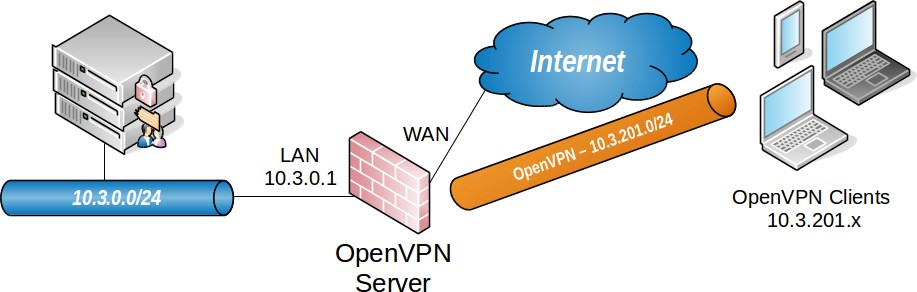
.. |image1| image:: media/image2.png
   :width: 0.26389in
   :height: 0.26389in
.. |image2| image:: media/image3.png
   :width: 0.26389in
   :height: 0.26389in
.. |image3| image:: media/image4.png
   :width: 0.26389in
   :height: 0.26389in

.. |image6| image:: media/image2.png
   :width: 0.26389in
   :height: 0.26389in

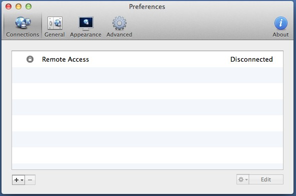
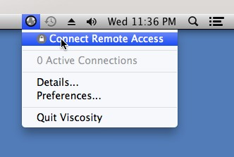

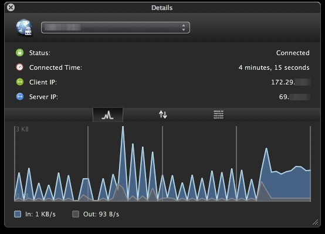
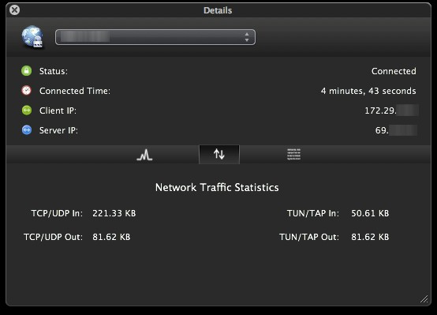
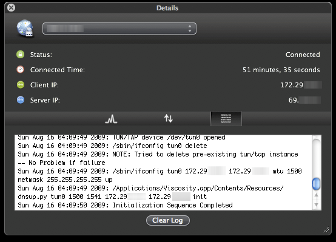
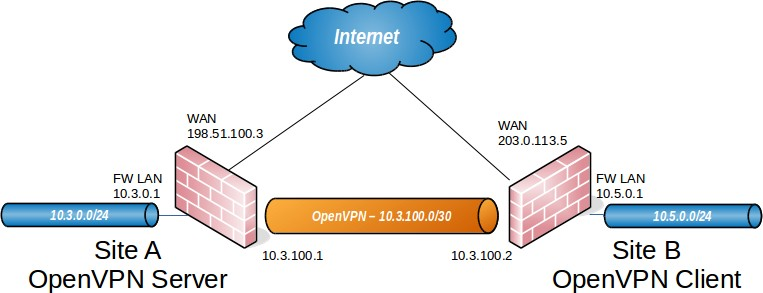
.. |image16| image:: media/image2.png
   :width: 0.26389in
   :height: 0.26389in
.. |image17| image:: media/image3.png
   :width: 0.26389in
   :height: 0.26389in
.. |image18| image:: media/image16.png
   :width: 0.26389in
   :height: 0.26389in

.. |image20| image:: media/image16.png
   :width: 0.26389in
   :height: 0.26389in
.. |image21| image:: media/image2.png
   :width: 0.26389in
   :height: 0.26389in
.. |image22| image:: media/image16.png
   :width: 0.26389in
   :height: 0.26389in
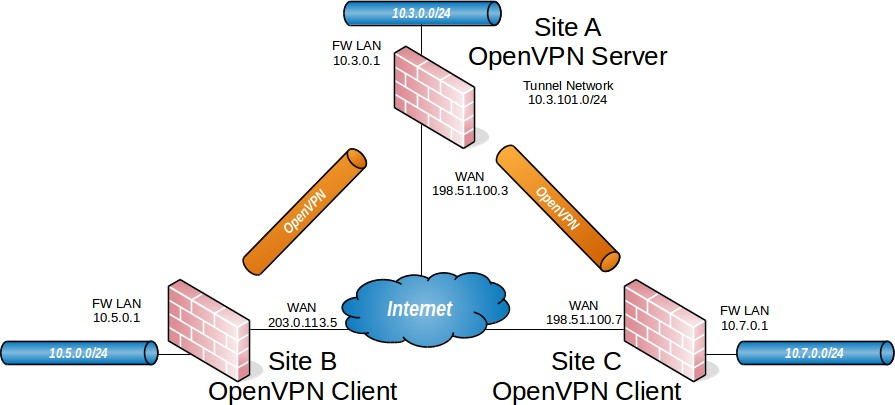
.. |image24| image:: media/image2.png
   :width: 0.26389in
   :height: 0.26389in
.. |image25| image:: media/image3.png
   :width: 0.26389in
   :height: 0.26389in
.. |image26| image:: media/image16.png
   :width: 0.26389in
   :height: 0.26389in
.. |image27| image:: media/image16.png
   :width: 0.26389in
   :height: 0.26389in
.. |image28| image:: media/image2.png
   :width: 0.26389in
   :height: 0.26389in
.. |image29| image:: media/image2.png
   :width: 0.26389in
   :height: 0.26389in
.. |image30| image:: media/image16.png
   :width: 0.26389in
   :height: 0.26389in

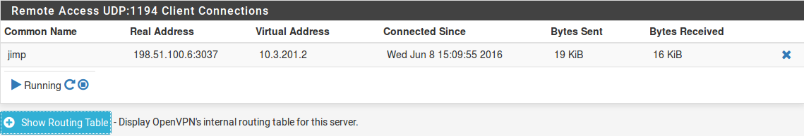
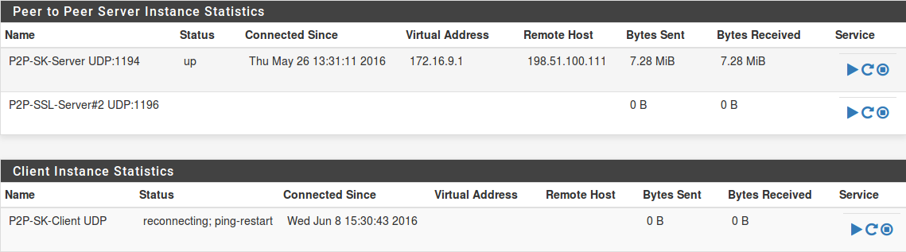
.. |image35| image:: media/image16.png
   :width: 0.26389in
   :height: 0.26389in

.. |image37| image:: media/image16.png
   :width: 0.26389in
   :height: 0.26389in
.. |image38| image:: media/image2.png
   :width: 0.26389in
   :height: 0.26389in
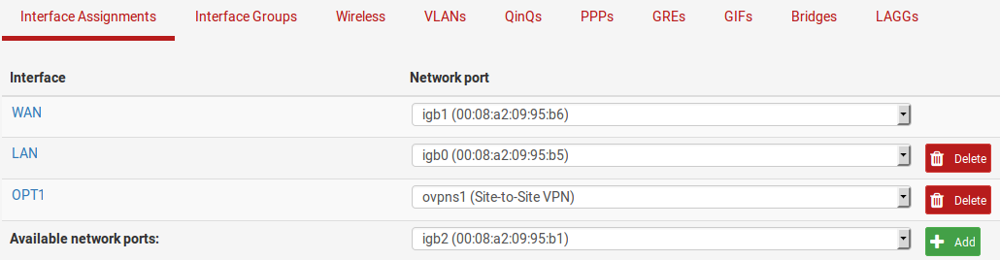
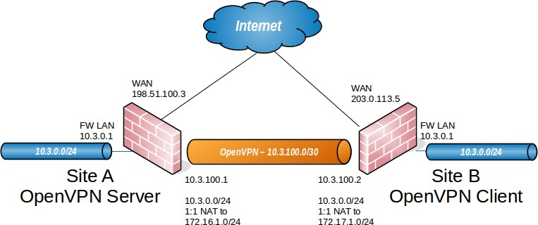
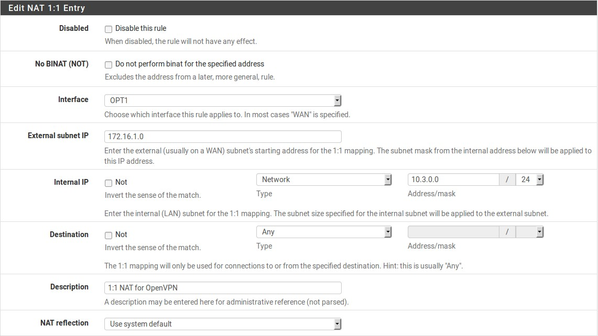
.. |image42| image:: media/image27.png
   :width: 6.54167in
   :height: 3.68056in
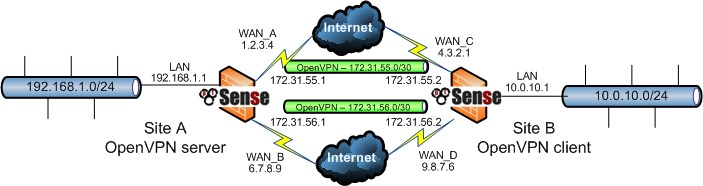
.. |image44| image:: media/image2.png
   :width: 0.26389in
   :height: 0.26389in
