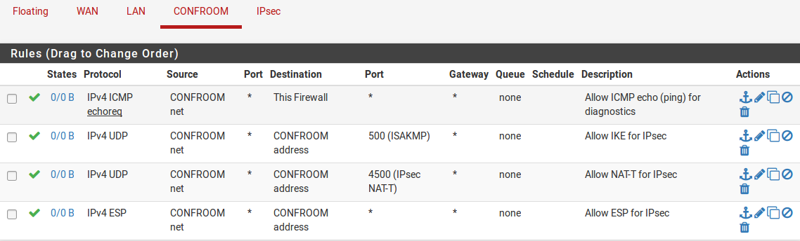

********
Wireless
********

Dispositivi Wireless Consigliati
''''''''''''''''''''''''''''''''

Una varietà di schede wireless sono supportate in FreeBSD
11.2-RELEASE-p4, e |firew4ll| include il supporto per ogni scheda
supportata da FreeBSD. Alcuni hanno un supporto migliore di altri. La
maggior parte degli sviluppatori |firew4ll| lavora con l'hardware Atheros,
quindi tende ad essere l'hardware più consigliato. Molti hanno successo
pure con altre schede, e Ralink è un'altra scelta popolare. Altre schede
possono essere supportate, ma non supportano tutte le funzionalità
disponibili. In particolare, alcune schede Intel possono essere
utilizzate in modalità infrastruttura come client ma non possono essere
eseguite in modalità access point a causa delle limitazioni
dell'hardware stesso.

Schede wireless di grandi poduttori
===================================

Linksys, D-Link, Netgear e altri importanti produttori cambiano
comunemente il chipset utilizzato nelle loro schede wireless senza
modificare il numero di modello. Non c'è modo di garantire che una
scheda di uno specifico modello da questi fornitori sarà compatibile
perché non esiste un modo affidabile per sapere quale revisione della
scheda “minore” e quale chip contiene un pacchetto. Mentre una revisione
di un particolare modello può essere compatibile e funzionare bene,
un'altra scheda dello stesso modello può essere incompatibile. Per
questo motivo, si consiglia di evitare le schede dei principali
produttori. Se una scheda è già a portata di mano, vale la pena provare
e vedere se è compatibile. Diffidare quando si fa un acquisto perché
anche se lo “stesso” modello” ha funzionato per qualcuno, un nuovo
acquisto potrebbe comportare un hardware completamente diverso che è
incompatibile.

Stato del supporto 802.11n
==========================

|firew4ll| 01-RELEASE-p3 è basato su FreeBSD 11.2-RELEASE-P4 che ha il
supporto per 802.11n su alcuni hardware come quelli basati sui chipset
Atheros AR9280 e AR9220. Abbiamo testato le schede usando quei chipset e
funzionano bene. Alcune altre schede non Atheros sono documentate da
FreeBSD per lavorare su 802.11n, in particolare, mwl (4) e iwn(4).
Questi possono funzionare utilizzando lo standard 802.11n, ma le
esperienze con la velocità di 802.11n possono variare.

L'articolo wiki di FreeBSD per il supporto 802.11n contiene le
informazioni più aggiornate su chipset e driver supportati che
funzionano con 802.11n.

Stato supporto 802.11ac
=======================

Attualmente, non esiste alcun supporto per 802.11ac in FreeBSD né in |firew4ll|.

Frequenze radio e supporto dual band
====================================

Alcune schede hanno il supporto per 2.4 GHz e 5 GHz bande, come ad
esempio l’Atheros AR9280, ma si può usare solo una banda alla volta.
Attualmente non ci sono schede supportate e che lavorano in FreeBSD che
opereranno in entrambe le bande contemporaneamente.

L'utilizzo di due schede separate in un'unica unità non è auspicabile in
quanto le loro radio potrebbero interferire. Nei casi che richiedono
supporto a banda doppia o multipla, si consiglia vivamente un AP
esterno.

Driver Wireless inclusi in |firew4ll|
=====================================

Questa sezione elenca i driver wireless inclusi in |firew4ll| e i chipset
supportati da tali driver. Queste informazioni sono state derivate dalle
pagine principali di FreeBSD per i driver in questione. I driver in
FreeBSD sono indicati con il loro nome di driver, seguito da (4), come
*ath(4).* Il (4) si riferisce alla sezione interfacce del kernel della
collezione della pagina principale, in questo caso specificando un
driver di rete. I driver sono elencati in ordine di frequenza di
utilizzo con |firew4ll|, in base ai rapporti degli utenti.

Per informazioni più dettagliate sulle schede supportate e le
informazioni più aggiornate, fare riferimento al wiki |firew4ll|.

Schede che supportano la modalità con punto di accesso (hostap)
---------------------------------------------------------------

Le schede in questa sezione supportano la funzione del punto di accesso
per accettare connessioni da altri client wireless. Questo è indicato
come modalità *hostap*.

ath(4)
~~~~~~

Il driver *ath(4)* supporta le schede basate sulle API Atheros AR5210,
AR5211, AR5212, AR5416 e AR92xx utilizzate da molti altri chip di
Atheros con diversi numeri di modello. La maggior parte delle schede
Atheros supporta quattro punti di accesso virtuali (VAP) o stazioni o
una combinazione per creare un ripetitore wireless.

Sebbene non esplicitamente elencato nella pagina principale, l'articolo
wiki di FreeBSD per il supporto 802.11n afferma anche che il driver ha
il supporto per ar9130, AR9160, AR9280, AR9285, AR9287 e potenzialmente
altri chipset correlati.

ral(4) / ural(4) / rum(4) / run(4)
~~~~~~~~~~~~~~~~~~~~~~~~~~~~~~~~~~

Ci sono diversi driver di rete wireless 802.11 correlati a Ralink con
tecnologia IEEE, ciascuno per un diverso set e tipo di scheda.

-  *ral(4)* supporta schede basate sui chipset con tecnologia Ralink
   RT2500, RT2501 e RT2600, RT2700, RT2900 e RT3090.

-  *ural(4)* supporta RT2500USB.

-  *run (4)* supporta RT2700U, RT2800U, RT3000U, RT3900E, e simili.

-  *rum(4)* supporta RT2501USB e RT2601USB e simili.

Di questi, solo alcuni chip supportati da *run (4)* possono supportare i
VAP.

Il chip *ral(4)* RT3090 è l'unico modello elencato come capace di
supportare 802.11n su FreeBSD. L'hardware con *ral(4)* RT2700 e RT2800 e
*run(4)* RT3900E sono in grado di supportare 802.11n, ma i driver su
FreeBSD non supportano attualmente le loro funzionalità 802.11n.

mwl(4)
~~~~~~

Il driver di rete wireless della Marvell IEEE 802.11, mwl (4), supporta
schede basate sul chipset 88W8363 e supporta completamente 802.11n.
Questa scheda supporta più VAP e stazioni, fino a otto di ciascuno.

Schede che supportano solo la modalità client (stazione)
--------------------------------------------------------

Le schede in questa sezione non sono in grado di fungere da punti di
accesso, ma possono essere utilizzate come client in modalità stazione,
ad esempio come WAN wireless.

uath(4)
~~~~~~~

I dispositivi wireless di Atheros USB 2.0 che utilizzano chipset
AR5005UG e AR5005UX sono supportati dal driver *uath(4)*.

ipw(4) / iwi(4) / iwn(4) / wpi(4)
~~~~~~~~~~~~~~~~~~~~~~~~~~~~~~~~~

I driver di rete wireless Intel coprono vari modelli con driver diversi.

-  *ipw (4)* supporta adattatori MiniPCI Intel PRO/Wireless 2100.

-  *iwi (4)* supporta adattatori PCI 2225BG e MiniPCI Intel PRO/Wireless
   2200BG/2915ABG.

-  *iwn (4)* supporta adattatori PCI-Express Intel Wireless WiFi Link
   serie 4965, 1000, 5000 e 6000.

-  *wpi (4)* supporta gli adattatori Intel 3945ABG.

Le schede supportate dal driver *iwn (4)* sono documentate da FreeBSD
come in grado di supportare 802.11n in modalità client.

Diversi adattatori Intel hanno una restrizione di licenza con un avviso
che appare nel registro di avvio. I driver *ipw(4)*, *iwi(4)* e *wpi(4)*
dispongono di file di licenza che devono essere letti e concordati.
Queste licenze sono registrate sul firewall in */usr/share/doc/legal
/intel\_ipw /LICENSE*, / *usr/share/doc/legal/intel\_iwi/LICENSE*, e

*/usr/share/doc/legal/intel\_wpi/LICENSE* rispettivamente. Per accettare
la licenza, modificare */boot/loader.conf.locale* e aggiungere una riga
per indicare la conferma della licenza, ad esempio:

``legal.intel_ipw.license_ack=1``

Dato l'uso limitato di questi adattatori solo come client, una soluzione
basata sulla GUI per riconoscere queste licenze non è stata ancora
creata.

bwi(4) / bwn(4)
~~~~~~~~~~~~~~~

Il driver wireless Broadcom BCM43xx IEEE 802.11b/g è diviso in due a
seconda dei modelli specifici in uso.

-  *bwi(4)* supporta BCM4301, BCM4303, BCM4306, BCM4309, BCM4311,
   BCM4318, BCM4319 utilizzando una versione v3 precedente del firmware
   Broadom.

-  *bwn(4)* supporta BCM4309, BCM4311, BCM4312, BCM4318, BCM4319
   utilizzando una versione v4 più recente del firmware Broadcom.

Il supporto offerto dai driver si sovrappone per alcune schede. Il
driver *bwn(4)* è preferito per le schede supportate mentre il driver
*bwi (4)* deve essere utilizzato sulle schede più vecchie non coperte da
*bwn(4)*

malo(4)
~~~~~~~

Il driver wireless Marvell Libertas IEEE 802.11b/g, malo (4), supporta
le schede utilizzando il chipset 88W8335.

upgt(4)
~~~~~~~

Il driver wireless Conexant/Intersil Prismgt SoftMAC USB IEEE 802.11b/g,
*upgt (4)*, supporta le schede utilizzando il chipset GW3887.

urtw(4) / urtwn(4) / rsu(4)
~~~~~~~~~~~~~~~~~~~~~~~~~~~

Il trio dei relativi driver wireless Realtek copre diversi modelli:

-  *urtw(4)* supporta i modelli RTL8187B/L USB IEEE 802.11b/g con una
   radio RTL8225

-  *urtwn(4)* supporta RTL8188CU/RTL8188EU/RTL8192CU 802.11b/g/n

-  *rsu(4)* supporta RTL8188SU/RTL8192SU 802.11b/g/n

Come in altri casi simili, anche se i chip supportati da *urtwn(4)* e
*rsu(4)* sono in grado di supportare 802.11n, FreeBSD non supporta le
funzionalità di 802.11 n.

zyd(4)
~~~~~~

Il driver del dispositivo di rete wireless ZyDAS ZD1211/ZD1211B USB IEEE
802.11b/g, *zyd(4)*, supporta adattatori che utilizzano il chip con USB
ZD1211 e ZD1211B.

Specifiche supporto hardware
============================

Abbiamo un foglio di calcolo online con dettagli più completi del
supporto hardware, inclusi più chipset e modelli di dispositivi di
esempio supportati da determinati driver. Attualmente queste
informazioni si trovano su un foglio di calcolo pubblico di Google Docs
collegato dall'articolo wiki della documentazione sul supporto wireless.
Come notato in precedenza in questo capitolo, spesso i produttori
cambieranno i chipset del dispositivo ma non i numeri di modello, quindi
è una guida approssimativa nella migliore delle ipotesi, ma può comunque
fornire alcune utili indicazioni.

Lavorare con interfacce wireless con Virtual Access Point
'''''''''''''''''''''''''''''''''''''''''''''''''''''''''

|firew4ll| supporta interfacce wireless virtuali che utilizzano Multi-BSS.
Questi sono noti come punto di accesso virtuale o interfacce VAP, anche
se vengono utilizzati per la modalità client. I VAP consentono di
eseguire più access point o client sulla stessa scheda wireless o di
utilizzare una combinazione di access point e modalità client. Il caso
d'uso più comune è per più punti di accesso con SSID diversi ciascuno
con requisiti di sicurezza unici. Ad esempio, uno senza crittografia ma
con il captive portal e regole di accesso rigorose e una rete separata
con crittografia, autenticazione e regole di accesso meno severe.

Anche se una scheda non supporta più istanze VAP, la prima voce deve
essere creata manualmente prima di poter essere assegnata.

Il supporto per i VAP varia a seconda della scheda e del driver,
consultare le informazioni sul supporto del driver in *Hardware wireless
consigliato* per saperne di più. È probabile, tuttavia, che se una
scheda wireless Atheros è in uso, funzionerà. Mentre non esiste un
limite teorico al numero di VAP che una scheda può utilizzare, il
supporto driver e hardware varia, quindi il limite pratico è quattro VAP
su *ath (4)* e otto su *mwl(4).*

Tutti i VAP su una determinata scheda condividono alcune impostazioni comuni, come il canale, le impostazioni normative, le impostazioni dell'antenna e lo standard wireless. Altre impostazioni come la modalità, SSID, impostazioni di crittografia e così via possono variare tra VAP.

Creazione e gestione di istanze wireless
========================================

Per creare una nuova istanza wireless:

-  Passare a **Interfacce>(assegnare)** nella scheda **Wireless.**

-  Fare clic su |image0| **Aggiungere** per creare una nuova voce

-  Selezionare l'\ **Interfaccia primaria**, ad esempio *ath0*

-  Scegliere la **Modalità** tra *Punto di accesso*, *Infrastruttura*
   (BSS, modalità client) o *Ad-hoc* (IBSS)

-  Inserire una **Descrizione**

-  Fare clic su **Salvare**

Un esempio è mostrato nella figura Aggiungere un'istanza wireless.

|image1|

Fig. 1: Aggiungere un'istanza wireless

Una volta che la voce è stata salvata, è disponibile per l'assegnazione
sotto **Interfacce>(assegnare)**. Da lì, assegnare e quindi modificare
le impostazioni come qualsiasi altra interfaccia wireless.

.. note::  L'interfaccia assegnata deve essere configurata per utilizzare la stessa modalità specificata quando è stato creato il VAP.

Wireless WAN
''''''''''''

Una scheda wireless in un firewall che esegue |firew4ll| può essere utilizzata come interfaccia WAN primaria o WAN aggiuntiva in una distribuzione Multi-WAN.

Assegnazione dell'interfaccia
=============================

Se l'interfaccia wireless non è stata ancora assegnata, ci sono due
possibili scelte: aggiungerla come un'interfaccia OPT aggiuntiva o
riassegnarla come WAN.

Prima di iniziare, creare l'istanza wireless come descritto in
*Creazione e gestione di istanze wireless* se non esiste già. Quando si
lavora come le WAN, si deve utilizzare la modalità Infrastruttura (BSS).

Per aggiungere l'interfaccia come nuova interfaccia OPT:

-  Passare a **Interfacce>(assegnare)**

-  Selezionare l'interfaccia wireless dal menu a discesa **Porte di rete
   disponibili** sotto le altre interfacce

-  Fare clic su |image2| **Aggiungere** per aggiungere l'interfaccia
   come interfaccia OPT

Per riassegnare l'interfaccia wireless come WAN:

-  Passare a **Interfacce>(assegnare)**

-  Selezionare l'interfaccia wireless come **WAN**

-  Fare clic su Salvare

La figura *Assegnazione dell'interfaccia WAN wireless* mostra una scheda
Atheros assegnata come WAN.

|image3|

Fig. 2: Assegnazione dell'interfaccia WAN wireless

Configurazione della rete wireless
==================================

   La maggior parte delle WAN wireless ha bisogno solo di una manciata
   di opzioni impostate, ma le specifiche variano a seconda del punto di
   accesso (AP) a cui questa interfaccia client si connetterà.

-  Selezionare il menu **Interfacce** per l'interfaccia WAN wireless ,
   ad esempio **Interfacce>WAN**

-  Selezionare il tipo di configurazione (*DHCP*, *IP statico*, ecc.)

-  Scorrere verso il basso per la **Configurazione wireless comune**

-  Impostare lo **Standard** in base ALL'AP, ad esempio *802.11g*

-  Selezionare il **Canale** appropriato per abbinare l'AP

-  Scorrere verso il basso fino alla **Configurazione wireless specifica
   della rete**

-  Impostare la **Modalità** su *Modalità infrastruttura (BSS)*

-  Inserire l'\ **SSID** per l'AP

-  Configurare la crittografia come WPA2 (Accesso protetto al Wi-Fi) se
   in uso dall'AP

-  Rivedere le impostazioni rimanenti, se necessario, e selezionare
   altre opzioni appropriate per abbinare l'AP

-  Fare clic su **Salvare**

-  Fare clic su **Applicare le modifiche**

Controllo dello stato del wireless
==================================

Passare a **Stato>Interfacce** per visualizzare lo stato
dell'interfaccia wireless. Se l'interfaccia è stata associata con
successo con l'AP sarà indicato nella pagina di stato. Uno **Stato di
associato** indica che l'interfaccia è stata collegata correttamente
all'AP, come mostrato nella figura *Interfaccia WAN wireless associata*

|image4|

Fig. 3: Interfaccia WAN wireless associata

Se lo **Stato** dell'interfaccia non mostra **Alcun vettore**, non è
stato possibile associarlo. La figura *Nessun vettore sulla WAN
wireless* mostra un esempio di questo, in cui l'antenna è stata
scollegata in modo che non poteva connettersi a una rete wireless che
era una certa distanza.

|image5|

Fig. 4: Nessun vettore sulla WAN wireless

Visualizzazione delle reti wireless disponibili e della potenza del segnale
===========================================================================

I punti di accesso wireless visibili dal firewall possono essere
visualizzati navigando in **Stato>Wireless** come mostrato nella figura
*Stato del wireless*.

Prima di visualizzare questa voce di menu, è necessario configurare
un'interfaccia wireless.

|image6|\

Fig. 5: Stato wireless

Bridging e wireless
'''''''''''''''''''

Collegare due interfacce insieme le posiziona sullo stesso dominio di
trasmissione come se fossero collegate allo stesso switch. In genere
questo viene fatto in modo che due interfacce agiscano come se fossero
sulla stessa rete piatta utilizzando la stessa sottorete IP, in questo
caso un'interfaccia wireless e un'Interfaccia cablata. Quando due
interfacce vengono collegate con un ponte, il traffico broadcast e
multicast viene inoltrato a tutti i membri del bridge.

Alcune applicazioni e dispositivi si basano sul traffico broadcast per
funzionare. Ad esempio, AirTunes di Apple non funzionerà su due domini
broadcast. Quindi, se AirTunes è presente sulla rete wireless e deve
essere accessibile da un sistema sulla rete cablata, le reti cablate e
wireless devono essere collegate con un ponte. Altri esempi includono
servizi multimediali forniti da dispositivi come Chromecast, TiVo, Xbox
360 e Playstation 3. Questi si basano sul traffico multicast o broadcast
che può funzionare solo se le reti cablate e wireless presetano un
bridge.

Punti di accesso wireless e bridging
====================================

Solo le interfacce wireless in modalità access point (hostap)
funzioneranno in una configurazione a ponte. Un'interfaccia wireless
configurata per hostap può essere collegata a un'altra interfaccia che
li combina sullo stesso dominio broadcast. Ciò può essere auspicabile
per alcuni dispositivi o applicazioni che devono risiedere sullo stesso
dominio broadcast per funzionare correttamente, come accennato in
precedenza.

BSS e IBSS wireless e bridging
==============================

A causa del modo in cui il wireless funziona in modalità BSS (Set di
servizi di base, modalità client) e IBSS (Set di servizi di base
indipendente, modalità Ad-Hoc) e del modo in cui funziona il bridging,
un'interfaccia wireless non può essere collegata con un bridge in
modalità BSS o IBSS. Ogni dispositivo collegato a una scheda wireless in
modalità BSS o IBSS deve presentare lo stesso indirizzo MAC. Con il
bridging, l'indirizzo MAC passato è l'attuale MAC del dispositivo
collegato. Questo è di solito un aspetto desiderabile del funzionamento
del bridging. Con wireless, l'unico modo in cui questo può funzionare è
se tutti i dispositivi dietro quella scheda wireless presentino lo
stesso indirizzo MAC sulla rete wireless. Questo è spiegato
approfonditamente dal noto esperto Wireless Jim Thompson in un post
della mailing list.

Ad esempio, quando VMware Player, la Workstation o il server è
configurato per collegarsi a un'interfaccia wireless, traduce
automaticamente l'indirizzo MAC in quello della scheda wireless. Poiché
non c'è modo di tradurre un indirizzo MAC in FreeBSD, e a causa del modo
in cui funziona il bridging in FreeBSD, è difficile fornire soluzioni
alternative simili a quelle offerte da VMware. Ad un certo punto |firew4ll|
può sostenere questo, ma non è sul piano di sviluppo pdi 2.x.

Scegliere il routing o il bridging
==================================

La scelta tra il bridging (che utilizza la stessa sottorete IP della LAN
esistente) o il routing (che utilizza una sottorete IP dedicata per il
wireless) per i client wireless dipenderà da quali servizi richiedono i
client wireless. In molti ambienti di rete domestica ci sono
applicazioni o dispositivi che richiedono reti cablate e wireless da
colmare. Nella maggior parte delle reti aziendali, ci sono poche
applicazioni che richiedono il bridging. Quale scegliere dipende dai
requisiti delle applicazioni di rete in uso, nonché dalle preferenze
personali.

Ci sono alcuni compromessi, un esempio è il pacchetto Avahi. Può
ascoltare su due diversi domini di trasmissione e scambiare messaggi di
rebroadcast da uno all'altro per consentire al DNS multicast di
funzionare (anche conosciuto come Rendezvous o Bonjour) per la scoperta
e i servizi di rete. Se i servizi richiesti utilizzano tutti i
protocolli che possono essere gestiti da Avahi, potrebbe essere
possibile utilizzare un metodo instradato.

Per i servizi in esecuzione sul firewall, il bridging può anche essere
problematico. Funzionalità come i limitatori, il captive portal e i
proxy trasparenti richiedono una configurazione e una gestione speciali
per lavorare su reti a ponte. In particolare, il bridge stesso deve
essere assegnato e l'unica interfaccia sul ponte con un indirizzo IP
deve essere il bridge assegnato. Inoltre, affinché queste funzioni
riescano, l'indirizzo IP sul bridge deve essere l'indirizzo utilizzato
dai client come gateway.

Utilizzare un Access Point Esterno
''''''''''''''''''''''''''''''''''''''
La maggior parte dei router wireless in stile SOHO può essere utilizzata
come punto di accesso se non è disponibile un vero punto di accesso
(AP). Se |firew4ll| ha sostituito un router wireless esistente, potrebbe
comunque essere utilizzato per gestire la parte wireless della rete, se
lo si desidera. Questo tipo di distribuzione è popolare per il wireless
perché è più facile mantenere il punto di accesso in una posizione con
un segnale migliore e sfruttare l'hardware wireless più corrente senza
fare affidamento sul supporto del driver in |firew4ll|. In questo modo una
rete wireless 802.11ac può ancora essere utilizzata e protetta da
|firew4ll| sul limite, anche se |firew4ll| non ha ancora il supporto per le
schede 802.11ac.

Questa tecnica è anche comunemente utilizzata con apparecchiature
wireless che eseguono \*WRT, Tomato o altro firmware personalizzato per
l'uso di punti di accesso dedicati piuttosto che router edge.

Trasformare un router wireless in un Access Point
=================================================

Quando si sostituisce un semplice router wireless come un Linksys,
D-Link o altro dispositivo domestico con |firew4ll| come firewall
perimetrale, la funzionalità wireless può essere mantenuta. Per
convertire il router wireless in un punto di accesso wireless, seguire
questi passaggi generici per qualsiasi dispositivo. Per trovare le
specifiche per un particolare router wireless, fare riferimento alla sua
documentazione.

Disabilitare il server DHCP
---------------------------

Disabilitare il server DHCP sul router wireless per evitare un
conflitto. |firew4ll| gestirà questa funzione per la rete e avere due
server DHCP sullo stesso dominio di trasmissione causerà problemi.

Modificare l'indirizzo IP della LAN
-----------------------------------

Modificare l'indirizzo IP della LAN sul router wireless in un indirizzo
IP non utilizzato nella sottorete in cui risiederà (comunemente LAN). Se
il firewall con |firew4ll| ha sostituito questo router wireless, il router
wireless probabilmente utilizzava lo stesso indirizzo IP ora assegnato
all'interfaccia LAN di |firew4ll|, quindi deve essere modificato. Un
indirizzo IP funzionale sul punto di accesso è necessario per scopi di
gestione e per evitare conflitti di indirizzi IP.

Collegare l'interfaccia LAN
---------------------------

La maggior parte dei router wireless collega la propria rete wireless
alla porta LAN interna o alle porte switch. Ciò significa che il
segmento wireless sarà sullo stesso dominio broadcast e sottorete IP
delle porte cablate. Per i router con uno switch integrato, una
qualsiasi delle porte dello switch LAN in genere funzionerà.

.. note::
	*Non collegare la porta WAN o Internet sul router wireless!* Questo metterà la rete wireless su un dominio di trasmissione diverso dal resto della rete e il router wireless eseguirà il NAT sul traffico tra il wireless e la LAN. Ciò si traduce anche in doppio NAT di traffico tra la rete wireless e Internet. Questa pratica non è sempre indicata, e porterà a problemi in alcune circostanze, soprattutto se la comunicazione deve avvenire tra i client LAN wireless e cablati.

Decidere dove connettere l'interfaccia LAN dal router wireless dipende
dal design di rete scelto. Le sezioni successive coprono le opzioni e le
considerazioni per selezionare il miglior stile di distribuzione.

Bridge tra Wireless e LAN
==============================

Un mezzo comune di distribuzione wireless è quello di collegare il punto
di accesso direttamente allo stesso interruttore degli host LAN, in cui
l'AP collega i client wireless alla rete cablata. Questo funzionerà
bene, ma offre un controllo limitato sulla capacità dei client wireless
di comunicare con i sistemi interni. Vedere Scegliere il routing o il
bridging per i dettagli sul bridging in questo ruolo.

Bridge Wireless a interfacca OPT
==========================================

Per un maggiore controllo sui client wireless, l'aggiunta di
un'interfaccia OPT al firewall per il punto di accesso è la soluzione
preferita. Per mantenere le reti wireless e cablate sulla stessa
sottorete IP e sul dominio broadcast, l'interfaccia OPT può essere
collegata all'interfaccia LAN. Questo scenario è funzionalmente
equivalente a collegare il punto di accesso direttamente allo switch
della LAN, tranne che |firew4ll| può filtrare il traffico dalla rete
wireless per fornire protezione agli host della LAN e viceversa.

.. note::  una configurazione con il bridge assegnato come LAN è ottimale qui, piuttosto che avere solo l'OPT collegato alla LAN cablata esistente.

Segmento instradato su un'interfaccia OPT
=========================================

La rete wireless può anche essere posizionata su una sottorete IP
separata, se lo si desidera. Questo viene fatto senza collegare con un
ponte l'interfaccia OPT su |firew4ll|, invece assegnandolo con un indirizzo
IP in una sottorete separata diversa dalla LAN. Ciò consente il routing
tra reti interne e wireless, come consentito dal set di regole firewall.
Questo viene comunemente fatto su reti più grandi, dove più punti di
accesso sono collegati a uno switch che viene quindi collegato
all'interfaccia OPT su |firew4ll|. È anche preferibile quando i client
wireless saranno costretti a connettersi a una VPN prima di consentire
le connessioni alle risorse di rete interne.

|firew4ll| come Access Point
''''''''''''''''''''''''''''

Con una scheda wireless che supporta la modalità hostap (vedere *Schede
che supportano la modalità Access Point (hostap*)), |firew4ll| può essere
configurato come Access Point wireless.

Dovrebbe un AP esterno o |firew4ll| essere utilizzato per un punto di accesso?
==============================================================================

La funzionalità del punto di accesso in FreeBSD, e quindi |firew4ll|, è
migliorata notevolmente nel corso degli anni ed è considerata stabile
attualmente per la maggior parte degli usi. Detto questo, molti casi
d'uso si comportano meglio con un punto di accesso esterno, in
particolare implementazioni che hanno requisiti come 802.1ac,
funzionamento simultaneo a 2,4 GHz e 5 GHz, reti a maglia wireless o
casi rari con client che non si associano a un punto di accesso eseguito
utilizzando |firew4ll|.

I punti di accesso su |firew4ll| sono stati utilizzati con successo in
implementazioni di piccole e medie dimensioni, con dispositivi come
MacBook Pro, Apple AirTunes, iPod Touch, iPad, telefoni e tablet
Android, vari Laptop Windows, Xbox e client FreeBSD e funziona in modo
molto affidabile su tutti questi dispositivi. C'è la possibilità di
trovare dispositivi incompatibili con qualsiasi punto di accesso, e
FreeBSD non fa eccezione.

Il principale fattore decisivo in questi giorni è il supporto 802.11n o
802.11ac; il supporto per l'hardware 802.11n in |firew4ll| è in qualche
modo limitato e il supporto 802.11ac non esiste. Questo è un fattore
determinante per alcuni, e come tale utilizzare un punto di accesso
esterno sarebbe meglio per le reti che richiedono 802.11ac e in alcuni
casi 802.11n se non è possibile ottenere l’hardware adatto.

Il prossimo fattore più comune è la posizione delle antenne o il punto
di accesso wireless in generale. Spesso, il firewall che esegue |firew4ll|
si trova in un'area dell'edificio che non è ottimale per il wireless, ad
esempio una sala server in uno scaffale. Per una copertura ideale, la
migliore pratica è individuare l'AP in un'area meno suscettibile alle
interferenze wireless e che avrebbe una migliore potenza del segnale
nell'area in cui risiedono i client wireless. Se il firewall che esegue
|firew4ll| si trova da solo su uno scaffale in un'area comune o in un'altra
area simile favorevole a un buon segnale wireless, questo potrebbe non
essere un problema.

Configurazione di |firew4ll| come access point
==============================================

Il processo di configurazione di |firew4ll| per agire come un punto di
accesso wireless (AP) è relativamente facile. Molte delle opzioni
saranno familiari a chiunque abbia configurato altri router wireless in
precedenza e alcune opzioni potrebbero essere nuove a meno che non siano
state utilizzate apparecchiature wireless di livello commerciale.
Esistono dozzine di modi per configurare i punti di accesso e dipendono
tutti dall'ambiente in cui verranno distribuiti. In questo esempio
|firew4ll| è configurato come AP di base che utilizza la crittografia WPA2
con AES. In questo esempio, EsempioCo ha bisogno di accesso wireless per
alcuni laptop nella sala conferenze.

Preparazione dell'interfaccia wireless
--------------------------------------

Prima di iniziare, assicurarsi che la scheda wireless sia installata nel
firewall e che le trecce e le antenne siano saldamente attaccate.

Creare l'istanza wireless come descritto in *Creazione e gestione di
istanze wireless* se non esiste già. Quando si lavora come punto di
accesso, deve utilizzare la modalità punto di accesso. La scheda
wireless deve essere assegnata come interfaccia OPT e abilitata prima
che la configurazione rimanente possa essere completata.

    **Descrizione dell'interfaccia** Quando è in uso come punto di
    accesso, nominare l'interfaccia *WLAN* (LAN Wireless) o *Wireless*,
    o denominarla dopo l'SSID rende più facile l'identificazione. Se
    |firew4ll| guiderà più punti di accesso, ci dovrebbe essere un modo per
    distinguerli, come “amministratoreWLAN” e “venditeWLAN”. In questo
    esempio, si chiama SalaConferenze.

    **Tipo di interfaccia** Poiché questo esempio sarà un AP su una
    sottorete IP dedicata, il tipo di configurazione IPv4 deve essere
    impostato su *IPv4 statico*

    **Indirizzo IP** Un indirizzo IPv4 e una machera di sottorete devono
    essere specificati. Questa è una sottorete separata dalle altre
    interfacce. Per questo esempio può essere 192.168.201.0/24, una
    sottorete altrimenti inutilizzata nella rete EsempioCo. Usando
    quella sottorete, l'indirizzo IPv4 per questa interfaccia sarà
    192.168. 201.1.

Impostazioni wireless comuni
----------------------------

Queste impostazioni sono condivise per tutti i VAP su una determinata
scheda wireless fisica. La modifica di queste impostazioni su
un'interfaccia le cambierà su tutte le altre interfacce virtuali
utilizzando lo stesso adattatore fisico.

    **Persistenza delle impostazioni comuni** Selezionando **persistenza
    delle impostazioni comuni**, i valori di configurazione in questa
    sezione verranno conservati anche se tutte le interfacce e le VAP
    vengono eliminate o riassegnate, quando altrimenti verrebbero perse.

    **Wireless standard** A seconda del supporto hardware, sono
    disponibili diverse opzioni per l'impostazione standard wireless,
    tra cui *802.11b*, *802.11g*, *802.11g turbo*, *802.11a*, *802.11a
    turbo*, *802.11ng*, *802.11na*, e possibilmente altri. Per questo
    esempio, sceglieremo *802.11ng* per un punto di accesso 802.11n che
    opera nella banda 2.4 GHz.

    **Modalità di protezione OFDM** L'impostazione della **Modalità di
    protezione OFDM** è utile solo in ambienti standard misti in cui
    802.11g e 802.11b devono interagire. Il suo uso primario è per
    evitare collisioni. Data l'età di 802.11b e la scarsità di
    dispositivi di lavoro che lo utilizzano, è meglio lasciare
    l'impostazione in *Modalità di protezione off*. C'è una penalità di
    prestazioni usandolo, dal momento che ha un po' di sovraccarico su
    ogni frame e richiede anche passaggi aggiuntivi durante la
    trasmissione di frame.

    **Selezione del canale Wireless** Quando si seleziona un **Canale**,
    è necessaria la conoscenza dei trasmettitori radio vicini in bande
    di frequenza simili per evitare interferenze. Oltre ai punti di
    accesso wireless, ci sono anche telefoni cordless, Bluetooth,
    monitor per bambini, trasmettitori video, microonde e molti altri
    dispositivi che utilizzano lo stesso spettro 2.4 GHz che può causare
    interferenze.

    Spesso qualsiasi canale funzionerà finché i client AP si trovano
    vicino all'antenna. Con 802.11g e precedenti, i canali più sicuri da
    usare erano *1*, *6* e *11* poiché le loro bande di frequenza non si
    sovrapponevano l'un l'altro. Questo non è più vero con 802.11n e
    versioni successive o anche alcune configurazioni 802.11g che
    utilizzano intervalli di frequenze più ampi per raggiungere velocità
    più elevate. Per questa rete, dal momento che non ce ne sono altri
    in giro, il canale *1* è una buona scelta.

	.. note::
		Scegliere sempre un canale specifico. Non selezionare  *Automatico* per il canale di un punto di accesso. La convalida dell'input sulle versioni correnti di |firew4ll| impedisce che venga selezionata.

    Quando si utilizzano altri standard, o si usano wireless in paesi
    diversi dagli Stati Uniti, ci possono essere molti più canali
    disponibili di quanto descritto qui. Le schede che supportano
    802.11a o 802.11n possono anche supportare canali nello spettro a 5
    GHz.

    L'elenco completo dei canali supportati dalla scheda è mostrato nel
    menu a discesa del canale e deve essere d'accordo con lo *Standard*
    scelto. Ad esempio, non scegliere *802.11ng* per lo **Standard** e
    quindi scegliere un **canale** utilizzato solo per *802.11na*.
    L'elenco dei canali include anche alcune informazioni sullo
    standard, la frequenza del canale e la potenza di trasmissione
    massima sia della scheda che nel dominio normativo per quel
    particolare canale. Fare attenzione a guardare la potenza quando si
    seleziona un canale, perché alcuni canali, soprattutto nella banda
    5GHz, variano ampiamente nei loro livelli di potenza consentiti.

    .. seealso::
		Strumenti di indagine come NetSurveyor, InSSIDer, Wi-Spy, e innumerevoli altre applicazioni per vari sistemi operativi, telefoni, tablet, e così vi possono aiutare a scegliere un canale meno occupato o un’area dello spettro più libera. Il chilometraggio può variare.

    **Impostazione della distanza** Misurata in metri e supportata solo
    da schede Atheros, il campo di impostazione della distanza
    sintonizza i timer ACK/CTS per adattarsi alla distanza tra AP e
    client. Nella maggior parte dei casi non è necessario configurare
    questo valore, ma può aiutare in alcune configurazioni wireless
    difficili come i client a lungo raggio.

Impostazioni normative
----------------------

La sezione **Impostazioni normative** controlla il modo in cui la scheda
è autorizzata a trasmettere legalmente in una regione specificata.
Diversi paesi hanno in genere impostazioni normative diverse e alcuni
paesi non ne hanno. In caso di dubbi, verificare con il governo locale
per vedere quali leggi si applicano in una determinata area. I valori
predefiniti sono generalmente OK, poiché le schede possono essere già
impostate su una regione specifica. In alcuni casi le impostazioni
normative devono essere impostate manualmente se la scheda ha un valore
predefinito non compreso nel driver. Simili alla sezione precedente,
questi valori vengono applicati alla scheda stessa e non possono variare
tra i VAP sulla scheda.

Mentre si può essere tentati di impostare la scheda su *Debug*, al fine
di utilizzare le impostazioni non altrimenti consentite, questa azione
che potrebbe causare problemi legali dovrebbe essere considerata. La
probabilità che ciò accada varia notevolmente in base al paese/area,
quindi usarla con cautela.

    **Dominio normativo** Il **Dominio normativo** è l'organismo
    governativo che controlla le comunicazioni wireless in una regione.
    Ad esempio, gli Stati Uniti e il Canada seguono i regolamenti FCC
    mentre nel Regno Unito è ETSI. Se non si è sicuri del dominio
    normativo in una regione, vedere l’impostazione **Paese**.

    **Paese** A volte i paesi specifici all'interno di un dominio
    normativo hanno restrizioni diverse. L'opzione **Paese** contiene un
    elenco a discesa di molti paesi in tutto il mondo e dei relativi
    codici del paese associati e i domini normativi.

    **Posizione** Esistono alcune restrizioni per le trasmissioni Indoor
    e Outdoor. L’impostazione della **Posizione** del trasmettitore
    regolerà ulteriormente la potenza di trasmissione consentita e/o
    canali.

Configurazione wireless specifica della rete
--------------------------------------------

Queste impostazioni sono uniche per interfaccia, anche su interfacce
wireless virtuali. La modifica di queste impostazioni non influisce su
altre interfacce.

    **Modalità wireless** Impostare il campo **Modalità** per il **punto
    di accesso** e |firew4ll| utilizzerà hostapd per fungere da AP.

    **SSID (Service Set Identifier,
    SSID)** L'\ **SSID** è il “nome” dell'AP visto dai client. Impostare
    l'SSID su qualcosa di facilmente identificabile ma unico. In linea
    con l'esempio, *SalaConferenze* è un buon nome da usare.

    **Standard wireless minimo** Il menu a discesa **Standard wireless
    minimo** controlla se i client più anziani sono in grado di
    associarsi a questo punto di accesso. Consentirlo ai client più
    vecchi potrebbe essere necessario in alcuni ambienti se i
    dispositivi che sono ancora in giro lo richiedono. Alcuni
    dispositivi sono compatibili solo con 802.11g e richiedono una rete
    g/n mista per funzionare. Il rovescio della medaglia è che le
    velocità più lente possono essere viste come risultato di consentire
    tali dispositivi sulla rete in quanto il punto di accesso sarà
    costretto a soddisfare il minimo comune denominatore quando un
    dispositivo 802.11g sta trasmettendo contemporaneamente a un
    dispositivo 802.11n. Nella nostra sala conferenze di esempio, gli
    utenti utilizzeranno solo laptop di proprietà aziendale acquistati
    di recente che sono tutti in grado di supportare 802.11n, quindi
    *802.11n* è la scelta migliore.

    **Intra-BSS** Se viene verificata la **Comunicazione tra
    BSS**, i client wireless saranno in grado di vedersi direttamente.
    Se i client avranno solo bisogno di accedere a Internet, in genere è
    più sicuro deselezionare questa opzione. In questo scenario, gli
    utenti nella sala conferenze potrebbero dover condividere i file
    avanti e indietro direttamente tra i laptop, quindi questo rimarrà
    selezionato.

    **Abilitare WME** Le estensioni multimediali wireless (Wireless
    Multimedia Extensions), o **WME**, sono una parte dello standard
    wireless che fornisce una certa qualità di servizio al traffico
    wireless per garantire la corretta consegna dei contenuti
    multimediali. È necessario che 802.11n funzioni, ma è facoltativo
    per gli standard precedenti. Questa funzione non è supportata da
    tutte le schede/driver.

    **Nascondere SSID** Normalmente l’AP trasmetterà il suo SSID in modo
    che i client possano localizzarlo e associarlo facilmente. Questo è
    considerato da alcuni un rischio per la sicurezza, annunciando a
    tutti coloro che stanno ascoltando che una rete wireless è
    disponibile, ma nella maggior parte dei casi la convenienza supera
    il (trascurabile) rischio per la sicurezza. I vantaggi di
    disabilitare la trasmissione SSID sono esagerati da alcuni, in
    quanto in realtà non nasconde la rete a nessuno in grado di
    utilizzare molti strumenti di sicurezza wireless liberamente
    disponibili che trovano facilmente tali reti wireless. Per la nostra
    sala conferenze AP, lasceremo questo deselezionato per rendere più
    facile ai partecipanti alla riunione trovare e utilizzare il
    servizio.

Crittografia wireless (WPA)
---------------------------

Sono supportati due tipi di crittografia per le reti 802.11: WPA e WPA2.
WPA2 con AES è il più sicuro. Anche quando non preoccuparsi di
crittografare il traffico sull’aria (over-the-air) (che dovrebbe essere
fatto), fornisce un ulteriore mezzo di controllo di accesso. Tutte le
moderne schede wireless e driver supportano WPA2

.. warning::
	**Debolezze della crittografia wireless**
	WEP ha seri problemi di sicurezza noti da anni e il supporto per WEP è stato rimosso da pfSense. È possibile rompere WEP in pochi minuti al massimo, e non dovrebbe mai essere accreditato per la sicurezza. Se è richiesto WEP, deve essere utilizzato un AP esterno.
	TKIP (Protocollo di integrità con chiave temporanea, Temporal Key Integrity Protocol), parte di AES, è diventato un sostituto per WEP dopo che è stato rotto. Esso utilizza lo stesso meccanismo sottostante come WEP, e quindi è vulnerabile ad alcuni attacchi simili. Questi attacchi sono diventati più pratici e TKIP non è più considerato sicuro. TKIP non deve mai essere utilizzato a meno che non siano presenti dispositivi incompatibili con WPA o WPA2 utilizzando AES. WPA e WPA2 in combinazione con AES non sono soggetti a questi difetti in TKIP.

In questo esempio, il wireless *SalaConferenze* deve essere protetto con WPA2.

    **Abilitare** Questa casella abilita la crittografia *WPA* o WPA2,
    quindi dovrebbe essere **selezionata**

    **WPA Pre-Shared Key** Immettere la chiave wireless
    desiderata, in questo esempio excoconf213.

    **WPA Mode** WPA o WPA2, in questo esempio, *WPA2*

    **WPA Key Management Mode** WPA Può essere *Chiave
    precondivisa* (PSK) o *Protocollo di autenticazione estensibile*
    (Extensible Authentication Protocol, PAA). In questo esempio, PSK è
    sufficiente.

    **WPA Pairwise** Questo dovrebbe quasi sempre essere impostato su
    A\ *ES*, a causa delle debolezze in TKIP menzionate in precedenza.

    **Group Key Rotation** Questa opzione consente di
    impostare la frequenza con cui le chiavi di crittografia
    broadcast/multicast (chiave transitoria di gruppo, GTK) vengono
    ruotate, in pochi secondi. Può essere qualsiasi valore da 9999 ma
    dovrebbe essere più breve del valore di **Rigenerazione della chiave
    master del gruppo**. Il valore predefinito di 60 secondi (un minuto)
    è adeguato. I valori più bassi possono essere più sicuri, ma possono
    oscurare le cose con frequenti rekeying.

    **Group Master Key Regeneration** Questo parametro
    controlla la frequenza con cui, in pochi secondi, viene rigenerata
    la chiave master (Chiave master di gruppo, Group Master Key, GMK)
    utilizzata internamente per generare GTK. Può essere qualsiasi
    valore da 9999 ma dovrebbe essere più lungo del valore di
    **Rotazione della chiave di gruppo**. Il valore predefinito di 3600
    secondi (un'ora) è adeguato.

    **Strict Key Regeneration** Questa opzione fa sì che il
    firewall cambi il GTK ogni volta che un client lascia il punto di
    accesso, proprio come cambiare le password quando un dipendente va
    via. Ci può essere una leggera penalità di prestazioni nei casi in
    cui vi è un elevato fatturato di client. Nei casi in cui la
    sicurezza non è una preoccupazione primaria, questo può essere
    lasciato disabilitato.

Autenticazione IEEE 802.1X (WPA Enterprise)
------------------------------------------

Un altro tipo di sicurezza wireless supportata è noto come
autenticazione IEEE 802.1X o più comunemente indicato come WPA Enterprise
o WPA2 Enterprise. Questa modalità consente di utilizzare un nome utente
e una password più tradizionali per accedere alla rete wireless. Lo
svantaggio è che questa autenticazione deve essere eseguita tramite
server RADIUS. Se un server RADIUS esistente è già presente o facilmente
implementato, potrebbe essere una valida fonte di controllo di accesso
wireless. In questo esempio, 802.1X non viene utilizzato, ma le opzioni
sono spiegate.

.. seealso:: Il pacchetto freerADIUS di |firew4ll| può essere utilizzato per questo scopo.

.. note::
	alcuni vecchi sistemi operativi potrebbero non gestire correttamente 802.1X o potrebbero avere lunghi ritardi dopo tentativi di autenticazione non riusciti, ma in genere esistono soluzioni alternative per tali problemi tramite aggiornamenti o patch del sistema operativo.

I client devono anche essere configurati per accedere correttamente al
servizio. Alcuni possono prendere automaticamente le impostazioni
corrette, altri potrebbero aver bisogno di impostare una modalità
specifica (ad esempio *PEAP*) o potrebbero aver bisogno di certificati
caricati. I valori specifici dipendono dalle impostazioni del server
RADIUS.

Per iniziare con l'autenticazione 802.1X, impostare prima la **Gestione
della chiave WPA** su *Protocollo di autenticazione estensibile*.

    **Abilitare l’autenticazione 802.1X** Quando selezionata, il
    supporto per l'autenticazione 802.1X è abilitato e richiesto ai
    client.

    **Server 802.1x primario** Il server preferito per l'autenticazione
    802.1X.

    **Indirizzo IP** L’indirizzo IP del server RADIUS preferito da
    utilizzare per l’autenticazione dei client di 802.1X

    **Porta** La porta su cui contattare il server RADIUS per le
    richieste di autenticazione, di solito 1812.

    **Segreto condiviso** La password da utilizzare quando si comunica
    con il server RADIUS da questo firewall. Questo deve corrispondere
    al segreto condiviso definito per questo firewall sul server RADIUS.

    **Server 802.1X secondario** Gli stessi parametri di cui sopra, ma
    per un server RADIUS secondario nel caso in cui il primo sia
    irraggiungibile.

    **Preautenticazione del roaming di autenticazione** Questa opzione
    imposta la pre-autenticazione per accelerare il roaming tra i punti
    di accesso. Ciò eseguirà parte del processo di autenticazione prima
    che il client si associ completamente per facilitare la transizione.

Terminare le impostazioni AP
----------------------------

Le impostazioni precedenti sono sufficienti per ottenere un punto di
accesso wireless in esecuzione con 802.11n con crittografia WPA2 + AES.
Al termine delle Impostazioni, fare clic su **Salvare**, quindi
**Applicare le modifiche**.

Configurazione di DHCP
----------------------

Ora che è stata creata una rete completamente separata, DHCP deve essere
abilitato per fornire automaticamente ai client wireless associati un
indirizzo IP. Passare a **Servizi>Server DHCP**, fare clic sulla scheda
per l'interfaccia wireless (SalaConferenze per questo esempio).
Selezionare la casella su **Abilitare**, impostare qualsiasi intervallo
di dimensioni sia necessario, e tutte le opzioni aggiuntive desiderate,
quindi fare clic su **Salvare** e **Applicare le modifiche**. Per
ulteriori dettagli sulla configurazione del servizio DHCP, vedere Server
DHCP con IPv4.

Aggiungere regole del firewall
------------------------------

Poiché questa interfaccia wireless è un'interfaccia OPT, non avrà regole
firewall predefinite. Per lo meno è necessario aggiungere una regola per
consentire il traffico da questa sottorete a qualsiasi destinazione.
Poiché gli utenti della sala conferenze avranno bisogno di accesso a
internet e l'accesso ad altre risorse di rete, una regola di permesso di
default andrà bene in questo caso. Per creare la regola:

-  Passare a **Firewall>Regole**

-  Fare clic sulla scheda per l'interfaccia wireless (**Sala
   Conferenze** per questo esempio).

-  Fare clic su |image7| **Aggiungere** e configura una regola come
   segue:

    **Interfaccia** *Sala Conferenze*

    **Protocollo** *Qualsiasi*

    **Sorgente** *SalaConferenze Net*

    **Destinazione** *Qualsiasi*

-  Fare clic su **Salvare**

-  Fare clic su **Applicare le modifiche**

.. seealso::

Per ulteriori informazioni sulla creazione di regole firewall, vedere
*Firewal*\ l

Associazione dei client
-----------------------

L'AP di |firew4ll| appena configurato dovrebbe apparire nell'elenco dei
punti di accesso disponibili da un dispositivo wireless, supponendo che
la trasmissione dell'SSID non sia stata disabilitata. Un client dovrebbe
ora essere in grado di associarlo come farebbe con qualsiasi altro punto
di accesso. La procedura esatta varierà tra i sistemi operativi,
dispositivi e driver, ma la maggior parte dei produttori ha semplificato
il processo per renderlo semplice per tutti.

Visualizzazione dello stato del client wireless
-----------------------------------------------

Quando un'interfaccia wireless è configurata per la modalità access point, i client associati verranno elencati in **Stato>Wireless**.

Protezione aggiuntiva per una rete wireless
'''''''''''''''''''''''''''''''''''''''''''

Oltre alla crittografia forte da WPA2 con AES, alcuni utenti amano
impiegare un ulteriore livello di crittografia e autenticazione prima di
consentire l'accesso alle risorse di rete. Le due soluzioni più
comunemente distribuite sono il captive portal e le reti private
virtuali. Questi metodi possono essere utilizzati se un punto di accesso
esterno viene utilizzato su un'interfaccia OPT o una scheda wireless
interna come punto di accesso.

.. note::
	In teoria, il server PPPoE potrebbe anche essere utilizzato in questo ruolo, ma il supporto sarebbe impossibile su alcuni client e non banale sulla maggior parte degli altri, quindi in genere non è un'opzione praticabile se combinato con wireless.

Protezione wireless aggiuntiva con il captive portal
=====================================================

Abilitando il captive portal sull'interfaccia in cui risiede il
wireless, è possibile richiedere l'autenticazione prima che gli utenti
possano accedere alle risorse di rete oltre il firewall. Nelle reti
aziendali, questo viene comunemente distribuito con l'autenticazione
RADIUS alla Directory attiva di Microsoft in modo che gli utenti possano
utilizzare le proprie credenziali della Directory attiva per
autenticarsi mentre si è in rete wireless. La configurazione del portale
captive è coperta in *captive portal*.

.. note::
	se l'unico requisito è l'autenticazione RADIUS per utente, una soluzione migliore per RADIUS è 802.1X anziché utilizzare il captive portal, a meno che non ci siano client presenti che non supportano 802.1X.

Il captive portal è più probabile che venga utilizzato su reti wireless
ad accesso aperto o limitato, come quelle in un hotel, un ristorante o
un ambiente simile in cui non vi è alcuna crittografia abilitata o una
conoscenza comune/chiave condivisa.

Protezione aggiuntiva con VPN
=============================

L'aggiunta di un captive portal fornisce un altro livello di
autenticazione, ma non offre alcuna protezione aggiuntiva dalle
intercettazioni del traffico wireless. Richiedere una connessione VPN
prima di consentire l'accesso alla rete interna e Internet aggiunge un
altro livello di autenticazione e un ulteriore livello di crittografia
per il traffico wireless. La configurazione per il tipo di VPN scelto
non sarà diversa da una configurazione di accesso remoto, ma le regole
del firewall devono essere configurate sull'interfaccia |firew4ll| per
consentire solo il traffico VPN dai client wireless.

Configurazione delle regole del firewall per IPsec
--------------------------------------------------

La figura *Regole per consentire solo IPsec da wireless* mostra le
regole minime necessarie per consentire solo l'accesso a IPsec
sull'indirizzo IP dell'interfaccia WLAN. Anche i ping all'indirizzo IP
dell'interfaccia WLAN possono aiutare nella risoluzione dei problemi.

|image8|

Fig. 6: Regole per consentire solo IPsec da wireless

Configurazione delle regole del firewall per OpenVPN
----------------------------------------------------

La figura *Regole per consentire solo OpenVPN da wireless* mostra le
regole minime necessarie per consentire l'accesso solo a OpenVPN
sull'indirizzo IP dell'interfaccia WLAN. Anche i ping all'indirizzo IP
dell'interfaccia WLAN possono aiutare nella risoluzione dei problemi.
Ciò presuppone che la porta UDP predefinita 1194 sia in uso. Se è stato
scelto un altro protocollo o porta, regolare la regola di conseguenza.

|image9|\

Fig. 7: Regole per consentire solo OpenVPN da wireless

Configurazione di un HOTSPOT wireless sicuro
''''''''''''''''''''''''''''''''''''''''''''

Una società o un'organizzazione potrebbe voler fornire l'accesso a
Internet per i clienti o gli ospiti utilizzando una connessione Internet
esistente. Questo può essere un vantaggio per i clienti e le imprese, ma
può anche esporre la rete privata esistente ad attacchi se non è fatto
correttamente. Questa sezione copre i mezzi comuni per fornire l'accesso
a Internet agli ospiti e ai clienti, proteggendo al contempo la rete
interna.

Approccio al firewall multiplo
==============================

Per la migliore protezione tra una rete privata e una rete pubblica,
ottenere almeno due indirizzi IP pubblici dall'ISP e utilizzare un
secondo firewall per la rete pubblica. Per adattarlo, posizionare un
interruttore tra la connessione Internet e l'interfaccia WAN di entrambi
i firewall.

Questo ha il vantaggio di mettere la rete pubblica su un indirizzo IP
pubblico diverso dalla rete privata, quindi se viene ricevuto un
rapporto di abuso, è facile determinare la sorgente. Il firewall che
protegge la rete privata vedrà la rete pubblica in modo diverso rispetto
a qualsiasi host Internet e viceversa.

Approccio al firewall singolo
=============================

In ambienti in cui l'approccio firewall multiplo è proibitivo o comunque
indesiderabile, la rete interna può ancora essere protetta collegando la
rete pubblica a un'interfaccia OPT su un firewall che esegue |firew4ll|.
Assegnare una sottorete IP privata dedicata a questa interfaccia OPT e
configurare le regole del firewall per consentire l'accesso a Internet
ma non alla rete interna.

Nelle *Regole per consentire solo l'accesso a Internet da wireless* le
regole del firewall consentono ai client di raggiungere il firewall per
le richieste DNS e la richiesta echo ICMP (ping), ma impediscono tutto
l'accesso ad altre reti private. L'alias RFC1918 a cui si fa riferimento
nella figura include l'elenco delle reti private RFC1918, .168.0.0/16,
172.16.0.0/12, e 10.0.0.0/8.

|image10|\

Fig. 8: Regole per consentire solo l'accesso a Internet da wireless

Considerazioni sul controllo degli accessi e sul filtraggio dell'uscita
=======================================================================

Oltre a non consentire il traffico dalla rete accessibile al pubblico
alla rete privata, ci sono ulteriori cose da considerare nella
configurazione di un hotspot.

Limitare l'accesso alla rete
----------------------------

Mentre molti hotspot utilizzano reti wireless aperte senza altra
autenticazione, è meglio considerare protezioni aggiuntive per prevenire
l'abuso di rete. Su wireless, considerare l'utilizzo di WPA o WPA2 e
fornire la passphrase agli ospiti o ai clienti. Alcune aziende che
adottano questo approccio visualizzano la passphrase su un cartello
nella hall o nell'area di attesa, pubblicato in una camera per gli
ospiti o fornito su richiesta. Considerare anche l'implementazione del
captive portal su |firew4ll| (coperto in *captive portal*). Ciò aiuta a
impedire alle persone in altri uffici e all'esterno dell'edificio di
utilizzare la rete wireless anche se è ad accesso aperto.

Disabilitare la comunicazione Intra-BSS
---------------------------------------

Se il punto di accesso lo consente, disabilitare la comunicazione tra
BSS. Questa opzione è anche talvolta chiamata "Isolamento dei client
AP". Ciò impedisce ai client wireless di comunicare direttamente con
altri client wireless, ciò protegge gli utenti da attacchi intenzionali
da altri utenti wireless e da quelli non intenzionali come i worm.

La comunicazione tra BSS può essere necessaria per determinate funzioni
come stampanti wireless, dispositivi Chromecast o casi simili in cui due
dispositivi wireless devono parlare direttamente tra loro, ma questo è
raramente se non mai richiesto nel contesto di un hotspot pubblico.

Filtraggio dell’uscita
----------------------

Considerare che tipo di politica di uscita configurare. Il più semplice,
che consente l'accesso a Internet senza consentire l'accesso alla rete
privata, è probabilmente il più comunemente distribuito, ma considerare
ulteriori restrizioni.

Per evitare di avere l'indirizzo IP pubblico del firewall nella lista
nera a causa dei sistemi di visita infetti che agiscono come bot delle
spam, considerare il blocco SMTP. Diversi ISP di grandi dimensioni
bloccano già SMTP in uscita perché i client si sono spostati
sull'utilizzo dell'accesso autenticato sulla porta di invio (587)
anziché utilizzare direttamente la porta 25. Un'alternativa che consente
ancora alle persone di utilizzare la loro e-mail SMTP ma limita
l'effetto dei bot delle spam è creare una regola di permesso per SMTP e
specificare le **Voci di stato massime per host** in **Opzioni
avanzate** durante la modifica della regola firewall. Assicurarsi che la
regola sia al di sopra di qualsiasi altra regola che corrisponda al
traffico SMTP e specificare un limite basso. Poiché le connessioni
potrebbero non essere sempre correttamente chiuse dal client o dal
server di posta, non impostarle troppo in basso per impedire il blocco
degli utenti legittimi, ma un limite di cinque connessioni dovrebbe
essere ragionevole. Le **Voci di stato massime per host** possono essere
impostate su tutte le regole del firewall, ma bisogna tenere presente
che alcuni protocolli richiedono dozzine o centinaia di connessioni per
funzionare. HTTP e HTTPS possono richiedere numerose connessioni per
caricare una singola pagina web a seconda del contenuto della pagina e
del comportamento del browser, quindi non impostare i limiti troppo
bassi.

Bilanciare i desideri degli utenti contro i rischi inerenti alla
fornitura di accesso a Internet per i sistemi incontrollati e definire
una politica che si adatti all'ambiente.

Risoluzione dei problemi delle connessioni wireless
'''''''''''''''''''''''''''''''''''''''''''''''''''

Quando si tratta di wireless, ci sono un sacco di cose che possono
andare male. Dalle connessioni hardware difettose alle interferenze
radio a software/driver incompatibili o semplici disallineamenti delle
impostazioni, tutto è possibile e può essere una sfida per far
funzionare tutto al primo tentativo. Questa sezione riguarderà alcuni
dei problemi più comuni che sono stati riscontrati dagli utenti e dagli
sviluppatori |firew4ll|.

Controllare l'antenna
=====================

Prima di perdere tempo a diagnosticare un problema, effettuare un doppio
e triplo controllo alla connessione dell'antenna. Se si tratta di un
tipo a vite, assicurarsi che sia completamente serrato. Per le schede
mini-PCI, assicurarsi che i connettori siano correttamente collegati e
scattati in posizione. I connettori sulle schede dei mini-PCI sono
fragili e facili da rompere. Dopo aver scollegato e ricollegato i
connettori alcune volte, potrebbero essere necessario sostituirli.

Controllare lo stato wireless
=============================

Lo stato dei client wireless collegati e dei punti di accesso vicini può
essere visualizzato navigando in **Stato>Wireless**. Questa opzione di
menu viene visualizzata solo quando un'interfaccia wireless è presente e
abilitata.

In questa pagina, fare clic su **Nuova scansione** e quindi aggiornare
la pagina dopo 10 secondi per vedere altri punti di accesso nelle
vicinanze. Se sono sullo stesso o su un canale vicino, potrebbero
esserci interferenze.

Nell'elenco dei client associati sono elencati diversi Flag che spiegano
le funzionalità del client connesso. Ad esempio, se il client ha un flag
“H”, questo indica un throughput elevato utilizzato da 802.11n. Se un
client è connesso senza tale flag, potrebbe utilizzare uno standard
inferiore più vecchio. Un elenco completo dei flag wireless può essere
trovato sul wiki, incluse le descrizioni delle funzionalità del punto di
accesso.

Provare con più client o schede wireless
========================================

Per eliminare una possibile incompatibilità tra le funzioni wireless su
|firew4ll| e un client wireless, assicurarsi di provarlo prima con più
dispositivi o schede. Se lo stesso problema è ripetibile con diverse
marche e modelli diversi, è più probabile che sia un problema con la
configurazione o l'hardware correlato rispetto al dispositivo client

La potenza del segnale è bassa
==============================

Se il segnale è debole anche quando si trova vicino all'antenna del
punto di accesso, controllare nuovamente l'antenna. Per le schede di
mini-PCI o mini-PCIe, se solo un connettore è in uso e ci sono due
connettori interni, provare ad agganciare il connettore fino all'altro
connettore interno sulla scheda. Provare anche a cambiare il **canale**
o regolare la potenza di trasmissione o le impostazioni dell'antenna
sulla configurazione dell'interfaccia wireless. Per le schede mini-PCI E
mini-PCIe, verificare la presenza di estremità rotte sui connettori a
spirale fragili che si inseriscono nella scheda. Se le impostazioni del
**dominio normativo** non sono state configurate, impostarle prima di
eseguire nuovamente il test.

Errori segnale bloccato
=======================

Se nel sistema o nel registro wireless si trova un errore "Segnale
bloccato", di solito è un'indicazione che il canale wireless scelto è
troppo rumoroso:

``kernel: ath0: stuck beacon; resetting (bmiss count 4)``

La sensibilità di questo comportamento può essere sintonizzata
aggiungendo una voce sintonizzabile di sistema per hw.ath.bstuck con un
valore di 8 o superiore.

Se gli errori persistono, utilizzare un'app o un programma analisi del
WiFi per determinare un canale aperto o meno utilizzato da utilizzare al
posto del canale corrente.

Interfaccia non disponibile per l'assegnazione
==============================================

Se un'interfaccia wireless non viene visualizzata nell'elenco delle
interfacce in **Interfacce>(assegnare)** ci sono due problemi possibili:

Se la scheda wireless è supportata, è necessario prima creare un'istanza
wireless come descritto in *Creazione e gestione di istanze Wireless*.
Una volta creata l'istanza, sarà disponibile per l'assegnazione.

Se la scheda wireless non è supportata, non sarà disponibile per la
selezione come interfaccia primaria durante la creazione di un'istanza
wireless.

|firew4ll| include funzionalità wireless integrate che consentono a un
firewall che esegue il software |firew4ll| di essere trasformato in un
punto di accesso wireless, di utilizzare una connessione 802.11 wireless
come connessione WAN o entrambi. Questo capitolo illustra come
configurare |firew4ll| per questi ruoli, nonché i mezzi suggeriti per
accogliere in modo sicuro i punti di accesso wireless esterni e come
distribuire in modo sicuro un hotspot wireless. Una copertura
approfondita di generale non rientra nell'ambito di questo libro. Per
chi cerca tali informazioni, si consiglia il libro Reti Wireless con
802.11: la guida definitiva.

.. |image0| image:: media/image1.png
   :width: 0.26389in
   :height: 0.26389in

.. |image2| image:: media/image1.png
   :width: 0.26389in
   :height: 0.26389in

.. |image7| image:: media/image1.png
   :width: 0.26389in
   :height: 0.26389in

.. |image10| image:: media/image9.png
   :width: 6.52778in
   :height: 1.95833in
